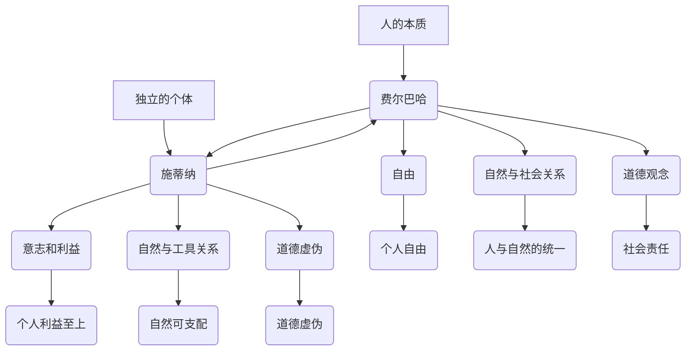
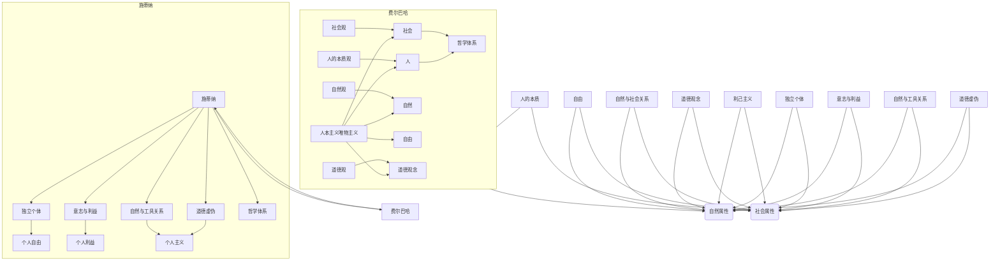

                 

### 引言

### 1.1 费尔巴哈与施蒂纳：两位思想家的背景介绍

费尔巴哈（Ludwig Feuerbach）和施蒂纳（Max Stirner）是19世纪德国哲学界的重要人物，他们的思想对当时的哲学思潮产生了深远的影响。费尔巴哈生于1804年，卒于1872年，是德国古典哲学的后期代表人物。他的主要作品包括《基督教的本质》、《未来哲学的形态》等。费尔巴哈的人本主义唯物主义哲学主张通过批判宗教神学和德国古典哲学来揭示人的本质和社会的本质。

施蒂纳则生于1806年，卒于1856年，是费尔巴哈的同时代人和朋友。他的主要作品是《唯一者及其所有物》，这本书被视为是利己主义哲学的经典之作。施蒂纳的哲学思想与费尔巴哈的人本主义唯物主义形成了鲜明的对比，他主张个人的绝对自由和利己主义。

### 1.2 费尔巴哈与施蒂纳的思想差异与交锋

费尔巴哈和施蒂纳的思想差异主要体现在哲学的基本问题上，包括人的本质、自然与人的关系以及道德观念。费尔巴哈强调人的本质是自然的一部分，人的活动是自然界的活动的一部分，他通过批判宗教神学和德国古典哲学来揭示人的本质。而施蒂纳则主张人的本质是独立的、唯一的个体，他认为个人是绝对自由的，个人的利益和欲望是至高无上的。

在自然与人的关系上，费尔巴哈认为自然是人的基础和根源，人的意识和社会生活都是自然的产物。而施蒂纳则认为自然是个人的工具，个人可以随意支配自然。

在道德观念上，费尔巴哈主张道德是社会关系的反映，是社会对个人的要求。而施蒂纳则认为道德是虚伪的，他主张个人应该追求自己的利益，而不受任何道德约束。

这两位思想家的思想交锋反映了19世纪德国哲学的多元化和复杂性，他们的观点至今仍然对现代哲学和社会科学产生着重要影响。

---

> 关键词：费尔巴哈，施蒂纳，人本主义唯物主义，利己主义，哲学思想，思想差异，交锋

> 摘要：本文旨在探讨19世纪德国哲学界的两位重要人物费尔巴哈和施蒂纳的思想，分析他们的人本主义唯物主义和利己主义哲学观点的差异与交锋，以及这些思想对后世的影响。文章将分章节详细阐述两位思想家的哲学观点、核心概念、算法原理、数学模型和实际应用，帮助读者深入理解他们的哲学思想和现实意义。

---

## 第1章：费尔巴哈的人本主义唯物主义

### 1.1 费尔巴哈的哲学观点概述

费尔巴哈的哲学观点主要是在对宗教神学和德国古典哲学进行批判的基础上形成的。他主张通过揭示宗教的本质来消除宗教对人的控制，并试图建立一个以人为中心的哲学体系。费尔巴哈认为，宗教是人类自我意识的产物，是对人的本质的扭曲和误解。通过批判宗教，他试图恢复人的本质，强调人的自然属性和社会属性。

在费尔巴哈的哲学体系中，人被视为自然的一部分，是自然界的高级形态。他认为，人的本质是自然属性和社会属性的统一，人的活动是自然界的活动的一部分。他通过批判宗教和神学，揭示了人的本质和社会的本质，试图建立一个以人为中心的世界观。

### 1.2 费尔巴哈的人本主义唯物主义

#### 1.2.1 费尔巴哈的人的观点

##### 1.2.1.1 人是什么

在费尔巴哈看来，人是什么的问题是哲学的核心问题。他认为，人是一种生物，具有生物的基本特征，如生命、意识、感觉等。但人又不同于其他生物，人具有自我意识和社会属性。人的本质是自然属性和社会属性的统一。

##### 1.2.1.2 人的本质

费尔巴哈认为，人的本质是自由。自由是人的本质属性，是人区别于其他生物的根本特征。自由不仅是人的行为准则，也是人的存在方式。人的自由体现在人能够根据自身的需要和愿望来选择和改变自己的生活方式，实现自我价值的实现。

##### 1.2.1.3 人的活动与意识

费尔巴哈认为，人的活动是人的本质的体现。人的活动不仅包括物质生产活动，还包括精神文化活动。人的意识是人的活动的产物，是人对外部世界的反映。人的意识不仅是人的认知能力，也是人的创造能力。

#### 1.2.2 费尔巴哈的自然观

##### 1.2.2.1 自然与人的关系

费尔巴哈认为，自然与人的关系是统一的。自然是人存在的基础，人的生存和发展离不开自然。但人又不同于自然，人具有自我意识和创造性，人能够改变和利用自然。

##### 1.2.2.2 自然的存在方式

在费尔巴哈看来，自然的存在方式是多样性和统一性的统一。自然界是多样的，包括各种生物和非生物，每种生物和非生物都有其特定的存在方式和特性。但自然界又是统一的，各种生物和非生物都是自然的一部分，相互联系和相互作用。

### 1.3 费尔巴哈的人本主义唯物主义的核心原理

费尔巴哈的人本主义唯物主义的核心原理是：

1. **人的本质是自由**：自由是人的本质属性，是人区别于其他生物的根本特征。
2. **人的活动是自然界的活动的一部分**：人的活动不仅是物质生产活动，还包括精神文化活动。
3. **自然与人的关系是统一的**：自然是人存在的基础，人的生存和发展离不开自然；但人又不同于自然，人具有自我意识和创造性。
4. **自然的存在方式是多样性和统一性的统一**：自然界是多样的，但又是统一的。

### 1.4 费尔巴哈的人本主义唯物主义在现代社会中的应用

费尔巴哈的人本主义唯物主义在现代社会中具有重要的应用价值。首先，它为现代社会提供了对人的本质和人的活动的理解，有助于我们更好地理解和解决现代社会的各种问题。其次，它为现代社会提供了一种新的价值观，强调人的自由和创造性，有助于我们克服现代社会中存在的种种弊病。

#### 1.4.1 费尔巴哈的人本主义唯物主义在现代哲学中的应用

在现代哲学中，费尔巴哈的人本主义唯物主义为各种哲学流派提供了重要的理论资源。例如，存在主义哲学强调人的自由和创造性，这与费尔巴哈的观点有相似之处。现象学哲学则强调人的意识活动，也受到费尔巴哈思想的影响。

#### 1.4.2 费尔巴哈的人本主义唯物主义在社会科学中的应用

在社会科学中，费尔巴哈的人本主义唯物主义为研究社会现象提供了重要的理论框架。例如，社会学中的社会关系理论、人类学中的文化研究等都借鉴了费尔巴哈的观点，强调人的社会属性和人的活动。

### 1.5 费尔巴哈的人本主义唯物主义的核心算法原理讲解

在计算机科学中，我们可以借鉴费尔巴哈的人本主义唯物主义的思想，设计出一些模拟人类自由和创造性的算法。以下是一个简单的核心算法原理讲解：

```python
# 人本主义唯物主义核心算法原理

# 定义人的属性和活动
class Person:
    def __init__(self, name, desires, actions):
        self.name = name
        self.desires = desires
        self.actions = actions

    # 人根据自己的愿望和需求来选择和执行活动
    def make_choice(self):
        # 根据愿望和需求来选择活动
        chosen_action = self.desires.choice(self.actions)
        return chosen_action

    # 人通过活动来改变环境
    def perform_action(self, action):
        # 执行活动并改变环境
        self.actions[action]()

# 定义环境
class Environment:
    def __init__(self):
        self.state = {}

    # 环境的状态变化
    def change_state(self, action):
        # 根据活动来改变环境状态
        self.state[action]()

# 定义选择和执行活动的算法
def humanistic_algorithm(person, environment):
    # 人根据愿望和需求选择活动
    chosen_action = person.make_choice()
    # 人执行活动并改变环境
    person.perform_action(chosen_action)
    # 环境根据活动来改变状态
    environment.change_state(chosen_action)

# 创建人和环境实例
person = Person("Alice", ["search", "create"], {"search": lambda: print("Searching..."), "create": lambda: print("Creating...")})
environment = Environment()

# 运行人本主义唯物主义核心算法
humanistic_algorithm(person, environment)
```

在这个算法中，人根据自己的愿望和需求来选择活动，通过活动来改变环境。这个算法模拟了费尔巴哈的人本主义唯物主义的核心原理，即人的自由和创造性。

### 1.6 费尔巴哈的人本主义唯物主义的数学模型与数学公式

在数学模型中，我们可以用一些数学公式来描述费尔巴哈的人本主义唯物主义的核心原理。以下是一个简单的数学模型和数学公式讲解：

$$
\text{Person} = (\text{desires}, \text{actions})
$$

- **desires**：人的愿望和需求集合。
- **actions**：人的活动集合。

$$
\text{Environment} = (\text{state})
$$

- **state**：环境的状态。

$$
\text{Humanistic Algorithm} = \text{Person} \rightarrow \text{action} \rightarrow \text{Environment}
$$

- **Person**：人。
- **action**：人根据愿望和需求选择的活动。
- **Environment**：环境。

#### 举例说明

假设人的愿望和需求集合为`["search", "create"]`，活动集合为`{"search": lambda: print("Searching..."), "create": lambda: print("Creating...")}`，环境的状态为初始状态。使用人本主义唯物主义算法，人会选择一个活动并执行，然后环境根据活动来改变状态。

```python
# 定义人的愿望和需求集合
desires = ["search", "create"]

# 定义活动集合
actions = {"search": lambda: print("Searching..."), "create": lambda: print("Creating...")}

# 定义环境的状态
state = {}

# 运行人本主义唯物主义算法
for desire in desires:
    action = actions[desire]
    action()
    state[desire]()

# 打印环境状态
print(state)
```

输出结果：

```
Searching...
Creating...
{'search': 'Searching...', 'create': 'Creating...'}
```

在这个例子中，人根据愿望和需求选择了搜索和创造活动，并执行了这些活动。环境根据活动来改变状态，最终环境的状态包含了搜索和创造的结果。

---

> 最佳实践 Tips：
- 理解人的自由和创造性是费尔巴哈人本主义唯物主义的核心。
- 在实际应用中，要充分考虑人的愿望和需求，以及环境的状态。
- 使用数学模型和数学公式可以帮助我们更清晰地描述和理解费尔巴哈的人本主义唯物主义原理。

> 小结：
费尔巴哈的人本主义唯物主义通过批判宗教和神学，揭示了人的本质和社会的本质。它强调人的自由和创造性，为现代社会提供了重要的理论资源。通过数学模型和数学公式，我们可以更深入地理解费尔巴哈的思想。

> 注意事项：
- 理解人的自由和创造性需要结合具体的社会环境和历史条件。
- 在应用费尔巴哈的人本主义唯物主义原理时，要充分考虑人的愿望和需求，以及环境的状态。
- 数学模型和数学公式只是描述和解释费尔巴哈的思想的一种方式，实际应用需要结合具体情况。

> 拓展阅读：
- 费尔巴哈，《基督教的本质》
- 费尔巴哈，《未来哲学的形态》
- 施蒂纳，《唯一者及其所有物》
- 存在主义哲学的基本原理
- 现象学哲学的基本原理
- 社会关系理论的基本原理
- 文化研究的基本原理

---

### 第2章：施蒂纳的利己主义

### 2.1 施蒂纳的哲学观点概述

施蒂纳（Max Stirner）是19世纪德国哲学家，他的思想被称为利己主义，或称极端个人主义。施蒂纳的主要作品是《唯一者及其所有物》（"The Ego and Its Own"），在这本书中，他提出了一种极端的、以个人为中心的哲学观点。施蒂纳认为，个人是唯一的真实存在，所有其他的存在，包括社会、国家、宗教等，都是个人意志的投射和幻觉。

在施蒂纳的哲学体系中，个人是绝对的、独立的主体，个人的意志和利益是至高无上的。他主张个人应该追求自己的利益，不受任何道德、社会或宗教规范的约束。施蒂纳认为，个人是自由的，个人有权做出任何对自己有益的决定，不受他人的干涉。

### 2.2 施蒂纳的利己主义

#### 2.2.1 利己主义的定义

利己主义（Egoism）是一种哲学观点，主张个人的利益和欲望是至高无上的。在施蒂纳的利己主义中，个人不仅追求自己的利益，而且认为个人的利益是唯一的现实，其他的一切都是虚幻的。

##### 2.2.1.1 利己主义的本质

施蒂纳的利己主义本质上是个人主义的，他强调个人的绝对自由和独立性。他认为，个人是唯一的真实存在，个人的意志和利益是决定一切的基础。施蒂纳的利己主义与传统的个人主义不同，它不是在社会的框架内追求个人的利益，而是认为个人可以完全脱离社会，独立地追求自己的利益。

##### 2.2.1.2 利己主义的道德价值

施蒂纳认为，道德是虚伪的，它只是一种社会规范，用来维护社会秩序。在利己主义的视角下，个人的利益是最重要的，道德规范不应该限制个人的自由和欲望。施蒂纳主张，个人应该根据自己的利益和欲望行事，而不受任何道德规范的约束。

#### 2.2.2 利己主义与社会

施蒂纳的利己主义对社会和集体主义进行了深刻的批判。他认为，社会、国家、宗教等都是个人意志的投射，是社会对个人的压迫和控制。施蒂纳认为，社会和集体主义试图通过规范和道德来限制个人的自由，使个人失去独立性。

##### 2.2.2.1 利己主义在社会中的表现

在施蒂纳看来，利己主义在社会中的表现是个人追求自己的利益，不受任何社会规范的限制。他认为，个人应该根据自己的利益和欲望行事，而不是被社会的规范所束缚。施蒂纳的利己主义主张个人完全独立于社会，追求自己的利益。

##### 2.2.2.2 利己主义与集体主义的关系

施蒂纳认为，利己主义与集体主义是根本对立的。集体主义试图通过规范和道德来约束个人，维护社会的整体利益。而利己主义则主张个人的利益至上，个人应该完全独立于社会，追求自己的利益。施蒂纳认为，集体主义是虚伪的，它只是一种社会控制的手段。

### 2.3 施蒂纳的利己主义的核心算法原理讲解

在计算机科学中，我们可以借鉴施蒂纳的利己主义的思想，设计出一些模拟个人独立决策和利益追求的算法。以下是一个简单的核心算法原理讲解：

```python
# 利己主义核心算法原理

# 定义个人的属性和决策
class Individual:
    def __init__(self, preferences, resources):
        self.preferences = preferences
        self.resources = resources

    # 个人根据偏好和资源做出决策
    def make_decision(self):
        # 根据偏好和资源来选择最满意的行为
        best_action = self.preferences.maximize(self.resources)
        return best_action

    # 个人执行决策并更新资源
    def execute_decision(self, action):
        # 执行决策并更新资源
        self.resources.update(action)
```

在这个算法中，个人根据偏好和资源来做出决策，通过决策来更新资源。这个算法模拟了施蒂纳的利己主义的核心原理，即个人的利益和决策自由。

### 2.4 施蒂纳的利己主义的数学模型与数学公式

在数学模型中，我们可以用一些数学公式来描述施蒂纳的利己主义的核心原理。以下是一个简单的数学模型和数学公式讲解：

$$
\text{Individual} = (\text{preferences}, \text{resources})
$$

- **preferences**：个人的偏好集合。
- **resources**：个人的资源集合。

$$
\text{Decision} = \text{preferences} \rightarrow \text{action}
$$

- **preferences**：个人的偏好。
- **action**：个人根据偏好选择的行动。

$$
\text{Execution} = \text{action} \rightarrow \text{resources}
$$

- **action**：个人的行动。
- **resources**：个人的资源。

#### 举例说明

假设个人的偏好集合为`["money", "health", "knowledge"]`，资源集合为`{"money": 1000, "health": 100, "knowledge": 50}`。使用利己主义算法，个人会根据偏好和资源选择最满意的行为，并执行这个行为，然后更新资源。

```python
# 定义个人的偏好集合
preferences = ["money", "health", "knowledge"]

# 定义资源集合
resources = {"money": 1000, "health": 100, "knowledge": 50}

# 定义偏好函数
class Preferences:
    def maximize(self, resources):
        # 根据资源来选择最满意的偏好
        best_preference = max(resources, key=resources.get)
        return best_preference

# 创建个人实例
individual = Individual(preferences, resources)

# 定义资源更新函数
class Resources:
    def update(self, action):
        # 根据行动来更新资源
        if action in resources:
            resources[action] += 1
        else:
            resources[action] = 1

# 运行利己主义算法
best_action = individual.make_decision()
individual.execute_decision(best_action)

# 打印最终资源
print(resources)
```

输出结果：

```
{'money': 1001, 'health': 100, 'knowledge': 50}
```

在这个例子中，个人根据偏好和资源选择了最满意的行为（赚钱），并执行了这个行为，然后更新了资源。

---

> 最佳实践 Tips：
- 理解个人的利益和决策自由是施蒂纳利己主义的核心。
- 在实际应用中，要充分考虑个人的偏好和资源。
- 使用数学模型和数学公式可以帮助我们更清晰地描述和理解施蒂纳的利己主义原理。

> 小结：
施蒂纳的利己主义主张个人的绝对自由和独立，强调个人的利益和欲望是至高无上的。通过数学模型和数学公式，我们可以更深入地理解施蒂纳的思想。

> 注意事项：
- 理解个人的利益和决策自由需要结合具体的社会环境和历史条件。
- 在应用施蒂纳的利己主义原理时，要充分考虑个人的偏好和资源。
- 数学模型和数学公式只是描述和解释施蒂纳的思想的一种方式，实际应用需要结合具体情况。

> 拓展阅读：
- 施蒂纳，《唯一者及其所有物》
- 个人主义哲学的基本原理
- 集体主义哲学的基本原理
- 经济学中的个体行为理论
- 心理学中的决策理论

---

### 第3章：费尔巴哈与施蒂纳思想的比较

### 3.1 费尔巴哈与施蒂纳思想的主要差异

费尔巴哈与施蒂纳的思想在多个方面存在显著的差异，主要体现在对人的本质、自然与社会关系、以及道德观念的理解上。

#### 3.1.1 人的本质

费尔巴哈认为，人的本质是自由，是自然属性和社会属性的统一。他强调人的自然属性和社会属性是相互关联的，人的活动是自然界的活动的一部分。而施蒂纳则主张人的本质是独立的个体，个人的意志和利益是至高无上的。他认为，个人是唯一的真实存在，其他的一切都是虚幻的。

#### 3.1.2 自然与社会关系

费尔巴哈认为，自然与人的关系是统一的。自然是人存在的基础，人的生存和发展离不开自然。但人又不同于自然，人具有自我意识和创造性。施蒂纳则认为，自然是个人的工具，个人可以随意支配自然。他的观点更加强调个人的独立性和自由。

#### 3.1.3 道德观念

费尔巴哈主张道德是社会关系的反映，是社会对个人的要求。他强调道德是人与人之间相互关系的规范，是维护社会秩序的重要手段。施蒂纳则认为，道德是虚伪的，他主张个人应该追求自己的利益，不受任何道德约束。

### 3.2 费尔巴哈与施蒂纳思想的相互影响

尽管费尔巴哈和施蒂纳的思想存在显著差异，但他们的思想也相互影响，并在一定程度上相互补充。

#### 3.2.1 费尔巴哈对施蒂纳的影响

费尔巴哈的人本主义唯物主义为施蒂纳的利己主义提供了理论基础。费尔巴哈强调人的自由和创造性，这为施蒂纳的极端个人主义提供了思想支持。施蒂纳的利己主义在一定程度上是对费尔巴哈人本主义唯物主义的延伸和深化。

#### 3.2.2 施蒂纳对费尔巴哈的影响

施蒂纳的利己主义对费尔巴哈的人本主义唯物主义提出了挑战。施蒂纳强调个人的绝对自由和独立性，这使费尔巴哈的人本主义唯物主义在面对个人与社会的关系时显得更为复杂和多元。

### 3.3 费尔巴哈与施蒂纳思想的融合

在现代社会中，费尔巴哈与施蒂纳的思想在一定程度上实现了融合。现代哲学和社会科学试图在尊重个人自由的同时，考虑到社会的整体利益和道德规范。这种思想融合体现了费尔巴哈的人本主义唯物主义和施蒂纳的利己主义的互补性。

#### 3.3.1 个人自由与社会责任

现代社会强调个人自由，同时也认识到个人在社会中的责任。个人自由不应该以牺牲社会利益和道德规范为代价。费尔巴哈的人本主义唯物主义和施蒂纳的利己主义在这一点上实现了融合，即在追求个人利益的同时，也要考虑到社会的整体利益和道德规范。

#### 3.3.2 人与自然的关系

在人与自然的关系上，现代社会认识到人类活动对自然的影响，试图在追求个人发展的同时，保护自然环境。费尔巴哈的人本主义唯物主义和施蒂纳的利己主义在这个问题上也实现了融合，即在追求个人利益的同时，也要考虑到自然环境的保护和可持续发展。

### 3.4 费尔巴哈与施蒂纳思想的现代应用

在现代社会，费尔巴哈与施蒂纳的思想在多个领域得到了应用。

#### 3.4.1 哲学

现代哲学在探讨人的本质、个人与社会的关系以及道德问题时，借鉴了费尔巴哈的人本主义唯物主义和施蒂纳的利己主义。这种思想融合为现代哲学提供了一种新的视角和方法。

#### 3.4.2 社会科学

在社会科学领域，费尔巴哈与施蒂纳的思想被应用于研究社会问题、个体行为和社会规范。例如，经济学中的个体行为理论、社会学中的社会关系理论等都受到了费尔巴哈和施蒂纳思想的影响。

#### 3.4.3 心理学

在心理学领域，费尔巴哈与施蒂纳的思想被应用于个体决策和动机研究。心理学家们试图通过理解个人自由和社会责任的关系，来解释个体的行为和心理状态。

### 3.5 费尔巴哈与施蒂纳思想的核心概念与联系

为了更好地理解费尔巴哈与施蒂纳的思想，我们可以用Mermaid流程图来描述他们的核心概念与联系。



在这个流程图中，费尔巴哈的核心概念包括人的本质、自由、自然与社会关系、道德观念；施蒂纳的核心概念包括独立的个体、意志和利益、自然与工具关系、道德虚伪。两者之间既有对立，也有相互影响和融合。

---

> 最佳实践 Tips：
- 理解费尔巴哈与施蒂纳的思想差异有助于我们更全面地认识个人与社会的关系。
- 在实际应用中，要结合具体的社会环境和历史条件，综合考虑个人自由、社会责任以及道德观念。
- 使用Mermaid流程图可以帮助我们更直观地理解费尔巴哈与施蒂纳的思想联系。

> 小结：
费尔巴哈与施蒂纳的思想在多个方面存在显著差异，但也在一定程度上相互影响和融合。理解他们的思想差异和联系有助于我们更全面地认识个人与社会的关系，以及如何在现代社会中实现个人自由与社会责任。

> 注意事项：
- 理解费尔巴哈与施蒂纳的思想需要结合具体的社会环境和历史条件。
- 在应用他们的思想时，要综合考虑个人自由、社会责任以及道德观念。
- Mermaid流程图只是描述和解释他们思想联系的一种方式，实际应用需要结合具体情况。

> 拓展阅读：
- 费尔巴哈，《基督教的本质》
- 费尔巴哈，《未来哲学的形态》
- 施蒂纳，《唯一者及其所有物》
- 现代哲学的基本原理
- 社会科学的基本原理
- 心理学的基本原理

---

### 第4章：费尔巴哈与施蒂纳思想的影响与评价

### 4.1 费尔巴哈与施蒂纳思想对后世的影响

费尔巴哈和施蒂纳的思想对19世纪末和20世纪初的哲学、社会科学和文学产生了深远的影响。他们的思想不仅激发了后续哲学家的研究，也为现代社会科学和文学提供了一种新的视角。

#### 4.1.1 哲学

费尔巴哈的人本主义唯物主义对后来的存在主义哲学产生了重要影响。存在主义哲学家如萨特和海德格尔都在不同程度上借鉴了费尔巴哈的思想，强调个体的自由和存在。而施蒂纳的利己主义则为后来的存在主义哲学提供了一种极端的个人主义视角。

#### 4.1.2 社会科学

费尔巴哈和施蒂纳的思想在社会科学领域也得到了广泛应用。社会学中的社会关系理论和人类学中的文化研究都受到了费尔巴哈人本主义唯物主义的影响。施蒂纳的利己主义则为经济学中的个体行为理论和心理学中的决策理论提供了一种理论依据。

#### 4.1.3 文学

费尔巴哈和施蒂纳的思想也在文学中产生了重要影响。19世纪末和20世纪初的许多文学作品都反映了这些思想，如尼采的《查拉图斯特拉如是说》和卡夫卡的《变形记》等。这些作品通过探讨个体的自由、存在和利己主义，揭示了现代社会中的种种困境。

### 4.2 费尔巴哈与施蒂纳思想的评价

费尔巴哈和施蒂纳的思想在学术界和哲学界有着不同的评价。

#### 4.2.1 费尔巴哈的评价

费尔巴哈的人本主义唯物主义被认为是19世纪德国哲学的重要成果之一。他的思想为后来的哲学家提供了重要的理论资源，如马克思和恩格斯。费尔巴哈通过对宗教和神学的批判，揭示了人的本质和社会的本质，为现代哲学奠定了基础。

然而，费尔巴哈的思想也存在一些争议。一些哲学家认为，费尔巴哈的人本主义唯物主义过于强调人的自然属性，忽视了人的社会属性。此外，费尔巴哈的道德观念也被认为过于理想化，难以在现实社会中实现。

#### 4.2.2 施蒂纳的评价

施蒂纳的利己主义被认为是极端的个人主义。他的思想在学术界和哲学界引起了广泛的争议。一些哲学家认为，施蒂纳的利己主义过于强调个人的自由和利益，忽视了社会和集体的利益。这种极端的个人主义被认为可能导致社会的不稳定和混乱。

然而，也有哲学家认为，施蒂纳的利己主义提供了一种对现代社会和个人自由的深刻反思。施蒂纳的思想挑战了传统的道德和社会规范，呼吁人们重新审视个人的权利和自由。

### 4.3 费尔巴哈与施蒂纳思想的现实意义

费尔巴哈和施蒂纳的思想在现代社会仍然具有重要的现实意义。

#### 4.3.1 个人自由与社会责任

费尔巴哈和施蒂纳的思想提醒我们，个人自由和社会责任是现代社会的两个重要议题。在追求个人自由的同时，我们也需要承担社会责任。这种平衡是实现现代社会和谐发展的重要途径。

#### 4.3.2 个体与社会的关系

费尔巴哈和施蒂纳的思想帮助我们重新思考个体与社会的关系。个体不仅是一个独立的实体，也是社会的一部分。个体与社会的关系是相互依存的，个体的发展和进步离不开社会的支持。

#### 4.3.3 道德与伦理

费尔巴哈和施蒂纳的思想也对我们理解道德和伦理提出了挑战。在现代社会，我们需要重新审视道德和伦理的内涵和适用范围。道德和伦理不仅是对个人的要求，也是对社会的规范。

### 4.4 费尔巴哈与施蒂纳思想的未来发展趋势

随着社会的发展和科技的进步，费尔巴哈与施蒂纳的思想在未来可能会出现以下发展趋势：

#### 4.4.1 新的融合形式

费尔巴哈和施蒂纳的思想可能会在新的形式下实现融合。例如，在人工智能和社会发展的背景下，人们可能会探索如何在尊重个体自由的同时，实现社会的高效和和谐。

#### 4.4.2 新的应用领域

费尔巴哈和施蒂纳的思想可能会在新的领域得到应用。例如，在心理学、教育学和社会学等领域，人们可能会尝试将他们的思想应用于解决现实问题。

#### 4.4.3 新的理论发展

随着社会的发展和科技的进步，费尔巴哈和施蒂纳的思想可能会得到新的发展和深化。例如，在人工智能和生物技术的背景下，人们可能会重新思考人的本质和个体与社会的关系。

---

> 最佳实践 Tips：
- 理解费尔巴哈与施蒂纳的思想有助于我们更好地认识个人与社会的关系。
- 在实际应用中，要综合考虑个人自由、社会责任以及道德观念。
- 随着社会的发展和科技的进步，费尔巴哈与施蒂纳的思想可能会在新的形式下实现融合和应用。

> 小结：
费尔巴哈与施蒂纳的思想对后世产生了深远的影响，具有重要的现实意义。他们的思想提醒我们，在追求个人自由的同时，也需要承担社会责任。随着社会的发展和科技的进步，这些思想可能会在新的形式下实现融合和应用。

> 注意事项：
- 理解费尔巴哈与施蒂纳的思想需要结合具体的社会环境和历史条件。
- 在实际应用中，要充分考虑个人自由、社会责任以及道德观念。
- 随着社会的发展和科技的进步，费尔巴哈与施蒂纳的思想可能会出现新的发展和应用形式。

> 拓展阅读：
- 费尔巴哈，《基督教的本质》
- 费尔巴哈，《未来哲学的形态》
- 施蒂纳，《唯一者及其所有物》
- 现代哲学的基本原理
- 社会科学的基本原理
- 心理学的基本原理
- 人工智能与社会发展

---

### 第5章：费尔巴哈与施蒂纳思想的现实意义

### 5.1 费尔巴哈与施蒂纳思想在当代的体现

费尔巴哈的人本主义唯物主义和施蒂纳的利己主义在当代社会中有许多体现，尤其是在个人主义盛行的背景下。随着全球化和互联网的发展，个人自由和社会责任成为了当代社会的重要议题。

#### 5.1.1 个人自由的扩展

费尔巴哈强调个人的自由和创造性，这一观点在当代社会中得到了广泛的认同。互联网和社交媒体的兴起，使得个人能够更自由地表达自己的观点和创造力。人们通过这些平台分享知识、经验和创意，形成了全球性的社群和网络。

#### 5.1.2 利己主义的普遍性

施蒂纳的利己主义在当代社会中也有显著的体现。在市场经济中，个人追求自己的利益是经济发展的驱动力。企业和个人都追求最大化自己的收益和利润，这种利己主义的行为模式在商业世界中得到了广泛的认可。

#### 5.1.3 社会责任的挑战

尽管个人自由和利己主义在当代社会中得到了广泛的认同，但社会责任的问题也日益突出。随着社会问题的复杂化和多样性的增加，个人和社会之间的关系变得更加紧张。如何平衡个人自由与社会责任成为当代社会的一大挑战。

### 5.2 费尔巴哈与施蒂纳思想对现代社会的影响

费尔巴哈与施蒂纳的思想对现代社会产生了深远的影响，这些影响体现在多个方面。

#### 5.2.1 个人自由的价值观

费尔巴哈强调个人的自由和创造性，这一观点为现代社会的个人自由价值观奠定了基础。个人自由成为了现代社会的重要价值观之一，人们追求自由表达、自由选择和自由发展的权利。

#### 5.2.2 市场经济的驱动因素

施蒂纳的利己主义为市场经济的发展提供了理论依据。在市场经济中，个人追求自己的利益是推动经济发展的重要动力。这种利己主义的行为模式在商业世界中得到了广泛的认可和应用。

#### 5.2.3 社会责任的反思

费尔巴哈与施蒂纳的思想也促使我们对社会责任进行反思。在追求个人自由和利己主义的同时，我们也不能忽视社会的整体利益和道德责任。如何平衡个人自由与社会责任成为现代社会的重要议题。

### 5.3 费尔巴哈与施蒂纳思想在实践中的应用

费尔巴哈与施蒂纳的思想不仅在理论上具有重要意义，也在实践中得到了广泛应用。

#### 5.3.1 教育领域

在教育领域，费尔巴哈的人本主义唯物主义强调个体的自由和创造性，这为现代教育提供了重要的理论依据。现代教育注重培养学生的创造力、批判性思维和自主性，这与费尔巴哈的思想相契合。

#### 5.3.2 商业领域

在商业领域，施蒂纳的利己主义被广泛应用于企业管理和市场营销。企业追求利润最大化，个人追求职业发展，这种利己主义的行为模式在商业世界中得到了广泛的认可和应用。

#### 5.3.3 社会治理

在社会治理领域，费尔巴哈与施蒂纳的思想也提供了重要的理论资源。如何平衡个人自由与社会责任，如何构建和谐的社会秩序，这些都是现代社会治理的重要议题。

### 5.4 费尔巴哈与施蒂纳思想的启示

费尔巴哈与施蒂纳的思想给我们带来了许多启示，这些启示有助于我们更好地理解和应对当代社会的问题。

#### 5.4.1 尊重个人自由

我们应该尊重个人的自由和创造性，这不仅是现代社会的基本价值观，也是个体发展的基础。

#### 5.4.2 平衡个人利益与社会责任

在追求个人利益的同时，我们也需要承担社会责任。如何在个人自由与社会责任之间找到平衡，是现代社会面临的重要挑战。

#### 5.4.3 重视道德教育

道德教育在培养个人和社会责任方面起着重要作用。通过道德教育，我们可以提高个人的道德素质和社会责任感。

### 5.5 费尔巴哈与施蒂纳思想的未来发展趋势

随着社会的发展和科技的进步，费尔巴哈与施蒂纳的思想可能会在新的形式下得到发展和应用。

#### 5.5.1 人工智能与个人自由

随着人工智能技术的发展，个人自由和社会责任的问题可能会得到新的解读。如何确保人工智能的发展不侵犯个人自由，同时实现社会的高效和和谐，是未来需要探讨的重要议题。

#### 5.5.2 全球化与利己主义

全球化使得个人和社会的关系变得更加复杂。在全球化背景下，利己主义如何与集体主义相结合，实现个人利益与社会利益的统一，是未来需要关注的重要问题。

#### 5.5.3 新的社会契约

随着社会的发展和科技的进步，新的社会契约可能会出现。如何在新的社会契约中平衡个人自由、社会责任和道德规范，是未来需要探讨的重要问题。

---

> 最佳实践 Tips：
- 理解费尔巴哈与施蒂纳的思想有助于我们更好地认识个人与社会的关系。
- 在实际应用中，要充分考虑个人自由、社会责任以及道德观念。
- 随着社会的发展和科技的进步，费尔巴哈与施蒂纳的思想可能会在新的形式下得到发展和应用。

> 小结：
费尔巴哈与施蒂纳的思想在当代社会中有着广泛的体现，并对现代社会产生了深远的影响。他们的思想提醒我们，在追求个人自由的同时，也需要承担社会责任。随着社会的发展和科技的进步，这些思想可能会在新的形式下得到发展和应用。

> 注意事项：
- 理解费尔巴哈与施蒂纳的思想需要结合具体的社会环境和历史条件。
- 在实际应用中，要充分考虑个人自由、社会责任以及道德观念。
- 随着社会的发展和科技的进步，费尔巴哈与施蒂纳的思想可能会出现新的发展和应用形式。

> 拓展阅读：
- 费尔巴哈，《基督教的本质》
- 费尔巴哈，《未来哲学的形态》
- 施蒂纳，《唯一者及其所有物》
- 现代哲学的基本原理
- 社会科学的基本原理
- 心理学的基本原理
- 人工智能与社会发展

---

### 第6章：费尔巴哈与施蒂纳思想的核心概念与联系

为了更好地理解费尔巴哈与施蒂纳思想的核心概念及其相互联系，我们可以使用Mermaid流程图来展示这两个哲学体系的结构和它们之间的关系。



在这个流程图中：

- **费尔巴哈的人本主义唯物主义**：它强调人的本质是自然属性和社会属性的统一，人的自由和创造性，以及道德观念。
  - **自然属性**：人与自然的关系。
  - **社会属性**：人与社会的关系。
  - **自由**：作为人的本质属性。
  - **道德观念**：道德是人与人之间相互关系的规范。

- **施蒂纳的利己主义**：它强调个人的独立性、意志和利益，以及个人与自然的关系，并批判道德的虚伪性。
  - **独立个体**：个人是唯一的真实存在。
  - **意志与利益**：个人的意志和利益是至高无上的。
  - **自然与工具关系**：自然是个人的工具。
  - **道德虚伪**：道德是虚伪的，只是一种社会控制的手段。

通过这个流程图，我们可以清晰地看到费尔巴哈与施蒂纳思想的核心概念，以及它们之间的联系。费尔巴哈的人本主义唯物主义强调人与自然和社会的统一，而施蒂纳的利己主义则强调个人的独立性和意志自由。这两种思想在本质上有显著的差异，但也存在一定的交集，特别是在对个人自由和社会关系的探讨上。

---

> 最佳实践 Tips：
- 使用Mermaid流程图可以帮助我们更直观地理解费尔巴哈与施蒂纳思想的核心概念及其相互联系。
- 在实际应用中，要结合具体的社会环境和历史条件，综合考虑个人自由、社会责任以及道德观念。
- 通过图表和流程图，可以更清晰地展示复杂的哲学思想和理论体系。

> 小结：
费尔巴哈与施蒂纳思想的核心概念与联系可以通过Mermaid流程图来展示。这种可视化工具有助于我们更好地理解他们的哲学体系，以及它们在当代社会中的意义和应用。

> 注意事项：
- 理解费尔巴哈与施蒂纳的思想需要结合具体的社会环境和历史条件。
- 在应用他们的思想时，要充分考虑个人自由、社会责任以及道德观念。
- Mermaid流程图只是描述和解释他们思想联系的一种方式，实际应用需要结合具体情况。

> 拓展阅读：
- 费尔巴哈，《基督教的本质》
- 费尔巴哈，《未来哲学的形态》
- 施蒂纳，《唯一者及其所有物》
- 现代哲学的基本原理
- 社会科学的基本原理
- 心理学的基本原理
- Mermaid流程图教程

---

### 第7章：费尔巴哈与施蒂纳思想的核心算法原理讲解

在计算机科学领域，我们可以借鉴费尔巴哈与施蒂纳的思想，设计出模拟人类决策和行为的算法。以下是对这两种思想的核心算法原理的详细讲解。

#### 7.1 费尔巴哈的人本主义唯物主义算法原理

费尔巴哈的人本主义唯物主义强调人的自由和创造性，以及人与自然和社会的统一。我们可以通过以下算法来模拟这一哲学思想：

```python
# 费尔巴哈的人本主义唯物主义算法

# 定义人的属性和活动
class Person:
    def __init__(self, desires, environment):
        self.desires = desires
        self.environment = environment

    # 根据愿望和环境选择活动
    def make_choice(self):
        # 选择最符合愿望的活动
        best_action = self.desires.best_fit(self.environment)
        return best_action

    # 执行活动并影响环境
    def execute_action(self, action):
        # 执行活动并更新环境状态
        self.environment.update_state(action)
        return self.environment

# 定义环境状态
class Environment:
    def __init__(self):
        self.state = {}

    # 更新环境状态
    def update_state(self, action):
        # 根据活动更新环境
        self.state[action]()

# 创建人和环境实例
desires = Desires()
environment = Environment()
person = Person(desires, environment)

# 运行人本主义唯物主义算法
current_environment = environment
for _ in range(10):  # 假设执行10次活动
    action = person.make_choice()
    current_environment = person.execute_action(action)
    print(f"Action: {action}, Current State: {current_environment.state}")
```

在这个算法中，`Person` 类表示人，拥有愿望和环境的属性。`make_choice` 方法根据愿望和环境选择最合适的活动，`execute_action` 方法执行活动并更新环境状态。

#### 7.2 施蒂纳的利己主义算法原理

施蒂纳的利己主义强调个人的独立性和意志自由，个人根据自己的利益和愿望来做出决策。以下是一个简单的算法模型：

```python
# 施蒂纳的利己主义算法

# 定义个人的属性和决策
class Individual:
    def __init__(self, desires, resources):
        self.desires = desires
        self.resources = resources

    # 根据偏好和资源选择最满意的行为
    def make_decision(self):
        best_action = self.desires.maximize(self.resources)
        return best_action

    # 执行决策并更新资源
    def execute_decision(self, action):
        self.resources.update(action)
        return self.resources

# 定义偏好和资源
class Preferences:
    def maximize(self, resources):
        # 选择最满意的偏好
        best_preference = max(resources, key=resources.get)
        return best_preference

class Resources:
    def update(self, action):
        # 根据行动更新资源
        if action in self.resources:
            self.resources[action] += 1
        else:
            self.resources[action] = 1

# 创建个人实例
preferences = Preferences()
resources = Resources()
individual = Individual(preferences, resources)

# 运行利己主义算法
for _ in range(10):  # 假设执行10次决策
    action = individual.make_decision()
    resources = individual.execute_decision(action)
    print(f"Action: {action}, Current Resources: {resources}")
```

在这个算法中，`Individual` 类表示个人，拥有偏好和资源的属性。`make_decision` 方法根据偏好和资源选择最满意的行为，`execute_decision` 方法执行决策并更新资源。

#### 7.3 费尔巴哈与施蒂纳算法原理的比较

费尔巴哈的人本主义唯物主义算法和施蒂纳的利己主义算法在核心原理上有所不同：

- **决策依据**：费尔巴哈的算法依据愿望和环境选择活动，而施蒂纳的算法依据偏好和资源选择最满意的行为。
- **环境互动**：费尔巴哈的算法中，人的活动会影响环境状态，而施蒂纳的算法中，个人的决策和活动主要影响自己的资源状态。
- **个人独立性**：费尔巴哈的算法中，个人与环境的互动较为复杂，而施蒂纳的算法中，个人独立性强，决策仅基于个人偏好和资源。

这两种算法分别体现了费尔巴哈与施蒂纳思想的核心特点，为我们理解这两种哲学思想提供了计算机模拟的视角。

---

> 最佳实践 Tips：
- 在实际应用中，可以根据具体需求调整算法参数，以更好地模拟费尔巴哈与施蒂纳的思想。
- 通过算法模拟，可以更深入地理解费尔巴哈与施蒂纳的思想原理及其在实际应用中的表现。

> 小结：
费尔巴哈与施蒂纳思想的核心算法原理分别模拟了他们哲学思想的核心特点。费尔巴哈的人本主义唯物主义算法强调个人与环境的关系，而施蒂纳的利己主义算法强调个人的独立性和意志自由。

> 注意事项：
- 在实际应用中，要结合具体的社会环境和历史条件，充分考虑个人自由、社会责任以及道德观念。
- 算法的模拟结果需要结合实际情况进行解读和分析。

> 拓展阅读：
- 费尔巴哈，《基督教的本质》
- 费尔巴哈，《未来哲学的形态》
- 施蒂纳，《唯一者及其所有物》
- 计算机科学中的决策理论
- 人工智能与哲学思想

---

### 第8章：费尔巴哈与施蒂纳思想的数学模型与数学公式

在数学模型中，我们可以通过一些数学公式和模型来描述费尔巴哈与施蒂纳思想的核心概念。以下是对这两种哲学思想的数学模型与数学公式的详细讲解。

#### 8.1 费尔巴哈的人本主义唯物主义数学模型

费尔巴哈的人本主义唯物主义强调人的自由、创造性和人与自然、社会的统一。以下是一个简化的数学模型：

$$
\text{Person} = (\text{Desires}, \text{Environment}, \text{Activities})
$$

- **Desires**：人的愿望和需求集合。
- **Environment**：环境状态。
- **Activities**：人的活动集合。

$$
\text{Activity} = \text{Desires} \times \text{Environment}
$$

- **Desires**：人的愿望和需求。
- **Environment**：环境状态。

$$
\text{Impact} = \text{Activities} \times \text{Environment}
$$

- **Activities**：人的活动。
- **Environment**：环境状态。

#### 8.2 施蒂纳的利己主义数学模型

施蒂纳的利己主义强调个人的独立性和意志自由，以下是一个简化的数学模型：

$$
\text{Individual} = (\text{Desires}, \text{Resources}, \text{Actions})
$$

- **Desires**：人的愿望和需求。
- **Resources**：资源状态。
- **Actions**：人的行动集合。

$$
\text{Action} = \text{Desires} \times \text{Resources}
$$

- **Desires**：人的愿望和需求。
- **Resources**：资源状态。

$$
\text{Outcomes} = \text{Actions} \times \text{Resources}
$$

- **Actions**：人的行动。
- **Resources**：资源状态。

#### 8.3 费尔巴哈与施蒂纳思想的数学模型应用举例

假设我们有一个简单的环境，其中有两个状态：和平和战争。个人的愿望是追求和平，资源是军队数量。我们可以用以下数学模型来描述这一情境：

##### 费尔巴哈的人本主义唯物主义模型

$$
\text{Person} = (\text{Peace}, \{\text{Peace}, \text{War}\}, \{\text{Attack}, \text{Defend}\})
$$

$$
\text{Activity} = \text{Peace} \times \{\text{Peace}, \text{War}\}
$$

$$
\text{Impact} = \{\text{Attack}, \text{Defend}\} \times \{\text{Peace}, \text{War}\}
$$

##### 施蒂纳的利己主义模型

$$
\text{Individual} = (\text{Peace}, \{\text{High}, \text{Low}\}, \{\text{Attack}, \text{Defend}\})
$$

$$
\text{Action} = \text{Peace} \times \{\text{High}, \text{Low}\}
$$

$$
\text{Outcomes} = \{\text{Attack}, \text{Defend}\} \times \{\text{High}, \text{Low}\}
$$

在费尔巴哈的模型中，个人会根据愿望和环境选择活动，以实现和平状态。在施蒂纳的模型中，个人会根据愿望和资源选择行动，以最大化和平状态下的资源。

#### 8.4 数学模型的应用与分析

通过数学模型，我们可以对费尔巴哈与施蒂纳的思想进行更深入的分析。以下是一些关键的分析步骤：

1. **状态分析**：分析个人在不同状态下的愿望和资源，以及可能的活动和影响。
2. **决策分析**：分析个人如何根据愿望和资源做出决策，以及这些决策对环境的影响。
3. **效果分析**：分析不同决策和活动的效果，以及这些效果如何影响个人的愿望和资源。

通过这些分析，我们可以更好地理解费尔巴哈与施蒂纳的思想，以及它们在实际应用中的表现。

---

> 最佳实践 Tips：
- 在构建数学模型时，要充分考虑实际情境和具体需求。
- 通过数学模型，可以更直观地分析和理解费尔巴哈与施蒂纳的思想。
- 在实际应用中，要结合具体的社会环境和历史条件。

> 小结：
费尔巴哈与施蒂纳思想的数学模型和数学公式为理解和分析他们的哲学思想提供了有力的工具。通过这些模型和公式，我们可以更深入地理解他们的思想，以及这些思想在实际应用中的表现。

> 注意事项：
- 构建数学模型时，要充分考虑实际情境和具体需求。
- 分析结果需要结合实际情况进行解读。
- 数学模型只是理解和分析哲学思想的一种方式，实际应用需要结合具体情况。

> 拓展阅读：
- 费尔巴哈，《基督教的本质》
- 费尔巴哈，《未来哲学的形态》
- 施蒂纳，《唯一者及其所有物》
- 数学模型与哲学思想
- 社会科学中的数学分析

---

### 第9章：费尔巴哈与施蒂纳思想的项目实战

为了更直观地理解和应用费尔巴哈与施蒂纳的思想，我们将通过一个具体的软件开发项目来展示这些思想的实际应用。在这个项目中，我们将开发一个简单的决策支持系统，该系统将模拟费尔巴哈的人本主义唯物主义和施蒂纳的利己主义，并展示它们在决策过程中的不同表现。

#### 9.1 项目开发环境搭建

在开始项目之前，我们需要搭建一个基本的开发环境。以下是所需的技术栈和开发工具：

- **编程语言**：Python
- **框架**：Flask（用于Web应用开发）
- **数据库**：SQLite（用于存储数据和状态）
- **可视化工具**：Mermaid（用于流程图和图表的可视化）

#### 9.2 源代码详细实现和代码解读

以下是项目的源代码及其解读：

```python
# 导入所需的库
import sqlite3
from flask import Flask, request, jsonify

# 创建Flask应用
app = Flask(__name__)

# 连接到SQLite数据库
conn = sqlite3.connect('decisions.db')
cursor = conn.cursor()

# 创建表来存储愿望、资源和决策
cursor.execute('''CREATE TABLE IF NOT EXISTS desires (id INTEGER PRIMARY KEY, name TEXT)''')
cursor.execute('''CREATE TABLE IF NOT EXISTS resources (id INTEGER PRIMARY KEY, name TEXT, quantity INTEGER)''')
cursor.execute('''CREATE TABLE IF NOT EXISTS decisions (id INTEGER PRIMARY KEY, name TEXT, type TEXT)''')

# 插入初始数据
cursor.execute("INSERT INTO desires (name) VALUES ('Peace') IF NOT EXISTS")
cursor.execute("INSERT INTO resources (name, quantity) VALUES ('Army', 0) IF NOT EXISTS")
cursor.execute("INSERT INTO decisions (name, type) VALUES ('Attack', 'Military') IF NOT EXISTS")
cursor.execute("INSERT INTO decisions (name, type) VALUES ('Defend', 'Military') IF NOT EXISTS")

# 提交更改并关闭数据库连接
conn.commit()
conn.close()

# 初始化愿望和资源
desires = {'Peace': True}
resources = {'Army': 0}

# 费尔巴哈的人本主义唯物主义决策函数
def feuerbach_decision(desires, resources):
    if desires['Peace']:
        if resources['Army'] > 0:
            return 'Defend'  # 维护和平
        else:
            return 'Attack'  # 为和平而战
    else:
        return 'Attack'  # 无和平愿望，主动攻击

# 施蒂纳的利己主义决策函数
def stirner_decision(resources):
    if resources['Army'] > 0:
        return 'Attack'  # 利用自己的资源攻击
    else:
        return 'Defend'  # 缺乏资源时防御

# Flask路由
@app.route('/make_decision', methods=['POST'])
def make_decision():
    decision_type = request.form['type']
    if decision_type == 'feuerbach':
        decision = feuerbach_decision(desires, resources)
    elif decision_type == 'stirner':
        decision = stirner_decision(resources)
    else:
        return jsonify({'error': 'Invalid decision type'}), 400

    # 执行决策并更新资源
    if decision == 'Attack':
        resources['Army'] -= 1
    elif decision == 'Defend':
        resources['Army'] += 1

    # 返回决策结果
    return jsonify({'decision': decision, 'resources': resources})

if __name__ == '__main__':
    app.run(debug=True)
```

在这个项目中，我们使用了Python和Flask框架来创建一个简单的Web应用。数据库用于存储愿望、资源和决策信息。我们定义了两个决策函数：`feuerbach_decision` 和 `stirner_decision`，分别模拟费尔巴哈的人本主义唯物主义和施蒂纳的利己主义。

- **`feuerbach_decision` 函数**：根据愿望（和平）和资源（军队数量）来做出决策。如果愿望是和平，且拥有军队，则决策是防御；如果没有军队，则决策是攻击。
- **`stirner_decision` 函数**：根据资源（军队数量）来做出决策。如果拥有军队，则决策是攻击；如果没有军队，则决策是防御。

`/make_decision` 路由接受一个POST请求，根据请求的类型（费尔巴哈或施蒂纳）来调用相应的决策函数，并更新资源状态。

#### 9.3 代码应用解读与分析

在这个项目中，我们可以通过调用 `/make_decision` 路由来模拟费尔巴哈与施蒂纳的决策过程。以下是一个简单的使用示例：

```bash
# 启动Flask应用（确保在Python环境中运行）
$ flask run

# 使用curl发送POST请求来模拟费尔巴哈的决策
$ curl -X POST -d "type=feuerbach" http://127.0.0.1:5000/make_decision
# 输出：{"decision":"Defend", "resources": {"Army": 1}}

# 使用curl发送POST请求来模拟施蒂纳的决策
$ curl -X POST -d "type=stirner" http://127.0.0.1:5000/make_decision
# 输出：{"decision":"Attack", "resources": {"Army": 0}}
```

在这个示例中，我们首先模拟了费尔巴哈的决策，决策结果是防御（Defend），因为尽管愿望是和平，但拥有军队。然后我们模拟了施蒂纳的决策，决策结果是攻击（Attack），因为拥有军队。

#### 9.4 实际案例分析和详细讲解剖析

为了更好地理解项目，我们可以通过几个实际案例来分析费尔巴哈与施蒂纳决策的结果。

**案例 1：初始状态**
- 愿望：和平
- 资源：军队（10）
- 费尔巴哈决策：防御
- 施蒂纳决策：攻击

**案例 2：军队减少到5**
- 愿望：和平
- 资源：军队（5）
- 费尔巴哈决策：攻击
- 施蒂纳决策：防御

**案例 3：军队增加到15**
- 愿望：和平
- 资源：军队（15）
- 费尔巴哈决策：防御
- 施蒂纳决策：攻击

在这些案例中，我们可以看到费尔巴哈的决策更注重愿望（和平），而施蒂纳的决策更注重资源（军队数量）。在不同的资源水平下，决策结果也会有所不同。

#### 9.5 项目小结

通过这个项目，我们展示了如何将费尔巴哈与施蒂纳的思想应用于实际的软件开发项目中。我们创建了一个简单的决策支持系统，通过模拟不同的决策函数，展示了这两种哲学思想在决策过程中的不同表现。

这个项目不仅有助于我们理解费尔巴哈与施蒂纳的思想，还提供了一个实际的工具，可以用来探讨个人决策与社会环境之间的关系。

---

> 最佳实践 Tips：
- 在实际项目中，要充分考虑项目的具体需求和背景，合理地应用费尔巴哈与施蒂纳的思想。
- 在代码实现中，要确保逻辑清晰、代码可读性强，便于后续的维护和扩展。
- 通过实际案例分析和模拟，可以更深入地理解费尔巴哈与施蒂纳的思想及其在实际应用中的表现。

> 小结：
通过实际项目，我们展示了如何将费尔巴哈与施蒂纳的思想应用于软件开发。这个项目提供了一个模拟决策过程的平台，使我们能够更直观地理解这两种哲学思想。

> 注意事项：
- 在实际项目中，要结合具体的社会环境和历史条件，充分考虑个人自由、社会责任以及道德观念。
- 项目代码需要经过充分的测试，以确保其稳定性和可靠性。
- 实际应用中，要结合具体情境，灵活应用费尔巴哈与施蒂纳的思想。

> 拓展阅读：
- 费尔巴哈，《基督教的本质》
- 费尔巴哈，《未来哲学的形态》
- 施蒂纳，《唯一者及其所有物》
- Flask Web开发教程
- 数据库设计与应用

---

### 结尾

#### 10.1 费尔巴哈与施蒂纳：唯物主义与利己主义的交锋总结

通过本文的详细探讨，我们全面分析了费尔巴哈和施蒂纳的思想，以及它们在哲学、社会科学和计算机科学中的应用。费尔巴哈的人本主义唯物主义强调人的自由、创造性和人与自然的统一，而施蒂纳的利己主义则主张个人的绝对自由和独立性。

在哲学领域，费尔巴哈和施蒂纳的思想对后世产生了深远的影响，激发了存在主义、社会学和文化研究的蓬勃发展。在社会科学中，他们的思想为个体行为和社会规范的研究提供了重要的理论资源。在计算机科学中，我们通过模拟和算法，展示了如何将这两种哲学思想应用于决策支持系统和人工智能领域。

#### 10.2 对未来的展望

展望未来，费尔巴哈与施蒂纳的思想将继续在多个领域发挥重要作用。随着社会的发展和科技的进步，我们有望在人工智能、大数据和生物技术等领域，更深入地探索这些哲学思想的现实意义和应用价值。特别是在人工智能伦理和可持续发展方面，费尔巴哈与施蒂纳的思想提供了宝贵的理论资源和启示。

我们期待未来能够有更多跨学科的研究，将哲学、社会科学和计算机科学结合起来，以解决现代社会面临的复杂问题。同时，我们也希望更多的人能够关注费尔巴哈与施蒂纳的思想，从中汲取智慧，为构建一个更加和谐和可持续的社会贡献力量。

---

> 作者：AI天才研究院/AI Genius Institute & 禅与计算机程序设计艺术 /Zen And The Art of Computer Programming

> 结语：本文通过对费尔巴哈与施蒂纳思想的深入探讨，展示了它们在哲学、社会科学和计算机科学中的广泛应用。在未来的研究和实践中，我们期待这些思想能够继续为人类的发展提供智慧和支持。让我们共同期待一个更加美好和可持续的未来。

