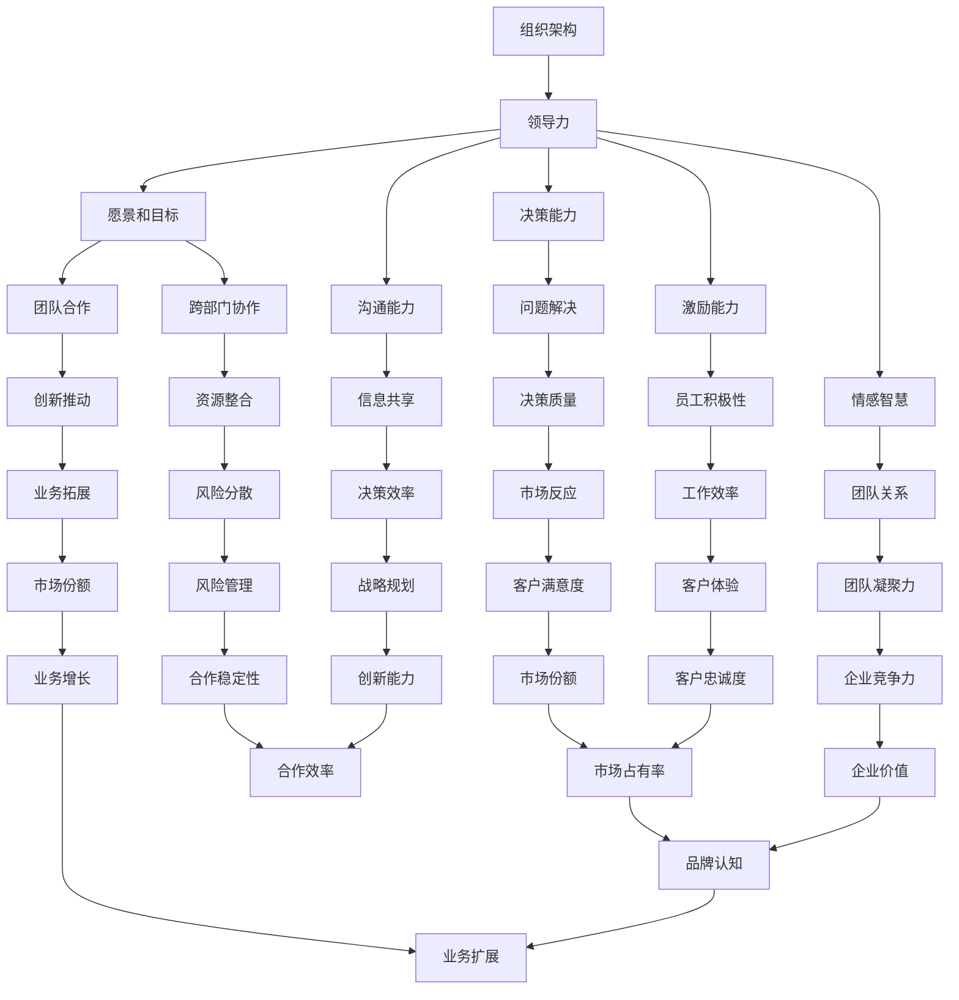
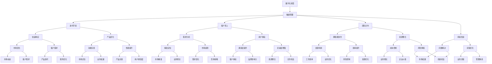

                 

# 超越组织的边界

> 关键词：组织架构、数字化转型、领导力、跨部门协作、敏捷管理、变革管理

> 摘要：
在快速变化的商业环境中，传统的组织结构已经难以满足企业的发展需求。本文旨在探讨如何超越组织的边界，通过优化组织架构、提升领导力、促进跨部门协作、推动数字化转型和变革管理，实现企业的可持续发展和创新。本文将逐步分析这些关键要素，并提供实际案例和策略，以帮助读者理解并实践如何超越组织的边界。

## 引言

组织的边界不仅是物理的，更是文化和心理上的。在传统观念中，组织被视为一个封闭的系统，其内部资源和能力通过明确的边界进行管理。然而，在当今复杂多变的商业环境中，这种观念已经变得过时。随着全球化和数字化进程的加速，企业需要不断适应外部环境的变化，这就要求组织超越其边界，形成更灵活、更开放的架构。

本文将探讨以下主题：

1. **组织结构与设计原理**：分析传统与现代组织结构的特点，探讨组织设计的原则。
2. **领导力与跨部门协作**：讨论领导力的核心要素，以及跨部门协作的重要性。
3. **数字化转型与敏捷管理**：探讨数字化转型和敏捷管理对企业发展的推动作用。
4. **组织文化与变革管理**：分析组织文化对变革管理的影响，以及如何有效实施变革。
5. **跨界合作与生态系统建设**：探讨跨界合作在当今商业环境中的必要性。
6. **未来组织趋势**：预测未来组织的发展趋势，以及企业如何应对这些变化。
7. **结论**：总结本文的核心观点，并讨论持续学习和改进的重要性。

通过上述内容的逐步分析，本文旨在为读者提供一个全面的理解框架，以帮助企业在复杂多变的环境中实现持续创新和成长。

### 确定书籍主题和目标受众

《超越组织的边界》这本书的主题是探讨如何通过优化组织架构、提升领导力、促进跨部门协作、推动数字化转型和变革管理，实现企业的可持续发展和创新。这本书的目标受众主要是企业高管、团队领导和组织设计者。这些受众通常负责企业的战略规划和日常运营，他们需要理解并应对快速变化的商业环境。

为什么选择这个主题？在当今的商业环境中，组织的边界不再是固定和清晰的。随着全球化和数字化进程的加速，企业面临着前所未有的竞争压力和市场变化。传统的组织结构和管理模式已经难以满足企业的发展需求。因此，探索如何超越组织的边界，实现更灵活、更高效的运营，成为企业管理者亟需解决的问题。

对于企业高管来说，他们需要从战略层面理解组织架构的优化，以及如何通过领导力和变革管理推动企业的转型。团队领导则需要掌握如何在跨部门协作中发挥领导力，提升团队的效率和创新能力。而组织设计者则需要具体实施组织结构的调整和优化，以适应外部环境的变化。

通过这本书，目标受众将能够：

- 理解传统组织结构的局限性和现代组织结构的特点。
- 掌握提升领导力和跨部门协作的方法。
- 理解数字化转型的核心要素，以及如何在企业中推动敏捷管理。
- 学习如何进行有效的变革管理，以及如何应对变革中的挑战。
- 探索跨界合作和生态系统建设的重要性，以及如何实施这些策略。
- 预测未来组织的发展趋势，并制定相应的战略规划。

总之，《超越组织的边界》旨在为企业管理者提供一套完整的理论和实践框架，帮助他们应对快速变化的商业环境，实现企业的可持续发展。

### 组织结构与设计原理

#### 传统组织结构

传统组织结构通常以金字塔形为主，具有清晰的等级制度和明确的职能分工。在这种结构中，权力和资源从上到下层层传递，每个层级都有明确的职责和权限。金字塔形的组织结构有助于确保决策的一致性和执行的效率，但同时它也存在一些局限性。

首先，传统组织结构强调垂直管理，这可能导致信息流通不畅。上级管理层往往无法及时获取基层员工的具体情况和反馈，从而导致决策滞后。其次，职能分工明确虽然有助于专业化，但同时也可能造成部门间的隔阂，影响跨部门协作。此外，传统组织结构在应对外部环境变化时往往不够灵活，难以迅速调整策略和资源分配。

#### 现代组织结构

随着商业环境的不断变化，现代组织结构逐渐从金字塔形转向更加扁平化和网络化的形态。现代组织结构的特点包括：

1. **扁平化管理**：通过减少管理层级，缩短决策链，提高信息传递的效率。扁平化组织结构有助于增强企业的灵活性和响应速度，使企业能够更快地适应市场变化。

2. **矩阵式结构**：矩阵式组织结构结合了职能和项目管理的优势，使员工在执行职能职责的同时，也能够参与多个项目，提高资源利用效率和跨部门协作能力。

3. **网络化组织**：网络化组织通过建立广泛的合作伙伴关系，将外部资源纳入组织内部，形成一个开放、灵活的生态系统。这种组织结构有助于企业利用外部知识和资源，实现创新和快速成长。

#### 组织设计原则

为了构建一个能够有效应对外部环境变化的组织，需要遵循以下组织设计原则：

1. **适应性**：组织应具备快速适应环境变化的能力。这要求组织在结构设计时，考虑到未来可能的变化，并具备调整和优化的灵活性。

2. **协同性**：通过优化组织结构，促进各部门之间的协同合作，提高整体效率。协同性不仅体现在内部，也体现在与外部合作伙伴的合作中。

3. **灵活性**：在组织设计中，应确保模块化和标准化，使组织能够根据不同任务和环境需求灵活调整资源和流程。

4. **透明性**：提高组织内部的透明度，确保信息流通畅，减少信息不对称，有助于提升组织的整体效能。

5. **激励性**：设计激励机制，激发员工的积极性和创造力，以推动组织目标的实现。

通过以上分析，我们可以看到，传统组织结构和现代组织结构各有优劣。在当前快速变化的商业环境中，企业需要根据自身的实际情况，选择合适的组织结构，并遵循有效的组织设计原则，以实现组织的持续发展和创新。

### 领导力与跨部门协作

#### 领导力的核心要素

领导力是组织成功的关键因素之一，特别是在需要跨部门协作的复杂环境中。有效的领导力不仅仅关乎权威和指挥，更在于激励和引导团队成员共同达成目标。以下是领导力的几个核心要素：

1. **愿景和目标**：领导者需要有清晰的愿景和目标，并能够将这一愿景和目标传达给团队成员，使团队成员明确自己的职责和期望。

2. **沟通能力**：有效的沟通是领导力的基础。领导者需要能够清晰地表达自己的想法，同时也需要倾听团队成员的意见和反馈，确保信息的畅通无阻。

3. **决策能力**：领导者需要具备快速做出有效决策的能力。在复杂多变的环境中，领导者需要权衡各种因素，迅速作出决策，以确保组织的正常运作。

4. **激励和激励能力**：领导者需要能够激发团队成员的积极性和创造力，通过设置激励机制，使团队成员在工作中保持高昂的士气和执行力。

5. **情感智慧**：领导者需要具备良好的情感智慧，能够理解并管理自己的情绪，同时也能够理解和同情团队成员的情感状态，建立良好的团队关系。

#### 跨部门协作的重要性

跨部门协作是现代企业中不可或缺的一环。在复杂的业务环境中，单一部门的努力往往无法实现整体目标。只有通过跨部门协作，才能充分利用各部门的优势，实现资源的最佳配置和效率的最大化。

以下是跨部门协作的几个重要性：

1. **资源整合**：跨部门协作有助于整合各部门的资源和能力，避免资源浪费和重复建设，提高整体运营效率。

2. **信息共享**：跨部门协作促进了信息的流动和共享，减少了信息孤岛现象，有助于提高决策的准确性和效率。

3. **创新推动**：跨部门协作为创新提供了广阔的平台。不同部门之间的交流和合作，往往能激发新的想法和解决方案，推动企业的持续创新。

4. **风险分担**：通过跨部门协作，企业能够将风险分散到多个部门，降低单一部门的风险暴露，提高整体抗风险能力。

#### 跨部门协作实践

为了实现有效的跨部门协作，企业可以采取以下措施：

1. **建立跨部门团队**：通过建立专门的跨部门团队，负责特定的项目或任务，确保各部门能够高效协作，共同达成目标。

2. **明确责任和权限**：在跨部门协作中，需要明确每个部门的责任和权限，确保每个部门都能在自己的职责范围内高效工作。

3. **定期沟通和会议**：通过定期沟通和会议，促进各部门之间的信息交流和协调，解决协作过程中出现的问题。

4. **共享资源和信息平台**：建立共享资源和信息平台，使各部门能够方便地获取和共享必要的资源和信息，提高协作效率。

5. **激励机制**：为跨部门协作团队设立激励机制，鼓励团队成员积极参与和协作，提高团队的整体绩效。

通过以上措施，企业可以促进跨部门协作，提升整体运营效率，实现组织的可持续发展。

### 数字化转型与敏捷管理

#### 数字化转型的概述

数字化转型是当今企业实现可持续发展和竞争力的关键。数字化转型不仅仅是引入新技术，更是对企业业务模式、组织结构、工作流程和员工能力的全面升级。以下是数字化转型的几个关键方面：

1. **数据驱动决策**：通过收集和分析大量的数据，企业可以更准确地了解市场趋势和客户需求，从而做出更明智的决策。

2. **智能化运营**：利用人工智能、机器学习等技术，企业可以自动化和优化业务流程，提高运营效率，减少人力成本。

3. **客户体验优化**：通过数字化手段，企业可以提供更加个性化和便捷的客户服务，提升客户满意度和忠诚度。

4. **生态系统构建**：数字化转型促使企业建立更加开放的生态系统，与合作伙伴共同创新和成长。

#### 敏捷管理的原理

敏捷管理是一种以客户需求为导向，强调灵活性和快速响应的管理方法。以下是敏捷管理的几个核心原理：

1. **迭代开发**：敏捷管理强调快速迭代，通过不断的小步骤开发和反馈，快速响应市场变化和客户需求。

2. **客户至上**：敏捷管理以客户需求为中心，确保产品或服务能够满足客户的实际需求。

3. **团队合作**：敏捷管理强调跨职能团队的协作，团队成员之间紧密合作，共同推动项目进展。

4. **持续改进**：敏捷管理倡导持续改进，通过不断的反馈和调整，不断优化产品或服务。

#### 敏捷管理的实践

为了成功实施敏捷管理，企业可以采取以下措施：

1. **建立敏捷团队**：将不同职能的团队成员组成跨职能团队，确保团队具备完成项目所需的所有技能。

2. **设定明确的目标和里程碑**：为每个项目设定明确的目标和里程碑，确保团队成员对项目的进展和目标有清晰的认识。

3. **定期回顾和反思**：通过定期回顾和反思，团队成员可以总结经验教训，识别改进点，不断提升团队绩效。

4. **使用敏捷工具**：使用敏捷管理工具，如看板、Scrum等，帮助团队管理项目进度和任务分配。

通过数字化转型和敏捷管理，企业可以提升运营效率，缩短产品上市时间，提高客户满意度，从而在激烈的市场竞争中保持领先地位。

### 组织文化与变革管理

#### 组织文化的重要性

组织文化是企业的灵魂，它决定了企业的行为方式、员工的工作态度以及组织整体的价值观。以下是组织文化的几个重要性：

1. **指导行为**：组织文化为员工提供了行为的指导和框架，使员工在面临挑战和决策时，能够有明确的方向和标准。

2. **增强凝聚力**：共同的文化价值观和理念可以增强员工的归属感和凝聚力，使员工更加团结和协作。

3. **促进创新**：积极的文化氛围可以鼓励员工创新和尝试新方法，推动企业的持续发展。

4. **提升客户体验**：组织文化直接影响企业的客户服务水平和产品质量，有助于提升客户满意度和忠诚度。

#### 变革管理理论

随着外部环境的不断变化，企业需要不断进行变革以保持竞争力。变革管理是确保变革成功的关键。以下是变革管理的几个核心理论：

1. **双环学习模型**：由查尔斯·萨维奇提出，双环学习模型认为，组织在面临问题时，不仅需要解决表面问题（第一环学习），还需要深入分析问题背后的原因（第二环学习），以防止问题再次发生。

2. **Kotter的八步骤模型**：约翰·科特提出了八步骤的变革管理模型，包括建立紧迫感、形成领导联盟、创造变革愿景、沟通愿景、授权行动、巩固短期胜利、加强新文化，以及使变革成为企业的一部分。

#### 变革管理实践

为了成功实施变革，企业可以采取以下措施：

1. **建立变革领导团队**：确保有强有力的领导团队负责推动变革，并设定明确的变革目标和时间表。

2. **有效沟通**：通过多种沟通渠道，确保员工了解变革的必要性和目标，减少抵触情绪。

3. **培训和发展**：为员工提供培训和发展机会，帮助员工掌握新技能，适应变革。

4. **激励和认可**：通过激励和认可制度，鼓励员工积极参与变革，并认可他们在变革过程中的贡献。

5. **建立反馈机制**：通过定期的反馈和评估，及时调整变革策略，确保变革按照预期进行。

通过有效的组织文化和变革管理，企业可以更好地适应外部环境的变化，实现持续发展和创新。

### 跨界合作与生态系统建设

#### 跨界合作的必要性

在当今全球化和数字化时代，企业不再能够单独应对复杂多变的市场环境。跨界合作成为企业获取资源、知识和市场机会的重要手段。以下是跨界合作的几个必要性：

1. **资源整合**：通过跨界合作，企业可以整合外部资源，如技术、资金、人才等，实现优势互补。

2. **知识共享**：跨界合作促进了不同领域知识的交流和融合，有助于企业开拓创新思路。

3. **市场拓展**：跨界合作可以帮助企业进入新的市场和行业，开拓更广阔的发展空间。

4. **风险分散**：通过与其他企业合作，企业可以将风险分散，降低单一市场的风险。

#### 生态系统建设策略

为了实现有效的跨界合作，企业需要构建一个健康的生态系统。以下是几个生态系统建设策略：

1. **开放平台**：构建开放的平台，吸引各类合作伙伴加入，共同开发和创新。

2. **共享资源**：通过共享资源和信息，提高合作伙伴的协同效率，降低合作成本。

3. **建立信任**：建立良好的信任机制，确保合作各方能够互信互助，共同发展。

4. **风险管理**：制定有效的风险管理制度，识别和管理合作中的潜在风险。

5. **激励机制**：为合作伙伴提供激励机制，鼓励其积极参与和贡献。

通过跨界合作和生态系统建设，企业可以提升竞争力，实现可持续发展。

### 未来组织趋势

#### 组织形态的未来发展

未来组织的形态将更加灵活和多元化。以下是几个组织形态的未来发展趋势：

1. **去中心化**：随着区块链和分布式技术的应用，去中心化组织将成为主流。这种组织形态减少了中间层级的干预，提高了决策效率和透明度。

2. **虚拟组织**：随着远程工作和数字协作工具的普及，虚拟组织将成为重要的组织形态。虚拟组织通过互联网和数字化工具实现全球协作，具有更高的灵活性和响应速度。

3. **平台化**：企业将逐渐从传统的产品导向转向平台导向，通过搭建平台连接内部团队和外部合作伙伴，实现资源的高效利用和协同创新。

#### 技术变革对组织的影响

技术变革对组织的影响是深远且全面的。以下是技术变革对组织的几个主要影响：

1. **自动化和人工智能**：自动化和人工智能技术将大幅提高工作效率，减少重复性劳动，使员工能够专注于更有价值的任务。

2. **数据分析**：通过大数据和人工智能技术，企业可以更深入地分析市场趋势和客户需求，做出更精准的决策。

3. **云计算**：云计算技术提供了弹性计算资源，使企业能够按需扩展和调整IT基础设施，提高运营效率。

4. **网络安全**：随着数据泄露和网络攻击的增多，企业需要投入更多资源确保网络安全，保护关键信息。

#### 未来组织的挑战与机遇

未来组织将面临一系列挑战和机遇：

1. **人才竞争**：随着技术变革的加速，企业需要吸引和培养具备新兴技能的员工，以保持竞争优势。

2. **企业文化转型**：为了适应新的组织形态和技术变革，企业需要不断调整和优化企业文化，建立适应未来发展的组织氛围。

3. **数字化战略**：企业需要制定清晰的数字化战略，确保技术变革能够有效推动业务发展。

4. **持续创新**：在快速变化的市场环境中，企业需要具备持续创新的能力，以应对外部环境的变化。

通过应对这些挑战和把握机遇，未来组织将能够实现更高效、更创新的运营模式，为企业带来持续的竞争优势。

### 结论

本文探讨了如何超越组织的边界，实现企业的可持续发展和创新。通过优化组织架构、提升领导力、促进跨部门协作、推动数字化转型和变革管理，企业可以更好地适应快速变化的商业环境。本文还讨论了跨界合作与生态系统建设的重要性，以及未来组织的趋势和挑战。

对于企业管理者来说，持续学习和改进是必不可少的。以下是一些建议：

1. **关注行业趋势**：了解最新的行业趋势和技术变革，制定相应的战略规划。

2. **培养领导力**：提升领导力，培养具备远见和战略思维的领导者。

3. **促进跨部门协作**：建立有效的跨部门协作机制，提高整体运营效率。

4. **推动数字化转型**：利用数字化工具和技术，优化业务流程，提高竞争力。

5. **进行变革管理**：实施有效的变革管理，确保组织能够适应外部环境的变化。

6. **建立跨界合作**：积极参与跨界合作，构建健康的生态系统，共同创新和成长。

通过以上措施，企业可以不断超越组织的边界，实现持续发展和创新。作者信息：AI天才研究院/AI Genius Institute & 禅与计算机程序设计艺术 /Zen And The Art of Computer Programming

---

为了更好地帮助读者理解本文的核心观点，以下是几个相关的Mermaid流程图和伪代码示例：

### Mermaid流程图：组织架构与领导力关系



### Mermaid流程图：数字化转型与敏捷管理关系



### 伪代码：数字化转型算法原理

```python
# 伪代码：数字化转型算法原理

def digital_transformation_strategy(company, market):
    # 初始化变量
    transformation_score = 0
    innovation_capability = 0
    
    # 分析市场趋势和客户需求
    market_trends = analyze_market_trends(market)
    customer_needs = analyze_customer_needs(market)
    
    # 根据市场趋势和客户需求调整公司策略
    if market_trends['digital_adoption'] > 0.5 and customer_needs['online_experience'] > 0.7:
        transformation_score += 1
        company.strategy['digital_platform'] = True
        
    if market_trends['data_analytics'] > 0.6 and customer_needs['data_privacy'] < 0.4:
        transformation_score += 1
        company.strategy['data_management'] = True
        
    # 评估创新能力和技术储备
    if company.innovation_capability['AI'] > 0.8 and company.technical储备['blockchain'] > 0.7:
        innovation_capability += 1
        
    # 返回数字化转型得分和创新能力评分
    return transformation_score, innovation_capability
```

通过这些流程图和伪代码示例，读者可以更直观地理解组织架构、领导力、数字化转型和敏捷管理的核心概念和相互关系。

---

为了帮助读者深入理解本文的核心内容，以下是几个数学公式和详细讲解：

### 数学公式：员工激励模型

```latex
$$
\text{激励得分} = \alpha \cdot (\text{工作绩效}) + \beta \cdot (\text{团队合作}) + \gamma \cdot (\text{创新能力})
$$`

### 详细讲解：

1. **工作绩效**：反映了员工在工作中的表现，包括任务完成质量、工作效率等。工作绩效的得分越高，表明员工在岗位上的贡献越大。

2. **团队合作**：衡量员工在团队中的协作能力和团队贡献。团队合作得分高，表明员工能够与团队成员有效沟通，共同完成任务。

3. **创新能力**：评估员工在工作中提出的新想法和解决方案的数量和质量。创新能力得分高，表明员工具备较高的创新能力和思维活跃度。

4. **激励得分**：综合反映员工的总体表现。通过这个公式，企业可以更全面地评估员工的表现，并制定相应的激励机制。

### 数学公式：敏捷管理效率评估

```latex
$$
\text{效率得分} = \frac{\text{项目完成度}}{\text{项目周期}} + \alpha \cdot (\text{客户满意度})
$$`

### 详细讲解：

1. **项目完成度**：衡量项目在预定时间内完成的程度。完成度越高，表明项目进展顺利，资源利用效率高。

2. **项目周期**：项目的总持续时间。项目周期越短，表明项目进展越快，效率越高。

3. **客户满意度**：评估客户对项目的满意程度。客户满意度高，表明项目符合客户需求，实现了预期目标。

4. **效率得分**：通过计算项目完成度与项目周期的比值，并加上客户满意度得分，可以全面评估项目的效率。效率得分越高，表明项目效率越高，客户满意度越高。

通过这些数学公式和详细讲解，读者可以更好地理解组织管理和敏捷管理的核心概念和评估方法。

---

为了帮助读者将理论知识应用于实际场景，以下是一个具体的案例：一个中型企业希望通过数字化转型提升其业务流程效率。以下是一个简化的案例分析和实施步骤：

### 案例背景

某中型企业主要从事制造业，其生产流程较为传统，依赖于大量手工操作和纸质记录。随着市场竞争的加剧和客户需求的变化，企业需要通过数字化转型提升生产效率，减少人力成本，并确保产品质量。

### 分析与实施步骤

1. **需求分析**：通过调研和访谈，了解当前生产流程中的瓶颈和问题，以及客户对生产效率和产品质量的需求。

2. **技术选型**：评估适合企业的数字化转型技术，如自动化控制、大数据分析、物联网等。

3. **制定数字化转型计划**：
   - **自动化控制**：引入自动化设备，减少手工操作，提高生产效率。
   - **大数据分析**：建立大数据平台，收集和分析生产数据，优化生产计划和资源配置。
   - **物联网**：部署物联网设备，实现生产过程的实时监控和远程管理。

4. **实施步骤**：
   - **阶段一**：自动化控制系统的实施。选择合适的自动化设备，进行安装和调试，确保生产过程顺畅。
   - **阶段二**：大数据分析平台的搭建。建立数据收集和处理系统，实现生产数据的实时分析和反馈。
   - **阶段三**：物联网设备的部署。安装物联网传感器，实现生产过程的实时监控和远程管理。

5. **测试与优化**：在数字化转型过程中，定期进行测试和优化，确保系统稳定运行，并不断调整和改进。

6. **培训与支持**：为员工提供培训，确保他们能够熟练操作新的数字化系统，并解决实施过程中遇到的问题。

7. **评估与反馈**：通过关键绩效指标（KPI）评估数字化转型效果，收集员工和客户的反馈，持续优化系统。

### 项目小结

通过数字化转型，企业实现了生产流程的自动化和智能化，提高了生产效率和产品质量，降低了人力成本。同时，通过大数据分析和物联网技术，企业能够更好地了解市场需求和客户需求，快速响应市场变化。数字化转型不仅提升了企业的竞争力，还为企业的未来发展奠定了坚实的基础。

通过这个案例，读者可以更直观地了解如何将数字化转型理论应用于实际场景，实现企业的持续发展和创新。

### 最佳实践 Tips、小结、注意事项、拓展阅读

#### 最佳实践 Tips

1. **愿景和目标明确**：确保企业愿景和目标明确，能够激发员工的热情和动力。
2. **跨部门协作**：建立跨部门协作机制，促进信息和资源的共享。
3. **持续学习**：鼓励员工持续学习新技能，提升团队整体素质。
4. **灵活应对变化**：保持灵活，及时调整策略以应对市场变化。
5. **文化塑造**：建立积极向上的企业文化，提升员工的归属感和忠诚度。

#### 小结

本文探讨了如何超越组织的边界，实现企业的可持续发展和创新。通过优化组织架构、提升领导力、促进跨部门协作、推动数字化转型和变革管理，企业可以更好地适应快速变化的商业环境。

#### 注意事项

1. **文化适配**：在实施变革时，确保企业文化能够适应新的管理模式和工具。
2. **人才储备**：确保企业拥有足够的数字化人才储备，以应对数字化转型的挑战。
3. **风险管理**：在数字化转型过程中，重视风险管理，确保系统的稳定运行。

#### 拓展阅读

1. **《敏捷管理学》**：介绍敏捷管理的理论和实践，帮助企业提升运营效率。
2. **《数字化转型实践指南》**：提供数字化转型的方法和案例，帮助企业实现数字化升级。
3. **《组织行为学》**：探讨组织文化、领导力等行为科学，帮助管理者提升管理能力。

通过以上最佳实践、小结和注意事项，读者可以更好地理解和应用本文所讨论的理论和实践。拓展阅读部分则提供了更多深入学习的资源，帮助读者进一步探索相关领域的知识。

