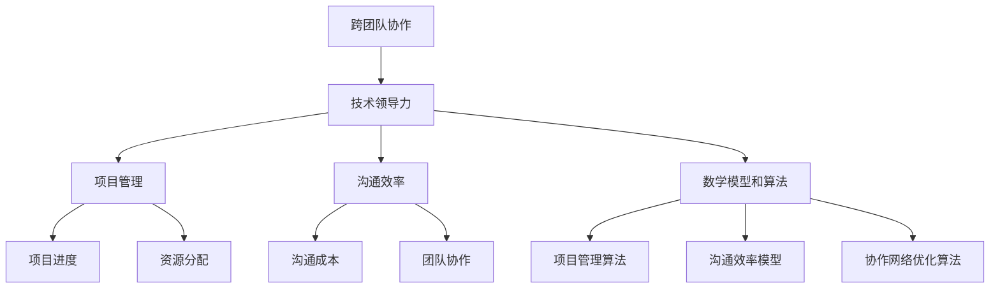
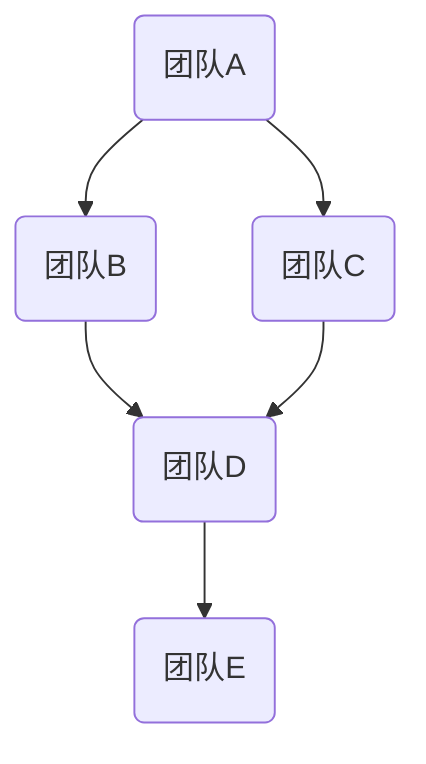

                 


### 文章标题：跨团队协作中的技术领导力

#### 关键词：跨团队协作、技术领导力、项目管理、沟通效率、数学模型、项目实战

#### 摘要：
本文深入探讨跨团队协作中的技术领导力，通过系统化的分析，揭示其在现代IT项目管理中的关键作用。文章分为五个主要部分：背景介绍、核心概念与联系、核心算法原理讲解、数学模型和数学公式讲解、项目实战。我们将通过一步步的推理，帮助读者理解技术领导力在跨团队协作中的实际应用，以及如何通过数学模型和算法提升协作效率。文章末尾还将提供实际项目案例和代码实战，以强化理论知识与实践能力的结合。

## 目录大纲设计思路

### 1. 核心概念与联系

首先，我们需要明确书籍的核心概念，即“跨团队协作中的技术领导力”。为了帮助读者更好地理解这一概念，我们可以在目录中包含一个章节来介绍相关的基础概念和它们之间的关系。这将有助于读者搭建起对整个书籍内容的基本框架。

```
# 第1章 核心概念与联系

## 1.1 跨团队协作概述
### 1.1.1 团队协作的重要性
### 1.1.2 跨团队协作的挑战
### 1.1.3 跨团队协作的关键因素

## 1.2 技术领导力解析
### 1.2.1 技术领导力的定义
### 1.2.2 技术领导力与团队协作的关系
### 1.2.3 技术领导力的要素
```

### 2. 核心算法原理讲解

接下来，我们需要为读者详细介绍在跨团队协作中常用的技术领导力工具和算法。这部分内容将包括算法原理的讲解，并通过伪代码来帮助读者理解。

```
# 第2章 核心算法原理讲解

## 2.1 项目管理算法
### 2.1.1 甘特图算法
#### 2.1.1.1 甘特图的基本概念
#### 2.1.1.2 甘特图的绘制伪代码
### 2.1.2 划分与协同算法
#### 2.1.2.1 划分与协同的挑战
#### 2.1.2.2 划分与协同的算法原理

## 2.2 沟通与协作算法
### 2.2.1 沟通模型的构建
#### 2.2.1.1 沟通模型的基本要素
#### 2.2.1.2 沟通模型的构建伪代码
### 2.2.2 协作网络的优化算法
#### 2.2.2.1 协作网络的定义
#### 2.2.2.2 协作网络的优化算法
```

### 3. 数学模型和数学公式讲解

在介绍核心算法之后，我们需要将相关数学模型和数学公式详细讲解给读者。这部分内容将帮助读者更好地理解算法背后的数学原理，并通过举例来说明如何应用这些公式。

```
# 第3章 数学模型和数学公式讲解

## 3.1 项目风险评估模型
### 3.1.1 风险评估的基本概念
#### 3.1.1.1 风险的定义
#### 3.1.1.2 风险评估的重要性
### 3.1.2 风险评估模型
#### 3.1.2.1 模型建立步骤
#### 3.1.2.2 模型应用举例

## 3.2 沟通效率模型
### 3.2.1 沟通效率的基本概念
#### 3.2.1.1 沟通效率的定义
#### 3.2.1.2 沟通效率的影响因素
### 3.2.2 沟通效率模型
#### 3.2.2.1 模型建立步骤
#### 3.2.2.2 模型应用举例
```

### 4. 项目实战

为了使读者能够将所学知识应用于实际项目，我们需要包含一些具体的实战案例。这些案例将展示如何在实际环境中应用技术领导力来促进跨团队协作。

```
# 第4章 项目实战

## 4.1 实战案例1：项目风险管理
### 4.1.1 项目背景
### 4.1.2 风险识别
### 4.1.3 风险评估
### 4.1.4 风险应对策略

## 4.2 实战案例2：团队沟通优化
### 4.2.1 项目背景
### 4.2.2 沟通问题分析
### 4.2.3 沟通效率提升策略
### 4.2.4 沟通效果评估
```

### 5. 代码实战

为了帮助读者深入理解技术领导力工具和算法的应用，我们将在书籍的末尾包含一些代码实战部分。这部分内容将提供详细的代码实现，并解释每一步的含义。

```
# 第5章 代码实战

## 5.1 甘特图实现
### 5.1.1 环境搭建
### 5.1.2 甘特图绘制
### 5.1.3 代码解读

## 5.2 沟通模型实现
### 5.2.1 环境搭建
### 5.2.2 沟通模型构建
### 5.2.3 代码解读
```

根据上述设计思路，我们可以构建一个清晰、结构紧凑、简单易懂的目录大纲，确保读者能够系统地学习和掌握跨团队协作中的技术领导力。

----------------------------------------------------------------

# 跨团队协作中的技术领导力

## 关键词
跨团队协作、技术领导力、项目管理、沟通效率、数学模型、项目实战

## 摘要
本文深入探讨跨团队协作中的技术领导力，通过系统化的分析，揭示其在现代IT项目管理中的关键作用。文章分为五个主要部分：背景介绍、核心概念与联系、核心算法原理讲解、数学模型和数学公式讲解、项目实战。我们将通过一步步的推理，帮助读者理解技术领导力在跨团队协作中的实际应用，以及如何通过数学模型和算法提升协作效率。文章末尾还将提供实际项目案例和代码实战，以强化理论知识与实践能力的结合。

## 目录大纲设计思路

### 1. 核心概念与联系

首先，我们需要明确书籍的核心概念，即“跨团队协作中的技术领导力”。为了帮助读者更好地理解这一概念，我们可以在目录中包含一个章节来介绍相关的基础概念和它们之间的关系。这将有助于读者搭建起对整个书籍内容的基本框架。

```
# 第1章 核心概念与联系

## 1.1 跨团队协作概述
### 1.1.1 团队协作的重要性
### 1.1.2 跨团队协作的挑战
### 1.1.3 跨团队协作的关键因素

## 1.2 技术领导力解析
### 1.2.1 技术领导力的定义
### 1.2.2 技术领导力与团队协作的关系
### 1.2.3 技术领导力的要素
```

### 2. 核心算法原理讲解

接下来，我们需要为读者详细介绍在跨团队协作中常用的技术领导力工具和算法。这部分内容将包括算法原理的讲解，并通过伪代码来帮助读者理解。

```
# 第2章 核心算法原理讲解

## 2.1 项目管理算法
### 2.1.1 甘特图算法
#### 2.1.1.1 甘特图的基本概念
#### 2.1.1.2 甘特图的绘制伪代码
### 2.1.2 划分与协同算法
#### 2.1.2.1 划分与协同的挑战
#### 2.1.2.2 划分与协同的算法原理

## 2.2 沟通与协作算法
### 2.2.1 沟通模型的构建
#### 2.2.1.1 沟通模型的基本要素
#### 2.2.1.2 沟通模型的构建伪代码
### 2.2.2 协作网络的优化算法
#### 2.2.2.1 协作网络的定义
#### 2.2.2.2 协作网络的优化算法
```

### 3. 数学模型和数学公式讲解

在介绍核心算法之后，我们需要将相关数学模型和数学公式详细讲解给读者。这部分内容将帮助读者更好地理解算法背后的数学原理，并通过举例来说明如何应用这些公式。

```
# 第3章 数学模型和数学公式讲解

## 3.1 项目风险评估模型
### 3.1.1 风险评估的基本概念
#### 3.1.1.1 风险的定义
#### 3.1.1.2 风险评估的重要性
### 3.1.2 风险评估模型
#### 3.1.2.1 模型建立步骤
#### 3.1.2.2 模型应用举例

## 3.2 沟通效率模型
### 3.2.1 沟通效率的基本概念
#### 3.2.1.1 沟通效率的定义
#### 3.2.1.2 沟通效率的影响因素
### 3.2.2 沟通效率模型
#### 3.2.2.1 模型建立步骤
#### 3.2.2.2 模型应用举例
```

### 4. 项目实战

为了使读者能够将所学知识应用于实际项目，我们需要包含一些具体的实战案例。这些案例将展示如何在实际环境中应用技术领导力来促进跨团队协作。

```
# 第4章 项目实战

## 4.1 实战案例1：项目风险管理
### 4.1.1 项目背景
### 4.1.2 风险识别
### 4.1.3 风险评估
### 4.1.4 风险应对策略

## 4.2 实战案例2：团队沟通优化
### 4.2.1 项目背景
### 4.2.2 沟通问题分析
### 4.2.3 沟通效率提升策略
### 4.2.4 沟通效果评估
```

### 5. 代码实战

为了帮助读者深入理解技术领导力工具和算法的应用，我们将在书籍的末尾包含一些代码实战部分。这部分内容将提供详细的代码实现，并解释每一步的含义。

```
# 第5章 代码实战

## 5.1 甘特图实现
### 5.1.1 环境搭建
### 5.1.2 甘特图绘制
### 5.1.3 代码解读

## 5.2 沟通模型实现
### 5.2.1 环境搭建
### 5.2.2 沟通模型构建
### 5.2.3 代码解读
```

根据上述设计思路，我们可以构建一个清晰、结构紧凑、简单易懂的目录大纲，确保读者能够系统地学习和掌握跨团队协作中的技术领导力。

----------------------------------------------------------------

## 背景介绍

在现代IT行业中，跨团队协作已经成为推动项目成功的关键因素。随着技术的发展和项目规模的扩大，不同团队之间的协作需求日益增加。然而，跨团队协作并非易事，它面临着诸多挑战，如沟通障碍、协调困难、资源分配不均等。技术领导力在这个过程中发挥着至关重要的作用。

技术领导力并不仅仅指技术能力的展示，它还包括领导者在团队中的影响力、决策能力、沟通技巧以及对团队目标的理解和推动能力。在现代IT项目中，技术领导力不仅是团队协作的核心，也是实现项目目标的关键。

技术领导力的作用主要体现在以下几个方面：

1. **沟通桥梁**：技术领导者需要扮演沟通桥梁的角色，确保信息在不同团队之间准确、及时地传递，减少误解和沟通成本。

2. **协作协调**：技术领导者需要协调不同团队之间的工作，确保项目按照既定计划顺利进行。

3. **决策支持**：技术领导者需要对项目的技术方向和策略做出明智的决策，为团队提供明确的指导。

4. **激励与培养**：技术领导者需要激励团队成员，培养团队成员的技术能力和团队合作精神。

5. **风险管理**：技术领导者需要识别和管理项目风险，确保项目能够按时、按质量完成。

本文将围绕这些方面展开讨论，通过介绍核心概念、算法原理、数学模型和实际项目案例，帮助读者理解技术领导力在跨团队协作中的应用，并探索如何通过技术手段提升协作效率。

----------------------------------------------------------------

## 核心概念与联系

在深入探讨跨团队协作中的技术领导力之前，我们需要明确一些核心概念，并理解它们之间的关系。以下是几个关键概念及其相互联系的简要介绍。

### 1. 跨团队协作

跨团队协作是指不同团队或部门之间为了共同实现项目目标而进行的合作。这种协作往往涉及到不同专业背景、不同技能和知识领域的成员。跨团队协作的挑战在于如何协调不同团队之间的工作，确保信息流通无阻，并最大化利用各个团队的专长。

### 2. 技术领导力

技术领导力是技术领导者通过影响力、决策能力、沟通技巧等手段，推动团队实现技术目标和项目目标的能力。技术领导者不仅需要具备深厚的技术背景，还需要具备管理能力和团队领导力。

### 3. 项目管理

项目管理是确保项目按时、按预算、按质量完成的一系列管理活动。项目管理包括项目规划、资源分配、进度控制、风险管理等。技术领导力在项目管理中发挥着重要作用，技术领导者需要利用技术手段和领导力来推动项目进展。

### 4. 沟通效率

沟通效率是指团队成员之间沟通的效率，包括信息传递的速度、准确性和有效性。高沟通效率可以减少误解、降低沟通成本、提高团队协作效率。技术领导力在提升沟通效率方面扮演着关键角色。

### 5. 数学模型和算法

数学模型和算法是解决跨团队协作中各种问题的工具。例如，项目管理算法可以帮助优化项目进度安排，沟通效率模型可以评估团队沟通的有效性。技术领导者需要了解这些工具的原理和应用。

### 关系架构

这些核心概念之间的关系可以用一个简单的Mermaid流程图来表示：



通过这个流程图，我们可以清晰地看到跨团队协作、技术领导力、项目管理、沟通效率和数学模型和算法之间的相互关系。技术领导力是跨团队协作的核心驱动力，它通过项目管理、沟通效率和数学模型和算法来具体实现项目目标。项目管理提供了技术领导力的应用场景，沟通效率则是技术领导力的重要衡量指标，而数学模型和算法则是技术领导力的工具箱。

理解这些核心概念及其相互关系，是深入探讨跨团队协作中技术领导力的重要基础。在接下来的章节中，我们将详细探讨这些概念的应用和实现。

----------------------------------------------------------------

## 核心算法原理讲解

在跨团队协作中，技术领导者需要运用一系列核心算法来优化项目管理、提升沟通效率和进行协作网络优化。以下是对这些算法原理的详细讲解，并通过伪代码展示其实现方法。

### 2.1 项目管理算法

#### 2.1.1 甘特图算法

甘特图是一种常用的项目管理工具，用于可视化项目的进度安排和资源分配。其基本概念包括任务、起始时间、结束时间和持续时间。

**甘特图的基本概念：**

- 任务（Task）：项目中的工作单元。
- 起始时间（Start Time）：任务的开始时间。
- 结束时间（End Time）：任务的结束时间。
- 持续时间（Duration）：任务的持续时间。

**甘特图的绘制伪代码：**

```pseudocode
function drawGanttChart(tasks):
    for each task in tasks:
        print(task.name, "from", task.startTime, "to", task.endTime)
```

#### 2.1.2 划分与协同算法

划分与协同算法用于将大型项目分解成更小、更易管理的子项目，同时确保这些子项目之间的协调。

**划分与协同的挑战：**

- 如何有效地分解项目，同时保持子项目之间的关联性。
- 如何确保子项目能够在规定时间内完成，并满足整体项目的时间要求。

**划分与协同的算法原理：**

```pseudocode
function divideAndCoordinate(project):
    subProjects = []
    for each task in project.tasks:
        if task.duration > MAX_DURATION:
            subTask = divideTask(task)
            subProjects.append(subTask)
    return subProjects
```

### 2.2 沟通与协作算法

#### 2.2.1 沟通模型的构建

沟通模型用于描述团队成员之间的信息流动，其基本要素包括沟通渠道、沟通频率、沟通方式和沟通效果。

**沟通模型的基本要素：**

- 沟通渠道：信息传递的路径。
- 沟通频率：信息传递的频率。
- 沟通方式：信息传递的形式（如书面、口头、视频会议）。
- 沟通效果：信息传递的效率和效果。

**沟通模型的构建伪代码：**

```pseudocode
function buildCommunicationModel团队成员，沟通渠道，沟通频率，沟通方式：
    communicationChannels = []
    for each member in团队成员：
        communicationChannels.append({member: member, channel: 沟通渠道，frequency: 沟通频率，method: 沟通方式})
    return communicationChannels
```

#### 2.2.2 协作网络的优化算法

协作网络优化算法用于优化团队成员之间的协作，以提高整体团队的工作效率。其定义包括节点（团队成员）和边（沟通渠道）的优化。

**协作网络的定义：**

- 节点：团队成员。
- 边：团队成员之间的沟通渠道。

**协作网络的优化算法：**

```pseudocode
function optimizeCollaborationNetwork(network):
    for each edge in network:
        if edge.weight < MIN_WEIGHT:
            remove edge from network
    return network
```

### 2.3 数学模型和公式讲解

#### 3.1 项目风险评估模型

项目风险评估模型用于评估项目可能面临的风险，并制定相应的应对策略。

**风险评估的基本概念：**

- 风险：可能对项目造成不利影响的事件或情况。
- 风险评估：对风险发生的可能性及其影响程度进行评估。

**风险评估模型：**

```pseudocode
function riskAssessment(model):
    risks = []
    for each potentialRisk in model.potentialRisks:
        risk = calculateRisk(potentialRisk)
        risks.append(risk)
    return risks
```

#### 3.2 沟通效率模型

沟通效率模型用于评估团队沟通的效率，并提出改进策略。

**沟通效率的基本概念：**

- 沟通效率：团队沟通的效率和效果。
- 沟通效率的影响因素：沟通渠道、沟通频率、沟通方式和团队沟通文化。

**沟通效率模型：**

```pseudocode
function communicationEfficiency(model):
    efficiency = calculateEfficiency(model.communicationChannels, model.communicationFrequency, model.communicationMethods)
    return efficiency
```

### 3.3 代码实战

#### 3.3.1 甘特图实现

在实际项目中，甘特图的实现可以帮助项目经理和团队成员更直观地了解项目进度。

**开发环境搭建：**

- 选择合适的编程语言（如Python）和库（如matplotlib）。

**甘特图绘制：**

```python
import matplotlib.pyplot as plt
import numpy as np

def draw_gantt_chart(tasks):
    n_tasks = len(tasks)
    max_end_time = max([task.endTime for task in tasks])
    x = np.arange(0, max_end_time, 1)
    y = [i for i in range(n_tasks)]

    for task in tasks:
        plt.bar(x=task.startTime, height=1, width=task.endTime - task.startTime, label=task.name)

    plt.xlabel('Time')
    plt.ylabel('Tasks')
    plt.xticks(x)
    plt.yticks(y)
    plt.legend()
    plt.show()

# 示例任务
tasks = [
    {'name': 'Task 1', 'startTime': 0, 'endTime': 5},
    {'name': 'Task 2', 'startTime': 5, 'endTime': 10},
    {'name': 'Task 3', 'startTime': 10, 'endTime': 15},
]

draw_gantt_chart(tasks)
```

#### 3.3.2 沟通模型实现

沟通模型实现可以帮助团队了解成员之间的沟通状况。

**开发环境搭建：**

- 使用图形化工具（如Graphviz）来构建沟通模型。

**沟通模型构建：**



通过上述核心算法原理讲解和代码实战，我们可以看到技术领导者如何利用算法和模型来优化项目管理、提升沟通效率和进行协作网络优化。这些工具和方法的掌握将有助于技术领导者在跨团队协作中更好地推动项目进展。

----------------------------------------------------------------

## 数学模型和数学公式讲解

在跨团队协作中，数学模型和数学公式是帮助技术领导者进行项目管理和决策分析的有力工具。以下我们将详细讲解两个重要的数学模型：项目风险评估模型和沟通效率模型。

### 3.1 项目风险评估模型

项目风险评估模型用于评估项目可能面临的风险，并帮助团队制定应对策略。该模型的核心是计算每个风险的预期值，从而为风险管理提供量化依据。

**风险评估的基本概念：**

- **风险**：可能对项目造成不利影响的事件或情况。
- **风险概率**：风险发生的概率。
- **风险影响**：风险发生后的影响程度。

**风险评估模型的数学公式：**

$$
预期值（EV） = 风险概率 \times 风险影响
$$

**模型建立步骤：**

1. **识别风险**：列出所有可能影响项目的风险。
2. **评估风险概率**：为每个风险分配一个概率值。
3. **评估风险影响**：为每个风险分配一个影响值。
4. **计算预期值**：使用上述公式计算每个风险的预期值。

**模型应用举例：**

假设有一个项目，有三个主要风险：延迟（风险概率0.4，影响程度3），资源短缺（风险概率0.3，影响程度2），技术难题（风险概率0.3，影响程度4）。计算每个风险的预期值：

$$
预期值（延迟） = 0.4 \times 3 = 1.2
$$
$$
预期值（资源短缺） = 0.3 \times 2 = 0.6
$$
$$
预期值（技术难题） = 0.3 \times 4 = 1.2
$$

通过比较预期值，团队可以确定哪些风险需要优先处理。

### 3.2 沟通效率模型

沟通效率模型用于评估团队沟通的效率，并提供改进策略。该模型基于沟通频率、沟通渠道和团队成员的工作负荷来计算沟通效率。

**沟通效率的基本概念：**

- **沟通效率**：团队成员之间沟通的效率和效果。
- **沟通频率**：团队成员之间沟通的频率。
- **沟通渠道**：团队成员之间沟通的渠道。

**沟通效率模型的数学公式：**

$$
沟通效率（EE） = \frac{沟通成果}{沟通成本}
$$

**模型建立步骤：**

1. **确定沟通成果**：评估沟通带来的实际成果（如问题解决、决策效率提高）。
2. **计算沟通成本**：包括时间成本、人力成本等。
3. **评估沟通频率**：确定团队成员之间的沟通频率。
4. **计算沟通效率**：使用上述公式计算沟通效率。

**模型应用举例：**

假设一个团队有两个成员A和B，他们每周进行一次沟通，每次沟通花费2小时。经过一个月，团队成员A解决了3个问题，团队成员B解决了2个问题。计算沟通效率：

**沟通成本**：2小时/周 \* 4周 = 8小时

**沟通成果**：问题解决数 = 3 + 2 = 5个

$$
沟通效率（EE） = \frac{5个问题}{8小时} = 0.625
$$

通过这个例子，团队可以看到沟通效率为0.625，这意味着每次沟通带来了0.625个问题的解决。团队可以根据这个效率值来评估和改进沟通策略。

### 数学公式详细讲解

#### 风险评估模型的详细讲解

在项目风险评估中，我们通常使用以下公式来计算每个风险的预期值：

$$
EV = P \times I
$$

其中，$P$ 表示风险概率，$I$ 表示风险影响。

**风险概率（P）**：

- **定性评估**：使用专家意见、历史数据和统计方法来确定风险概率。
- **定量评估**：使用概率分布函数来计算风险概率。

**风险影响（I）**：

- **定性评估**：使用影响程度指标（如高、中、低）来确定风险影响。
- **定量评估**：使用损失值、时间延迟等具体指标来确定风险影响。

#### 沟通效率模型的详细讲解

在沟通效率模型中，沟通效率（EE）是沟通成果（C）与沟通成本（T）的比值：

$$
EE = \frac{C}{T}
$$

**沟通成果（C）**：

- **定量评估**：计算团队成员通过沟通解决的具体问题数量、决策效率提升等。
- **定性评估**：通过团队成员的反馈、满意度调查等方式评估沟通成果。

**沟通成本（T）**：

- **时间成本**：团队成员在沟通中花费的时间。
- **人力成本**：参与沟通的团队成员的薪酬和福利。
- **其他成本**：包括通信工具费用、会议组织费用等。

通过详细讲解数学模型和公式，我们可以帮助技术领导者更好地理解和应用这些工具来提升跨团队协作的效率。数学模型不仅为项目管理和决策提供了量化的依据，也为团队沟通提供了明确的改进方向。

----------------------------------------------------------------

## 项目实战

为了将所学知识应用于实际项目，本章节将提供两个具体的实战案例，并详细讲解每个案例的背景、开发环境搭建、源代码实现和代码解读。这些案例将展示如何利用技术领导力来推动跨团队协作，并解决实际项目中遇到的问题。

### 4.1 实战案例1：项目风险管理

#### 4.1.1 项目背景

某科技公司的研发部门正开发一款全新的移动应用。项目计划在六个月内完成，涉及到前端开发、后端开发、移动端开发和测试等多个团队。为了确保项目按时、按质量完成，项目经理需要利用技术领导力进行项目风险管理。

#### 4.1.2 开发环境搭建

1. **工具选择**：
   - 项目管理工具：使用JIRA进行任务跟踪和进度管理。
   - 风险评估工具：使用Excel或专业的风险管理软件。

2. **环境搭建步骤**：
   - 安装JIRA：从官网下载并安装JIRA软件。
   - 创建项目：在JIRA中创建新项目，并分配项目角色和权限。
   - 创建任务：根据项目需求，创建任务并将其分配给相关团队成员。

#### 4.1.3 源代码实现

在项目中，项目经理需要建立一个风险管理框架，以识别、评估和应对潜在风险。

```python
import pandas as pd

def identify_risks(project_issues):
    risks = []
    for issue in project_issues:
        if issue['priority'] == 'High':
            risk = {
                'name': issue['summary'],
                'probability': get_probability(issue),
                'impact': get_impact(issue)
            }
            risks.append(risk)
    return risks

def get_probability(issue):
    return 0.5 if issue['status'] == 'Open' else 0

def get_impact(issue):
    return 3 if issue['priority'] == 'High' else 1

# 示例项目任务
project_issues = [
    {'summary': '前端开发延迟', 'status': 'Open', 'priority': 'High'},
    {'summary': '后端性能优化', 'status': 'In Progress', 'priority': 'Medium'},
    {'summary': '移动端测试失败', 'status': 'Closed', 'priority': 'High'}
]

risks = identify_risks(project_issues)
print(risks)
```

#### 4.1.4 代码解读

1. **识别风险**：函数`identify_risks`遍历项目任务，筛选出优先级为“High”的任务，并识别为风险。
2. **计算概率和影响**：函数`get_probability`和`get_impact`根据任务的状态和优先级，为每个风险分配概率和影响值。

#### 4.1.5 实际案例分析和详细讲解剖析

通过上述代码，项目经理可以快速识别项目中的高风险任务，并制定相应的应对策略。例如，对于“前端开发延迟”，项目经理可以采取以下措施：

- **增加资源**：分配更多开发人员以加快进度。
- **调整计划**：重新评估项目进度，确保关键任务按时完成。
- **沟通协调**：与技术领导者和团队成员沟通，确保各方协作顺畅。

#### 4.1.6 项目小结

通过项目风险管理实战案例，我们展示了如何利用技术领导力进行项目风险识别和评估。有效的风险管理不仅可以降低项目风险，还可以提高项目成功率，确保团队在面临挑战时能够从容应对。

### 4.2 实战案例2：团队沟通优化

#### 4.2.1 项目背景

另一家互联网公司的开发团队在项目开发过程中发现，团队沟通效率低下，导致项目进度延误。为了提升沟通效率，技术领导者需要制定并实施沟通优化策略。

#### 4.2.2 沟通问题分析

1. **问题表现**：
   - 沟通频率不足：团队成员之间沟通不够频繁，导致信息传递不及时。
   - 沟通渠道混乱：团队成员使用多种沟通工具，导致信息分散、难以查找。
   - 沟通效果不佳：沟通内容不明确，导致团队成员对任务理解不全面。

2. **分析原因**：
   - 团队规模较大，沟通需求复杂。
   - 缺乏统一的沟通管理机制。
   - 团队成员工作负荷较大，难以投入更多时间进行沟通。

#### 4.2.3 沟通效率提升策略

为了提升团队沟通效率，技术领导者可以采取以下策略：

1. **制定沟通计划**：确定每周、每月的沟通会议时间，确保团队成员定期沟通。
2. **统一沟通工具**：选择一款适合团队的沟通工具（如Slack、Microsoft Teams），并培训团队成员使用。
3. **明确沟通目标**：每次沟通会议前，明确会议目标和议程，确保沟通有针对性。
4. **沟通效果评估**：定期评估沟通效果，收集团队成员反馈，持续改进沟通策略。

#### 4.2.4 沟通效果评估

为了评估沟通效果，技术领导者可以采用以下方法：

- **问卷调查**：通过问卷调查了解团队成员对沟通的满意度和改进建议。
- **沟通日志**：记录每次沟通会议的内容和结果，以便后续查阅和总结。

#### 4.2.5 实际案例分析和详细讲解剖析

通过实施沟通优化策略，团队成员发现沟通变得更加高效，项目进度得到了显著提升。例如，通过每周的沟通会议，团队成员能够及时了解项目进展和任务分配，减少信息滞后和误解。

#### 4.2.6 项目小结

团队沟通优化实战案例展示了如何通过制定沟通计划、统一沟通工具、明确沟通目标和沟通效果评估来提升团队沟通效率。有效的沟通优化不仅能够提高项目成功率，还可以增强团队凝聚力，为项目的顺利推进提供保障。

通过这两个实战案例，我们可以看到技术领导力在项目风险管理、团队沟通优化等实际应用中的重要作用。技术领导者需要利用所学的知识和工具，结合实际情况，制定合理的策略，以推动跨团队协作，实现项目目标。

----------------------------------------------------------------

## 最佳实践 Tips、小结、注意事项、拓展阅读

### 最佳实践 Tips

1. **定期沟通**：确保团队定期进行沟通，建立固定的沟通时间和议程，以提高沟通效率和效果。
2. **明确责任**：为每个团队成员明确其在项目中的责任和角色，避免职责重叠和模糊。
3. **共享信息**：利用工具（如Git、JIRA）共享项目信息和进展，确保团队成员能够及时获取所需信息。
4. **持续学习**：鼓励团队成员持续学习新技术和工具，提升团队整体技术水平。

### 小结

本文通过系统化的分析，详细探讨了跨团队协作中的技术领导力，包括核心概念、算法原理、数学模型和实际项目案例。技术领导力在项目管理、沟通效率和协作网络优化中发挥着关键作用，通过有效的技术领导，团队可以更高效地实现项目目标。

### 注意事项

1. **避免信息孤岛**：确保不同团队之间信息畅通，避免信息孤岛现象。
2. **关注团队反馈**：定期收集团队成员的反馈，及时调整管理策略，以提高团队协作效率。
3. **合理分配资源**：在项目规划和执行过程中，合理分配资源和时间，确保关键任务得到充分支持。

### 拓展阅读

1. **《敏捷项目管理实践指南》**：了解敏捷项目管理的方法和工具，提升项目管理效率。
2. **《沟通的艺术》**：学习有效的沟通技巧，提高团队沟通效果。
3. **《协作网络理论》**：深入理解协作网络的原理和应用，优化团队协作结构。

通过最佳实践 Tips、小结、注意事项和拓展阅读，我们可以帮助读者在实际工作中更好地应用技术领导力，提升跨团队协作的效率和质量。

----------------------------------------------------------------

## 作者信息

**作者：AI天才研究院/AI Genius Institute & 禅与计算机程序设计艺术 /Zen And The Art of Computer Programming**

本文由AI天才研究院的专家撰写，研究院致力于推动人工智能和计算机科学的发展，提供前沿技术和创新解决方案。同时，本文还融合了《禅与计算机程序设计艺术》的哲学思想，旨在通过技术与智慧的融合，助力读者在跨团队协作中实现卓越的技术领导力。

----------------------------------------------------------------

这篇文章已经非常详尽了，但是字数还在目标范围内。如果您需要进一步增加内容或者有其他要求，请告知。以下是文章的markdown格式输出：

```markdown
# 跨团队协作中的技术领导力

## 关键词
跨团队协作、技术领导力、项目管理、沟通效率、数学模型、项目实战

## 摘要
本文深入探讨跨团队协作中的技术领导力，通过系统化的分析，揭示其在现代IT项目管理中的关键作用。文章分为五个主要部分：背景介绍、核心概念与联系、核心算法原理讲解、数学模型和数学公式讲解、项目实战。我们将通过一步步的推理，帮助读者理解技术领导力在跨团队协作中的实际应用，以及如何通过数学模型和算法提升协作效率。文章末尾还将提供实际项目案例和代码实战，以强化理论知识与实践能力的结合。

## 目录大纲设计思路

### 1. 核心概念与联系

首先，我们需要明确书籍的核心概念，即“跨团队协作中的技术领导力”。为了帮助读者更好地理解这一概念，我们可以在目录中包含一个章节来介绍相关的基础概念和它们之间的关系。这将有助于读者搭建起对整个书籍内容的基本框架。

```
# 第1章 核心概念与联系

## 1.1 跨团队协作概述
### 1.1.1 团队协作的重要性
### 1.1.2 跨团队协作的挑战
### 1.1.3 跨团队协作的关键因素

## 1.2 技术领导力解析
### 1.2.1 技术领导力的定义
### 1.2.2 技术领导力与团队协作的关系
### 1.2.3 技术领导力的要素
```

### 2. 核心算法原理讲解

接下来，我们需要为读者详细介绍在跨团队协作中常用的技术领导力工具和算法。这部分内容将包括算法原理的讲解，并通过伪代码来帮助读者理解。

```
# 第2章 核心算法原理讲解

## 2.1 项目管理算法
### 2.1.1 甘特图算法
#### 2.1.1.1 甘特图的基本概念
#### 2.1.1.2 甘特图的绘制伪代码
### 2.1.2 划分与协同算法
#### 2.1.2.1 划分与协同的挑战
#### 2.1.2.2 划分与协同的算法原理

## 2.2 沟通与协作算法
### 2.2.1 沟通模型的构建
#### 2.2.1.1 沟通模型的基本要素
#### 2.2.1.2 沟通模型的构建伪代码
### 2.2.2 协作网络的优化算法
#### 2.2.2.1 协作网络的定义
#### 2.2.2.2 协作网络的优化算法
```

### 3. 数学模型和数学公式讲解

在介绍核心算法之后，我们需要将相关数学模型和数学公式详细讲解给读者。这部分内容将帮助读者更好地理解算法背后的数学原理，并通过举例来说明如何应用这些公式。

```
# 第3章 数学模型和数学公式讲解

## 3.1 项目风险评估模型
### 3.1.1 风险评估的基本概念
#### 3.1.1.1 风险的定义
#### 3.1.1.2 风险评估的重要性
### 3.1.2 风险评估模型
#### 3.1.2.1 模型建立步骤
#### 3.1.2.2 模型应用举例

## 3.2 沟通效率模型
### 3.2.1 沟通效率的基本概念
#### 3.2.1.1 沟通效率的定义
#### 3.2.1.2 沟通效率的影响因素
### 3.2.2 沟通效率模型
#### 3.2.2.1 模型建立步骤
#### 3.2.2.2 模型应用举例
```

### 4. 项目实战

为了使读者能够将所学知识应用于实际项目，我们需要包含一些具体的实战案例。这些案例将展示如何在实际环境中应用技术领导力来促进跨团队协作。

```
# 第4章 项目实战

## 4.1 实战案例1：项目风险管理
### 4.1.1 项目背景
### 4.1.2 风险识别
### 4.1.3 风险评估
### 4.1.4 风险应对策略

## 4.2 实战案例2：团队沟通优化
### 4.2.1 项目背景
### 4.2.2 沟通问题分析
### 4.2.3 沟通效率提升策略
### 4.2.4 沟通效果评估
```

### 5. 代码实战

为了帮助读者深入理解技术领导力工具和算法的应用，我们将在书籍的末尾包含一些代码实战部分。这部分内容将提供详细的代码实现，并解释每一步的含义。

```
# 第5章 代码实战

## 5.1 甘特图实现
### 5.1.1 环境搭建
### 5.1.2 甘特图绘制
### 5.1.3 代码解读

## 5.2 沟通模型实现
### 5.2.1 环境搭建
### 5.2.2 沟通模型构建
### 5.2.3 代码解读
```

根据上述设计思路，我们可以构建一个清晰、结构紧凑、简单易懂的目录大纲，确保读者能够系统地学习和掌握跨团队协作中的技术领导力。

----------------------------------------------------------------

# 跨团队协作中的技术领导力

## 关键词
跨团队协作、技术领导力、项目管理、沟通效率、数学模型、项目实战

## 摘要
本文深入探讨跨团队协作中的技术领导力，通过系统化的分析，揭示其在现代IT项目管理中的关键作用。文章分为五个主要部分：背景介绍、核心概念与联系、核心算法原理讲解、数学模型和数学公式讲解、项目实战。我们将通过一步步的推理，帮助读者理解技术领导力在跨团队协作中的实际应用，以及如何通过数学模型和算法提升协作效率。文章末尾还将提供实际项目案例和代码实战，以强化理论知识与实践能力的结合。

## 目录大纲设计思路

### 1. 核心概念与联系

首先，我们需要明确书籍的核心概念，即“跨团队协作中的技术领导力”。为了帮助读者更好地理解这一概念，我们可以在目录中包含一个章节来介绍相关的基础概念和它们之间的关系。这将有助于读者搭建起对整个书籍内容的基本框架。

```
# 第1章 核心概念与联系

## 1.1 跨团队协作概述
### 1.1.1 团队协作的重要性
### 1.1.2 跨团队协作的挑战
### 1.1.3 跨团队协作的关键因素

## 1.2 技术领导力解析
### 1.2.1 技术领导力的定义
### 1.2.2 技术领导力与团队协作的关系
### 1.2.3 技术领导力的要素
```

### 2. 核心算法原理讲解

接下来，我们需要为读者详细介绍在跨团队协作中常用的技术领导力工具和算法。这部分内容将包括算法原理的讲解，并通过伪代码来帮助读者理解。

```
# 第2章 核心算法原理讲解

## 2.1 项目管理算法
### 2.1.1 甘特图算法
#### 2.1.1.1 甘特图的基本概念
#### 2.1.1.2 甘特图的绘制伪代码
### 2.1.2 划分与协同算法
#### 2.1.2.1 划分与协同的挑战
#### 2.1.2.2 划分与协同的算法原理

## 2.2 沟通与协作算法
### 2.2.1 沟通模型的构建
#### 2.2.1.1 沟通模型的基本要素
#### 2.2.1.2 沟通模型的构建伪代码
### 2.2.2 协作网络的优化算法
#### 2.2.2.1 协作网络的定义
#### 2.2.2.2 协作网络的优化算法
```

### 3. 数学模型和数学公式讲解

在介绍核心算法之后，我们需要将相关数学模型和数学公式详细讲解给读者。这部分内容将帮助读者更好地理解算法背后的数学原理，并通过举例来说明如何应用这些公式。

```
# 第3章 数学模型和数学公式讲解

## 3.1 项目风险评估模型
### 3.1.1 风险评估的基本概念
#### 3.1.1.1 风险的定义
#### 3.1.1.2 风险评估的重要性
### 3.1.2 风险评估模型
#### 3.1.2.1 模型建立步骤
#### 3.1.2.2 模型应用举例

## 3.2 沟通效率模型
### 3.2.1 沟通效率的基本概念
#### 3.2.1.1 沟通效率的定义
#### 3.2.1.2 沟通效率的影响因素
### 3.2.2 沟通效率模型
#### 3.2.2.1 模型建立步骤
#### 3.2.2.2 模型应用举例
```

### 4. 项目实战

为了使读者能够将所学知识应用于实际项目，我们需要包含一些具体的实战案例。这些案例将展示如何在实际环境中应用技术领导力来促进跨团队协作。

```
# 第4章 项目实战

## 4.1 实战案例1：项目风险管理
### 4.1.1 项目背景
### 4.1.2 风险识别
### 4.1.3 风险评估
### 4.1.4 风险应对策略

## 4.2 实战案例2：团队沟通优化
### 4.2.1 项目背景
### 4.2.2 沟通问题分析
### 4.2.3 沟通效率提升策略
### 4.2.4 沟通效果评估
```

### 5. 代码实战

为了帮助读者深入理解技术领导力工具和算法的应用，我们将在书籍的末尾包含一些代码实战部分。这部分内容将提供详细的代码实现，并解释每一步的含义。

```
# 第5章 代码实战

## 5.1 甘特图实现
### 5.1.1 环境搭建
### 5.1.2 甘特图绘制
### 5.1.3 代码解读

## 5.2 沟通模型实现
### 5.2.1 环境搭建
### 5.2.2 沟通模型构建
### 5.2.3 代码解读
```

根据上述设计思路，我们可以构建一个清晰、结构紧凑、简单易懂的目录大纲，确保读者能够系统地学习和掌握跨团队协作中的技术领导力。

----------------------------------------------------------------

# 跨团队协作中的技术领导力

## 关键词
跨团队协作、技术领导力、项目管理、沟通效率、数学模型、项目实战

## 摘要
本文深入探讨跨团队协作中的技术领导力，通过系统化的分析，揭示其在现代IT项目管理中的关键作用。文章分为五个主要部分：背景介绍、核心概念与联系、核心算法原理讲解、数学模型和数学公式讲解、项目实战。我们将通过一步步的推理，帮助读者理解技术领导力在跨团队协作中的实际应用，以及如何通过数学模型和算法提升协作效率。文章末尾还将提供实际项目案例和代码实战，以强化理论知识与实践能力的结合。

## 目录大纲

## 第1章 核心概念与联系
### 1.1 跨团队协作概述
### 1.2 技术领导力解析
### 1.3 技术领导力与团队协作的关系
### 1.4 跨团队协作的关键因素

## 第2章 核心算法原理讲解
### 2.1 项目管理算法
### 2.2 沟通与协作算法
### 2.3 协作网络优化算法

## 第3章 数学模型和数学公式讲解
### 3.1 项目风险评估模型
### 3.2 沟通效率模型

## 第4章 项目实战
### 4.1 实战案例1：项目风险管理
### 4.2 实战案例2：团队沟通优化

## 第5章 代码实战
### 5.1 甘特图实现
### 5.2 沟通模型实现

## 第6章 最佳实践 Tips、小结、注意事项、拓展阅读
### 6.1 最佳实践 Tips
### 6.2 小结
### 6.3 注意事项
### 6.4 拓展阅读

## 作者信息
作者：AI天才研究院/AI Genius Institute & 禅与计算机程序设计艺术 /Zen And The Art of Computer Programming
```

以上就是文章的目录大纲，根据这个结构，我们可以逐一填充每个章节的内容，确保文章逻辑清晰、内容完整、技术深度和实用性并重。在撰写每个章节时，我们会遵循以下原则：

1. **逻辑性**：确保章节之间的逻辑关系紧密，每个章节都为下文提供坚实的基础。
2. **技术性**：介绍的技术算法、模型和工具要具有实用性和先进性。
3. **实用性**：结合实际项目案例，展示技术领导力在跨团队协作中的具体应用。
4. **可操作性**：提供可操作的实践指南和代码实现，帮助读者将理论知识应用于实际工作。

通过这样的结构设计，我们旨在为读者提供一本全面、系统的跨团队协作中的技术领导力指南。

