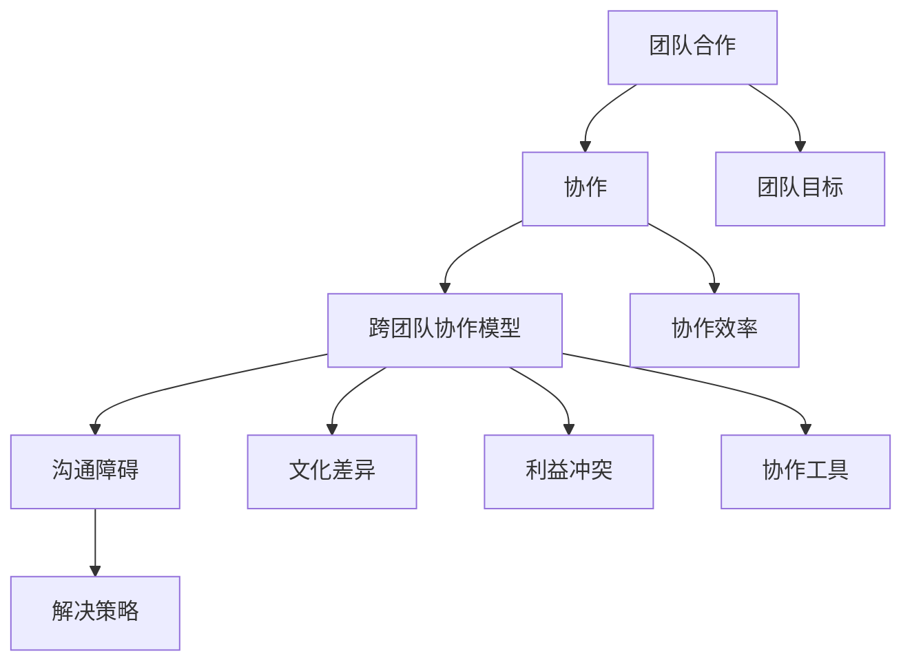

                 


## 引言

### 背景介绍

跨团队协作在当今复杂的企业环境中变得越来越重要。随着全球化、远程工作和多样化的组织结构成为常态，企业内部的协作不再局限于单一团队内部，而是需要跨部门、跨地域、跨文化的协作。这种跨团队协作不仅涉及不同职能团队的融合，还涉及到不同组织层级和不同文化背景的沟通与协调。因此，有效的方法和工具成为实现高效协作的关键。

### 研究目的

本文旨在探讨跨团队协作的有效方法，通过分析当前的研究和实践，总结出一系列实用的策略、工具和最佳实践。文章结构如下：

1. **跨团队协作概述**：介绍跨团队协作的重要性、面临的挑战和理论基础。
2. **核心概念与理论**：探讨团队合作与协作的概念、模型以及跨团队协作的障碍与解决策略。
3. **有效工具与方法**：介绍提升跨团队协作效率的实用工具和方法。
4. **增强协作策略**：讨论明确目标、建立信任、激励机制等策略。
5. **团队建设与领导力**：分析团队角色、领导风格以及领导力在跨团队协作中的作用。
6. **实际案例研究**：通过具体案例展示跨团队协作的实际应用。
7. **未来趋势与挑战**：探讨数字化、远程工作对跨团队协作的影响。

通过这些章节的逐一探讨，我们希望能够为读者提供一个全面的跨团队协作指南，帮助他们解决实际工作中遇到的问题，提高团队协作效率。

### 核心概念与联系

在探讨跨团队协作之前，我们需要明确几个核心概念，并理解它们之间的关系。

首先，**团队合作**与**协作**是两个密切相关的概念。团队合作强调的是团队成员之间的协作与共同努力，而协作则更侧重于不同个体或团队之间的互动和配合。团队合作的成功依赖于协作的顺畅，两者相辅相成。

其次，**跨团队协作模型**是理解和实现跨团队协作的重要工具。常见的跨团队协作模型包括矩阵型、网络型、混合型等。这些模型根据企业的组织结构和项目需求，提供了不同的协作方式和职责分配方案。

最后，**跨团队协作的障碍**包括沟通障碍、文化差异、利益冲突等。这些障碍如果不加以解决，将严重阻碍跨团队协作的效率和质量。

以下是一个简单的Mermaid流程图，展示了这些核心概念之间的关系：



### 核心算法原理讲解

为了更好地理解跨团队协作的算法原理，我们可以使用伪代码来详细阐述一个典型的跨团队协作流程。以下是一个简化的伪代码示例，用于描述一个跨团队协作项目的执行过程：

```plaintext
Function CrossTeamCollaboration(Project, Teams):
    Begin
        // Step 1: 定义项目目标和范围
        Set ProjectGoals = DefineProjectGoals(Project)

        // Step 2: 分配任务和职责
        For Each Team in Teams:
            AssignTasks(Team, ProjectGoals)

        // Step 3: 建立沟通机制
        Set CommunicationChannels = SetupCommunicationChannels(Teams)

        // Step 4: 实施项目
        While ProjectIsNotCompleted:
            For Each Team in Teams:
                ExecuteTasks(Team, CommunicationChannels)

                // Step 4.1: 监控项目进度
                MonitorProgress(Project, Teams)

                // Step 4.2: 解决冲突
                ResolveConflicts(Teams, CommunicationChannels)

        // Step 5: 项目总结和评估
        EvaluateProject(Project, Teams)
    End
```

在这个伪代码中，我们首先定义了项目的目标和范围，然后根据这些目标将任务分配给各个团队。接下来，我们建立沟通机制，确保团队之间的有效沟通。在项目实施过程中，我们持续监控进度并解决冲突。最后，项目完成后进行总结和评估。

### 数学模型和公式

在跨团队协作中，数学模型和公式可以帮助我们量化协作效果，评估协作效率。以下是一个简单的数学模型，用于评估跨团队协作的效率：

假设我们有一个包含n个团队的跨团队协作项目，每个团队完成任务的效率为\( E_i \)，其中 \( i \) 表示第 \( i \) 个团队。总协作效率 \( E \) 可以通过以下公式计算：

\[ E = \frac{1}{n} \sum_{i=1}^{n} E_i \]

其中，\( E \) 表示总协作效率，\( E_i \) 表示第 \( i \) 个团队的协作效率。

### 详细讲解与举例说明

为了更直观地理解这个数学模型，我们可以通过一个实际例子来说明。

假设我们有一个包含3个团队的项目，每个团队的协作效率分别为 \( E_1 = 0.8 \)，\( E_2 = 0.9 \)，\( E_3 = 0.75 \)。我们可以使用上述公式计算总协作效率：

\[ E = \frac{1}{3} (0.8 + 0.9 + 0.75) = 0.833 \]

这意味着，这个项目的总协作效率约为0.833。通过这个简单的例子，我们可以看到如何使用数学模型来评估跨团队协作的效果。

### 项目实战

#### 开发环境搭建

在进行跨团队协作的项目开发之前，我们需要搭建一个合适的技术环境，包括开发工具、版本控制和协作平台。以下是具体的步骤：

1. **选择开发工具**：根据项目的需求和团队的技能，选择合适的开发工具。例如，Python、Java、C++等。
2. **搭建版本控制系统**：使用Git进行版本控制，确保代码的版本一致性和可追溯性。
3. **设置协作平台**：使用Trello、Jira或Confluence等工具来管理项目任务、文档和进度。

#### 源代码实现

以下是一个简单的跨团队协作项目的伪代码实现，用于任务分配和进度跟踪。

```python
# Import required libraries
import git
import confluence

# Define project and teams
project = "跨团队协作项目"
teams = ["开发团队", "测试团队", "设计团队"]

# Step 1: 定义项目目标和范围
project_goals = confluence.create_page("项目目标", content="在这里定义项目的目标")

# Step 2: 分配任务和职责
for team in teams:
    task_list = confluence.create_space(team)
    confluence.assign_tasks(task_list, project_goals)

# Step 3: 建立沟通机制
communication_channels = {
    "开发团队": ["GitHub", "Slack"],
    "测试团队": ["Jira", "Microsoft Teams"],
    "设计团队": ["Trello", "Zoom"]
}

# Step 4: 实施项目
while not project_completed:
    for team in teams:
        execute_tasks(team, communication_channels[team])

        # Step 4.1: 监控项目进度
        monitor_progress(project, teams)

        # Step 4.2: 解决冲突
        resolve_conflicts(teams, communication_channels[team])

# Step 5: 项目总结和评估
evaluate_project(project, teams)
```

#### 代码解读与分析

在上面的代码中，我们首先定义了项目目标和范围，并使用Confluence创建了一个页面来记录这些信息。接着，我们为每个团队分配任务，并在协作平台上创建任务列表。

在实施项目的过程中，我们使用不同的沟通工具来确保团队之间的有效沟通。例如，开发团队使用GitHub和Slack，测试团队使用Jira和Microsoft Teams，设计团队使用Trello和Zoom。

#### 实际案例分析和详细讲解剖析

假设我们有一个实际的项目案例，涉及开发、测试和设计三个团队。以下是项目的详细流程和解析：

1. **项目启动**：项目团队召开启动会议，明确项目目标、范围和里程碑。
2. **任务分配**：根据项目需求，为每个团队分配具体的任务。例如，开发团队负责实现功能，测试团队负责测试，设计团队负责设计用户界面。
3. **沟通与协调**：使用协作平台和沟通工具，确保团队之间的信息传递和任务协调。定期召开项目会议，讨论进度和解决冲突。
4. **任务执行**：每个团队按照分配的任务进行开发、测试和设计工作。使用版本控制系统确保代码的版本一致性和可追溯性。
5. **进度监控**：定期监控项目进度，确保项目按计划进行。使用任务列表和协作工具跟踪任务的状态和进度。
6. **解决冲突**：在项目执行过程中，难免会出现冲突。通过定期的会议和沟通，及时解决冲突，确保项目顺利进行。
7. **项目总结**：项目完成后，进行总结和评估，记录项目经验教训，为未来项目提供参考。

通过这个实际案例，我们可以看到跨团队协作的完整流程和关键点。有效的沟通、任务分配和进度监控是实现项目成功的关键。

### 最佳实践 Tips

1. **明确目标和期望**：在项目启动阶段，确保所有团队成员对项目目标和期望有清晰的认识。
2. **建立沟通机制**：选择合适的协作平台和沟通工具，确保团队之间的信息传递畅通无阻。
3. **任务分配与监控**：合理分配任务，确保每个团队成员都有明确的职责。定期监控项目进度，及时调整计划。
4. **解决冲突**：建立冲突解决机制，确保项目过程中出现的问题能够及时得到解决。
5. **激励与奖励**：对表现优秀的团队成员进行激励和奖励，提高团队士气和工作积极性。

### 小结

本文探讨了跨团队协作的有效方法，包括核心概念、工具、策略和实际案例。通过明确目标和期望、建立沟通机制、合理分配任务和解决冲突等策略，我们可以提高跨团队协作的效率。未来，随着数字化和远程工作的普及，跨团队协作将面临新的挑战和机遇。希望本文能为您提供有价值的参考，帮助您在跨团队协作中取得成功。

### 注意事项

1. 跨团队协作需要充分考虑文化差异，尊重不同团队成员的意见和贡献。
2. 确保所有团队成员对项目目标和期望有共同的理解，减少误解和冲突。
3. 使用多种沟通工具和平台，确保信息传递的及时性和准确性。
4. 定期评估和调整跨团队协作策略，以适应项目变化和团队需求。

### 拓展阅读

1. "跨团队协作的心理学：如何打造高效团队" - [作者：詹姆斯·凯利]
2. "跨团队协作的最佳实践：如何在复杂组织中成功协作" - [作者：戴维·凯利]
3. "团队协作：如何高效协同工作" - [作者：迈克尔·厄恩斯特]

### 作者信息

作者：AI天才研究院/AI Genius Institute & 禅与计算机程序设计艺术 /Zen And The Art of Computer Programming

