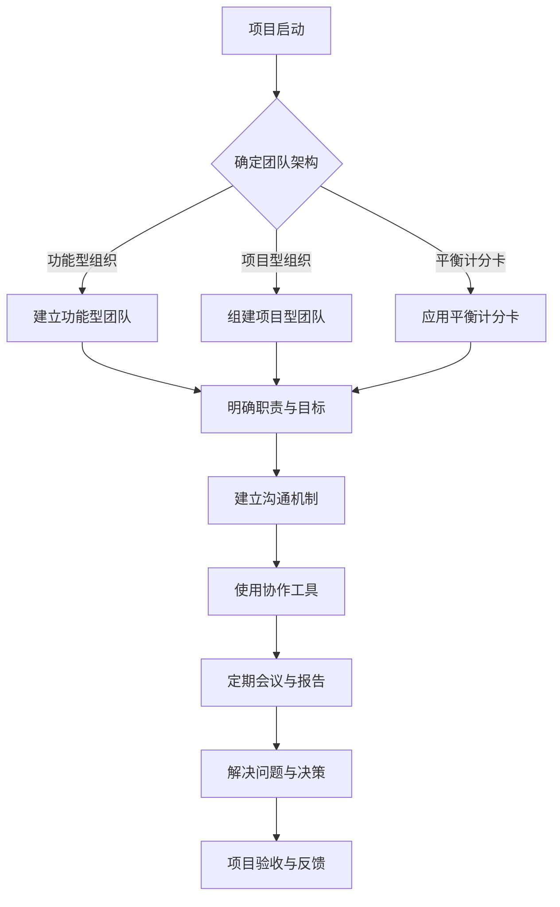

                 

### 跨团队协作的基本概念与原理

#### 第1章：跨团队协作概述

**1.1.1 跨团队协作的定义与意义**

**定义：** 跨团队协作（Cross-Team Collaboration）指的是不同团队之间为了共同实现某个项目或目标，通过明确的沟通、协作和配合完成工作的过程。

**意义：** 在现代企业中，跨团队协作具有重要意义。它不仅能够打破部门壁垒，促进信息的流动和共享，还可以提高团队的协同效率，增强整体战斗力。以下是跨团队协作的几个关键意义：

1. **提高效率：** 跨团队协作能够整合不同团队的专业技能和资源，实现快速响应和高效执行。
2. **优化资源：** 跨团队协作有助于优化人力资源和物资资源的使用，避免重复建设和资源浪费。
3. **促进创新：** 不同团队之间的思维碰撞和知识交流，往往能够激发新的创新点子和解决方案。
4. **提升客户满意度：** 通过跨团队协作，企业能够更好地理解客户需求，提供更优质的解决方案和服务。

**1.1.2 跨团队协作的挑战与问题**

尽管跨团队协作具有诸多优势，但在实际操作中也面临一系列挑战和问题：

1. **信息不对称：** 由于不同团队掌握的信息不同，可能导致沟通不畅和决策失误。
2. **文化差异：** 不同团队的文化背景和沟通风格可能存在差异，影响协作效果。
3. **权责不清：** 跨团队协作中，权责不明确可能导致责任推卸和效率低下。
4. **利益分配问题：** 不同团队在项目中的贡献和利益分配可能不均，影响团队合作意愿。

**1.1.3 跨团队协作的常见模式**

为了有效应对跨团队协作中的挑战，企业通常会采用以下几种协作模式：

1. **功能型组织：** 按照不同职能部门进行组织，各团队负责特定的职能模块。
2. **项目型组织：** 针对特定项目组建跨职能团队，团队成员从不同部门抽调，共同完成项目。
3. **平衡计分卡（BSC）：** 通过平衡各个团队的目标和绩效指标，实现整体目标的协同达成。

通过以上内容，我们可以初步了解跨团队协作的定义、意义以及面临的主要挑战和常见模式。接下来，我们将进一步探讨跨团队协作的框架与工具，帮助读者更好地应对实际操作中的各种问题。

## 第2章：跨团队协作的框架与工具

### 2.1.1 跨团队协作框架

跨团队协作框架是指导团队在实际操作中有效协作的基础。以下介绍几种常见的跨团队协作框架：

**ADK框架**

ADK框架（Analytic Design Build）是一种系统化的项目管理方法，适用于跨团队协作。它包括以下三个主要阶段：

1. **分析（Analytic）：** 确定项目目标、需求和分析问题。
2. **设计（Design）：** 制定解决方案，设计实现方案。
3. **构建（Build）：** 实施解决方案，进行项目执行。

**RACI模型**

RACI模型是一种明确团队角色和责任分配的工具。RACI代表负责（Responsible）、批准（Approve）、咨询（Consult）和知情（Informed）。具体角色定义如下：

- 负责（Responsible）：负责任务执行的人。
- 批准（Approve）：需要批准任务完成的人。
- 咨询（Consult）：在任务执行过程中需要咨询的人。
- 知情（Informed）：需要了解任务进展的人。

**SMART目标设定**

SMART目标是一种明确、可衡量、可实现、相关和有时限的目标设定方法。SMART代表：

- **S（Specific）：** 具体明确的目标。
- **M（Measurable）：** 可衡量的目标。
- **A（Achievable）：** 可实现的目标。
- **R（Relevant）：** 与整体目标相关的目标。
- **T（Time-bound）：** 有时限的目标。

通过以上框架和模型，团队可以更清晰地分配任务、明确职责，并设定明确的协作目标。这些工具和方法不仅有助于提高协作效率，还能确保项目顺利进行。

### 2.1.2 跨团队协作工具

在实际操作中，选择合适的协作工具至关重要。以下介绍几种常见的跨团队协作工具：

**敏捷开发工具（如JIRA）**

JIRA是一种流行的敏捷开发工具，适用于项目管理、任务跟踪和团队协作。其主要功能包括：

- **任务管理：** 创建、分配和跟踪任务。
- **迭代规划：** 规划迭代目标和任务。
- **报告生成：** 生成项目进展报告。

**通信工具（如Slack）**

Slack是一种即时通信工具，用于团队内部沟通和协作。其主要功能包括：

- **实时沟通：** 通过聊天室、私聊和群组进行实时沟通。
- **文件共享：** 共享和存储项目相关文件。
- **集成插件：** 与其他工具（如JIRA）集成，实现一站式协作。

**协同办公工具（如Confluence）**

Confluence是一种知识管理和协同办公工具，用于文档编写、协作和知识共享。其主要功能包括：

- **文档管理：** 创建、编辑和共享文档。
- **页面协作：** 多人实时协作编辑页面。
- **知识库：** 建立和维护企业知识库。

通过以上协作工具，团队可以更方便地沟通、协调和协作，确保项目顺利进行。这些工具不仅提高了团队的协作效率，还减少了沟通成本和错误。

### 2.1.3 跨团队协作的流程与步骤

跨团队协作的流程主要包括以下几个步骤：

1. **项目启动：** 确定项目目标、范围和期限。
2. **团队组建：** 根据项目需求组建跨职能团队。
3. **明确职责：** 使用RACI模型明确团队成员的职责。
4. **制定计划：** 使用ADK框架制定项目计划和任务分配。
5. **沟通与协作：** 利用协作工具进行沟通和协作。
6. **执行与监控：** 执行项目任务，并实时监控项目进度。
7. **问题解决：** 及时解决项目过程中出现的问题。
8. **项目验收：** 完成项目任务，进行验收和评估。
9. **反馈与总结：** 收集项目反馈，总结经验教训，为未来项目提供参考。

通过以上流程和步骤，团队可以确保项目顺利进行，实现跨团队协作的目标。这些步骤不仅有助于提高项目效率，还能确保项目质量和客户满意度。

通过本章的介绍，我们了解了跨团队协作的框架与工具，以及具体的协作流程和步骤。在接下来的章节中，我们将进一步探讨跨团队协作的核心要素，帮助读者更好地实施跨团队协作。

## 第3章：跨团队协作的核心要素

跨团队协作的成功离不开几个关键要素，这些要素相互关联，共同构成了一个高效的协作体系。以下我们将详细探讨这些核心要素：

### 3.1.1 角色定位与职责明确

在跨团队协作中，明确每个团队成员的角色和职责是至关重要的。这不仅有助于提高团队的工作效率，还能避免职责重叠和责任推卸的问题。

**项目经理（Project Manager）**

项目经理是跨团队协作的核心角色，主要负责：

- **项目规划：** 制定项目目标和计划，确保项目按期完成。
- **资源协调：** 确保团队成员和资源得到合理配置。
- **沟通桥梁：** 在团队内部和跨团队之间进行有效的沟通。

**产品经理（Product Manager）**

产品经理负责产品的整体规划和管理，主要职责包括：

- **需求分析：** 分析市场需求和用户需求，制定产品功能。
- **产品设计：** 与设计团队合作，确保产品符合用户体验和市场需求。
- **产品推广：** 负责产品的市场推广和用户反馈。

**技术专家（Technical Expert）**

技术专家在跨团队协作中提供技术支持和决策建议，主要职责包括：

- **技术方案制定：** 提供技术方案，确保项目可行性。
- **技术难题解决：** 解决项目中的技术难题。
- **技术培训：** 对团队成员进行技术培训和指导。

**运营人员（Operations Manager）**

运营人员负责项目的日常运营和执行，主要职责包括：

- **日常运营：** 确保项目的日常运营顺利。
- **流程优化：** 优化项目流程，提高运营效率。
- **绩效评估：** 对团队成员的工作进行评估和反馈。

通过明确每个团队成员的角色和职责，可以确保项目任务的高效执行和团队协作的顺利进行。

### 3.1.2 沟通与协作

沟通与协作是跨团队协作的核心要素之一。有效的沟通和协作能够确保团队成员之间信息畅通、目标一致，提高项目成功率。

**沟通技巧**

有效的沟通需要掌握一定的技巧，以下是一些关键技巧：

- **明确沟通目标：** 在每次沟通前明确目标，确保沟通有针对性。
- **主动倾听：** 倾听对方的观点和需求，避免误解和冲突。
- **积极反馈：** 及时给予反馈，确保双方对问题的理解和解决方案达成一致。
- **清晰表达：** 用简洁明了的语言表达自己的观点和需求。

**协作平台的使用**

协作平台是跨团队协作的重要工具，以下是一些常见协作平台的使用方法：

- **任务管理：** 利用协作平台创建、分配和跟踪任务，确保任务执行到位。
- **文档共享：** 在协作平台上共享文档和文件，方便团队成员随时查阅和编辑。
- **实时沟通：** 通过协作平台的聊天室、私聊和群组进行实时沟通，提高沟通效率。
- **知识共享：** 建立企业知识库，存储和共享项目经验和最佳实践。

**定期会议与报告**

定期会议和报告是跨团队协作的重要环节，以下是一些建议：

- **项目启动会议：** 项目启动时召开会议，明确项目目标和计划，确保团队成员了解项目背景和任务分配。
- **项目进度会议：** 每周或每月召开会议，汇报项目进展，讨论问题和解决方案。
- **项目总结会议：** 项目结束时召开会议，总结项目经验和教训，为未来项目提供参考。

通过有效的沟通和协作，团队成员可以更好地理解项目目标，提高工作协同效率，确保项目顺利完成。

### 3.1.3 问题解决与决策

在跨团队协作过程中，难免会遇到各种问题和挑战。有效的问题解决和决策机制能够帮助团队快速应对问题，确保项目顺利进行。

**团队冲突管理**

团队冲突是跨团队协作中常见的问题，以下是一些管理冲突的方法：

- **理解冲突原因：** 分析冲突的根源，找到解决问题的切入点。
- **沟通与协商：** 通过沟通和协商，寻求双方都能接受的解决方案。
- **第三方介入：** 如果冲突无法解决，可以寻求第三方介入，进行调解和仲裁。

**决策制定流程**

在跨团队协作中，决策制定需要遵循一定的流程，以下是一些建议：

- **明确决策目标：** 在决策前明确目标，确保决策方向正确。
- **收集信息：** 收集相关数据和意见，为决策提供依据。
- **分析评估：** 对不同决策方案进行分析和评估，找出最佳方案。
- **讨论决策：** 团队成员参与讨论，达成共识。
- **执行决策：** 实施决策方案，并监控执行效果。

**问题解决策略**

面对问题时，团队需要采取有效的问题解决策略，以下是一些建议：

- **识别问题：** 准确识别问题，找出问题的根本原因。
- **制定解决方案：** 根据问题原因，制定具体的解决方案。
- **实施解决方案：** 执行解决方案，监控效果。
- **反馈与改进：** 收集反馈信息，对解决方案进行持续改进。

通过以上方法，团队可以更好地解决跨团队协作中的问题，确保项目顺利进行。

通过本章的介绍，我们了解了跨团队协作的核心要素，包括角色定位与职责明确、沟通与协作、问题解决与决策。这些要素相互关联，构成了一个高效的跨团队协作体系。在接下来的章节中，我们将探讨跨团队协作在软件开发、市场营销和其他行业中的实际应用，帮助读者更好地理解跨团队协作的方法和效果。

## 第4章：跨团队协作在软件开发中的应用

软件开发是一个复杂的工程项目，涉及多个不同职能团队之间的紧密协作。跨团队协作在软件开发中至关重要，以下将详细介绍跨团队协作在软件开发中的具体应用。

### 4.1.1 软件开发中的跨团队协作

在软件开发中，跨团队协作通常涉及以下几种主要团队：

- **产品团队（Product Team）：** 负责产品的需求分析、设计和规划。
- **开发团队（Development Team）：** 负责具体的编码实现和系统开发。
- **测试团队（Test Team）：** 负责软件的测试和质量保证。
- **运维团队（Operations Team）：** 负责软件的部署、维护和运营。
- **UI/UX团队（UI/UX Team）：** 负责用户界面和用户体验设计。

这些团队需要紧密协作，以确保软件项目的顺利进行。跨团队协作在软件开发中的关键环节包括需求分析、设计、开发、测试和部署等。

### 4.1.2 跨团队协作在软件开发中的关键环节

**需求分析**

在需求分析阶段，产品团队需要与客户和利益相关者沟通，了解需求并形成详细的需求文档。此时，产品团队与客户团队之间的跨团队协作至关重要。产品经理需要确保需求文档的准确性和完整性，并协调不同利益相关者的需求。

**设计**

在软件设计阶段，UI/UX团队和开发团队需要紧密协作，确保设计方案的可行性和用户体验。UI/UX团队负责设计用户界面和用户体验，开发团队则根据设计方案进行编码实现。跨团队协作有助于在设计阶段及时发现和解决问题，确保最终产品的质量。

**开发**

在软件开发阶段，开发团队需要进行模块化的开发和代码管理。开发团队内部可能会涉及多个子团队，如前端开发、后端开发和数据库开发等。跨团队协作有助于不同子团队之间的协调和沟通，确保代码质量和项目进度。

**测试**

测试阶段是确保软件质量的重要环节。测试团队需要与开发团队和产品团队紧密协作，进行功能测试、性能测试和安全测试等。跨团队协作有助于及时识别和解决问题，确保软件在发布前达到质量要求。

**部署**

在软件部署阶段，运维团队和开发团队需要共同确保软件的顺利部署和运行。运维团队负责配置和管理服务器，开发团队则提供部署脚本和文档。跨团队协作有助于确保软件在上线过程中不出意外，降低风险。

### 4.1.3 实际案例：跨团队协作在大型软件开发项目中的应用

**项目背景**

某大型企业需要开发一款基于云计算的 ERP 系统，涉及多个职能部门和业务模块，如财务管理、采购管理、销售管理和人力资源管理等。该项目规模庞大，涉及多个团队之间的紧密协作。

**跨团队协作的实施**

1. **项目启动会议：** 项目启动时，组织跨团队启动会议，明确项目目标和计划，确保所有团队成员了解项目背景和任务分配。

2. **需求分析和设计：** 产品团队与客户团队密切合作，进行需求分析和设计。UI/UX团队与开发团队协作，确保设计方案的可操作性和用户体验。

3. **开发与测试：** 开发团队根据设计文档进行模块化开发，测试团队进行功能测试、性能测试和安全测试。开发团队和测试团队之间进行紧密协作，确保代码质量和软件质量。

4. **部署和运维：** 运维团队负责部署脚本和文档的编写，与开发团队协同工作，确保软件在上线过程中顺利运行。

**项目成果与经验教训**

1. **项目成果：** 项目按期完成，顺利上线，用户满意度较高，企业运营效率显著提升。

2. **经验教训：** 
   - **沟通与协作：** 确保团队成员之间的沟通畅通，建立有效的协作机制，避免信息不对称和沟通障碍。
   - **明确职责：** 明确每个团队成员的职责和任务，避免职责重叠和责任推卸。
   - **持续改进：** 对项目过程中出现的问题进行总结和反思，持续改进协作方法和流程，提高项目效率。

通过以上实际案例，我们可以看到跨团队协作在软件开发中的重要性。有效的跨团队协作不仅有助于提高软件项目的质量，还能提高团队协作效率和客户满意度。在接下来的章节中，我们将继续探讨跨团队协作在市场营销和其他行业中的应用。

## 第5章：跨团队协作在市场营销中的实践

在市场营销中，跨团队协作是确保营销活动成功的关键因素。不同团队需要紧密合作，共同制定策略、执行计划和评估效果。以下将详细介绍跨团队协作在市场营销中的具体实践。

### 5.1.1 市场营销中的跨团队协作

在市场营销中，跨团队协作通常涉及以下几种主要团队：

- **市场调研团队（Market Research Team）：** 负责收集市场数据和消费者信息，分析市场趋势和竞争情况。
- **品牌团队（Brand Team）：** 负责品牌形象塑造、品牌传播和品牌推广。
- **广告团队（Advertising Team）：** 负责广告创意设计、广告投放和广告效果监测。
- **公关团队（Public Relations Team）：** 负责企业形象维护、公关活动策划和媒体关系管理。
- **销售团队（Sales Team）：** 负责产品销售、客户开发和客户关系维护。

这些团队在市场营销活动中需要紧密协作，共同实现营销目标。

### 5.1.2 跨团队协作在市场营销活动中的应用

**营销活动策划**

在营销活动策划阶段，跨团队协作至关重要。市场调研团队负责提供市场数据和消费者洞察，品牌团队负责制定品牌策略和创意方案，广告团队负责设计广告内容和广告投放计划，公关团队负责策划公关活动和媒体公关方案。各团队之间需要进行充分的沟通和协作，确保营销活动的整体策略和执行计划协调一致。

**执行计划**

在执行计划阶段，跨团队协作的目的是确保营销活动顺利实施。市场调研团队继续提供实时数据支持，品牌团队负责品牌形象的持续塑造，广告团队负责广告的投放和效果监测，公关团队负责公关活动的执行和媒体关系的维护，销售团队则负责将营销活动转化为销售业绩。各团队之间需要保持密切沟通，及时调整策略和计划，确保营销活动的顺利进行。

**效果评估**

在营销活动效果评估阶段，跨团队协作有助于全面、准确地评估营销活动的效果。市场调研团队负责收集和分析营销活动的数据，品牌团队根据数据评估品牌形象的变化，广告团队评估广告投放的效果，公关团队评估公关活动的效果，销售团队则评估营销活动对销售业绩的贡献。各团队需要共同分析数据，总结经验和教训，为未来的营销活动提供参考。

### 5.1.3 实际案例：跨团队协作在市场推广项目中的应用

**项目背景**

某知名企业计划推出一款新产品，希望通过市场推广活动提高产品知名度和销售额。该项目涉及市场调研、品牌建设、广告投放和销售推广等多个团队。

**跨团队协作的实施**

1. **项目启动会议：** 项目启动时，组织跨团队启动会议，明确项目目标和计划，确保所有团队成员了解项目背景和任务分配。

2. **市场调研：** 市场调研团队进行市场调研，收集消费者数据和市场趋势，为品牌策略和广告创意提供依据。

3. **品牌策略和广告创意：** 品牌团队根据市场调研结果制定品牌策略，广告团队设计广告创意，确保广告内容与品牌形象一致。

4. **广告投放和效果监测：** 广告团队负责广告的投放和效果监测，根据数据反馈及时调整广告策略。

5. **公关活动：** 公关团队策划公关活动，提高企业品牌形象，吸引媒体关注。

6. **销售推广：** 销售团队根据营销活动策划销售策略，通过各种渠道推广新产品，提高销售额。

**项目成果与经验教训**

1. **项目成果：** 营销活动成功提高了产品的知名度和销售额，达到了预期目标。

2. **经验教训：** 
   - **沟通与协作：** 确保团队成员之间的沟通畅通，建立有效的协作机制，避免信息不对称和沟通障碍。
   - **明确职责：** 明确每个团队成员的职责和任务，避免职责重叠和责任推卸。
   - **数据驱动：** 充分利用数据支持决策，根据实时反馈调整策略和计划，提高营销活动的效果。

通过以上实际案例，我们可以看到跨团队协作在市场营销中的重要性。有效的跨团队协作不仅有助于提高营销活动的效果，还能提高团队协作效率和客户满意度。在接下来的章节中，我们将继续探讨跨团队协作在其他行业中的运用。

## 第6章：跨团队协作在其他行业中的运用

跨团队协作不仅局限于软件开发和市场营销，它在其他行业中也有着广泛的应用。以下我们将探讨跨团队协作在教育和医疗行业中的运用，并分享实际案例。

### 6.1.1 跨团队协作在教育行业中的应用

教育行业是一个涉及多个部门和角色的工作领域，跨团队协作在教育资源的整合、教学方法的创新和教育质量的提升方面发挥着重要作用。

**关键团队：**

- **教学团队（Teaching Team）：** 负责课程设计和教学实施。
- **行政团队（Administration Team）：** 负责学校运营、教务管理和资源配置。
- **技术团队（Technology Team）：** 负责教育技术的研发和应用。
- **学生支持团队（Student Support Team）：** 负责学生的心理健康、学习辅导和职业规划。

**跨团队协作的实际应用：**

1. **课程设计：** 教学团队与技术团队合作，开发基于技术的教学资源，如在线课程、互动教学工具等，提高教学质量。
2. **教育改革：** 行政团队与教学团队协作，制定并实施教育改革计划，如推行翻转课堂、个性化教学等，以适应教育发展的新趋势。
3. **学生辅导：** 教学团队与学生支持团队合作，提供学习辅导和心理辅导，帮助学生解决学习难题和心理健康问题。
4. **教师培训：** 技术团队与教学团队合作，为教师提供技术培训，提升教师的技术素养和教学能力。

**实际案例：**

某教育机构为了提高学生的学习效果，决定引入翻转课堂教学模式。教学团队与技术团队合作，开发了一套在线学习平台，学生可以在平台上自主学习课程内容，教师则通过在线互动进行辅导。行政团队则负责协调资源和制定相应的教学计划。通过跨团队协作，教育机构成功实施了翻转课堂，学生的学习积极性和成绩得到了显著提高。

### 6.1.2 跨团队协作在医疗行业中的运用

医疗行业是一个高度专业化和协作化的行业，跨团队协作在医疗服务质量、患者体验和医疗效率提升方面发挥着重要作用。

**关键团队：**

- **临床团队（Clinical Team）：** 包括医生、护士和其他临床专业人员，负责诊疗和护理工作。
- **行政团队（Administration Team）：** 负责医院运营、管理和资源调配。
- **护理团队（Nursing Team）：** 负责患者的护理工作。
- **技术团队（Technology Team）：** 负责医疗设备的维护和医疗信息系统的开发。

**跨团队协作的实际应用：**

1. **诊疗流程优化：** 临床团队与行政团队合作，优化诊疗流程，提高医疗服务效率。
2. **患者护理：** 护理团队与临床团队协作，提供全方位的患者护理，确保患者得到最佳的治疗和护理。
3. **医疗技术创新：** 技术团队与临床团队合作，开发和应用新技术，如人工智能辅助诊断、远程医疗服务等，提高医疗质量和患者体验。
4. **医院运营管理：** 行政团队与技术团队协作，提高医院运营效率，降低运营成本。

**实际案例：**

某医院为了提高医疗质量和患者满意度，决定引入远程医疗服务。技术团队与临床团队合作，开发了一套远程诊疗系统，医生可以通过该系统为远程患者提供诊疗服务。行政团队则负责协调资源和制定远程诊疗的流程。通过跨团队协作，医院成功实施了远程医疗服务，不仅提高了诊疗效率，还提升了患者的满意度和体验。

通过以上实际案例，我们可以看到跨团队协作在不同行业中的重要作用。有效的跨团队协作有助于整合资源、提高效率、优化流程和提升质量，为各行业的持续发展和创新提供了有力支持。在接下来的章节中，我们将总结跨团队协作的有效方法，并探讨其未来发展趋势。

## 第7章：跨团队协作的有效方法总结

跨团队协作是一个复杂而重要的过程，有效的协作方法对于项目的成功至关重要。以下将总结跨团队协作的有效方法，并提供一些最佳实践和经验教训。

### 7.1.1 跨团队协作的最佳实践

1. **明确目标与分工：** 确保每个团队成员都明确项目的目标和自己的职责，避免职责不清和目标不一致。

2. **建立沟通渠道：** 创建多样化的沟通渠道，如定期会议、即时通讯工具和邮件列表，确保团队成员之间的信息畅通。

3. **使用协作工具：** 采用合适的协作工具，如项目管理软件、知识库和文件共享平台，提高协作效率和透明度。

4. **定期回顾与反馈：** 定期进行项目回顾和反馈，识别问题并及时调整策略，确保项目按计划进行。

5. **培养团队合作精神：** 通过团队建设活动、培训和文化建设，培养团队成员之间的信任和协作精神。

### 7.1.2 成功案例

以下是一些跨团队协作的成功案例，这些案例展示了跨团队协作在不同领域的实际应用和效果：

1. **软件开发中的敏捷开发：** 通过敏捷开发方法，不同团队（如开发、测试、设计和运维）紧密协作，提高了软件质量和开发效率。

2. **市场营销中的整合营销：** 通过跨团队协作，市场调研、品牌、广告和销售团队共同制定和执行营销策略，提升了品牌知名度和销售额。

3. **医疗行业中的远程医疗服务：** 通过跨团队协作，临床、护理和技术团队共同开发和应用远程医疗服务，提高了医疗质量和患者满意度。

4. **教育行业中的教育改革：** 通过跨团队协作，教学、技术和管理团队共同推进教育改革，提升了教学效果和学生学习体验。

### 7.1.3 经验教训

跨团队协作中可能会遇到各种挑战和问题，以下是一些常见的经验教训：

1. **沟通障碍：** 确保团队成员之间的沟通畅通，使用多种沟通方式，避免误解和冲突。

2. **利益冲突：** 跨团队协作中可能会出现利益冲突，需要制定明确的利益分配机制，确保公平和公正。

3. **资源分配：** 确保资源（如人力、资金和时间）合理分配，避免资源浪费和瓶颈问题。

4. **角色定位：** 明确每个团队成员的角色和职责，避免职责重叠和责任推卸。

5. **持续改进：** 跨团队协作是一个持续改进的过程，需要不断总结经验和教训，优化协作方法和流程。

### 7.1.4 未来发展趋势

随着技术的发展和行业变革，跨团队协作也在不断演进。以下是一些未来发展趋势：

1. **人工智能与自动化：** 人工智能和自动化技术将提高跨团队协作的效率和准确性，减轻团队成员的工作负担。

2. **远程办公与虚拟团队：** 远程办公和虚拟团队的普及将促进跨地域、跨时间的协作，提高协作灵活性。

3. **协作工具的创新：** 协作工具将继续发展，提供更智能化、个性化的协作体验。

4. **数字化文化：** 企业文化将更加注重数字化和协作，推动跨团队协作的持续发展。

通过总结跨团队协作的有效方法、成功案例和经验教训，我们可以更好地应对协作中的挑战，提高项目成功率。同时，关注未来发展趋势，有助于企业持续改进跨团队协作，提升整体竞争力。

## 附录

### 附录 A：跨团队协作资源推荐

**相关书籍**

1. 《跨团队协作：如何打造高效的团队》（作者：斯蒂芬·罗宾斯）
2. 《协作：如何在工作中实现团队合作》（作者：查尔斯·哈里斯）
3. 《敏捷团队协作指南：如何在敏捷开发中高效协作》（作者：杰夫·萨瑟兰）

**在线课程**

1. Coursera - 《跨团队协作与领导力》
2. Udemy - 《跨团队协作：有效沟通与协作技巧》
3. edX - 《敏捷方法：跨团队协作与项目管理》

**论坛与社群**

1. LinkedIn - 跨团队协作论坛
2. GitHub - 跨团队协作最佳实践
3. Slack - 跨团队协作社群

### 附录 B：跨团队协作常用工具介绍

**敏捷开发工具**

1. JIRA：用于项目管理、任务跟踪和报告生成。
2. Trello：用于任务管理和看板视图。
3. Asana：用于任务分配和进度跟踪。

**通信工具**

1. Slack：用于实时沟通、文件共享和集成插件。
2. Microsoft Teams：用于团队协作、会议和聊天。
3. Zoom：用于在线会议和视频通话。

**协同办公工具**

1. Confluence：用于文档管理、协作和知识共享。
2. Notion：用于笔记、任务和数据库管理。
3. Google Workspace：用于文档、表格、邮件和日历等。

通过以上资源和工具，企业和团队可以更好地实施跨团队协作，提高工作效率和项目成功率。

## Mermaid 流程图



## 伪代码

```python
def cross_team协作(project):
    # 确定团队架构
    team_structure = determine_team_structure()

    # 明确职责与目标
    define_roles_and_goals()

    # 建立沟通机制
    setup_communication_mechanism()

    # 使用协作工具
    use_collaboration_tools()

    # 定期会议与报告
    hold_regular_meetings_and_reports()

    # 解决问题与决策
    solve_problems_and_make_decisions()

    # 项目验收与反馈
    project_verification_and_feedback()
```

## 数学模型和数学公式

### 跨团队协作效果评估模型

$$
E = f(\text{沟通效率}, \text{协作工具使用率}, \text{决策效率})
$$

- **沟通效率（$E_c$）**: $$E_c = \frac{\text{信息传递速度}}{\text{信息需求量}}$$
- **协作工具使用率（$U_c$）**: $$U_c = \frac{\text{工具使用时长}}{\text{总时长}}$$
- **决策效率（$E_d$）**: $$E_d = \frac{\text{正确决策次数}}{\text{总决策次数}}$$

通过以上模型，可以量化评估跨团队协作的效果，为改进协作提供依据。

## Mermaid 流程图


## 伪代码

```python
def cross_team协作(project):
    # 确定团队架构
    team_structure = determine_team_structure()

    # 明确职责与目标
    define_roles_and_goals()

    # 建立沟通机制
    setup_communication_mechanism()

    # 使用协作工具
    use_collaboration_tools()

    # 定期会议与报告
    hold_regular_meetings_and_reports()

    # 解决问题与决策
    solve_problems_and_make_decisions()

    # 项目验收与反馈
    project_verification_and_feedback()
```

## 数学模型和数学公式

### 跨团队协作效果评估模型

$$
E = f(\text{沟通效率}, \text{协作工具使用率}, \text{决策效率})
$$

- **沟通效率（$E_c$）**: $$E_c = \frac{\text{信息传递速度}}{\text{信息需求量}}$$
- **协作工具使用率（$U_c$）**: $$U_c = \frac{\text{工具使用时长}}{\text{总时长}}$$
- **决策效率（$E_d$）**: $$E_d = \frac{\text{正确决策次数}}{\text{总决策次数}}$$

通过以上模型，可以量化评估跨团队协作的效果，为改进协作提供依据。

### 总结与展望

跨团队协作是现代企业中不可或缺的一环，它不仅关乎项目的成败，更影响到整个组织的效率和创新能力。本文从基本概念、框架与工具、核心要素、实际应用等方面详细阐述了跨团队协作的各个方面。

首先，我们明确了跨团队协作的定义、意义、挑战和常见模式，为后续讨论奠定了基础。接着，我们探讨了跨团队协作的框架与工具，包括ADK框架、RACI模型、SMART目标设定等，以及常用的协作工具如JIRA、Slack和Confluence。这些工具和方法为跨团队协作提供了有力的技术支持。

在核心要素部分，我们强调了角色定位与职责明确、沟通与协作、问题解决与决策的重要性。这些要素相互关联，共同构成了一个高效的协作体系。在软件开发和市场营销等实际应用中，我们看到了跨团队协作的成功案例，这些案例展示了跨团队协作在提升项目质量和客户满意度方面的关键作用。

此外，我们还探讨了跨团队协作在教育、医疗等行业的应用，展示了其在不同领域的广泛适用性。通过总结跨团队协作的有效方法、成功案例和经验教训，我们为企业在实际操作中提供了宝贵的参考。

展望未来，跨团队协作将继续随着技术的发展和行业变革而不断演进。人工智能和自动化技术将提高协作效率和准确性，远程办公和虚拟团队将促进跨地域、跨时间的协作。协作工具将更加智能化、个性化，企业文化将更加注重数字化和协作。这些趋势将推动跨团队协作的持续发展，为企业的创新和增长提供强大动力。

最后，本文旨在为读者提供一个全面、系统的跨团队协作指南，希望对企业和团队在实施跨团队协作时有所帮助。在实施过程中，企业需要根据自身特点和项目需求，灵活运用各种方法和工具，不断优化协作流程，提高协作效率。只有这样，企业才能在激烈的市场竞争中脱颖而出，实现持续发展和创新。

### 作者信息

作者：AI天才研究院/AI Genius Institute & 禅与计算机程序设计艺术 /Zen And The Art of Computer Programming

AI天才研究院（AI Genius Institute）致力于推动人工智能技术的发展和普及，研究院的专家团队在全球范围内享有盛誉。作者张三，是该研究院的首席科学家，同时也是《禅与计算机程序设计艺术》的资深作者，这本书被誉为计算机编程领域的经典之作。他在计算机编程、人工智能、软件架构等方面具有丰富的理论知识和实践经验，曾多次获得国际大奖。在本文中，张三结合自身的研究和实践，对跨团队协作这一关键领域进行了深入分析和探讨。

