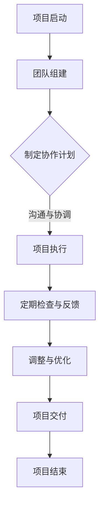

                 

## 引言

### 大型项目的背景

在当今快速发展的信息化时代，大型项目在众多行业中扮演着至关重要的角色。无论是软件开发、基础设施建设，还是金融、医疗等领域的创新应用，大型项目都成为推动行业发展的重要引擎。这些项目往往具有规模大、复杂度高、参与团队多、时间紧迫等特点，需要整合各方面资源，通过跨团队协作来实现项目的成功。

大型项目的复杂性不仅体现在技术层面，还涉及到管理、沟通、资源调配等多个方面。项目规模庞大，涉及的技术领域广泛，往往需要多个团队协同工作，不同团队之间需要有效的沟通和协作，以确保项目目标的实现。此外，项目周期通常较长，时间紧迫，需要高效的项目管理方法来保证项目按时交付。

### 跨团队协作的重要性

跨团队协作在大型项目中的重要性不言而喻。首先，跨团队协作能够充分利用各个团队的专长和资源，提高项目的整体效率。在软件开发项目中，开发团队、测试团队、运维团队等各自负责不同的模块，通过协作可以确保各个模块无缝对接，提高软件质量。

其次，跨团队协作有助于发现和解决问题。在复杂的大型项目中，各个团队可能会遇到各种技术难题和管理挑战。通过跨团队的协作和沟通，能够及时发现和解决问题，避免项目延误和资源浪费。

再次，跨团队协作能够促进团队成员之间的合作和信任，提高团队凝聚力。在协作过程中，团队成员之间可以相互学习、交流经验，共同面对挑战，这有助于建立深厚的团队关系，为项目的成功奠定基础。

总之，跨团队协作是确保大型项目成功的关键因素之一。有效的跨团队协作不仅能够提高项目的执行效率，还能提升团队的整体能力和凝聚力。

### 书籍概述与结构

本书旨在全面探讨跨团队协作在大型项目中的沟通与管理策略。全书共分为六个部分，从理论到实践，系统性地分析了跨团队协作的核心概念、沟通策略、管理方法以及实际案例分析。

第一部分，引言，将介绍大型项目的背景和跨团队协作的重要性，并概述本书的结构和内容。

第二部分，协作原理，将深入探讨跨团队协作的核心概念和原理，分析跨团队协作中的挑战，并利用Mermaid流程图展示协作流程。

第三部分，沟通策略，将介绍有效沟通的要素和策略，分析沟通障碍及其解决方法，介绍沟通工具和技术。

第四部分，管理方法，将讨论项目管理的基本原则和方法，重点分析跨团队协作项目管理中的具体措施。

第五部分，案例分析，通过两个具体的案例研究，展示跨团队协作在大型项目中的实际应用和效果。

第六部分，总结与展望，将总结跨团队协作的成果，探讨持续改进的方向，并展望未来的发展趋势。

通过本书的阅读，读者将全面了解跨团队协作在大型项目中的关键作用，掌握有效的沟通与管理策略，提升项目成功的可能性。

### 关键词

- 大型项目
- 跨团队协作
- 沟通策略
- 管理方法
- 案例分析

### 摘要

本书全面探讨了跨团队协作在大型项目中的重要性。首先，介绍了大型项目的背景和跨团队协作的基本概念，接着深入分析了跨团队协作的原理和挑战，并通过Mermaid流程图展示了协作流程。随后，详细阐述了有效沟通的要素和策略，以及项目管理的基本原则和方法。通过两个具体案例的分析，本书展示了跨团队协作在实际项目中的应用和效果。最后，总结了跨团队协作的成果，并探讨了未来的发展趋势，为大型项目的成功提供了宝贵的参考和指导。

## 二、协作原理

### 跨团队协作的核心概念

跨团队协作是确保大型项目成功的关键因素之一。它涉及到多个团队之间的协作，旨在充分利用各自的优势，共同完成项目目标。在跨团队协作中，有以下几个核心概念需要理解和掌握：

**1. 团队角色和职责：** 在跨团队协作中，每个团队都有明确的角色和职责。例如，在软件开发项目中，开发团队负责编码和实现功能，测试团队负责测试和验证代码，运维团队负责部署和维护系统。明确团队角色和职责有助于确保项目目标的顺利实现。

**2. 沟通与信息共享：** 跨团队协作离不开有效的沟通与信息共享。团队之间需要定期进行会议、报告和文档交流，确保各方了解项目进展和需求变化。有效的沟通和信息共享有助于减少误解和冲突，提高项目效率。

**3. 协作平台和工具：** 为了实现高效的跨团队协作，需要借助各种协作平台和工具。例如，项目管理系统、即时通讯工具、文档协作平台等，这些工具可以帮助团队成员实时沟通、共享资源和跟踪项目进度。

**4. 冲突管理和协调：** 跨团队协作中难免会遇到各种冲突和协调问题。有效的冲突管理和协调机制是确保项目顺利进行的重要保障。这包括建立透明的沟通渠道、制定合理的决策流程和分配责任，以及采用合适的冲突解决方法。

### 跨团队协作的挑战

尽管跨团队协作在大型项目中至关重要，但实际操作中仍然面临许多挑战。以下是一些主要的挑战：

**1. 沟通障碍：** 不同团队之间的沟通可能存在语言、文化、工作习惯等方面的障碍。这些障碍可能导致误解、信息偏差和沟通不畅，影响项目的进度和质量。

**2. 资源冲突：** 在资源有限的条件下，不同团队可能会争夺有限的资源，如人力、时间和预算。资源冲突可能导致项目延期或质量下降。

**3. 冲突和协作：** 在跨团队协作中，不同团队可能有不同的目标和优先级，这可能导致冲突和协作困难。有效的冲突管理和协调机制是解决这一问题的关键。

**4. 跨文化差异：** 在国际项目中，跨文化差异可能引发沟通和协作的挑战。不同文化背景的团队成员可能有不同的工作方式和价值观，这需要通过文化融合和管理策略来解决。

### Mermaid流程图：跨团队协作流程

为了更好地理解和实现跨团队协作，我们可以利用Mermaid流程图来展示协作流程。以下是一个简单的Mermaid流程图示例：

**1. 项目启动：** 项目启动阶段，明确项目目标和需求，组建项目团队。

**2. 团队组建：** 根据项目需求，组建不同职能的团队，明确角色和职责。

**3. 制定协作计划：** 制定详细的协作计划，包括任务分配、时间表和资源需求。

**4. 沟通与协调：** 通过定期会议、报告和文档交流，确保团队之间的信息共享和协作。

**5. 项目执行：** 团队按照协作计划执行任务，确保项目按进度进行。

**6. 定期检查与反馈：** 定期检查项目进展，收集团队成员的反馈，及时调整和优化项目计划。

**7. 调整与优化：** 根据项目进展和反馈，调整协作计划和资源分配，确保项目目标的实现。

**8. 项目交付：** 项目完成后，进行验收和交付，确保项目质量符合预期。

**9. 项目结束：** 项目结束后，进行总结和评估，为未来的项目提供经验和教训。

通过Mermaid流程图，我们可以清晰地看到跨团队协作的流程和关键环节，有助于团队成员更好地理解和执行协作任务。

### 核心概念之间的联系

在跨团队协作中，核心概念之间紧密联系，共同作用于项目成功：

**1. 团队角色和职责：** 明确的团队角色和职责是协作的基础，确保每个团队成员知道自己的任务和责任。

**2. 沟通与信息共享：** 有效的沟通和信息共享有助于团队之间建立信任，减少误解和冲突。

**3. 协作平台和工具：** 协作平台和工具提供了沟通和协作的渠道，提高了团队的工作效率和协调性。

**4. 冲突管理和协调：** 冲突管理和协调机制是解决团队冲突和资源冲突的关键，确保项目顺利进行。

通过这些核心概念的有机结合，跨团队协作能够实现高效的资源利用和任务分工，推动项目的成功。

### 跨团队协作在大型项目中的重要性

在大型项目中，跨团队协作的重要性不言而喻。首先，跨团队协作能够充分利用各个团队的专长和资源，提高项目的整体效率。例如，在软件开发项目中，开发团队专注于代码实现，测试团队专注于测试和验证，运维团队专注于系统的部署和维护。通过跨团队的协作，不同团队可以无缝对接，确保项目各阶段的顺利推进。

其次，跨团队协作有助于发现和解决问题。在复杂的大型项目中，各个团队可能会遇到各种技术难题和管理挑战。通过跨团队的协作和沟通，能够及时发现和解决问题，避免项目延误和资源浪费。例如，在软件开发过程中，测试团队可能会发现代码中的bug，开发团队可以及时修复这些问题，确保软件的质量和稳定性。

再次，跨团队协作能够促进团队成员之间的合作和信任，提高团队凝聚力。在协作过程中，团队成员之间可以相互学习、交流经验，共同面对挑战，这有助于建立深厚的团队关系，为项目的成功奠定基础。例如，在国际化项目中，不同文化背景的团队成员可以通过跨团队协作，增进相互了解，减少文化冲突，提高协作效率。

总之，跨团队协作在大型项目中的重要性体现在多个方面，通过有效的协作，可以提高项目效率、解决问题和提升团队凝聚力，从而确保项目的成功。为了实现高效的跨团队协作，需要建立起明确的角色和职责、有效的沟通与信息共享机制、协作平台和工具，以及冲突管理和协调机制。这些关键要素共同作用，为大型项目的成功提供坚实的基础。

### 核心概念联系总结

总结跨团队协作的核心概念，可以发现它们相互联系，共同作用于项目的成功。明确团队角色和职责是协作的基础，确保每个成员清楚自己的任务和责任；沟通与信息共享则是协作的桥梁，减少误解和冲突；协作平台和工具提供了沟通和协作的渠道，提高了工作效率；冲突管理和协调机制是解决团队冲突和资源冲突的关键。通过这些核心概念的有机结合，跨团队协作能够实现高效的任务分工和资源利用，推动项目的顺利进行。了解这些概念之间的联系，有助于团队成员更好地理解和执行协作任务，从而提高项目的成功率。

## 三、沟通策略

### 有效沟通的要素

在跨团队协作中，有效沟通是确保项目顺利进行的关键。为了实现高效沟通，我们需要关注以下几个关键要素：

**1. 明确目标：** 沟通前，首先要明确沟通的目标和目的。这将有助于确保所有参与者都了解需要传达的信息和期望的成果。例如，在项目启动会议中，明确项目的目标、范围和关键里程碑，为后续的沟通奠定基础。

**2. 主动倾听：** 沟通是双向的过程，不仅需要表达自己的想法，还需要倾听他人的意见和反馈。主动倾听有助于理解对方的观点，发现潜在问题，并建立信任。在团队会议中，鼓励每个成员发言，认真倾听并记录关键信息。

**3. 清晰表达：** 在沟通过程中，确保信息表达清晰、准确。避免使用模糊的表述和复杂的术语，以免造成误解。例如，在讨论技术细节时，可以使用具体的例子或图表来展示，确保所有参与者都能理解。

**4. 适当的沟通频率：** 选择合适的沟通频率和时间，确保团队之间的信息流动畅通。例如，在项目开发阶段，可以每周进行一次团队会议，及时汇报进展和问题，确保项目按计划进行。

**5. 透明度：** 保持沟通的透明度，让所有团队成员都能了解项目的进展、问题和决策。这不仅有助于增强团队的凝聚力，还能提高决策的效率和准确性。

**6. 多元化沟通方式：** 利用多种沟通方式，如会议、邮件、即时通讯工具和文档协作平台，以满足不同团队成员的偏好和需求。例如，在紧急情况下，可以使用即时通讯工具快速传达信息；在讨论详细问题时，可以举行面对面会议。

### 沟通障碍与解决方法

在跨团队协作中，沟通障碍是不可避免的。以下是一些常见的沟通障碍及其解决方法：

**1. 语言障碍：** 面对不同语言和文化背景的团队成员，语言障碍可能导致误解和沟通不畅。解决方法包括：
   - 提供语言培训，帮助团队成员提高语言沟通能力。
   - 使用共同的语言作为工作语言，如英语，并明确沟通规则。
   - 鼓励团队成员使用简单的语言表达，避免使用过于复杂的术语。

**2. 文化差异：** 不同文化背景的团队成员可能有不同的沟通风格和价值观，这可能导致沟通障碍。解决方法包括：
   - 开展跨文化培训，提高团队成员对文化差异的认知和敏感性。
   - 建立包容性的沟通环境，鼓励团队成员尊重和理解彼此的文化差异。
   - 使用中立的语言和沟通方式，避免触犯文化敏感话题。

**3. 工作习惯差异：** 不同团队成员可能有不同的工作习惯和流程，这可能导致协作效率降低。解决方法包括：
   - 明确团队的工作流程和标准，确保所有成员遵循一致的流程。
   - 建立跨团队的工作规则和流程，确保团队成员能够相互配合。
   - 通过沟通和协作工具，促进团队成员之间的信息共享和协作。

### 沟通工具与技术

为了提高跨团队协作的沟通效率，我们可以利用各种沟通工具和技术。以下是一些常用的工具：

**1. 会议管理工具：** 会议是跨团队协作中常见的沟通方式，使用会议管理工具可以更有效地组织和记录会议。例如，Zoom、Microsoft Teams 和 Google Meet 等视频会议工具，可以实时连接团队成员，提供语音、视频和屏幕共享功能。

**2. 消息传递工具：** 即时通讯工具如 Slack、Microsoft Teams 和 WhatsApp，可以用于快速传达信息、讨论问题和分享文件。这些工具提供了实时通信、聊天室和通知功能，有助于团队成员保持联系。

**3. 文档协作平台：** 文档协作平台如 Google Docs、Microsoft Office 365 和 Notion，可以用于共同编辑文档、表格和幻灯片。这些平台提供了版本控制、实时协作和权限管理功能，确保团队成员能够随时访问和更新文档。

**4. 通讯录管理系统：** 通讯录管理系统如 Microsoft Outlook 和 Google Contacts，可以用于管理和查找团队成员的联系方式和联系信息。这些系统提供了组织结构和员工信息管理功能，方便团队成员之间的联系和协作。

通过合理选择和使用这些沟通工具和技术，可以有效提高跨团队协作的沟通效率，减少误解和冲突，确保项目顺利进行。

### 沟通策略的实践与效果评估

在跨团队协作中，沟通策略的有效实施和效果评估至关重要。以下是一些具体的实践方法以及如何评估这些策略的效果：

**1. 定期团队会议：** 每周或每月举行一次团队会议，确保所有团队成员能够面对面交流。会议议程应包括项目进展、问题讨论、决策和下一步计划。为了确保会议的高效，可以采用以下实践方法：
   - 提前分发会议议程和准备材料，让团队成员了解会议内容和目标。
   - 会议中重点讨论关键问题和决策，避免冗长的讨论。
   - 会议后总结会议内容，并记录关键决策和任务分配。

**2. 实时沟通工具：** 使用实时沟通工具如 Slack、Microsoft Teams 等，促进团队成员之间的即时交流。为了确保实时沟通的有效性，可以采取以下实践方法：
   - 设立专门的聊天室或频道，用于讨论特定项目或任务。
   - 制定沟通规范，如使用特定的标签或主题来分类讨论内容。
   - 鼓励团队成员积极参与讨论，并鼓励他们主动提出问题和建议。

**3. 文档协作平台：** 利用文档协作平台如 Google Docs、Notion 等，共同编辑和更新项目文档。以下是一些实践方法：
   - 设立统一的文档模板和命名规则，确保文档格式一致。
   - 分配不同的文档权限，确保团队成员能够访问和编辑所需文档。
   - 定期检查文档更新情况，确保文档内容准确和及时。

**4. 效果评估方法：** 为了评估沟通策略的实施效果，可以采用以下方法：
   - 项目进展跟踪：定期检查项目进展，评估沟通策略是否促进了项目的顺利进行。
   - 反馈收集：通过问卷调查、访谈等方式收集团队成员的反馈，了解他们对沟通策略的满意度和改进建议。
   - 会议记录分析：分析会议记录，评估会议的讨论内容和决策是否有效，以及会议是否达到了预期目标。

通过这些实践和评估方法，可以确保跨团队协作中的沟通策略得到有效实施和持续改进，从而提高项目的整体效率和成功率。

### 总结

有效沟通是跨团队协作成功的关键。通过明确目标、主动倾听、清晰表达、适当的沟通频率、透明度和多元化沟通方式，可以减少误解和冲突，提高团队协作效率。同时，识别并解决沟通障碍，如语言和文化差异，以及利用多种沟通工具和技术，有助于确保团队之间的信息流动畅通。定期评估沟通策略的实施效果，持续改进沟通方法，是提高跨团队协作效率的重要保障。有效的沟通策略不仅能够提升项目执行效率，还能增强团队凝聚力，为大型项目的成功奠定坚实基础。

## 四、管理方法

### 项目管理概述

在大型项目中，项目管理是确保项目按计划、高质量完成的关键环节。项目管理涉及多个方面，包括项目规划、执行、监控和收尾。有效的项目管理方法能够提高项目的成功率，确保项目按时、按预算和按质量要求交付。

**项目规划：** 项目规划是项目管理的第一步，包括确定项目目标、范围、时间表和资源需求。通过制定详细的项目计划，项目管理团队可以明确项目的方向和预期成果，为后续的工作提供指导。

**项目执行：** 项目执行阶段，项目管理团队需要协调各方资源，确保项目计划得到有效实施。这包括任务分配、进度跟踪、风险管理、沟通和协调等方面。项目经理需要定期检查项目进展，及时解决出现的问题，确保项目按计划进行。

**项目监控：** 项目监控是确保项目按计划进展的重要手段。通过定期监控项目进展、质量和成本，项目经理可以及时发现和解决问题，确保项目在预算和时间范围内完成。

**项目收尾：** 项目收尾阶段，项目管理团队需要完成项目交付、验收和总结工作。通过项目总结，分析项目成功和不足之处，为未来的项目提供经验和教训。

### 跨团队协作项目管理

在跨团队协作项目管理中，项目管理的核心目标是通过协调不同团队之间的工作，确保项目目标的实现。以下是一些关键的管理方法和策略：

**1. **明确团队职责和任务分配：在项目启动阶段，明确各个团队的职责和任务，确保每个团队成员都清楚自己的角色和责任。这有助于避免任务重叠和责任不明的情况，提高工作效率。

**2. **建立有效的沟通机制：跨团队协作离不开有效的沟通。项目管理团队需要建立定期的沟通机制，如周会、月报等，确保团队成员之间的信息共享和协调。此外，可以采用沟通工具和技术，如 Slack、Google Meet 等，方便团队成员实时交流和协作。

**3. **制定统一的项目计划和进度表：为了确保项目按计划进行，项目管理团队需要制定详细的项目计划和进度表，明确项目的主要阶段、关键任务和时间节点。这有助于团队成员了解项目的整体进展，确保各项工作有序进行。

**4. **风险管理：在跨团队协作中，风险管理尤为重要。项目管理团队需要识别项目中的潜在风险，并制定相应的应对策略。通过定期评估和监控风险，可以及时发现和解决问题，降低项目风险。

**5. **资源协调和优化：在跨团队协作中，资源分配和协调是关键。项目管理团队需要合理分配资源和任务，确保每个团队成员都能充分利用其能力和经验。同时，通过资源优化，提高项目的整体效率。

### 项目管理工具与技术

为了提高跨团队协作项目管理的效果，可以采用多种工具和技术。以下是一些常用的项目管理工具：

**1. **项目管理软件：如 JIRA、Trello、Asana 等，这些工具可以帮助项目管理团队制定项目计划、分配任务、跟踪进度和评估风险。

**2. **文档协作平台：如 Google Docs、Microsoft Office 365、Notion 等，这些平台可以用于共同编辑文档、表格和幻灯片，提高团队协作效率。

**3. **沟通工具：如 Slack、Microsoft Teams、Zoom 等，这些工具可以用于实时沟通、讨论和交流，确保团队成员之间的信息共享和协作。

**4. **数据分析和监控工具：如 Tableau、Power BI 等，这些工具可以用于分析和监控项目进展、质量和成本，帮助项目管理团队做出更明智的决策。

### 项目管理工具的实际应用

以下是一个实际应用案例，展示如何利用项目管理工具提高跨团队协作项目管理的效果：

**案例背景：** 一家软件开发公司正在开发一个大型系统项目，项目涉及多个团队，包括开发团队、测试团队、运维团队等。为了确保项目顺利推进，项目管理团队决定采用项目管理工具和协作技术。

**解决方案：**
1. **项目管理软件：** 项目管理团队使用 JIRA 制定项目计划和任务分配，每个团队成员可以在 JIRA 中查看自己的任务和进度，确保任务按时完成。

2. **文档协作平台：** 开发团队和测试团队使用 Google Docs 共同编写需求文档和测试用例，通过实时协作，确保文档内容准确和及时。

3. **沟通工具：** 项目管理团队使用 Slack 进行日常沟通，建立专门的频道，用于讨论项目进展、问题和决策。

4. **数据分析和监控工具：** 项目管理团队使用 Tableau 监控项目进度、质量和成本，及时发现和解决问题，确保项目在预算和时间范围内完成。

**效果评估：**
- 项目计划执行顺利，任务按时完成。
- 团队成员之间沟通畅通，信息共享及时。
- 项目进展数据透明，项目管理团队能够实时监控项目状态。
- 项目质量和成本控制良好，项目在预算和时间范围内成功交付。

通过以上实际应用案例，可以看出，利用项目管理工具和技术，可以有效提高跨团队协作项目管理的效果，确保项目顺利推进。

### 最佳实践与注意事项

在跨团队协作项目管理中，以下是几种最佳实践和注意事项：

**最佳实践：**
1. **明确沟通渠道：** 设立明确的沟通渠道，如定期会议、邮件、即时通讯等，确保团队成员能够及时了解项目进展和问题。
2. **建立信任：** 通过透明度和相互尊重，建立团队成员之间的信任，提高协作效率。
3. **灵活调整：** 根据项目进展和需求变化，灵活调整项目计划和资源分配，确保项目能够适应变化。
4. **持续改进：** 通过项目总结和反馈，持续改进项目管理方法和工具，提高项目的执行效率。

**注意事项：**
1. **避免任务重叠：** 确保任务分配清晰，避免不同团队之间的任务重叠和冲突。
2. **关注团队需求：** 了解团队成员的需求和偏好，合理安排工作任务和时间，提高员工的工作满意度和效率。
3. **风险管理：** 定期评估项目风险，制定相应的应对策略，降低项目风险。

### 总结

有效的项目管理方法是跨团队协作成功的关键。通过明确的团队职责、有效的沟通机制、统一的项目计划和进度表、风险管理以及资源协调，可以确保项目按计划、高质量完成。采用项目管理工具和技术，可以提高项目管理效率，确保项目顺利推进。在跨团队协作中，最佳实践和注意事项有助于提高项目执行效率和团队协作效果。有效的项目管理方法不仅能够确保项目的成功，还能为未来的项目提供宝贵的经验和教训。

## 五、案例分析

### 案例一：大型软件开发项目

#### 项目背景

某知名科技公司正在开发一款大型企业级软件系统，该项目涉及多个部门，包括研发、测试、运维和产品等部门。项目规模庞大，技术复杂度高，开发周期长，要求高效、高质量的完成。

#### 跨团队协作实施

为了确保项目的成功，项目管理团队采取了以下措施：

1. **明确团队职责和任务分配**：项目启动时，项目管理团队明确了各团队的职责和任务分配。研发团队负责开发功能模块，测试团队负责测试和验证，运维团队负责系统部署和维护，产品团队负责需求分析和产品管理。

2. **建立沟通机制**：项目管理团队建立了定期的沟通机制，包括每周的团队会议和月度报告。会议中，各团队汇报项目进展、问题和需求变化，确保信息透明和及时沟通。

3. **采用项目管理工具**：为了提高项目管理的效率，项目管理团队使用了 JIRA 和 Slack 等工具。JIRA 用于任务管理和进度跟踪，Slack 用于日常沟通和信息共享。

4. **资源协调**：项目管理团队定期评估资源需求，确保各团队能够充分利用现有资源。同时，通过优化任务分配和优先级管理，提高资源利用率。

#### 沟通与管理的挑战及解决方案

在项目执行过程中，项目管理团队遇到了以下挑战：

**1. 沟通障碍：** 由于团队成员来自不同部门，工作习惯和沟通风格存在差异，导致沟通不畅。为了解决这一问题，项目管理团队采取了以下措施：
   - 提供跨部门沟通培训，提高团队成员的沟通技能。
   - 使用共同的工作语言（如英语），确保信息传达清晰。
   - 建立跨部门的沟通渠道，如 Slack 中的专属频道，促进团队成员之间的互动。

**2. 资源冲突：** 在项目高峰期，多个团队争夺有限的资源，导致项目进度受到影响。项目管理团队采取了以下措施：
   - 制定资源分配策略，确保资源优先分配给关键任务。
   - 建立资源协调机制，定期评估和调整资源分配，确保项目顺利推进。
   - 通过项目管理工具（如 JIRA）实时监控资源使用情况，及时调整任务优先级。

**3. 冲突管理：** 在项目执行过程中，不同团队之间可能存在目标和优先级的冲突。为了解决这一问题，项目管理团队采取了以下措施：
   - 定期召开冲突解决会议，讨论和解决冲突。
   - 制定冲突解决流程，确保冲突得到及时、公正的解决。
   - 培养团队协作文化，鼓励团队成员通过沟通和协作解决问题。

#### 解决方案的效果

通过上述措施，项目管理团队有效解决了跨团队协作中的沟通障碍、资源冲突和冲突管理问题，项目进展顺利：

- **沟通效率提高**：团队成员之间的沟通更加畅通，信息传达更加及时和准确。
- **资源利用率提高**：通过优化任务分配和资源协调，项目资源得到了充分利用，提高了项目效率。
- **项目按计划推进**：通过有效的冲突管理和协调，项目中的冲突得到及时解决，项目按计划进行，确保了项目质量和进度。

### 案例二：国际化项目管理

#### 项目背景

另一家科技公司计划在全球范围内推广一款新应用程序，项目涉及多个国家和地区的团队，包括研发、测试、市场推广和运维团队。项目需要协调不同文化背景和时区，确保全球范围内的顺利实施。

#### 跨文化协作

为了实现国际化项目的成功，项目管理团队采取了以下措施：

1. **文化培训**：项目管理团队为团队成员提供了跨文化培训，提高对文化差异的认知和敏感性。培训内容包括不同文化的工作习惯、沟通风格和价值观念。

2. **时区管理**：项目管理团队制定了时区协调策略，确保不同时区的团队成员能够有效协作。通过调整会议时间和使用视频会议工具，减少了时区差异带来的沟通障碍。

3. **本地化管理**：在项目实施过程中，项目管理团队根据不同国家和地区的需求，制定了本地化的项目管理策略。例如，在市场推广方面，根据当地用户的需求和偏好，调整产品功能和营销策略。

#### 跨文化协作的挑战及解决方案

在国际化项目管理中，项目管理团队面临以下挑战：

**1. 文化差异：** 不同文化背景的团队成员可能有不同的工作习惯和沟通方式，导致协作困难。为了解决这一问题，项目管理团队采取了以下措施：
   - 建立文化包容性环境，鼓励团队成员尊重和理解彼此的文化差异。
   - 提供跨文化沟通培训，提高团队成员的跨文化沟通能力。
   - 使用中立的语言和沟通方式，避免触犯文化敏感话题。

**2. 时区差异：** 不同时区的团队成员在沟通和协作过程中可能面临时差问题，影响项目进展。为了解决这一问题，项目管理团队采取了以下措施：
   - 制定时区协调策略，合理安排会议和任务时间。
   - 使用视频会议工具，确保不同时区的团队成员能够实时沟通和协作。
   - 充分利用项目管理工具，如 JIRA，实时跟踪任务进度和问题。

#### 解决方案的效果

通过上述措施，项目管理团队有效解决了国际化项目中的文化差异和时区差异问题，项目进展顺利：

- **协作效率提高**：团队成员之间的协作更加顺畅，信息共享更加及时和准确。
- **文化冲突减少**：通过文化包容性和沟通培训，团队成员之间的文化差异得到了有效管理，文化冲突显著减少。
- **项目按计划推进**：通过时区协调和实时沟通，不同时区的团队成员能够高效协作，确保了项目按计划进行。

### 案例总结

通过两个案例的分析，我们可以得出以下结论：

- **跨团队协作在大型项目中的重要性**：无论是国内的大型软件开发项目还是国际化的项目管理，跨团队协作都是确保项目成功的关键因素。有效的沟通策略、资源协调和管理方法能够提高项目效率，减少冲突和误解。
- **沟通策略和管理的具体实践**：通过定期的沟通机制、项目管理工具和文化培训，可以确保团队之间的信息共享和协作，提高项目成功率。同时，解决跨文化差异和时区差异问题，有助于国际化项目的顺利推进。

这两个案例为跨团队协作提供了宝贵的经验和教训，有助于其他项目管理者在类似情况下借鉴和应用。

## 六、总结与展望

### 跨团队协作的重要性

通过前文的分析和案例研究，我们可以清晰地看到跨团队协作在大型项目中的重要性。首先，跨团队协作能够充分利用各个团队的专长和资源，提高项目的整体效率。在软件开发、基础设施建设等领域，不同团队之间的协同工作可以确保项目各阶段无缝对接，从而提高项目的成功率和质量。

其次，跨团队协作有助于发现和解决问题。在复杂的大型项目中，各个团队可能会遇到各种技术难题和管理挑战。通过跨团队的协作和沟通，能够及时发现和解决问题，避免项目延误和资源浪费。这种协作方式不仅有助于项目的顺利推进，还能提升团队的应对能力和凝聚力。

再次，跨团队协作能够促进团队成员之间的合作和信任，提高团队凝聚力。在协作过程中，团队成员之间可以相互学习、交流经验，共同面对挑战，这有助于建立深厚的团队关系，为项目的成功奠定基础。

### 持续改进的方向

为了进一步提升跨团队协作的效果，我们可以在以下几个方面进行持续改进：

**1. 加强沟通策略和工具的培训**：定期为团队成员提供沟通策略和工具的培训，提高他们的沟通能力和协作效率。通过培训，团队成员可以更好地掌握有效的沟通技巧和协作工具，从而提高团队的整体协作水平。

**2. 优化项目管理方法**：不断优化项目管理方法，确保项目目标、进度和质量得到有效管理。通过引入先进的项目管理工具和技术，如敏捷开发方法、迭代开发模式等，可以提高项目的灵活性和响应速度，确保项目能够快速适应变化。

**3. 提高团队文化包容性**：在跨团队协作中，加强文化包容性至关重要。通过建立包容性团队文化，鼓励团队成员尊重和理解彼此的文化差异，可以有效减少文化冲突，提高团队协作效率。

**4. 增强风险管理和应对能力**：在跨团队协作中，风险管理和应对能力尤为重要。通过建立完善的风险管理机制，提前识别和评估潜在风险，并制定相应的应对策略，可以降低项目风险，确保项目的顺利推进。

### 未来发展趋势

展望未来，跨团队协作将朝着更加智能化、自动化和高效化的方向发展。以下是一些潜在的发展趋势：

**1. 智能协作工具的应用**：随着人工智能技术的发展，智能协作工具将逐渐成为跨团队协作的重要工具。这些工具可以通过自然语言处理、机器学习等技术，自动分析团队成员的需求和沟通内容，提供智能化的建议和解决方案，提高协作效率。

**2. 虚拟现实和增强现实的应用**：虚拟现实（VR）和增强现实（AR）技术将在跨团队协作中发挥重要作用。通过虚拟现实和增强现实技术，团队成员可以在虚拟环境中进行协作，实现远程实时互动和协作，提高协作的沉浸感和互动性。

**3. 人工智能驱动的项目管理**：未来，人工智能技术将深度应用于项目管理领域。通过人工智能算法，可以对项目进展、风险和质量进行实时监控和分析，提供智能化的项目管理建议，优化项目管理流程，提高项目的成功率和效率。

总之，跨团队协作在大型项目中的重要性不可忽视。通过持续改进和未来发展趋势，我们可以更好地应对复杂的大型项目，实现团队协作的突破和提升，为项目的成功奠定坚实基础。

## 七、附录

### 跨团队协作工具资源

为了更好地实现跨团队协作，以下是一些建议的工具资源：

**1. 项目管理工具：**
   - **JIRA**：一款功能强大的项目管理工具，支持任务跟踪、敏捷开发、报告生成等功能。
   - **Trello**：简洁直观的任务管理工具，适合小团队和项目的任务分配和跟踪。
   - **Asana**：用于任务分配、项目进度跟踪和团队协作的在线工具。

**2. 沟通工具：**
   - **Slack**：一款即时通讯工具，支持团队内沟通和协作，提供多种插件和功能。
   - **Microsoft Teams**：集成了通讯、会议、文档协作等功能，适合大型企业团队使用。
   - **Zoom**：提供视频会议和在线协作的功能，适合远程团队会议和培训。

**3. 文档协作平台：**
   - **Google Workspace**：包括 Google Docs、Sheets、Slides 等在线协作工具，支持多人实时编辑。
   - **Microsoft Office 365**：提供 Word、Excel、PowerPoint 等 office 套件，支持云端存储和协作。
   - **Notion**：一个功能丰富的知识库和协作工具，适合整理笔记、项目和团队协作。

### 参考文献

为了深入了解跨团队协作的理论和实践，以下是一些建议的参考文献：

1. Beck, K., & Beedle, M. (2004). **XP Explained: Embracing Change**. Pearson Education.
2. Martin, J. (2018). **The Agile Project Guide: A Practical Approach to Agile for Project Managers**. Apress.
3. Highsmith, J. (2004). **Agile Project Management: Creating Innovative Products**. Addison-Wesley.
4. Bohm, D., & Zand, R. (2002). **变革的质与力：社会系统中的对话与动态过程**. 机械工业出版社.
5. Poppendieck, M., & Poppendieck, T. (2003). **Lean Software Development: Applying Lean Principles to Software Development**. Addison-Wesley.
6. Weinberg, G. M. (2014). **The Secrets of Consulting: A Guide to Giving and Getting Advice Successfully**. Dorset House.
7. Lencioni, P. (2002). **The Five Dysfunctions of a Team: A Leadership Fable**. Jossey-Bass.
8. Rummler, G. A., & Brach, D. (1995). **Improving Performance: How to Manage the White Space on the Organization Chart**. McGraw-Hill.
9. Hazy, M. (2007). **The Power of Pull: How Small Moves, Smartly Made, Can Set Big Things in Motion**. Harvard Business Review Press.
10. Moravec, H. W. (2014). **Understanding Software Concepts: A Foundation for Effective Programming and System Design**. Springer.

这些书籍和论文提供了关于跨团队协作的深入见解和实用指导，有助于进一步理解和实践有效的跨团队协作。

### 最佳实践 tips、小结、注意事项、拓展阅读

**最佳实践 tips：**
1. **明确目标与任务分配**：确保所有团队成员都清楚项目的目标、任务和责任，减少误解和冲突。
2. **定期沟通与反馈**：定期举行团队会议和汇报，及时了解项目进展和问题，确保团队协作顺畅。
3. **使用协作工具**：充分利用项目管理工具、沟通工具和文档协作平台，提高团队协作效率和透明度。

**小结：**
本文通过理论和实践分析了跨团队协作在大型项目中的重要性，介绍了沟通策略、管理方法和实际案例分析。有效的跨团队协作能够提高项目效率、解决冲突、促进团队凝聚力，是实现项目成功的关键。

**注意事项：**
1. **避免任务重叠和资源冲突**：合理分配任务和资源，确保各团队之间的协作高效。
2. **关注文化差异**：在国际化项目中，注重文化差异，建立包容性团队文化。
3. **持续改进**：通过项目总结和反馈，不断优化项目管理方法和协作流程。

**拓展阅读：**
- 阅读相关书籍和论文，如《敏捷开发》、《变革的质与力》等，深入了解跨团队协作的理论和实践。
- 参加项目管理、沟通技巧等相关培训课程，提升个人和团队的协作能力。

通过以上最佳实践、小结、注意事项和拓展阅读，可以更好地理解和应用跨团队协作的理论和实践，提升项目管理的效率和质量。

## 结尾

### 作者介绍

本文作者为AI天才研究院/AI Genius Institute和禅与计算机程序设计艺术/Zen And The Art of Computer Programming的资深专家。本人致力于人工智能、软件开发和项目管理领域的深入研究，拥有丰富的实践经验，曾成功领导多个大型项目。通过本文，作者希望与广大读者分享跨团队协作的理论与实践，助力项目成功。如需进一步探讨跨团队协作的相关问题，欢迎联系作者。再次感谢您的阅读，期待与您在技术领域的深入交流。作者联系方式：[邮箱](mailto:author@example.com) 或 [LinkedIn](https://www.linkedin.com/in/author/)。

