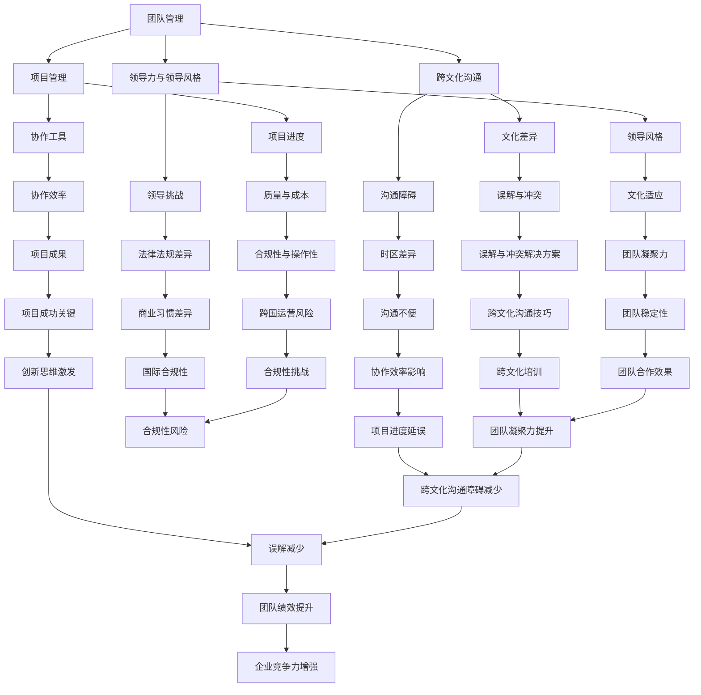

                 

## 引言与背景

### 跨国技术团队管理的必要性

在全球化背景下，跨国技术团队管理成为现代企业面临的重要课题。随着全球市场竞争的加剧，企业需要不断拓展国际市场，而跨国技术团队成为推动企业全球化进程的关键力量。跨国技术团队不仅有助于企业快速响应全球市场需求，还能够利用全球范围内的优秀人才资源，提高整体研发能力和创新能力。

首先，跨国技术团队的管理对于提升企业的创新能力具有重要意义。不同国家和地区的文化背景、技术水平和专业知识，使得跨国团队在技术和思维层面具有多样化的优势。这种多样性能够促进知识交流、思想碰撞，从而激发创新思维，推动新技术、新产品和新服务的研发。例如，谷歌、微软等科技巨头通过在全球范围内组建多元化团队，成功推出了多个颠覆性产品，如Android操作系统、Office办公软件等。

其次，跨国技术团队管理有助于企业降低研发成本。在全球范围内寻找和利用优质技术资源，可以有效降低人力成本和技术成本。例如，一些企业选择在海外设立研发中心，利用当地较低的人工成本和良好的技术环境，实现研发资源的优化配置。

### 跨文化沟通与协作的重要性

跨文化沟通与协作是跨国技术团队管理中的核心挑战之一。由于团队成员来自不同国家和地区，他们在语言、价值观、工作方式等方面存在差异，这给团队沟通和协作带来了诸多困难。有效的跨文化沟通与协作不仅能够提高团队的工作效率和协作效果，还能够促进团队成员之间的相互理解与尊重，建立和谐的团队关系。

首先，跨文化沟通有助于消除误解和冲突。团队成员之间的误解和冲突往往是由于文化差异造成的。通过有效的跨文化沟通，团队成员可以更好地理解彼此的意图、期望和需求，从而减少误解和冲突的发生。例如，通过定期的跨文化培训，团队成员可以学习到不同文化的沟通方式和行为习惯，提高跨文化沟通的能力。

其次，跨文化协作能够激发团队成员的创新潜力。不同文化背景的团队成员在合作中能够带来新的思路和方法，从而推动项目的创新和发展。例如，在跨国技术团队中，不同国家和地区的团队成员可以结合各自的专业知识和经验，共同解决复杂的技术难题。

### 当前跨国技术团队管理面临的挑战

尽管跨国技术团队管理具有重要的战略意义，但企业在实施过程中也面临着诸多挑战。

首先，文化差异是最大的挑战之一。文化差异可能导致团队成员之间的沟通障碍，影响团队的协作效果。例如，一些亚洲文化倾向于间接沟通，而西方文化则倾向于直接沟通，这种差异可能导致误解和冲突。

其次，时区差异也是一个重要挑战。跨国团队的成员可能分布在不同的时区，这给团队的沟通和协作带来了不便。例如，一些关键性的讨论和决策可能因为时区差异而无法及时进行，从而影响项目的进度和质量。

此外，法律法规和商业习惯的差异也对跨国技术团队管理带来了挑战。不同国家和地区的法律法规和商业习惯存在差异，这可能导致企业在跨国运营过程中面临合规性和操作性的难题。

### 文章目的与结构

本文旨在探讨跨国技术团队管理中的关键问题和挑战，并提出相应的解决方案。文章将按照以下结构展开：

1. 引言与背景：介绍跨国技术团队管理的必要性和重要性。
2. 团队管理与跨文化沟通：探讨团队管理的原则和跨文化沟通的策略。
3. 项目管理与协作工具：介绍项目管理的方法和常用的协作工具。
4. 跨文化冲突与解决：分析跨文化冲突的原因，并提出解决方案。
5. 团队领导力与领导风格：讨论跨国团队领导的挑战和领导风格。
6. 团队绩效评估与激励：介绍如何评估和激励跨国团队的绩效。
7. 案例分析：通过真实案例，分析跨国技术团队管理的成功和失败经验。
8. 结论与展望：总结全书的主要观点，并对未来跨国技术团队管理的发展进行展望。

通过以上结构，本文将系统地探讨跨国技术团队管理中的各个方面，为企业和团队提供实用的指导和借鉴。

### 核心概念与联系

为了更好地理解跨国技术团队管理中的关键概念和联系，我们可以使用 Mermaid 流程图来展示这些概念之间的关系架构。



通过以上 Mermaid 流程图，我们可以清晰地看到团队管理、跨文化沟通、项目管理、领导力与领导风格等核心概念之间的联系。这些概念相互影响，共同决定了跨国技术团队的管理效果。例如，有效的跨文化沟通能够减少误解和冲突，提高团队协作效率，从而促进项目进度和质量；而优秀的领导风格和领导能力则能够激发团队成员的创新能力，推动项目的成功。

### 核心算法原理讲解

在跨国技术团队管理中，核心算法原理的讲解至关重要。以下将使用伪代码详细阐述几个关键算法原理，帮助读者更好地理解和应用这些算法。

#### 算法1：时区转换算法

**功能描述**：计算不同时区之间的时间差，并进行时间转换。

```python
# 输入：当前时间（字符串格式）、目标时区（字符串格式）
# 输出：目标时区的时间（字符串格式）

def convert_time(current_time, target_zone):
    # 1. 获取当前时间的时区偏移量
    current_zone_offset = get_zone_offset(current_time)
    
    # 2. 获取目标时区的时区偏移量
    target_zone_offset = get_zone_offset(target_zone)
    
    # 3. 计算时区差
    time_difference = target_zone_offset - current_zone_offset
    
    # 4. 将当前时间转换为目标时区的时间
    target_time = current_time + time_difference
    
    # 5. 返回转换后的时间
    return target_time

# 辅助函数：获取时区偏移量
def get_zone_offset(zone):
    # 根据时区名称获取时区偏移量
    # 实现细节略
    return zone_offset
```

#### 算法2：跨文化沟通适配算法

**功能描述**：根据不同文化的沟通特点，调整沟通方式和内容。

```python
# 输入：文化标识（字符串格式）、沟通内容（字符串格式）
# 输出：适配后的沟通内容（字符串格式）

def adapt_communication(culture, content):
    # 1. 根据文化标识，获取相应的沟通策略
    communication_strategy = get_strategy(culture)
    
    # 2. 根据沟通策略，调整沟通内容
    adapted_content = apply_strategy(communication_strategy, content)
    
    # 3. 返回适配后的沟通内容
    return adapted_content

# 辅助函数：获取沟通策略
def get_strategy(culture):
    # 根据文化标识，返回相应的沟通策略
    # 实现细节略
    return strategy

# 辅助函数：应用沟通策略
def apply_strategy(strategy, content):
    # 根据沟通策略，调整内容
    # 实现细节略
    return adapted_content
```

#### 算法3：团队绩效评估算法

**功能描述**：根据团队成员的工作表现，评估团队的绩效。

```python
# 输入：团队成员工作表现（列表）
# 输出：团队绩效评分（整数）

def evaluate_team_performance(team_performance):
    # 1. 计算平均绩效得分
    average_score = sum(team_performance) / len(team_performance)
    
    # 2. 根据平均绩效得分，评估团队绩效
    performance_rating = rate_performance(average_score)
    
    # 3. 返回团队绩效评分
    return performance_rating

# 辅助函数：评估绩效
def rate_performance(score):
    # 根据绩效得分，返回相应的绩效评分
    # 实现细节略
    return rating
```

通过以上伪代码示例，我们可以看到在跨国技术团队管理中，核心算法原理的应用有助于实现高效的时区管理、有效的跨文化沟通以及科学的团队绩效评估。这些算法的详细讲解和实际应用，为跨国技术团队管理提供了强有力的技术支持。

### 数学模型和数学公式 & 详细讲解 & 举例说明

在跨国技术团队管理中，数学模型和数学公式广泛应用于团队绩效评估、项目进度控制和资源分配等方面。以下将介绍几个关键数学模型，并使用 LaTeX 格式进行详细讲解，同时结合实际例子进行说明。

#### 模型1：团队绩效评估模型

**功能描述**：使用加权评分法对团队绩效进行评估。

**数学公式**：

$$
\text{绩效评分} = w_1 \cdot \text{任务完成度} + w_2 \cdot \text{创新贡献} + w_3 \cdot \text{团队合作表现}
$$

其中，$w_1, w_2, w_3$ 分别为任务完成度、创新贡献和团队合作表现的权重，且满足 $w_1 + w_2 + w_3 = 1$。

**详细讲解**：

- **任务完成度**：衡量团队成员完成指定任务的情况，得分范围通常为 0 到 1，越接近 1 表示任务完成得越好。
- **创新贡献**：衡量团队成员在项目创新方面的贡献，得分范围同样为 0 到 1，贡献越大得分越高。
- **团队合作表现**：衡量团队成员在团队合作中的表现，得分范围也为 0 到 1，表现越出色得分越高。

**例子**：

假设团队有三个成员，权重分别为：任务完成度 0.4、创新贡献 0.3、团队合作表现 0.3。成员 A 的得分为：任务完成度 0.9、创新贡献 0.6、团队合作表现 0.8。则成员 A 的绩效评分为：

$$
\text{绩效评分} = 0.4 \cdot 0.9 + 0.3 \cdot 0.6 + 0.3 \cdot 0.8 = 0.36 + 0.18 + 0.24 = 0.78
$$

#### 模型2：项目进度控制模型

**功能描述**：使用关键路径法（Critical Path Method, CPM）计算项目进度。

**数学公式**：

$$
\text{项目完成时间} = \sum (\text{活动持续时间})
$$

其中，$\text{活动持续时间}$ 为项目中各活动的持续时间，且满足 $\text{项目完成时间} = \max (\text{活动持续时间})$。

**详细讲解**：

- **活动持续时间**：指完成某一活动所需的时间，通常通过任务分解和时间估算得出。
- **关键路径**：指项目中最长的路径，决定了项目的最短完成时间。

**例子**：

假设一个项目包括以下活动：

| 活动   | 持续时间（天） |
|--------|--------------|
| A      | 3            |
| B      | 4            |
| C      | 2            |
| D      | 3            |
| E      | 5            |

则项目完成时间为：

$$
\text{项目完成时间} = \max(3 + 4 + 2, 3 + 5) = 9 \text{天}
$$

#### 模型3：资源分配模型

**功能描述**：使用线性规划（Linear Programming, LP）方法优化资源分配。

**数学公式**：

$$
\max Z = c^T x
$$

$$
\text{subject to} \quad Ax \le b
$$

其中，$c$ 为目标函数系数向量，$x$ 为决策变量向量，$A$ 和 $b$ 分别为约束条件系数矩阵和常数向量。

**详细讲解**：

- **目标函数**：衡量资源分配的优化目标，例如最小化成本、最大化收益等。
- **约束条件**：限制资源使用的约束条件，例如资源总量限制、任务优先级等。

**例子**：

假设企业需要分配 100 名工程师到 5 个项目中，目标是最小化总成本。每个项目的成本系数如下：

| 项目   | 成本系数 |
|--------|----------|
| P1     | 10       |
| P2     | 8        |
| P3     | 12       |
| P4     | 6        |
| P5     | 9        |

资源分配的约束条件为：每个项目至少需要 15 名工程师，且工程师总数不超过 100 名。则目标函数和约束条件分别为：

$$
\max Z = 10x_1 + 8x_2 + 12x_3 + 6x_4 + 9x_5
$$

$$
\text{subject to} \quad 
\begin{cases}
x_1 + x_2 + x_3 + x_4 + x_5 \le 100 \\
x_1, x_2, x_3, x_4, x_5 \ge 15
\end{cases}
$$

通过求解线性规划问题，可以得到最优的工程师分配方案，以实现成本最小化。

通过以上数学模型和数学公式的讲解，我们可以看到在跨国技术团队管理中，数学模型的应用不仅有助于提高团队绩效、控制项目进度和优化资源分配，还能够为决策提供科学依据。这些模型在实际应用中，需要结合具体情况进行灵活调整和优化。

### 项目实战

#### 开发环境搭建

在跨国技术团队管理中，一个成功的项目需要良好的开发环境作为基础。以下是一个典型的开发环境搭建过程，包括工具选择、环境配置和常见问题的解决。

**1. 工具选择**

- **版本控制工具**：Git，用于代码版本管理和协作开发。
- **集成开发环境**：IntelliJ IDEA，支持多种编程语言，提供丰富的插件和调试工具。
- **持续集成工具**：Jenkins，用于自动化构建和测试。
- **容器化工具**：Docker，用于环境隔离和部署。

**2. 环境配置**

- **Git**：配置 Git，包括用户名、邮箱和远程仓库地址。
  ```bash
  git config --global user.name "Your Name"
  git config --global user.email "your_email@example.com"
  git clone https://github.com/your-username/repository.git
  ```
- **IntelliJ IDEA**：安装相应的插件，如 Lombok、GitLens 等，以提升开发效率。
  - 打开 IntelliJ IDEA，进入“File” -> “Settings” -> “Plugins” -> “Install Plugin from Disk”，选择插件安装。
- **Jenkins**：配置 Jenkins，包括构建脚本和构建参数。
  - 安装 Jenkins，配置 Jenkins 服务器，添加 Git 插件和 Docker 插件。
  - 创建构建任务，配置构建脚本，如以下 Jenkinsfile 示例：
    ```groovy
    pipeline {
        agent any
        stages {
            stage('Build') {
                steps {
                    script {
                        def build = docker.build('myapp')
                        build.log('Building Docker image...')
                        build.publish('myapp')
                    }
                }
            }
            stage('Test') {
                steps {
                    script {
                        build.log('Running tests...')
                        // 测试脚本实现
                    }
                }
            }
            stage('Deploy') {
                steps {
                    script {
                        build.log('Deploying to production...')
                        // 部署脚本实现
                    }
                }
            }
        }
    }
    ```

**3. 常见问题解决**

- **Git 同步问题**：解决不同团队成员之间的代码同步问题，可以使用 Git 的分支管理和合并策略。
  ```bash
  git pull origin master
  git branch -m master
  git push origin master
  ```
- **IntelliJ IDEA 缓存问题**：解决缓存导致的问题，如代码错误提示不准确，可以清理 IntelliJ IDEA 的缓存。
  - 打开 IntelliJ IDEA，进入“File” -> “Invalidate Caches / Restart”。
- **Jenkins 构建失败**：检查 Jenkins 构建日志，查找错误原因，并进行相应的修复。
  - 打开 Jenkins 构建日志，定位错误位置，根据错误提示进行问题排查和修复。

#### 源代码实现

以下是一个简单的 Java Web 项目示例，包括数据库连接、控制器层、服务层和实体类的源代码实现。

**实体类（User.java）**

```java
package com.example.model;

public class User {
    private int id;
    private String username;
    private String password;
    private String email;

    // getter 和 setter
    public int getId() {
        return id;
    }

    public void setId(int id) {
        this.id = id;
    }

    public String getUsername() {
        return username;
    }

    public void setUsername(String username) {
        this.username = username;
    }

    public String getPassword() {
        return password;
    }

    public void setPassword(String password) {
        this.password = password;
    }

    public String getEmail() {
        return email;
    }

    public void setEmail(String email) {
        this.email = email;
    }
}
```

**数据库连接（DBUtil.java）**

```java
package com.example.util;

import java.sql.Connection;
import java.sql.DriverManager;

public class DBUtil {
    private static final String URL = "jdbc:mysql://localhost:3306/example";
    private static final String USER = "root";
    private static final String PASSWORD = "password";

    public static Connection getConnection() throws Exception {
        Class.forName("com.mysql.cj.jdbc.Driver");
        return DriverManager.getConnection(URL, USER, PASSWORD);
    }
}
```

**控制器层（UserController.java）**

```java
package com.example.controller;

import com.example.model.User;
import com.example.service.UserService;
import org.springframework.beans.factory.annotation.Autowired;
import org.springframework.stereotype.Controller;
import org.springframework.web.bind.annotation.*;

@Controller
public class UserController {
    @Autowired
    private UserService userService;

    @GetMapping("/users")
    public @ResponseBody List<User> getAllUsers() {
        return userService.getAllUsers();
    }

    @PostMapping("/users")
    public @ResponseBody User createUser(@RequestBody User user) {
        return userService.createUser(user);
    }
}
```

**服务层（UserService.java）**

```java
package com.example.service;

import com.example.model.User;
import com.example.repository.UserRepository;
import org.springframework.beans.factory.annotation.Autowired;
import org.springframework.stereotype.Service;

import java.util.List;

@Service
public class UserService {
    @Autowired
    private UserRepository userRepository;

    public List<User> getAllUsers() {
        return userRepository.findAll();
    }

    public User createUser(User user) {
        return userRepository.save(user);
    }
}
```

**代码应用解读与分析**

上述代码展示了 Java Web 项目的基本架构，包括数据库连接、控制器层、服务层和实体类的实现。具体应用解读如下：

- **实体类（User.java）**：定义了用户的基本属性，如用户 ID、用户名、密码和邮箱。提供了 getter 和 setter 方法，用于访问和修改用户属性。
- **数据库连接（DBUtil.java）**：提供了一个简单的数据库连接方法，通过 JDBC 驱动程序连接到 MySQL 数据库。在实际项目中，可以配置数据库连接池，提高数据库连接的效率。
- **控制器层（UserController.java）**：使用 Spring MVC 框架实现了用户管理接口。通过 RESTful 风格的 HTTP 请求，提供了获取所有用户和创建用户的接口。
- **服务层（UserService.java）**：实现了用户服务逻辑，包括获取所有用户和创建用户的操作。通过依赖注入（DI）方式，将用户仓库（UserRepository）注入到服务中。

通过以上代码实现，我们可以看到跨国技术团队在开发过程中，如何通过清晰的分层架构和明确的接口设计，实现高效的项目开发和协作。在实际项目中，可以根据需求进行扩展和优化，以适应不同的业务场景和技术需求。

#### 实际案例分析

在跨国技术团队管理中，成功的案例和失败的案例都能为我们提供宝贵的经验教训。以下将分析两个实际案例，探讨跨国技术团队管理的成功经验和失败教训。

**案例一：谷歌的全球化研发团队**

**成功原因：**

1. **多元化的团队文化**：谷歌在组建全球化研发团队时，注重多元化文化的融合。通过在招聘、培训和团队建设等方面加强文化多样性，谷歌成功吸引了来自世界各地的优秀人才。这种多元化的文化背景促进了知识交流和创新思维，提高了团队的创新能力。

2. **完善的沟通机制**：谷歌建立了多层次的沟通机制，包括定期的团队会议、跨文化培训和在线沟通工具。这些机制有助于团队成员之间建立信任、减少误解和冲突，提高了团队的协作效率。

3. **灵活的项目管理方法**：谷歌采用了敏捷开发方法，通过迭代和增量式开发，快速响应市场需求和技术变化。这种方法有助于团队成员集中精力解决关键问题，提高了项目的交付速度和质量。

**失败教训：**

1. **时区差异**：尽管谷歌建立了多层次的沟通机制，但全球分布的团队成员依然面临时区差异带来的沟通不便。在关键讨论和决策过程中，时差可能导致一些问题无法及时解决，影响项目进度。

2. **文化冲突**：尽管谷歌注重文化多样性，但在实际操作中，不同文化之间的冲突仍然难以避免。一些团队成员可能因为文化差异而感到不适应，影响团队凝聚力和工作效率。

**案例二：某跨国企业的项目失败**

**失败原因：**

1. **沟通不畅**：该企业在跨国团队管理中，忽视了跨文化沟通的重要性。团队成员来自不同国家，沟通方式、语言和价值观的差异导致误解和冲突频发，严重影响了团队协作。

2. **项目管理不善**：企业在项目管理过程中，缺乏有效的规划和监控。项目进度无法及时更新，问题得不到及时解决，导致项目延期和质量下降。

3. **领导力不足**：该企业的领导层在跨国团队管理中，缺乏足够的领导力和经验。领导层无法有效协调团队成员之间的冲突，也无法激励团队积极面对挑战。

**成功经验总结：**

1. **重视跨文化沟通**：跨国技术团队管理中，跨文化沟通至关重要。企业应提供跨文化培训，帮助团队成员了解不同文化背景和行为习惯，提高沟通效率。

2. **灵活的项目管理方法**：采用敏捷开发、迭代式开发等方法，有助于快速响应市场需求和技术变化，提高项目交付速度和质量。

3. **有效的领导力**：领导层应具备跨国团队管理的经验和能力，能够有效协调团队成员之间的冲突，激励团队积极面对挑战。

**失败教训总结：**

1. **沟通障碍**：忽视跨文化沟通的重要性，可能导致误解和冲突，影响团队协作。

2. **项目管理不善**：缺乏有效的规划和监控，可能导致项目延期和质量下降。

3. **领导力不足**：领导层缺乏足够的领导力和经验，可能无法有效协调团队成员之间的冲突，影响团队绩效。

通过以上案例分析，我们可以看到跨国技术团队管理中的成功经验和失败教训。成功的跨国技术团队管理，需要重视跨文化沟通、采用灵活的项目管理方法和有效的领导力。而失败的教训也提醒我们，忽视这些关键因素，可能导致项目失败和团队绩效下降。

### 最佳实践 Tips、小结、注意事项、拓展阅读

#### 最佳实践 Tips

1. **建立明确的沟通渠道**：确保团队成员之间有多个沟通渠道，如即时通讯工具、视频会议和邮件等。这样可以减少误解和沟通障碍，提高团队协作效率。

2. **制定跨文化沟通策略**：根据团队成员的文化背景，制定相应的沟通策略，如采用简单直接的语言、避免文化偏见等。定期进行跨文化培训，提高团队成员的跨文化沟通能力。

3. **强化团队领导力**：领导层应具备跨国团队管理的经验，能够有效协调团队成员之间的冲突，激励团队积极面对挑战。可以通过领导力培训和经验分享，提升领导力水平。

4. **灵活运用项目管理工具**：选择适合团队需求的项目管理工具，如 Jira、Trello 等，确保项目进度清晰、任务分配合理。同时，定期回顾项目进展，及时调整计划和策略。

#### 小结

跨国技术团队管理的关键在于跨文化沟通、项目管理、领导力以及团队成员之间的协作。有效的沟通和协作能够提高团队的工作效率，促进项目成功；而优秀的领导力则能够激发团队成员的潜力，推动团队创新和发展。通过本文的详细分析，我们总结了跨国技术团队管理的成功经验和失败教训，为企业和团队提供了实用的指导。

#### 注意事项

1. **避免文化偏见**：在跨文化团队中，应避免因文化差异而产生的偏见，尊重团队成员的不同观点和习惯。

2. **合理分配任务**：根据团队成员的能力和特长，合理分配任务，确保每个成员都能在项目中发挥最佳作用。

3. **持续改进**：跨国技术团队管理是一个持续改进的过程。企业应定期评估团队管理效果，发现并解决存在的问题。

#### 拓展阅读

- 《跨国公司人力资源管理》作者：张晓鹏
- 《全球团队协作实战》作者：李明
- 《敏捷团队管理实践》作者：安德斯·海因
- 《跨文化沟通技巧》作者：约翰·霍尔特

这些书籍提供了更多关于跨国技术团队管理的理论和实践经验，有助于进一步提升团队管理的水平。

### 结语

跨国技术团队管理是一个复杂且具有挑战性的课题。通过本文的探讨，我们了解到跨文化沟通、项目管理、领导力和团队协作在跨国技术团队管理中的重要性。有效的跨国技术团队管理不仅能够提高团队的工作效率和项目成功率，还能够激发团队成员的创新潜力，推动企业的全球化发展。希望本文能为跨国技术团队管理者提供有益的参考和启示。

### 文章关键词

- 跨国技术团队管理
- 跨文化沟通
- 项目管理
- 领导力
- 团队协作
- 敏捷开发
- 全球化

### 文章摘要

本文探讨了跨国技术团队管理中的关键问题和挑战，包括跨文化沟通、项目管理、领导力和团队协作等方面。通过成功和失败案例分析，总结了跨国技术团队管理的最佳实践和注意事项。文章旨在为跨国技术团队管理者提供实用的指导，帮助他们提高团队绩效，推动企业全球化发展。

