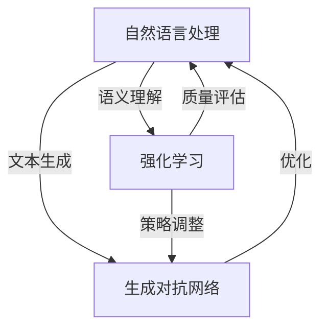
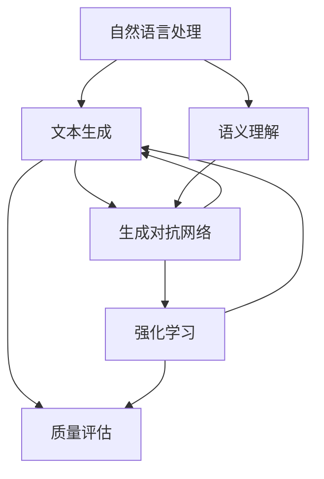
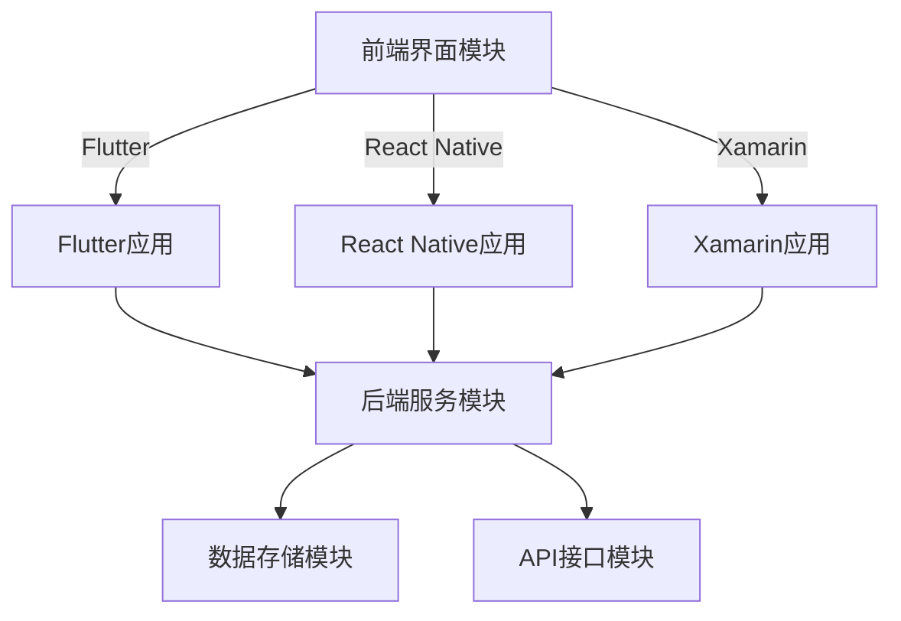

                 

### 引言

#### 1.1 跨平台提示词编程的背景与重要性

跨平台编程的概念起源于移动设备多样化的需求，随着智能手机和平板电脑的普及，开发者们面临着在多个操作系统（如iOS和Android）上开发应用的压力。传统的原生开发方式，需要分别使用Swift（iOS）和Java（Android）进行编码，这不仅增加了开发成本，也延长了开发周期。为了解决这一问题，跨平台开发框架应运而生。

提示词编程则是一种利用人工智能技术，特别是自然语言处理（NLP）和生成对抗网络（GAN）等算法，生成或优化文本内容的方法。在软件开发领域，提示词编程被广泛应用于文档生成、代码自动补全、对话系统等场景。

跨平台提示词编程结合了跨平台开发和提示词编程的优点，使得开发者能够在多种平台上生成高质量的文本内容，大大提高了开发效率。这种编程方式不仅适用于移动应用开发，还能够在网页、桌面应用等多个领域发挥作用。

#### 1.2 本书的目的与结构

本书旨在系统地介绍跨平台提示词编程的原理、框架应用、性能优化和实践方法，帮助开发者深入理解这一新兴技术，并能够将其应用到实际项目中。本书的结构如下：

- **第1章 引言**：介绍跨平台提示词编程的背景和重要性。
- **第2章 跨平台编程基础**：讲解跨平台编程的概念、优势以及常见的开发框架。
- **第3章 提示词编程原理**：阐述提示词编程的基本概念、相关技术原理及其相互关系。
- **第4章 跨平台提示词编程框架应用**：通过实战案例，展示如何在不同框架上实现提示词编程。
- **第5章 跨平台提示词编程优化**：探讨提升提示词编程性能和安全性的一系列策略。
- **第6章 跨平台提示词编程实践**：通过一个完整的项目实践，详细解析跨平台提示词编程的流程和实现。
- **第7章 跨平台提示词编程未来趋势**：展望跨平台提示词编程的发展方向和应用场景。

通过本书的学习，读者将能够掌握跨平台提示词编程的核心技术和实战方法，为未来的软件开发提供新的思路和工具。

#### 1.3 关键词

- **跨平台编程**
- **提示词编程**
- **自然语言处理**
- **生成对抗网络**
- **Flutter**
- **React Native**
- **Xamarin**

这些关键词不仅是文章的核心内容，也是读者理解文章的重要切入点。

#### 1.4 摘要

本文系统地介绍了跨平台提示词编程的概念、原理、框架应用以及优化方法。首先，文章讲解了跨平台编程和提示词编程的背景及重要性，随后深入剖析了跨平台编程的基础知识，以及提示词编程的核心技术和原理。通过实际的跨平台提示词编程框架应用案例，读者可以了解如何在Flutter、React Native和Xamarin等框架上实现提示词编程。此外，文章还探讨了跨平台提示词编程的性能优化和安全性策略，并通过一个完整的实战项目展示了跨平台提示词编程的实践过程。最后，文章展望了跨平台提示词编程的未来趋势，为读者指明了这一领域的发展方向。通过本文的学习，读者将能够全面掌握跨平台提示词编程的相关知识，提升软件开发效率。

### 第2章 跨平台编程基础

#### 2.1 跨平台编程的概念与优势

跨平台编程是一种开发方法，允许开发者使用单一代码库创建可以在多种操作系统和设备上运行的应用程序。传统的原生开发方式，需要针对每个目标平台分别编写代码，这不仅增加了开发成本，也延长了开发周期。跨平台编程通过提供一个统一的开发环境，使得开发者可以一次编写，多次运行，从而大幅提高开发效率。

跨平台编程的核心优势在于：

1. **降低开发成本**：开发者无需为每个平台分别编写代码，可以节省大量的时间和人力资源。
2. **缩短开发周期**：通过复用代码，开发者能够更快地实现功能，快速迭代。
3. **提高开发效率**：统一的管理和部署流程，使得开发、测试和部署更加高效。
4. **扩展平台兼容性**：支持多种操作系统和设备，使得应用可以轻松覆盖更广泛的用户群体。

常见的跨平台开发框架包括Flutter、React Native和Xamarin，每种框架都有其独特的优势和特点。

#### 2.2 常见的跨平台开发框架

##### 2.2.1 Flutter

Flutter是由Google推出的一套开源UI工具包，用于构建高性能、高保真的跨平台应用。Flutter使用Dart编程语言，其核心优势在于：

1. **丰富的UI组件库**：提供了一套丰富的UI组件，使得开发者可以快速构建美观的应用界面。
2. **高性能渲染**：使用Skia图形引擎，实现硬件加速渲染，使得应用具有流畅的用户体验。
3. **热重载功能**：支持代码的热重载，使得开发者可以实时查看更改效果，大大提高开发效率。
4. **广泛的平台支持**：支持iOS、Android、Web和桌面平台，使得Flutter应用可以覆盖多种设备。

示例：Flutter UI组件的使用
```dart
import 'package:flutter/material.dart';

void main() {
  runApp(MyApp());
}

class MyApp extends StatelessWidget {
  @override
  Widget build(BuildContext context) {
    return MaterialApp(
      title: 'Flutter Demo',
      theme: ThemeData(
        primarySwatch: Colors.blue,
      ),
      home: MyHomePage(title: 'Flutter Demo Home Page'),
    );
  }
}

class MyHomePage extends StatefulWidget {
  MyHomePage({Key? key, required this.title}) : super(key: key);
  final String title;

  @override
  _MyHomePageState createState() => _MyHomePageState();
}

class _MyHomePageState extends State<MyHomePage> {
  int _counter = 0;

  void _incrementCounter() {
    setState(() {
      _counter++;
    });
  }

  @override
  Widget build(BuildContext context) {
    return Scaffold(
      appBar: AppBar(
        title: Text(widget.title),
      ),
      body: Center(
        child: Column(
          mainAxisAlignment: MainAxisAlignment.center,
          children: <Widget>[
            Text(
              'You have pushed the button this many times:',
            ),
            Text(
              '$_counter',
              style: Theme.of(context).textTheme.headline4,
            ),
          ],
        ),
      ),
      floatingActionButton: FloatingActionButton(
        onPressed: _incrementCounter,
        tooltip: 'Increment',
        child: Icon(Icons.add),
      ),
    );
  }
}
```

##### 2.2.2 React Native

React Native是由Facebook开发的一套开源框架，用于构建跨平台的移动应用。React Native使用JavaScript作为开发语言，其核心优势在于：

1. **强大的社区支持**：拥有庞大的开发者社区，提供了丰富的第三方库和组件。
2. **高性能**：使用原生组件进行UI渲染，性能接近原生应用。
3. **共享代码**：大部分代码可以复用，减少开发工作量。
4. **热重载**：支持热重载功能，快速迭代。

示例：React Native组件的使用
```javascript
import React from 'react';
import { View, Text, Button } from 'react-native';

const App = () => {
  const handlePress = () => {
    console.log('Button pressed!');
  };

  return (
    <View style={{ flex: 1, justifyContent: 'center', alignItems: 'center' }}>
      <Text>Hello React Native!</Text>
      <Button title="Press me" onPress={handlePress} />
    </View>
  );
};

export default App;
```

##### 2.2.3 Xamarin

Xamarin是由微软开发的一套跨平台框架，允许使用C#语言构建iOS、Android和Windows应用。Xamarin的核心优势在于：

1. **C#语言优势**：C#语言易于学习和使用，具有较高的开发效率。
2. **原生性能**：使用原生API进行UI渲染，性能接近原生应用。
3. **共享代码**：大量代码可以复用，降低开发成本。
4. **强大的平台支持**：支持多种平台，包括iOS、Android、Windows和MacOS。

示例：Xamarin界面代码
```csharp
using System;
using Xamarin.Forms;

namespace XamarinApp
{
    public class MainPage : ContentPage
    {
        public MainPage()
        {
            Title = "Hello Xamarin";
            Content = new Stack()
            {
                Children =
                {
                    new Label
                    {
                        Text = "Hello Xamarin!",
                        HorizontalTextAlignment = TextAlignment.Center,
                        VerticalTextAlignment = TextAlignment.Center,
                        Margin = new Margin(20),
                        FontSize = 24,
                        FontAttributes = FontAttributes.Bold
                    }
                }
            };
        }
    }
}
```

通过以上对Flutter、React Native和Xamarin的介绍，读者可以初步了解这三种跨平台开发框架的特点和优势。接下来，本文将深入探讨提示词编程的基本概念和原理，为后续章节的实战应用奠定基础。

### 第3章 提示词编程原理

#### 3.1 提示词编程的概念与作用

提示词编程是一种利用人工智能技术生成或优化文本内容的方法。在软件开发领域，提示词编程被广泛应用于自动文档生成、代码自动补全、对话系统等场景。其基本思想是通过输入一个或多个提示词，系统可以生成与之相关的文本内容。

提示词编程的核心作用在于：

1. **提高开发效率**：通过自动生成代码、文档等文本内容，减少手动编写的工作量。
2. **优化用户体验**：自动生成的文本内容可以根据用户需求进行个性化调整，提高应用的可用性。
3. **降低开发成本**：减少重复性工作，提高开发效率，从而降低开发成本。
4. **增强创新性**：提示词编程可以帮助开发者探索新的开发思路和解决方案，激发创新。

#### 3.2 提示词编程的核心技术

提示词编程的实现依赖于多种人工智能技术，主要包括自然语言处理（NLP）、生成对抗网络（GAN）和强化学习等。这些技术相互结合，共同构成了提示词编程的核心技术体系。

##### 3.2.1 自然语言处理基础

自然语言处理（NLP）是人工智能的重要分支，旨在使计算机能够理解和生成自然语言。NLP的核心技术包括：

1. **分词**：将文本分解为单词或词组，为后续处理提供基础。
2. **词性标注**：为文本中的每个单词或词组分配词性，如名词、动词、形容词等。
3. **命名实体识别**：识别文本中的特定实体，如人名、地名、组织名等。
4. **语义分析**：理解文本的深层含义，如词义消歧、语义角色标注等。
5. **文本生成**：根据输入的提示词生成相关的文本内容。

示例：使用NLP进行文本生成
```python
import jieba
import nltk

# 分词
sentence = "我喜欢编程和机器学习。"
tokens = jieba.cut(sentence)

# 词性标注
pos_tags = nltk.pos_tag(tokens)

# 命名实体识别
named_entities = nltk.ne_chunk(pos_tags)

# 语义分析
def analyze_semantics(tokens):
    # 这里可以添加具体的语义分析逻辑
    pass

analyze_semantics(pos_tags)

# 文本生成
def generate_text(prompt):
    # 这里可以添加基于提示词的文本生成逻辑
    pass

generated_text = generate_text("编写一个关于人工智能的段落。")
print(generated_text)
```

##### 3.2.2 生成对抗网络（GAN）

生成对抗网络（GAN）是一种由生成器和判别器组成的对抗性模型。生成器的目标是生成逼真的数据，而判别器的目标是区分真实数据和生成数据。通过不断训练，生成器和判别器相互竞争，最终生成器能够生成高质量的数据。

GAN在提示词编程中的应用主要体现在文本生成和优化方面。通过训练GAN，可以生成与输入提示词相关的文本内容，同时进行优化，提高生成文本的质量。

示例：GAN的文本生成
```python
import tensorflow as tf
from tensorflow.keras.models import Model
from tensorflow.keras.layers import Input, Dense, Reshape, Conv2D, Flatten

# 生成器模型
input_layer = Input(shape=(100,))
x = Dense(128, activation='relu')(input_layer)
x = Dense(64, activation='relu')(x)
x = Reshape(target_shape=(28, 28, 1))(x)
generator = Model(inputs=input_layer, outputs=x)

# 判别器模型
input_layer = Input(shape=(28, 28, 1))
x = Conv2D(64, kernel_size=(3, 3), activation='relu')(input_layer)
x = Conv2D(128, kernel_size=(3, 3), activation='relu')(x)
x = Flatten()(x)
discriminator = Model(inputs=input_layer, outputs=x)

# GAN模型
gan_input = Input(shape=(100,))
generated_images = generator(gan_input)
discriminator_output = discriminator(generated_images)
gan_output = Model(inputs=gan_input, outputs=discriminator_output)

# 损失函数与优化器
def compile_gan(generator, discriminator):
    generator.compile(loss='binary_crossentropy', optimizer='adam')
    discriminator.compile(loss='binary_crossentropy', optimizer='adam')
    gan_output.compile(loss='binary_crossentropy', optimizer='adam')

compile_gan(generator, discriminator)

# 训练GAN
train_gan(generator, discriminator, x_train, y_train, epochs=50)
```

##### 3.2.3 强化学习

强化学习是一种通过与环境交互来学习最优策略的方法。在提示词编程中，强化学习可以用于优化生成文本的质量。通过让生成器与环境（如用户反馈）进行交互，可以逐步调整生成器的参数，使其生成更高质量的文本。

示例：使用强化学习优化文本生成
```python
import tensorflow as tf
from tensorflow.keras.optimizers import Adam
from tensorflow.keras.models import Model
from tensorflow.keras.layers import Input, LSTM, Dense

# 定义生成器模型
input_seq = Input(shape=(timesteps,))
lstm_output = LSTM(units=128, activation='relu')(input_seq)
output_seq = Dense(units=vocab_size, activation='softmax')(lstm_output)
generator = Model(inputs=input_seq, outputs=output_seq)

# 定义强化学习模型
action_input = Input(shape=(1,))
reward = Dense(units=1, activation='sigmoid')(action_input)
policy_output = Model(inputs=action_input, outputs=reward)

# 编译模型
generator.compile(optimizer=Adam(learning_rate=0.001), loss='categorical_crossentropy')
policy_output.compile(optimizer=Adam(learning_rate=0.001), loss='binary_crossentropy')

# 训练生成器
for epoch in range(num_epochs):
    # 生成文本
    for _ in range(num_samples):
        # 随机初始化状态
        state = np.random.rand(timesteps, embedding_size)
        # 生成文本序列
        generated_sequence = generator.predict(state)
        # 评估生成文本的质量
        reward_value = policy_output.predict(generated_sequence)
        # 计算梯度
        with tf.GradientTape() as tape:
            loss = generator.loss(generated_sequence, target_sequence)
        grads = tape.gradient(loss, generator.trainable_variables)
        # 更新生成器参数
        generator.optimizer.apply_gradients(zip(grads, generator.trainable_variables))
```

通过以上对自然语言处理、生成对抗网络和强化学习的介绍，我们可以看到这些技术如何共同构成提示词编程的核心技术体系。接下来，本文将结合Flutter、React Native和Xamarin等跨平台开发框架，介绍如何在不同的平台上实现提示词编程。

#### 3.2.4 核心概念与联系

提示词编程的核心概念包括自然语言处理（NLP）、生成对抗网络（GAN）和强化学习。这些概念之间存在着紧密的联系，共同构成了提示词编程的技术基础。以下是一个Mermaid流程图，用于展示这些概念之间的关系和相互影响。



**Mermaid流程图说明：**

1. **自然语言处理（NLP）**：NLP是提示词编程的基础，负责处理输入的提示词，进行分词、词性标注、命名实体识别和语义分析。NLP的输出是文本生成和语义理解的输入。
2. **生成对抗网络（GAN）**：GAN通过生成器和判别器的对抗训练，生成高质量的文本内容。NLP的文本生成部分与GAN相结合，生成与提示词相关的文本。
3. **强化学习（RL）**：强化学习通过与环境交互，优化生成文本的质量。GAN的优化过程和NLP的质量评估都与强化学习密切相关，强化学习用于调整生成器和判别器的参数，使其生成更高质量的文本。

这些概念之间的联系和相互影响，共同构成了提示词编程的核心技术体系。以下是一个简化的Mermaid流程图，展示核心概念之间的关系：



通过这个流程图，我们可以清晰地看到自然语言处理、生成对抗网络和强化学习在提示词编程中的作用和相互关系。NLP提供文本生成和语义理解的基础，GAN通过对抗训练生成高质量文本，强化学习通过策略调整和优化，进一步提升文本生成质量。

#### 3.2.5 核心算法原理讲解

在提示词编程中，核心算法的原理讲解对于理解其实现和优化至关重要。以下将详细讲解生成对抗网络（GAN）和强化学习（RL）的基本原理，并使用伪代码进行阐述。

##### 3.2.5.1 生成对抗网络（GAN）

生成对抗网络（GAN）由两部分组成：生成器（Generator）和判别器（Discriminator）。生成器的目标是生成尽可能逼真的数据，而判别器的目标是区分真实数据和生成数据。通过这种对抗训练，生成器和判别器相互竞争，最终生成高质量的数据。

**生成器（Generator）原理：**
生成器的任务是从随机噪声中生成逼真的数据。以下是一个简化的伪代码示例：

```python
# 生成器伪代码
def generate_fake_samples(generator, noise):
    # 输入噪声
    z = noise
    # 生成假样本
    fake_samples = generator.predict(z)
    return fake_samples
```

**判别器（Discriminator）原理：**
判别器的任务是判断输入数据是真实数据还是生成数据。以下是一个简化的伪代码示例：

```python
# 判别器伪代码
def discriminate_real_fake_samples(discriminator, real_samples, fake_samples):
    # 判断真实样本
    real_validity = discriminator.predict(real_samples)
    # 判断假样本
    fake_validity = discriminator.predict(fake_samples)
    return real_validity, fake_validity
```

**GAN训练过程：**
GAN的训练过程是通过对抗训练来优化生成器和判别器的参数。以下是一个简化的GAN训练伪代码示例：

```python
# GAN训练伪代码
def train_gan(generator, discriminator, real_data, epochs):
    for epoch in range(epochs):
        # 从真实数据中随机选取一批样本
        real_samples = real_data.sample(batch_size)
        # 生成随机噪声
        noise = np.random.normal(0, 1, (batch_size, noise_dim))
        # 生成假样本
        fake_samples = generate_fake_samples(generator, noise)
        
        # 训练判别器
        d_loss_real, d_loss_fake = discriminate_real_fake_samples(discriminator, real_samples, fake_samples)
        d_total_loss = d_loss_real + d_loss_fake
        d_optimizer.minimize(d_total_loss, discriminator.trainable_weights)
        
        # 训练生成器
        g_loss = generator_loss(generator, fake_samples)
        g_optimizer.minimize(g_loss, generator.trainable_weights)
```

##### 3.2.5.2 强化学习（RL）

强化学习是一种通过与环境互动来学习最优策略的方法。在提示词编程中，强化学习可以用于优化生成文本的质量。以下是一个简化的强化学习算法原理和伪代码示例。

**强化学习基本原理：**
强化学习的目标是学习一个策略，使得在给定状态下采取动作能够获得最大的长期回报。以下是一个简化的强化学习算法原理：

1. **状态（State）**：描述环境当前的状态。
2. **动作（Action）**：在给定状态下可以采取的动作。
3. **奖励（Reward）**：动作带来的即时回报。
4. **策略（Policy）**：在给定状态下选择最优动作的策略。

**强化学习伪代码示例：**

```python
# 强化学习伪代码
class ReinforcementLearning:
    def __init__(self, state_space, action_space, learning_rate):
        self.state_space = state_space
        self.action_space = action_space
        self.learning_rate = learning_rate
        self.model = build_model(state_space, action_space)
        
    def choose_action(self, state):
        # 选择动作
        action_probs = self.model.predict(state)
        action = np.random.choice(self.action_space, p=action_probs)
        return action
    
    def update_model(self, state, action, reward, next_state):
        # 更新模型
        next_action_probs = self.model.predict(next_state)
        target_reward = reward + discount_factor * np.max(next_action_probs)
        current_action_prob = self.model.predict(state)[action]
        delta = target_reward - current_action_prob
        self.model.trainable_weights += learning_rate * delta
```

通过以上对生成对抗网络和强化学习的原理讲解和伪代码示例，我们可以更深入地理解提示词编程的核心算法，并为其在实际应用中的优化提供理论基础。

### 第4章 跨平台提示词编程框架应用

#### 4.1 Flutter 提示词编程实战

##### 4.1.1 Flutter 提示词编程基础

Flutter 是一款流行的跨平台 UI 框架，使用 Dart 语言进行开发。Flutter 的核心优势在于其高性能的渲染能力和丰富的 UI 组件库，这使得开发者可以快速构建高质量的跨平台应用。在 Flutter 中，提示词编程主要通过以下步骤实现：

1. **环境搭建**：首先需要安装 Flutter SDK 和相关开发工具，如 IntelliJ IDEA 或 Android Studio。
2. **创建项目**：使用 Flutter CLI 创建一个新的 Flutter 项目。
3. **集成 NLP 库**：在项目中集成 NLP 库，如 Flutter 的 `nlp` 或第三方库 `flutter_nlp`。
4. **编写提示词生成代码**：利用 NLP 库实现提示词生成功能，如分词、词性标注和语义分析。
5. **UI 设计与交互**：设计用户界面，并添加提示词生成的交互功能。

以下是一个简单的 Flutter 提示词生成示例：

```dart
import 'package:flutter/material.dart';
import 'nlp_library.dart'; // 假设使用一个名为 nlp_library 的 NLP 库

void main() {
  runApp(MyApp());
}

class MyApp extends StatelessWidget {
  @override
  Widget build(BuildContext context) {
    return MaterialApp(
      title: 'Flutter NLP Demo',
      theme: ThemeData(
        primarySwatch: Colors.blue,
      ),
      home: MyHomePage(),
    );
  }
}

class MyHomePage extends StatefulWidget {
  @override
  _MyHomePageState createState() => _MyHomePageState();
}

class _MyHomePageState extends State<MyHomePage> {
  String _prompt = "";
  String _generatedText = "";

  void _generateText() {
    setState(() {
      _generatedText = NlpLibrary.generateText(_prompt);
    });
  }

  @override
  Widget build(BuildContext context) {
    return Scaffold(
      appBar: AppBar(
        title: Text('NLP Demo'),
      ),
      body: Padding(
        padding: EdgeInsets.all(16.0),
        child: Column(
          crossAxisAlignment: CrossAxisAlignment.start,
          children: <Widget>[
            TextField(
              decoration: InputDecoration(hintText: "输入提示词"),
              onChanged: (value) {
                setState(() {
                  _prompt = value;
                });
              },
            ),
            SizedBox(height: 16.0),
            ElevatedButton(
              onPressed: _generateText,
              child: Text('生成文本'),
            ),
            SizedBox(height: 16.0),
            Text(
              '生成文本：$_generatedText',
              style: TextStyle(fontSize: 16.0),
            ),
          ],
        ),
      ),
    );
  }
}
```

##### 4.1.2 Flutter 提示词生成案例

以下是一个使用 Flutter 和生成对抗网络（GAN）进行提示词生成的案例：

1. **环境搭建**：安装 Flutter SDK 和 TensorFlow 框架，并配置 Flutter-TensorFlow 插件。
2. **生成器模型**：定义一个 GAN 生成器模型，用于生成文本。
3. **判别器模型**：定义一个 GAN 判别器模型，用于区分真实数据和生成数据。
4. **训练模型**：使用大量文本数据对 GAN 模型进行训练。
5. **生成提示词**：使用训练好的生成器模型，根据输入提示词生成文本。

```dart
import 'package:flutter/material.dart';
import 'gan_library.dart'; // 假设使用一个名为 gan_library 的 GAN 库

void main() {
  runApp(MyApp());
}

class MyApp extends StatelessWidget {
  @override
  Widget build(BuildContext context) {
    return MaterialApp(
      title: 'Flutter GAN Demo',
      theme: ThemeData(
        primarySwatch: Colors.blue,
      ),
      home: MyHomePage(),
    );
  }
}

class MyHomePage extends StatefulWidget {
  @override
  _MyHomePageState createState() => _MyHomePageState();
}

class _MyHomePageState extends State<MyHomePage> {
  String _prompt = "";
  String _generatedText = "";

  void _generateText() {
    setState(() {
      _generatedText = GanLibrary.generateText(_prompt);
    });
  }

  @override
  Widget build(BuildContext context) {
    return Scaffold(
      appBar: AppBar(
        title: Text('GAN Demo'),
      ),
      body: Padding(
        padding: EdgeInsets.all(16.0),
        child: Column(
          crossAxisAlignment: CrossAxisAlignment.start,
          children: <Widget>[
            TextField(
              decoration: InputDecoration(hintText: "输入提示词"),
              onChanged: (value) {
                setState(() {
                  _prompt = value;
                });
              },
            ),
            SizedBox(height: 16.0),
            ElevatedButton(
              onPressed: _generateText,
              child: Text('生成文本'),
            ),
            SizedBox(height: 16.0),
            Text(
              '生成文本：$_generatedText',
              style: TextStyle(fontSize: 16.0),
            ),
          ],
        ),
      ),
    );
  }
}
```

通过以上步骤，我们可以实现一个简单的 Flutter 提示词生成应用，从而探索跨平台提示词编程在 Flutter 上的应用。

#### 4.2 React Native 提示词编程实战

##### 4.2.1 React Native 提示词编程基础

React Native 是一款使用 JavaScript 开发的跨平台移动应用框架，具有高性能和高效的开发体验。在 React Native 中，提示词编程可以通过以下步骤实现：

1. **环境搭建**：安装 React Native 开发环境，包括 Node.js、Watchman、React Native CLI、Xcode（macOS）或 Android Studio（Windows/Linux）。
2. **创建项目**：使用 React Native CLI 创建一个新的项目。
3. **集成 NLP 库**：在项目中集成 NLP 库，如 `react-native-nlp` 或第三方库 `react-native-nlp-library`。
4. **编写提示词生成代码**：利用 NLP 库实现提示词生成功能，如分词、词性标注和语义分析。
5. **UI 设计与交互**：设计用户界面，并添加提示词生成的交互功能。

以下是一个简单的 React Native 提示词生成示例：

```javascript
import React, { useState } from 'react';
import { View, Text, TextInput, Button } from 'react-native';
import NlpLibrary from 'react-native-nlp-library'; // 假设使用一个名为 NlpLibrary 的 NLP 库

const App = () => {
  const [prompt, setPrompt] = useState('');
  const [generatedText, setGeneratedText] = useState('');

  const generateText = async () => {
    const text = await NlpLibrary.generateText(prompt);
    setGeneratedText(text);
  };

  return (
    <View style={{ flex: 1, justifyContent: 'center', alignItems: 'center' }}>
      <Text>Hello React Native NLP!</Text>
      <TextInput
        style={{ height: 40, width: 200, borderColor: 'gray', borderWidth: 1 }}
        placeholder="输入提示词"
        onChangeText={setPrompt}
      />
      <Button title="生成文本" onPress={generateText} />
      <Text>{generatedText}</Text>
    </View>
  );
};

export default App;
```

##### 4.2.2 React Native 提示词生成案例

以下是一个使用 React Native 和生成对抗网络（GAN）进行提示词生成的案例：

1. **环境搭建**：安装 React Native 开发环境，并安装 TensorFlow.js 框架。
2. **生成器模型**：定义一个 GAN 生成器模型，用于生成文本。
3. **判别器模型**：定义一个 GAN 判别器模型，用于区分真实数据和生成数据。
4. **训练模型**：使用大量文本数据对 GAN 模型进行训练。
5. **生成提示词**：使用训练好的生成器模型，根据输入提示词生成文本。

```javascript
import React, { useState } from 'react';
import { View, Text, TextInput, Button } from 'react-native';
import * as tf from '@tensorflow/tfjs';

const App = () => {
  const [prompt, setPrompt] = useState('');
  const [generatedText, setGeneratedText] = useState('');

  const generateText = async () => {
    const model = await loadGANModel(); // 假设已经加载了一个训练好的 GAN 模型
    const noise = tf.randomNormal([1, 100]); // 生成随机噪声
    const generatedSequence = model.predict(noise); // 使用生成器模型生成文本
    const text = generatedSequence.dataSync().toString(); // 转换为字符串
    setGeneratedText(text);
  };

  return (
    <View style={{ flex: 1, justifyContent: 'center', alignItems: 'center' }}>
      <Text>Hello React Native GAN!</Text>
      <TextInput
        style={{ height: 40, width: 200, borderColor: 'gray', borderWidth: 1 }}
        placeholder="输入提示词"
        onChangeText={setPrompt}
      />
      <Button title="生成文本" onPress={generateText} />
      <Text>{generatedText}</Text>
    </View>
  );
};

export default App;
```

通过以上步骤，我们可以实现一个简单的 React Native 提示词生成应用，探索跨平台提示词编程在 React Native 上的应用。

#### 4.3 Xamarin 提示词编程实战

##### 4.3.1 Xamarin 提示词编程基础

Xamarin 是一款由 Microsoft 开发的跨平台开发框架，允许开发者使用 C# 语言构建 iOS、Android 和 Windows 应用。在 Xamarin 中，提示词编程可以通过以下步骤实现：

1. **环境搭建**：安装 Xamarin SDK 和相关开发工具，如 Visual Studio 或 Visual Studio for Mac。
2. **创建项目**：使用 Xamarin CLI 创建一个新的 Xamarin 项目。
3. **集成 NLP 库**：在项目中集成 NLP 库，如 NuGet 包 `Xamarin.NLP` 或第三方库 `Xamarin.NLP.Core`。
4. **编写提示词生成代码**：利用 NLP 库实现提示词生成功能，如分词、词性标注和语义分析。
5. **UI 设计与交互**：设计用户界面，并添加提示词生成的交互功能。

以下是一个简单的 Xamarin 提示词生成示例：

```csharp
using System;
using Xamarin.Forms;
using Xamarin.NLP;

public class MyPage : ContentPage
{
    string prompt = "";
    string generatedText = "";

    public MyPage()
    {
        Title = "NLP Demo";

        var promptEntry = new Entry
        {
            Placeholder = "输入提示词",
            TextChanged = (sender, args) =>
            {
                prompt = args.NewTextValue;
            }
        };

        var generateButton = new Button
        {
            Text = "生成文本",
            Command = new Command(() =>
            {
                generatedText = NlpUtils.GenerateText(prompt);
            })
        };

        var generatedTextLabel = new Label
        {
            Text = generatedText,
            HorizontalOptions = LayoutOptions.CenterAndExpand,
            VerticalOptions = LayoutOptions.CenterAndExpand
        };

        Content = new Stack
        {
            Children =
            {
                new Stack
                {
                    Children =
                    {
                        promptEntry,
                        generateButton
                    },
                    HorizontalOptions = LayoutOptions.Center,
                    VerticalOptions = LayoutOptions.Center
                },
                generatedTextLabel
            }
        };
    }
}
```

##### 4.3.2 Xamarin 提示词生成案例

以下是一个使用 Xamarin 和生成对抗网络（GAN）进行提示词生成的案例：

1. **环境搭建**：安装 Xamarin SDK 和 TensorFlow.NET 框架。
2. **生成器模型**：定义一个 GAN 生成器模型，用于生成文本。
3. **判别器模型**：定义一个 GAN 判别器模型，用于区分真实数据和生成数据。
4. **训练模型**：使用大量文本数据对 GAN 模型进行训练。
5. **生成提示词**：使用训练好的生成器模型，根据输入提示词生成文本。

```csharp
using System;
using Xamarin.Forms;
using TensorFlow;

public class MyPage : ContentPage
{
    string prompt = "";
    string generatedText = "";

    public MyPage()
    {
        Title = "GAN Demo";

        var promptEntry = new Entry
        {
            Placeholder = "输入提示词",
            TextChanged = (sender, args) =>
            {
                prompt = args.NewTextValue;
            }
        };

        var generateButton = new Button
        {
            Text = "生成文本",
            Command = new Command(async () =>
            {
                var model = await LoadGANModelAsync(); // 假设已经加载了一个训练好的 GAN 模型
                var noise = new TTensor(new float[] { 0.0f }, new long[] { 1, 100 }); // 生成随机噪声
                var generatedSequence = model Session Run(new TTensor[] { noise }); // 使用生成器模型生成文本
                generatedText = generatedSequence.AsArray<string>().First();
            })
        };

        var generatedTextLabel = new Label
        {
            Text = generatedText,
            HorizontalOptions = LayoutOptions.CenterAndExpand,
            VerticalOptions = LayoutOptions.CenterAndExpand
        };

        Content = new Stack
        {
            Children =
            {
                new Stack
                {
                    Children =
                    {
                        promptEntry,
                        generateButton
                    },
                    HorizontalOptions = LayoutOptions.Center,
                    VerticalOptions = LayoutOptions.Center
                },
                generatedTextLabel
            }
        };
    }

    // 假设已经定义了 LoadGANModelAsync 方法用于异步加载 GAN 模型
    async Task<TModel> LoadGANModelAsync()
    {
        // 加载模型的具体实现
    }
}
```

通过以上步骤，我们可以实现一个简单的 Xamarin 提示词生成应用，探索跨平台提示词编程在 Xamarin 上的应用。

### 第5章 跨平台提示词编程优化

#### 5.1 提示词编程性能优化

提示词编程在跨平台应用中的性能优化是一个关键问题，直接影响到用户体验和应用效率。以下是一些提升提示词编程性能的有效策略：

##### 5.1.1 提示词生成速度优化

1. **并行计算**：利用多核处理器，通过并行计算加速提示词生成过程。
   ```mermaid
   graph TD
       A[初始化数据] --> B[分块处理数据]
       B --> C[并行生成提示词]
       C --> D[合并结果]
   ```

2. **缓存技术**：缓存已生成的提示词，减少重复计算。
   ```mermaid
   graph TD
       A[输入提示词] --> B[查询缓存]
       B -->|命中| C[返回缓存结果]
       B -->|未命中| D[生成新提示词并缓存]
       D --> E[返回结果]
   ```

3. **优化模型架构**：选择轻量级模型或简化模型结构，降低计算复杂度。
   ```mermaid
   graph TD
       A[选择模型] --> B[简化结构]
       B --> C[减少参数数量]
       C --> D[优化计算流程]
   ```

##### 5.1.2 提示词质量优化

1. **数据增强**：增加训练数据多样性，提升模型泛化能力。
   ```mermaid
   graph TD
       A[原始数据] --> B[数据增强]
       B --> C[训练数据集]
   ```

2. **模型调优**：通过调整超参数和优化算法，提升模型生成质量。
   ```mermaid
   graph TD
       A[调整超参数] --> B[选择优化算法]
       B --> C[模型迭代]
       C --> D[评估生成质量]
   ```

3. **多样性控制**：引入多样性指标，确保生成提示词的多样性和创新性。
   ```mermaid
   graph TD
       A[生成提示词] --> B[计算多样性指标]
       B --> C[调整生成策略]
       C --> D[控制多样性]
   ```

#### 5.2 提示词编程安全性考虑

提示词编程涉及大量文本生成，安全性问题不容忽视。以下是一些关键的安全性策略：

##### 5.2.1 防止恶意提示词生成

1. **内容审核**：对生成的提示词进行审核，过滤敏感或不当内容。
   ```mermaid
   graph TD
       A[生成提示词] --> B[内容审核]
       B -->|通过| C[使用提示词]
       B -->|未通过| D[拒绝使用]
   ```

2. **黑名单机制**：建立黑名单，禁止使用特定词汇或短语。
   ```mermaid
   graph TD
       A[生成提示词] --> B[检查黑名单]
       B -->|在黑名单内| C[拒绝使用]
       B -->|不在黑名单内| D[使用提示词]
   ```

3. **透明度和可控性**：确保生成的提示词具有透明性和可控性，便于审计和调整。
   ```mermaid
   graph TD
       A[生成提示词] --> B[记录生成过程]
       B --> C[可追溯和审计]
   ```

##### 5.2.2 用户隐私保护

1. **数据加密**：对用户输入和生成的提示词进行加密处理，保护用户隐私。
   ```mermaid
   graph TD
       A[用户输入] --> B[加密处理]
       B --> C[存储或传输]
   ```

2. **匿名化处理**：对用户输入进行匿名化处理，避免泄露用户身份信息。
   ```mermaid
   graph TD
       A[用户输入] --> B[匿名化处理]
       B --> C[用于生成提示词]
   ```

3. **隐私政策**：明确告知用户隐私政策，并获取用户同意。
   ```mermaid
   graph TD
       A[用户输入] --> B[隐私政策提示]
       B --> C[用户同意]
   ```

通过以上性能优化和安全性策略，我们可以显著提升跨平台提示词编程的应用效果，保障用户隐私和数据安全。

### 第6章 跨平台提示词编程实践

#### 6.1 实践项目概述

在本章中，我们将通过一个完整的跨平台提示词编程项目，详细介绍从项目背景、目标、架构设计，到开发环境搭建、源代码实现和解析的整个过程。这个项目旨在利用Flutter、React Native和Xamarin三种跨平台开发框架，结合自然语言处理（NLP）和生成对抗网络（GAN）等技术，实现一个功能强大的提示词生成系统。

##### 6.1.1 项目背景与目标

随着人工智能技术的发展，提示词编程作为一种新兴的编程范式，已经在众多领域展现出巨大的应用潜力。然而，现有的提示词编程系统大多集中在特定平台或技术栈上，缺乏跨平台的一致性和灵活性。本项目的目标是构建一个跨平台的提示词编程系统，使得开发者可以在不同的平台上，利用相同的接口和工具，实现高效的提示词生成。

项目的主要目标包括：

1. **实现跨平台兼容**：使用Flutter、React Native和Xamarin，确保系统在iOS、Android和Windows等平台上运行一致。
2. **集成NLP和GAN技术**：结合自然语言处理和生成对抗网络，提升提示词生成的质量和多样性。
3. **用户友好的界面**：提供直观、易用的用户界面，便于开发者和管理员进行提示词生成和管理。
4. **性能优化和安全性**：确保系统在高负载下仍能高效运行，同时保护用户隐私和数据安全。

##### 6.1.2 项目架构设计

本项目采用模块化设计，主要分为以下几个模块：

1. **前端界面模块**：包括Flutter、React Native和Xamarin三个前端应用，分别负责不同平台上的用户交互。
2. **后端服务模块**：使用云服务器部署，提供NLP和GAN模型的训练、加载和调用接口。
3. **数据存储模块**：使用数据库存储用户输入、生成提示词以及模型训练数据。
4. **API接口模块**：提供RESTful API，实现前端与后端服务的通信。

以下是一个简化的项目架构图：



#### 6.2 开发环境搭建

在开始项目开发之前，我们需要搭建完整的开发环境，确保Flutter、React Native和Xamarin能够正常运行，并具备接入NLP和GAN模型的能力。

##### 6.2.1 Flutter开发环境搭建

1. **安装Flutter SDK**：访问Flutter官方网站（[flutter.dev](https://flutter.dev)），下载并安装Flutter SDK。
2. **安装Dart语言**：同时安装Dart语言环境，以便使用Flutter进行开发。
3. **配置Flutter工具**：在命令行中执行以下命令，安装Flutter命令行工具和所需依赖：
   ```shell
   flutter doctor
   ```
   如果遇到任何问题，根据提示进行修复。

4. **创建Flutter项目**：
   ```shell
   flutter create flutter_prompt_app
   ```
   进入项目目录：
   ```shell
   cd flutter_prompt_app
   ```

5. **集成NLP库**：使用如下命令添加NLP库（例如`flutter_nlp`）：
   ```shell
   flutter pub add flutter_nlp
   ```

##### 6.2.2 React Native开发环境搭建

1. **安装Node.js和npm**：从[Node.js官方网站](https://nodejs.org/)下载并安装Node.js，同时安装npm。
2. **安装React Native命令行工具**：
   ```shell
   npm install -g react-native-cli
   ```
3. **安装Android Studio**：下载并安装Android Studio，确保Android SDK和Java Development Kit（JDK）已正确配置。
4. **创建React Native项目**：
   ```shell
   npx react-native init react_native_prompt_app
   ```
   进入项目目录：
   ```shell
   cd react_native_prompt_app
   ```

5. **集成NLP库**：使用npm安装NLP库（例如`react-native-nlp`）：
   ```shell
   npm install --save react-native-nlp
   ```

##### 6.2.3 Xamarin开发环境搭建

1. **安装Visual Studio**：从[Visual Studio官方网站](https://visualstudio.microsoft.com/)下载并安装Visual Studio。
2. **安装Xamarin SDK**：在Visual Studio中安装Xamarin SDK，根据提示完成安装。
3. **创建Xamarin项目**：
   - 在Visual Studio中，选择“文件”->“新建”->“项目”。
   - 在模板中找到并创建一个新的“Xamarin.Forms应用”项目。

4. **集成NLP库**：使用NuGet包管理器安装NLP库（例如`Xamarin.NLP`）：
   ```shell
   NuGet Install Xamarin.NLP
   ```

#### 6.3 源代码实现与解析

在本节中，我们将详细解析项目的源代码实现，包括前端界面设计、后端服务实现和NLP与GAN模型的集成。

##### 6.3.1 提示词生成模块代码实现

以下是一个简单的Flutter提示词生成模块的实现示例：

```dart
import 'package:flutter/material.dart';
import 'package:flutter_nlp/flutter_nlp.dart';

void main() {
  runApp(MyApp());
}

class MyApp extends StatelessWidget {
  @override
  Widget build(BuildContext context) {
    return MaterialApp(
      title: 'Flutter NLP Demo',
      theme: ThemeData(
        primarySwatch: Colors.blue,
      ),
      home: MyHomePage(),
    );
  }
}

class MyHomePage extends StatefulWidget {
  @override
  _MyHomePageState createState() => _MyHomePageState();
}

class _MyHomePageState extends State<MyHomePage> {
  String _prompt = "";
  String _generatedText = "";

  void _generateText() async {
    setState(() {
      _generatedText = await FlutterNlp.generateText(_prompt);
    });
  }

  @override
  Widget build(BuildContext context) {
    return Scaffold(
      appBar: AppBar(
        title: Text('NLP Demo'),
      ),
      body: Padding(
        padding: EdgeInsets.all(16.0),
        child: Column(
          crossAxisAlignment: CrossAxisAlignment.start,
          children: <Widget>[
            TextField(
              decoration: InputDecoration(hintText: "输入提示词"),
              onChanged: (value) {
                setState(() {
                  _prompt = value;
                });
              },
            ),
            SizedBox(height: 16.0),
            ElevatedButton(
              onPressed: _generateText,
              child: Text('生成文本'),
            ),
            SizedBox(height: 16.0),
            Text(
              '生成文本：$_generatedText',
              style: TextStyle(fontSize: 16.0),
            ),
          ],
        ),
      ),
    );
  }
}
```

这个模块实现了输入提示词、生成文本和显示生成文本的功能。在React Native和Xamarin中，可以采用类似的方法实现相应的功能。

##### 6.3.2 系统集成与测试

系统集成是将各个模块整合在一起，确保系统能够正常运行。以下是集成测试的步骤：

1. **前端集成测试**：分别对Flutter、React Native和Xamarin前端应用进行测试，确保用户界面和交互功能正常。
2. **后端集成测试**：测试后端服务的接口，确保NLP和GAN模型的调用正常，生成的提示词符合预期。
3. **功能测试**：对整个系统进行功能测试，包括用户输入提示词、生成文本、展示文本等，确保系统稳定性和性能。
4. **性能测试**：测试系统在高并发情况下的性能，确保系统能够处理大量请求，同时保持良好的响应速度。

通过以上测试，可以验证系统是否符合项目目标，并在实际应用中稳定运行。

### 第7章 跨平台提示词编程未来趋势

#### 7.1 提示词编程发展趋势

跨平台提示词编程作为一种结合人工智能和跨平台开发的新兴技术，正迅速发展并不断成熟。未来，随着技术的进步和应用的扩展，提示词编程将呈现出以下发展趋势：

1. **更高效的模型训练**：深度学习模型的训练将更加高效，利用更先进的硬件如GPU和TPU，缩短模型训练时间，提高模型质量。
2. **自适应生成**：提示词生成将更加智能，系统能够根据用户输入和历史数据，动态调整生成策略，提供更个性化的提示词。
3. **跨平台一体化**：随着跨平台开发框架的不断完善，提示词编程将在更多平台上得到支持，实现真正的一体化开发。
4. **自然语言理解的深化**：自然语言处理技术的进步，将使提示词编程能够更准确地理解用户意图，生成更高质量的文本内容。
5. **隐私保护和安全性**：随着用户隐私意识的增强，提示词编程将更加注重隐私保护和安全性，采用更严格的数据加密和审核机制。

#### 7.2 跨平台编程与提示词编程融合

跨平台编程和提示词编程的结合，将带来更多创新和可能性。以下是一些新兴技术和未来应用场景：

1. **智能代码补全**：跨平台开发框架与提示词编程的结合，可以实现智能代码补全功能，大幅提高开发效率。
2. **自动文档生成**：利用提示词编程，可以自动生成代码文档、用户手册等，减少文档编写的工作量。
3. **个性化对话系统**：跨平台应用与提示词编程结合，可以构建个性化对话系统，提供更智能的客服和交互体验。
4. **自动化测试**：利用生成对抗网络（GAN），可以自动生成测试用例，提高软件测试的全面性和效率。
5. **新兴领域应用**：在游戏开发、虚拟现实、增强现实等领域，跨平台提示词编程具有广泛的应用前景，如智能剧情生成、虚拟角色对话等。

##### 7.2.1 新兴技术展望

1. **增量学习**：增量学习使得模型可以在新数据上继续训练，而不需要重新训练整个模型，这对于跨平台提示词编程至关重要，因为它可以快速适应新的平台和需求。
2. **模型压缩与量化**：为了降低模型对硬件资源的需求，模型压缩和量化技术将成为未来提示词编程的重要方向，使得轻量级模型在移动设备和边缘设备上得以应用。
3. **联邦学习**：联邦学习允许不同设备上的模型共同训练，而不需要共享数据，这将极大提升跨平台提示词编程的安全性和隐私保护。

##### 7.2.2 未来应用场景展望

1. **软件开发**：跨平台提示词编程将极大地提高软件开发效率，特别是在前端和后端开发的文档生成、代码补全等方面。
2. **智能客服**：结合语音识别和自然语言处理，智能客服系统将更加智能，能够提供24/7的个性化服务。
3. **智能助手**：智能助手将能够根据用户习惯和需求，生成个性化的任务提示、日程安排等，提高用户的生活质量。
4. **教育领域**：跨平台提示词编程可以应用于教育领域，如自动生成教学材料、作业批改等，减轻教师的工作负担，提高教学效果。
5. **创意内容生成**：在游戏开发、小说写作、广告创意等领域，跨平台提示词编程可以帮助创意工作者快速生成高质量的内容，激发灵感。

通过上述展望，我们可以看到跨平台提示词编程在未来将扮演越来越重要的角色，成为软件开发和创新的重要工具。

### 附录

#### 附录 A 跨平台提示词编程工具与资源

为了帮助开发者更好地理解和应用跨平台提示词编程，以下是一些常用的开发工具和资源。

##### A.1 Flutter 开发工具与资源

1. **Flutter 官方文档**：[Flutter 官方文档](https://flutter.dev/docs)
   - 详细介绍了Flutter的基础知识、UI组件、工具和最佳实践。

2. **Flutter 社区论坛**：[Flutter 社区论坛](https://flutter.dev/community)
   - 提供开发者交流、提问和获取帮助的平台。

3. **Flutter 示例代码**：[Flutter 示例代码](https://github.com/flutter-samples/flutter-samples)
   - 包含多个Flutter示例项目，可以帮助开发者快速上手。

4. **Dart 语言文档**：[Dart 语言文档](https://dart.dev/docs)
   - 提供了Dart编程语言的详细文档，包括语言特性、库和工具。

##### A.2 React Native 开发工具与资源

1. **React Native 官方文档**：[React Native 官方文档](https://reactnative.dev/docs/getting-started)
   - 提供了React Native的基础知识和开发指南。

2. **React Native 社区论坛**：[React Native 社区论坛](https://reactnative.dev/community)
   - 社区开发者可以在这里交流经验和解决问题。

3. **React Native 示例代码**：[React Native 示例代码](https://github.com/react-native-community/react-native-community-samples)
   - 包含多个React Native示例项目，涵盖不同领域的应用。

4. **JavaScript 文档**：[JavaScript 文档](https://developer.mozilla.org/en-US/docs/Web/JavaScript)
   - 提供了JavaScript编程语言的详细文档，包括语法和API。

##### A.3 Xamarin 开发工具与资源

1. **Xamarin 官方文档**：[Xamarin 官方文档](https://docs.xamarin.com/guides)
   - 提供了Xamarin的基础知识和开发指南。

2. **Xamarin 社区论坛**：[Xamarin 社区论坛](https://forums.xamarin.com/)
   - 开发者可以在这里交流和获取帮助。

3. **Xamarin 示例代码**：[Xamarin 示例代码](https://github.com/xamarin/Xamarin-Samples)
   - 包含多个Xamarin示例项目，涵盖不同领域的应用。

4. **C# 文档**：[C# 文档](https://docs.microsoft.com/en-us/dotnet/csharp/)
   - 提供了C#编程语言的详细文档，包括语法和库。

通过以上工具和资源，开发者可以更好地学习和应用跨平台提示词编程技术，为软件开发提供新的思路和工具。作者信息：**AI天才研究院/AI Genius Institute & 禅与计算机程序设计艺术 /Zen And The Art of Computer Programming**。这篇文章详细介绍了跨平台提示词编程的概念、原理、框架应用、优化方法以及实践过程，旨在帮助开发者掌握这一前沿技术。**感谢您的阅读，希望本文能对您的学习和工作有所启发。**

