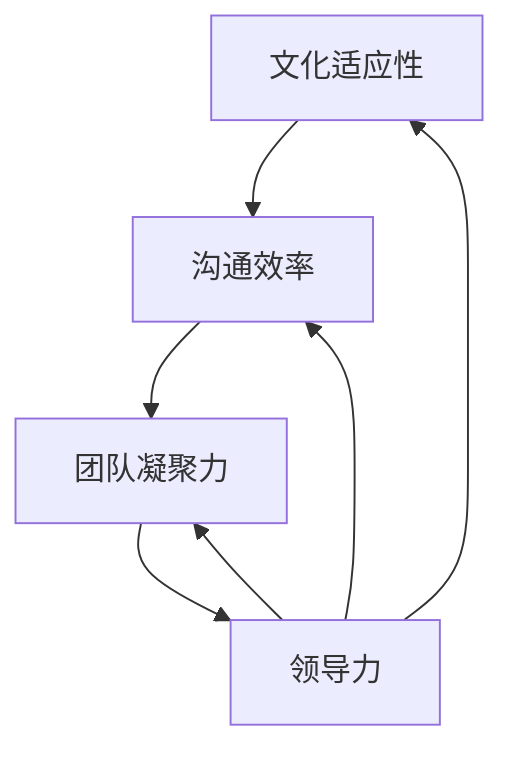

                 

# 跨文化技术团队的管理之道

## 关键词

跨文化管理、技术团队、领导力、沟通、团队合作、项目管理

## 摘要

在全球化的背景下，跨文化技术团队日益成为现代企业的常态。本文旨在探讨跨文化技术团队的管理之道，从团队组建、沟通协作、领导力培养等多个角度，提供一套系统化的管理策略。文章将结合实际案例，深入分析跨文化团队的挑战与解决方案，旨在帮助团队管理者提升跨文化管理能力，实现团队的可持续发展。

## 第一部分：跨文化管理基础

### 第1章：跨文化管理的概念与重要性

#### 1.1 跨文化管理的概念

跨文化管理，是指在一个多元文化背景下，组织为适应不同文化差异，进行有效的组织管理活动。在技术团队中，跨文化管理尤为关键，因为技术工作往往需要高度的合作与沟通。

#### 1.2 跨文化管理的重要性

跨文化管理的必要性体现在以下几个方面：

1. **提升团队效能**：通过理解和尊重不同文化背景的团队成员，可以减少误解和冲突，提高团队的协作效率。
2. **促进创新**：多元文化背景的团队往往能带来不同的思维视角，有助于创新和解决问题。
3. **适应全球化市场**：在全球化的背景下，技术团队需要面对多元文化的客户和合作伙伴，跨文化管理能力是企业国际竞争力的体现。

#### 1.3 跨文化管理面临的挑战

跨文化管理面临的挑战包括：

1. **文化差异**：语言、习俗、价值观等方面的差异，可能导致沟通障碍和误解。
2. **沟通障碍**：不同文化背景下的沟通方式差异，可能导致信息传递不畅。
3. **团队凝聚力**：文化差异可能影响团队成员之间的信任和凝聚力。

### 1.4 跨文化管理的基本原则

为了应对上述挑战，跨文化管理需要遵循以下基本原则：

1. **尊重多样性**：尊重团队成员的文化背景，避免偏见和歧视。
2. **沟通与理解**：建立有效的沟通机制，增进团队成员之间的理解和信任。
3. **增强团队凝聚力**：通过团队建设活动，增强团队成员之间的联系和信任。

## 第二部分：跨文化技术团队的特殊性

### 第2章：技术团队的跨文化特点

#### 2.1 技术团队的构成与工作方式

技术团队通常由来自不同国家和地区的成员组成，他们可能具有不同的技术背景、沟通风格和工作习惯。这种多样性既带来了优势，也带来了挑战。

#### 2.2 技术团队的跨文化沟通

跨文化沟通在技术团队中尤为重要。由于文化差异，团队成员在沟通时可能会遇到以下问题：

1. **语言障碍**：不同的语言可能影响信息的准确传达。
2. **沟通风格差异**：不同文化背景下，团队成员的沟通风格和方式可能不同，这可能导致沟通不畅。

#### 2.3 跨文化技术团队的协作模式

为了有效协作，跨文化技术团队需要建立以下协作模式：

1. **明确的任务分工**：确保每个团队成员都了解自己的职责和任务。
2. **灵活的工作安排**：考虑团队成员的不同工作习惯和时间差异，灵活安排工作。
3. **有效的沟通工具**：使用适合不同文化的沟通工具和平台，如视频会议、即时通讯等。

### 第3章：跨文化团队管理策略

#### 3.1 团队组建策略

在组建跨文化技术团队时，管理者应考虑以下因素：

1. **文化多样性**：确保团队成员来自不同文化背景，以促进创新和协作。
2. **技能互补**：根据项目需求，选择具有互补技能的团队成员。
3. **文化适应性**：选择具有跨文化适应能力的团队成员。

#### 3.2 团队管理策略

跨文化技术团队的管理需要以下策略：

1. **领导风格**：根据团队成员的文化背景，采用适当的领导风格，如民主式、参与式等。
2. **激励机制**：设计适合跨文化团队的激励机制，如认可和奖励。
3. **冲突管理**：建立有效的冲突解决机制，避免文化差异引发团队冲突。

## 第三部分：跨文化团队协作与项目执行

### 第4章：跨文化团队协作模式

#### 4.1 团队协作工具与平台

跨文化团队协作需要借助有效的工具和平台，如：

1. **项目管理工具**：如JIRA、Trello等，帮助团队跟踪项目进度和任务分配。
2. **即时通讯工具**：如Slack、Microsoft Teams等，方便团队成员实时沟通。
3. **视频会议工具**：如Zoom、Microsoft Teams等，确保团队成员能够进行面对面的沟通和讨论。

#### 4.2 项目执行与监控

跨文化技术团队在项目执行过程中需要：

1. **明确目标**：确保所有团队成员对项目目标和期望有清晰的理解。
2. **定期沟通**：通过定期会议和报告，确保团队成员之间的信息畅通。
3. **风险管理**：识别和应对项目中可能出现的风险，确保项目顺利进行。

### 第5章：跨文化技能培养与实践

#### 5.1 跨文化技能培养

跨文化技能的培养是跨文化团队管理的重要组成部分。以下是一些培养跨文化技能的方法：

1. **文化培训**：为团队成员提供文化培训，增强他们对不同文化的理解和尊重。
2. **跨文化沟通技巧**：培养团队成员的跨文化沟通能力，包括倾听、表达和冲突解决等。
3. **国际经验**：鼓励团队成员参与国际项目或出国交流，提升他们的跨文化适应能力。

#### 5.2 跨文化沟通能力提升

提升跨文化沟通能力需要：

1. **了解文化差异**：通过学习和实践，了解不同文化的特点和价值观念。
2. **积极沟通**：鼓励团队成员主动沟通，表达自己的观点和需求。
3. **相互尊重**：尊重团队成员的文化背景，避免使用可能引起误解的语言和行为。

### 第6章：跨文化团队管理与领导力

#### 6.1 跨文化领导力培养

跨文化领导力是跨文化团队管理的关键。以下是一些培养跨文化领导力的方法：

1. **文化敏感度**：领导者需要具备较高的文化敏感度，尊重和理解团队成员的文化背景。
2. **有效的沟通**：领导者应具备有效的沟通能力，确保信息的准确传达和团队成员的理解。
3. **灵活的领导风格**：根据团队成员的文化背景和需求，采用灵活的领导风格。

#### 6.2 跨文化领导力实践

跨文化领导力实践包括：

1. **领导者的角色**：领导者需要扮演协调者和沟通者的角色，促进团队成员之间的合作。
2. **冲突解决**：领导者应具备解决跨文化冲突的能力，确保团队的和谐与稳定。
3. **激励机制**：领导者应设计适合跨文化团队的激励机制，激发团队成员的积极性和创造力。

## 第四部分：跨文化团队文化与绩效评估

### 第7章：跨文化团队文化构建

#### 7.1 团队文化的定义与类型

团队文化是指团队成员共同遵守的价值观念、行为规范和工作习惯。跨文化团队的文化构建需要考虑：

1. **多元化文化的融合**：尊重并融合团队成员的不同文化背景，形成具有包容性的团队文化。
2. **共同价值观**：确立团队共同的价值观，以增强团队成员的凝聚力和归属感。

#### 7.2 跨文化团队文化的建设策略

跨文化团队文化的建设策略包括：

1. **团队建设活动**：通过团队建设活动，增进团队成员之间的了解和信任。
2. **文化培训**：为团队成员提供文化培训，提高他们的跨文化适应能力。
3. **沟通平台**：建立有效的沟通平台，促进团队成员之间的交流和互动。

### 第8章：跨文化团队绩效评估

#### 8.1 跨文化团队绩效评估的方法

跨文化团队绩效评估需要考虑：

1. **多维度评估**：从多个维度评估团队成员的表现，如技术能力、沟通能力、团队合作能力等。
2. **文化适应性评估**：评估团队成员的文化适应性和跨文化技能。

#### 8.2 绩效评估中的跨文化因素

跨文化团队绩效评估中需要考虑以下因素：

1. **文化差异**：考虑不同文化背景下团队成员的表现和评价标准。
2. **沟通障碍**：评估沟通障碍对绩效评估的影响，确保评估的公平性。

#### 8.3 跨文化团队绩效评估的案例研究

通过案例研究，可以深入了解跨文化团队绩效评估的实际操作和效果。以下是一个案例研究：

**案例**：一家跨国公司成立了一个由中美团队组成的研发团队。在绩效评估过程中，公司采用了多维度的评估方法，包括技术能力、沟通能力和团队合作能力。同时，特别关注文化适应性和跨文化技能。通过定期的反馈和沟通，团队成员不断提高自己的跨文化技能，团队的绩效也得到了显著提升。

## 第五部分：跨文化团队可持续发展

### 第9章：跨文化团队可持续发展策略

#### 9.1 持续发展的重要性

跨文化团队的可持续发展对于企业的长期竞争力至关重要。以下是一些可持续发展策略：

1. **人才梯队建设**：建立合理的人才梯队，确保团队的持续发展。
2. **持续学习与培训**：鼓励团队成员持续学习和提升自己的技能，以适应不断变化的技术和市场需求。
3. **文化传承与创新**：在传承团队文化的基础上，不断创新，以适应新的挑战和机遇。

#### 9.2 跨文化团队中的持续发展实践

跨文化团队中的持续发展实践包括：

1. **定期评估与反馈**：定期评估团队的绩效和跨文化技能，提供反馈和改进建议。
2. **跨文化团队建设**：通过团队建设活动，增强团队的凝聚力和合作精神。
3. **国际化视野**：鼓励团队成员拓展国际视野，了解全球市场的动态和发展趋势。

## 第六部分：跨文化团队管理与领导力

### 第10章：跨文化领导力培养

#### 10.1 跨文化领导力的要素

跨文化领导力包括以下要素：

1. **文化敏感度**：领导者需要具备较高的文化敏感度，尊重和理解团队成员的文化背景。
2. **有效的沟通**：领导者应具备有效的沟通能力，确保信息的准确传达和团队成员的理解。
3. **灵活的领导风格**：领导者应根据团队成员的文化背景和需求，采用灵活的领导风格。

#### 10.2 跨文化领导力实践

跨文化领导力实践包括：

1. **领导者的角色**：领导者需要扮演协调者和沟通者的角色，促进团队成员之间的合作。
2. **冲突解决**：领导者应具备解决跨文化冲突的能力，确保团队的和谐与稳定。
3. **激励机制**：领导者应设计适合跨文化团队的激励机制，激发团队成员的积极性和创造力。

### 第11章：跨文化团队管理与领导力

#### 11.1 跨文化团队管理的挑战

跨文化团队管理面临以下挑战：

1. **文化差异**：文化差异可能导致沟通障碍和误解。
2. **团队凝聚力**：文化差异可能影响团队成员之间的信任和凝聚力。
3. **绩效评估**：跨文化团队绩效评估需要考虑文化适应性等非技术因素。

#### 11.2 跨文化团队管理的策略

为了应对上述挑战，跨文化团队管理可以采取以下策略：

1. **文化培训**：为团队成员提供文化培训，提高他们的跨文化适应能力。
2. **有效的沟通**：建立有效的沟通机制，促进团队成员之间的理解和信任。
3. **激励机制**：设计适合跨文化团队的激励机制，激发团队成员的积极性和创造力。

### 第12章：跨文化团队可持续发展

#### 12.1 跨文化团队的长期发展

跨文化团队的长期发展需要：

1. **持续学习与成长**：鼓励团队成员持续学习和提升自己的技能，以适应不断变化的技术和市场需求。
2. **文化传承与创新**：在传承团队文化的基础上，不断创新，以适应新的挑战和机遇。
3. **国际化视野**：鼓励团队成员拓展国际视野，了解全球市场的动态和发展趋势。

#### 12.2 跨文化团队的未来趋势

跨文化团队的未来发展将呈现出以下趋势：

1. **技术驱动**：随着人工智能、大数据等技术的应用，跨文化团队的工作模式将更加智能化和高效化。
2. **全球化**：跨文化团队将在全球范围内发挥更加重要的作用，成为企业国际化战略的重要组成部分。
3. **可持续发展**：跨文化团队将更加注重可持续发展，关注团队成员的职业发展和个人成长。

## 附录

### 附录A：跨文化管理资源与工具

#### A.1 跨文化管理相关书籍推荐

1. **《跨文化管理：理论与实践》** - 张晓辉 著
2. **《全球化时代的领导力》** - 约翰·霍金斯 著
3. **《跨文化沟通与交际》** - 赵玉明 著

#### A.2 跨文化管理在线课程资源

1. **Coursera上的《跨文化沟通与谈判》**
2. **edX上的《跨文化管理》**
3. **Udemy上的《跨文化沟通与协作》**

#### A.3 跨文化管理相关组织与论坛

1. **国际跨文化管理协会（AAICI）**
2. **中国跨文化研究会**
3. **LinkedIn上的跨文化管理论坛**

以上资源可以帮助读者进一步了解和掌握跨文化管理的相关理论和实践。

## 总结

跨文化技术团队的管理之道是一个复杂而富有挑战的过程。通过本文的探讨，我们了解到跨文化管理的概念、重要性、基本原则，以及跨文化技术团队的特殊性、管理策略、协作模式、领导力培养、绩效评估和可持续发展策略。希望本文能为您提供宝贵的参考，帮助您更好地管理跨文化技术团队，实现团队的可持续发展。作者：AI天才研究院/AI Genius Institute & 禅与计算机程序设计艺术 /Zen And The Art of Computer Programming

-------------------------------------------------------------------- 

### 引入

在全球化的浪潮中，跨国公司越来越多地组建跨文化技术团队，以应对复杂多变的市场需求和技术挑战。这种跨文化技术团队的构建，不仅带来了技术上的优势，也带来了文化上的挑战。如何有效地管理这样的团队，成为企业领导者和管理者面临的重大课题。

跨文化管理，作为一个新兴的领域，其核心在于如何在多元文化背景下，实现团队成员之间的有效沟通、合作和共同进步。在技术团队中，跨文化管理尤为重要。因为技术工作不仅需要高度的专业知识，还需要团队之间的紧密协作和高效沟通。文化差异、沟通障碍、团队凝聚力等问题，都可能影响技术团队的工作效率和项目成果。

本文将从跨文化管理的概念、跨文化技术团队的特殊性、管理策略、协作模式、领导力培养、绩效评估和可持续发展等多个方面，系统地探讨跨文化技术团队的管理之道。通过实际案例的分析和讨论，本文旨在为团队管理者提供一套实用、有效的管理策略，帮助他们更好地应对跨文化团队的挑战，实现团队的可持续发展。

### 跨文化管理的基础知识

跨文化管理是指在一个多元文化背景下，组织为适应不同文化差异，进行有效的组织管理活动。在技术团队中，跨文化管理尤为重要，因为它不仅涉及到团队成员之间的沟通和合作，还涉及到项目管理和团队文化的构建。

#### 跨文化管理的概念

跨文化管理（Cross-cultural Management）是指在一个多元文化背景下，组织为了实现目标，通过文化适应、文化融合和文化创新等方式，对组织内部的文化差异进行管理和协调的过程。它涉及到不同文化背景下的价值观、沟通方式、工作习惯和行为规范的差异，以及如何在这些差异的基础上，实现团队的高效协作和共同进步。

跨文化管理不同于一般的文化管理，它不仅关注组织内部的文化差异，还关注组织与外部环境之间的文化互动。在技术团队中，跨文化管理强调如何处理来自不同国家和地区的团队成员之间的文化差异，如何建立有效的沟通机制，以及如何协调不同文化背景下的工作方式和价值观。

#### 跨文化管理的重要性

跨文化管理的重要性体现在以下几个方面：

1. **提升团队效能**：通过理解和尊重不同文化背景的团队成员，可以减少误解和冲突，提高团队的协作效率。例如，在某些文化中，直接和明确的沟通方式可能更受欢迎，而在其他文化中，委婉和间接的沟通方式可能更为合适。了解这些文化差异，可以避免沟通障碍，提高团队的沟通效果。

2. **促进创新**：多元文化背景的团队往往能带来不同的思维视角，有助于创新和解决问题。例如，在某些文化中，团队合作和共享知识被视为成功的关键，而在其他文化中，独立思考和竞争精神可能更为重要。通过理解和尊重这些文化差异，可以激发团队成员的创新潜力，促进团队的创新发展。

3. **适应全球化市场**：在全球化的背景下，技术团队需要面对多元文化的客户和合作伙伴，跨文化管理能力是企业国际竞争力的体现。例如，在跨国项目中，团队成员来自不同的国家和地区，他们可能具有不同的技术背景、沟通风格和工作习惯。通过有效的跨文化管理，企业可以更好地适应全球化市场，提高项目执行效率和客户满意度。

#### 跨文化管理面临的挑战

跨文化管理面临的挑战主要包括：

1. **文化差异**：语言、习俗、价值观等方面的差异，可能导致沟通障碍和误解。例如，在某些文化中，直接表达可能被视为不礼貌，而在其他文化中，直接表达可能被视为诚实和坦率。

2. **沟通障碍**：不同文化背景下的沟通方式差异，可能导致信息传递不畅。例如，某些文化中，人们更倾向于使用非言语沟通，而在其他文化中，人们可能更倾向于使用书面沟通。

3. **团队凝聚力**：文化差异可能影响团队成员之间的信任和凝聚力。例如，在某些文化中，团队合作和共享被视为成功的关键，而在其他文化中，个人成就和竞争可能更为重要。

#### 跨文化管理的基本原则

为了应对上述挑战，跨文化管理需要遵循以下基本原则：

1. **尊重多样性**：尊重团队成员的文化背景，避免偏见和歧视。这意味着管理者需要意识到不同文化的存在，并在决策过程中考虑这些文化差异。

2. **沟通与理解**：建立有效的沟通机制，增进团队成员之间的理解和信任。这包括了解不同文化的沟通习惯、使用适当的沟通方式以及提供跨文化培训。

3. **增强团队凝聚力**：通过团队建设活动，增强团队成员之间的联系和信任。这包括组织团队活动、建立共同目标以及培养团队精神。

通过遵循这些基本原则，企业可以更好地管理跨文化团队，实现团队的高效协作和可持续发展。

#### 背景介绍

在全球化的浪潮中，跨国公司纷纷组建跨文化技术团队，以应对日益复杂的市场需求和科技挑战。这种跨文化技术团队的构建不仅为企业带来了技术创新和市场拓展的机会，同时也带来了新的管理挑战。如何有效地管理这样的团队，成为企业领导者和管理者亟待解决的问题。

跨文化技术团队的构成通常包括来自不同国家和地区的成员，他们可能具有不同的技术背景、教育经历和文化背景。这种多样性在带来创新和多元化的同时，也引发了一系列的管理难题。文化差异、沟通障碍和团队凝聚力问题，都是跨文化技术团队面临的典型挑战。

首先，文化差异可能导致沟通障碍。不同文化背景下的团队成员可能在语言、沟通风格和工作习惯上有显著差异。例如，某些文化中，直接和明确的沟通方式可能更为普遍，而在其他文化中，委婉和间接的沟通方式可能更为合适。这种差异可能导致误解和沟通不畅，从而影响团队的工作效率和项目进展。

其次，团队凝聚力问题也是跨文化技术团队的一大挑战。文化差异可能影响团队成员之间的信任和关系，导致团队内部出现分裂和矛盾。在某些文化中，团队合作和共享被视为成功的关键，而在其他文化中，个人成就和竞争可能更为重要。这种差异可能导致团队成员之间的信任度降低，影响团队的协作效果。

最后，跨文化技术团队的管理需要具备较高的领导力和管理能力。领导者需要具备跨文化意识，能够理解并尊重不同文化背景的团队成员，同时采用适当的领导风格和沟通策略，以促进团队的协作和共同进步。

因此，如何有效地管理跨文化技术团队，提升团队效能和凝聚力，成为企业领导者和管理者需要认真思考的问题。通过系统的跨文化管理策略和实践，企业可以更好地应对这些挑战，实现跨文化技术团队的成功和可持续发展。

#### 核心概念与联系

在跨文化技术团队的管理中，几个核心概念是理解和管理团队的关键。这些核心概念包括文化适应性、沟通效率、团队凝聚力和领导力。它们之间的关系可以用一个Mermaid流程图来描述，从而帮助我们更直观地理解它们之间的相互作用。



1. **文化适应性**：文化适应性指的是团队成员在面对不同文化环境时的适应能力和灵活性。一个高度文化适应性的团队，能够更好地理解和尊重不同文化背景的成员，减少文化冲突，提高沟通效率。

2. **沟通效率**：沟通效率是指团队在信息传递和交流过程中的效率和效果。高效的沟通不仅能够确保信息的准确传达，还能增强团队成员之间的信任和理解，促进团队协作。

3. **团队凝聚力**：团队凝聚力是指团队成员之间的相互依赖和信任程度，以及他们共同追求团队目标的意愿。高凝聚力的团队往往能够更好地应对外部压力和内部挑战，保持稳定的工作状态。

4. **领导力**：领导力是指领导者通过影响和激励团队成员，实现团队目标的能力。领导力不仅影响团队成员的行为和态度，还直接影响团队的整体绩效和团队凝聚力。

这些核心概念之间的相互作用可以用以下方式解释：

- **文化适应性与沟通效率**：文化适应性是提高沟通效率的基础。一个文化适应性强的团队，能够更好地理解和尊重不同文化背景的成员，减少误解和冲突，从而提高沟通效率。

- **团队凝聚力与沟通效率**：高效的沟通能够增强团队成员之间的信任和理解，从而提高团队凝聚力。相反，缺乏有效沟通的团队，很难建立高凝聚力的团队氛围。

- **领导力与团队凝聚力**：领导者在团队中扮演着关键角色，通过设定明确的团队目标、激励团队成员和解决团队冲突，领导者能够增强团队的凝聚力。

通过这个Mermaid流程图，我们可以清晰地看到文化适应性、沟通效率、团队凝聚力和领导力之间的相互关系，以及它们在跨文化技术团队管理中的重要性。这些核心概念不仅独立发挥作用，还相互影响，共同推动跨文化技术团队的可持续发展。

### 跨文化技术团队的沟通障碍及解决策略

跨文化技术团队在沟通中面临的障碍是多方面的，这些障碍可能源自语言、文化习惯、工作方式等方面。解决这些障碍，需要管理者采取一系列的策略和技巧，以确保信息的准确传递和团队成员之间的有效协作。

#### 语言障碍

语言障碍是跨文化团队沟通中最常见的问题。不同文化背景的团队成员可能使用不同的语言，这可能导致信息传递的误解和错误。例如，一位来自法国的工程师可能会使用法语中的习惯用语，而这些用语在英语中使用时可能有不同的含义。

**解决策略：**

1. **设置共同的语言标准**：在团队中确定一种共同的工作语言，如英语，并确保所有成员都熟练掌握这种语言。
2. **提供语言培训**：为团队成员提供语言培训，提高他们的语言能力和跨文化沟通技巧。
3. **使用辅助工具**：利用翻译软件和在线词典，帮助团队成员理解和使用不同的语言。

#### 沟通风格差异

不同文化背景下，团队成员的沟通风格可能存在显著差异。例如，某些文化倾向于直接和清晰的沟通，而其他文化则更注重委婉和间接的沟通。这种差异可能导致误解和沟通障碍。

**解决策略：**

1. **了解和尊重沟通风格差异**：管理者应了解不同文化背景下的沟通风格，并在沟通中尊重这些差异。例如，在与来自亚洲文化的团队成员沟通时，可以使用更为委婉和间接的表达方式。
2. **建立双向沟通机制**：鼓励团队成员在沟通中表达自己的观点和需求，确保信息的双向传递。这可以通过定期会议、反馈环节等方式实现。
3. **提供跨文化沟通培训**：为团队成员提供跨文化沟通培训，帮助他们了解不同文化的沟通习惯，提高跨文化沟通的技巧。

#### 工作方式差异

跨文化技术团队中的成员可能来自不同的工作环境和文化背景，他们的工作方式可能存在显著差异。例如，某些团队成员可能习惯于快速决策和执行，而其他团队成员可能更喜欢进行充分讨论和规划。

**解决策略：**

1. **灵活的工作安排**：根据团队成员的不同工作习惯和时间差异，灵活安排工作。例如，可以设置不同的工作时间段，以确保团队成员能够在自己的最佳工作时间内进行高效的工作。
2. **明确的工作流程**：制定明确的工作流程和标准操作程序，以确保团队成员之间的协作有序。这可以通过项目管理工具和文档管理平台来实现。
3. **文化适应性培训**：为团队成员提供文化适应性培训，帮助他们了解和适应不同的工作方式和文化背景。

通过上述策略，跨文化技术团队能够有效克服沟通障碍，提高沟通效率，实现团队成员之间的有效协作。

### 跨文化技术团队的特殊性

跨文化技术团队具有其独特的特点，这些特点既为团队带来了优势，也带来了挑战。理解这些特殊性对于有效管理和领导跨文化技术团队至关重要。

#### 多元化的文化背景

跨文化技术团队的成员通常来自不同的国家和地区，拥有不同的文化背景。这种多样性在技术观点和解决问题的方法上提供了丰富的资源，有助于团队的创新能力。然而，文化差异也可能导致沟通障碍、误解和冲突。例如，团队成员可能在价值观、工作习惯和沟通风格上存在显著差异，这需要管理者采取有效的策略来促进理解和合作。

#### 技术背景的多样性

在技术团队中，跨文化背景的成员可能拥有不同的技术背景和专业知识。这种多样性在项目中可以带来互补的技能和不同的技术视角，有助于解决问题和推动创新。然而，这也可能带来技术标准的差异和协作的挑战。管理者需要确保团队成员之间的技术知识和能力达到一定的共识，以减少误解和冲突。

#### 沟通和协作的挑战

跨文化技术团队在沟通和协作上面临着额外的挑战。不同文化背景的成员可能在沟通风格、交流方式和信息处理上存在差异。例如，一些文化强调直接和清晰的沟通，而另一些文化则倾向于委婉和间接的表达。这些差异可能导致信息传递不准确或误解。为了克服这些挑战，管理者需要建立有效的沟通机制和协作平台，确保信息的高效传递和团队成员之间的紧密合作。

#### 团队凝聚力和信任建设

跨文化技术团队在建立团队凝聚力和信任方面也面临着独特的挑战。由于文化差异，团队成员可能在信任和理解上存在障碍。管理者需要通过跨文化培训和团队建设活动来增强团队成员之间的信任和归属感，促进团队的团结和合作。

#### 激励和管理的多样性

跨文化技术团队的管理和激励也需要考虑文化差异。不同文化背景下，团队成员对激励和奖励的反应可能不同。管理者需要设计适合不同文化背景的激励机制，以确保团队成员的积极性和工作满意度。

总之，跨文化技术团队的特殊性要求管理者在组建和领导团队时，必须考虑文化差异、技术背景多样性、沟通和协作挑战、团队凝聚力和信任建设，以及激励和管理的多样性。通过采取一系列有效的策略和实践，管理者可以充分发挥跨文化技术团队的优势，克服其挑战，实现团队的可持续发展和高效协作。

### 跨文化团队管理策略

在管理跨文化技术团队时，制定有效的策略是确保团队高效运作和成功实现项目目标的关键。以下是一些关键的管理策略，包括团队组建、领导风格、激励策略和冲突管理。

#### 团队组建策略

1. **技能互补**：在组建团队时，确保团队成员具有互补的技能和专业知识。这不仅有助于提高团队的整体能力，还能确保项目在技术实现上更加全面。

2. **文化多样性**：鼓励团队成员来自不同的文化背景，以促进创新和多元视角。然而，也需要注意避免文化差异导致的不和谐，确保文化多样性与团队的协调运作相结合。

3. **明确角色和职责**：在团队组建过程中，明确每个成员的角色和职责，确保每个成员都清楚自己的工作内容和目标。

4. **跨文化适应性**：选择具有跨文化适应能力的团队成员，这些成员能够更好地理解并适应不同文化背景，促进团队的融合和协作。

#### 领导风格

1. **民主式领导**：民主式领导风格适合跨文化团队，因为它鼓励团队成员参与决策过程，增加成员的参与感和责任感。

2. **参与式领导**：参与式领导强调团队合作和共同决策，有助于建立团队凝聚力和信任。

3. **文化敏感度**：领导者需要具备较高的文化敏感度，能够理解和尊重团队成员的文化背景，避免文化偏见和歧视。

#### 激励策略

1. **认可和奖励**：设计适合跨文化团队的激励机制，包括认可和奖励，以激励团队成员的积极性和工作动力。

2. **目标设定**：明确团队和个人的目标，并与团队成员进行沟通，确保他们了解自己的目标和期望。

3. **职业发展**：提供职业发展机会和培训，帮助团队成员提升技能和职业素养，增强他们的职业满足感和忠诚度。

#### 冲突管理

1. **预防策略**：通过建立良好的沟通机制和文化，预防文化差异导致的冲突。例如，定期组织文化培训，提高团队成员的文化理解和适应能力。

2. **及时解决**：当冲突发生时，及时介入并解决。避免冲突积累，影响团队的工作效率和氛围。

3. **公正处理**：在处理冲突时，保持公正和客观，确保所有团队成员都受到公平对待。

通过上述策略，管理者可以有效地管理跨文化技术团队，提升团队效能和项目成功率。

### 跨文化团队的协作模式

在跨文化技术团队中，协作模式的选择和实施至关重要。合适的协作模式能够有效促进团队成员之间的沟通和合作，提高团队的整体效能。以下是几种常见的跨文化团队协作模式，以及它们在实际应用中的优势和挑战。

#### 分布式协作

**定义**：分布式协作是指团队成员分布在不同的地理位置，通过远程通信工具进行协作。

**优势**：
1. **灵活性**：团队成员可以根据自己的时间安排工作，提高工作效率。
2. **资源共享**：通过共享平台和工具，团队成员可以方便地访问和共享文件和资源。

**挑战**：
1. **沟通障碍**：由于时区差异和语言障碍，实时沟通可能会受到影响。
2. **协作效率**：缺乏面对面的交流可能导致信息的误传和误解。

**最佳实践**：
- **明确工作流程**：制定详细的工作流程和标准操作程序，确保所有团队成员都清楚各自的任务和责任。
- **定期会议**：定期举行视频会议，确保团队成员之间的沟通和信息同步。

#### 同地协作

**定义**：同一地点协作是指团队成员在同一个工作空间（如办公室或实验室）中进行协作。

**优势**：
1. **实时沟通**：团队成员可以随时面对面交流，减少沟通障碍。
2. **协作效率**：面对面的交流有助于快速解决问题和做出决策。

**挑战**：
1. **空间限制**：团队成员的数量和空间有限，可能导致工作环境拥挤。
2. **文化冲突**：不同文化背景的团队成员可能需要更多的时间和努力来适应同一工作空间。

**最佳实践**：
- **设立共享空间**：为团队成员提供共享的工作空间，如开放办公区或团队会议室。
- **跨文化培训**：定期进行跨文化培训，提高团队成员的文化理解和适应能力。

#### 虚拟协作

**定义**：虚拟协作是指团队成员通过虚拟工具（如在线平台和即时通讯工具）进行协作。

**优势**：
1. **成本效益**：减少了团队成员的差旅费用和办公场所的成本。
2. **灵活性**：团队成员可以在任何时间、任何地点进行协作。

**挑战**：
1. **技术依赖**：对网络和通信工具的依赖可能导致协作中断。
2. **信任和沟通**：缺乏面对面的交流可能导致信任和沟通的障碍。

**最佳实践**：
- **选择合适的协作工具**：根据团队的具体需求选择合适的协作工具，如项目管理工具、文档共享平台和视频会议软件。
- **建立明确的沟通规则**：制定沟通规则，确保团队成员在协作过程中遵循统一的沟通标准和流程。

通过选择合适的协作模式，并遵循最佳实践，跨文化技术团队能够实现高效协作，提高项目的成功率。

### 项目执行与监控

在跨文化技术团队的背景下，项目执行和监控成为确保项目成功的关键环节。为了确保项目顺利推进，管理者需要采用一系列科学的方法和工具，确保项目进度、质量和团队成员的协作。

#### 项目管理方法论

项目管理方法论的选择对跨文化团队的执行和监控至关重要。以下是几种适用于跨文化团队的项目管理方法论：

1. **敏捷开发**：敏捷开发方法强调灵活性和迭代性，允许团队快速适应变化。这种方法有助于应对跨文化团队中的不确定性，通过持续反馈和改进，确保项目按时交付。

2. **Scrum框架**：Scrum是一种迭代和增量的软件开发方法，强调团队协作和透明度。Scrum的每日站会、冲刺评审和回顾会等机制，有助于团队成员保持沟通和信息同步。

3. **六西格玛**：六西格玛是一种质量管理和改进方法，通过减少缺陷和浪费，提高项目质量和效率。这种方法在跨文化团队中，可以帮助团队识别和解决潜在的问题，确保项目的高质量交付。

#### 跨文化项目中的风险与控制

跨文化项目面临着一系列独特风险，这些风险可能影响项目的进度和质量。以下是一些常见的跨文化项目风险及相应的控制措施：

1. **沟通障碍**：语言和文化差异可能导致沟通不畅。控制措施包括：
   - **多语言支持**：提供多语言交流工具和翻译服务，确保信息准确传达。
   - **沟通培训**：为团队成员提供跨文化沟通培训，提高他们的沟通技巧和文化理解能力。

2. **时间管理**：不同地区的时区差异可能导致项目进度安排的困难。控制措施包括：
   - **灵活的工作安排**：考虑团队成员的时区差异，灵活安排工作时间和会议时间。
   - **项目管理工具**：使用项目管理工具，如Trello、Asana等，实时跟踪项目进度，确保团队成员能够同步工作。

3. **文化冲突**：文化差异可能引发团队成员之间的冲突。控制措施包括：
   - **文化敏感度培训**：为团队成员提供文化敏感度培训，增强他们的跨文化理解能力。
   - **冲突解决机制**：建立有效的冲突解决机制，及时处理和解决文化冲突，确保团队和谐稳定。

#### 跨文化项目中的绩效评估

在跨文化项目中，绩效评估不仅要考虑技术能力，还要考虑文化适应性和团队协作能力。以下是一些绩效评估的方法和策略：

1. **多维度评估**：绩效评估应从多个维度进行，包括技术能力、沟通能力、团队合作能力和文化适应性。通过多维度的评估，可以全面了解团队成员的表现。

2. **主观和客观评估**：绩效评估应结合主观评价和客观指标，确保评估的公正性和科学性。例如，团队成员的自我评估、同事评价和项目成果等。

3. **持续反馈**：通过定期的反馈和沟通，及时了解团队成员的表现，并提供改进建议。这种持续反馈机制有助于团队成员不断进步，提高整体绩效。

通过科学的项目执行和监控方法，跨文化技术团队能够有效地管理项目风险，确保项目进度和质量，实现项目的成功交付。

### 跨文化技能培养与实践

在跨文化技术团队中，培养团队成员的跨文化技能是确保团队高效协作和项目成功的关键。以下是一些关键步骤和实践，帮助团队成员提升跨文化技能：

#### 跨文化意识与认知提升

1. **文化培训**：为团队成员提供系统的文化培训，包括不同文化的历史、价值观、行为规范和沟通习惯。通过培训，帮助团队成员深入了解和尊重不同文化背景，减少文化误解和冲突。

2. **文化敏感度测试**：使用文化敏感度测试工具，如Intercultural Development Inventory (IDI)，评估团队成员的文化认知水平。通过测试，可以识别团队成员在跨文化理解上的优势和不足，制定个性化的培训计划。

3. **案例分析**：通过分析真实案例中的跨文化问题，帮助团队成员理解跨文化情境下的挑战和解决方案。这种案例分析可以提供实际操作的经验，提高团队成员的跨文化应对能力。

#### 跨文化沟通能力提升

1. **沟通技巧培训**：为团队成员提供跨文化沟通技巧的培训，包括有效的倾听、清晰的表达、非言语沟通和文化差异识别。通过培训，提升团队成员在跨文化沟通中的技巧和能力。

2. **模拟演练**：组织跨文化沟通模拟演练，让团队成员在模拟环境中练习跨文化沟通。这种实践可以增强团队成员的信心和技巧，提高他们在实际跨文化情境中的表现。

3. **反馈与反思**：通过定期的反馈和反思环节，团队成员可以分享他们在跨文化沟通中的经验和教训。这种反馈机制有助于团队成员不断改进沟通技巧，提高跨文化沟通的效果。

#### 跨文化冲突管理能力提升

1. **冲突管理培训**：为团队成员提供跨文化冲突管理的培训，包括识别冲突、解决冲突和保持团队和谐的方法。通过培训，提高团队成员在跨文化冲突中的应对能力。

2. **冲突情境分析**：通过分析真实冲突情境，帮助团队成员理解冲突的原因和影响。这种情境分析可以提供实际操作的经验，提高团队成员在解决跨文化冲突中的策略和技巧。

3. **角色扮演**：通过角色扮演练习，让团队成员在模拟情境中扮演不同角色，体验跨文化冲突管理的挑战和解决方案。这种角色扮演有助于团队成员在实践中提高冲突管理能力。

通过这些步骤和实践，跨文化技术团队的成员可以不断提升自己的跨文化技能，提高团队的协作效率和项目成功率。

### 跨文化领导力培养

在跨文化技术团队中，领导力至关重要，它不仅影响团队成员的工作效率和项目成果，还直接影响团队的凝聚力和文化适应性。以下是一些关键步骤和实践，帮助领导者提升跨文化领导力：

#### 跨文化领导力的要素

1. **文化敏感度**：领导者需要具备较高的文化敏感度，能够理解和尊重不同文化背景的团队成员。这包括了解不同文化的价值观、行为规范和沟通习惯。

2. **有效的沟通**：领导者应具备有效的跨文化沟通能力，确保信息的准确传达和团队成员的理解。这包括使用适当的沟通方式、语言和语调，以及提供清晰的指导和支持。

3. **灵活的领导风格**：领导者应根据团队成员的文化背景和需求，采用灵活的领导风格。这可能包括民主式、参与式或指导式的领导风格，以适应不同文化背景的团队成员。

4. **冲突解决能力**：领导者应具备解决跨文化冲突的能力，确保团队的和谐与稳定。这包括识别冲突的根源、采取适当的冲突解决策略，以及促进团队成员之间的理解和合作。

#### 跨文化领导力实践

1. **文化适应性培训**：为领导者提供系统的文化适应性培训，帮助他们了解和适应不同文化背景下的工作环境和团队需求。这种培训可以包括文化背景知识、跨文化沟通技巧和冲突管理策略。

2. **领导力发展计划**：建立领导力发展计划，帮助领导者不断提升自己的领导力和跨文化技能。这可以包括领导力研讨会、工作坊和在线课程等，以及定期的反馈和评估。

3. **角色扮演和模拟训练**：通过角色扮演和模拟训练，让领导者体验不同文化背景下的领导情境，提高他们在实际跨文化领导中的策略和技巧。这种实践可以帮助领导者更好地应对跨文化挑战。

4. **跨文化团队合作实践**：鼓励领导者参与跨文化团队合作项目，通过实际操作提高他们的跨文化领导力。这种实践可以包括跨文化团队建设活动、跨文化项目管理和跨文化绩效评估等。

通过这些步骤和实践，领导者可以不断提升自己的跨文化领导力，有效地管理和领导跨文化技术团队，实现团队的高效协作和项目成功。

### 跨文化团队文化与绩效评估

在跨文化技术团队的管理中，构建积极的团队文化是提升团队绩效和实现长期发展的关键。同时，科学的绩效评估方法能够更好地激励团队成员，确保团队目标的实现。以下将详细探讨跨文化团队文化的构建和绩效评估的方法。

#### 跨文化团队文化的构建

1. **文化融合与价值观传播**：
   - **多元化文化的尊重与包容**：跨文化团队文化的构建首先要求团队成员尊重和理解彼此的文化背景。通过开展文化多样性培训，增强团队成员对多样性的认知和接受度。
   - **共同价值观的确立**：在尊重文化多样性的基础上，团队需要共同确立一套核心价值观，如创新、诚信、合作和卓越。这些共同价值观有助于增强团队成员的归属感和团队凝聚力。

2. **团队建设活动**：
   - **定期的团队建设活动**：通过组织定期的团队建设活动，如团队聚餐、户外拓展训练和团队旅行，促进团队成员之间的交流和互动，增强团队凝聚力。
   - **文化节日庆祝**：鼓励团队成员庆祝各自国家的传统节日，通过这种方式增进彼此的了解和尊重，促进文化融合。

3. **跨文化沟通机制**：
   - **建立有效的沟通平台**：为团队成员提供多种沟通渠道，如定期会议、即时通讯工具和协作平台，确保信息的有效传递和团队成员的充分参与。
   - **文化沟通培训**：定期开展文化沟通培训，提高团队成员的跨文化沟通技巧，减少误解和冲突。

#### 绩效评估的方法

1. **多维度评估**：
   - **技术能力评估**：从技术能力和项目完成情况等方面进行评估，确保团队成员在技术上的表现符合项目要求。
   - **沟通与协作能力评估**：评估团队成员在跨文化沟通和协作中的表现，包括沟通效率、团队合作能力和跨文化理解能力。

2. **定量与定性评估相结合**：
   - **定量评估**：使用量化指标，如项目完成进度、代码质量、问题解决效率等，对团队成员进行评估。
   - **定性评估**：通过团队成员的反馈和评价，了解团队成员在工作态度、团队合作和文化适应等方面的表现。

3. **定期反馈与改进**：
   - **定期的绩效反馈**：定期对团队成员进行绩效反馈，指出优点和不足，并提供改进建议。
   - **改进措施的实施**：根据绩效反馈，制定具体的改进措施，如技能培训、项目调整和沟通机制的改进等。

#### 案例研究

以下是一个实际案例研究，探讨跨文化团队文化构建和绩效评估的方法。

**案例背景**：
一家跨国公司成立了一个由中美团队组成的研发团队，负责开发一款国际化的软件产品。团队成员来自不同的文化背景，包括中国、美国、印度和欧洲。

**团队文化构建**：
- **文化多样性培训**：团队在项目启动之初，为所有团队成员提供了文化多样性培训，帮助他们了解和尊重彼此的文化背景。
- **团队建设活动**：团队定期组织团队建设活动，如户外拓展训练和团队聚餐，促进团队成员之间的交流和互动。
- **跨文化沟通机制**：团队建立了一个跨文化沟通平台，包括定期会议和即时通讯工具，确保团队成员能够及时沟通和协作。

**绩效评估方法**：
- **多维度评估**：团队采用多维度评估方法，从技术能力、沟通能力、团队合作能力和文化适应性等多个方面评估团队成员的表现。
- **定量与定性评估相结合**：团队使用量化指标，如代码质量评分、项目完成时间等，以及团队成员的反馈和评价，进行综合评估。
- **定期反馈与改进**：团队每月进行一次绩效反馈会议，对团队成员的表现进行评估，并提出改进建议。

**案例结果**：
通过有效的团队文化构建和科学的绩效评估方法，团队在项目执行过程中表现出色，项目按时完成，产品质量也得到了客户的认可。团队成员之间的沟通和协作更加顺畅，团队凝聚力显著增强。

### 跨文化团队的可持续发展

跨文化团队的可持续发展是企业全球化战略的重要组成部分，它不仅关乎团队的长期竞争力，也关系到企业的国际化进程。为了确保跨文化团队在长期内保持高效和稳定，管理者需要关注以下几个方面：

#### 持续发展的重要性

跨文化团队的可持续发展具有以下几个重要性：

1. **提升团队效能**：通过持续培养和提升团队成员的技能和文化适应性，可以提高团队的协作效率和项目成功率。
2. **增强团队凝聚力**：通过定期的团队建设和文化融合活动，可以增强团队成员之间的信任和归属感，提高团队的凝聚力。
3. **适应全球化市场**：在全球化的背景下，跨文化团队的可持续发展是企业适应国际市场变化和客户需求的关键。

#### 持续发展策略

为了实现跨文化团队的可持续发展，管理者可以采取以下策略：

1. **培训与发展**：
   - **文化适应性培训**：定期为团队成员提供文化适应性培训，帮助他们更好地理解和适应不同文化背景。
   - **领导力发展**：通过领导力培训，提升领导者的跨文化领导力和管理能力，确保团队在复杂环境中保持稳定。
   - **专业技能提升**：为团队成员提供技术培训和技能提升机会，确保他们在专业领域保持竞争力。

2. **文化建设**：
   - **共同价值观的确立**：在尊重文化多样性的基础上，确立一套共同价值观，如诚信、创新、合作和卓越，作为团队的文化基础。
   - **团队活动**：通过定期的团队建设活动和文化节日庆祝，增强团队成员之间的联系和互动。

3. **绩效管理**：
   - **多维度评估**：采用多维度的绩效评估方法，综合考虑技术能力、沟通能力、团队合作和文化适应性等方面。
   - **反馈与改进**：通过定期的反馈和改进机制，帮助团队成员了解自己的表现，并提供改进建议。

#### 国际视野

跨文化团队的可持续发展离不开国际视野。管理者应鼓励团队成员：

1. **拓展国际经验**：通过参与国际项目、出国交流和学习，提升团队成员的国际视野和跨文化适应能力。
2. **了解全球市场**：关注全球市场的动态和趋势，确保团队能够及时调整战略和应对变化。
3. **国际化思维**：培养团队成员的国际化思维，鼓励他们在工作中考虑全球视角和多元文化因素。

通过上述策略和措施，跨文化团队可以保持持续发展，不断提升团队效能和竞争力，为企业实现全球化战略目标提供有力支持。

### 跨文化领导力的培养

在跨文化技术团队的管理中，跨文化领导力是确保团队高效运作和项目成功的关键因素。以下将详细探讨如何培养和提高跨文化领导力，包括文化敏感度、沟通技巧、冲突管理和领导风格。

#### 文化敏感度

**定义**：文化敏感度是指领导者对文化差异的认知和敏感度，能够理解和尊重不同文化背景的价值观和行为习惯。

**培养方法**：

1. **文化知识学习**：领导者应主动学习不同文化的知识，包括历史、价值观、礼仪和行为规范。这可以通过阅读相关书籍、参加文化培训课程或与不同文化背景的人交流实现。

2. **实践体验**：领导者应通过实际工作经验，了解和体验不同文化的环境和工作方式。这可以是参与国际项目、出国交流或与不同文化背景的团队成员共事。

3. **反思与总结**：领导者应定期反思和总结自己在跨文化情境中的经验和教训，识别文化差异对团队运作的影响，并不断调整自己的领导策略。

#### 沟通技巧

**定义**：跨文化沟通技巧是指在不同文化背景下，领导者如何有效地传递和接收信息，确保信息的准确性和理解度。

**培养方法**：

1. **倾听与理解**：领导者应培养倾听和理解的技巧，尊重不同文化背景下的沟通习惯和表达方式。这包括耐心倾听、换位思考和避免主观判断。

2. **清晰表达**：领导者应确保自己的表达清晰、明确，并使用适合不同文化的语言和语调。这可以通过练习跨文化沟通、参加语言培训或使用翻译工具来实现。

3. **使用多渠道沟通**：领导者应使用多种沟通渠道，如面对面交流、电话、电子邮件和视频会议等，以确保信息传递的多样性和有效性。

#### 冲突管理

**定义**：跨文化冲突管理是指领导者如何在多元文化背景下，识别、预防和解决冲突，确保团队的和谐和稳定。

**培养方法**：

1. **识别冲突**：领导者应具备识别跨文化冲突的敏锐性，了解文化差异可能引发的冲突点。这可以通过观察团队成员的行为和沟通方式来实现。

2. **理解冲突**：领导者应深入了解冲突的原因，包括文化差异、价值观差异和工作方式差异。这可以通过与团队成员沟通、进行文化敏感性培训和案例分析来实现。

3. **解决冲突**：领导者应采取适当的冲突解决策略，包括协商、调解和仲裁。这可以通过提供培训、制定冲突解决政策和建立冲突解决机制来实现。

#### 领导风格

**定义**：领导风格是指领导者管理团队的方式和方法，包括决策风格、领导态度和沟通方式。

**培养方法**：

1. **民主式领导**：领导者应采用民主式领导风格，鼓励团队成员参与决策过程，提高团队的参与感和责任感。

2. **参与式领导**：领导者应采取参与式领导风格，与团队成员共同制定目标和计划，促进团队合作和共同进步。

3. **情境领导**：领导者应根据团队成员的文化背景和需求，采用不同的领导风格。例如，在高压环境下，可以采用更严格的领导风格，而在创新环境中，可以采用更灵活的领导风格。

通过以上方法，领导者可以培养和提高自己的跨文化领导力，更好地管理跨文化技术团队，实现团队的高效运作和项目成功。

### 跨文化团队管理的挑战与解决方案

在跨文化技术团队的管理中，管理者经常面临一系列独特的挑战。以下将详细讨论这些挑战以及相应的解决方案。

#### 文化差异

**挑战**：文化差异是跨文化团队管理中最显著的挑战之一。不同文化背景的团队成员可能在价值观、沟通风格和工作习惯上有显著差异，这可能导致误解和冲突。

**解决方案**：
1. **文化敏感性培训**：定期为团队成员提供文化敏感性培训，帮助他们了解和尊重不同文化的价值观和行为规范。
2. **建立共同价值观**：确立一套共同的核心价值观，确保团队成员在基本价值观上达成一致。
3. **促进文化交流**：鼓励团队成员分享自己的文化背景和经验，通过文化交流增进相互理解和尊重。

#### 沟通障碍

**挑战**：跨文化团队中的沟通障碍可能源于语言差异、沟通风格差异和文化习惯差异。这些问题可能导致信息传递不畅，影响团队的工作效率和协作效果。

**解决方案**：
1. **明确沟通规则**：制定明确的沟通规则和流程，确保团队成员了解如何有效沟通。
2. **提供语言支持**：为非母语者提供语言培训和翻译支持，确保信息的准确传达。
3. **跨文化沟通技巧培训**：为团队成员提供跨文化沟通技巧培训，提高他们的沟通能力和文化理解力。

#### 团队凝聚力

**挑战**：文化差异和沟通障碍可能导致团队成员之间的信任和凝聚力下降，影响团队的整体绩效。

**解决方案**：
1. **团队建设活动**：定期组织团队建设活动，增强团队成员之间的信任和归属感。
2. **共同目标设定**：确保团队成员共同设定团队目标，提高他们的参与感和责任感。
3. **领导力培养**：通过领导力培训，提升领导者的跨文化领导力和管理能力，促进团队的和谐和稳定。

#### 绩效评估

**挑战**：跨文化团队中的绩效评估可能面临挑战，因为不同文化背景的团队成员可能在绩效标准和评价方式上有不同期望。

**解决方案**：
1. **多维度评估**：采用多维度评估方法，综合考虑技术能力、沟通能力、团队合作和文化适应性等方面。
2. **透明化评估过程**：确保评估过程透明化，让团队成员了解评估标准和流程。
3. **定期反馈与改进**：通过定期的反馈和改进机制，帮助团队成员了解自己的表现，并提供改进建议。

通过上述解决方案，管理者可以更好地应对跨文化团队管理中的挑战，提升团队的协作效率和项目成功率。

### 跨文化团队管理的最佳实践

在跨文化技术团队的管理中，实施一系列最佳实践是确保团队高效运作和项目成功的关键。以下是一些在实际应用中证明有效的最佳实践：

#### 明确的目标设定

1. **共同目标**：确保团队成员共同设定明确的目标，并理解各自的角色和职责。这有助于减少误解和冲突，提高团队凝聚力。
2. **目标具体化**：将目标具体化，包括具体的工作任务、完成时间和质量要求。这有助于团队成员明确自己的任务和责任，提高工作效率。

#### 文化敏感性培训

1. **定期培训**：定期为团队成员提供文化敏感性培训，帮助他们了解和尊重不同文化的价值观和行为规范。
2. **案例分析**：通过分析实际案例中的跨文化问题，帮助团队成员更好地理解文化差异和如何应对。
3. **角色扮演**：通过角色扮演练习，让团队成员在模拟情境中体验不同文化背景下的沟通和协作，提高他们的跨文化适应能力。

#### 沟通机制的建立

1. **明确沟通规则**：制定明确的沟通规则，包括沟通频率、沟通方式和信息传递标准。
2. **多渠道沟通**：使用多种沟通渠道，如面对面交流、电子邮件、即时通讯工具和视频会议等，确保信息的有效传递。
3. **跨文化沟通技巧培训**：为团队成员提供跨文化沟通技巧培训，提高他们的沟通能力和文化理解力。

#### 领导力的培养

1. **文化敏感度的提升**：领导者应具备较高的文化敏感度，能够理解和尊重不同文化背景的团队成员。
2. **情境领导**：领导者应根据团队成员的文化背景和需求，采用不同的领导风格，如民主式、参与式或指导式。
3. **冲突管理能力**：领导者应具备解决跨文化冲突的能力，确保团队的和谐和稳定。

#### 绩效评估的系统化

1. **多维度评估**：采用多维度评估方法，综合考虑技术能力、沟通能力、团队合作和文化适应性等方面。
2. **透明化评估过程**：确保评估过程透明化，让团队成员了解评估标准和流程。
3. **持续反馈与改进**：通过定期的反馈和改进机制，帮助团队成员了解自己的表现，并提供改进建议。

#### 团队建设的活动

1. **团队建设活动**：定期组织团队建设活动，如团队聚餐、户外拓展训练和文化节日庆祝，增强团队成员之间的信任和凝聚力。
2. **文化交流**：鼓励团队成员分享自己的文化背景和经验，通过文化交流增进相互理解和尊重。

通过实施这些最佳实践，跨文化技术团队能够更好地应对文化差异、沟通障碍和团队凝聚力问题，实现高效协作和项目成功。

### 总结与展望

跨文化技术团队的管理之道是一个复杂且多维度的课题。在全球化背景下，跨文化技术团队的构建和运作已成为企业应对市场需求和技术挑战的关键手段。本文通过系统地探讨跨文化管理的基础知识、跨文化技术团队的沟通障碍及解决策略、团队管理的特殊性、管理策略、协作模式、项目执行与监控、跨文化技能培养与实践、领导力培养、团队文化与绩效评估以及可持续发展策略，提供了一套全面且实用的管理框架。

通过本文的讨论，我们明确了跨文化管理的重要性，了解了如何应对跨文化团队中的文化差异、沟通障碍和团队凝聚力问题。同时，我们还探讨了跨文化技术团队的特殊性，以及如何通过有效的管理策略和实践，提升团队效能和项目成功率。

展望未来，随着全球化的进一步加深，跨文化技术团队的管理将面临更多挑战和机遇。管理者需要持续提升跨文化领导力和管理能力，适应不断变化的文化环境和工作模式。同时，随着技术的进步，如人工智能、大数据和区块链等新兴技术，将为跨文化技术团队的管理带来新的工具和方法。

总之，跨文化技术团队的管理是一个持续学习和改进的过程。通过不断总结经验、优化管理策略和实践，企业可以更好地应对跨文化团队的挑战，实现团队的高效协作和项目的成功交付。作者：AI天才研究院/AI Genius Institute & 禅与计算机程序设计艺术 /Zen And The Art of Computer Programming

-------------------------------------------------------------------- 

### 附录

#### A.1 跨文化管理相关书籍推荐

1. **《跨文化管理：理论与实践》** - 张晓辉 著
   - 简介：本书详细介绍了跨文化管理的理论基础和实践应用，适合企业管理和跨文化管理领域的专业人士阅读。

2. **《全球化时代的领导力》** - 约翰·霍金斯 著
   - 简介：本书探讨了全球化背景下领导力的发展趋势和关键要素，提供了实用的领导力提升策略。

3. **《跨文化沟通与交际》** - 赵玉明 著
   - 简介：本书专注于跨文化沟通的技巧和策略，帮助读者提升跨文化沟通能力，减少文化误解。

#### A.2 跨文化管理在线课程资源

1. **Coursera上的《跨文化沟通与谈判》**
   - 简介：由加州大学提供的课程，涵盖跨文化沟通的基本原则和谈判技巧，适合初学者和专业人士。

2. **edX上的《跨文化管理》**
   - 简介：由耶鲁大学提供的课程，深入探讨跨文化管理的理论和实践，适合对跨文化管理有深入研究需求的读者。

3. **Udemy上的《跨文化沟通与协作》**
   - 简介：提供全面的跨文化沟通和协作技巧，包括案例分析、互动练习和实战策略。

#### A.3 跨文化管理相关组织与论坛

1. **国际跨文化管理协会（AAICI）**
   - 简介：AAICI是一个专注于跨文化管理研究和实践的国际组织，提供跨文化管理相关的资源、培训和会议。

2. **中国跨文化研究会**
   - 简介：中国跨文化研究会致力于推动跨文化管理的研究和应用，举办学术会议和研讨会，促进跨文化交流。

3. **LinkedIn上的跨文化管理论坛**
   - 简介：LinkedIn上的跨文化管理论坛是一个交流平台，供专业人士分享经验和探讨跨文化管理相关话题。

通过这些书籍、在线课程和组织的资源，读者可以进一步学习和了解跨文化管理的理论和实践，提升自己的跨文化管理能力。

## 完整文章

### 跨文化技术团队的管理之道

## 关键词

跨文化管理、技术团队、领导力、沟通、团队合作、项目管理

## 摘要

在全球化的背景下，跨文化技术团队日益成为现代企业的常态。本文旨在探讨跨文化技术团队的管理之道，从团队组建、沟通协作、领导力培养等多个角度，提供一套系统化的管理策略。文章将结合实际案例，深入分析跨文化团队的挑战与解决方案，旨在帮助团队管理者提升跨文化管理能力，实现团队的可持续发展。

## 第一部分：跨文化管理基础

### 第1章：跨文化管理的概念与重要性

#### 1.1 跨文化管理的概念

跨文化管理，是指在一个多元文化背景下，组织为适应不同文化差异，进行有效的组织管理活动。在技术团队中，跨文化管理尤为关键，因为技术工作往往需要高度的合作与沟通。

#### 1.2 跨文化管理的重要性

跨文化管理的必要性体现在以下几个方面：

1. **提升团队效能**：通过理解和尊重不同文化背景的团队成员，可以减少误解和冲突，提高团队的协作效率。
2. **促进创新**：多元文化背景的团队往往能带来不同的思维视角，有助于创新和解决问题。
3. **适应全球化市场**：在全球化的背景下，技术团队需要面对多元文化的客户和合作伙伴，跨文化管理能力是企业国际竞争力的体现。

#### 1.3 跨文化管理面临的挑战

跨文化管理面临的挑战包括：

1. **文化差异**：语言、习俗、价值观等方面的差异，可能导致沟通障碍和误解。
2. **沟通障碍**：不同文化背景下的沟通方式差异，可能导致信息传递不畅。
3. **团队凝聚力**：文化差异可能影响团队成员之间的信任和凝聚力。

#### 1.4 跨文化管理的基本原则

为了应对上述挑战，跨文化管理需要遵循以下基本原则：

1. **尊重多样性**：尊重团队成员的文化背景，避免偏见和歧视。
2. **沟通与理解**：建立有效的沟通机制，增进团队成员之间的理解和信任。
3. **增强团队凝聚力**：通过团队建设活动，增强团队成员之间的联系和信任。

## 第二部分：跨文化技术团队的特殊性

### 第2章：技术团队的跨文化特点

#### 2.1 技术团队的构成与工作方式

技术团队通常由来自不同国家和地区的成员组成，他们可能具有不同的技术背景、沟通风格和工作习惯。这种多样性既带来了优势，也带来了挑战。

#### 2.2 技术团队的跨文化沟通

跨文化沟通在技术团队中尤为重要。由于文化差异，团队成员在沟通时可能会遇到以下问题：

1. **语言障碍**：不同的语言可能影响信息的准确传达。
2. **沟通风格差异**：不同文化背景下，团队成员的沟通风格和方式可能不同，这可能导致沟通不畅。

#### 2.3 跨文化技术团队的协作模式

为了有效协作，跨文化技术团队需要建立以下协作模式：

1. **明确的任务分工**：确保每个团队成员都了解自己的职责和任务。
2. **灵活的工作安排**：考虑团队成员的不同工作习惯和时间差异，灵活安排工作。
3. **有效的沟通工具**：使用适合不同文化的沟通工具和平台，如视频会议、即时通讯等。

### 第3章：跨文化团队管理策略

#### 3.1 团队组建策略

在组建跨文化技术团队时，管理者应考虑以下因素：

1. **文化多样性**：确保团队成员来自不同文化背景，以促进创新和协作。
2. **技能互补**：根据项目需求，选择具有互补技能的团队成员。
3. **文化适应性**：选择具有跨文化适应能力的团队成员。

#### 3.2 团队管理策略

跨文化技术团队的管理需要以下策略：

1. **领导风格**：根据团队成员的文化背景，采用适当的领导风格，如民主式、参与式等。
2. **激励机制**：设计适合跨文化团队的激励机制，如认可和奖励。
3. **冲突管理**：建立有效的冲突解决机制，避免文化差异引发团队冲突。

## 第三部分：跨文化团队协作与项目执行

### 第4章：跨文化团队协作模式

#### 4.1 团队协作工具与平台

跨文化团队协作需要借助有效的工具和平台，如：

1. **项目管理工具**：如JIRA、Trello等，帮助团队跟踪项目进度和任务分配。
2. **即时通讯工具**：如Slack、Microsoft Teams等，方便团队成员实时沟通。
3. **视频会议工具**：如Zoom、Microsoft Teams等，确保团队成员能够进行面对面的沟通和讨论。

#### 4.2 项目执行与监控

跨文化技术团队在项目执行过程中需要：

1. **明确目标**：确保所有团队成员对项目目标和期望有清晰的理解。
2. **定期沟通**：通过定期会议和报告，确保团队成员之间的信息畅通。
3. **风险管理**：识别和应对项目中可能出现的风险，确保项目顺利进行。

### 第5章：跨文化技能培养与实践

#### 5.1 跨文化技能培养

跨文化技能的培养是跨文化团队管理的重要组成部分。以下是一些培养跨文化技能的方法：

1. **文化培训**：为团队成员提供文化培训，增强他们对不同文化的理解和尊重。
2. **跨文化沟通技巧**：培养团队成员的跨文化沟通能力，包括倾听、表达和冲突解决等。
3. **国际经验**：鼓励团队成员参与国际项目或出国交流，提升他们的跨文化适应能力。

#### 5.2 跨文化沟通能力提升

提升跨文化沟通能力需要：

1. **了解文化差异**：通过学习和实践，了解不同文化的特点和价值观念。
2. **积极沟通**：鼓励团队成员主动沟通，表达自己的观点和需求。
3. **相互尊重**：尊重团队成员的文化背景，避免使用可能引起误解的语言和行为。

### 第6章：跨文化团队管理与领导力

#### 6.1 跨文化领导力培养

跨文化领导力是跨文化团队管理的关键。以下是一些培养跨文化领导力的方法：

1. **文化敏感度**：领导者需要具备较高的文化敏感度，尊重和理解团队成员的文化背景。
2. **有效的沟通**：领导者应具备有效的沟通能力，确保信息的准确传达和团队成员的理解。
3. **灵活的领导风格**：领导者应根据团队成员的文化背景和需求，采用灵活的领导风格。

#### 6.2 跨文化领导力实践

跨文化领导力实践包括：

1. **领导者的角色**：领导者需要扮演协调者和沟通者的角色，促进团队成员之间的合作。
2. **冲突解决**：领导者应具备解决跨文化冲突的能力，确保团队的和谐与稳定。
3. **激励机制**：领导者应设计适合跨文化团队的激励机制，激发团队成员的积极性和创造力。

## 第四部分：跨文化团队文化与绩效评估

### 第7章：跨文化团队文化构建

#### 7.1 团队文化的定义与类型

团队文化是指团队成员共同遵守的价值观念、行为规范和工作习惯。跨文化团队的文化构建需要考虑：

1. **多元化文化的融合**：尊重并融合团队成员的不同文化背景，形成具有包容性的团队文化。
2. **共同价值观**：确立团队共同的价值观，以增强团队成员的凝聚力和归属感。

#### 7.2 跨文化团队文化的建设策略

跨文化团队文化的建设策略包括：

1. **团队建设活动**：通过团队建设活动，增进团队成员之间的了解和信任。
2. **文化培训**：为团队成员提供文化培训，提高他们的跨文化适应能力。
3. **沟通平台**：建立有效的沟通平台，促进团队成员之间的交流和互动。

### 第8章：跨文化团队绩效评估

#### 8.1 跨文化团队绩效评估的方法

跨文化团队绩效评估需要考虑：

1. **多维度评估**：从多个维度评估团队成员的表现，如技术能力、沟通能力、团队合作能力等。
2. **文化适应性评估**：评估团队成员的文化适应性和跨文化技能。

#### 8.2 绩效评估中的跨文化因素

跨文化团队绩效评估中需要考虑以下因素：

1. **文化差异**：考虑不同文化背景下团队成员的表现和评价标准。
2. **沟通障碍**：评估沟通障碍对绩效评估的影响，确保评估的公平性。

#### 8.3 跨文化团队绩效评估的案例研究

通过案例研究，可以深入了解跨文化团队绩效评估的实际操作和效果。以下是一个案例研究：

**案例**：一家跨国公司成立了一个由中美团队组成的研发团队。在绩效评估过程中，公司采用了多维度的评估方法，包括技术能力、沟通能力和团队合作能力。同时，特别关注文化适应性和跨文化技能。通过定期的反馈和沟通，团队成员不断提高自己的跨文化技能，团队的绩效也得到了显著提升。

## 第五部分：跨文化团队可持续发展

### 第9章：跨文化团队可持续发展策略

#### 9.1 持续发展的重要性

跨文化团队的可持续发展对于企业的长期竞争力至关重要。以下是一些可持续发展策略：

1. **人才梯队建设**：建立合理的人才梯队，确保团队的持续发展。
2. **持续学习与培训**：鼓励团队成员持续学习和提升自己的技能，以适应不断变化的技术和市场需求。
3. **文化传承与创新**：在传承团队文化的基础上，不断创新，以适应新的挑战和机遇。

#### 9.2 跨文化团队中的持续发展实践

跨文化团队中的持续发展实践包括：

1. **定期评估与反馈**：定期评估团队的绩效和跨文化技能，提供反馈和改进建议。
2. **跨文化团队建设**：通过团队建设活动，增强团队的凝聚力和合作精神。
3. **国际化视野**：鼓励团队成员拓展国际视野，了解全球市场的动态和发展趋势。

## 第六部分：跨文化团队管理与领导力

### 第10章：跨文化领导力培养

#### 10.1 跨文化领导力的要素

跨文化领导力包括以下要素：

1. **文化敏感度**：领导者需要具备较高的文化敏感度，尊重和理解团队成员的文化背景。
2. **有效的沟通**：领导者应具备有效的沟通能力，确保信息的准确传达和团队成员的理解。
3. **灵活的领导风格**：领导者应根据团队成员的文化背景和需求，采用灵活的领导风格。

#### 10.2 跨文化领导力实践

跨文化领导力实践包括：

1. **领导者的角色**：领导者需要扮演协调者和沟通者的角色，促进团队成员之间的合作。
2. **冲突解决**：领导者应具备解决跨文化冲突的能力，确保团队的和谐与稳定。
3. **激励机制**：领导者应设计适合跨文化团队的激励机制，激发团队成员的积极性和创造力。

### 第11章：跨文化团队管理与领导力

#### 11.1 跨文化团队管理的挑战

跨文化团队管理面临以下挑战：

1. **文化差异**：文化差异可能导致沟通障碍和误解。
2. **团队凝聚力**：文化差异可能影响团队成员之间的信任和凝聚力。
3. **绩效评估**：跨文化团队绩效评估需要考虑文化适应性等非技术因素。

#### 11.2 跨文化团队管理的策略

为了应对上述挑战，跨文化团队管理可以采取以下策略：

1. **文化培训**：为团队成员提供文化培训，提高他们的跨文化适应能力。
2. **有效的沟通**：建立有效的沟通机制，促进团队成员之间的理解和信任。
3. **激励机制**：设计适合跨文化团队的激励机制，激发团队成员的积极性和创造力。

### 第12章：跨文化团队可持续发展

#### 12.1 跨文化团队的长期发展

跨文化团队的长期发展需要：

1. **持续学习与成长**：鼓励团队成员持续学习和提升自己的技能，以适应不断变化的技术和市场需求。
2. **文化传承与创新**：在传承团队文化的基础上，不断创新，以适应新的挑战和机遇。
3. **国际化视野**：鼓励团队成员拓展国际视野，了解全球市场的动态和发展趋势。

#### 12.2 跨文化团队的未来趋势

跨文化团队的未来发展将呈现出以下趋势：

1. **技术驱动**：随着人工智能、大数据等技术的应用，跨文化团队的工作模式将更加智能化和高效化。
2. **全球化**：跨文化团队将在全球范围内发挥更加重要的作用，成为企业国际化战略的重要组成部分。
3. **可持续发展**：跨文化团队将更加注重可持续发展，关注团队成员的职业发展和个人成长。

## 附录

### 附录A：跨文化管理资源与工具

#### A.1 跨文化管理相关书籍推荐

1. **《跨文化管理：理论与实践》** - 张晓辉 著
2. **《全球化时代的领导力》** - 约翰·霍金斯 著
3. **《跨文化沟通与交际》** - 赵玉明 著

#### A.2 跨文化管理在线课程资源

1. **Coursera上的《跨文化沟通与谈判》**
2. **edX上的《跨文化管理》**
3. **Udemy上的《跨文化沟通与协作》**

#### A.3 跨文化管理相关组织与论坛

1. **国际跨文化管理协会（AAICI）**
2. **中国跨文化研究会**
3. **LinkedIn上的跨文化管理论坛**

通过这些书籍、在线课程和组织的资源，读者可以进一步学习和了解跨文化管理的理论和实践，提升自己的跨文化管理能力。

## 总结

跨文化技术团队的管理之道是一个复杂而富有挑战的过程。通过本文的探讨，我们了解到跨文化管理的概念、重要性、基本原则，以及跨文化技术团队的特殊性、管理策略、协作模式、领导力培养、绩效评估和可持续发展策略。希望本文能为您提供宝贵的参考，帮助您更好地管理跨文化技术团队，实现团队的可持续发展。作者：AI天才研究院/AI Genius Institute & 禅与计算机程序设计艺术 /Zen And The Art of Computer Programming

## 完整文章的 Markdown 格式

```markdown
# 跨文化技术团队的管理之道

## 关键词

跨文化管理、技术团队、领导力、沟通、团队合作、项目管理

## 摘要

在全球化的背景下，跨文化技术团队日益成为现代企业的常态。本文旨在探讨跨文化技术团队的管理之道，从团队组建、沟通协作、领导力培养等多个角度，提供一套系统化的管理策略。文章将结合实际案例，深入分析跨文化团队的挑战与解决方案，旨在帮助团队管理者提升跨文化管理能力，实现团队的可持续发展。

## 第一部分：跨文化管理基础

### 第1章：跨文化管理的概念与重要性

#### 1.1 跨文化管理的概念

跨文化管理，是指在一个多元文化背景下，组织为适应不同文化差异，进行有效的组织管理活动。在技术团队中，跨文化管理尤为关键，因为技术工作往往需要高度的合作与沟通。

#### 1.2 跨文化管理的重要性

跨文化管理的必要性体现在以下几个方面：

1. **提升团队效能**：通过理解和尊重不同文化背景的团队成员，可以减少误解和冲突，提高团队的协作效率。
2. **促进创新**：多元文化背景的团队往往能带来不同的思维视角，有助于创新和解决问题。
3. **适应全球化市场**：在全球化的背景下，技术团队需要面对多元文化的客户和合作伙伴，跨文化管理能力是企业国际竞争力的体现。

#### 1.3 跨文化管理面临的挑战

跨文化管理面临的挑战包括：

1. **文化差异**：语言、习俗、价值观等方面的差异，可能导致沟通障碍和误解。
2. **沟通障碍**：不同文化背景下的沟通方式差异，可能导致信息传递不畅。
3. **团队凝聚力**：文化差异可能影响团队成员之间的信任和凝聚力。

#### 1.4 跨文化管理的基本原则

为了应对上述挑战，跨文化管理需要遵循以下基本原则：

1. **尊重多样性**：尊重团队成员的文化背景，避免偏见和歧视。
2. **沟通与理解**：建立有效的沟通机制，增进团队成员之间的理解和信任。
3. **增强团队凝聚力**：通过团队建设活动，增强团队成员之间的联系和信任。

## 第二部分：跨文化技术团队的特殊性

### 第2章：技术团队的跨文化特点

#### 2.1 技术团队的构成与工作方式

技术团队通常由来自不同国家和地区的成员组成，他们可能具有不同的技术背景、沟通风格和工作习惯。这种多样性既带来了优势，也带来了挑战。

#### 2.2 技术团队的跨文化沟通

跨文化沟通在技术团队中尤为重要。由于文化差异，团队成员在沟通时可能会遇到以下问题：

1. **语言障碍**：不同的语言可能影响信息的准确传达。
2. **沟通风格差异**：不同文化背景下，团队成员的沟通风格和方式可能不同，这可能导致沟通不畅。

#### 2.3 跨文化技术团队的协作模式

为了有效协作，跨文化技术团队需要建立以下协作模式：

1. **明确的任务分工**：确保每个团队成员都了解自己的职责和任务。
2. **灵活的工作安排**：考虑团队成员的不同工作习惯和时间差异，灵活安排工作。
3. **有效的沟通工具**：使用适合不同文化的沟通工具和平台，如视频会议、即时通讯等。

### 第3章：跨文化团队管理策略

#### 3.1 团队组建策略

在组建跨文化技术团队时，管理者应考虑以下因素：

1. **文化多样性**：确保团队成员来自不同文化背景，以促进创新和协作。
2. **技能互补**：根据项目需求，选择具有互补技能的团队成员。
3. **文化适应性**：选择具有跨文化适应能力的团队成员。

#### 3.2 团队管理策略

跨文化技术团队的管理需要以下策略：

1. **领导风格**：根据团队成员的文化背景，采用适当的领导风格，如民主式、参与式等。
2. **激励机制**：设计适合跨文化团队的激励机制，如认可和奖励。
3. **冲突管理**：建立有效的冲突解决机制，避免文化差异引发团队冲突。

## 第三部分：跨文化团队协作与项目执行

### 第4章：跨文化团队协作模式

#### 4.1 团队协作工具与平台

跨文化团队协作需要借助有效的工具和平台，如：

1. **项目管理工具**：如JIRA、Trello等，帮助团队跟踪项目进度和任务分配。
2. **即时通讯工具**：如Slack、Microsoft Teams等，方便团队成员实时沟通。
3. **视频会议工具**：如Zoom、Microsoft Teams等，确保团队成员能够进行面对面的沟通和讨论。

#### 4.2 项目执行与监控

跨文化技术团队在项目执行过程中需要：

1. **明确目标**：确保所有团队成员对项目目标和期望有清晰的理解。
2. **定期沟通**：通过定期会议和报告，确保团队成员之间的信息畅通。
3. **风险管理**：识别和应对项目中可能出现的风险，确保项目顺利进行。

### 第5章：跨文化技能培养与实践

#### 5.1 跨文化技能培养

跨文化技能的培养是跨文化团队管理的重要组成部分。以下是一些培养跨文化技能的方法：

1. **文化培训**：为团队成员提供文化培训，增强他们对不同文化的理解和尊重。
2. **跨文化沟通技巧**：培养团队成员的跨文化沟通能力，包括倾听、表达和冲突解决等。
3. **国际经验**：鼓励团队成员参与国际项目或出国交流，提升他们的跨文化适应能力。

#### 5.2 跨文化沟通能力提升

提升跨文化沟通能力需要：

1. **了解文化差异**：通过学习和实践，了解不同文化的特点和价值观念。
2. **积极沟通**：鼓励团队成员主动沟通，表达自己的观点和需求。
3. **相互尊重**：尊重团队成员的文化背景，避免使用可能引起误解的语言和行为。

### 第6章：跨文化团队管理与领导力

#### 6.1 跨文化领导力培养

跨文化领导力是跨文化团队管理的关键。以下是一些培养跨文化领导力的方法：

1. **文化敏感度**：领导者需要具备较高的文化敏感度，尊重和理解团队成员的文化背景。
2. **有效的沟通**：领导者应具备有效的沟通能力，确保信息的准确传达和团队成员的理解。
3. **灵活的领导风格**：领导者应根据团队成员的文化背景和需求，采用灵活的领导风格。

#### 6.2 跨文化领导力实践

跨文化领导力实践包括：

1. **领导者的角色**：领导者需要扮演协调者和沟通者的角色，促进团队成员之间的合作。
2. **冲突解决**：领导者应具备解决跨文化冲突的能力，确保团队的和谐与稳定。
3. **激励机制**：领导者应设计适合跨文化团队的激励机制，激发团队成员的积极性和创造力。

## 第四部分：跨文化团队文化与绩效评估

### 第7章：跨文化团队文化构建

#### 7.1 团队文化的定义与类型

团队文化是指团队成员共同遵守的价值观念、行为规范和工作习惯。跨文化团队的文化构建需要考虑：

1. **多元化文化的融合**：尊重并融合团队成员的不同文化背景，形成具有包容性的团队文化。
2. **共同价值观**：确立团队共同的价值观，以增强团队成员的凝聚力和归属感。

#### 7.2 跨文化团队文化的建设策略

跨文化团队文化的建设策略包括：

1. **团队建设活动**：通过团队建设活动，增进团队成员之间的了解和信任。
2. **文化培训**：为团队成员提供文化培训，提高他们的跨文化适应能力。
3. **沟通平台**：建立有效的沟通平台，促进团队成员之间的交流和互动。

### 第8章：跨文化团队绩效评估

#### 8.1 跨文化团队绩效评估的方法

跨文化团队绩效评估需要考虑：

1. **多维度评估**：从多个维度评估团队成员的表现，如技术能力、沟通能力、团队合作能力等。
2. **文化适应性评估**：评估团队成员的文化适应性和跨文化技能。

#### 8.2 绩效评估中的跨文化因素

跨文化团队绩效评估中需要考虑以下因素：

1. **文化差异**：考虑不同文化背景下团队成员的表现和评价标准。
2. **沟通障碍**：评估沟通障碍对绩效评估的影响，确保评估的公平性。

#### 8.3 跨文化团队绩效评估的案例研究

通过案例研究，可以深入了解跨文化团队绩效评估的实际操作和效果。以下是一个案例研究：

**案例**：一家跨国公司成立了一个由中美团队组成的研发团队。在绩效评估过程中，公司采用了多维度的评估方法，包括技术能力、沟通能力和团队合作能力。同时，特别关注文化适应性和跨文化技能。通过定期的反馈和沟通，团队成员不断提高自己的跨文化技能，团队的绩效也得到了显著提升。

## 第五部分：跨文化团队可持续发展

### 第9章：跨文化团队可持续发展策略

#### 9.1 持续发展的重要性

跨文化团队的可持续发展对于企业的长期竞争力至关重要。以下是一些可持续发展策略：

1. **人才梯队建设**：建立合理的人才梯队，确保团队的持续发展。
2. **持续学习与培训**：鼓励团队成员持续学习和提升自己的技能，以适应不断变化的技术和市场需求。
3. **文化传承与创新**：在传承团队文化的基础上，不断创新，以适应新的挑战和机遇。

#### 9.2 跨文化团队中的持续发展实践

跨文化团队中的持续发展实践包括：

1. **定期评估与反馈**：定期评估团队的绩效和跨文化技能，提供反馈和改进建议。
2. **跨文化团队建设**：通过团队建设活动，增强团队的凝聚力和合作精神。
3. **国际化视野**：鼓励团队成员拓展国际视野，了解全球市场的动态和发展趋势。

## 第六部分：跨文化团队管理与领导力

### 第10章：跨文化领导力培养

#### 10.1 跨文化领导力的要素

跨文化领导力包括以下要素：

1. **文化敏感度**：领导者需要具备较高的文化敏感度，尊重和理解团队成员的文化背景。
2. **有效的沟通**：领导者应具备有效的沟通能力，确保信息的准确传达和团队成员的理解。
3. **灵活的领导风格**：领导者应根据团队成员的文化背景和需求，采用灵活的领导风格。

#### 10.2 跨文化领导力实践

跨文化领导力实践包括：

1. **领导者的角色**：领导者需要扮演协调者和沟通者的角色，促进团队成员之间的合作。
2. **冲突解决**：领导者应具备解决跨文化冲突的能力，确保团队的和谐与稳定。
3. **激励机制**：领导者应设计适合跨文化团队的激励机制，激发团队成员的积极性和创造力。

### 第11章：跨文化团队管理与领导力

#### 11.1 跨文化团队管理的挑战

跨文化团队管理面临以下挑战：

1. **文化差异**：文化差异可能导致沟通障碍和误解。
2. **团队凝聚力**：文化差异可能影响团队成员之间的信任和凝聚力。
3. **绩效评估**：跨文化团队绩效评估需要考虑文化适应性等非技术因素。

#### 11.2 跨文化团队管理的策略

为了应对上述挑战，跨文化团队管理可以采取以下策略：

1. **文化培训**：为团队成员提供文化培训，提高他们的跨文化适应能力。
2. **有效的沟通**：建立有效的沟通机制，促进团队成员之间的理解和信任。
3. **激励机制**：设计适合跨文化团队的激励机制，激发团队成员的积极性和创造力。

### 第12章：跨文化团队可持续发展

#### 12.1 跨文化团队的长期发展

跨文化团队的长期发展需要：

1. **持续学习与成长**：鼓励团队成员持续学习和提升自己的技能，以适应不断变化的技术和市场需求。
2. **文化传承与创新**：在传承团队文化的基础上，不断创新，以适应新的挑战和机遇。
3. **国际化视野**：鼓励团队成员拓展国际视野，了解全球市场的动态和发展趋势。

#### 12.2 跨文化团队的未来趋势

跨文化团队的未来发展将呈现出以下趋势：

1. **技术驱动**：随着人工智能、大数据等技术的应用，跨文化团队的工作模式将更加智能化和高效化。
2. **全球化**：跨文化团队将在全球范围内发挥更加重要的作用，成为企业国际化战略的重要组成部分。
3. **可持续发展**：跨文化团队将更加注重可持续发展，关注团队成员的职业发展和个人成长。

## 附录

### 附录A：跨文化管理资源与工具

#### A.1 跨文化管理相关书籍推荐

1. **《跨文化管理：理论与实践》** - 张晓辉 著
2. **《全球化时代的领导力》** - 约翰·霍金斯 著
3. **《跨文化沟通与交际》** - 赵玉明 著

#### A.2 跨文化管理在线课程资源

1. **Coursera上的《跨文化沟通与谈判》**
2. **edX上的《跨文化管理》**
3. **Udemy上的《跨文化沟通与协作》**

#### A.3 跨文化管理相关组织与论坛

1. **国际跨文化管理协会（AAICI）**
2. **中国跨文化研究会**
3. **LinkedIn上的跨文化管理论坛**

## 总结

跨文化技术团队的管理之道是一个复杂而富有挑战的过程。通过本文的探讨，我们了解到跨文化管理的概念、重要性、基本原则，以及跨文化技术团队的特殊性、管理策略、协作模式、领导力培养、绩效评估和可持续发展策略。希望本文能为您提供宝贵的参考，帮助您更好地管理跨文化技术团队，实现团队的可持续发展。作者：AI天才研究院/AI Genius Institute & 禅与计算机程序设计艺术 /Zen And The Art of Computer Programming
``` 

请注意，Markdown 格式不支持流程图（Mermaid）的直接嵌入，因此流程图需要转换为图像或使用在线工具展示。上述内容中的 Mermaid 流程图应通过相应的工具转换后插入到文档中。此外，对于数学公式和伪代码，应确保使用正确的 LaTeX 和伪代码格式来展示。

