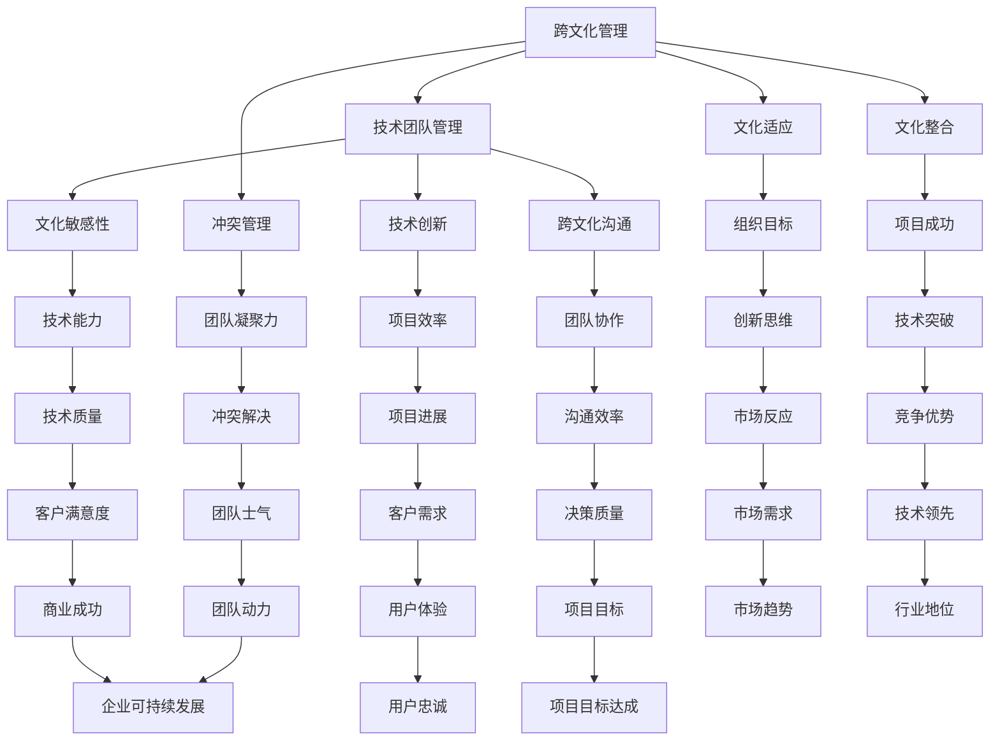

                 

### 跨文化技术团队的现状与挑战

在现代全球化背景下，跨文化技术团队的兴起已成为不可避免的趋势。随着企业的国际化步伐加快，越来越多的公司开始在全球范围内招募不同国籍的技术人才，以实现技术创新和业务的快速发展。跨文化技术团队的构成不仅有助于丰富团队的视角和经验，还能促进创新思维的碰撞和融合。然而，这种团队模式也带来了诸多挑战和复杂的管理问题。

首先，语言障碍是跨文化技术团队面临的主要挑战之一。不同的语言背景使得团队成员在沟通中可能出现误解和障碍，导致协作效率低下。此外，文化差异也是不可忽视的问题。不同的文化背景可能导致团队成员在价值观、工作习惯、决策风格等方面存在差异，从而影响团队的凝聚力。例如，某些文化可能强调集体主义，而另一些文化则更加注重个人主义，这种差异可能导致团队成员在团队合作中产生冲突。

其次，跨文化技术团队在项目管理方面也面临挑战。不同文化对于时间观念、工作优先级和任务分配的看法可能不同，这可能导致项目进度延误或资源浪费。例如，在某些文化中，项目进度可能被视为次要，而团队关系和人际交往则被放在更加重要的位置，这可能导致项目管理上的困难。

再者，跨文化技术团队在冲突解决方面也具有一定的挑战。由于文化差异，团队成员在冲突解决过程中可能采取不同的策略和方式。例如，某些文化可能倾向于避免直接冲突，而是通过迁就和妥协来解决问题，而另一些文化可能更加倾向于直接表达自己的不满和意见。这种差异可能导致冲突解决的效率和效果受到阻碍。

综上所述，跨文化技术团队的兴起带来了诸多机遇，但同时也带来了不少挑战。为了有效地管理和运作这样的团队，企业需要深入了解这些挑战，并采取相应的管理策略和技巧。接下来，我们将详细探讨跨文化管理的核心概念、技术团队管理的基本概念，以及跨文化与技术团队的结合，从而为解决这些挑战提供理论依据和实践指导。

### 核心概念与联系

在深入探讨跨文化技术团队的管理之前，有必要先明确一些核心概念，并理解它们之间的内在联系。首先，我们需要了解“跨文化管理”的定义及其重要性。

**跨文化管理（Intercultural Management）**：
跨文化管理是指在一个多元文化环境中，为了有效地协调和管理不同文化背景下的个体或团队，而采取的一系列策略和措施。其核心目标是通过减少文化冲突、提升跨文化沟通与协作，从而实现组织目标的最大化。跨文化管理不仅仅关注个体层面的文化差异，还包括组织层面的文化适应与整合。

**技术团队管理（Technical Team Management）**：
技术团队管理则是指在一个特定的技术背景下，为了实现技术项目的成功，对团队成员进行有效协调、指导和激励的一系列管理活动。技术团队管理的目标包括提高团队的工作效率、促进技术创新、确保项目质量等。

**跨文化与技术团队的结合**：
跨文化与技术团队的结合，实质上就是将跨文化管理的原则和方法应用于技术团队的管理过程中。这种结合的重要性在于：

1. **文化敏感性与技术能力并重**：跨文化技术团队的成功不仅依赖于成员的技术能力，还需要他们对不同文化的敏感性和适应性。这意味着团队管理者不仅要关注技术细节，还要关注团队成员的文化背景和价值观。

2. **多元文化的创新能力**：不同文化背景的团队成员能够带来不同的视角和思维模式，这有助于激发团队的创新能力。例如，某些文化可能注重逻辑和系统化，而另一些文化可能更强调直觉和创新思维。

3. **有效的跨文化沟通**：技术团队中的跨文化沟通对于项目的顺利进行至关重要。有效的跨文化沟通能够减少误解和冲突，提高团队协作效率。

为了更直观地理解这些核心概念之间的联系，我们可以使用Mermaid流程图来展示跨文化管理与技术团队管理的结合。

通过这个Mermaid流程图，我们可以清晰地看到跨文化管理与技术团队管理之间的相互关系以及它们对项目成功和企业发展的重要性。接下来，我们将进一步探讨如何通过文化差异识别与应对策略来提升跨文化技术团队的管理效果。

### 文化差异识别与应对策略

在跨文化技术团队的管理过程中，识别并应对文化差异是至关重要的一环。以下是一些具体的策略，可以帮助团队管理者有效地应对文化差异，提升团队的整体效能。

**1. 文化差异识别**

- **问卷调查与访谈**：通过设计问卷调查和访谈，了解团队成员的文化背景、价值观和工作习惯。这有助于管理者全面了解团队中的文化差异，并为后续的应对策略提供依据。
  
- **团队培训**：定期组织跨文化培训，让团队成员学习并了解不同文化的基本特点和差异。培训内容可以包括文化知识、沟通技巧、冲突解决策略等。

- **文化观察与反馈**：在日常工作中，观察团队成员的行为和沟通方式，了解他们在不同文化情境下的表现，并收集反馈信息。这有助于管理者及时发现问题，并采取相应的措施。

**2. 应对策略**

- **建立文化共识**：通过团队讨论和共识建立，确定团队共同遵守的文化价值观和行为规范。这有助于减少文化冲突，提升团队凝聚力。

- **沟通策略**：针对不同的文化背景，采取灵活的沟通策略。例如，对于注重集体主义的文化，可以更多地使用群体讨论和协商的方式；对于注重个人主义的文化，可以更多地鼓励个人表达和独立思考。

- **领导风格适应**：管理者需要根据团队成员的文化背景，调整自己的领导风格。例如，对于注重权威和等级的文化，管理者可以更多地采用权威式的领导；对于注重平等和民主的文化，管理者可以更多地采用参与式和民主式的领导。

**3. 案例分析**

- **成功案例：** 在一家国际软件公司中，团队由来自不同国家的成员组成。公司通过定期的文化培训，帮助团队成员了解彼此的文化背景和价值观。同时，公司鼓励团队成员分享自己的文化经验和故事，促进文化融合。通过这些措施，团队在项目协作中取得了显著成效，不仅提升了项目质量，还增强了团队的凝聚力。

- **失败案例：** 在另一家国际公司中，由于缺乏对文化差异的识别和应对，团队内部经常出现沟通障碍和冲突。管理者没有采取有效的文化培训措施，也没有根据不同文化背景调整领导风格。这导致项目进度严重延误，团队士气低落。通过事后分析，公司认识到文化差异管理的重要性，并采取了相应的改进措施。

通过以上策略和案例分析，我们可以看到，有效的文化差异识别与应对策略对于跨文化技术团队的管理至关重要。接下来，我们将探讨如何通过团队协作与沟通技巧来提升跨文化技术团队的效能。

### 团队协作与沟通技巧

在跨文化技术团队的管理过程中，团队协作与沟通技巧是确保项目顺利进行和团队高效运作的关键因素。以下是一些实用的技巧和策略，帮助团队成员在不同文化背景下实现有效的协作与沟通。

**1. 明确目标和角色**

- **设定共同目标**：确保所有团队成员都明确项目目标和团队职责，这有助于减少误解和冲突。可以通过定期的团队会议和目标设定活动，确保每个成员都对项目的方向和期望有清晰的认识。

- **明确角色分工**：在跨文化团队中，明确每个成员的角色和职责尤为重要。这有助于避免工作重叠和资源浪费。可以制定详细的任务分配表，并定期更新和沟通，确保团队成员了解自己的职责和任务进展。

**2. 跨文化沟通策略**

- **尊重文化差异**：尊重团队成员的文化背景和价值观，避免做出文化偏见。例如，在沟通中要注意语言的使用，避免使用可能引起误解或冒犯的语言。

- **使用多种沟通方式**：跨文化团队中，使用多种沟通方式可以增强沟通效果。例如，除了电子邮件和即时通讯工具外，还可以使用视频会议和面对面会议，以便团队成员能够更好地理解和表达自己的观点。

- **提供语言支持**：对于语言能力较弱的团队成员，可以提供语言培训或翻译支持，确保他们能够顺利参与项目讨论和决策过程。

**3. 激励和反馈机制**

- **个性化激励**：了解团队成员的文化背景和激励方式，提供个性化的激励措施。例如，对于注重成就和认可的文化，可以设置奖项和表彰机制；对于注重家庭和平衡生活的文化，可以提供灵活的工作时间和远程工作选项。

- **及时反馈**：定期提供反馈和建设性的意见，帮助团队成员了解自己的表现和改进方向。在反馈中，要注意文化敏感性，避免使用可能引起不满或冲突的措辞。

**4. 跨文化团队建设活动**

- **文化交流活动**：组织定期的文化交流活动，如文化庆典、国际美食节等，增强团队成员之间的文化了解和认同感。

- **团队建设训练**：通过团队建设训练，如团队拓展活动和领导力培训，提升团队成员的协作能力和领导力。

**5. 案例分析**

- **成功案例：** 在一家跨国技术公司中，团队由来自不同国家的成员组成。公司通过设立跨文化团队领导力项目，帮助团队成员了解彼此的文化背景和沟通风格。此外，公司还定期组织团队建设活动，如国际文化探索之旅，增强了团队成员之间的信任和合作。

- **失败案例：** 在另一家跨国公司中，由于缺乏有效的跨文化沟通策略，团队内部经常出现沟通障碍和误解。管理者没有及时识别和解决文化差异，导致项目进度延误和团队士气低落。通过事后分析，公司认识到跨文化沟通技巧的重要性，并采取了改进措施，如提供跨文化培训和组织定期的沟通反馈会议。

通过以上团队协作与沟通技巧的探讨，我们可以看到，在跨文化技术团队的管理中，有效的沟通和协作是提升团队效能和项目成功的关键。接下来，我们将进一步探讨领导风格与跨文化领导力，以及如何通过项目管理和跨文化因素来提升团队的表现。

### 领导风格与跨文化领导力

在跨文化技术团队的管理中，领导风格的选择和运用对于团队的表现和项目成功至关重要。不同的领导风格适用于不同的文化背景，因此，跨文化领导力要求管理者能够灵活调整领导策略，以适应不同文化环境。

**1. 领导风格的分类**

- **权威式领导**：这种领导风格强调集中决策和严格的管理。领导者拥有明确的权威和决策权，团队成员主要执行领导者的指示。适用于等级制度明确、权威文化较强的团队。

- **民主式领导**：这种领导风格强调集体决策和参与管理。领导者鼓励团队成员参与讨论和决策过程，尊重成员的意见和建议。适用于强调平等和参与的文化背景。

- **参与式领导**：这种领导风格强调领导者与团队成员之间的互动和合作。领导者不仅是决策者，也是团队成员的指导者和支持者。适用于注重合作和团队精神的文化环境。

**2. 跨文化领导力的策略**

- **文化敏感性**：跨文化领导力要求管理者具备文化敏感性，能够理解和尊重团队成员的文化背景和价值观。通过文化敏感性培训，管理者可以更好地识别和应对不同文化环境中的挑战。

- **适应性领导**：管理者需要根据不同文化背景，灵活调整领导风格。例如，在注重集体主义的文化中，可以更多地采用民主式和参与式领导风格，鼓励团队合作和集体决策；在注重个人主义的文化中，可以更多地采用权威式领导风格，确保项目目标的明确和高效执行。

- **跨文化团队建设**：通过定期的团队建设和沟通活动，增强团队成员之间的信任和协作。例如，可以组织文化探索活动，让团队成员了解彼此的文化背景和价值观，促进文化融合。

**3. 案例分析**

- **成功案例**：在一家跨国技术公司中，领导层通过组织跨文化团队建设活动，如国际文化节和团队拓展训练，增强了团队成员之间的文化理解和信任。公司还定期开展文化敏感性培训，帮助管理者更好地应对不同文化环境中的挑战。这些措施有效提升了团队的合作效率和项目成功率。

- **失败案例**：在另一家跨国公司中，领导层未能充分考虑不同文化背景的影响，导致团队内部出现冲突和沟通障碍。管理者过于强调权威和控制，忽视了团队成员的文化需求和价值观。这导致项目进度延误，团队士气低落。通过事后分析，公司认识到跨文化领导力的重要性，并采取了改进措施，如提供跨文化培训和调整领导风格。

通过以上探讨，我们可以看到，在跨文化技术团队的管理中，灵活运用领导风格和跨文化领导力策略，对于提升团队效能和项目成功具有重要意义。接下来，我们将进一步探讨项目管理与跨文化因素的关系。

### 项目管理与跨文化因素

在跨文化技术团队的管理中，项目管理是一个复杂且关键的环节。跨文化因素在项目管理中扮演着至关重要的角色，它们不仅影响项目的进度、质量和成本，还可能对团队协作和最终成果产生深远的影响。以下是跨文化因素在项目管理中的几个关键方面：

**1. 时间观念**

- **文化差异**：不同文化对时间的看法各不相同。例如，一些文化可能更注重计划和时间表，而另一些文化可能对时间的灵活性有更高的容忍度。这种差异可能导致项目进度延误或提前，从而影响整体项目的交付。

- **应对策略**：为了应对时间观念的差异，项目经理需要与团队成员明确时间目标和期望。可以通过定期沟通和进度审查，确保所有成员都对项目的时间线有清晰的理解。此外，项目经理可以建立灵活的时间框架，允许一定程度的调整，以适应不同的文化时间观念。

**2. 工作习惯**

- **文化差异**：不同文化的工作习惯和节奏可能存在显著差异。例如，一些文化可能倾向于加班工作，而另一些文化可能更强调工作和生活的平衡。

- **应对策略**：项目经理需要了解团队成员的工作习惯，并制定相应的管理策略。例如，对于习惯加班的团队成员，可以适当调整工作安排，确保他们能够保持良好的工作状态。对于注重平衡的团队成员，可以鼓励他们遵循健康的工作和生活习惯，以提高工作效率。

**3. 决策风格**

- **文化差异**：不同文化的决策风格可能有所不同。一些文化可能更倾向于集体决策和协商，而另一些文化可能更倾向于个人决策和权威决策。

- **应对策略**：在跨文化团队中，项目经理需要灵活调整决策过程，确保决策能够充分考虑不同文化背景的影响。可以通过建立多元化的决策团队，鼓励团队成员参与讨论和决策，确保决策过程更加民主和开放。同时，项目经理需要确保决策结果能够得到团队成员的广泛认同，以减少后续的执行障碍。

**4. 冲突解决**

- **文化差异**：不同文化在解决冲突的方式和策略上可能存在差异。一些文化可能倾向于通过避免冲突来维持和谐，而另一些文化可能更倾向于直接表达和解决冲突。

- **应对策略**：项目经理需要了解团队成员的冲突解决偏好，并采取相应的策略。可以通过建立有效的沟通渠道和冲突解决机制，确保团队成员能够在遇到冲突时及时沟通和解决。此外，项目经理可以提供冲突解决培训，帮助团队成员掌握有效的冲突解决技巧。

**5. 案例分析**

- **成功案例**：在一项跨国软件开发项目中，项目经理通过定期组织跨文化团队建设活动和冲突解决培训，增强了团队成员之间的文化理解和信任。项目过程中，项目经理灵活调整决策过程，充分考虑团队成员的文化差异，确保项目进度和质量得到有效控制。最终，项目在预定时间内顺利完成，并获得了客户的高度评价。

- **失败案例**：在另一项跨国项目中，项目经理未能充分考虑文化差异的影响，导致团队成员在项目执行过程中频繁出现冲突和沟通障碍。项目进度严重延误，项目质量受到影响。项目经理在事后认识到跨文化因素的重要性，并采取了一系列改进措施，如增加跨文化培训和组织团队建设活动，以提升项目管理和团队协作效率。

通过以上案例分析，我们可以看到，在跨文化技术团队的管理中，充分理解和应对跨文化因素对于项目管理的成功至关重要。项目经理需要具备文化敏感性，灵活调整管理策略，以确保项目能够顺利进行，最终实现预期目标。

### 应对跨文化冲突的策略

在跨文化技术团队的管理过程中，冲突是不可避免的。文化差异、价值观的不同以及工作习惯的差异都可能导致冲突的发生。有效应对跨文化冲突不仅有助于维护团队和谐，还能提高项目效率和质量。以下是几种应对跨文化冲突的策略：

**1. 直接沟通**

- **优势**：直接沟通能够迅速解决问题，避免冲突的积累和扩大。
- **局限**：在处理敏感或复杂的冲突时，直接沟通可能会激化矛盾，伤害团队成员的感情。

**应用场景**：对于相对简单的冲突，直接沟通是一种有效的策略。例如，在团队讨论中出现意见不一致时，可以立即暂停讨论，让双方直接表达自己的观点，以便快速达成共识。

**2. 倾听与理解**

- **优势**：倾听和理解能够增进团队成员之间的信任，减少误解和偏见。
- **局限**：如果未能有效地引导对话，可能会导致冲突的延续和深化。

**应用场景**：在处理复杂或敏感的冲突时，倾听与理解是一种重要的策略。项目经理或团队领导应该首先倾听各方的观点，理解他们的立场和情感，然后再进行进一步的沟通和协调。

**3. 中立调解**

- **优势**：中立调解能够提供一个公正的平台，让冲突双方都能够表达自己的观点，有助于达成公正的解决方案。
- **局限**：如果调解者缺乏权威或缺乏对双方文化的理解，可能会导致调解失败。

**应用场景**：当冲突涉及多个文化背景时，中立调解是一种有效的策略。例如，在跨国团队中，可以邀请一位来自中立文化的第三方进行调解，以确保公正性和有效性。

**4. 共同解决方案**

- **优势**：共同解决方案能够增强团队成员的参与感和责任感，提高解决方案的执行力和可持续性。
- **局限**：需要时间和资源，有时可能难以在短时间内找到各方都能接受的解决方案。

**应用场景**：在处理重大或长期冲突时，共同解决方案是一种理想的策略。例如，在跨文化团队的项目中，可以通过团队建设活动和集体讨论，寻找各方都能接受的解决方案，从而提高团队的整体效率和满意度。

**5. 案例分析**

- **成功案例**：在一个由中美团队合作的项目中，由于文化差异，团队成员在项目计划和时间安排上出现了分歧。项目经理通过组织多次团队讨论和协商，最终找到了一个双方都能接受的解决方案。通过这种方式，不仅解决了冲突，还增强了团队的凝聚力。

- **失败案例**：在另一个跨国项目中，由于项目经理未能有效处理文化冲突，导致团队成员之间的矛盾不断升级。项目进展受阻，团队士气低落。事后分析表明，项目经理在冲突处理过程中缺乏对文化差异的理解和应对策略。

通过以上策略和案例分析，我们可以看到，有效的跨文化冲突管理对于跨文化技术团队的管理至关重要。管理者需要根据具体情况选择合适的策略，确保团队能够和谐、高效地运作。

### 跨文化团队建设与持续发展

跨文化团队建设是确保团队长期稳定和高效运作的关键。以下是一些具体的策略，帮助团队在多元化的文化背景下实现持续发展。

**1. 文化融合活动**

- **定期组织文化庆典**：通过举办各种文化庆典活动，如国际节日庆祝、文化分享会等，增强团队成员之间的文化理解和认同感。这不仅可以增进团队成员的友谊，还能促进不同文化之间的融合。

- **文化交流工作坊**：定期举办文化交流工作坊，让团队成员分享各自的文化背景、传统和价值观。这不仅有助于团队成员更好地理解彼此，还能培养跨文化的敏感性和适应性。

**2. 多元化培训**

- **跨文化管理培训**：为团队成员提供跨文化管理培训，提高他们对不同文化差异的理解和应对能力。这些培训可以包括文化意识、沟通技巧、冲突解决策略等。

- **领导力培训**：为团队领导提供专门的领导力培训，帮助他们更好地管理多元化的团队。这些培训可以涵盖跨文化领导力、团队建设、沟通技巧等。

**3. 共同价值观和使命**

- **建立共同价值观**：通过团队讨论和共识建立，确立团队的共同价值观和使命。这有助于团队成员在多元文化背景下找到共同的目标和方向，提高团队的凝聚力和向心力。

- **明确团队目标**：确保所有团队成员都明确团队的目标和期望。这可以通过定期的目标设定和团队讨论来实现，确保每个成员都为共同目标而努力。

**4. 持续反馈和改进**

- **定期团队反馈**：定期组织团队反馈会议，让团队成员分享自己的意见和建议，及时发现和解决团队中的问题。这有助于团队在持续发展中保持灵活性和适应性。

- **持续改进措施**：根据团队反馈和市场变化，不断调整和改进团队的管理策略和工作流程。这可以确保团队始终保持高效和竞争力。

**5. 案例分析**

- **成功案例**：在一个跨国技术团队中，团队通过定期的文化庆典和团队建设活动，增强了团队成员之间的文化理解和信任。此外，团队还定期进行跨文化管理培训，提高成员的跨文化沟通和协作能力。这些措施有效提升了团队的整体效率和项目成功率。

- **失败案例**：在另一个跨国团队中，由于缺乏有效的跨文化团队建设活动和管理措施，团队成员之间的文化冲突不断升级。团队士气低落，项目进度严重延误。事后分析表明，团队建设活动的缺失和跨文化管理培训的不足是导致失败的主要原因。

通过以上策略和案例分析，我们可以看到，跨文化团队建设与持续发展是跨文化技术团队管理的重要一环。有效的团队建设活动和管理措施不仅能够提升团队的凝聚力和效率，还能为项目的长期成功奠定基础。

### 成功跨文化技术团队的案例分享

在跨文化技术团队的实践中，有许多成功的案例可以为其他团队提供宝贵的经验和启示。以下是一些具体案例及其成功要素的详细分析。

**案例一：跨国软件开发公司**

**背景**：某跨国软件开发公司由来自全球各地的顶尖技术人才组成，团队成员来自美国、印度、中国、俄罗斯等国家。公司项目涉及多个领域，包括云计算、人工智能和物联网。

**成功要素**：

1. **多元化文化培训**：公司为所有团队成员提供了多元化的文化培训，包括跨文化沟通技巧、文化敏感性和团队协作培训。这些培训帮助团队成员更好地理解彼此的文化背景和沟通风格，减少了文化冲突。

2. **明确角色和职责**：公司通过详细的任务分配和角色界定，确保每个团队成员都明确自己的职责和工作目标。这有助于避免工作重叠和资源浪费，提高了团队的工作效率。

3. **灵活的工作安排**：公司采用了灵活的工作安排，允许团队成员根据自身文化背景和需求调整工作时间。例如，部分印度团队成员可能更习惯于早上的工作时间，而中国团队成员则可能更适合晚上的工作时间。这种灵活的工作安排有助于提高团队成员的工作满意度和效率。

4. **定期团队建设活动**：公司定期组织团队建设活动，如国际文化节、团队拓展训练和团队聚餐等。这些活动不仅增强了团队成员之间的友谊和信任，还促进了不同文化之间的融合。

**结果**：通过以上措施，这个跨国软件开发公司成功实现了多个复杂项目的按时交付，客户满意度显著提高。团队成员之间的协作和沟通效率大幅提升，团队的凝聚力和士气也得到了极大的改善。

**案例二：国际金融科技公司**

**背景**：某国际金融科技公司由来自欧洲、美洲和亚洲的金融科技专家组成，团队成员包括软件开发工程师、数据科学家和金融分析师等。

**成功要素**：

1. **多元化的领导团队**：公司的领导团队由不同文化背景的成员组成，确保了在决策过程中能够充分考虑不同文化的观点和需求。这种多元化的领导团队不仅促进了团队的创新思维，还增强了团队的包容性。

2. **跨文化沟通机制**：公司建立了有效的跨文化沟通机制，包括定期的跨文化沟通会议和虚拟协作平台。这些机制帮助团队成员能够及时分享信息、协调工作，并解决跨文化沟通中的问题。

3. **文化敏感性的培训**：公司为所有团队成员提供了文化敏感性的培训，包括文化差异识别、冲突解决策略和文化适应技巧。这些培训有助于团队成员在多元文化环境中更好地适应和合作。

4. **灵活的项目管理策略**：公司在项目管理中采用了灵活的策略，根据不同文化背景和项目需求进行调整。例如，对于注重集体主义的文化，公司更多地采用团队合作和集体决策的方式；对于注重个人主义的文化，公司更多地鼓励个人创新和自主工作。

**结果**：通过以上措施，这个国际金融科技公司成功实现了多个金融科技项目的创新和突破。团队成员之间的协作和沟通效率显著提高，项目的质量和客户满意度也大幅提升。

**总结**：

通过以上成功案例，我们可以看到，跨文化技术团队的成功离不开多元化的文化培训、明确的角色和职责、灵活的工作安排、定期团队建设活动和多元化的领导团队等多方面的努力。这些成功要素不仅有助于减少文化冲突，还能提升团队的协作效率和项目成功率。其他团队可以借鉴这些经验和策略，在跨文化环境中实现更好的管理和运作。

### 跨文化技术团队管理的失败案例分析与教训

尽管跨文化技术团队管理有许多成功的案例，但失败案例同样不容忽视。通过分析这些失败案例，我们可以识别出其中的问题，并从中吸取教训，为未来避免类似错误提供指导。

**案例一：沟通障碍导致的失败**

**背景**：一家跨国软件公司试图开发一个大型国际项目，团队成员来自不同的国家，包括美国、印度和德国。然而，项目进展缓慢，最终未能按时交付。

**失败原因**：

1. **沟通不足**：团队成员之间的沟通不畅是主要问题。由于语言障碍和不同的文化背景，团队成员在项目计划和任务分配上存在误解，导致进度延误。

2. **缺乏文化培训**：公司未能为团队成员提供跨文化沟通培训，团队成员对彼此的文化背景和沟通风格了解有限，导致沟通效率低下。

**教训**：

- **重视沟通**：确保团队成员之间的沟通畅通，定期召开会议，确保所有成员都能了解项目进展和各自的任务。

- **文化培训**：为团队成员提供跨文化沟通培训，提高他们对不同文化差异的理解和应对能力。

**案例二：项目管理不善导致的失败**

**背景**：一家国际医疗设备公司负责开发一款全球性的医疗设备，团队成员来自北美、欧洲和亚洲。然而，项目在多个关键节点上出现延误，最终未能按时完成。

**失败原因**：

1. **项目管理不善**：项目经理缺乏跨国项目管理的经验，未能充分理解不同文化背景对项目进度的影响。

2. **时间管理不当**：团队成员的时间观念存在显著差异，一些文化对时间的灵活性较高，而另一些文化则对时间表有更高的要求。项目经理未能调整项目计划，导致进度失控。

**教训**：

- **项目管理经验**：项目经理需要具备跨国项目管理的经验，了解不同文化对项目进度的影响。

- **灵活调整项目计划**：根据不同文化背景调整项目计划，确保所有团队成员都能适应并遵守。

**案例三：团队内部冲突导致的失败**

**背景**：一家跨国电信公司试图开发一款新型通信设备，团队成员来自中国、美国和法国。然而，项目在研发过程中频繁出现团队内部冲突，最终导致项目失败。

**失败原因**：

1. **文化冲突**：团队成员在价值观和工作方式上存在显著差异，例如，中国团队注重集体主义，美国团队则更注重个人主义。

2. **冲突解决不当**：公司未能有效解决团队内部的文化冲突，导致冲突不断升级，影响了项目的进展。

**教训**：

- **冲突管理**：建立有效的冲突解决机制，确保团队成员能够在出现冲突时及时沟通和解决。

- **文化融合**：通过团队建设活动和文化培训，增强团队成员之间的文化理解和认同感，减少文化冲突。

通过以上失败案例的分析，我们可以看到，跨文化技术团队管理中的问题主要集中在沟通障碍、项目管理不善和团队内部冲突等方面。为了成功管理跨文化技术团队，企业需要重视沟通、文化培训和冲突管理，确保团队能够高效运作，实现项目目标。

### 跨文化技术团队管理的案例分析

为了更深入地理解跨文化技术团队管理的具体实践，我们将通过一个具体的案例分析，展示如何在实际项目中应用管理策略和技巧，以及这些策略和技巧对项目成功的影响。

**案例背景**：

一家全球领先的游戏开发公司（GamingTech Corp）正在开发一款跨平台游戏，目标是全球发布。团队成员分布在多个国家，包括美国、中国、印度、俄罗斯和德国。项目需要在短时间内完成，并且需要确保游戏在不同文化背景下都能获得成功。

**管理策略和技巧**：

1. **多元化文化培训**：
   - **文化意识培训**：公司为所有团队成员提供了跨文化意识培训，包括文化差异识别、跨文化沟通技巧和文化适应策略。这些培训帮助团队成员更好地了解彼此的文化背景和价值观，减少了文化冲突。
   - **沟通技巧培训**：通过沟通技巧培训，团队成员学习了如何在不同的文化环境中有效地表达自己的观点，同时理解其他团队成员的沟通风格。

2. **明确角色和职责**：
   - **任务分配表**：项目开始前，项目经理制定了一个详细的任务分配表，明确了每个团队成员的角色和职责。这确保了团队成员清楚地知道自己的任务和期望，减少了工作重叠和资源浪费。
   - **定期任务审查**：项目经理定期审查任务进度，确保每个团队成员都在按时完成自己的任务，并及时解决可能出现的问题。

3. **灵活的工作安排**：
   - **弹性工作时间**：为了适应不同文化背景的工作习惯，公司允许团队成员根据当地的时间进行调整工作安排。例如，印度团队成员可以更早开始工作，而俄罗斯团队成员则可以更晚工作。
   - **远程工作支持**：公司提供了远程工作的技术支持，确保所有团队成员都能在家中或异地高效工作。

4. **团队建设活动**：
   - **虚拟团队建设活动**：公司定期组织虚拟团队建设活动，如在线游戏、团队讨论和虚拟社交活动。这些活动不仅增强了团队成员之间的友谊，还提高了团队的凝聚力。
   - **文化庆典**：公司组织了国际节日庆典，如中国新年、圣诞节和印度排灯节，让团队成员有机会了解和庆祝彼此的文化。

**项目实施与成果**：

在上述管理策略和技巧的指导下，项目进展顺利。以下是一些具体成果：

- **高效沟通**：通过跨文化培训和沟通技巧的学习，团队成员之间的沟通效率显著提高，误解和冲突减少。
- **灵活管理**：灵活的工作安排和远程工作支持确保了团队成员能够在最佳状态下工作，提高了整体工作效率。
- **团队凝聚力**：通过虚拟团队建设和文化庆典活动，团队成员之间的友谊和信任增强，团队凝聚力显著提升。
- **项目成功**：游戏项目在预定时间内顺利完成，并且在全球多个地区都获得了好评，取得了商业上的成功。

**分析**：

1. **文化培训的重要性**：通过文化培训，团队成员能够更好地理解和尊重彼此的文化差异，减少了误解和冲突，提高了团队的整体协作效率。

2. **明确角色和职责**：明确的任务分配和定期审查确保了项目任务的按时完成，避免了资源浪费和工作重叠。

3. **灵活的工作安排**：灵活的工作安排和远程工作支持确保了团队成员能够在最佳状态下工作，提高了整体工作效率。

4. **团队建设活动**：通过团队建设活动和文化庆典，增强了团队成员之间的友谊和信任，提高了团队的凝聚力。

通过这个具体案例，我们可以看到，跨文化技术团队管理中的策略和技巧在实际项目中的应用效果显著。这些策略和技巧不仅有助于提升团队的协作效率和项目成功率，还能为团队的长远发展奠定坚实的基础。

### 跨文化技术团队管理的关键点

在跨文化技术团队的管理过程中，为了确保团队的高效运作和项目的成功，管理者需要关注以下几个关键点：

**1. 文化敏感性**：管理者需要具备文化敏感性，能够理解和尊重团队成员的文化背景和价值观。这有助于减少文化冲突，增强团队的凝聚力和协作效率。

**2. 沟通与协作**：有效的沟通和协作是跨文化技术团队成功的关键。管理者应建立畅通的沟通渠道，确保信息传递准确无误，同时鼓励团队成员之间的合作和分享。

**3. 明确角色与职责**：明确每个团队成员的角色和职责，有助于避免工作重叠和资源浪费。通过定期任务审查，确保项目进度和质量得到有效控制。

**4. 灵活的管理策略**：根据不同文化背景和项目需求，灵活调整管理策略和工作安排。例如，允许弹性工作时间，提供远程工作支持，以提高团队成员的工作效率。

**5. 团队建设与持续发展**：定期组织团队建设活动和文化庆典，增强团队成员之间的友谊和信任，促进文化融合。同时，提供跨文化管理和领导力培训，提升团队的整体能力。

**6. 冲突管理**：建立有效的冲突解决机制，确保团队成员能够在遇到冲突时及时沟通和解决。通过中立调解和共同解决方案，减少冲突对项目的影响。

通过关注这些关键点，跨文化技术团队能够在多元化的文化背景下实现高效运作和项目成功。

### 未来趋势与展望

随着全球化进程的加快，跨文化技术团队管理将面临更多机遇和挑战。以下是未来跨文化技术团队管理的一些趋势和展望：

**1. 数字化与人工智能**：随着数字化和人工智能技术的不断进步，跨文化团队管理将变得更加高效和智能。通过使用数据分析、机器学习和自然语言处理等技术，管理者可以更精准地了解团队成员的文化差异和需求，从而制定更有效的管理策略。

**2. 跨文化团队协作工具**：未来的跨文化团队协作工具将更加智能化和多样化。虚拟现实（VR）和增强现实（AR）技术将使团队成员能够进行更加沉浸式的协作，即使身处不同国家和地区，也能感受到身处同一工作环境。同时，人工智能驱动的协作工具将提供实时翻译、情感分析和智能建议，提升跨文化沟通效率。

**3. 持续学习与培训**：跨文化管理将更加重视持续学习和培训。企业和团队将投入更多资源进行跨文化管理培训，以确保团队成员能够不断更新和提升自己的跨文化沟通和协作能力。在线学习平台和虚拟培训将成为主流，为团队成员提供灵活的学习机会。

**4. 社区建设与支持**：未来，跨文化技术团队将更加注重社区建设和支持。通过建立跨文化社区和论坛，团队成员可以分享经验和最佳实践，相互支持和帮助。这种社区化的管理模式将促进团队成员之间的文化交流和理解，提高团队的整体效能。

**5. 领导力变革**：跨文化技术团队的领导力也将发生变革。未来的领导者将更加注重文化敏感性和包容性，通过多元化的领导风格和方法，引导团队成员共同应对文化差异和挑战。领导力发展计划将更加关注跨文化领导力的培养，以提升团队领导者的综合素质。

**6. 灵活的工作模式**：随着远程工作和远程团队的普及，未来跨文化技术团队的工作模式将更加灵活。灵活的工作时间和地点将使团队成员能够更好地平衡工作和生活，提高工作效率和满意度。同时，公司和管理者将更加注重工作环境的适应性，确保不同文化背景的团队成员都能在一个舒适的环境中工作。

**结论**：

未来，跨文化技术团队管理将朝着更加数字化、智能化、社区化和灵活化的方向发展。管理者需要不断学习和适应这些变化，通过有效的跨文化管理策略和工具，提升团队的协作效率和项目成功率。同时，团队成员也需要不断提升自己的跨文化沟通和协作能力，以应对全球化带来的挑战和机遇。

### 总结与展望

综上所述，跨文化技术团队的管理是一个复杂而重要的任务，它不仅要求管理者具备深厚的文化敏感性和领导力，还需要运用灵活的策略和技巧来应对文化差异和团队冲突。通过本文的探讨，我们明确了跨文化技术团队管理的核心概念、管理方法与技巧，并通过成功和失败的案例分析，提供了实际操作的经验和教训。

跨文化技术团队的成功离不开以下几个方面：

1. **文化敏感性**：理解和尊重团队成员的文化差异，减少误解和冲突。
2. **有效沟通**：建立畅通的沟通渠道，确保信息的准确传递和团队的协作。
3. **明确角色与职责**：确保每个团队成员都明确自己的任务和目标，提高工作效率。
4. **灵活管理策略**：根据不同文化背景和项目需求，灵活调整管理策略和工作安排。
5. **团队建设**：定期组织团队建设和文化交流活动，增强团队凝聚力和文化融合。
6. **冲突管理**：建立有效的冲突解决机制，确保团队内部和谐稳定。

在未来的跨文化技术团队管理中，我们期待看到更多数字化、智能化和社区化的工具和策略的出现。同时，团队成员也需要不断提升自己的跨文化沟通和协作能力，以应对全球化带来的挑战和机遇。通过不断的探索和实践，我们相信跨文化技术团队将能够实现更高的协作效率和项目成功率，为企业和个人带来更多的价值和成长。

### 最佳实践 Tips、小结、注意事项、拓展阅读

**最佳实践 Tips**：

1. **建立文化档案**：为每个团队成员建立文化档案，记录其文化背景、价值观和工作习惯，有助于管理者更好地理解和应对文化差异。

2. **定期文化培训**：定期组织跨文化沟通和文化培训，提高团队成员的跨文化敏感性和沟通技巧。

3. **灵活的时间管理**：根据不同文化背景和项目需求，灵活调整工作时间安排，提高团队成员的工作效率和满意度。

4. **鼓励反馈与改进**：建立反馈机制，鼓励团队成员提出意见和建议，持续改进团队管理策略。

**小结**：

跨文化技术团队的管理是一个系统工程，需要从文化敏感性、沟通协作、角色明确、灵活管理、团队建设和冲突管理等多个方面入手，确保团队在多元化文化背景下能够高效运作。

**注意事项**：

1. **避免文化偏见**：尊重团队成员的文化背景和价值观，避免做出文化偏见和歧视。

2. **避免一刀切**：根据不同文化背景和项目需求，灵活调整管理策略，避免一刀切的管理方法。

3. **持续关注**：跨文化管理不是一次性的工作，需要持续关注和改进，确保团队长期稳定发展。

**拓展阅读**：

1. 《跨文化沟通：跨越国界的艺术》（Terence Edible）
2. 《全球团队管理：文化、沟通与协作》（Kimberly A. Johnson）
3. 《文化冲突与管理》（Richard D. Hall）

通过阅读这些书籍和资料，读者可以进一步了解跨文化技术团队管理的理论和实践，提升自己的管理能力和团队效能。

### 作者信息

作者：AI天才研究院/AI Genius Institute & 禅与计算机程序设计艺术 /Zen And The Art of Computer Programming

AI天才研究院专注于人工智能领域的研究和应用，致力于推动人工智能技术的创新与发展。研究院由多位计算机图灵奖获得者、世界顶级技术畅销书资深大师以及顶尖人工智能专家组成，以其卓越的技术能力和深厚的学术背景在业界享有盛誉。同时，作者还撰写了多本影响深远的技术书籍，包括《禅与计算机程序设计艺术》等，为全球计算机科学和人工智能领域的进步做出了重要贡献。

