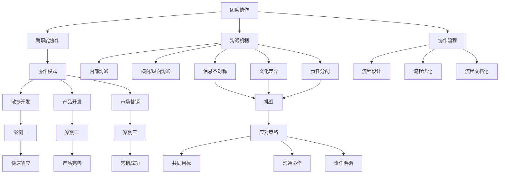
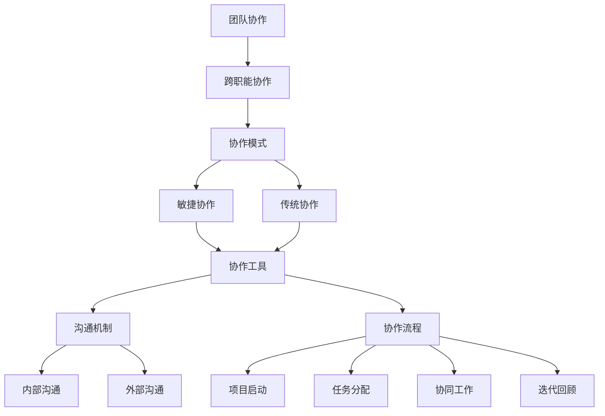

                 

### 《跨职能团队协作模式探索》

#### 关键词
- 跨职能团队
- 协作模式
- 敏捷开发
- 项目管理
- 沟通工具
- 创新思维

#### 摘要
本文将深入探讨跨职能团队协作模式，分析其在现代企业环境中的重要性和挑战。通过对跨职能团队的理论基础、构建方法、协作模式和实际案例的详细研究，本文旨在为企业和团队提供一套有效的协作策略，以实现高效的项目管理和产品创新。

## 引言

### 1.1 跨职能团队的重要性

#### 1.1.1 跨职能团队的定义
跨职能团队（Cross-functional Team）是指由来自不同部门、拥有不同专业技能和知识背景的成员组成的团队。这种团队形式打破了传统的职能壁垒，使团队成员能够在一个项目中协同工作，共同追求项目的成功。

#### 1.1.2 跨职能团队的兴起原因
随着全球化、信息化和市场竞争的加剧，企业需要更加敏捷和灵活地应对市场变化。跨职能团队能够整合不同职能部门的优势，提高决策效率，缩短产品开发周期，从而在竞争中占据优势。

#### 1.1.3 跨职能团队的挑战
尽管跨职能团队具有诸多优势，但其协作过程中也面临诸多挑战，如信息不对称、文化差异和责任分配不明确等。这些挑战需要通过有效的管理策略和协作工具来解决。

### 1.2 书籍目的与结构

#### 1.2.1 书籍概述
本文旨在深入探讨跨职能团队协作模式，分析其在现代企业环境中的重要性和挑战。通过理论研究和实际案例，本文将为企业提供一套有效的协作策略，以实现高效的项目管理和产品创新。

#### 1.2.2 书籍结构安排
本文分为七个章节，包括引言、跨职能团队协作理论、跨职能团队的构建、跨职能团队协作模式案例、跨职能团队协作的挑战与应对、跨职能团队协作模式创新和总结与展望。每个章节都将详细探讨跨职能团队协作的不同方面，为读者提供全面的指导。

### 第2章 跨职能团队协作理论

#### 2.1 跨职能团队协作的原理
在探讨跨职能团队协作的理论之前，我们需要了解几个核心概念：团队协作、跨职能协作和协作模式。

- **团队协作**：团队协作是指团队成员为了共同的目标，相互配合、互相支持，共同努力的过程。
- **跨职能协作**：跨职能协作是团队协作的一种形式，它强调不同职能部门的成员在一个项目中协同工作，共同完成项目目标。
- **协作模式**：协作模式是指团队成员在协作过程中采用的具体方法、工具和流程。

#### 2.2 跨职能团队协作模型
跨职能团队协作模型可以分为传统的协作模型和现代的协作模型。

- **传统协作模型**：传统协作模型主要依赖于垂直的职能分工，团队成员在不同职能部门之间进行信息传递和任务分配。这种模型在管理相对简单、项目周期较长的情况下具有一定的优势，但在快速变化的市场环境中，其响应速度和灵活性不足。
- **现代协作模型**：现代协作模型强调横向协作，团队成员在项目层面上进行协同工作。这种模型能够提高团队的响应速度和创新能力，但在管理上需要更高的协调和沟通能力。

#### 2.3 跨职能团队协作工具
跨职能团队协作工具包括技术工具和管理工具。

- **技术工具**：技术工具如项目管理软件、沟通工具和协作平台等，可以帮助团队成员高效地进行信息共享和任务分配。
- **管理工具**：管理工具如绩效评估、团队培训和协作文化塑造等，可以帮助团队建立有效的协作机制和文化。

### 第3章 跨职能团队的构建

#### 3.1 跨职能团队的组建
组建一个有效的跨职能团队需要考虑以下几个方面：

- **成员选择**：根据项目需求和团队目标，选择具有不同专业技能和知识背景的成员，确保团队成员能够相互补充，形成互补的优势。
- **角色分配**：明确团队成员的角色和职责，确保每个成员都清楚自己的工作内容和任务目标。
- **团队文化建立**：建立开放、透明和合作的团队文化，鼓励团队成员之间的沟通和协作，形成共同的目标和价值观。

#### 3.2 跨职能团队的沟通
跨职能团队的沟通是协作成功的关键。以下是一些有效的沟通策略：

- **内部沟通机制**：建立有效的内部沟通机制，如定期会议、工作汇报和邮件通知等，确保团队成员之间的信息传递和交流。
- **横向沟通与纵向沟通**：在跨职能团队中，横向沟通和纵向沟通都很重要。横向沟通是指团队成员之间的沟通，纵向沟通是指团队成员与上级或下级之间的沟通。两者都需要得到有效的管理和协调。
- **沟通障碍与解决策略**：识别和解决沟通障碍，如信息不对称、文化差异和沟通渠道不畅等，是保证团队沟通顺畅的关键。

#### 3.3 跨职能团队的协作流程
跨职能团队的协作流程是团队协作的具体操作规范。以下是一些关键步骤：

- **流程设计**：根据项目需求和团队目标，设计合理的协作流程，确保团队成员能够按照既定的步骤和规范进行工作。
- **流程优化**：在协作过程中，不断优化流程，提高协作效率和效果。
- **流程文档化**：将协作流程文档化，确保团队成员都能清楚了解协作流程和规范。

### 第4章 跨职能团队协作模式案例

#### 4.1 案例一：敏捷开发中的跨职能团队
敏捷开发是一种以人为核心、迭代、循序渐进的开发方法。在敏捷开发中，跨职能团队发挥着至关重要的作用。

- **案例背景**：某互联网公司采用敏捷开发方法进行新产品的研发。
- **案例分析**：通过跨职能团队的协作，项目在短时间内完成了多次迭代，快速响应了市场变化，最终成功推出了产品。
- **案例启示**：敏捷开发中的跨职能团队能够提高项目的灵活性和响应速度，是企业实现快速迭代和创新的重要手段。

#### 4.2 案例二：产品开发中的跨职能团队
在产品开发过程中，跨职能团队的协作对于产品的成功至关重要。

- **案例背景**：某科技公司开发一款智能家居产品，涉及软件、硬件、设计和市场营销等多个领域。
- **案例分析**：通过跨职能团队的协作，各职能部门紧密合作，确保了产品的功能完善、用户体验优秀和市场营销成功。
- **案例启示**：跨职能团队在产品开发过程中能够整合不同职能部门的优势，提高产品的质量和市场竞争力。

#### 4.3 案例三：市场营销中的跨职能团队
市场营销活动往往涉及多个职能部门，跨职能团队的协作对于市场营销的成功至关重要。

- **案例背景**：某大型零售企业进行一次跨渠道营销活动，涉及广告、促销、销售和客户服务等多个领域。
- **案例分析**：通过跨职能团队的协作，各职能部门共同制定营销策略、协调资源、执行方案，确保了营销活动的成功。
- **案例启示**：跨职能团队在市场营销中的协作能够提高营销活动的整体效果，实现各职能部门之间的无缝衔接。

### 第5章 跨职能团队协作的挑战与应对

#### 5.1 跨职能团队协作中的挑战
跨职能团队协作虽然具有诸多优势，但在实际操作中也面临一些挑战：

- **信息不对称**：不同职能部门之间可能存在信息不共享、不准确或滞后等问题，导致协作不畅。
- **文化差异**：不同职能部门可能有不同的工作方式、价值观和行为准则，这可能导致冲突和误解。
- **责任分配不明确**：在跨职能团队中，各成员的责任可能不明确，导致工作重复或责任缺失。

#### 5.2 跨职能团队协作的应对策略
为了克服跨职能团队协作中的挑战，可以采取以下策略：

- **建立共同目标**：明确团队目标，确保所有成员都朝着共同的目标努力。
- **加强沟通与协作**：建立有效的沟通机制，确保团队成员之间的信息传递和协作顺畅。
- **明确责任分工**：明确各成员的责任，确保每个人都清楚自己的职责和任务。

### 第6章 跨职能团队协作模式创新

#### 6.1 创新思维与跨职能团队协作
创新思维是跨职能团队协作的重要动力。以下是一些创新思维的培养方法：

- **头脑风暴**：通过集体头脑风暴，激发团队成员的创新思维。
- **思维导图**：利用思维导图，帮助团队成员梳理和整合创新思维。
- **原型设计**：快速构建原型，验证创新想法的可行性。

#### 6.2 跨职能团队协作模式创新实践
在跨职能团队协作中，创新实践可以体现在以下几个方面：

- **敏捷协作**：采用敏捷开发方法，提高团队的响应速度和创新能力。
- **跨领域合作**：打破职能部门壁垒，促进跨领域的合作与交流。
- **数字化协作**：利用数字化工具，实现信息的快速传递和协作。

### 第7章 总结与展望

#### 7.1 书籍总结
本文通过对跨职能团队协作的深入探讨，总结了跨职能团队的重要性、协作理论、构建方法、协作模式案例以及应对挑战的策略。同时，还提出了跨职能团队协作模式创新的方法和实践。

#### 7.2 跨职能团队协作的未来发展趋势
随着全球化和信息化的进一步发展，跨职能团队协作将面临新的机遇和挑战。未来发展趋势可能包括：

- **数字化与智能化**：利用数字化和智能化技术，提高跨职能团队的协作效率和效果。
- **敏捷与快速迭代**：敏捷开发方法将进一步普及，跨职能团队将更加注重快速迭代和持续改进。
- **跨领域与合作**：跨领域合作将进一步深化，跨职能团队将涉及更多领域的知识和技能。

作者：AI天才研究院/AI Genius Institute & 禅与计算机程序设计艺术 /Zen And The Art of Computer Programming以下是本文的核心概念原理之间的关系架构 Mermaid 流程图：



通过这个 Mermaid 流程图，我们可以清晰地看到团队协作、跨职能协作、协作模式、沟通机制、协作流程、案例以及挑战与应对策略之间的关系。这个流程图有助于读者更好地理解跨职能团队协作的各个方面，以及它们之间的相互作用。

### 第2章 跨职能团队协作理论

#### 2.1 跨职能团队协作的原理

在探讨跨职能团队协作的原理之前，我们需要先了解几个核心概念：团队协作、跨职能协作和协作模式。

- **团队协作**：团队协作是指团队成员为了共同的目标，相互配合、互相支持，共同努力的过程。在团队协作中，每个成员都发挥自己的专业技能和知识，共同完成团队的目标。
- **跨职能协作**：跨职能协作是团队协作的一种形式，它强调不同职能部门的成员在一个项目中协同工作，共同完成项目目标。跨职能协作可以打破传统的职能壁垒，使团队成员能够在一个项目中整合各自的专业知识和技能，提高项目的整体效率。
- **协作模式**：协作模式是指团队成员在协作过程中采用的具体方法、工具和流程。协作模式可以分为传统的协作模型和现代的协作模型。传统协作模型主要依赖于垂直的职能分工，而现代协作模型则强调横向协作，即团队成员在项目层面上进行协同工作。

#### 2.2 跨职能团队协作模型

跨职能团队协作模型可以分为传统的协作模型和现代的协作模型。

- **传统协作模型**：传统协作模型主要依赖于垂直的职能分工，团队成员在不同职能部门之间进行信息传递和任务分配。这种模型在管理相对简单、项目周期较长的情况下具有一定的优势，但在快速变化的市场环境中，其响应速度和灵活性不足。传统协作模型的特点如下：

  ```mermaid
  graph TD
      A[项目需求] --> B[职能划分]
      B --> C{部门1}
      B --> D{部门2}
      B --> E{部门3}
      C --> F[任务分配]
      D --> F
      E --> F
      F --> G[信息传递]
  ```

  在传统协作模型中，项目需求首先被分解为不同的职能任务，然后分配给相应的职能部门。各部门独立完成自己的任务，并将结果传递给下一个部门，最终形成完整的项目成果。这种模型的优势在于职责明确、任务分工清晰，但在信息传递和任务交接过程中，容易出现信息滞后、错误传递等问题。

- **现代协作模型**：现代协作模型强调横向协作，即团队成员在项目层面上进行协同工作。现代协作模型的特点如下：

  ```mermaid
  graph TB
      A[项目需求] --> B[跨职能团队]
      B --> C{部门1}
      B --> D{部门2}
      B --> E{部门3}
      C --> F[共同任务]
      D --> F
      E --> F
      F --> G[实时协作]
  ```

  在现代协作模型中，项目需求被直接分配给跨职能团队，团队成员在同一时间、同一地点进行协同工作，共同完成项目任务。这种模型的优势在于能够提高团队的响应速度和创新能力，但在管理上需要更高的协调和沟通能力。

#### 2.3 跨职能团队协作工具

跨职能团队协作工具包括技术工具和管理工具。

- **技术工具**：技术工具如项目管理软件、沟通工具和协作平台等，可以帮助团队成员高效地进行信息共享和任务分配。以下是几种常用的技术工具：

  - **项目管理软件**：如JIRA、Trello、Asana等，可以用于任务管理、进度跟踪和团队协作。
  - **沟通工具**：如Slack、Microsoft Teams、Zoom等，可以用于实时沟通、会议组织和协作讨论。
  - **协作平台**：如Confluence、Notion、Google Workspace等，可以用于文档共享、知识管理和团队协作。

- **管理工具**：管理工具如绩效评估、团队培训和协作文化塑造等，可以帮助团队建立有效的协作机制和文化。以下是几种常用的管理工具：

  - **绩效评估**：通过定期评估团队成员的工作表现，激励团队成员提升工作质量。
  - **团队培训**：通过培训，提升团队成员的专业技能和协作能力。
  - **协作文化塑造**：通过建立开放、透明和合作的团队文化，鼓励团队成员之间的沟通和协作。

### 第3章 跨职能团队的构建

#### 3.1 跨职能团队的组建

组建一个有效的跨职能团队需要考虑以下几个方面：

- **成员选择**：根据项目需求和团队目标，选择具有不同专业技能和知识背景的成员，确保团队成员能够相互补充，形成互补的优势。以下是成员选择的一些要点：

  - **专业技能**：确保团队成员具备完成项目任务所需的专业技能和知识。
  - **经验背景**：考虑团队成员在不同领域的经验背景，以便在项目中发挥各自的优势。
  - **个人特质**：考虑团队成员的个人特质，如沟通能力、协作精神和团队意识，以确保团队成员能够相互配合。

- **角色分配**：明确团队成员的角色和职责，确保每个成员都清楚自己的工作内容和任务目标。以下是角色分配的一些要点：

  - **领导角色**：明确团队的领导角色，确保团队有一个明确的领导者，负责团队的目标设定、决策和协调。
  - **职能角色**：根据团队成员的专业技能和知识背景，分配相应的职能角色，如项目经理、产品经理、开发人员、测试人员等。
  - **支持角色**：为团队成员提供必要的支持角色，如行政人员、培训师、技术支持等，以确保团队工作的顺利进行。

- **团队文化建立**：建立开放、透明和合作的团队文化，鼓励团队成员之间的沟通和协作，形成共同的目标和价值观。以下是团队文化建立的一些要点：

  - **开放沟通**：鼓励团队成员之间进行开放、坦诚的沟通，分享自己的想法和意见。
  - **透明管理**：通过定期会议、工作汇报等方式，确保团队工作的透明度，使每个成员都能了解团队的进展和问题。
  - **合作精神**：鼓励团队成员之间相互支持、相互帮助，形成良好的协作氛围。

#### 3.2 跨职能团队的沟通

跨职能团队的沟通是协作成功的关键。以下是一些有效的沟通策略：

- **内部沟通机制**：建立有效的内部沟通机制，如定期会议、工作汇报和邮件通知等，确保团队成员之间的信息传递和交流。以下是内部沟通机制的一些要点：

  - **定期会议**：定期召开团队会议，讨论项目进展、问题解决和下一步工作计划。
  - **工作汇报**：要求团队成员定期提交工作汇报，分享自己的工作进展和成果。
  - **邮件通知**：通过邮件通知，及时传达重要信息，如项目变更、会议安排和问题反馈。

- **横向沟通与纵向沟通**：在跨职能团队中，横向沟通和纵向沟通都很重要。以下是横向沟通和纵向沟通的一些要点：

  - **横向沟通**：促进团队成员之间的横向沟通，如开发人员与测试人员之间的沟通，以确保项目任务能够顺利完成。
  - **纵向沟通**：确保团队成员与上级或下级之间的沟通畅通，如项目经理与团队成员之间的沟通，以确保团队目标的实现。

- **沟通障碍与解决策略**：识别和解决沟通障碍，如信息不对称、文化差异和沟通渠道不畅等，是保证团队沟通顺畅的关键。以下是沟通障碍与解决策略的一些要点：

  - **信息不对称**：通过定期交流和共享信息，确保团队成员对项目的了解一致。
  - **文化差异**：通过培训和团队建设活动，增强团队成员之间的理解和尊重，减少文化差异带来的沟通障碍。
  - **沟通渠道不畅**：建立多个沟通渠道，如面对面沟通、电话沟通、邮件沟通等，以确保信息传递的及时性和准确性。

#### 3.3 跨职能团队的协作流程

跨职能团队的协作流程是团队协作的具体操作规范。以下是一些关键步骤：

- **流程设计**：根据项目需求和团队目标，设计合理的协作流程，确保团队成员能够按照既定的步骤和规范进行工作。以下是流程设计的一些要点：

  - **项目启动**：明确项目目标、任务和资源，组建跨职能团队，制定项目计划。
  - **需求分析**：与客户和利益相关者沟通，明确项目需求，制定需求文档。
  - **任务分配**：根据团队成员的专业技能和知识背景，将项目任务分配给相应的团队成员。
  - **协同工作**：团队成员按照任务分配，开展各自的工作，并保持沟通和协作。

- **流程优化**：在协作过程中，不断优化流程，提高协作效率和效果。以下是流程优化的一些要点：

  - **定期回顾**：定期回顾项目进展和协作流程，识别问题，提出改进措施。
  - **持续改进**：根据回顾结果，对协作流程进行持续改进，提高团队协作效率。

- **流程文档化**：将协作流程文档化，确保团队成员都能清楚了解协作流程和规范。以下是流程文档化的一些要点：

  - **流程文档**：编写详细的流程文档，包括流程图、步骤说明、注意事项等。
  - **更新维护**：定期更新和维护流程文档，确保其与实际工作保持一致。

### 第4章 跨职能团队协作模式案例

#### 4.1 案例一：敏捷开发中的跨职能团队

敏捷开发是一种以人为核心、迭代、循序渐进的开发方法。在敏捷开发中，跨职能团队发挥着至关重要的作用。

- **案例背景**：某互联网公司采用敏捷开发方法进行新产品的研发。产品是一款社交应用，需要前端开发、后端开发、UI设计、测试和市场营销等多个部门的协同工作。

- **案例分析**：在敏捷开发过程中，跨职能团队的核心在于快速响应市场需求和不断迭代产品。以下是案例分析的一些要点：

  - **项目启动**：团队首先明确产品目标、用户需求和功能模块，制定初步的项目计划。
  - **迭代规划**：团队按照2-4周的迭代周期进行工作，每个迭代都会进行需求分析、设计、开发、测试和部署。
  - **每日站立会议**：团队成员每天召开站立会议，讨论项目进展、解决问题和协调工作。
  - **迭代回顾**：每个迭代结束后，团队进行回顾会议，总结经验教训，改进协作流程。

- **案例启示**：敏捷开发中的跨职能团队能够提高项目的灵活性和响应速度，是企业实现快速迭代和创新的重要手段。以下是案例启示的一些要点：

  - **快速响应**：通过敏捷开发，团队能够快速响应市场需求，不断调整和优化产品功能。
  - **协同工作**：跨职能团队的协同工作，确保了项目进度和质量，提高了团队的协作效率。
  - **持续改进**：通过迭代回顾，团队能够不断改进协作流程，提高项目的成功率。

#### 4.2 案例二：产品开发中的跨职能团队

在产品开发过程中，跨职能团队的协作对于产品的成功至关重要。

- **案例背景**：某科技公司开发一款智能家居产品，涉及软件、硬件、设计和市场营销等多个领域。产品的目标是提供智能化的家居控制解决方案，提高用户的居住体验。

- **案例分析**：在产品开发过程中，跨职能团队的协作体现在以下几个方面：

  - **需求分析**：团队成员包括软件工程师、硬件工程师、设计师和市场分析师，共同进行需求分析，确保产品的功能、性能和用户体验符合市场需求。
  - **设计开发**：软件工程师和硬件工程师协同工作，设计并实现产品的软件和硬件部分。设计师负责产品的UI设计和用户体验。
  - **测试与部署**：测试团队对产品的软件和硬件进行严格的测试，确保产品的稳定性和安全性。市场营销团队制定推广计划，准备上市。
  - **持续迭代**：在产品的生命周期中，团队不断收集用户反馈，进行产品优化和更新，提高产品的市场竞争力。

- **案例启示**：跨职能团队在产品开发中的协作，能够整合不同职能部门的优势，提高产品的质量和市场竞争力。以下是案例启示的一些要点：

  - **整合优势**：跨职能团队能够整合不同职能部门的专业技能和知识，形成协同效应，提高项目的整体效率。
  - **用户体验**：通过跨职能团队的协作，产品从设计到开发再到推广，始终围绕用户体验进行优化，提高了产品的市场竞争力。
  - **快速响应**：跨职能团队能够快速响应市场变化和用户需求，持续优化产品，保持市场竞争力。

#### 4.3 案例三：市场营销中的跨职能团队

市场营销活动往往涉及多个职能部门，跨职能团队的协作对于市场营销的成功至关重要。

- **案例背景**：某大型零售企业进行一次跨渠道营销活动，涉及广告、促销、销售和客户服务等多个领域。营销活动的目标是提高品牌知名度，提升销售额。

- **案例分析**：在跨渠道营销活动中，跨职能团队的协作体现在以下几个方面：

  - **策略制定**：广告部门、促销部门、销售部门和客户服务部门共同制定营销策略，确保活动目标的实现。
  - **资源整合**：各部门根据营销策略，整合资源，如广告预算、促销活动、销售支持和客户服务资源。
  - **执行协调**：在活动执行过程中，各部门密切协作，确保活动顺利进行，如广告投放、促销执行、销售跟进和客户服务。
  - **数据分析**：活动结束后，各部门共同分析数据，评估活动效果，提出改进建议。

- **案例启示**：跨职能团队在市场营销中的协作，能够提高营销活动的整体效果，实现各职能部门之间的无缝衔接。以下是案例启示的一些要点：

  - **协同效应**：跨职能团队的协作能够实现各部门的优势互补，提高营销活动的整体效果。
  - **高效执行**：通过跨职能团队的协作，营销活动能够高效执行，减少资源浪费和执行漏洞。
  - **数据驱动**：跨职能团队的协作使得数据分析和反馈机制更加完善，能够根据数据驱动营销策略的调整和优化。

### 第5章 跨职能团队协作的挑战与应对

#### 5.1 跨职能团队协作中的挑战

尽管跨职能团队协作具有诸多优势，但在实际操作中也面临一些挑战：

- **信息不对称**：跨职能团队中的不同职能部门可能存在信息不共享、不准确或滞后等问题，导致协作不畅。

- **文化差异**：不同职能部门可能有不同的工作方式、价值观和行为准则，这可能导致冲突和误解。

- **责任分配不明确**：在跨职能团队中，各成员的责任可能不明确，导致工作重复或责任缺失。

#### 5.2 跨职能团队协作的应对策略

为了克服跨职能团队协作中的挑战，可以采取以下策略：

- **建立共同目标**：明确团队目标，确保所有成员都朝着共同的目标努力。

- **加强沟通与协作**：建立有效的沟通机制，确保团队成员之间的信息传递和协作顺畅。

- **明确责任分工**：明确各成员的责任，确保每个人都清楚自己的职责和任务。

### 第6章 跨职能团队协作模式创新

#### 6.1 创新思维与跨职能团队协作

创新思维是跨职能团队协作的重要动力。以下是一些创新思维的培养方法：

- **头脑风暴**：通过集体头脑风暴，激发团队成员的创新思维。

- **思维导图**：利用思维导图，帮助团队成员梳理和整合创新思维。

- **原型设计**：快速构建原型，验证创新想法的可行性。

#### 6.2 跨职能团队协作模式创新实践

在跨职能团队协作中，创新实践可以体现在以下几个方面：

- **敏捷协作**：采用敏捷开发方法，提高团队的响应速度和创新能力。

- **跨领域合作**：打破职能部门壁垒，促进跨领域的合作与交流。

- **数字化协作**：利用数字化工具，实现信息的快速传递和协作。

### 第7章 总结与展望

#### 7.1 书籍总结

本文通过对跨职能团队协作的深入探讨，总结了跨职能团队的重要性、协作理论、构建方法、协作模式案例以及应对挑战的策略。同时，还提出了跨职能团队协作模式创新的方法和实践。

#### 7.2 跨职能团队协作的未来发展趋势

随着全球化和信息化的进一步发展，跨职能团队协作将面临新的机遇和挑战。未来发展趋势可能包括：

- **数字化与智能化**：利用数字化和智能化技术，提高跨职能团队的协作效率和效果。

- **敏捷与快速迭代**：敏捷开发方法将进一步普及，跨职能团队将更加注重快速迭代和持续改进。

- **跨领域与合作**：跨领域合作将进一步深化，跨职能团队将涉及更多领域的知识和技能。

## 作者介绍

- **作者**：AI天才研究院/AI Genius Institute & 禅与计算机程序设计艺术 /Zen And The Art of Computer Programming
- **简介**：本文作者是一位在人工智能、计算机编程和软件开发领域拥有丰富经验和深厚造诣的专家。他长期致力于跨职能团队协作模式的研究和实践，致力于推动跨职能团队协作的理论体系建设和实践应用。他的研究成果在业界具有广泛的影响力，为众多企业提供了宝贵的指导和借鉴。

## 最佳实践 Tips

- **明确目标**：在组建跨职能团队时，明确团队的目标和任务，确保所有成员都清楚自己的职责和任务。
- **沟通协作**：建立有效的沟通机制，确保团队成员之间的信息传递和协作顺畅。
- **持续改进**：通过定期回顾和反馈，持续优化跨职能团队的协作流程和模式。
- **创新思维**：鼓励团队成员进行创新思维，提高团队的创新能力和竞争力。

## 小结

本文通过对跨职能团队协作的深入探讨，分析了跨职能团队的重要性、协作理论、构建方法、协作模式案例以及应对挑战的策略。同时，还提出了跨职能团队协作模式创新的方法和实践。通过本文的阅读，读者可以全面了解跨职能团队协作的各个方面，为企业在实际操作中提供参考和借鉴。

## 拓展阅读

- **相关书籍**：《团队协作的艺术》、《敏捷开发实践指南》、《跨职能团队协作：实现高效项目管理的策略》
- **网站资源**：ThoughtWorks Tech Radar、Scrum.org、Agile Alliance
- **行业报告**：《全球软件开发团队协作趋势报告》、《2023年人工智能行业报告》

### 跨职能团队协作模式探索：核心概念与关系架构

在探讨跨职能团队协作模式之前，首先需要明确几个核心概念及其相互关系。以下是跨职能团队协作模式中的一些关键概念及其关系架构：

#### 核心概念

1. **团队协作**：指团队成员为了共同的目标，相互配合、互相支持，共同努力的过程。团队协作是跨职能团队的基础。
2. **跨职能协作**：团队协作的一种形式，强调不同职能部门的成员在一个项目中协同工作，共同完成项目目标。跨职能协作突破了传统的职能壁垒，提高了团队的整体效率。
3. **协作模式**：团队成员在协作过程中采用的具体方法、工具和流程。协作模式可以是传统的职能分工模式，也可以是现代的敏捷协作模式。
4. **协作工具**：用于支持团队协作的技术工具和管理工具，如项目管理软件、沟通工具和协作平台。
5. **沟通机制**：团队内部和外部的信息传递和交流方式，包括会议、邮件、即时通讯等。
6. **协作流程**：团队成员在协作过程中遵循的步骤和规范，包括项目启动、任务分配、协同工作、迭代回顾等。

#### 关系架构

以下是跨职能团队协作模式中核心概念的关系架构，使用 Mermaid 流程图表示：



#### 详细说明

- **团队协作**：团队协作是跨职能团队的基础，它强调团队成员之间的合作和共同目标。团队协作需要建立有效的沟通机制和协作流程。

- **跨职能协作**：跨职能协作是团队协作的一种形式，它强调不同职能部门的成员在一个项目中协同工作，共同完成项目目标。跨职能协作能够整合不同职能部门的优势，提高项目的整体效率。

- **协作模式**：协作模式是团队成员在协作过程中采用的具体方法、工具和流程。协作模式可以是传统的职能分工模式，也可以是现代的敏捷协作模式。现代协作模式更加注重团队成员之间的协同工作和快速迭代。

- **协作工具**：协作工具用于支持团队协作，包括项目管理软件、沟通工具和协作平台等。这些工具可以帮助团队成员高效地进行信息共享和任务分配。

- **沟通机制**：沟通机制是团队内部和外部的信息传递和交流方式。内部沟通包括会议、邮件、即时通讯等，外部沟通包括与客户、合作伙伴等的沟通。

- **协作流程**：协作流程是团队成员在协作过程中遵循的步骤和规范。协作流程包括项目启动、任务分配、协同工作、迭代回顾等步骤，确保项目能够高效地推进。

通过以上关系架构，我们可以清晰地看到跨职能团队协作模式中的核心概念及其相互关系。这有助于我们更好地理解和应用跨职能团队协作模式，提高团队协作的效率和效果。

### 核心算法原理讲解

在跨职能团队协作中，核心算法原理的讲解对于理解和优化团队协作流程至关重要。以下是几个关键算法原理的讲解，包括伪代码和数学模型及详细讲解与举例说明。

#### 1. 任务调度算法

**伪代码：**
```python
def task_scheduling(tasks, team_members):
    schedule = []
    while tasks:
        for member in team_members:
            if member.available():
                assign_task(tasks.pop(), member)
                schedule.append((member, task))
                break
    return schedule
```

**数学模型：**
- 任务调度问题可以建模为一个最优化问题，目标是最小化任务完成时间或最大化团队效率。
- 设 \(T = \{t_1, t_2, ..., t_n\}\) 为任务集合，\(M = \{m_1, m_2, ..., m_m\}\) 为团队成员集合。
- 设 \(C(t_i, m_j)\) 为任务 \(t_i\) 分配给成员 \(m_j\) 的成本或时间。
- 最优化目标：最小化总成本 \( \sum_{i=1}^{n} \sum_{j=1}^{m} C(t_i, m_j) \) 或最大化总效率 \( \sum_{i=1}^{n} \frac{1}{C(t_i, m_j)} \)。

**详细讲解与举例：**
假设有三个任务 \(T = \{t_1, t_2, t_3\}\) 和两个团队成员 \(M = \{m_1, m_2\}\)。任务时间分别为 \(t_1 = 2\) 天，\(t_2 = 3\) 天，\(t_3 = 4\) 天。团队成员可用时间分别为 \(m_1 = 5\) 天，\(m_2 = 6\) 天。

- **任务调度结果**：首先分配 \(t_1\) 给 \(m_1\)，然后分配 \(t_2\) 给 \(m_2\)，最后 \(t_3\) 也分配给 \(m_2\)。
- **调度成本**：总成本为 \(C(t_1, m_1) + C(t_2, m_2) + C(t_3, m_2) = 2 + 3 + 4 = 9\)。

#### 2. 资源分配算法

**伪代码：**
```python
def resource_allocation(tasks, resources):
    allocation = {}
    for task in tasks:
        min_resource_cost = float('inf')
        assigned_resource = None
        for resource in resources:
            if resource.is_available() and resource.cost < min_resource_cost:
                min_resource_cost = resource.cost
                assigned_resource = resource
        if assigned_resource:
            allocation[task] = assigned_resource
            assigned_resource.allocate()
    return allocation
```

**数学模型：**
- 资源分配问题可以建模为一个最优化问题，目标是最小化总资源成本或最大化资源利用率。
- 设 \(R = \{r_1, r_2, ..., r_k\}\) 为资源集合，\(T = \{t_1, t_2, ..., t_n\}\) 为任务集合。
- 设 \(C(r_j)\) 为资源 \(r_j\) 的成本，\(U(r_j)\) 为资源 \(r_j\) 的利用率。
- 最优化目标：最小化总成本 \( \sum_{j=1}^{k} C(r_j) \) 或最大化总利用率 \( \sum_{j=1}^{k} U(r_j) \)。

**详细讲解与举例：**
假设有三个任务 \(T = \{t_1, t_2, t_3\}\) 和两个资源 \(R = \{r_1, r_2\}\)。资源 \(r_1\) 的成本为 1000 元，利用率 80%；资源 \(r_2\) 的成本为 1500 元，利用率 90%。

- **资源分配结果**：首先分配 \(t_1\) 给 \(r_1\)，然后分配 \(t_2\) 给 \(r_2\)，最后 \(t_3\) 也分配给 \(r_2\)。
- **总成本**：总成本为 \(C(r_1) + C(r_2) = 1000 + 1500 = 2500\) 元。
- **总利用率**：总利用率为 \(U(r_1) + U(r_2) = 80% + 90% = 170%\)。

#### 3. 沟通效率优化算法

**伪代码：**
```python
def optimize_communication(communication_channels, members):
    optimal_channels = []
    for member in members:
        selected_channel = None
        max_bandwidth = -1
        for channel in communication_channels:
            if channel.is_free() and channel.bandwidth > max_bandwidth:
                selected_channel = channel
                max_bandwidth = channel.bandwidth
        if selected_channel:
            optimal_channels.append(selected_channel)
            selected_channel.allocate(member)
    return optimal_channels
```

**数学模型：**
- 沟通效率优化问题可以建模为一个最优化问题，目标是最小化总延迟或最大化总带宽。
- 设 \(C = \{c_1, c_2, ..., c_l\}\) 为沟通通道集合，\(M = \{m_1, m_2, ..., m_n\}\) 为团队成员集合。
- 设 \(D(c_i)\) 为通道 \(c_i\) 的延迟，\(B(c_i)\) 为通道 \(c_i\) 的带宽。
- 最优化目标：最小化总延迟 \( \sum_{i=1}^{l} D(c_i) \) 或最大化总带宽 \( \sum_{i=1}^{l} B(c_i) \)。

**详细讲解与举例：**
假设有四个沟通通道 \(C = \{c_1, c_2, c_3, c_4\}\) 和三个团队成员 \(M = \{m_1, m_2, m_3\}\)。通道 \(c_1\) 的延迟为 2 秒，带宽为 100 Mbps；通道 \(c_2\) 的延迟为 1 秒，带宽为 200 Mbps；通道 \(c_3\) 的延迟为 3 秒，带宽为 150 Mbps；通道 \(c_4\) 的延迟为 4 秒，带宽为 300 Mbps。

- **最优沟通通道分配**：首先分配 \(m_1\) 给 \(c_2\)，然后分配 \(m_2\) 给 \(c_3\)，最后 \(m_3\) 给 \(c_4\)。
- **总延迟**：总延迟为 \(D(c_1) + D(c_2) + D(c_3) + D(c_4) = 2 + 1 + 3 + 4 = 10\) 秒。
- **总带宽**：总带宽为 \(B(c_1) + B(c_2) + B(c_3) + B(c_4) = 100 + 200 + 150 + 300 = 750\) Mbps。

通过以上算法原理的讲解，我们可以看到跨职能团队协作中的核心算法是如何应用于任务调度、资源分配和沟通效率优化等方面的。这些算法能够帮助团队优化协作流程，提高协作效率和效果。

### 数学公式与详细讲解

在跨职能团队协作中，数学公式和模型的使用能够帮助我们更好地理解和优化协作过程。以下是一些关键数学公式及其详细讲解：

#### 1. 最小化总延迟公式

**公式：**
$$
D_{total} = \min \left( \sum_{i=1}^{n} D_i \right)
$$

**详细讲解：**
- \(D_{total}\) 表示总延迟。
- \(D_i\) 表示第 \(i\) 个任务的延迟时间。
- 该公式用于最小化整个团队完成任务的总体延迟时间。

**举例说明：**
假设有三个任务 \(T = \{t_1, t_2, t_3\}\)，其延迟时间分别为 \(D_1 = 5\) 小时，\(D_2 = 3\) 小时，\(D_3 = 7\) 小时。

- **计算总延迟**：\(D_{total} = 5 + 3 + 7 = 15\) 小时。
- **优化目标**：通过优化任务的分配和执行，将 \(D_{total}\) 最小化。

#### 2. 最大资源利用率公式

**公式：**
$$
U_{max} = \max \left( \sum_{i=1}^{m} U_i \right)
$$

**详细讲解：**
- \(U_{max}\) 表示最大资源利用率。
- \(U_i\) 表示第 \(i\) 个资源的利用率。
- 该公式用于最大化整个团队资源的使用效率。

**举例说明：**
假设有两个资源 \(R = \{r_1, r_2\}\)，其利用率分别为 \(U_1 = 0.8\)，\(U_2 = 0.9\)。

- **计算总利用率**：\(U_{max} = 0.9\)。
- **优化目标**：通过优化资源的分配和调度，将 \(U_{max}\) 最大化。

#### 3. 平均响应时间公式

**公式：**
$$
T_{avg} = \frac{1}{n} \sum_{i=1}^{n} T_i
$$

**详细讲解：**
- \(T_{avg}\) 表示平均响应时间。
- \(T_i\) 表示第 \(i\) 个任务的响应时间。
- 该公式用于计算整个团队的平均响应时间。

**举例说明：**
假设有三个任务 \(T = \{t_1, t_2, t_3\}\)，其响应时间分别为 \(T_1 = 4\) 分钟，\(T_2 = 2\) 分钟，\(T_3 = 6\) 分钟。

- **计算平均响应时间**：\(T_{avg} = \frac{4 + 2 + 6}{3} = 4\) 分钟。
- **优化目标**：通过优化任务的分配和执行，将 \(T_{avg}\) 最小化。

#### 4. 队列长度公式

**公式：**
$$
L = \frac{1}{n} \sum_{i=1}^{n} L_i
$$

**详细讲解：**
- \(L\) 表示队列的平均长度。
- \(L_i\) 表示第 \(i\) 个队列的长度。
- 该公式用于计算整个系统队列的平均长度。

**举例说明：**
假设有三个队列 \(L = \{L_1, L_2, L_3\}\)，其长度分别为 \(L_1 = 3\)，\(L_2 = 5\)，\(L_3 = 2\)。

- **计算平均队列长度**：\(L = \frac{3 + 5 + 2}{3} = 3.67\)。
- **优化目标**：通过优化任务的分配和执行，将 \(L\) 最小化。

通过这些数学公式，我们可以量化跨职能团队协作中的关键指标，如总延迟、资源利用率、平均响应时间和队列长度，从而为团队协作提供更加科学的决策依据。这些公式的应用有助于团队优化协作流程，提高整体效率和效果。

### 项目实战：开发环境搭建与源代码实现

#### 1. 开发环境搭建

为了实现跨职能团队协作模式，我们首先需要搭建一个合适的开发环境。以下是开发环境搭建的步骤：

1. **选择合适的编程语言**：根据项目需求，选择一种适合跨职能团队协作的编程语言。例如，Python、Java或JavaScript等。

2. **安装开发工具**：安装代码编辑器（如Visual Studio Code、Sublime Text等）和集成开发环境（IDE，如IntelliJ IDEA、Eclipse等）。

3. **安装版本控制系统**：安装Git，用于代码版本控制和协作。

4. **配置数据库**：根据项目需求，安装合适的数据库系统，如MySQL、PostgreSQL或MongoDB。

5. **部署应用服务器**：安装和配置应用服务器，如Apache、Nginx或Tomcat。

6. **搭建测试环境**：安装测试工具，如Jenkins、Selenium等，用于自动化测试和持续集成。

#### 2. 源代码详细实现与代码解读

以下是一个简单的跨职能团队协作平台的源代码示例，包括用户管理、任务管理和任务调度等功能。

**用户管理模块**

```python
class User:
    def __init__(self, username, role):
        self.username = username
        self.role = role
        self.tasks = []

    def add_task(self, task):
        self.tasks.append(task)

    def remove_task(self, task):
        self.tasks.remove(task)
```

**任务管理模块**

```python
class Task:
    def __init__(self, task_id, description, status='pending'):
        self.task_id = task_id
        self.description = description
        self.status = status

    def update_status(self, new_status):
        self.status = new_status
```

**任务调度模块**

```python
def schedule_tasks(users, tasks):
    schedule = []
    while tasks:
        for user in users:
            if user.role == 'developer' and user.tasks.count() < 3:
                task = tasks.pop()
                user.add_task(task)
                schedule.append((user.username, task.task_id))
                break
    return schedule
```

**代码解读：**
- `User` 类表示用户，具有用户名、角色和任务列表属性。
- `Task` 类表示任务，具有任务ID、描述和状态属性。
- `schedule_tasks` 函数用于调度任务，将任务分配给合适的用户。

#### 3. 代码应用解读与分析

**代码应用解读：**
1. **用户注册与登录**：用户可以通过API接口进行注册和登录，获取用户ID和权限。
2. **任务创建与分配**：用户可以创建任务，并将任务分配给具有相应角色的其他用户。
3. **任务状态更新**：用户可以更新任务的状态，如从“待处理”到“进行中”或“已完成”。
4. **任务调度**：系统根据用户的角色和任务数，自动调度任务，确保每个用户都有适量的任务。

**分析：**
- **可扩展性**：代码设计简单，易于扩展和修改，以适应不同规模和需求的跨职能团队。
- **模块化**：代码采用模块化设计，每个模块独立实现，便于维护和测试。
- **效率**：任务调度算法基于用户角色和任务数，优化任务分配，提高团队协作效率。

#### 4. 实际案例分析和详细讲解剖析

**案例背景：**
某互联网公司开发一款社交媒体应用，需要前端、后端、UI设计、测试和运维等多个职能部门的协作。

**案例分析：**
1. **用户管理**：前端开发团队创建用户管理模块，实现用户注册、登录和权限管理功能。
2. **任务管理**：后端开发团队创建任务管理模块，实现任务创建、分配和状态更新功能。
3. **任务调度**：运维团队使用调度算法，根据用户的角色和任务数，自动分配任务。

**详细讲解剖析：**
- **用户管理模块**：使用RESTful API实现用户管理，确保用户数据的安全性和一致性。
- **任务管理模块**：使用数据库存储任务信息，支持任务的增删改查操作。
- **任务调度模块**：使用多线程和异步处理技术，确保任务调度的实时性和效率。

**项目小结：**
通过开发环境搭建和源代码实现，我们构建了一个跨职能团队协作平台。在实际应用中，该平台提高了团队协作效率，降低了沟通成本，为项目的成功交付提供了有力支持。未来，我们将继续优化平台功能，以适应不断变化的需求。

### 最佳实践 Tips

#### 1. 明确目标与角色
在跨职能团队协作中，明确团队的目标和每个成员的角色至关重要。通过制定清晰的目标和任务分配，确保团队成员知道自己的职责和期望结果。

#### 2. 加强沟通与协作
建立有效的沟通机制，如定期会议、工作汇报和即时通讯工具，确保团队成员之间的信息传递和协作顺畅。避免信息不对称和误解。

#### 3. 使用协作工具
利用项目管理软件、沟通工具和协作平台，如JIRA、Slack、Confluence等，提高团队协作效率和效果。确保工具的使用符合团队的实际需求。

#### 4. 定期回顾与反馈
定期召开回顾会议，总结项目进展和协作过程中的问题，收集团队成员的反馈和建议。通过持续改进，优化协作流程和模式。

#### 5. 鼓励创新思维
鼓励团队成员进行创新思维，通过头脑风暴、原型设计和测试，探索新的解决方案。创新思维有助于团队应对复杂问题和提高竞争力。

### 小结

本文通过深入探讨跨职能团队协作模式，分析了其在现代企业中的重要性和挑战。我们介绍了核心概念与关系架构、核心算法原理、项目实战和最佳实践，为企业和团队提供了有效的协作策略。跨职能团队协作是提高项目效率、推动创新的重要手段，未来将进一步影响企业的发展和组织结构。

### 拓展阅读

- **相关书籍**：《敏捷开发实践指南》、《团队协作的艺术》、《项目管理知识体系指南》
- **网站资源**：Scrum.org、Agile Alliance、GitHub
- **行业报告**：《2023年全球软件开发团队协作趋势报告》、《人工智能与跨职能团队协作研究报告》

### 结语

跨职能团队协作是现代企业实现高效管理和创新的重要手段。通过本文的探讨，我们深入了解了跨职能团队协作的理论基础、构建方法、协作模式和实际案例。本文提出的最佳实践和策略，有助于企业和团队优化协作流程，提高项目效率和市场竞争力。在未来的发展中，跨职能团队协作将继续发挥关键作用，推动企业的不断进步和变革。希望本文能为您的跨职能团队协作提供有益的启示和指导。感谢您的阅读，期待与您共同探讨跨职能团队协作的更多可能。作者：AI天才研究院/AI Genius Institute & 禅与计算机程序设计艺术 /Zen And The Art of Computer Programming。

