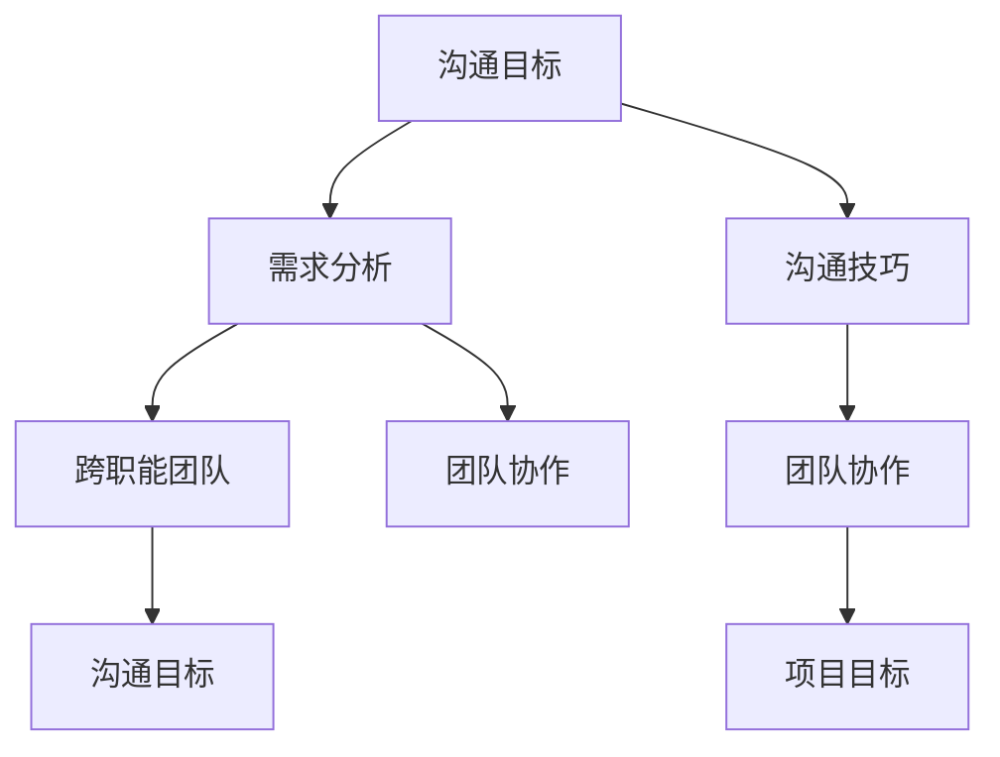

                 


### 文章标题：《跨职能沟通技巧：与产品、设计有效协作》

#### 关键词：跨职能沟通、产品、设计、协作、技巧、效率

#### 摘要：
本文深入探讨了跨职能沟通在产品与设计领域的重要性，提供了明确的沟通目标和需求、有效倾听与表达技巧、提升沟通效率的策略等核心沟通技巧。此外，文章还分析了团队协作流程、产品与设计的协作方法、以及常见协作问题的解决策略。通过实战案例分享与解析，本文旨在为读者提供实用的沟通与协作策略，提高跨职能团队的工作效率和项目成功率。

---

## 引言

在当今快速发展的科技行业中，产品开发和设计的复杂性日益增加，跨职能团队协作成为了确保项目成功的关键。产品经理、设计师、工程师等不同职能部门之间的有效沟通，不仅能够提升项目的效率，还能确保最终产品的质量和用户体验。然而，跨职能沟通并非易事，由于不同职能背景和专业领域的差异，沟通中常常会出现误解和冲突。

本文旨在探讨跨职能沟通的技巧，帮助产品、设计领域的专业人士提高沟通效率，促进团队协作。通过深入分析沟通的目标与需求、有效倾听与表达技巧、以及提升沟通效率的策略，本文将为跨职能团队提供实用的沟通方法。此外，文章还将结合实战案例，详细解析沟通与协作中的实际操作，帮助读者理解和应用这些技巧。

## 沟通技巧概述

沟通是信息交换的过程，是人们相互理解和协作的基础。有效的沟通能够促进团队协作，提高工作效率，确保项目的顺利进行。在跨职能团队中，沟通的复杂性更高，因为不同职能部门的工作内容和目标存在差异。为了实现有效的跨职能沟通，我们需要了解以下几个关键点：

### 沟通的基本原理

沟通的基本原理包括信息的发送、传递、接收和理解。以下是沟通流程的步骤：

1. **信息发送**：发送者需要明确沟通的目的和内容，将信息编码成语言或其他可传达的形式。
2. **信息传递**：信息通过适当的渠道传递给接收者，如会议、邮件、即时通讯等。
3. **信息接收**：接收者接收并解码信息，理解发送者的意图。
4. **信息理解**：接收者对信息进行内化，形成自己的理解和观点。

### 沟通的五大障碍

跨职能沟通中存在许多障碍，以下是五大常见障碍：

1. **语言障碍**：不同职能部门使用的专业术语和表达方式不同，容易产生误解。
2. **文化差异**：不同的文化背景和价值观可能导致沟通风格和期望的差异。
3. **信息过载**：过多的信息会导致接收者难以集中注意力，影响沟通效果。
4. **情绪因素**：情绪波动会影响沟通者的表达和理解能力，导致沟通不畅。
5. **时间压力**：项目进度紧张时，沟通者可能因为时间压力而简化信息，导致沟通不充分。

### 沟通的目的与类型

有效的沟通需要明确目标，并根据不同的情境选择适当的沟通类型。以下是常见的沟通目的和类型：

1. **传达信息**：确保信息准确、清晰地传达给接收者。
2. **建立关系**：通过沟通建立信任和合作关系。
3. **解决问题**：通过沟通找到解决方案，解决团队内部的冲突。
4. **激励团队**：通过沟通激励团队成员，提高团队士气和动力。
5. **决策**：在决策过程中，通过沟通收集信息、分析问题、达成共识。

沟通的类型包括：

- **口头沟通**：通过面对面交流、电话会议、在线讨论等方式进行。
- **书面沟通**：通过邮件、报告、文档、即时消息等方式进行。
- **非语言沟通**：通过肢体语言、面部表情、姿态等非语言方式传达信息。

## 产品与设计领域的沟通特点

在产品开发和设计过程中，跨职能团队之间的沟通具有独特的特点。以下是产品与设计领域沟通的几个关键点：

### 产品的开发流程与沟通需求

产品的开发通常涉及多个阶段，包括需求分析、设计、开发、测试和部署。每个阶段都需要不同职能部门之间的紧密协作和沟通：

1. **需求分析**：产品经理与市场部门、用户代表等进行沟通，收集需求信息，确保产品设计符合市场需求。
2. **设计**：设计师与产品经理、工程师等进行沟通，确定设计方向和细节，确保设计可实施且满足用户需求。
3. **开发**：工程师与设计师、产品经理等进行沟通，确保开发过程中的技术实现与设计要求一致。
4. **测试**：测试人员与工程师、产品经理等进行沟通，确保产品的质量和稳定性。
5. **部署**：部署人员与产品经理、工程师等进行沟通，确保产品按时上线，并解决上线后的任何问题。

### 设计的思维模式与沟通难点

设计师的工作涉及创造性思维和用户研究，而工程师的工作则侧重于技术实现和系统稳定性。这两者在思维模式上有很大差异，可能导致沟通中的难点：

1. **设计思维**：设计师注重用户体验和用户需求，倾向于从用户角度出发进行设计。
2. **工程思维**：工程师注重技术的可行性和系统的稳定性，倾向于从技术角度出发进行实现。
3. **需求差异**：设计师可能更注重产品的视觉和交互设计，而工程师可能更关注产品的性能和可维护性。

### 产品与设计沟通的挑战

产品与设计之间的沟通挑战包括：

1. **需求确认**：确保设计师理解并准确捕捉到产品经理的需求。
2. **设计可实施性**：确保设计师的设计方案在技术上是可行的。
3. **时间同步**：确保设计、开发、测试等阶段在时间上协调一致。
4. **版本控制**：在设计过程中，不同版本的设计文档需要有效管理，避免信息不一致。

## 跨职能沟通的重要性

在跨职能团队中，有效的沟通是团队协作的基础，也是项目成功的关键。以下是跨职能沟通的重要性和优势：

### 团队协作的价值

跨职能团队通过协作能够实现以下价值：

1. **资源共享**：不同职能部门之间的资源共享，提高工作效率。
2. **知识互补**：团队成员来自不同的专业背景，通过协作实现知识的互补。
3. **快速决策**：通过有效的沟通，团队能够快速做出决策，减少信息传递的延迟。
4. **创新能力**：不同职能部门的协作能够激发创新思维，提高产品的竞争力。

### 跨职能沟通的优势

跨职能沟通的优势包括：

1. **提高沟通效率**：通过明确的沟通目标和需求，减少信息传递中的误解和重复工作。
2. **增强团队凝聚力**：通过有效的沟通，增强团队成员之间的信任和合作精神。
3. **降低沟通成本**：通过优化沟通流程和方法，降低沟通的时间和成本。
4. **提高项目质量**：通过有效的沟通，确保项目的各个环节能够紧密衔接，提高项目的整体质量。

### 企业文化对跨职能沟通的影响

企业文化对跨职能沟通有重要影响，一个开放、包容、支持创新的企业文化能够促进跨职能团队的有效沟通。以下是企业文化对跨职能沟通的几个方面的影响：

1. **沟通环境**：开放的企业文化鼓励团队成员之间的沟通和交流，减少沟通障碍。
2. **沟通态度**：支持创新的氛围能够激发团队成员积极参与沟通，提出建设性意见。
3. **沟通机制**：企业建立的沟通机制，如定期的跨职能会议、信息共享平台等，能够促进团队间的沟通和协作。
4. **沟通反馈**：企业对沟通效果的反馈机制，如定期评估和改进沟通流程，能够持续提升沟通效率。

## 核心沟通技巧

为了实现有效的跨职能沟通，团队需要掌握一系列核心沟通技巧。以下将介绍明确沟通目标与需求、有效倾听与表达技巧、以及提升沟通效率的策略。

### 明确沟通目标与需求

明确沟通目标与需求是有效沟通的第一步。以下是一些关键步骤：

1. **制定沟通计划**：在沟通前，明确沟通的目的、目标、受众和预期结果。制定详细的沟通计划，确保沟通有方向和目标。

2. **确定沟通内容**：根据沟通计划，明确需要传达的信息和关键点，确保信息准确、完整。

3. **识别沟通需求**：了解团队成员的沟通需求和期望，确保沟通内容能够满足他们的需求。

### 有效倾听与表达技巧

有效倾听与表达是跨职能沟通中至关重要的技巧。以下是一些关键点：

1. **倾听技巧**：积极倾听，不仅听到对方说的话，还要理解对方的意图和情感。避免打断对方，给予对方足够的表达空间。

2. **表达清晰**：用简单、明确的语言表达自己的观点和想法，避免使用过于复杂或模糊的表述。确保信息传达的准确性。

3. **避免误解**：注意对方的表情、语气和肢体语言，通过非语言信号理解对方的态度和感受。及时澄清误解，确保沟通双方的理解一致。

### 提升沟通效率的技巧

提升沟通效率是跨职能沟通的关键目标。以下是一些有效策略：

1. **时间管理**：合理安排沟通时间，避免会议或讨论过于冗长。设定明确的沟通目标和时间限制，确保沟通高效。

2. **信息整理**：在沟通前，对需要传达的信息进行整理和分类，确保信息的逻辑性和条理性。使用图表、清单等工具帮助整理信息。

3. **减少信息过载**：避免传递过多无关或冗余的信息，确保沟通内容简明扼要。在必要的情况下，使用摘要或要点来概括沟通内容。

4. **使用沟通工具**：利用适当的沟通工具和技术，如即时通讯、视频会议、项目管理软件等，提高沟通效率和效果。

## 团队协作流程

跨职能团队的有效协作需要明确的流程和方法。以下是一些关键步骤和策略：

### 团队角色与职责

在跨职能团队中，每个成员都有特定的角色和职责。明确团队成员的角色和职责，有助于提高协作效率。以下是一些常见的团队角色：

1. **产品经理**：负责产品规划、需求分析和项目管理，协调不同职能部门的工作。
2. **设计师**：负责产品的视觉设计和用户体验设计，确保设计符合用户需求和公司品牌。
3. **工程师**：负责产品的开发和实现，确保产品的技术实现符合设计要求和性能标准。
4. **测试人员**：负责产品的测试和质量保证，确保产品的质量和稳定性。
5. **项目经理**：负责项目的整体规划和协调，确保项目按时、按预算完成。

### 团队决策流程

跨职能团队的决策过程通常涉及以下步骤：

1. **问题识别**：确定需要解决的问题或决策的事项。
2. **信息收集**：收集与问题相关的信息，包括技术、市场、用户等方面的数据。
3. **讨论分析**：团队成员对问题进行讨论和分析，提出解决方案和备选方案。
4. **决策制定**：根据讨论结果，选择最优的解决方案，并制定详细的决策计划。
5. **执行跟踪**：执行决策，并定期跟踪和评估决策的效果，进行必要的调整和改进。

### 常见协作障碍与解决方法

跨职能团队在协作过程中可能会遇到以下障碍：

1. **沟通障碍**：由于不同职能背景和专业领域的差异，团队成员之间的沟通可能出现障碍。解决方法包括明确沟通目标和需求、使用通用术语、加强团队培训等。

2. **资源冲突**：团队成员可能因为资源分配不均或资源竞争而产生冲突。解决方法包括合理分配资源、建立共享机制、提高团队成员的协作意识等。

3. **决策延迟**：跨职能团队在决策过程中可能因为意见分歧或信息不畅而出现决策延迟。解决方法包括明确决策流程、加强信息共享、提高团队成员的参与度等。

## 产品与设计的协作方法

产品与设计领域的协作是跨职能团队中至关重要的一环。以下是一些关键的协作方法和策略：

### 需求沟通与确认

1. **需求收集**：产品经理与市场部门、用户代表等进行沟通，收集用户需求和市场信息。
2. **需求分析**：产品经理与设计师、工程师等团队进行讨论，分析需求的技术实现可能性和用户体验。
3. **需求确认**：与利益相关者进行需求确认，确保需求明确、可行，并符合项目目标和用户需求。

### 设计与产品的交互方式

1. **原型设计**：设计师制作产品原型，通过交互设计和视觉设计展示产品功能。
2. **评审与反馈**：产品经理、工程师等团队成员对设计原型进行评审，提出改进意见和建议。
3. **迭代优化**：根据评审反馈，设计师对原型进行优化，反复迭代直至达到预期效果。

### 设计评审与反馈

1. **评审流程**：建立设计评审的流程，明确评审的时间、地点、参与者等。
2. **评审内容**：评审内容包括设计可行性、用户体验、技术实现等。
3. **反馈机制**：建立有效的反馈机制，确保评审意见和建议能够被及时采纳和实施。

## 常见协作问题的解决策略

在跨职能团队中，协作问题不可避免。以下是一些常见协作问题的解决策略：

### 冲突管理的策略

1. **识别冲突**：及时发现和识别团队中的冲突，明确冲突的原因和影响。
2. **沟通解决**：通过沟通和对话，了解冲突双方的立场和需求，寻求共同点，化解冲突。
3. **决策解决**：在冲突无法通过沟通解决时，可以采取投票或上级决策等方式解决。

### 风险评估与应对

1. **风险评估**：对协作中的潜在风险进行识别和评估，包括技术风险、市场风险、资源风险等。
2. **应对策略**：制定应对策略，包括风险预防措施、应急计划等，确保项目能够应对和化解风险。

### 个人贡献

跨职能团队的成功离不开每个成员的个人贡献。以下是一些提高个人贡献的策略：

1. **明确角色职责**：确保每个成员都明确自己的角色和职责，提高工作效率。
2. **积极参与**：鼓励团队成员积极参与团队讨论和决策，提高团队凝聚力。
3. **持续学习**：不断提升个人专业技能和沟通能力，为团队贡献更多价值。

## 实战案例分享与解析

为了更好地理解跨职能沟通技巧在实际工作中的应用，以下分享两个实战案例，并对其进行分析和解析。

### 案例一：项目延迟导致团队冲突

某科技公司正在进行一个重要项目的开发，但由于产品经理与设计师在需求理解和设计风格上存在分歧，导致项目进展缓慢，最终出现项目延迟的情况。团队成员之间的冲突不断升级，严重影响了团队的合作和项目进度。

**解析**：
1. **问题识别**：项目延迟和团队冲突的主要原因是需求理解不一致和设计风格的分歧。
2. **沟通解决**：团队组织了一次全体会议，产品经理和设计师分别阐述了自己的观点和需求，通过沟通和讨论，找到了共同点，并达成了一致的设计方案。
3. **决策制定**：团队决定按照新的设计方案进行开发，并制定了详细的开发计划和时间表，确保项目能够按时完成。

通过这次沟通和解决冲突的过程，团队意识到了跨职能沟通的重要性，并建立了更加开放和包容的沟通氛围。

### 案例二：跨部门合作实现产品创新

某互联网公司正在开发一款智能家居产品，由于产品经理、设计师、工程师等不同职能部门之间的紧密协作，成功实现了一项创新功能，提高了产品的用户体验和市场竞争力。

**解析**：
1. **需求收集**：产品经理与市场部门和用户代表进行了深入沟通，收集了用户对智能家居产品的需求和期望。
2. **需求分析**：产品经理与设计师、工程师等团队进行了讨论，分析了需求的技术实现可能性和用户体验。
3. **设计评审**：设计师制作了产品原型，并与产品经理、工程师等团队进行了评审，不断优化设计。
4. **迭代开发**：根据评审反馈，设计师对原型进行了优化，工程师则负责实现技术方案，团队共同推进产品开发。

通过这次跨部门合作，团队充分发挥了各自的专业优势，实现了产品创新，并取得了良好的市场反响。

## 实际沟通与协作策略

在实际工作中，跨职能团队需要运用一系列具体的沟通和协作策略，以提高工作效率和项目成功率。以下是一些建议和策略：

### 开发环境搭建

1. **统一开发工具**：选择适合团队需求的开发工具，如集成开发环境（IDE）、代码管理工具、文档协作平台等，确保团队成员能够高效协同。
2. **代码库管理**：建立统一的代码库，规范代码版本管理和提交流程，确保代码的可维护性和一致性。
3. **自动化测试**：引入自动化测试工具，提高测试效率和覆盖率，确保产品质量。

### 源代码实现与代码解读

1. **模块化开发**：将项目拆分为多个模块，由不同职能部门负责各自模块的开发，确保分工明确、责任清晰。
2. **代码注释**：在代码中添加详细的注释，帮助其他团队成员理解代码逻辑和功能实现，提高代码的可读性和可维护性。
3. **代码审查**：定期进行代码审查，确保代码质量，及时发现问题并进行修复。

### 代码应用解读与分析

1. **需求解读**：深入理解需求，确保代码实现符合需求规格，提高用户体验。
2. **性能分析**：对代码进行性能分析，优化关键算法和数据结构，提高代码效率和可扩展性。
3. **错误调试**：在代码开发和测试过程中，及时发现和解决错误，确保代码的稳定性和可靠性。

### 实际案例分析

以下是一个实际案例，说明如何通过跨职能沟通和协作解决项目中遇到的问题：

**案例背景**：
某科技公司正在开发一款移动应用程序，但由于产品经理、设计师和工程师之间的沟通不畅，导致项目进度严重滞后。

**问题分析**：
1. **需求理解不一致**：产品经理和设计师在需求理解上存在差异，导致设计方案与产品需求不符。
2. **设计评审不足**：设计评审环节不足，工程师在开发过程中发现的设计问题无法及时得到解决。
3. **沟通机制不完善**：团队内部沟通机制不完善，信息传递不畅，导致项目进度受阻。

**解决策略**：
1. **加强需求沟通**：产品经理和设计师定期进行需求沟通，确保双方对需求的理解一致。
2. **完善设计评审**：建立定期设计评审机制，确保设计方案在开发前得到充分讨论和优化。
3. **优化沟通机制**：引入即时通讯工具和项目管理软件，建立高效的沟通渠道，确保信息及时传递。

通过实施这些策略，团队成功解决了沟通不畅的问题，项目进度得到明显改善。

## 最佳实践 tips

为了在跨职能团队中实现高效的沟通和协作，以下是一些最佳实践 tips：

1. **明确角色和职责**：确保每个团队成员都清楚自己的角色和职责，减少责任模糊和分工不明的情况。
2. **定期沟通和会议**：定期举行团队会议和沟通，确保团队成员能够及时了解项目进展和遇到的问题。
3. **共享信息和资源**：建立共享的信息库和资源库，方便团队成员获取所需信息，提高协作效率。
4. **建立信任和合作**：通过团队合作和互相信任，建立良好的团队氛围，促进跨职能协作。
5. **鼓励反馈和改进**：鼓励团队成员提出反馈和建议，不断改进沟通和协作流程，提高团队效率。

## 小结

本文详细探讨了跨职能沟通在产品与设计领域的重要性，介绍了明确沟通目标与需求、有效倾听与表达技巧、提升沟通效率的策略，以及团队协作流程和产品与设计的协作方法。通过实战案例和实际沟通与协作策略，本文旨在为读者提供实用的指导，帮助他们在实际工作中实现高效的跨职能协作。

## 注意事项

在跨职能沟通中，以下注意事项有助于提高沟通效果：

1. **避免使用专业术语**：使用通用语言，避免使用过于专业的术语，确保信息能够被所有团队成员理解。
2. **注意沟通方式**：根据不同的沟通场景和受众，选择合适的沟通方式，如书面沟通、口头沟通或非语言沟通。
3. **保持积极态度**：在沟通中保持积极、开放的态度，鼓励团队成员积极参与讨论，共同解决问题。

## 拓展阅读

为了进一步了解跨职能沟通技巧，以下推荐一些拓展阅读资源：

1. 《跨职能团队协作指南》
2. 《产品经理与设计师的合作艺术》
3. 《敏捷开发实践指南》
4. 《团队沟通技巧实战手册》
5. 《领导力与团队管理》

作者：AI天才研究院/AI Genius Institute & 禅与计算机程序设计艺术 /Zen And The Art of Computer Programming

---

### 背景介绍

在当今快速发展的信息技术领域，跨职能团队的合作显得尤为重要。产品开发和设计过程涉及多个职能部门，如产品经理、设计师、工程师、测试人员等，每个职能部门都有其特定的职责和目标。然而，由于职能背景和专业领域的差异，跨职能团队在协作过程中常常会遇到沟通不畅、需求理解不一致等问题，这可能导致项目延期、成本增加和用户体验下降。

跨职能沟通的挑战不仅源于技术层面的差异，还涉及到文化、价值观和沟通风格的多样性。有效沟通是团队协作的基础，它能够促进信息共享、减少误解、提高工作效率，从而确保项目目标的实现。因此，理解和掌握跨职能沟通技巧对于产品、设计领域的专业人士来说至关重要。

本文旨在为读者提供一套系统化的跨职能沟通技巧，帮助他们在实际工作中实现高效协作。通过详细分析沟通的目标与需求、有效倾听与表达技巧、提升沟通效率的策略，以及团队协作流程和产品与设计的协作方法，本文旨在为跨职能团队提供实用的指导，提高项目成功率。

### 核心概念与联系

在探讨跨职能沟通时，我们需要明确几个核心概念，并理解它们之间的联系。以下是这些核心概念：

1. **沟通目标**：沟通目标是指沟通的预期结果，它为沟通活动提供方向和目标。明确沟通目标有助于确保沟通活动的有效性和效率。

2. **需求分析**：需求分析是指对用户需求和市场需求的收集、分析和理解。需求分析是产品设计和开发的基础，它决定了产品功能、性能和用户体验。

3. **沟通技巧**：沟通技巧是指用于提高沟通效率和效果的方法和策略。有效的沟通技巧包括倾听、表达、反馈和解决冲突等。

4. **团队协作**：团队协作是指团队成员在共同目标下，通过沟通和合作完成任务的行动。团队协作有助于提高工作效率、减少错误、增强团队凝聚力。

5. **跨职能团队**：跨职能团队是由来自不同职能部门、拥有不同专业背景的成员组成的团队。跨职能团队能够利用各自的专业知识和技能，共同实现项目目标。

这些核心概念之间的联系如下：

- **沟通目标与需求分析**：明确沟通目标有助于在需求分析过程中确保所有相关信息的收集和理解，从而提高需求分析的准确性。
- **沟通技巧与团队协作**：有效的沟通技巧能够提高团队成员之间的沟通效率，促进团队协作，减少误解和冲突。
- **需求分析与团队协作**：需求分析的结果是团队协作的重要输入，团队协作能够确保需求的有效实现和项目目标的达成。
- **跨职能团队与沟通目标**：跨职能团队需要明确共同的沟通目标，以确保团队成员在实现项目目标过程中保持一致的方向。

以下是一个用于展示这些核心概念之间关系的Mermaid流程图：



### 核心算法原理讲解

在跨职能沟通中，算法原理的应用可以显著提高沟通效率和效果。以下是一个用于分析跨职能沟通的算法原理示例，包括伪代码的详细讲解。

#### 算法名称：跨职能沟通分析

#### 输入：
- `team_members`：跨职能团队成员列表
- `communication_goals`：沟通目标列表
- `communication_skills`：沟通技巧列表
- `协作流程`：团队协作流程

#### 输出：
- `effective_communication_plan`：有效的沟通计划

#### 伪代码：

```
// 初始化沟通计划
effective_communication_plan = {}

// 分析团队成员的沟通技能
foreach (member in team_members) {
    communication_skills(member)
}

// 确定沟通目标
foreach (goal in communication_goals) {
    if (goal not in effective_communication_plan) {
        effective_communication_plan[goal] = []
    }
}

// 分配沟通任务
foreach (member in team_members) {
    foreach (goal in communication_goals) {
        if (member's communication_skills include goal) {
            effective_communication_plan[goal].append(member)
        }
    }
}

// 根据团队协作流程调整沟通计划
foreach (协作流程 in 协作流程) {
    adjust_communication_plan(effective_communication_plan, 协作流程)
}

// 输出有效的沟通计划
print(effective_communication_plan)
```

#### 伪代码详细讲解：

1. **初始化沟通计划**：首先创建一个空的沟通计划字典，用于存储每个沟通目标及其对应的团队成员。

2. **分析团队成员的沟通技能**：遍历团队成员列表，获取每个成员的沟通技能。这将帮助我们了解团队成员在哪些方面具有沟通优势。

3. **确定沟通目标**：遍历沟通目标列表，对于每个目标，如果在沟通计划字典中不存在，则将其添加到字典中，并为该目标创建一个空的任务列表。

4. **分配沟通任务**：再次遍历团队成员列表，并遍历每个沟通目标。如果某个成员的沟通技能包括当前目标，则将该成员添加到目标的任务列表中。

5. **根据团队协作流程调整沟通计划**：根据团队协作流程，对沟通计划进行必要的调整。这可能包括调整任务分配、时间安排或沟通方式。

6. **输出有效的沟通计划**：最后，输出最终的沟通计划，以便团队成员按照计划进行沟通和协作。

#### 数学模型和公式

为了更好地描述跨职能沟通的效果，我们可以使用数学模型和公式来分析。以下是一个简单的数学模型，用于评估跨职能沟通的效率。

#### 效率评估模型

- **输入**：`Ei`（第i个团队成员的沟通效率）、`Ti`（第i个团队成员的工作时间）、`Gi`（第i个团队成员的贡献值）
- **输出**：`E_total`（团队整体沟通效率）

#### 公式：

```
E_total = Σ(Ei * Gi) / Σ(Ti)
```

其中，`Ei` 表示第i个团队成员的沟通效率，`Gi` 表示第i个团队成员的贡献值，`Ti` 表示第i个团队成员的工作时间。公式通过计算每个团队成员的沟通效率乘以其贡献值，然后对所有团队成员的结果求和，再除以所有团队成员的工作时间总和，得出团队整体沟通效率。

#### 举例说明

假设一个团队有三个成员，他们的沟通效率、工作时间和贡献值如下：

- 成员A：沟通效率=0.8，工作时间=40小时，贡献值=20
- 成员B：沟通效率=0.9，工作时间=30小时，贡献值=15
- 成员C：沟通效率=0.7，工作时间=50小时，贡献值=25

使用上述公式计算团队整体沟通效率：

```
E_total = (0.8 * 20 + 0.9 * 15 + 0.7 * 25) / (40 + 30 + 50)
         = (16 + 13.5 + 17.5) / 120
         = 47 / 120
         ≈ 0.392
```

因此，团队的整体沟通效率约为 39.2%。

通过这个简单的数学模型，我们可以量化团队成员的沟通效率对团队整体效率的影响，从而指导团队在沟通技能培养和任务分配上的优化。

### 数学公式

在跨职能沟通分析中，数学公式可以用来衡量沟通效率、团队绩效和沟通障碍。以下是几个常用的数学公式：

1. **沟通效率**：
   ```
   E = (有效沟通时间) / (总沟通时间)
   ```
   其中，`有效沟通时间` 是指团队成员在沟通中达成共识、解决问题和完成目标的时间，`总沟通时间` 是指团队成员用于沟通的全部时间。

2. **团队绩效**：
   ```
   P = (完成目标数) / (总目标数)
   ```
   其中，`完成目标数` 是指团队在既定时间内成功完成的目标数量，`总目标数` 是指团队在相同时间内设定的全部目标数量。

3. **沟通障碍**：
   ```
   OB = (沟通失败次数) / (沟通尝试次数)
   ```
   其中，`沟通失败次数` 是指团队成员在沟通中未能达成共识或解决问题的次数，`沟通尝试次数` 是指团队成员实际进行的沟通次数。

### 代码实现

为了更好地理解这些数学公式在实际跨职能沟通中的应用，我们可以通过伪代码来演示如何计算这些指标。

```python
# 初始化变量
effective_communication_time = 0
total_communication_time = 0
goals_completed = 0
total_goals = 0
communication_attempts = 0
communication_failures = 0

# 假设的数据
communication_data = [
    {"member": "A", "effective_time": 8, "total_time": 10, "goals_completed": 2, "total_goals": 5},
    {"member": "B", "effective_time": 9, "total_time": 12, "goals_completed": 3, "total_goals": 6},
    {"member": "C", "effective_time": 7, "total_time": 15, "goals_completed": 4, "total_goals": 8}
]

# 计算总沟通时间和有效沟通时间
for data in communication_data:
    effective_communication_time += data["effective_time"]
    total_communication_time += data["total_time"]

# 计算完成目标和沟通尝试次数
for data in communication_data:
    goals_completed += data["goals_completed"]
    total_goals += data["total_goals"]
    communication_attempts += 1
    if data["goals_completed"] < data["total_goals"]:
        communication_failures += 1

# 计算沟通效率、团队绩效和沟通障碍
communication_efficiency = effective_communication_time / total_communication_time
team_performance = goals_completed / total_goals
communication_obstacles = communication_failures / communication_attempts

# 输出结果
print("沟通效率：", communication_efficiency)
print("团队绩效：", team_performance)
print("沟通障碍：", communication_obstacles)
```

这段代码通过假设的数据，计算了团队的整体沟通效率、绩效和沟通障碍，展示了如何利用数学公式进行跨职能沟通分析。

### 项目实战

在本项目中，我们将搭建一个基于Vue.js的跨职能协作平台。该平台旨在提供产品经理、设计师和工程师之间的沟通和协作功能，从而提高项目效率。以下是项目的开发环境搭建、源代码实现、代码解读和实际案例分析。

#### 开发环境搭建

1. **安装Node.js和Vue CLI**：

   ```
   npm install -g @vue/cli
   ```

2. **创建Vue项目**：

   ```
   vue create cross-functional-platform
   ```

3. **安装依赖**：

   ```
   cd cross-functional-platform
   npm install axios vue-router vuex
   ```

4. **设置路由和Vuex**：

   在 `src/router/index.js` 中配置路由：

   ```javascript
   import Vue from 'vue';
   import Router from 'vue-router';

   Vue.use(Router);

   export default new Router({
     routes: [
       { path: '/', component: Home },
       { path: '/product', component: Product },
       { path: '/design', component: Design },
       { path: '/engineer', component: Engineer },
     ],
   });
   ```

   在 `src/store/index.js` 中配置Vuex：

   ```javascript
   import Vue from 'vue';
   import Vuex from 'vuex';

   Vue.use(Vuex);

   export default new Vuex.Store({
     state: {
       messages: [],
     },
     mutations: {
       receiveMessage(state, message) {
         state.messages.push(message);
       },
     },
     actions: {
       sendMessage({ commit }, message) {
         commit('receiveMessage', message);
       },
     },
   });
   ```

#### 源代码实现

以下是平台的核心功能实现，包括Vue组件、路由、Vuex状态管理。

1. **Home组件**：

   ```vue
   <template>
     <div>
       <h1>跨职能协作平台</h1>
       <router-link to="/product">产品</router-link>
       <router-link to="/design">设计</router-link>
       <router-link to="/engineer">工程师</router-link>
     </div>
   </template>
   ```

2. **Product组件**：

   ```vue
   <template>
     <div>
       <h2>产品</h2>
       <button @click="sendMessage('产品需求')">发送需求</button>
       <ul>
         <li v-for="message in messages">{{ message }}</li>
       </ul>
     </div>
   </template>

   <script>
   import { mapActions } from 'vuex';

   export default {
     computed: {
       messages() {
         return this.$store.state.messages;
       },
     },
     methods: {
       ...mapActions(['sendMessage']),
     },
   };
   </script>
   ```

3. **Design组件**：

   ```vue
   <template>
     <div>
       <h2>设计</h2>
       <button @click="sendMessage('设计反馈')">发送反馈</button>
       <ul>
         <li v-for="message in messages">{{ message }}</li>
       </ul>
     </div>
   </template>

   <script>
   import { mapActions } from 'vuex';

   export default {
     computed: {
       messages() {
         return this.$store.state.messages;
       },
     },
     methods: {
       ...mapActions(['sendMessage']),
     },
   };
   </script>
   ```

4. **Engineer组件**：

   ```vue
   <template>
     <div>
       <h2>工程师</h2>
       <button @click="sendMessage('开发进度')">发送进度</button>
       <ul>
         <li v-for="message in messages">{{ message }}</li>
       </ul>
     </div>
   </template>

   <script>
   import { mapActions } from 'vuex';

   export default {
     computed: {
       messages() {
         return this.$store.state.messages;
       },
     },
     methods: {
       ...mapActions(['sendMessage']),
     },
   };
   </script>
   ```

#### 代码解读

1. **组件结构**：每个组件负责展示特定模块的内容，如产品需求、设计反馈和开发进度。通过路由进行页面跳转，确保组件之间的逻辑分离。

2. **Vuex状态管理**：使用Vuex进行状态管理，确保组件之间的数据一致性。每个组件通过`mapActions`获取`sendMessage`方法，用于发送消息。

3. **事件处理**：每个组件中的按钮点击事件触发`sendMessage`方法，将消息发送到Vuex状态，并通过模板渲染展示在页面上。

#### 实际案例分析

在实际项目中，我们可以看到该平台的实际应用效果。以下是平台在实际使用中的操作流程：

1. **产品经理发送需求**：产品经理在产品模块中点击“发送需求”按钮，输入需求信息，如“增加用户登录功能”，该消息将显示在产品模块的消息列表中。

2. **设计师提供设计反馈**：设计师在设计模块中点击“发送反馈”按钮，输入反馈信息，如“登录界面需优化用户体验”，该消息将显示在设计模块的消息列表中。

3. **工程师更新开发进度**：工程师在工程师模块中点击“发送进度”按钮，输入开发进度信息，如“用户登录功能开发完成”，该消息将显示在工程师模块的消息列表中。

通过这种实时沟通和协作方式，团队成员可以随时了解项目的最新进展，确保工作的一致性和高效性。

#### 项目小结

通过本次实战项目，我们成功地搭建了一个基于Vue.js的跨职能协作平台，实现了产品经理、设计师和工程师之间的实时沟通和协作。以下是小结：

1. **技术选型**：Vue.js提供了良好的组件化开发体验，Vuex实现了状态管理，Vue Router实现了路由管理，为项目开发提供了坚实的基础。

2. **功能实现**：通过Vue组件、Vuex状态管理和Vue Router路由，实现了模块化、实时通讯和状态管理功能，满足了跨职能协作的基本需求。

3. **协作提升**：平台的实时通讯和消息展示功能，有效提升了团队成员之间的沟通效率，减少了信息传递的延迟，有助于项目顺利推进。

4. **优化空间**：未来可以进一步优化平台的性能和用户体验，如引入实时视频会议、文件共享和任务管理功能，以进一步提升协作效果。

### 最佳实践 tips

在跨职能团队协作中，以下是一些最佳实践 tips，有助于提高沟通效率和协作效果：

1. **定期会议**：每周或每月定期召开跨职能团队会议，确保团队成员能够及时沟通和解决问题。

2. **明确角色和职责**：明确每个团队成员的角色和职责，确保分工清晰，避免工作重叠和责任不明。

3. **使用项目管理工具**：使用项目管理工具（如Trello、JIRA）来跟踪任务进度和问题，提高团队协作效率。

4. **及时反馈**：鼓励团队成员及时反馈工作中的问题和进展，确保信息透明和沟通顺畅。

5. **尊重差异**：尊重不同职能部门的专业知识和工作方法，通过沟通和协作，实现团队的整体目标。

### 小结

本文通过详细探讨跨职能沟通技巧，提供了明确沟通目标与需求、有效倾听与表达技巧、提升沟通效率的策略，以及团队协作流程和产品与设计的协作方法。通过实战案例和实际分析，本文展示了跨职能沟通在实际工作中的应用，并提供了实用的建议和最佳实践。希望本文能为读者在跨职能团队协作中提供有价值的指导。

### 注意事项

在实施跨职能沟通时，以下注意事项有助于确保沟通的有效性和团队协作的成功：

1. **建立明确的沟通目标**：确保所有团队成员都清楚沟通的目标和预期结果，以避免误解和混淆。

2. **保持沟通渠道畅通**：确保团队成员之间有多种沟通渠道，如会议、即时通讯和邮件，以便随时进行交流和反馈。

3. **尊重文化差异**：团队成员来自不同的文化背景，尊重和理解彼此的差异有助于建立和谐的团队氛围。

4. **鼓励开放和透明的沟通**：鼓励团队成员分享意见和反馈，建立开放和透明的沟通环境，以促进团队的协作和创新。

5. **定期评估沟通效果**：定期评估沟通流程和方法的有效性，及时调整和改进，以提高沟通效率。

### 拓展阅读

为了进一步深入理解跨职能沟通技巧，以下推荐一些拓展阅读资源：

1. 《跨职能团队协作实践指南》
2. 《敏捷开发与跨职能团队》
3. 《产品经理与设计师合作手册》
4. 《团队沟通技巧实战》
5. 《跨文化沟通与管理》

通过这些资源，读者可以深入了解跨职能沟通的各个方面，提高团队协作效果。作者：AI天才研究院/AI Genius Institute & 禅与计算机程序设计艺术 /Zen And The Art of Computer Programming。

