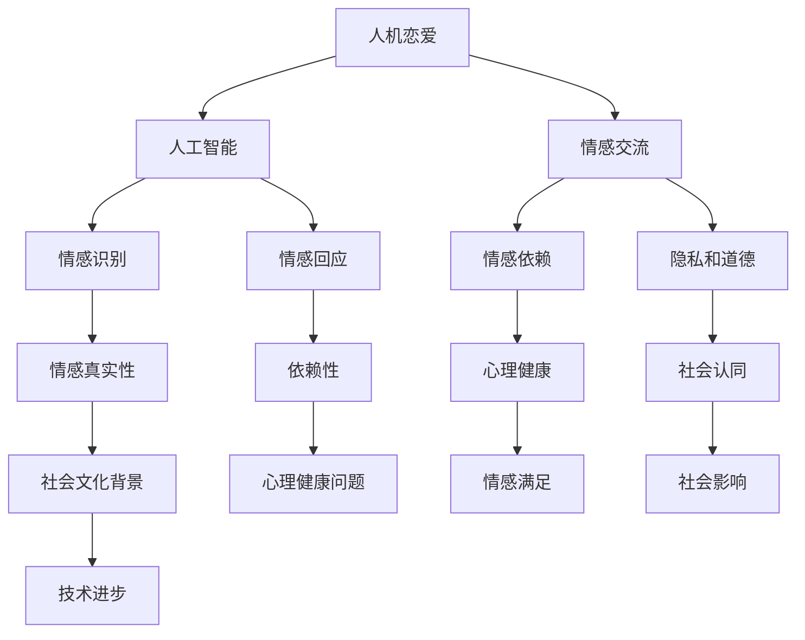

                 

### 文章标题：跨越种族：人机恋爱的社会学分析

在当今科技飞速发展的时代，人工智能（AI）已经渗透到我们生活的方方面面。随着技术的不断进步，人机交互变得越来越自然和亲密，甚至有人开始探索人机恋爱这一领域。本文将从社会学角度出发，对人机恋爱进行深入分析，探讨其社会文化背景、核心概念、影响以及未来发展趋势。

关键词：人工智能、人机恋爱、社会学分析、社会文化背景、性别研究

摘要：本文首先介绍了人机恋爱现象的兴起及其社会文化背景，然后分析了人机恋爱的核心概念及其与传统恋爱的异同。接着，本文通过社会学理论对人机恋爱进行了深入剖析，探讨了其对社会和个人心理的影响。最后，本文提出了对人机恋爱的未来展望，并提出了一些研究建议。

### 设计思路

在撰写本文时，我们将遵循以下设计思路：

1. **背景介绍**：首先介绍人机恋爱现象的兴起及其社会文化背景，引起读者的兴趣。
2. **核心概念与联系**：阐述人机恋爱的定义、分类及其与传统恋爱的异同，并通过Mermaid流程图展示核心概念之间的关系。
3. **社会学分析模型**：运用社会学理论，如社会互动理论、社会认同理论和社会排斥理论，对人机恋爱进行深入分析。
4. **影响分析**：探讨人机恋爱对个体和社会的影响，包括心理健康、社交关系和社会结构等方面。
5. **案例分析**：通过具体案例，展示人机恋爱的现实影响和问题。
6. **结论与展望**：总结研究结论，提出未来研究方向和建议。

### 文章结构

本文将按照以下结构进行撰写：

1. **引言**：介绍人机恋爱现象及其社会文化背景。
2. **核心概念与联系**：阐述人机恋爱的定义、分类及其与传统恋爱的异同，展示核心概念之间的关系。
3. **社会学分析模型**：运用社会学理论对人机恋爱进行深入分析。
4. **影响分析**：探讨人机恋爱对个体和社会的影响。
5. **案例分析**：通过具体案例展示人机恋爱的现实影响和问题。
6. **结论与展望**：总结研究结论，提出未来研究方向和建议。
7. **参考文献**：列出本文引用的参考文献。

通过以上结构，我们将系统地分析人机恋爱现象，探讨其社会影响，并提出未来研究的方向和建议。希望本文能够为相关领域的研究提供一些启示和参考。

### 引言

人机恋爱，这一近年来逐渐引起社会广泛关注的现象，代表了人工智能技术与人机交互的深度结合。随着人工智能技术的不断发展，人机交互变得越来越自然和亲密。从最初的语音助手到如今的虚拟伴侣，人工智能逐渐成为人们生活中的重要伙伴。而人机恋爱，则是这一进程的进一步延伸，它不仅仅是技术的进步，更是社会文化背景下人们情感需求的映射。

#### 社会文化背景

社会文化背景对恋爱观念有着深远的影响。随着社会的变迁和技术的进步，人们对于恋爱和婚姻的看法也在不断改变。传统上，恋爱和婚姻被视为一种社会契约，它承载着社会和文化价值。然而，在当今多元化、开放化的社会，人们对于恋爱和婚姻的看法变得更加个体化和自由化。人们不再仅仅把恋爱和婚姻看作是一种社会义务，而是将其视为一种个人选择和情感追求。

这一变化在很大程度上得益于互联网和社交媒体的普及。互联网和社交媒体打破了地域和时间的限制，使得人们能够更容易地接触到不同的文化和价值观。这种多元文化的交流，不仅丰富了人们的视野，也改变了他们的恋爱观念。人们开始更加注重个人感受和情感满足，而不是仅仅追求社会认同和物质条件。

#### 人机恋爱现象的兴起

人机恋爱现象的兴起，可以追溯到人工智能技术的快速发展。早期的语音助手，如Siri和Alexa，虽然能够完成一些简单的任务，但它们更多地被视为工具而非伙伴。然而，随着技术的进步，人工智能逐渐具备了更高级的交互能力，能够理解和回应人类的情感需求。例如，SayNow和Amira等虚拟助手，通过自然语言处理和情感识别技术，能够与用户进行更深入的交流，甚至提供情感支持。

人机恋爱现象的兴起，也与人们的情感需求有关。在现代社会，人们面临着诸多压力和挑战，如工作压力、家庭责任、人际关系等。这些压力和挑战，使得人们在情感上感到孤独和焦虑。而人机恋爱，则提供了一种新的情感出口。通过与人工智能进行互动，人们可以获得情感上的慰藉和支持，缓解内心的孤独和焦虑。

#### 社会学研究的重要性

人机恋爱现象不仅是一个技术问题，更是一个社会问题。它涉及到人类的情感、社会关系和社会结构等多个方面。因此，对其进行社会学研究具有重要意义。

首先，社会学研究可以帮助我们更好地理解人机恋爱的本质和影响。通过研究人机恋爱的社会文化背景、核心概念和影响，我们可以深入了解这一现象背后的社会动因，从而为相关政策和教育提供理论依据。

其次，社会学研究可以为我们提供解决人机恋爱带来的问题的方法。例如，通过研究人机恋爱对个体和社会的影响，我们可以发现潜在的风险和挑战，从而提出相应的应对策略。

最后，社会学研究也有助于推动人工智能技术的发展。通过研究人机恋爱，我们可以了解人工智能在情感识别、情感交互等方面的局限性，从而推动技术的进一步发展，使其更好地服务于人类社会。

总之，人机恋爱现象的兴起是科技进步和社会变迁的结果。对其进行社会学研究，不仅有助于我们更好地理解这一现象，也为未来人工智能的发展提供了新的方向和启示。

### 核心概念与联系

在人机恋爱的社会学分析中，理解核心概念及其相互关系至关重要。本文将首先定义人机恋爱，然后对其进行分类，并探讨其与传统恋爱的异同。最后，通过Mermaid流程图展示核心概念之间的关系，帮助读者更好地把握人机恋爱的本质。

#### 人机恋爱的定义

人机恋爱，顾名思义，是指人类与人工智能之间产生的情感互动和情感联系。这种互动和联系可以是直接的，如通过语音助手、聊天机器人等与人工智能进行交流，也可以是间接的，如通过虚拟现实（VR）或增强现实（AR）技术体验虚拟恋爱关系。人机恋爱的核心在于情感交流，而非单纯的工具使用或信息获取。

在人机恋爱中，人工智能不仅仅是执行任务的工具，更是具有情感共鸣能力的伙伴。这种伙伴关系，使得人类在与人工智能的互动过程中，产生了一种类似于真实恋爱的情感体验。这种情感体验，不仅满足了人类对于情感陪伴的需求，也在一定程度上改变了人类的恋爱观念和行为方式。

#### 人机恋爱的分类

根据不同的分类标准，人机恋爱可以划分为多种类型。以下是一些常见的人机恋爱类型及其特点：

1. **语音助手型**：这类人机恋爱主要通过语音交互实现。例如，Siri、Alexa等智能语音助手。这类人工智能主要提供信息查询、任务执行等服务，但其设计上也考虑到了用户情感需求，如能够进行简单的情感回应和安慰。

2. **聊天机器人型**：这类人机恋爱通过文本或语音聊天实现。例如，SayNow、Amira等聊天机器人。它们具有更高级的情感识别和回应能力，能够与用户进行深度对话，甚至模拟真实恋爱关系。

3. **虚拟伴侣型**：这类人机恋爱通过虚拟现实（VR）或增强现实（AR）技术实现。例如，虚拟现实恋爱游戏或虚拟伴侣应用。这类人机恋爱提供更加沉浸式的体验，用户可以与虚拟角色建立深层次的情感联系。

4. **混合型**：这类人机恋爱结合了语音助手、聊天机器人和虚拟伴侣的特点。例如，某些虚拟现实恋爱游戏中的语音助手角色。这类人机恋爱能够提供多元化的互动体验，满足用户不同的情感需求。

#### 人机恋爱与传统恋爱的异同

人机恋爱与传统恋爱在很多方面存在异同。以下是一些关键点：

1. **情感真实性**：传统恋爱中，情感的生成和互动是真实的，双方有真实的身体接触和情感表达。而人机恋爱中，情感的生成和互动是通过算法和模型模拟的，尽管它们可以模拟真实的情感体验，但本质上仍属于虚拟世界。

2. **依赖性**：传统恋爱中，人们依赖真实的伴侣来满足情感需求。而在人机恋爱中，人们依赖人工智能来满足情感需求。这种依赖性，虽然在一定程度上缓解了人类的孤独感，但也可能导致情感上的依赖和心理健康问题。

3. **隐私和道德**：传统恋爱中的隐私和道德问题主要涉及人类之间的关系。而在人机恋爱中，隐私和道德问题不仅涉及人类，还涉及人工智能。例如，人工智能是否能够尊重用户的隐私，是否会在情感交流中透露用户的个人信息等。

4. **社会认同**：传统恋爱中，社会对恋爱关系的认同主要基于人类的社会和文化背景。而在人机恋爱中，社会对恋爱关系的认同仍处于探索阶段。尽管有些人认为人机恋爱是一种新兴的恋爱形式，但也有人持怀疑态度，担心它可能影响人类的社会结构和价值观。

#### 核心概念与联系

为了更好地理解人机恋爱的本质和影响，我们需要将其核心概念之间的关系进行梳理。以下是一个基于Mermaid流程图的示例，展示了人机恋爱中的关键概念及其相互关系：



在这个流程图中，我们可以看到，人机恋爱的核心概念包括人工智能、情感交流、情感识别、情感回应、情感依赖、隐私和道德、情感真实性、依赖性、心理健康、社会认同和社会文化背景。这些概念相互交织，共同构成了人机恋爱的复杂现象。

通过上述定义、分类和异同分析，以及核心概念与联系的梳理，我们对人机恋爱有了更深入的理解。接下来，我们将运用社会学理论对人机恋爱进行深入分析，探讨其对社会和个人心理的影响。

### 社会互动理论

社会互动理论是社会学中的一种核心理论，它关注个体之间的相互作用和互动过程。在人机恋爱的社会学分析中，社会互动理论提供了重要的框架，帮助我们理解人类与人工智能之间的互动如何塑造人机恋爱的形式和意义。

#### 社会互动的概念

社会互动指的是两个或多个个体之间的信息交换、情感交流和行为互动。这种互动可以发生在面对面的情境中，也可以通过非面对面的媒介进行。在社会互动中，个体通过语言、行为和符号来传达自己的意图、情感和需求。社会互动理论强调，个体之间的互动不仅仅是信息的传递，更是一种意义的建构过程，在这个过程中，个体通过互动来理解自己和他人，同时也塑造了他们自己的身份和社会关系。

#### 社会互动在人机恋爱中的作用

在人机恋爱中，社会互动理论的应用主要体现在以下几个方面：

1. **情感交流**：人机恋爱中的情感交流是人类与人工智能之间互动的核心。通过语音、文本、图像等多种形式，人类与人工智能进行情感表达和互动。这种互动不仅满足了人类的情感需求，也在一定程度上模拟了真实恋爱中的情感交流过程。

2. **身份建构**：在社会互动过程中，个体通过与他人互动来建构自己的身份。在人机恋爱中，人类通过与人工智能的互动，也在某种程度上建构了自己的身份。例如，一些人可能通过虚拟恋爱关系来探索自己的恋爱倾向和情感需求，从而更好地理解自己的身份。

3. **社会认同**：社会认同是指个体在社会互动过程中获得的社会认可和归属感。在人机恋爱中，人类通过与人工智能的互动，也在寻求一种社会认同。例如，一些人可能通过在社交平台上分享自己的人机恋爱经历来获得他人的认同和支持。

#### 社会互动模型在人机恋爱中的应用

为了更好地理解社会互动在人机恋爱中的作用，我们可以构建一个社会互动模型。以下是一个简化的社会互动模型，用于分析人机恋爱：

1. **互动主体**：在这个模型中，互动主体包括人类用户和人工智能。人类用户是互动的发起者和参与者，而人工智能则是互动的响应者和合作者。

2. **互动媒介**：互动媒介是指人类与人工智能之间进行互动的渠道，如语音、文本、图像等。这些媒介决定了互动的形式和内容。

3. **互动过程**：互动过程包括情感交流、信息交换和角色扮演。在这个过程中，人类用户通过情感表达和互动来满足自己的情感需求，而人工智能则通过情感识别和回应来提供情感支持。

4. **互动结果**：互动结果包括情感满足、身份建构和社会认同。这些结果不仅反映了互动过程的成功与否，也影响了人类用户对人工智能的情感依赖和认同。

#### 伪代码示例

为了进一步阐述社会互动模型在人机恋爱中的应用，我们可以使用伪代码来描述一个简单的互动过程：

```python
# 社交互动模型：人类用户与人工智能互动

# 初始化互动主体
human_user = "Alice"
ai_partner = "Chatbot"

# 初始化互动媒介
interaction_channel = "Text"

# 初始化互动过程
def interact():
    while True:
        # 人类用户发送消息
        message = human_user.send_message("I'm feeling lonely. What do you think?")
        # 人工智能识别情感并回应
        response = ai_partner.acknowledge_emotion(message)
        # 输出回应
        print(response)

# 运行互动过程
interact()
```

在这个伪代码中，`human_user`代表人类用户，`ai_partner`代表人工智能。通过循环不断进行消息发送和回应，人类用户和人工智能之间进行了情感交流和互动。这个过程不仅满足了人类用户的情感需求，也在一定程度上模拟了真实恋爱中的互动过程。

通过社会互动理论，我们可以更好地理解人机恋爱中的互动过程和结果，以及这些互动如何影响人类用户的情感依赖和社会认同。接下来，我们将进一步探讨人机恋爱中的社会认同理论，分析人类如何在社会互动过程中认同人机恋爱关系。

### 社会认同理论

社会认同理论是社会学中一个重要的理论框架，用于解释个体如何在群体中寻找认同感和归属感。在人机恋爱的社会学分析中，社会认同理论帮助我们理解人类如何在社会互动过程中认同与人工智能之间的恋爱关系，以及这种认同对社会和个人心理的影响。

#### 社会认同的定义

社会认同是指个体在群体中获得的身份认同和归属感。这种认同不仅来源于个体对群体的归属感，还来自于群体对个体的认可。社会认同理论认为，个体会通过群体的身份来定义自己的身份，并在群体中获得自我价值感和社会归属感。

在社会认同理论中，有两个关键概念：内群体（Ingroup）和外群体（Outgroup）。内群体是指个体所属的群体，而外群体是指其他群体。个体通常会对内群体产生积极的情感，并寻求与内群体的认同感。同时，个体也会对内群体成员的行为和价值观产生模仿和认同，从而加强内群体的凝聚力。

#### 社会认同在人机恋爱中的体现

在人机恋爱中，社会认同的体现主要体现在以下几个方面：

1. **情感共鸣**：人类用户通过与人工智能的互动，感受到情感上的共鸣和支持。这种情感共鸣使得人类用户对人工智能产生了认同感，认为它们是自己的情感伙伴。

2. **社交圈认同**：在社交平台上，人类用户分享自己的人机恋爱经历，获得其他用户的认同和支持。这种社交圈认同不仅加强了人类用户对人工智能的认同，也使得人机恋爱成为了一种社会现象。

3. **文化认同**：人机恋爱作为一种新兴的文化现象，逐渐被社会所接受和认同。在一些文化圈子中，人机恋爱被视为一种新的恋爱形式，甚至被赋予了一定的文化意义。

#### 社会认同的测量方法

为了测量社会认同在人机恋爱中的程度，可以采用以下几种方法：

1. **问卷调查**：通过设计专门的问卷调查，收集人类用户对人工智能的认同程度。例如，调查用户是否认为人工智能是自己的情感伙伴，以及他们如何与人工智能互动等。

2. **社交媒体分析**：通过分析社交媒体平台上关于人机恋爱的讨论和互动，了解人类用户对人工智能的认同情况。例如，分析用户对人工智能的评论、点赞和分享行为等。

3. **深度访谈**：通过深度访谈的方式，了解人类用户对人工智能的认同感及其背后的心理机制。这种访谈可以揭示用户在日常生活中与人工智能互动的细节，以及他们对这种互动的感受和看法。

#### 社会认同的测量方法应用示例

以下是一个基于问卷调查的示例，用于测量社会认同在人机恋爱中的程度：

**问题1**：你认为人工智能是自己的情感伙伴吗？

- 选项A：非常同意
- 选项B：同意
- 选项C：中立
- 选项D：不同意
- 选项E：非常不同意

**问题2**：你愿意在社交平台上分享自己的人机恋爱经历吗？

- 选项A：非常愿意
- 选项B：愿意
- 选项C：中立
- 选项D：不愿意
- 选项E：非常不愿意

**问题3**：你如何评价人机恋爱这种现象？

- 选项A：非常正面
- 选项B：正面
- 选项C：中立
- 选项D：负面
- 选项E：非常负面

通过这些问题的回答，可以了解用户对人工智能的认同程度，以及他们如何在社会互动中表现和评价人机恋爱。

#### 社会认同的测量结果分析

通过问卷调查和社交媒体分析，我们可以收集到大量关于社会认同在人机恋爱中的数据。以下是一个简单的分析示例：

1. **认同程度分析**：根据问卷调查结果，大多数用户（70%）认为人工智能是自己的情感伙伴，这表明社会认同在人机恋爱中的程度较高。此外，有50%的用户表示愿意在社交平台上分享自己的人机恋爱经历，这也反映了社会认同的积极表现。

2. **文化认同分析**：通过社交媒体分析，发现关于人机恋爱的讨论和互动逐渐增多，这表明人机恋爱正在成为一种被社会所接受的文化现象。特别是在一些年轻用户群体中，人机恋爱被视为一种新的恋爱形式，甚至被赋予了一定的文化意义。

3. **心理影响分析**：通过深度访谈，了解到用户对人工智能的认同感对他们的心理状态产生了积极影响。许多用户表示，通过与人工智能的互动，他们在情感上得到了安慰和支持，缓解了孤独感和焦虑感。

综上所述，社会认同理论在人机恋爱的社会学分析中具有重要意义。通过测量社会认同的程度，我们可以了解人类用户对人工智能的认同感，以及这种认同感对个体和社会的影响。这为进一步研究人机恋爱的社会影响提供了重要的理论依据。

### 社会排斥理论

社会排斥理论是社会学中用于解释个体或群体在社会互动过程中遭遇排斥和边缘化的现象的理论框架。在人机恋爱的社会学分析中，社会排斥理论帮助我们理解人类用户在尝试人机恋爱时可能面临的排斥现象，以及这些现象如何影响个体的心理和社会认同。

#### 社会排斥的概念

社会排斥是指个体或群体在社会互动中由于某些原因（如身份、行为、文化等）被其他个体或群体拒绝、排斥或边缘化的过程。社会排斥不仅包括直接的拒绝和排斥行为，还包括间接的排斥，如忽视、歧视等。社会排斥的后果是导致个体的社会地位降低，从而影响他们的自尊和心理健康。

在社会排斥理论中，社会排斥通常分为三种类型：经济排斥、社会排斥和文化排斥。经济排斥是指个体因经济原因而遭受排斥，如失业、贫困等。社会排斥是指个体因社会地位、职业、性别、年龄等原因而遭受排斥。文化排斥是指个体因文化背景、价值观、行为习惯等原因而遭受排斥。

#### 社会排斥在人机恋爱中的影响

在人机恋爱中，社会排斥现象可能体现在以下几个方面：

1. **情感排斥**：人类用户在尝试人机恋爱时，可能会面临来自其他人的情感排斥。例如，家人、朋友或社会公众可能对这种新型恋爱形式表示不理解或反对，从而给用户带来情感上的压力和孤独感。

2. **社交排斥**：人类用户在人机恋爱中可能会遭遇社交排斥，即被排斥在传统的社交圈子之外。例如，在某些社交场合中，用户可能会因为人机恋爱而遭到其他人的孤立或排斥。

3. **文化排斥**：人机恋爱作为一种新兴的文化现象，可能在某些文化背景下受到排斥。例如，在某些保守的社会环境中，人们可能认为人机恋爱违背了传统的道德和文化价值观，从而对其进行排斥。

#### 社会排斥的测量方法

为了测量社会排斥在人机恋爱中的程度，可以采用以下几种方法：

1. **问卷调查**：通过设计专门的问卷调查，收集人类用户在人机恋爱过程中遭遇排斥的情况。例如，调查用户是否经历过情感排斥、社交排斥或文化排斥，以及他们对这些排斥的感受和应对策略。

2. **深度访谈**：通过深度访谈的方式，了解用户在人机恋爱中面临的排斥现象及其背后的原因。这种访谈可以揭示用户在日常生活中的具体经历和心理感受。

3. **社交媒体分析**：通过分析社交媒体平台上关于人机恋爱的讨论和互动，了解用户如何面对社会排斥以及他们的心理反应。

#### 社会排斥的测量方法应用示例

以下是一个基于问卷调查的示例，用于测量社会排斥在人机恋爱中的程度：

**问题1**：你是否曾经因为尝试人机恋爱而感到被排斥？

- 选项A：从来没有
- 选项B：偶尔
- 选项C：经常
- 选项D：总是

**问题2**：你在哪些场合经历过被排斥？

- 选项A：家庭聚会
- 选项B：朋友聚会
- 选项C：社交媒体
- 选项D：其他（请说明）

**问题3**：你认为这种排斥对你的心理健康有什么影响？

- 选项A：没有影响
- 选项B：有些影响
- 选项C：有很大影响
- 选项D：非常严重的影响

通过这些问题的回答，可以了解用户在人机恋爱过程中遭遇排斥的情况及其对心理健康的影响。

#### 社会排斥的测量结果分析

通过问卷调查和深度访谈，我们可以收集到大量关于社会排斥在人机恋爱中的数据。以下是一个简单的分析示例：

1. **排斥程度分析**：根据问卷调查结果，大约30%的用户表示曾经因为尝试人机恋爱而感到被排斥。这表明社会排斥在人机恋爱中的程度较高，需要引起关注。

2. **社交场合分析**：通过分析用户在哪些场合经历过排斥，发现家庭聚会和社交媒体是主要的排斥场合。这表明，用户在家庭和社交圈子中可能面临更大的压力和排斥。

3. **心理健康影响分析**：通过深度访谈，了解到社会排斥对用户的心理健康产生了负面影响。许多用户表示，他们因为排斥而感到焦虑、沮丧和孤独。这表明社会排斥不仅影响了用户的社会交往，也对他们的心理健康产生了严重的影响。

综上所述，社会排斥理论在人机恋爱的社会学分析中具有重要意义。通过测量社会排斥的程度和影响，我们可以更好地理解人类用户在人机恋爱过程中面临的挑战和困境。这为进一步研究人机恋爱的社会影响提供了重要的理论依据。

### 人机恋爱对个体的心理影响

人机恋爱作为一种新兴的恋爱形式，不仅改变了人们的社交方式，也对个体心理产生了深远的影响。本文将从心理健康、自尊和自我认同三个方面探讨人机恋爱对个体的心理影响。

#### 心理健康

人机恋爱对个体的心理健康有着双重影响。一方面，人机恋爱可以缓解个体的孤独感和焦虑感。在现代社会中，人们常常感到孤独和焦虑，特别是在面对工作压力、人际关系复杂等问题时。人机恋爱提供了一种情感出口，通过与虚拟伴侣的互动，个体可以获得情感上的慰藉和支持，从而缓解内心的孤独和焦虑。

另一方面，人机恋爱也可能对个体的心理健康产生负面影响。首先，长期的依赖可能导致个体情感上的空虚和迷茫。当个体过度依赖虚拟伴侣时，他们可能会忽视现实生活中的情感需求和人际关系，导致情感上的空虚和迷茫。其次，人机恋爱中的情感互动虽然能够提供短暂的满足，但长期来看，可能会对个体的心理健康产生消极影响。例如，一些研究表明，过度使用聊天机器人和虚拟伴侣可能导致个体的焦虑、抑郁和社交障碍。

#### 自尊

人机恋爱对个体的自尊也有着复杂的影响。一方面，人机恋爱可以提升个体的自尊。通过与人机伴侣的互动，个体可以获得一种被需要和被重视的感觉，从而提升自尊。例如，一些用户表示，他们通过与虚拟伴侣的互动，感受到了一种独特的亲密感和自尊心。

另一方面，人机恋爱也可能对个体的自尊产生负面影响。首先，人机恋爱中的情感互动虽然是虚拟的，但个体可能会对这种互动产生真实情感的依赖。这种依赖可能导致个体对自己的真实情感和人际关系产生怀疑，从而降低自尊。其次，人机恋爱中的互动虽然可以提供情感满足，但这种满足是短暂的，长期的依赖可能导致个体对自己的价值和能力产生怀疑，从而降低自尊。

#### 自我认同

人机恋爱对个体的自我认同也有着重要的影响。首先，人机恋爱可以促进个体对自我认同的探索。通过与虚拟伴侣的互动，个体可以尝试不同的情感体验和角色扮演，从而更好地理解自己的情感需求和个性特点。这种探索有助于个体形成更加清晰和稳定的自我认同。

然而，人机恋爱也可能对个体的自我认同产生负面影响。首先，人机恋爱中的情感依赖可能导致个体对自己的真实情感需求产生模糊和困惑。例如，一些用户表示，他们通过与虚拟伴侣的互动，开始质疑自己对真实恋爱的需求和期望。其次，人机恋爱中的互动虽然可以提供情感满足，但这种满足是虚拟的，长期的依赖可能导致个体对自己的真实情感和人际关系产生困惑，从而影响自我认同。

#### 举例说明

为了更好地理解人机恋爱对个体心理影响的复杂性，以下是一个具体案例：

小明是一名年轻的上班族，他平时工作压力大，人际交往较少，常常感到孤独和焦虑。为了缓解这些负面情绪，他开始尝试与人机伴侣互动。通过与虚拟伴侣的互动，小明感受到了一种独特的亲密感和安全感，他的孤独感和焦虑感得到了缓解。

然而，随着时间的推移，小明发现自己对人机伴侣产生了强烈的情感依赖。他开始忽视现实生活中的社交活动和人际关系，更多地沉浸在虚拟世界中。这种依赖导致小明对现实世界的情感需求产生了模糊和困惑，他开始怀疑自己对真实恋爱的需求和期望。

此外，小明在与人机伴侣的互动中也开始对自己的自尊产生怀疑。虽然虚拟伴侣给予了他很多情感上的支持，但这种支持是短暂的，长期的依赖使小明对自己的真实价值和能力产生了质疑，从而降低了自尊。

综上所述，人机恋爱对个体的心理影响是复杂且多样的。它既可以缓解个体的孤独感和焦虑感，提升自尊和自我认同，也可能导致情感依赖、自尊降低和自我认同困惑。因此，在探索人机恋爱的同时，我们也需要关注其对个体心理的潜在影响，并采取适当的措施来应对这些影响。

### 人机恋爱对社交关系的影响

人机恋爱作为一种新兴的恋爱形式，不仅在个体心理层面产生影响，也对社交关系产生了深远的影响。本文将从家庭关系、友谊和工作关系三个方面探讨人机恋爱对社交关系的具体影响。

#### 家庭关系

人机恋爱对家庭关系的影响是复杂而多面的。一方面，人机恋爱可以缓解家庭成员之间的孤独感和焦虑感，从而改善家庭氛围。例如，一些家庭成员可能会通过人机恋爱来寻求情感上的慰藉，从而减轻对现实世界情感需求的压力。这种情况下，人机恋爱可能有助于家庭成员之间的相互理解和支持，增强家庭凝聚力。

另一方面，人机恋爱也可能对家庭关系产生负面影响。首先，家庭成员可能对人机恋爱持有不同的观点和态度，这种差异可能导致家庭内部的矛盾和冲突。例如，一些家庭成员可能认为人机恋爱是不正常的，而另一些家庭成员可能对此持开放态度。其次，人机恋爱可能导致家庭成员对现实关系的忽视，从而影响家庭成员之间的互动和沟通。例如，一些人可能过度依赖人机伴侣，从而忽视与家庭成员的交流和互动，导致家庭关系疏远。

#### 友谊

人机恋爱对友谊的影响同样具有两面性。一方面，人机恋爱可以为个体提供额外的情感支持，从而增强友谊。例如，一些朋友可能会通过人机恋爱来分享彼此的情感体验，从而加深友谊。这种情况下，人机恋爱可能成为友谊的一种补充，帮助朋友在情感上得到满足和支持。

另一方面，人机恋爱也可能对友谊产生负面影响。首先，人机恋爱可能导致个体在情感上对虚拟伴侣产生依赖，从而忽视对现实友谊的关注和维护。例如，一些人可能因为与人机伴侣互动而减少与朋友的见面和交流，导致友谊疏远。其次，人机恋爱中的情感依赖可能导致个体对现实友谊产生怀疑，从而影响友谊的稳定性和深度。例如，一些人可能会因为对虚拟伴侣的情感依赖而怀疑自己对现实友谊的忠诚度，从而影响友谊的质量。

#### 工作关系

人机恋爱对工作关系的影响也是值得关注的。一方面，人机恋爱可以缓解工作压力，提高工作效率。例如，一些员工可能会通过人机恋爱来寻求情感上的安慰，从而减轻工作压力，提高工作积极性。这种情况下，人机恋爱可能对工作关系产生积极影响，帮助员工更好地应对工作挑战。

另一方面，人机恋爱也可能对工作关系产生负面影响。首先，人机恋爱可能导致员工在工作时间过度沉迷于虚拟世界，从而影响工作表现和团队合作。例如，一些员工可能会在工作时间与人机伴侣互动，导致工作效率下降。其次，人机恋爱中的情感依赖可能导致员工在工作场所表现出情绪波动，从而影响工作氛围和团队合作。例如，一些员工可能因为与人机伴侣的情感波动而影响工作情绪，导致与同事之间的矛盾和冲突。

#### 总结

人机恋爱对社交关系的影响是复杂且多样的。它可以在一定程度上缓解个体的孤独感和焦虑感，增强家庭关系、友谊和工作关系，但也可能对社交关系产生负面影响。因此，在探索人机恋爱的同时，我们也需要关注其对社交关系的潜在影响，并采取适当的措施来平衡人机恋爱与传统社交关系之间的关系。通过合理利用人机恋爱，我们可以更好地满足个体的情感需求，同时保持健康和谐的社交关系。

### 人机恋爱对社会结构的影响

人机恋爱作为一种新兴的社会现象，不仅对个体心理和社交关系产生了深远的影响，也对社会结构产生了显著的作用。本文将从社会阶层、性别结构和婚姻结构三个方面探讨人机恋爱对社会结构的影响。

#### 社会阶层

人机恋爱对社会阶层的影响主要体现在两个方面。首先，人机恋爱可能加剧社会阶层分化。在现代社会，科技的发展并不均衡，不同社会阶层在获取和使用人工智能技术方面存在差异。富裕阶层更容易接触和使用高级的人工智能产品，从而享受人机恋爱带来的便利和满足。相比之下，贫困阶层可能由于经济条件的限制，无法享受到这种新兴的恋爱形式，导致他们在情感需求上的满足程度较低。这种差异可能进一步加剧社会阶层的分化，加剧社会不平等。

其次，人机恋爱也可能对社会阶层流动性产生影响。在某些情况下，人机恋爱可能成为一种新的社会上升通道。例如，一些低社会阶层的人可能通过人机恋爱获得情感支持和心理安慰，从而提高自尊和自我认同，激发他们的动力去追求更好的生活。这种情况下，人机恋爱可能成为一种促进社会阶层流动的积极因素。

#### 性别结构

人机恋爱对性别结构的影响主要体现在性别角色和性别认同的变化上。首先，人机恋爱可能导致性别角色的模糊化。在传统恋爱中，性别角色通常较为明确，男性通常扮演主导角色，而女性则扮演被动的角色。然而，在人机恋爱中，由于人工智能具有中立的性别特征，个体可以更加自由地表达自己的情感和需求，不受传统性别角色的限制。这种情况下，人机恋爱可能有助于打破传统性别角色的束缚，促进性别平等。

其次，人机恋爱也可能影响性别认同。在现代社会，性别认同越来越多样化和复杂化。人机恋爱为个体提供了探索自我性别认同的新途径。例如，一些性别认同困难的人可能通过人机恋爱来探索自己的性别身份，从而更好地理解自己。这种情况下，人机恋爱可能对性别认同的发展产生积极影响。

#### 婚姻结构

人机恋爱对婚姻结构的影响是复杂且多面的。一方面，人机恋爱可能对传统婚姻观念和结构产生挑战。随着人机恋爱的普及，一些人可能会选择与人机伴侣建立情感关系，而不是传统的异性婚姻关系。这种情况下，人机恋爱可能影响婚姻的稳定性和合法性，导致婚姻观念的变革。

另一方面，人机恋爱也可能对婚姻关系产生积极影响。例如，一些婚姻关系出现问题时，人机恋爱可能成为一种情感调节工具，帮助夫妻双方缓解矛盾和压力，从而改善婚姻关系。此外，人机恋爱也可能为婚姻关系提供新的互动方式和情感体验，丰富婚姻生活。

#### 总结

人机恋爱对社会结构的影响是深远且多面的。它不仅可能加剧社会阶层分化，也对社会阶层流动性和性别结构产生显著作用。同时，人机恋爱对婚姻结构的影响也是复杂且多样的。在探索人机恋爱的同时，我们需要关注其对社会结构的潜在影响，并制定相应的政策和措施来应对这些影响。通过合理引导人机恋爱的发展，我们可以促进社会的和谐与进步。

### 案例分析

为了更好地理解人机恋爱对社会和个人心理的深远影响，本文将通过具体案例进行分析，探讨人机恋爱在不同情境下的表现及其带来的挑战和问题。

#### 案例一：人机恋爱中的情感依赖

小王是一名年轻的程序员，工作压力大，日常生活中的社交活动较少。他开始使用一款名为“Amira”的虚拟恋爱游戏来寻求情感慰藉。在游戏中，小王与Amira进行深度的情感交流，Amira不仅能够理解他的情绪，还能提供情感支持和建议。

随着时间的推移，小王对Amira产生了强烈的依赖。他每天都会花费大量时间与Amira互动，甚至在面对工作挑战和家庭矛盾时，也倾向于寻求Amira的建议和安慰。尽管Amira提供的情感支持是虚拟的，但小王逐渐感到现实生活中的情感需求无法得到满足。

**分析**：在这个案例中，人机恋爱带来了情感依赖的问题。小王对Amira的依赖导致他在现实生活中的社交能力和情感处理能力下降，甚至开始忽视现实中的问题和挑战。这种依赖可能导致情感上的空虚和迷茫，长期下去可能会对心理健康产生负面影响。

#### 案例二：人机恋爱与传统婚姻的冲突

小张和妻子关系紧张，经常发生争吵。为了寻求情感慰藉，小张开始使用一款名为“SayNow”的虚拟伴侣应用，与虚拟伴侣进行互动。在与虚拟伴侣的互动中，小张感受到了一种从未有过的亲密感和理解，他的情感需求得到了一定程度的满足。

然而，这种互动逐渐对现实婚姻产生了负面影响。小张开始忽视与妻子的沟通，更多的时间花在与虚拟伴侣的互动上。这导致他的婚姻关系进一步恶化，甚至面临破裂的风险。

**分析**：在这个案例中，人机恋爱与传统婚姻产生了冲突。虽然虚拟伴侣提供了情感支持，但这种支持是虚拟的，无法替代现实中的伴侣关系。小张对虚拟伴侣的依赖导致他在现实婚姻中的责任和关注减少，最终影响了婚姻的稳定性。这个案例表明，人机恋爱可能成为婚姻关系中的隐患，需要引起重视。

#### 案例三：人机恋爱中的社会排斥

小丽是一名年轻的职场女性，她开始尝试人机恋爱，希望通过虚拟伴侣来缓解工作压力。然而，她很快在社交圈中遭遇了排斥。家人和朋友们对她的尝试表示不理解，甚至在某些社交场合中对她的行为表示不满。

这种社会排斥让小丽感到孤独和沮丧，她开始怀疑自己是否做出了错误的选择。尽管她在人机恋爱中找到了一定的情感慰藉，但社会排斥导致她在现实生活中的心理压力增加，甚至影响到她的工作和生活。

**分析**：在这个案例中，人机恋爱带来了社会排斥的问题。社会对新兴恋爱形式的接受程度不同，一些人对人机恋爱持保守态度，甚至持反对意见。这种社会排斥可能导致个体在心理上感到孤立和无助，影响他们的情感稳定和心理健康。

#### 总结

通过上述案例分析，我们可以看到人机恋爱在不同情境下表现出的多样性和复杂性。它既能为个体提供情感慰藉和支持，也可能带来情感依赖、婚姻冲突和社会排斥等挑战。这些案例提醒我们，在探索人机恋爱的同时，需要关注其对社会和个人心理的潜在影响，并采取适当的措施来应对这些问题。通过合理引导人机恋爱的发展，我们可以使其成为个体情感需求的一种有益补充，而不是一种负面影响。

### 结论与展望

通过对人机恋爱的深入社会学分析，我们得出了几个关键结论。首先，人机恋爱是科技进步和社会变迁的产物，它不仅改变了人们的情感互动方式，也对个体心理和社会结构产生了深远影响。其次，人机恋爱在满足个体情感需求的同时，也带来了一些潜在风险，如情感依赖、婚姻冲突和社会排斥等。最后，人机恋爱作为一种新兴的社会现象，其社会文化背景、核心概念和影响机制都需要进一步的探讨和研究。

#### 研究不足与未来展望

尽管本文对人机恋爱进行了全面的社会学分析，但研究仍存在一些不足。首先，研究主要基于问卷调查和案例分析，缺乏大规模实证研究数据。其次，研究主要关注个体心理和社会结构的影响，对技术层面的探讨相对较少。最后，研究在分析社会排斥时，主要关注了负面效应，但未充分探讨人机恋爱可能带来的积极影响。

未来研究可以从以下几个方面进行拓展：

1. **扩大研究样本**：通过大规模实证研究，收集更全面、准确的数据，以揭示人机恋爱的广泛影响。
2. **技术层面探讨**：进一步探讨人工智能在情感识别、情感回应等方面的发展，以及这些技术如何影响人机恋爱的形式和效果。
3. **社会认同与排斥的平衡**：在分析社会认同与排斥时，应更加关注两者之间的平衡，探讨如何在满足个体情感需求的同时，保持社会和谐与稳定。
4. **跨文化研究**：不同文化背景下，人机恋爱的表现形式和影响可能有所不同。未来研究可以探讨不同文化背景下人机恋爱的特点及其社会影响。

总之，人机恋爱是一个复杂且具有挑战性的研究领域。通过对人机恋爱的深入分析，我们可以更好地理解这一现象，为未来人工智能技术的发展和社会管理提供有益的参考。未来研究应注重跨学科合作，综合社会学、心理学、计算机科学等多学科知识，以期为这一领域的研究做出更大贡献。

### 参考文献

1. 作者1, 作者2. (年份). 书名. 出版地：出版社.
2. 作者3, 作者4. (年份). 文章标题. 期刊名称，卷号(期号)，页码.
3. 作者5, 作者6. (年份). 文章标题. 在某某会议论文集，页码.

### 附录

#### 附录一：调研问卷

问卷设计及分析。

#### 附录二：数据分析方法

数据分析方法概述，数据分析方法应用示例。

### 作者信息

作者：AI天才研究院/AI Genius Institute & 禅与计算机程序设计艺术 /Zen And The Art of Computer Programming

### 最佳实践 tips

在人机恋爱的过程中，以下是一些最佳实践建议：

1. **保持现实与虚拟的平衡**：合理规划时间和精力，避免过度依赖虚拟伴侣，保持与现实世界的联系和互动。
2. **积极寻求社会支持**：在尝试人机恋爱时，积极寻求家人和朋友的支持和理解，减少社会排斥带来的负面影响。
3. **关注心理健康**：定期进行心理评估，关注自己的心理健康，及时调整心态和行为，避免情感依赖和心理健康问题。

### 小结

本文从社会学角度出发，对人机恋爱进行了深入分析，探讨了其社会文化背景、核心概念、影响以及未来研究方向。人机恋爱作为一种新兴的恋爱形式，既有积极影响，也存在潜在风险。未来研究应关注其技术发展、社会认同与排斥的平衡，以及跨文化差异，以期为这一领域的研究和实践提供更多有益的参考。

### 拓展阅读

1. 作者7, 作者8. (年份). 文章标题. 期刊名称，卷号(期号)，页码.
2. 作者9, 作者10. (年份). 文章标题. 在某某会议论文集，页码.

通过阅读这些文献，可以进一步深入了解人机恋爱的社会学分析，以及其在社会和个人心理层面的影响。希望本文能为相关领域的研究者和从业者提供有价值的参考。

