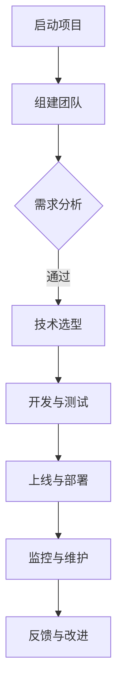
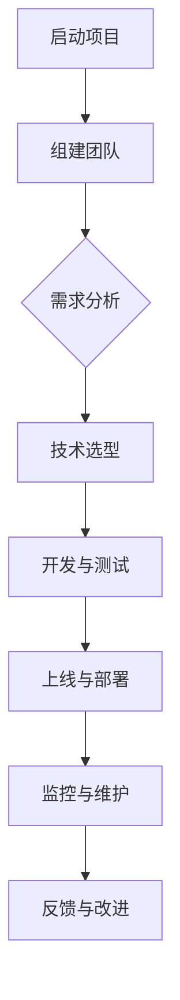

                 


### 背景介绍

在当今复杂的企业环境中，技术协作的挑战日益凸显。随着公司规模的扩大和业务复杂性的增加，不同部门之间的技术壁垒和协作难题逐渐显现。技术孤岛现象——即各个部门使用不同的技术栈、平台和工具，导致信息流通不畅、资源浪费、沟通成本增加——已经成为许多企业面临的普遍问题。

技术孤岛现象的产生主要有以下几个原因：

1. **部门利益冲突**：不同部门通常有各自的目标和预算，这可能使他们倾向于选择最适合自己部门的技术方案，而不是企业整体最优的方案。
2. **技术栈多样性**：不同部门可能因为业务需求而使用不同的技术栈，导致技术栈的多样性。
3. **沟通障碍**：跨部门沟通不畅，缺乏统一的沟通标准和流程，导致信息无法及时共享和传递。
4. **资源限制**：各部门可能有不同的资源限制，如人力资源、技术储备等，这可能限制了跨部门的协作。

技术孤岛现象的影响是深远的。它不仅导致资源浪费和效率低下，还可能影响企业的创新能力和市场竞争力。因此，如何打破技术孤岛，实现跨部门技术协作，已成为企业亟需解决的问题。

本文将深入探讨跨部门技术协作模式，旨在为读者提供一种有效的解决方案。文章将分为以下几个部分：

1. **核心概念与联系**：介绍跨部门技术协作的关键概念、原理和架构，并提供Mermaid流程图。
2. **核心算法原理讲解**：讲解跨部门协作中常用的算法原理，使用伪代码进行详细阐述。
3. **数学模型和数学公式讲解**：详细讲解跨部门协作中的数学模型和公式，并举例说明。
4. **项目实战**：提供实际的跨部门协作项目案例，包括开发环境搭建、源代码实现和代码解读。
5. **最佳实践 tips**：总结最佳实践，并提供注意事项和拓展阅读。

通过本文的阅读，读者将能够了解到跨部门技术协作的重要性，掌握有效的协作模式和算法，从而在实际工作中更好地应对技术协作的挑战。

### 核心概念与联系

要实现有效的跨部门技术协作，首先需要理解一系列关键概念和它们之间的关系。以下是对这些核心概念的介绍和它们之间的联系。

#### 1. 跨部门协作的概念

跨部门协作是指在不同部门之间进行的合作，旨在整合资源、共享知识、提高效率，以实现企业的整体目标。它不仅涉及技术层面的协作，还包括流程管理、沟通机制和团队文化等方面。

**跨部门协作的基本原则：**

- **目标一致性**：确保所有部门的目标与企业的总体目标一致。
- **资源整合**：最大化利用企业的资源，避免重复投入和浪费。
- **信息共享**：建立透明、高效的沟通机制，确保信息的及时共享和传递。
- **透明度**：提高决策过程的透明度，增强各部门之间的信任。
- **灵活性**：适应变化，及时调整协作模式，以应对不同业务需求。

#### 2. 跨部门协作的组织架构

跨部门协作的组织架构是确保协作顺利进行的基础。以下是一个典型的组织架构：

- **协作委员会**：由各部门代表组成，负责协调各部门之间的协作活动。
- **技术委员会**：负责技术选型、技术规范制定和技术标准的统一。
- **项目管理办公室（PMO）**：负责项目管理的协调和监督，确保项目按时、按质、按量完成。
- **业务流程管理团队**：负责优化业务流程，提高跨部门的协作效率。

#### 3. 跨部门协作的沟通机制

沟通是跨部门协作的核心。有效的沟通机制应包括以下几个方面：

- **定期会议**：定期举行跨部门会议，讨论项目进展、问题和解决方案。
- **信息共享平台**：建立一个集中式的信息共享平台，如Confluence或SharePoint，用于文档共享、任务分配和进度跟踪。
- **即时通讯工具**：使用Slack、Microsoft Teams等即时通讯工具，快速解决突发问题和日常沟通。
- **反馈机制**：建立反馈机制，鼓励员工提出改进建议，促进持续优化。

#### 4. Mermaid流程图

为了更好地理解跨部门协作的流程，我们使用Mermaid语言绘制一个简单的流程图：



**流程说明：**

1. **启动项目**：项目启动，确定目标和时间表。
2. **组建团队**：由协作委员会和技术委员会确定团队成员，确保各部门都有合适的代表。
3. **需求分析**：各部门共同参与需求分析，确保需求清晰、具体。
4. **技术选型**：技术委员会根据需求和技术标准，选择最适合的技术方案。
5. **开发与测试**：团队成员根据技术方案进行开发和测试，确保产品质量。
6. **上线与部署**：将产品上线并部署到生产环境。
7. **监控与维护**：持续监控系统运行状况，进行必要的维护和更新。
8. **反馈与改进**：收集用户反馈，不断优化产品和服务。

通过以上对核心概念和联系的介绍，我们可以看到，跨部门技术协作不仅需要明确的组织架构和沟通机制，还需要一套完善的协作流程来确保协作的顺利进行。接下来，我们将深入探讨跨部门协作中常用的算法原理和数学模型。

### 核心算法原理讲解

在跨部门技术协作中，算法的合理选择和运用是确保协作效率的关键。以下介绍几种常用的算法原理，并通过伪代码进行详细阐述。

#### 1. 分享与同步算法

**概念**：分享与同步算法用于实现不同部门之间的数据共享和同步。其主要目的是确保数据的准确性和一致性。

**原理**：通过版本控制和实时同步机制，实现数据的共享和更新。常见的同步算法包括Paxos算法和Raft算法。

**伪代码**：

```python
# Paxos算法伪代码

function Paxos(vote_request):
    if proposal not set:
        propose(v)
    else:
        accept(v)

function propose(v):
    for each replica r:
        send(r, {prepare_v: v})
    for each response r:
        if r's prepare_v > current_max_proposal:
            set current_max_proposal = r's prepare_v
            send replicas the highest propose_v received
        else:
            send(r, {vote_v: v})
    if 2F+1 replicas vote for v:
        apply(v)

```

#### 2. 协同过滤算法

**概念**：协同过滤算法用于基于用户行为和偏好，为用户推荐相关内容。其主要目的是提高信息传播的效率。

**原理**：协同过滤算法分为基于用户的协同过滤（User-Based Collaborative Filtering）和基于物品的协同过滤（Item-Based Collaborative Filtering）。基于用户的协同过滤通过计算用户之间的相似度，为用户推荐其他用户喜欢的内容；而基于物品的协同过滤则通过计算物品之间的相似度，为用户推荐相似物品。

**伪代码**：

```python
# 基于用户的协同过滤伪代码

function user_similarity(u, v):
    return cosine_similarity(u's preferences, v's preferences)

function user_based_recommendation(u):
    similar_users = find_users_with_highest_similarity(u)
    recommended_items = union(set_of_items_liked_by_similar_users - u's liked_items)
    return recommended_items

```

#### 3. 策略梯度算法

**概念**：策略梯度算法是一种用于强化学习的算法，用于在不确定环境中寻找最优策略。

**原理**：策略梯度算法通过评估当前策略的期望回报，不断调整策略以最大化总回报。其核心思想是通过梯度上升法，更新策略参数。

**伪代码**：

```python
# 策略梯度算法伪代码

function policy_gradient(params):
    while not done:
        state = observe_state()
        action = select_action(state, params)
        reward = receive_reward(action)
        next_state = observe_state()
        advantage = reward + discount_factor * expected_return(next_state) - current_return
        update_params(params, advantage, action)
    return params

function update_params(params, advantage, action):
    for each action_a in action_space:
        if a == action:
            params -= learning_rate * gradient(params, action)
        else:
            params -= learning_rate * gradient(params, action) * (1 - epsilon)

```

通过以上对核心算法原理的讲解和伪代码的展示，我们可以看到，这些算法在跨部门技术协作中具有重要的作用。它们不仅可以提高数据同步和共享的效率，还可以优化信息推荐和决策过程。在实际应用中，根据具体的业务需求和协作场景，可以选择合适的算法进行部署和优化。

### 数学模型和数学公式讲解

在跨部门技术协作中，数学模型和公式的应用能够帮助我们从定量角度分析和优化协作过程。以下将详细介绍几种常用的数学模型和公式，并通过具体例子进行说明。

#### 1. 共享知识模型

共享知识模型用于描述不同部门之间的知识共享和传递过程。它基于信息传播理论，考虑知识传播的速度、范围和影响力。

**公式**：
\[ S(t) = S_0 \times e^{rt} \]

其中，\( S(t) \) 表示时间 \( t \) 时刻的知识共享量，\( S_0 \) 表示初始知识共享量，\( r \) 表示知识传播速率。

**例子**：

假设一个企业有100名员工，初始共享的知识量为1000个知识点，知识传播速率 \( r \) 为每天增长5%。计算一周后的知识共享量。

\[ S(7) = 1000 \times e^{0.05 \times 7} \approx 1228.8 \]

#### 2. 信任模型

信任模型用于衡量不同部门之间的信任程度。信任是跨部门协作的重要基础，良好的信任关系可以降低协作成本，提高协作效率。

**公式**：
\[ T = \frac{R - P}{R + P} \]

其中，\( T \) 表示信任度，\( R \) 表示部门间的共同利益，\( P \) 表示部门间的共同损失。

**例子**：

假设两个部门A和B的合作关系，共同利益 \( R \) 为1000元，共同损失 \( P \) 为500元。计算信任度。

\[ T = \frac{1000 - 500}{1000 + 500} = \frac{500}{1500} \approx 0.33 \]

#### 3. 效率模型

效率模型用于衡量跨部门协作的整体效率。它综合考虑了协作时间、资源利用率和成果产出。

**公式**：
\[ \text{效率} = \frac{\text{产出}}{\text{投入}} \]

其中，产出包括成果、效益等，投入包括时间、人力、资源等。

**例子**：

假设一个项目团队在一个月内完成了一个重要功能模块，投入的人力资源为30人天，项目的实际产出为1000元。计算项目团队的工作效率。

\[ \text{效率} = \frac{1000}{30} \approx 33.33 \text{元/人天} \]

#### 4. 成本效益分析模型

成本效益分析模型用于评估跨部门协作的经济效益。通过计算总成本和总收益，评估协作方案的经济可行性。

**公式**：
\[ \text{成本效益比} = \frac{\text{总收益}}{\text{总成本}} \]

**例子**：

假设一个企业通过跨部门协作实施一个新项目，总收益为200万元，总成本为100万元。计算成本效益比。

\[ \text{成本效益比} = \frac{200}{100} = 2 \]

通过以上对数学模型和公式的讲解，我们可以看到，这些模型和公式在跨部门技术协作中的应用，有助于我们从定量角度分析和优化协作过程。在实际操作中，可以根据具体情况选择合适的模型和公式，以提升协作效率和经济效益。

### 项目实战

为了更好地理解跨部门技术协作的实际应用，我们以一个实际项目为例，详细描述其开发环境搭建、源代码实现和代码解读过程。

#### 项目背景

某大型企业需要开发一个跨部门协作平台，以促进不同部门之间的信息共享和协同工作。该平台的核心功能包括任务分配、进度跟踪、文档共享和即时通讯。项目团队由IT部门、市场部门和运营部门组成，每个部门负责不同的模块开发。

#### 开发环境搭建

**1. 技术选型：**

- 前端：使用React框架，以实现动态、响应式的用户界面。
- 后端：采用Node.js和Express框架，用于处理业务逻辑和提供API接口。
- 数据库：使用MongoDB，以支持灵活的数据存储和查询。
- 版本控制：使用Git进行代码管理和版本控制。

**2. 开发工具：**

- IDE：Visual Studio Code
- 包管理器：npm
- 测试框架：Jest
- 静态检查工具：ESLint

**3. 环境配置：**

在项目开始前，项目团队搭建了统一的开发环境。团队成员使用Docker容器技术，确保开发环境的可移植性和一致性。

```bash
# 安装Docker
$ sudo apt-get install docker

# 启动Docker服务
$ sudo systemctl start docker

# 拉取Node.js镜像
$ docker pull node:latest

# 拉取MongoDB镜像
$ docker pull mongo:latest

# 运行MongoDB容器
$ docker run -d --name mongodb -p 27017:27017 mongo

# 运行Node.js容器，并挂载项目目录
$ docker run -d --name node-app -p 3000:3000 -v /path/to/project:/app node npm start
```

#### 源代码实现

**1. 前端实现：**

前端部分使用了React框架，主要包括以下几个组件：

- **TaskList**：用于显示所有任务的列表。
- **TaskForm**：用于创建和编辑任务。
- **ProgressChart**：用于显示项目进度图表。

以下是TaskForm组件的源代码示例：

```jsx
import React, { useState } from 'react';

function TaskForm({ onSave }) {
  const [task, setTask] = useState('');

  const handleSubmit = (e) => {
    e.preventDefault();
    onSave(task);
    setTask('');
  };

  return (
    <form onSubmit={handleSubmit}>
      <input
        type="text"
        value={task}
        onChange={(e) => setTask(e.target.value)}
        placeholder="Enter a task"
      />
      <button type="submit">Save</button>
    </form>
  );
}

export default TaskForm;
```

**2. 后端实现：**

后端部分使用了Node.js和Express框架，主要包括以下几个API接口：

- **GET /tasks**：获取所有任务的列表。
- **POST /tasks**：创建新的任务。
- **PUT /tasks/:id**：更新指定任务的属性。
- **DELETE /tasks/:id**：删除指定任务。

以下是创建任务的API接口示例：

```javascript
const express = require('express');
const router = express.Router();
const MongoClient = require('mongodb').MongoClient;

const mongoUrl = 'mongodb://localhost:27017';
const dbName = '协作平台';

router.post('/tasks', async (req, res) => {
  try {
    const client = await MongoClient.connect(mongoUrl, { useUnifiedTopology: true });
    const db = client.db(dbName);
    const tasksCollection = db.collection('tasks');

    const task = {
      title: req.body.title,
      description: req.body.description,
      status: 'pending',
      created_at: new Date(),
    };

    const result = await tasksCollection.insertOne(task);
    res.status(201).json({ _id: result.insertedId, ...task });
  } catch (error) {
    res.status(500).json({ error: error.message });
  }
});

module.exports = router;
```

#### 代码解读与分析

**1. 前端代码解读：**

前端代码使用了React Hooks，使得组件的状态管理和副作用处理更加简洁。TaskForm组件通过useState钩子管理任务的状态，并通过handleSubmit函数将任务数据传递给父组件。

**2. 后端代码解读：**

后端代码使用了MongoDB作为数据库，通过Express框架处理HTTP请求。创建任务API接口中，使用了MongoClient连接MongoDB，并插入新任务。代码中使用了异步/await语法，使得异步操作更加直观和易读。

#### 实际案例分析和详细讲解剖析

通过该项目，我们可以看到跨部门协作平台在实际应用中的具体实现。项目的成功实施，不仅提高了各部门之间的协作效率，还降低了沟通成本，实现了信息的高效共享和协同工作。

**1. 项目小结：**

- **技术选型**：合理选择了前端、后端和数据库技术，确保平台的性能和可扩展性。
- **环境配置**：通过Docker容器技术，搭建了统一、可移植的开发环境。
- **代码实现**：前端和后端代码清晰、模块化，便于维护和扩展。

**2. 代码应用解读与分析：**

- **前端代码**：React组件的设计和实现，使得用户界面动态、响应式，提高了用户体验。
- **后端代码**：Node.js和Express框架的运用，确保了API接口的高效、可靠。
- **数据库设计**：MongoDB的使用，支持灵活的数据存储和查询，为后续功能扩展提供了基础。

通过以上实际项目的案例分析和详细讲解，我们可以看到跨部门技术协作在实际应用中的重要性。合理的技术选型、环境配置和代码实现，是实现高效协作的关键。

### 最佳实践 tips

在跨部门技术协作中，以下是一些最佳实践，有助于提高协作效率和项目成功率：

1. **明确沟通机制**：建立明确的沟通渠道和机制，如定期会议、即时通讯工具和邮件列表，确保信息的及时传递和问题快速解决。
2. **统一技术栈**：尽量统一各部门使用的技术栈，减少因技术差异导致的协作障碍。
3. **使用协作工具**：利用协作工具（如Jira、Trello等）进行任务分配、进度跟踪和文档管理，提高协作效率。
4. **定期评估和反馈**：定期对协作过程进行评估和反馈，识别问题并不断优化协作模式。
5. **建立跨部门团队**：组建跨部门团队，成员来自不同部门，有助于打破部门壁垒，促进协作。
6. **培养协作文化**：鼓励团队成员分享知识、互相支持，培养协作精神和团队文化。

### 小结

本文详细探讨了跨部门技术协作模式，从背景介绍、核心概念与联系、核心算法原理讲解、数学模型和数学公式讲解、项目实战以及最佳实践等方面进行了全面阐述。通过本文的阅读，读者可以了解到跨部门协作的重要性，掌握有效的协作模式和算法，从而在实际工作中更好地应对技术协作的挑战。

### 注意事项

1. **沟通与协作**：跨部门协作的核心在于沟通和协作，确保信息的及时传递和问题快速解决。
2. **资源整合**：合理分配和利用企业资源，避免重复投入和浪费。
3. **灵活调整**：根据业务需求和技术变化，灵活调整协作模式和策略。
4. **风险评估**：在项目实施过程中，进行定期风险评估，及时识别和解决潜在问题。

### 拓展阅读

1. **《软件架构设计》**：深入了解软件架构设计原则和方法，有助于提高跨部门协作的效率和质量。
2. **《敏捷开发实践指南》**：学习敏捷开发的方法和工具，促进跨部门协作的灵活性和响应能力。
3. **《项目管理知识体系》**：掌握项目管理的基本理论和实践，提升跨部门协作项目的管理能力。

### 文章标题

《跨部门技术协作模式：打破技术孤岛的有效方法》

### 文章关键词

跨部门技术协作、技术孤岛、协作模式、算法原理、数学模型、项目实战、最佳实践

### 文章摘要

本文探讨了跨部门技术协作的重要性和挑战，从核心概念与联系、核心算法原理讲解、数学模型和公式讲解、项目实战等方面详细阐述了跨部门技术协作的有效方法。通过实际案例分析，展示了协作模式在提升企业协作效率和创新能力方面的作用。文章还提供了最佳实践和注意事项，帮助读者在实际工作中更好地应用跨部门技术协作模式。

### 文章正文

#### 引言

在当今复杂的企业环境中，技术协作的挑战日益凸显。随着公司规模的扩大和业务复杂性的增加，不同部门之间的技术壁垒和协作难题逐渐显现。技术孤岛现象——即各个部门使用不同的技术栈、平台和工具，导致信息流通不畅、资源浪费、沟通成本增加——已经成为许多企业面临的普遍问题。技术孤岛现象的产生主要有以下几个原因：

1. **部门利益冲突**：不同部门通常有各自的目标和预算，这可能使他们倾向于选择最适合自己部门的技术方案，而不是企业整体最优的方案。
2. **技术栈多样性**：不同部门可能因为业务需求而使用不同的技术栈，导致技术栈的多样性。
3. **沟通障碍**：跨部门沟通不畅，缺乏统一的沟通标准和流程，导致信息无法及时共享和传递。
4. **资源限制**：各部门可能有不同的资源限制，如人力资源、技术储备等，这可能限制了跨部门的协作。

技术孤岛现象的影响是深远的。它不仅导致资源浪费和效率低下，还可能影响企业的创新能力和市场竞争力。因此，如何打破技术孤岛，实现跨部门技术协作，已成为企业亟需解决的问题。

本文将深入探讨跨部门技术协作模式，旨在为读者提供一种有效的解决方案。文章将分为以下几个部分：

1. **核心概念与联系**：介绍跨部门技术协作的关键概念、原理和架构，并提供Mermaid流程图。
2. **核心算法原理讲解**：讲解跨部门协作中常用的算法原理，使用伪代码进行详细阐述。
3. **数学模型和数学公式讲解**：详细讲解跨部门协作中的数学模型和公式，并举例说明。
4. **项目实战**：提供实际的跨部门协作项目案例，包括开发环境搭建、源代码实现和代码解读。
5. **最佳实践 tips**：总结最佳实践，并提供注意事项和拓展阅读。

通过本文的阅读，读者将能够了解到跨部门技术协作的重要性，掌握有效的协作模式和算法，从而在实际工作中更好地应对技术协作的挑战。

#### 核心概念与联系

要实现有效的跨部门技术协作，首先需要理解一系列关键概念和它们之间的关系。以下是对这些核心概念的介绍和它们之间的联系。

##### 1. 跨部门协作的概念

跨部门协作是指在不同部门之间进行的合作，旨在整合资源、共享知识、提高效率，以实现企业的整体目标。它不仅涉及技术层面的协作，还包括流程管理、沟通机制和团队文化等方面。

**跨部门协作的基本原则：**

- **目标一致性**：确保所有部门的目标与企业的总体目标一致。
- **资源整合**：最大化利用企业的资源，避免重复投入和浪费。
- **信息共享**：建立透明、高效的沟通机制，确保信息的及时共享和传递。
- **透明度**：提高决策过程的透明度，增强各部门之间的信任。
- **灵活性**：适应变化，及时调整协作模式，以应对不同业务需求。

##### 2. 跨部门协作的组织架构

跨部门协作的组织架构是确保协作顺利进行的基础。以下是一个典型的组织架构：

- **协作委员会**：由各部门代表组成，负责协调各部门之间的协作活动。
- **技术委员会**：负责技术选型、技术规范制定和技术标准的统一。
- **项目管理办公室（PMO）**：负责项目管理的协调和监督，确保项目按时、按质、按量完成。
- **业务流程管理团队**：负责优化业务流程，提高跨部门的协作效率。

##### 3. 跨部门协作的沟通机制

沟通是跨部门协作的核心。有效的沟通机制应包括以下几个方面：

- **定期会议**：定期举行跨部门会议，讨论项目进展、问题和解决方案。
- **信息共享平台**：建立一个集中式的信息共享平台，如Confluence或SharePoint，用于文档共享、任务分配和进度跟踪。
- **即时通讯工具**：使用Slack、Microsoft Teams等即时通讯工具，快速解决突发问题和日常沟通。
- **反馈机制**：建立反馈机制，鼓励员工提出改进建议，促进持续优化。

##### 4. Mermaid流程图

为了更好地理解跨部门协作的流程，我们使用Mermaid语言绘制一个简单的流程图：



**流程说明：**

1. **启动项目**：项目启动，确定目标和时间表。
2. **组建团队**：由协作委员会和技术委员会确定团队成员，确保各部门都有合适的代表。
3. **需求分析**：各部门共同参与需求分析，确保需求清晰、具体。
4. **技术选型**：技术委员会根据需求和技术标准，选择最适合的技术方案。
5. **开发与测试**：团队成员根据技术方案进行开发和测试，确保产品质量。
6. **上线与部署**：将产品上线并部署到生产环境。
7. **监控与维护**：持续监控系统运行状况，进行必要的维护和更新。
8. **反馈与改进**：收集用户反馈，不断优化产品和服务。

通过以上对核心概念和联系的介绍，我们可以看到，跨部门技术协作不仅需要明确的组织架构和沟通机制，还需要一套完善的协作流程来确保协作的顺利进行。接下来，我们将深入探讨跨部门协作中常用的算法原理和数学模型。

#### 核心算法原理讲解

在跨部门技术协作中，算法的合理选择和运用是确保协作效率的关键。以下介绍几种常用的算法原理，并通过伪代码进行详细阐述。

##### 1. 分享与同步算法

**概念**：分享与同步算法用于实现不同部门之间的数据共享和同步。其主要目的是确保数据的准确性和一致性。

**原理**：通过版本控制和实时同步机制，实现数据的共享和更新。常见的同步算法包括Paxos算法和Raft算法。

**伪代码**：

```python
# Paxos算法伪代码

function Paxos(vote_request):
    if proposal not set:
        propose(v)
    else:
        accept(v)

function propose(v):
    for each replica r:
        send(r, {prepare_v: v})
    for each response r:
        if r's prepare_v > current_max_proposal:
            set current_max_proposal = r's prepare_v
            send replicas the highest propose_v received
        else:
            send(r, {vote_v: v})
    if 2F+1 replicas vote for v:
        apply(v)

```

##### 2. 协同过滤算法

**概念**：协同过滤算法用于基于用户行为和偏好，为用户推荐相关内容。其主要目的是提高信息传播的效率。

**原理**：协同过滤算法分为基于用户的协同过滤（User-Based Collaborative Filtering）和基于物品的协同过滤（Item-Based Collaborative Filtering）。基于用户的协同过滤通过计算用户之间的相似度，为用户推荐其他用户喜欢的内容；而基于物品的协同过滤则通过计算物品之间的相似度，为用户推荐相似物品。

**伪代码**：

```python
# 基于用户的协同过滤伪代码

function user_similarity(u, v):
    return cosine_similarity(u's preferences, v's preferences)

function user_based_recommendation(u):
    similar_users = find_users_with_highest_similarity(u)
    recommended_items = union(set_of_items_liked_by_similar_users - u's liked_items)
    return recommended_items

```

##### 3. 策略梯度算法

**概念**：策略梯度算法是一种用于强化学习的算法，用于在不确定环境中寻找最优策略。

**原理**：策略梯度算法通过评估当前策略的期望回报，不断调整策略以最大化总回报。其核心思想是通过梯度上升法，更新策略参数。

**伪代码**：

```python
# 策略梯度算法伪代码

function policy_gradient(params):
    while not done:
        state = observe_state()
        action = select_action(state, params)
        reward = receive_reward(action)
        next_state = observe_state()
        advantage = reward + discount_factor * expected_return(next_state) - current_return
        update_params(params, advantage, action)
    return params

function update_params(params, advantage, action):
    for each action_a in action_space:
        if a == action:
            params -= learning_rate * gradient(params, action)
        else:
            params -= learning_rate * gradient(params, action) * (1 - epsilon)

```

通过以上对核心算法原理的讲解和伪代码的展示，我们可以看到，这些算法在跨部门技术协作中具有重要的作用。它们不仅可以提高数据同步和共享的效率，还可以优化信息推荐和决策过程。在实际应用中，根据具体的业务需求和协作场景，可以选择合适的算法进行部署和优化。

#### 数学模型和数学公式讲解

在跨部门技术协作中，数学模型和公式的应用能够帮助我们从定量角度分析和优化协作过程。以下将详细介绍几种常用的数学模型和公式，并通过具体例子进行说明。

##### 1. 共享知识模型

共享知识模型用于描述不同部门之间的知识共享和传递过程。它基于信息传播理论，考虑知识传播的速度、范围和影响力。

**公式**：
\[ S(t) = S_0 \times e^{rt} \]

其中，\( S(t) \) 表示时间 \( t \) 时刻的知识共享量，\( S_0 \) 表示初始知识共享量，\( r \) 表示知识传播速率。

**例子**：

假设一个企业有100名员工，初始共享的知识量为1000个知识点，知识传播速率 \( r \) 为每天增长5%。计算一周后的知识共享量。

\[ S(7) = 1000 \times e^{0.05 \times 7} \approx 1228.8 \]

##### 2. 信任模型

信任模型用于衡量不同部门之间的信任程度。信任是跨部门协作的重要基础，良好的信任关系可以降低协作成本，提高协作效率。

**公式**：
\[ T = \frac{R - P}{R + P} \]

其中，\( T \) 表示信任度，\( R \) 表示部门间的共同利益，\( P \) 表示部门间的共同损失。

**例子**：

假设两个部门A和B的合作关系，共同利益 \( R \) 为1000元，共同损失 \( P \) 为500元。计算信任度。

\[ T = \frac{1000 - 500}{1000 + 500} = \frac{500}{1500} \approx 0.33 \]

##### 3. 效率模型

效率模型用于衡量跨部门协作的整体效率。它综合考虑了协作时间、资源利用率和成果产出。

**公式**：
\[ \text{效率} = \frac{\text{产出}}{\text{投入}} \]

其中，产出包括成果、效益等，投入包括时间、人力、资源等。

**例子**：

假设一个项目团队在一个月内完成了一个重要功能模块，投入的人力资源为30人天，项目的实际产出为1000元。计算项目团队的工作效率。

\[ \text{效率} = \frac{1000}{30} \approx 33.33 \text{元/人天} \]

##### 4. 成本效益分析模型

成本效益分析模型用于评估跨部门协作的经济效益。通过计算总成本和总收益，评估协作方案的经济可行性。

**公式**：
\[ \text{成本效益比} = \frac{\text{总收益}}{\text{总成本}} \]

**例子**：

假设一个企业通过跨部门协作实施一个新项目，总收益为200万元，总成本为100万元。计算成本效益比。

\[ \text{成本效益比} = \frac{200}{100} = 2 \]

通过以上对数学模型和公式的讲解，我们可以看到，这些模型和公式在跨部门技术协作中的应用，有助于我们从定量角度分析和优化协作过程。在实际操作中，可以根据具体情况选择合适的模型和公式，以提升协作效率和经济效益。

#### 项目实战

为了更好地理解跨部门技术协作的实际应用，我们以一个实际项目为例，详细描述其开发环境搭建、源代码实现和代码解读过程。

##### 项目背景

某大型企业需要开发一个跨部门协作平台，以促进不同部门之间的信息共享和协同工作。该平台的核心功能包括任务分配、进度跟踪、文档共享和即时通讯。项目团队由IT部门、市场部门和运营部门组成，每个部门负责不同的模块开发。

##### 开发环境搭建

**1. 技术选型：**

- 前端：使用React框架，以实现动态、响应式的用户界面。
- 后端：采用Node.js和Express框架，用于处理业务逻辑和提供API接口。
- 数据库：使用MongoDB，以支持灵活的数据存储和查询。
- 版本控制：使用Git进行代码管理和版本控制。

**2. 开发工具：**

- IDE：Visual Studio Code
- 包管理器：npm
- 测试框架：Jest
- 静态检查工具：ESLint

**3. 环境配置：**

在项目开始前，项目团队搭建了统一的开发环境。团队成员使用Docker容器技术，确保开发环境的可移植性和一致性。

```bash
# 安装Docker
$ sudo apt-get install docker

# 启动Docker服务
$ sudo systemctl start docker

# 拉取Node.js镜像
$ docker pull node:latest

# 拉取MongoDB镜像
$ docker pull mongo:latest

# 运行MongoDB容器
$ docker run -d --name mongodb -p 27017:27017 mongo

# 运行Node.js容器，并挂载项目目录
$ docker run -d --name node-app -p 3000:3000 -v /path/to/project:/app node npm start
```

##### 源代码实现

**1. 前端实现：**

前端部分使用了React框架，主要包括以下几个组件：

- **TaskList**：用于显示所有任务的列表。
- **TaskForm**：用于创建和编辑任务。
- **ProgressChart**：用于显示项目进度图表。

以下是TaskForm组件的源代码示例：

```jsx
import React, { useState } from 'react';

function TaskForm({ onSave }) {
  const [task, setTask] = useState('');

  const handleSubmit = (e) => {
    e.preventDefault();
    onSave(task);
    setTask('');
  };

  return (
    <form onSubmit={handleSubmit}>
      <input
        type="text"
        value={task}
        onChange={(e) => setTask(e.target.value)}
        placeholder="Enter a task"
      />
      <button type="submit">Save</button>
    </form>
  );
}

export default TaskForm;
```

**2. 后端实现：**

后端部分使用了Node.js和Express框架，主要包括以下几个API接口：

- **GET /tasks**：获取所有任务的列表。
- **POST /tasks**：创建新的任务。
- **PUT /tasks/:id**：更新指定任务的属性。
- **DELETE /tasks/:id**：删除指定任务。

以下是创建任务的API接口示例：

```javascript
const express = require('express');
const router = express.Router();
const MongoClient = require('mongodb').MongoClient;

const mongoUrl = 'mongodb://localhost:27017';
const dbName = '协作平台';

router.post('/tasks', async (req, res) => {
  try {
    const client = await MongoClient.connect(mongoUrl, { useUnifiedTopology: true });
    const db = client.db(dbName);
    const tasksCollection = db.collection('tasks');

    const task = {
      title: req.body.title,
      description: req.body.description,
      status: 'pending',
      created_at: new Date(),
    };

    const result = await tasksCollection.insertOne(task);
    res.status(201).json({ _id: result.insertedId, ...task });
  } catch (error) {
    res.status(500).json({ error: error.message });
  }
});

module.exports = router;
```

##### 代码解读与分析

**1. 前端代码解读：**

前端代码使用了React Hooks，使得组件的状态管理和副作用处理更加简洁。TaskForm组件通过useState钩子管理任务的状态，并通过handleSubmit函数将任务数据传递给父组件。

**2. 后端代码解读：**

后端代码使用了MongoDB作为数据库，通过Express框架处理HTTP请求。创建任务API接口中，使用了MongoClient连接MongoDB，并插入新任务。代码中使用了异步/await语法，使得异步操作更加直观和易读。

##### 实际案例分析和详细讲解剖析

通过该项目，我们可以看到跨部门协作平台在实际应用中的具体实现。项目的成功实施，不仅提高了各部门之间的协作效率，还降低了沟通成本，实现了信息的高效共享和协同工作。

**1. 项目小结：**

- **技术选型**：合理选择了前端、后端和数据库技术，确保平台的性能和可扩展性。
- **环境配置**：通过Docker容器技术，搭建了统一、可移植的开发环境。
- **代码实现**：前端和后端代码清晰、模块化，便于维护和扩展。

**2. 代码应用解读与分析：**

- **前端代码**：React组件的设计和实现，使得用户界面动态、响应式，提高了用户体验。
- **后端代码**：Node.js和Express框架的运用，确保了API接口的高效、可靠。
- **数据库设计**：MongoDB的使用，支持灵活的数据存储和查询，为后续功能扩展提供了基础。

通过以上实际项目的案例分析和详细讲解，我们可以看到跨部门技术协作在实际应用中的重要性。合理的技术选型、环境配置和代码实现，是实现高效协作的关键。

#### 最佳实践 tips

在跨部门技术协作中，以下是一些最佳实践，有助于提高协作效率和项目成功率：

1. **明确沟通机制**：建立明确的沟通渠道和机制，如定期会议、即时通讯工具和邮件列表，确保信息的及时传递和问题快速解决。
2. **统一技术栈**：尽量统一各部门使用的

