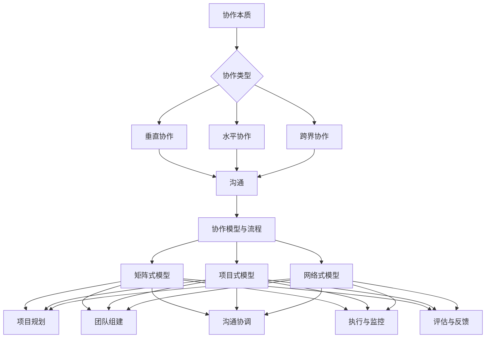

                 


# 跨部门技术协作：打破技术孤岛

## 关键词

跨部门协作，技术孤岛，协作工具，沟通协调，团队建设，知识共享，未来趋势

## 摘要

在当今复杂多变的企业环境中，跨部门技术协作已成为提升组织效率的关键。然而，技术孤岛现象仍然普遍存在，阻碍了协作的顺利进行。本文旨在探讨跨部门技术协作的重要性，分析其面临的挑战，并提出解决方案，以打破技术孤岛，促进企业内部高效协作。

## 目录

1. 背景介绍
2. 跨部门技术协作的核心概念与联系
3. 跨部门协作的挑战
4. 跨部门协作的解决方案
5. 技术协作工具与平台
6. 项目实战：跨部门协作实践
7. 最佳实践与注意事项
8. 未来趋势与展望
9. 小结
10. 拓展阅读

## 1. 背景介绍

随着企业规模的扩大和业务领域的拓展，跨部门协作的重要性日益凸显。然而，技术孤岛现象仍然普遍存在，使得部门间的沟通和协作变得复杂而低效。技术孤岛通常指的是各个部门或团队在技术方面相对独立，缺乏有效的交流和合作，导致资源浪费、效率低下和创新能力受限。

### 1.1 技术孤岛现象的成因

技术孤岛现象的成因多种多样，主要包括以下几个方面：

1. **组织结构问题**：传统的组织结构往往导致部门之间的壁垒，使得技术资源无法共享。
2. **信息不对称**：各部门之间的信息交流不畅，导致知识无法及时传递和利用。
3. **文化差异**：不同的部门或团队可能有不同的工作方式和价值观，增加了协作的难度。
4. **资源分配不均**：部门间的资源分配不均，导致某些部门缺乏足够的支持来开展协作。

### 1.2 跨部门技术协作的重要性

跨部门技术协作有助于解决技术孤岛现象，提升组织整体效率和创新能力。其主要重要性体现在以下几个方面：

1. **资源整合**：通过跨部门协作，可以将各部门的资源和优势结合起来，形成协同效应。
2. **知识共享**：跨部门协作促进了知识和经验的交流，有助于提高团队整体的技术水平。
3. **创新能力**：跨部门协作可以激发创新思维，推动技术创新和产品升级。
4. **提高效率**：协作减少了重复劳动和资源浪费，提高了项目执行效率。

## 2. 跨部门技术协作的核心概念与联系

### 2.1 协作的本质与类型

协作是指多个个体或团队为实现共同目标而进行的有目的性的互动。协作可以分为以下几种类型：

1. **垂直协作**：指上下级之间的协作，如部门经理与员工之间的协作。
2. **水平协作**：指同一级别不同部门或团队之间的协作。
3. **跨界协作**：指跨行业或领域的协作，如企业与其他企业或研究机构的合作。

### 2.2 跨部门协作的核心概念

跨部门协作的核心概念包括：

1. **沟通**：沟通是跨部门协作的基础，有效的沟通可以减少误解和冲突。
2. **协调**：协调是指确保各部门或团队的工作能够同步进行，实现整体目标的协同效应。
3. **共享**：共享是指各部门或团队在资源、知识和信息方面的交流与共享。
4. **信任**：信任是跨部门协作的重要基石，缺乏信任会导致协作困难。

### 2.3 协作模型与流程

跨部门协作通常采用以下几种模型：

1. **矩阵式模型**：矩阵式组织结构将跨部门协作纳入日常工作中，确保各部门之间的紧密联系。
2. **项目式模型**：在项目式组织结构中，跨部门协作集中在项目的执行过程中。
3. **网络式模型**：网络式模型强调跨部门协作的灵活性和自主性，适用于快速变化的环境。

跨部门协作的流程通常包括以下步骤：

1. **项目规划**：明确项目目标、范围、资源和时间安排。
2. **团队组建**：组建跨部门团队，确保各部门的代表参与。
3. **沟通协调**：建立沟通机制，确保信息畅通和及时反馈。
4. **执行与监控**：按计划执行任务，并实时监控项目进展。
5. **评估与反馈**：项目完成后，对协作过程进行评估，收集反馈并进行改进。

### 2.4 跨部门协作的挑战与解决方案

#### 2.4.1 信息不对称

信息不对称是跨部门协作中的一个重要挑战。不同部门可能拥有不同的信息来源和信息处理方式，导致信息传递的不准确和滞后。

**解决方案**：

1. **统一信息平台**：建立统一的信息平台，确保各部门能够获取到准确和实时的信息。
2. **信息共享机制**：建立信息共享机制，鼓励各部门主动分享信息，减少信息孤岛。
3. **定期会议**：定期召开跨部门会议，确保信息的透明和共享。

#### 2.4.2 文化差异

文化差异是跨部门协作中的另一个挑战。不同部门可能有不同的工作方式和价值观，这可能导致协作中的冲突和误解。

**解决方案**：

1. **文化培训**：开展跨部门文化培训，增强团队成员对彼此文化的理解和尊重。
2. **沟通技巧**：提高团队成员的沟通技巧，确保信息传达的准确性和有效性。
3. **共同目标**：明确跨部门协作的共同目标，确保团队成员共同努力。

#### 2.4.3 资源分配不均

资源分配不均是跨部门协作中的常见问题。某些部门可能拥有更多的资源，而其他部门则可能面临资源短缺。

**解决方案**：

1. **资源优化**：对资源进行合理配置和优化，确保各部门能够获得必要的资源。
2. **资源共享**：鼓励部门间资源共享，提高资源利用效率。
3. **透明度**：建立资源分配的透明度，确保资源分配的公平性和合理性。

#### 2.4.4 权责不明

权责不明是跨部门协作中的另一个挑战。不同部门或团队可能对项目的责任和权限界定不清，导致协作过程中的推诿和责任缺失。

**解决方案**：

1. **明确权责**：在项目启动时，明确各部门或团队的责任和权限，确保权责明确。
2. **责任分配表**：制定责任分配表，明确每个成员的职责和任务。
3. **定期沟通**：定期召开会议，讨论项目的进展和责任落实情况。

## 3. 跨部门协作的解决方案

### 3.1 建立协作文化

建立协作文化是跨部门协作成功的关键。协作文化强调团队合作、信息共享和共同目标。

**措施**：

1. **领导示范**：领导层应树立协作榜样，鼓励团队成员积极参与协作。
2. **团队建设**：通过团队建设活动，增强团队成员之间的信任和合作关系。
3. **奖励机制**：建立奖励机制，鼓励团队成员积极参与协作，并对协作成果进行认可。

### 3.2 使用协作工具与平台

协作工具与平台是跨部门协作的重要支持。通过使用这些工具，可以简化协作流程，提高协作效率。

**工具**：

1. **项目管理工具**：如Trello、JIRA等，用于项目规划、任务分配和进度跟踪。
2. **沟通工具**：如Slack、Microsoft Teams等，用于实时沟通和协作。
3. **知识共享平台**：如Confluence、Notion等，用于文档管理和知识共享。

### 3.3 建立有效的沟通机制

沟通是跨部门协作的核心。建立有效的沟通机制，可以确保信息的畅通和及时反馈。

**措施**：

1. **定期会议**：定期召开跨部门会议，讨论项目的进展和问题。
2. **信息共享**：建立信息共享平台，确保各部门能够及时获取到所需信息。
3. **反馈机制**：建立反馈机制，鼓励团队成员提出意见和建议。

### 3.4 强化团队培训

团队培训有助于提高团队成员的协作能力和技术水平。

**内容**：

1. **协作技巧**：如沟通技巧、团队合作、冲突解决等。
2. **技术培训**：针对项目需求，提供相应的技术培训。
3. **跨部门知识**：增强团队成员对其他部门的了解，提高跨部门协作的效率。

### 3.5 优化组织结构

优化组织结构，可以减少部门壁垒，促进跨部门协作。

**措施**：

1. **扁平化组织**：减少管理层级，缩短决策链条。
2. **矩阵式结构**：在项目团队中引入矩阵式结构，确保各部门之间的紧密联系。
3. **跨部门团队**：建立跨部门团队，专门负责跨部门项目的协调和执行。

## 4. 跨部门协作的挑战

### 4.1 领导层的支持力度

领导层的支持力度是跨部门协作成功的关键。如果领导层缺乏对跨部门协作的重视和支持，协作往往难以顺利进行。

**解决方案**：

1. **高层倡导**：高层领导应积极倡导跨部门协作的重要性，树立榜样。
2. **政策支持**：制定相关政策，为跨部门协作提供制度和资源保障。
3. **绩效评估**：将跨部门协作的成果纳入绩效评估体系，激励团队成员积极参与。

### 4.2 团队成员的协作意识

团队成员的协作意识是跨部门协作顺利进行的基石。如果团队成员缺乏协作意识，协作将变得困难。

**解决方案**：

1. **团队建设**：通过团队建设活动，增强团队成员的协作意识和团队精神。
2. **沟通培训**：提供沟通技巧培训，提高团队成员的沟通能力。
3. **激励机制**：建立激励机制，鼓励团队成员积极参与协作。

### 4.3 技术工具的使用

技术工具的使用是跨部门协作的重要组成部分。如果技术工具使用不当，将影响协作的效率和效果。

**解决方案**：

1. **培训与指导**：为团队成员提供技术工具的培训与指导，确保其能够熟练使用。
2. **工具评估**：定期评估技术工具的使用效果，及时更新和改进。
3. **工具选型**：根据实际需求，选择合适的技术工具，确保其能够满足协作需求。

## 5. 跨部门协作的技术手段

### 5.1 协作工具的选择与使用

协作工具的选择和使用是跨部门协作成功的关键。以下是一些常用的协作工具：

1. **项目管理工具**：如Trello、JIRA等，用于项目规划、任务分配和进度跟踪。
2. **沟通工具**：如Slack、Microsoft Teams等，用于实时沟通和协作。
3. **知识共享平台**：如Confluence、Notion等，用于文档管理和知识共享。

### 5.2 云协作平台的搭建与应用

云协作平台可以简化协作流程，提高协作效率。以下是一些云协作平台：

1. **Microsoft 365**：提供邮件、日历、文档、会议等多种协作功能。
2. **Google Workspace**：提供文档、表格、邮件、日历等协作工具。
3. **Trello**：提供项目管理功能，支持跨部门协作。

### 5.3 智能化协作工具的发展趋势

智能化协作工具正逐渐成为跨部门协作的新趋势。以下是一些智能化协作工具：

1. **自动化工具**：如IFTTT、 Zapier等，用于自动化跨平台任务。
2. **人工智能助手**：如Slackbot、微软小冰等，用于提供实时帮助和建议。
3. **虚拟会议工具**：如Zoom、Microsoft Teams等，支持远程协作和虚拟会议。

## 6. 项目实战：跨部门协作实践

### 6.1 项目背景

某大型企业计划开发一款新的电子商务平台，涉及多个部门，如研发部、市场部、运营部和客户服务部。为了确保项目的顺利进行，企业决定采用跨部门协作模式。

### 6.2 项目目标

1. 设计并开发一个功能完善的电子商务平台。
2. 确保各部门的协作畅通，提高项目执行效率。
3. 在项目完成后，提供全面的技术支持和客户服务。

### 6.3 项目实施

1. **项目规划**：企业首先成立了跨部门协作团队，明确各部门的职责和任务。研发部负责平台的技术开发和测试，市场部负责市场调研和推广，运营部负责平台的运营和维护，客户服务部负责客户支持和售后服务。

2. **沟通协调**：企业建立了定期会议制度，每周召开一次跨部门协作会议，讨论项目的进展和问题。同时，使用项目管理工具Trello，对任务进行分配和进度跟踪。

3. **资源整合**：企业充分利用各部门的资源，如研发部的技术能力、市场部的人脉资源、运营部的营销经验和客户服务部的客户关系，确保项目的顺利进行。

4. **知识共享**：企业建立了知识共享平台Confluence，用于文档管理和知识共享。各部门可以在此平台上发布相关文档，如设计文档、测试报告和市场分析报告，供其他部门查阅和学习。

5. **团队建设**：企业定期举办团队建设活动，如团建聚餐、户外拓展等，增强团队成员之间的信任和合作关系。

### 6.4 项目成果

1. 经过6个月的跨部门协作，企业成功开发并上线了电子商务平台。
2. 平台功能完善，用户体验良好，取得了良好的市场反响。
3. 各部门之间的协作畅通，项目执行效率提高，减少了重复劳动和资源浪费。
4. 团队成员之间的信任和合作关系得到增强，为未来的协作奠定了基础。

### 6.5 项目总结

本项目成功实现了跨部门协作，打破了技术孤岛现象，取得了显著的成果。以下是本项目的主要经验：

1. **明确项目目标**：确保各部门对项目的目标有清晰的认识，有利于协作的顺利进行。
2. **沟通协调**：建立有效的沟通机制，确保信息的畅通和及时反馈。
3. **资源整合**：充分利用各部门的资源，提高资源利用效率。
4. **团队建设**：增强团队成员之间的信任和合作关系，提高团队凝聚力。
5. **知识共享**：建立知识共享平台，促进知识和经验的交流与共享。

## 7. 最佳实践与注意事项

### 7.1 最佳实践

1. **明确目标与责任**：确保各部门对项目的目标有清晰的认识，明确各部门的职责和任务。
2. **沟通协调**：建立定期沟通机制，确保信息的畅通和及时反馈。
3. **资源整合**：充分利用各部门的资源，提高资源利用效率。
4. **知识共享**：建立知识共享平台，促进知识和经验的交流与共享。
5. **团队建设**：增强团队成员之间的信任和合作关系，提高团队凝聚力。

### 7.2 注意事项

1. **避免信息孤岛**：确保信息传递的准确性和及时性，避免信息孤岛现象。
2. **尊重文化差异**：尊重各部门的文化差异，避免因文化冲突导致协作困难。
3. **合理分配资源**：确保各部门能够获得必要的资源，避免资源分配不均。
4. **明确权责**：明确各部门的职责和权限，避免权责不明导致的责任推诿。
5. **持续改进**：定期评估协作效果，不断改进协作流程和方法。

## 8. 未来趋势与展望

### 8.1 技术进步对跨部门协作的影响

随着技术的不断进步，跨部门协作将变得更加高效和便捷。以下是一些趋势：

1. **人工智能**：人工智能技术将提高协作的智能化水平，如自动化的任务分配和进度跟踪。
2. **云计算**：云计算将提供更强大的协作平台，支持大规模的数据共享和实时协作。
3. **区块链**：区块链技术将提高协作的透明度和安全性，如智能合约和去中心化协作。

### 8.2 跨部门协作的发展方向

1. **数字化协作**：数字化协作将成为主流，如虚拟会议、在线协作工具等。
2. **跨界协作**：跨界协作将越来越普遍，如企业与其他企业、研究机构等的合作。
3. **智能协作**：智能协作将提高协作的效率和质量，如智能助手、自动化工具等。

### 8.3 跨国公司的跨部门协作实践

随着全球化的推进，跨国公司的跨部门协作将面临更大的挑战和机遇。以下是一些跨国公司跨部门协作的实践：

1. **全球协同办公**：跨国公司通过建立全球协同办公平台，实现全球团队的实时协作。
2. **多元化团队建设**：跨国公司注重多元化团队建设，提高团队的创新能力。
3. **跨文化沟通**：跨国公司通过跨文化沟通培训，提高团队成员的跨文化沟通能力。

## 9. 小结

跨部门技术协作是提升企业效率和创新能力的关键。通过打破技术孤岛，建立有效的协作机制，企业可以充分利用各部门的资源，提高协作效率，实现共同目标。未来，随着技术的不断进步，跨部门协作将变得更加高效和便捷，为企业带来更大的价值。

## 10. 拓展阅读

1. 《跨部门协作：从理论到实践》
2. 《技术协作工具与应用》
3. 《跨部门沟通与协调技巧》
4. 《跨国公司的跨部门协作实践》

作者：AI天才研究院/AI Genius Institute & 禅与计算机程序设计艺术 /Zen And The Art of Computer Programming

---

**核心概念与联系：Mermaid 流程图**



**核心算法原理讲解与伪代码**

```python
# 伪代码：跨部门协作任务分配算法

function TaskAllocation(team_members, tasks, resources):
    for member in team_members:
        member.available_resources = resources[member.id]
        member.assigned_tasks = []
    
    while tasks are not empty:
        for member in team_members:
            if member.available_resources >= task.resource_requirements and task not in member.assigned_tasks:
                member.assigned_tasks.append(task)
                member.available_resources -= task.resource_requirements
                tasks.remove(task)
                break

    return team_members
```

**数学模型与公式**

$$
E(T) = \sum_{i=1}^{n} (T_i \cdot p_i)
$$

其中，\(E(T)\) 表示总协作时间，\(T_i\) 表示第 \(i\) 个任务的完成时间，\(p_i\) 表示第 \(i\) 个任务的优先级。

**详细讲解与举例说明**

假设有3个任务 \(T_1, T_2, T_3\)，优先级分别为 \(p_1 = 0.5, p_2 = 0.3, p_3 = 0.2\)，资源需求分别为 \(R_1 = 10, R_2 = 5, R_3 = 3\)。团队成员有两个，成员A的可用资源为20，成员B的可用资源为15。

按照任务分配算法，任务优先级越高，被分配到成员的概率越大。首先，分配优先级最高的任务 \(T_2\) 给成员A，成员A剩余资源为10。接着，分配优先级次高的任务 \(T_1\) 给成员A，成员A剩余资源为0。最后，将优先级最低的任务 \(T_3\) 分配给成员B，成员B剩余资源为12。

这样，任务分配完成后，成员A负责任务 \(T_1, T_2\)，成员B负责任务 \(T_3\)。

**实际案例分析与详细讲解剖析**

案例：某互联网公司计划开发一款移动应用，涉及前端、后端和测试等多个部门。项目周期为3个月。

1. **项目规划**：企业首先明确了项目的目标，即开发一款功能完善的移动应用。然后，各部门分别制定了详细的项目计划，明确了任务和资源需求。

2. **沟通协调**：企业建立了定期沟通机制，每周召开一次项目进度会议。各部门负责人汇报项目进展，讨论遇到的问题和解决方案。

3. **资源整合**：企业充分利用各部门的资源，如前端部门的技术能力、后端部门的开发经验和测试部门的测试工具，确保项目的顺利进行。

4. **知识共享**：企业建立了知识共享平台，各部门可以在平台上发布相关文档，如需求分析、设计文档和测试报告，供其他部门查阅和学习。

5. **团队建设**：企业定期举办团队建设活动，如团建聚餐、户外拓展等，增强团队成员之间的信任和合作关系。

通过以上措施，项目顺利完成，移动应用在市场上取得了良好的反响。

**项目小结**

本项目成功实现了跨部门协作，打破了技术孤岛现象，提高了项目执行效率。主要经验如下：

1. **明确项目目标**：确保各部门对项目的目标有清晰的认识。
2. **沟通协调**：建立有效的沟通机制，确保信息的畅通和及时反馈。
3. **资源整合**：充分利用各部门的资源，提高资源利用效率。
4. **知识共享**：建立知识共享平台，促进知识和经验的交流与共享。
5. **团队建设**：增强团队成员之间的信任和合作关系，提高团队凝聚力。

