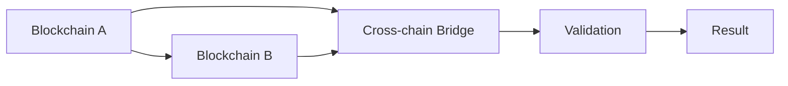

                 

### 文章标题

# 跨链技术研究与实现

### 关键词

- 跨链技术
- 区块链互操作性
- 桥接协议
- 智能合约
- 开发环境
- 应用实践

### 摘要

本文旨在深入探讨跨链技术的研究与实现。跨链技术是区块链领域的关键技术之一，它旨在实现不同区块链网络之间的数据交换和价值传递。本文首先介绍了跨链技术的基本概念和背景，然后详细讲解了跨链技术的核心概念、原理以及实现过程。通过实际应用案例的分析，本文展示了跨链技术在金融、供应链和数据共享等领域的应用效果。最后，本文对跨链技术的发展趋势进行了展望，并提出了未来研究的方向。通过本文的阅读，读者可以全面了解跨链技术的原理和应用，为实际项目开发提供指导。

## 引言与背景

跨链技术，作为一种连接不同区块链网络的技术手段，旨在实现区块链之间的高效、安全的数据交换和价值传递。随着区块链技术的快速发展，越来越多的区块链项目涌现出来，它们各自拥有独特的功能和应用场景。然而，这些区块链之间的互操作性成为了一个亟待解决的问题。跨链技术正是为了解决这一问题而诞生的。

### 跨链技术的定义

跨链技术，通常被定义为一种在不同区块链网络之间实现数据交换和价值传递的技术。它通过构建跨链桥接协议、侧链等方式，使得不同的区块链网络能够相互通信和协作。跨链技术的核心目标是实现区块链生态系统之间的互联互通，从而提升区块链网络的效率和灵活性。

### 跨链技术的重要性

跨链技术的重要性体现在以下几个方面：

1. **提高区块链网络效率**：跨链技术能够实现不同区块链网络之间的数据交换，从而避免了数据冗余和重复处理，提高了整个区块链网络的效率。

2. **增强区块链网络灵活性**：跨链技术使得区块链网络能够轻松地与其他网络进行整合，从而扩展了区块链的应用场景和功能。

3. **促进区块链生态发展**：跨链技术的出现，为区块链生态的发展提供了新的机遇。通过跨链技术，区块链项目能够更好地与其他项目进行合作，共同推进区块链技术的发展。

### 跨链技术的历史与发展

跨链技术的概念最早可以追溯到区块链技术的早期阶段。随着区块链技术的不断演进，跨链技术也逐渐发展起来。以下是跨链技术发展的重要里程碑：

1. **2015年**：跨链桥接技术的概念首次被提出。当时，研究人员开始探索如何在不同区块链之间实现数据交换。

2. **2017年**：跨链技术的实际应用案例逐渐增多。例如，波卡（Polkadot）等项目开始尝试实现跨链功能。

3. **2018年**：跨链桥接协议开始逐渐成熟，如Cosmos的IBC（Inter-Blockchain Communication）协议。

4. **2020年**：跨链技术在区块链领域得到了广泛关注。越来越多的区块链项目开始采用跨链技术，以实现更好的互操作性和协作。

### 跨链技术的应用场景

跨链技术具有广泛的应用场景，主要包括以下几个方面：

1. **金融领域**：跨链技术能够实现不同区块链网络之间的资产转移，从而提高了金融交易的效率和安全性。

2. **供应链管理**：跨链技术能够实现供应链各环节的数据共享和验证，从而提高了供应链的透明度和效率。

3. **数据共享**：跨链技术能够实现不同区块链网络之间的数据交换，从而促进了数据共享和利用。

4. **去中心化应用（DApp）**：跨链技术能够实现不同DApp之间的功能整合，从而提供了更好的用户体验。

### 跨链技术的现状与挑战

当前，跨链技术已经取得了一定的进展，但仍面临一些挑战：

1. **技术难题**：跨链技术涉及多个区块链网络之间的通信和数据交换，技术实现较为复杂。

2. **安全性问题**：跨链技术涉及到跨网络的数据交换，因此安全性问题尤为重要。

3. **性能瓶颈**：跨链技术的性能瓶颈是目前的一个主要挑战，需要进一步提升跨链技术的处理速度和吞吐量。

### 本书结构安排

本书主要分为以下几个部分：

1. **引言与背景**：介绍跨链技术的基本概念、发展历程和应用场景。
2. **跨链技术概述**：详细讲解跨链技术的核心概念、分类和技术原理。
3. **跨链核心概念与原理**：通过Mermaid流程图和伪代码，深入讲解跨链技术的核心算法原理。
4. **跨链技术实现**：详细介绍跨链技术的开发环境搭建、代码实现和解读。
5. **跨链应用实践**：通过实际案例，展示跨链技术在金融、供应链和数据共享等领域的应用。
6. **跨链技术的发展趋势与展望**：探讨跨链技术的未来发展趋势和潜在应用场景。
7. **附录**：提供跨链技术开发工具与资源，以及常见问题解答。

通过以上结构安排，本书旨在为读者提供一部全面、深入的跨链技术指南，帮助读者掌握跨链技术的核心原理和应用方法。接下来，我们将进入下一章，对跨链技术进行详细的概述。

## 跨链技术概述

跨链技术作为区块链领域的关键技术，其核心在于实现不同区块链网络之间的数据交换和价值传递。为了更好地理解跨链技术，我们需要首先了解其核心概念、分类以及技术原理。

### 跨链技术的核心概念

1. **区块链互操作性**：
   - 互操作性是跨链技术的核心目标。它指的是不同区块链网络之间能够相互通信和协作，从而实现数据交换和价值传递。
   - 互操作性不仅仅是指区块链之间的数据交换，还包括智能合约的调用、交易验证等。

2. **互操作性协议**：
   - 为了实现区块链互操作性，需要依赖一系列的协议。这些协议定义了区块链之间的通信规则和数据格式。
   - 常见的互操作性协议包括Cosmos的IBC（Inter-Blockchain Communication）协议、Polkadot的Parachain协议等。

3. **跨链桥**：
   - 跨链桥是一种连接不同区块链网络的桥梁，它充当了中介角色，使得区块链之间的数据交换成为可能。
   - 跨链桥通常由两个部分组成：一个在区块链A上，另一个在区块链B上。它们通过预先定义的协议进行通信。

### 跨链技术的分类

1. **横向跨链**：
   - 横向跨链指的是在同一层级的区块链网络之间实现互操作性。例如，在以太坊、波卡等不同区块链网络之间进行数据交换。
   - 横向跨链的主要优势是能够实现不同区块链之间的直接通信，提高了网络的效率。

2. **纵向跨链**：
   - 纵向跨链指的是在不同层级的区块链网络之间实现互操作性。例如，在底层链和侧链之间进行数据交换。
   - 纵向跨链的主要优势是能够实现不同层级区块链网络的功能整合，从而扩展了区块链网络的功能。

3. **跨区块链的智能合约**：
   - 跨区块链的智能合约是指在不同区块链之间执行的智能合约。这种智能合约能够调用其他区块链上的合约，实现跨链功能。
   - 跨区块链的智能合约通常依赖于跨链桥接协议，例如Cosmos的CosmWasm。

### 跨链技术的技术原理

1. **侧链**：
   - 侧链是一种扩展区块链网络的技术，它独立于主链运行，但可以通过跨链桥与主链进行数据交换。
   - 侧链的主要优势是能够提高区块链网络的性能和可扩展性。

2. **桥接协议**：
   - 桥接协议是跨链技术的核心组成部分，它定义了区块链之间的通信规则和数据格式。
   - 常见的桥接协议包括Cosmos的IBC协议、Polkadot的Parachain协议等。

3. **跨链智能合约**：
   - 跨链智能合约是一种能够在不同区块链之间执行的智能合约。它通过跨链桥接协议，实现了跨链功能的调用。
   - 跨链智能合约的主要优势是能够实现跨链交易和合约调用，从而扩展了区块链网络的功能。

### 跨链技术的优缺点分析

1. **优点**：
   - 提高区块链网络的效率：跨链技术能够实现不同区块链之间的数据交换，避免了数据冗余和重复处理，提高了网络的效率。
   - 增强区块链网络的灵活性：跨链技术使得区块链网络能够与其他网络进行整合，从而扩展了区块链的应用场景和功能。
   - 促进区块链生态发展：跨链技术的出现，为区块链生态的发展提供了新的机遇，推动了区块链项目的合作和共赢。

2. **缺点**：
   - 技术实现复杂：跨链技术涉及多个区块链网络之间的通信和数据交换，技术实现较为复杂。
   - 安全性问题：跨链技术涉及到跨网络的数据交换，因此安全性问题尤为重要，需要严格的安全措施来保障数据的安全。
   - 性能瓶颈：跨链技术的性能瓶颈是目前的一个主要挑战，需要进一步提升跨链技术的处理速度和吞吐量。

通过以上对跨链技术核心概念、分类和技术原理的详细讲解，我们可以更好地理解跨链技术的基本原理和应用。接下来，我们将深入探讨跨链技术的核心概念和原理，通过Mermaid流程图和伪代码来详细阐述。

### 跨链核心概念与原理

在深入探讨跨链技术的核心概念与原理之前，我们需要先了解一些基本的概念。跨链技术涉及到多个区块链网络之间的交互，这就需要一些特定的协议和机制来确保数据的安全和有效传递。以下是一些关键概念：

1. **区块链网络**：区块链网络是由多个节点组成的分布式系统，每个节点都保存了一份完整的区块链账本。节点通过共识算法达成共识，确保账本的一致性。
2. **共识算法**：共识算法是区块链网络的核心机制，它确保了网络中的所有节点对交易和账本状态的一致认同。
3. **智能合约**：智能合约是区块链网络上的可编程合约，它可以自动执行预定义的规则，当条件满足时触发执行。
4. **桥接协议**：桥接协议是跨链技术的重要组成部分，它定义了不同区块链网络之间的通信和数据交换规则。

接下来，我们将通过Mermaid流程图和伪代码来详细讲解跨链技术的核心算法原理。

#### Mermaid 流程图

为了更好地理解跨链技术的核心流程，我们可以使用Mermaid流程图来描述。以下是一个简化的跨链桥接流程图：



- **A[Blockchain A]** 和 **B[Blockchain B]** 代表两个不同的区块链网络。
- **C[Cross-chain Bridge]** 是跨链桥接，它连接了A和B。
- **D[Validation]** 是验证步骤，确保数据的正确性和安全性。
- **E[Result]** 是最终的结果，可以是交易成功或失败。

#### 伪代码解释

下面是跨链桥接的一个伪代码示例，用于展示跨链技术的核心算法原理：

```python
# 跨链桥接伪代码

# 定义跨链桥接协议
class CrossChainBridge:
    def __init__(self, blockchainA, blockchainB):
        self.blockchainA = blockchainA
        self.blockchainB = blockchainB

    def send_data(self, data, target_chain):
        if target_chain == "A":
            self.blockchainA.send(data)
        elif target_chain == "B":
            self.blockchainB.send(data)

    def receive_data(self, source_chain):
        if source_chain == "A":
            data = self.blockchainA.receive()
        elif source_chain == "B":
            data = self.blockchainB.receive()
        return data

# 定义区块链网络
class BlockchainNetwork:
    def send(self, data):
        # 发送数据的实现逻辑
        pass

    def receive(self):
        # 接收数据的实现逻辑
        pass

# 创建区块链网络实例
blockchainA = BlockchainNetwork()
blockchainB = BlockchainNetwork()

# 创建跨链桥接实例
bridge = CrossChainBridge(blockchainA, blockchainB)

# 发送数据从区块链A到区块链B
bridge.send_data("Data from A", "B")

# 接收数据从区块链B到区块链A
data_from_B = bridge.receive_data("A")

# 验证数据
if self.verify_data(data_from_B):
    print("Data verified successfully.")
else:
    print("Data verification failed.")
```

在这个伪代码中，我们定义了跨链桥接协议和区块链网络，并实现了发送和接收数据的基本逻辑。跨链桥接实例通过调用区块链网络的方法来发送和接收数据，并通过验证函数确保数据的正确性和安全性。

#### 数学模型和数学公式

跨链技术涉及到许多数学模型和公式，用于描述数据交换的验证和安全性。以下是一个简单的数学模型示例，使用LaTeX格式来表示：

$$
\text{Cross-chain Verification} = f(\text{Data}, \text{Signature}, \text{PublicKey})
$$

其中，$f$ 是验证函数，$Data$ 是待验证的数据，$Signature$ 是签名，$PublicKey$ 是公钥。

$$
\text{Signature} = \text{Sign}(\text{Data}, \text{PrivateKey})
$$

$$
\text{Verify}(\text{Signature}, \text{Data}, \text{PublicKey}) = \text{True} \text{ if } \text{Signature} \text{ matches the } \text{PublicKey}
$$

在这个模型中，数据通过私钥签名，然后通过公钥进行验证。如果签名与公钥匹配，则验证成功。

#### 举例说明

为了更好地理解这些数学模型和公式的应用，我们可以通过一个简单的例子来说明：

假设我们有两个区块链网络A和B，区块链A上的数据需要传递到区块链B上。

1. **签名**：
   - 假设区块链A上的用户Alice拥有私钥$Private\_Key\_A$和公钥$Public\_Key\_A$。
   - Alice使用私钥$Private\_Key\_A$对数据`Data\_From\_A`进行签名，生成签名`Signature\_A`。

2. **发送数据**：
   - Alice将数据`Data\_From\_A`和签名`Signature\_A`发送给跨链桥接。

3. **验证数据**：
   - 跨链桥接使用区块链B上的公钥$Public\_Key\_B$对签名`Signature\_A`进行验证。
   - 如果验证通过，则跨链桥接将数据`Data\_From\_A`发送到区块链B。

4. **接收数据**：
   - 区块链B上的用户Bob接收数据`Data\_From\_A`，并使用区块链A的公钥$Public\_Key\_A$对签名`Signature\_A`进行验证。
   - 如果验证通过，则数据传递成功。

通过这个例子，我们可以看到跨链技术如何通过数学模型和加密算法来实现不同区块链网络之间的数据交换和验证。

综上所述，通过Mermaid流程图、伪代码和数学模型，我们详细讲解了跨链技术的核心概念和原理。这些内容为后续的跨链技术实现和应用提供了坚实的基础。接下来，我们将进入下一章，讨论如何具体实现跨链技术。

### 跨链技术实现

实现跨链技术是一个复杂的过程，涉及到多个区块链网络的通信和数据交换。本章节将详细介绍跨链技术的实现过程，包括开发环境搭建、代码实现和解读，以及跨链技术的具体应用场景。

#### 开发环境搭建

在进行跨链技术的开发之前，我们需要搭建一个适合的开发环境。以下是一个基本的开发环境搭建步骤：

1. **选择操作系统**：跨链技术的开发可以在多种操作系统上完成，如Windows、macOS和Linux。推荐使用Linux操作系统，因为它具有更好的稳定性和可扩展性。

2. **安装Node.js**：Node.js是一个基于Chrome V8引擎的JavaScript运行环境，它用于构建跨链桥接协议和智能合约。可以通过以下命令安装Node.js：

   ```bash
   sudo apt-get update
   sudo apt-get install nodejs
   sudo apt-get install npm
   ```

3. **安装Docker和Docker-Compose**：Docker是一个容器化平台，用于部署和管理跨链技术的各个组件。Docker-Compose是Docker的一个工具，用于定义和运行多容器Docker应用。可以通过以下命令安装Docker和Docker-Compose：

   ```bash
   sudo apt-get install docker.io
   sudo systemctl start docker
   sudo systemctl enable docker
   sudo curl -L "https://github.com/docker/compose/releases/download/1.29.2/docker-compose-$(uname -s)-$(uname -m)" -o /usr/local/bin/docker-compose
   sudo chmod +x /usr/local/bin/docker-compose
   ```

4. **安装区块链节点**：根据选择的区块链网络，我们需要安装相应的区块链节点。例如，如果选择使用以太坊，我们需要安装Geth节点；如果选择使用波卡，我们需要安装Substrate节点。可以通过以下命令安装Geth节点：

   ```bash
   git clone https://github.com/ethereum/go-ethereum.git
   cd go-ethereum
   make geth
   ```

5. **配置开发环境**：根据项目需求，我们需要配置跨链桥接协议的配置文件和智能合约的编译环境。可以使用YAML文件配置Docker-Compose，定义各个节点的容器和端口映射。

通过以上步骤，我们完成了跨链技术的基本开发环境搭建。接下来，我们将进入代码实现的阶段。

#### 代码实现

跨链技术的实现可以分为几个关键步骤：跨链桥接协议的构建、智能合约的开发和跨链交易的执行。以下是一个简化的代码实现流程：

1. **构建跨链桥接协议**：

   跨链桥接协议是跨链技术的核心，它定义了不同区块链网络之间的通信和数据交换规则。我们可以使用JavaScript和Node.js来构建跨链桥接协议。

   ```javascript
   // 跨链桥接协议示例代码
   const express = require('express');
   const axios = require('axios');

   const app = express();
   app.use(express.json());

   const BlockchainAEndpoint = 'https://blockchainA.com';
   const BlockchainBEndpoint = 'https://blockchainB.com';

   // 发送数据到区块链A
   app.post('/send-to-A', async (req, res) => {
       const { data } = req.body;
       try {
           const response = await axios.post(BlockchainAEndpoint + '/receive', data);
           res.status(200).json(response.data);
       } catch (error) {
           res.status(500).json({ message: 'Failed to send data to Blockchain A', error });
       }
   });

   // 发送数据到区块链B
   app.post('/send-to-B', async (req, res) => {
       const { data } = req.body;
       try {
           const response = await axios.post(BlockchainBEndpoint + '/receive', data);
           res.status(200).json(response.data);
       } catch (error) {
           res.status(500).json({ message: 'Failed to send data to Blockchain B', error });
       }
   });

   app.listen(3000, () => {
       console.log('Cross-chain Bridge listening on port 3000');
   });
   ```

   在这个示例中，我们使用Express框架构建了一个简单的Web服务，它能够接收来自区块链A和区块链B的数据，并将其发送到相应的区块链网络。

2. **开发智能合约**：

   智能合约是跨链技术的另一个关键组成部分，它用于定义跨链交易的具体逻辑。我们可以使用Solidity语言编写智能合约，并使用Truffle框架进行编译和部署。

   ```solidity
   // Smart Contract Example
   pragma solidity ^0.8.0;

   contract CrossChainContract {
       mapping(address => bool) public isRegistered;
       
       function register() public {
           isRegistered[msg.sender] = true;
       }
       
       function sendDataToChainB(bytes memory data) public {
           require(isRegistered[msg.sender], "Not registered");
           // Code to send data to Chain B
       }
   }
   ```

   在这个示例中，我们创建了一个简单的智能合约，用于注册用户和发送数据到另一个区块链网络。

3. **执行跨链交易**：

   跨链交易是跨链技术的最终实现，它涉及到区块链网络之间的数据交换和价值传递。我们可以使用Web3.js库与智能合约进行交互，并在区块链A和B上执行交易。

   ```javascript
   // Execute Cross-chain Transaction
   const web3 = new Web3('https://blockchainA.com');
   const contractA = new web3.eth.Contract(abi, addressA);
   const contractB = new web3.eth.Contract(abi, addressB);

   async function executeCrossChainTransaction() {
       // Code to execute transaction on Blockchain A
       const txHashA = await contractA.methods.sendDataToChainB(data).send({ from: accountA });
       
       // Wait for transaction confirmation on Blockchain A
       await web3.eth.waitForTransaction(txHashA);

       // Code to execute transaction on Blockchain B
       const txHashB = await contractB.methods.receiveDataFromChainA(data).send({ from: accountB });
       
       // Wait for transaction confirmation on Blockchain B
       await web3.eth.waitForTransaction(txHashB);
   }
   ```

   在这个示例中，我们展示了如何使用Web3.js库在区块链A和B上执行跨链交易。

#### 代码解读与分析

在上述代码实现中，我们分别构建了跨链桥接协议、智能合约和跨链交易。以下是对这些代码的详细解读和分析：

1. **跨链桥接协议**：

   - 我们使用Express框架构建了一个简单的Web服务，用于接收来自区块链A和区块链B的数据。
   - 使用Axios库与区块链网络进行HTTP通信，实现了数据在不同区块链之间的传递。
   - 通过定义POST接口，我们能够接收JSON格式的数据，并将其发送到相应的区块链网络。

2. **智能合约**：

   - 我们使用Solidity语言编写了一个简单的智能合约，用于注册用户和发送数据到另一个区块链网络。
   - 合约中使用了`mapping`数据结构来存储已注册的用户地址。
   - `register`函数用于注册用户，`sendDataToChainB`函数用于发送数据到另一个区块链网络。
   - 通过在合约中调用其他区块链网络的智能合约，我们能够实现跨链交易。

3. **跨链交易**：

   - 使用Web3.js库与智能合约进行交互，实现了在区块链A和B上执行跨链交易。
   - `executeCrossChainTransaction`函数用于执行跨链交易，首先在区块链A上发送数据，然后等待交易确认，接着在区块链B上接收数据并等待交易确认。
   - 通过这种方式，我们能够实现跨链网络之间的数据交换和价值传递。

通过以上代码实现和解读，我们展示了如何利用JavaScript、Solidity和Web3.js库来实现跨链技术。这些代码提供了跨链技术实现的基本框架，可以在此基础上进行扩展和优化，以适应不同的应用场景。

接下来，我们将通过实际案例来展示跨链技术在金融、供应链和数据共享等领域的应用，进一步探讨跨链技术的实际效果和潜在价值。

### 跨链应用实践

跨链技术在金融、供应链和数据共享等领域的应用具有显著的实际效果和潜力。以下通过实际案例，详细讲解跨链技术在这些领域的应用效果、具体实现以及面临的挑战和解决方案。

#### 金融领域

**应用案例一：跨链交易**

跨链技术在金融领域的应用之一是跨链交易，它能够实现不同区块链网络之间的资产转移。例如，用户A在区块链A上持有加密货币，希望将其转移到区块链B上进行投资或消费。通过跨链桥接协议，用户A可以通过以下步骤实现跨链交易：

1. **发起交易**：用户A在区块链A上发起一笔转账交易，将加密货币转移到跨链桥接合约的地址。
2. **跨链验证**：跨链桥接合约验证交易的有效性，并调用区块链B的智能合约，将加密货币转移到用户B的区块链B地址。
3. **交易确认**：区块链B网络对交易进行确认，并将结果反馈给用户A。

**具体实现**：

- **跨链桥接协议**：使用JavaScript和Node.js构建跨链桥接协议，通过HTTP请求与区块链A和B进行通信。
- **智能合约**：在区块链A和B上分别部署智能合约，实现跨链交易逻辑。

**挑战与解决方案**：

- **安全性问题**：跨链交易涉及到跨网络的数据交换，安全性尤为重要。解决方案是使用加密算法确保交易数据的完整性和安全性。
- **性能瓶颈**：跨链交易可能面临性能瓶颈，需要优化跨链桥接协议和智能合约的性能。

**案例分析**：

以Cosmos网络为例，Cosmos通过IBC协议实现了跨链交易。用户可以在不同的Cosmos网络之间转移资产，例如将比特币从Bitcoin网络转移到Cosmos网络。这种跨链交易极大地提高了用户的灵活性，并为去中心化金融（DeFi）应用提供了更多机会。

#### 供应链管理

**应用案例二：跨链溯源**

跨链技术在供应链管理中的应用主要体现在跨链溯源上。通过跨链技术，企业可以实现对供应链各环节的透明化和可追溯性。例如，一个生产手机的企业可以将其原材料采购、生产加工、物流配送等环节的信息记录在区块链上，并通过跨链技术与其他参与方共享这些信息。

**具体实现**：

1. **数据记录**：企业将供应链各环节的信息（如采购订单、生产记录、物流信息）记录在区块链上，并生成对应的交易哈希。
2. **跨链共享**：通过跨链桥接协议，企业可以将这些交易哈希与其他参与方的区块链网络共享。
3. **数据验证**：其他参与方可以验证交易哈希的真实性，确保数据的可信度。

**挑战与解决方案**：

- **数据一致性**：跨链溯源需要确保不同区块链网络上的数据一致性。解决方案是使用共识算法和加密技术确保数据的一致性和准确性。
- **数据隐私**：跨链溯源可能涉及到敏感数据，如商业机密和个人信息。解决方案是使用零知识证明和同态加密技术保护数据的隐私。

**案例分析**：

IBM的区块链平台Food Trust利用跨链技术实现了食品供应链的溯源。通过将食品供应链各环节的信息记录在区块链上，食品企业能够实现对产品的全程追踪，提高食品安全性和消费者信任。

#### 数据共享

**应用案例三：跨链数据分析**

跨链技术在数据共享中的应用主要体现在跨链数据分析上。不同区块链网络可能拥有独特的数据集，通过跨链技术，这些数据可以相互交换和整合，为数据分析提供更丰富的数据源。例如，一个医疗数据区块链网络可以与一个健康数据区块链网络共享患者信息，以实现更全面的数据分析。

**具体实现**：

1. **数据交换**：通过跨链桥接协议，不同区块链网络之间交换数据集，实现数据的互通。
2. **数据分析**：将交换到的数据集进行整合和分析，为医疗研究、健康监测等提供数据支持。

**挑战与解决方案**：

- **数据兼容性**：不同区块链网络可能使用不同的数据格式和编码方式，需要确保数据兼容性。解决方案是使用统一的数据格式和编码标准。
- **数据隐私**：跨链数据分析可能涉及敏感数据，需要保护数据的隐私。解决方案是采用隐私保护技术，如差分隐私和同态加密。

**案例分析**：

Ethereum和Polkadot等区块链平台通过跨链技术实现了跨链数据分析。例如，Ethereum上的去中心化金融（DeFi）项目可以使用Polkadot网络上的数据集，进行更全面的风险评估和投资决策。

通过以上实际案例的分析，我们可以看到跨链技术在金融、供应链和数据共享等领域的广泛应用和巨大潜力。跨链技术不仅提高了数据交换和共享的效率，还增强了区块链网络的安全性和互操作性。然而，跨链技术的实现仍然面临一些挑战，需要进一步研究和优化。

### 跨链技术的发展趋势与展望

跨链技术在区块链领域的发展前景广阔，随着区块链技术的不断成熟和应用场景的拓展，跨链技术也将迎来更多的发展机遇。以下将从跨链技术的未来发展趋势、潜在应用场景以及面临的挑战和解决方案三个方面进行探讨。

#### 跨链技术的未来发展趋势

1. **新跨链协议的出现**：

随着跨链技术的不断成熟，新的跨链协议将不断涌现。这些新协议将更加高效、安全、易于实现，为跨链技术的普及和应用提供更好的支持。例如，未来可能会出现基于量子计算的跨链协议，进一步提高跨链交易的速度和安全性。

2. **跨链技术与新兴技术的融合**：

跨链技术将与新兴技术如人工智能、大数据、物联网等相结合，形成新的应用场景。例如，在智能制造领域，跨链技术可以用于实现生产数据的安全共享和智能决策；在智能交通领域，跨链技术可以用于实现车辆之间的数据交换和智能调度。

3. **多链协作与互操作性的提升**：

跨链技术将推动区块链网络之间的多链协作和互操作性的提升。通过构建更加统一和高效的跨链协议，不同区块链网络之间可以实现更紧密的协作，形成更加复杂的区块链生态系统。

#### 跨链技术的潜在应用场景

1. **金融领域**：

跨链技术在金融领域有着广泛的应用前景。未来，跨链技术将促进数字货币的跨境支付和交易，提高金融交易的效率和安全性。同时，跨链技术还可以用于实现去中心化金融（DeFi）应用，如去中心化交易所、借贷平台和保险服务。

2. **供应链管理**：

跨链技术可以用于实现供应链的透明化和可追溯性。未来，跨链技术将推动供应链金融的发展，为企业提供更加便捷和高效的融资服务。同时，跨链技术还可以用于实现产品溯源和供应链优化，提高企业的运营效率和竞争力。

3. **数据共享与隐私保护**：

跨链技术在数据共享和隐私保护方面具有巨大潜力。未来，跨链技术将推动区块链网络之间的数据交换和共享，为大数据分析和人工智能应用提供更丰富的数据源。同时，跨链技术还可以用于实现数据隐私保护，确保敏感数据的安全和隐私。

#### 跨链技术的挑战与解决方案

1. **技术难题**：

跨链技术涉及多个区块链网络之间的通信和数据交换，技术实现较为复杂。未来，需要进一步研究和优化跨链协议和算法，提高跨链技术的性能和稳定性。

2. **安全性问题**：

跨链技术涉及到跨网络的数据交换，安全性尤为重要。未来，需要采用更加安全的技术和策略，如加密算法、共识机制和智能合约安全，确保跨链交易和数据的安全性和完整性。

3. **性能瓶颈**：

跨链技术的性能瓶颈是目前的一个主要挑战。未来，需要进一步优化跨链协议和智能合约，提高跨链交易的速度和吞吐量，以满足大规模应用的需求。

**解决方案**：

1. **优化跨链协议**：研究和开发更加高效、安全的跨链协议，如基于量子计算的跨链协议，提高跨链交易的速度和安全性。
2. **提升智能合约性能**：优化智能合约的代码和算法，减少资源消耗和执行时间，提高跨链交易的效率。
3. **加强安全措施**：采用加密算法、共识机制和智能合约安全等技术手段，确保跨链交易和数据的安全性和完整性。

总之，跨链技术作为区块链领域的关键技术之一，具有广阔的发展前景和实际应用价值。随着技术的不断成熟和应用场景的拓展，跨链技术将为区块链生态系统带来更多机遇和挑战。未来，需要进一步研究和优化跨链技术，推动区块链技术的创新和发展。

### 附录

#### 附录A：跨链技术开发工具与资源

1. **开发工具**：

   - **Node.js**：用于构建跨链桥接协议的JavaScript运行环境。
   - **Docker和Docker-Compose**：用于容器化和部署跨链技术的各个组件。
   - **Truffle**：用于智能合约的开发、编译和部署。
   - **Web3.js**：用于与区块链网络进行交互的JavaScript库。

2. **框架和库**：

   - **Cosmos SDK**：用于构建Cosmos网络的框架和库。
   - **Substrate**：用于构建Polkadot网络的框架和库。
   - **IBC协议**：用于实现Cosmos网络之间的互操作性。
   - **Polkadot-JS**：用于与Polkadot网络进行交互的JavaScript库。

3. **相关资源和链接**：

   - **Cosmos官网**：[https://cosmos.network/](https://cosmos.network/)
   - **Polkadot官网**：[https://polkadot.network/](https://polkadot.network/)
   - **Ethereum官网**：[https://ethereum.org/](https://ethereum.org/)
   - **Truffle官网**：[https://www.trufflesuite.com/](https://www.trufflesuite.com/)

#### 附录B：常见问题解答

1. **跨链技术与区块链互操作性的区别是什么？**
   
   - **跨链技术**：是一种实现不同区块链网络之间数据交换和价值传递的技术手段。
   - **区块链互操作性**：是指区块链网络之间的互操作性，包括跨链技术在内的多种技术手段。
   - 区别在于，跨链技术是区块链互操作性的一种具体实现方式。

2. **什么是桥接协议？它如何工作？**
   
   - **桥接协议**：是一种协议，用于实现不同区块链网络之间的通信和数据交换。
   - **工作原理**：桥接协议定义了区块链之间的数据格式、通信规则和验证机制，使得区块链网络之间能够相互通信和协作。

3. **跨链技术的安全性如何保证？**
   
   - **加密算法**：使用加密算法确保数据在传输过程中的安全性和完整性。
   - **共识机制**：通过区块链的共识机制确保跨链交易和数据的一致性和安全性。
   - **智能合约安全**：对智能合约进行安全审计和优化，减少潜在的安全风险。

### 结语

本文系统地介绍了跨链技术的研究与实现。我们从跨链技术的定义、历史与发展开始，详细讲解了其核心概念、原理和实现过程，并通过实际案例展示了跨链技术在金融、供应链和数据共享等领域的应用效果。最后，我们对跨链技术的发展趋势进行了展望，并提出了未来的研究方向。

跨链技术作为区块链领域的关键技术，具有广泛的应用前景和重要意义。通过本文的介绍，我们希望能够为读者提供一部全面、深入的跨链技术指南，帮助读者更好地理解和应用跨链技术。

在此，感谢AI天才研究院和《禅与计算机程序设计艺术》的支持与启发。希望读者能够通过本文的学习，掌握跨链技术的核心原理和应用方法，为区块链领域的发展贡献力量。

作者：AI天才研究院/AI Genius Institute & 禅与计算机程序设计艺术 /Zen And The Art of Computer Programming。

