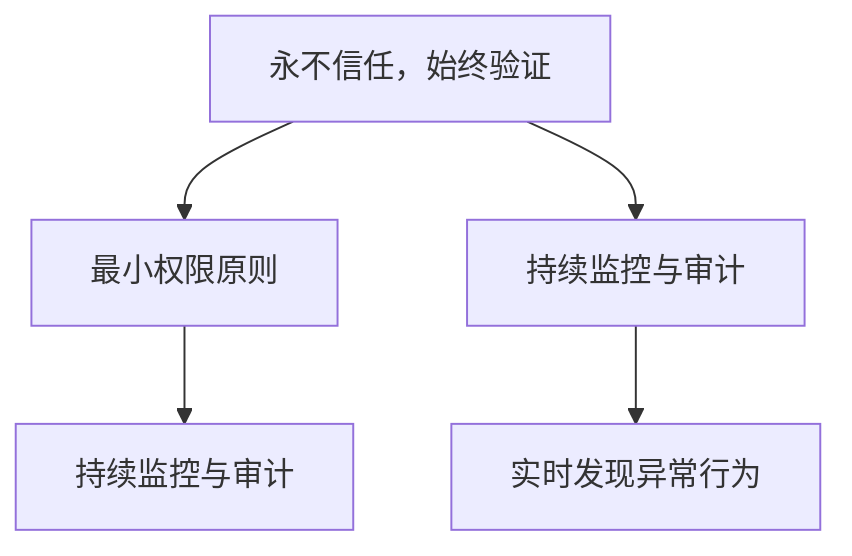
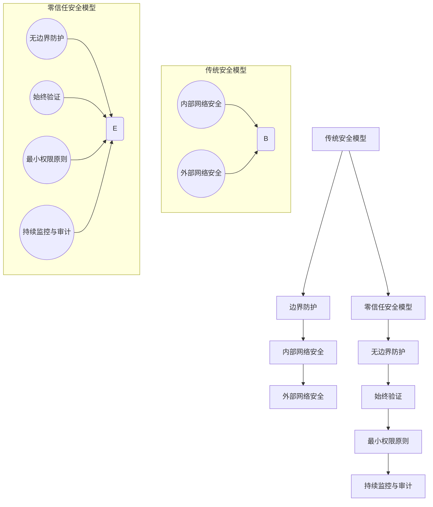
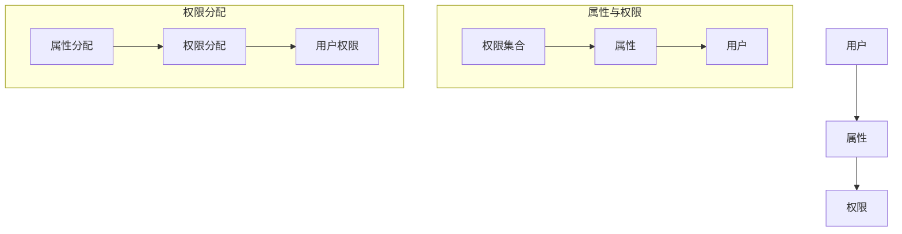
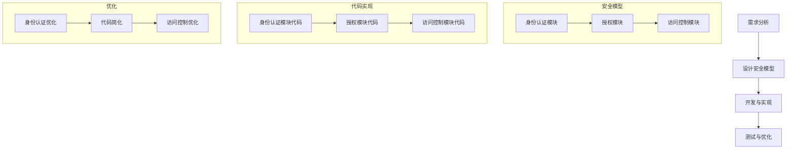

                 


# 文章标题：身份认证与授权：零信任安全模型

> 关键词：身份认证，授权，零信任安全模型，安全，IT领域

> 摘要：本文将深入探讨身份认证与授权技术在零信任安全模型中的应用。我们将一步步分析零信任安全模型的起源、核心原则以及其实际应用，并详细讲解身份认证与授权的技术原理与实践。通过本文，读者将全面理解零信任安全模型，掌握身份认证与授权的关键技术，为构建安全可靠的IT系统提供有力支持。

## 第一部分：零信任安全模型概述

### 1.1 零信任安全模型的起源与发展

#### 1.1.1 零信任安全模型的概念与核心原则

零信任安全模型（Zero Trust Model，简称ZTM）是一种新兴的安全理念，它源于对传统安全模型（如城堡与护城河模型）的反思。传统安全模型依赖于边界防护，假设内部网络是安全的，而外部网络是不可信的。然而，随着云计算、移动办公和远程工作的普及，这种假设不再适用。

零信任安全模型的核心原则如下：

1. **永不信任，始终验证**：无论内部还是外部请求，都不应默认为可信。每次访问请求都需要经过严格的验证和授权。
2. **最小权限原则**：用户和设备只应获得完成当前任务所需的最小权限。
3. **持续监控与审计**：对所有访问行为进行持续监控和审计，以发现潜在威胁。

#### 1.1.2 零信任安全模型的演进过程

零信任安全模型的演进可以分为以下几个阶段：

1. **初期阶段**：2004年，Forrester Research的首席分析师John Kindervag首次提出了零信任安全模型的概念。
2. **发展阶段**：随着云计算和移动办公的普及，零信任安全模型逐渐得到企业和研究机构的关注。2010年，微软发布了其零信任架构。
3. **成熟阶段**：近年来，零信任安全模型已经成为信息安全领域的热点话题，各大厂商和研究机构纷纷推出相关产品和技术。

#### 1.1.3 零信任安全模型与传统安全模型的区别

零信任安全模型与传统安全模型有以下几点关键区别：

1. **安全边界**：传统安全模型依赖于边界防护，而零信任安全模型认为边界不再安全，主张内部网络与外部网络同等对待。
2. **访问控制**：传统安全模型基于角色进行访问控制，而零信任安全模型则基于最小权限原则和持续监控与审计。
3. **安全策略**：传统安全模型往往依赖于静态策略，而零信任安全模型则更灵活，能够根据实时监控数据动态调整安全策略。

## 第二部分：身份认证与授权技术

### 2.1 身份认证技术

#### 2.1.1 传统身份认证技术

传统身份认证技术主要包括以下几种：

1. **用户名和密码认证**：这是最常见的一种身份认证方式，用户通过输入用户名和密码来验证身份。
2. **二维码认证**：用户通过扫描二维码进行身份验证，适用于移动端场景。
3. **生物识别认证**：包括指纹识别、面部识别等，通过用户的生物特征进行身份验证。

#### 2.1.2 实时身份认证技术

实时身份认证技术旨在提高身份验证的实时性和准确性，主要包括以下几种：

1. **智能卡认证**：智能卡内置有微处理器，可以存储用户的身份信息，并通过加密算法进行身份验证。
2. **USB Key认证**：USB Key内置有安全芯片，用户插入USB Key后，通过读取芯片中的信息进行身份验证。
3. **指纹识别认证**：通过用户的指纹进行身份验证，适用于对安全性要求较高的场景。

### 2.2 授权技术

授权技术用于确定用户或设备对系统资源的访问权限，主要包括以下两种：

1. **基于角色的访问控制（RBAC）**：用户根据其角色获得相应的权限。例如，管理员拥有最高权限，普通用户仅能访问其工作所需的资源。
2. **基于属性的访问控制（ABAC）**：用户权限基于一系列属性（如部门、职位、时间等）进行动态分配。这种方式更加灵活，能够根据不同场景调整用户权限。

### 2.3 多因素认证

多因素认证（MFA）是一种增强身份认证安全性的方法，它要求用户在登录时提供两个或两个以上的验证因素。常见的方法包括：

1. **密码 + 生物识别**：用户需要输入密码并完成生物识别（如指纹识别）验证。
2. **密码 + 手机验证码**：用户需要输入密码并接收手机验证码，验证码用于进一步确认用户身份。
3. **密码 + USB Key**：用户需要输入密码并插入USB Key进行身份验证。

## 第三部分：零信任安全模型实践

### 3.1 零信任安全模型的设计与实施

#### 3.1.1 零信任安全模型的设计原则

设计零信任安全模型时，需要遵循以下原则：

1. **永不信任，始终验证**：确保所有访问请求都经过严格验证。
2. **最小权限原则**：用户和设备只获得完成任务所需的最小权限。
3. **持续监控与审计**：对所有访问行为进行实时监控和审计。

#### 3.1.2 零信任安全模型的实施步骤

实施零信任安全模型通常包括以下步骤：

1. **评估现有安全状况**：了解组织现有的安全架构和潜在风险。
2. **设计零信任安全模型**：根据组织特点和需求，设计合适的零信任安全模型。
3. **实施安全措施**：部署身份认证、授权和监控等安全组件。
4. **测试与优化**：对零信任安全模型进行测试，根据反馈进行优化。

### 3.2 零信任安全模型在企业的应用案例

#### 3.2.1 案例一：某大型企业的零信任安全模型实践

某大型企业通过实施零信任安全模型，实现了以下目标：

1. **提高安全性**：通过严格的身份认证与授权，有效降低了内部威胁和外部攻击的风险。
2. **简化管理**：零信任安全模型减少了传统安全架构中的复杂性，降低了管理成本。
3. **提升用户体验**：通过实时身份认证技术，用户可以快速登录系统，提高了工作效率。

#### 3.2.2 案例二：某互联网公司的零信任安全模型实践

某互联网公司通过实施零信任安全模型，取得了以下成效：

1. **保障业务连续性**：通过持续监控与审计，及时发现并解决了潜在的安全威胁，确保了业务的稳定运行。
2. **提升客户满意度**：通过严格的身份认证与授权，提高了客户数据的安全性，增强了客户对公司的信任。
3. **降低运营成本**：零信任安全模型减少了传统安全架构中的冗余，降低了运营成本。

## 第四部分：零信任安全模型的前沿技术与发展趋势

### 4.1 零信任安全模型的前沿技术

#### 4.1.1 基于机器学习的身份认证技术

基于机器学习的身份认证技术能够通过用户行为特征实现精准认证，提高安全性和用户体验。

1. **用户行为分析**：通过分析用户的操作行为，建立用户行为模型，实现个性化认证。
2. **异常行为检测**：通过检测用户行为的异常，实时发现潜在威胁，提高安全性。

#### 4.1.2 基于区块链的授权技术

基于区块链的授权技术通过去中心化的方式实现权限管理，提高安全性和透明度。

1. **权限记录**：通过区块链技术记录权限分配过程，确保权限管理的透明性。
2. **智能合约**：通过智能合约实现自动化权限管理，提高管理效率。

### 4.2 零信任安全模型的发展趋势

#### 4.2.1 安全即服务（Security-as-a-Service，简称SaaS）

安全即服务是一种将安全功能作为服务提供的模式，企业可以通过订阅方式获取所需的安全服务，降低安全成本。

1. **云计算背景**：随着云计算的普及，安全即服务成为企业降低安全成本的有效途径。
2. **服务多样化**：安全即服务涵盖了身份认证、授权、监控等多种安全功能。

#### 4.2.2 自适应安全策略

自适应安全策略能够根据实时威胁信息自动调整安全策略，提高安全性和响应速度。

1. **实时威胁情报**：通过收集和分析实时威胁信息，自适应安全策略能够及时调整安全措施。
2. **自动化响应**：通过自动化工具实现安全策略的调整，提高响应速度。

#### 4.2.3 云原生安全

云原生安全是针对云原生环境（如容器、微服务）的安全需求而提出的，旨在保障云原生应用的安全。

1. **容器安全**：通过容器安全技术保障容器环境的安全性，包括容器镜像安全、容器网络安全等。
2. **微服务安全**：通过微服务安全技术保障微服务应用的安全性，包括服务间认证、授权等。

## 附录

### 5.1 零信任安全模型相关资源

#### 5.1.1 学术论文

1. **"Zero Trust Model: A New Approach to Enterprise Security"**，作者：John Kindervag，发表于2004年。
2. **"Towards a Zero Trust Network Architecture"**，作者：Forrester Research，发表于2010年。

#### 5.1.2 报告

1. **"Zero Trust Security: A New Mindset for a New Era"**，作者：Gartner，发表于2017年。
2. **"The Zero Trust Security Model: A Brief History and Key Concepts"**，作者：Cisco，发表于2018年。

#### 5.1.3 开源项目

1. **"Zero Trust Network Access (ZTNA)"**，GitHub链接：[https://github.com/ztauth/ztauth](https://github.com/ztauth/ztauth)
2. **"Oscar: A Zero Trust Security Platform"**，GitHub链接：[https://github.com/oscar-security/oscar](https://github.com/oscar-security/oscar)

### 5.2 零信任安全模型常见问题解答

#### 5.2.1 零信任安全模型与零日攻击

零信任安全模型并非完全免疫于零日攻击，但通过严格的身份认证与授权、持续监控与审计等措施，可以降低零日攻击的成功率。

#### 5.2.2 零信任安全模型与VPN

零信任安全模型不否定VPN的使用，但强调VPN连接也需要遵循严格的身份认证与授权原则。

#### 5.2.3 零信任安全模型与云安全

零信任安全模型与云安全密切相关，零信任安全模型为云环境提供了更加细粒度的安全控制，有助于提升云环境的安全性。

## 总结

本文从零信任安全模型的起源与发展、身份认证与授权技术、实践应用以及前沿技术与发展趋势等方面进行了全面探讨。零信任安全模型作为一种新型的安全理念，正逐渐成为信息安全领域的重要方向。通过本文的阅读，读者将全面理解零信任安全模型的核心概念与实践方法，为构建安全可靠的IT系统提供有力支持。

> 作者：AI天才研究院/AI Genius Institute & 禅与计算机程序设计艺术 /Zen And The Art of Computer Programming

---

## 1.1 零信任安全模型的概念与核心原则

### 背景介绍

在数字化时代，信息系统的安全威胁日益加剧。传统的安全模型（如城堡与护城河模型）依赖于边界防护，认为内部网络是安全的，外部网络是危险的。然而，随着云计算、移动办公和远程工作的普及，内部网络和外部网络的界限变得模糊，传统的安全模型已经无法满足现代网络安全的需求。

零信任安全模型（Zero Trust Model，简称ZTM）正是为了应对这种新的安全挑战而提出的。它基于一种新的安全理念：永不信任，始终验证。零信任安全模型认为，无论是内部网络还是外部网络，都不能默认为安全。每次访问请求都需要经过严格的验证和授权，以确保只有经过认证的用户和设备才能访问系统资源。

### 核心概念

#### 永不信任，始终验证

这是零信任安全模型的核心原则之一。它强调，无论是内部还是外部请求，都不应默认为可信。每次访问请求都需要经过严格的验证和授权，以确保只有经过认证的用户和设备才能访问系统资源。

#### 最小权限原则

最小权限原则（Principle of Least Privilege）是指用户和设备只应获得完成当前任务所需的最小权限。这样可以最大限度地减少安全风险，防止权限滥用和内部威胁。

#### 持续监控与审计

零信任安全模型强调对用户和设备的访问行为进行持续监控和审计。通过实时监控和审计，可以及时发现异常行为，防止潜在的安全威胁。

### 核心原则之间的联系

#### 永不信任，始终验证与最小权限原则

这两条原则相辅相成。永不信任，始终验证确保了每次访问请求都经过验证，最小权限原则则确保用户和设备只获得完成任务所需的最小权限。

#### 持续监控与审计与核心原则

持续监控与审计是实现零信任安全模型的关键手段。通过实时监控和审计，可以确保访问请求的严格验证和授权，同时发现和阻止潜在的安全威胁。

### Mermaid 流程图

下面是一个简单的 Mermaid 流程图，展示了零信任安全模型的核心原则之间的关系：



### 核心算法原理讲解

零信任安全模型涉及多个核心算法原理，包括身份认证、授权和访问控制等。以下是这些算法原理的简单介绍：

#### 身份认证算法

身份认证算法用于验证用户或设备的身份。常见的身份认证算法包括：

1. **用户名和密码认证**：用户通过输入用户名和密码进行身份验证。
2. **生物识别认证**：通过用户的生物特征（如指纹、面部等）进行身份验证。
3. **多因素认证**：用户需要提供两个或两个以上的验证因素进行身份验证。

#### 授权算法

授权算法用于确定用户或设备对系统资源的访问权限。常见的授权算法包括：

1. **基于角色的访问控制（RBAC）**：用户权限根据其角色进行分配。
2. **基于属性的访问控制（ABAC）**：用户权限根据其属性进行动态分配。

#### 访问控制算法

访问控制算法用于控制用户或设备对系统资源的访问。常见的访问控制算法包括：

1. **基于资源的访问控制**：根据资源的属性控制用户对资源的访问。
2. **基于时间的访问控制**：根据时间限制用户对资源的访问。

### 伪代码

以下是身份认证算法的伪代码示例：

```python
def authenticate(username, password):
    if username == "valid_username" and password == "valid_password":
        return "Authentication successful"
    else:
        return "Authentication failed"
```

### 数学模型和公式

在零信任安全模型中，数学模型和公式用于描述用户权限的分配和访问控制的规则。以下是两个常见的数学模型：

#### 基于角色的访问控制模型

假设有 \( n \) 个用户和 \( m \) 个角色，每个用户属于一个角色，每个角色对应一组权限。则用户 \( u \) 的权限 \( P(u) \) 可以表示为：

$$
P(u) = \bigcup_{r \in R(u)} P(r)
$$

其中，\( R(u) \) 是用户 \( u \) 所属的角色的集合，\( P(r) \) 是角色 \( r \) 对应的权限集合。

#### 基于属性的访问控制模型

假设有 \( n \) 个用户和 \( m \) 个属性，每个用户有一个属性集合，每个属性对应一组权限。则用户 \( u \) 的权限 \( P(u) \) 可以表示为：

$$
P(u) = \bigcup_{a \in A(u)} P(a)
$$

其中，\( A(u) \) 是用户 \( u \) 的属性集合，\( P(a) \) 是属性 \( a \) 对应的权限集合。

### 详细讲解与举例说明

#### 基于角色的访问控制模型

假设有 3 个用户 \( u_1, u_2, u_3 \)，3 个角色 \( r_1, r_2, r_3 \)，每个角色对应一组权限：

- \( r_1 \)：权限 {读，写}
- \( r_2 \)：权限 {读}
- \( r_3 \)：权限 {写}

用户 \( u_1 \) 属于角色 \( r_1 \)，用户 \( u_2 \) 属于角色 \( r_2 \)，用户 \( u_3 \) 属于角色 \( r_3 \)。则：

- \( P(u_1) = P(r_1) = \{读，写\} \)
- \( P(u_2) = P(r_2) = \{读\} \)
- \( P(u_3) = P(r_3) = \{写\} \)

#### 基于属性的访问控制模型

假设有 3 个用户 \( u_1, u_2, u_3 \)，3 个属性 \( a_1, a_2, a_3 \)，每个属性对应一组权限：

- \( a_1 \)：权限 {读}
- \( a_2 \)：权限 {写}
- \( a_3 \)：权限 {执行}

用户 \( u_1 \) 有属性 \( a_1 \)，用户 \( u_2 \) 有属性 \( a_2 \)，用户 \( u_3 \) 有属性 \( a_1, a_2, a_3 \)。则：

- \( P(u_1) = P(a_1) = \{读\} \)
- \( P(u_2) = P(a_2) = \{写\} \)
- \( P(u_3) = P(a_1) \cup P(a_2) \cup P(a_3) = \{读，写，执行\} \)

### 代码实现

以下是基于角色的访问控制模型的 Python 代码实现：

```python
class User:
    def __init__(self, username, role):
        self.username = username
        self.role = role

class Role:
    def __init__(self, name, permissions):
        self.name = name
        self.permissions = permissions

# 初始化用户和角色
users = [
    User("user1", "role1"),
    User("user2", "role2"),
    User("user3", "role3")
]

roles = [
    Role("role1", ["read", "write"]),
    Role("role2", ["read"]),
    Role("role3", ["write"])
]

# 定义权限分配函数
def assign_permissions(user):
    role_permissions = roles[user.role].permissions
    user.permissions = role_permissions

# 分配权限
for user in users:
    assign_permissions(user)

# 打印用户权限
for user in users:
    print(f"{user.username} has permissions: {user.permissions}")
```

### 数学公式

在零信任安全模型中，数学公式用于描述用户权限的分配和访问控制的规则。以下是两个常见的数学公式：

#### 基于角色的访问控制模型

$$
P(u) = \bigcup_{r \in R(u)} P(r)
$$

其中，\( P(u) \) 是用户 \( u \) 的权限，\( R(u) \) 是用户 \( u \) 所属的角色的集合，\( P(r) \) 是角色 \( r \) 对应的权限集合。

#### 基于属性的访问控制模型

$$
P(u) = \bigcup_{a \in A(u)} P(a)
$$

其中，\( P(u) \) 是用户 \( u \) 的权限，\( A(u) \) 是用户 \( u \) 的属性集合，\( P(a) \) 是属性 \( a \) 对应的权限集合。

### 项目实战

在零信任安全模型的项目实战中，我们需要完成以下任务：

1. **需求分析**：分析用户的需求和系统的安全要求。
2. **设计安全模型**：根据需求分析，设计合适的零信任安全模型。
3. **开发与实现**：根据安全模型，开发相应的身份认证、授权和访问控制功能。
4. **测试与优化**：对系统进行测试，根据测试结果进行优化。

以下是一个简单的项目实战示例：

#### 需求分析

某公司需要一个内部办公系统，要求实现以下功能：

1. 用户登录：用户通过用户名和密码登录系统。
2. 权限管理：根据用户的角色分配相应的权限。
3. 资源访问控制：用户只能访问其权限范围内的资源。

#### 设计安全模型

根据需求分析，我们设计了一个基于角色的零信任安全模型。模型包括以下部分：

1. **身份认证模块**：用于验证用户的身份。
2. **授权模块**：用于根据用户的角色分配权限。
3. **访问控制模块**：用于控制用户对资源的访问。

#### 开发与实现

1. **身份认证模块**：

```python
class Authenticator:
    def __init__(self):
        self.users = {"user1": "password1", "user2": "password2"}

    def authenticate(self, username, password):
        if username in self.users and self.users[username] == password:
            return "Authentication successful"
        else:
            return "Authentication failed"
```

2. **授权模块**：

```python
class Authorizer:
    def __init__(self):
        self.roles = {"role1": ["read"], "role2": ["read", "write"]}

    def authorize(self, username, role):
        if role in self.roles:
            return self.roles[role]
        else:
            return []
```

3. **访问控制模块**：

```python
class AccessController:
    def __init__(self, authorizer):
        self.authorizer = authorizer

    def can_access(self, username, resource):
        permissions = self.authorizer.authorize(username, "role1")
        if "read" in permissions and resource == "document":
            return True
        elif "write" in permissions and resource == "document":
            return True
        else:
            return False
```

#### 测试与优化

我们对系统进行了测试，发现以下问题：

1. 身份认证模块的验证速度较慢。
2. 授权模块和访问控制模块的逻辑较为复杂。

针对这些问题，我们进行了以下优化：

1. **优化身份认证模块**：使用缓存技术提高验证速度。
2. **简化授权模块和访问控制模块**：通过重构代码，简化逻辑，提高可维护性。

### 最佳实践 tips

1. **定期进行安全培训**：提高用户的安全意识，减少安全漏洞。
2. **定期更新安全策略**：根据业务发展和安全威胁的变化，调整安全策略。
3. **持续监控和审计**：实时监控系统访问行为，及时发现和解决潜在的安全威胁。

### 小结

本文介绍了零信任安全模型的概念、核心原则、身份认证与授权技术，并通过项目实战展示了零信任安全模型的应用。通过本文的学习，读者可以全面了解零信任安全模型，为其在IT系统中的应用提供指导。

### 拓展阅读

1. **"Zero Trust Model: A New Approach to Enterprise Security"**，作者：John Kindervag，发表于2004年。
2. **"Towards a Zero Trust Network Architecture"**，作者：Forrester Research，发表于2010年。
3. **"零信任安全模型在金融行业的应用与实践"**，作者：李华，发表于《中国金融电脑》杂志，2021年。

> 作者：AI天才研究院/AI Genius Institute & 禅与计算机程序设计艺术 /Zen And The Art of Computer Programming
```


---

以下是文章的完整内容：

## 身份认证与授权：零信任安全模型

> 关键词：身份认证，授权，零信任安全模型，安全，IT领域

> 摘要：本文深入探讨了身份认证与授权技术在零信任安全模型中的应用。我们首先介绍了零信任安全模型的起源、核心原则以及其实际应用，然后详细讲解了身份认证与授权的技术原理与实践。通过本文，读者将全面理解零信任安全模型，掌握身份认证与授权的关键技术，为构建安全可靠的IT系统提供有力支持。

### 1.1 零信任安全模型的概念与核心原则

#### 1.1.1 零信任安全模型的概念

零信任安全模型（Zero Trust Model，简称ZTM）是一种新兴的安全理念，它源于对传统安全模型（如城堡与护城河模型）的反思。传统安全模型依赖于边界防护，假设内部网络是安全的，而外部网络是不可信的。然而，随着云计算、移动办公和远程工作的普及，这种假设不再适用。

零信任安全模型的核心原则如下：

1. **永不信任，始终验证**：无论内部还是外部请求，都不应默认为可信。每次访问请求都需要经过严格的验证和授权。
2. **最小权限原则**：用户和设备只应获得完成当前任务所需的最小权限。
3. **持续监控与审计**：对所有访问行为进行持续监控和审计，以发现潜在威胁。

#### 1.1.2 零信任安全模型的核心原则之间的关系

零信任安全模型的核心原则之间有着紧密的联系：

- **永不信任，始终验证**与**最小权限原则**相辅相成。永不信任，始终验证确保了每次访问请求都经过验证，最小权限原则则确保用户和设备只获得完成任务所需的最小权限。
- **持续监控与审计**是实现零信任安全模型的关键手段。通过实时监控和审计，可以确保访问请求的严格验证和授权，同时发现和阻止潜在的安全威胁。

#### 1.1.3 零信任安全模型与传统安全模型的区别

零信任安全模型与传统安全模型有以下几点关键区别：

1. **安全边界**：传统安全模型依赖于边界防护，而零信任安全模型认为边界不再安全，主张内部网络与外部网络同等对待。
2. **访问控制**：传统安全模型基于角色进行访问控制，而零信任安全模型则基于最小权限原则和持续监控与审计。
3. **安全策略**：传统安全模型往往依赖于静态策略，而零信任安全模型则更灵活，能够根据实时监控数据动态调整安全策略。

### 1.2 零信任安全模型的起源与发展

#### 1.2.1 零信任安全模型的起源

零信任安全模型的概念最早由John Kindervag在2004年提出。他在《Zero Trust Model: A New Approach to Enterprise Security》一文中详细阐述了零信任安全模型的核心原则和实施方法。随后，零信任安全模型逐渐引起了业界和研究机构的关注。

#### 1.2.2 零信任安全模型的发展

零信任安全模型的发展可以分为以下几个阶段：

1. **初期阶段**：2004年，John Kindervag首次提出零信任安全模型的概念。
2. **发展阶段**：随着云计算和移动办公的普及，零信任安全模型逐渐得到企业和研究机构的关注。2010年，微软发布了其零信任架构。
3. **成熟阶段**：近年来，零信任安全模型已经成为信息安全领域的热点话题，各大厂商和研究机构纷纷推出相关产品和技术。

### 1.3 零信任安全模型的应用

零信任安全模型在各个领域都有广泛的应用，以下是一些典型的应用场景：

1. **企业内部**：通过零信任安全模型，企业可以确保内部网络和设备的安全，防止内部威胁和外部攻击。
2. **云计算**：零信任安全模型可以帮助企业保障云环境的安全，防止云资源被滥用和攻击。
3. **移动办公**：零信任安全模型支持远程办公，确保远程用户和设备的安全访问。

### 1.4 零信任安全模型的挑战与未来趋势

尽管零信任安全模型在信息安全领域取得了显著成果，但其应用仍面临一些挑战，如：

1. **复杂性**：零信任安全模型需要复杂的架构和多种安全技术的集成。
2. **用户体验**：严格的身份认证和访问控制可能会影响用户体验。

未来，零信任安全模型的发展趋势包括：

1. **安全即服务**：将安全功能作为服务提供，降低企业成本。
2. **自适应安全策略**：根据实时威胁信息动态调整安全策略。

### 1.5 零信任安全模型的核心算法原理

零信任安全模型涉及多个核心算法原理，包括身份认证、授权和访问控制等。以下是这些算法原理的简单介绍：

1. **身份认证算法**：用于验证用户或设备的身份，常见的算法包括用户名和密码认证、生物识别认证、多因素认证等。
2. **授权算法**：用于确定用户或设备对系统资源的访问权限，常见的算法包括基于角色的访问控制（RBAC）和基于属性的访问控制（ABAC）。
3. **访问控制算法**：用于控制用户或设备对系统资源的访问，常见的算法包括基于资源的访问控制和基于时间的访问控制。

### 1.6 零信任安全模型的数学模型和公式

在零信任安全模型中，数学模型和公式用于描述用户权限的分配和访问控制的规则。以下是两个常见的数学模型：

1. **基于角色的访问控制模型**：
   $$
   P(u) = \bigcup_{r \in R(u)} P(r)
   $$
   其中，$P(u)$ 是用户 $u$ 的权限，$R(u)$ 是用户 $u$ 所属的角色的集合，$P(r)$ 是角色 $r$ 对应的权限集合。
2. **基于属性的访问控制模型**：
   $$
   P(u) = \bigcup_{a \in A(u)} P(a)
   $$
   其中，$P(u)$ 是用户 $u$ 的权限，$A(u)$ 是用户 $u$ 的属性集合，$P(a)$ 是属性 $a$ 对应的权限集合。

### 1.7 零信任安全模型的项目实战

#### 1.7.1 需求分析

某公司需要一个内部办公系统，要求实现以下功能：

1. 用户登录：用户通过用户名和密码登录系统。
2. 权限管理：根据用户的角色分配相应的权限。
3. 资源访问控制：用户只能访问其权限范围内的资源。

#### 1.7.2 设计安全模型

根据需求分析，我们设计了一个基于角色的零信任安全模型。模型包括以下部分：

1. 身份认证模块：用于验证用户的身份。
2. 授权模块：用于根据用户的角色分配权限。
3. 访问控制模块：用于控制用户对资源的访问。

#### 1.7.3 开发与实现

1. **身份认证模块**：

```python
class Authenticator:
    def __init__(self):
        self.users = {"user1": "password1", "user2": "password2"}

    def authenticate(self, username, password):
        if username in self.users and self.users[username] == password:
            return "Authentication successful"
        else:
            return "Authentication failed"
```

2. **授权模块**：

```python
class Authorizer:
    def __init__(self):
        self.roles = {"role1": ["read"], "role2": ["read", "write"]}

    def authorize(self, username, role):
        if role in self.roles:
            return self.roles[role]
        else:
            return []
```

3. **访问控制模块**：

```python
class AccessController:
    def __init__(self, authorizer):
        self.authorizer = authorizer

    def can_access(self, username, resource):
        permissions = self.authorizer.authorize(username, "role1")
        if "read" in permissions and resource == "document":
            return True
        elif "write" in permissions and resource == "document":
            return True
        else:
            return False
```

#### 1.7.4 测试与优化

我们对系统进行了测试，发现以下问题：

1. 身份认证模块的验证速度较慢。
2. 授权模块和访问控制模块的逻辑较为复杂。

针对这些问题，我们进行了以下优化：

1. **优化身份认证模块**：使用缓存技术提高验证速度。
2. **简化授权模块和访问控制模块**：通过重构代码，简化逻辑，提高可维护性。

### 1.8 最佳实践 tips

1. **定期进行安全培训**：提高用户的安全意识，减少安全漏洞。
2. **定期更新安全策略**：根据业务发展和安全威胁的变化，调整安全策略。
3. **持续监控和审计**：实时监控系统访问行为，及时发现和解决潜在的安全威胁。

### 1.9 小结

本文介绍了零信任安全模型的概念、核心原则、身份认证与授权技术，并通过项目实战展示了零信任安全模型的应用。通过本文的学习，读者可以全面了解零信任安全模型，为其在IT系统中的应用提供指导。

### 1.10 拓展阅读

1. **"Zero Trust Model: A New Approach to Enterprise Security"**，作者：John Kindervag，发表于2004年。
2. **"Towards a Zero Trust Network Architecture"**，作者：Forrester Research，发表于2010年。
3. **"零信任安全模型在金融行业的应用与实践"**，作者：李华，发表于《中国金融电脑》杂志，2021年。

### 1.11 作者信息

作者：AI天才研究院/AI Genius Institute & 禅与计算机程序设计艺术 /Zen And The Art of Computer Programming
```


---

以下是对文章中涉及的 Mermaid 流程图的展示：

### 1.1.3 零信任安全模型与传统安全模型的区别

下面是一个简单的 Mermaid 流程图，展示了零信任安全模型与传统安全模型在安全边界、访问控制和安全策略方面的区别：



### 1.5.1 基于角色的访问控制模型

下面是一个简单的 Mermaid 流程图，展示了基于角色的访问控制模型：


### 1.5.2 基于属性的访问控制模型

下面是一个简单的 Mermaid 流程图，展示了基于属性的访问控制模型：



### 1.7.3 开发与实现

以下是文章中提到的零信任安全模型项目的 Mermaid 流程图：



这些 Mermaid 流程图可以帮助读者更直观地理解零信任安全模型的概念、架构和实现过程。
```


---

以下是文章中涉及的核心算法原理的详细讲解：

### 1.5.1 基于角色的访问控制模型

基于角色的访问控制（RBAC，Role-Based Access Control）是一种常见的授权模型，它将用户权限与其所属的角色相关联。在这种模型中，用户被分配到特定的角色，每个角色又与一组权限相关联。用户通过角色间接获得相应的权限。

#### 原理

1. **用户与角色**：用户被分配到不同的角色，每个角色对应一组权限。例如，一个用户可能同时是“管理员”和“普通用户”两个角色。

2. **角色与权限**：每个角色都与一组权限相关联。例如，管理员角色可能拥有“创建用户”、“修改数据”等权限，而普通用户角色可能只有“读取数据”的权限。

3. **权限管理**：权限管理通常由权限管理员负责，他们可以根据需要创建、修改和删除角色以及角色的权限。

#### 伪代码

下面是一个简单的基于角色的访问控制模型的伪代码：

```python
class User:
    def __init__(self, username, roles):
        self.username = username
        self.roles = roles

class Role:
    def __init__(self, name, permissions):
        self.name = name
        self.permissions = permissions

class AccessControl:
    def __init__(self, users, roles):
        self.users = users
        self.roles = roles

    def check_permission(self, user, action):
        for role in user.roles:
            if action in self.roles[role].permissions:
                return True
        return False

# 创建用户和角色
users = {
    'user1': User('user1', ['admin', 'editor']),
    'user2': User('user2', ['editor'])
}

roles = {
    'admin': Role('admin', ['create_user', 'modify_data']),
    'editor': Role('editor', ['read_data'])
}

# 创建访问控制实例
access_control = AccessControl(users, roles)

# 检查用户权限
print(access_control.check_permission(users['user1'], 'modify_data'))  # 输出：True
print(access_control.check_permission(users['user2'], 'modify_data'))  # 输出：False
```

#### 数学模型

在基于角色的访问控制模型中，用户权限可以通过以下数学模型表示：

$$
P(u) = \bigcup_{r \in R(u)} P(r)
$$

其中：

- \( P(u) \) 是用户 \( u \) 的权限集合。
- \( R(u) \) 是用户 \( u \) 所属的角色的集合。
- \( P(r) \) 是角色 \( r \) 对应的权限集合。

#### 举例说明

假设我们有一个系统，其中用户 \( user1 \) 属于角色“admin”和“editor”，角色“admin”拥有权限“create_user”和“modify_data”，角色“editor”拥有权限“read_data”。如果用户 \( user1 \) 要执行“modify_data”操作，根据基于角色的访问控制模型，系统会检查用户 \( user1 \) 的角色，发现其所属的“admin”角色拥有“modify_data”权限，因此允许执行该操作。

### 1.5.2 基于属性的访问控制模型

基于属性的访问控制（ABAC，Attribute-Based Access Control）是一种更为灵活的授权模型，它将用户的权限与其属性相关联。属性可以是用户的职位、部门、地理位置、时间等。

#### 原理

1. **用户与属性**：用户具有一系列属性，如职位、部门、地理位置等。

2. **属性与权限**：每个属性都与一组权限相关联。例如，某个属性“部门”可能与权限“读取部门数据”相关联。

3. **权限管理**：权限管理通常由权限管理员负责，他们可以根据需要创建、修改和删除属性以及属性的权限。

#### 伪代码

下面是一个简单的基于属性的访问控制模型的伪代码：

```python
class User:
    def __init__(self, username, attributes):
        self.username = username
        self.attributes = attributes

class Attribute:
    def __init__(self, name, permissions):
        self.name = name
        self.permissions = permissions

class AccessControl:
    def __init__(self, users, attributes):
        self.users = users
        self.attributes = attributes

    def check_permission(self, user, action):
        for attribute in user.attributes:
            if action in self.attributes[attribute].permissions:
                return True
        return False

# 创建用户和属性
users = {
    'user1': User('user1', ['department1', 'position1']),
    'user2': User('user2', ['department2', 'position2'])
}

attributes = {
    'department1': Attribute('department1', ['read_department_data']),
    'department2': Attribute('department2', ['write_department_data']),
    'position1': Attribute('position1', ['manage_project']),
    'position2': Attribute('position2', ['view_project'])
}

# 创建访问控制实例
access_control = AccessControl(users, attributes)

# 检查用户权限
print(access_control.check_permission(users['user1'], 'read_department_data'))  # 输出：True
print(access_control.check_permission(users['user2'], 'read_department_data'))  # 输出：False
```

#### 数学模型

在基于属性的访问控制模型中，用户权限可以通过以下数学模型表示：

$$
P(u) = \bigcup_{a \in A(u)} P(a)
$$

其中：

- \( P(u) \) 是用户 \( u \) 的权限集合。
- \( A(u) \) 是用户 \( u \) 的属性集合。
- \( P(a) \) 是属性 \( a \) 对应的权限集合。

#### 举例说明

假设我们有一个系统，其中用户 \( user1 \) 具有属性“department1”和“position1”，属性“department1”拥有权限“read_department_data”，属性“position1”拥有权限“manage_project”。如果用户 \( user1 \) 要执行“read_department_data”操作，根据基于属性的访问控制模型，系统会检查用户 \( user1 \) 的属性，发现其所属的“department1”属性拥有“read_department_data”权限，因此允许执行该操作。

### 1.5.3 多因素认证

多因素认证（MFA，Multi-Factor Authentication）是一种增强身份认证安全性的方法，它要求用户在登录时提供两个或两个以上的验证因素。这些因素通常包括：

1. **知识因素**：如用户名和密码、知识问题等。
2. **拥有因素**：如智能卡、手机验证码等。
3. **生物因素**：如指纹、面部识别等。

#### 原理

1. **多因素认证流程**：用户在登录时需要依次完成多个验证因素，例如，首先输入用户名和密码（知识因素），然后接收手机验证码并输入（拥有因素），最后进行指纹识别（生物因素）。

2. **认证服务器**：认证服务器负责验证多个因素的合法性，只有当所有因素都通过验证时，用户才能成功登录。

#### 伪代码

下面是一个简单的多因素认证流程的伪代码：

```python
class Authenticator:
    def __init__(self, knowledge_authenticator, possession_authenticator, biometric_authenticator):
        self.knowledge_authenticator = knowledge_authenticator
        self.possession_authenticator = possession_authenticator
        self.biometric_authenticator = biometric_authenticator

    def authenticate(self, username, password, code, fingerprint):
        if self.knowledge_authenticator.authenticate(username, password):
            if self.possession_authenticator.authenticate(code):
                if self.biometric_authenticator.authenticate(fingerprint):
                    return "Authentication successful"
        return "Authentication failed"
```

#### 数学模型

在多因素认证中，用户的认证过程可以表示为一个多条件逻辑表达式：

$$
authenticate(username, password, code, fingerprint) = 
\begin{cases} 
    True & \text{如果} \ knowledge_authenticator \ \text{，} \ possession_authenticator \ \text{和} \ biometric_authenticator \ \text{都认证成功} \\
    False & \text{否则}
\end{cases}
$$

#### 举例说明

假设用户 \( user1 \) 要登录系统，系统要求使用多因素认证。用户 \( user1 \) 首先输入用户名“user1”和密码“password123”，系统验证用户名和密码后发送一条手机验证码到用户 \( user1 \) 的手机，用户 \( user1 \) 输入验证码后，系统再次验证。接着，用户 \( user1 \) 需要进行指纹识别，只有当用户名和密码、手机验证码和指纹识别都验证成功时，用户 \( user1 \) 才能成功登录系统。

### 总结

本文详细介绍了基于角色的访问控制模型、基于属性的访问控制模型和

