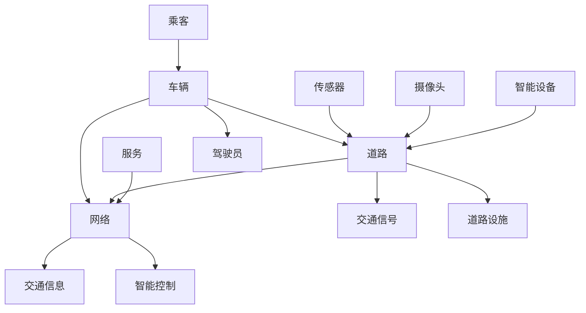

                 

# 车联网技术架构与实现

## 前言

### 车联网技术概述

车联网（Internet of Vehicles，IoV）是指通过互联网将车辆及其周边设备互联互通，实现人、车、路、网络之间的信息交换与协同控制。随着物联网、5G、人工智能等技术的不断发展，车联网正逐步从概念走向实际应用，成为智能交通和智慧城市的重要组成部分。

车联网技术的发展背景主要源于以下几个方面：

1. **交通需求增长**：随着汽车保有量的持续增长，交通安全、效率问题日益突出，车联网技术能够提供智能化的交通管理和车辆调度，缓解交通拥堵。

2. **物联网技术进步**：物联网技术的快速发展，使得车辆与其他智能设备之间的互联互通成为可能，为车联网的实现提供了技术基础。

3. **5G通信技术**：5G技术具有高速率、低延迟的特点，为车联网的数据传输提供了强有力的支持，有助于实现车辆间的实时通信和协同控制。

4. **人工智能应用**：人工智能技术的发展，使得车辆具备了一定的自主决策能力，为自动驾驶和智能交通管理提供了技术支持。

车联网技术发展趋势主要体现在以下几个方面：

1. **自动驾驶技术的普及**：自动驾驶技术是车联网发展的重要方向，随着技术的成熟，自动驾驶车辆将逐步走入实际应用。

2. **车联网安全的重要性**：车联网系统面临着多种安全威胁，如数据泄露、网络攻击等，因此车联网安全成为发展的关键。

3. **智能交通管理**：通过车联网技术实现智能交通管理，提高交通效率，减少交通事故，提升城市交通服务水平。

4. **车联网与智慧城市的融合**：车联网技术将与智慧城市中的其他系统，如智能安防、智能环保等，实现数据共享和协同工作。

## 第一部分：车联网技术基础

### 第1章：车联网基本概念

#### 核心概念与联系

车联网的核心概念包括车辆、道路、网络和服务。以下是这些概念之间的关系架构：

#### 技术标准与协议

1. **5G**：5G通信技术是车联网实现高速、低延迟通信的关键。5G网络具有更高的数据传输速率，更低的延迟和更大的网络容量，能够满足车联网中车辆之间及车辆与基础设施之间的通信需求。

2. **V2X**：V2X（Vehicle-to-Everything）是指车辆与其他设备、车辆之间通过无线通信实现的信息交换。V2X包括V2V（Vehicle-to-Vehicle，车对车）、V2I（Vehicle-to-Infrastructure，车对基础设施）和V2P（Vehicle-to-Pedestrian，车对行人）等类型。

3. **标准化过程**：车联网技术的发展离不开标准化工作。国际标准化组织（ISO）和国际电工委员会（IEC）等机构在车联网标准制定中发挥着重要作用。标准化的内容包括通信协议、数据格式、安全机制等方面。

### 第2章：车联网通信技术

#### 核心算法原理讲解

1. **无线通信**：车联网中的无线通信主要依赖于无线传输技术，如WiFi、蓝牙、蜂窝通信等。无线通信的核心算法包括调制解调、信道编码、信号检测等。

2. **数据传输**：车联网中的数据传输包括车辆与基础设施之间的通信和车辆之间的通信。数据传输的核心算法包括数据压缩、传输协议设计、拥塞控制等。

#### 案例分析

1. **车对车通信**：车对车通信是实现自动驾驶和智能交通管理的重要手段。通过车对车通信，车辆可以实时获取周边交通信息，实现协同控制。例如，车辆可以交换路况信息，调整行驶速度，避免碰撞。

2. **车对基础设施通信**：车对基础设施通信使车辆能够获取道路信息、交通信号等信息，辅助驾驶决策。例如，车辆可以通过通信网络获取实时路况信息，调整行驶路线，避免拥堵。

### 第3章：车联网安全

#### 安全机制与方案

1. **加密技术**：加密技术是保障车联网数据安全的重要手段。通过加密技术，车联网数据在传输过程中能够防止被窃听和篡改。

2. **身份认证**：身份认证是确保通信双方合法性的重要措施。通过身份认证，车联网系统能够防止未经授权的设备接入网络。

3. **防火墙**：防火墙是一种网络安全设备，能够过滤不安全的网络流量，保护车联网系统不受外部攻击。

#### 安全挑战与应对策略

1. **安全威胁**：车联网系统面临的安全威胁包括数据泄露、网络攻击、设备失控等。

2. **应对策略**：针对安全威胁，车联网系统可以采取以下应对策略：
   - **数据加密**：对传输数据进行加密，防止数据泄露。
   - **身份认证**：严格身份认证机制，确保通信双方合法性。
   - **安全监测**：实时监测车联网系统，发现异常情况及时应对。
   - **安全更新**：定期更新系统软件，修复安全漏洞。

## 第二部分：车联网应用架构

### 第4章：车联网平台架构

#### 平台架构设计原则

1. **可扩展性**：车联网平台需要具备良好的可扩展性，能够支持新功能的添加和新设备的接入。

2. **可靠性**：车联网平台需要具备高可靠性，确保系统的稳定运行。

3. **可维护性**：车联网平台需要具备良好的可维护性，便于故障排查和系统升级。

#### 平台功能模块

1. **数据收集**：车联网平台需要收集车辆传感器数据、交通信息等，为后续数据处理和分析提供基础。

2. **数据处理**：车联网平台需要对收集到的数据进行处理，包括数据清洗、数据压缩、数据融合等。

3. **服务提供**：车联网平台需要为用户提供各种服务，如导航、路况信息、自动驾驶等。

### 第5章：车辆网络架构

#### 车载通信网络

1. **内部通信**：车载通信网络负责车辆内部各组件之间的通信，如传感器、控制器等。

2. **外部通信**：车载通信网络负责车辆与外部设备之间的通信，如路侧单元、基站等。

#### 车际通信网络

1. **网络架构**：车际通信网络采用分布式架构，车辆之间通过无线通信直接互联，实现信息共享。

2. **技术特点**：车际通信网络具有低延迟、高可靠性的特点，能够满足车辆实时通信的需求。

### 第6章：云平台与边缘计算

#### 云平台架构与实现

1. **云平台架构**：云平台架构包括数据存储、数据处理、应用服务等功能模块。

2. **云平台实现**：云平台实现需要考虑数据传输、负载均衡、数据安全等问题。

#### 边缘计算技术

1. **边缘计算概念**：边缘计算是将计算能力从云端下沉到网络边缘，以减少数据传输延迟，提高系统响应速度。

2. **边缘计算优势**：边缘计算具有低延迟、高带宽、低能耗的优势，适用于实时性要求高的应用场景。

## 第三部分：车联网关键技术

### 第7章：车辆感知与定位技术

#### 传感器技术

1. **传感器类型**：车联网中常用的传感器包括雷达、激光雷达、摄像头、GPS等。

2. **传感器应用**：传感器用于车辆环境感知，获取道路信息、车辆状态等信息。

#### 定位技术

1. **定位技术类型**：车联网中常用的定位技术包括GPS、北斗、惯性导航等。

2. **定位技术应用**：定位技术用于车辆的精确定位，支持导航、自动驾驶等功能。

### 第8章：自动驾驶技术

#### 自动驾驶原理

1. **自动驾驶技术框架**：自动驾驶技术包括感知、规划、控制三个核心模块。

2. **感知技术**：自动驾驶车辆通过传感器获取环境信息，包括道路、车辆、行人等。

3. **规划技术**：自动驾驶车辆根据感知信息制定行驶路径和决策策略。

4. **控制技术**：自动驾驶车辆根据规划结果控制车辆执行相应的操作。

#### 自动驾驶系统

1. **自动驾驶系统组件**：自动驾驶系统包括感知模块、决策模块、执行模块等。

2. **自动驾驶系统功能**：自动驾驶系统能够实现车辆的自主驾驶，包括启动、行驶、停车等操作。

### 第9章：车联网服务与应用

#### 服务类型与应用场景

1. **服务类型**：车联网服务包括导航、路况信息、自动驾驶、车辆健康管理等。

2. **应用场景**：车联网服务广泛应用于交通管理、物流、共享出行等领域。

#### 案例分析

1. **交通管理**：通过车联网技术实现智能交通管理，提高交通效率，减少交通事故。

2. **物流**：车联网技术用于物流管理，实现车辆实时跟踪、货物状态监控等。

3. **共享出行**：车联网技术支持共享出行服务，如共享单车、共享汽车等。

## 第四部分：车联网未来发展

### 第10章：车联网发展趋势

#### 未来发展方向

1. **自动驾驶技术的普及**：随着技术的成熟，自动驾驶车辆将逐步走入实际应用，改变人们的出行方式。

2. **车联网安全的重视**：随着车联网系统的广泛应用，车联网安全将成为发展的关键，需要不断提升安全防护能力。

3. **智能交通管理**：车联网技术将进一步提高交通管理智能化水平，实现更高效、更安全的交通系统。

4. **智慧城市融合**：车联网技术将与智慧城市中的其他系统实现深度融合，提升城市智能化水平。

#### 产业生态

1. **产业链发展**：车联网产业链包括硬件设备、软件平台、通信网络、应用服务等环节，产业链各环节协同发展。

2. **企业竞争格局**：车联网领域吸引了大量企业参与，形成了竞争格局，企业需要不断创新以保持竞争力。

### 第11章：车联网标准化与法规

#### 标准化工作

1. **国际标准**：国际标准化组织（ISO）和国际电工委员会（IEC）等机构在车联网标准制定中发挥着重要作用。

2. **国内标准**：国内标准工作由多个部门共同推进，包括工业和信息化部、交通运输部等。

#### 法规与政策

1. **法规体系**：车联网相关法规体系包括交通安全法规、通信法规、信息安全法规等。

2. **政策支持**：政府出台了一系列政策支持车联网发展，包括资金支持、项目扶持等。

### 作者

**作者：AI天才研究院/AI Genius Institute & 禅与计算机程序设计艺术 /Zen And The Art of Computer Programming**

---

本文内容涉及车联网技术的基础概念、通信技术、安全机制、应用架构、关键技术以及未来发展。通过对这些内容的详细分析，本文旨在为读者提供一个全面的车联网技术架构与实现的理解框架，为后续的研究和应用提供指导。希望本文能够对车联网技术的发展起到一定的推动作用。在未来的发展中，车联网技术将继续深化，为智能交通和智慧城市带来更多可能性。**

