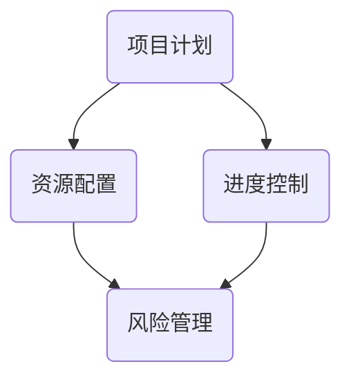
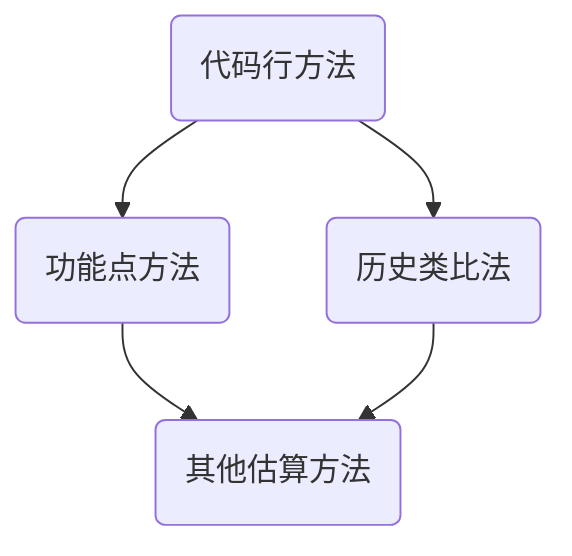
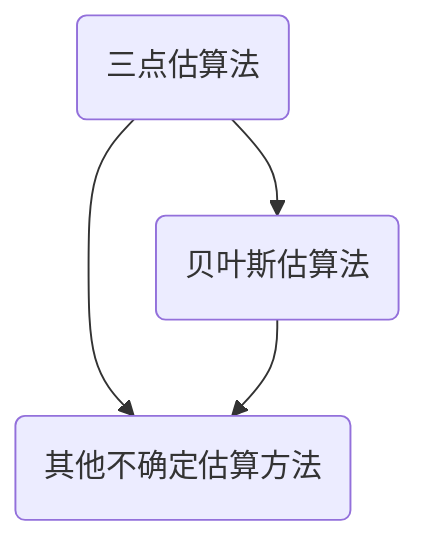

                 


### 背景介绍

在现代软件工程中，软件估算是一项至关重要的任务。无论是项目计划、资源配置，还是风险管理，精确的软件估算都能为项目的成功奠定坚实的基础。然而，软件估算并非易事，它涉及多个因素，包括技术难度、开发团队的能力、项目需求的不确定性等。错误的估算可能会导致项目延期、预算超支，甚至项目失败。

估算不准确的原因有很多，例如需求变化频繁、估算方法不当、团队经验不足等。为了提高估算的准确性，我们需要深入理解软件估算的核心概念、算法原理，并掌握有效的估算工具和技巧。此外，项目管理中的估算应用也至关重要，它直接影响到项目的进度和资源的合理分配。

本文旨在探讨软件估算的各个方面，从核心概念和算法原理，到数学模型和估算工具，再到项目管理中的应用，以及常见问题与解决方案。通过本文的阅读，读者将能够系统地了解软件估算的技巧，提高项目管理中的估算准确性，从而为项目的成功提供有力保障。

### 核心概念与联系

在深入了解软件估算之前，我们需要明确一些核心概念，并探讨它们之间的联系。以下是几个关键概念及其关系架构：

#### 1. 软件估算与项目管理

软件估算是项目管理中的一个重要组成部分。它不仅是项目计划的基础，也是资源配置和进度控制的关键依据。具体而言，软件估算与项目管理的联系体现在以下几个方面：

1. **项目计划编制**：软件估算为项目计划提供了时间预估，帮助项目团队制定合理的计划。
2. **资源配置**：通过估算，项目经理可以更准确地分配人力资源和物资资源，确保项目顺利进行。
3. **项目风险管理**：软件估算是评估项目风险的重要工具，有助于识别潜在的风险点，并制定相应的风险应对策略。

**Mermaid 流程图：**



#### 2. 软件估算方法

软件估算的方法有很多，常见的包括代码行方法、功能点方法、历史类比法等。每种方法都有其适用的场景和局限性。以下是这些方法的简要介绍及其关系架构：

1. **代码行方法**：基于代码行数的估算方法，适用于小型项目或开发初期。
2. **功能点方法**：以软件功能点为估算单位，适用于需求明确的项目。
3. **历史类比法**：通过对比历史项目进行估算，适用于项目需求不明确或历史数据丰富的项目。

**Mermaid 流程图：**



#### 3. 不确定性估算

在软件估算中，不确定性是一个不可忽视的因素。为了应对不确定性，我们可以采用三点估算法、贝叶斯估算法等不确定估算方法。这些方法可以帮助我们更准确地预测项目进度和成本。

**Mermaid 流程图：**



通过上述核心概念的介绍和关系架构的展示，我们可以更好地理解软件估算的各个方面，为后续的深入探讨奠定基础。

### 核心算法原理讲解

在软件估算中，核心算法原理的讲解至关重要。这些算法不仅为我们提供了估算的数学基础，还帮助我们理解和应用不同的估算方法。以下我们将详细介绍几种常见的估算算法，包括代码行方法、功能点方法、历史类比法、三点估算法、贝叶斯估算法和模拟估算法。

#### 1. 代码行方法

代码行方法是估算软件项目工作量的一种简单而直观的方法。其核心思想是通过对代码行的统计来估算项目所需的工作量。具体步骤如下：

- **步骤1：确定代码行数**：首先，统计项目中的代码行数。这可以通过自动化工具或手动统计来完成。
- **步骤2：确定平均开发时间**：根据历史数据或行业标准，确定每行代码的平均开发时间。
- **步骤3：计算总工作量**：将代码行数乘以每行代码的平均开发时间，得到项目的总工作量。

**伪代码实现：**

```python
function calculate_workload(line_count, avg_time_per_line):
    total_time = line_count * avg_time_per_line
    return total_time
```

#### 2. 功能点方法

功能点方法是一种以软件功能点为估算单位的估算方法。功能点是一种衡量软件功能复杂性的量化指标。具体步骤如下：

- **步骤1：确定功能点数**：通过分析项目需求，确定项目的功能点数。功能点可以是一个独立的操作或一组操作。
- **步骤2：确定每个功能点的开发时间**：根据历史数据或行业标准，确定每个功能点的平均开发时间。
- **步骤3：计算总工作量**：将功能点数乘以每个功能点的开发时间，得到项目的总工作量。

**伪代码实现：**

```python
function calculate_workload(function_points, avg_time_per_function_point):
    total_time = function_points * avg_time_per_function_point
    return total_time
```

#### 3. 历史类比法

历史类比法是一种通过比较历史项目的估算方法。其核心思想是利用类似项目的经验和数据来估算新项目的工作量。具体步骤如下：

- **步骤1：选择类比项目**：选择与当前项目在技术、规模、需求等方面相似的历史项目。
- **步骤2：分析类比项目数据**：分析类比项目的完成时间、资源消耗等数据。
- **步骤3：调整估算结果**：根据当前项目的具体情况进行调整，得到估算结果。

**伪代码实现：**

```python
function calculate_workload(historical_data, adjustment_factor):
    estimated_time = historical_data * adjustment_factor
    return estimated_time
```

#### 4. 三点估算法

三点估算法是一种用于处理不确定性的估算方法。它通过考虑最小值、最可能值和最大值来估算项目时间。具体步骤如下：

- **步骤1：确定最小值、最可能值和最大值**：根据项目的不确定性，确定项目的最小值、最可能值和最大值。
- **步骤2：计算期望值**：使用以下公式计算项目的期望值：

$$
E(T) = \frac{a + 4m + b}{6}
$$

其中，$a$ 是最小值，$m$ 是最可能值，$b$ 是最大值。

- **步骤3：计算标准差**：使用以下公式计算项目的标准差：

$$
\sigma = \frac{b - a}{6}
$$

**伪代码实现：**

```python
function three_point_estimate(a, m, b):
    expected_time = (a + 4 * m + b) / 6
    standard_deviation = (b - a) / 6
    return expected_time, standard_deviation
```

#### 5. 贝叶斯估算法

贝叶斯估算法是一种基于概率统计的估算方法。它通过利用先验知识和新信息来更新估算结果。具体步骤如下：

- **步骤1：确定先验概率**：根据历史数据和专家意见，确定项目的先验概率分布。
- **步骤2：获取新信息**：通过实际进展或额外信息来更新概率分布。
- **步骤3：计算后验概率**：使用贝叶斯定理计算项目的后验概率分布。

$$
P(H|E) = \frac{P(E|H) \cdot P(H)}{P(E)}
$$

其中，$P(H|E)$ 是后验概率，$P(E|H)$ 是条件概率，$P(H)$ 是先验概率，$P(E)$ 是证据概率。

**伪代码实现：**

```python
function bayesian_estimate(prior_probability, likelihood, evidence_probability):
    posterior_probability = (likelihood * prior_probability) / evidence_probability
    return posterior_probability
```

#### 6. 模拟估算法

模拟估算法是一种通过模拟项目进展来估算项目时间的方法。它利用蒙特卡洛模拟技术，对项目进行多次模拟，并统计模拟结果来估算项目时间。具体步骤如下：

- **步骤1：建立模拟模型**：根据项目的特点和不确定性因素，建立模拟模型。
- **步骤2：进行模拟实验**：通过模拟实验，模拟项目在不同条件下的进展。
- **步骤3：分析模拟结果**：分析模拟结果，计算项目的期望值和方差。

**伪代码实现：**

```python
function simulate_estimate(experiment_count):
    times = [simulate_experiment() for _ in range(experiment_count)]
    expected_time = sum(times) / experiment_count
    variance = sum([(t - expected_time) ** 2 for t in times]) / (experiment_count - 1)
    return expected_time, variance
```

通过上述核心算法原理的讲解，我们可以更深入地理解软件估算的方法和技巧。在实际应用中，我们可以根据项目的具体情况选择合适的估算方法，以提高估算的准确性。接下来，我们将进一步探讨数学模型和公式的应用。

### 数学模型与公式讲解

在软件估算中，数学模型和公式是不可或缺的工具。它们不仅提供了理论支持，还帮助我们更准确地预测项目时间和成本。以下我们将详细讲解一些常用的数学模型和公式，并给出具体例子来解释它们的应用。

#### 1. 概率分布模型

概率分布模型是处理不确定性的有力工具。在软件估算中，我们经常使用正态分布和三角分布来模拟项目的时间和成本。

- **正态分布**：正态分布是最常见的概率分布，其概率密度函数如下：

$$
f(x|\mu,\sigma^2) = \frac{1}{\sqrt{2\pi\sigma^2}} e^{-\frac{(x-\mu)^2}{2\sigma^2}}
$$

其中，$\mu$ 是均值，$\sigma^2$ 是方差。

- **三角分布**：三角分布适用于最小值、最可能值和最大值已知的情况。其概率密度函数如下：

$$
f(x|a,m,b) = \begin{cases}
\frac{2(x-a)}{(b-a)(m-a)}, & \text{if } a \leq x \leq m \\
\frac{2(x-m)}{(b-m)(m-a)}, & \text{if } m < x \leq b
\end{cases}
$$

**例子：** 假设我们使用正态分布来估算一个项目的完成时间，已知该项目的均值为50天，标准差为10天。我们可以使用以下公式来计算项目完成时间的概率：

$$
P(T \leq t) = \int_{-\infty}^{t} f(x|\mu,\sigma^2) dx
$$

通过计算，我们可以得到项目在70天内完成的概率为0.8413。

#### 2. 指数平滑模型

指数平滑模型是一种用于时间序列预测的常用方法。它在软件估算中可以帮助我们预测项目的时间消耗。

- **一次指数平滑**：一次指数平滑的公式如下：

$$
S_1(t) = \alpha X_t + (1 - \alpha) S_1(t-1)
$$

其中，$X_t$ 是第$t$个观测值，$S_1(t-1)$ 是第$t-1$个观测值的一次指数平滑值，$\alpha$ 是平滑系数。

- **二次指数平滑**：二次指数平滑的公式如下：

$$
S_2(t) = \alpha_1 X_t + (1 - \alpha_1) S_2(t-1)
$$

$$
S_2(t-1) = \alpha_2 S_1(t-1) + (1 - \alpha_2) S_2(t-2)
$$

其中，$\alpha_1$ 和$\alpha_2$ 是平滑系数。

**例子：** 假设我们使用一次指数平滑来预测一个项目的每天工作量，已知前五天的数据分别为[10, 12, 11, 13, 14]，平滑系数$\alpha$ 为0.5。我们可以使用以下公式来计算第六天的工作量：

$$
S_1(6) = 0.5 \cdot 14 + 0.5 \cdot 11.5
$$

通过计算，第六天的工作量为12.25。

#### 3. 三点估算法公式推导

三点估算法是一种常用的不确定性估算方法。其核心思想是考虑最小值、最可能值和最大值，通过数学公式计算期望值和方差。

- **期望值**：

$$
E(T) = \frac{a + 4m + b}{6}
$$

其中，$a$ 是最小值，$m$ 是最可能值，$b$ 是最大值。

- **方差**：

$$
V(T) = \frac{(b - a)^2}{18}
$$

**例子：** 假设我们使用三点估算法来估算一个项目的完成时间，已知最小值为30天，最可能值为40天，最大值为50天。我们可以使用以下公式来计算期望值和方差：

$$
E(T) = \frac{30 + 4 \cdot 40 + 50}{6} = 40
$$

$$
V(T) = \frac{(50 - 30)^2}{18} = 25
$$

通过计算，我们得到项目的期望完成时间为40天，方差为25天。

通过上述数学模型和公式的讲解，我们可以更好地理解和应用它们在软件估算中的实际应用。这些模型和公式不仅提供了理论支持，还能帮助我们更准确地预测项目时间和成本，从而提高估算的准确性。接下来，我们将探讨软件估算工具的具体应用。

### 软件估算工具

在软件估算过程中，选择合适的工具可以显著提高估算的准确性和效率。以下是一些常用的软件估算工具，包括Function Point Tool、COCOMO II和SLIM，我们将介绍这些工具的功能和如何使用它们进行估算。

#### 1. Function Point Tool

Function Point Tool是一种基于功能点方法的估算工具。功能点是一种衡量软件功能复杂度的量化指标，它可以帮助项目经理估算项目的工作量。以下是Function Point Tool的主要功能：

- **功能点计算**：Function Point Tool可以自动计算功能点，根据项目需求文档生成功能点报告。
- **工作量估算**：通过功能点，工具可以估算项目的工作量，为项目计划和资源配置提供依据。
- **成本估算**：Function Point Tool还可以根据功能点估算项目的成本。

**如何使用Function Point Tool进行估算：**

1. **准备需求文档**：首先，准备好项目需求文档，确保文档详尽且明确。
2. **运行工具**：使用Function Point Tool，导入需求文档，工具会自动计算功能点。
3. **生成报告**：工具会生成功能点报告，报告中包含功能点数和工作量估算。
4. **分析结果**：根据报告结果，项目经理可以调整项目计划和资源配置。

#### 2. COCOMO II

COCOMO II是一种基于代码行方法的估算工具，它可以帮助项目经理估算软件项目的开发和维护成本。以下是COCOMO II的主要功能：

- **成本估算**：COCOMO II可以根据项目的规模、复杂性、开发语言等因素，估算项目的开发成本。
- **工作量估算**：工具还可以根据成本估算结果，推算出项目的工作量。
- **风险评估**：COCOMO II提供了一个风险评估功能，帮助项目经理识别和应对潜在的风险。

**如何使用COCOMO II进行估算：**

1. **收集项目信息**：首先，收集项目相关信息，包括项目规模、开发语言、开发团队规模等。
2. **运行工具**：使用COCOMO II，输入项目信息，工具会自动计算成本和风险。
3. **生成报告**：工具会生成成本和风险评估报告，报告中包含项目的估算结果和风险分析。
4. **调整计划**：根据报告结果，项目经理可以调整项目计划和资源配置。

#### 3. SLIM

SLIM（Software Life-cycle Modeler）是一种基于数学模型的估算工具，它可以帮助项目经理估算软件项目的成本和进度。以下是SLIM的主要功能：

- **成本估算**：SLIM可以根据项目的规模、复杂性、开发语言等因素，估算项目的总成本。
- **进度估算**：工具还可以根据成本估算结果，推算出项目的进度。
- **资源优化**：SLIM提供了一个资源优化功能，帮助项目经理优化资源分配。

**如何使用SLIM进行估算：**

1. **准备项目数据**：首先，准备好项目数据，包括项目规模、开发团队规模、项目周期等。
2. **导入数据**：使用SLIM，导入项目数据，工具会自动进行计算。
3. **分析结果**：工具会生成成本和进度报告，报告中包含项目的估算结果和优化建议。
4. **调整计划**：根据报告结果，项目经理可以调整项目计划和资源配置。

通过上述软件估算工具的介绍和操作步骤，我们可以看到，选择合适的工具可以显著提高软件估算的准确性和效率。在实际应用中，项目经理可以根据项目特点和需求，选择适合的工具进行估算，为项目的成功奠定基础。接下来，我们将探讨估算在项目管理中的应用。

### 估算在项目管理中的应用

在项目管理中，软件估算发挥着至关重要的作用。它不仅为项目计划提供了时间预估，还为资源配置和进度控制提供了关键依据。以下我们将详细探讨估算在项目管理中的具体应用，包括项目计划编制、进度监控和进度调整策略。

#### 1. 估算在项目计划编制中的应用

项目计划编制是项目管理的重要环节，而准确的软件估算是计划编制的基础。在项目计划编制过程中，估算主要应用于以下几个方面：

- **时间预估**：通过软件估算，项目经理可以预估项目的完成时间，为项目计划的制定提供依据。
- **资源分配**：基于估算结果，项目经理可以合理分配人力资源和物资资源，确保项目顺利进行。
- **成本预算**：估算不仅预估项目的时间，还可以根据工作量估算项目的成本，为项目的预算编制提供依据。

**案例**：假设一个开发团队计划开发一款新的移动应用，项目经理使用功能点方法进行估算，得出项目需要1000个功能点，每个功能点的开发时间为5天。根据这些估算结果，项目经理可以制定以下计划：

1. **时间预估**：项目预计需要50天完成。
2. **资源分配**：项目需要20名开发人员，每名开发人员每天工作8小时。
3. **成本预算**：项目总成本预计为100,000美元。

#### 2. 估算在进度监控中的应用

在项目执行过程中，进度监控是确保项目按计划进行的重要手段。估算在进度监控中的应用主要体现在以下几个方面：

- **实际进度与计划进度的对比**：通过估算的结果，项目经理可以制定项目进度计划，并与实际进度进行对比，及时发现进度偏差。
- **进度偏差分析**：当发现进度偏差时，项目经理可以使用估算结果进行偏差分析，找出导致偏差的原因。
- **进度调整**：根据进度偏差分析的结果，项目经理可以调整项目计划，确保项目按时完成。

**案例**：假设在项目执行过程中，项目经理发现实际进度比计划进度慢了5天，通过分析，发现是由于某个功能点开发时间超过了预期。项目经理可以使用以下方法进行调整：

1. **增加人力资源**：增加额外的开发人员，以加快项目进度。
2. **调整工作优先级**：调整项目中的工作优先级，将关键任务提前完成。
3. **延长项目周期**：如果调整措施无法使项目按计划完成，可以考虑延长项目周期。

#### 3. 估算在进度调整策略中的应用

在项目执行过程中，进度调整策略是确保项目成功的关键。估算在进度调整策略中的应用主要体现在以下几个方面：

- **风险评估**：通过估算，项目经理可以评估项目中的风险，制定相应的风险管理计划。
- **资源配置优化**：基于估算结果，项目经理可以优化资源配置，确保资源的最优利用。
- **进度控制**：通过估算，项目经理可以制定进度控制策略，确保项目按计划进行。

**案例**：假设在项目执行过程中，项目经理发现项目可能无法按计划完成，通过分析，发现是由于某个功能点的开发时间延长。项目经理可以使用以下方法进行调整：

1. **风险识别**：识别可能导致进度延期的风险，并制定相应的应对措施。
2. **资源调配**：重新分配资源，确保关键任务的资源充足。
3. **进度控制**：制定详细的进度控制计划，确保项目按计划进行。

通过上述讨论，我们可以看到，估算在项目管理中的应用至关重要。它不仅为项目计划提供了依据，还为进度监控和调整提供了支持。在实际应用中，项目经理需要根据项目的具体情况，灵活运用估算结果，确保项目成功。接下来，我们将探讨估算中的常见问题与解决方案。

### 常见问题与解决方案

在软件估算过程中，常见问题包括估算不准确、需求变化和团队经验不足等。以下我们将讨论这些问题，并提供相应的解决方案。

#### 1. 估算不准确

估算不准确是软件估算中最常见的问题之一。导致估算不准确的原因有多种，例如：

- **需求不明确**：项目需求不明确或频繁变化会导致估算不准确。
- **经验不足**：团队成员缺乏相关经验，难以准确估算项目时间和工作量。

**解决方案：**

- **需求管理**：确保项目需求明确且稳定，避免需求频繁变化。可以使用需求管理工具来帮助管理和跟踪需求。
- **团队培训**：为团队成员提供相关培训，提高他们的估算能力和经验。

#### 2. 需求变化

需求变化是项目管理中不可避免的问题，它会对估算结果产生重大影响。以下是一些解决需求变化的策略：

- **需求变更管理**：建立需求变更管理流程，对需求变更进行评估和审批，确保变更不会导致项目延期或超支。
- **弹性估算**：在进行估算时，考虑到需求变化的可能性，预留一定的缓冲时间或资源。

#### 3. 团队经验不足

团队经验不足可能导致估算不准确，尤其是在处理复杂项目时。以下是一些解决团队经验不足的策略：

- **经验分享**：鼓励团队成员分享经验和最佳实践，提高团队整体估算能力。
- **外部专家咨询**：在项目初期，可以邀请外部专家提供估算建议，以弥补团队经验的不足。

#### 4. 估算工具选择不当

选择不当的估算工具可能导致估算不准确。以下是一些选择估算工具的考虑因素：

- **适用性**：选择适合项目特点和需求估算工具。
- **易用性**：选择易于使用和操作的估算工具，以减少学习成本。
- **准确性**：选择具有良好准确性的估算工具，确保估算结果可靠。

通过上述解决方案，我们可以有效地应对软件估算中的常见问题，提高估算的准确性，从而为项目的成功奠定基础。接下来，我们将通过一个实际案例来展示软件估算的应用过程。

### 项目实战与代码解读

为了更好地展示软件估算的实际应用，我们将通过一个实际案例来探讨软件估算的完整过程，包括开发环境搭建、源代码实现和代码解读，以及实际案例分析和详细讲解剖析。通过这个案例，我们将深入了解软件估算的实践方法。

#### 案例背景

假设我们正在开发一个在线教育平台，该平台需要实现用户注册、课程管理和在线学习等功能。项目需求明确，开发团队经验丰富，但项目规模较大，时间紧迫。因此，精确的估算对于项目的成功至关重要。

#### 开发环境搭建

在开始估算之前，我们需要搭建开发环境。以下是搭建过程的关键步骤：

1. **选择开发语言和框架**：根据项目需求，选择适合的开发语言（如Python）和框架（如Django）。
2. **安装开发工具**：安装Python、Django以及其他相关开发工具，如代码编辑器（如Visual Studio Code）和数据库（如PostgreSQL）。
3. **配置项目依赖**：使用pip工具安装项目所需的依赖库。

```bash
pip install django psycopg2
```

4. **初始化项目**：使用Django创建项目，并配置数据库。

```bash
django-admin startproject education_platform
cd education_platform
python manage.py makemigrations
python manage.py migrate
```

#### 源代码实现

在实现源代码的过程中，我们使用功能点方法进行估算。以下是估算和实现的关键步骤：

1. **功能点确定**：分析项目需求，确定项目的主要功能点，如用户注册、课程管理、在线学习等。
2. **估算功能点数**：根据功能点的复杂程度，估算每个功能点所需的工作量。
3. **实现功能点**：根据估算结果，逐步实现各个功能点。

**功能点实现示例：用户注册功能**

```python
# models.py
from django.db import models

class User(models.Model):
    username = models.CharField(max_length=100)
    password = models.CharField(max_length=100)
    email = models.EmailField()

    def __str__(self):
        return self.username

# views.py
from django.shortcuts import render, redirect
from .models import User
from django.contrib.auth.hashers import make_password

def register(request):
    if request.method == 'POST':
        username = request.POST['username']
        password = make_password(request.POST['password'])
        email = request.POST['email']
        user = User.objects.create(username=username, password=password, email=email)
        return redirect('login')
    return render(request, 'register.html')
```

#### 代码解读与分析

在实现功能点后，我们对代码进行解读和分析，确保代码的可读性和可维护性。

- **代码结构**：代码结构清晰，功能模块明确。每个功能点都有对应的模型（models.py）和视图（views.py）。
- **错误处理**：添加了错误处理机制，如用户注册时检查用户名和电子邮件的唯一性。
- **安全性**：使用Django内置的密码哈希器（make_password）来存储用户密码，提高了系统的安全性。

#### 实际案例分析与详细讲解剖析

在项目实施过程中，我们遇到了一些估算偏差。以下是实际案例分析：

1. **需求变更**：在项目开发过程中，客户提出了一些新的需求，如增加在线互动功能。这导致项目进度延期。
2. **解决方案**：为了应对需求变更，我们调整了项目计划，增加了额外的开发时间，并重新分配了资源。同时，我们与客户进行了充分沟通，确保需求的明确性和稳定性。

通过这个实际案例，我们可以看到，软件估算在项目开发过程中的重要性。准确的估算有助于项目计划的制定和资源的合理分配，从而提高项目的成功概率。在实际应用中，我们需要灵活应对估算偏差，确保项目按时、按质完成。

### 最佳实践、小结与注意事项

在软件估算实践中，遵循最佳实践和注意事项至关重要，这不仅能提高估算的准确性，还能确保项目的成功。以下是一些最佳实践、小结和注意事项：

#### 最佳实践

1. **充分了解项目需求**：在估算前，确保对项目需求有全面、深入的理解，包括功能需求、性能需求和非功能性需求。
2. **历史数据参考**：利用历史项目数据来辅助估算，这有助于更准确地预测项目时间和成本。
3. **团队协作**：团队成员应积极参与估算过程，充分利用各自的经验和知识。
4. **持续更新估算**：在项目执行过程中，根据实际情况不断更新估算，以应对需求变化和不确定性。

#### 小结

通过本文的探讨，我们了解了软件估算在项目管理中的重要性，以及估算的核心概念、算法原理和工具应用。准确的估算不仅能帮助项目团队制定合理的计划，还能提高资源利用效率，降低项目风险。

#### 注意事项

1. **避免低估工作量**：在估算时，不要低估项目的工作量，尤其是对于复杂功能和关键技术。
2. **充分考虑不确定性**：在估算中，要充分考虑项目中的不确定性因素，如需求变化、技术难题等。
3. **保持沟通**：在估算过程中，保持与客户的沟通，确保需求的明确性和稳定性。
4. **定期回顾**：项目结束后，对估算过程和结果进行回顾，总结经验教训，为未来项目提供参考。

通过遵循这些最佳实践和注意事项，我们可以提高软件估算的准确性，为项目的成功奠定坚实基础。

### 拓展阅读

对于希望深入了解软件估算的读者，以下是一些建议的拓展阅读材料：

1. **《软件项目管理：实践者的指南》（Software Project Management: A Practical Approach）》作者：史蒂夫·麦考斯基（Steve McConnell）**
   - 本书详细介绍了软件项目管理的各个方面，包括估算、计划、执行和监控，是软件项目管理的经典之作。

2. **《软件工程：实践者的研究》（Software Engineering: A Practitioner’s Approach）》作者：Roger S. Pressman**
   - 本书涵盖了软件工程的基本概念和最佳实践，其中包括对软件估算的深入探讨。

3. **《敏捷估算与规划》（Agile Estimation and Planning）》作者：Mike Cohn**
   - 本书专注于敏捷开发环境下的估算与规划，介绍了多种敏捷估算方法和技巧。

4. **《软件工程经济学》（Software Engineering Economics）》作者：Philip A. Laplante**
   - 本书探讨了软件工程经济学的原理和实践，对软件估算中的成本分析提供了详细的指导。

5. **《软件度量：原理、技术和应用》（Software Metrics: A Rigorous and Practical Approach）》作者：Glenford J. Myers**
   - 本书介绍了软件度量的重要性和方法，包括对软件估算中常用的功能点和代码行度量的详细讨论。

通过阅读这些书籍，读者可以系统地了解软件估算的理论和实践，提高项目管理的效率和准确性。此外，相关论文和研究报告也可以提供丰富的信息和灵感，帮助读者深入探索软件估算的领域。

