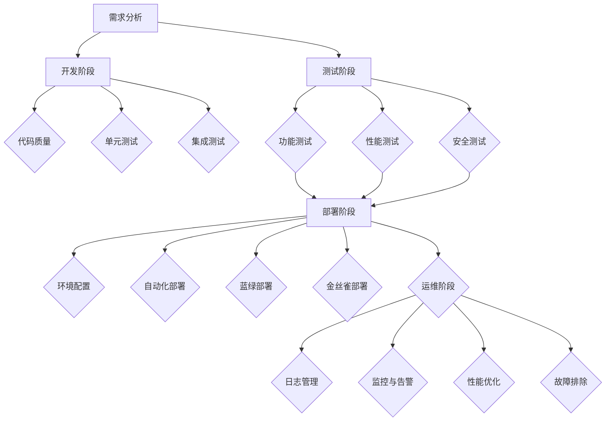

                 

### 引言

在当今快速发展的信息技术时代，软件发布管理（Software Release Management）已经成为企业创新和竞争力的重要因素。随着软件系统规模和复杂度的不断增加，如何高效地管理从开发到生产的全过程，确保软件产品的质量、稳定性和安全性，成为各个企业面临的重大挑战。

#### 软件发布管理的重要性

软件发布管理不仅涉及开发过程中的代码质量管理、测试与部署，还关系到生产环境中的运维与监控。一个高效的软件发布管理流程能够显著提高开发团队的效率，缩短产品上市时间，降低运维成本，并提升用户体验。具体来说，软件发布管理的重要性体现在以下几个方面：

1. **提高产品质量**：通过严格的代码审查、自动化测试和持续集成，减少缺陷和漏洞，确保软件质量。
2. **降低运维成本**：通过规范的部署流程和自动化运维工具，提高运维效率，降低人工成本。
3. **缩短上市时间**：通过优化开发、测试和发布流程，加快产品迭代速度，迅速响应市场变化。
4. **增强团队协作**：通过流程标准化和工具集成，提高团队协作效率，确保项目进度和质量。
5. **提升用户体验**：通过及时更新和优化软件功能，提高用户满意度和忠诚度。

#### 软件发布管理的挑战

尽管软件发布管理的重要性不言而喻，但实际操作中仍面临诸多挑战：

1. **复杂性**：随着软件系统规模的扩大，发布管理流程变得越来越复杂，需要协调多个团队和角色。
2. **质量保障**：在快速迭代和持续交付的背景下，如何保证软件质量成为一大难题。
3. **安全与合规**：软件发布过程中必须遵循安全标准和法规要求，防范潜在的安全风险。
4. **版本控制**：在多版本并行开发和部署的情况下，如何有效管理版本和控制变更。
5. **人员协调**：不同团队之间的沟通和协调是确保发布管理顺利进行的关键，但往往存在信息不对称和协作不畅的问题。

#### 本书目标与结构

本书旨在系统地介绍软件发布管理的全过程，从开发阶段到生产阶段的各个环节，包括代码质量管理、测试管理、部署管理、运维管理以及流程优化。具体目标如下：

1. **全面讲解核心概念**：深入解析软件发布管理的基本概念、流程和关键要素。
2. **详细阐述技术原理**：通过伪代码和数学模型，详细阐述核心算法原理和实现方法。
3. **结合实际案例分析**：通过实际案例，展示软件发布管理的最佳实践和成功经验。
4. **提供实用工具与技巧**：介绍常见的发布管理工具和技术，提供实用技巧和最佳实践。

本书结构按照软件发布管理的全过程进行组织，分为七个主要章节：

1. **引言**：介绍软件发布管理的重要性、面临的挑战以及本书的目标和结构。
2. **软件发布管理概述**：讲解软件发布管理的基本流程、关键要素和常用工具。
3. **开发阶段管理**：介绍代码质量管理、持续集成与持续部署等开发阶段的关键实践。
4. **测试阶段管理**：讲解测试策略、自动化测试和性能测试等测试阶段的关键实践。
5. **部署阶段管理**：介绍部署策略、环境配置管理、蓝绿部署与金丝雀部署等部署阶段的关键实践。
6. **运维阶段管理**：介绍日志管理、监控与告警、性能优化与故障排除等运维阶段的关键实践。
7. **流程优化与实践**：介绍流程优化方法论、成功案例分享和未来发展趋势。

通过本书的阅读，读者将能够系统地了解软件发布管理的全过程，掌握关键技术和方法，提升软件发布管理的效率和效果。

#### 关键词

- 软件发布管理
- 代码质量管理
- 持续集成
- 测试管理
- 部署策略
- 运维管理
- 流程优化

#### 摘要

本文系统介绍了软件发布管理的过程，包括从开发到生产的各个环节。首先，阐述了软件发布管理的重要性及其面临的挑战。接着，详细讲解了开发阶段、测试阶段、部署阶段和运维阶段的关键实践，并提供了流程优化方法论和成功案例分析。通过本文，读者将全面了解软件发布管理的核心概念、技术原理和最佳实践，提升软件发布管理的效率和效果。本文关键词包括：软件发布管理、代码质量管理、持续集成、测试管理、部署策略、运维管理和流程优化。

## 软件发布管理概述

软件发布管理是一个复杂且系统的过程，它涵盖了从开发到生产的各个环节，确保软件产品的质量、稳定性和安全性。在这一章节中，我们将详细介绍软件发布管理的基本流程、关键要素和常用的工具，帮助读者建立对软件发布管理的全面理解。

### 软件发布管理流程

软件发布管理流程通常包括以下几个阶段：

1. **需求分析与规划**：在这个阶段，项目团队会与利益相关者沟通，明确软件产品的功能需求和发布时间表。
2. **开发阶段**：开发人员根据需求进行编码，实现软件功能。这个阶段包括代码质量管理、单元测试和集成测试。
3. **测试阶段**：测试团队对开发完成的软件进行各种类型的测试，如功能测试、性能测试、安全测试等，确保软件的质量和稳定性。
4. **部署阶段**：部署团队将测试通过的软件部署到生产环境中，进行实际运行测试，确保软件能够正常工作。
5. **运维阶段**：运维团队负责监控软件运行状态，处理故障和性能问题，确保软件的持续稳定运行。

### 软件发布管理的核心要素

软件发布管理涉及多个核心要素，这些要素相互关联，共同确保发布过程的高效和成功：

1. **代码质量管理**：确保代码的可读性、可维护性和可靠性，通过代码审查、单元测试和静态代码分析等方法。
2. **测试管理**：包括制定测试策略、执行测试用例、收集测试结果和分析测试数据，确保软件质量。
3. **部署管理**：管理软件的部署过程，包括环境配置、版本控制和自动化部署。
4. **运维管理**：监控软件在生产环境中的运行状态，确保其稳定性和性能，包括日志管理、告警系统和性能优化。
5. **版本控制**：通过版本控制系统（如Git）管理代码的版本和历史，确保代码的可追踪性和可回滚性。
6. **文档管理**：包括需求文档、设计文档、测试文档和用户手册等，确保信息的透明和可追溯。

### 常用的工具

软件发布管理过程中，常用的工具可以帮助团队高效地完成各个阶段的任务：

1. **代码质量管理工具**：如SonarQube、Checkstyle等，用于代码审查和静态代码分析。
2. **测试管理工具**：如Selenium、JUnit、TestNG等，用于编写和执行测试用例。
3. **部署管理工具**：如Jenkins、GitLab CI/CD等，用于自动化部署和持续集成。
4. **运维管理工具**：如Prometheus、Zabbix等，用于监控和告警。
5. **版本控制系统**：如Git、Subversion（SVN）等，用于代码的版本管理和追踪。

### 核心概念与联系

为了更好地理解软件发布管理的核心概念，我们可以通过一个Mermaid流程图来展示各要素之间的关系：



这个流程图清晰地展示了软件发布管理的各个阶段及其核心要素，以及它们之间的相互关系。通过这个图，我们可以更直观地理解软件发布管理的整体流程和关键环节。

### 核心算法原理讲解

在软件发布管理中，持续集成（CI）和持续部署（CD）是非常关键的概念。它们通过自动化工具，确保代码质量和快速交付。

#### 持续集成（CI）

持续集成是一种软件开发实践，通过自动化构建和测试，确保代码库中的每一个提交都是可集成和可运行的。核心算法原理包括：

1. **触发构建**：每次代码提交到版本控制系统时，自动触发构建过程。
2. **构建过程**：编译代码、运行单元测试和集成测试，生成构建包。
3. **测试结果反馈**：将测试结果反馈给开发人员，以便及时修复问题。

伪代码示例：

```python
def trigger_build():
    if code_commit():
        build_project()
        run_tests()
        if test_failed():
            notify_developer()
        else:
            deploy_to_test_environment()

def build_project():
    compile_code()
    generate_build_artifacts()

def run_tests():
    execute_unit_tests()
    execute_integration_tests()

def notify_developer():
    send_email("构建失败，请修复代码。")
```

#### 持续部署（CD）

持续部署是持续集成的延伸，通过自动化工具将通过测试的代码部署到生产环境。核心算法原理包括：

1. **构建验证**：验证构建包是否通过所有测试。
2. **环境准备**：准备生产环境，包括安装依赖、配置环境等。
3. **自动化部署**：将构建包部署到生产环境，进行实际运行测试。

伪代码示例：

```python
def deploy_to_production():
    if build_verified():
        prepare_production_environment()
        install_dependencies()
        configure_environment()
        deploy_build_artifacts()
        run_post_deploy_tests()
        if tests_passed():
            announce_deployment_success()
        else:
            roll_back()

def build_verified():
    if build_status() == "passed":
        return True
    else:
        return False

def prepare_production_environment():
    install_required_software()
    configure_network()
    set_up_database()

def deploy_build_artifacts():
    copy_files_to_production_server()
    update_version_number()

def run_post_deploy_tests():
    execute_functional_tests()
    execute_performance_tests()

def announce_deployment_success():
    send_notification("部署成功。")
```

### 数学模型和公式

在软件发布管理中，我们可以使用一些数学模型来评估软件质量、预测部署风险等。以下是一个简单的回归模型，用于预测软件缺陷数量：

$$
\hat{y} = \beta_0 + \beta_1 \cdot x
$$

其中，\( y \) 是预测的缺陷数量，\( x \) 是代码行数，\( \beta_0 \) 和 \( \beta_1 \) 是模型参数。

举例说明：

假设我们有一个简单的数据集，代码行数和缺陷数量如下：

| 代码行数 | 缺陷数量 |
|----------|----------|
| 1000     | 5        |
| 2000     | 10       |
| 3000     | 15       |

我们可以通过最小二乘法计算回归模型参数：

$$
\beta_0 = \frac{\sum y - \beta_1 \cdot \sum x}{n}
$$

$$
\beta_1 = \frac{n \cdot \sum xy - \sum x \cdot \sum y}{n \cdot \sum x^2 - (\sum x)^2}
$$

计算结果为：

$$
\beta_0 = 2.5
$$

$$
\beta_1 = 0.5
$$

因此，预测模型为：

$$
\hat{y} = 2.5 + 0.5 \cdot x
$$

当代码行数为4000时，预测的缺陷数量为：

$$
\hat{y} = 2.5 + 0.5 \cdot 4000 = 20.5
$$

### 实际案例分析和详细讲解剖析

为了更好地理解软件发布管理的实践，我们可以通过一个实际案例来详细讲解。

#### 案例背景

某电子商务公司正在进行一次重大功能升级，需要发布一个包含订单管理、支付系统和用户界面的新版本。公司希望确保发布过程高效、安全且无缺陷。

#### 开发阶段

- **代码质量管理**：使用SonarQube进行代码审查，识别潜在的代码缺陷和风险。同时，开发团队编写了详细的单元测试，确保每个功能模块都是可运行的。
- **持续集成与持续部署**：使用Jenkins实现持续集成，每次代码提交都会触发构建和测试。通过GitLab CI/CD实现自动化部署，确保通过测试的代码能够自动部署到测试环境。

#### 测试阶段

- **测试策略与计划**：测试团队制定了详细的测试计划，包括功能测试、性能测试和安全测试。使用Selenium进行UI自动化测试，使用JUnit和TestNG进行API自动化测试。
- **性能测试与负载测试**：使用JMeter进行性能测试，模拟大量用户访问，评估系统的响应时间和吞吐量。同时，使用Apache Benchmark进行负载测试，评估系统的稳定性和可靠性。

#### 部署阶段

- **部署策略**：采用蓝绿部署策略，将新版本部署到部分服务器，与旧版本并行运行，确保无问题后逐步替换旧版本。
- **环境配置管理**：使用Ansible进行环境配置管理，确保每个服务器上的配置一致。
- **自动化部署**：使用Jenkins实现自动化部署，确保部署过程高效且可控。

#### 运维阶段

- **日志管理**：使用ELK（Elasticsearch、Logstash、Kibana）进行日志管理，收集和分析系统日志。
- **监控与告警**：使用Prometheus进行监控，设置告警规则，确保在系统异常时能够及时响应。
- **性能优化与故障排除**：定期对系统进行性能优化，使用性能监控工具定位和解决故障。

#### 项目小结

通过这次发布，公司成功实现了新功能的上线，并且在整个过程中，确保了软件的质量、稳定性和安全性。具体收获如下：

1. **提高效率**：通过持续集成和自动化部署，显著提高了发布效率。
2. **确保质量**：通过严格的测试和监控，确保了软件质量。
3. **降低风险**：通过蓝绿部署策略和逐步替换，降低了发布风险。
4. **优化运维**：通过日志管理和监控，提高了运维效率。

### 最佳实践 tips、小结、注意事项、拓展阅读

#### 最佳实践 tips

1. **制定明确的发布计划**：确保发布过程中的每个步骤都有明确的计划和责任人。
2. **自动化测试**：尽量自动化测试，减少手动测试的工作量。
3. **小步快跑**：采用增量发布策略，逐步引入新功能，减少风险。
4. **文档管理**：保持文档的完整性和更新，确保团队和其他利益相关者能够随时查阅。

#### 小结

软件发布管理是一个系统且复杂的过程，涉及多个阶段和关键要素。通过本文的介绍，读者应该对软件发布管理有了一个全面的了解，掌握了核心概念和实践方法。

#### 注意事项

1. **安全与合规**：在发布过程中，务必遵循安全标准和法规要求，确保软件的安全性。
2. **人员协调**：确保不同团队之间的有效沟通和协作，避免信息不对称和协作不畅。

#### 拓展阅读

- 《持续集成实践》
- 《软件测试的艺术》
- 《DevOps实践指南》
- 《Kubernetes权威指南》

通过拓展阅读，读者可以进一步深入学习软件发布管理的各个方面，提升专业技能。

### 作者信息

- 作者：AI天才研究院/AI Genius Institute & 禅与计算机程序设计艺术 /Zen And The Art of Computer Programming

本文由AI天才研究院和《禅与计算机程序设计艺术》作者联合撰写，旨在为读者提供全面、深入的软件发布管理指南。

---

本文详细介绍了软件发布管理的全过程，从开发阶段到运维阶段，包括核心概念、技术原理、最佳实践和实际案例分析。通过本文，读者可以全面了解软件发布管理的各个方面，提升软件发布管理的效率和效果。希望本文能为读者的工作提供有益的参考和启示。感谢读者阅读本文，期待与您在技术领域共同成长。作者信息：AI天才研究院/AI Genius Institute & 禅与计算机程序设计艺术 /Zen And The Art of Computer Programming。

