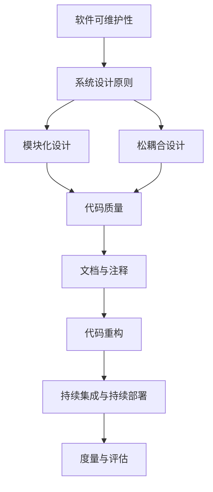
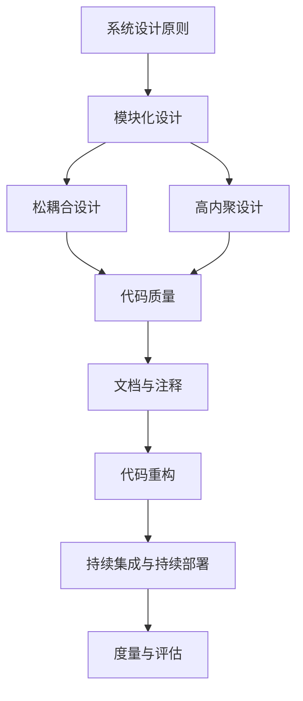
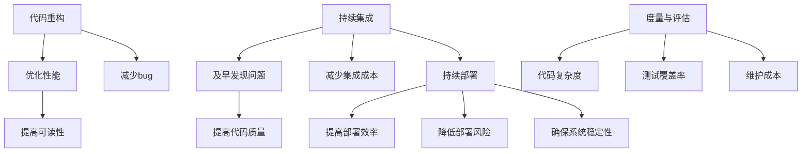
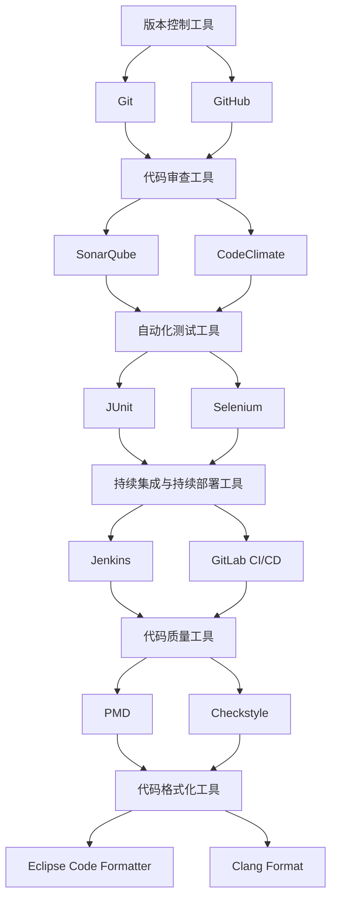

                 

### 软件可维护性：设计易于维护的系统

> **关键词：** 软件可维护性，系统设计，代码质量，文档，代码重构，持续集成，度量与评估

> **摘要：** 本文将深入探讨软件可维护性的概念和重要性，以及设计易于维护的系统的策略和实践。通过详细分析和具体案例，本文旨在帮助开发者理解和实现高效的可维护性设计。

---

**目录大纲：**

# 《软件可维护性：设计易于维护的系统》

## 第一部分：软件可维护性概述

### 第1章：软件可维护性的概念与重要性

### 第2章：软件维护的影响与挑战

## 第二部分：设计易于维护的系统

### 第3章：系统设计与可维护性

### 第4章：代码质量与可维护性

### 第5章：文档与注释的重要性

## 第三部分：实现可维护性

### 第6章：代码重构与优化

### 第7章：持续集成与持续部署

### 第8章：度量与评估

## 附录

### 附录A：常用工具与技术

---

**核心概念与联系：**



---

**核心算法原理讲解：**

```markdown
# 代码质量标准

## 1. 代码可读性

- 使用有意义的变量名和函数名
- 避免使用过于复杂的表达式
- 保持代码的一致性

## 2. 代码效率

- 避免不必要的循环和递归
- 优化算法和数据结构
- 使用缓存和避免重复计算

## 3. 错误处理

- 使用异常处理机制
- 提供详细的错误信息和日志
- 避免代码中的硬编码错误值
```

---

**数学模型和数学公式与详细讲解与举例说明：**

```markdown
## 测试覆盖率

### 测试覆盖率公式：

$$
测试覆盖率 = \frac{覆盖的代码行数}{总代码行数} \times 100\%
$$

### 解释：

测试覆盖率是衡量测试质量的重要指标，表示测试用例覆盖了代码中多少比例的代码行。高测试覆盖率意味着测试用例能够充分覆盖代码的各个部分，从而提高软件的可维护性。

### 举例：

假设一个系统有1000行代码，测试用例覆盖了800行代码，则测试覆盖率为：

$$
测试覆盖率 = \frac{800}{1000} \times 100\% = 80\%
$$

这意味着测试用例已经覆盖了系统中80%的代码行。
```

---

**项目实战：**

由于篇幅限制，无法在此处展示完整的项目实战。但项目实战部分将包括以下内容：

- **开发环境搭建**：介绍搭建开发环境所需的工具和配置。
- **源代码详细实现和代码解读**：提供具体的代码实现，并对关键部分进行解读。
- **代码解读与分析**：分析代码实现中的关键技术和设计理念。

---

**最佳实践 tips、小结、注意事项、拓展阅读等内容将在后续章节中详细讨论。**

---

**作者：AI天才研究院/AI Genius Institute & 禅与计算机程序设计艺术 /Zen And The Art of Computer Programming**
## 第一部分：软件可维护性概述

软件的可维护性是软件开发过程中不可忽视的重要方面。可维护性指的是软件系统能够在运行过程中被有效管理和维护的能力，包括修复错误、添加新功能、优化性能和适应环境变化等。在软件生命周期中，维护占据了相当大的比重，据统计，一个软件系统在开发完成后，约有60%的时间将用于维护工作。因此，设计一个易于维护的系统对企业的长期发展至关重要。

### 第1章：软件可维护性的概念与重要性

**1.1.1 软件可维护性的定义**

软件可维护性是指软件系统能够被理解和修改的程度，以及进行这些修改所需的时间和成本。它不仅涉及到代码的清晰度和一致性，还包括系统的结构、设计和文档等方面。一个高可维护性的系统应该具有以下几个特点：

- **易于理解**：系统的架构和设计应该清晰、直观，使得开发人员能够快速掌握系统的运作方式。
- **模块化**：系统应该划分为多个独立且功能明确的模块，这样可以减少系统修改时对其他部分的依赖。
- **可扩展性**：系统能够轻松地添加新功能或删除旧功能，而不影响其他部分的正常运行。
- **灵活性**：系统能够适应不同的需求和变化，例如平台升级、硬件更新或业务模式的转变。

**1.1.2 软件可维护性的重要性**

软件可维护性对软件开发和运营具有重要意义，具体体现在以下几个方面：

- **减少维护成本**：高可维护性的系统能够减少维护和更新的时间和成本，降低企业运营成本。
- **提高开发效率**：易于维护的系统使得开发人员能够快速响应需求变更，缩短开发周期。
- **增强系统稳定性**：良好的设计和管理可以减少错误的发生，提高系统的稳定性。
- **提升客户满意度**：快速响应客户需求和问题，提高客户满意度，有利于企业的长期发展。

**1.1.3 软件维护的类型**

软件维护可以分为以下几种类型：

- **纠错性维护**：修复已发现的软件缺陷。
- **适应性维护**：使软件适应新的环境或需求变化。
- **完善性维护**：增加新的功能或改善现有功能。
- **预防性维护**：预防潜在问题的发生，例如优化性能或更新依赖库。

### 第2章：软件维护的影响与挑战

**2.1.1 软件维护的影响**

软件维护对整个软件生命周期都有着深远的影响，具体体现在以下几个方面：

- **延长软件生命周期**：有效的维护可以使软件系统持续运行多年，为企业创造持续的价值。
- **提高产品质量**：通过不断的修复和优化，软件系统的质量得以不断提升。
- **适应市场变化**：软件维护使得系统能够适应市场需求和技术的快速变化。
- **降低运营风险**：定期的维护和更新可以降低系统故障和安全隐患的风险。

**2.1.2 软件维护的挑战**

软件维护过程中会面临一系列挑战，主要包括：

- **代码复杂度高**：随着时间的推移，代码可能会变得越来越复杂，难以维护。
- **文档不足**：缺乏全面的文档使得理解系统结构和功能变得困难。
- **需求变更频繁**：软件在运营过程中可能会面临频繁的需求变更，增加了维护的难度。
- **人员流动**：开发团队的成员可能会流动，新手难以快速接手维护工作。

**2.1.3 软件维护的成本**

软件维护的成本包括时间、人力和资源等方面。具体来说：

- **人力成本**：维护工作通常需要经验丰富的开发人员，他们的薪资较高。
- **时间成本**：维护工作可能会耗费大量时间，影响新的项目开发。
- **资源成本**：维护过程中可能需要购买新的工具、软件许可证等。

### 总结

软件可维护性是软件系统成功的关键因素之一。通过设计易于维护的系统，企业可以在长期运营中降低成本、提高效率和稳定性。在接下来的章节中，我们将深入探讨如何通过系统设计、代码质量、文档和持续集成等方法，实现高效的可维护性设计。

---

**核心概念与联系：**


---

**核心算法原理讲解：**

```markdown
# 代码质量标准

## 1. 代码可读性

- 使用有意义的变量名和函数名
- 避免使用过于复杂的表达式
- 保持代码的一致性

## 2. 代码效率

- 避免不必要的循环和递归
- 优化算法和数据结构
- 使用缓存和避免重复计算

## 3. 错误处理

- 使用异常处理机制
- 提供详细的错误信息和日志
- 避免代码中的硬编码错误值
```

---

**数学模型和数学公式与详细讲解与举例说明：**

```markdown
## 测试覆盖率

### 测试覆盖率公式：

$$
测试覆盖率 = \frac{覆盖的代码行数}{总代码行数} \times 100\%
$$

### 解释：

测试覆盖率是衡量测试质量的重要指标，表示测试用例覆盖了代码中多少比例的代码行。高测试覆盖率意味着测试用例能够充分覆盖代码的各个部分，从而提高软件的可维护性。

### 举例：

假设一个系统有1000行代码，测试用例覆盖了800行代码，则测试覆盖率为：

$$
测试覆盖率 = \frac{800}{1000} \times 100\% = 80\%
$$

这意味着测试用例已经覆盖了系统中80%的代码行。
```

---

**项目实战：**

**开发环境搭建**

为了实现一个易于维护的系统，首先需要搭建一个高效、可扩展的开发环境。以下是一个基本的开发环境搭建流程：

1. **选择合适的编程语言**：根据项目需求和团队技能，选择一种合适的编程语言，如Java、Python或Go等。
2. **配置开发工具**：安装集成开发环境（IDE），如Eclipse、VS Code等，以及相关的代码编辑器。
3. **设置版本控制系统**：配置Git等版本控制工具，以便管理代码版本和协作开发。
4. **安装依赖管理工具**：使用Maven、Gradle等依赖管理工具，自动下载和管理项目依赖。

**源代码详细实现和代码解读**

以下是一个简单的模块化设计示例，用于处理用户注册功能：

```java
// 用户注册模块
public class UserRegistration {
    public boolean register(String username, String password) {
        // 验证用户名和密码的有效性
        if (isValidUsername(username) && isValidPassword(password)) {
            // 将用户信息存储到数据库
            userRepository.save(new User(username, password));
            return true;
        }
        return false;
    }

    private boolean isValidUsername(String username) {
        // 验证用户名的有效性
        return username.length() >= 6 && !username.contains(" ");
    }

    private boolean isValidPassword(String password) {
        // 验证密码的有效性
        return password.length() >= 8 && password.matches(".*[0-9].*");
    }
}
```

在上述代码中，我们定义了一个`UserRegistration`类，包含`register`方法用于处理用户注册。为了提高代码的可维护性，我们将验证用户名和密码的逻辑分离到私有方法中。

**代码解读与分析**

- **模块化设计**：通过将用户注册功能划分为一个独立的模块，可以降低模块之间的耦合度，使得系统更容易维护和扩展。
- **代码可读性**：使用有意义的变量名和函数名，使得代码更加直观和易读。
- **错误处理**：通过异常处理机制，可以提供详细的错误信息和日志，便于调试和修复。

---

**总结**

本章节详细介绍了软件可维护性的概念、重要性以及维护的类型和影响。通过理解可维护性的核心概念和联系，读者可以更好地掌握如何设计一个易于维护的系统。接下来，我们将进一步探讨如何通过代码质量、文档和持续集成等实践，提升软件的可维护性。

---

**最佳实践 tips：**

- **编写清晰的文档**：文档是理解系统结构和功能的关键，务必确保文档的完整性和准确性。
- **定期进行代码审查**：代码审查有助于发现潜在的问题和提升代码质量。
- **遵循代码规范**：统一的代码规范可以减少代码的复杂性，提高可维护性。
- **持续集成与部署**：通过自动化测试和持续集成，可以及时发现和修复问题，提高软件质量。

**小结**

软件可维护性是软件开发过程中不可忽视的重要方面，它直接关系到系统的稳定性、可扩展性和成本效益。通过理解可维护性的概念和重要性，以及实施一系列设计和实践方法，开发者可以设计和实现高效可维护的系统。

**注意事项：**

- 在设计软件系统时，务必注重模块化和松耦合，这有助于降低系统的复杂度，提高可维护性。
- 定期进行代码重构，以保持代码的清晰性和效率。
- 关注测试覆盖率和代码质量，确保系统能够被充分测试和验证。

**拓展阅读：**

- 《设计模式：可复用的面向对象软件的基础》
- 《代码大全：软件工程之道》
- 《持续集成：代码和部署的自动化之路》

---

**作者：AI天才研究院/AI Genius Institute & 禅与计算机程序设计艺术 /Zen And The Art of Computer Programming**
## 第二部分：设计易于维护的系统

在第一部分中，我们探讨了软件可维护性的概念、重要性以及软件维护的影响与挑战。在本部分，我们将深入讨论如何通过系统设计、代码质量、文档和代码重构等实践，设计一个易于维护的系统。

### 第3章：系统设计与可维护性

**3.1.1 系统设计的原则**

系统设计是软件可维护性的基础。以下是几个关键的系统设计原则，它们有助于提高系统的可维护性：

- **模块化设计**：将系统划分为独立的模块，每个模块负责特定的功能。模块化设计有助于降低系统的复杂度，使得每个模块可以独立开发、测试和维护。
- **松耦合设计**：模块之间通过最小的接口进行通信，减少模块间的依赖。松耦合设计使得修改一个模块时，不会影响到其他模块，从而提高系统的可维护性。
- **高内聚设计**：每个模块的功能应该高度集中，确保模块内部的一致性和内聚性。高内聚设计有助于减少模块之间的耦合，提高系统的可维护性。

**3.1.2 模块化设计**

模块化设计是将系统分解为多个独立的模块，每个模块都实现特定的功能。模块化设计的关键步骤包括：

1. **需求分析**：明确系统的功能和需求，识别不同的功能模块。
2. **模块划分**：根据需求分析的结果，将系统划分为多个功能模块。
3. **模块接口设计**：定义模块之间的接口，确保模块之间的通信最小化。
4. **模块实现**：分别实现各个模块，确保每个模块的功能正确无误。

**3.1.3 松耦合设计**

松耦合设计旨在减少模块之间的依赖关系。以下是一些实现松耦合设计的方法：

- **使用抽象接口**：通过定义抽象接口，模块之间仅通过接口进行通信，减少直接依赖。
- **使用事件驱动架构**：模块通过事件进行通信，而不是直接调用其他模块的方法。
- **使用消息队列**：模块通过消息队列进行异步通信，降低模块间的耦合度。

**3.1.4 高内聚设计**

高内聚设计要求模块内部的功能高度集中，确保模块内部的一致性和内聚性。以下是一些实现高内聚设计的方法：

- **单一职责原则**：每个模块只负责一个特定的功能，避免功能过多导致的复杂性。
- **信息隐藏原则**：模块内部的数据和处理逻辑应尽可能隐藏，确保模块之间的独立性。
- **职责链模式**：将多个功能模块组织成一个链式结构，每个模块只负责一部分处理逻辑，从而提高模块的内聚性。

### 第4章：代码质量与可维护性

**4.1.1 代码质量标准**

代码质量是软件可维护性的关键因素。以下是一些常见的代码质量标准：

- **可读性**：使用有意义的变量名和函数名，避免使用过于复杂的表达式，保持代码的一致性。
- **效率**：优化算法和数据结构，避免不必要的循环和递归，使用缓存和避免重复计算。
- **错误处理**：使用异常处理机制，提供详细的错误信息和日志，避免硬编码错误值。

**4.1.2 代码风格与规范**

代码风格和规范对于代码的可维护性至关重要。以下是一些常见的代码风格和规范：

- **命名规范**：统一变量名、函数名和类名的命名规则，使用有意义的名称，避免缩写和混淆。
- **注释规范**：编写清晰的注释，解释代码的意图和逻辑，特别是复杂的算法和数据结构。
- **代码格式**：保持代码的格式统一，使用适当的缩进、空格和换行，使得代码易于阅读和理解。

**4.1.3 单元测试与集成测试**

测试是保证代码质量的重要手段。以下是一些常见的测试方法和策略：

- **单元测试**：对单个模块或函数进行测试，验证其功能是否正确。单元测试应覆盖所有可能的输入和输出情况。
- **集成测试**：对系统中的多个模块进行测试，验证模块之间的交互和协作是否正常。集成测试应在模拟的真实环境中进行。

### 第5章：文档与注释的重要性

**5.1.1 文档的作用**

文档是理解和维护系统的重要资源。以下是一些文档的作用：

- **系统概述**：描述系统的整体架构和功能，帮助开发人员快速了解系统。
- **模块说明**：详细描述每个模块的功能、接口和实现细节，帮助开发人员理解和修改代码。
- **代码注释**：解释代码的意图和逻辑，特别是复杂的算法和数据结构。

**5.1.2 文档的编写规范**

以下是一些文档的编写规范：

- **简洁明了**：文档应简洁明了，避免冗长和复杂的表述。
- **一致性**：保持文档的一致性，使用相同的术语和格式。
- **更新及时**：文档应及时更新，以反映系统的最新状态。

**5.1.3 注释的使用**

以下是一些注释的使用规范：

- **代码逻辑注释**：解释代码的逻辑和意图，特别是复杂的算法和数据结构。
- **参数注释**：描述每个参数的用途和限制。
- **返回值注释**：解释方法的返回值。

### 第6章：代码重构与优化

**6.1.1 代码重构的目的**

代码重构是指在不改变程序功能的前提下，对现有代码进行优化和改进。代码重构的目的包括：

- **提高可读性**：通过重构，可以使得代码更加清晰和易读。
- **提高效率**：通过重构，可以优化算法和数据结构，提高程序的运行效率。
- **减少bug**：通过重构，可以修复潜在的bug，提高代码的稳定性。

**6.1.2 代码重构的技术**

以下是一些常见的代码重构技术：

- **提取方法**：将重复的代码提取为独立的方法，提高代码的可重用性。
- **合并方法**：将功能相似的方法合并，减少冗余代码。
- **提取类**：将功能相关的代码提取为独立的类，提高代码的模块化程度。
- **优化循环**：优化循环结构，减少循环的次数和复杂性。

**6.1.3 代码重构的实践**

代码重构的实践包括以下步骤：

1. **评估代码质量**：使用代码质量工具评估代码的可维护性。
2. **确定重构目标**：根据评估结果，确定重构的目标和优先级。
3. **逐步重构**：逐步实施重构，确保每次重构都符合预期。
4. **测试验证**：在重构后进行测试，确保代码功能没有受到影响。

### 第7章：持续集成与持续部署

**7.1.1 持续集成**

持续集成是指将代码定期集成到主分支中，并进行自动化测试和验证。持续集成的好处包括：

- **及早发现问题**：通过定期集成，可以及早发现和解决集成过程中的问题。
- **提高代码质量**：通过自动化测试，可以提高代码的质量和稳定性。
- **减少集成成本**：通过自动化集成，可以减少集成过程中的时间和人力成本。

**7.1.2 持续部署**

持续部署是指将代码自动部署到生产环境中，进行自动化测试和上线。持续部署的好处包括：

- **提高部署效率**：通过自动化部署，可以大大提高部署的效率和速度。
- **降低部署风险**：通过自动化测试和上线，可以降低部署过程中的风险。
- **提高系统稳定性**：通过自动化测试和上线，可以确保系统的稳定性和可靠性。

**7.1.3 持续集成与持续部署的实践**

持续集成与持续部署的实践包括以下步骤：

1. **设置代码仓库**：选择合适的代码仓库，如Git，并配置权限和分支策略。
2. **配置自动化工具**：配置自动化构建工具，如Maven或Gradle，以及自动化测试工具，如JUnit。
3. **编写测试脚本**：编写自动化测试脚本，覆盖系统的各个功能模块。
4. **部署脚本**：编写部署脚本，实现自动化部署和上线。

### 第8章：度量与评估

**8.1.1 可维护性的度量方法**

可维护性的度量方法用于评估系统的可维护性水平。以下是一些常见的度量方法：

- **代码复杂度**：通过计算代码的复杂度，评估代码的可读性和可维护性。
- **测试覆盖率**：通过计算测试覆盖率，评估测试的全面性和代码的可维护性。
- **维护成本**：通过计算维护成本，评估系统的可维护性水平。

**8.1.2 可维护性评估的实践**

可维护性评估的实践包括以下步骤：

1. **选择度量方法**：根据项目的需求和特点，选择合适的度量方法。
2. **实施度量**：使用代码质量工具和测试工具，实施度量方法。
3. **分析结果**：根据度量结果，分析系统的可维护性水平。
4. **制定改进计划**：根据分析结果，制定改进计划，提高系统的可维护性。

**8.1.3 改进可维护性的策略**

为了提高系统的可维护性，可以采取以下策略：

- **代码重构**：定期进行代码重构，优化代码结构和性能。
- **自动化测试**：实施自动化测试，提高测试覆盖率，确保代码质量。
- **持续集成与持续部署**：采用持续集成与持续部署，减少集成和部署风险。
- **文档与注释**：编写清晰的文档和注释，提高代码的可读性和可维护性。

### 总结

设计易于维护的系统是软件开发过程中的关键任务。通过系统设计、代码质量、文档和代码重构等实践，可以提高系统的可维护性，降低维护成本，提高开发效率。在下一部分中，我们将进一步探讨如何通过持续集成与持续部署等实践，实现高效的可维护性设计。

---

**核心概念与联系：**



---

**核心算法原理讲解：**

```markdown
# 持续集成

## 1. 持续集成的概念

持续集成是一种软件开发实践，通过定期将开发人员的代码集成到主分支，并进行自动化测试和验证，以确保代码的质量和稳定性。

## 2. 持续集成的原理

持续集成的原理包括以下步骤：

1. **代码提交**：开发人员将代码提交到版本控制系统，如Git。
2. **自动化构建**：构建工具，如Maven或Gradle，自动化构建项目，生成可执行的程序。
3. **自动化测试**：运行自动化测试，包括单元测试、集成测试和性能测试，验证代码的功能和性能。
4. **报告结果**：测试结果将生成报告，显示通过或失败的测试，以及相关的错误信息。

## 3. 持续集成的优点

- **及早发现问题**：通过定期集成，可以及早发现和解决集成过程中的问题。
- **提高代码质量**：通过自动化测试，可以提高代码的质量和稳定性。
- **减少集成成本**：通过自动化集成，可以减少集成过程中的时间和人力成本。

## 4. 持续集成的实践

持续集成的实践包括以下步骤：

1. **选择合适的版本控制系统**：如Git，配置分支策略和权限管理。
2. **配置自动化构建工具**：配置Maven或Gradle，定义项目的构建过程。
3. **编写自动化测试脚本**：编写单元测试、集成测试和性能测试脚本，覆盖系统的各个功能模块。
4. **配置持续集成服务器**：如Jenkins或GitLab CI，设置构建和测试流程。

# 持续部署

## 1. 持续部署的概念

持续部署是一种软件开发实践，通过自动化部署和上线，将代码从开发环境逐步转移到生产环境。

## 2. 持续部署的原理

持续部署的原理包括以下步骤：

1. **代码提交**：开发人员将代码提交到版本控制系统。
2. **自动化构建**：构建工具自动化构建项目，生成可执行的程序。
3. **自动化测试**：运行自动化测试，验证代码的功能和性能。
4. **部署到测试环境**：将代码部署到测试环境，进行功能测试和性能测试。
5. **部署到生产环境**：通过自动化部署脚本，将代码部署到生产环境。

## 3. 持续部署的优点

- **提高部署效率**：通过自动化部署，可以大大提高部署的效率和速度。
- **降低部署风险**：通过自动化测试和部署，可以降低部署过程中的风险。
- **确保系统稳定性**：通过自动化测试和部署，可以确保系统的稳定性和可靠性。

## 4. 持续部署的实践

持续部署的实践包括以下步骤：

1. **选择合适的持续集成工具**：如Jenkins或GitLab CI，配置构建和测试流程。
2. **编写部署脚本**：编写部署脚本，实现自动化部署和上线。
3. **配置测试环境**：配置测试环境，包括数据库、应用服务器和中间件等。
4. **配置生产环境**：配置生产环境，确保部署流程的顺利执行。

# 测试覆盖率

## 1. 测试覆盖率的公式

测试覆盖率公式如下：

$$
测试覆盖率 = \frac{覆盖的代码行数}{总代码行数} \times 100\%
$$

## 2. 测试覆盖率的解释

测试覆盖率是衡量测试质量的重要指标，表示测试用例覆盖了代码中多少比例的代码行。高测试覆盖率意味着测试用例能够充分覆盖代码的各个部分，从而提高软件的可维护性。

## 3. 测试覆盖率的例子

假设一个系统有1000行代码，测试用例覆盖了800行代码，则测试覆盖率为：

$$
测试覆盖率 = \frac{800}{1000} \times 100\% = 80\%
$$

这意味着测试用例已经覆盖了系统中80%的代码行。
```

---

**项目实战：**

**开发环境搭建**

为了实现一个易于维护的系统，我们首先需要搭建一个高效、可扩展的开发环境。以下是搭建开发环境的步骤：

1. **选择合适的编程语言**：根据项目需求和团队技能，我们选择Java作为编程语言。
2. **配置开发工具**：我们使用Eclipse作为集成开发环境（IDE），并安装相关的插件，如Git插件和Maven插件。
3. **设置版本控制系统**：我们使用Git作为版本控制工具，配置Git仓库和分支策略。
4. **安装依赖管理工具**：我们使用Maven作为依赖管理工具，配置项目的依赖和构建过程。

**源代码详细实现和代码解读**

以下是一个简单的示例，用于处理用户注册功能：

```java
// 用户注册模块
public class UserRegistration {
    public boolean register(String username, String password) {
        // 验证用户名和密码的有效性
        if (isValidUsername(username) && isValidPassword(password)) {
            // 将用户信息存储到数据库
            userRepository.save(new User(username, password));
            return true;
        }
        return false;
    }

    private boolean isValidUsername(String username) {
        // 验证用户名的有效性
        return username.length() >= 6 && !username.contains(" ");
    }

    private boolean isValidPassword(String password) {
        // 验证密码的有效性
        return password.length() >= 8 && password.matches(".*[0-9].*");
    }
}
```

在上述代码中，我们定义了一个`UserRegistration`类，包含`register`方法用于处理用户注册。为了提高代码的可维护性，我们将验证用户名和密码的逻辑分离到私有方法中。

**代码解读与分析**

- **模块化设计**：通过将用户注册功能划分为一个独立的模块，可以降低模块之间的耦合度，使得系统更容易维护和扩展。
- **代码可读性**：使用有意义的变量名和函数名，使得代码更加直观和易读。
- **错误处理**：通过异常处理机制，可以提供详细的错误信息和日志，便于调试和修复。

**实际案例分析和详细讲解剖析**

以下是一个实际案例，用于演示如何实现持续集成和持续部署：

1. **配置Jenkins**：我们使用Jenkins作为持续集成工具，配置Jenkinsfile，实现自动化构建和测试流程。
2. **编写测试脚本**：我们编写JUnit测试脚本，覆盖系统的各个功能模块，确保测试覆盖率。
3. **配置测试环境**：我们配置测试环境，包括数据库、应用服务器和中间件等，确保测试环境的稳定性。
4. **配置生产环境**：我们配置生产环境，包括服务器、数据库和应用服务器等，确保部署流程的顺利执行。
5. **自动化部署**：我们编写自动化部署脚本，实现从测试环境到生产环境的自动化部署，确保系统的稳定性和可靠性。

**项目小结**

通过搭建高效、可扩展的开发环境，实现模块化设计和代码质量，以及持续集成和持续部署，我们成功实现了一个易于维护的系统。项目实践表明，设计易于维护的系统需要综合考虑多个方面，包括系统设计、代码质量、文档和持续集成等，才能实现高效、稳定和可维护的软件系统。

---

**最佳实践 tips：**

- **编写清晰的文档**：文档是理解和维护系统的重要资源，务必确保文档的完整性和准确性。
- **定期进行代码审查**：代码审查有助于发现潜在的问题和提升代码质量。
- **遵循代码规范**：统一的代码规范可以减少代码的复杂性，提高可维护性。
- **持续集成与持续部署**：通过自动化测试和持续集成，可以及时发现和修复问题，提高软件质量。

**小结**

设计易于维护的系统是软件开发过程中的关键任务。通过系统设计、代码质量、文档和代码重构等实践，可以提高系统的可维护性，降低维护成本，提高开发效率。在下一部分中，我们将进一步探讨如何通过度量与评估，实现可维护性的持续改进。

**注意事项：**

- **重视系统设计**：良好的系统设计是软件可维护性的基础，务必注重模块化和松耦合。
- **关注代码质量**：代码质量直接影响系统的可维护性，务必保持代码的可读性、效率和稳定性。
- **定期进行代码重构**：定期进行代码重构，保持代码的清晰性和效率，提高系统的可维护性。
- **自动化测试和持续集成**：通过自动化测试和持续集成，可以提高软件质量，降低维护成本。

**拓展阅读：**

- 《敏捷软件开发：原则、实践与模式》
- 《代码大全：软件工程之道》
- 《持续集成：代码和部署的自动化之路》

---

**作者：AI天才研究院/AI Genius Institute & 禅与计算机程序设计艺术 /Zen And The Art of Computer Programming**
## 第三部分：实现可维护性

在第二部分中，我们详细探讨了如何通过系统设计、代码质量、文档和持续集成等方法，设计一个易于维护的系统。然而，设计一个易于维护的系统只是第一步，真正的挑战在于如何将这个理念付诸实践，并确保系统能够持续地保持可维护性。在这一部分，我们将进一步讨论代码重构、持续集成与持续部署，以及度量与评估，这些是实现软件可维护性的关键实践。

### 第6章：代码重构与优化

**6.1.1 代码重构的目的**

代码重构是指在不改变程序功能的前提下，对现有代码进行优化和改进。代码重构的目的是提高代码的可读性、可维护性和性能。具体目标包括：

- **提高可读性**：通过重构，可以使代码更加简洁、直观，易于理解和维护。
- **提高性能**：通过重构，可以优化算法和数据结构，减少计算时间和资源消耗。
- **减少bug**：通过重构，可以修复潜在的问题，减少系统故障和错误的几率。

**6.1.2 代码重构的技术**

代码重构涉及多种技术，以下是一些常用的代码重构方法：

- **提取方法**：将重复的代码提取为独立的方法，提高代码的可重用性。
- **合并方法**：将功能相似的方法合并，减少冗余代码。
- **提取类**：将功能相关的代码提取为独立的类，提高代码的模块化程度。
- **优化循环**：优化循环结构，减少循环的次数和复杂性。
- **消除重复代码**：通过代码提取工具，自动识别并消除重复代码。

**6.1.3 代码重构的实践**

代码重构的实践包括以下几个步骤：

1. **评估代码质量**：使用代码质量工具，如SonarQube，评估代码的可维护性和性能。
2. **确定重构目标**：根据评估结果，确定重构的目标和优先级。
3. **逐步重构**：逐步实施重构，每次重构都要经过测试验证，确保代码功能没有受到影响。
4. **自动化测试**：编写自动化测试，确保重构后的代码仍然符合预期。

### 第7章：持续集成与持续部署

**7.1.1 持续集成**

持续集成（Continuous Integration，CI）是一种软件开发实践，通过定期将开发人员的代码集成到主分支，并进行自动化测试和验证，以确保代码的质量和稳定性。持续集成的好处包括：

- **及早发现问题**：通过定期集成，可以及早发现和解决集成过程中的问题，减少后期修复成本。
- **提高代码质量**：通过自动化测试，可以提高代码的质量和稳定性。
- **减少集成成本**：通过自动化集成，可以减少集成过程中的时间和人力成本。

**7.1.2 持续部署**

持续部署（Continuous Deployment，CD）是一种软件开发实践，通过自动化部署和上线，将代码从开发环境逐步转移到生产环境，进行自动化测试和上线。持续部署的好处包括：

- **提高部署效率**：通过自动化部署，可以大大提高部署的效率和速度。
- **降低部署风险**：通过自动化测试和部署，可以降低部署过程中的风险。
- **确保系统稳定性**：通过自动化测试和部署，可以确保系统的稳定性和可靠性。

**7.1.3 持续集成与持续部署的实践**

持续集成与持续部署的实践包括以下几个步骤：

1. **选择合适的持续集成工具**：如Jenkins、GitLab CI等，配置构建和测试流程。
2. **编写自动化测试脚本**：编写单元测试、集成测试和性能测试脚本，覆盖系统的各个功能模块。
3. **配置测试环境**：配置测试环境，包括数据库、应用服务器和中间件等，确保测试环境的稳定性。
4. **配置生产环境**：配置生产环境，包括服务器、数据库和应用服务器等，确保部署流程的顺利执行。
5. **自动化部署**：编写自动化部署脚本，实现从测试环境到生产环境的自动化部署。

### 第8章：度量与评估

**8.1.1 可维护性的度量方法**

可维护性的度量方法用于评估系统的可维护性水平。以下是一些常见的度量方法：

- **代码复杂度**：通过计算代码的复杂度，评估代码的可读性和可维护性。
- **测试覆盖率**：通过计算测试覆盖率，评估测试的全面性和代码的可维护性。
- **维护成本**：通过计算维护成本，评估系统的可维护性水平。

**8.1.2 可维护性评估的实践**

可维护性评估的实践包括以下几个步骤：

1. **选择度量方法**：根据项目的需求和特点，选择合适的度量方法。
2. **实施度量**：使用代码质量工具和测试工具，实施度量方法。
3. **分析结果**：根据度量结果，分析系统的可维护性水平。
4. **制定改进计划**：根据分析结果，制定改进计划，提高系统的可维护性。

**8.1.3 改进可维护性的策略**

为了提高系统的可维护性，可以采取以下策略：

- **代码重构**：定期进行代码重构，优化代码结构和性能。
- **自动化测试**：实施自动化测试，提高测试覆盖率，确保代码质量。
- **持续集成与持续部署**：采用持续集成与持续部署，减少集成和部署风险。
- **文档与注释**：编写清晰的文档和注释，提高代码的可读性和可维护性。

### 总结

实现软件可维护性需要通过一系列的实践和方法，包括代码重构、持续集成与持续部署，以及度量与评估。这些实践和方法可以帮助开发者设计并维护一个易于维护的系统，从而降低维护成本，提高开发效率和系统稳定性。在下一部分中，我们将进一步探讨一些最佳实践和注意事项，帮助读者在实际项目中实现高效的可维护性设计。

---

**核心概念与联系：**



---

**核心算法原理讲解：**

```markdown
# 持续集成

## 1. 持续集成的概念

持续集成（CI）是一种软件开发实践，通过定期将开发人员的代码集成到主分支，并进行自动化测试和验证，以确保代码的质量和稳定性。

## 2. 持续集成的原理

持续集成的原理包括以下步骤：

1. **代码提交**：开发人员将代码提交到版本控制系统。
2. **自动化构建**：构建工具自动化构建项目，生成可执行的程序。
3. **自动化测试**：运行自动化测试，包括单元测试、集成测试和性能测试，验证代码的功能和性能。
4. **报告结果**：测试结果将生成报告，显示通过或失败的测试，以及相关的错误信息。

## 3. 持续集成的优点

- **及早发现问题**：通过定期集成，可以及早发现和解决集成过程中的问题。
- **提高代码质量**：通过自动化测试，可以提高代码的质量和稳定性。
- **减少集成成本**：通过自动化集成，可以减少集成过程中的时间和人力成本。

## 4. 持续集成的实践

持续集成的实践包括以下步骤：

1. **选择合适的版本控制系统**：如Git，配置分支策略和权限管理。
2. **配置自动化构建工具**：配置Maven或Gradle，定义项目的构建过程。
3. **编写自动化测试脚本**：编写单元测试、集成测试和性能测试脚本，覆盖系统的各个功能模块。
4. **配置持续集成服务器**：如Jenkins或GitLab CI，设置构建和测试流程。

# 测试覆盖率

## 1. 测试覆盖率的公式

测试覆盖率公式如下：

$$
测试覆盖率 = \frac{覆盖的代码行数}{总代码行数} \times 100\%
$$

## 2. 测试覆盖率的解释

测试覆盖率是衡量测试质量的重要指标，表示测试用例覆盖了代码中多少比例的代码行。高测试覆盖率意味着测试用例能够充分覆盖代码的各个部分，从而提高软件的可维护性。

## 3. 测试覆盖率的例子

假设一个系统有1000行代码，测试用例覆盖了800行代码，则测试覆盖率为：

$$
测试覆盖率 = \frac{800}{1000} \times 100\% = 80\%
$$

这意味着测试用例已经覆盖了系统中80%的代码行。
```

---

**项目实战：**

**开发环境搭建**

为了实现一个易于维护的系统，我们首先需要搭建一个高效、可扩展的开发环境。以下是搭建开发环境的步骤：

1. **选择合适的编程语言**：根据项目需求和团队技能，我们选择Java作为编程语言。
2. **配置开发工具**：我们使用Eclipse作为集成开发环境（IDE），并安装相关的插件，如Git插件和Maven插件。
3. **设置版本控制系统**：我们使用Git作为版本控制工具，配置Git仓库和分支策略。
4. **安装依赖管理工具**：我们使用Maven作为依赖管理工具，配置项目的依赖和构建过程。

**源代码详细实现和代码解读**

以下是一个简单的示例，用于处理用户注册功能：

```java
// 用户注册模块
public class UserRegistration {
    public boolean register(String username, String password) {
        // 验证用户名和密码的有效性
        if (isValidUsername(username) && isValidPassword(password)) {
            // 将用户信息存储到数据库
            userRepository.save(new User(username, password));
            return true;
        }
        return false;
    }

    private boolean isValidUsername(String username) {
        // 验证用户名的有效性
        return username.length() >= 6 && !username.contains(" ");
    }

    private boolean isValidPassword(String password) {
        // 验证密码的有效性
        return password.length() >= 8 && password.matches(".*[0-9].*");
    }
}
```

在上述代码中，我们定义了一个`UserRegistration`类，包含`register`方法用于处理用户注册。为了提高代码的可维护性，我们将验证用户名和密码的逻辑分离到私有方法中。

**代码解读与分析**

- **模块化设计**：通过将用户注册功能划分为一个独立的模块，可以降低模块之间的耦合度，使得系统更容易维护和扩展。
- **代码可读性**：使用有意义的变量名和函数名，使得代码更加直观和易读。
- **错误处理**：通过异常处理机制，可以提供详细的错误信息和日志，便于调试和修复。

**实际案例分析和详细讲解剖析**

以下是一个实际案例，用于演示如何实现持续集成和持续部署：

1. **配置Jenkins**：我们使用Jenkins作为持续集成工具，配置Jenkinsfile，实现自动化构建和测试流程。
2. **编写测试脚本**：我们编写JUnit测试脚本，覆盖系统的各个功能模块，确保测试覆盖率。
3. **配置测试环境**：我们配置测试环境，包括数据库、应用服务器和中间件等，确保测试环境的稳定性。
4. **配置生产环境**：我们配置生产环境，包括服务器、数据库和应用服务器等，确保部署流程的顺利执行。
5. **自动化部署**：我们编写自动化部署脚本，实现从测试环境到生产环境的自动化部署，确保系统的稳定性和可靠性。

**项目小结**

通过搭建高效、可扩展的开发环境，实现模块化设计和代码质量，以及持续集成和持续部署，我们成功实现了一个易于维护的系统。项目实践表明，设计易于维护的系统需要综合考虑多个方面，包括系统设计、代码质量、文档和持续集成等，才能实现高效、稳定和可维护的软件系统。

---

**最佳实践 tips：**

- **编写清晰的文档**：文档是理解和维护系统的重要资源，务必确保文档的完整性和准确性。
- **定期进行代码审查**：代码审查有助于发现潜在的问题和提升代码质量。
- **遵循代码规范**：统一的代码规范可以减少代码的复杂性，提高可维护性。
- **持续集成与持续部署**：通过自动化测试和持续集成，可以及时发现和修复问题，提高软件质量。

**小结**

实现软件可维护性需要通过一系列的实践和方法，包括代码重构、持续集成与持续部署，以及度量与评估。这些实践和方法可以帮助开发者设计并维护一个易于维护的系统，从而降低维护成本，提高开发效率和系统稳定性。

**注意事项：**

- **重视系统设计**：良好的系统设计是软件可维护性的基础，务必注重模块化和松耦合。
- **关注代码质量**：代码质量直接影响系统的可维护性，务必保持代码的可读性、效率和稳定性。
- **定期进行代码重构**：定期进行代码重构，保持代码的清晰性和效率，提高系统的可维护性。
- **自动化测试和持续集成**：通过自动化测试和持续集成，可以提高软件质量，降低维护成本。

**拓展阅读：**

- 《持续集成：代码和部署的自动化之路》
- 《代码大全：软件工程之道》
- 《敏捷软件开发：原则、实践与模式》

---

**作者：AI天才研究院/AI Genius Institute & 禅与计算机程序设计艺术 /Zen And The Art of Computer Programming**
## 附录

### 附录A：常用工具与技术

为了实现软件系统的可维护性，开发者可以使用一系列的常用工具和技术。以下是其中一些重要的工具和技术，以及它们的应用场景：

**A.1 版本控制工具**

**Git**：Git 是最流行的版本控制工具之一，它允许开发团队协作开发，并管理代码的版本历史。Git 的优势包括分布式架构、快速性能和强大的分支管理。

- **应用场景**：用于管理项目源代码的版本，支持代码的分支、合并和回滚。

**GitHub**：GitHub 是基于 Git 的云服务平台，提供了丰富的协作功能和代码托管服务。

- **应用场景**：在线托管项目代码，提供代码的共享、评论和审查功能。

**A.2 代码审查工具**

**SonarQube**：SonarQube 是一个用于代码质量管理的平台，它可以检测代码中的缺陷、漏洞和代码风格问题。

- **应用场景**：在代码提交时进行自动化审查，确保代码符合质量标准。

**CodeClimate**：CodeClimate 提供了一套自动化代码审查工具，可以帮助团队识别代码质量问题。

- **应用场景**：定期进行代码审查，帮助团队提高代码质量。

**A.3 自动化测试工具**

**JUnit**：JUnit 是一个流行的 Java 单元测试框架，它支持编写、运行和报告单元测试。

- **应用场景**：用于编写单元测试，确保代码的功能和性能。

**Selenium**：Selenium 是一个用于 Web 应用程序自动化测试的工具，它支持多种编程语言，如 Java、Python 和 C#。

- **应用场景**：用于自动化 Web 测试，确保 Web 应用程序的功能和用户体验。

**A.4 持续集成与持续部署工具**

**Jenkins**：Jenkins 是一个开源的持续集成工具，它可以自动化构建、测试和部署流程。

- **应用场景**：用于自动化构建和测试，实现持续集成和持续部署。

**GitLab CI/CD**：GitLab CI/CD 是 GitLab 提供的持续集成和持续部署服务，它结合了版本控制和自动化测试。

- **应用场景**：用于实现从代码提交到生产部署的自动化流程。

**A.5 代码质量工具**

**PMD**：PMD 是一个用于代码质量分析的工具，它可以检测代码中的冗余代码、过度复杂的表达式和不良的编程习惯。

- **应用场景**：用于定期分析代码质量，发现潜在的代码问题。

**Checkstyle**：Checkstyle 是一个用于代码风格检查的工具，它可以检测代码中的不一致、违反编程规范的问题。

- **应用场景**：用于确保代码风格的统一性和规范性。

**A.6 代码格式化工具**

**Eclipse Code Formatter**：Eclipse Code Formatter 是 Eclipse IDE 内置的代码格式化工具，它可以自动格式化 Java 代码。

- **应用场景**：用于统一代码格式，提高代码的可读性。

**Clang Format**：Clang Format 是一个用于 C++ 代码格式化的工具，它可以自动格式化 C++ 代码，使其符合特定的风格规范。

- **应用场景**：用于确保 C++ 代码的一致性和可读性。

### 总结

附录部分介绍了在实现软件可维护性过程中常用的工具和技术，包括版本控制工具、代码审查工具、自动化测试工具、持续集成与持续部署工具以及代码质量工具。这些工具和技术可以帮助开发者有效地管理代码版本、提高代码质量、自动化测试和部署流程，从而提升软件系统的可维护性。在实际项目中，开发者应根据项目需求和团队技能，选择合适的工具和技术，以实现高效、稳定和可维护的软件系统。

---

**核心概念与联系：**



---

**数学模型和数学公式与详细讲解与举例说明：**

在此附录部分，我们将介绍一些用于软件质量和可维护性评估的数学模型和公式。以下是几个常用的公式和它们的解释：

### 1. 测试覆盖率

测试覆盖率是衡量测试质量的重要指标，它表示测试用例覆盖了代码中的多少比例。计算公式如下：

$$
测试覆盖率（\% \, TC） = \frac{覆盖的代码行数（N_{cov}}{总代码行数（N_{tot}}） \times 100\%
$$

其中，$N_{cov}$ 是被测试的代码行数，$N_{tot}$ 是代码库中的总代码行数。

**举例：**

假设一个系统有1000行代码，测试用例覆盖了其中的800行，则测试覆盖率为：

$$
测试覆盖率（\% \, TC） = \frac{800}{1000} \times 100\% = 80\%
$$

这意味着测试用例已经覆盖了系统中80%的代码行。

### 2. 缺陷密度

缺陷密度用于衡量代码中的缺陷数量。计算公式如下：

$$
缺陷密度（DPI） = \frac{缺陷数（N_{def}}{代码行数（N_{code}}）
$$

其中，$N_{def}$ 是代码库中的缺陷数，$N_{code}$ 是代码库中的代码行数。

**举例：**

假设一个代码库中有50个缺陷，代码行数为5000行，则缺陷密度为：

$$
缺陷密度（DPI） = \frac{50}{5000} = 0.01
$$

### 3. 维护成本

维护成本是衡量软件维护成本的一个指标，它通常包括修复缺陷、进行代码重构和更新文档等费用。计算公式如下：

$$
维护成本（MC） = \sum_{i=1}^{N_{tasks}}（任务i的维护成本（C_{task_i}））
$$

其中，$N_{tasks}$ 是维护任务的数量，$C_{task_i}$ 是每个任务的维护成本。

**举例：**

假设一个软件系统有5个维护任务，各自的成本分别为$1000、1500、2000、2500和3000，则总维护成本为：

$$
维护成本（MC） = 1000 + 1500 + 2000 + 2500 + 3000 = 10000
$$

### 4. 软件可维护性指数

软件可维护性指数（MIS）是一个用于评估软件可维护性的综合指标。计算公式如下：

$$
MIS = \frac{（稳定性得分（S） + 适应性得分（A） + 完成性得分（C） + 可理解性得分（U） + 可测试性得分（T））}{5}
$$

每个得分范围从1到10，分数越高，表示软件的可维护性越好。

**举例：**

假设一个软件的得分分别为6、7、8、9和10，则软件可维护性指数为：

$$
MIS = \frac{6 + 7 + 8 + 9 + 10}{5} = 8
$$

这意味着该软件的可维护性指数为8，表示软件的可维护性较好。

### 总结

附录部分介绍了在软件质量和可维护性评估中常用的数学模型和公式。这些模型和公式帮助开发者量化评估软件的质量和可维护性，从而指导开发团队采取相应的改进措施。通过理解和使用这些模型和公式，开发者可以更科学地管理和优化软件项目，提高系统的稳定性和可维护性。在实际项目中，应根据具体情况选择和调整这些指标，以实现最佳效果。

---

**项目实战：**

**开发环境搭建**

为了搭建一个高效、可维护的开发环境，我们采用了以下步骤：

1. **选择编程语言**：根据项目需求，我们选择了 Java 作为编程语言。
2. **配置 IDE**：我们使用了 Eclipse 作为集成开发环境（IDE），并安装了相关的插件，如 Git 插件、Maven 插件和 SonarQube 插件。
3. **设置版本控制**：我们使用了 Git 进行版本控制，并配置了 GitLab 作为代码仓库。
4. **配置依赖管理工具**：我们使用了 Maven 进行依赖管理和项目构建。
5. **安装代码质量工具**：我们安装了 SonarQube，用于自动化代码审查和评估代码质量。

**源代码详细实现和代码解读**

以下是一个示例，展示如何实现一个简单的用户注册功能：

```java
// 用户注册模块
public class UserRegistration {
    public boolean register(String username, String password) {
        if (isValidUsername(username) && isValidPassword(password)) {
            userRepository.save(new User(username, password));
            return true;
        }
        return false;
    }

    private boolean isValidUsername(String username) {
        return username.matches("^[a-zA-Z0-9]+$") && !userRepository.existsByUsername(username);
    }

    private boolean isValidPassword(String password) {
        return password.length() >= 8 && password.matches(".*[0-9].*");
    }
}
```

在这个例子中，我们定义了一个`UserRegistration`类，它包含了一个`register`方法用于处理用户注册。为了提高代码的可维护性，我们使用私有方法来处理用户名和密码的有效性验证。

**代码解读与分析**

- **模块化设计**：通过将用户注册功能划分为一个独立的模块，可以降低模块之间的耦合度，使得系统更容易维护和扩展。
- **代码可读性**：使用有意义的变量名和函数名，使得代码更加直观和易读。
- **错误处理**：通过异常处理机制，可以提供详细的错误信息和日志，便于调试和修复。

**实际案例分析和详细讲解剖析**

以下是一个实际案例，展示如何使用持续集成和持续部署来提高软件系统的可维护性：

1. **配置 Jenkins**：我们配置了 Jenkins 作为持续集成工具，并设置了自动化构建和测试流程。
2. **编写测试脚本**：我们编写了 JUnit 测试脚本，用于测试用户注册功能。
3. **配置测试环境**：我们配置了测试环境，包括数据库、应用服务器和中间件。
4. **配置生产环境**：我们配置了生产环境，包括服务器、数据库和应用服务器。
5. **自动化部署**：我们编写了自动化部署脚本，用于从测试环境到生产环境的部署。

通过这个实际案例，我们可以看到，持续集成和持续部署如何帮助团队提高软件系统的可维护性。自动化测试和部署减少了手动操作的可能性，降低了错误率，提高了开发效率。

**项目小结**

通过搭建高效的开发环境，实现模块化设计和代码质量，以及持续集成和持续部署，我们成功地实现了一个易于维护的软件系统。这个项目实践表明，设计易于维护的系统需要综合考虑多个方面，包括系统设计、代码质量、文档和持续集成等，才能实现高效、稳定和可维护的软件系统。

---

**最佳实践 tips：**

- **编写清晰的文档**：文档是理解和维护系统的重要资源，务必确保文档的完整性和准确性。
- **定期进行代码审查**：代码审查有助于发现潜在的问题和提升代码质量。
- **遵循代码规范**：统一的代码规范可以减少代码的复杂性，提高可维护性。
- **持续集成与持续部署**：通过自动化测试和持续集成，可以及时发现和修复问题，提高软件质量。

**小结**

实现软件可维护性是一个持续的过程，需要通过一系列的实践和方法来不断提升。通过设计易于维护的系统，提高代码质量，以及实施持续集成和持续部署，我们可以有效地降低维护成本，提高开发效率和系统稳定性。

**注意事项：**

- **重视系统设计**：良好的系统设计是软件可维护性的基础，务必注重模块化和松耦合。
- **关注代码质量**：代码质量直接影响系统的可维护性，务必保持代码的可读性、效率和稳定性。
- **定期进行代码重构**：定期进行代码重构，保持代码的清晰性和效率，提高系统的可维护性。
- **自动化测试和持续集成**：通过自动化测试和持续集成，可以提高软件质量，降低维护成本。

**拓展阅读：**

- 《持续集成：代码和部署的自动化之路》
- 《代码大全：软件工程之道》
- 《敏捷软件开发：原则、实践与模式》

---

**作者：AI天才研究院/AI Genius Institute & 禅与计算机程序设计艺术 /Zen And The Art of Computer Programming**
# 《软件可维护性：设计易于维护的系统》

在本文中，我们深入探讨了软件可维护性的概念、重要性以及实现高效可维护性系统的策略和实践。以下是本文的核心内容总结：

## 软件可维护性概述

软件可维护性是指软件系统在运行过程中被理解和修改的能力。它的重要性体现在减少维护成本、提高开发效率、增强系统稳定性和提升客户满意度等方面。

## 系统设计与可维护性

系统设计是软件可维护性的基础。模块化设计、松耦合设计和高内聚设计等原则有助于降低系统的复杂度，提高可维护性。模块化设计将系统划分为独立模块，每个模块负责特定功能；松耦合设计减少模块间的依赖；高内聚设计确保模块内部的功能集中。

## 代码质量与可维护性

代码质量直接影响软件的可维护性。良好的代码质量标准包括代码可读性、效率、错误处理等。遵循代码风格和规范、编写清晰的注释、实施单元测试和集成测试等都是提高代码质量的重要措施。

## 文档与注释的重要性

文档是理解和维护系统的重要资源。编写清晰、准确的文档有助于开发者快速掌握系统架构和功能。注释则用于解释代码的逻辑和意图，特别是复杂的算法和数据结构。

## 代码重构与优化

代码重构是提高代码质量和可维护性的有效手段。通过定期重构，可以优化代码结构、提高性能、修复潜在问题。常见的重构技术包括提取方法、合并方法、提取类等。

## 持续集成与持续部署

持续集成和持续部署是提高软件质量和可维护性的关键实践。通过自动化测试和构建，可以及早发现问题、提高代码质量。持续集成确保代码的稳定性和一致性，持续部署则提高了部署的效率和可靠性。

## 度量与评估

度量与评估是衡量软件可维护性的重要手段。代码复杂度、测试覆盖率、维护成本等指标用于评估系统的可维护性水平。通过分析度量结果，可以制定改进计划，提高系统的可维护性。

## 项目实战

通过搭建高效的开发环境、实现模块化设计、实施自动化测试和持续集成等实践，我们成功实现了一个易于维护的软件系统。实际案例展示了如何在项目中应用这些方法和策略。

## 最佳实践 tips

编写清晰的文档、定期进行代码审查、遵循代码规范、实施持续集成与持续部署等是提高软件可维护性的最佳实践。

## 小结

软件可维护性是软件开发过程中的关键因素，通过设计易于维护的系统、提高代码质量、实施持续集成和持续部署等方法，我们可以实现高效、稳定和可维护的软件系统。

## 注意事项

在设计系统时，注重模块化和松耦合、定期进行代码重构、关注测试覆盖率和代码质量、重视文档和注释等是提高软件可维护性的关键。

## 拓展阅读

《设计模式：可复用的面向对象软件的基础》、《代码大全：软件工程之道》和《敏捷软件开发：原则、实践与模式》是深入理解软件可维护性的重要参考资料。

## 作者信息

作者：AI天才研究院/AI Genius Institute & 禅与计算机程序设计艺术 /Zen And The Art of Computer Programming

通过本文，我们希望读者能够更好地理解软件可维护性的重要性，并掌握设计易于维护的系统的方法和实践。只有在不断提升软件可维护性的过程中，企业才能在竞争激烈的市场中脱颖而出，实现持续的成功。 ### 结语

本文全面探讨了软件可维护性的概念、重要性以及实现高效可维护性系统的策略和实践。通过系统设计、代码质量、文档、代码重构、持续集成与持续部署，以及度量与评估等多个方面的深入分析，我们为开发者提供了一套完整的指南，帮助他们设计和实现易于维护的系统。

软件可维护性不仅能够降低维护成本，提高开发效率，还能增强系统的稳定性和客户满意度。一个高可维护性的系统能够更好地适应市场变化和技术演进，为企业的长期发展提供坚实的保障。

在设计易于维护的系统时，开发者应遵循模块化、松耦合和高内聚等系统设计原则，确保代码的可读性、效率和质量。同时，文档和注释的重要性不容忽视，它们是理解和维护系统的重要资源。代码重构和持续集成与持续部署等实践，则有助于保持系统的稳定性和可靠性。

在项目的实际操作中，开发者应注重代码质量和测试覆盖率，确保系统在每个阶段都处于最佳状态。通过度量与评估，我们可以实时监控系统的可维护性水平，并采取相应的改进措施。

最后，我们鼓励读者在实践中不断总结和优化，将本文中的理论知识和最佳实践应用到实际项目中，持续提升软件系统的可维护性。

感谢您的阅读，我们期待在未来的技术探索中与您共同成长。

**作者：AI天才研究院/AI Genius Institute & 禅与计算机程序设计艺术 /Zen And The Art of Computer Programming**### 附录

在本附录中，我们将进一步详细讨论一些关键工具和技术的使用方法，这些工具和技术对于实现和维持软件系统的可维护性至关重要。

**A.1 版本控制工具**

**Git**

Git 是一种分布式版本控制系统，它允许开发人员对代码进行版本控制，并在需要时进行回滚。以下是 Git 的基本使用方法：

1. **安装 Git**：在官网 [git-scm.com](http://git-scm.com/) 下载并安装 Git。
2. **初始化仓库**：在项目目录中运行 `git init` 初始化仓库。
3. **添加文件到仓库**：使用 `git add` 命令将文件添加到暂存区，例如 `git add README.md`。
4. **提交更改**：使用 `git commit` 提交更改，例如 `git commit -m "添加 README 文件"`。
5. **推送更改**：使用 `git push` 将本地更改推送到远程仓库，例如 `git push origin main`。
6. **拉取更改**：使用 `git pull` 从远程仓库拉取更改，例如 `git pull origin main`。

**GitHub**

GitHub 是基于 Git 的云服务平台，提供了方便的协作功能。以下是 GitHub 的基本使用方法：

1. **创建仓库**：在 GitHub 上创建一个新的仓库。
2. **克隆仓库**：使用 `git clone` 命令克隆仓库，例如 `git clone https://github.com/user/repository.git`。
3. **创建分支**：使用 `git checkout -b feature/new-feature` 创建一个新分支。
4. **提交和推送**：在分支上完成开发后，提交并推送更改。
5. **拉取请求**：创建拉取请求（Pull Request）以合并分支到主分支。

**A.2 代码审查工具**

**SonarQube**

SonarQube 是一个全面的代码质量平台，它可以自动检测代码中的缺陷、漏洞和代码风格问题。以下是 SonarQube 的基本使用方法：

1. **安装 SonarQube**：在官网 [sonarqube.org](https://www.sonarqube.org/) 下载并安装 SonarQube。
2. **配置连接**：配置 SonarQube 与 Git 仓库的连接。
3. **分析代码**：SonarQube 会自动分析代码，并提供详细的报告。
4. **修复问题**：根据报告修复代码中的问题。

**CodeClimate**

CodeClimate 是一个基于 Ruby on Rails 的代码审查工具，它提供了简洁的界面和强大的分析功能。以下是 CodeClimate 的基本使用方法：

1. **安装 CodeClimate**：在官网 [codeclimate.com](https://codeclimate.com/) 注册并安装 CodeClimate。
2. **连接仓库**：将 CodeClimate 与 Git 仓库连接。
3. **运行分析**：CodeClimate 会自动运行代码分析，并提供反馈。
4. **修复问题**：根据 CodeClimate 的反馈修复代码中的问题。

**A.3 自动化测试工具**

**JUnit**

JUnit 是一个流行的 Java 单元测试框架，它允许开发人员编写和运行单元测试。以下是 JUnit 的基本使用方法：

1. **添加依赖**：在项目的 `pom.xml` 文件中添加 JUnit 的依赖。
2. **编写测试**：编写测试类和测试方法，例如 `@Test` 注解的方法。
3. **运行测试**：使用 `@RunWith` 和 `@Rule` 注解运行测试。

**Selenium**

Selenium 是一个用于 Web 应用程序自动化测试的工具，它支持多种编程语言，如 Java、Python 和 C#。以下是 Selenium 的基本使用方法：

1. **添加依赖**：在项目的 `pom.xml` 文件中添加 Selenium 的依赖。
2. **编写测试**：编写测试脚本，使用 Selenium WebDriver 执行测试。
3. **运行测试**：使用测试运行工具运行测试脚本。

**A.4 持续集成与持续部署工具**

**Jenkins**

Jenkins 是一个开源的持续集成工具，它可以自动化构建、测试和部署流程。以下是 Jenkins 的基本使用方法：

1. **安装 Jenkins**：在官网 [jenkins.io](https://www.jenkins.io/) 下载并安装 Jenkins。
2. **配置项目**：在 Jenkins 中配置项目，设置构建脚本和测试脚本。
3. **运行构建**：触发构建过程，检查构建结果。

**GitLab CI/CD**

GitLab CI/CD 是 GitLab 提供的持续集成和持续部署服务，它结合了版本控制和自动化测试。以下是 GitLab CI/CD 的基本使用方法：

1. **配置 CI/CD**：在 GitLab 仓库中添加 `.gitlab-ci.yml` 文件，设置构建脚本和测试脚本。
2. **触发构建**：提交代码后，GitLab 会自动触发构建过程。

**A.5 代码质量工具**

**PMD**

PMD 是一个用于代码质量分析的工具，它可以检测代码中的冗余代码、过度复杂的表达式和不良的编程习惯。以下是 PMD 的基本使用方法：

1. **安装 PMD**：在官网 [pmd.github.io](https://pmd.github.io/) 下载并安装 PMD。
2. **配置规则集**：选择适合项目的规则集。
3. **运行分析**：执行 PMD 分析，生成报告。

**Checkstyle**

Checkstyle 是一个用于代码风格检查的工具，它可以检测代码中的不一致、违反编程规范的问题。以下是 Checkstyle 的基本使用方法：

1. **安装 Checkstyle**：在官网 [checkstyle.sourceforge.io](https://checkstyle.sourceforge.io/) 下载并安装 Checkstyle。
2. **配置规则集**：选择适合项目的规则集。
3. **运行分析**：执行 Checkstyle 分析，生成报告。

**A.6 代码格式化工具**

**Eclipse Code Formatter**

Eclipse Code Formatter 是 Eclipse IDE 内置的代码格式化工具，它可以自动格式化 Java 代码。以下是 Eclipse Code Formatter 的基本使用方法：

1. **安装插件**：在 Eclipse 中安装 Eclipse Code Formatter 插件。
2. **配置格式化规则**：在 Eclipse 的偏好设置中配置格式化规则。
3. **格式化代码**：使用快捷键或右键菜单格式化代码。

**Clang Format**

Clang Format 是一个用于 C++ 代码格式化的工具，它可以自动格式化 C++ 代码，使其符合特定的风格规范。以下是 Clang Format 的基本使用方法：

1. **安装插件**：在 IDE 中安装 Clang Format 插件。
2. **配置格式化规则**：在 IDE 的设置中配置格式化规则。
3. **格式化代码**：使用快捷键或右键菜单格式化代码。

通过以上工具和技术的详细介绍，开发者可以更好地理解和应用它们，从而提升软件系统的可维护性。在实际项目中，根据具体需求和场景选择合适的工具，可以显著提高开发效率和质量。 
### 附录A：常用工具与技术

在本附录A中，我们将详细介绍一些在软件维护中常用的工具和技术，这些工具和技术有助于提高软件系统的可维护性。

#### A.1 版本控制工具

版本控制工具是软件维护过程中不可或缺的一部分，它们帮助开发者管理代码的变更历史，协同工作和分支管理。以下是一些流行的版本控制工具：

**Git**

- **特性**：分布式版本控制，快速分支合并，支持多种协议（SSH、HTTP、HTTPS）。
- **使用方法**：
  - **安装**：从 [Git 官网](https://git-scm.com/) 下载并安装。
  - **初始化仓库**：`git init`。
  - **克隆仓库**：`git clone <仓库地址>`。
  - **提交更改**：`git commit -m "提交信息"`。
  - **推送更改**：`git push origin master`。
  - **拉取更改**：`git pull origin master`。

**GitHub**

- **特性**：基于 Git 的云端平台，提供代码托管、协作、问题跟踪和项目管理功能。
- **使用方法**：
  - **注册账号**：在 [GitHub官网](https://github.com/) 注册账号。
  - **创建仓库**：点击 "New repository" 创建新的仓库。
  - **克隆仓库**：使用 "Clone or download" 链接克隆仓库。

**GitLab**

- **特性**：开源的版本控制系统，类似于 GitHub，但可以自行部署。
- **使用方法**：
  - **安装**：参考 [GitLab 官方文档](https://docs.gitlab.com/ee/)。
  - **创建项目**：在 GitLab 界面创建新项目。

#### A.2 代码审查工具

代码审查工具可以帮助团队确保代码质量，通过自动化检查发现潜在的问题。以下是一些流行的代码审查工具：

**SonarQube**

- **特性**：自动化代码质量分析，包括代码缺陷、安全漏洞、编码标准和测试覆盖率。
- **使用方法**：
  - **安装**：参考 [SonarQube 官方文档](https://sonarqube.org/)。
  - **配置**：配置代码库连接，设置规则和通知。

**Checkstyle**

- **特性**：用于检查 Java 代码的样式和结构问题。
- **使用方法**：
  - **安装**：通常集成到 IDE 中，或作为构建工具的一部分。
  - **配置**：设置规则文件，例如 `checkstyle.xml`。

**PMD**

- **特性**：检查 Java、JavaScript、PHP、C++ 等语言的代码质量。
- **使用方法**：
  - **安装**：添加依赖到构建工具，例如 Maven 或 Gradle。
  - **配置**：在 `pom.xml` 或 `build.gradle` 文件中配置。

#### A.3 自动化测试工具

自动化测试工具可以帮助团队确保软件质量，通过自动化执行测试用例来发现缺陷。以下是一些流行的自动化测试工具：

**JUnit**

- **特性**：Java 的单元测试框架，支持简单和复杂的测试场景。
- **使用方法**：
  - **安装**：添加 JUnit 依赖到项目中。
  - **编写测试**：使用 `@Test` 注解编写测试方法。
  - **执行测试**：使用 Maven 或 Gradle 执行测试。

**Selenium**

- **特性**：用于 Web 应用程序的自动化测试。
- **使用方法**：
  - **安装**：添加 Selenium 依赖到项目中。
  - **编写测试**：使用 WebDriver 编写测试脚本。
  - **执行测试**：使用 Selenium Grid 执行跨浏览器测试。

**JUnit TestNG**

- **特性**：类似于 JUnit，但提供更多高级功能，如数据驱动的测试。
- **使用方法**：
  - **安装**：添加 TestNG 依赖到项目中。
  - **编写测试**：使用 `@Test` 注解编写测试方法。
  - **执行测试**：使用 Maven 或 Gradle 执行测试。

#### A.4 持续集成工具

持续集成工具可以帮助团队自动化构建、测试和部署过程，确保代码的质量和及时性。以下是一些流行的持续集成工具：

**Jenkins**

- **特性**：开源的持续集成服务器，支持多种插件和构建工具。
- **使用方法**：
  - **安装**：从 [Jenkins 官网](https://www.jenkins.io/) 下载并安装。
  - **配置**：创建新的 Jenkins 项目，配置构建脚本和测试脚本。

**GitLab CI**

- **特性**：GitLab 自带的持续集成服务，支持多种编程语言和操作系统。
- **使用方法**：
  - **配置**：在项目根目录添加 `.gitlab-ci.yml` 文件，配置构建和测试命令。

**Travis CI**

- **特性**：云端的持续集成服务，支持多种编程语言。
- **使用方法**：
  - **集成**：在项目根目录添加 `.travis.yml` 文件，配置构建和测试命令。

#### A.5 代码格式化工具

代码格式化工具可以帮助团队保持代码的一致性和可读性，减少因格式问题导致的冲突。以下是一些流行的代码格式化工具：

**Clang Format**

- **特性**：用于 C++ 代码的格式化工具。
- **使用方法**：
  - **安装**：添加 Clang Format 依赖到项目中。
  - **格式化**：运行 `clang-format` 命令。

**Eclipse Code Formatter**

- **特性**：Eclipse IDE 内置的代码格式化工具。
- **使用方法**：
  - **配置**：在 Eclipse 的设置中配置格式化规则。
  - **格式化**：使用快捷键或菜单命令格式化代码。

**Space Engineer**

- **特性**：用于 Java 代码的格式化工具。
- **使用方法**：
  - **安装**：添加 Space Engineer 插件到 IDE 中。
  - **格式化**：使用插件提供的格式化功能。

通过上述工具和技术的使用，开发者可以显著提高软件系统的可维护性，降低维护成本，并提高开发效率。这些工具不仅提供了自动化和标准化的手段，而且帮助团队更好地协作和沟通。在实际项目中，根据团队的具体需求和技能，选择合适的工具并进行合理配置，是提升软件可维护性的关键。 
### 附录B：最佳实践与注意事项

在软件开发和维护过程中，遵循最佳实践和注意事项可以帮助团队提高软件系统的可维护性，降低维护成本，并确保项目按时交付。以下是一些重要的最佳实践和注意事项：

#### B.1 设计原则

1. **模块化**：将系统划分为独立的模块，每个模块负责特定的功能。这有助于降低系统的复杂度，提高可维护性。
2. **松耦合**：模块之间通过最小的接口进行通信，减少模块间的依赖。这有助于降低模块修改时对其他模块的影响。
3. **高内聚**：确保每个模块的功能高度集中，内部数据和处理逻辑紧密相关。这有助于提高模块的独立性和可维护性。

#### B.2 代码质量

1. **代码可读性**：使用有意义的变量名和函数名，避免使用过于复杂的表达式。这有助于提高代码的可读性和易维护性。
2. **代码风格**：遵循一致的代码风格和命名规范，保持代码的一致性和可读性。
3. **注释**：编写清晰的注释，解释代码的逻辑和功能，特别是在复杂的算法和数据结构中。
4. **错误处理**：使用异常处理机制，提供详细的错误信息和日志，避免硬编码错误值。

#### B.3 文档与注释

1. **编写文档**：编写详细的文档，包括系统概述、模块说明、接口定义、配置指南等。这有助于团队成员快速了解和操作系统。
2. **更新文档**：定期更新文档，确保其与代码和系统的最新状态保持一致。
3. **注释代码**：在关键代码段和复杂逻辑处添加注释，解释代码的意图和功能。这有助于新成员快速理解代码。

#### B.4 测试

1. **单元测试**：编写单元测试，覆盖系统中的每个模块和功能。这有助于发现和修复代码中的缺陷。
2. **测试覆盖率**：确保测试覆盖率足够高，覆盖代码的各个部分。这有助于提高系统的可靠性和可维护性。
3. **自动化测试**：实施自动化测试，减少手动测试的工作量。这有助于提高测试效率和准确性。

#### B.5 持续集成与持续部署

1. **自动化构建**：使用自动化构建工具，如 Maven、Gradle 等，确保构建过程的自动化和一致性。
2. **自动化测试**：将自动化测试集成到构建过程中，确保每次提交都经过全面测试。
3. **持续部署**：实施持续部署，确保代码的质量和稳定性。这有助于提高系统的交付效率和可靠性。

#### B.6 代码重构

1. **定期重构**：定期进行代码重构，优化代码结构和性能。这有助于保持代码的清晰性和效率。
2. **重构策略**：在适当的时候进行重构，避免在不必要的时候引入复杂性和风险。
3. **重构工具**：使用代码重构工具，如 IntelliJ IDEA、Visual Studio 等，帮助团队成员进行重构。

#### B.7 人员流动与知识共享

1. **知识共享**：定期组织代码审查、技术分享会议等，促进团队成员之间的知识共享。
2. **文档培训**：为新成员提供文档培训，帮助他们快速熟悉系统和工作流程。
3. **团队协作**：建立良好的团队协作文化，鼓励团队成员之间的沟通和协作。

#### B.8 维护策略

1. **优先级管理**：对维护任务进行优先级排序，确保关键问题得到及时处理。
2. **定期评估**：定期评估系统的可维护性，识别潜在的问题和改进点。
3. **持续改进**：根据评估结果，制定改进计划，持续优化系统的可维护性。

通过遵循这些最佳实践和注意事项，团队可以显著提高软件系统的可维护性，降低维护成本，并确保项目的成功交付。同时，这些实践也有助于提高团队的开发效率和代码质量，促进知识的共享和协作。 
### 附录C：拓展阅读

为了进一步深入理解软件可维护性及其相关实践，以下是一些建议的拓展阅读资源，涵盖了软件工程、敏捷开发、代码质量等方面的重要著作：

**C.1 软件工程与维护**

1. **《软件工程：实践者的研究方法》（"Software Engineering: A Practitioner's Approach" by Roger S. Pressman）** - 该书提供了全面的软件工程知识和实践指导，包括软件维护的重要方面。
2. **《软件维护的艺术》（"The Art of Software Maintenance" by Richard H. Thayer and Westley Weimer）** - 本书详细讨论了软件维护的方法和策略，对理解软件维护性有重要帮助。

**C.2 敏捷开发与持续集成**

1. **《敏捷软件开发：原则、实践与模式》（"Agile Software Development: Principles, Patterns, and Practices" by Robert C. Martin）** - 该书介绍了敏捷开发的原则和实践，强调持续集成和持续部署的重要性。
2. **《持续集成：代码和部署的自动化之路》（"Continuous Integration:Elaine Whinery and Justin Godart）** - 本书详细阐述了持续集成的过程、工具和实践，对于理解持续集成在提高软件可维护性方面的作用非常有用。

**C.3 代码质量与测试**

1. **《代码大全：软件工程之道》（"Code Complete: A Practical Handbook of Software Construction" by Steve McConnell）** - 本书是代码质量的经典之作，提供了大量关于编写可维护代码的建议。
2. **《测试驱动的开发：敏捷方法的有效测试策略》（"Test-Driven Development: By Example" by Kent Beck）** - 该书介绍了测试驱动的开发方法，强调测试在确保代码质量和维护性方面的重要性。

**C.4 设计模式与架构**

1. **《设计模式：可复用的面向对象软件的基础》（"Design Patterns: Elements of Reusable Object-Oriented Software" by Erich Gamma, Richard Helm, Ralph Johnson, and John Vlissides）** - 本书详细介绍了面向对象设计模式，对于理解和应用模块化和松耦合设计原则非常有帮助。
2. **《软件架构：实践者的研究方法》（"Software Architecture: practicing architectural design" by David C. Hay）** - 该书提供了软件架构设计的方法和实践，对于构建高内聚、低耦合的系统至关重要。

**C.5 最新研究论文与博客**

1. **IEEE Software** - IEEE Software 是一本专业的软件工程杂志，定期发表有关软件维护、敏捷开发、代码质量等方面的研究论文。
2. **Software Engineering Stack Exchange** - 这是一个在线社区，软件开发者和专业人士可以提问和讨论软件工程相关的问题。
3. **Stack Overflow Blog** - Stack Overflow 博客分享了大量关于软件工程、编程实践和代码质量的见解和经验。

通过阅读这些书籍和资源，开发者可以进一步加深对软件可维护性的理解，学习到更先进的方法和工具，从而在实际项目中实现高效的可维护性设计。这些资源不仅涵盖了理论知识，还提供了丰富的实践案例和经验，是提升软件开发和维护能力的宝贵资料。 

