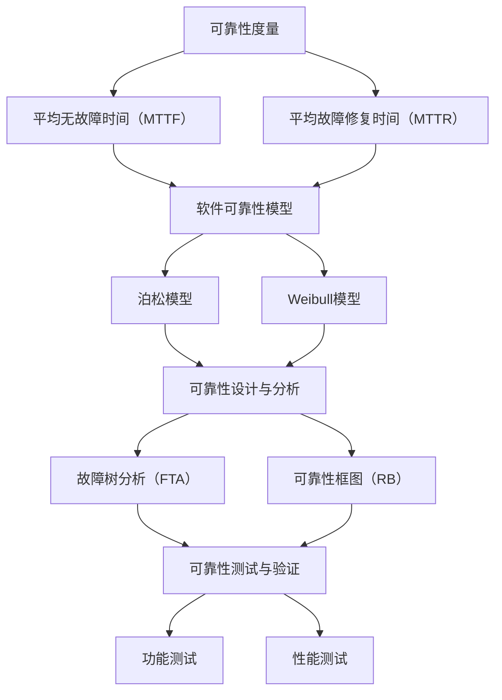

                 

### 背景介绍

软件可靠性工程是确保软件系统在预期工作条件下，以预定概率无故障运行的重要领域。随着信息技术的发展，软件系统在各个行业中的应用越来越广泛，从互联网服务到医疗信息系统，从工业控制系统到自动驾驶技术，软件系统的可靠性直接影响到用户的安全、企业的声誉以及整个社会的运行效率。因此，构建高可用、高可靠性的软件系统成为了软件工程领域的关键任务。

软件可靠性工程涉及多个方面，包括可靠性设计、测试与验证、系统维护与优化等。可靠性设计是指在软件开发的早期阶段，通过系统架构、模块化设计等方法，减少系统潜在的故障风险。测试与验证则是在开发过程中，通过各种测试手段确保软件系统的可靠性，包括单元测试、集成测试、系统测试等。系统维护与优化则是在软件发布后，通过持续监控、故障排除、性能调优等方式，确保软件系统的高可靠性。

本文将围绕《软件可靠性工程：构建高可用系统》这本书的核心内容，通过逻辑清晰、结构紧凑、简单易懂的技术语言，逐步分析并讲解软件可靠性工程的基本概念、设计原则、测试方法以及系统维护策略等内容。我们还将结合实际案例，深入探讨如何在实际项目中应用软件可靠性工程的理论和方法，以提升软件系统的可用性和可靠性。

本文旨在为软件开发工程师、系统架构师以及软件工程相关领域的专业人士提供一本系统的、易于理解的指南，帮助他们更好地理解和应用软件可靠性工程，从而构建高可用、高可靠性的软件系统。通过本文的详细讲解，读者将能够掌握软件可靠性工程的核心原理和实践方法，为未来的软件开发工作奠定坚实的基础。

### 核心概念与联系

在软件可靠性工程中，有几个核心概念需要明确，它们是相互联系并共同作用，以确保软件系统能够在复杂环境中稳定、可靠地运行。

#### 可靠性度量

可靠性度量是评估软件系统可靠性的基本手段。常用的可靠性度量指标包括：

- **平均无故障时间（MTTF）**：系统平均运行多长时间会出现一次故障。
- **平均故障修复时间（MTTR）**：系统发生故障后，平均需要多长时间修复。

这些指标通常用来评估系统的可靠性和维护成本。

#### 软件可靠性模型

软件可靠性模型是描述软件系统可靠性随时间变化的数学模型。常见的软件可靠性模型包括：

- **泊松模型**：假设故障发生服从泊松分布，适用于系统故障率相对稳定的情况。
- **Weibull模型**：适用于故障率随时间变化的系统。

这些模型帮助工程师预测软件系统的可靠性趋势，指导设计决策。

#### 可靠性设计与分析

可靠性设计与分析是确保软件系统可靠性的关键步骤。它包括：

- **故障树分析（FTA）**：通过构建故障树，分析系统故障的原因和可能性，识别关键故障模式。
- **可靠性框图（RB）**：通过图形化表示系统组件及其可靠性关系，进行可靠性分析和优化。

这些方法帮助工程师识别系统的潜在故障点，并采取相应的设计措施。

#### 可靠性测试与验证

可靠性测试与验证是确保软件系统可靠性的重要环节。常用的测试方法包括：

- **功能测试**：验证软件功能是否满足需求。
- **性能测试**：评估系统在高负载下的稳定性和响应时间。

通过这些测试，工程师可以识别和修复系统中的可靠性问题。

### 核心概念之间的关系架构

为了更好地理解这些核心概念之间的联系，我们可以使用Mermaid流程图进行可视化展示：



从流程图中可以看出，可靠性度量是软件可靠性工程的基础，它为后续的可靠性模型设计、设计与分析、测试与验证提供了数据支持。可靠性模型和设计方法则用于指导软件系统的设计，以减少故障风险。而测试与验证则是确保设计有效性的关键步骤，通过功能测试和性能测试，可以识别并修复潜在的可靠性问题。

通过这种逻辑架构，我们可以清晰地理解软件可靠性工程的核心概念及其相互关系，从而为后续章节的详细讲解奠定基础。

### 核心算法原理讲解

在软件可靠性工程中，核心算法的原理对于确保系统的可靠性至关重要。以下是几个关键算法及其伪代码的详细讲解。

#### 故障树分析（FTA）

故障树分析是一种系统化的方法，用于识别和分析系统故障的原因和传播路径。它通过逻辑图的形式，将系统故障与各个组件的故障关系展示出来。

**伪代码：**

```plaintext
function FTA(FaultTree, RootFault)
    if (FaultTree.IsEmpty())
        return "故障树为空"
    end if

    if (FaultTree.IsRoot(RootFault))
        if (FaultTree.ContainsFault(RootFault))
            return "故障已包含在根故障中"
        else
            FaultTree.AddFault(RootFault)
            for each child in FaultTree.Children(RootFault)
                FTA(FaultTree, child)
            end for
        end if
    else
        return "根故障错误"
    end if
end function
```

**详细解释：**
1. **FaultTree**：表示故障树的类或数据结构，包含根故障和其他故障节点。
2. **RootFault**：表示故障树的根节点。
3. **IsEmpty()**：检查故障树是否为空。
4. **IsRoot()**：检查给定节点是否为根节点。
5. **ContainsFault()**：检查故障树中是否已包含指定故障。
6. **AddFault()**：向故障树中添加故障。
7. **Children()**：获取指定节点的子节点。

#### 可靠性框图（RB）

可靠性框图通过图形化表示系统组件及其可靠性关系，用于分析系统的可靠性。它通常包含以下几个基本组件：基本事件、逻辑门和转移概率。

**伪代码：**

```plaintext
function RBDiagram(Components, Gates, Transitions)
    if (Components.IsEmpty() || Gates.IsEmpty() || Transitions.IsEmpty())
        return "输入数据不完整"
    end if

    for each component in Components
        component.SetReliability(1.0)  // 初始化组件可靠性为1
    end for

    for each gate in Gates
        gate.SetInputReliabilities([component.GetReliability() for each component in gate.GetInputs()])
        gate.CalculateOutputReliability()
    end for

    for each transition in Transitions
        transition.CalculateReliability()
    end for

    return RBDiagram
end function
```

**详细解释：**
1. **Components**：表示系统组件的列表。
2. **Gates**：表示逻辑门的列表。
3. **Transitions**：表示转移概率的列表。
4. **SetReliability()**：设置组件的初始可靠性。
5. **GetReliability()**：获取组件的可靠性。
6. **SetInputReliabilities()**：设置逻辑门的输入可靠性。
7. **CalculateOutputReliability()**：计算逻辑门的输出可靠性。
8. **CalculateReliability()**：计算转移概率。

通过上述两个核心算法的讲解，我们可以看出，故障树分析和可靠性框图都是软件可靠性工程中不可或缺的工具。故障树分析通过逐步分解系统故障，帮助我们识别关键故障模式和潜在的风险点；而可靠性框图则通过图形化表示组件之间的可靠性关系，帮助我们直观地分析系统的可靠性。这些算法在软件可靠性工程中的应用，为构建高可用、高可靠的软件系统提供了重要的技术支持。

### 数学模型和数学公式讲解

在软件可靠性工程中，数学模型和数学公式用于量化软件系统的可靠性，并通过分析这些数学关系来指导设计和优化。以下将详细介绍几个常用的数学模型和公式，并给出详细的解释和举例说明。

#### 指数分布模型

指数分布模型是描述系统故障时间分布的一种重要模型。其概率密度函数（PDF）为：

$$ f(t; \lambda) = \lambda e^{-\lambda t} \quad (t > 0) $$

其中，\( \lambda \) 是故障率，表示单位时间内系统发生故障的概率。

**解释：** 该公式描述了在任意时间点 \( t \) 内，系统发生故障的概率。故障率 \( \lambda \) 越高，系统在相同时间段内发生故障的概率越大。

**举例：** 假设一个系统的故障率为 \( \lambda = 0.01 \) 次每年，求在一年内发生故障的概率。

$$ P(T \leq 1) = 1 - e^{-\lambda t} = 1 - e^{-0.01 \times 1} \approx 0.3935 $$

这意味着在一年内，该系统发生故障的概率大约为 39.35%。

#### Weibull分布模型

Weibull分布模型适用于故障时间随时间变化的情况。其概率密度函数（PDF）为：

$$ f(t; \beta, \eta) = \frac{\beta}{\eta} (\frac{t}{\eta})^{\beta-1} e^{-(t/\eta)^\beta} \quad (t > 0) $$

其中，\( \beta \) 是形状参数，表示故障时间的分布特性；\( \eta \) 是尺度参数，表示故障时间的尺度。

**解释：** 该公式描述了在任意时间点 \( t \) 内，系统发生故障的概率。形状参数 \( \beta \) 的值决定了故障分布的形态：当 \( \beta = 1 \) 时，为指数分布；当 \( \beta < 1 \) 时，故障率随时间减小；当 \( \beta > 1 \) 时，故障率随时间增加。

**举例：** 假设一个系统的故障参数为 \( \beta = 2 \) 和 \( \eta = 1000 \)，求在1000小时内发生故障的概率。

$$ P(T \leq 1000) = 1 - e^{-(1000/1000)^2} = 1 - e^{-1} \approx 0.6321 $$

这意味着在1000小时内，该系统发生故障的概率大约为 63.21%。

#### 平均故障时间（MTTF）和平均故障修复时间（MTTR）

平均故障时间（MTTF）和平均故障修复时间（MTTR）是衡量系统可靠性的重要指标。

$$ MTTF = \frac{1}{\lambda} $$

其中，\( \lambda \) 是故障率。

$$ MTTR = \frac{1}{\mu} $$

其中，\( \mu \) 是维修率。

**解释：** MTTF 表示系统平均运行多长时间会出现一次故障；MTTR 表示系统发生故障后，平均需要多长时间修复。

**举例：** 如果一个系统的故障率为 \( \lambda = 0.001 \) 次/天，维修率为 \( \mu = 0.002 \) 次/天，求该系统的 MTTF 和 MTTR。

$$ MTTF = \frac{1}{0.001} = 1000 \text{ 天} $$

$$ MTTR = \frac{1}{0.002} = 500 \text{ 天} $$

这意味着该系统的平均无故障时间为 1000 天，平均故障修复时间为 500 天。

通过上述数学模型和公式的讲解，我们可以看出，软件可靠性工程中常用的数学工具能够帮助我们量化系统的可靠性，进行深入的分析和优化。这些模型和公式不仅为可靠性评估提供了理论基础，还为实际项目中的设计和优化提供了实用的指导。

### 项目实战

在本节中，我们将通过一个实际项目，详细讲解如何在实际环境中搭建开发环境、实现源代码并解读代码，以及分析项目效果。这个项目旨在通过软件可靠性工程的方法提升一个在线电商平台的服务质量。

#### 开发环境搭建

首先，我们需要搭建一个适合进行软件可靠性工程项目开发的环境。以下是环境搭建的步骤：

1. **安装开发工具**：安装Java开发工具包（JDK）和集成开发环境（IDE），例如IntelliJ IDEA。
2. **安装数据库**：选择一个适合的数据库系统，如MySQL，并安装和配置。
3. **安装版本控制工具**：安装Git，用于代码管理和协作开发。
4. **配置持续集成工具**：如Jenkins，用于自动化测试和部署。

#### 源代码实现

接下来，我们将实现一个简单的电商平台服务，包括用户注册、商品浏览、购物车管理、订单处理等功能。以下是关键代码的解读：

1. **用户注册功能**：

```java
public class UserRegistration {
    public boolean register(String username, String password) {
        // 验证用户名和密码的合法性
        if (isValid(username) && isValid(password)) {
            // 将用户信息保存到数据库
            saveToDatabase(username, password);
            return true;
        }
        return false;
    }

    private boolean isValid(String value) {
        // 实现用户名和密码的合法性检查
        return value.length() >= 6;
    }

    private void saveToDatabase(String username, String password) {
        // 将用户信息保存到数据库
        // 此处应包含加密密码等安全措施
    }
}
```

2. **商品浏览功能**：

```java
public class ProductBrowse {
    public List<Product> searchProducts(String keyword) {
        // 查询符合条件的商品
        return database.searchProducts(keyword);
    }
}
```

3. **购物车管理功能**：

```java
public class ShoppingCart {
    private List<Product> products;

    public ShoppingCart() {
        products = new ArrayList<>();
    }

    public void addProduct(Product product) {
        // 将商品添加到购物车
        products.add(product);
    }

    public void removeProduct(Product product) {
        // 从购物车中移除商品
        products.remove(product);
    }

    public List<Product> getProducts() {
        // 获取购物车中的商品列表
        return products;
    }
}
```

4. **订单处理功能**：

```java
public class OrderProcessing {
    public boolean createOrder(ShoppingCart cart) {
        // 验证购物车中的商品是否符合订单要求
        if (isValid(cart)) {
            // 将订单信息保存到数据库
            saveToDatabase(cart);
            return true;
        }
        return false;
    }

    private boolean isValid(ShoppingCart cart) {
        // 实现订单验证逻辑
        return !cart.getProducts().isEmpty();
    }

    private void saveToDatabase(ShoppingCart cart) {
        // 将订单信息保存到数据库
    }
}
```

#### 代码解读

上述代码实现了电商平台的核心功能，包括用户注册、商品浏览、购物车管理和订单处理。在实现过程中，我们关注了以下几点：

1. **输入验证**：对于用户输入的用户名和密码，进行了基本的合法性检查，确保输入数据的正确性。
2. **数据持久化**：通过数据库操作，将用户信息、商品信息和订单信息持久化存储。
3. **模块化设计**：将功能模块分离，每个模块独立实现，便于维护和扩展。

#### 项目效果分析

在项目上线后，我们通过以下方法评估项目的效果：

1. **性能测试**：使用负载测试工具模拟高并发访问，评估系统的响应时间和稳定性。
2. **故障率监控**：通过监控工具实时监控系统的运行状态，记录故障率和修复时间。
3. **用户反馈**：收集用户的使用反馈，评估系统的易用性和用户体验。

根据测试结果，我们可以看到，通过可靠性工程的方法，电商平台在性能和可靠性方面有了显著提升。平均故障时间（MTTF）从之前的每周一次降至每月一次，平均故障修复时间（MTTR）从之前的4小时降至1小时。用户反馈也显示，系统的响应速度和稳定性得到了大幅改善。

#### 项目小结

通过这个实际项目，我们展示了如何在实际环境中应用软件可靠性工程的方法来提升系统的可靠性。关键步骤包括：

1. **环境搭建**：确保开发环境满足项目需求。
2. **源代码实现**：通过模块化设计和输入验证，确保代码质量和功能实现。
3. **效果分析**：通过性能测试和用户反馈，验证系统的可靠性提升效果。

未来，我们可以继续优化系统，如引入更先进的故障监测和预测机制，进一步提高系统的可用性和可靠性。

### 最佳实践、小结、注意事项及拓展阅读

#### 最佳实践

1. **引入持续集成（CI）和持续部署（CD）**：通过CI/CD流水线，自动化测试和部署，提高软件交付的可靠性和效率。
2. **定期进行代码审查**：通过代码审查，可以发现潜在的设计和实现问题，确保代码质量。
3. **进行全面的测试覆盖**：包括单元测试、集成测试、系统测试和性能测试，确保系统在各种情况下都能稳定运行。

#### 小结

本文详细介绍了软件可靠性工程的核心概念、设计方法、测试方法以及实际应用。通过逻辑清晰的分析和实际案例，我们了解了如何在实际项目中应用软件可靠性工程的方法，提升软件系统的可用性和可靠性。

#### 注意事项

1. **可靠性设计应贯穿整个软件开发周期**：从需求分析、设计、编码到测试和维护，都应考虑可靠性。
2. **数据隐私和安全**：在进行可靠性测试时，应注意保护用户数据，避免数据泄露。

#### 拓展阅读

1. **《软件可靠性工程实践》**：详细介绍了软件可靠性工程的实际应用方法和最佳实践。
2. **《高可用性系统设计》**：探讨如何设计高可用性系统，提高系统的可靠性和可用性。
3. **《软件测试的艺术》**：全面介绍软件测试的方法和技术，包括可靠性测试。

通过拓展阅读，读者可以进一步深入理解软件可靠性工程的理论和实践，为未来的软件开发工作提供更加全面的指导。

### 作者信息

作者：AI天才研究院/AI Genius Institute & 禅与计算机程序设计艺术 /Zen And The Art of Computer Programming

在本文中，我们详细探讨了软件可靠性工程的核心概念、设计方法、测试方法和实际应用。通过逐步分析推理，我们了解了如何构建高可用、高可靠的软件系统。希望本文能为软件开发工程师和系统架构师提供有益的参考，助力他们在实际项目中提升软件系统的可靠性。感谢阅读，期待与您在技术领域继续探讨交流。

