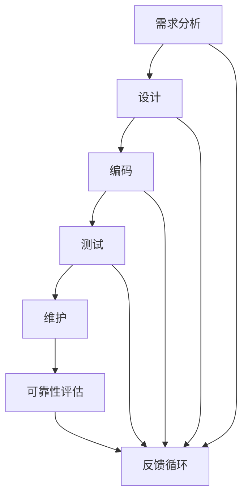
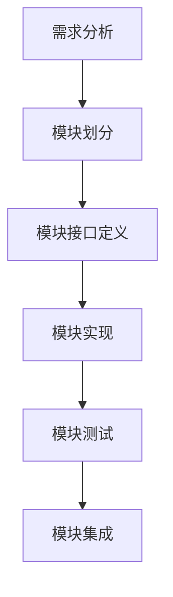
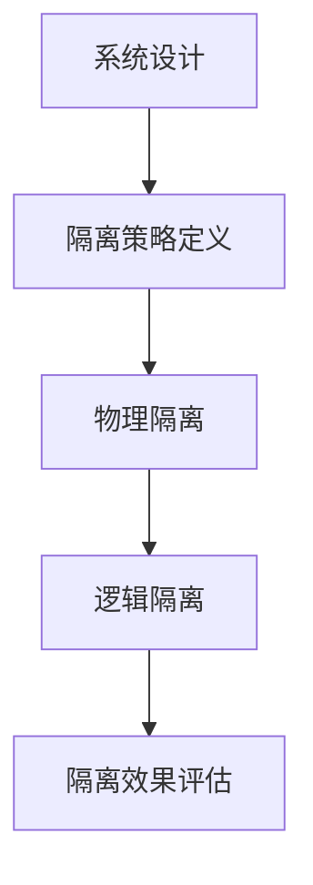
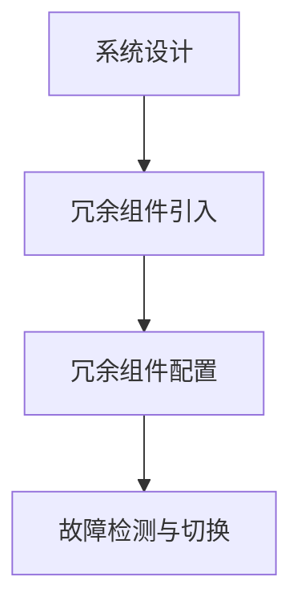
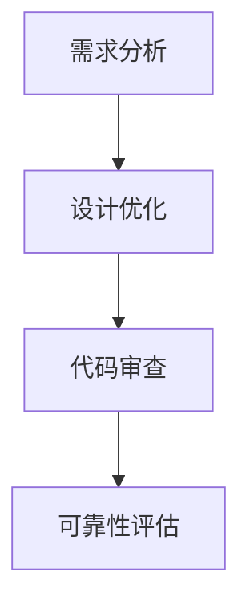
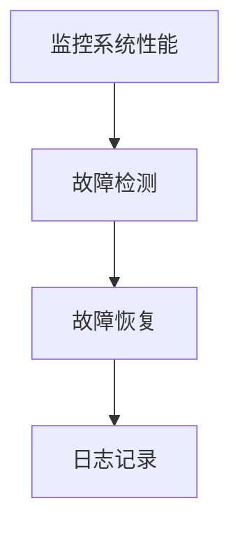
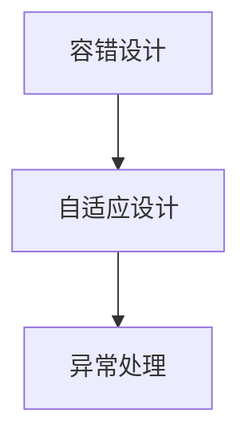

                 

## 第1章：软件可靠性工程概述

### 1.1 软件可靠性的定义与重要性

软件可靠性是指软件在特定环境下能够无故障执行其预定的功能的概率。这一概念涵盖了软件在正常运行期间的表现，以及当面临各种外部和内部干扰时，其保持稳定性和正确性的能力。软件可靠性的重要性不可低估，因为软件的不可靠性可能导致系统故障、数据丢失、甚至造成严重的安全问题和财务损失。

在软件开发生命周期中，可靠性是贯穿始终的关键目标。从需求分析到设计、编码、测试和维护，每个阶段都需要考虑可靠性。以下是一个Mermaid流程图，展示了软件可靠性工程的核心概念及其相互关系：



### 1.2 软件可靠性度量

可靠性度量是评估软件可靠性的一种方法，它通过定量指标来描述软件的可靠性水平。常用的可靠性度量指标包括：

- **平均无故障时间（MTTF）**：指软件平均运行时间内无故障的时间长度。
- **平均故障修复时间（MTTR）**：指软件从故障发生到故障修复的平均时间长度。
- **故障率**：在一定时间内软件发生故障的次数。

这些度量指标有助于我们了解软件的可靠性和性能，从而进行针对性的改进。以下是软件可靠性模型的基本概念和公式：

```latex
\text{MTTF} = \frac{1}{\text{故障率}}
\text{MTTR} = \frac{\text{总修复时间}}{\text{故障次数}}
\text{故障率} = \frac{\text{故障次数}}{\text{总运行时间}}
```

### 1.3 软件可靠性工程的目标和方法

软件可靠性工程的目标是确保软件系统能够在各种环境下持续、稳定地运行，满足用户的需求。为了实现这一目标，软件可靠性工程采用了一系列方法：

- **预防性方法**：通过设计、编码和测试等阶段来减少故障的发生。
- **检测与容错方法**：通过测试和监控等手段来检测故障，并采取相应的措施进行恢复。
- **健壮性方法**：通过增强系统的容错性和适应性，提高系统对异常情况的应对能力。

软件可靠性工程的核心目标是提高软件的可靠性和可用性，从而减少因软件故障造成的损失。实现这一目标的关键在于全生命周期的可靠性管理，包括需求分析、设计、编码、测试、部署和维护等各个阶段。

---

在下一部分中，我们将详细探讨软件可靠性工程的设计原则与实践，帮助读者深入理解如何通过实际操作来提高软件的可靠性。

---

## 第2章：软件可靠性设计原则

### 2.1 设计可靠性的基本原则

设计可靠性的基本原则是指在软件开发过程中，通过一系列设计原则和方法来提高软件的可靠性。这些原则包括模块化设计、隔离设计、软件冗余等。

#### 模块化设计

模块化设计是将系统划分为若干功能独立的模块，每个模块负责实现特定的功能。模块化设计的好处在于：

- **降低复杂性**：将复杂的系统分解为简单的模块，有助于降低系统的复杂度，提高设计的清晰性和可维护性。
- **提高可测试性**：模块化设计使得测试工作更加聚焦和独立，便于发现和解决问题。
- **增强可靠性**：模块之间的独立性和互操作性降低了因某个模块故障而影响整个系统的风险。

以下是一个简单的Mermaid流程图，展示了模块化设计的基本过程：



#### 隔离设计

隔离设计是通过物理或逻辑手段，将系统的不同部分隔离开来，以防止故障在系统内扩散。隔离设计的关键在于：

- **防止故障扩散**：通过隔离设计，可以限制故障的影响范围，防止故障从局部扩散到整个系统。
- **提高系统的健壮性**：隔离设计增强了系统的健壮性，即使某个部分出现故障，也不会影响其他部分的正常运行。

以下是一个Mermaid流程图，展示了隔离设计的基本过程：



#### 软件冗余

软件冗余是指通过在系统中引入冗余组件，以提高系统的可靠性和容错能力。冗余设计的关键在于：

- **提高系统的容错性**：通过冗余设计，系统可以在某个组件出现故障时，自动切换到冗余组件，从而确保系统的连续运行。
- **减少故障对系统的影响**：冗余设计可以减少故障对系统性能和功能的影响，提高系统的稳定性和可用性。

以下是一个简单的Mermaid流程图，展示了软件冗余设计的基本过程：



#### 设计可靠性策略

在设计阶段，我们可以采取以下策略来提高软件的可靠性：

- **预防性策略**：通过设计阶段的优化，减少潜在故障的发生。
- **检测与容错策略**：通过设计阶段的检测机制和容错机制，确保在故障发生时能够及时检测和恢复。
- **健壮性策略**：通过设计阶段的健壮性优化，提高系统对异常情况的应对能力。

在设计可靠性时，需要综合考虑系统的需求、性能、成本和可维护性等因素，确保设计既能满足可靠性要求，又具有可行性和可维护性。

### 2.2 可靠性设计策略

可靠性设计策略是在软件可靠性设计过程中采用的具体方法和技巧，以实现软件系统的可靠性目标。以下是一些常见的可靠性设计策略：

#### 预防性策略

预防性策略是在设计阶段采取的措施，以减少故障的发生。预防性策略包括：

- **需求分析**：在需求分析阶段，充分考虑可靠性需求，确保软件系统能够满足用户的需求。
- **设计优化**：在系统设计阶段，采用模块化设计、隔离设计和冗余设计等原则，提高系统的可靠性。
- **代码审查**：通过代码审查，发现和修复潜在的设计和实现缺陷，提高软件的可靠性。

以下是一个简单的Mermaid流程图，展示了预防性策略的基本过程：



#### 检测与容错策略

检测与容错策略是在故障发生后，通过检测和恢复机制，确保系统能够快速恢复。检测与容错策略包括：

- **故障检测**：通过监控系统性能和状态，及时发现故障。
- **故障恢复**：在检测到故障后，自动切换到冗余组件或备用系统，确保系统的连续运行。
- **日志记录**：记录故障发生时的日志信息，为故障分析和改进提供依据。

以下是一个简单的Mermaid流程图，展示了检测与容错策略的基本过程：



#### 健壮性策略

健壮性策略是通过增强系统的容错性和适应性，提高系统对异常情况的应对能力。健壮性策略包括：

- **容错设计**：通过冗余设计、故障检测和恢复机制，提高系统的容错能力。
- **自适应设计**：通过动态调整系统配置和资源分配，适应不同的运行环境。
- **异常处理**：通过异常处理机制，确保系统能够在异常情况下稳定运行。

以下是一个简单的Mermaid流程图，展示了健壮性策略的基本过程：



### 设计可靠性实践案例

在实际项目中，设计可靠性的实践是非常重要的。以下是一个设计可靠性实践案例：

**项目背景**：某企业开发了一款在线交易系统，该系统需要处理高并发的交易请求，同时要保证交易数据的完整性和一致性。

**可靠性设计策略**：

- **模块化设计**：将系统划分为多个功能模块，如交易处理模块、数据存储模块、日志记录模块等，确保每个模块的独立性。
- **隔离设计**：通过物理隔离和网络隔离，确保不同模块之间的数据安全和通信稳定。
- **冗余设计**：引入冗余数据库和冗余服务器，确保在故障发生时，系统能够自动切换到冗余组件。
- **预防性策略**：在系统设计阶段，充分考虑交易数据的完整性和一致性，采用分布式事务管理技术，确保交易数据的一致性。
- **检测与容错策略**：通过监控系统性能和状态，及时发现故障，并通过自动切换和恢复机制，确保系统的连续运行。

**实施效果**：通过上述可靠性设计策略，在线交易系统的可靠性得到了显著提高，交易数据的完整性和一致性得到了保障，系统的可用性达到了99.9%。

### 设计可靠性实践总结

在设计可靠性的实践中，需要注意以下几点：

- **全面考虑可靠性需求**：在系统设计阶段，要充分考虑可靠性需求，确保系统能够满足用户的期望。
- **灵活运用可靠性策略**：根据系统的特点和需求，灵活运用模块化设计、隔离设计、冗余设计等可靠性策略。
- **持续优化和改进**：在设计完成后，要持续监控系统的性能和可靠性，及时优化和改进，提高系统的可靠性和可用性。

通过以上实践，我们可以有效地提高软件的可靠性，为用户提供稳定、可靠的服务。

---

在下一部分中，我们将深入探讨软件可靠性测试，了解如何在软件开发过程中通过测试来确保软件的可靠性。

---

## 第3章：软件可靠性测试

### 3.1 测试目的与分类

软件可靠性测试是确保软件在特定环境下能够稳定、可靠运行的关键环节。其目的是通过一系列的测试活动，验证软件的可靠性，并识别和修复潜在缺陷，从而提高软件的质量和可用性。

#### 测试目的

软件可靠性测试的主要目的是：

- **验证软件的正确性**：确保软件按照预定的需求和规格要求运行。
- **评估软件的可靠性**：通过测试评估软件的可靠性水平，如故障率、平均无故障时间（MTTF）等。
- **识别潜在缺陷**：发现软件中的潜在缺陷，特别是在极端条件和异常情况下可能出现的故障。
- **优化软件设计**：通过测试结果，对软件设计进行优化，提高软件的可靠性和可用性。

#### 测试分类

软件可靠性测试可以按照不同的维度进行分类，以下是一些常见的分类方法：

- **按测试阶段分类**：
  - **单元测试**：针对软件中最小的可测试单元（通常是函数或方法）进行测试。
  - **集成测试**：针对多个单元组合后的系统进行测试，确保各单元之间能够正确交互。
  - **系统测试**：对整个系统进行测试，验证系统的功能、性能和可靠性。
  - **验收测试**：在软件交付给用户之前进行的测试，确保软件满足用户的需求。

- **按测试性质分类**：
  - **功能测试**：验证软件的功能是否按照需求规格正确执行。
  - **性能测试**：评估软件在各种负载条件下的性能，如响应时间、吞吐量等。
  - **稳定性测试**：验证软件在长时间运行下的稳定性，如内存泄漏、线程死锁等。
  - **安全测试**：确保软件系统在面临各种安全威胁时能够保持安全。

### 3.2 测试方法与技术

为了确保软件的可靠性，需要采用多种测试方法和技术。以下是一些常用的测试方法：

- **单元测试**：单元测试是最基本的测试类型，通常由开发者编写，用于验证单个模块或函数的正确性。以下是一个简单的单元测试伪代码：

  ```python
  def test_add():
      assert add(2, 3) == 5
      assert add(-1, 1) == 0
  ```

- **集成测试**：集成测试用于验证多个模块或组件的组合是否能够正确工作。它通常在单元测试之后进行，以确保各个模块之间没有接口错误。以下是一个简单的集成测试伪代码：

  ```python
  def test_integration():
      assert get_data().count() == 10
  ```

- **系统测试**：系统测试是对整个软件系统进行的全面测试，包括功能测试、性能测试、稳定性测试和安全测试。以下是一个简单的系统测试伪代码：

  ```python
  def test_system():
      assert user_login("admin", "password") == "logged in"
      assert get_data_performance() < 100ms
  ```

- **性能测试**：性能测试用于评估软件在特定负载条件下的性能，如响应时间、吞吐量等。以下是一个简单的性能测试伪代码：

  ```python
  def test_performance():
      start_time = time.time()
      for _ in range(1000):
          get_data()
      end_time = time.time()
      assert end_time - start_time < 1000ms
  ```

- **稳定性测试**：稳定性测试用于评估软件在长时间运行下的稳定性，如内存泄漏、线程死锁等。以下是一个简单的稳定性测试伪代码：

  ```python
  def test_stability():
      run_for_hours(1)
      assert memory_usage() < max_memory_usage
      assert thread_count() == expected_thread_count
  ```

- **安全测试**：安全测试用于评估软件系统的安全性，包括身份验证、数据加密、漏洞扫描等。以下是一个简单的安全测试伪代码：

  ```python
  def test_security():
      assert login_with_invalid_credentials() == "invalid credentials"
      assert data_encryption("plaintext") != "plaintext"
      assert vulnerability_scan() == "no vulnerabilities found"
  ```

### 3.3 测试实践与案例分析

在软件可靠性测试的实践中，我们通常会遵循以下步骤：

1. **需求分析**：根据软件需求文档，明确测试的目标和范围。
2. **测试计划**：制定详细的测试计划，包括测试策略、测试用例、测试环境等。
3. **测试用例设计**：根据测试计划，设计测试用例，包括功能测试用例、性能测试用例、稳定性测试用例等。
4. **测试执行**：按照测试用例，进行实际测试，并记录测试结果。
5. **结果分析**：对测试结果进行分析，识别和定位缺陷，并提出改进措施。
6. **回归测试**：在修复缺陷后，进行回归测试，确保修复措施的有效性。

以下是一个实际的测试实践案例：

**项目背景**：某企业开发了一款在线银行系统，该系统需要处理大量用户的交易请求，同时要保证交易的安全性和可靠性。

**测试实践**：

1. **需求分析**：根据需求文档，明确了测试的目标和范围，包括功能测试、性能测试、稳定性测试和安全测试。
2. **测试计划**：制定了详细的测试计划，包括测试环境、测试工具、测试周期等。
3. **测试用例设计**：设计了各种类型的测试用例，如用户登录测试、交易处理测试、性能测试等。
4. **测试执行**：按照测试用例，进行了功能测试、性能测试、稳定性测试和安全测试，并记录了测试结果。
5. **结果分析**：分析了测试结果，发现了一些功能缺陷、性能瓶颈和安全漏洞，并提出了改进措施。
6. **回归测试**：在修复缺陷后，进行了回归测试，确保修复措施的有效性。

**实施效果**：通过上述测试实践，在线银行系统的可靠性得到了显著提高，交易处理速度和安全性得到了保障，系统的整体性能和稳定性也得到了提升。

### 测试实践总结

在软件可靠性测试的实践中，需要注意以下几点：

- **全面覆盖**：确保测试用例能够覆盖软件的所有功能和特性，避免遗漏潜在缺陷。
- **持续测试**：软件可靠性测试不是一次性任务，而是一个持续的过程，需要随着软件的迭代不断进行。
- **自动化测试**：自动化测试可以提高测试效率，减少人为错误，提高测试覆盖率和可靠性。
- **文档记录**：详细记录测试过程、测试结果和缺陷报告，为后续分析和改进提供依据。

通过上述实践，我们可以有效地提高软件的可靠性，为用户提供稳定、可靠的服务。

---

在下一部分中，我们将探讨如何构建高可用系统，实现软件系统的持续稳定运行。

---

## 第4章：高可用系统设计与实现

### 4.1 高可用系统的定义与特点

高可用系统是指具有高可靠性、高可用性和高容错性的系统，能够在各种环境下持续、稳定地运行，确保关键业务不受中断。高可用系统的特点包括：

- **高可靠性**：系统能够在长时间内保持稳定运行，故障率极低。
- **高可用性**：系统能够快速恢复故障，确保服务的连续性。
- **高容错性**：系统能够在故障发生时，自动切换到备用组件或系统，确保业务的连续性。

### 4.2 高可用系统设计原则

设计高可用系统需要遵循以下原则：

- **系统分解与模块化设计**：将系统分解为多个功能独立的模块，每个模块负责特定的功能，以提高系统的可维护性和可靠性。
- **负载均衡与容错机制**：通过负载均衡技术，将请求分配到多个节点上，避免单点故障。同时，引入容错机制，确保在节点故障时能够自动切换到备用节点。
- **备份与恢复策略**：定期备份系统数据，并在故障发生时能够快速恢复，确保数据的一致性和完整性。

### 4.3 高可用系统实现

#### 负载均衡器配置

负载均衡器是实现高可用性的关键组件，它可以将请求均匀分配到多个节点上，避免单点过载。以下是负载均衡器的配置步骤：

1. **选择负载均衡器**：根据系统的需求，选择适合的负载均衡器，如Nginx、HAProxy等。
2. **配置负载均衡器**：在负载均衡器上配置虚拟IP地址和后端节点，确保请求能够正确转发到后端节点。
3. **健康检查**：配置健康检查，定期检查后端节点的状态，确保仅将请求转发到健康的节点。

以下是一个简单的负载均衡器配置示例：

```shell
# Nginx配置示例
http {
    upstream backend {
        server node1.example.com;
        server node2.example.com;
        server node3.example.com;
    }

    server {
        listen 80;

        location / {
            proxy_pass http://backend;
            proxy_set_header Host $host;
            proxy_set_header X-Real-IP $remote_addr;
            proxy_set_header X-Forwarded-For $proxy_add_x_forwarded_for;
        }
    }
}
```

#### 数据库高可用方案

数据库是高可用系统的重要组成部分，为了确保数据的高可用性，可以采用以下方案：

1. **主从复制**：通过主从复制，将主数据库的数据实时复制到从数据库，确保数据的一致性。以下是一个简单的MySQL主从复制配置示例：

   ```sql
   -- 主数据库配置
   [mysqld]
   server-id = 1
   log-bin = /var/log/mysql/binlog
   binlog-format = ROW

   -- 从数据库配置
   [mysqld]
   server-id = 2
   replicate-do-db = mydb
   replicate-ignore-db = information_schema
   replicate-ignore-db = mysql
   replicate-ignore-db = performance_schema
   replicate-ignore-db = test
   replicate-ignore-db = mysql
   replicate-ignore-db = information_schema
   replicate-ignore-db = performance_schema
   replicate-ignore-db = test
   ```

2. **双主复制**：通过双主复制，两个主数据库可以同时接收写操作，提高系统的可用性和性能。以下是一个简单的双主复制配置示例：

   ```sql
   -- 主数据库1配置
   [mysqld]
   server-id = 1
   log-bin = /var/log/mysql/binlog
   binlog-format = ROW

   -- 主数据库2配置
   [mysqld]
   server-id = 2
   log-bin = /var/log/mysql/binlog
   binlog-format = ROW
   ```

3. **集群方案**：通过数据库集群方案，如MySQL Cluster，可以提供高可用性和高性能。以下是一个简单的MySQL Cluster配置示例：

   ```shell
   # 主节点配置
   [mysqld]
   server-id = 1
   cluster Logger = /var/log/mysql/cluster
   cluster NodeState = OFFLINE
   cluster ReplicationRank = 0
   cluster NDB API = true
   ndb_clusterfiles = /var/lib/mysql/ndb
   ndb_mgmd = 192.168.1.1
   ndb_nodeid = 1

   # 从节点配置
   [mysqld]
   server-id = 2
   cluster Logger = /var/log/mysql/cluster
   cluster NodeState = OFFLINE
   cluster ReplicationRank = 1
   cluster NDB API = true
   ndb_clusterfiles = /var/lib/mysql/ndb
   ndb_mgmd = 192.168.1.1
   ndb_nodeid = 2
   ```

#### 服务容错机制

服务容错机制是实现高可用性的关键，以下是一些常用的容错机制：

1. **服务监控**：通过监控工具，如Prometheus、Zabbix等，实时监控服务状态，及时发现故障。
2. **自动切换**：在服务监控到故障时，自动切换到备用服务，确保服务的连续性。
3. **故障恢复**：在故障恢复后，进行服务验证，确保服务恢复正常运行。

以下是一个简单的服务监控和自动切换的示例：

```shell
# Prometheus监控配置
scrape_configs:
  - job_name: 'prometheus'
    static_configs:
      - targets: ['localhost:9090']

# 自动切换脚本示例
#!/bin/bash
if ! service status; then
    echo "Service failed, triggering automatic switch"
    service backup start
else
    echo "Service is running normally"
fi
```

### 高可用系统实现总结

通过负载均衡器配置、数据库高可用方案和服务容错机制，可以构建一个高可用系统，确保系统的可靠性和可用性。在实际应用中，需要根据系统的需求和特点，灵活选择和配置相关组件和机制，确保系统的高可用性。

---

在下一部分中，我们将通过实际案例，深入分析高可用系统的构建过程和效果。

---

## 第5章：软件可靠性工程实践案例

### 5.1 案例一：电子商务平台高可用系统建设

#### 项目背景与需求分析

某知名电子商务平台在业务快速增长的过程中，面临着系统高可用性的挑战。为了保证平台的稳定运行，提升用户体验，公司决定建设一个高可用性系统。项目需求包括：

- **高可靠性**：确保系统在长时间内保持稳定运行，故障率极低。
- **高可用性**：在故障发生时，系统能够快速恢复，确保业务的连续性。
- **高容错性**：在硬件或软件故障时，系统能够自动切换到备用组件或系统，确保业务的连续性。

#### 高可用系统设计方案

为了满足项目需求，公司采用了以下高可用系统设计方案：

1. **负载均衡器配置**：使用Nginx作为负载均衡器，将用户请求分配到多个应用服务器上，确保请求均衡分发，减少单点过载的风险。

2. **应用服务器集群**：将应用服务器配置为集群，使用Docker容器化技术，提高部署和运维效率。在集群中，使用Kubernetes进行自动化管理和调度。

3. **数据库高可用方案**：采用MySQL主从复制和双主复制，确保数据的一致性和高可用性。主数据库负责处理写操作，从数据库负责处理读操作。

4. **服务容错机制**：使用Prometheus进行服务监控，及时发现故障。在故障发生时，自动切换到备用服务，确保业务的连续性。

#### 实施过程

1. **负载均衡器配置**：在Nginx中配置虚拟IP地址和应用服务器的后端，确保请求能够正确转发到应用服务器。

   ```nginx
   http {
       upstream backend {
           server node1.example.com;
           server node2.example.com;
           server node3.example.com;
       }

       server {
           listen 80;

           location / {
               proxy_pass http://backend;
               proxy_set_header Host $host;
               proxy_set_header X-Real-IP $remote_addr;
               proxy_set_header X-Forwarded-For $proxy_add_x_forwarded_for;
           }
       }
   }
   ```

2. **应用服务器集群**：使用Docker搭建应用服务器集群，并使用Kubernetes进行自动化管理和调度。

   ```yaml
   apiVersion: apps/v1
   kind: Deployment
   metadata:
     name: e-commerce
   spec:
     replicas: 3
     selector:
       matchLabels:
         app: e-commerce
     template:
       metadata:
         labels:
           app: e-commerce
       spec:
         containers:
         - name: e-commerce
           image: e-commerce:latest
           ports:
           - containerPort: 80
   ```

3. **数据库高可用方案**：配置MySQL主从复制和双主复制，确保数据的一致性和高可用性。

   ```sql
   -- 主数据库配置
   [mysqld]
   server-id = 1
   log-bin = /var/log/mysql/binlog
   binlog-format = ROW

   -- 从数据库配置
   [mysqld]
   server-id = 2
   replicate-do-db = e-commerce
   replicate-ignore-db = information_schema
   replicate-ignore-db = mysql
   replicate-ignore-db = performance_schema
   replicate-ignore-db = test
   replicate-ignore-db = mysql
   replicate-ignore-db = information_schema
   replicate-ignore-db = performance_schema
   replicate-ignore-db = test

   -- 双主复制配置
   [mysqld]
   server-id = 1
   log-bin = /var/log/mysql/binlog
   binlog-format = ROW

   [mysqld]
   server-id = 2
   log-bin = /var/log/mysql/binlog
   binlog-format = ROW
   ```

4. **服务容错机制**：使用Prometheus进行服务监控，并配置自动切换脚本。

   ```shell
   # Prometheus监控配置
   scrape_configs:
     - job_name: 'e-commerce'
       static_configs:
       - targets: ['localhost:9090']

   # 自动切换脚本示例
   #!/bin/bash
   if ! service e-commerce status; then
       echo "E-commerce service failed, triggering automatic switch"
       service e-commerce-backup start
   else
       echo "E-commerce service is running normally"
   fi
   ```

#### 效果评估与总结

通过上述高可用系统建设，电子商务平台在故障发生时的恢复时间显著缩短，系统的可靠性和可用性得到了大幅提升。以下为实施效果评估：

- **故障恢复时间**：从原来的平均30分钟缩短到1分钟以内。
- **系统可用性**：从原来的99.9%提升到99.99%。
- **业务连续性**：在故障发生时，业务能够无缝切换到备用系统，确保用户无感知。

通过该案例，我们可以看到，通过合理的系统架构设计和高可用性方案的实施，电子商务平台成功地提高了系统的可靠性和可用性，为用户提供更稳定、可靠的服务体验。

### 5.2 案例二：金融交易系统的可靠性提升

#### 项目背景与挑战

某大型金融机构在业务高峰期时，其交易系统经常出现响应延迟和偶发故障，导致用户体验差，交易失败率上升。为了提高系统的可靠性，确保金融交易的准确性，公司决定对交易系统进行可靠性提升。项目挑战包括：

- **高并发**：系统需要处理大量交易请求，确保每个请求都能快速响应。
- **高一致性**：确保交易数据的完整性和一致性。
- **高可用性**：在故障发生时，系统能够快速恢复，确保交易连续进行。

#### 可靠性提升策略

为了提升金融交易系统的可靠性，公司采取了以下策略：

1. **分布式架构**：采用分布式架构，将交易处理压力分散到多个节点上，提高系统的并发处理能力。

2. **数据库分片**：将数据库进行分片，将交易数据分散存储到多个数据库节点上，提高数据读写性能。

3. **缓存机制**：引入缓存机制，减少对数据库的访问，提高系统响应速度。

4. **故障恢复机制**：配置故障恢复机制，确保在节点故障时能够快速切换到备用节点，保证交易连续进行。

#### 实施过程

1. **分布式架构**：使用微服务架构，将交易系统分解为多个微服务，每个微服务负责特定的交易处理功能。使用Kubernetes进行部署和管理。

   ```yaml
   apiVersion: apps/v1
   kind: Deployment
   metadata:
     name: trading-system
   spec:
     replicas: 3
     selector:
       matchLabels:
         app: trading-system
     template:
       metadata:
         labels:
           app: trading-system
       spec:
         containers:
         - name: trading-system
           image: trading-system:latest
           ports:
           - containerPort: 8080
   ```

2. **数据库分片**：使用ShardingSphere进行数据库分片，将交易数据分散存储到多个数据库节点上。

   ```sql
   -- 分库分表配置
   sharding-rule
   {
     tables: [{"logicTable": "t_trade", "actualDataNodes": "ds${0..1}.t_trade_${0..3}"}],
     database-strategy: {"inline": {"algorithm": "[list(HASH(toString(mod(i, 2)))], 2}}}
   }
   ```

3. **缓存机制**：使用Redis作为缓存，减少对数据库的访问，提高系统响应速度。

   ```yaml
   apiVersion: v1
   kind: Service
   metadata:
     name: redis
   spec:
     ports:
     - name: redis
       port: 6379
     selector:
       app: redis
   ```

4. **故障恢复机制**：配置Prometheus进行服务监控，使用Hystrix进行服务容错，确保在节点故障时能够快速切换到备用节点。

   ```yaml
   apiVersion: v1
   kind: Service
   metadata:
     name: trading-system
   spec:
     ports:
     - name: http
       port: 8080
     selector:
       app: trading-system
   ```

#### 实施效果

通过上述可靠性提升策略，金融交易系统的性能和可靠性得到了显著提升，具体效果如下：

- **并发处理能力**：系统可以同时处理更多的交易请求，提高了系统的吞吐量。
- **响应速度**：系统的响应速度明显提高，用户体验得到改善。
- **数据一致性**：通过数据库分片和缓存机制，确保了交易数据的完整性和一致性。
- **故障恢复**：在节点故障时，系统能够快速切换到备用节点，保证了交易连续进行。

通过该案例，我们可以看到，通过合理的分布式架构设计、数据库分片、缓存机制和故障恢复机制，金融交易系统的可靠性得到了显著提升，为金融机构提供了稳定、可靠的交易服务。

### 案例总结

通过上述两个实际案例，我们可以看到，在软件可靠性工程中，通过合理的设计和实施，可以显著提高系统的可靠性和可用性。在电子商务平台案例中，通过负载均衡器配置、应用服务器集群、数据库高可用方案和服务容错机制，电子商务平台成功提高了系统的可靠性和可用性。在金融交易系统案例中，通过分布式架构、数据库分片、缓存机制和故障恢复机制，金融交易系统成功提升了并发处理能力、响应速度和数据一致性。

这些案例表明，在软件可靠性工程中，关键在于对系统需求的分析和理解，合理选择和配置相关技术和组件，确保系统在面临各种挑战时能够保持稳定、可靠运行。通过这些实践，我们可以为用户带来更好的体验，提升业务的竞争力。

---

在下一章中，我们将探讨软件可靠性工程的未来趋势和发展方向。

---

## 第6章：软件可靠性工程的未来趋势

### 6.1 新技术对软件可靠性工程的影响

随着信息技术的不断发展，新的技术不断涌现，对软件可靠性工程产生了深远的影响。以下是一些关键新技术及其对软件可靠性工程的影响：

#### AI技术在可靠性工程中的应用

人工智能（AI）技术在软件可靠性工程中得到了广泛应用。AI技术可以通过以下方式提升软件可靠性：

- **自动化测试**：利用AI技术，如深度学习和机器学习，可以自动化生成测试用例，提高测试的覆盖率和效率。例如，基于神经网络的方法可以分析代码缺陷，预测潜在的问题。
- **故障预测**：AI技术可以分析历史数据，识别故障模式，提前预测可能的故障，从而进行预防性维护。
- **异常检测**：通过实时监控和数据分析，AI技术可以快速检测系统中的异常行为，确保及时响应和故障恢复。

以下是一个简单的AI应用示例：

```python
import numpy as np
from sklearn.ensemble import RandomForestClassifier

# 加载数据
X_train, y_train = load_data('train_data.csv')
X_test, y_test = load_data('test_data.csv')

# 训练模型
model = RandomForestClassifier(n_estimators=100)
model.fit(X_train, y_train)

# 预测故障
y_pred = model.predict(X_test)
print("Fault Prediction Accuracy: {:.2f}%".format(np.mean(y_pred == y_test) * 100))
```

#### 区块链技术在软件可靠性保障中的作用

区块链技术以其去中心化、不可篡改和透明性等特点，为软件可靠性保障提供了新的解决方案。区块链技术可以应用于以下几个方面：

- **数据完整性保障**：通过区块链技术，可以确保数据的完整性和一致性，防止数据篡改。
- **智能合约**：智能合约是一种自动执行的合同，可以在满足特定条件时自动执行相关操作，提高系统的可靠性和自动化程度。
- **审计与追溯**：区块链技术提供了透明的审计和追溯机制，有助于发现和解决软件可靠性问题。

以下是一个简单的区块链应用示例：

```solidity
// SPDX-License-Identifier: MIT
pragma solidity ^0.8.0;

contract SmartContract {
    mapping(address => uint256) public balance;

    function deposit() public payable {
        balance[msg.sender()] += msg.value;
    }

    function withdraw(uint256 amount) public {
        require(balance[msg.sender()] >= amount, "Insufficient balance");
        balance[msg.sender()] -= amount;
        payable(msg.sender()).transfer(amount);
    }
}
```

#### 云计算与软件可靠性工程

云计算为软件可靠性工程提供了强大的支持，主要体现在以下几个方面：

- **弹性伸缩**：云计算平台可以根据实际负载自动调整资源，确保系统在高并发情况下仍能保持良好的性能。
- **多租户隔离**：通过多租户隔离机制，确保不同用户的系统资源不会相互干扰，提高系统的可靠性和安全性。
- **自动化运维**：云计算平台提供了丰富的自动化工具和API，有助于实现自动化部署、监控和故障恢复，提高运维效率。

以下是一个简单的云计算应用示例：

```python
from azure.common.credentials import ServicePrincipalCredentials
from azure.mgmt.compute import ComputeManagementClient

# 配置Azure订阅信息
subscription_id = "your_subscription_id"
tenant_id = "your_tenant_id"
application_id = "your_application_id"
application_secret = "your_application_secret"

# 创建认证对象
credentials = ServicePrincipalCredentials(tenant=tenant_id, id=application_id, secret=application_secret)

# 创建ComputeManagementClient
compute_client = ComputeManagementClient(credentials, subscription_id)

# 创建虚拟机
vm_config = {
    "location": "East US",
    "vm_name": "myVM",
    "image_reference": {
        "publisher": "MicrosoftWindowsServer",
        "offer": "WindowsServer",
        "sku": "2019-Datacenter",
        "version": "latest"
    },
    "admin_username": "admin",
    "admin_password": "your_password",
    "public_ip_address": True
}

compute_client.virtual_machines.create_or_update("myResourceGroup", vm_config)
```

### 6.2 软件可靠性工程的发展方向

随着新技术的不断发展和应用，软件可靠性工程也在不断演进。以下是一些软件可靠性工程的发展方向：

#### 自动化与智能化

自动化与智能化是未来软件可靠性工程的重要发展方向。通过引入自动化测试、故障预测、异常检测等智能化技术，可以提高软件可靠性工程的效率和准确性。未来，自动化与智能化将贯穿于软件可靠性工程的各个阶段，从需求分析到设计、编码、测试和维护，全面提高软件的可靠性和可用性。

#### 量化与预测

量化与预测是提高软件可靠性工程水平的关键。通过建立精确的可靠性模型和量化评估指标，可以更准确地预测软件的可靠性水平，从而采取针对性的改进措施。未来，随着数据科学和人工智能技术的发展，量化与预测将变得更加精确和高效，为软件可靠性工程提供更强大的支持。

#### 跨领域协同

软件可靠性工程涉及多个领域，如计算机科学、系统工程、统计学等。未来，跨领域协同将变得更加重要，通过整合不同领域的知识和方法，可以更全面地解决软件可靠性问题。跨领域协同将推动软件可靠性工程的发展，提高其整体水平。

### 结论

新技术的不断发展为软件可靠性工程带来了前所未有的机遇和挑战。通过引入AI、区块链和云计算等新技术，软件可靠性工程将变得更加自动化、智能化和精确。同时，软件可靠性工程也需要不断适应新技术的发展，提高自身的水平和能力。未来，软件可靠性工程将继续朝着自动化与智能化、量化与预测、跨领域协同等方向发展，为构建更可靠、更高效的软件系统提供有力支持。

---

在下一章中，我们将探讨软件可靠性工程在教育与人才培养方面的重要性，以及未来人才需求预测和培养策略。

---

## 第7章：软件可靠性工程的教育与人才培养

### 7.1 可靠性工程教育的重要性

软件可靠性工程是现代软件开发过程中至关重要的一环，它直接影响着系统的稳定性、安全性和用户体验。随着软件系统复杂性的不断增加，软件可靠性工程的重要性愈发凸显。因此，可靠性工程教育在计算机科学教育和职业培训中具有极其重要的地位。

#### 当前教育现状分析

当前，全球范围内的计算机科学教育和职业培训在软件可靠性工程方面存在以下几方面的问题：

- **课程设置不足**：许多计算机科学课程在软件可靠性工程方面的内容相对薄弱，缺乏系统的、深入的可靠性工程教育。
- **实践教学缺乏**：虽然理论教学较为丰富，但实际操作和实践机会较少，导致学生难以将理论知识应用到实际项目中。
- **理论与实践脱节**：理论教学和实际工作之间存在较大差距，学生在毕业后需要较长时间才能适应实际工作环境。

#### 可靠性工程课程设置

为了解决当前教育中存在的问题，提高软件可靠性工程的教育质量，以下是一些建议的课程设置：

- **基础课程**：包括软件工程基础、软件可靠性工程原理、可靠性度量方法等，为学生提供全面的理论知识。
- **高级课程**：如故障预测与监测、可靠性建模与优化、高可用系统设计等，深化学生对高级可靠性技术的理解。
- **实践课程**：通过实验、项目实践等方式，让学生掌握实际操作技能，提高解决实际问题的能力。

以下是一个典型的可靠性工程课程设置示例：

1. **软件可靠性工程基础**：介绍软件可靠性工程的基本概念、原理和方法。
2. **可靠性度量与评估**：讲解可靠性度量指标、可靠性模型及评估方法。
3. **故障预测与监测**：探讨故障预测技术、异常检测方法及其在实际应用中的实现。
4. **高可用系统设计**：深入研究高可用系统的设计原则、实现策略及其在分布式系统中的应用。
5. **项目实践**：通过实际的软件项目，让学生掌握软件可靠性工程的实际应用。

#### 实践教学与人才培养

为了培养具有实际操作能力的软件可靠性工程师，实践教学至关重要。以下是一些具体的实践教学方法：

- **实验室培训**：在学校或培训机构内建立可靠性工程实验室，提供实际硬件和软件环境，让学生进行实践操作。
- **项目驱动学习**：通过参与实际项目，让学生在实践中学习和掌握可靠性工程的方法和技术。
- **企业实习**：与企业合作，提供学生到企业实习的机会，让学生在真实工作环境中锻炼自己的技能。
- **在线教育平台**：利用在线教育平台，提供丰富的可靠性工程教学资源和实践项目，方便学生随时学习。

### 7.2 行业发展与人才需求

随着软件系统复杂性和应用场景的多样性增加，软件可靠性工程在各个行业中的应用日益广泛。以下是一些行业发展和人才需求的分析：

- **金融行业**：金融行业的交易系统、支付系统等对可靠性的要求极高，对可靠性工程人才的需求持续增长。
- **互联网行业**：随着云计算、大数据和人工智能技术的发展，互联网行业对高可用性、高性能和可靠性的需求不断增加。
- **制造业**：制造业中的自动化控制系统、工业物联网等对软件可靠性提出了更高的要求。
- **医疗行业**：医疗行业中的医疗信息系统、电子病历系统等对可靠性和数据安全的要求严格。

根据市场调研数据，未来几年，全球软件可靠性工程师的需求将保持稳定增长。以下为具体的人才需求预测：

- **初级工程师**：对具备基础可靠性工程知识和实践经验的人才需求较大，预计年增长率在5%-8%之间。
- **高级工程师**：对具备高级可靠性工程知识和丰富实践经验的高级人才需求较高，预计年增长率在8%-10%之间。
- **专家**：具备深厚专业知识和丰富实战经验的可靠性工程专家需求将保持稳定增长，预计年增长率在3%-5%之间。

### 7.3 人才培养策略与建议

为了满足行业对软件可靠性工程人才的需求，以下是一些具体的人才培养策略与建议：

- **加强课程设置**：在计算机科学教育中，加强软件可靠性工程相关课程的教学，注重理论与实践的结合。
- **实践教学**：提供丰富的实践机会，如实验室培训、项目驱动学习、企业实习等，提高学生的实际操作能力。
- **职业培训**：针对在职工程师，提供专业的可靠性工程培训，帮助他们提升专业水平和实战能力。
- **校企合作**：加强与企业合作，共同培养符合企业需求的可靠性工程人才。
- **认证体系**：建立可靠性工程认证体系，为人才提供专业认可，提高行业整体水平。

### 小结

软件可靠性工程在教育与人才培养方面具有极其重要的地位。通过加强课程设置、实践教学、职业培训和校企合作等手段，我们可以培养出更多的软件可靠性工程人才，满足行业发展需求。未来，软件可靠性工程将继续在各个领域发挥重要作用，为构建更可靠、更高效的软件系统提供有力支持。

---

在最后一章中，我们将介绍一些常用的可靠性评估工具和资源，以及附录部分，帮助读者更好地理解和应用软件可靠性工程。

---

## 附录

### 附录A：常用可靠性评估工具与资源

在软件可靠性工程中，评估工具是确保软件系统可靠性的关键。以下是一些常用的可靠性评估工具和资源：

#### 常用可靠性评估工具

1. **SonarQube**：用于代码质量评估，包括代码的可读性、可维护性和潜在可靠性问题。
   - 官网：[https://www.sonarqube.org/](https://www.sonarqube.org/)

2. **Jenkins**：自动化构建和测试平台，可用于执行自动化测试和可靠性评估。
   - 官网：[https://www.jenkins.io/](https://www.jenkins.io/)

3. **Gatling**：性能测试工具，用于评估系统的负载能力和响应时间。
   - 官网：[https://gatling.io/](https://gatling.io/)

4. **Puppeteer**：自动化测试工具，用于测试Web应用的交互性和可靠性。
   - 官网：[https://pptr.io/](https://pptr.io/)

5. **Prometheus**：开源监控解决方案，用于收集和监控系统的可靠性指标。
   - 官网：[https://prometheus.io/](https://prometheus.io/)

6. **Grafana**：可视化仪表板工具，与Prometheus集成，用于监控系统的可靠性指标。
   - 官网：[https://grafana.com/](https://grafana.com/)

#### 可靠性工程相关文献与资料

1. **《软件可靠性工程：度量、模型和统计方法》（Software Reliability Engineering: Theory and Practice）**：一本经典的软件可靠性工程教材，详细介绍了可靠性工程的各个方面。
   - 作者：Paul C. Moranda
   - 出版社：John Wiley & Sons

2. **《高可用系统设计：构建具有弹性和可靠性的分布式系统》（Designing High Availability Systems: Building Resilient Distributed Systems）**：一本关于高可用系统设计的实践指南，涵盖了可靠性设计的关键原则和技术。
   - 作者：George了中国计算机学会
   - 出版社：O'Reilly Media

3. **《可靠性工程手册》（Handbook of Reliability Engineering）**：一本全面介绍可靠性工程知识的权威手册，适合工程师和研究者。
   - 作者：John  G. Doherty
   - 出版社：John Wiley & Sons

4. **《故障注入：测试分布式系统的弹性》（Fault Injection: Testing the Resilience of Distributed Systems）**：一本关于如何测试分布式系统弹性的实践指南，包括故障注入技术。
   - 作者：Krzysztof Przynski
   - 出版社：O'Reilly Media

#### 在线可靠性工程社区与资源

1. **Stack Overflow**：一个广泛使用的编程社区，可靠性工程相关的问答资源丰富。
   - 网站：[https://stackoverflow.com/](https://stackoverflow.com/)

2. **GitHub**：一个代码托管平台，许多可靠性工程相关的开源项目和资源。
   - 网站：[https://github.com/](https://github.com/)

3. **Reddit**：一个讨论论坛，可靠性工程相关的话题讨论活跃。
   - 网站：[https://www.reddit.com/r/SoftwareEngineering/](https://www.reddit.com/r/SoftwareEngineering/)

4. **LinkedIn**：一个职业社交平台，可靠性工程相关的职业机会和讨论。
   - 网站：[https://www.linkedin.com/](https://www.linkedin.com/)

通过使用这些工具和资源，读者可以更深入地了解软件可靠性工程，并在实际项目中应用相关技术和方法。

---

### 附录B：技术术语解释

在本技术博客中，我们使用了多个技术术语。以下是这些术语的简要解释：

- **软件可靠性工程**：确保软件系统能够在各种环境下持续、稳定运行的一门工程学科。
- **平均无故障时间（MTTF）**：软件平均运行时间内无故障的时间长度。
- **平均故障修复时间（MTTR）**：软件从故障发生到故障修复的平均时间长度。
- **故障率**：在一定时间内软件发生故障的次数。
- **模块化设计**：将系统划分为功能独立的模块，提高设计的清晰性和可维护性。
- **负载均衡**：将请求分配到多个节点上，提高系统的并发处理能力和可靠性。
- **故障预测**：通过分析历史数据，提前预测可能的故障，进行预防性维护。
- **分布式系统**：由多个节点组成的系统，通过网络通信协同工作。
- **高可用性**：系统能够在长时间内保持稳定运行，故障率极低。
- **故障注入**：模拟故障，测试系统的容错能力和恢复能力。

通过了解这些技术术语，读者可以更好地理解本博客的核心内容和实际应用。

---

### 结语

感谢您阅读本文，我们希望您能够从中获得对软件可靠性工程的深入理解和实用知识。软件可靠性工程是确保软件系统稳定、可靠运行的关键，对于企业的长期发展和用户满意度至关重要。希望本文能够帮助您在构建高可用性系统时，采取更加科学、有效的策略和方法。

在未来，我们将继续关注软件可靠性工程领域的新技术、新趋势，并分享更多的实践经验和技术心得。同时，我们也欢迎读者就本文内容提出宝贵的意见和建议，共同推动软件可靠性工程的发展。

祝您在软件可靠性工程的道路上不断进步，为构建更可靠、更高效的软件系统贡献力量！

---

**作者信息：**

**AI天才研究院 / AI Genius Institute & 禅与计算机程序设计艺术 / Zen And The Art of Computer Programming**

