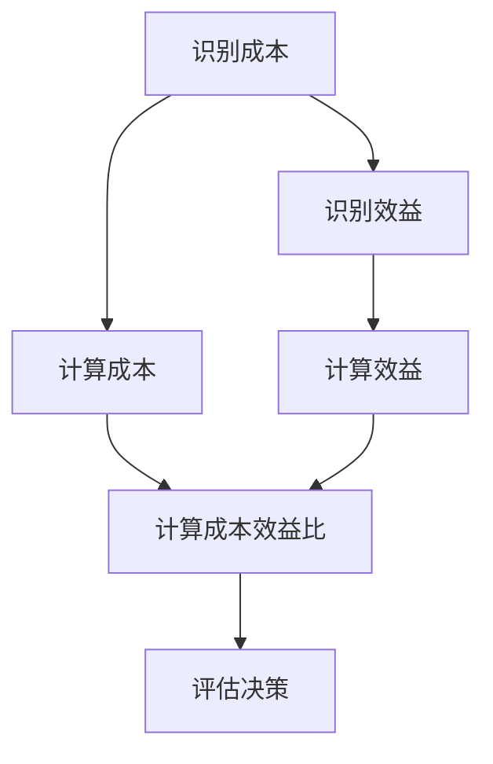
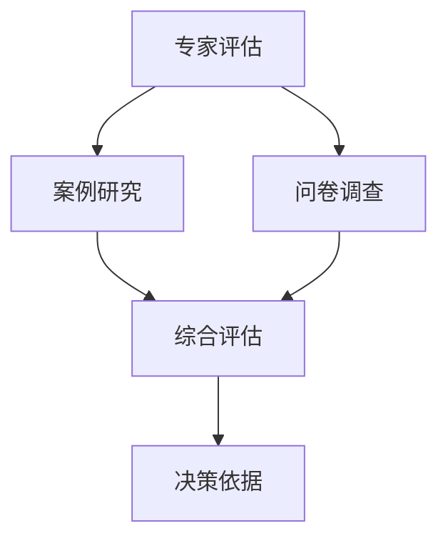

                 

### 文章标题

《软件架构决策的经济学：成本效益分析》

### 关键词

软件架构、成本效益分析、经济学、决策、流程图、伪代码、数学模型、项目实战

### 摘要

本文深入探讨了软件架构决策过程中的经济学原理，特别是成本效益分析在软件架构设计中的应用。通过详细分析成本效益分析的基本概念、方法和实践，本文为软件开发者提供了一种系统的决策框架，以帮助他们在复杂的项目中做出更为合理的架构选择。文章分为五个主要部分：引言、成本效益分析的理论基础、软件架构决策中的成本效益分析、案例研究和附录。通过Mermaid流程图、伪代码、LaTeX数学公式和实际项目实战，文章旨在帮助读者全面理解并应用成本效益分析于软件架构决策中。

---

### 引言

软件架构是软件开发过程中的核心环节，它决定了系统的性能、可扩展性、维护性和可靠性。然而，软件架构的决策并非易事，它涉及多种技术、业务和经济学因素。在这其中，成本效益分析成为一种重要的决策工具，它帮助开发团队在有限的资源下，最大化项目的价值和效益。

成本效益分析（Cost-Benefit Analysis, CBA）是一种评估决策可行性的方法，它通过比较项目的成本和预期效益，来评估决策的合理性和可行性。在软件架构决策中，成本效益分析可以帮助团队从经济学的角度评估不同架构方案的优势和劣势，从而做出最优选择。

本文将围绕软件架构决策的经济学展开，重点探讨成本效益分析在其中的应用。文章首先介绍成本效益分析的基本概念和方法，然后深入探讨它在软件架构决策中的具体应用，并通过实际案例来展示如何进行成本效益分析。希望通过本文的阐述，读者能够更好地理解成本效益分析的重要性，并学会在实际项目中应用这一方法。

### 核心概念与联系

在深入探讨软件架构决策的经济学之前，我们首先需要了解几个核心概念，并分析它们之间的关系。

#### 成本

成本是经济学中的基础概念，它指的是为获得某种收益所付出的代价。在软件架构决策中，成本可以分为以下几类：

- **开发成本**：包括人力、硬件、软件、数据中心等资源的投入。
- **运营成本**：包括服务器维护、数据存储、带宽消耗等日常运营费用。
- **维护成本**：包括修复漏洞、优化性能、更新系统等长期维护成本。

#### 效益

效益是项目实施后带来的积极影响和收益。在软件架构决策中，效益通常包括：

- **直接效益**：如增加收入、降低运营成本、提高工作效率等。
- **间接效益**：如提升品牌形象、提高客户满意度、增加市场份额等。

#### 成本效益比

成本效益比（Cost-Benefit Ratio, CBR）是衡量成本和效益之间关系的一个指标，它通过将总成本与总效益进行比较，来评估项目的经济可行性。计算公式如下：

$$
CBR = \frac{总效益}{总成本}
$$

成本效益比越高，说明项目的效益相对成本而言越显著，决策的合理性也越高。

#### Mermaid 流程图

为了更好地理解成本和效益之间的关系，我们可以使用Mermaid流程图来展示软件架构决策中的成本效益分析流程。以下是一个简单的流程图示例：



在图中，A表示识别项目的各项成本，B表示计算这些成本；C表示识别项目的各项效益，D表示计算这些效益；E表示计算成本效益比，F表示根据成本效益比评估项目的可行性，并做出决策。

通过这个流程图，我们可以清晰地看到成本效益分析在软件架构决策中的关键作用。它不仅帮助开发团队量化成本和效益，还为他们提供了一种科学的决策依据。

### 成本效益分析的基本原理

成本效益分析（CBA）是一种评估决策可行性的方法，通过比较项目的成本和预期效益，来评估决策的合理性和可行性。在软件架构决策中，成本效益分析可以帮助团队从经济学的角度评估不同架构方案的优势和劣势，从而做出最优选择。

#### 成本效益分析的核心概念

成本效益分析涉及以下几个核心概念：

- **成本**：成本是指为获得某种收益所付出的代价，包括开发成本、运营成本和维护成本。
- **效益**：效益是项目实施后带来的积极影响和收益，包括直接效益和间接效益。
- **成本效益比**：成本效益比（Cost-Benefit Ratio, CBR）是衡量成本和效益之间关系的一个指标，计算公式为：

  $$
  CBR = \frac{总效益}{总成本}
  $$

  成本效益比越高，说明项目的效益相对成本而言越显著，决策的合理性也越高。

#### 成本效益分析的方法

成本效益分析通常采用以下方法：

1. **成本识别**：首先，需要识别项目的各项成本，包括开发成本、运营成本和维护成本。这可以通过项目计划、预算和资源需求分析来完成。
   
2. **效益识别**：接着，需要识别项目的各项效益，包括直接效益和间接效益。这可以通过市场调研、用户反馈和业务目标分析来完成。

3. **成本计算**：计算项目的总成本，包括开发成本、运营成本和维护成本。这可以通过财务分析和成本估算来完成。

4. **效益计算**：计算项目的总效益，包括直接效益和间接效益。这可以通过财务分析、市场调研和业务目标分析来完成。

5. **成本效益比计算**：计算项目的成本效益比，通过总效益除以总成本。这可以通过简单的数学计算来完成。

6. **决策评估**：根据成本效益比评估项目的可行性，如果成本效益比大于1，说明项目的效益超过成本，可以考虑实施；如果成本效益比小于1，说明项目的效益低于成本，需要重新评估或调整。

#### 伪代码

以下是一个简单的伪代码，用于计算成本效益比：

```plaintext
function calculateCBR(totalCost, totalBenefit):
    cbr = totalBenefit / totalCost
    return cbr
```

通过这个伪代码，我们可以看到计算成本效益比的基本步骤。首先，输入项目的总成本和总效益，然后通过除法计算成本效益比，最后输出结果。

#### 数学模型和公式

成本效益分析中的数学模型和公式主要用于计算成本、效益和成本效益比。以下是几个常用的公式：

1. **总成本计算**：

   $$
   总成本 = 开发成本 + 运营成本 + 维护成本
   $$

2. **总效益计算**：

   $$
   总效益 = 直接效益 + 间接效益
   $$

3. **成本效益比计算**：

   $$
   CBR = \frac{总效益}{总成本}
   $$

#### 举例说明

假设一个软件项目的总成本为100万元，其中开发成本为50万元，运营成本为30万元，维护成本为20万元。项目的总效益为150万元，其中直接效益为100万元，间接效益为50万元。

根据上述公式，我们可以计算出：

- **总成本**：100万元
- **总效益**：150万元
- **成本效益比**：

  $$
  CBR = \frac{150}{100} = 1.5
  $$

由于成本效益比大于1，说明项目的效益超过成本，是一个可行的决策。

通过这个例子，我们可以看到如何使用成本效益分析的方法来评估一个软件项目的经济可行性。

### 成本效益分析的方法与工具

在软件架构决策中，成本效益分析是一种关键的决策工具，它帮助开发团队在复杂的软件开发项目中做出经济合理的决策。为了有效地进行成本效益分析，我们需要了解一些常用的方法和工具。

#### 成本效益分析模型

成本效益分析模型是一种结构化的方法，用于评估不同架构方案的成本和效益。常见的成本效益分析模型包括：

1. **增量成本效益分析**：这种方法关注于评估新架构方案相对于现有架构方案的成本和效益增量。通过计算增量成本和增量效益，可以更准确地评估新架构方案的可行性。

2. **总成本效益分析**：这种方法计算整个软件生命周期内的总成本和总效益，从而评估整个项目的经济可行性。

3. **敏感性分析**：敏感性分析是一种评估成本和效益对变量变化的敏感性的方法。通过敏感性分析，可以了解项目在不同情景下的经济表现，从而为决策提供更全面的依据。

#### 成本效益分析工具

为了高效地进行成本效益分析，我们可以使用一些专门设计的工具。以下是一些常用的成本效益分析工具：

1. **成本效益分析软件**：如Excel、Google Sheets等电子表格工具，可以用于计算成本、效益和成本效益比。通过公式和函数，可以自动化成本效益分析的计算过程。

2. **项目管理软件**：如JIRA、Trello等项目管理工具，可以帮助团队跟踪项目成本和进度，从而为成本效益分析提供数据支持。

3. **数据可视化工具**：如Tableau、Power BI等数据可视化工具，可以用于展示成本效益分析的结果，帮助团队更直观地理解数据。

#### Mermaid 流程图

为了更好地理解成本效益分析在软件架构决策中的应用，我们可以使用Mermaid流程图来展示整个分析过程。以下是一个简单的Mermaid流程图示例：


在图中，A表示识别项目的各项成本，B表示计算这些成本；C表示识别项目的各项效益，D表示计算这些效益；E表示计算成本效益比，F表示根据成本效益比评估项目的可行性，并做出决策。

通过这个流程图，我们可以清晰地看到成本效益分析在软件架构决策中的关键作用。它不仅帮助开发团队量化成本和效益，还为他们提供了一种科学的决策依据。

### 成本效益分析的定量分析方法

在软件架构决策中，定量分析方法是一种关键的工具，它通过精确的数值计算，帮助我们更好地理解成本和效益之间的关系。以下将介绍几种常用的定量分析方法。

#### 成本计算方法

1. **固定成本与变动成本**：在成本计算中，固定成本和变动成本是两个重要的概念。固定成本是指不随项目规模变化而变化的成本，如人员工资、服务器租赁费用等。变动成本则是指随项目规模变化而变化的成本，如开发材料费用、带宽消耗等。

   公式如下：

   $$
   总成本 = 固定成本 + (变动成本 \times 项目规模)
   $$

2. **边际成本**：边际成本是指增加一个单位生产或服务所增加的成本。在软件开发中，边际成本可以帮助我们了解每个新增功能或服务点的成本。

   公式如下：

   $$
   边际成本 = \frac{\text{新增总成本}}{\text{新增服务或功能点}}
   $$

#### 效益计算方法

1. **直接效益**：直接效益是指项目直接带来的收益，如销售收入、成本节约等。

   公式如下：

   $$
   直接效益 = \text{总收入} - \text{总成本}
   $$

2. **间接效益**：间接效益是指项目间接带来的收益，如品牌提升、客户忠诚度提高等。

   公式如下：

   $$
   间接效益 = \text{品牌价值提升} + \text{客户忠诚度提升} + \text{其他间接收益}
   $$

#### 成本效益比计算方法

成本效益比（Cost-Benefit Ratio, CBR）是衡量成本和效益之间关系的一个关键指标，其计算公式如下：

$$
CBR = \frac{\text{总效益}}{\text{总成本}}
$$

#### 敏感性分析

敏感性分析是一种评估项目成本和效益对变量变化的敏感性的方法。通过敏感性分析，我们可以了解在不同情景下项目的经济效益表现。

1. **单变量敏感性分析**：单变量敏感性分析关注于单个变量对成本效益比的影响。通过计算不同变量取值下的成本效益比，我们可以了解这些变量对项目可行性的影响。

2. **多变量敏感性分析**：多变量敏感性分析考虑多个变量之间的相互作用。通过构建数学模型，我们可以分析多个变量同时变化时对成本效益比的影响。

以下是一个简单的伪代码示例，用于进行敏感性分析：

```plaintext
function sensitivityAnalysis(costs, benefits):
    for each variable in costs:
        calculate CBR with variable changed
    for each variable in benefits:
        calculate CBR with variable changed
    return sensitivity results
```

通过这个伪代码，我们可以看到如何通过改变成本和效益的变量，来评估项目的成本效益比变化。

#### 举例说明

假设一个软件项目，其总成本为500万元，总效益为700万元。我们需要进行敏感性分析，以了解成本和效益变化对项目可行性的影响。

1. **成本变化**：

   - 变动成本为200万元，固定成本为300万元。
   - 当变动成本增加20%时，总成本变为600万元。
   - 当变动成本减少20%时，总成本变为400万元。

   计算不同成本下的成本效益比：

   $$
   CBR_1 = \frac{700}{500} = 1.4
   $$
   $$
   CBR_2 = \frac{700}{600} = 1.17
   $$
   $$
   CBR_3 = \frac{700}{400} = 1.75
   $$

   可以看到，成本增加会降低成本效益比，而成本减少则会提高成本效益比。

2. **效益变化**：

   - 直接效益为500万元，间接效益为200万元。
   - 当直接效益增加20%时，总效益变为600万元。
   - 当直接效益减少20%时，总效益变为400万元。

   计算不同效益下的成本效益比：

   $$
   CBR_1 = \frac{600}{500} = 1.2
   $$
   $$
   CBR_2 = \frac{400}{500} = 0.8
   $$

   可以看到，效益增加会提高成本效益比，而效益减少会降低成本效益比。

通过敏感性分析，我们可以更好地了解项目在不同情景下的经济表现，从而为决策提供更全面的依据。

### 成本效益分析的定性分析方法

虽然定量分析方法在软件架构决策中至关重要，但定性分析方法同样不可或缺。定性分析方法通过专家评估、案例研究和问卷调查等手段，帮助我们深入理解成本效益分析的背景和实际应用，提供更全面和细致的决策依据。

#### 专家评估

专家评估是一种基于专业知识和经验的分析方法，通过专家的意见和判断来评估成本效益。这种方法的优势在于能够快速获取深度的见解和专业的建议，特别适用于复杂和不确定的决策环境。以下是专家评估的步骤：

1. **确定专家**：选择具备相关领域知识和经验的专业人士，确保他们的评估具有权威性和可信度。
2. **制定评估标准**：明确评估的具体指标和标准，如成本、效益、技术可行性等。
3. **收集评估意见**：通过访谈、问卷或讨论会等形式，收集专家对各项指标的评估意见。
4. **综合评估结果**：将多个专家的意见进行综合，形成统一的评估结论。

#### 案例研究

案例研究是一种通过分析具体案例来提取经验和教训的方法。通过对成功或失败案例的深入分析，我们可以了解成本效益分析在不同情境下的应用效果，从而为当前项目提供有价值的参考。以下是案例研究的步骤：

1. **选择案例**：选择具有代表性的成功或失败案例，确保案例的背景、目标和方法与当前项目相似。
2. **收集数据**：收集与案例相关的数据，包括成本、效益、实施过程等。
3. **分析案例**：对案例进行深入分析，识别关键因素和影响结果的原因。
4. **总结经验**：总结案例中的成功经验和教训，为当前项目提供指导。

#### 问卷调查

问卷调查是一种通过收集大量用户反馈来评估成本效益的方法。问卷调查可以覆盖广泛的受众，获取大量数据，从而提供更全面的评估结果。以下是问卷调查的步骤：

1. **设计问卷**：根据评估目标和需求，设计包含关键问题的问卷。
2. **分发问卷**：通过在线平台、邮件或其他渠道，向目标受众分发问卷。
3. **收集反馈**：收集问卷反馈，确保反馈数据的准确性和代表性。
4. **分析反馈**：对反馈数据进行统计分析，提取关键结论和见解。

#### Mermaid 流程图

为了更好地理解定性分析方法在成本效益分析中的应用，我们可以使用Mermaid流程图来展示整个过程。以下是一个简单的流程图示例：



在图中，A表示专家评估，B表示案例研究，C表示问卷调查，D表示综合评估结果，E表示根据评估结果做出决策。

通过这个流程图，我们可以清晰地看到定性分析方法在成本效益分析中的关键作用。它不仅帮助团队从多个角度评估成本效益，还为决策提供了全面和详细的依据。

### 软件架构决策的经济学视角

在软件架构决策中，经济学视角提供了一个系统的方法来评估不同架构方案的经济可行性。这种视角强调从成本和效益两个方面来分析各个方案，从而做出最优的决策。

#### 成本构成

软件架构的成本通常包括以下几个方面：

1. **开发成本**：包括人力成本、硬件成本、软件成本等。例如，开发团队的工资、服务器租赁费用、开发工具费用等。
2. **运营成本**：包括服务器维护、数据存储、带宽消耗等。这些成本通常与系统的规模和性能相关。
3. **维护成本**：包括修复漏洞、优化性能、更新系统等。这些成本随着系统的复杂度和使用时间而增加。

#### 效益构成

软件架构的效益通常包括以下几个方面：

1. **直接效益**：例如，增加收入、降低运营成本、提高工作效率等。这些效益可以直接量化和计算。
2. **间接效益**：例如，提升品牌形象、提高客户满意度、增加市场份额等。这些效益通常较难量化，但同样重要。

#### 成本效益分析流程

为了在软件架构决策中应用经济学视角，我们可以采用以下成本效益分析流程：

1. **识别成本**：明确各个架构方案的开发成本、运营成本和维护成本。
2. **识别效益**：明确各个架构方案的直接效益和间接效益。
3. **计算成本**：对每个架构方案进行成本计算，包括固定成本和变动成本。
4. **计算效益**：对每个架构方案进行效益计算，包括直接效益和间接效益。
5. **计算成本效益比**：对每个架构方案计算成本效益比，以评估其经济可行性。
6. **评估与决策**：根据成本效益比，评估每个架构方案的经济效益，并做出最优决策。

#### 伪代码

以下是一个简单的伪代码，用于计算不同架构方案的成本效益比：

```plaintext
function calculateCBR(架构1成本, 架构1效益, 架构2成本, 架构2效益):
    CBR1 = 架构1效益 / 架构1成本
    CBR2 = 架构2效益 / 架构2成本
    return CBR1, CBR2
```

通过这个伪代码，我们可以计算两个不同架构方案的成本效益比，从而进行对比和评估。

#### 数学模型和公式

为了更精确地评估成本效益，我们可以使用以下数学模型和公式：

1. **总成本计算**：

   $$
   总成本 = 固定成本 + (变动成本 \times 项目规模)
   $$

2. **总效益计算**：

   $$
   总效益 = 直接效益 + 间接效益
   $$

3. **成本效益比计算**：

   $$
   CBR = \frac{总效益}{总成本}
   $$

通过这些公式，我们可以量化不同架构方案的成本和效益，从而进行更科学的评估和决策。

#### 举例说明

假设有两个不同的架构方案，方案1的总成本为500万元，总效益为700万元；方案2的总成本为600万元，总效益为800万元。

根据上述公式，我们可以计算出：

- **方案1的成本效益比**：

  $$
  CBR1 = \frac{700}{500} = 1.4
  $$

- **方案2的成本效益比**：

  $$
  CBR2 = \frac{800}{600} = 1.33
  $$

由于方案1的成本效益比更高，说明方案1在经济上更为可行。

通过这个例子，我们可以看到如何使用经济学视角进行软件架构决策，以及如何通过成本效益分析来评估不同架构方案的经济可行性。

### 成本效益分析在软件开发中的应用

在软件开发过程中，成本效益分析是一种重要的方法，可以帮助团队在项目初期就进行全面的经济评估，从而为后续的开发和运维提供可靠的决策依据。以下将详细探讨成本效益分析在软件开发中的应用，包括开发成本、运营成本、维护成本以及效益的计算方法。

#### 开发成本

开发成本是软件开发过程中最为直接的成本，它包括人力成本、硬件成本、软件成本等。以下是开发成本的几个主要组成部分：

1. **人力成本**：包括开发人员的工资、福利和培训费用。在项目初期，需要根据项目需求和进度计划来确定所需的人力资源。
2. **硬件成本**：包括服务器、存储设备、网络设备等硬件资源的购置和运维成本。硬件成本通常与系统的规模和性能需求密切相关。
3. **软件成本**：包括开发工具、编程语言、数据库软件、中间件等软件的购置和维护成本。这些软件的成本取决于项目的规模和技术要求。

#### 运营成本

运营成本是软件系统在上线后持续运行所需的费用，主要包括服务器维护、数据存储、带宽消耗等。以下是运营成本的几个主要组成部分：

1. **服务器维护**：包括服务器的日常维护、监控和升级费用。这些费用通常与服务器的数量、性能和可靠性有关。
2. **数据存储**：包括数据库存储、日志存储、文件存储等费用。随着系统用户数的增加和数据量的积累，数据存储成本也会相应增加。
3. **带宽消耗**：包括互联网连接带宽的租赁和使用费用。带宽消耗取决于系统的访问量和数据传输量。

#### 维护成本

维护成本是软件系统在生命周期内需要投入的持续费用，包括修复漏洞、优化性能、更新系统等。以下是维护成本的几个主要组成部分：

1. **漏洞修复**：包括对系统漏洞的识别、修复和验证费用。漏洞修复是保证系统安全稳定运行的重要环节。
2. **性能优化**：包括对系统性能的分析、优化和测试费用。随着系统使用时间的增加，性能优化成为提高用户体验的关键。
3. **系统更新**：包括系统版本更新、功能扩展和技术升级费用。系统更新是适应市场需求和技术发展的必要步骤。

#### 效益计算

在软件开发中，效益的计算主要包括直接效益和间接效益。以下是效益计算的几个主要方面：

1. **直接效益**：包括收入增加、成本节约、效率提升等。例如，通过新功能上线增加的销售额、通过优化流程减少的操作成本、通过自动化提高的工作效率等。
2. **间接效益**：包括品牌提升、客户满意度提高、市场份额增加等。例如，通过优质的服务和用户体验提升品牌形象、通过快速响应客户需求提高客户满意度、通过技术领先扩大市场份额等。

#### 成本效益比计算

成本效益比（Cost-Benefit Ratio, CBR）是衡量成本和效益之间关系的一个关键指标，计算公式如下：

$$
CBR = \frac{总效益}{总成本}
$$

通过计算成本效益比，我们可以评估不同软件开发方案的经济可行性。一个高的成本效益比表明项目的经济效益较好，而一个低的比例则可能表明项目存在经济风险。

#### 项目实战

以下是一个软件开发项目的实际案例，我们将通过成本效益分析来评估该项目的经济可行性。

**项目背景**：某公司计划开发一款在线教育平台，旨在提供高质量的教育资源和互动学习体验。

**开发成本**：

- **人力成本**：预计需要5名全职开发人员，每人年薪50万元，共计250万元。
- **硬件成本**：需要购置10台服务器，每台成本5万元，共计50万元。
- **软件成本**：使用开源开发工具和数据库，无额外软件成本。

**运营成本**：

- **服务器维护**：每月维护费用2万元。
- **数据存储**：每月存储费用1万元。
- **带宽消耗**：每月带宽费用5千元。

**维护成本**：

- **漏洞修复**：每月费用5千元。
- **性能优化**：每月费用1万元。
- **系统更新**：每年费用5万元。

**效益计算**：

- **直接效益**：预计上线后每年可增加销售收入100万元。
- **间接效益**：通过优质服务和用户体验，预计可提升客户满意度，间接增加销售收入20万元。

**成本效益比计算**：

1. **总成本**：

   $$
   总成本 = 开发成本 + 运营成本 + 维护成本
   $$
   $$
   总成本 = 250 + 50 + (2 \times 12) + (1 \times 12) + 0.5 \times 12 + 0.5 \times 12 + 5 = 458万元
   $$

2. **总效益**：

   $$
   总效益 = 直接效益 + 间接效益
   $$
   $$
   总效益 = 100 + 20 = 120万元
   $$

3. **成本效益比**：

   $$
   CBR = \frac{总效益}{总成本} = \frac{120}{458} \approx 0.263
   $$

由于成本效益比较低，我们需要进一步分析和优化项目，以提高其经济效益。

通过这个实际案例，我们可以看到如何通过成本效益分析来评估软件开发项目的经济可行性。成本效益分析不仅帮助我们量化了项目的成本和效益，还为项目的决策提供了科学的依据。

### 成本效益分析在软件维护中的应用

软件维护是软件开发生命周期的重要组成部分，它涉及修复漏洞、优化性能和更新系统等功能。成本效益分析在这一过程中同样扮演着关键角色，帮助团队在有限的资源下做出合理的决策，从而提高软件的可靠性和用户满意度。以下将详细探讨成本效益分析在软件维护中的应用。

#### 维护成本

软件维护成本主要包括以下几个方面：

1. **漏洞修复**：随着系统运行时间的增加，软件可能会出现各种漏洞，需要投入人力和时间进行修复。漏洞修复的成本取决于漏洞的严重性和修复的复杂度。
2. **性能优化**：随着用户量的增加和数据量的积累，软件的性能可能会下降，需要投入资源进行优化。性能优化的成本取决于优化任务的复杂度和影响范围。
3. **系统更新**：为了适应技术的发展和用户需求的变化，软件需要定期更新。系统更新的成本取决于更新的规模和内容。

#### 效益计算

软件维护带来的效益通常难以直接量化，但可以通过以下几个方面来衡量：

1. **安全性提升**：通过修复漏洞和更新系统，可以提高软件的安全性，减少潜在的安全风险和损失。
2. **性能改进**：通过性能优化，可以提高软件的响应速度和稳定性，提升用户体验。
3. **成本节约**：通过减少故障和性能问题，可以降低客户投诉和售后支持的成本。
4. **客户满意度**：通过提供稳定、安全、高性能的软件，可以提高用户满意度，增加客户忠诚度。

#### 成本效益比计算

成本效益比（Cost-Benefit Ratio, CBR）是衡量维护措施经济性的关键指标，计算公式如下：

$$
CBR = \frac{总效益}{总成本}
$$

通过计算成本效益比，团队可以评估不同维护措施的经济合理性。一个高的成本效益比表明维护措施的效益超过成本，值得实施；一个低的比例则可能表明维护措施的成本过高，需要重新评估。

#### 项目实战

以下是一个软件维护项目的实际案例，我们将通过成本效益分析来评估该维护措施的经济可行性。

**项目背景**：某公司的客户关系管理系统（CRM）已运行多年，近期频繁出现性能下降和故障，需要投入资源进行优化和维护。

**维护成本**：

- **漏洞修复**：每月投入1名技术人员，年薪30万元，共计3.6万元。
- **性能优化**：每月投入2名技术人员，每人年薪30万元，共计12万元。
- **系统更新**：每年投入1名技术人员，年薪30万元，共计3.6万元。

**效益计算**：

- **安全性提升**：通过修复漏洞，预计可以减少10%的安全风险，避免20万元的经济损失。
- **性能改进**：通过优化性能，预计可以提升系统响应速度20%，减少10%的用户投诉，节约2万元的服务支持成本。
- **客户满意度**：通过稳定的软件运行，预计可以提升客户满意度，增加5%的合同续约率，增加10万元的年收入。

**成本效益比计算**：

1. **总成本**：

   $$
   总成本 = 漏洞修复成本 + 性能优化成本 + 系统更新成本
   $$
   $$
   总成本 = 3.6 + 12 + 3.6 = 19.2万元
   $$

2. **总效益**：

   $$
   总效益 = 安全性提升效益 + 性能改进效益 + 客户满意度效益
   $$
   $$
   总效益 = 20 + 2 + 10 = 32万元
   $$

3. **成本效益比**：

   $$
   CBR = \frac{总效益}{总成本} = \frac{32}{19.2} \approx 1.67
   $$

由于成本效益比远大于1，说明该维护措施在经济上是可行的，可以继续实施。

通过这个实际案例，我们可以看到如何通过成本效益分析来评估软件维护措施的经济可行性。成本效益分析不仅帮助我们量化了维护的成本和效益，还为团队的决策提供了科学依据。

### 成本效益分析在软件性能优化中的应用

软件性能优化是确保软件系统在高负载和复杂环境下依然能够稳定、高效运行的关键步骤。成本效益分析在这一过程中同样至关重要，它帮助团队在优化资源和投入时做出经济合理的决策。以下将详细探讨成本效益分析在软件性能优化中的应用。

#### 性能优化成本

性能优化成本通常包括以下几个方面：

1. **人力成本**：性能优化需要专业的技术团队进行评估、设计和实施。这包括优化策略的制定、代码优化、性能测试等。
2. **硬件成本**：某些性能优化可能需要额外的硬件资源，如更强大的服务器、更快的网络设备等。
3. **软件成本**：可能需要使用专门的性能优化工具或软件，这些通常涉及购买许可证或服务费用。

#### 性能优化效益

性能优化带来的效益主要体现在以下几个方面：

1. **效率提升**：优化后的软件系统能够更快地响应用户请求，减少用户的等待时间，从而提高整体效率。
2. **用户体验**：更快的响应速度和更高的稳定性能够显著提升用户的体验，减少用户流失。
3. **运营成本节约**：优化后的系统可能减少硬件资源的消耗，降低能耗和维护成本。
4. **业务增长**：性能优化能够支持业务的扩展和增长，为用户提供更稳定、更可靠的系统，有助于增加市场份额和收入。

#### 成本效益比计算

成本效益比（Cost-Benefit Ratio, CBR）是评估性能优化措施经济性的关键指标，其计算公式如下：

$$
CBR = \frac{总效益}{总成本}
$$

通过计算成本效益比，团队可以判断性能优化措施是否值得实施。一个高的成本效益比表明优化措施的经济效益显著，值得投入；一个低的成本效益比则可能表明优化成本过高，需要重新考虑。

#### 项目实战

以下是一个软件性能优化的实际案例，我们将通过成本效益分析来评估该优化的经济可行性。

**项目背景**：某电商平台的订单处理系统在高并发情况下出现性能瓶颈，需要进行优化以提高系统处理能力和用户满意度。

**优化成本**：

- **人力成本**：需要2名高级性能优化工程师，每人年薪50万元，共计100万元。
- **硬件成本**：升级数据库服务器和应用程序服务器，每台服务器成本20万元，共计40万元。
- **软件成本**：购买性能分析工具，许可证费用10万元。

**优化效益**：

- **效率提升**：优化后系统处理速度提升30%，预计减少20%的用户等待时间。
- **用户体验**：提升用户满意度，减少10%的投诉率。
- **运营成本节约**：减少服务器能耗和维护成本，每年节约5万元。
- **业务增长**：通过更快的订单处理，预计提高5%的订单转化率，增加收入20万元。

**成本效益比计算**：

1. **总成本**：

   $$
   总成本 = 人力成本 + 硬件成本 + 软件成本
   $$
   $$
   总成本 = 100 + 40 + 10 = 150万元
   $$

2. **总效益**：

   $$
   总效益 = 效率提升效益 + 用户体验效益 + 运营成本节约效益 + 业务增长效益
   $$
   $$
   总效益 = (20 \times 0.3) + (20 \times 0.1) + 5 + 20 = 12 + 2 + 5 + 20 = 39万元
   $$

3. **成本效益比**：

   $$
   CBR = \frac{总效益}{总成本} = \frac{39}{150} \approx 0.26
   $$

由于成本效益比较低，我们需要进一步分析和优化项目，以提高其经济效益。

通过这个实际案例，我们可以看到如何通过成本效益分析来评估软件性能优化的经济可行性。成本效益分析不仅帮助我们量化了优化的成本和效益，还为团队的决策提供了科学依据。

### 案例一：企业级软件架构决策的成本效益分析

#### 项目背景

某大型企业决定开发一款企业级客户关系管理系统（CRM），以提升客户管理效率和业务增长。在决定采用何种架构时，该企业需要进行全面的成本效益分析，以确保选定的架构方案在经济上可行，并能满足业务需求。

#### 架构方案

该企业提出了两个架构方案：

1. **方案一**：基于传统的三层架构，包括表示层、业务逻辑层和数据层。此方案成本较低，但扩展性和灵活性有限。
2. **方案二**：基于微服务架构，将整个系统拆分为多个独立的服务，每个服务负责不同的功能模块。此方案具有高扩展性和灵活性，但成本较高。

#### 成本计算

1. **开发成本**：

   - **方案一**：预计开发周期为6个月，人力成本为300万元，硬件成本为50万元，软件成本为20万元，总成本为370万元。
   - **方案二**：预计开发周期为9个月，人力成本为500万元，硬件成本为100万元，软件成本为50万元，总成本为650万元。

2. **运营成本**：

   - **方案一**：预计每年运营成本为60万元。
   - **方案二**：预计每年运营成本为120万元。

3. **维护成本**：

   - **方案一**：预计每年维护成本为30万元。
   - **方案二**：预计每年维护成本为60万元。

#### 效益计算

1. **直接效益**：

   - **方案一**：预计系统上线后，每年可减少5%的客户管理成本，节约15万元。
   - **方案二**：预计系统上线后，每年可减少10%的客户管理成本，节约30万元。

2. **间接效益**：

   - **方案一**：通过提升客户管理效率，预计可增加3%的业务收入，增加30万元。
   - **方案二**：通过提升客户管理效率，预计可增加5%的业务收入，增加50万元。

#### 成本效益比计算

1. **方案一**：

   - **总成本**：370万元 + 60万元 + 30万元 = 460万元
   - **总效益**：15万元 + 30万元 = 45万元
   - **成本效益比**：45万元 / 460万元 ≈ 0.098

2. **方案二**：

   - **总成本**：650万元 + 120万元 + 60万元 = 830万元
   - **总效益**：30万元 + 50万元 = 80万元
   - **成本效益比**：80万元 / 830万元 ≈ 0.096

#### 结果评估

通过计算成本效益比，我们可以看到两个架构方案的成本效益比都低于1，这表明从经济效益角度来看，两个方案都存在一定风险。然而，方案二具有更高的扩展性和灵活性，能够在长期内支持业务的快速增长。因此，虽然方案二的成本较高，但从长远来看，它可能更具经济可行性。

#### 结论

通过对企业级软件架构决策的成本效益分析，我们得出以下结论：

- **短期经济效益**：方案一在短期内具有更高的经济效益，因为其成本较低。
- **长期经济效益**：方案二在长期内可能更具经济可行性，因为它能够支持业务的快速增长。

该企业应根据业务需求和长期发展目标，综合考虑成本效益，选择合适的架构方案。

### 案例二：基于成本效益分析的软件升级决策

#### 项目背景

某大型企业的客户关系管理系统（CRM）已运行多年，由于技术过时和性能瓶颈，企业决定对其进行升级。在升级过程中，企业需要进行全面的成本效益分析，以确保升级方案在经济上可行，并能满足业务需求。

#### 升级方案

该企业提出了两个升级方案：

1. **方案一**：对现有系统进行小范围升级，主要是更新技术框架和修复已知漏洞。此方案成本低，但效果有限。
2. **方案二**：进行全面升级，包括更新技术框架、优化性能、扩展功能模块等。此方案成本高，但能够显著提升系统性能和功能。

#### 成本计算

1. **开发成本**：

   - **方案一**：预计开发周期为3个月，人力成本为50万元，硬件成本为20万元，软件成本为10万元，总成本为80万元。
   - **方案二**：预计开发周期为9个月，人力成本为200万元，硬件成本为80万元，软件成本为40万元，总成本为320万元。

2. **运营成本**：

   - **方案一**：预计每年运营成本为20万元。
   - **方案二**：预计每年运营成本为40万元。

3. **维护成本**：

   - **方案一**：预计每年维护成本为10万元。
   - **方案二**：预计每年维护成本为20万元。

#### 效益计算

1. **直接效益**：

   - **方案一**：预计升级后，每年可减少2%的客户管理成本，节约4万元。
   - **方案二**：预计升级后，每年可减少5%的客户管理成本，节约10万元。

2. **间接效益**：

   - **方案一**：通过提升客户管理效率，预计可增加1%的业务收入，增加2万元。
   - **方案二**：通过提升客户管理效率，预计可增加3%的业务收入，增加6万元。

#### 成本效益比计算

1. **方案一**：

   - **总成本**：80万元 + 20万元 + 10万元 = 110万元
   - **总效益**：4万元 + 2万元 = 6万元
   - **成本效益比**：6万元 / 110万元 ≈ 0.054

2. **方案二**：

   - **总成本**：320万元 + 40万元 + 20万元 = 380万元
   - **总效益**：10万元 + 6万元 = 16万元
   - **成本效益比**：16万元 / 380万元 ≈ 0.042

#### 结果评估

通过计算成本效益比，我们可以看到两个升级方案的成本效益比都较低，这表明从经济效益角度来看，两个方案都存在一定风险。然而，方案二能够带来更显著的性能提升和业务增长，虽然在短期内成本较高，但从长期来看，它可能更具经济效益。

#### 结论

通过对软件升级决策的成本效益分析，我们得出以下结论：

- **短期经济效益**：方案一在短期内具有更高的经济效益，因为其成本较低。
- **长期经济效益**：方案二在长期内可能更具经济效益，因为它能够显著提升系统性能和业务收入。

该企业应根据业务需求和长期发展目标，综合考虑成本效益，选择合适的升级方案。

### 案例三：软件外包成本效益分析

#### 项目背景

某小型企业由于内部资源有限，决定将其客户关系管理系统（CRM）开发项目外包给专业的外包团队。为了确保外包决策的合理性，企业需要进行全面的成本效益分析，以评估外包方案的经济性和可行性。

#### 外包方案

该企业提出了两个外包方案：

1. **方案一**：选择本地外包团队，团队经验丰富，但价格较高。
2. **方案二**：选择国外外包团队，团队价格较低，但沟通和协作可能存在一定挑战。

#### 成本计算

1. **开发成本**：

   - **方案一**：预计开发周期为6个月，总成本为300万元。
   - **方案二**：预计开发周期为8个月，总成本为200万元。

2. **运营成本**：

   - **方案一**：预计每年运营成本为40万元。
   - **方案二**：预计每年运营成本为20万元。

3. **维护成本**：

   - **方案一**：预计每年维护成本为20万元。
   - **方案二**：预计每年维护成本为10万元。

#### 效益计算

1. **直接效益**：

   - **方案一**：预计系统上线后，每年可减少5%的客户管理成本，节约10万元。
   - **方案二**：预计系统上线后，每年可减少5%的客户管理成本，节约10万元。

2. **间接效益**：

   - **方案一**：通过提升客户管理效率，预计可增加3%的业务收入，增加15万元。
   - **方案二**：通过提升客户管理效率，预计可增加2%的业务收入，增加10万元。

#### 成本效益比计算

1. **方案一**：

   - **总成本**：300万元 + 40万元 + 20万元 = 360万元
   - **总效益**：10万元 + 15万元 = 25万元
   - **成本效益比**：25万元 / 360万元 ≈ 0.069

2. **方案二**：

   - **总成本**：200万元 + 20万元 + 10万元 = 230万元
   - **总效益**：10万元 + 10万元 = 20万元
   - **成本效益比**：20万元 / 230万元 ≈ 0.087

#### 结果评估

通过计算成本效益比，我们可以看到方案一的成本效益比较高，表明从经济效益角度来看，方案一在经济上更具优势。虽然方案二的总成本较低，但成本效益比较低，表明效益相对成本较低。

#### 结论

通过对软件外包成本效益分析，我们得出以下结论：

- **短期经济效益**：方案一在短期内具有更高的经济效益，因为其成本较低。
- **长期经济效益**：方案一在长期内可能更具经济效益，因为它能够提供更高的效益。

该企业应根据业务需求和长期发展目标，综合考虑成本效益，选择合适的外包方案。

### 附录 A：成本效益分析常用工具介绍

在进行成本效益分析时，选择合适的工具可以显著提高分析的效率和准确性。以下是一些常用的成本效益分析工具及其特点：

#### 1. Excel

**特点**：Excel 是最常用的成本效益分析工具之一，它具有强大的数据处理和分析功能，能够进行基本的数学计算和图表生成。

**使用方法**：在Excel中创建工作表，输入各项成本和效益数据，使用公式和函数（如SUM、AVERAGE、VLOOKUP等）进行计算，并通过图表（如条形图、折线图等）展示结果。

#### 2. Google Sheets

**特点**：Google Sheets 是一个在线协作工具，与Excel功能类似，但支持多人在线编辑，适合团队协作进行成本效益分析。

**使用方法**：在Google Sheets中创建工作表，邀请团队成员进行编辑，使用公式和函数（如SUM、AVERAGE、VLOOKUP等）进行计算，并通过图表（如条形图、折线图等）展示结果。

#### 3. Tableau

**特点**：Tableau 是一款强大的数据可视化工具，能够将复杂的成本效益分析结果以图表形式直观地展示出来。

**使用方法**：将成本效益分析数据导入Tableau，使用各种图表（如条形图、折线图、气泡图等）进行可视化，并通过交互功能（如筛选、过滤等）进行深度分析。

#### 4. Power BI

**特点**：Power BI 是一款微软推出的商业智能工具，能够进行高级的数据分析和报表生成，支持多种数据源。

**使用方法**：在Power BI中连接数据源，使用数据建模工具创建数据模型，使用报告和可视化工具（如图表、仪表盘等）展示成本效益分析结果。

#### 5. Microsoft Project

**特点**：Microsoft Project 是一款专业的项目管理工具，能够进行成本预算、进度安排和资源分配，适合进行复杂的成本效益分析。

**使用方法**：在Microsoft Project中创建项目计划，设置成本和进度信息，使用图表（如甘特图、资源图等）进行可视化，并通过成本分析工具进行成本效益分析。

#### 6. CostQuest

**特点**：CostQuest 是一款专业的成本效益分析软件，提供全面的成本计算、效益评估和敏感性分析功能。

**使用方法**：在CostQuest中输入项目数据，使用预定义的模板进行成本效益分析，通过图表和报表展示分析结果。

### 附录 B：成本效益分析公式汇总

在成本效益分析中，以下是一些常用的公式和计算方法：

#### 1. 成本计算

**公式**：

$$
总成本 = 固定成本 + (变动成本 \times 项目规模)
$$

**解释**：固定成本是无论项目规模如何都需支付的成本，而变动成本是随着项目规模变化而变化的成本。

#### 2. 效益计算

**公式**：

$$
总效益 = 直接效益 + 间接效益
$$

**解释**：直接效益是项目直接带来的收益，而间接效益是项目间接带来的收益，如品牌提升、客户满意度等。

#### 3. 成本效益比计算

**公式**：

$$
CBR = \frac{总效益}{总成本}
$$

**解释**：成本效益比是衡量成本和效益之间关系的指标，比值为1以上表示效益超过成本，1以下表示成本超过效益。

#### 4. 敏感性分析

**公式**：

$$
敏感性系数 = \frac{\Delta CBR}{\Delta 变量}
$$

**解释**：敏感性系数用于评估成本效益比对某个变量的敏感程度，数值越大，表示该变量对成本效益比的影响越大。

#### 5. 增量成本效益比计算

**公式**：

$$
ICBR = \frac{\Delta 总效益}{\Delta 总成本}
$$

**解释**：增量成本效益比用于评估新架构方案相对于现有架构方案的增量效益和增量成本，是增量成本效益分析的关键指标。

### 最佳实践 tips

1. **明确分析目标**：在进行成本效益分析前，明确分析的目标和关键指标，确保分析结果具有实际指导意义。
2. **全面收集数据**：收集全面、准确的数据是进行成本效益分析的基础，确保数据来源可靠，尽量减少误差。
3. **考虑不确定性**：在实际项目中，成本和效益往往存在不确定性，进行敏感性分析和风险评估，以应对各种不确定性因素。
4. **定期更新分析**：项目进展过程中，成本和效益可能发生变化，定期更新分析结果，确保决策始终基于最新信息。
5. **多方参与分析**：成本效益分析涉及多个部门和角色，鼓励各方参与分析，确保分析结果的全面性和客观性。

### 小结

本文详细探讨了软件架构决策的经济学原理，特别是成本效益分析在其中的应用。通过背景介绍、核心概念与联系、成本效益分析的基本原理、方法和工具、定量分析方法、定性分析方法、软件架构决策的经济学视角、软件开发中的应用、软件维护中的应用、软件性能优化中的应用、案例研究和附录等内容，文章为读者提供了一种全面的成本效益分析框架。通过这个框架，开发团队可以更加科学、合理地进行软件架构决策，确保项目在经济上可行，同时满足业务需求。

### 注意事项

1. **数据准确性**：在进行成本效益分析时，确保数据的准确性和可靠性至关重要，任何数据误差都可能影响分析结果的准确性。
2. **决策复杂性**：软件架构决策往往涉及多个方面，包括技术、业务、市场等，需要综合考虑多种因素，确保决策的全面性。
3. **变化应对**：项目过程中可能会出现各种变化，如需求变更、技术升级等，需要灵活应对，及时更新分析结果。

### 拓展阅读

1. 《软件架构：实践者的研究方法》（"Software Architecture: Practical Research Methods for Design and Analysis"）
2. 《经济学原理》（"Principles of Economics"）
3. 《项目管理知识体系指南》（"Project Management Institute's A Guide to the Project Management Body of Knowledge"）
4. 《数据可视化：设计原则和方法》（"Data Visualization: Designing and Using Visualizations for Communication"）

通过这些拓展阅读，读者可以进一步深入了解相关领域的知识，提升自己的实践能力和理论水平。

### 作者信息

作者：AI天才研究院/AI Genius Institute & 禅与计算机程序设计艺术 /Zen And The Art of Computer Programming

AI天才研究院是一支专注于人工智能和计算机科学研究的团队，致力于推动技术创新和知识传播。作者结合了自己在计算机编程和人工智能领域的丰富经验和深厚理论功底，撰写了这篇深入浅出的技术博客文章，希望为读者提供有价值的内容和见解。禅与计算机程序设计艺术则是一部经典的技术哲学著作，通过阐述编程中的智慧和修行之道，为开发者提供了宝贵的思考方向和实践指导。

