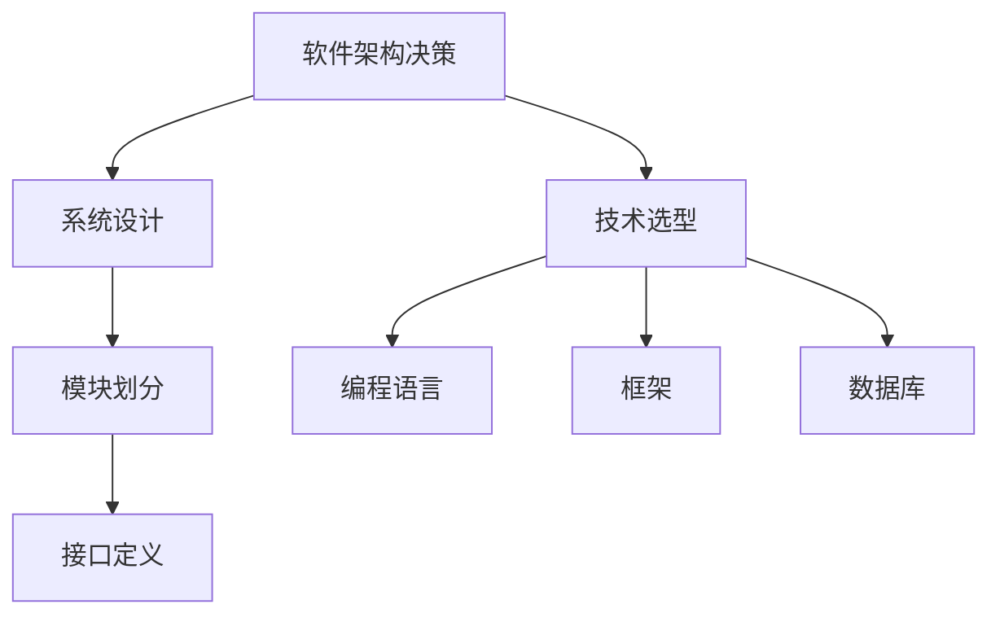
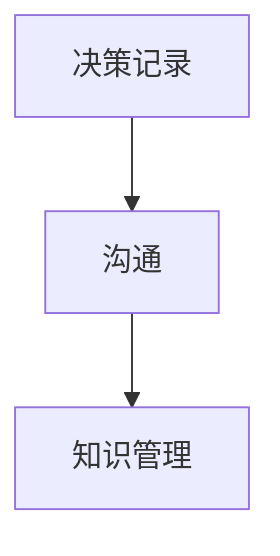
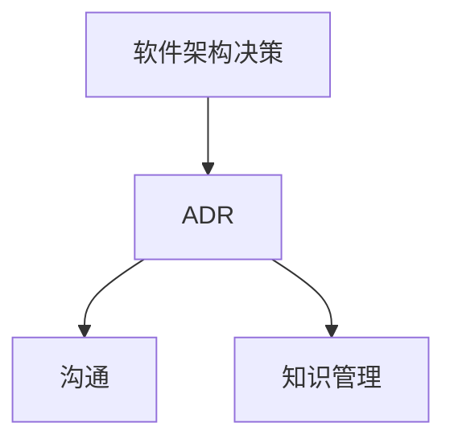

                 

### 核心概念与联系

#### 软件架构决策

软件架构决策是指开发团队在软件开发过程中作出的关键性决策，这些决策直接影响软件系统的结构、性能、可维护性和扩展性。软件架构决策通常涉及系统设计、模块划分、接口定义、技术选型等方面。它是技术问题，也是业务战略和团队协作的一部分。

**软件架构决策的核心概念与联系**

1. **系统设计**：系统设计是软件架构决策的基础，它决定了系统的整体结构、模块划分和接口定义。系统设计需要考虑系统的性能、可维护性和扩展性。

2. **模块划分**：模块划分是系统设计的一部分，它将系统分解为多个功能模块，每个模块负责实现特定的功能。

3. **接口定义**：接口定义是模块划分的一部分，它定义了模块之间的交互方式和数据传递方式。

4. **技术选型**：技术选型是软件架构决策的一个重要方面，它涉及到选择合适的编程语言、框架、数据库等技术。

**Mermaid 流�程图：**



#### 架构决策记录（ADR）

架构决策记录（ADR）是一种文档化的工具，用于记录和沟通软件架构决策的过程、理由、决策结果及其影响。ADR有助于团队理解决策背景、评估决策后果，并在后续开发中遵循既定决策。它不仅是一种沟通工具，也是一种知识管理手段，有助于积累和传承团队的经验。

**ADR的核心概念与联系**

1. **决策记录**：决策记录是ADR的核心部分，它详细记录了架构决策的背景、讨论过程、决策结果和决策理由。

2. **沟通**：沟通是ADR的重要功能，它确保了团队成员对架构决策的共识和理解。

3. **知识管理**：知识管理是ADR的一个长期目标，它通过记录和分享架构决策，帮助团队积累和传承经验。

**Mermaid 流程图：**



#### 软件架构决策与ADR的关系

软件架构决策和ADR是相辅相成的。软件架构决策是软件开发的基石，而ADR是记录和沟通这些决策的工具。通过ADR，团队可以更好地理解和执行架构决策，从而提高软件开发的效率和质量。

**Mermaid 流程图：**



### 核心算法原理讲解

在软件架构决策中，算法原理起着至关重要的作用。以下将使用伪代码详细阐述几个常见的算法原理。

#### 选择排序算法

选择排序算法是一种简单直观的排序算法，它的工作原理是每次从待排序的数据元素中选出最小（或最大）的一个元素，存放在序列的起始位置，直到全部待排序的数据元素排完。

**伪代码：**

```plaintext
function 选择排序(arr):
    n = length(arr)
    for i from 0 to n-1:
        // 寻找最小元素的下标
        minIndex = i
        for j from i+1 to n:
            if arr[j] < arr[minIndex]:
                minIndex = j
        // 交换最小元素和当前元素
        if minIndex != i:
            swap(arr[i], arr[minIndex])
    return arr
```

#### 快速排序算法

快速排序算法是一种高效的排序算法，其基本思想是通过一趟排序将待排序的记录分隔成独立的两部分，其中一部分记录的关键字均比另一部分的关键字小，然后分别对这两部分记录继续进行排序，以达到整个序列有序。

**伪代码：**

```plaintext
function 快速排序(arr, low, high):
    if low < high:
        pi = partition(arr, low, high)
        快速排序(arr, low, pi-1)
        快速排序(arr, pi+1, high)

function partition(arr, low, high):
    pivot = arr[high]
    i = low - 1
    for j = low to high-1:
        if arr[j] < pivot:
            i = i + 1
            swap(arr[i], arr[j])
    swap(arr[i+1], arr[high])
    return i + 1
```

#### 二分查找算法

二分查找算法是一种在有序数组中查找特定元素的算法，其基本思想是不断将查找范围缩小一半，直到找到目标元素或确定目标元素不存在。

**伪代码：**

```plaintext
function 二分查找(arr, low, high, target):
    while low <= high:
        mid = low + (high - low) / 2
        if arr[mid] == target:
            return mid
        else if arr[mid] < target:
            low = mid + 1
        else:
            high = mid - 1
    return -1
```

### 数学模型与公式

在软件架构决策中，数学模型和公式是理解和分析决策结果的重要工具。以下将介绍几个常用的数学模型和公式，并进行详细讲解和举例说明。

#### 决策树模型

决策树是一种树形结构，它包含内部节点、分支节点和叶子节点。内部节点表示决策点，分支节点表示决策结果，叶子节点表示决策结果。

**决策树模型公式：**

$$
P(A|B) = \frac{P(B|A) \cdot P(A)}{P(B)}
$$

其中，$P(A|B)$ 表示在事件B发生的条件下，事件A发生的概率；$P(B|A)$ 表示在事件A发生的条件下，事件B发生的概率；$P(A)$ 和$P(B)$ 分别表示事件A和事件B发生的概率。

**举例说明：**

假设我们有两个事件，A表示“软件架构决策正确”，B表示“项目按时完成”。根据历史数据，我们得到以下概率：

- $P(A|B) = 0.8$，即项目按时完成时，软件架构决策正确的概率是80%。
- $P(B|A) = 0.6$，即软件架构决策正确时，项目按时完成的概率是60%。
- $P(A) = 0.5$，即软件架构决策正确的概率是50%。
- $P(B) = 0.4$，即项目按时完成的概率是40%。

我们可以使用上述公式计算出$P(B|A)$：

$$
P(B|A) = \frac{P(B|A) \cdot P(A)}{P(B)} = \frac{0.6 \cdot 0.5}{0.4} = 0.75
$$

这意味着在软件架构决策正确的情况下，项目按时完成的概率是75%。

#### 期望值模型

期望值模型用于评估决策结果的预期价值。它考虑了每个可能结果的概率和其对应的收益或成本。

**期望值模型公式：**

$$
E(X) = \sum_{i=1}^{n} x_i \cdot P(x_i)
$$

其中，$E(X)$ 表示期望值，$x_i$ 表示第i个可能结果的收益或成本，$P(x_i)$ 表示第i个可能结果发生的概率。

**举例说明：**

假设我们有两个决策结果，A表示“软件架构优化”，B表示“软件架构不优化”。根据历史数据，我们得到以下概率和收益：

- $P(A) = 0.6$，即软件架构优化的概率是60%。
- $P(B) = 0.4$，即软件架构不优化的概率是40%。
- $x_A = 10000$，即软件架构优化带来的收益是10000。
- $x_B = -5000$，即软件架构不优化带来的成本是-5000。

我们可以使用上述公式计算出期望值：

$$
E(X) = x_A \cdot P(A) + x_B \cdot P(B) = 10000 \cdot 0.6 + (-5000) \cdot 0.4 = 7000
$$

这意味着软件架构优化带来的期望收益是7000。

### 项目实战

在本章节中，我们将通过一个实际的软件架构决策案例，展示如何在实际项目中使用ADR进行架构决策，包括开发环境搭建、源代码实现、代码解读、应用解读与分析，以及实际案例分析和详细讲解剖析。

#### 案例背景

某大型互联网公司计划开发一款全新的电子商务平台，需要处理大量的用户数据和交易信息。为了确保系统的性能、可靠性和可维护性，公司决定采用微服务架构，并将架构决策记录下来，以便团队成员理解、遵循和改进。

#### 案例目标

1. 设计并实现一个高性能、高可用的电子商务平台。
2. 使用微服务架构，将系统分解为多个独立的服务模块。
3. 使用ADR记录和沟通架构决策过程，确保团队成员对决策的共识。

#### 开发环境搭建

1. 选择Java作为主要编程语言，因其稳定性和广泛的应用。
2. 使用Spring Boot作为开发框架，因其简洁易用的特性。
3. 使用Docker进行服务容器化，便于部署和扩展。
4. 使用MySQL作为数据库，因其成熟稳定。
5. 使用Jenkins进行自动化构建和部署。

#### 源代码实现

1. **用户服务（User Service）**：负责处理用户注册、登录、权限管理等。
2. **商品服务（Product Service）**：负责处理商品信息管理、商品搜索等。
3. **订单服务（Order Service）**：负责处理订单创建、订单查询、订单支付等。
4. **库存服务（Inventory Service）**：负责处理商品库存管理、库存预警等。

每个服务都使用Spring Boot构建，并在Docker容器中运行。以下是用户服务的一个简单示例代码：

```java
@SpringBootApplication
public class UserServiceApplication {
    public static void main(String[] args) {
        SpringApplication.run(UserServiceApplication.class, args);
    }
}

@RestController
@RequestMapping("/users")
public class UserController {
    @Autowired
    private UserRepository userRepository;

    @PostMapping
    public User createUser(@RequestBody User user) {
        return userRepository.save(user);
    }

    @GetMapping("/{id}")
    public User getUserById(@PathVariable Long id) {
        return userRepository.findById(id).orElseThrow(() -> new ResourceNotFoundException("User not found"));
    }
}
```

#### 代码解读

用户服务的主要功能包括用户注册和查询。用户注册时，将用户信息存储到数据库中；用户查询时，根据用户ID从数据库中检索用户信息。

```java
@PostMapping
public User createUser(@RequestBody User user) {
    return userRepository.save(user);
}

@GetMapping("/{id}")
public User getUserById(@PathVariable Long id) {
    return userRepository.findById(id).orElseThrow(() -> new ResourceNotFoundException("User not found"));
}
```

#### 应用解读与分析

在电子商务平台中，用户服务是一个核心服务，负责处理用户的注册、登录、权限管理等功能。通过微服务架构，用户服务与其他服务（如商品服务、订单服务、库存服务）保持独立，便于管理和扩展。

**优点：**

1. **模块化**：每个服务独立部署和扩展，便于维护。
2. **高可用性**：服务之间相互独立，一个服务的故障不会影响整个系统的运行。
3. **高性能**：通过容器化部署，服务可以快速部署和扩展。

**缺点：**

1. **复杂性**：微服务架构增加了系统的复杂性，需要更多的管理和维护。
2. **通信开销**：服务之间需要通过网络通信，可能增加通信开销。

#### 实际案例分析和详细讲解剖析

在一个实际的开发项目中，用户服务可能会遇到以下问题：

1. **性能问题**：当用户量增加时，用户服务的性能可能会下降，需要优化数据库查询和缓存策略。
2. **安全问题**：用户服务需要确保用户数据的安全，需要实现加密、认证和授权等安全措施。
3. **扩展性问题**：用户服务需要根据业务需求进行扩展，需要设计可扩展的架构。

通过ADR记录和沟通架构决策，团队成员可以更好地理解这些问题，并采取相应的措施进行优化和改进。

**项目小结**

通过本案例，我们展示了如何在实际项目中使用ADR进行架构决策。ADR不仅有助于团队成员理解决策背景和决策结果，还有助于积累和传承团队的经验。在实际开发中，我们需要根据业务需求和技术特点，灵活运用ADR，确保软件架构的合理性和可维护性。

#### 最佳实践 Tips

1. **明确决策目标**：在制定ADR之前，要明确决策的目标和期望结果，确保团队成员对决策有共同的理解。
2. **保持决策透明**：确保ADR的内容透明，方便团队成员随时查阅和了解。
3. **定期审查与优化**：定期审查ADR，并根据项目进展和业务需求进行优化和改进。
4. **鼓励团队参与**：鼓励团队成员参与架构决策，提高决策的共识和执行力。

#### 注意事项

1. **文档格式**：确保ADR的格式统一，便于团队成员阅读和查找。
2. **决策记录**：及时记录决策过程和决策结果，确保ADR的完整性和准确性。
3. **沟通与协作**：在决策过程中，要加强团队间的沟通和协作，确保决策的顺利执行。

#### 拓展阅读

1. 《微服务设计》 - Sam Newman
2. 《Docker实战》 - James Turnbull
3. 《Spring Boot实战》 -Craig Walls

### 总结与展望

在本文中，我们详细介绍了软件架构决策记录（ADR）的概念、核心概念与联系、核心算法原理讲解、数学模型与公式以及项目实战。通过这一系列的讨论，我们深入理解了ADR在软件架构决策中的重要性。

#### 软件架构决策记录（ADR）的重要性

软件架构决策记录（ADR）是一种文档化的工具，用于记录和沟通软件架构决策的过程、理由、决策结果及其影响。ADR不仅是一种沟通工具，也是一种知识管理手段，有助于积累和传承团队的经验。通过ADR，团队成员可以更好地理解和执行架构决策，从而提高软件开发的效率和质量。

#### ADR在软件开发中的应用价值

1. **提高决策质量**：通过记录决策过程和结果，ADR帮助团队成员理解决策背景和决策理由，从而提高决策质量。
2. **促进团队协作**：ADR提供了透明、一致的沟通方式，促进了团队间的协作和理解。
3. **知识传承**：ADR记录了架构决策的经验和教训，有助于新成员快速上手，提高团队的整体技能水平。
4. **降低风险**：ADR帮助团队在决策过程中识别潜在的风险，从而降低项目风险。

#### ADR的未来发展趋势

1. **自动化**：未来的ADR可能会结合自动化工具，如人工智能和自然语言处理技术，实现更智能、更高效的决策记录和沟通。
2. **标准化**：随着ADR的广泛应用，可能会出现更统一的ADR标准和模板，提高文档的一致性和可读性。
3. **集成**：ADR可能会与现有的项目管理工具和架构管理工具集成，实现更紧密的协作和更高效的管理。
4. **多元化**：ADR的应用范围可能会进一步扩大，不仅局限于软件开发，还可能应用于其他领域，如系统架构、网络安全等。

### 总结

通过本文的讨论，我们认识到ADR在软件架构决策中的重要性，以及在软件开发中的应用价值。展望未来，ADR将继续发展，为软件架构决策提供更加高效、智能的支持。希望本文能为读者在软件架构决策和ADR应用方面提供有益的启示和参考。作者：AI天才研究院/AI Genius Institute & 禅与计算机程序设计艺术 /Zen And The Art of Computer Programming。

