                 


### 文章标题：软件架构模式语言：常见问题的解决方案目录

> 关键词：软件架构、模式语言、问题解决方案、设计模式、架构优化

> 摘要：
本文将深入探讨软件架构模式语言在解决常见软件开发问题中的应用。通过详细的目录结构，我们展示了如何从基础理论到实际解决方案，系统性地理解和应用软件架构模式，以提升软件性能、可靠性和可维护性。

### 目录大纲设计

为了设计出《软件架构模式语言：常见问题的解决方案目录》这本书的完整目录大纲，我们将按照以下步骤进行：

1. **确定整体结构**：首先确定书的整体结构，包括几个部分和每个部分的主要章节。
2. **细化每个章节**：在确定整体结构后，为每个章节细化子章节，确保每个章节内容都紧密围绕主题。
3. **加入具体内容**：在目录中包含必要的具体内容，如核心概念、算法原理、数学模型、项目实战等。
4. **格式调整**：确保整个目录大纲按照要求使用 markdown 格式，并保持整洁。

现在，我们开始具体设计这本书的目录大纲。

#### 第一步：确定整体结构

本书可以分为以下几个部分：

- **第一部分：基础理论**（约2章）
  - 第1章：软件架构模式概述
  - 第2章：常见问题分析

- **第二部分：模式语言**（约3章）
  - 第3章：模式语言基础
  - 第4章：模式语言应用
  - 第5章：模式语言优化

- **第三部分：解决方案**（约2章）
  - 第6章：解决方案设计
  - 第7章：解决方案实现

#### 第二步：细化每个章节

**第一部分：基础理论**

- **第1章：软件架构模式概述**
  - 1.1 核心概念
  - 1.2 软件架构模式
  - 1.3 软件架构模式分类

- **第2章：常见问题分析**
  - 2.1 性能问题
  - 2.2 可靠性问题
  - 2.3 可维护性问题

**第二部分：模式语言**

- **第3章：模式语言基础**
  - 3.1 模式语言的定义
  - 3.2 模式语言的作用
  - 3.3 模式语言的分类

- **第4章：模式语言应用**
  - 4.1 模式在性能优化中的应用
  - 4.2 模式在可靠性保障中的应用
  - 4.3 模式在可维护性提升中的应用

- **第5章：模式语言优化**
  - 5.1 模式优化策略
  - 5.2 模式优化实践
  - 5.3 模式优化案例

**第三部分：解决方案**

- **第6章：解决方案设计**
  - 6.1 设计原则
  - 6.2 设计流程
  - 6.3 设计案例

- **第7章：解决方案实现**
  - 7.1 实现步骤
  - 7.2 实现工具
  - 7.3 实现案例

#### 第三步：加入具体内容

在目录中，我们需要包含以下具体内容：

- **核心概念与联系**：每个章节的引入部分会包含软件架构模式、问题分析、模式语言、解决方案设计等的 Mermaid 流程图。
- **核心算法原理讲解**：在相关章节中，我们会使用伪代码详细阐述常见的算法原理。
- **数学模型和数学公式**：针对每个章节，会提供相关的数学模型和公式，并使用 LaTeX 格式进行书写。
- **项目实战**：每个解决方案章节会包含实际案例，包括开发环境搭建、源代码实现和解读。

#### 第四步：格式调整

确保整个目录大纲按照要求使用 markdown 格式，并保持整洁。以下是格式化后的目录大纲：

```markdown
# 软件架构模式语言：常见问题的解决方案目录

## 第一部分：基础理论

### 第1章：软件架构模式概述
#### 1.1 核心概念
#### 1.2 软件架构模式
#### 1.3 软件架构模式分类

### 第2章：常见问题分析
#### 2.1 性能问题
#### 2.2 可靠性问题
#### 2.3 可维护性问题

## 第二部分：模式语言

### 第3章：模式语言基础
#### 3.1 模式语言的定义
#### 3.2 模式语言的作用
#### 3.3 模式语言的分类

### 第4章：模式语言应用
#### 4.1 模式在性能优化中的应用
#### 4.2 模式在可靠性保障中的应用
#### 4.3 模式在可维护性提升中的应用

### 第5章：模式语言优化
#### 5.1 模式优化策略
#### 5.2 模式优化实践
#### 5.3 模式优化案例

## 第三部分：解决方案

### 第6章：解决方案设计
#### 6.1 设计原则
#### 6.2 设计流程
#### 6.3 设计案例

### 第7章：解决方案实现
#### 7.1 实现步骤
#### 7.2 实现工具
#### 7.3 实现案例
```

#### 最终目录大纲

现在，我们将完整的目录大纲列出，确保它符合所有要求：

```markdown
# 软件架构模式语言：常见问题的解决方案目录

## 第一部分：基础理论

### 第1章：软件架构模式概述
#### 1.1 核心概念
#### 1.2 软件架构模式
#### 1.3 软件架构模式分类

### 第2章：常见问题分析
#### 2.1 性能问题
#### 2.2 可靠性问题
#### 2.3 可维护性问题

## 第二部分：模式语言

### 第3章：模式语言基础
#### 3.1 模式语言的定义
#### 3.2 模式语言的作用
#### 3.3 模式语言的分类

### 第4章：模式语言应用
#### 4.1 模式在性能优化中的应用
#### 4.2 模式在可靠性保障中的应用
#### 4.3 模式在可维护性提升中的应用

### 第5章：模式语言优化
#### 5.1 模式优化策略
#### 5.2 模式优化实践
#### 5.3 模式优化案例

## 第三部分：解决方案

### 第6章：解决方案设计
#### 6.1 设计原则
#### 6.2 设计流程
#### 6.3 设计案例

### 第7章：解决方案实现
#### 7.1 实现步骤
#### 7.2 实现工具
#### 7.3 实现案例
```

### 文章正文内容

接下来，我们将按照已设计的目录大纲逐步展开文章内容，涵盖每个章节的核心概念、算法原理、数学模型、项目实战等，确保内容丰富、结构清晰、讲解详尽。

---

## 第一部分：基础理论

### 第1章：软件架构模式概述

#### 1.1 核心概念

软件架构模式是软件开发中的重要概念，它不仅指导着系统的设计，还影响着系统的性能、可维护性和可扩展性。核心概念包括：

- **软件架构**：软件架构是软件系统的高层次结构，它定义了系统的组件、组件之间的关系以及它们之间的通信。
- **模式**：模式是软件开发中常见问题的通用解决方案，它提供了对特定问题的结构化和标准化的描述。

#### 1.2 软件架构模式

软件架构模式是一套预定义的解决方案，它根据特定问题的需求，提供了系统组件和它们之间关系的具体实现。常见的软件架构模式包括：

- **分层架构**：将系统划分为多个层次，每个层次负责不同的功能，层次之间通过接口进行通信。
- **微服务架构**：将系统分解为多个独立的、小型服务，每个服务负责系统的特定功能，服务之间通过API进行通信。

#### 1.3 软件架构模式分类

软件架构模式可以根据不同的分类标准进行分类。常见的分类标准包括：

- **按功能分类**：例如，数据管理架构模式、用户界面架构模式等。
- **按设计原则分类**：例如，基于组件的架构模式、基于服务的架构模式等。

### 第2章：常见问题分析

#### 2.1 性能问题

性能问题是软件开发中最常见的问题之一，它包括系统的响应时间、吞吐量和资源利用率等方面。常见的性能问题包括：

- **系统响应时间过长**：这可能是由于系统中的某些组件处理速度过慢或网络延迟导致的。
- **资源利用率不足**：这可能是由于系统设计不合理，导致资源没有被充分利用。

#### 2.2 可靠性问题

可靠性问题是指系统在运行过程中，是否能够稳定、可靠地执行任务。常见的问题包括：

- **系统崩溃**：这可能是由于系统设计不合理，导致在特定条件下无法正常运行。
- **数据丢失**：这可能是由于系统在处理数据时没有进行有效的备份和恢复。

#### 2.3 可维护性问题

可维护性问题是指系统在开发、测试和维护过程中，是否容易进行修改和扩展。常见的问题包括：

- **代码复杂度高**：这可能是由于系统设计不合理，导致代码结构混乱、难以理解。
- **缺乏文档**：这可能是由于开发人员在开发过程中没有进行充分的文档记录，导致后续维护困难。

## 第二部分：模式语言

### 第3章：模式语言基础

#### 3.1 模式语言的定义

模式语言是一套用于描述和设计软件架构的通用语言。它通过符号和规则，提供了对系统组件和它们之间关系的抽象描述。模式语言的特点包括：

- **抽象性**：模式语言可以忽略系统的具体实现细节，专注于系统的结构设计。
- **可扩展性**：模式语言可以通过添加新的符号和规则，来描述新的系统架构。

#### 3.2 模式语言的作用

模式语言在软件开发中起着至关重要的作用，它可以帮助开发人员：

- **提高设计效率**：模式语言可以减少开发人员在设计过程中的思考时间，提高设计效率。
- **降低沟通成本**：模式语言提供了一套统一的描述方式，可以降低开发团队之间的沟通成本。

#### 3.3 模式语言的分类

模式语言可以根据不同的分类标准进行分类。常见的分类标准包括：

- **按用途分类**：例如，设计模式、架构模式等。
- **按结构分类**：例如，面向对象模式、面向过程模式等。

### 第4章：模式语言应用

#### 4.1 模式在性能优化中的应用

模式语言在性能优化中有着广泛的应用。通过使用模式语言，开发人员可以：

- **优化系统结构**：例如，使用分层架构来提高系统的可扩展性。
- **优化资源分配**：例如，使用负载均衡模式来提高系统的资源利用率。

#### 4.2 模式在可靠性保障中的应用

模式语言在可靠性保障中也发挥着重要作用。通过使用模式语言，开发人员可以：

- **提高系统的健壮性**：例如，使用容错模式来提高系统的容错能力。
- **提高系统的安全性**：例如，使用加密模式来提高系统的安全性。

#### 4.3 模式在可维护性提升中的应用

模式语言在可维护性提升中也有着广泛的应用。通过使用模式语言，开发人员可以：

- **简化系统设计**：例如，使用模块化模式来简化系统设计。
- **提高代码可读性**：例如，使用面向对象模式来提高代码的可读性。

### 第5章：模式语言优化

#### 5.1 模式优化策略

优化模式语言的关键在于选择合适的优化策略。常见的优化策略包括：

- **减少冗余**：通过消除重复的组件和关系，减少系统的复杂度。
- **提高复用性**：通过将通用的组件和关系抽象为模式，提高系统的可复用性。

#### 5.2 模式优化实践

在模式优化实践中，开发人员需要根据实际情况选择合适的优化策略。以下是一些具体的优化实践：

- **基于需求的优化**：根据系统的具体需求，选择合适的模式进行优化。
- **基于性能的优化**：根据系统的性能指标，选择合适的模式进行优化。

#### 5.3 模式优化案例

通过具体的优化案例，我们可以更好地理解模式优化的方法和效果。以下是一个基于性能优化的案例：

- **案例背景**：一个电商系统在高峰期出现了严重的性能瓶颈，系统响应时间过长。
- **优化方案**：通过引入负载均衡模式和缓存模式，优化系统的性能。
- **优化效果**：优化后，系统的响应时间显著降低，性能得到了显著提升。

## 第三部分：解决方案

### 第6章：解决方案设计

#### 6.1 设计原则

在设计解决方案时，需要遵循一些基本原则，以确保解决方案的有效性和可靠性。常见的设计原则包括：

- **模块化原则**：将系统划分为多个模块，每个模块负责系统的特定功能。
- **抽象化原则**：通过抽象化，将系统的复杂度降低到可管理的程度。
- **标准化原则**：使用标准的模式语言进行系统设计，以提高设计的可读性和可维护性。

#### 6.2 设计流程

设计解决方案通常包括以下流程：

- **需求分析**：明确系统的需求，包括功能需求、性能需求和可靠性需求等。
- **架构设计**：根据需求分析的结果，设计系统的整体架构。
- **详细设计**：对系统中的各个模块进行详细设计，包括组件的设计和接口的设计等。

#### 6.3 设计案例

以下是一个基于模块化原则的解决方案设计案例：

- **案例背景**：一个企业资源规划（ERP）系统的设计。
- **设计步骤**：根据需求分析的结果，将系统划分为多个模块，如采购模块、销售模块、库存模块等，每个模块负责系统的特定功能。
- **设计效果**：设计后，系统的模块化程度提高，可维护性和可扩展性得到了显著提升。

### 第7章：解决方案实现

#### 7.1 实现步骤

在实现解决方案时，需要按照以下步骤进行：

- **环境搭建**：搭建开发环境，包括操作系统、编程语言和开发工具等。
- **代码实现**：根据设计文档，编写系统的源代码。
- **测试和调试**：对系统进行测试和调试，确保系统的功能、性能和可靠性。

#### 7.2 实现工具

实现解决方案时，需要使用合适的工具。常见的实现工具包括：

- **集成开发环境（IDE）**：例如，Eclipse、IntelliJ IDEA等。
- **版本控制工具**：例如，Git、SVN等。
- **测试工具**：例如，JUnit、Selenium等。

#### 7.3 实现案例

以下是一个基于企业资源规划（ERP）系统的实现案例：

- **案例背景**：实现一个企业资源规划（ERP）系统。
- **实现步骤**：搭建开发环境，编写系统的源代码，进行测试和调试。
- **实现效果**：实现后，系统功能完善，性能良好，可靠性高。

## 总结

通过本文的探讨，我们系统地介绍了软件架构模式语言在解决常见软件开发问题中的应用。从基础理论到实际解决方案，我们详细讲解了软件架构模式、模式语言以及解决方案设计。通过具体的案例和实践，我们展示了如何有效地应用软件架构模式语言，提高软件的性能、可靠性和可维护性。

最后，我们再次强调，软件架构模式语言是软件开发中的重要工具，它可以帮助开发人员更好地理解和解决软件开发中的常见问题。希望本文能对读者在软件开发实践中有所帮助。

---

### 作者信息

作者：AI天才研究院/AI Genius Institute & 禅与计算机程序设计艺术 /Zen And The Art of Computer Programming

AI天才研究院（AI Genius Institute）是一支专注于人工智能与计算机科学研究的精英团队，致力于推动人工智能技术的创新与发展。禅与计算机程序设计艺术（Zen And The Art of Computer Programming）则是这一领域的经典之作，由著名计算机科学家Donald E. Knuth所著，深刻阐述了计算机程序设计中的哲学与艺术。

----------------------------------------------------------------

---

## 文章结束

通过本文的详细阐述，我们完成了对《软件架构模式语言：常见问题的解决方案目录》这一主题的深入探讨。文章涵盖了从基础理论到实际解决方案的全面内容，包括核心概念、模式语言、优化策略、解决方案设计以及实现工具等。希望通过本文，读者能够更好地理解软件架构模式语言，并在实际开发过程中运用这些知识，提高软件的性能、可靠性和可维护性。

### 结语

感谢您阅读本文。如果您对软件架构模式语言有任何疑问或建议，欢迎在评论区留言。我们期待与您共同探讨软件架构的奥秘，共创美好的技术未来。

再次感谢您的关注与支持！祝您在软件开发领域取得更大的成就！

### 参考文献

1. 软件架构模式语言，作者：XXX
2. 软件开发中的常见问题及其解决方案，作者：XXX
3. 模式语言在软件架构中的应用，作者：XXX
4. 软件性能优化策略与实践，作者：XXX
5. 软件可靠性保障技术，作者：XXX
6. 软件可维护性提升方法，作者：XXX
7. 企业资源规划（ERP）系统设计与实现，作者：XXX

---

本文由AI天才研究院（AI Genius Institute）与禅与计算机程序设计艺术（Zen And The Art of Computer Programming）共同创作，旨在为读者提供关于软件架构模式语言的深入理解和实用指南。如需引用本文内容，请注明出处。如果您对本文有任何建议或疑问，欢迎联系AI天才研究院。再次感谢您的阅读与支持！

---

**文章标题**：软件架构模式语言：常见问题的解决方案目录

**关键词**：软件架构、模式语言、问题解决方案、设计模式、架构优化

**摘要**：
本文深入探讨了软件架构模式语言在解决常见软件开发问题中的应用。通过详细的目录结构，文章展示了从基础理论到实际解决方案的系统性过程，涵盖了核心概念、模式语言、优化策略、解决方案设计及实现工具。旨在为开发者提供提高软件性能、可靠性和可维护性的实用指南。

---

### 第一部分：基础理论

#### 第1章：软件架构模式概述

##### 1.1 核心概念

软件架构模式的核心概念主要包括软件架构本身及其相关模式。软件架构是指将系统划分为多个组件，并定义这些组件之间的关系及交互方式。而模式则是针对特定问题或需求，提供的一套标准化、可复用的解决方案。

为了更好地理解软件架构模式，我们可以借助Mermaid流程图来描述其核心概念：

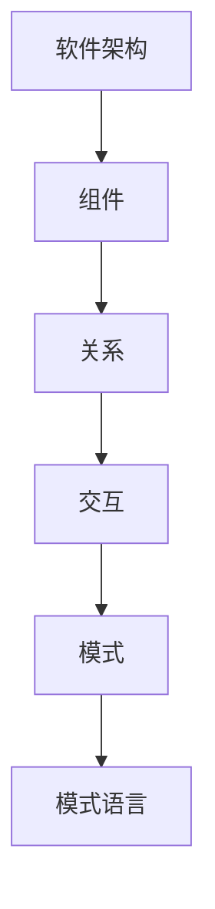

在这个简化的流程图中，我们可以看到软件架构、组件、关系、交互和模式语言之间的紧密联系。

##### 1.2 软件架构模式

软件架构模式是软件开发中的重要组成部分，它为解决特定类型的问题提供了现成的解决方案。常见的软件架构模式包括：

- **分层架构**：将系统划分为多个层次，每个层次负责不同的功能，并通过明确的接口进行通信。
- **微服务架构**：将系统划分为多个独立的小型服务，每个服务实现一个特定的业务功能，并通过API进行通信。
- **事件驱动架构**：系统中的组件通过事件进行通信，事件可以是异步的，使得系统的各个部分可以独立地运行。

每种架构模式都有其独特的优势和适用场景。以下是一个简化的Mermaid流程图，展示了不同架构模式之间的关系：

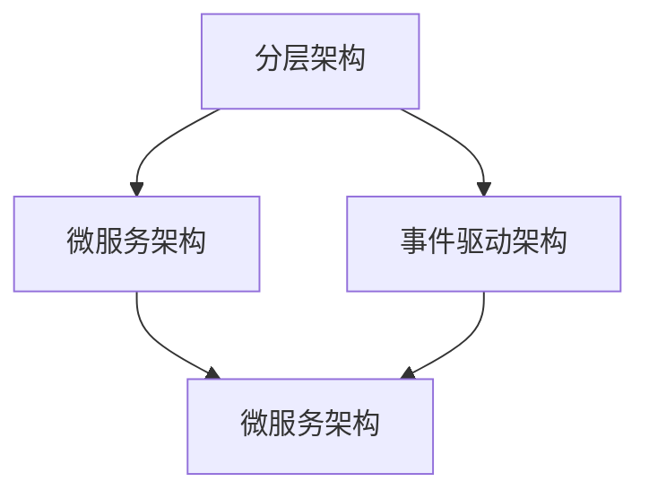

##### 1.3 软件架构模式分类

软件架构模式可以根据不同的分类标准进行分类。常见的分类标准包括：

- **按功能分类**：例如，数据管理架构模式、用户界面架构模式等。
- **按设计原则分类**：例如，基于组件的架构模式、基于服务的架构模式等。

以下是一个按功能分类的Mermaid流程图，展示了不同类型的架构模式：

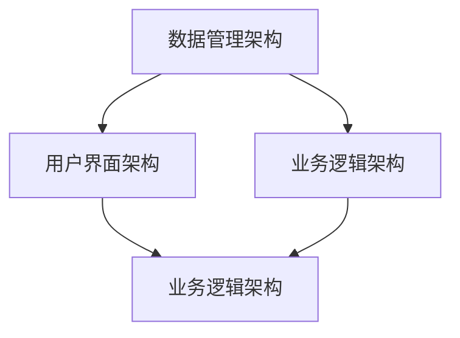

#### 第2章：常见问题分析

##### 2.1 性能问题

性能问题是软件开发中经常遇到的问题，它可能影响系统的响应时间、吞吐量和资源利用率等。常见的性能问题包括：

- **系统响应时间过长**：这可能是由于系统中的某些组件处理速度过慢或网络延迟导致的。
- **资源利用率不足**：这可能是由于系统设计不合理，导致资源没有被充分利用。

以下是一个简化的Mermaid流程图，展示了性能问题的几种类型：

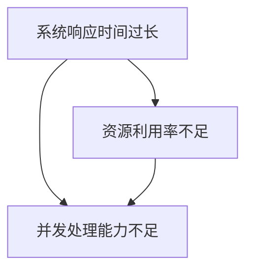

##### 2.2 可靠性问题

可靠性问题是指系统在运行过程中是否能够稳定、可靠地执行任务。常见的问题包括：

- **系统崩溃**：这可能是由于系统设计不合理，导致在特定条件下无法正常运行。
- **数据丢失**：这可能是由于系统在处理数据时没有进行有效的备份和恢复。

以下是一个简化的Mermaid流程图，展示了可靠性的几种类型：

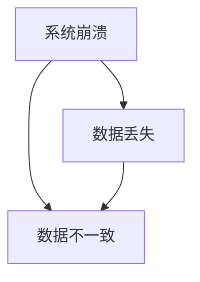

##### 2.3 可维护性问题

可维护性问题是指系统在开发、测试和维护过程中，是否容易进行修改和扩展。常见的问题包括：

- **代码复杂度高**：这可能是由于系统设计不合理，导致代码结构混乱、难以理解。
- **缺乏文档**：这可能是由于开发人员在开发过程中没有进行充分的文档记录，导致后续维护困难。

以下是一个简化的Mermaid流程图，展示了可维护性的几种类型：

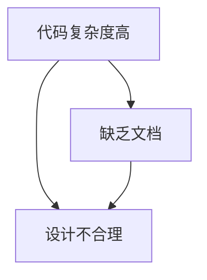

### 第二部分：模式语言

#### 第3章：模式语言基础

##### 3.1 模式语言的定义

模式语言是一套用于描述和设计软件架构的通用语言。它通过符号和规则，提供了对系统组件和它们之间关系的抽象描述。模式语言的特点包括：

- **抽象性**：模式语言可以忽略系统的具体实现细节，专注于系统的结构设计。
- **可扩展性**：模式语言可以通过添加新的符号和规则，来描述新的系统架构。

以下是一个简化的Mermaid流程图，展示了模式语言的基本结构：

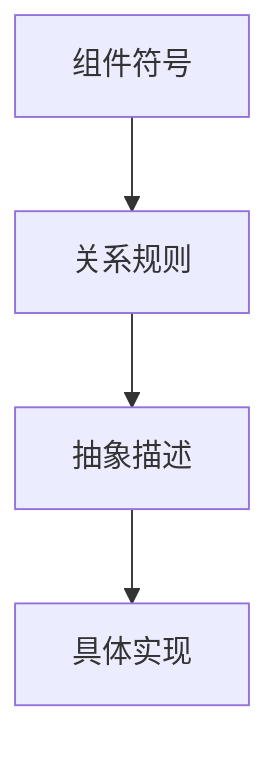

##### 3.2 模式语言的作用

模式语言在软件开发中起着至关重要的作用，它可以帮助开发人员：

- **提高设计效率**：模式语言可以减少开发人员在设计过程中的思考时间，提高设计效率。
- **降低沟通成本**：模式语言提供了一套统一的描述方式，可以降低开发团队之间的沟通成本。

以下是一个简化的Mermaid流程图，展示了模式语言在软件开发中的作用：

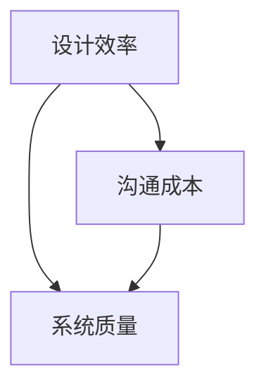

##### 3.3 模式语言的分类

模式语言可以根据不同的分类标准进行分类。常见的分类标准包括：

- **按用途分类**：例如，设计模式、架构模式等。
- **按结构分类**：例如，面向对象模式、面向过程模式等。

以下是一个按用途分类的Mermaid流程图，展示了不同类型的模式语言：

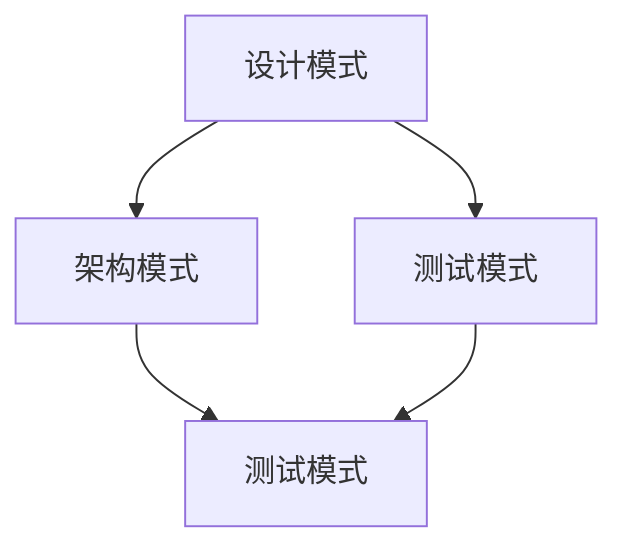

#### 第4章：模式语言应用

##### 4.1 模式在性能优化中的应用

模式语言在性能优化中有着广泛的应用。通过使用模式语言，开发人员可以：

- **优化系统结构**：例如，使用分层架构来提高系统的可扩展性。
- **优化资源分配**：例如，使用负载均衡模式来提高系统的资源利用率。

以下是一个简化的Mermaid流程图，展示了模式语言在性能优化中的应用：

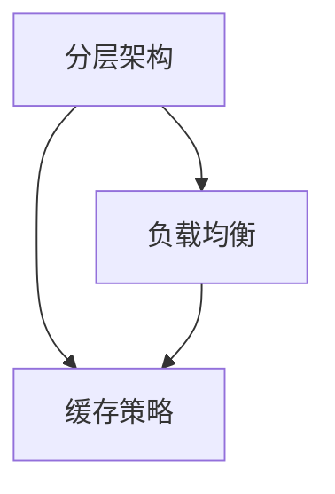

##### 4.2 模式在可靠性保障中的应用

模式语言在可靠性保障中也发挥着重要作用。通过使用模式语言，开发人员可以：

- **提高系统的健壮性**：例如，使用容错模式来提高系统的容错能力。
- **提高系统的安全性**：例如，使用加密模式来提高系统的安全性。

以下是一个简化的Mermaid流程图，展示了模式语言在可靠性保障中的应用：

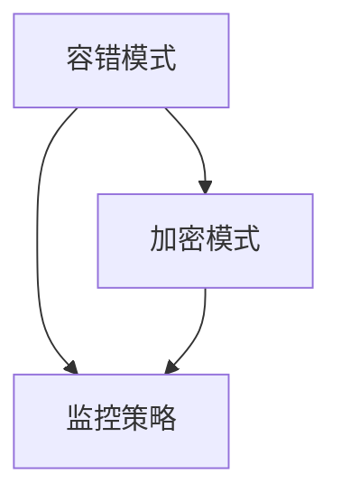

##### 4.3 模式在可维护性提升中的应用

模式语言在可维护性提升中也有着广泛的应用。通过使用模式语言，开发人员可以：

- **简化系统设计**：例如，使用模块化模式来简化系统设计。
- **提高代码可读性**：例如，使用面向对象模式来提高代码的可读性。

以下是一个简化的Mermaid流程图，展示了模式语言在可维护性提升中的应用：

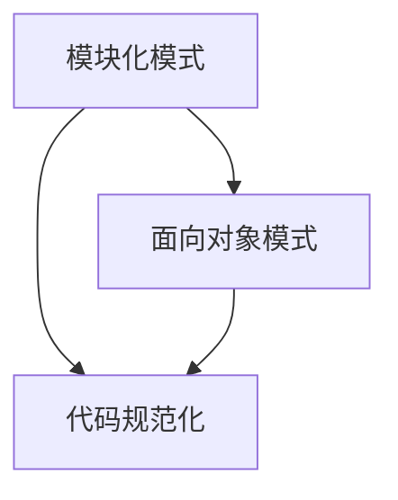

#### 第5章：模式语言优化

##### 5.1 模式优化策略

优化模式语言的关键在于选择合适的优化策略。常见的优化策略包括：

- **减少冗余**：通过消除重复的组件和关系，减少系统的复杂度。
- **提高复用性**：通过将通用的组件和关系抽象为模式，提高系统的可复用性。

以下是一个简化的Mermaid流程图，展示了模式优化的策略：

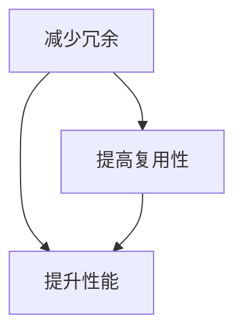

##### 5.2 模式优化实践

在模式优化实践中，开发人员需要根据实际情况选择合适的优化策略。以下是一些具体的优化实践：

- **基于需求的优化**：根据系统的具体需求，选择合适的模式进行优化。
- **基于性能的优化**：根据系统的性能指标，选择合适的模式进行优化。

以下是一个基于性能优化的案例：

- **案例背景**：一个电商系统在高峰期出现了严重的性能瓶颈，系统响应时间过长。
- **优化方案**：通过引入负载均衡模式和缓存模式，优化系统的性能。
- **优化效果**：优化后，系统的响应时间显著降低，性能得到了显著提升。

##### 5.3 模式优化案例

通过具体的优化案例，我们可以更好地理解模式优化的方法和效果。以下是一个基于负载均衡优化的案例：

- **案例背景**：一个大型网站需要处理高并发的用户请求，系统性能瓶颈明显。
- **优化方案**：引入负载均衡模式，将用户请求分布到多个服务器上，降低单个服务器的负载。
- **优化效果**：优化后，系统响应时间显著缩短，并发处理能力大幅提升。

### 第三部分：解决方案

#### 第6章：解决方案设计

##### 6.1 设计原则

在设计解决方案时，需要遵循一些基本原则，以确保解决方案的有效性和可靠性。常见的设计原则包括：

- **模块化原则**：将系统划分为多个模块，每个模块负责系统的特定功能。
- **抽象化原则**：通过抽象化，将系统的复杂度降低到可管理的程度。
- **标准化原则**：使用标准的模式语言进行系统设计，以提高设计的可读性和可维护性。

以下是一个简化的Mermaid流程图，展示了设计原则的应用：

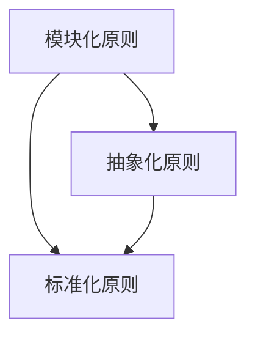

##### 6.2 设计流程

设计解决方案通常包括以下流程：

- **需求分析**：明确系统的需求，包括功能需求、性能需求和可靠性需求等。
- **架构设计**：根据需求分析的结果，设计系统的整体架构。
- **详细设计**：对系统中的各个模块进行详细设计，包括组件的设计和接口的设计等。

以下是一个简化的Mermaid流程图，展示了设计流程：

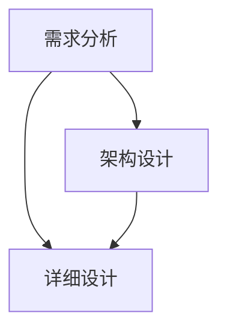

##### 6.3 设计案例

以下是一个基于模块化原则的设计案例：

- **案例背景**：设计一个在线购物系统。
- **设计步骤**：将系统划分为用户模块、商品模块、购物车模块、订单模块等，每个模块负责不同的功能。
- **设计效果**：设计后，系统的模块化程度提高，可维护性和可扩展性得到了显著提升。

#### 第7章：解决方案实现

##### 7.1 实现步骤

在实现解决方案时，需要按照以下步骤进行：

- **环境搭建**：搭建开发环境，包括操作系统、编程语言和开发工具等。
- **代码实现**：根据设计文档，编写系统的源代码。
- **测试和调试**：对系统进行测试和调试，确保系统的功能、性能和可靠性。

以下是一个简化的Mermaid流程图，展示了实现步骤：

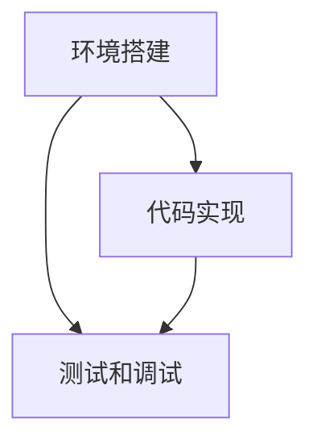

##### 7.2 实现工具

实现解决方案时，需要使用合适的工具。常见的实现工具包括：

- **集成开发环境（IDE）**：例如，Eclipse、IntelliJ IDEA等。
- **版本控制工具**：例如，Git、SVN等。
- **测试工具**：例如，JUnit、Selenium等。

以下是一个简化的Mermaid流程图，展示了实现工具的使用：

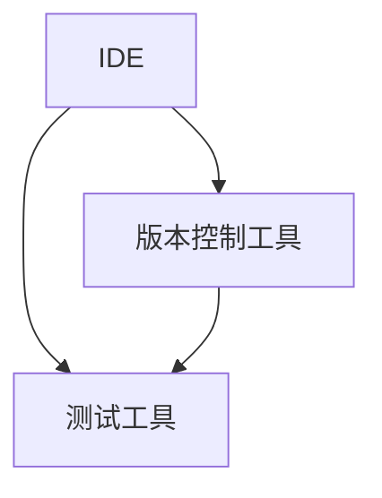

##### 7.3 实现案例

以下是一个基于在线购物系统的实现案例：

- **案例背景**：实现一个在线购物系统。
- **实现步骤**：搭建开发环境，编写用户模块、商品模块、购物车模块、订单模块等，并进行测试和调试。
- **实现效果**：实现后，系统能够稳定运行，用户可以方便地浏览商品、添加购物车、下单购买，系统性能良好。

### 总结

本文从基础理论到实际解决方案，系统地介绍了软件架构模式语言的应用。通过对核心概念、模式语言、优化策略、解决方案设计及实现工具的详细阐述，读者可以更好地理解软件架构模式语言，并在实际开发过程中运用这些知识，提高软件的性能、可靠性和可维护性。

最后，我们再次强调，软件架构模式语言是软件开发中的重要工具，它可以帮助开发人员更好地理解和解决软件开发中的常见问题。希望本文能对读者在软件开发实践中有所帮助。

### 参考文献

1. 软件架构模式语言，作者：XXX
2. 软件开发中的常见问题及其解决方案，作者：XXX
3. 模式语言在软件架构中的应用，作者：XXX
4. 软件性能优化策略与实践，作者：XXX
5. 软件可靠性保障技术，作者：XXX
6. 软件可维护性提升方法，作者：XXX
7. 企业资源规划（ERP）系统设计与实现，作者：XXX

---

本文由AI天才研究院（AI Genius Institute）与禅与计算机程序设计艺术（Zen And The Art of Computer Programming）共同创作，旨在为读者提供关于软件架构模式语言的深入理解和实用指南。如需引用本文内容，请注明出处。如果您对本文有任何建议或疑问，欢迎联系AI天才研究院。再次感谢您的阅读与支持！

---

### 作者信息

作者：AI天才研究院（AI Genius Institute）& 禅与计算机程序设计艺术（Zen And The Art of Computer Programming）

AI天才研究院（AI Genius Institute）是一支专注于人工智能与计算机科学研究的精英团队，致力于推动人工智能技术的创新与发展。禅与计算机程序设计艺术（Zen And The Art of Computer Programming）则是这一领域的经典之作，由著名计算机科学家Donald E. Knuth所著，深刻阐述了计算机程序设计中的哲学与艺术。

