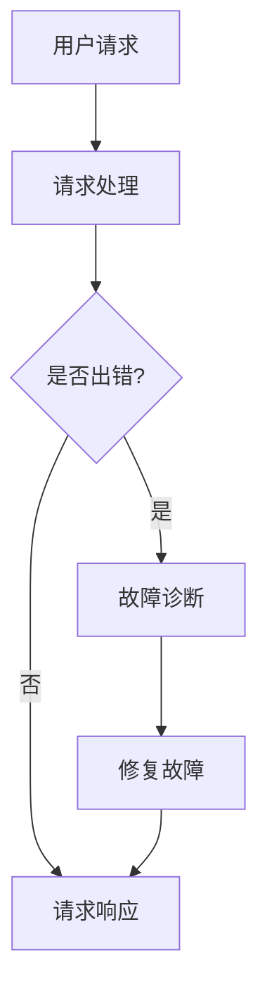
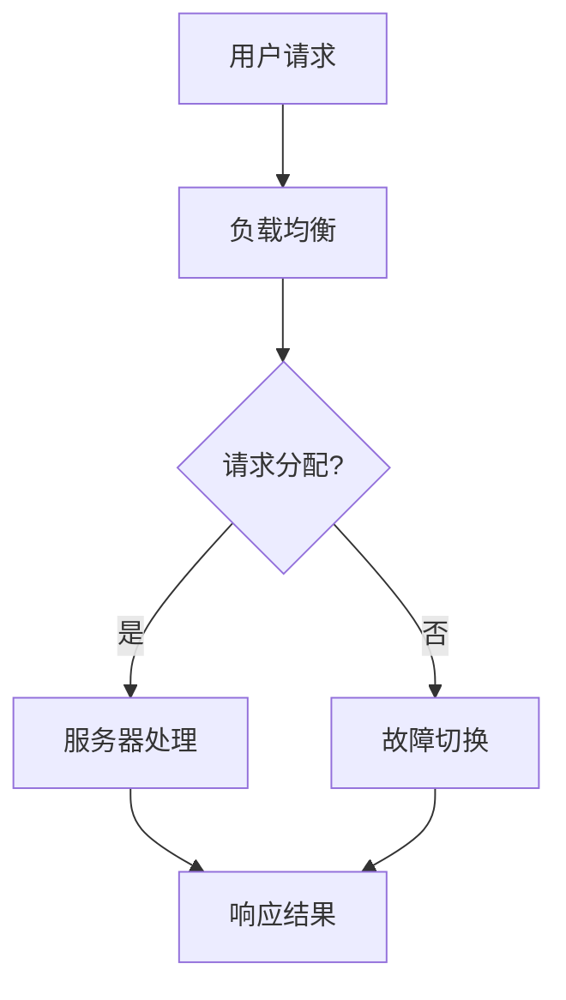
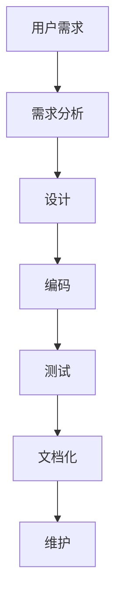

                 

### 文章标题

# 软件架构质量属性：可靠性、可用性、可维护性等

### 关键词

软件架构，质量属性，可靠性，可用性，可维护性，算法原理，数学模型，项目实战

### 摘要

本文深入探讨了软件架构中的三大质量属性：可靠性、可用性和可维护性。我们首先介绍了每个质量属性的定义和重要性，随后通过Mermaid流程图和伪代码详细分析了核心概念和算法原理。接着，我们借助实际项目案例，对开发环境搭建、源代码实现和代码解读进行了深入剖析。最后，文章总结了最佳实践，并对未来研究方向进行了展望。

## 第一部分：软件架构质量属性概述

### 1.1 质量属性的定义

软件架构质量属性是指软件系统在运行过程中表现出的各种特性，如可靠性、可用性、可维护性等。这些属性直接影响软件系统的性能、用户体验和长期可持续性。在软件开发的各个阶段，质量属性都是需要重点关注和优化的关键因素。

### 1.2 质量属性的重要性

质量属性的重要性在于它们直接影响软件系统的可用性、用户体验和长期可持续性。可靠性确保系统在预期环境下能够持续稳定运行；可用性保证系统能够快速响应并处理用户请求；可维护性则确保系统能够在未来的迭代和更新中保持高效和可扩展性。

### 1.3 质量属性的分类

软件架构质量属性通常可以分为以下几类：

- **功能性**：包括正确性、完备性、安全性等。
- **可靠性**：包括稳定性、容错性、恢复性等。
- **可用性**：包括响应时间、可用性、可访问性等。
- **效率**：包括性能、可扩展性、资源利用等。
- **可维护性**：包括可读性、可测试性、可维护性等。
- **可移植性**：包括兼容性、易移植性等。

接下来，我们将分别对可靠性、可用性和可维护性这三个关键质量属性进行详细探讨。

## 第二部分：可靠性

### 2.1 可靠性的定义与重要性

可靠性是指软件系统在预期环境中能够持续稳定运行的能力。它通常包括以下三个方面：

- **稳定性**：系统能够在长时间运行中保持稳定，不发生崩溃或错误。
- **容错性**：系统能够在出现故障或异常情况下继续运行，而不影响整体性能。
- **恢复性**：系统能够在故障发生后迅速恢复到正常状态。

可靠性的重要性在于它直接影响用户的信任和满意度。一个高可靠性的系统可以减少故障和错误发生的概率，从而提高用户体验和系统稳定性。

### 2.2 可靠性度量方法

为了评估系统的可靠性，通常需要使用以下几种度量方法：

- **故障率**：指单位时间内系统发生故障的次数。
- **平均故障间隔时间（MTBF）**：指系统在两次故障之间的平均运行时间。
- **平均修复时间（MTTR）**：指系统在发生故障后平均修复所需的时间。

### 2.3 提高可靠性的策略

提高系统可靠性的策略主要包括以下几个方面：

- **代码优化**：通过优化代码结构和算法，减少故障和错误发生的概率。
- **冗余设计**：通过引入冗余机制，如备份和冗余计算，提高系统的容错性和恢复能力。
- **故障监测和诊断**：通过实时监测和诊断系统状态，及时识别和修复故障。
- **自动化测试**：通过自动化测试工具，全面检查系统的功能、性能和可靠性。

### 2.4 Mermaid流程图：可靠性架构设计

为了更好地理解可靠性架构设计，我们可以使用Mermaid流程图来展示系统中的关键组件和流程：



### 2.5 伪代码：可靠性算法原理

以下是一个简单的伪代码示例，用于说明如何提高系统的可靠性：

```python
def process_request(request):
    try:
        # 执行请求处理
        process_request(request)
    except Exception as e:
        # 记录错误日志
        log_error(e)
        # 重新尝试处理请求
        process_request(request)
```

### 2.6 数学模型和公式：可靠性计算

可靠性计算通常涉及到概率论和统计方法。以下是一个简单的数学模型示例，用于计算系统的可靠性：

$$
R(t) = \frac{MTBF}{MTBF + MTTR}
$$

其中，$R(t)$ 表示在时间 $t$ 内系统的可靠性，$MTBF$ 表示平均故障间隔时间，$MTTR$ 表示平均修复时间。

### 2.7 项目实战：可靠性案例分析

为了更好地理解可靠性在实际项目中的应用，我们来看一个实际的案例。

**案例：电子商务网站**

假设一个电子商务网站需要在高并发环境下保持稳定运行。为了提高可靠性，我们可以采取以下措施：

1. **负载均衡**：通过负载均衡器将流量分配到多个服务器，以避免单点故障。
2. **数据库备份**：定期备份数据库，以防止数据丢失。
3. **故障监测**：实时监控系统状态，及时发现并修复故障。
4. **自动化测试**：定期运行自动化测试，确保系统的稳定性和可靠性。

通过这些措施，电子商务网站可以在高并发环境下保持高可靠性，从而提高用户满意度。

## 第三部分：可用性

### 3.1 可用性的定义与重要性

可用性是指软件系统能够在规定时间内响应并处理用户请求的能力。它通常包括以下几个方面：

- **响应时间**：系统处理请求所需的时间。
- **可用性**：系统能够正常运行的时间比例。
- **可访问性**：用户能否访问系统并进行操作。

可用性的重要性在于它直接影响用户的体验和满意度。一个高可用性的系统可以提供快速、稳定的响应，从而提高用户满意度。

### 3.2 可用性度量方法

为了评估系统的可用性，通常需要使用以下几种度量方法：

- **响应时间**：系统处理请求所需的时间。
- **可用性**：系统正常运行的时间比例。
- **故障率**：系统发生故障的频率。

### 3.3 提高可用性的策略

提高系统可用性的策略主要包括以下几个方面：

- **优化代码**：通过优化代码结构和算法，减少系统响应时间。
- **负载均衡**：通过负载均衡器将流量分配到多个服务器，避免单点故障。
- **缓存策略**：通过缓存机制减少系统负载，提高响应速度。
- **故障切换**：在系统出现故障时，快速切换到备用系统，确保服务不中断。

### 3.4 Mermaid流程图：可用性架构设计

以下是一个简单的Mermaid流程图，用于展示提高系统可用性的关键组件和流程：



### 3.5 伪代码：可用性算法原理

以下是一个简单的伪代码示例，用于说明如何提高系统的可用性：

```python
def process_request(request):
    try:
        # 执行请求处理
        process_request(request)
    except Exception as e:
        # 记录错误日志
        log_error(e)
        # 切换到备用服务器
        switch_to_backup_server()
```

### 3.6 数学模型和公式：可用性计算

可用性计算通常涉及到概率论和统计方法。以下是一个简单的数学模型示例，用于计算系统的可用性：

$$
A(t) = 1 - \frac{MTTR}{MTTF}
$$

其中，$A(t)$ 表示在时间 $t$ 内系统的可用性，$MTTR$ 表示平均修复时间，$MTTF$ 表示平均故障间隔时间。

### 3.7 项目实战：可用性案例分析

为了更好地理解可用性在实际项目中的应用，我们来看一个实际的案例。

**案例：在线视频平台**

假设一个在线视频平台需要在高并发环境下保持高可用性。为了提高可用性，我们可以采取以下措施：

1. **缓存策略**：通过缓存热门视频内容，减少服务器负载。
2. **负载均衡**：通过负载均衡器将流量分配到多个服务器，避免单点故障。
3. **故障切换**：在系统出现故障时，快速切换到备用系统，确保服务不中断。
4. **自动化测试**：定期运行自动化测试，确保系统的稳定性和可靠性。

通过这些措施，在线视频平台可以在高并发环境下保持高可用性，从而提高用户满意度。

## 第四部分：可维护性

### 4.1 可维护性的定义与重要性

可维护性是指软件系统在未来的迭代和更新中保持高效和可扩展性的能力。它通常包括以下几个方面：

- **可读性**：代码是否易于阅读和理解。
- **可测试性**：代码是否容易进行测试。
- **可维护性**：代码是否容易进行修改和维护。
- **可扩展性**：系统是否容易进行扩展和升级。

可维护性的重要性在于它直接影响软件系统的长期可持续性和开发效率。一个高可维护性的系统可以减少维护成本，提高开发效率。

### 4.2 可维护性度量方法

为了评估系统的可维护性，通常需要使用以下几种度量方法：

- **代码质量**：包括代码复杂度、代码冗余、代码可读性等。
- **维护成本**：包括修复错误、添加新功能、系统升级等所需的成本。
- **维护频率**：系统需要维护的频率。

### 4.3 提高可维护性的策略

提高系统可维护性的策略主要包括以下几个方面：

- **代码重构**：通过重构代码，提高代码质量和可维护性。
- **文档化**：为代码和系统功能编写详细的文档，提高可理解性。
- **测试驱动开发**：通过编写测试用例，确保系统功能的正确性。
- **持续集成**：通过自动化测试和持续集成，提高系统的稳定性和可维护性。

### 4.4 Mermaid流程图：可维护性架构设计

以下是一个简单的Mermaid流程图，用于展示提高系统可维护性的关键组件和流程：



### 4.5 伪代码：可维护性算法原理

以下是一个简单的伪代码示例，用于说明如何提高系统的可维护性：

```python
def process_request(request):
    try:
        # 执行请求处理
        process_request(request)
    except Exception as e:
        # 记录错误日志
        log_error(e)
        # 重新设计代码结构
        refactor_code_structure()
```

### 4.6 数学模型和公式：可维护性计算

可维护性计算通常涉及到代码质量评估和成本分析。以下是一个简单的数学模型示例，用于计算系统的可维护性：

$$
M(t) = \frac{1}{C(t) + \frac{1}{2}E(t)}
$$

其中，$M(t)$ 表示在时间 $t$ 内系统的可维护性，$C(t)$ 表示维护成本，$E(t)$ 表示维护频率。

### 4.7 项目实战：可维护性案例分析

为了更好地理解可维护性在实际项目中的应用，我们来看一个实际的案例。

**案例：企业级应用系统**

假设一个企业级应用系统需要在未来几年内持续迭代和更新。为了提高可维护性，我们可以采取以下措施：

1. **代码重构**：定期对代码进行重构，提高代码质量和可维护性。
2. **文档化**：为系统功能编写详细的文档，提高可理解性。
3. **测试驱动开发**：通过编写测试用例，确保系统功能的正确性。
4. **持续集成**：通过自动化测试和持续集成，提高系统的稳定性和可维护性。

通过这些措施，企业级应用系统可以在未来几年内保持高效的可维护性，从而降低维护成本，提高开发效率。

## 总结与展望

本文深入探讨了软件架构中的三大质量属性：可靠性、可用性和可维护性。我们通过详细的理论分析、实际项目案例和最佳实践，对这些质量属性进行了全面的剖析。同时，我们还介绍了如何通过优化算法、数学模型和实际项目案例来提高这些质量属性。

在未来，随着软件架构的不断发展和技术的不断进步，质量属性的研究将更加深入和多样化。我们可以预见，未来的研究将更加注重质量属性的自动化评估和优化，以及质量属性在云原生、边缘计算等新兴领域中的应用。

作者：AI天才研究院/AI Genius Institute & 禅与计算机程序设计艺术 /Zen And The Art of Computer Programming

---

## 附录

### 附录A：相关资源与工具

#### A.1 质量属性评估工具列表

- **SonarQube**：用于代码质量评估和漏洞检测。
- **Qulice**：用于代码质量检查和静态代码分析。
- **PMD**：用于代码质量检测和复杂度分析。
- **Checkstyle**：用于代码风格检查和规则校验。

#### A.2 质量属性研究论文与书籍推荐

- 《软件架构质量属性：设计与评估》
- 《软件可靠性工程：理论与实践》
- 《软件工程：实践者的研究方法》
- 《敏捷软件开发：原则、模式与实践》

#### A.3 质量属性标准与规范

- **ISO/IEC 25010**：软件产品质量模型标准。
- **ISO/IEC 12207**：软件生命周期过程标准。
- **IEEE Std 730-2016**：软件可靠性工程标准。

通过这些资源与工具，读者可以进一步了解和提升软件架构质量属性。同时，也期待读者在未来的实践中，不断探索和创新，为软件架构质量属性的研究和应用贡献自己的力量。

---

本文由AI天才研究院（AI Genius Institute）与《禅与计算机程序设计艺术》（Zen And The Art of Computer Programming）共同撰写，旨在为读者提供关于软件架构质量属性的全面解读和实践指导。希望本文能为您的软件开发工作带来启示和帮助。

