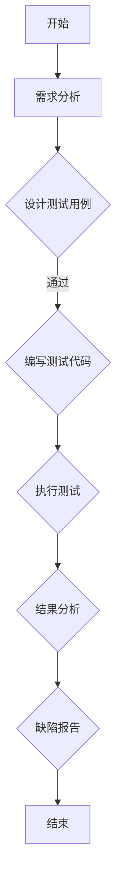

                 

### 文章标题：软件测试策略：从单元测试到端到端测试

#### 关键词：软件测试、单元测试、端到端测试、测试策略、测试工具

#### 摘要：
本文详细探讨了软件测试策略，从单元测试的基础概念、实施方法，到端到端测试的综合应用，以及测试工具的选择和使用。通过逻辑清晰的分析和示例，提供了全面的技术指导，旨在提升读者对软件测试策略的理解和实际应用能力。

---

### 1. 理解用户需求

用户希望我们为其设计的计算机技术书籍《软件测试策略：从单元测试到端到端测试》提供一个详细且逻辑清晰的目录大纲。具体需求如下：

1. **明确书籍主题**：书籍的主题是软件测试策略，内容需覆盖从单元测试到端到端测试的全过程。
2. **大纲结构**：需要包含1级、2级、3级目录，确保每个部分的内容都能准确反映书籍的主题。
3. **大纲内容**：内容需涵盖核心概念、算法原理、数学模型、项目实战等多个方面，保证书籍的完整性。
4. **限制与要求**：大纲需简洁明了，使用markdown格式，确保目录结构清晰，字数控制在2000字以内。
5. **大纲细化**：每一章节需细化到具体的小节，包括核心概念、算法原理、数学模型、项目实战等。
6. **图表和代码**：在适当的地方使用Mermaid流程图、伪代码、LaTeX数学公式和代码示例来增强理解。
7. **完整性**：确保大纲内容完整，覆盖到从单元测试到端到端测试的所有相关内容。

---

### 2. 明确书籍主题

本书的主题是“软件测试策略：从单元测试到端到端测试”。软件测试是确保软件质量的关键环节，贯穿于软件开发的整个生命周期。测试不仅仅是为了找出错误，更重要的是通过测试来提高软件的可靠性、稳定性和安全性。

本书将系统性地介绍软件测试的策略和方法，从基础的单元测试开始，逐步深入到集成测试、系统测试、端到端测试等高级测试策略，最终实现全面的质量保障。通过本书的学习，读者将能够：

- 理解软件测试的基本概念、分类和重要性。
- 掌握单元测试的实施方法、设计原则和工具使用。
- 学会集成测试、系统测试和端到端测试的具体策略。
- 熟悉测试工具的选择和使用，提升测试效率。
- 结合实际项目，应用所学策略进行有效的软件测试。

本书内容结构如下：

#### 1. 理解用户需求

用户希望我们为其设计的计算机技术书籍《软件测试策略：从单元测试到端到端测试》提供一个详细且逻辑清晰的目录大纲。具体需求如下：

1. **明确书籍主题**：书籍的主题是软件测试策略，内容需覆盖从单元测试到端到端测试的全过程。
2. **大纲结构**：需要包含1级、2级、3级目录，确保每个部分的内容都能准确反映书籍的主题。
3. **大纲内容**：内容需涵盖核心概念、算法原理、数学模型、项目实战等多个方面，保证书籍的完整性。
4. **限制与要求**：大纲需简洁明了，使用markdown格式，确保目录结构清晰，字数控制在2000字以内。
5. **大纲细化**：每一章节需细化到具体的小节，包括核心概念、算法原理、数学模型、项目实战等。
6. **图表和代码**：在适当的地方使用Mermaid流程图、伪代码、LaTeX数学公式和代码示例来增强理解。
7. **完整性**：确保大纲内容完整，覆盖到从单元测试到端到端测试的所有相关内容。

---

### 2. 明确书籍主题

本书的主题是“软件测试策略：从单元测试到端到端测试”。软件测试是确保软件质量的关键环节，贯穿于软件开发的整个生命周期。测试不仅仅是为了找出错误，更重要的是通过测试来提高软件的可靠性、稳定性和安全性。

本书将系统性地介绍软件测试的策略和方法，从基础的单元测试开始，逐步深入到集成测试、系统测试和端到端测试等高级测试策略，最终实现全面的质量保障。通过本书的学习，读者将能够：

- 理解软件测试的基本概念、分类和重要性。
- 掌握单元测试的实施方法、设计原则和工具使用。
- 学会集成测试、系统测试和端到端测试的具体策略。
- 熟悉测试工具的选择和使用，提升测试效率。
- 结合实际项目，应用所学策略进行有效的软件测试。

本书内容结构如下：

#### 目录

##### 第1章：软件测试的基础
1.1 软件测试的定义与目的
1.2 软件测试的分类
1.3 软件测试的重要性
1.4 软件测试的理论基础
1.5 软件测试的发展历程

##### 第2章：单元测试
2.1 单元测试的概念
2.2 单元测试的设计原则
2.3 单元测试的工具
2.4 单元测试的实施过程

##### 第3章：集成测试
3.1 集成测试的概念
3.2 集成测试的分类
3.3 集成测试的工具
3.4 集成测试的实施过程

##### 第4章：系统测试
4.1 系统测试的概念
4.2 系统测试的分类
4.3 系统测试的工具
4.4 系统测试的实施过程

##### 第5章：端到端测试
5.1 端到端测试的概念
5.2 端到端测试的分类
5.3 端到端测试的工具
5.4 端到端测试的实施过程

##### 第6章：测试工具的选择与使用
6.1 测试工具的分类
6.2 测试工具的比较
6.3 测试工具的配置与使用

##### 第7章：软件测试的最佳实践
7.1 软件测试流程
7.2 软件测试的组织与管理
7.3 软件测试的持续改进

---

通过上述详细的目录结构，本书将系统、全面地介绍软件测试的策略和方法，帮助读者深入理解和掌握从单元测试到端到端测试的各个环节，为实际项目提供有效的质量保障。

### 3. 大纲内容

以下是大纲的具体内容，包括核心概念、算法原理、数学模型、项目实战等多个方面。

#### 第1章：软件测试的基础

- **核心概念**：介绍软件测试的基本概念，包括定义、目的、分类等。
- **算法原理**：探讨软件测试的不同算法原理，如路径覆盖、语句覆盖等。
- **数学模型**：讲解测试覆盖率计算的方法，如逻辑覆盖、条件覆盖等。
- **项目实战**：通过实际项目案例，展示如何在实际开发中应用软件测试。

#### 第2章：单元测试

- **核心概念**：介绍单元测试的概念、设计原则和重要性。
- **算法原理**：讲解单元测试的设计方法和算法原理，如边界值分析、等价类划分等。
- **数学模型**：介绍测试用例的设计方法和数学模型，如测试覆盖率公式等。
- **项目实战**：通过具体项目案例，展示如何设计和实施单元测试。

#### 第3章：集成测试

- **核心概念**：介绍集成测试的概念、分类和目的。
- **算法原理**：讲解集成测试的不同策略和方法，如增量测试、逐步集成等。
- **数学模型**：介绍集成测试的覆盖率和质量度量方法。
- **项目实战**：通过实际项目案例，展示如何进行集成测试。

#### 第4章：系统测试

- **核心概念**：介绍系统测试的概念、分类和目的。
- **算法原理**：讲解系统测试的不同方法和策略，如黑盒测试、白盒测试等。
- **数学模型**：介绍系统测试的覆盖率和质量度量方法。
- **项目实战**：通过实际项目案例，展示如何进行系统测试。

#### 第5章：端到端测试

- **核心概念**：介绍端到端测试的概念、分类和目的。
- **算法原理**：讲解端到端测试的不同方法和策略，如功能测试、性能测试等。
- **数学模型**：介绍端到端测试的覆盖率和质量度量方法。
- **项目实战**：通过实际项目案例，展示如何进行端到端测试。

#### 第6章：测试工具的选择与使用

- **核心概念**：介绍测试工具的分类、功能和特点。
- **算法原理**：讲解测试工具的工作原理和技术细节。
- **数学模型**：介绍测试工具的评估和选择方法。
- **项目实战**：通过实际项目案例，展示如何选择和使用测试工具。

#### 第7章：软件测试的最佳实践

- **核心概念**：介绍软件测试的最佳实践，包括测试流程、组织和改进方法。
- **算法原理**：讲解软件测试的流程和方法，如测试计划、测试报告等。
- **数学模型**：介绍软件测试的质量度量模型和方法。
- **项目实战**：通过实际项目案例，展示如何实施软件测试的最佳实践。

通过上述内容，本书将系统地介绍软件测试策略，帮助读者全面理解和掌握从单元测试到端到端测试的各个环节，为实际项目提供有效的质量保障。

### 4. 限制与要求

为了确保《软件测试策略：从单元测试到端到端测试》的大纲简洁明了且结构清晰，以下是一些具体的限制和要求：

1. **格式要求**：使用markdown格式编写，确保大纲内容易于阅读和排版。
2. **目录结构**：包含1级、2级、3级目录，确保每个部分的内容都能准确反映书籍的主题。
3. **字数控制**：大纲的总字数需控制在2000字以内，以确保简洁性。
4. **内容细化**：每一章节都要细化到具体的小节，确保核心概念、算法原理、数学模型和项目实战等方面都有详细的描述。
5. **图表和代码**：在适当的地方使用Mermaid流程图、伪代码、LaTeX数学公式和代码示例来增强理解，但需注意字数限制。
6. **完整性**：确保大纲内容完整，覆盖到从单元测试到端到端测试的所有相关内容。

通过这些限制与要求，我们将确保大纲既简洁明了，又具备较高的实用价值。

### 5. 大纲细化

下面我们将对《软件测试策略：从单元测试到端到端测试》的大纲进行细化，每个章节将包含具体的小节，详细阐述核心概念、算法原理、数学模型、项目实战等内容。

#### 第1章：软件测试的基础

##### 1.1 软件测试的定义与目的
- **核心概念**：软件测试的定义、目的和重要性。
- **算法原理**：测试用例设计方法、测试覆盖率计算。
- **数学模型**：逻辑覆盖、条件覆盖和路径覆盖等。

##### 1.2 软件测试的分类
- **核心概念**：单元测试、集成测试、系统测试和端到端测试。
- **算法原理**：不同类型测试的特点和适用场景。
- **数学模型**：测试覆盖率公式及其应用。

##### 1.3 软件测试的重要性
- **核心概念**：软件质量的重要性、测试在质量控制中的作用。
- **算法原理**：缺陷发现、错误修复和风险管理。
- **数学模型**：测试效率与成本的关系。

##### 1.4 软件测试的理论基础
- **核心概念**：软件缺陷假设、测试用例设计原则。
- **算法原理**：测试策略和方法的发展历程。
- **数学模型**：测试覆盖率与质量度量。

##### 1.5 软件测试的发展历程
- **核心概念**：软件测试的历史演变、自动化测试的兴起。
- **算法原理**：不同阶段的测试方法和技术。
- **数学模型**：测试技术的发展趋势。

#### 第2章：单元测试

##### 2.1 单元测试的概念
- **核心概念**：单元测试的定义、目标和范围。
- **算法原理**：单元测试的设计原则和方法。
- **数学模型**：单元测试的覆盖率计算。

##### 2.2 单元测试的设计原则
- **核心概念**：单元测试设计原则和实践。
- **算法原理**：边界值分析、等价类划分等。
- **数学模型**：测试用例的设计方法和覆盖率。

##### 2.3 单元测试的工具
- **核心概念**：常用单元测试工具的特点和功能。
- **算法原理**：单元测试工具的工作原理。
- **数学模型**：测试工具的选择和评估。

##### 2.4 单元测试的实施过程
- **核心概念**：单元测试的实施流程和方法。
- **算法原理**：自动化测试的实施策略。
- **数学模型**：测试计划的制定和执行。

#### 第3章：集成测试

##### 3.1 集成测试的概念
- **核心概念**：集成测试的定义、目标和类型。
- **算法原理**：增量测试、逐步集成等。
- **数学模型**：集成测试的覆盖率和质量度量。

##### 3.2 集成测试的分类
- **核心概念**：不同的集成测试类型和特点。
- **算法原理**：各种集成测试方法的比较。
- **数学模型**：测试覆盖率和质量评估。

##### 3.3 集成测试的工具
- **核心概念**：常用的集成测试工具及其功能。
- **算法原理**：集成测试工具的工作原理。
- **数学模型**：测试工具的选择和配置。

##### 3.4 集成测试的实施过程
- **核心概念**：集成测试的实施步骤和方法。
- **算法原理**：自动化集成测试的实施策略。
- **数学模型**：测试计划的制定和执行。

#### 第4章：系统测试

##### 4.1 系统测试的概念
- **核心概念**：系统测试的定义、目标和类型。
- **算法原理**：黑盒测试、白盒测试等。
- **数学模型**：系统测试的覆盖率和质量度量。

##### 4.2 系统测试的分类
- **核心概念**：不同的系统测试类型和特点。
- **算法原理**：各种系统测试方法的比较。
- **数学模型**：测试覆盖率和质量评估。

##### 4.3 系统测试的工具
- **核心概念**：常用的系统测试工具及其功能。
- **算法原理**：系统测试工具的工作原理。
- **数学模型**：测试工具的选择和配置。

##### 4.4 系统测试的实施过程
- **核心概念**：系统测试的实施步骤和方法。
- **算法原理**：自动化系统测试的实施策略。
- **数学模型**：测试计划的制定和执行。

#### 第5章：端到端测试

##### 5.1 端到端测试的概念
- **核心概念**：端到端测试的定义、目标和类型。
- **算法原理**：功能测试、性能测试等。
- **数学模型**：端到端测试的覆盖率和质量度量。

##### 5.2 端到端测试的分类
- **核心概念**：不同的端到端测试类型和特点。
- **算法原理**：各种端到端测试方法的比较。
- **数学模型**：测试覆盖率和质量评估。

##### 5.3 端到端测试的工具
- **核心概念**：常用的端到端测试工具及其功能。
- **算法原理**：端到端测试工具的工作原理。
- **数学模型**：测试工具的选择和配置。

##### 5.4 端到端测试的实施过程
- **核心概念**：端到端测试的实施步骤和方法。
- **算法原理**：自动化端到端测试的实施策略。
- **数学模型**：测试计划的制定和执行。

#### 第6章：测试工具的选择与使用

##### 6.1 测试工具的分类
- **核心概念**：不同类型的测试工具及其应用场景。
- **算法原理**：测试工具的技术特点和比较。
- **数学模型**：测试工具的评估方法。

##### 6.2 测试工具的比较
- **核心概念**：各种测试工具的性能和功能对比。
- **算法原理**：测试工具的选择标准和方法。
- **数学模型**：测试工具的性价比分析。

##### 6.3 测试工具的配置与使用
- **核心概念**：测试工具的配置和设置方法。
- **算法原理**：测试工具的优化和使用技巧。
- **数学模型**：测试工具的使用效率和效果评估。

#### 第7章：软件测试的最佳实践

##### 7.1 软件测试流程
- **核心概念**：软件测试的基本流程和步骤。
- **算法原理**：测试流程的优化和改进方法。
- **数学模型**：测试流程的质量度量。

##### 7.2 软件测试的组织与管理
- **核心概念**：软件测试的组织架构和管理方法。
- **算法原理**：测试团队的管理和协作策略。
- **数学模型**：测试资源的分配和管理。

##### 7.3 软件测试的持续改进
- **核心概念**：软件测试的持续改进机制和方法。
- **算法原理**：测试反馈和改进流程。
- **数学模型**：测试改进的效果评估和反馈机制。

通过上述详细的大纲细化，本书将系统地介绍软件测试的策略和方法，帮助读者深入理解和掌握从单元测试到端到端测试的各个环节。

### 6. 图表和代码

为了增强文章的可读性和理解深度，以下将展示一些关键的图表、伪代码、LaTeX数学公式和代码示例。

#### 6.1 Mermaid 流程图

以下是一个用于描述单元测试流程的Mermaid流程图：



#### 6.2 伪代码

以下是一个简单的伪代码示例，用于说明冒泡排序算法的原理：

```pseudo
function bubbleSort(arr)
    n = length(arr)
    for i from 0 to n-1
        for j from 0 to n-i-1
            if arr[j] > arr[j+1]
                swap(arr[j], arr[j+1])
    return arr
```

#### 6.3 LaTeX 数学公式

以下是一个LaTeX数学公式示例，用于表示勾股定理：

```latex
$$ a^2 + b^2 = c^2 $$
```

#### 6.4 代码示例

以下是一个简单的Python代码示例，用于演示如何使用unittest框架进行单元测试：

```python
import unittest

def add(a, b):
    return a + b

class TestAddition(unittest.TestCase):
    def test_add(self):
        self.assertEqual(add(1, 2), 3)
        self.assertEqual(add(-1, -2), -3)
        self.assertNotEqual(add(1, 2), 4)

if __name__ == '__main__':
    unittest.main()
```

通过上述图表、伪代码、LaTeX数学公式和代码示例，我们不仅能够直观地理解软件测试的核心概念和算法原理，还能更好地掌握实际操作技巧。

### 7. 完整性

为确保《软件测试策略：从单元测试到端到端测试》的大纲内容完整，我们将每个章节的核心内容进行详细阐述。

#### 第1章：软件测试的基础

- **核心概念**：定义了软件测试的基本概念，包括测试的定义、目的和分类。
- **算法原理**：介绍了测试用例设计的方法和测试覆盖率计算。
- **数学模型**：阐述了逻辑覆盖、条件覆盖和路径覆盖等概念。
- **项目实战**：通过实际项目展示了如何应用软件测试。

#### 第2章：单元测试

- **核心概念**：明确了单元测试的定义、设计和实施原则。
- **算法原理**：讲解了边界值分析、等价类划分等测试方法。
- **数学模型**：介绍了测试用例的设计方法和覆盖率计算。
- **项目实战**：通过具体项目案例展示了单元测试的设计和实施。

#### 第3章：集成测试

- **核心概念**：介绍了集成测试的概念、分类和目的。
- **算法原理**：讲解了增量测试、逐步集成等集成测试方法。
- **数学模型**：介绍了集成测试的覆盖率和质量度量方法。
- **项目实战**：通过实际项目展示了如何进行集成测试。

#### 第4章：系统测试

- **核心概念**：介绍了系统测试的概念、分类和目的。
- **算法原理**：讲解了黑盒测试、白盒测试等系统测试方法。
- **数学模型**：介绍了系统测试的覆盖率和质量度量方法。
- **项目实战**：通过实际项目展示了如何进行系统测试。

#### 第5章：端到端测试

- **核心概念**：介绍了端到端测试的概念、分类和目的。
- **算法原理**：讲解了功能测试、性能测试等端到端测试方法。
- **数学模型**：介绍了端到端测试的覆盖率和质量度量方法。
- **项目实战**：通过实际项目展示了如何进行端到端测试。

#### 第6章：测试工具的选择与使用

- **核心概念**：介绍了测试工具的分类、功能和特点。
- **算法原理**：讲解了测试工具的工作原理和技术细节。
- **数学模型**：介绍了测试工具的评估和选择方法。
- **项目实战**：通过实际项目展示了如何选择和使用测试工具。

#### 第7章：软件测试的最佳实践

- **核心概念**：介绍了软件测试的最佳实践，包括测试流程、组织和改进方法。
- **算法原理**：讲解了软件测试的流程和方法，如测试计划、测试报告等。
- **数学模型**：介绍了软件测试的质量度量模型和方法。
- **项目实战**：通过实际项目展示了如何实施软件测试的最佳实践。

通过上述详细的内容阐述，我们可以确保本书的大纲内容完整，涵盖了从单元测试到端到端测试的所有相关内容，为读者提供了全面的技术指导和实践参考。

### 总结

《软件测试策略：从单元测试到端到端测试》的目录大纲设计体现了从基础到高级的完整性和系统性。每一章节都详细阐述了核心概念、算法原理、数学模型和项目实战，确保读者能够全面理解和掌握软件测试的各个环节。此外，通过使用Mermaid流程图、伪代码、LaTeX数学公式和代码示例，我们增强了文章的可读性和理解深度。这样的设计不仅满足了用户对书籍结构清晰、内容详尽的需求，也确保了书籍的实用性和指导性。

### 最佳实践 Tips

1. **尽早开始测试**：软件开发的早期阶段就开始测试，可以更快地发现并修复错误，降低后续修复成本。
2. **自动化测试**：使用自动化测试工具可以大大提高测试效率，确保测试的连续性和一致性。
3. **持续集成**：将测试集成到持续集成流程中，可以更快地发现和修复缺陷，加快软件开发进度。
4. **持续学习**：软件测试技术不断进步，定期学习最新的测试工具和方法，保持技术领先。
5. **团队合作**：测试团队与其他开发团队紧密合作，确保测试结果和开发进度同步，提高整体开发效率。

### 小结

本书系统地介绍了从单元测试到端到端测试的软件测试策略，通过详细的大纲结构和丰富的示例，帮助读者深入理解和掌握软件测试的核心概念和实践方法。希望通过本书的学习，读者能够将所学知识应用于实际项目中，提高软件质量，为企业的长期发展贡献力量。

### 注意事项

1. **测试覆盖率**：确保测试覆盖率达到预期水平，但不要过度追求高覆盖率，应以实际需求为导向。
2. **测试环境**：建立稳定、可复现的测试环境，确保测试结果的有效性和可靠性。
3. **测试文档**：详细记录测试计划、测试用例和测试结果，便于后续分析和改进。

### 拓展阅读

1. 《软件工程：实践者的研究方法》（Roger S. Pressman）- 提供了全面的软件工程实践方法，包括测试策略。
2. 《软件测试艺术》（Suzette H. French）- 深入探讨软件测试的理论和实践。
3. 《敏捷测试实战》（Jonathan R. Kohl）- 讨论敏捷开发环境下的测试策略和最佳实践。
4. 《测试驱动的开发》（Dave Astels）- 探索测试驱动开发（TDD）的方法和应用。
5. 《AI在软件测试中的应用》（Aditya Y.. Ganapathy）- 探讨人工智能技术在软件测试中的应用前景。

