                 

### 文章标题

《软件测试策略：构建高质量的测试金字塔》

### 文章关键词

- 软件测试
- 测试金字塔
- 单元测试
- 集成测试
- 系统测试
- 性能测试
- 自动化测试

### 文章摘要

本文旨在探讨软件测试策略，重点介绍了如何构建高质量的测试金字塔。通过对单元测试、集成测试、系统测试和性能测试等核心概念的深入解析，文章揭示了各个测试层次之间的相互关系，并提供了具体的策略和实践方法。此外，文章还探讨了自动化测试的策略和实践，以及测试管理和组织策略，为读者提供了一个全面的软件测试策略指南。

## 测试金字塔的概念和构建方法

### 背景介绍

在软件工程中，测试是一个至关重要的环节。它不仅能够发现和修复代码中的缺陷，还能够提高软件的质量和可靠性。为了有效地进行测试，我们需要遵循一种合理的测试策略，这种策略就是测试金字塔。

测试金字塔是一种层次化的测试策略，它将软件测试划分为不同的层次，每个层次都有其特定的目标和职责。这种策略有助于优化测试资源的使用，确保测试的全面性和有效性。

### 核心概念与联系

在测试金字塔中，通常有三个主要的测试层次：单元测试、集成测试和系统测试。每个层次都有其特定的目的和范围。

- **单元测试**：针对软件中最小的可测试单元（通常是函数或方法）进行的测试。它的主要目标是验证每个单元是否按照预期工作。

- **集成测试**：在单元测试之后进行，旨在测试不同模块之间的接口和交互。它的主要目标是发现模块之间的不兼容性和接口问题。

- **系统测试**：在整个软件系统完成开发后进行，旨在验证系统是否符合需求规格和设计要求。它包括功能测试、性能测试、安全测试等多个方面。

这三个层次之间的关系可以用以下Mermaid流程图来表示：

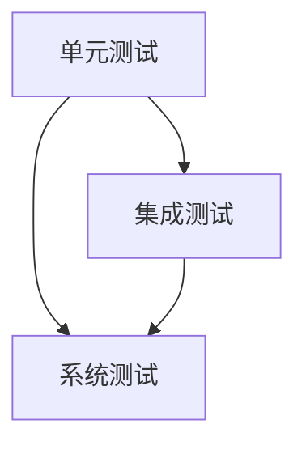

### 测试金字塔的构建原则

构建测试金字塔时，需要遵循以下原则：

1. **测试层次的比例**：通常情况下，单元测试的比例应该最大，集成测试次之，系统测试最少。这是因为单元测试可以覆盖代码的每个细节，而集成测试和系统测试更注重于不同模块和系统的交互和整体表现。

2. **测试执行的顺序**：单元测试应该在集成测试之前进行，集成测试在系统测试之前进行。这样可以确保每个层次的测试都基于前一个层次的测试结果，从而减少测试成本和风险。

3. **测试覆盖率的平衡**：在构建测试金字塔时，需要平衡各个层次的覆盖率。虽然单元测试的比例最大，但并不意味着单元测试的覆盖率应该达到100%。相反，应该根据具体的项目需求和风险来调整各个层次的覆盖率。

### 测试金字塔的应用场景

测试金字塔的应用场景非常广泛，它可以适用于各种类型的软件项目，特别是那些具有复杂模块和大量代码的项目。以下是一些常见的应用场景：

- **大型企业级应用**：这些应用通常具有复杂的模块和大量的业务逻辑，测试金字塔可以帮助确保每个模块的独立性，并提高整体系统的稳定性。

- **Web应用**：Web应用通常需要频繁更新和维护，测试金字塔可以帮助快速发现和修复问题，从而提高系统的可靠性和用户体验。

- **移动应用**：移动应用具有跨平台和设备兼容性的特点，测试金字塔可以帮助确保应用在不同设备和操作系统上的稳定性。

### 小结

测试金字塔是一种有效的测试策略，它通过分层测试来提高软件的质量和可靠性。通过遵循测试金字塔的构建原则，可以优化测试资源的使用，确保测试的全面性和有效性。在接下来的章节中，我们将深入探讨单元测试、集成测试和系统测试的具体策略和实践。

## 单元测试的策略和实践

### 核心概念与联系

单元测试是测试金字塔的基础层次，它主要关注于验证软件中的最小可测试单元，如函数、方法或类。单元测试的核心概念在于确保每个单元都能够独立、正确地执行其预定功能。

单元测试与代码质量密切相关。通过编写和执行单元测试，我们可以确保代码的正确性，减少代码缺陷，提高代码的可维护性和可扩展性。单元测试还可以帮助开发人员理解代码的内部逻辑，从而更有效地进行代码重构和优化。

下面是一个单元测试和代码质量关系的Mermaid流程图：

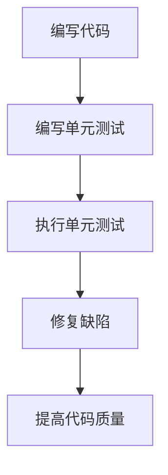

### 单元测试的设计方法

设计单元测试时，需要考虑以下几个方面：

1. **测试用例的覆盖率**：测试用例应该覆盖代码的所有可能路径，包括正常路径和异常路径。可以使用边界值分析、等价类划分和因果图等方法来设计测试用例。

2. **测试用例的独立性**：每个测试用例都应该独立执行，不应依赖于其他测试用例的结果。这样可以确保测试的重复性和一致性。

3. **测试用例的执行顺序**：测试用例的执行顺序应该合理，以便尽早发现错误。例如，可以先执行覆盖度较低的测试用例，再执行覆盖度较高的测试用例。

4. **测试用例的可维护性**：测试用例应该容易理解、修改和扩展，以便在代码发生变化时能够快速更新。

下面是一个测试用例设计方法的Mermaid流程图：

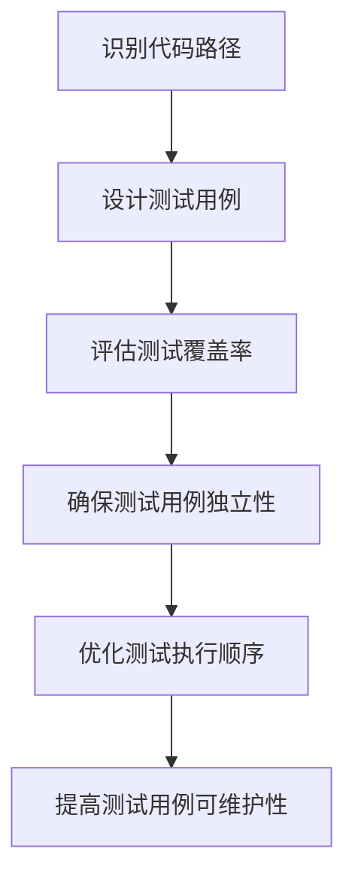

### 单元测试的实施流程

实施单元测试通常包括以下步骤：

1. **编写测试代码**：根据设计好的测试用例，编写测试代码。测试代码通常包括测试数据准备、断言和异常处理。

2. **执行测试**：使用测试框架（如JUnit、TestNG）执行测试代码。测试框架可以提供丰富的功能，如测试结果报告、断言和异常处理。

3. **分析测试结果**：根据测试结果，分析代码是否存在缺陷。如果发现缺陷，需要定位问题并进行修复。

4. **回归测试**：在修复缺陷后，执行回归测试以确保修复问题不会引入新的缺陷。

下面是一个单元测试实施流程的Mermaid流程图：

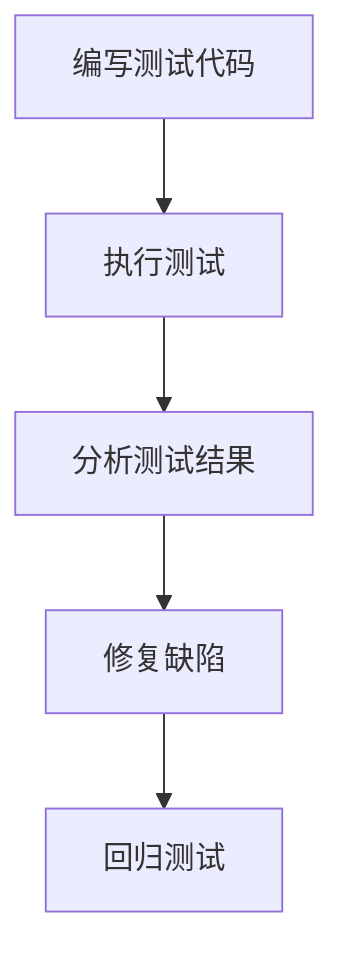

### 单元测试的工具和框架

在实施单元测试时，可以使用多种工具和框架，以下是一些常用的工具和框架：

1. **JUnit**：JUnit是最流行的Java单元测试框架之一，它提供了丰富的测试功能，如断言、测试套件和测试结果报告。

2. **TestNG**：TestNG是一个强大的测试框架，它支持多种编程语言，并提供丰富的功能，如数据驱动测试、依赖测试和参数化测试。

3. **Mockito**：Mockito是一个轻量级的模拟框架，用于创建模拟对象，以便在单元测试中隔离被测试代码。

4. **Selenium**：Selenium是一个用于Web应用的自动化测试框架，它支持多种浏览器和编程语言，可以用于实现功能测试和性能测试。

### 小结

单元测试是软件测试策略中的基础层次，它通过验证最小可测试单元的正确性来提高代码质量。设计有效的单元测试需要考虑测试用例的覆盖率、独立性和可维护性。实施单元测试通常包括编写测试代码、执行测试、分析测试结果和回归测试。使用合适的工具和框架可以大大提高单元测试的效率和效果。

## 集成测试的策略和实践

### 核心概念与联系

集成测试是测试金字塔的第二层，它在单元测试的基础上进行，旨在测试不同模块之间的接口和交互。集成测试的核心目标是确保模块之间的正确通信和协作，从而提高系统的整体质量。

集成测试与单元测试之间有着密切的联系。单元测试验证的是最小可测试单元的正确性，而集成测试验证的是多个单元组合在一起后的行为。通过单元测试，我们可以确保每个单元都是正确的，而通过集成测试，我们可以确保这些单元在一起时能够正常工作。

下面是一个单元测试和集成测试关系的Mermaid流程图：

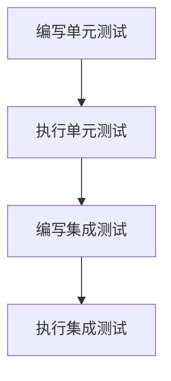

### 集成测试的设计方法

设计集成测试时，需要考虑以下几个方面：

1. **模块接口的测试**：确保模块之间的接口符合设计规范，接口参数、返回值和异常处理都符合预期。

2. **数据流的测试**：验证模块之间的数据流动是否正确，数据是否在传输过程中丢失或被篡改。

3. **异常处理的测试**：检查模块在遇到异常情况时的行为，确保系统能够优雅地处理异常。

4. **性能测试**：评估模块在集成后的性能表现，包括响应时间、资源消耗和并发处理能力。

下面是一个集成测试设计方法的Mermaid流程图：

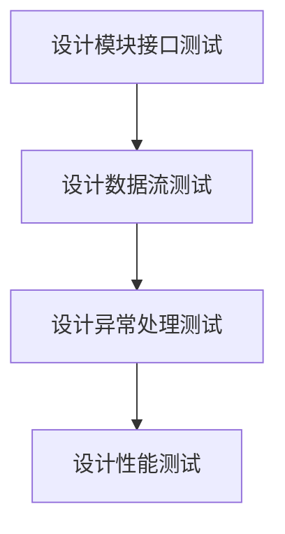

### 集成测试的实施流程

实施集成测试通常包括以下步骤：

1. **构建集成测试环境**：准备测试所需的环境，包括数据库、服务器和外部依赖。

2. **编写集成测试代码**：根据设计好的测试用例，编写集成测试代码。集成测试代码通常涉及多个模块的协同工作。

3. **执行集成测试**：使用测试框架（如JUnit、TestNG）执行集成测试代码。测试框架可以提供丰富的功能，如测试结果报告和异常处理。

4. **分析测试结果**：根据测试结果，分析系统是否存在缺陷。如果发现缺陷，需要定位问题并进行修复。

5. **回归测试**：在修复缺陷后，执行回归测试以确保修复问题不会引入新的缺陷。

下面是一个集成测试实施流程的Mermaid流程图：

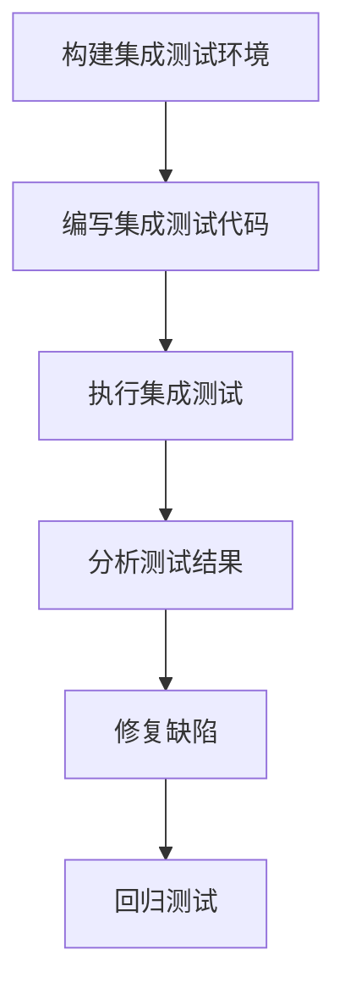

### 集成测试的工具和框架

在实施集成测试时，可以使用多种工具和框架，以下是一些常用的工具和框架：

1. **JUnit**：JUnit是最流行的Java集成测试框架之一，它提供了丰富的功能，如测试套件、参数化测试和依赖测试。

2. **TestNG**：TestNG是一个强大的测试框架，它支持多种编程语言，并提供丰富的功能，如数据驱动测试、依赖测试和性能测试。

3. **Selenium**：Selenium是一个用于Web应用的自动化测试框架，它支持多种浏览器和编程语言，可以用于实现功能测试和性能测试。

4. **JMeter**：JMeter是一个开源的性能测试工具，它可以模拟大量用户同时访问系统，从而评估系统的性能表现。

### 小结

集成测试是测试金字塔中的重要层次，它通过测试模块之间的接口和交互来确保系统的整体质量。设计有效的集成测试需要考虑模块接口、数据流、异常处理和性能等方面。实施集成测试通常包括构建测试环境、编写测试代码、执行测试和分析结果等步骤。使用合适的工具和框架可以大大提高集成测试的效率和效果。

## 系统测试的策略和实践

### 核心概念与联系

系统测试是测试金字塔的第三层，它涵盖了整个软件系统的各个层面，旨在验证系统是否符合需求规格和设计要求。系统测试的核心概念是验证系统的功能、性能、可靠性、安全性和兼容性。

系统测试与集成测试之间有着紧密的联系。集成测试主要关注模块之间的交互和接口，而系统测试则更注重系统作为一个整体的性能和行为。通过系统测试，我们可以确保系统在不同环境和条件下都能够正常运行，满足用户的需求。

下面是一个系统测试和集成测试关系的Mermaid流程图：

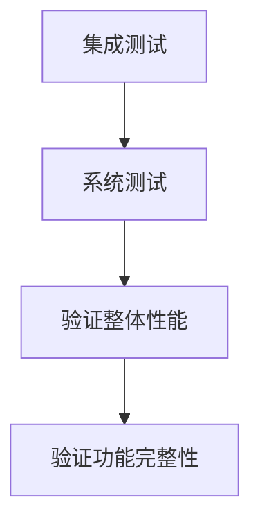

### 系统测试的设计方法

设计系统测试时，需要考虑以下几个方面：

1. **功能测试**：验证系统的功能是否按照需求规格和设计要求执行。功能测试包括正常的业务流程测试和异常情况测试。

2. **性能测试**：评估系统的性能，包括响应时间、吞吐量、并发处理能力和资源消耗。性能测试可以帮助我们确定系统在峰值负载下的表现。

3. **安全测试**：验证系统的安全性，包括防止注入攻击、认证机制和授权策略等。安全测试是确保系统免受外部威胁的重要环节。

4. **兼容性测试**：确保系统在不同的操作系统、浏览器和设备上能够正常运行。兼容性测试有助于提高系统的可用性和用户体验。

下面是一个系统测试设计方法的Mermaid流程图：

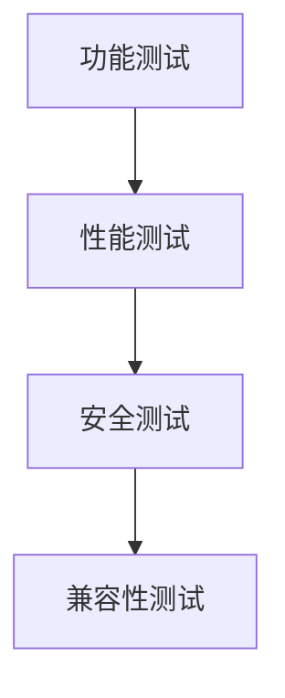

### 系统测试的实施流程

实施系统测试通常包括以下步骤：

1. **需求分析**：明确系统的功能和性能需求，为测试提供依据。

2. **设计测试用例**：根据需求分析结果，设计功能测试、性能测试、安全测试和兼容性测试的测试用例。

3. **构建测试环境**：准备测试所需的环境，包括硬件、软件和网络配置等。

4. **执行系统测试**：使用测试工具（如Selenium、JMeter）执行测试用例，并记录测试结果。

5. **分析测试结果**：根据测试结果，分析系统是否存在缺陷。如果发现缺陷，需要定位问题并进行修复。

6. **回归测试**：在修复缺陷后，执行回归测试以确保修复问题不会引入新的缺陷。

下面是一个系统测试实施流程的Mermaid流程图：

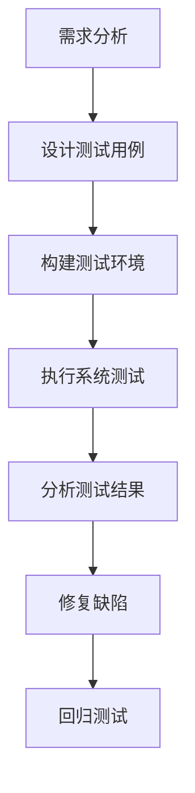

### 系统测试的工具和框架

在实施系统测试时，可以使用多种工具和框架，以下是一些常用的工具和框架：

1. **Selenium**：Selenium是一个开源的Web应用测试框架，它支持多种浏览器和编程语言，可以用于实现功能测试和性能测试。

2. **JMeter**：JMeter是一个开源的性能测试工具，它可以模拟大量用户同时访问系统，从而评估系统的性能表现。

3. **Postman**：Postman是一个API功能测试工具，它可以帮助测试人员验证API的功能和性能。

4. **Appium**：Appium是一个开源的移动应用测试框架，它可以用于实现移动应用的功能测试和性能测试。

### 小结

系统测试是测试金字塔中的最高层次，它通过验证系统的功能、性能、可靠性、安全性和兼容性来确保系统的整体质量。设计有效的系统测试需要考虑功能测试、性能测试、安全测试和兼容性测试等多个方面。实施系统测试通常包括需求分析、设计测试用例、构建测试环境、执行系统测试和分析测试结果等步骤。使用合适的工具和框架可以大大提高系统测试的效率和效果。

## 性能测试的策略和实践

### 核心概念与联系

性能测试是测试金字塔中的关键层次，它旨在评估软件系统的性能，包括响应时间、吞吐量、并发处理能力和资源消耗。性能测试的核心目标是确保系统在正常负载下能够高效稳定地运行，以满足用户需求。

性能测试与系统测试之间有着紧密的联系。系统测试主要关注系统的功能和兼容性，而性能测试则更专注于系统的性能表现。通过性能测试，我们可以识别系统的性能瓶颈，从而进行优化和改进。

下面是一个性能测试和系统测试关系的Mermaid流程图：

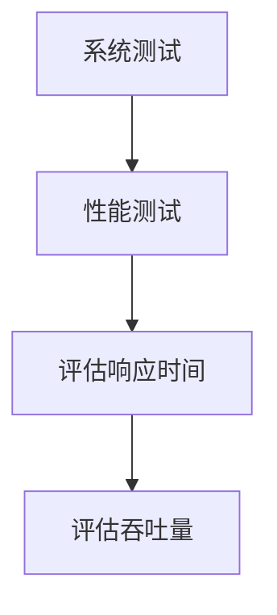

### 性能测试的设计方法

设计性能测试时，需要考虑以下几个方面：

1. **负载场景的确定**：确定性能测试的负载场景，包括正常的业务场景、峰值负载场景和异常场景。负载场景的确定有助于模拟实际用户的行为，从而更准确地评估系统的性能。

2. **性能指标的选择**：选择合适的性能指标，如响应时间、吞吐量、并发处理能力和资源消耗。这些指标可以帮助我们评估系统的性能表现。

3. **测试数据的准备**：准备测试数据，包括用户数据、交易数据和日志数据等。测试数据的质量直接影响性能测试的结果。

4. **测试工具的选择**：选择合适的性能测试工具，如JMeter、LoadRunner等。这些工具可以模拟大量用户的并发访问，从而评估系统的性能。

下面是一个性能测试设计方法的Mermaid流程图：

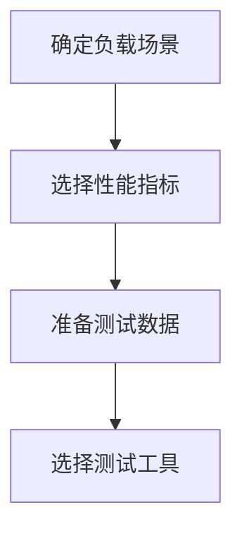

### 性能测试的实施流程

实施性能测试通常包括以下步骤：

1. **性能测试规划**：制定性能测试计划，包括测试目标、测试场景、测试指标和测试工具等。

2. **性能测试执行**：执行性能测试计划，使用性能测试工具模拟用户行为，收集性能数据。

3. **性能分析**：分析性能测试结果，识别系统的性能瓶颈，如响应时间过长、吞吐量不足等。

4. **性能优化**：根据性能分析结果，对系统进行优化，如调整配置、优化代码等。

5. **性能复测**：在优化后，重新执行性能测试，验证性能是否达到预期。

下面是一个性能测试实施流程的Mermaid流程图：

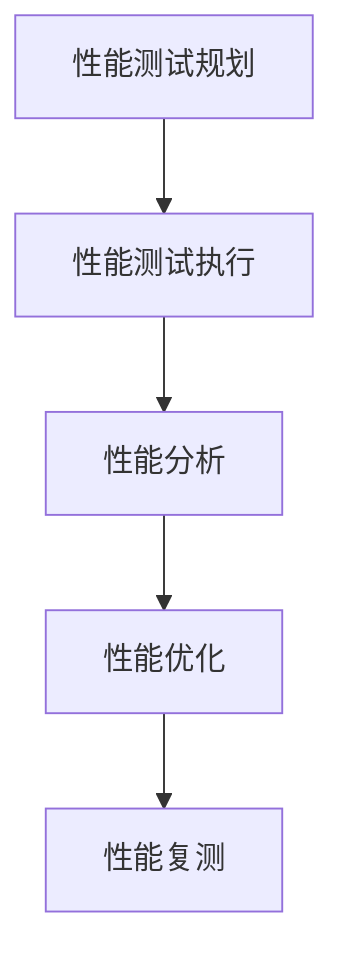

### 性能测试的工具和框架

在实施性能测试时，可以使用多种工具和框架，以下是一些常用的工具和框架：

1. **JMeter**：JMeter是一个开源的性能测试工具，它可以模拟大量用户的并发访问，从而评估系统的性能。

2. **LoadRunner**：LoadRunner是一个商业性能测试工具，它可以模拟实际用户行为，评估系统的性能和稳定性。

3. **AppDynamics**：AppDynamics是一个自动化性能监控工具，它可以帮助识别和解决系统性能问题。

4. **New Relic**：New Relic是一个云性能监控工具，它可以实时监控系统的性能表现。

### 小结

性能测试是确保软件系统能够高效稳定运行的重要环节。设计有效的性能测试需要考虑负载场景、性能指标、测试数据和测试工具等方面。实施性能测试通常包括规划、执行、分析和优化等步骤。使用合适的工具和框架可以大大提高性能测试的效率和效果。

## 自动化测试的策略和实践

### 核心概念与联系

自动化测试是软件测试中的一项关键技术，它通过使用自动化测试工具和脚本，自动执行测试用例，从而提高测试效率和准确性。自动化测试不仅能够节省人力成本，还能提高测试的覆盖率和一致性。

自动化测试与手动测试之间有着紧密的联系。手动测试是由测试人员手动执行测试用例，而自动化测试则是通过脚本和工具自动执行这些测试用例。自动化测试通常在手动测试的基础上进行，它能够帮助测试人员更高效地发现和修复缺陷。

下面是自动化测试和手动测试关系的Mermaid流程图：

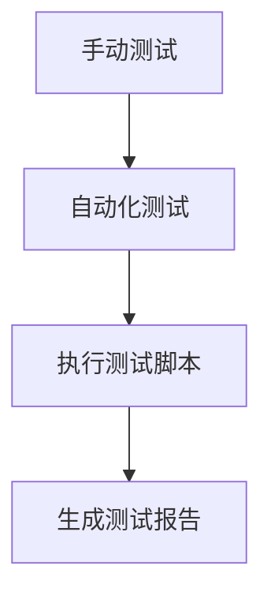

### 自动化测试的设计方法

设计自动化测试时，需要考虑以下几个方面：

1. **测试用例的选择**：选择适合自动化的测试用例。通常，那些频繁执行、复杂性高、执行步骤繁琐的测试用例适合自动化。

2. **测试脚本的编写**：编写测试脚本，通常使用编程语言（如Python、Java）和自动化测试框架（如Selenium、TestNG）。

3. **测试数据的处理**：自动化测试通常需要处理测试数据，包括数据的生成、存储和操作。

4. **测试环境的配置**：配置自动化测试环境，包括安装测试工具、配置数据库和服务器等。

5. **测试执行和监控**：自动化测试工具可以执行测试脚本，并生成详细的测试报告。

下面是自动化测试设计方法的Mermaid流程图：

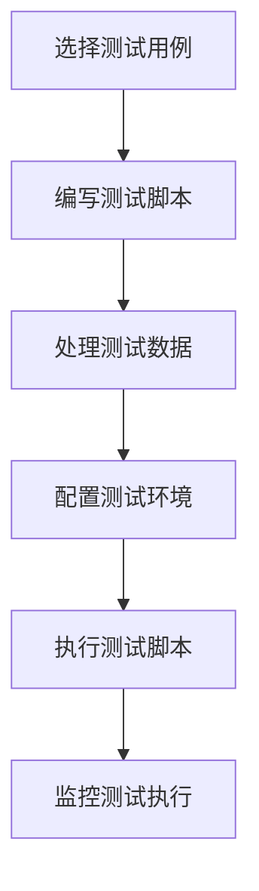

### 自动化测试的实施流程

实施自动化测试通常包括以下步骤：

1. **需求分析和测试设计**：分析软件需求，设计自动化测试用例。

2. **测试脚本的开发**：编写自动化测试脚本，通常使用编程语言和自动化测试框架。

3. **测试环境的搭建**：搭建自动化测试环境，确保测试工具和依赖项安装正确。

4. **测试执行**：使用自动化测试工具执行测试脚本，并记录测试结果。

5. **测试结果分析**：分析测试结果，识别缺陷，并与开发人员沟通。

6. **回归测试**：在软件更新或修复后，执行回归测试以确保新代码没有引入新的缺陷。

下面是自动化测试实施流程的Mermaid流程图：

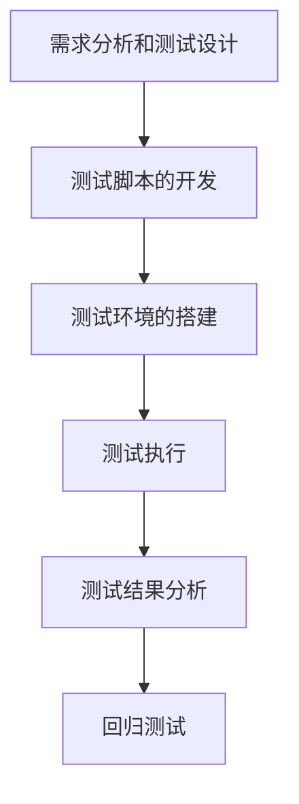

### 自动化测试的工具和框架

在实施自动化测试时，可以使用多种工具和框架，以下是一些常用的工具和框架：

1. **Selenium**：Selenium是一个开源的自动化测试框架，用于Web应用的自动化测试。

2. **TestNG**：TestNG是一个开源的自动化测试框架，用于多种类型的测试，包括单元测试、集成测试和系统测试。

3. **Jenkins**：Jenkins是一个开源的持续集成工具，用于自动化构建、测试和部署。

4. **Appium**：Appium是一个开源的移动应用自动化测试框架，用于Android和iOS应用的自动化测试。

### 小结

自动化测试是提高软件测试效率和准确性的重要手段。设计自动化测试需要考虑测试用例的选择、测试脚本的编写、测试数据的处理和测试环境的配置等方面。实施自动化测试包括测试脚本的开发、测试环境的搭建、测试执行、测试结果分析和回归测试等步骤。使用合适的工具和框架可以大大提高自动化测试的效率和效果。

## 测试管理和组织策略

### 核心概念与联系

测试管理和组织策略是确保软件测试工作高效、有序进行的重要环节。它涵盖了测试计划、测试资源分配、测试流程优化和测试团队协作等方面。有效的测试管理和组织策略能够提高测试的覆盖率和效率，减少缺陷数量，从而提高软件质量。

测试管理与组织策略与其他测试层次密切相关。测试计划是整个测试过程的起点，它为测试活动提供了指导；测试资源的合理分配和优化能够提高测试效率；优化测试流程可以减少冗余和重复工作；而良好的团队协作则是确保测试工作顺利进行的关键。

下面是测试管理和组织策略与其他测试层次关系的Mermaid流程图：

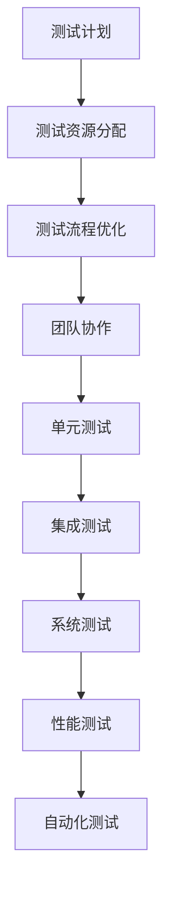

### 测试管理策略

测试管理策略主要包括以下几个方面：

1. **测试计划**：制定详细的测试计划，包括测试目标、测试范围、测试策略、资源需求、时间安排和质量目标。

2. **测试资源管理**：合理分配测试资源，包括人员、设备和工具等。确保测试资源的高效利用，避免资源浪费。

3. **风险管理**：识别和评估测试过程中可能出现的风险，制定相应的应对策略，确保测试工作的顺利进行。

4. **测试流程**：设计合理的测试流程，包括测试阶段划分、测试用例设计、测试执行、测试结果分析和缺陷管理。

5. **质量保证**：建立质量保证机制，包括过程审计、质量控制和质量改进，确保测试工作的质量和效果。

下面是测试管理策略的Mermaid流程图：

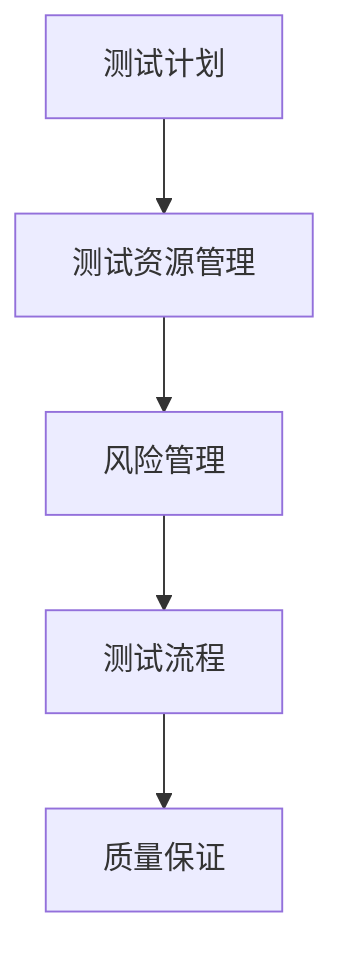

### 测试组织策略

测试组织策略主要包括以下几个方面：

1. **测试团队建设**：组建专业的测试团队，包括测试经理、测试工程师和测试支持人员。明确团队角色和职责，确保团队成员能够高效协作。

2. **团队协作**：建立良好的沟通机制和协作平台，确保团队成员能够及时分享信息和资源，共同推进测试工作。

3. **测试流程优化**：不断优化测试流程，提高测试效率和效果。通过流程再造、自动化测试和工具优化等手段，减少冗余和重复工作。

4. **技能提升**：为测试团队成员提供培训和发展机会，提升其专业技能和综合素质，从而提高测试团队的整体水平。

5. **文化建设**：建立积极向上的团队文化，鼓励团队成员互相支持、共同进步，形成良好的团队氛围。

下面是测试组织策略的Mermaid流程图：

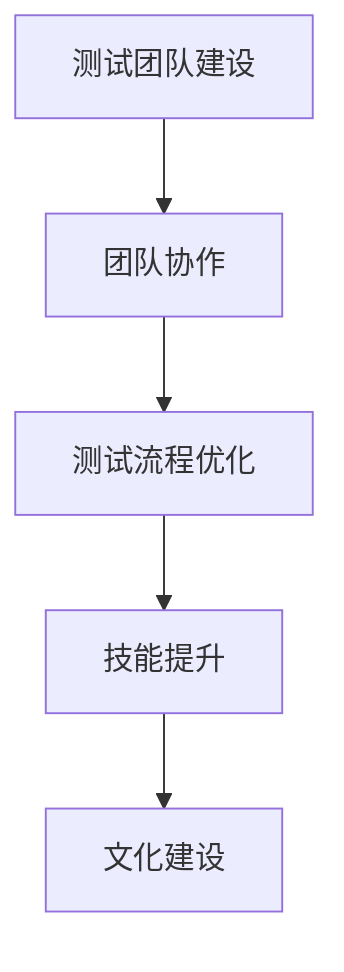

### 测试管理和组织策略的实施

实施测试管理和组织策略需要遵循以下步骤：

1. **需求分析和规划**：根据项目需求，分析测试管理和组织策略的需求，制定详细的实施计划。

2. **资源分配和培训**：根据实施计划，分配测试资源，包括人员、设备和工具等。同时，对测试团队成员进行必要的培训和技能提升。

3. **流程设计和优化**：设计合理的测试流程，并不断优化流程，以提高测试效率和效果。

4. **团队协作和沟通**：建立有效的团队协作和沟通机制，确保团队成员能够高效协作，共同推进测试工作。

5. **监控和评估**：对测试管理和组织策略的实施效果进行监控和评估，根据反馈进行改进和优化。

下面是测试管理和组织策略实施的Mermaid流程图：

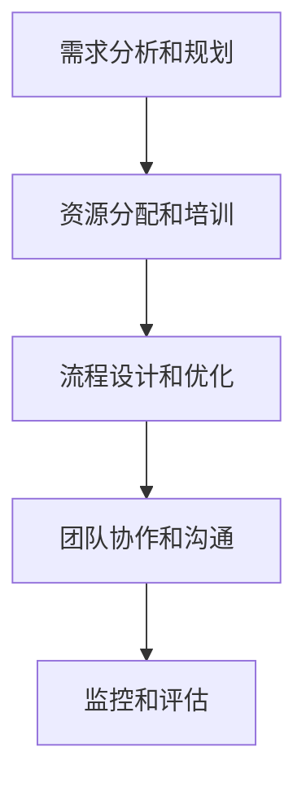

### 小结

测试管理和组织策略是确保软件测试工作高效、有序进行的重要手段。通过制定合理的测试计划、优化测试流程、合理分配测试资源、提升团队协作和技能水平，可以显著提高测试效率和质量。实施测试管理和组织策略需要从需求分析、规划、资源分配、流程设计、团队协作和监控评估等环节入手，确保测试工作能够顺利推进。

## 附录

### 附录A：测试工具和技术概述

在本附录中，我们将对常用的测试工具和技术进行概述，以便读者了解这些工具的基本功能和适用场景。

1. **JUnit**：JUnit是一个流行的Java单元测试框架，它提供了丰富的功能，如测试套件、测试断言和测试结果报告。

2. **TestNG**：TestNG是一个强大的测试框架，它支持多种编程语言，并提供丰富的功能，如数据驱动测试、参数化测试和依赖测试。

3. **Selenium**：Selenium是一个开源的自动化测试框架，用于Web应用的自动化测试，支持多种浏览器和编程语言。

4. **JMeter**：JMeter是一个开源的性能测试工具，可以模拟大量用户的并发访问，用于评估系统的性能表现。

5. **Appium**：Appium是一个开源的移动应用自动化测试框架，用于Android和iOS应用的自动化测试。

6. **Postman**：Postman是一个API功能测试工具，用于验证API的功能和性能。

7. **LoadRunner**：LoadRunner是一个商业性能测试工具，用于模拟实际用户行为，评估系统的性能和稳定性。

8. **AppDynamics**：AppDynamics是一个自动化性能监控工具，用于识别和解决系统性能问题。

9. **New Relic**：New Relic是一个云性能监控工具，用于实时监控系统的性能表现。

### 附录B：测试用例设计指南

测试用例设计是软件测试的重要环节，以下是一些常用的测试用例设计方法：

1. **边界值分析**：通过分析输入数据的边界值，设计测试用例，以检查系统在边界条件下的行为。

2. **等价类划分**：将输入数据划分为等价类，每个等价类代表一组具有相似特征的输入数据，设计测试用例覆盖这些等价类。

3. **因果图**：通过构建因果图，分析输入变量和输出结果之间的因果关系，设计测试用例。

4. **场景法**：基于实际业务场景，设计测试用例，以验证系统在不同场景下的行为。

5. **异常输入法**：设计测试用例，验证系统在异常输入条件下的行为。

### 附录C：测试数据管理策略

测试数据管理是确保测试工作顺利进行的重要环节，以下是一些常用的测试数据管理策略：

1. **数据备份**：定期备份测试数据，以防数据丢失。

2. **数据一致性**：确保测试数据的一致性，避免数据冲突和重复。

3. **数据隔离**：为不同的测试环境提供独立的测试数据，避免测试数据之间的干扰。

4. **数据维护**：定期更新和维护测试数据，确保其准确性和完整性。

5. **数据共享**：建立数据共享机制，便于测试团队成员之间共享测试数据。

### 附录D：测试流程优化案例分析

以下是一个测试流程优化的案例分析：

#### 项目背景

某公司开发了一款大型企业级应用，测试流程较为繁琐，测试效率低下，导致项目进度延误。

#### 优化前测试流程

1. **需求分析**：测试团队分析需求文档，编写测试计划和测试用例。
2. **测试环境搭建**：测试团队搭建测试环境，包括硬件、软件和网络配置。
3. **测试用例执行**：测试团队手动执行测试用例，记录测试结果。
4. **缺陷管理**：测试团队将发现的缺陷报告给开发团队，进行缺陷修复。
5. **回归测试**：在缺陷修复后，测试团队执行回归测试，确保修复问题不会引入新的缺陷。

#### 优化措施

1. **引入自动化测试**：引入Selenium进行Web应用的自动化测试，减少手动测试工作量。
2. **测试数据管理**：使用数据库管理测试数据，确保数据的一致性和可维护性。
3. **持续集成**：引入Jenkins进行持续集成，自动化构建和测试，提高测试效率。
4. **流程优化**：简化测试流程，缩短测试周期，提高测试效率。

#### 优化后测试流程

1. **需求分析**：测试团队分析需求文档，编写测试计划和测试用例。
2. **测试脚本开发**：测试团队开发自动化测试脚本，并进行回归测试。
3. **测试执行**：使用Jenkins自动化执行测试脚本，记录测试结果。
4. **缺陷管理**：测试团队将发现的缺陷报告给开发团队，进行缺陷修复。
5. **持续集成和回归测试**：使用Jenkins进行持续集成和回归测试，确保项目稳定性和质量。

#### 项目小结

通过测试流程优化，项目测试效率显著提高，测试周期缩短，缺陷数量减少，项目进度得到保障。自动化测试和持续集成的引入，提高了测试的覆盖率和一致性，为项目的成功交付奠定了基础。

### 最佳实践 tips

- **定期回顾和优化测试流程**：定期回顾和优化测试流程，确保测试工作高效、有序进行。
- **合理分配测试资源**：根据项目需求和测试阶段，合理分配测试资源，避免资源浪费。
- **重视测试数据的维护**：确保测试数据的一致性、准确性和完整性，为测试工作提供可靠依据。
- **培养专业的测试团队**：培养专业的测试团队，提高测试团队的整体素质和协作能力。

### 小结

测试工具和技术的选择、测试用例的设计、测试数据的维护以及测试流程的优化都是确保软件测试工作高效、有序进行的关键环节。通过案例分析和最佳实践，读者可以更好地理解和应用测试管理策略，提高测试效率和质量。

## 作者信息

**作者：AI天才研究院/AI Genius Institute & 禅与计算机程序设计艺术 /Zen And The Art of Computer Programming**

