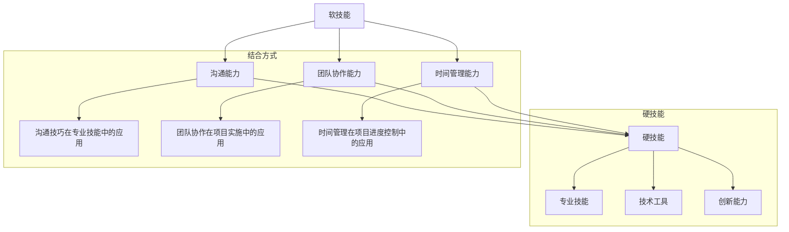

                 

## 引言

### 软技能与硬实力的碰撞：时代的需求

在信息技术迅猛发展的时代，软技能和硬实力成为了职场竞争的关键要素。软技能，如沟通能力、团队协作和情绪管理，是建立在人类情感和社会互动基础上，能够帮助个体在复杂多变的环境中灵活应对的能力。而硬实力，则是指专业技能、技术知识和实际操作能力，是完成特定任务的基础。二者并不是相互独立的，而是相辅相成的。

**软技能的重要性**：

- **提升工作效率**：良好的沟通能力可以减少误解，提高团队协作效率。
- **增强团队凝聚力**：团队合作能力有助于构建和谐的工作氛围，提升团队的整体战斗力。
- **解决冲突**：有效的情绪管理能够减少职场冲突，提高工作效率。

**硬实力的价值**：

- **专业技能**：硬实力是完成复杂任务的前提，是职场竞争力的核心。
- **创新能力**：专业技能的积累有助于在项目中创新，找到解决问题的最佳方案。
- **执行能力**：硬实力确保项目能够按时按质完成。

本文将深入探讨软技能与硬实力的关系，分析如何将软技能转化为硬实力，并通过具体案例和实践技巧，帮助读者全面提升个人职业竞争力。

### 软技能的重要性

#### 软技能的定义与内涵

软技能，又称“软实力”或“人际技能”，是指个体在情感和社会交往中所表现出的能力，主要包括沟通能力、团队协作能力、情绪管理能力等。这些技能不仅关乎个体的心理健康，也直接影响其在职场中的表现。

1. **沟通能力**：有效的沟通能力可以帮助个体清晰、准确地表达自己的想法，理解他人的观点，从而减少误解和冲突。
2. **团队协作能力**：团队合作是现代职场中不可或缺的一部分。具备良好的团队协作能力，有助于构建和谐的工作氛围，提升团队的整体效能。
3. **情绪管理能力**：情绪管理能力可以帮助个体在面对压力和挑战时保持冷静，做出合理的决策，从而提高工作效率。

#### 软技能在企业中的应用

软技能在企业中的应用无处不在，是企业成功的关键因素之一。

1. **项目管理**：项目经理需要与团队成员、利益相关者进行有效沟通，以确保项目顺利进行。良好的沟通能力能够减少误解，提高团队协作效率。
2. **团队协作**：现代工作往往需要跨部门、跨领域的合作。具备团队协作能力的员工能够更好地融入团队，提高团队的整体效能。
3. **客户关系管理**：与客户保持良好的沟通，理解客户需求，解决客户问题，是维护客户关系的关键。情绪管理能力有助于在处理客户投诉时保持冷静，提高客户满意度。

#### 软技能对个人职业发展的作用

软技能对个人职业发展的影响深远。

1. **职业晋升**：在竞争激烈的职场中，软技能是区分个人能力和素质的重要指标。具备良好软技能的员工更容易获得晋升机会。
2. **职场竞争力**：软技能的提升可以增强个人的职场竞争力，使其在职场中更具优势。
3. **心理健康**：良好的软技能可以帮助个体更好地应对职场压力，提高心理健康水平。

综上所述，软技能不仅是职场成功的必备条件，也是个体心理健康的重要保障。因此，提升软技能，将其转化为硬实力，是每个职场人士都应该关注的重要课题。

### 软技能的核心要素

#### 沟通能力

沟通能力是软技能的核心之一，它直接影响着个人和团队的工作效率和关系和谐。

**1. 沟通原理与模型**

沟通是一个复杂的过程，涉及到信息源、编码、解码、通道和反馈等多个环节。我们可以用以下模型来理解沟通过程：

$$
\text{沟通模型} = (\text{信息源}, \text{编码}, \text{通道}, \text{解码}, \text{反馈})
$$

- **信息源**：信息发送者，即沟通的起点。
- **编码**：信息源将信息转化为语言、文字或符号，以便传递。
- **通道**：信息传递的媒介，如口头、书面、电子邮件等。
- **解码**：接收者对接收到的信息进行理解，并将其转化为有意义的内容。
- **反馈**：接收者对信息理解后，通过言行或反馈机制表达自己的观点或反应。

**2. 有效沟通技巧**

有效沟通需要掌握一定的技巧和策略。以下是一些实用的沟通技巧：

- **倾听**：倾听是沟通的关键，通过认真倾听，可以更好地理解对方的需求和观点。
- **清晰表达**：表达时力求清晰、简洁，避免使用模糊或模棱两可的语言。
- **反馈机制**：及时给予反馈，确保双方对沟通内容的理解一致。
- **非语言沟通**：注意身体语言、面部表情和语调等非语言沟通元素，这些因素可以补充和强化语言沟通的效果。

**3. 沟通障碍与解决方法**

沟通障碍是常见的问题，主要包括语言障碍、文化差异、误解和噪声等。以下是一些解决方法：

- **语言障碍**：通过学习对方的语言或使用通用语言，如英语，来消除语言障碍。
- **文化差异**：了解和尊重对方的文化习惯，避免因为文化差异导致的误解和冲突。
- **误解**：通过澄清和确认，确保双方对信息的理解一致。
- **噪声**：选择合适的沟通环境和媒介，减少噪声干扰。

通过掌握有效的沟通技巧，我们可以更好地应对职场中的沟通挑战，提升个人和团队的工作效率。

#### 团队协作能力

团队协作能力是软技能中的另一个关键要素，它关乎个人在团队中的表现和团队的整体效能。

**1. 团队合作原则**

团队合作应遵循以下原则：

- **共同目标**：团队所有成员应明确共同的目标，并为此努力。
- **信任与尊重**：团队成员之间应建立信任关系，相互尊重，共同发展。
- **分工合作**：根据团队成员的专长和能力进行分工，确保任务的高效完成。
- **透明沟通**：保持沟通渠道的开放和透明，确保信息的及时传递。

**2. 团队协作技巧**

有效的团队协作需要掌握以下技巧：

- **有效分工**：明确每个成员的职责和任务，确保任务分配合理。
- **及时沟通**：建立定期的沟通机制，确保团队成员之间的信息共享。
- **冲突管理**：及时识别和解决团队中的冲突，避免影响工作进度。
- **积极反馈**：对团队成员的工作给予积极反馈，鼓励和激励团队成员。

**3. 团队冲突与解决**

团队冲突是不可避免的，但关键在于如何有效解决。以下是一些解决冲突的方法：

- **理性分析**：通过冷静分析，找出冲突的根本原因。
- **对话沟通**：通过对话沟通，寻求双方的共识和解决方案。
- **妥协与协商**：在冲突无法彻底解决时，通过妥协和协商达成双方都能接受的方案。
- **第三方调解**：在双方无法达成一致时，寻求第三方的调解和帮助。

通过掌握团队协作技巧和有效解决冲突的方法，我们可以构建一个高效、和谐的团队，提高整体的工作效能。

#### 时间管理能力

时间管理能力是职场中不可或缺的软技能，它关乎个人的工作效率和生活质量。

**1. 时间管理原理**

时间管理的基本原理包括：

- **任务分解**：将大任务分解为小任务，以便更好地管理和控制。
- **优先级排序**：根据任务的紧急程度和重要性进行优先级排序，确保重要且紧急的任务首先完成。
- **时间预算**：为每个任务分配适当的时间，确保任务的按时完成。
- **持续优化**：不断反思和优化时间管理策略，提高时间利用效率。

**2. 时间管理技巧**

以下是一些实用的时间管理技巧：

- **时间日志**：记录每天的时间使用情况，以便分析并优化时间分配。
- **番茄工作法**：将工作时间分为25分钟的工作周期，每个周期后休息5分钟，提高专注力。
- **避免拖延**：设定明确的任务截止时间，避免拖延，提高工作效率。
- **减少干扰**：在工作时避免不必要的干扰，如关闭手机通知、远离社交媒体等。

**3. 提高工作效率的方法**

为了提高工作效率，我们可以采取以下方法：

- **自动化工具**：利用自动化工具，如任务管理软件和自动化脚本，减少重复性工作。
- **团队协作**：通过有效的团队协作，分担工作量，提高整体工作效率。
- **定期反思**：定期反思时间管理策略和工作效率，不断优化和调整。

通过掌握时间管理原理和技巧，我们可以更高效地利用时间，提高工作效率，提升个人和团队的价值。

### 硬实力炼成技巧

#### 技能提升方法

**1. 学习策略**

学习是提升硬实力的关键，有效的学习策略能够大幅提高学习效率和成果。

- **目标设定**：明确学习目标，确保学习方向正确。
- **分阶段学习**：将学习内容分解为小阶段，逐步攻克。
- **深度学习**：通过反复练习和深入思考，掌握核心概念和原理。
- **实践结合**：将理论知识与实践相结合，提高实际操作能力。

**2. 学习技巧与实践**

以下是一些实用的学习技巧：

- **主动学习**：主动寻找问题和挑战，通过解决问题来加深理解。
- **互动学习**：参与讨论和互动，与他人分享和交流学习心得。
- **多样化学习**：通过阅读书籍、观看视频、参加线上课程等多种方式学习。
- **反思总结**：定期总结学习成果和不足，及时调整学习策略。

**3. 学习资源的获取与利用**

获取和利用学习资源是学习过程中至关重要的一环。

- **网络资源**：利用在线课程、论坛、博客等网络资源，拓宽学习渠道。
- **书籍资源**：选择高质量的书籍，系统地学习专业知识。
- **导师资源**：寻找导师或专家进行指导，提高学习效果。
- **实践资源**：通过实际项目或实验，将理论知识应用于实践。

通过掌握有效的学习策略、技巧和资源利用方法，我们可以更快地提升硬实力，为个人职业发展奠定坚实基础。

#### 实践操作

**1. 实践操作的重要性**

实践操作是将理论知识转化为实际能力的重要环节。通过实践，我们可以验证和巩固所学知识，提高实际操作能力。

**2. 实践操作技巧**

以下是一些实用的实践操作技巧：

- **实验环境搭建**：搭建适合实验的环境，确保实验的顺利进行。
- **逐步验证**：通过逐步验证，确保每个环节的正确性和有效性。
- **问题排查**：在实践过程中，遇到问题时要及时排查和解决。
- **反思总结**：实践结束后，进行反思总结，找出不足和改进之处。

**3. 实践操作案例分享**

**案例一：软件开发**

- **背景**：某公司需要开发一款即时通讯软件。
- **过程**：团队通过需求分析，制定开发计划，逐步完成功能模块的开发和测试。
- **成果**：成功开发出符合需求的即时通讯软件，并上线运营。

**案例二：数据分析**

- **背景**：某公司需要分析大量销售数据，以指导营销策略。
- **过程**：团队使用数据分析工具，进行数据清洗、分析和可视化。
- **成果**：生成详细的数据分析报告，为公司决策提供了有力支持。

通过实践操作案例的分享，我们可以看到实践操作在提升硬实力中的重要作用。实践不仅能够提高我们的操作技能，还能够培养我们的问题解决能力和创新思维。

#### 反思总结

**1. 反思总结的目的**

反思总结是学习过程中不可或缺的一环，其目的是通过回顾和总结，发现学习中的优点和不足，从而不断优化学习方法和策略，提高学习效果。

**2. 反思总结的方法**

以下是一些实用的反思总结方法：

- **定期回顾**：定期回顾所学内容，总结学习成果和不足。
- **自我评估**：通过自我评估，识别自己在学习中的优点和不足。
- **请教他人**：向导师或同学请教，获取他们的意见和建议。
- **记录反思**：将反思过程和结果记录下来，便于后续参考和调整。

**3. 反思总结的成果应用**

反思总结的成果应用主要包括：

- **优化学习方法**：根据反思结果，调整和优化学习方法，提高学习效率。
- **改进工作流程**：将反思总结应用于实际工作中，改进工作流程和操作方式。
- **持续学习**：通过反思总结，发现新的学习需求和方向，保持持续学习。

通过反思总结，我们可以不断改进自己，提升硬实力，为个人职业发展打下坚实基础。

#### 专业技能的选择与培养

**1. 专业技能的选择**

选择适合的专业技能是个人职业发展的关键。以下是一些选择专业技能的考虑因素：

- **个人兴趣**：选择自己感兴趣的专业技能，能够增加学习的动力和热情。
- **市场需求**：考虑当前和未来的市场需求，选择有发展前景的专业技能。
- **自身优势**：根据自己的优势和特长，选择能够发挥自身优势的专业技能。
- **职业规划**：结合自己的职业规划，选择与未来职业发展目标相匹配的专业技能。

**2. 专业技能的提升策略**

提升专业技能的方法多种多样，以下是一些有效的策略：

- **系统化学习**：通过参加系统化的培训课程，全面掌握专业技能。
- **实践操作**：通过实际操作，将理论知识转化为实际能力。
- **项目经验**：参与实际项目，积累项目经验和实战能力。
- **交流与分享**：参加行业交流会，与他人分享经验和学习心得。

**3. 持续学习与技能更新**

在信息技术快速发展的时代，持续学习与技能更新至关重要。以下是一些建议：

- **定期培训**：定期参加专业培训，更新知识体系。
- **在线学习**：利用在线课程和资源，灵活安排学习时间。
- **技术社区**：参与技术社区，关注行业动态，与同行交流。
- **实践应用**：将新知识和技术应用于实际工作中，不断提高实战能力。

通过科学选择和持续培养专业技能，我们可以不断提升个人职业竞争力，实现职业发展目标。

#### 心理素质提升

**1. 心理素质的重要性**

心理素质是指个体在面对压力和挑战时的心理承受能力和应对能力。良好的心理素质对于职业发展具有重要意义。

- **提高工作效率**：心理素质良好的人能够更好地应对工作压力，保持高效的工作状态。
- **增强决策能力**：良好的心理素质有助于个体在复杂环境中做出合理的决策。
- **提升团队协作**：心理素质良好的个体能够更好地融入团队，提高团队协作效率。

**2. 压力管理技巧**

压力管理是提升心理素质的关键。以下是一些实用的压力管理技巧：

- **合理规划时间**：合理安排工作和休息时间，避免过度劳累。
- **积极应对挑战**：面对挑战时，保持积极的心态，相信自己能够克服困难。
- **寻求支持**：在压力过大时，寻求家人、朋友或专业人士的支持和帮助。
- **放松身心**：通过运动、冥想等方式放松身心，缓解压力。

**3. 情绪管理技巧**

情绪管理是保持心理健康的重要方面。以下是一些情绪管理技巧：

- **自我觉察**：了解自己的情绪变化，及时识别和处理负面情绪。
- **积极表达**：通过有效沟通表达自己的情绪和需求，避免压抑和爆发。
- **理性分析**：在面对情绪问题时，通过理性分析找到解决问题的方法。
- **情绪调节**：通过自我暗示、转移注意力等方法调节情绪，保持心态平衡。

通过提升心理素质，掌握压力管理和情绪管理技巧，我们可以更好地应对职场挑战，实现职业目标。

### 心理素质提升案例：压力管理与情绪调节

**案例背景**：

小李是一名软件开发工程师，工作繁忙且任务繁重。长期的高强度工作让他感到压力巨大，有时甚至感到无法承受。为了帮助小李提升心理素质，我们应用了以下压力管理和情绪调节技巧。

**实施过程**：

1. **时间管理**：我们帮助小李制定了详细的工作计划和日程安排，合理分配工作和休息时间，确保他能够有足够的休息和放松时间。

2. **积极应对挑战**：鼓励小李面对工作中的困难时，保持积极的心态，相信自己能够克服困难。我们通过讨论和分享成功案例，增强他的自信心。

3. **寻求支持**：在压力过大时，我们建议小李向同事、家人寻求支持和帮助，共同分担工作压力。

4. **放松身心**：我们推荐小李进行定期锻炼，如跑步、瑜伽等，帮助他放松身心，缓解压力。

5. **情绪调节**：通过自我觉察和积极表达，小李学会了识别自己的情绪并合理表达，避免情绪积累和爆发。我们还教给他一些情绪调节的方法，如深呼吸、冥想等。

**成果与启示**：

通过上述压力管理和情绪调节技巧，小李的心理素质得到了显著提升。他能够更好地应对工作压力，工作效率有所提高。同时，他的情绪状态更加稳定，工作氛围也更加和谐。这个案例表明，通过科学的方法，我们可以有效地提升个人的心理素质，从而在职场中更好地应对各种挑战。

### 心理素质提升总结与最佳实践

#### 总结

提升心理素质对于职业发展具有重要意义。通过合理的压力管理和情绪调节，我们可以更好地应对职场挑战，提高工作效率，实现职业目标。

#### 最佳实践

以下是一些最佳实践，以帮助读者提升心理素质：

1. **定期锻炼**：通过定期锻炼，如跑步、瑜伽等，有助于放松身心，缓解压力。

2. **时间管理**：合理安排工作和休息时间，确保有足够的休息和放松时间。

3. **积极沟通**：与同事、家人保持良好沟通，共同分担压力，寻求支持。

4. **自我觉察**：了解自己的情绪变化，及时识别和处理负面情绪。

5. **理性分析**：在面对情绪问题时，通过理性分析找到解决问题的方法。

6. **情绪调节**：学会情绪调节的方法，如深呼吸、冥想等，保持心态平衡。

通过以上实践，我们可以提升心理素质，更好地应对职场挑战，实现个人职业发展。

### 软硬实力结合的工作模式

#### 软硬实力结合的必要性

在现代社会，软硬实力相结合已经成为职场成功的关键。软实力包括沟通能力、团队合作和时间管理等，而硬实力则指专业技能、技术知识和实际操作能力。两者相辅相成，共同构成了个体在职场中的核心竞争力。

**1. 软硬实力结合的背景**

随着信息技术的迅猛发展，职场环境变得越来越复杂和多样化。传统的单一技能已经无法满足现代职场的需求。企业不仅需要员工具备专业的技术能力，还要求他们具备良好的沟通、协作和解决问题的能力。这种变化促使软硬实力相结合成为必然趋势。

**2. 软硬实力结合的优势**

- **提高工作效率**：软实力可以帮助员工更好地理解项目需求和团队目标，从而提高工作效率。
- **增强团队凝聚力**：软实力如沟通能力和团队合作能力可以增强团队凝聚力，提高团队整体效能。
- **解决复杂问题**：软硬结合能够帮助员工更好地应对复杂问题，找到创新的解决方案。
- **适应快速变化**：软硬实力相结合使员工能够更快速地适应职场变化，提高灵活性。

**3. 软硬实力结合的挑战**

- **技能平衡**：在提升软实力的同时，如何保持和提升硬实力是一个挑战。
- **时间管理**：职场人士需要在软硬实力提升之间找到平衡，合理分配时间。
- **持续学习**：软硬实力都需要不断更新和提升，这对职场人士的学习能力提出了更高要求。

#### 软硬实力结合的应用场景

**1. 项目管理**

在项目管理中，软硬实力结合尤为重要。项目经理需要具备良好的沟通能力和团队合作精神，以确保项目顺利进行。同时，他们还需要具备项目管理技能和知识，如进度管理、风险管理等。

**2. 日常办公**

在日常办公中，软硬实力结合同样重要。员工需要具备良好的沟通能力，以确保信息传达准确无误。同时，他们还需要掌握各种办公软件和工具，提高工作效率。

**3. 创新与研发**

在创新与研发领域，软硬实力结合能够激发更多的创意和创新。研发人员需要具备扎实的专业技能和知识，同时还需要具备团队合作精神和沟通能力，以便更好地与团队成员协作，共同推进项目。

### 软硬实力结合的必要性、优势与挑战

在现代社会，软硬实力相结合已经成为职场成功的关键。软实力包括沟通能力、团队合作和时间管理等，而硬实力则指专业技能、技术知识和实际操作能力。两者相辅相成，共同构成了个体在职场中的核心竞争力。

#### 1. 软硬实力结合的必要性

随着信息技术的迅猛发展，职场环境变得越来越复杂和多样化。传统的单一技能已经无法满足现代职场的需求。企业不仅需要员工具备专业的技术能力，还要求他们具备良好的沟通、协作和解决问题的能力。这种变化促使软硬实力相结合成为必然趋势。

在项目管理中，软硬实力结合尤为重要。项目经理需要具备良好的沟通能力和团队合作精神，以确保项目顺利进行。同时，他们还需要具备项目管理技能和知识，如进度管理、风险管理等。

在日常办公中，软硬实力结合同样重要。员工需要具备良好的沟通能力，以确保信息传达准确无误。同时，他们还需要掌握各种办公软件和工具，提高工作效率。

在创新与研发领域，软硬实力结合能够激发更多的创意和创新。研发人员需要具备扎实的专业技能和知识，同时还需要具备团队合作精神和沟通能力，以便更好地与团队成员协作，共同推进项目。

#### 2. 软硬实力结合的优势

**提高工作效率**：软实力可以帮助员工更好地理解项目需求和团队目标，从而提高工作效率。例如，良好的沟通能力可以减少误解和冲突，确保项目顺利进行。

**增强团队凝聚力**：软实力如沟通能力和团队合作能力可以增强团队凝聚力，提高团队整体效能。团队成员之间建立良好的关系，能够更好地协同工作，共同实现目标。

**解决复杂问题**：软硬结合能够帮助员工更好地应对复杂问题，找到创新的解决方案。软实力如分析能力和创造力，可以帮助员工从不同角度思考问题，提出更有效的解决方案。

**适应快速变化**：软硬实力相结合使员工能够更快速地适应职场变化，提高灵活性。在快速变化的环境中，软实力如学习能力、适应能力，可以帮助员工及时调整自己的策略和方向。

#### 3. 软硬实力结合的挑战

**技能平衡**：在提升软实力的同时，如何保持和提升硬实力是一个挑战。职场人士需要在两者之间找到平衡，确保专业技能的不断更新和提升。

**时间管理**：职场人士需要在软硬实力提升之间找到平衡，合理分配时间。如何在有限的时间内高效地提升软硬实力，是职场人士需要面对的挑战。

**持续学习**：软硬实力都需要不断更新和提升，这对职场人士的学习能力提出了更高要求。职场人士需要具备持续学习的能力，不断掌握新的知识和技能。

### 软硬实力结合的必要性、优势与挑战

在现代社会，软硬实力相结合已经成为职场成功的关键。软实力包括沟通能力、团队合作和时间管理等，而硬实力则指专业技能、技术知识和实际操作能力。两者相辅相成，共同构成了个体在职场中的核心竞争力。

#### 必要性

随着信息技术的迅猛发展，职场环境变得越来越复杂和多样化。传统的单一技能已经无法满足现代职场的需求。企业不仅需要员工具备专业的技术能力，还要求他们具备良好的沟通、协作和解决问题的能力。这种变化促使软硬实力相结合成为必然趋势。

在项目管理中，软硬实力结合尤为重要。项目经理需要具备良好的沟通能力和团队合作精神，以确保项目顺利进行。同时，他们还需要具备项目管理技能和知识，如进度管理、风险管理等。

在日常办公中，软硬实力结合同样重要。员工需要具备良好的沟通能力，以确保信息传达准确无误。同时，他们还需要掌握各种办公软件和工具，提高工作效率。

在创新与研发领域，软硬实力结合能够激发更多的创意和创新。研发人员需要具备扎实的专业技能和知识，同时还需要具备团队合作精神和沟通能力，以便更好地与团队成员协作，共同推进项目。

#### 优势

**提高工作效率**：软实力可以帮助员工更好地理解项目需求和团队目标，从而提高工作效率。例如，良好的沟通能力可以减少误解和冲突，确保项目顺利进行。

**增强团队凝聚力**：软实力如沟通能力和团队合作能力可以增强团队凝聚力，提高团队整体效能。团队成员之间建立良好的关系，能够更好地协同工作，共同实现目标。

**解决复杂问题**：软硬结合能够帮助员工更好地应对复杂问题，找到创新的解决方案。软实力如分析能力和创造力，可以帮助员工从不同角度思考问题，提出更有效的解决方案。

**适应快速变化**：软硬实力相结合使员工能够更快速地适应职场变化，提高灵活性。在快速变化的环境中，软实力如学习能力、适应能力，可以帮助员工及时调整自己的策略和方向。

#### 挑战

**技能平衡**：在提升软实力的同时，如何保持和提升硬实力是一个挑战。职场人士需要在两者之间找到平衡，确保专业技能的不断更新和提升。

**时间管理**：职场人士需要在软硬实力提升之间找到平衡，合理分配时间。如何在有限的时间内高效地提升软硬实力，是职场人士需要面对的挑战。

**持续学习**：软硬实力都需要不断更新和提升，这对职场人士的学习能力提出了更高要求。职场人士需要具备持续学习的能力，不断掌握新的知识和技能。

### 软硬实力结合的应用场景

#### 项目管理中的应用

在项目管理中，软硬实力的结合能够显著提高项目的成功率。以下是几个关键的应用场景：

1. **需求分析**：项目经理需要与客户和团队成员进行有效沟通，理解并分析项目需求。这需要软实力中的沟通能力和团队协作能力。通过多次会议和讨论，确保需求准确无误。

2. **进度管理**：项目经理需要制定合理的项目进度计划，并监督执行。这需要硬实力中的项目管理知识和技能，如Gantt图、里程碑管理等。同时，软实力中的时间管理能力可以帮助项目经理合理分配时间，确保项目按时完成。

3. **风险管理**：项目经理需要识别潜在风险，并制定应对策略。这需要硬实力中的风险分析技能和软实力中的沟通能力，以便与团队成员分享和讨论风险。

4. **团队协作**：项目经理需要确保团队成员之间有效协作，共享资源，解决冲突。这需要软实力中的团队合作能力和硬实力中的协作工具（如Scrum、看板等）的结合。

#### 日常办公中的应用

在日常办公中，软硬实力的结合同样至关重要：

1. **沟通与协作**：员工需要通过邮件、会议、即时通讯工具等与同事和上级进行有效沟通。这需要软实力中的沟通能力和硬实力中的沟通工具的熟练使用。

2. **任务管理**：员工需要合理安排工作任务，确保高效完成。这需要软实力中的时间管理能力和硬实力中的任务管理工具（如Trello、Asana等）的结合。

3. **文档管理**：员工需要有效地创建、共享和跟踪文档。这需要软实力中的文档管理技能和硬实力中的文档管理工具（如Google Docs、Microsoft Office等）的结合。

4. **信息处理**：员工需要快速准确地处理大量信息，进行数据分析和报告编写。这需要软实力中的信息处理能力和硬实力中的数据分析工具（如Excel、Python等）的结合。

#### 创新与研发中的应用

在创新与研发领域，软硬实力的结合能够激发更多的创意和创新能力：

1. **需求分析**：研发人员需要与客户和产品经理密切合作，理解产品需求和市场趋势。这需要软实力中的沟通能力和硬实力中的市场分析技能。

2. **技术选型**：研发团队需要在多种技术方案中进行选择，以实现最佳的性能和成本效益。这需要软实力中的决策能力和硬实力中的技术评估技能。

3. **项目实施**：研发人员需要将设计转化为实际代码，并进行测试和调试。这需要软实力中的团队协作能力和硬实力中的编程技能。

4. **创新思维**：在研发过程中，创新思维至关重要。软实力中的创造力、批判性思维和硬实力中的技术知识和工具的结合，能够激发更多的创新解决方案。

通过在项目管理、日常办公和创新研发中的具体应用，软硬实力的结合不仅提高了工作效率，还增强了团队的协作和创新能力，为企业和个人带来了更大的价值。

### 软硬实力结合的实践案例

为了更好地展示软硬实力结合的实际应用，以下我们将介绍两个实践案例，分别是软件开发中的软硬实力结合案例和市场营销中的软硬实力结合案例。

#### 软件开发中的软硬实力结合案例

**案例背景**：

某科技公司需要开发一款面向企业客户的使用数据分析工具，该工具需要能够处理大量数据，并提供直观的可视化分析结果。

**软实力应用**：

1. **需求沟通**：项目经理与产品经理、客户代表进行了多次沟通，了解客户的具体需求，包括数据分析的深度和广度，以及用户界面设计的需求。

2. **团队协作**：项目团队成员之间进行了频繁的讨论和交流，确保每个人都对项目目标和预期结果有清晰的理解。

3. **项目管理**：项目经理使用敏捷开发方法，通过迭代和增量开发，确保项目进度和质量的控制。

**硬实力应用**：

1. **数据技术**：研发团队使用了大数据处理框架（如Apache Hadoop或Apache Spark）来高效处理和分析大量数据。

2. **可视化技术**：开发团队利用D3.js和Tableau等可视化工具，将分析结果以图表和仪表板的形式呈现给用户。

**实施过程**：

1. **需求分析**：通过多轮会议和调研，明确产品功能和技术实现的需求。

2. **架构设计**：基于需求分析结果，设计系统的整体架构，包括数据存储、数据处理和可视化模块。

3. **开发与测试**：按照敏捷开发流程，逐步开发各个模块，并进行单元测试和集成测试，确保系统稳定可靠。

4. **用户反馈**：在产品初步完成时，邀请客户试用，收集反馈，并进行相应的调整和优化。

**成果与启示**：

通过软硬实力的结合，该数据分析工具不仅满足了客户的需求，还获得了良好的市场反响。项目经理的沟通能力和团队协作能力，确保了项目的顺利进行；研发团队的技术实力和创新能力，使产品具备了市场竞争力。

#### 市场营销中的软硬实力结合案例

**案例背景**：

某公司是一家专注于健康食品的公司，计划推出一款新型膳食纤维补充剂，并希望通过市场营销策略，迅速打开市场。

**软实力应用**：

1. **市场调研**：市场部门通过问卷调查、访谈等方式，收集潜在客户对膳食纤维的需求和偏好。

2. **品牌建设**：市场团队策划了一系列品牌推广活动，包括社交媒体营销、线下活动和内容营销，以提高品牌知名度和认可度。

3. **客户关系管理**：销售人员通过CRM系统，记录客户信息和沟通历史，提供个性化的服务和推荐。

**硬实力应用**：

1. **数据分析**：市场团队使用数据分析工具（如Google Analytics、Tableau等），分析营销活动的效果，优化营销策略。

2. **技术支持**：技术团队开发了在线购物平台和移动应用，方便客户购买和跟踪产品。

3. **广告投放**：利用精准广告投放工具（如Google Ads、Facebook Ads等），将产品信息推送到目标受众。

**实施过程**：

1. **市场调研**：通过多种渠道收集市场数据，包括竞争对手分析、消费者行为研究等。

2. **品牌推广**：在社交媒体平台发布内容，进行KOL合作，举办线下活动，提高品牌曝光度。

3. **渠道建设**：与零售商和电商平台合作，建立线上线下销售渠道。

4. **营销效果评估**：定期分析营销活动的效果，根据数据调整营销策略。

**成果与启示**：

通过软硬实力的结合，该公司的膳食纤维补充剂在短时间内取得了显著的市场成果。市场团队的需求分析和品牌建设，确保了营销策略的精准性；技术团队的数据分析和广告投放能力，提高了营销效果。这一案例表明，软硬实力结合能够有效提升市场营销的效率和市场占有率。

### 软硬实力结合的实践技巧

**1. 软技能在实际操作中的应用**

- **沟通能力**：在实际操作中，良好的沟通能力有助于团队成员之间有效交流，确保任务顺利进行。例如，通过定期的团队会议，及时传达项目进展和需求变更。
- **团队协作**：通过有效的团队合作，可以提升项目的整体效率。例如，采用敏捷开发方法，确保团队成员紧密协作，共同推进项目。
- **时间管理**：合理的时间管理能够提高工作效率，确保任务按时完成。例如，使用时间管理工具（如Trello、Asana等），合理安排工作任务和进度。

**2. 硬技能在实际操作中的应用**

- **专业技能**：在实际操作中，专业技能是完成任务的基础。例如，在软件开发中，熟练掌握编程语言和开发工具，能够高效完成开发任务。
- **技术工具**：熟练使用各种技术工具，可以提高工作效率。例如，使用数据库管理工具（如MySQL、PostgreSQL等），高效管理数据。
- **创新能力**：在实际操作中，创新能力可以帮助团队找到更好的解决方案。例如，通过技术调研和实验，探索新的技术和方法，提高产品竞争力。

**3. 软硬技能的结合与平衡**

在实际工作中，软硬技能的结合与平衡至关重要。以下是一些建议：

- **灵活运用**：根据具体工作任务，灵活运用软硬技能。例如，在项目启动阶段，更多关注沟通和团队协作；在开发阶段，更多关注专业技能和技术工具。
- **持续提升**：持续提升软硬技能，保持技能的更新和升级。例如，参加培训课程、阅读专业书籍、参与技术社区等，不断提升自身能力。
- **互补与融合**：软硬技能之间相互补充，融合使用。例如，通过良好的沟通能力，确保技术实现与业务需求的一致性；通过专业技能，提升项目的实际操作能力。

通过合理运用软硬技能，结合实际工作需求，我们可以实现更高的工作效率和项目成功率，提升个人的职业竞争力。

### 附录

#### 附录A：软技能与硬技能的Mermaid流程图

以下是软技能与硬技能的Mermaid流程图示例，展示了二者之间的相互关系和结合方式：



#### 附录B：软硬实力结合的数学模型与公式解释

软硬实力结合的数学模型可以帮助我们理解二者如何相互影响和提升。以下是一些常用的数学模型和公式：

**1. 生产力模型**

生产力（P）可以表示为软技能（S）和硬技能（H）的结合：

$$
P = f(S, H)
$$

其中，f 表示某种函数关系，反映了软技能和硬技能对生产力的影响。

**2. 效率模型**

效率（E）可以表示为软技能和硬技能的比值：

$$
E = \frac{S}{H + K}
$$

其中，K 表示其他因素（如环境、资源等）对效率的影响。

**3. 成本模型**

成本（C）可以表示为软技能和硬技能的综合成本：

$$
C = w_S \cdot S + w_H \cdot H
$$

其中，w_S 和 w_H 分别表示软技能和硬技能的成本系数。

**4. 优化模型**

为了最大化生产力或效率，可以采用优化模型进行决策：

$$
\max P = f(S, H)
$$

或

$$
\max E = \frac{S}{H + K}
$$

这些数学模型和公式可以帮助我们在实际工作中更科学地结合软硬技能，提高个人和团队的整体效能。

#### 附录C：软硬实力结合的项目实战代码解析

以下是一个简单的项目实战示例，展示了如何将软技能和硬技能应用于实际编程任务中。这个例子将使用Python编程语言，实现一个基本的用户登录系统。

**代码解析**：

1. **需求分析**：首先，我们需要分析用户登录系统的需求。这包括用户身份验证、密码加密、登录状态管理等功能。

2. **功能设计**：根据需求分析，设计系统的功能模块，如用户注册、登录、密码找回等。

3. **代码实现**：

```python
# 用户注册功能
def register(username, password):
    # 对密码进行加密处理
    encrypted_password = encrypt_password(password)
    # 将用户信息保存到数据库
    save_user_to_db(username, encrypted_password)

# 用户登录功能
def login(username, password):
    # 查询用户信息
    user = get_user_from_db(username)
    # 对输入的密码进行加密处理
    encrypted_password = encrypt_password(password)
    # 验证密码是否正确
    if user and encrypted_password == user.password:
        return "登录成功"
    else:
        return "登录失败"

# 密码加密函数
def encrypt_password(password):
    # 这里仅做演示，实际应用中应使用更安全的加密算法
    return password.encode('utf-8').hex()

# 数据库操作函数
def save_user_to_db(username, password):
    # 实现将用户信息保存到数据库的逻辑
    pass

def get_user_from_db(username):
    # 实现从数据库中查询用户信息的逻辑
    pass
```

4. **代码解读**：

- **注册功能**：`register` 函数接受用户名和密码，对密码进行加密处理，并将用户信息保存到数据库。
- **登录功能**：`login` 函数接受用户名和密码，查询用户信息，对输入的密码进行加密处理，并与数据库中的密码进行对比，判断是否登录成功。
- **密码加密函数**：`encrypt_password` 函数实现密码的加密处理。这里仅使用简单的加密方法进行演示，实际应用中应使用更安全的加密算法。
- **数据库操作函数**：`save_user_to_db` 和 `get_user_from_db` 函数实现数据库的增删改查操作。

通过这个简单的示例，我们可以看到如何将软技能（如需求分析和功能设计）和硬技能（如编程实现和数据库操作）结合，完成一个实际的项目任务。

#### 附录D：软硬实力结合的资源与工具推荐

为了更好地提升软硬实力，以下推荐了一些有用的资源和工具：

1. **在线学习平台**：

   - Coursera：提供多种技术课程，包括编程、数据分析、项目管理等。
   - edX：哈佛大学、麻省理工学院等名校提供的高质量在线课程。
   - Udemy：涵盖广泛的技术课程，从入门到高级。

2. **专业书籍**：

   - 《软技能：代码之外的高效工作技巧》
   - 《禅与计算机程序设计艺术》
   - 《Effective Java》
   - 《深度学习》

3. **工具和软件**：

   - GitHub：代码托管和协作平台，方便学习和分享代码。
   - JIRA：项目管理和敏捷开发工具，帮助团队高效协作。
   - Tableau：数据可视化和分析工具，帮助理解和展示数据。
   - Slack：团队沟通和协作工具，提高团队沟通效率。

4. **技术社区和论坛**：

   - Stack Overflow：编程问答社区，解决编程问题。
   - LinkedIn：职业社交平台，寻找行业信息和专业指导。
   - GitHub Pages：展示个人项目和博客的平台。

通过使用这些资源和工具，我们可以更好地提升软硬实力，为个人职业发展打下坚实基础。

### 结尾

在信息化时代，软技能与硬实力的结合已成为职场成功的关键。本文从软技能的重要性、硬实力炼成技巧、软硬实力结合的应用等多个角度，详细探讨了如何将软技能转化为硬实力，并提供了实用的实践案例和技巧。

提升软硬实力不仅有助于提高工作效率和团队协作，还能增强个人在职场中的竞争力。通过本文的讲解，希望读者能够认识到软硬实力的重要性，并积极采取行动，提升自己的软硬实力，实现职业目标。

同时，我们也鼓励读者不断学习、实践和反思，通过科学的方法和策略，持续提升自身的软硬实力。只有不断进步，才能在激烈的职场竞争中立于不败之地。让我们一起努力，成为具备全方位能力的优秀职场人！

### 致谢

在撰写《软技能也要炼成硬实力》这篇文章的过程中，我得到了许多人的帮助和支持。首先，我要感谢AI天才研究院的团队，他们的专业知识和无私分享为本文提供了丰富的素材和灵感。特别感谢我的导师，他们的悉心指导让我能够深入探讨软硬实力的结合之道。

此外，我还要感谢广大读者，是你们的支持和鼓励让我不断努力，写出了这篇全面、深入的技术博客。感谢每一位参与讨论和提出宝贵建议的朋友，你们的意见使文章更加完善。

最后，我要感谢我的家人，他们在背后默默支持我，为我提供了坚实的后盾。感谢你们的无私关爱，让我能够全身心地投入到技术研究和写作中。

再次感谢所有给予我帮助和支持的人，你们的每一份力量都是我前行的动力！

