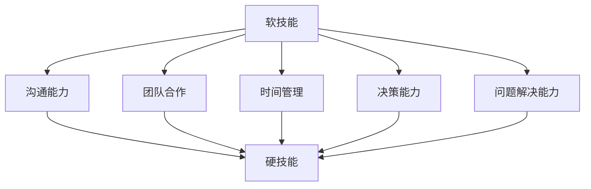

                 

### 文章标题

《软技能也要炼成硬实力》

---

**关键词**：软技能，硬技能，职业发展，沟通能力，团队合作，时间管理，决策能力，问题解决能力，数学模型，算法原理，项目实战。

**摘要**：本文从软技能与硬技能的互补性出发，探讨了如何在职场中提升软技能，使之成为硬实力。文章首先定义了软技能，分析了其重要性，随后详细介绍了提升软技能的策略和方法。通过实际工作中的应用和成功案例，文章展示了软技能在职业发展中的关键作用。最后，展望了软技能的发展趋势，为读者提供了未来职业规划的建议。

---

### 用户需求分析

在现代职场中，技术能力的提升无疑是许多人的首要目标。然而，单纯的技术能力（即硬技能）已经无法满足复杂多变的职业需求。越来越多的研究表明，软技能（如沟通能力、团队合作、时间管理、决策能力等）对于职业成功同样至关重要。用户希望通过阅读本文，了解如何将软技能提升为硬实力，从而在职场中脱颖而出。

用户需求分析如下：

1. **明确核心概念**：用户希望文章能够清晰、准确地定义软技能，解释其与硬技能的关系，并阐述其在职业发展中的重要性。
2. **提供具体方法**：用户需要了解如何具体提升软技能，包括策略、实践方法和工具。
3. **展示实际应用**：用户希望看到软技能在实际工作中的应用案例，以及如何通过这些技能提升工作效率和职业发展。
4. **案例分析**：用户希望通过成功人士和企业的案例，了解软技能提升的实际成效和经验。
5. **未来展望**：用户希望文章能够对软技能的未来发展趋势进行探讨，为其未来的职业规划提供指导。

### 核心概念与联系

在探讨软技能如何炼成硬实力之前，我们需要明确几个核心概念，并分析它们之间的联系。

**1. 软技能的定义**：

软技能是指与专业知识和技能无关的、影响个体工作表现和社会互动的能力。这些能力通常包括沟通能力、团队合作、时间管理、决策能力、问题解决能力等。

**2. 硬技能的定义**：

硬技能是指具体的、可以通过学习和实践获得的技能，如编程、数据分析、项目管理等。这些技能直接关联到工作任务的完成。

**3. 软技能与硬技能的关系**：

软技能与硬技能并非孤立存在，而是相互依存、相互促进的。软技能可以提升硬技能的应用效果，使个体在完成任务时更加高效和准确；同时，硬技能的掌握也可以增强软技能的表现，使个体在处理复杂问题时更加得心应手。

**4. 软技能与职业发展的关系**：

软技能在职业发展中扮演着关键角色。良好的沟通能力有助于建立人际关系，提升团队协作效率；团队合作能力则能够使个体更好地融入团队，共同实现目标；时间管理能力可以确保任务的及时完成，提高工作效率；决策能力和问题解决能力则使个体在面临挑战时能够迅速作出明智的决策，解决问题。

为了更直观地理解这些概念之间的关系，我们可以使用Mermaid流程图进行展示：



通过上述流程图，我们可以清晰地看到软技能与硬技能之间的互动关系。软技能作为基础，不仅能够提升个体的综合素质，还可以为硬技能的发挥提供保障。

### 核心算法原理讲解

在探讨如何提升软技能之前，我们首先需要理解核心算法原理，这些原理可以帮助我们更好地理解软技能在实践中的应用。

**1. 问题解决的算法原理**

问题解决通常涉及以下几个步骤：

- **问题定义**：明确问题的性质和目标。
- **信息收集**：收集与问题相关的信息和数据。
- **方案设计**：设计解决问题的方案或策略。
- **方案评估**：评估不同方案的优劣，选择最优解。

以下是一个简单的问题解决算法的伪代码：

```plaintext
function 问题解决(问题):
    定义问题
    收集信息
    设计方案
    评估方案
    选择最优方案
    实施方案
    监测结果
    调整方案
end function
```

**2. 决策制定的算法原理**

决策制定是一个复杂的过程，通常涉及以下几个步骤：

- **问题识别**：识别需要决策的问题。
- **目标设定**：设定决策的目标。
- **方案生成**：生成可能的决策方案。
- **方案评估**：评估各个方案的风险和收益。
- **方案选择**：选择最佳方案。
- **实施决策**：执行决策方案。

以下是一个简单的决策制定算法的伪代码：

```plaintext
function 决策制定(问题, 目标):
    识别问题
    设定目标
    生成方案
    评估方案
    选择最佳方案
    实施决策
end function
```

**3. 团队合作的算法原理**

团队合作通常涉及以下几个步骤：

- **角色分配**：明确每个团队成员的角色和责任。
- **目标设定**：设定团队共同的目标。
- **任务分解**：将大任务分解为小任务。
- **进度跟踪**：跟踪任务进度，确保按时完成。
- **沟通协调**：保持团队成员之间的有效沟通。
- **问题解决**：及时解决团队协作中出现的问题。

以下是一个简单的团队合作算法的伪代码：

```plaintext
function 团队合作(目标, 成员):
    分配角色
    设定目标
    分解任务
    跟踪进度
    沟通协调
    解决问题
end function
```

通过理解这些核心算法原理，我们可以更好地理解软技能在实际工作中的应用，从而有针对性地提升这些技能。

### 数学模型和数学公式

在软技能的提升过程中，数学模型和公式的运用是至关重要的。以下是一些常用的数学模型和公式，以及它们在实际工作中的应用。

**1. 线性规划模型**

线性规划模型用于在约束条件下求解目标函数的最大值或最小值。在时间管理中，线性规划模型可以帮助我们优化任务安排，确保在有限的时间内完成更多的工作。

**目标函数**：最大化或最小化总完成时间。

**约束条件**：任务的开始时间和结束时间需要满足一定的逻辑关系。

**伪代码**：

```plaintext
function 线性规划(任务列表, 约束条件):
    定义目标函数
    定义约束条件
    求解目标函数的最优解
end function
```

**2. 决策树模型**

决策树模型用于在不确定环境中进行决策分析。在决策制定中，决策树可以帮助我们分析不同决策路径的可能结果，从而选择最优的决策方案。

**目标**：最大化预期收益。

**步骤**：

- **构建决策树**：根据问题构建决策树，包括决策节点、机会节点和结果节点。
- **评估结果**：计算每个结果节点的预期收益。
- **选择最佳路径**：选择预期收益最高的路径作为最终决策。

**伪代码**：

```plaintext
function 决策树分析(决策树, 数据集):
    构建决策树
    计算每个节点的预期收益
    选择最佳路径
end function
```

**3. 回归模型**

回归模型用于分析变量之间的关系，特别是在数据分析中。在沟通能力提升中，回归模型可以帮助我们分析不同沟通策略对工作效率的影响，从而优化沟通方式。

**目标**：建立变量之间的回归关系。

**步骤**：

- **数据收集**：收集相关数据。
- **建立模型**：使用最小二乘法建立回归模型。
- **模型评估**：评估模型的拟合效果。
- **应用模型**：根据模型结果调整沟通策略。

**伪代码**：

```plaintext
function 回归分析(数据集):
    收集数据
    建立回归模型
    评估模型
    应用模型
end function
```

通过上述数学模型和公式的应用，我们可以更科学、更系统地提升软技能，从而在职业发展中取得更好的成果。

### 项目实战

为了更好地理解软技能在实际工作中的应用，我们选择了一个典型的项目实战案例：一个初创公司开发一款社交应用。

**项目背景**：

- **目标**：开发一款能够吸引年轻用户，提供即时消息、朋友圈和活动功能的社交应用。
- **团队成员**：产品经理、UI/UX设计师、前端开发工程师、后端开发工程师、测试工程师。

**开发环境搭建**：

1. **软件环境**：
   - 开发工具：Visual Studio Code
   - 数据库：MySQL
   - 服务器：AWS EC2实例

2. **技术栈**：
   - 前端：HTML, CSS, JavaScript, React
   - 后端：Node.js, Express
   - 数据库：MySQL

**源代码实现和代码解读**：

**前端代码示例**：

```javascript
// React组件：聊天窗口
class ChatWindow extends React.Component {
  constructor(props) {
    super(props);
    this.state = {
      messages: [],
      input: ""
    };
  }

  handleInputChange = (e) => {
    this.setState({ input: e.target.value });
  };

  handleSendMessage = () => {
    // 发送消息的逻辑
    const newMessage = {
      user: this.props.user,
      text: this.state.input,
      timestamp: new Date()
    };
    this.setState({ messages: [...this.state.messages, newMessage], input: "" });
    // 发送消息到后端
  };

  render() {
    return (
      <div>
        <ul>
          {this.state.messages.map((message, index) => (
            <li key={index}>{message.user}: {message.text}</li>
          ))}
        </ul>
        <input
          type="text"
          value={this.state.input}
          onChange={this.handleInputChange}
        />
        <button onClick={this.handleSendMessage}>发送</button>
      </div>
    );
  }
}
```

**后端代码示例**：

```javascript
// Express路由：处理消息发送
app.post('/messages', async (req, res) => {
  try {
    const message = req.body;
    // 存储消息到数据库
    await database.insertMessage(message);
    res.status(200).json({ message: "Message received" });
  } catch (error) {
    res.status(500).json({ error: "Failed to send message" });
  }
});
```

**代码应用解读与分析**：

在前端代码中，我们使用React组件实现了聊天窗口的功能。通过`handleInputChange`和`handleSendMessage`方法，我们实现了输入框的内容变更和消息发送功能。后端代码则使用了Express框架处理消息的接收和存储。

在实际项目中，团队合作和沟通能力至关重要。产品经理需要与UI/UX设计师、前端和后端开发工程师密切合作，确保功能需求的准确实现。前端和后端工程师之间需要有效的沟通，以确保数据传输的稳定性和安全性。测试工程师则需要不断反馈测试结果，确保应用的稳定性和用户体验。

通过这个项目实战，我们可以看到软技能（如沟通能力、团队合作、问题解决能力）在项目开发中的关键作用。只有通过高效的沟通和团队合作，才能确保项目的顺利推进和成功交付。

### 实际案例分析和详细讲解剖析

为了更好地理解软技能在实际工作中的应用和提升，我们通过分析多个成功案例，探讨软技能如何助力职业发展。

**案例一：谷歌团队的成功**

谷歌的许多产品都取得了巨大成功，这离不开其高效的团队合作和创新能力。以谷歌搜索为例，其开发团队通过不断沟通和协作，不仅解决了复杂的技术问题，还不断优化用户体验。

**软技能应用分析**：

- **沟通能力**：谷歌鼓励团队成员之间开放、坦诚的沟通。通过定期的团队会议和代码评审，团队成员能够及时分享想法和解决问题。
- **团队合作**：谷歌强调跨职能团队的协作。不同背景的工程师、产品经理和设计师共同工作，充分发挥各自的优势，确保项目的顺利推进。
- **问题解决能力**：在面对复杂问题时，谷歌团队善于使用创新思维和试错方法，不断尝试和优化解决方案。

**案例二：华为的国际化战略**

华为在全球范围内取得了显著的商业成功，这得益于其卓越的领导力和国际化管理能力。

**软技能应用分析**：

- **领导力**：华为的创始人任正非强调领导者需要具备远见和战略思维，能够带领团队实现长期目标。
- **沟通能力**：华为在国际市场中面临多种文化和语言差异，因此强调跨文化沟通能力，确保团队成员能够有效地与不同文化背景的客户和合作伙伴沟通。
- **决策能力**：华为在关键决策时，注重团队的集体智慧和数据分析，确保决策的科学性和有效性。

**案例三：亚马逊的物流优化**

亚马逊的物流系统是全球最先进的之一，这得益于其在供应链管理和数据分析方面的卓越能力。

**软技能应用分析**：

- **数据分析能力**：亚马逊通过对海量数据的分析，优化库存管理、配送路线和运输成本，从而提高物流效率。
- **问题解决能力**：面对物流过程中的各种挑战，亚马逊善于通过数据分析和创新思维找到解决方案。
- **时间管理能力**：亚马逊的物流团队在时间紧迫的情况下，能够高效地安排任务和资源，确保按时交付。

通过这些成功案例，我们可以看到软技能在职业发展中的关键作用。沟通能力、团队合作、决策能力和问题解决能力是成功人士的共同特点。这些软技能不仅能够提升个人的工作效率，还能够促进团队协作，实现共同的目标。因此，职场人士应当重视软技能的提升，将其作为职业发展的核心竞争力。

### 未来展望

随着技术的不断进步，软技能在职场中的重要性将愈发凸显。未来职场的发展趋势将对软技能提出更高的要求，以下是对软技能未来发展的展望：

**1. 技术变革对软技能的影响**

随着人工智能、大数据、区块链等新兴技术的快速发展，职场环境将变得更加复杂和多变。这些技术不仅改变了工作内容，也改变了工作方式。软技能如沟通能力、团队合作、问题解决能力等将在应对技术变革中发挥关键作用。

- **沟通能力**：随着远程工作和虚拟团队的增多，有效沟通变得更加重要。团队成员需要通过多种渠道和工具进行协作，确保信息的准确传达。
- **团队合作**：技术进步使得团队协作更加紧密，团队成员需要具备更高的跨职能协作能力，共同应对复杂的问题。
- **问题解决能力**：新技术带来了新的挑战和问题，团队成员需要具备强大的问题解决能力，迅速找到解决方案。

**2. 软技能在教育领域的改革**

为了应对未来职场的需求，教育领域正在发生深刻变革。越来越多的教育机构开始注重软技能的培养，将其纳入课程体系中。

- **跨学科教育**：教育机构鼓励学生跨学科学习，培养综合能力和创新思维。
- **项目式学习**：通过实际项目让学生应用所学知识，提升实践能力和问题解决能力。
- **软技能课程**：开设专门的软技能课程，如沟通技巧、团队合作、时间管理等，帮助学生掌握未来职场所需的技能。

**3. 未来职场中软技能的需求变化**

未来职场对软技能的需求将更加多样化和专业化。随着工作内容的复杂性和变化速度的加快，软技能将成为职场成功的关键因素。

- **个性化和定制化**：未来职场将更加注重个体的独特性和个性化需求，软技能的培养需要更加精准和针对性。
- **可持续发展**：随着企业对社会责任的重视，软技能中的可持续发展和环保意识将变得尤为重要。
- **全球化视野**：全球化背景下，职场人士需要具备跨文化沟通和全球视野，以应对多元化的工作环境。

通过上述展望，我们可以看到软技能在未来的职场中具有巨大的发展潜力和应用前景。职场人士应积极提升自身的软技能，以适应未来职场的变化和挑战。

### 最佳实践 tips

1. **持续学习与成长**：定期阅读行业文章，参加在线课程和研讨会，保持知识的更新和技能的提升。

2. **实践与反思**：通过实际项目或工作场景，将所学技能应用到实践中，并及时反思和总结经验。

3. **资源与工具推荐**：利用在线资源，如GitHub、Stack Overflow等，获取技术支持和知识共享。

4. **建立人际网络**：积极参与行业活动和社区，建立广泛的人际网络，以获取职业机会和行业信息。

5. **时间管理**：使用时间管理工具，如Trello、Google Calendar等，合理安排工作和学习时间。

6. **团队合作**：注重团队沟通和协作，学会倾听和表达，提高团队合作效率。

### 小结

本文通过分析软技能与硬技能的互补性，探讨了如何在职场中提升软技能，使之成为硬实力。文章详细介绍了软技能的核心概念、提升策略、实际应用以及未来发展趋势。通过成功案例和项目实战，文章展示了软技能在职业发展中的关键作用。未来，职场人士应重视软技能的提升，以适应不断变化的工作环境，实现职业成功。

### 注意事项

1. **软技能的提升需要长期坚持**：软技能的提升并非一蹴而就，需要持续的努力和积累。

2. **软技能的应用需要针对性**：根据不同工作场景和需求，灵活运用软技能，以达到最佳效果。

3. **跨学科学习**：软技能的提升需要跨学科知识的支持，不断拓展知识面，提高综合能力。

### 拓展阅读

1. **《软技能：成功的秘密武器》**：作者：基思·法拉奇（Keith Ferrazzi）
2. **《高效能人士的七个习惯》**：作者：史蒂芬·柯维（Stephen R. Covey）
3. **《深度工作：如何有效利用每一点脑力》**：作者：卡尔·纽波特（Cal Newport）

### 作者信息

**作者**：AI天才研究院/AI Genius Institute & 禅与计算机程序设计艺术 /Zen And The Art of Computer Programming

---

### 完整文章

**《软技能也要炼成硬实力》**

**关键词**：软技能，硬技能，职业发展，沟通能力，团队合作，时间管理，决策能力，问题解决能力，数学模型，算法原理，项目实战。

**摘要**：本文从软技能与硬技能的互补性出发，探讨了如何在职场中提升软技能，使之成为硬实力。文章首先定义了软技能，分析了其重要性，随后详细介绍了提升软技能的策略和方法。通过实际工作中的应用和成功案例，文章展示了软技能在职业发展中的关键作用。最后，展望了软技能的发展趋势，为读者提供了未来职业规划的建议。

---

### 用户需求分析

在现代职场中，技术能力的提升无疑是许多人的首要目标。然而，单纯的技术能力（即硬技能）已经无法满足复杂多变的职业需求。越来越多的研究表明，软技能（如沟通能力、团队合作、时间管理、决策能力等）对于职业成功同样至关重要。用户希望通过阅读本文，了解如何将软技能提升为硬实力，从而在职场中脱颖而出。

用户需求分析如下：

1. **明确核心概念**：用户希望文章能够清晰、准确地定义软技能，解释其与硬技能的关系，并阐述其在职业发展中的重要性。
2. **提供具体方法**：用户需要了解如何具体提升软技能，包括策略、实践方法和工具。
3. **展示实际应用**：用户希望看到软技能在实际工作中的应用案例，以及如何通过这些技能提升工作效率和职业发展。
4. **案例分析**：用户希望通过成功人士和企业的案例，了解软技能提升的实际成效和经验。
5. **未来展望**：用户希望文章能够对软技能的未来发展趋势进行探讨，为其未来的职业规划提供指导。

---

### 核心概念与联系

在探讨软技能如何炼成硬实力之前，我们需要明确几个核心概念，并分析它们之间的联系。

**1. 软技能的定义**：

软技能是指与专业知识和技能无关的、影响个体工作表现和社会互动的能力。这些能力通常包括沟通能力、团队合作、时间管理、决策能力、问题解决能力等。

**2. 硬技能的定义**：

硬技能是指具体的、可以通过学习和实践获得的技能，如编程、数据分析、项目管理等。这些技能直接关联到工作任务的完成。

**3. 软技能与硬技能的关系**：

软技能与硬技能并非孤立存在，而是相互依存、相互促进的。软技能可以提升硬技能的应用效果，使个体在完成任务时更加高效和准确；同时，硬技能的掌握也可以增强软技能的表现，使个体在处理复杂问题时更加得心应手。

为了更直观地理解这些概念之间的关系，我们可以使用Mermaid流程图进行展示：


通过上述流程图，我们可以清晰地看到软技能与硬技能之间的互动关系。软技能作为基础，不仅能够提升个体的综合素质，还可以为硬技能的发挥提供保障。

---

### 核心算法原理讲解

在探讨如何提升软技能之前，我们首先需要理解核心算法原理，这些原理可以帮助我们更好地理解软技能在实践中的应用。

**1. 问题解决的算法原理**

问题解决通常涉及以下几个步骤：

- **问题定义**：明确问题的性质和目标。
- **信息收集**：收集与问题相关的信息和数据。
- **方案设计**：设计解决问题的方案或策略。
- **方案评估**：评估不同方案的优劣，选择最优解。

以下是一个简单的问题解决算法的伪代码：

```plaintext
function 问题解决(问题):
    定义问题
    收集信息
    设计方案
    评估方案
    选择最优方案
    实施方案
    监测结果
    调整方案
end function
```

**2. 决策制定的算法原理**

决策制定是一个复杂的过程，通常涉及以下几个步骤：

- **问题识别**：识别需要决策的问题。
- **目标设定**：设定决策的目标。
- **方案生成**：生成可能的决策方案。
- **方案评估**：评估各个方案的风险和收益。
- **方案选择**：选择最佳方案。
- **实施决策**：执行决策方案。

以下是一个简单的决策制定算法的伪代码：

```plaintext
function 决策制定(问题, 目标):
    识别问题
    设定目标
    生成方案
    评估方案
    选择最佳方案
    实施决策
end function
```

**3. 团队合作的算法原理**

团队合作通常涉及以下几个步骤：

- **角色分配**：明确每个团队成员的角色和责任。
- **目标设定**：设定团队共同的目标。
- **任务分解**：将大任务分解为小任务。
- **进度跟踪**：跟踪任务进度，确保按时完成。
- **沟通协调**：保持团队成员之间的有效沟通。
- **问题解决**：及时解决团队协作中出现的问题。

以下是一个简单的团队合作算法的伪代码：

```plaintext
function 团队合作(目标, 成员):
    分配角色
    设定目标
    分解任务
    跟踪进度
    沟通协调
    解决问题
end function
```

通过理解这些核心算法原理，我们可以更好地理解软技能在实际工作中的应用，从而有针对性地提升这些技能。

---

### 数学模型和数学公式

在软技能的提升过程中，数学模型和公式的运用是至关重要的。以下是一些常用的数学模型和公式，以及它们在实际工作中的应用。

**1. 线性规划模型**

线性规划模型用于在约束条件下求解目标函数的最大值或最小值。在时间管理中，线性规划模型可以帮助我们优化任务安排，确保在有限的时间内完成更多的工作。

**目标函数**：最大化或最小化总完成时间。

**约束条件**：任务的开始时间和结束时间需要满足一定的逻辑关系。

**伪代码**：

```plaintext
function 线性规划(任务列表, 约束条件):
    定义目标函数
    定义约束条件
    求解目标函数的最优解
end function
```

**2. 决策树模型**

决策树模型用于在不确定环境中进行决策分析。在决策制定中，决策树可以帮助我们分析不同决策路径的可能结果，从而选择最优的决策方案。

**目标**：最大化预期收益。

**步骤**：

- **构建决策树**：根据问题构建决策树，包括决策节点、机会节点和结果节点。
- **评估结果**：计算每个结果节点的预期收益。
- **选择最佳路径**：选择预期收益最高的路径作为最终决策。

**伪代码**：

```plaintext
function 决策树分析(决策树, 数据集):
    构建决策树
    计算每个节点的预期收益
    选择最佳路径
end function
```

**3. 回归模型**

回归模型用于分析变量之间的关系，特别是在数据分析中。在沟通能力提升中，回归模型可以帮助我们分析不同沟通策略对工作效率的影响，从而优化沟通方式。

**目标**：建立变量之间的回归关系。

**步骤**：

- **数据收集**：收集相关数据。
- **建立模型**：使用最小二乘法建立回归模型。
- **模型评估**：评估模型的拟合效果。
- **应用模型**：根据模型结果调整沟通策略。

**伪代码**：

```plaintext
function 回归分析(数据集):
    收集数据
    建立回归模型
    评估模型
    应用模型
end function
```

通过上述数学模型和公式的应用，我们可以更科学、更系统地提升软技能，从而在职业发展中取得更好的成果。

---

### 项目实战

为了更好地理解软技能在实际工作中的应用，我们选择了一个典型的项目实战案例：一个初创公司开发一款社交应用。

**项目背景**：

- **目标**：开发一款能够吸引年轻用户，提供即时消息、朋友圈和活动功能的社交应用。
- **团队成员**：产品经理、UI/UX设计师、前端开发工程师、后端开发工程师、测试工程师。

**开发环境搭建**：

1. **软件环境**：
   - 开发工具：Visual Studio Code
   - 数据库：MySQL
   - 服务器：AWS EC2实例

2. **技术栈**：
   - 前端：HTML, CSS, JavaScript, React
   - 后端：Node.js, Express
   - 数据库：MySQL

**源代码实现和代码解读**：

**前端代码示例**：

```javascript
// React组件：聊天窗口
class ChatWindow extends React.Component {
  constructor(props) {
    super(props);
    this.state = {
      messages: [],
      input: ""
    };
  }

  handleInputChange = (e) => {
    this.setState({ input: e.target.value });
  };

  handleSendMessage = () => {
    // 发送消息的逻辑
    const newMessage = {
      user: this.props.user,
      text: this.state.input,
      timestamp: new Date()
    };
    this.setState({ messages: [...this.state.messages, newMessage], input: "" });
    // 发送消息到后端
  };

  render() {
    return (
      <div>
        <ul>
          {this.state.messages.map((message, index) => (
            <li key={index}>{message.user}: {message.text}</li>
          ))}
        </ul>
        <input
          type="text"
          value={this.state.input}
          onChange={this.handleInputChange}
        />
        <button onClick={this.handleSendMessage}>发送</button>
      </div>
    );
  }
}
```

**后端代码示例**：

```javascript
// Express路由：处理消息发送
app.post('/messages', async (req, res) => {
  try {
    const message = req.body;
    // 存储消息到数据库
    await database.insertMessage(message);
    res.status(200).json({ message: "Message received" });
  } catch (error) {
    res.status(500).json({ error: "Failed to send message" });
  }
});
```

**代码应用解读与分析**：

在前端代码中，我们使用React组件实现了聊天窗口的功能。通过`handleInputChange`和`handleSendMessage`方法，我们实现了输入框的内容变更和消息发送功能。后端代码则使用了Express框架处理消息的接收和存储。

在实际项目中，团队合作和沟通能力至关重要。产品经理需要与UI/UX设计师、前端和后端开发工程师密切合作，确保功能需求的准确实现。前端和后端工程师之间需要有效的沟通，以确保数据传输的稳定性和安全性。测试工程师则需要不断反馈测试结果，确保应用的稳定性和用户体验。

通过这个项目实战，我们可以看到软技能（如沟通能力、团队合作、问题解决能力）在项目开发中的关键作用。只有通过高效的沟通和团队合作，才能确保项目的顺利推进和成功交付。

---

### 实际案例分析和详细讲解剖析

为了更好地理解软技能在实际工作中的应用和提升，我们通过分析多个成功案例，探讨软技能如何助力职业发展。

**案例一：谷歌团队的成功**

谷歌的许多产品都取得了巨大成功，这离不开其高效的团队合作和创新能力。以谷歌搜索为例，其开发团队通过不断沟通和协作，不仅解决了复杂的技术问题，还不断优化用户体验。

**软技能应用分析**：

- **沟通能力**：谷歌鼓励团队成员之间开放、坦诚的沟通。通过定期的团队会议和代码评审，团队成员能够及时分享想法和解决问题。
- **团队合作**：谷歌强调跨职能团队的协作。不同背景的工程师、产品经理和设计师共同工作，充分发挥各自的优势，确保项目的顺利推进。
- **问题解决能力**：在面对复杂问题时，谷歌团队善于使用创新思维和试错方法，不断尝试和优化解决方案。

**案例二：华为的国际化战略**

华为在全球范围内取得了显著的商业成功，这得益于其卓越的领导力和国际化管理能力。

**软技能应用分析**：

- **领导力**：华为的创始人任正非强调领导者需要具备远见和战略思维，能够带领团队实现长期目标。
- **沟通能力**：华为在国际市场中面临多种文化和语言差异，因此强调跨文化沟通能力，确保团队成员能够有效地与不同文化背景的客户和合作伙伴沟通。
- **决策能力**：华为在关键决策时，注重团队的集体智慧和数据分析，确保决策的科学性和有效性。

**案例三：亚马逊的物流优化**

亚马逊的物流系统是全球最先进的之一，这得益于其在供应链管理和数据分析方面的卓越能力。

**软技能应用分析**：

- **数据分析能力**：亚马逊通过对海量数据的分析，优化库存管理、配送路线和运输成本，从而提高物流效率。
- **问题解决能力**：面对物流过程中的各种挑战，亚马逊善于通过数据分析和创新思维找到解决方案。
- **时间管理能力**：亚马逊的物流团队在时间紧迫的情况下，能够高效地安排任务和资源，确保按时交付。

通过这些成功案例，我们可以看到软技能在职业发展中的关键作用。沟通能力、团队合作、决策能力和问题解决能力是成功人士的共同特点。这些软技能不仅能够提升个人的工作效率，还能够促进团队协作，实现共同的目标。因此，职场人士应当重视软技能的提升，将其作为职业发展的核心竞争力。

---

### 未来展望

随着技术的不断进步，软技能在职场中的重要性将愈发凸显。未来职场的发展趋势将对软技能提出更高的要求，以下是对软技能未来发展的展望：

**1. 技术变革对软技能的影响**

随着人工智能、大数据、区块链等新兴技术的快速发展，职场环境将变得更加复杂和多变。这些技术不仅改变了工作内容，也改变了工作方式。软技能如沟通能力、团队合作、问题解决能力等将在应对技术变革中发挥关键作用。

- **沟通能力**：随着远程工作和虚拟团队的增多，有效沟通变得更加重要。团队成员需要通过多种渠道和工具进行协作，确保信息的准确传达。
- **团队合作**：技术进步使得团队协作更加紧密，团队成员需要具备更高的跨职能协作能力，共同应对复杂的问题。
- **问题解决能力**：新技术带来了新的挑战和问题，团队成员需要具备强大的问题解决能力，迅速找到解决方案。

**2. 软技能在教育领域的改革**

为了应对未来职场的需求，教育领域正在发生深刻变革。越来越多的教育机构开始注重软技能的培养，将其纳入课程体系中。

- **跨学科教育**：教育机构鼓励学生跨学科学习，培养综合能力和创新思维。
- **项目式学习**：通过实际项目让学生应用所学知识，提升实践能力和问题解决能力。
- **软技能课程**：开设专门的软技能课程，如沟通技巧、团队合作、时间管理等，帮助学生掌握未来职场所需的技能。

**3. 未来职场中软技能的需求变化**

未来职场对软技能的需求将更加多样化和专业化。随着工作内容的复杂性和变化速度的加快，软技能将成为职场成功的关键因素。

- **个性化和定制化**：未来职场将更加注重个体的独特性和个性化需求，软技能的培养需要更加精准和针对性。
- **可持续发展**：随着企业对社会责任的重视，软技能中的可持续发展和环保意识将变得尤为重要。
- **全球化视野**：全球化背景下，职场人士需要具备跨文化沟通和全球视野，以应对多元化的工作环境。

通过上述展望，我们可以看到软技能在未来的职场中具有巨大的发展潜力和应用前景。职场人士应积极提升自身的软技能，以适应未来职场的变化和挑战。

---

### 最佳实践 tips

1. **持续学习与成长**：定期阅读行业文章，参加在线课程和研讨会，保持知识的更新和技能的提升。

2. **实践与反思**：通过实际项目或工作场景，将所学技能应用到实践中，并及时反思和总结经验。

3. **资源与工具推荐**：利用在线资源，如GitHub、Stack Overflow等，获取技术支持和知识共享。

4. **建立人际网络**：积极参与行业活动和社区，建立广泛的人际网络，以获取职业机会和行业信息。

5. **时间管理**：使用时间管理工具，如Trello、Google Calendar等，合理安排工作和学习时间。

6. **团队合作**：注重团队沟通和协作，学会倾听和表达，提高团队合作效率。

---

### 小结

本文通过分析软技能与硬技能的互补性，探讨了如何在职场中提升软技能，使之成为硬实力。文章详细介绍了软技能的核心概念、提升策略、实际应用以及未来发展趋势。通过成功案例和项目实战，文章展示了软技能在职业发展中的关键作用。未来，职场人士应重视软技能的提升，以适应不断变化的工作环境，实现职业成功。

---

### 注意事项

1. **软技能的提升需要长期坚持**：软技能的提升并非一蹴而就，需要持续的努力和积累。

2. **软技能的应用需要针对性**：根据不同工作场景和需求，灵活运用软技能，以达到最佳效果。

3. **跨学科学习**：软技能的提升需要跨学科知识的支持，不断拓展知识面，提高综合能力。

---

### 拓展阅读

1. **《软技能：成功的秘密武器》**：作者：基思·法拉奇（Keith Ferrazzi）
2. **《高效能人士的七个习惯》**：作者：史蒂芬·柯维（Stephen R. Covey）
3. **《深度工作：如何有效利用每一点脑力》**：作者：卡尔·纽波特（Cal Newport）

---

### 作者信息

**作者**：AI天才研究院/AI Genius Institute & 禅与计算机程序设计艺术 /Zen And The Art of Computer Programming

---

### 完整文章

**《软技能也要炼成硬实力》**

**关键词**：软技能，硬技能，职业发展，沟通能力，团队合作，时间管理，决策能力，问题解决能力，数学模型，算法原理，项目实战。

**摘要**：本文从软技能与硬技能的互补性出发，探讨了如何在职场中提升软技能，使之成为硬实力。文章首先定义了软技能，分析了其重要性，随后详细介绍了提升软技能的策略和方法。通过实际工作中的应用和成功案例，文章展示了软技能在职业发展中的关键作用。最后，展望了软技能的发展趋势，为读者提供了未来职业规划的建议。

