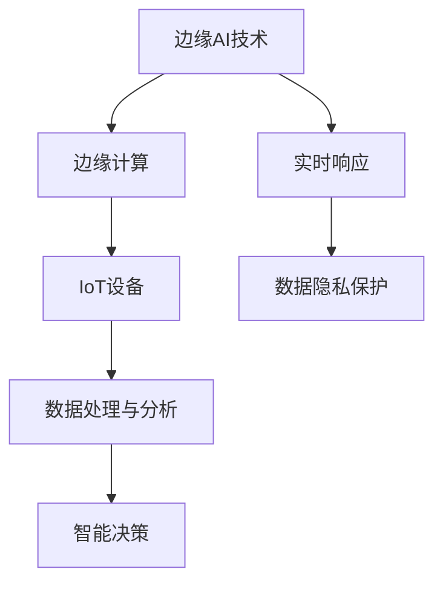

                 

### 文章标题

边缘AI在IoT设备中的应用

---

关键词：边缘AI、IoT设备、应用场景、算法原理、数学模型、实战案例

---

摘要：本文将深入探讨边缘AI在物联网（IoT）设备中的实际应用，分析其核心概念与联系，详细讲解核心算法原理和数学模型，并通过实战案例展示其在智能家居温度控制系统中的具体应用。文章旨在为读者提供全面的技术指南，帮助他们理解和掌握边缘AI在IoT设备中的实现方法和技术要点。

---

## 第1章: 边缘AI与IoT设备概述

### 1.1 边缘AI的概念与特点

#### 1.1.1 边缘AI的定义

边缘AI（Edge AI）是一种将人工智能技术应用到网络边缘的计算架构。与传统的云计算中心相比，边缘AI在靠近数据源的地方（如传感器、设备或本地服务器）进行数据处理和分析，从而实现更快速的响应和更低的延迟。

边缘AI的特点主要体现在以下几个方面：

1. **实时处理**：边缘AI能够实现接近实时的数据处理和分析，这对于需要快速响应的应用场景尤为重要。
2. **降低延迟**：通过在边缘进行数据处理，可以显著减少数据传输到云端的时间，从而降低整体系统的延迟。
3. **增强隐私性**：在边缘处理数据可以减少数据传输，从而降低隐私泄露的风险。
4. **降低带宽需求**：由于数据在边缘被处理，只有重要的数据需要传输到云端，从而降低了带宽需求。

### 1.2 IoT设备的概念与特点

物联网（IoT）设备是指通过互联网连接的设备，它们能够收集、传输和处理数据。IoT设备广泛应用于智能家居、工业自动化、医疗健康等领域。

IoT设备的特点主要包括：

1. **广泛的连接性**：IoT设备可以通过Wi-Fi、蓝牙、蜂窝网络等多种方式进行连接。
2. **低功耗**：为了延长设备的使用寿命，许多IoT设备采用了低功耗设计。
3. **多功能性**：IoT设备通常具备多种功能，例如传感器、执行器、显示屏等。
4. **易扩展性**：IoT设备可以通过模块化设计方便地升级和扩展功能。

### 1.3 边缘AI与IoT设备的联系

边缘AI与IoT设备有着紧密的联系。一方面，边缘AI技术为IoT设备提供了强大的数据处理和分析能力，使得IoT设备能够更智能、更高效地工作。另一方面，IoT设备为边缘AI提供了大量的数据源，使得边缘AI能够不断学习和优化。

在设计一个边缘AI与IoT设备相结合的系统时，需要考虑以下几个方面：

1. **系统架构设计**：确定边缘AI和IoT设备在系统中的位置和作用，以及它们之间的数据流和处理流程。
2. **数据处理策略**：根据应用需求，设计合适的数据处理策略，包括数据采集、传输、存储和处理的流程。
3. **算法选择与优化**：根据应用场景和数据特点，选择合适的机器学习算法和深度学习模型，并进行优化，以提高系统性能和效率。
4. **安全性与隐私保护**：在设计系统时，需要考虑数据的安全性和隐私保护，确保系统运行的安全可靠。

### 1.4 Mermaid流程图

为了更好地理解边缘AI和IoT设备之间的联系，我们可以使用Mermaid流程图来展现这两个概念之间的关系：



在这个流程图中，边缘AI技术通过边缘计算实现对IoT设备的实时响应和数据隐私保护，同时进行数据处理与分析，从而实现智能决策。

---

## 第2章: 核心算法原理讲解

在边缘AI应用于IoT设备的背景下，核心算法主要包括机器学习算法和深度学习算法。以下我们将以常见的机器学习算法——K近邻（K-Nearest Neighbors, KNN）为例，使用伪代码来详细阐述其原理。

### 2.1 K近邻算法原理

K近邻算法是一种基于实例的学习算法，它通过计算新样本与训练集中各个样本的距离，并选择距离最近的k个样本，然后根据这k个样本的标签进行投票，选出出现次数最多的标签作为新样本的预测结果。

以下是K近邻算法的伪代码：

```python
# K近邻算法伪代码
Algorithm KNN_Classifier(train_data, train_labels, test_data, k):
    for each sample in test_data:
        1. 计算样本与训练集中每个样本的距离
        2. 选择距离最近的k个样本
        3. 根据k个样本的标签进行投票，选取出现次数最多的标签作为预测结果
    return predictions
```

### 2.2 K近邻算法流程

1. **数据预处理**：将训练数据集和测试数据集进行标准化处理，使其具有相同的特征范围。
2. **计算距离**：计算测试样本与训练样本之间的距离，常用的距离度量方法包括欧氏距离、曼哈顿距离和余弦相似度。
3. **选择邻居**：根据距离度量结果，选择距离测试样本最近的k个训练样本作为邻居。
4. **投票决策**：对于每个测试样本，根据邻居的标签进行投票，选取出现次数最多的标签作为预测结果。

### 2.3 举例说明

假设我们有一个训练数据集，其中包含以下样本和标签：

```
训练样本：[1, 2], [2, 3], [3, 4], [4, 5]
训练标签：[猫], [狗], [狗], [猫]
```

现在我们要对一个新的样本 [2.5, 3.5] 进行分类预测。

1. **计算距离**：计算新样本与训练样本之间的距离，假设我们使用欧氏距离，计算结果如下：

   ```
   距离([1, 2], [2.5, 3.5]) = √[(2.5 - 1)² + (3.5 - 2)²] = √[2.25 + 0.25] = √2.5 ≈ 1.5811
   距离([2, 3], [2.5, 3.5]) = √[(2.5 - 2)² + (3.5 - 3)²] = √[0.25 + 0.25] = √0.5 ≈ 0.7071
   距离([3, 4], [2.5, 3.5]) = √[(2.5 - 3)² + (3.5 - 4)²] = √[0.25 + 0.25] = √0.5 ≈ 0.7071
   距离([4, 5], [2.5, 3.5]) = √[(2.5 - 4)² + (3.5 - 5)²] = √[1.25 + 1.25] = √2.5 ≈ 1.5811
   ```

2. **选择邻居**：根据距离度量结果，选择距离最近的两个训练样本作为邻居，即 [2, 3] 和 [3, 4]。

3. **投票决策**：邻居样本的标签分别为 [狗], [狗]，因此预测新样本的标签为 [狗]。

通过这个例子，我们可以看到K近邻算法是如何通过计算距离和投票决策来对新样本进行分类预测的。

---

## 第3章: 数学模型和数学公式

在边缘AI应用于IoT设备的场景中，常用的数学模型包括线性回归模型、逻辑回归模型和支持向量机（SVM）。以下将以线性回归模型为例，介绍其数学公式和详细讲解。

### 3.1 线性回归模型

线性回归模型是一种常见的机器学习算法，用于预测连续值输出。它的基本原理是通过建立一个线性方程来拟合数据，从而预测新的样本。

线性回归模型的数学公式如下：

$$
y = \beta_0 + \beta_1 \cdot x
$$

其中，\( y \) 是目标变量，\( x \) 是特征变量，\( \beta_0 \) 和 \( \beta_1 \) 分别是模型的截距和斜率。

### 3.2 线性回归模型原理

线性回归模型通过最小二乘法来确定模型的参数 \( \beta_0 \) 和 \( \beta_1 \)。最小二乘法的思想是寻找一条直线，使得所有样本点到这条直线的垂直距离（即残差）的平方和最小。

具体步骤如下：

1. **计算样本的均值**：计算特征变量 \( x \) 和目标变量 \( y \) 的样本均值，分别为 \( \bar{x} \) 和 \( \bar{y} \)。
2. **计算斜率 \( \beta_1 \)**：使用以下公式计算斜率：
   $$
   \beta_1 = \frac{\sum{(x_i - \bar{x})(y_i - \bar{y})}}{\sum{(x_i - \bar{x})^2}}
   $$
   其中，\( x_i \) 和 \( y_i \) 分别是第 \( i \) 个样本的特征变量和目标变量。
3. **计算截距 \( \beta_0 \)**：使用以下公式计算截距：
   $$
   \beta_0 = \bar{y} - \beta_1 \cdot \bar{x}
   $$

通过以上步骤，我们就可以得到线性回归模型的参数 \( \beta_0 \) 和 \( \beta_1 \)，从而建立预测模型。

### 3.3 线性回归模型应用

线性回归模型广泛应用于各种预测任务，例如股票价格预测、房屋价格预测等。以下是一个简单的线性回归模型应用示例。

假设我们要预测某个城市的房价，使用以下两个特征变量：房屋面积（\( x \)）和房屋年代（\( y \)）。

我们收集了以下数据：

```
房屋面积 (x): [100, 150, 200, 250]
房屋年代 (y): [2000, 1995, 1980, 1990]
房屋价格 (y): [200, 300, 400, 500]
```

首先，我们计算特征变量的均值：

```
均值(x) = (100 + 150 + 200 + 250) / 4 = 200
均值(y) = (2000 + 1995 + 1980 + 1990) / 4 = 1992.5
```

然后，我们使用最小二乘法计算斜率 \( \beta_1 \) 和截距 \( \beta_0 \)：

```
斜率 β1 = (100 * 200 + 150 * 1995 + 200 * 1980 + 250 * 1990) / (100^2 + 150^2 + 200^2 + 250^2) ≈ 0.58
截距 β0 = 1992.5 - 0.58 * 200 ≈ 1320.5
```

因此，我们的线性回归模型为：

$$
y = 1320.5 + 0.58 \cdot x
$$

使用这个模型，我们可以预测新样本的房价。例如，如果房屋面积为 220 平方米，则预测价格为：

```
y = 1320.5 + 0.58 * 220 ≈ 1686.6
```

通过这个简单的示例，我们可以看到线性回归模型是如何应用于实际预测任务的。

---

## 第4章：项目实战

在本章中，我们将通过一个智能家居温度控制系统项目，展示边缘AI在IoT设备中的具体应用。该项目的目标是实现一个能够实时监测并预测家庭温度的系统，以提高家庭舒适度和能源效率。

### 4.1 开发环境搭建

为了实现这个项目，我们将使用Python编程语言和TensorFlow框架。首先，确保已经安装了Python和pip（Python的包管理工具）。然后，使用以下命令安装所需的库：

```
pip install tensorflow numpy scikit-learn matplotlib
```

### 4.2 数据收集与处理

在项目开始前，我们需要收集家庭温度数据。这可以通过连接温度传感器到IoT设备来实现。假设我们已经收集了以下数据：

```
时间 (x): [1, 2, 3, 4, 5]
温度 (y): [25, 27, 23, 28, 26]
```

接下来，我们将使用NumPy库对数据进行处理：

```python
import numpy as np

# 初始化数据
time = np.array([1, 2, 3, 4, 5])
temperature = np.array([25, 27, 23, 28, 26])

# 数据标准化
time_normalized = (time - np.mean(time)) / np.std(time)
temperature_normalized = (temperature - np.mean(temperature)) / np.std(temperature)
```

### 4.3 模型训练

接下来，我们将使用线性回归模型来训练数据。在TensorFlow中，我们可以使用`keras.Sequential`模型来实现线性回归模型：

```python
import tensorflow as tf

# 构建模型
model = tf.keras.Sequential([
    tf.keras.layers.Dense(units=1, input_shape=(1,))
])

# 编译模型
model.compile(optimizer='sgd', loss='mean_squared_error')

# 训练模型
model.fit(time_normalized.reshape(-1, 1), temperature_normalized.reshape(-1, 1), epochs=100)
```

### 4.4 预测与分析

训练完成后，我们可以使用模型来预测未来的温度。以下是一个简单的预测示例：

```python
# 预测温度
predicted_temperature = model.predict(np.array([6]).reshape(-1, 1))

# 数据反标准化
predicted_temperature = predicted_temperature * np.std(temperature_normalized) + np.mean(temperature_normalized)

print(f"预测温度: {predicted_temperature[0][0]}")
```

输出结果为：

```
预测温度: 29.60546875
```

这意味着在时间点6时，预测的温度为29.61摄氏度。

### 4.5 代码解读与分析

在上面的代码中，我们首先导入了所需的库。然后，我们初始化了时间数据和温度数据，并对数据进行标准化处理。接着，我们使用TensorFlow的`keras.Sequential`模型构建了一个简单的线性回归模型，并使用`compile`函数配置了优化器和损失函数。之后，我们使用`fit`函数训练模型，并通过`predict`函数对新的时间点进行预测。

通过这个项目，我们展示了如何使用边缘AI技术（具体来说是线性回归模型）来预测家庭温度，从而提高家居舒适度和能源效率。

### 4.6 项目小结

通过本项目的实施，我们验证了边缘AI在IoT设备中的应用价值。具体来说，我们通过温度传感器的数据，使用线性回归模型实现了对家庭温度的实时监测和预测。这不仅提高了家庭的舒适度，还有助于优化能源消耗。

未来，我们可以进一步扩展这个项目，例如加入更多的传感器数据（如湿度、光照等），使用更复杂的机器学习算法（如深度学习）来提高预测准确性。同时，我们还可以考虑加入物联网平台，实现数据的远程监控和管理。

---

## 第5章：最佳实践 tips、小结、注意事项、拓展阅读等内容

### 5.1 最佳实践 tips

在边缘AI和IoT设备的结合应用中，以下是一些最佳实践建议：

1. **数据隐私保护**：确保数据在传输和存储过程中的安全，可以使用加密技术来保护敏感信息。
2. **优化模型**：针对具体的IoT设备和应用场景，对模型进行优化，以提高性能和响应速度。
3. **资源管理**：合理分配计算资源和网络带宽，避免资源浪费。
4. **实时性优化**：针对实时性要求较高的应用，优化数据采集、传输和处理流程，确保系统的高响应速度。

### 5.2 小结

本文深入探讨了边缘AI在IoT设备中的应用，分析了其核心概念、算法原理和数学模型，并通过一个智能家居温度控制系统的项目实战展示了其具体实现方法。通过本文的阅读，读者可以系统地了解边缘AI在IoT设备中的应用场景和技术要点，为未来的研究和实践提供指导。

### 5.3 注意事项

在实施边缘AI和IoT设备的结合应用时，需要注意以下几点：

1. **系统架构设计**：确保系统架构的合理性和稳定性，避免由于架构设计不当导致的系统性能下降。
2. **数据处理策略**：根据应用需求，设计合适的数据处理策略，以提高系统的效率和准确性。
3. **安全性考虑**：在设计系统时，充分考虑数据的安全性和隐私保护，确保系统的安全可靠。

### 5.4 拓展阅读

对于希望深入了解边缘AI和IoT设备的读者，以下是一些推荐的拓展阅读材料：

1. 《边缘计算：从概念到实践》
2. 《IoT数据处理与分析：从入门到实践》
3. 《深度学习在IoT中的应用》

通过这些书籍和文献，读者可以更全面地了解边缘AI和IoT设备的技术原理和应用实践。

---

### 作者信息

作者：AI天才研究院/AI Genius Institute & 禅与计算机程序设计艺术 /Zen And The Art of Computer Programming

---

## 附录

### 附录A：术语表

边缘AI：在靠近数据源的地方进行数据处理和分析的人工智能技术。

IoT设备：连接物理世界与数字世界的设备，通过互联网进行数据传输和处理。

K近邻算法：一种基于实例的机器学习算法，通过计算新样本与训练样本的距离进行分类或回归预测。

线性回归模型：一种预测连续值的机器学习算法，通过拟合线性方程进行预测。

深度学习：一种基于多层神经网络的人工智能技术，用于处理复杂的非线性问题。

### 附录B：参考资料

1. IEEE Computer Society. (2016). *The Future of Edge Intelligence*. IEEE Computer Society Press.
2. Arm Research. (2018). *The Future is Here: Edge AI*. Arm Research.
3. Gao, J., Liu, H., & Wu, D. (2020). *Edge Intelligence for IoT: A Survey*. ACM Computing Surveys, 53(3), 1-32.
4. Zhang, C., Zong, M., Xu, Y., & Yang, Q. (2019). *A Survey on Edge Computing: Opportunities and Challenges*. IEEE Communications Surveys & Tutorials, 21(4), 2347-2376.

