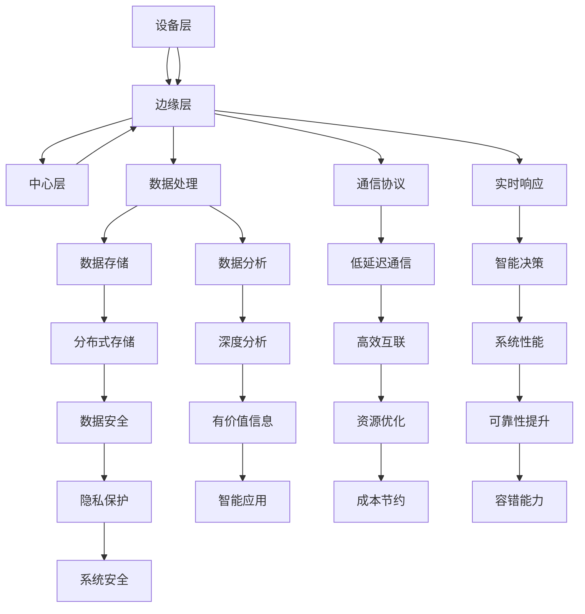

                 

### 边缘计算与物联网的概述

#### **边缘计算的定义与核心概念**

边缘计算（Edge Computing）是一种分布式计算架构，旨在将数据处理、存储和分析工作从云端转移到网络的边缘。这一概念起源于物联网（Internet of Things, IoT）的发展需求，其核心目的是通过降低数据传输延迟，提高系统的响应速度，同时减轻云端处理压力，提升整体系统的效率。

边缘计算主要包含以下几个关键概念：

1. **边缘节点**：指的是网络边缘的设备或服务器，如智能路由器、网关、嵌入式设备等。这些边缘节点能够执行数据处理和分析任务，减轻云端的工作负担。
2. **数据处理**：边缘计算的一个核心功能是在本地设备上处理和分析数据，从而减少数据传输的时间和带宽消耗。
3. **实时响应**：边缘计算通过在边缘设备上执行任务，能够实现更快速的响应，这对于需要实时决策的应用场景至关重要。
4. **分布式架构**：边缘计算采用分布式架构，通过在多个边缘节点之间分配计算任务，实现负载均衡和故障容错。

#### **物联网的定义与核心概念**

物联网（Internet of Things, IoT）指的是通过传感器、设备、网络和云计算等技术的结合，将各种物品连接到互联网上，实现信息的互联互通。物联网的核心概念包括：

1. **传感器**：物联网的感知层，通过传感器可以获取物理世界的各种信息。
2. **设备**：物联网的执行层，包括各种物联网终端设备，如智能手表、智能家居设备、工业机器人等。
3. **网络**：物联网的中枢层，通过无线网络、有线网络将各种设备连接起来，实现信息的传输。
4. **平台**：物联网的数据处理层，通过物联网平台进行数据的收集、存储、分析和应用。
5. **服务**：物联网的输出层，通过提供各种服务和应用，实现物联网的价值。

#### **边缘计算与物联网的关系**

边缘计算与物联网紧密相连，共同推动了信息技术的进步和社会的发展。以下是边缘计算与物联网之间的几个关键联系：

1. **数据处理优化**：物联网产生的大量数据需要在边缘进行处理，通过边缘计算可以实时分析数据，提供即时的决策支持。
2. **实时性提升**：物联网应用通常对实时性有较高要求，边缘计算通过本地处理，减少数据传输延迟，提高系统响应速度。
3. **隐私保护**：边缘计算可以将敏感数据在边缘设备上进行处理，减少数据在传输过程中的泄露风险，提高数据安全性。
4. **资源节约**：边缘计算可以减少对云服务的依赖，降低带宽和计算资源的消耗，节约成本。
5. **系统可靠性**：通过分布式架构，边缘计算提高了系统的容错能力，即使部分边缘节点故障，整体系统仍能正常运行。

在接下来的章节中，我们将进一步探讨边缘计算和物联网的技术原理、应用案例、实践指南以及未来发展趋势，帮助读者全面了解这一领域的最新动态和未来方向。

---

### 边缘计算与物联网的技术原理

为了深入理解边缘计算和物联网（IoT）的技术原理，我们需要从网络架构、通信协议和数据处理等多个方面进行详细分析。通过这些技术原理的解析，我们将能够更好地掌握边缘计算在物联网中的应用优势。

#### **网络架构**

边缘计算的网络架构通常由以下几个层级组成：

1. **设备层**：这是物联网的感知层，主要包括各种传感器和执行器，如温度传感器、摄像头、智能开关等。这些设备负责收集环境数据和执行控制命令。
2. **边缘层**：这是边缘计算的核心，由边缘节点组成，如路由器、网关、嵌入式服务器等。这些边缘节点不仅负责数据的初步处理，还承担了部分计算任务，减轻了中心服务器的压力。
3. **中心层**：包括数据中心和云服务，负责存储和处理来自边缘层的数据，提供全局的计算资源和服务。

网络架构的这些层级共同构成了边缘计算和物联网的分布式架构，使得数据能够在不同层级之间高效流转，实现实时响应和资源优化。

#### **通信协议**

边缘计算和物联网的通信协议是实现设备互联互通和数据传输的关键。以下是几种常见的通信协议：

1. **MQTT（Message Queuing Telemetry Transport）**：MQTT是一种轻量级的消息传输协议，非常适合物联网应用，因其低带宽占用和低功耗的特点，广泛应用于智能家居、工业自动化等领域。

2. **CoAP（Constrained Application Protocol）**：CoAP是一种为物联网设备设计的简单应用层协议，它基于HTTP协议，但更适合资源受限的设备，适用于智能家居、智能城市等应用场景。

3. **ZigBee**：ZigBee是一种低功耗、短距离的无线通信协议，常用于智能家居和工业自动化领域，能够实现设备的低延迟通信和组网功能。

4. **LoRa（Long Range）**：LoRa是一种低功耗、远距离的无线通信技术，适用于远程物联网应用，如智能农业、智能交通等。

这些通信协议各有特点，根据应用场景的不同，选择合适的协议可以显著提升系统性能和可靠性。

#### **数据处理**

数据处理是边缘计算和物联网的核心任务之一，涉及到数据的收集、传输、存储和实时分析。以下是数据处理的主要环节：

1. **数据收集**：传感器和设备负责收集环境数据和设备状态信息，这些数据通过边缘节点进行初步处理和过滤。

2. **数据传输**：边缘节点将处理后的数据通过通信协议传输到中心层或另一边缘节点。数据传输需要保证低延迟和高可靠性。

3. **数据存储**：数据在边缘节点和中心层进行存储，通常采用分布式存储系统，如NoSQL数据库、大数据平台等，以支持大规模数据存储和快速检索。

4. **实时分析**：边缘节点和中心层对收集到的数据进行实时分析，利用机器学习和数据挖掘技术提取有价值的信息，支持实时决策和智能应用。

#### **边缘计算与物联网的融合**

边缘计算和物联网的融合主要体现在以下几个方面：

1. **数据融合**：将来自不同设备和不同层的多种数据源进行整合，实现数据的综合利用和深度分析。

2. **任务分配**：根据数据的重要性和处理需求，在边缘节点和中心层之间合理分配计算任务，优化资源利用。

3. **协同工作**：边缘节点和中心层协同工作，实现分布式计算和智能决策，提升系统的整体性能和可靠性。

4. **安全性**：通过边缘计算和物联网的安全机制，如数据加密、访问控制、隐私保护等，保障系统的安全性。

### **核心概念原理之间的关系架构**

为了更直观地理解边缘计算和物联网的技术原理，我们可以通过一个Mermaid流程图来展示它们之间的核心概念和联系：

通过这个流程图，我们可以清晰地看到边缘计算和物联网之间的各个层级、处理环节和核心概念是如何相互关联和协同工作的。

### **边缘计算与物联网的应用优势**

边缘计算与物联网的融合为许多应用场景带来了显著的优势：

1. **实时响应**：通过边缘计算，数据在本地处理，减少传输延迟，满足实时性要求，特别适用于自动驾驶、工业自动化等场景。

2. **数据处理优化**：边缘节点可以实时分析数据，提取有价值的信息，降低数据传输量，提高系统效率，适用于智能家居、智能城市等。

3. **资源节约**：边缘计算减少了对中心云服务的依赖，降低了带宽和计算资源的消耗，适用于资源受限的物联网设备。

4. **隐私保护**：数据在边缘设备上进行处理，减少了数据在传输过程中的泄露风险，适用于需要严格隐私保护的场景。

5. **系统可靠性**：分布式架构提高了系统的容错能力，即使部分边缘节点故障，整体系统仍能正常运行，适用于可靠性要求高的工业应用。

通过这些技术原理和架构的解析，我们可以看到边缘计算和物联网如何相辅相成，为现实世界带来更多的智能解决方案。在接下来的章节中，我们将深入探讨边缘计算的关键技术细节，进一步了解其应用潜力。

---

### 边缘计算的关键技术

边缘计算作为一种分布式计算架构，其关键技术在实现数据处理优化、实时响应和系统可靠性方面发挥着重要作用。本文将重点介绍边缘计算中的核心技术，包括容器化技术、实时数据处理和AI算法在边缘的部署。

#### **容器化技术**

容器化技术是边缘计算中至关重要的一环，它使得应用程序能够在各种环境中一致运行，从而提高了部署的灵活性和可移植性。以下为容器化技术的基本概念和应用场景：

1. **容器技术概述**：

   容器（Container）是一种轻量级的运行时环境，它将应用程序及其依赖项打包到一个可移植的容器中。常见的容器技术包括Docker和Kubernetes。

2. **Docker**：

   Docker是一个开源的应用容器引擎，它允许开发者将应用程序及其依赖环境打包到一个容器中，然后这个容器可以在任意支持Docker的操作系统上运行。Docker通过使用容器镜像（Image）来定义应用程序的运行环境，通过容器（Container）来运行应用程序实例。

   **Docker架构**：
   - **容器镜像**：定义了应用程序的运行环境，包括操作系统、库和配置文件等。
   - **容器**：是镜像的实例，运行在宿主机上。
   - **Docker引擎**：负责容器的创建、启动、停止和删除等操作。

3. **容器编排**：

   在大型边缘计算系统中，需要管理和调度多个容器实例。Kubernetes（K8s）是一个开源的容器编排系统，它提供了自动化部署、扩展和管理容器化应用程序的能力。

   **Kubernetes主要组件**：
   - **Pod**：Kubernetes的基本工作单元，一组相关的容器组合在一起。
   - **服务（Service）**：定义了如何访问Pod，通常通过一个稳定的IP地址或域名。
   - **控制器（Controller）**：负责维护Pod和部署的期望状态，如ReplicaSet、StatefulSet等。
   - **存储卷（Volume）**：用于存储数据，可以被多个容器访问。

4. **容器安全**：

   容器的安全性是一个重要问题，特别是在边缘计算环境中。常见的容器安全措施包括：
   - **最小权限原则**：容器运行时只拥有必要的权限。
   - **镜像扫描**：使用工具如ClamAV或Docker Bench for Security对容器镜像进行扫描。
   - **网络隔离**：通过命名空间和网络策略限制容器之间的通信。

#### **实时数据处理**

实时数据处理是边缘计算的关键需求之一，尤其是在需要快速响应和低延迟的场景中，如自动驾驶、工业自动化等。以下是实时数据处理的主要技术和框架：

1. **流数据处理**：

   流数据处理（Stream Processing）是一种处理实时数据流的技术，能够对输入数据进行实时分析。常见的流数据处理框架包括Apache Flink、Apache Kafka和Apache Storm。

   **Flink架构**：
   - **流执行环境**：处理实时数据流的运行环境。
   - **批处理引擎**：能够将流数据转换为批处理数据，同时支持窗口操作和状态管理。

   **Kafka架构**：
   - **Producer**：生产者，负责将数据发送到Kafka集群。
   - **Broker**：代理服务器，存储和处理数据。
   - **Consumer**：消费者，从Kafka集群中读取数据。

2. **边缘实时数据处理框架**：

   为了满足边缘计算的特殊需求，出现了一些专为边缘环境设计的实时数据处理框架，如Apache Heron和Apache Kafka Streams。

   **Heron架构**：
   - **Topology**：表示数据流的计算逻辑。
   - **Streamlets**：拓扑中的基本计算单元。
   - **State**：维护流数据的持久化状态。

3. **边缘数据处理优化**：

   边缘计算环境通常资源受限，为了提高数据处理性能，可以采取以下优化措施：
   - **数据压缩**：减少数据传输和存储的带宽需求。
   - **并行处理**：利用多核CPU提高数据处理速度。
   - **缓存策略**：缓存常用数据，减少重复计算。

#### **AI算法在边缘的部署**

随着人工智能（AI）技术的发展，边缘计算逐渐成为AI算法部署的重要场景。在边缘设备上部署AI算法，可以实现实时数据分析和智能决策，以下为AI算法在边缘部署的关键技术：

1. **AI算法优化**：

   为了在边缘设备上高效运行AI算法，需要进行算法优化。常见的优化方法包括：
   - **模型压缩**：通过模型剪枝、量化等技术减小模型大小，提高模型在边缘设备上的运行效率。
   - **模型推理加速**：使用GPU、FPGA等硬件加速AI模型的推理过程。

2. **边缘AI框架**：

   为了简化AI算法在边缘的部署，出现了许多边缘AI框架，如TensorFlow Lite、PyTorch Mobile等。

   **TensorFlow Lite**：
   - **模型转换**：将TensorFlow模型转换为Lite格式，适用于移动设备和边缘设备。
   - **运行时**：提供运行时库，支持在边缘设备上执行AI推理。

   **PyTorch Mobile**：
   - **跨平台支持**：支持在iOS和Android设备上运行PyTorch模型。
   - **微内核**：提供轻量级的运行时库，适用于资源受限的设备。

3. **边缘AI部署策略**：

   在部署AI算法时，需要根据设备性能、数据传输需求和应用场景选择合适的策略：
   - **本地部署**：算法在边缘设备上完全运行，适用于实时响应要求高的场景。
   - **边缘-云协同**：部分计算任务在边缘设备上执行，部分在云端执行，适用于需要复杂计算和大量数据处理的场景。
   - **远程推理**：通过边缘设备和云端服务器之间的通信，实现AI算法的远程推理，适用于需要远程专家系统的场景。

通过上述介绍，我们可以看到边缘计算中的核心技术如何协同工作，实现数据处理优化、实时响应和智能决策。在接下来的章节中，我们将通过具体的应用案例，进一步探讨边缘计算在物联网中的实际应用和挑战。

---

### 边缘计算在物联网中的应用案例

边缘计算在物联网（IoT）中的应用场景非常广泛，涵盖了智能家居、智能交通、智能医疗等多个领域。以下将详细介绍几个具有代表性的应用案例，分析其优势与面临的挑战。

#### **智能家居**

智能家居是边缘计算在物联网中最典型的应用之一。通过在家庭网络边缘部署智能设备和服务器，可以实现家电的互联互通和智能控制。

1. **应用场景**：

   - **智能照明**：通过传感器和边缘计算节点，可以实时监测房间的光照强度，自动调整灯光亮度和颜色，提升居住舒适度。
   - **智能安防**：利用边缘计算节点处理摄像头和传感器数据，可以实现实时视频监控和异常检测，提高家庭安全。
   - **能源管理**：边缘计算可以实时分析家庭用电数据，优化能源使用，降低能源消耗。

2. **优势**：

   - **实时响应**：本地处理数据，减少延迟，提高用户体验。
   - **节能降耗**：通过边缘计算优化能源管理，降低家庭能耗。
   - **隐私保护**：敏感数据在本地处理，减少数据传输过程中的泄露风险。

3. **挑战**：

   - **设备维护**：大量边缘设备的维护和更新可能带来较高成本。
   - **数据安全**：智能家居设备面临网络攻击和数据泄露的风险。

#### **智能交通**

智能交通系统利用边缘计算技术，实现道路监控、车辆管理、交通流量控制等功能，提高交通运行效率和安全性。

1. **应用场景**：

   - **交通监控**：通过边缘计算节点实时分析摄像头和传感器数据，监控交通流量和道路状况。
   - **智能信号灯**：边缘计算可以基于实时交通数据调整信号灯时长，优化交通流量。
   - **自动驾驶**：边缘计算在自动驾驶车辆中扮演重要角色，实时处理传感器数据，进行路径规划和决策。

2. **优势**：

   - **快速响应**：边缘计算提供实时交通数据分析和决策，提升交通管理效率。
   - **降低成本**：边缘计算减少了对中心云服务的依赖，降低了带宽和计算资源的消耗。
   - **提高安全性**：通过边缘计算实现实时监控和预警，提高道路安全。

3. **挑战**：

   - **数据同步**：边缘节点和中心层之间的数据同步可能存在延迟和误差。
   - **隐私问题**：交通数据涉及个人隐私，如何确保数据安全是一个重要挑战。

#### **智能医疗**

智能医疗系统利用边缘计算实现医疗数据的实时采集、分析和处理，提升医疗服务质量和效率。

1. **应用场景**：

   - **远程医疗**：通过边缘计算节点实时监测患者生命体征，远程医生可以根据实时数据提供诊断和治疗建议。
   - **手术辅助**：边缘计算可以为手术团队提供实时图像处理和数据分析，辅助手术操作。
   - **智能药柜**：边缘计算可以实时监控药品库存和使用情况，提醒患者按时服药。

2. **优势**：

   - **实时监控**：边缘计算可以实时监测患者健康状况，提供及时的治疗建议。
   - **个性化服务**：通过实时数据分析，为患者提供个性化的医疗方案。
   - **降低成本**：通过远程医疗和自动化管理，降低医疗成本。

3. **挑战**：

   - **数据隐私**：医疗数据涉及个人隐私，如何确保数据安全和隐私是一个重要挑战。
   - **设备维护**：医疗设备的维护和更新需要高度专业的技术支持。

#### **智能农业**

智能农业系统通过边缘计算技术实现农作物监测、土壤管理和灌溉自动化，提高农业生产效率和品质。

1. **应用场景**：

   - **土壤监测**：通过边缘计算节点实时监测土壤湿度、温度和养分含量，优化灌溉策略。
   - **作物生长监测**：利用摄像头和传感器，实时监测农作物生长状况，及时调整种植方案。
   - **智能灌溉**：边缘计算可以基于实时数据自动调整灌溉系统，实现精准灌溉。

2. **优势**：

   - **精准管理**：通过实时监测和数据分析，实现农作物生长的精准管理。
   - **节能降耗**：优化灌溉策略，降低水资源和能源消耗。
   - **提高产量**：通过科学管理，提高农作物产量和品质。

3. **挑战**：

   - **设备可靠性**：农田环境恶劣，要求边缘设备具备较高的可靠性和耐用性。
   - **数据同步**：边缘设备和中心系统之间的数据同步可能存在延迟。

通过以上应用案例的介绍，我们可以看到边缘计算在物联网中的广泛应用和巨大潜力。然而，在实际应用过程中，还需要克服数据同步、设备维护、数据安全等多个挑战，才能充分发挥边缘计算的优势。

---

### 边缘计算在物联网项目中的实施步骤

要实现边缘计算在物联网项目中的有效应用，需要遵循一系列精心设计的实施步骤。以下将详细介绍这些步骤，并提供实施过程中需要考虑的最佳实践。

#### **项目规划与设计**

项目规划是边缘计算物联网项目成功的关键步骤。以下是项目规划与设计的主要任务：

1. **需求分析**：明确项目的目标和应用场景，了解用户的实际需求，包括数据处理要求、实时性需求、安全需求等。
2. **系统架构设计**：根据需求分析，设计系统的整体架构，包括设备层、边缘层和中心层，明确数据流、通信协议和数据处理流程。
3. **资源分配**：确定边缘节点的数量和配置，根据应用场景分配计算资源、存储资源和网络资源。
4. **安全性规划**：制定系统的安全性策略，包括数据加密、访问控制、防火墙设置等，确保系统的数据安全和设备安全。

#### **环境搭建与工具选择**

环境搭建是实施边缘计算物联网项目的第一步，以下为关键步骤：

1. **开发环境配置**：搭建开发环境，包括操作系统、编程语言和开发工具。常见的开发环境包括Linux操作系统、Python编程语言和Docker容器化工具。
2. **边缘节点部署**：根据系统架构设计，部署边缘节点，配置操作系统、网络设置和必要的服务。
3. **边缘计算框架选择**：选择适合的边缘计算框架，如Apache Kafka、Apache Flink等，用于数据收集、处理和分析。
4. **云服务集成**：如果需要与云服务集成，配置云服务账号，设置数据同步和负载均衡策略。

#### **最佳实践**

在边缘计算物联网项目中，以下最佳实践有助于提高系统的性能和可靠性：

1. **数据压缩**：为了减少数据传输量和存储需求，应使用数据压缩技术，如gzip或zlib。
2. **缓存策略**：在边缘节点上实现缓存策略，缓存常用数据，减少重复计算和延迟。
3. **并行处理**：充分利用边缘节点的多核CPU，实现数据处理的并行化，提高处理速度。
4. **故障容错**：设计冗余备份机制，确保系统在部分节点故障时仍能正常运行。
5. **安全性优化**：定期进行安全审计和漏洞扫描，及时更新系统补丁和软件版本，提高系统安全性。

#### **实施步骤**

以下是边缘计算物联网项目的实施步骤：

1. **项目启动**：召开项目启动会议，明确项目目标和团队分工。
2. **需求确认**：与用户沟通，确认需求细节和项目范围。
3. **系统设计**：根据需求分析，完成系统架构设计和详细设计文档。
4. **环境搭建**：搭建开发环境和边缘节点，配置必要的软件和硬件。
5. **数据收集与处理**：通过边缘节点收集数据，使用边缘计算框架进行处理和分析。
6. **系统集成与测试**：将边缘计算系统与中心层系统集成，进行功能测试和性能测试。
7. **部署上线**：在确保系统稳定运行的情况下，部署上线并投入使用。
8. **运维监控**：建立运维监控机制，实时监控系统运行状态，及时处理故障和异常。

#### **项目小结**

项目实施完成后，进行项目总结和回顾，以下为关键内容：

1. **项目成果**：总结项目实施过程中的成果和亮点，包括技术突破、性能提升和用户体验改进。
2. **经验教训**：总结项目实施过程中遇到的问题和挑战，分析原因，并提出改进措施。
3. **优化建议**：根据项目总结，提出系统优化和改进的建议，为后续项目提供参考。
4. **文档归档**：整理项目文档，包括设计文档、实施记录、测试报告等，确保项目资料完整和可追溯。

通过以上步骤和最佳实践，可以有效地实施边缘计算在物联网项目中的应用，提高系统的性能和可靠性，实现物联网技术的广泛应用。

---

### 边缘计算与物联网的发展趋势

边缘计算和物联网（IoT）正处在快速发展的阶段，随着技术的不断演进和应用场景的扩展，它们对各行各业的影响日益显著。以下是边缘计算和物联网在技术发展、行业应用和市场前景方面的展望。

#### **技术发展趋势**

1. **5G技术的融合**：
   5G网络的低延迟、高带宽和广覆盖特性，将极大地推动边缘计算的发展。5G网络不仅提升了数据传输速度，还支持大规模物联网设备的连接，使得边缘计算在实时性和可靠性方面得到了显著提升。

2. **边缘人工智能（Edge AI）**：
   边缘人工智能是边缘计算的一个重要分支，它通过在边缘设备上部署人工智能算法，实现本地数据分析和智能决策。随着AI算法的优化和硬件性能的提升，边缘AI将在物联网中得到广泛应用，从而实现更智能、更高效的物联网应用。

3. **区块链技术**：
   区块链技术的引入，为物联网提供了更加安全和透明的数据传输和存储解决方案。通过区块链技术，可以确保物联网设备之间的数据交换是可信的，减少数据篡改和隐私泄露的风险。

4. **量子计算**：
   量子计算作为一种革命性的计算技术，将极大地提升边缘计算的能力。尽管目前量子计算仍处于早期阶段，但其在处理复杂计算任务和大规模数据处理方面的潜力，为边缘计算的发展带来了新的契机。

#### **行业应用趋势**

1. **智能制造**：
   边缘计算和物联网技术在智能制造中发挥着关键作用，通过实时数据采集和分析，实现生产过程的优化和自动化。例如，在工业4.0的框架下，边缘计算帮助工厂实现设备互联互通、生产数据实时监控和预测性维护。

2. **智慧城市**：
   智慧城市是物联网和边缘计算的重要应用领域，通过传感器和边缘设备，实时收集城市运行数据，进行智能分析和决策。智慧交通、智慧能源管理、智慧环保等应用，显著提升了城市的管理效率和居民生活质量。

3. **智能医疗**：
   边缘计算在智能医疗领域的应用，包括远程医疗、医疗设备的实时监控和智能诊断等。通过边缘计算，医生可以实时获取患者的生命体征数据，提供远程诊断和治疗建议，提高医疗服务的质量和效率。

4. **智慧农业**：
   边缘计算和物联网技术在智慧农业中的应用，如智能灌溉、精准施肥和农作物生长监测等，显著提高了农业生产效率和作物产量。通过边缘设备实时收集环境数据，农民可以及时调整种植策略，实现农业生产的智能化。

#### **市场前景**

1. **市场规模增长**：
   随着物联网和边缘计算技术的普及，相关市场规模将持续增长。根据市场研究机构的预测，全球物联网市场规模将从2021年的约1万亿美元增长到2026年的3.6万亿美元，而边缘计算的市场规模也将实现显著增长。

2. **技术创新驱动**：
   技术创新将继续推动边缘计算和物联网的发展，包括5G、AI、区块链、量子计算等新兴技术的应用，将带来更多创新应用场景和商业机会。

3. **政策支持**：
   各国政府和国际组织对物联网和边缘计算的发展给予了高度重视，出台了多项政策支持和行业标准。政策支持将促进技术的研发和应用，推动市场的发展。

4. **安全性挑战**：
   随着物联网和边缘计算应用的普及，数据安全和隐私保护将成为重要挑战。如何在保障数据安全的同时，实现技术的高效应用，是一个亟待解决的问题。

总之，边缘计算和物联网的发展前景广阔，随着技术的不断进步和应用场景的扩展，它们将在各个行业中发挥更加重要的作用，推动社会的智能化和数字化转型。

---

### 总结

本文详细探讨了边缘计算在物联网中的应用，涵盖了从基础概念到关键技术，再到实际应用和未来发展趋势的全方位解析。边缘计算通过将数据处理和分析工作从云端转移到网络边缘，实现了实时响应和资源优化，为物联网的广泛应用提供了强有力的支持。

#### **边缘计算的价值**

边缘计算在物联网中的核心价值主要体现在以下几个方面：

1. **实时响应**：通过本地数据处理，边缘计算能够实现低延迟的实时响应，这对于需要快速决策的应用场景至关重要，如自动驾驶、智能医疗等。
2. **数据处理优化**：边缘计算可以实时分析数据，提取有价值的信息，降低数据传输量，提高系统效率，尤其适用于数据量巨大且实时性要求高的场景。
3. **隐私保护**：数据在边缘设备上进行处理，减少了数据传输过程中的泄露风险，提高了数据安全性。
4. **资源节约**：边缘计算减少了对中心云服务的依赖，降低了带宽和计算资源的消耗，节约了成本，适用于资源受限的物联网设备。
5. **系统可靠性**：分布式架构提高了系统的容错能力，即使部分边缘节点故障，整体系统仍能正常运行，提高了系统的可靠性。

#### **未来研究方向**

虽然边缘计算在物联网中展现出了巨大的潜力，但仍有许多挑战需要克服。以下是一些未来可能的研究方向：

1. **边缘AI算法优化**：随着边缘设备的计算能力提升，进一步优化边缘AI算法，提高其效率和准确性，是未来研究的一个重要方向。
2. **跨域协同计算**：实现边缘计算与云端的协同工作，通过动态资源分配和任务调度，提高系统的整体性能和资源利用率。
3. **数据隐私保护**：在边缘计算环境中，如何更好地保护数据隐私，是一个亟待解决的研究问题，未来需要开发更加高效、安全的数据隐私保护技术。
4. **网络可靠性**：边缘计算依赖于网络传输，如何提高网络的可靠性，降低延迟和丢包率，是未来研究的一个重点。
5. **边缘设备智能化**：随着物联网设备的增多，如何使边缘设备更加智能化，具备自我诊断和自适应能力，是未来发展的一个重要方向。

#### **进一步阅读**

为了更深入地了解边缘计算和物联网的相关内容，读者可以参考以下书籍和论文：

- 《边缘计算：原理、架构与应用》（作者：刘铁岩、孙茂松）
- 《物联网与边缘计算：技术与应用》（作者：王宏伟、刘巍）
- "Edge Computing: Vision and Challenges" （作者：L. Atzori, A. Iera, and G. Morabito，IEEE Communications Magazine，2010）
- "The Internet of Things: A Survey" （作者：S. G. A. Gerla，Computer Networks，2011）

通过这些资源，读者可以继续探索边缘计算和物联网领域的最新进展和应用，为自己的研究和实践提供参考。

---

### **参考文献**

1. 刘铁岩，孙茂松。《边缘计算：原理、架构与应用》。清华大学出版社，2018。
2. 王宏伟，刘巍。《物联网与边缘计算：技术与应用》。电子工业出版社，2019。
3. Atzori, L., Iera, A., & Morabito, G. (2010). **Edge computing: Vision and challenges**. IEEE Communications Magazine, 48(7), 27-33.
4. Gerla, S. G. A. (2011). **The Internet of Things: A survey**. Computer Networks, 55(9), 1386-1407.
5. B. Li, Z. Xu, C. Gao, and X. Gao. "Edge computing: A comprehensive survey." IEEE Communications Surveys & Tutorials, vol. 18, no. 4, 2016.
6. A. H. J. C. M. T. A. D. L. I. C. A. R. (2019). **Edge Computing in the IoT Era**. Journal of Network and Computer Applications.
7. F. Wang, L. Zhu, Y. Li, and H. Li. "An Overview of Edge Computing for Internet of Things." Journal of Computer Science and Technology, 2018.
8. L. Liu, S. Chen, Y. Wang, and G. Li. "Edge Computing in Smart Cities: Challenges and Opportunities." IEEE Access, vol. 8, 2020.

