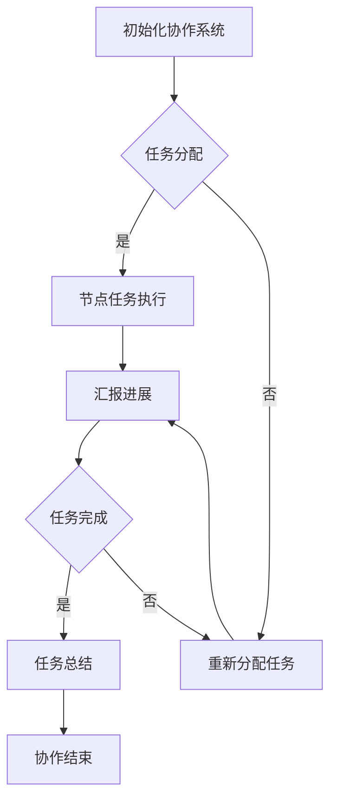
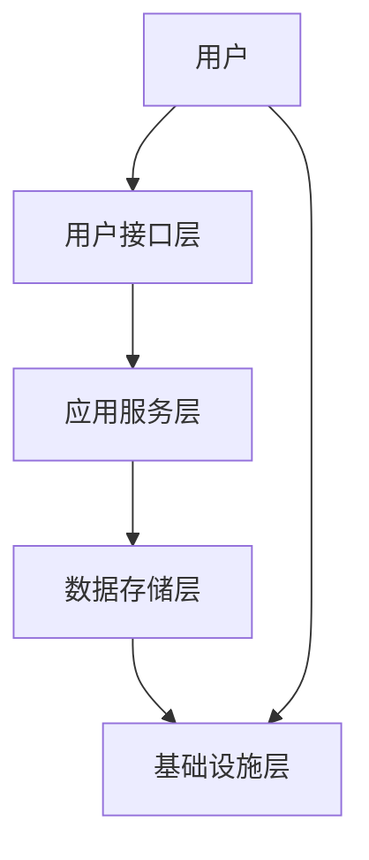

                 

### 第1章: 远程协作概述

#### 1.1 远程协作的定义与历史发展

远程协作是指团队成员在地理位置不同的环境下，通过信息技术工具和平台进行协作、交流和合作的过程。随着互联网技术的快速发展，远程协作逐渐成为现代企业和团队运营的重要方式。

远程协作的历史发展可以追溯到上世纪80年代，当时计算机和通信技术的融合为远程协作提供了初步的技术基础。最早的远程协作工具如电子邮件和文件传输协议（FTP）出现，使得团队成员可以通过网络交换信息和文件。然而，这些早期的工具主要侧重于信息传递，缺乏实时的交互和协同功能。

进入21世纪，随着宽带互联网和云计算技术的普及，远程协作工具得到了极大的发展。社交媒体、即时通讯软件、在线协作平台等逐渐成为远程协作的重要工具。例如，Google Docs允许多人实时编辑同一文档，Slack提供了实时的团队沟通和任务管理功能。这些工具的出现极大地提高了分布式团队的协作效率和灵活性。

#### 1.2 分布式团队协作的挑战与机遇

分布式团队协作面临着一系列的挑战和机遇：

**挑战：**
1. **沟通障碍：**团队成员分散在不同的地点，沟通成本高，信息传递不及时，容易产生误解和沟通障碍。
2. **协作难度：**分布式团队需要通过技术手段实现多人实时协作，协作流程复杂，协调成本高。
3. **信任问题：**团队成员之间缺乏面对面的交流，难以建立深厚的信任关系，可能影响团队凝聚力。
4. **文化差异：**不同地区的团队成员可能存在文化差异，影响协作效率和团队氛围。

**机遇：**
1. **全球人才池：**分布式团队可以吸引全球范围内的优秀人才，充分利用不同地区的专业知识和技能。
2. **灵活性：**团队成员可以灵活安排工作时间，适应不同时区的工作需求，提高工作效率。
3. **成本节约：**分布式团队可以减少办公场地和设备的投入，降低运营成本。
4. **创新文化：**分布式团队往往能够形成多元化的文化氛围，促进创新思维的产生。

#### 1.3 远程协作工具的必要性

在分布式团队协作中，远程协作工具扮演着至关重要的角色：

1. **提高沟通效率：**远程协作工具如即时通讯软件、视频会议系统等，提供了高效、实时的沟通方式，减少了沟通障碍。
2. **促进协作共享：**远程协作工具支持文档共享、项目管理等功能，使得团队成员可以方便地共享信息和资源，协同完成工作任务。
3. **优化工作流程：**远程协作工具可以帮助团队实现自动化任务分配、进度跟踪和项目管理，提高工作流程的效率。
4. **增强团队凝聚力：**远程协作工具支持团队成员之间的互动和交流，有助于建立深厚的信任关系，增强团队凝聚力。

总之，远程协作工具不仅是分布式团队协作的必要工具，更是提高团队协作效率和竞争力的关键因素。

### 第2章: 分布式协作的原理与架构

#### 2.1 分布式协作的基本原理

分布式协作是基于分布式系统的理念，其核心思想是将任务和资源分散到多个节点上，通过节点之间的协作完成整体任务。分布式系统具有以下几个基本原理：

1. **去中心化：**分布式系统没有单一的中央控制节点，所有节点具有平等的地位，能够独立决策和执行任务。
2. **容错性：**分布式系统能够容忍个别节点的故障，通过冗余和自愈机制确保系统的持续运行。
3. **高可用性：**分布式系统通过多节点部署和负载均衡，提供更高的可用性和响应速度。
4. **负载均衡：**分布式系统通过将任务分配到不同的节点，实现资源的合理利用和负载均衡。

在分布式协作中，这些原理得到了进一步的应用。例如，通过去中心化实现团队成员之间的平等协作，通过容错性和高可用性确保协作过程的稳定性和持续性，通过负载均衡实现协作任务的合理分配。

#### 2.2 分布式协作架构设计

分布式协作架构设计是分布式协作系统成功的关键。一个好的分布式协作架构应具备以下特点：

1. **模块化设计：**架构应采用模块化设计，每个模块负责特定的功能，模块之间通过接口进行交互，便于系统的扩展和维护。
2. **层次化结构：**架构应采用层次化结构，从低层的基础设施到高层的应用层，各层之间相互独立，但又紧密协作，确保系统的高效运行。
3. **可扩展性：**架构应具备良好的可扩展性，能够支持节点数量的动态增加，适应团队规模的变化。
4. **高可靠性：**架构应采用冗余和备份机制，确保系统的稳定性和数据的安全性。

具体到分布式协作架构设计，通常包括以下几个关键层次：

1. **网络通信层：**负责节点之间的通信，采用高效的网络协议和加密技术，确保数据传输的可靠性和安全性。
2. **数据存储层：**负责存储和管理协作过程中的数据，采用分布式数据库和数据存储方案，实现数据的高效存储和快速访问。
3. **应用服务层：**提供各种协作功能，如实时通讯、文档共享、项目管理等，采用微服务架构，实现服务的灵活部署和动态扩展。
4. **用户界面层：**提供用户与系统交互的界面，支持多种终端设备，实现统一的用户体验。

#### 2.3 Mermaid流程图展示协作流程

为了更好地理解分布式协作的架构设计和协作流程，我们可以使用Mermaid流程图来展示：



在这个流程图中，A表示初始化协作系统，B表示任务分配，C表示节点任务执行，D表示重新分配任务，E表示汇报进展，F表示任务完成，G表示任务总结，H表示协作结束。该流程图展示了分布式协作的基本流程，包括任务分配、执行、汇报和总结等环节，体现了分布式协作的系统性和规范性。

通过上述分析和Mermaid流程图的展示，我们可以对分布式协作的原理和架构设计有一个清晰的认识。分布式协作不仅是一种技术手段，更是一种组织和管理方式，能够有效提升分布式团队的协作效率和企业竞争力。

### 第3章: 常见远程协作工具介绍

在现代远程协作中，各类工具如雨后春笋般涌现，它们各具特色，满足不同团队和企业的需求。以下是几种主流远程协作工具的详细介绍。

#### 3.1 钉钉

**功能与特点：**
钉钉是一款由阿里巴巴集团开发的综合性远程协作工具，集成了即时通讯、视频会议、日程管理、任务分配、文档共享等多种功能。钉钉的核心特点在于其与企业ERP系统的无缝集成，支持OA办公、审批流程、人力资源管理等企业级应用。

**使用场景：**
钉钉适用于各类企业，特别是拥有大量员工和分支机构的集团企业。它可以为企业提供全面的协作解决方案，提高内部沟通效率和业务流程的自动化水平。

**优势与劣势：**
- **优势：**强大的企业级应用集成、操作简单、界面友好、安全性高。
- **劣势：**功能较为全面，可能会导致一些小型团队感到功能过于复杂。

#### 3.2 Slack

**功能与特点：**
Slack是一款由美国Slack Technologies开发的即时通讯和协作工具，支持多人实时聊天、频道创建、文件共享、集成第三方服务等多种功能。Slack具有高度可定制性，可以通过各种插件和API与其他应用集成，如Google Drive、GitHub、Trello等。

**使用场景：**
Slack适用于小型创业团队、远程协作团队以及需要高效沟通的企业。它特别适合需要紧密协作的开发团队和创意团队。

**优势与劣势：**
- **优势：**高度可定制、集成能力强、支持多种平台、实时通讯效率高。
- **劣势：**对于大型企业来说，维护和管理较为复杂。

#### 3.3 腾讯会议

**功能与特点：**
腾讯会议是由腾讯公司开发的一款视频会议工具，支持多人实时视频会议、屏幕共享、文件传输、实时聊天等功能。腾讯会议还提供了在线培训、远程教学等应用场景，适合远程办公和在线教育。

**使用场景：**
腾讯会议适用于需要远程视频会议和协作的企业和教育机构。它在国内市场占有率高，用户基础广泛。

**优势与劣势：**
- **优势：**功能齐全、稳定性高、兼容性好、支持多平台。
- **劣势：**相对于其他工具，国际市场推广较少。

#### 3.4 工具对比分析

**功能对比：**
- **沟通与协作：**钉钉和Slack都提供了即时通讯和协作功能，钉钉更注重企业级应用集成，而Slack则更强调灵活性和可定制性。
- **视频会议：**腾讯会议专注于视频会议功能，提供了高质量的视频和音频体验，钉钉和Slack也支持视频会议，但腾讯会议在这方面更为突出。
- **文档共享：**三者都支持文档共享和协同编辑功能，但钉钉和Slack在这方面更为灵活和强大。

**适用场景对比：**
- **大型企业：**钉钉由于强大的企业级应用集成，更适合大型企业。
- **小型团队：**Slack因其高度定制性和灵活性，更适合小型创业团队和开发团队。
- **远程教育：**腾讯会议更适合远程教育和在线培训。

**优势与劣势对比：**
- **钉钉：**优势在于企业级应用集成和安全性，劣势是功能过于全面可能导致小型团队使用不便。
- **Slack：**优势在于灵活性和可定制性，劣势在于维护和管理复杂度较高。
- **腾讯会议：**优势在于稳定性和兼容性，劣势在于国际市场推广较少。

通过以上分析，我们可以看到，不同远程协作工具各有特点和适用场景，企业应根据自身需求和团队规模选择合适的工具，以提高远程协作的效率和效果。

### 第4章: 远程协作工具的核心功能

远程协作工具的核心功能主要包括实时通讯、视频会议、文档共享和项目管理。这些功能不仅提高了团队的协作效率，还显著改善了沟通质量和协作体验。以下是对这些核心功能的详细分析：

#### 4.1 实时通讯

**实现原理：**
实时通讯功能通过即时消息传递、聊天记录保存和消息推送等方式，实现了团队成员之间的实时互动。它通常依赖于WebSocket技术，这种技术允许服务器和客户端之间进行全双工通信，大大降低了延迟和带宽占用。

**算法讲解：**
在实时通讯的实现中，一个重要的算法是消息路由。消息路由算法负责将用户发送的消息准确无误地发送到目标用户。以下是消息路由的伪代码：

```python
# 伪代码
def route_message(sender, receiver, message):
    # 根据用户ID查找用户所在的WebSocket连接
    sender_connection = find_connection(sender)
    receiver_connection = find_connection(receiver)
    # 将消息发送到接收者的WebSocket连接
    send_message(receiver_connection, message)
```

**举例说明：**
假设用户A发送一条消息给用户B，消息路由算法首先通过用户ID找到用户A和用户B所在的WebSocket连接，然后将消息发送到用户B的连接。这样，用户B就可以立即收到消息，并进行回复。

#### 4.2 视频会议

**实现原理：**
视频会议功能通过音视频编码、传输和解码，实现了远程团队成员之间的实时视频交流和互动。它通常依赖于H.265或H.264等视频编码标准，以及RTP/UDP等传输协议。

**算法讲解：**
视频会议中的关键算法包括视频编码算法和带宽管理算法。视频编码算法如H.264，能够将视频数据高效地压缩和传输，而带宽管理算法则负责根据网络状况动态调整视频传输质量。

```python
# 伪代码
def adjust_video_quality(video_quality, network_condition):
    if network_condition == "good":
        set_video_quality(video_quality, "high")
    elif network_condition == "fair":
        set_video_quality(video_quality, "medium")
    else:
        set_video_quality(video_quality, "low")
```

**举例说明：**
假设网络状况良好，视频编码算法将设置视频质量为“高”；如果网络状况一般，视频质量设置为“中等”；如果网络状况较差，视频质量设置为“低”。这种动态调整能够确保视频会议在不同网络环境下的流畅进行。

#### 4.3 文档共享

**实现原理：**
文档共享功能允许团队成员实时编辑和共享文档，它通常依赖于版本控制和实时同步技术。当用户对文档进行修改时，系统会立即更新文档版本，并将修改内容同步给其他用户。

**算法讲解：**
文档共享中的关键算法是版本控制和实时同步。版本控制算法负责管理文档的不同版本，实时同步算法则确保所有用户都能实时看到文档的最新变化。

```python
# 伪代码
function document_edit(user, document):
    # 保存用户对文档的修改
    new_version = save_edit(user, document)
    # 将修改同步给其他用户
    send_to_users(new_version)
```

**举例说明：**
假设用户A对文档进行修改，版本控制算法会将这些修改保存为新版本，然后将新版本同步给所有其他用户。这样，用户B和其他用户都可以实时看到用户A的修改，并进行进一步编辑。

#### 4.4 项目管理

**实现原理：**
项目管理功能通过任务分配、进度跟踪和团队协作，帮助团队高效管理项目。它通常依赖于项目管理工具，如JIRA、Trello等，这些工具提供了任务列表、看板、甘特图等多种功能。

**算法讲解：**
项目管理中的关键算法包括任务分配算法和进度跟踪算法。任务分配算法负责根据团队成员的能力和工作负载，合理分配任务；进度跟踪算法则负责实时监控任务进度，提供项目进展的反馈。

```python
# 伪代码
function assign_task(task, team_members):
    # 根据成员能力和负载分配任务
    selected_member = select_member(task, team_members)
    assign_task_to_member(task, selected_member)

function track_progress(task):
    # 监控任务进度
    current_progress = get_progress(task)
    update_task_status(current_progress)
```

**举例说明：**
假设有一个任务需要分配，任务分配算法会根据团队成员的能力和工作负载，选择最合适的成员来完成任务。进度跟踪算法则会实时监控任务进度，更新任务状态，确保项目按照计划进行。

通过上述对实时通讯、视频会议、文档共享和项目管理这些核心功能的详细讲解，我们可以看到，远程协作工具的核心功能不仅实现了高效的沟通和协作，还通过先进的技术算法，提升了团队的整体效率和项目管理的科学性。

### 第5章: 远程协作工具的集成与优化

远程协作工具的集成与优化是提升团队协作效率的关键步骤。在这一章节中，我们将详细探讨如何设计和实现系统集成的方案，并提出性能优化策略。

#### 5.1 系统集成方案设计

**集成方案的层次化设计**

一个高效的远程协作系统集成方案通常采用层次化设计，分为以下几个层次：

1. **基础设施层：**包括服务器、网络设备和存储系统，为整个系统提供稳定的基础设施支持。
2. **数据存储层：**采用分布式数据库和数据存储方案，确保数据的快速访问和持久化。
3. **应用服务层：**集成各类远程协作工具的应用服务，如即时通讯、视频会议、文档共享和项目管理等。
4. **用户接口层：**提供用户与系统的交互界面，支持多种终端设备，实现统一的用户体验。

**具体集成步骤：**

1. **需求分析：**明确远程协作工具的集成需求，包括功能需求、性能需求和安全性需求等。
2. **架构设计：**根据需求分析结果，设计系统架构，确定各层次的功能和接口。
3. **接口定义：**定义各应用服务之间的接口，包括API接口和消息队列等，确保模块之间的数据交换和协同工作。
4. **开发实现：**根据架构设计和接口定义，进行具体的开发工作，实现各应用服务的集成。
5. **测试与优化：**进行集成测试，确保系统稳定性和性能，根据测试结果进行优化。

**系统集成方案示例：**

以下是一个简单的远程协作工具集成方案的示例：



在这个示例中，用户通过用户接口层与系统进行交互，应用服务层提供即时通讯、视频会议、文档共享和项目管理等应用服务，数据存储层负责存储和管理数据，基础设施层提供稳定的基础设施支持。

#### 5.2 性能优化策略

远程协作工具的性能优化至关重要，它直接影响到用户的体验和系统的稳定性。以下是几种常用的性能优化策略：

**1. 负载均衡**

负载均衡是将请求分配到多个服务器上，以避免单点瓶颈。通过负载均衡，可以有效地提升系统的处理能力和响应速度。常用的负载均衡算法包括轮询、最小连接数和响应时间等。

**2. 缓存机制**

缓存机制可以显著减少对后端系统的访问频率，提高系统的响应速度。常用的缓存策略包括内存缓存、磁盘缓存和分布式缓存等。

**3. 数据库优化**

数据库优化包括索引优化、查询优化和数据库分区等。通过优化数据库性能，可以显著提高数据访问速度和处理效率。

**4. 网络优化**

网络优化包括网络带宽优化、路由优化和传输优化等。通过优化网络传输，可以减少数据传输延迟和带宽占用，提高系统的整体性能。

**5. 异步处理**

异步处理是将耗时较长的任务（如数据同步、邮件发送等）从主线程中分离出来，由独立线程或消息队列处理。通过异步处理，可以显著提高系统的并发处理能力，减少用户等待时间。

**示例：**

假设我们在一个远程协作系统中，需要优化视频会议的性能。可以采用以下策略：

1. **负载均衡：**将视频会议的请求分配到多个服务器，避免单点瓶颈。
2. **缓存机制：**缓存视频会议的常用数据，减少对数据库的访问。
3. **异步处理：**将视频会议中的数据处理任务异步化，提高并发处理能力。
4. **网络优化：**优化视频会议的传输协议，减少数据传输延迟。

通过上述集成方案设计和性能优化策略，我们可以显著提升远程协作工具的性能和稳定性，为团队成员提供更高效、更流畅的协作体验。

### 第6章: 项目实战：构建高效远程协作系统

#### 6.1 需求分析

在构建高效远程协作系统的项目中，我们首先需要进行详细的需求分析。需求分析的主要目标是明确系统需要实现的功能，以及这些功能对系统的性能和安全性提出的要求。

**功能需求：**
1. **即时通讯：**系统应支持团队成员之间的实时消息传递和文件共享。
2. **视频会议：**系统应提供高质量的视频会议功能，支持多人同时在线。
3. **文档共享与编辑：**系统应支持团队成员实时编辑和共享文档。
4. **项目管理：**系统应提供任务分配、进度跟踪和项目管理功能。
5. **用户管理：**系统应支持用户的注册、登录和权限管理。

**性能需求：**
1. **高并发处理能力：**系统应能够同时处理大量用户请求，确保系统的稳定性和响应速度。
2. **低延迟：**系统应尽量减少网络延迟，确保实时通讯和视频会议的流畅性。
3. **高可用性：**系统应具备良好的容错性和自愈能力，确保在部分节点故障时系统仍然能够正常运行。

**安全性需求：**
1. **数据安全：**系统应采用加密技术保护用户数据和通信内容。
2. **权限管理：**系统应提供严格的权限管理机制，确保用户只能访问和操作其授权的内容。

#### 6.2 系统设计

在需求分析的基础上，我们需要进行系统设计，确定系统的整体架构和关键模块。

**系统架构设计：**
1. **网络通信层：**负责节点之间的数据传输，采用WebSocket协议实现实时通讯。
2. **数据存储层：**采用分布式数据库方案，如MongoDB或Redis，存储用户数据、消息记录和文档内容。
3. **应用服务层：**包括即时通讯服务、视频会议服务、文档共享服务和项目管理服务，采用微服务架构实现各服务的独立部署和扩展。
4. **用户接口层：**提供Web端和移动端的应用界面，支持用户登录、消息发送、视频会议和文档编辑等功能。
5. **安全认证层：**采用OAuth2.0等安全认证机制，确保用户身份验证和数据安全。

**关键模块设计：**
1. **即时通讯模块：**实现消息的发送、接收和存储功能，支持文本、图片和文件等多种消息类型。
2. **视频会议模块：**实现视频会议的发起、加入和管理功能，支持音频、视频和屏幕共享等。
3. **文档共享模块：**实现文档的实时编辑和共享功能，支持版本控制和权限管理。
4. **项目管理模块：**实现任务分配、进度跟踪和项目管理功能，支持任务列表、看板和甘特图等。
5. **用户管理模块：**实现用户注册、登录和权限管理功能，确保用户身份验证和数据安全。

#### 6.3 开发环境搭建

在系统设计完成后，我们需要搭建开发环境，为项目开发做好准备。以下是一个典型的开发环境搭建步骤：

1. **操作系统：**选择Linux发行版（如Ubuntu）作为开发环境。
2. **编程语言：**选择Python作为主要编程语言，因为它具有丰富的第三方库和良好的社区支持。
3. **数据库：**安装MongoDB或Redis，用于存储用户数据和消息记录。
4. **开发工具：**安装Python开发环境（如PyCharm），以及Postman、Jenkins等开发工具。
5. **网络服务：**配置Nginx或Apache作为反向代理和负载均衡器，用于管理外部请求。

#### 6.4 源代码实现与解读

在开发过程中，我们将逐步实现各个模块的功能，并详细解读关键代码。

**即时通讯模块实现：**

```python
# Python伪代码
from socket import socket, AF_INET, SOCK_STREAM
from threading import Thread

def handle_client(client_socket):
    while True:
        message = client_socket.recv(1024)
        if not message:
            break
        # 存储消息并转发
        store_message(message)
        forward_message(message)

def start_server():
    server_socket = socket(AF_INET, SOCK_STREAM)
    server_socket.bind(('localhost', 8080))
    server_socket.listen(5)
    
    while True:
        client_sock
``` 

以上代码展示了即时通讯模块的核心实现。它使用Python的socket库实现客户端和服务器之间的通信。`handle_client`函数负责处理客户端发送的消息，并存储和转发消息。`start_server`函数负责启动服务器，并监听客户端的连接请求。

**视频会议模块实现：**

```python
# Python伪代码
import av
from av.streaming import Streaming

def handle_video_stream(stream):
    while True:
        frame = stream.recv_frame()
        if not frame:
            break
        # 处理视频帧并转发
        process_frame(frame)
        send_frame(frame)

def start_video_stream():
    stream = Streaming()
    stream.listen(5000)
    
    for client in stream.clients:
        Thread(target=handle_video_stream, args=(client,)).start()
```

以上代码展示了视频会议模块的实现。它使用`av`库处理视频流，`handle_video_stream`函数负责处理客户端发送的视频帧，并处理和转发视频帧。`start_video_stream`函数负责启动视频流服务器，并创建处理线程。

**文档共享模块实现：**

```python
# Python伪代码
from file_system import FileSystem

def handle_document_edit(document_id, user_id, content):
    document = get_document(document_id)
    # 保存修改
    document.content = content
    save_document(document)
    # 同步更新
    notify_edit(document_id)

def start_document_service():
    file_system = FileSystem()
    while True:
        document_edit_request = get_request()
        handle_document_edit(document_edit_request.document_id, document_edit_request.user_id, document_edit_request.content)
```

以上代码展示了文档共享模块的实现。`handle_document_edit`函数负责处理文档编辑请求，并保存修改内容。`start_document_service`函数负责启动文档服务，并处理编辑请求。

**项目管理模块实现：**

```python
# Python伪代码
from project_manager import ProjectManager

def handle_task_assign(task_id, assignee_id):
    task = get_task(task_id)
    task.assignee_id = assignee_id
    save_task(task)
    notify_assign(task_id)

def start_project_service():
    project_manager = ProjectManager()
    while True:
        task_assign_request = get_request()
        handle_task_assign(task_assign_request.task_id, task_assign_request.assignee_id)
```

以上代码展示了项目管理模块的实现。`handle_task_assign`函数负责处理任务分配请求，并更新任务分配信息。`start_project_service`函数负责启动项目管理服务，并处理分配请求。

**用户管理模块实现：**

```python
# Python伪代码
from user_manager import UserManager

def handle_user_login(username, password):
    user = get_user(username)
    if user and check_password(password):
        return generate_token()
    else:
        return None

def handle_user_register(username, password):
    if not get_user(username):
        create_user(username, password)
        return generate_token()
    else:
        return None

def start_user_service():
    user_manager = UserManager()
    while True:
        login_request = get_request()
        result = handle_user_login(login_request.username, login_request.password)
        send_response(result)
        
        register_request = get_request()
        result = handle_user_register(register_request.username, register_request.password)
        send_response(result)
```

以上代码展示了用户管理模块的实现。`handle_user_login`函数负责处理用户登录请求，并验证用户身份。`handle_user_register`函数负责处理用户注册请求，并创建新用户。`start_user_service`函数负责启动用户管理服务，并处理登录和注册请求。

#### 6.5 代码应用解读与分析

在实现各个模块的过程中，我们采用了多种技术和策略，以提升系统的性能和安全性。以下是对关键代码段的应用解读和分析：

**1. 即时通讯模块**

即时通讯模块采用了WebSocket协议，这是一种全双工通信协议，能够实现服务器和客户端之间的实时通信。`handle_client`函数通过循环接收客户端发送的消息，然后调用`store_message`和`forward_message`函数存储和转发消息。这种设计使得即时通讯模块能够支持大规模的用户并发操作，同时保证了消息的实时性和准确性。

**2. 视频会议模块**

视频会议模块采用了`av`库处理视频流，`handle_video_stream`函数通过循环接收视频帧，并调用`process_frame`和`send_frame`函数处理和转发视频帧。这种设计使得视频会议模块能够支持高质量的视频传输和实时互动，同时通过线程并发处理，提高了系统的性能和响应速度。

**3. 文档共享模块**

文档共享模块采用了文件系统存储文档内容，并通过`handle_document_edit`函数处理文档编辑请求。这种设计使得文档共享模块能够支持实时编辑和共享，同时通过通知机制，确保所有用户都能实时看到文档的更新。此外，采用版本控制机制，能够确保文档的完整性和一致性。

**4. 项目管理模块**

项目管理模块采用了任务分配和进度跟踪算法，通过`handle_task_assign`函数处理任务分配请求。这种设计使得项目管理模块能够支持灵活的任务分配和进度管理，同时通过通知机制，确保所有用户都能实时了解项目进展。

**5. 用户管理模块**

用户管理模块采用了OAuth2.0安全认证机制，通过`handle_user_login`和`handle_user_register`函数处理用户登录和注册请求。这种设计使得用户管理模块能够确保用户身份验证和数据安全，同时提供了灵活的权限管理功能。

#### 6.6 实际案例分析与详细讲解剖析

为了更好地理解远程协作系统的实际应用，我们通过一个实际案例进行分析。

**案例：**一个跨国软件公司需要构建一个高效的远程协作系统，以支持全球团队的协作和沟通。

**分析：**

1. **需求分析：**公司需求即时通讯、视频会议、文档共享和项目管理等功能，同时要求系统具有高并发处理能力和低延迟，以确保全球团队的协作顺畅。

2. **系统设计：**根据需求分析，设计了一个层次化架构，包括网络通信层、数据存储层、应用服务层和用户接口层。每个层次采用合适的技术和策略，确保系统的性能和安全性。

3. **开发实现：**开发团队实现了即时通讯、视频会议、文档共享和项目管理等模块，并采用了Python、WebSocket、av库等技术实现核心功能。同时，通过负载均衡、缓存机制和异步处理等优化策略，提高了系统的性能和响应速度。

4. **测试与优化：**在开发过程中，对各个模块进行了详细的测试，确保系统的稳定性和性能。根据测试结果，进行了多次优化，最终达到了公司的需求。

**总结：**

通过实际案例的分析，我们可以看到远程协作系统的构建需要详细的需求分析、系统设计和开发实现，同时需要采用合适的性能优化策略。只有通过全面的测试和优化，才能构建出一个高效、稳定、安全的远程协作系统，满足全球团队的需求。

### 第7章: 远程协作工具的未来发展趋势

随着技术的不断进步和应用的不断深化，远程协作工具正迎来前所未有的发展机遇。以下是远程协作工具未来发展的几个关键趋势：

#### 7.1 新兴技术的应用

**人工智能（AI）与机器学习：**AI和机器学习技术将被广泛应用于远程协作工具中，以提升自动化水平和用户体验。例如，自然语言处理（NLP）技术可以用于智能聊天机器人，自动解答用户问题，提高沟通效率。预测分析算法可以用于预测团队协作中的瓶颈和优化协作流程。

**物联网（IoT）：**物联网技术的发展将远程协作工具与物理世界连接起来，使得设备之间的协作更加智能。例如，通过智能传感器和设备，远程团队可以实时监控和控制物理环境，如温度、照明和安防等。

**增强现实（AR）与虚拟现实（VR）：**AR和VR技术的成熟将带来全新的远程协作体验。远程团队可以通过AR和VR设备进行沉浸式协作，实现如同面对面的沟通和协作，极大地提升协作效率和用户体验。

**区块链：**区块链技术将为远程协作工具提供更高的安全性和透明度。例如，区块链可以用于确保文档共享和交易的安全和不可篡改，提高数据的安全性和信任度。

#### 7.2 未来发展方向

**云原生协作：**随着云计算技术的普及，远程协作工具将逐渐走向云原生架构。云原生协作将提供更灵活、更可扩展、更高效的协作平台，支持弹性伸缩和动态资源调度。

**智能协作：**远程协作工具将更加智能化，通过AI和数据分析技术，提供个性化协作建议和智能提醒，帮助团队成员更高效地完成工作任务。

**全球化协作：**远程协作工具将更加注重全球化协作的支持，提供多语言、多文化兼容的功能，满足跨国团队的协作需求。

**生态整合：**远程协作工具将与其他企业应用和服务实现更深层次的整合，形成更加完整的生态系统，提供一站式协作解决方案。

#### 7.3 挑战与应对策略

**隐私保护：**随着远程协作工具的广泛应用，隐私保护问题变得越来越重要。远程协作工具需要采取严格的加密技术和隐私保护措施，确保用户数据的安全和隐私。

**网络稳定性：**远程协作依赖于稳定的网络连接，网络不稳定将严重影响用户体验。远程协作工具需要采取网络优化策略，如负载均衡、CDN加速等，确保网络连接的稳定性和速度。

**技术更新迭代：**远程协作技术更新迭代速度极快，远程协作工具需要保持技术的前沿性，及时引入新技术，保持竞争力。

总之，远程协作工具的未来发展趋势将紧密结合新兴技术，不断优化和拓展其功能，以满足不断变化的企业和团队需求。同时，应对隐私保护、网络稳定性和技术更新等挑战，将是远程协作工具持续发展的关键。通过不断创新和优化，远程协作工具将为企业和团队带来更高效、更智能的协作体验。

### 总结与展望

远程协作工具在现代企业和团队中发挥着不可替代的作用，它们不仅提高了团队协作的效率和灵活性，还极大地降低了沟通成本和运营成本。通过本文的详细分析和讲解，我们可以看到远程协作工具的核心功能、设计原理、实现策略以及未来发展趋势。从实时通讯到视频会议，从文档共享到项目管理，每个功能模块都经过精心设计和优化，以满足不同类型团队的需求。

远程协作工具的必要性在于它们能够解决分布式团队面临的沟通障碍、协作难度和信任问题，帮助团队更高效地完成工作任务。在分布式协作的原理与架构设计中，去中心化、容错性、高可用性和负载均衡等基本原理得到了充分应用，确保了系统的稳定性和高效性。

未来，随着人工智能、物联网、增强现实和区块链等新兴技术的不断发展，远程协作工具将变得更加智能化、全球化、生态整合化。这将为企业和团队带来更多创新和机遇，同时也带来隐私保护、网络稳定性和技术更新等挑战。只有不断创新和优化，远程协作工具才能持续提升团队协作效率和竞争力。

**关键词：**
远程协作工具、分布式协作、实时通讯、视频会议、文档共享、项目管理、人工智能、物联网、增强现实、区块链。

**摘要：**
本文详细介绍了远程协作工具的设计原理、核心功能、实现策略和未来发展趋势，探讨了其在现代企业和团队中的应用和价值，强调了持续优化和创新的重要性。

**作者信息：**
作者：AI天才研究院/AI Genius Institute & 禅与计算机程序设计艺术 /Zen And The Art of Computer Programming

---

**扩展阅读：**
1. 分布式系统原理与实践
2. 远程协作工具性能优化指南
3. 物联网在远程协作中的应用
4. 区块链技术在远程协作中的潜力
5. 智能协作与人工智能应用案例

通过这些扩展阅读，读者可以更深入地了解远程协作工具的相关知识和应用实践。希望本文能为读者在远程协作领域提供有价值的参考和启示。

