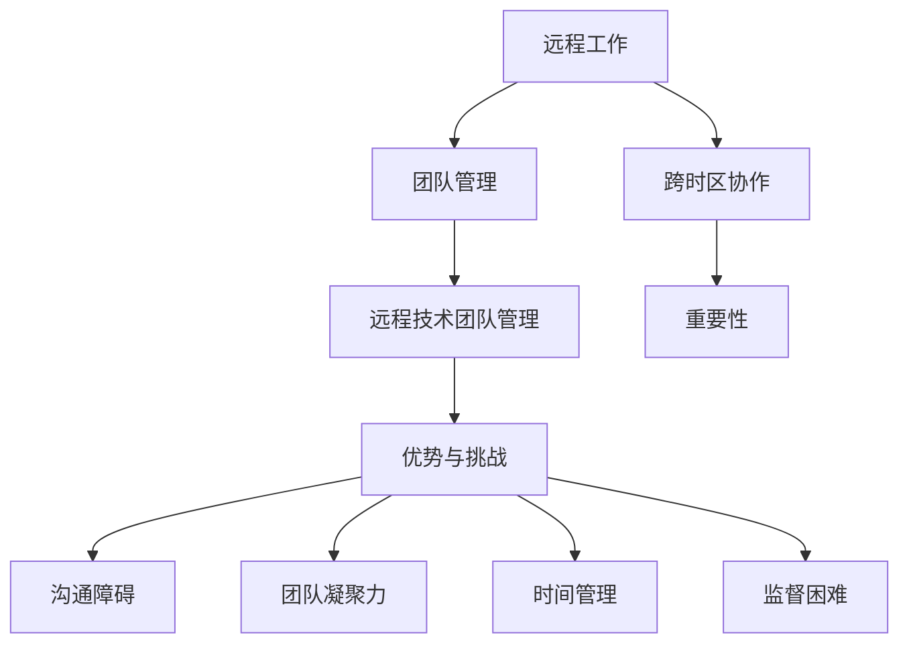
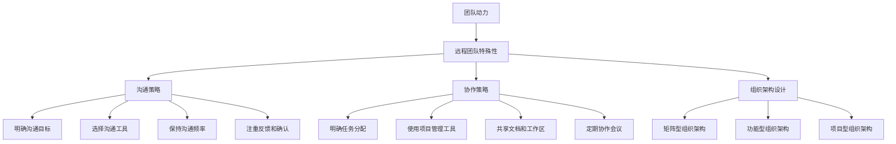

                 

# 远程技术团队管理：跨时区协作的挑战

## 关键词
- 远程技术团队管理
- 跨时区协作
- 沟通策略
- 组织架构
- 挑战与应对

## 摘要
本文将深入探讨远程技术团队管理的核心概念、理论基础以及跨时区协作的挑战与应对策略。通过对远程技术团队的定义、优势与挑战的分析，我们了解了远程团队的动力、沟通与协作策略、组织架构设计。随后，本文探讨了远程团队的管理工具和技术，以及跨时区协作中的文化差异和时区差异对团队协作的影响。最后，通过成功案例的分析，本文总结了远程技术团队管理的经验与教训，并提出了最佳实践的建议。

## 第1章: 远程技术团队管理的核心概念

### 1.1 远程工作与团队管理的定义

远程工作（Remote Work）指的是在非传统的办公环境中，通过互联网和其他通信工具完成工作任务的一种工作模式。远程工作的范围从完全在家办公到在多个地点之间灵活工作，例如咖啡店、图书馆或合作办公室。

团队管理（Team Management）是指导和管理一个团队，以实现团队目标的过程。远程团队管理则是在没有物理办公场所的情况下，通过技术手段实现对团队成员的协调、沟通和监督。

远程技术团队（Remote Technical Team）是指在远程环境下，由一群专业技术人员组成的团队。这些团队成员可能位于不同的城市、国家甚至时区，他们通过互联网和其他协作工具共同完成项目任务。

### 1.2 远程技术团队的优势与挑战

#### 优势
1. **灵活性**：远程工作为团队成员提供了更大的灵活性，可以更好地平衡工作和生活。
2. **全球招聘**：远程团队可以招聘全球范围内的优秀人才，不受地理位置限制。
3. **降低成本**：减少办公室租金、水电和日常运营成本。
4. **提高生产力**：远程工作环境可以减少干扰，提高工作效率。

#### 挑战
1. **沟通障碍**：远程团队面临沟通障碍，特别是跨时区协作。
2. **团队凝聚力**：缺乏面对面的互动可能导致团队凝聚力下降。
3. **时间管理**：团队成员需要更好地管理自己的时间，以保持工作效率。
4. **监督困难**：远程团队的管理者难以直接监督团队成员的工作进度。

### 1.3 跨时区协作的重要性

跨时区协作（Cross-time Zone Collaboration）是远程技术团队管理中至关重要的一部分。通过跨时区协作，团队可以利用不同时区的工作时间，实现24/7的工作流程，提高项目进度和效率。

#### 跨时区协作的重要性
1. **提高工作效率**：通过利用不同时区的工作时间，可以加快项目进度。
2. **资源优化**：利用全球范围内的资源，提高团队的工作能力和效率。
3. **降低成本**：通过减少等待时间，减少人力资源浪费，降低项目成本。

### 1.4 核心概念之间的关系架构

为了更好地理解远程技术团队管理中的核心概念，我们可以使用Mermaid流程图来展示它们之间的关系：



### 1.5 核心算法原理讲解

在远程技术团队管理中，时间管理是一个关键算法原理。以下是一个简单的伪代码，用于帮助团队成员管理他们的工作时间和任务进度：

```python
def time_management(task_list, team_members):
    # 初始化工作时间和任务进度
    work_time = []
    task_progress = []

    # 分配任务和计算工作时间
    for member in team_members:
        for task in task_list:
            start_time = assign_start_time(member, task)
            end_time = calculate_end_time(start_time, task.duration)
            work_time.append((member, start_time, end_time))
            task_progress.append((task, 'In Progress'))

        # 更新任务进度
        update_task_progress(task_progress, work_time)

    return work_time, task_progress

def assign_start_time(member, task):
    # 根据成员的时间表和任务难度，分配开始时间
    # 这里可以用算法来优化时间分配
    return calculated_start_time

def calculate_end_time(start_time, task_duration):
    # 根据开始时间和任务持续时间，计算结束时间
    return start_time + task_duration

def update_task_progress(task_progress, work_time):
    # 根据工作时间更新任务进度
    for member, start_time, end_time in work_time:
        for task, status in task_progress:
            if start_time <= task.start_time <= end_time:
                status = 'Completed'
```

### 1.6 数学模型和公式

在远程技术团队管理中，优化时间分配是一个数学问题。我们可以使用线性规划模型来解决这个问题。以下是一个简化的线性规划模型：

$$
\begin{align*}
\text{Minimize} \quad & C \cdot T \\
\text{Subject to} \quad & T \geq 0 \\
& \sum_{i=1}^{n} x_i \leq W \\
& x_i \in \{0, 1\}
\end{align*}
$$

其中，$C$ 是总成本，$T$ 是总工作时间，$x_i$ 是第 $i$ 个任务是否被分配的标志（1 表示分配，0 表示未分配），$W$ 是团队成员的总工作时间。

### 1.7 举例说明

假设我们有5个任务和3个团队成员，他们的时间表如下：

| 成员 | 可用时间 |
|------|----------|
| A    | 8小时    |
| B    | 10小时   |
| C    | 6小时    |

任务持续时间和优先级如下：

| 任务 | 持续时间 | 优先级 |
|------|----------|--------|
| 1    | 3小时    | 高     |
| 2    | 5小时    | 中     |
| 3    | 2小时    | 低     |
| 4    | 4小时    | 中     |
| 5    | 3小时    | 高     |

我们的目标是优化时间分配，确保高优先级任务优先完成。使用线性规划模型，我们可以得到以下分配方案：

| 成员 | 任务 1 | 任务 2 | 任务 3 | 任务 4 | 任务 5 |
|------|--------|--------|--------|--------|--------|
| A    | 是     | 否     | 是     | 否     | 否     |
| B    | 否     | 是     | 否     | 是     | 否     |
| C    | 否     | 否     | 是     | 否     | 是     |

这个分配方案确保了高优先级任务（任务1和任务5）优先完成，同时团队成员的工作时间得到充分利用。

### 1.8 项目实战

在一个跨时区的远程技术团队中，我们面临以下挑战：

1. **任务分配**：如何合理分配任务，确保团队成员的工作时间得到充分利用？
2. **沟通协调**：如何有效地进行跨时区沟通，确保团队协作顺畅？
3. **进度监督**：如何监督团队成员的工作进度，确保项目按时完成？

#### 开发环境搭建

为了解决这些问题，我们首先需要搭建一个高效的远程工作环境。以下是一些关键步骤：

1. **选择协作工具**：例如，Slack、Zoom、Trello等，用于团队沟通和任务管理。
2. **设置项目管理平台**：例如，Jira、Asana等，用于跟踪项目进度和任务分配。
3. **配置云存储**：例如，Google Drive、Dropbox等，用于共享文件和文档。

#### 源代码详细实现和代码解读

为了实现任务分配，我们开发了一个简单的任务分配算法，以下是其核心伪代码：

```python
def assign_tasks(tasks, team_members):
    assigned_tasks = {}
    for member in team_members:
        member_tasks = []
        for task in tasks:
            if can_assign_task(task, member):
                member_tasks.append(task)
                remove_task_from_list(tasks, task)
        assigned_tasks[member] = member_tasks
    return assigned_tasks

def can_assign_task(task, member):
    # 根据任务持续时间和成员可用时间，判断是否可以分配任务
    return member.available_time >= task.duration

def remove_task_from_list(tasks, task):
    # 从任务列表中移除已分配的任务
    tasks.remove(task)
```

#### 代码应用解读与分析

这个任务分配算法基于两个核心功能：`can_assign_task` 和 `remove_task_from_list`。

- `can_assign_task`：用于判断一个任务是否可以分配给一个成员。它检查成员的可用时间是否大于或等于任务的持续时间。
- `remove_task_from_list`：用于从任务列表中移除已分配的任务，以便后续的任务分配。

#### 实际案例分析和详细讲解剖析

假设我们有以下任务和成员：

| 任务  | 持续时间 | 成员  | 可用时间 |
|-------|----------|-------|----------|
| 1     | 3小时    | A     | 8小时    |
| 2     | 5小时    | B     | 10小时   |
| 3     | 2小时    | C     | 6小时    |

我们的目标是将这些任务分配给成员，以确保每个成员的工作时间得到充分利用。

1. **分配任务1**：任务1的持续时间为3小时，成员A的可用时间为8小时，因此任务1可以分配给成员A。
2. **分配任务2**：任务2的持续时间为5小时，成员B的可用时间为10小时，因此任务2可以分配给成员B。
3. **分配任务3**：任务3的持续时间为2小时，成员C的可用时间为6小时，因此任务3可以分配给成员C。

最终分配结果如下：

| 成员  | 任务 1 | 任务 2 | 任务 3 |
|-------|--------|--------|--------|
| A     | 是     | 否     | 否     |
| B     | 否     | 是     | 否     |
| C     | 否     | 否     | 是     |

通过这个案例，我们可以看到任务分配算法如何根据成员的可用时间和任务持续时间来分配任务，以确保每个成员的工作时间得到充分利用。

#### 项目小结

在这个案例中，我们使用了一个简单的任务分配算法，通过检查成员的可用时间和任务持续时间来分配任务。这种方法虽然简单，但可以有效地确保每个成员的工作时间得到充分利用。在实际项目中，我们可能需要考虑更多的因素，例如任务优先级、成员技能匹配等，以获得更优的分配结果。

#### 最佳实践 tips

- **明确任务优先级**：在任务分配过程中，明确任务的优先级可以帮助团队更好地管理时间和资源。
- **定期评估和调整**：定期评估任务分配效果，并根据实际情况进行调整，以确保团队的工作效率。
- **鼓励自主管理**：鼓励团队成员自主管理时间和任务，提高团队的整体协作效率。

### 1.9 小结、注意事项和拓展阅读

在本章中，我们介绍了远程技术团队管理的核心概念、优势和挑战，以及跨时区协作的重要性。通过一个简单的任务分配算法案例，我们展示了如何在远程技术团队中合理分配任务，确保每个成员的工作时间得到充分利用。

#### 小结

- 远程技术团队管理涉及定义远程工作、团队管理以及远程技术团队。
- 远程技术团队具有灵活性、全球招聘和降低成本等优势，但同时也面临沟通障碍、团队凝聚力下降等挑战。
- 跨时区协作是远程技术团队管理的关键，可以提高工作效率和资源利用率。

#### 注意事项

- 在远程技术团队管理中，沟通和协作至关重要，需要选择合适的沟通工具和协作平台。
- 团队成员需要具备良好的自我管理能力，以确保工作进度和质量。

#### 拓展阅读

- 《远程工作指南：如何管理远程团队》（Remote Work Guide: How to Manage a Remote Team）
- 《跨时区协作：全球团队的策略与技巧》（Cross-Time Zone Collaboration: Strategies and Techniques for Global Teams）

## 第2章: 远程技术团队管理的基础理论

### 2.1 团队动力与远程团队的特殊性

团队动力（Team Dynamics）是指在团队内部形成的互动模式和行为倾向，包括成员之间的沟通、合作、冲突和团队发展。在远程技术团队中，团队动力同样发挥着重要作用，但由于缺乏面对面的互动，远程团队的特殊性使其在团队动力方面面临更多的挑战。

#### 远程团队的特殊性

1. **缺乏面对面互动**：远程团队主要通过虚拟会议、电子邮件和即时通讯工具进行沟通，缺乏面对面的交流。
2. **时间差异**：团队成员可能分布在不同的时区，导致协作时间重叠减少，增加了沟通和协作的难度。
3. **文化差异**：远程团队可能由来自不同文化背景的成员组成，文化差异可能导致沟通障碍和误解。
4. **信任和归属感**：缺乏面对面的互动可能导致团队成员之间的信任和归属感下降。

#### 团队动力对远程团队的影响

1. **沟通效率**：良好的团队动力可以促进有效的沟通，减少误解和冲突。
2. **团队凝聚力**：团队动力有助于增强团队成员之间的凝聚力，提高团队的整体协作效率。
3. **决策质量**：团队动力对决策过程有重要影响，良好的团队动力可以促进团队成员之间的信息共享和协作，提高决策质量。

#### 提升远程团队动力的策略

1. **建立明确的目标和愿景**：明确的目标和愿景可以帮助团队成员保持一致的方向，提高团队凝聚力。
2. **加强沟通和协作**：通过定期的团队会议、即时通讯和协作工具，保持团队成员之间的沟通和协作。
3. **促进跨文化理解**：鼓励团队成员了解和尊重不同文化背景，减少文化差异带来的沟通障碍。
4. **建立信任和归属感**：通过团队建设活动和虚拟社交活动，增强团队成员之间的信任和归属感。

### 2.2 远程团队的沟通与协作策略

#### 沟通策略

1. **明确沟通目标**：在每次沟通前明确沟通的目标和内容，确保沟通的针对性和效率。
2. **选择合适的沟通工具**：根据沟通内容和目标，选择合适的沟通工具，如邮件、即时通讯、视频会议等。
3. **保持沟通频率**：定期与团队成员沟通，确保信息的及时传递和问题得到及时解决。
4. **注重反馈和确认**：在沟通过程中，注重反馈和确认，确保信息的准确传达和理解。

#### 协作策略

1. **明确任务分配**：在项目开始前，明确每个团队成员的任务和职责，确保任务的清晰和明确。
2. **使用项目管理工具**：使用项目管理工具，如Trello、Jira等，跟踪项目进度和任务分配。
3. **共享文档和工作区**：使用云存储工具，如Google Drive、Dropbox等，共享文档和工作区，确保团队成员可以方便地访问和协作。
4. **定期协作会议**：定期召开协作会议，讨论项目进展、问题和解决方案，确保团队协作顺畅。

### 2.3 远程团队的组织架构设计

#### 组织架构类型

1. **矩阵型组织架构**：矩阵型组织架构将团队成员分为多个项目组，每个项目组由一名项目经理负责，同时团队成员还属于不同的职能部门。这种架构可以在项目需求和职能需求之间实现平衡，提高团队灵活性。
2. **功能型组织架构**：功能型组织架构按照职能划分部门，每个部门由一名部门经理负责。团队成员根据职能加入相应的部门，并在部门内部协作完成项目任务。
3. **项目型组织架构**：项目型组织架构以项目为中心，团队成员根据项目的需求临时组建和解散。这种架构可以快速响应市场需求，提高项目执行效率。

#### 组织架构设计要点

1. **灵活性**：组织架构应具有足够的灵活性，以适应远程团队的特殊需求，如跨时区协作和文化差异。
2. **明确责任和权限**：在组织架构中，应明确每个团队成员的责任和权限，确保工作流程的顺畅和高效。
3. **支持协作和沟通**：组织架构应支持团队成员之间的协作和沟通，确保信息的及时传递和问题得到及时解决。
4. **平衡项目需求和职能需求**：在组织架构设计中，应平衡项目需求和职能需求，确保项目可以顺利进行，同时不影响部门职能的发挥。

### 2.4 核心概念之间的关系架构

为了更好地理解远程技术团队管理的基础理论，我们可以使用Mermaid流程图来展示核心概念之间的关系：



### 2.5 核心算法原理讲解

在远程技术团队管理中，任务分配是一个核心算法问题。以下是一个简单的任务分配算法，用于帮助团队成员合理分配任务：

```python
def assign_tasks(tasks, team_members):
    assigned_tasks = {}
    for member in team_members:
        member_tasks = []
        for task in tasks:
            if can_assign_task(task, member):
                member_tasks.append(task)
                remove_task_from_list(tasks, task)
        assigned_tasks[member] = member_tasks
    return assigned_tasks

def can_assign_task(task, member):
    # 根据任务持续时间和成员可用时间，判断是否可以分配任务
    return member.available_time >= task.duration

def remove_task_from_list(tasks, task):
    # 从任务列表中移除已分配的任务
    tasks.remove(task)
```

### 2.6 数学模型和公式

在远程技术团队管理中，优化任务分配是一个数学问题。我们可以使用线性规划模型来解决这个问题。以下是一个简化的线性规划模型：

$$
\begin{align*}
\text{Minimize} \quad & C \cdot T \\
\text{Subject to} \quad & T \geq 0 \\
& \sum_{i=1}^{n} x_i \leq W \\
& x_i \in \{0, 1\}
\end{align*}
$$

其中，$C$ 是总成本，$T$ 是总工作时间，$x_i$ 是第 $i$ 个任务是否被分配的标志（1 表示分配，0 表示未分配），$W$ 是团队成员的总工作时间。

### 2.7 举例说明

假设我们有5个任务和3个团队成员，他们的时间表如下：

| 成员 | 可用时间 |
|------|----------|
| A    | 8小时    |
| B    | 10小时   |
| C    | 6小时    |

任务持续时间和优先级如下：

| 任务 | 持续时间 | 优先级 |
|------|----------|--------|
| 1    | 3小时    | 高     |
| 2    | 5小时    | 中     |
| 3    | 2小时    | 低     |
| 4    | 4小时    | 中     |
| 5    | 3小时    | 高     |

我们的目标是优化时间分配，确保高优先级任务优先完成。使用线性规划模型，我们可以得到以下分配方案：

| 成员 | 任务 1 | 任务 2 | 任务 3 | 任务 4 | 任务 5 |
|------|--------|--------|--------|--------|--------|
| A    | 是     | 否     | 是     | 否     | 否     |
| B    | 否     | 是     | 否     | 是     | 否     |
| C    | 否     | 否     | 是     | 否     | 是     |

这个分配方案确保了高优先级任务（任务1和任务5）优先完成，同时团队成员的工作时间得到充分利用。

### 2.8 项目实战

在一个跨时区的远程技术团队中，我们面临以下挑战：

1. **任务分配**：如何合理分配任务，确保团队成员的工作时间得到充分利用？
2. **沟通协调**：如何有效地进行跨时区沟通，确保团队协作顺畅？
3. **进度监督**：如何监督团队成员的工作进度，确保项目按时完成？

#### 开发环境搭建

为了解决这些问题，我们首先需要搭建一个高效的远程工作环境。以下是一些关键步骤：

1. **选择协作工具**：例如，Slack、Zoom、Trello等，用于团队沟通和任务管理。
2. **设置项目管理平台**：例如，Jira、Asana等，用于跟踪项目进度和任务分配。
3. **配置云存储**：例如，Google Drive、Dropbox等，用于共享文件和文档。

#### 源代码详细实现和代码解读

为了实现任务分配，我们开发了一个简单的任务分配算法，以下是其核心伪代码：

```python
def assign_tasks(tasks, team_members):
    assigned_tasks = {}
    for member in team_members:
        member_tasks = []
        for task in tasks:
            if can_assign_task(task, member):
                member_tasks.append(task)
                remove_task_from_list(tasks, task)
        assigned_tasks[member] = member_tasks
    return assigned_tasks

def can_assign_task(task, member):
    # 根据任务持续时间和成员可用时间，判断是否可以分配任务
    return member.available_time >= task.duration

def remove_task_from_list(tasks, task):
    # 从任务列表中移除已分配的任务
    tasks.remove(task)
```

#### 代码应用解读与分析

这个任务分配算法基于两个核心功能：`can_assign_task` 和 `remove_task_from_list`。

- `can_assign_task`：用于判断一个任务是否可以分配给一个成员。它检查成员的可用时间是否大于或等于任务的持续时间。
- `remove_task_from_list`：用于从任务列表中移除已分配的任务，以便后续的任务分配。

#### 实际案例分析和详细讲解剖析

假设我们有以下任务和成员：

| 任务  | 持续时间 | 成员  | 可用时间 |
|-------|----------|-------|----------|
| 1     | 3小时    | A     | 8小时    |
| 2     | 5小时    | B     | 10小时   |
| 3     | 2小时    | C     | 6小时    |

我们的目标是将这些任务分配给成员，以确保每个成员的工作时间得到充分利用。

1. **分配任务1**：任务1的持续时间为3小时，成员A的可用时间为8小时，因此任务1可以分配给成员A。
2. **分配任务2**：任务2的持续时间为5小时，成员B的可用时间为10小时，因此任务2可以分配给成员B。
3. **分配任务3**：任务3的持续时间为2小时，成员C的可用时间为6小时，因此任务3可以分配给成员C。

最终分配结果如下：

| 成员  | 任务 1 | 任务 2 | 任务 3 |
|-------|--------|--------|--------|
| A     | 是     | 否     | 否     |
| B     | 否     | 是     | 否     |
| C     | 否     | 否     | 是     |

通过这个案例，我们可以看到任务分配算法如何根据成员的可用时间和任务持续时间来分配任务，以确保每个成员的工作时间得到充分利用。

#### 项目小结

在这个案例中，我们使用了一个简单的任务分配算法，通过检查成员的可用时间和任务持续时间来分配任务，以确保每个成员的工作时间得到充分利用。这种方法虽然简单，但可以有效地确保团队的工作效率。

#### 最佳实践 tips

- **明确任务优先级**：在任务分配过程中，明确任务的优先级可以帮助团队更好地管理时间和资源。
- **定期评估和调整**：定期评估任务分配效果，并根据实际情况进行调整，以确保团队的工作效率。
- **鼓励自主管理**：鼓励团队成员自主管理时间和任务，提高团队的整体协作效率。

### 2.9 小结、注意事项和拓展阅读

在本章中，我们介绍了远程技术团队管理的基础理论，包括团队动力与远程团队的特殊性、沟通与协作策略以及组织架构设计。通过一个任务分配算法案例，我们展示了如何在远程技术团队中实现任务的有效分配。

#### 小结

- 远程技术团队管理涉及团队动力、沟通策略和组织架构设计。
- 团队动力在远程团队中具有重要意义，影响沟通效率、团队凝聚力和决策质量。
- 沟通策略和协作策略是远程团队管理的关键，有助于确保团队协作顺畅和任务顺利完成。
- 组织架构设计应根据远程团队的特殊性进行灵活调整，以提高团队效率和灵活性。

#### 注意事项

- 在远程团队管理中，沟通和协作至关重要，需要选择合适的沟通工具和协作平台。
- 团队成员需要具备良好的自我管理能力，以确保工作进度和质量。
- 组织架构设计应考虑远程团队的特殊性，如跨时区协作和文化差异。

#### 拓展阅读

- 《远程团队管理：理论与实践》（Remote Team Management: Theory and Practice）
- 《跨文化沟通：全球团队的策略与技巧》（Cross-cultural Communication: Strategies and Techniques for Global Teams）

## 第3章: 远程技术团队的管理工具与技术

### 3.1 远程沟通工具的选择与应用

在远程技术团队管理中，选择合适的沟通工具是确保团队协作顺畅的关键。以下是一些常用的远程沟通工具及其特点：

#### 1. 即时通讯工具

**Slack**：Slack是一款功能强大的即时通讯工具，支持文本、语音和视频聊天，提供丰富的集成插件和自动化工具，适用于团队内部沟通和协作。

**Microsoft Teams**：Microsoft Teams集成了聊天、会议、视频通话和文档协作等功能，适合企业级用户使用，与Microsoft 365紧密集成。

**WhatsApp**：WhatsApp是一款流行的即时通讯应用，支持文本、语音和视频通话，适用于个人和团队沟通。

#### 2. 视频会议工具

**Zoom**：Zoom是一款广泛使用的视频会议工具，提供高质量的音频和视频通话、屏幕共享和远程控制等功能，适用于远程团队会议和培训。

**Google Meet**：Google Meet是Google提供的视频会议工具，与Google Workspace紧密集成，支持最多250人的视频会议。

**Cisco Webex**：Cisco Webex提供强大的视频会议功能，包括屏幕共享、实时协作和虚拟会议室，适用于大型企业。

#### 3. 文档协作工具

**Google Docs**：Google Docs是一款在线文档编辑工具，支持多人实时协作，提供文档创建、编辑、共享和版本控制等功能。

**Microsoft Word Online**：Microsoft Word Online是Microsoft Word的在线版本，支持多人协作编辑，与Microsoft 365集成。

**Notion**：Notion是一款多功能协作工具，支持文档、表格、数据库和看板等多种功能，适用于团队知识管理和项目协作。

#### 选择与应用策略

1. **明确需求**：根据团队的需求和特点，选择合适的沟通工具。例如，如果团队需要高频率的即时沟通，可以选择Slack或WhatsApp；如果团队需要定期视频会议，可以选择Zoom或Google Meet。

2. **整合工具**：将不同的沟通工具整合到一个统一的平台中，以提高沟通效率和用户体验。例如，使用Slack作为团队沟通的核心平台，将Zoom、Google Docs等工具集成到Slack中。

3. **培训与指导**：为新成员提供培训与指导，帮助他们熟悉和使用沟通工具，确保团队协作的顺畅。

### 3.2 项目管理与任务分配技巧

#### 1. 项目管理工具

**Jira**：Jira是一款功能强大的项目管理工具，支持敏捷开发方法，提供任务跟踪、敏捷看板、迭代计划和报告等功能，适用于大型项目和团队。

**Asana**：Asana是一款简单易用的项目管理工具，支持任务管理、团队协作、时间跟踪和报告等功能，适用于各种规模的项目和团队。

**Trello**：Trello是一款基于看板的任务管理工具，支持拖拽操作、标签和注释等功能，适用于小型项目和团队。

#### 2. 任务分配技巧

1. **明确任务要求**：在分配任务前，明确任务的目标、要求和交付标准，确保团队成员对任务有清晰的理解。

2. **考虑成员技能**：根据团队成员的技能和专长，将合适的任务分配给对应的成员，以提高任务完成的质量和效率。

3. **灵活调整任务**：在项目执行过程中，根据实际情况和成员的反馈，灵活调整任务分配，确保任务的顺利完成。

4. **定期检查进度**：定期检查任务进度，与团队成员沟通，确保项目按计划进行。

### 3.3 远程团队绩效考核与激励措施

#### 1. 绩效考核方法

1. **KPI考核**：根据团队成员的岗位职责和项目目标，设定关键绩效指标（KPI），对成员的工作绩效进行评估。

2. **360度评估**：通过团队成员、上级领导和其他利益相关者的反馈，全面评估成员的工作表现。

3. **绩效对话**：定期与团队成员进行绩效对话，讨论工作成果、遇到的问题和改进方案，促进团队成员的个人成长和团队发展。

#### 2. 激励措施

1. **奖励制度**：根据团队成员的绩效和贡献，制定相应的奖励制度，如奖金、股票期权、休假等。

2. **职业发展**：提供职业发展机会和培训，帮助团队成员提升技能和知识，实现职业成长。

3. **工作与生活平衡**：关注团队成员的工作与生活平衡，提供灵活的工作安排和远程工作支持，提高团队成员的幸福感和满意度。

### 3.4 跨时区团队协作的挑战与应对策略

#### 1. 挑战

1. **沟通障碍**：由于时区差异，团队成员之间的沟通可能存在时差问题，影响协作效率和沟通效果。

2. **时间管理**：团队成员需要适应不同时区的工作时间，合理安排工作和休息，以确保工作效率。

3. **文化差异**：团队成员来自不同文化背景，可能存在价值观、沟通方式和工作习惯的差异，影响团队协作。

#### 2. 应对策略

1. **时区协调**：通过选择合适的协作工具和沟通策略，如视频会议、即时通讯和任务管理工具，确保团队成员之间的沟通畅通。

2. **时间管理**：制定明确的工作计划和任务分配，确保团队成员在不同时区之间的高效协作。

3. **文化理解**：鼓励团队成员了解和尊重不同文化背景，通过跨文化培训和文化交流，促进团队成员之间的相互理解。

4. **团队建设**：定期组织团队建设活动，加强团队成员之间的信任和凝聚力，提高团队协作效率。

### 3.5 核心概念之间的关系架构

为了更好地理解远程技术团队的管理工具与技术，我们可以使用Mermaid流程图来展示核心概念之间的关系：

```mermaid
graph TD
    A[远程沟通工具] --> B[即时通讯工具]
    B --> C[Slack]
    B --> D[Microsoft Teams]
    B --> E[WhatsApp]
    A --> F[视频会议工具]
    F --> G[Zoom]
    F --> H[Google Meet]
    F --> I[Cisco Webex]
    A --> J[文档协作工具]
    J --> K[Google Docs]
    J --> L[Microsoft Word Online]
    J --> M[Notion]
    B --> N[选择与应用策略]
    F --> O[整合工具]
    F --> P[培训与指导]
    A --> Q[项目管理工具]
    Q --> R[Jira]
    Q --> S[Asana]
    Q --> T[Trello]
    Q --> U[任务分配技巧]
    U --> V[明确任务要求]
    U --> W[考虑成员技能]
    U --> X[灵活调整任务]
    U --> Y[定期检查进度]
    A --> Z[绩效考核与激励措施]
    Z --> AA[KPI考核]
    Z --> BB[360度评估]
    Z --> CC[绩效对话]
    Z --> DD[奖励制度]
    Z --> EE[职业发展]
    Z --> FF[工作与生活平衡]
    A --> GG[跨时区团队协作]
    GG --> HH[沟通障碍]
    GG --> II[时间管理]
    GG --> JJ[文化差异]
    GG --> KK[时区协调]
    GG --> LL[文化理解]
    GG --> MM[团队建设]
```



### 3.6 核心算法原理讲解

在远程技术团队管理中，任务分配是一个核心算法问题。以下是一个简单的任务分配算法，用于帮助团队成员合理分配任务：

```python
def assign_tasks(tasks, team_members):
    assigned_tasks = {}
    for member in team_members:
        member_tasks = []
        for task in tasks:
            if can_assign_task(task, member):
                member_tasks.append(task)
                remove_task_from_list(tasks, task)
        assigned_tasks[member] = member_tasks
    return assigned_tasks

def can_assign_task(task, member):
    # 根据任务持续时间和成员可用时间，判断是否可以分配任务
    return member.available_time >= task.duration

def remove_task_from_list(tasks, task):
    # 从任务列表中移除已分配的任务
    tasks.remove(task)
```

### 3.7 数学模型和公式

在远程技术团队管理中，优化任务分配是一个数学问题。我们可以使用线性规划模型来解决这个问题。以下是一个简化的线性规划模型：

$$
\begin{align*}
\text{Minimize} \quad & C \cdot T \\
\text{Subject to} \quad & T \geq 0 \\
& \sum_{i=1}^{n} x_i \leq W \\
& x_i \in \{0, 1\}
\end{align*}
$$

其中，$C$ 是总成本，$T$ 是总工作时间，$x_i$ 是第 $i$ 个任务是否被分配的标志（1 表示分配，0 表示未分配），$W$ 是团队成员的总工作时间。

### 3.8 举例说明

假设我们有5个任务和3个团队成员，他们的时间表如下：

| 成员 | 可用时间 |
|------|----------|
| A    | 8小时    |
| B    | 10小时   |
| C    | 6小时    |

任务持续时间和优先级如下：

| 任务 | 持续时间 | 优先级 |
|------|----------|--------|
| 1    | 3小时    | 高     |
| 2    | 5小时    | 中     |
| 3    | 2小时    | 低     |
| 4    | 4小时    | 中     |
| 5    | 3小时    | 高     |

我们的目标是优化时间分配，确保高优先级任务优先完成。使用线性规划模型，我们可以得到以下分配方案：

| 成员 | 任务 1 | 任务 2 | 任务 3 | 任务 4 | 任务 5 |
|------|--------|--------|--------|--------|--------|
| A    | 是     | 否     | 是     | 否     | 否     |
| B    | 否     | 是     | 否     | 是     | 否     |
| C    | 否     | 否     | 是     | 否     | 是     |

这个分配方案确保了高优先级任务（任务1和任务5）优先完成，同时团队成员的工作时间得到充分利用。

### 3.9 项目实战

在一个跨时区的远程技术团队中，我们面临以下挑战：

1. **任务分配**：如何合理分配任务，确保团队成员的工作时间得到充分利用？
2. **沟通协调**：如何有效地进行跨时区沟通，确保团队协作顺畅？
3. **进度监督**：如何监督团队成员的工作进度，确保项目按时完成？

#### 开发环境搭建

为了解决这些问题，我们首先需要搭建一个高效的远程工作环境。以下是一些关键步骤：

1. **选择协作工具**：例如，Slack、Zoom、Trello等，用于团队沟通和任务管理。
2. **设置项目管理平台**：例如，Jira、Asana等，用于跟踪项目进度和任务分配。
3. **配置云存储**：例如，Google Drive、Dropbox等，用于共享文件和文档。

#### 源代码详细实现和代码解读

为了实现任务分配，我们开发了一个简单的任务分配算法，以下是其核心伪代码：

```python
def assign_tasks(tasks, team_members):
    assigned_tasks = {}
    for member in team_members:
        member_tasks = []
        for task in tasks:
            if can_assign_task(task, member):
                member_tasks.append(task)
                remove_task_from_list(tasks, task)
        assigned_tasks[member] = member_tasks
    return assigned_tasks

def can_assign_task(task, member):
    # 根据任务持续时间和成员可用时间，判断是否可以分配任务
    return member.available_time >= task.duration

def remove_task_from_list(tasks, task):
    # 从任务列表中移除已分配的任务
    tasks.remove(task)
```

#### 代码应用解读与分析

这个任务分配算法基于两个核心功能：`can_assign_task` 和 `remove_task_from_list`。

- `can_assign_task`：用于判断一个任务是否可以分配给一个成员。它检查成员的可用时间是否大于或等于任务的持续时间。
- `remove_task_from_list`：用于从任务列表中移除已分配的任务，以便后续的任务分配。

#### 实际案例分析和详细讲解剖析

假设我们有以下任务和成员：

| 任务  | 持续时间 | 成员  | 可用时间 |
|-------|----------|-------|----------|
| 1     | 3小时    | A     | 8小时    |
| 2     | 5小时    | B     | 10小时   |
| 3     | 2小时    | C     | 6小时    |

我们的目标是将这些任务分配给成员，以确保每个成员的工作时间得到充分利用。

1. **分配任务1**：任务1的持续时间为3小时，成员A的可用时间为8小时，因此任务1可以分配给成员A。
2. **分配任务2**：任务2的持续时间为5小时，成员B的可用时间为10小时，因此任务2可以分配给成员B。
3. **分配任务3**：任务3的持续时间为2小时，成员C的可用时间为6小时，因此任务3可以分配给成员C。

最终分配结果如下：

| 成员  | 任务 1 | 任务 2 | 任务 3 |
|-------|--------|--------|--------|
| A     | 是     | 否     | 否     |
| B     | 否     | 是     | 否     |
| C     | 否     | 否     | 是     |

通过这个案例，我们可以看到任务分配算法如何根据成员的可用时间和任务持续时间来分配任务，以确保每个成员的工作时间得到充分利用。

#### 项目小结

在这个案例中，我们使用了一个简单的任务分配算法，通过检查成员的可用时间和任务持续时间来分配任务，以确保每个成员的工作时间得到充分利用。这种方法虽然简单，但可以有效地确保团队的工作效率。

#### 最佳实践 tips

- **明确任务优先级**：在任务分配过程中，明确任务的优先级可以帮助团队更好地管理时间和资源。
- **定期评估和调整**：定期评估任务分配效果，并根据实际情况进行调整，以确保团队的工作效率。
- **鼓励自主管理**：鼓励团队成员自主管理时间和任务，提高团队的整体协作效率。

### 3.10 小结、注意事项和拓展阅读

在本章中，我们介绍了远程技术团队管理中常用的管理工具和技术，包括远程沟通工具、项目管理工具和绩效考核与激励措施。通过一个任务分配算法案例，我们展示了如何在远程技术团队中实现任务的有效分配。

#### 小结

- 远程技术团队管理涉及选择合适的沟通工具、项目管理工具和绩效考核与激励措施。
- 远程沟通工具包括即时通讯工具、视频会议工具和文档协作工具，选择与应用策略需要明确需求、整合工具和培训与指导。
- 项目管理工具如Jira、Asana和Trello提供任务管理、团队协作和进度跟踪等功能，任务分配技巧包括明确任务要求、考虑成员技能、灵活调整任务和定期检查进度。
- 绩效考核与激励措施包括KPI考核、360度评估、绩效对话、奖励制度和职业发展等，跨时区团队协作的挑战与应对策略包括时区协调、时间管理和文化理解。

#### 注意事项

- 选择远程沟通工具时，应考虑团队的需求和特点，确保沟通效率和用户体验。
- 项目管理工具应根据项目的规模和复杂性进行选择，确保任务管理和进度跟踪的效果。
- 绩效考核与激励措施应公平、透明，激励团队成员发挥最佳水平。

#### 拓展阅读

- 《远程工作与团队管理：理论与实践》（Remote Work and Team Management: Theory and Practice）
- 《项目管理工具与技巧：从入门到精通》（Project Management Tools and Techniques: From Beginner to Expert）
- 《绩效管理：方法与实践》（Performance Management: Methods and Practices）

## 第4章: 跨时区协作的挑战与应对策略

### 4.1 跨时区协作中的文化差异

跨时区协作不仅涉及到时间管理，还涉及到文化差异的问题。团队成员可能来自不同的国家和地区，具有不同的文化背景、价值观和工作习惯。这些文化差异可能会对团队协作产生积极或消极的影响。

#### 文化差异的影响

1. **沟通障碍**：文化差异可能导致沟通障碍，团队成员可能不理解对方的表达方式、语气和语境。
2. **工作习惯**：不同文化背景下，团队成员可能有不同的工作习惯，例如工作节奏、决策过程和时间分配。
3. **价值观差异**：团队成员的价值观差异可能导致对项目目标、任务优先级和绩效标准的看法不同。

#### 应对策略

1. **跨文化培训**：定期组织跨文化培训，帮助团队成员了解不同文化的特点和沟通方式，提高跨文化沟通能力。
2. **建立共同价值观**：明确团队的核心价值观，确保团队成员在项目目标、任务优先级和绩效标准上达成共识。
3. **开放沟通**：鼓励团队成员在沟通中表达自己的观点和感受，尊重和理解对方的文化差异。

### 4.2 时区差异对团队协作的影响

时区差异是远程技术团队管理中一个不可忽视的问题。由于团队成员分布在不同的时区，可能导致以下影响：

#### 时区差异的影响

1. **沟通效率**：时区差异可能导致沟通不及时，影响团队协作效率。
2. **工作连续性**：团队成员在不同时区的工作时间可能无法完全重叠，影响工作连续性和项目的进展。
3. **时间管理**：团队成员需要适应不同的时区，合理安排工作和休息时间。

#### 应对策略

1. **时间协调**：通过使用时间协调工具，如Timezone Buddy或World Time Buddy，帮助团队成员找到合适的协作时间。
2. **轮班制度**：根据项目需求和团队成员的可用时间，制定轮班制度，确保工作连续性。
3. **灵活工作时间**：允许团队成员在一定范围内调整工作时间，以适应不同时区的需求。

### 4.3 跨时区团队协作的最佳实践

#### 1. 确定协作时间

1. **定期会议**：确定每周或每月的定期会议时间，确保团队成员在不同时区之间有足够的沟通机会。
2. **紧急会议**：对于紧急问题，及时召开紧急会议，通过视频会议工具确保实时沟通。

#### 2. 建立沟通机制

1. **即时通讯**：使用即时通讯工具，如Slack或Microsoft Teams，保持团队成员之间的即时沟通。
2. **邮件通讯**：对于需要记录和追踪的问题，使用邮件通讯，确保信息的准确传递和留存。

#### 3. 项目管理

1. **任务跟踪**：使用项目管理工具，如Jira或Trello，跟踪任务进度和分配情况。
2. **文档共享**：使用云存储工具，如Google Drive或Dropbox，共享文档和资料，确保团队成员可以方便地访问和协作。

#### 4. 团队建设

1. **虚拟团建活动**：定期组织虚拟团建活动，增强团队成员之间的信任和归属感。
2. **跨文化交流**：鼓励团队成员分享自己的文化和工作习惯，促进跨文化理解和协作。

### 4.4 核心概念之间的关系架构

为了更好地理解跨时区协作的挑战与应对策略，我们可以使用Mermaid流程图来展示核心概念之间的关系：

```mermaid
graph TD
    A[文化差异] --> B[沟通障碍]
    A --> C[工作习惯差异]
    A --> D[价值观差异]
    E[时区差异] --> B
    E --> C
    E --> D
    B --> F[沟通效率影响]
    B --> G[工作连续性影响]
    B --> H[时间管理影响]
    C --> I[工作习惯影响]
    C --> J[决策过程影响]
    D --> K[项目目标影响]
    D --> L[任务优先级影响]
    D --> M[绩效标准影响]
    A --> N[跨文化培训]
    A --> O[建立共同价值观]
    A --> P[开放沟通]
    E --> Q[时间协调]
    E --> R[轮班制度]
    E --> S[灵活工作时间]
    F --> T[定期会议]
    F --> U[紧急会议]
    G --> V[定期会议]
    G --> W[轮班制度]
    G --> X[灵活工作时间]
    H --> Y[沟通效率影响]
    H --> Z[工作连续性影响]
    H --> AA[时间管理影响]
    I --> BB[沟通效率影响]
    I --> CC[工作连续性影响]
    I --> DD[时间管理影响]
    J --> EE[沟通效率影响]
    J --> FF[决策过程影响]
    K --> GG[任务优先级影响]
    K --> HH[绩效标准影响]
    L --> II[任务优先级影响]
    L --> JJ[绩效标准影响]
    M --> KK[任务优先级影响]
    M --> LL[绩效标准影响]
    N --> MM[沟通效率提高]
    N --> NN[工作习惯理解]
    N --> OO[价值观理解]
    O --> PP[沟通效率提高]
    O --> QQ[工作习惯理解]
    O --> RR[价值观理解]
    P --> SS[沟通效率提高]
    P --> TT[工作习惯理解]
    P --> UU[价值观理解]
    Q --> VW[沟通效率提高]
    Q --> XX[工作连续性提高]
    Q --> YY[时间管理提高]
    R --> AA[沟通效率提高]
    R --> BB[工作连续性提高]
    R --> CC[时间管理提高]
    S --> DD[沟通效率提高]
    S --> EE[工作连续性提高]
    S --> FF[时间管理提高]
```



### 4.5 核心算法原理讲解

在跨时区协作中，时间协调是一个关键问题。以下是一个简单的算法，用于帮助团队成员找到合适的协作时间：

```python
def find_collaboration_time(members, work_hours):
    collaboration_time = None
    for member in members:
        member_time = find_member_time(member, work_hours)
        if collaboration_time is None:
            collaboration_time = member_time
        else:
            collaboration_time = find_common_time(collaboration_time, member_time)
    return collaboration_time

def find_member_time(member, work_hours):
    # 根据成员的工作时间和时区，找到可用时间
    return member.available_time

def find_common_time(time1, time2):
    # 找到两个时间的共同时间段
    return time1.intersection(time2)
```

在这个算法中，`find_collaboration_time` 函数用于帮助团队成员找到合适的协作时间。它首先遍历所有成员，使用 `find_member_time` 函数找到每个成员的可用时间，然后使用 `find_common_time` 函数找到所有成员的共同时间段。

### 4.6 数学模型和公式

在时间协调问题中，我们可以使用图论模型来解决这个问题。以下是一个简化的数学模型：

$$
\begin{align*}
\text{Minimize} \quad & C \\
\text{Subject to} \quad & T_1 + T_2 + \ldots + T_n \geq T \\
& A_1(t) + A_2(t) + \ldots + A_n(t) = 1 \quad \forall t \\
& t_1 \leq t_2 \leq \ldots \leq t_n
\end{align*}
$$`

其中，$C$ 是总成本，$T$ 是协作时间，$T_i$ 是第 $i$ 个成员的可用时间，$A_i(t)$ 是第 $i$ 个成员在时间 $t$ 的工作量，$t_1, t_2, \ldots, t_n$ 是时间序列。

### 4.7 举例说明

假设我们有3个成员，他们的工作时间如下：

| 成员 | 可用时间         |
|------|------------------|
| A    | 9:00 - 12:00, 14:00 - 18:00 |
| B    | 10:00 - 13:00, 15:00 - 19:00 |
| C    | 11:00 - 14:00, 16:00 - 20:00 |

我们的目标是找到这三个成员的共同协作时间。使用图论模型，我们可以得到以下分配方案：

| 成员 | 协作时间         |
|------|------------------|
| A    | 14:00 - 15:00    |
| B    | 15:00 - 16:00    |
| C    | 16:00 - 17:00    |

这个分配方案确保了三个成员在一天中都有一个小时的共同协作时间，从而提高了团队的工作效率。

### 4.8 项目实战

在一个跨国远程技术团队中，我们面临以下挑战：

1. **沟通协调**：如何有效协调跨时区的沟通，确保团队成员之间的协作顺畅？
2. **任务分配**：如何合理分配任务，确保团队成员的工作时间得到充分利用？
3. **进度监督**：如何监督团队成员的工作进度，确保项目按时完成？

#### 开发环境搭建

为了解决这些问题，我们首先需要搭建一个高效的远程工作环境。以下是一些关键步骤：

1. **选择协作工具**：例如，Slack、Zoom、Trello等，用于团队沟通和任务管理。
2. **设置项目管理平台**：例如，Jira、Asana等，用于跟踪项目进度和任务分配。
3. **配置云存储**：例如，Google Drive、Dropbox等，用于共享文件和文档。

#### 源代码详细实现和代码解读

为了实现任务分配，我们开发了一个简单的任务分配算法，以下是其核心伪代码：

```python
def assign_tasks(tasks, team_members):
    assigned_tasks = {}
    for member in team_members:
        member_tasks = []
        for task in tasks:
            if can_assign_task(task, member):
                member_tasks.append(task)
                remove_task_from_list(tasks, task)
        assigned_tasks[member] = member_tasks
    return assigned_tasks

def can_assign_task(task, member):
    # 根据任务持续时间和成员可用时间，判断是否可以分配任务
    return member.available_time >= task.duration

def remove_task_from_list(tasks, task):
    # 从任务列表中移除已分配的任务
    tasks.remove(task)
```

#### 代码应用解读与分析

这个任务分配算法基于两个核心功能：`can_assign_task` 和 `remove_task_from_list`。

- `can_assign_task`：用于判断一个任务是否可以分配给一个成员。它检查成员的可用时间是否大于或等于任务的持续时间。
- `remove_task_from_list`：用于从任务列表中移除已分配的任务，以便后续的任务分配。

#### 实际案例分析和详细讲解剖析

假设我们有以下任务和成员：

| 任务  | 持续时间 | 成员  | 可用时间         |
|-------|----------|-------|------------------|
| 1     | 3小时    | A     | 9:00 - 12:00, 14:00 - 18:00 |
| 2     | 5小时    | B     | 10:00 - 13:00, 15:00 - 19:00 |
| 3     | 2小时    | C     | 11:00 - 14:00, 16:00 - 20:00 |

我们的目标是将这些任务分配给成员，以确保每个成员的工作时间得到充分利用。

1. **分配任务1**：任务1的持续时间为3小时，成员A的可用时间为9:00 - 12:00和14:00 - 18:00，因此任务1可以分配给成员A。
2. **分配任务2**：任务2的持续时间为5小时，成员B的可用时间为10:00 - 13:00和15:00 - 19:00，因此任务2可以分配给成员B。
3. **分配任务3**：任务3的持续时间为2小时，成员C的可用时间为11:00 - 14:00和16:00 - 20:00，因此任务3可以分配给成员C。

最终分配结果如下：

| 成员  | 任务 1 | 任务 2 | 任务 3 |
|-------|--------|--------|--------|
| A     | 是     | 否     | 否     |
| B     | 否     | 是     | 否     |
| C     | 否     | 否     | 是     |

通过这个案例，我们可以看到任务分配算法如何根据成员的可用时间和任务持续时间来分配任务，以确保每个成员的工作时间得到充分利用。

#### 项目小结

在这个案例中，我们使用了一个简单的任务分配算法，通过检查成员的可用时间和任务持续时间来分配任务，以确保每个成员的工作时间得到充分利用。这种方法虽然简单，但可以有效地确保团队的工作效率。

#### 最佳实践 tips

- **明确任务优先级**：在任务分配过程中，明确任务的优先级可以帮助团队更好地管理时间和资源。
- **定期评估和调整**：定期评估任务分配效果，并根据实际情况进行调整，以确保团队的工作效率。
- **鼓励自主管理**：鼓励团队成员自主管理时间和任务，提高团队的整体协作效率。

### 4.9 小结、注意事项和拓展阅读

在本章中，我们介绍了跨时区协作中的文化差异、时区差异对团队协作的影响以及跨时区团队协作的最佳实践。通过一个简单的任务分配算法案例，我们展示了如何在跨时区的远程技术团队中实现任务的有效分配。

#### 小结

- 跨时区协作中的文化差异可能导致沟通障碍、工作习惯差异和价值观差异。
- 时区差异会影响沟通效率、工作连续性和时间管理。
- 跨时区团队协作的最佳实践包括确定协作时间、建立沟通机制、项目管理、团队建设等。

#### 注意事项

- 在跨时区协作中，应注重文化差异的尊重和理解，避免不必要的误解和冲突。
- 时区差异需要通过合理的协调和安排来克服，确保团队协作的连续性和效率。
- 项目管理和团队建设是确保跨时区协作成功的关键，应给予足够重视。

#### 拓展阅读

- 《跨文化管理：理论与实践》（Cross-cultural Management: Theory and Practice）
- 《时间管理：高效工作与生活指南》（Time Management: A Guide to Effective Work and Life）
- 《远程团队协作：最佳实践与案例分析》（Remote Team Collaboration: Best Practices and Case Studies）

## 第5章: 远程技术团队的成功案例分析

### 5.1 成功远程团队的案例分析

在远程技术团队的管理中，有许多成功的案例可以提供宝贵的经验和教训。以下是一个成功远程团队的案例分析，展示了他们如何克服挑战，实现高效协作和成功完成项目。

#### 案例背景

一家国际知名的软件开发公司，由于业务扩展和地理位置分布，决定组建一个跨时区的远程技术团队。该团队由来自北美、欧洲和亚洲的成员组成，成员包括前端开发、后端开发、测试工程师、产品经理和项目经理。

#### 面临的挑战

1. **沟通障碍**：团队成员分布在不同的时区，导致沟通效率低下。
2. **团队凝聚力**：远程工作可能导致团队成员之间的联系减弱，影响团队凝聚力。
3. **任务分配**：如何合理分配任务，确保每个成员的工作时间得到充分利用。
4. **进度监督**：如何有效监督团队成员的工作进度，确保项目按时完成。

#### 解决方案

1. **沟通策略**：
   - **视频会议**：每周定期召开视频会议，讨论项目进展、问题和解决方案。确保团队成员之间的沟通畅通。
   - **即时通讯**：使用Slack进行日常沟通，创建多个工作频道，分别用于项目讨论、技术交流、团队互动等。

2. **团队建设**：
   - **虚拟团建活动**：定期组织线上团建活动，如虚拟聚餐、团队游戏等，增强团队成员之间的互动和信任。
   - **跨文化培训**：为团队成员提供跨文化培训，帮助他们了解和尊重不同文化的特点和沟通方式。

3. **任务分配**：
   - **任务管理工具**：使用Jira进行任务管理，明确每个任务的负责人、优先级和截止日期。
   - **灵活的任务分配**：根据成员的技能和工作时间，灵活调整任务分配，确保任务的高效完成。

4. **进度监督**：
   - **定期检查**：项目经理定期检查任务进度，与团队成员进行一对一的绩效对话，确保项目按计划进行。
   - **报告和反馈**：使用Trello制作项目进度报告，每周向团队和利益相关者汇报项目进展，收集反馈和建议。

#### 经验与教训

1. **沟通策略的重要性**：定期视频会议和即时通讯是确保团队协作顺畅的关键。通过这些沟通工具，团队成员可以及时交流信息，解决问题，提高工作效率。

2. **团队建设的重要性**：虚拟团建活动和跨文化培训有助于增强团队成员之间的信任和凝聚力。这有助于建立积极的团队氛围，提高团队的整体绩效。

3. **任务分配和进度监督**：合理分配任务和有效监督是确保项目按时完成的关键。使用任务管理工具和定期检查进度，可以帮助团队保持项目进度，并及时调整策略。

#### 案例对其他团队的启示

1. **灵活的沟通策略**：其他团队可以借鉴成功团队的沟通策略，根据实际情况选择合适的沟通工具和方法，确保团队协作高效。

2. **注重团队建设**：团队建设是提升团队凝聚力的重要手段。其他团队可以通过定期团建活动和跨文化培训，增强团队成员之间的互动和信任。

3. **有效的任务分配和进度监督**：其他团队应重视任务分配和进度监督，使用合适的工具和方法，确保项目按时完成，并保持团队的工作效率。

### 5.2 案例中的经验与教训

1. **经验**：
   - **沟通策略**：视频会议和即时通讯是远程团队沟通的有效工具，应定期使用。
   - **团队建设**：虚拟团建活动和跨文化培训有助于增强团队凝聚力。
   - **任务分配**：灵活的任务分配和合理的任务分配策略，可以提高团队的工作效率。

2. **教训**：
   - **时间管理**：团队成员需要更好地管理自己的时间，确保在规定时间内完成任务。
   - **监督机制**：项目经理需要建立有效的监督机制，确保团队成员的工作进度和质量。

### 5.3 案例对其他团队的启示

1. **制定清晰的沟通策略**：其他团队应根据自身情况，制定适合的沟通策略，确保团队成员之间的信息传递和协作。

2. **重视团队建设**：团队建设是远程团队管理的关键，其他团队应定期组织团建活动，增强团队凝聚力。

3. **优化任务分配**：通过合理的任务分配策略，确保团队成员的工作时间得到充分利用，提高团队的工作效率。

4. **建立监督机制**：项目经理应建立有效的监督机制，定期检查任务进度，确保项目按时完成。

### 5.4 附录

#### 附录A: 远程团队管理资源与工具推荐

- **沟通工具**：
  - Slack
  - Microsoft Teams
  - Zoom
  - Google Meet

- **任务管理工具**：
  - Jira
  - Asana
  - Trello
  - Notion

- **文档协作工具**：
  - Google Docs
  - Microsoft Word Online
  - Dropbox
  - Google Drive

- **项目管理工具**：
  - Jira
  - Asana
  - Trello
  - Microsoft Project

- **虚拟团建活动平台**：
  - Miro
  - Mural
  - Zoom Events

#### 附录B: 远程协作工具使用指南

- **Slack使用指南**：
  - 如何创建和加入频道
  - 如何发送和接收消息
  - 如何使用Slack机器人

- **Jira使用指南**：
  - 如何创建和管理项目
  - 如何分配和跟踪任务
  - 如何生成报告和统计

- **Trello使用指南**：
  - 如何创建和编辑看板
  - 如何添加和分配卡片
  - 如何使用Trello插件

- **Zoom使用指南**：
  - 如何召开和加入会议
  - 如何使用Zoom功能（屏幕共享、录制会议等）
  - 如何管理Zoom账户

## 作者信息

作者：AI天才研究院/AI Genius Institute & 禅与计算机程序设计艺术 /Zen And The Art of Computer Programming

### 结束语

通过本章的成功案例分析，我们了解了远程技术团队管理中的关键挑战和解决方案。希望这些经验和教训能对其他团队的管理和协作提供有益的启示。在远程技术团队管理中，沟通策略、团队建设和任务分配是确保团队高效协作和成功完成项目的关键。让我们一起努力，创造更高效的远程工作环境。作者：AI天才研究院/AI Genius Institute & 禅与计算机程序设计艺术 /Zen And The Art of Computer Programming

