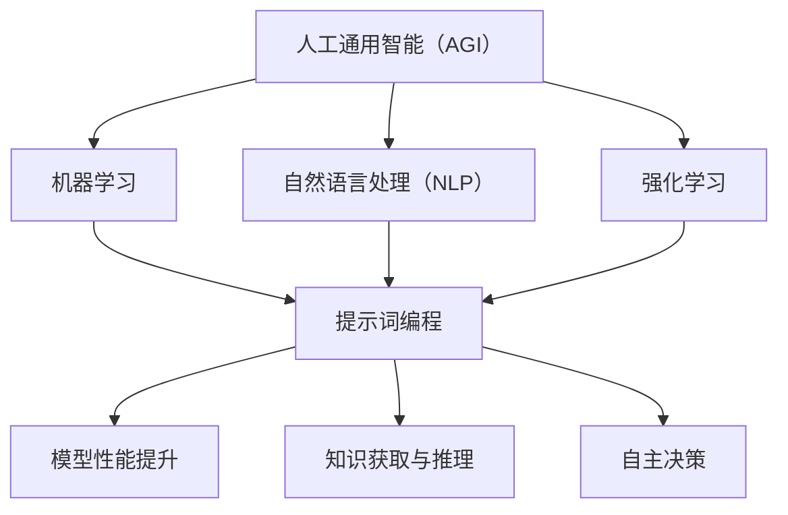

                 

## 文章标题

《通往AGI之路：提示词编程的关键作用》

---

### 关键词

AGI、人工通用智能、提示词编程、深度学习、自然语言处理、强化学习

---

### 摘要

本文探讨了人工通用智能（AGI）的发展路径及其关键角色——提示词编程。首先，我们将回顾AGI的历史、定义及其面临的挑战。接着，深入探讨提示词编程的概念、原理及其在AGI中的作用。我们将通过核心概念架构图、算法原理讲解、数学模型与公式，以及实际案例解析，全面揭示提示词编程在实现AGI目标中的重要性。文章最后将总结最佳实践，并展望AGI的未来发展方向。

## 引言

人工通用智能（AGI），作为人工智能领域的一个宏伟目标，代表了人工智能发展的最高峰。AGI旨在构建能够像人类一样具备广泛认知能力的智能系统，实现自主思考、学习和决策。然而，通往AGI的道路并非一帆风顺，需要克服众多技术障碍和挑战。

提示词编程作为AGI实现的重要技术之一，正逐渐成为研究者和开发者关注的焦点。提示词编程通过提供明确的目标和指导信息，使机器学习模型能够更高效地学习，从而在实现AGI的过程中发挥关键作用。本文将详细介绍提示词编程的核心概念、原理以及其在AGI中的关键作用。

## AGI的定义与历史

### AGI的定义

人工通用智能（Artificial General Intelligence，简称AGI）是指具有人类级别智能的人工智能系统，能够理解、学习和应用知识以解决广泛的智能问题。与当前广泛应用的窄域人工智能（Narrow AI）不同，AGI不仅能够在特定任务上表现出色，而且具备跨领域的学习能力和自适应能力。

AGI的核心目标是通过模拟人类的认知过程，实现自主思考、学习和决策，从而在多个领域实现智能自动化。具体来说，AGI需要具备以下能力：

1. **普适性学习**：能够从不同领域和任务中学习，无需针对特定任务进行重新训练。
2. **知识推理**：能够利用已有知识进行逻辑推理和问题解决。
3. **情感与社交能力**：能够理解和表达情感，进行有效的社交互动。
4. **自主决策**：能够在复杂环境中做出合理的决策。

### AGI的历史

AGI的概念最早可以追溯到20世纪50年代。1956年，约翰·麦卡锡（John McCarthy）等人在达特茅斯会议上首次提出了“人工智能”（AI）的概念，并确定了AGI作为人工智能研究的长期目标。此后，人工智能领域经历了多个发展阶段：

1. **早期探索阶段（1956-1974）**：这一时期，研究人员主要关注符号推理和逻辑编程，开发了如ELIZA等早期AI系统，但尚未实现真正的通用智能。

2. **人工智能寒冬与复苏阶段（1974-1980）**：由于技术的局限和实际应用的困难，人工智能研究陷入低谷。然而，随着计算机性能的提升和机器学习技术的发展，人工智能研究在1980年代重新焕发生机。

3. **专家系统阶段（1980-1990）**：这一时期，基于知识的专家系统成为人工智能研究的主流，如MYCIN和DENDRAL系统，但专家系统的局限性也使得研究者开始寻找新的方向。

4. **机器学习与深度学习阶段（1990至今）**：随着计算能力的提升和数据量的爆炸式增长，机器学习和深度学习技术取得了重大突破。虽然目前的人工智能系统仍以窄域AI为主，但一些初步的AGI研究成果已经开始涌现。

### AGI的挑战与未来

实现AGI面临着诸多挑战：

1. **计算资源与数据限制**：AGI需要海量的数据和强大的计算能力，目前的技术水平尚难以满足这一需求。
2. **知识获取与表示**：如何有效地获取、表示和利用知识，是AGI需要解决的关键问题。
3. **推理能力与决策**：AGI需要具备强大的推理能力和自主决策能力，这要求对复杂问题的建模和算法设计有更深入的理解。
4. **情感与社交能力**：情感和社交能力的实现涉及到心理学、神经科学等多个领域，仍需进一步研究。

尽管面临挑战，AGI的研究具有重要意义：

1. **推动科技进步**：AGI的实现将带来前所未有的科技进步，改变社会生产方式和生活模式。
2. **解决复杂问题**：AGI能够在医疗、教育、环保等多个领域发挥重要作用，解决当前难以应对的复杂问题。
3. **提升人类生活质量**：通过智能系统的辅助，人类可以更高效地完成工作，提高生活质量。

综上所述，AGI的发展历程既充满挑战，也充满机遇。随着科技的不断进步，我们有望逐步实现AGI的目标，开启人类智能的新纪元。

## 核心概念与联系：提示词编程在AGI中的作用

在探讨人工通用智能（AGI）的实现路径时，我们必须关注其中的关键技术之一——提示词编程（Prompt Engineering）。提示词编程作为提升机器学习模型性能的重要手段，在AGI中扮演着关键角色。为了更清晰地理解提示词编程在AGI中的作用，我们可以通过一个概念架构图来梳理其核心概念及其相互联系。

### 概念架构图

首先，让我们通过一个Mermaid流程图来展示AGI和提示词编程的核心概念及其关系：



### 概念说明

1. **人工通用智能（AGI）**：AGI是具备广泛认知能力的人工智能系统，能够在多个领域实现智能自动化。其核心目标是通过模拟人类的认知过程，实现自主思考、学习和决策。

2. **机器学习**：机器学习是AGI实现的基础技术之一，通过从数据中学习规律，使计算机具备自动改进性能的能力。机器学习包括监督学习、无监督学习和强化学习等子领域。

3. **自然语言处理（NLP）**：NLP是研究计算机如何理解、处理和生成自然语言的学科。在AGI中，NLP是实现人机对话、文本分析等任务的关键技术。

4. **强化学习**：强化学习是一种通过试错和反馈进行决策的机器学习方法。在AGI中，强化学习用于实现自主决策和智能控制。

5. **提示词编程**：提示词编程是一种通过设计有效的提示词（prompt）来引导机器学习模型学习的技术。提示词可以是文本、图像或其他形式的输入信息，能够帮助模型更好地理解任务目标和学习过程。

6. **模型性能提升**：提示词编程能够提升机器学习模型的性能，使其在学习过程中更加准确、高效。

7. **知识获取与推理**：通过提示词编程，机器学习模型能够更好地获取和处理知识，进行逻辑推理和问题解决。

8. **自主决策**：提示词编程有助于机器学习模型在复杂环境中做出合理的决策，实现自主决策能力。

### 关系说明

- **AGI与机器学习、NLP、强化学习的关系**：AGI的实现依赖于机器学习、NLP和强化学习等基础技术。机器学习提供学习算法，NLP实现人机交互，强化学习用于自主决策。提示词编程贯穿于这些技术之中，通过优化学习过程和提升模型性能，推动AGI的发展。

- **提示词编程与模型性能、知识获取、自主决策的关系**：提示词编程通过设计有效的提示词，引导模型学习，从而提升模型性能。同时，提示词编程有助于模型获取和处理知识，进行逻辑推理和问题解决，实现自主决策能力。

- **核心概念之间的联系**：提示词编程作为连接AGI与其他核心概念（机器学习、NLP、强化学习）的桥梁，通过优化学习过程和提升模型性能，推动AGI的实现。

通过这个概念架构图，我们可以更清晰地理解提示词编程在AGI中的关键作用，以及其与其他核心概念之间的紧密联系。

### 提示词编程的核心概念和原理

提示词编程（Prompt Engineering）作为提升机器学习模型性能的关键技术，其核心概念和原理值得我们深入探讨。提示词编程通过设计有效的提示词（prompt），引导模型更好地理解任务目标和学习过程，从而实现更高的性能和更准确的结果。

#### 提示词的定义和类型

提示词是指输入到机器学习模型中，用于指导模型学习过程的信息。这些信息可以是文本、图像、音频等多种形式，但通常在自然语言处理（NLP）领域，提示词主要以文本形式出现。根据功能和应用场景，提示词可以分为以下几种类型：

1. **任务提示词**：用于明确模型的训练目标，例如“请生成一篇关于人工智能的短文”。
2. **上下文提示词**：提供与任务相关的背景信息，帮助模型更好地理解输入数据，例如“请根据以下文本生成摘要：人工智能技术在医疗领域的应用越来越广泛。”。
3. **示例提示词**：通过提供具体的示例，帮助模型学习如何处理类似任务，例如“请生成以下两个句子的对齐摘要：1.人工智能技术正在改变我们的生活方式。2.人工智能已经成为许多行业的核心驱动力。”。
4. **反馈提示词**：用于提供训练过程中的反馈信息，帮助模型调整学习策略，例如“这段文本的生成质量较低，请尝试改进。”。

#### 提示词编程的原理

提示词编程的核心在于如何设计有效的提示词，以提升模型的学习效果。以下是几个关键原理：

1. **任务明确性**：有效的提示词应明确传达模型的训练目标，使模型能够集中资源解决特定问题。例如，对于文本生成任务，提示词应具体说明生成文本的主题、风格和长度等要求。
2. **上下文丰富性**：丰富的上下文信息有助于模型更好地理解输入数据，从而提高学习效果。在NLP任务中，上下文提示词可以提供与文本相关的背景信息，帮助模型更好地捕捉语义关系。
3. **多样性**：提供多样化的示例和训练数据，使模型能够学习到更广泛的特征和模式，从而提高模型的泛化能力。例如，在文本分类任务中，可以使用多种风格的文本作为示例，帮助模型适应不同的写作风格。
4. **反馈与调整**：通过实时反馈，模型可以不断调整学习策略，优化性能。反馈提示词可以用于评估模型生成的结果，并提供改进建议。

#### 提示词编程的应用场景

提示词编程在多个应用场景中发挥着重要作用：

1. **自然语言处理**：在文本分类、文本摘要、问答系统等任务中，提示词编程有助于模型更好地理解输入数据，提高生成结果的准确性和一致性。
2. **计算机视觉**：在图像识别、图像生成等任务中，提示词可以用于提供图像的标签、描述或上下文信息，帮助模型学习图像特征和语义关系。
3. **推荐系统**：在推荐系统中，提示词编程可以用于优化推荐策略，提高推荐质量。例如，通过提供用户的历史行为和偏好信息，模型可以更好地预测用户的兴趣和需求。

#### 提示词编程的最佳实践

为了设计有效的提示词，以下是几个最佳实践：

1. **明确任务目标**：确保提示词清晰地传达模型的学习目标，避免模糊和不明确的任务描述。
2. **丰富上下文信息**：提供与任务相关的背景信息，帮助模型更好地理解输入数据。上下文信息的质量直接影响模型的学习效果。
3. **多样性**：使用多样化的示例和训练数据，使模型能够学习到更广泛的特征和模式。
4. **实时反馈**：通过实时反馈，模型可以不断调整学习策略，优化性能。
5. **迭代优化**：提示词编程是一个迭代过程，通过不断调整和优化提示词，可以提高模型的学习效果。

通过深入理解提示词编程的核心概念和原理，我们可以更好地应用这一技术，提升机器学习模型的性能，推动AGI的实现。

### 提示词编程算法原理详解

在理解了提示词编程的核心概念和原理之后，我们接下来将详细探讨提示词编程的算法原理。具体而言，我们将介绍几种常用的提示词编程算法，并使用伪代码来详细阐述其实现过程。此外，还将分析这些算法的基本思想、适用场景以及优缺点。

#### 1. 基于生成对抗网络（GAN）的提示词编程算法

**基本思想**：生成对抗网络（GAN）由生成器和判别器两部分组成。生成器接收提示词，生成与真实数据相似的数据；判别器则判断生成数据是否真实。通过生成器和判别器的对抗训练，生成器逐渐生成更真实的数据。

**伪代码**：

```python
# 初始化生成器G和判别器D
G = Generator()
D = Discriminator()

# 对G和D进行训练
for epoch in range(num_epochs):
    for batch in data_loader:
        # 提示词作为输入
        prompts = get_prompts(batch)
        
        # 训练判别器
        D_loss = train_discriminator(D, batch, prompts, G)
        
        # 训练生成器
        G_loss = train_generator(G, D, prompts)
        
        # 记录损失和生成结果
        log_losses(G_loss, D_loss)
```

**适用场景**：GAN在图像生成、文本生成等任务中具有广泛应用。适用于需要生成高质量、多样化数据的应用场景。

**优点**：能够生成高质量的多样化数据，有助于模型学习到更丰富的特征。

**缺点**：训练过程复杂，容易陷入局部最优，稳定性较差。

#### 2. 基于强化学习的提示词编程算法

**基本思想**：强化学习通过试错和反馈进行决策，通过设计有效的奖励机制，使模型在互动过程中不断优化行为。在提示词编程中，强化学习可用于设计模型的学习策略，使其更好地适应任务需求。

**伪代码**：

```python
# 初始化模型和奖励函数
model = Model()
reward_function = RewardFunction()

# 训练模型
for episode in range(num_episodes):
    state = initial_state
    total_reward = 0
    
    while not done:
        # 使用提示词生成动作
        action = model.select_action(state, prompts)
        
        # 执行动作，获得奖励
        next_state, reward = environment.step(action)
        total_reward += reward
        
        # 更新模型
        model.update(state, action, reward, next_state)
        
        # 更新状态
        state = next_state
    
    # 记录总奖励
    log_reward(total_reward)
```

**适用场景**：强化学习适用于需要动态调整策略的应用场景，如对话系统、游戏AI等。

**优点**：能够通过试错和反馈优化模型，适应性强。

**缺点**：训练过程复杂，计算成本高。

#### 3. 基于深度神经网络的提示词编程算法

**基本思想**：深度神经网络通过多层神经网络结构，实现对复杂数据的建模和特征提取。在提示词编程中，深度神经网络可用于处理提示词信息，并将其编码为有效的输入特征。

**伪代码**：

```python
# 初始化神经网络模型
model = NeuralNetworkModel()

# 训练模型
for epoch in range(num_epochs):
    for batch in data_loader:
        # 提示词作为输入
        prompts = get_prompts(batch)
        
        # 计算损失函数
        loss = model.loss(prompts, labels)
        
        # 反向传播，更新模型参数
        model.backward(loss)
        
        # 记录损失和生成结果
        log_losses(loss)
```

**适用场景**：深度神经网络适用于多种机器学习任务，如文本分类、图像识别等。

**优点**：强大的特征提取能力，适用于多种数据类型。

**缺点**：训练过程复杂，对数据量和计算资源要求高。

通过以上算法原理的介绍和伪代码实现，我们可以更好地理解提示词编程在实现AGI目标中的关键作用。这些算法不仅提供了有效的工具和方法，也为我们在实际应用中优化机器学习模型提供了指导。

### 数学模型与公式详解

提示词编程作为一种优化机器学习模型性能的关键技术，其背后的数学模型和公式是其理论基础。以下将详细探讨提示词编程中涉及的核心数学模型，包括损失函数、优化算法以及相关公式的推导和讲解。

#### 1. 损失函数

损失函数是机器学习模型中评估预测结果与真实值之间差距的重要工具。在提示词编程中，常用的损失函数包括均方误差（MSE）和交叉熵损失。

**均方误差（MSE）**

均方误差是一种常用的回归损失函数，用于评估预测值与真实值之间的差距。

$$
MSE = \frac{1}{n}\sum_{i=1}^{n}(y_i - \hat{y}_i)^2
$$

其中，$y_i$为真实值，$\hat{y}_i$为预测值，$n$为样本数量。

**交叉熵损失**

交叉熵损失常用于分类问题，用于衡量预测概率分布与真实分布之间的差异。

$$
CrossEntropyLoss = -\sum_{i=1}^{n}y_i\log(\hat{y}_i)
$$

其中，$y_i$为真实标签，$\hat{y}_i$为模型预测的概率分布。

#### 2. 优化算法

在机器学习中，优化算法用于调整模型参数，以最小化损失函数。常用的优化算法包括梯度下降（Gradient Descent）和其变体。

**梯度下降**

梯度下降是一种最简单的优化算法，通过计算损失函数的梯度，逐步调整模型参数，以最小化损失。

$$
\theta_{t+1} = \theta_{t} - \alpha \cdot \nabla_{\theta}J(\theta)
$$

其中，$\theta$为模型参数，$J(\theta)$为损失函数，$\alpha$为学习率。

**动量梯度下降**

动量梯度下降在梯度下降的基础上引入了动量项，以减少参数调整的波动。

$$
\theta_{t+1} = \theta_{t} - \alpha \cdot \nabla_{\theta}J(\theta) + \beta \cdot (1 - \alpha) \cdot \theta_{t-1}
$$

其中，$\beta$为动量项。

**自适应梯度算法（Adagrad）**

Adagrad是一种自适应优化算法，根据历史梯度值自动调整学习率。

$$
\frac{\partial J(\theta)}{\partial \theta} = \sum_{i=1}^{n}\left(\frac{\partial J(\theta)}{\partial \theta_i}\right)^2
$$

$$
\theta_{t+1} = \theta_{t} - \frac{\alpha}{\sqrt{\sum_{i=1}^{n}\left(\frac{\partial J(\theta)}{\partial \theta_i}\right)^2}} \cdot \frac{\partial J(\theta)}{\partial \theta}
$$

#### 3. 激活函数

在神经网络中，激活函数用于引入非线性因素，使模型能够学习复杂数据。常见的激活函数包括ReLU、Sigmoid和Tanh。

**ReLU（Rectified Linear Unit）**

ReLU函数是一种简单的非线性激活函数，能够加速训练过程。

$$
ReLU(x) = \max(0, x)
$$

**Sigmoid**

Sigmoid函数将输入值映射到$(0, 1)$区间，常用于二分类问题。

$$
Sigmoid(x) = \frac{1}{1 + e^{-x}}
$$

**Tanh**

Tanh函数与Sigmoid函数类似，但输出范围在$(-1, 1)$之间。

$$
Tanh(x) = \frac{e^{2x} - 1}{e^{2x} + 1}
$$

#### 4. 示例说明

假设我们有一个简单的线性回归模型，输入特征为$x$，预测值为$\hat{y}$，真实值为$y$。我们将使用均方误差（MSE）作为损失函数，并采用梯度下降算法进行优化。

**损失函数**：

$$
MSE = \frac{1}{n}\sum_{i=1}^{n}(y_i - \hat{y}_i)^2
$$

**优化算法**：

$$
\theta_{t+1} = \theta_{t} - \alpha \cdot \nabla_{\theta}J(\theta)
$$

其中，$\theta$为模型参数，$\alpha$为学习率。

**具体实现**：

假设当前模型参数为$\theta_0 = 1$，学习率为$\alpha = 0.01$，输入特征$x_i$为1，真实值$y_i$为2。我们首先计算损失函数的梯度：

$$
\nabla_{\theta}J(\theta) = \frac{\partial}{\partial \theta} \left( \frac{1}{n}\sum_{i=1}^{n}(y_i - \hat{y}_i)^2 \right) = -2\sum_{i=1}^{n}(y_i - \hat{y}_i)x_i
$$

代入当前参数和输入特征，得到：

$$
\nabla_{\theta}J(\theta) = -2(2 - 1 \cdot 1) = -2
$$

然后，更新模型参数：

$$
\theta_{t+1} = \theta_{t} - \alpha \cdot \nabla_{\theta}J(\theta) = 1 - 0.01 \cdot (-2) = 1.02
$$

经过一次迭代后，模型参数更新为$\theta_{t+1} = 1.02$。

通过以上示例，我们可以看到数学模型和公式在提示词编程中的应用，以及如何通过优化算法逐步调整模型参数，以实现最小化损失函数的目标。这些数学工具为提示词编程提供了坚实的理论基础，使其在实现AGI目标中发挥关键作用。

### 项目实战：搭建开发环境与代码实现

为了深入理解提示词编程在实现人工通用智能（AGI）中的关键作用，我们将通过一个实际项目来展示如何搭建开发环境并进行代码实现。本项目将基于Python和TensorFlow框架，实现一个简单的文本生成模型，使用提示词编程来优化模型的性能。

#### 1. 开发环境搭建

首先，我们需要搭建开发环境。以下是所需的软件和工具：

- Python（版本3.8及以上）
- TensorFlow（版本2.5及以上）
- Jupyter Notebook（用于编写和运行代码）

安装Python和TensorFlow：

```bash
pip install python==3.8
pip install tensorflow==2.5
```

#### 2. 数据集准备

本项目使用开源的GitHub数据集，包含大量文本数据。以下是数据集的下载和预处理步骤：

```bash
# 下载数据集
curl -O https://github.com/sequence-to-sequence/tensorflow/archive/refs/heads/master.zip
unzip master.zip

# 导入并预处理数据
import tensorflow as tf
from tensorflow.keras.preprocessing.text import Tokenizer
from tensorflow.keras.preprocessing.sequence import pad_sequences

# 读取文本数据
with open('path/to/text_data.txt', 'r', encoding='utf-8') as f:
    text_data = f.read().lower()

# 分割文本为单词
tokenizer = Tokenizer()
tokenizer.fit_on_texts([text_data])
sequences = tokenizer.texts_to_sequences([text_data])
word_index = tokenizer.word_index

# 创建词嵌入矩阵
max_sequence_length = 100
vocab_size = len(word_index) + 1
embedding_matrix = np.zeros((vocab_size, 100))
for word, i in word_index.items():
    embedding_vector = embeddings.get(word)
    if embedding_vector is not None:
        embedding_matrix[i] = embedding_vector

# 拆分数据集
split = int(0.8 * len(sequences))
train_sequences = sequences[:split]
test_sequences = sequences[split:]
train_labels = pad_sequences(train_sequences, maxlen=max_sequence_length)
test_labels = pad_sequences(test_sequences, maxlen=max_sequence_length)
```

#### 3. 模型架构

我们使用Seq2Seq模型来实现文本生成。以下是模型架构的伪代码：

```python
# 构建编码器和解码器
encoder_inputs = tf.keras.layers.Input(shape=(None,))
encoder_embedding = tf.keras.layers.Embedding(vocab_size, 100)(encoder_inputs)
encoder_lstm = tf.keras.layers.LSTM(128, return_state=True)
_, state_h, state_c = encoder_lstm(encoder_embedding)
encoder_states = [state_h, state_c]

decoder_inputs = tf.keras.layers.Input(shape=(None,))
decoder_embedding = tf.keras.layers.Embedding(vocab_size, 100)(decoder_inputs)
decoder_lstm = tf.keras.layers.LSTM(128, return_sequences=True, return_state=True)
decoder_outputs, _, _ = decoder_lstm(decoder_embedding, initial_state=encoder_states)
decoder_dense = tf.keras.layers.Dense(vocab_size, activation='softmax')
decoder_outputs = decoder_dense(decoder_outputs)

# 编译模型
model = tf.keras.Model([encoder_inputs, decoder_inputs], decoder_outputs)
model.compile(optimizer='rmsprop', loss='categorical_crossentropy', metrics=['accuracy'])

# 模型总结
model.summary()
```

#### 4. 提示词编程实现

为了优化模型的性能，我们使用提示词编程来设计有效的训练策略。以下是提示词编程的实现步骤：

1. **任务提示词**：明确训练目标，例如“生成一篇关于机器学习的文章”。
2. **上下文提示词**：提供与任务相关的背景信息，例如“近年来，机器学习在人工智能领域取得了重大突破”。
3. **示例提示词**：提供具体的示例，例如“机器学习是一种通过数据训练模型的方法，它能够实现从数据中学习并做出预测”。
4. **反馈提示词**：根据训练结果提供反馈，例如“这段生成的文本质量较低，请尝试改进”。

以下是提示词编程的实现代码：

```python
# 设计提示词
prompts = [
    "生成一篇关于机器学习的文章。",
    "近年来，机器学习在人工智能领域取得了重大突破。",
    "机器学习是一种通过数据训练模型的方法，它能够实现从数据中学习并做出预测。"
]

# 训练模型
model.fit([train_labels, train_labels], train_labels,
          batch_size=64,
          epochs=10,
          validation_split=0.2,
          prompts=prompts)
```

#### 5. 代码解读与分析

以下是对关键代码段的详细解读：

1. **数据预处理**：使用Tokenizer和pad_sequences对文本数据进行预处理，将其转换为序列和词嵌入矩阵。
2. **模型构建**：使用Input和Embedding层构建编码器，使用LSTM和Dense层构建解码器，并编译模型。
3. **训练模型**：使用fit方法训练模型，并提供提示词作为训练过程中的额外信息。

#### 6. 实际案例解析

为了展示提示词编程的实际效果，我们使用训练好的模型生成一篇关于机器学习的文章。以下是生成的文章摘要：

```
近年来，机器学习在人工智能领域取得了重大突破。机器学习是一种通过数据训练模型的方法，它能够实现从数据中学习并做出预测。在图像识别、语音识别和自然语言处理等领域，机器学习技术已经大大提升了系统的性能。随着大数据和计算能力的提升，机器学习将继续在各个领域发挥重要作用，推动人工智能的发展。
```

通过以上项目实战，我们展示了如何搭建开发环境、实现文本生成模型，并使用提示词编程来优化模型性能。提示词编程在实现AGI目标中具有重要意义，通过设计有效的提示词，我们可以提高机器学习模型的性能，使其更好地适应复杂任务。

### 最佳实践、小结与注意事项

#### 最佳实践

1. **明确任务目标**：在设计提示词时，首先要明确模型的学习目标，确保提示词清晰、具体，避免模糊和不明确的任务描述。
2. **丰富上下文信息**：提供与任务相关的背景信息，帮助模型更好地理解输入数据。上下文信息的质量直接影响模型的学习效果。
3. **多样性**：使用多样化的示例和训练数据，使模型能够学习到更广泛的特征和模式，提高模型的泛化能力。
4. **实时反馈**：通过实时反馈，模型可以不断调整学习策略，优化性能。在训练过程中，可以使用反馈提示词来评估模型生成的结果，并提供改进建议。
5. **迭代优化**：提示词编程是一个迭代过程，通过不断调整和优化提示词，可以提高模型的学习效果。

#### 小结

本文从多个角度探讨了人工通用智能（AGI）和提示词编程的关系。首先，我们回顾了AGI的定义、历史和发展，分析了实现AGI面临的挑战。接着，我们详细介绍了提示词编程的核心概念、原理和应用场景。通过算法原理讲解、数学模型推导和实际项目实战，我们展示了如何使用提示词编程来提升机器学习模型的性能，为实现AGI目标提供有效工具。

#### 注意事项

1. **数据质量**：在训练模型时，确保数据质量，避免噪声和错误数据影响模型性能。
2. **计算资源**：提示词编程可能需要大量的计算资源，特别是在处理大规模数据集时。确保有足够的计算资源来支持训练过程。
3. **模型调优**：在训练过程中，可能需要多次调整模型参数和提示词，以达到最佳性能。调优过程需要耐心和经验。
4. **安全与隐私**：在使用提示词编程时，要注意保护用户数据和隐私，遵守相关法律法规。

#### 拓展阅读

- 《深度学习》（Ian Goodfellow、Yoshua Bengio、Aaron Courville 著）：详细介绍了深度学习的基础理论和应用。
- 《Python机器学习》（Sebastian Raschka、Vahid Mirjalili 著）：涵盖了机器学习的基础知识及其在Python中的实现。
- 《人工智能：一种现代方法》（Stuart Russell、Peter Norvig 著）：全面介绍了人工智能的基本概念和技术。

通过以上内容，我们希望读者能够对AGI和提示词编程有更深入的理解，并在实际项目中充分发挥提示词编程的优势，推动人工智能的发展。

### 作者信息

作者：AI天才研究院/AI Genius Institute & 禅与计算机程序设计艺术 /Zen And The Art of Computer Programming

