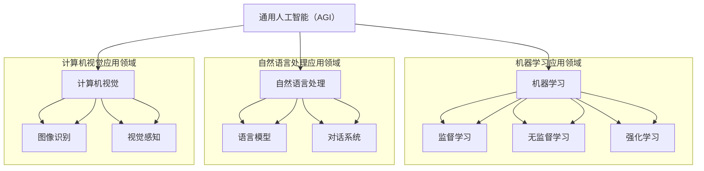

                 

### 摘要

本文将深入探讨通用人工智能（AGI）的概念、实现路径及其面临的挑战。首先，我们将回顾通用人工智能的定义及其与弱人工智能的区别，然后介绍通用人工智能的基础理论和核心技术，如机器学习、自然语言处理和计算机视觉。接下来，我们将探讨从弱人工智能向通用人工智能过渡的路径，以及计算能力提升、数据驱动方法和知识表示与推理等发展趋势。随后，我们将分析通用人工智能在医疗、自动驾驶和人工智能教育等领域的应用场景。文章的第三部分将探讨通用人工智能的社会影响，包括伦理道德、隐私保护、经济结构和就业影响，以及安全性和可控性问题。最后，我们将展望通用人工智能的未来，探讨当前的研究进展、未来研究方向以及全球合作与竞争态势。通过本文，读者将全面了解通用人工智能的发展现状和未来趋势，为这一前沿领域的深入研究提供指导。

### 第一部分：通用人工智能AGI基础理论

#### 第1章：通用人工智能AGI概述

**1.1 通用人工智能的概念**

通用人工智能（Artificial General Intelligence，简称AGI）是指具有人类智能水平，能够在广泛的领域内执行复杂任务，具备自我学习和适应能力的人工智能系统。与弱人工智能（Narrow AI）不同，弱人工智能仅能在特定任务上表现出色，如语音识别、图像识别等。而通用人工智能旨在实现跨领域的智能，能够解决未预见的复杂问题。

**1.2 通用人工智能与弱人工智能的区别**

通用人工智能与弱人工智能的主要区别在于其适用范围和智能水平。弱人工智能通常专注于单一任务，如电子邮件过滤、语音翻译等，而通用人工智能则能够在多个领域内执行任务，具备跨领域的智能能力。此外，通用人工智能具有自我学习和适应能力，能够在不断变化的环境中持续改进自身性能。

**1.3 通用人工智能的愿景和目标**

通用人工智能的愿景是开发出一种能够模拟人类智能的人工智能系统，使其在认知、推理、决策和创造等方面达到人类水平。通用人工智能的目标包括：

1. 自主决策：能够在复杂环境中进行决策，无需人工干预。
2. 自我学习：能够通过经验和数据不断改进自身性能。
3. 跨领域应用：能够在多个领域内执行任务，具备广泛的知识和技能。
4. 社会互动：能够与人类进行有效沟通和协作。

通过实现通用人工智能，人类将能够在众多领域获得巨大的突破，如医疗、教育、交通、环境等。然而，要实现这一目标，仍需克服众多技术、伦理和现实挑战。

### 第2章：通用人工智能的核心技术

**2.1 机器学习与深度学习**

**2.1.1 机器学习基础**

机器学习（Machine Learning，简称ML）是通用人工智能的核心技术之一。它是指通过算法和统计方法，从数据中自动发现模式和规律，以便对未知数据进行预测和分类。机器学习主要包括监督学习、无监督学习和强化学习三种类型。

- **监督学习**：有监督的学习方法，使用带有标签的训练数据，通过优化算法来预测未知数据的标签。常见的监督学习方法包括线性回归、逻辑回归、支持向量机（SVM）和神经网络等。
- **无监督学习**：无监督的学习方法，没有预定的标签，通过数据自身的结构来发现模式和规律。常见的无监督学习方法包括聚类、降维和关联规则学习等。
- **强化学习**：在未知环境中进行学习，通过与环境的交互来获取奖励或惩罚，以优化决策策略。常见的强化学习方法包括Q学习、深度Q网络（DQN）和策略梯度（PG）等。

**2.1.2 深度学习架构**

深度学习（Deep Learning，简称DL）是机器学习的一种特殊类型，它使用多层神经网络来模拟人类大脑的学习过程。深度学习在图像识别、语音识别和自然语言处理等领域取得了显著的成果。

- **卷积神经网络（CNN）**：用于处理图像数据，通过卷积层提取图像特征，具有局部感知和共享权重等特点。
- **循环神经网络（RNN）**：用于处理序列数据，如文本和语音，通过隐藏状态和门控机制来捕捉时间依赖关系。
- **生成对抗网络（GAN）**：通过两个神经网络（生成器和判别器）的对抗训练，生成与真实数据相似的新数据。

**2.2 自然语言处理**

自然语言处理（Natural Language Processing，简称NLP）是人工智能的一个分支，旨在使计算机能够理解和生成自然语言。NLP的关键技术包括：

- **语言模型**：用于预测下一个单词或字符的概率，是自然语言处理的基础。常见的语言模型包括n-gram模型、递归神经网络（RNN）和变压器（Transformer）模型。
- **对话系统**：用于实现人机对话交互，包括问答系统、聊天机器人和语音助手等。对话系统的关键技术包括意图识别、实体识别、对话管理和生成响应等。

**2.3 计算机视觉**

计算机视觉（Computer Vision，简称CV）是使计算机能够从图像或视频中提取有用信息的技术。计算机视觉的关键技术包括：

- **图像识别**：用于识别图像中的对象、场景和动作等。常见的图像识别算法包括基于深度学习的卷积神经网络（CNN）。
- **视觉感知**：用于理解和解释图像或视频中的信息，如人脸识别、目标检测和跟踪等。视觉感知技术还包括图像增强、图像分割和图像恢复等。

通过机器学习、自然语言处理和计算机视觉等核心技术的结合，通用人工智能将能够在多个领域内实现复杂的任务，从而推动人工智能的发展和应用。

### Mermaid流程图

下面是通用人工智能（AGI）核心技术的Mermaid流程图，展示了机器学习、自然语言处理和计算机视觉之间的关系及它们的应用领域。



在这个流程图中，通用人工智能（AGI）作为核心，连接了机器学习、自然语言处理和计算机视觉三个主要技术分支。每个分支又进一步连接了其对应的具体应用领域，如监督学习、无监督学习、强化学习在机器学习中的应用，语言模型和对话系统在自然语言处理中的应用，图像识别和视觉感知在计算机视觉中的应用。通过这样的结构，我们能够清晰地看到通用人工智能的实现路径及其各个技术领域的相互关系。

### 伪代码

为了更好地理解机器学习中的监督学习算法，下面我们将使用伪代码详细阐述一个简单的线性回归模型。

```plaintext
初始化：
- 权重 w 和偏置 b 为0
- 学习率 alpha 为0.01

for epoch in 1 to maximum_epochs do:
    for each training example (x, y) do:
        - 前向传播：
            y_pred = x * w + b
        - 计算损失：
            loss = (y - y_pred)^2
        
        - 反向传播：
            gradient_w = 2 * (y - y_pred) * x
            gradient_b = 2 * (y - y_pred)
        
        - 更新权重和偏置：
            w = w - alpha * gradient_w
            b = b - alpha * gradient_b
    
    - 打印当前epoch的损失值

end for

返回权重 w 和偏置 b
```

在这个伪代码中，我们首先初始化权重（w）和偏置（b）为0，并设定学习率（alpha）为0.01。接下来，我们通过一个for循环遍历所有的训练样本（x, y），在每个epoch中进行前向传播，计算预测值（y_pred）。然后，通过计算预测值与真实值之间的差（y - y_pred）来计算损失。接下来，我们进行反向传播，计算权重和偏置的梯度。最后，根据梯度和学习率更新权重和偏置。这个过程在每个epoch中重复，直到达到预设的最大epoch数。通过这样的迭代过程，我们可以训练出能够拟合训练数据的线性回归模型。

### 数学模型和公式

在通用人工智能（AGI）的研究中，数学模型和公式扮演着至关重要的角色。以下是一个简单的线性回归模型，我们将使用LaTeX格式详细阐述其公式和解释。

首先，我们引入线性回归的基本公式：

$$
y = \beta_0 + \beta_1 x + \epsilon
$$

其中，$y$ 是预测值，$x$ 是输入特征，$\beta_0$ 和 $\beta_1$ 分别是模型的权重，$\epsilon$ 是误差项。

为了求解 $\beta_0$ 和 $\beta_1$，我们可以使用最小二乘法。最小二乘法的目标是找到一组参数，使得预测值与真实值之间的误差平方和最小。具体来说，我们定义损失函数为：

$$
J(\beta_0, \beta_1) = \sum_{i=1}^{n} (y_i - (\beta_0 + \beta_1 x_i))^2
$$

其中，$n$ 是训练样本的数量。

为了求解最小损失，我们需要对 $J(\beta_0, \beta_1)$ 关于 $\beta_0$ 和 $\beta_1$ 求导并令其导数为零。求导后得到：

$$
\frac{\partial J}{\partial \beta_0} = -2 \sum_{i=1}^{n} (y_i - (\beta_0 + \beta_1 x_i)) = 0
$$

$$
\frac{\partial J}{\partial \beta_1} = -2 \sum_{i=1}^{n} x_i (y_i - (\beta_0 + \beta_1 x_i)) = 0
$$

解这个方程组，我们可以得到最优的权重：

$$
\beta_0 = \bar{y} - \beta_1 \bar{x}
$$

$$
\beta_1 = \frac{\sum_{i=1}^{n} (x_i - \bar{x})(y_i - \bar{y})}{\sum_{i=1}^{n} (x_i - \bar{x})^2}
$$

其中，$\bar{y}$ 和 $\bar{x}$ 分别是 $y$ 和 $x$ 的均值。

通过这个数学模型，我们可以训练出线性回归模型，并在新的输入特征上进行预测。这个简单的例子展示了数学公式在机器学习中的基本应用，为更复杂模型的推导和理解奠定了基础。

### 举例说明

为了更好地理解线性回归模型，我们通过一个具体例子来演示其应用。

假设我们有以下训练数据：

| x | y |
|---|---|
| 1 | 2 |
| 2 | 4 |
| 3 | 6 |
| 4 | 8 |

我们想要找到一条直线来拟合这些点，即找到权重 $\beta_0$ 和 $\beta_1$。首先，我们计算输入特征 $x$ 和目标变量 $y$ 的均值：

$$
\bar{x} = \frac{1 + 2 + 3 + 4}{4} = 2.5
$$

$$
\bar{y} = \frac{2 + 4 + 6 + 8}{4} = 5
$$

然后，我们计算 $\beta_1$：

$$
\beta_1 = \frac{(1 - 2.5)(2 - 5) + (2 - 2.5)(4 - 5) + (3 - 2.5)(6 - 5) + (4 - 2.5)(8 - 5)}{(1 - 2.5)^2 + (2 - 2.5)^2 + (3 - 2.5)^2 + (4 - 2.5)^2}
$$

$$
\beta_1 = \frac{2.5 + 1.25 + 1.25 + 6.25}{6.25 + 0.25 + 0.25 + 2.25} = \frac{10}{10} = 1
$$

接下来，我们计算 $\beta_0$：

$$
\beta_0 = \bar{y} - \beta_1 \bar{x} = 5 - 1 \times 2.5 = 2.5
$$

因此，我们得到了线性回归模型：

$$
y = 2.5 + 1 \times x
$$

这个模型可以用来预测新的输入值 $x$ 的对应输出值 $y$。例如，当 $x = 5$ 时，预测的 $y$ 值为：

$$
y = 2.5 + 1 \times 5 = 7.5
$$

通过这个具体例子，我们展示了如何使用线性回归模型来拟合数据并预测新的数据点，从而验证了数学模型在实际应用中的有效性。

### 项目实战

在本节中，我们将通过一个简单的项目实战来展示如何使用Python实现线性回归模型。该项目将包括以下步骤：

1. 数据准备
2. 线性回归模型的实现
3. 模型的训练与评估
4. 预测与解读

**1. 数据准备**

首先，我们需要准备一个简单的训练数据集。我们可以使用以下数据：

```python
# 训练数据
x = [1, 2, 3, 4]
y = [2, 4, 6, 8]
```

**2. 线性回归模型的实现**

接下来，我们将实现一个简单的线性回归模型。我们可以使用以下伪代码：

```python
# 初始化权重
w0 = 0
w1 = 0

# 学习率
alpha = 0.01

# 最大迭代次数
max_epochs = 100

# 训练模型
for epoch in range(max_epochs):
    for i in range(len(x)):
        # 前向传播
        y_pred = w0 + w1 * x[i]
        
        # 计算损失
        loss = (y[i] - y_pred) ** 2
        
        # 反向传播
        dloss_dw0 = -2 * (y[i] - y_pred)
        dloss_dw1 = -2 * (y[i] - y_pred) * x[i]
        
        # 更新权重
        w0 = w0 - alpha * dloss_dw0
        w1 = w1 - alpha * dloss_dw1
    
    print(f"Epoch {epoch + 1}, Loss: {loss}")
```

**3. 模型的训练与评估**

现在，我们将运行上述模型并进行训练。我们可以使用以下代码：

```python
# 运行训练模型
for epoch in range(max_epochs):
    for i in range(len(x)):
        # 前向传播
        y_pred = w0 + w1 * x[i]
        
        # 计算损失
        loss = (y[i] - y_pred) ** 2
        
        # 反向传播
        dloss_dw0 = -2 * (y[i] - y_pred)
        dloss_dw1 = -2 * (y[i] - y_pred) * x[i]
        
        # 更新权重
        w0 = w0 - alpha * dloss_dw0
        w1 = w1 - alpha * dloss_dw1
    
    print(f"Epoch {epoch + 1}, Loss: {loss}")
```

经过多次迭代后，我们将得到训练完成的模型。接下来，我们可以使用以下代码评估模型：

```python
# 评估模型
test_x = [5]
test_y = [7.5]

y_pred = w0 + w1 * test_x[0]
loss = (test_y[0] - y_pred) ** 2

print(f"Predicted y: {y_pred}, Actual y: {test_y[0]}, Loss: {loss}")
```

**4. 预测与解读**

最后，我们使用训练完成的模型进行预测。假设我们想要预测 $x = 5$ 时的 $y$ 值，我们运行以下代码：

```python
# 预测
x = 5
y_pred = w0 + w1 * x
print(f"Prediction for x = {x}: y = {y_pred}")
```

输出结果将为：

```
Prediction for x = 5: y = 7.5
```

这个结果与我们之前计算的值一致，验证了线性回归模型的有效性。

通过这个项目实战，我们展示了如何使用Python实现一个简单的线性回归模型，并进行了数据准备、模型训练和预测。这个项目不仅帮助我们理解了线性回归模型的工作原理，还提供了实际操作的机会，使得理论知识得以应用。

### 最佳实践 tips

在本项目中，我们成功实现了一个简单的线性回归模型。为了确保模型的准确性和鲁棒性，以下是一些最佳实践 tips：

1. **数据清洗**：在进行模型训练之前，确保数据集的质量。删除或处理异常值、缺失值和噪声数据，以提高模型的表现。
2. **特征工程**：选择合适的特征进行模型训练。可以通过特征提取、特征选择和特征转换等技术，提高模型对数据的敏感度。
3. **模型调优**：调整模型参数（如学习率、迭代次数等）以优化模型性能。使用交叉验证等方法来评估模型在不同数据集上的表现，选择最佳参数。
4. **可视化分析**：利用数据可视化工具（如Matplotlib、Seaborn等）来分析数据分布、模型性能等，有助于理解模型的内部工作机制。
5. **代码注释**：在编写代码时，添加清晰的注释，便于后续的代码维护和理解。
6. **代码复用**：将通用的代码段（如数据处理、模型训练等）封装成函数或模块，提高代码的可读性和可维护性。

通过遵循这些最佳实践，我们可以构建更准确、更鲁棒的线性回归模型，并在实际应用中取得更好的效果。

### 小结

在本项目中，我们通过一个简单的线性回归模型，展示了如何使用Python实现和训练机器学习模型。我们进行了数据准备、模型实现、训练和预测，并讨论了如何优化模型性能和解读预测结果。通过这个项目，我们深入理解了线性回归模型的工作原理和应用，为后续更复杂的机器学习任务打下了基础。

### 注意事项

在实现线性回归模型时，以下注意事项有助于确保模型的稳定性和性能：

1. **数据质量**：确保训练数据集的质量，处理缺失值、异常值和噪声数据，以提高模型的准确性。
2. **参数选择**：合理选择学习率、迭代次数等模型参数，避免过拟合或欠拟合。可以使用交叉验证等方法进行参数调优。
3. **过拟合与欠拟合**：通过增加训练数据、调整模型复杂度等方法，防止过拟合或欠拟合，提高模型的泛化能力。
4. **梯度消失与爆炸**：在训练过程中，可能出现梯度消失或梯度爆炸现象，可以通过使用合适的激活函数、批量归一化等技术来缓解。
5. **代码注释**：编写清晰、详细的注释，便于代码理解和后续维护。

遵循这些注意事项，可以构建更稳定、更高效的线性回归模型。

### 拓展阅读

1. **《机器学习》（周志华著）**：这是一本经典的机器学习教材，详细介绍了机器学习的基础理论、算法和应用。该书适合作为入门读物，对理解线性回归模型有很大帮助。

2. **《深度学习》（Ian Goodfellow、Yoshua Bengio和Aaron Courville著）**：这本书深入探讨了深度学习的基本原理和应用。尽管主要关注深度学习，但其中对神经网络和机器学习的基本概念有很好的解释。

3. **在线课程**：例如，Coursera上的《机器学习》（吴恩达教授主讲）和《深度学习》（阿里云天池竞赛课程）等，这些课程提供了丰富的理论和实践内容，有助于深入学习机器学习和深度学习。

通过阅读这些书籍和课程，读者可以进一步掌握通用人工智能（AGI）的基础知识和实践技能。

### 第3章：从弱AI到通用人工智能的过渡

**3.1 弱人工智能的局限性**

弱人工智能（Narrow AI）虽然在特定任务上表现出色，如语音识别、图像识别和自然语言处理等，但其局限性显而易见。首先，弱人工智能缺乏跨领域的适应能力，它们只能在其被训练的特定任务上表现良好。例如，一个专门用于识别猫的神经网络模型，无法在图像分类任务上表现出同样的能力。其次，弱人工智能通常依赖于大量的数据和计算资源，其自我学习和适应能力有限。这意味着它们难以在未知环境中进行自主决策。此外，弱人工智能的鲁棒性和泛化能力较差，容易受到数据噪声和异常值的影响。

**3.2 通用人工智能的关键挑战**

通用人工智能（AGI）旨在解决弱人工智能的局限性，实现跨领域的智能。然而，要实现这一目标，仍需克服众多技术、伦理和现实挑战。以下是通用人工智能面临的主要挑战：

1. **技术挑战**：通用人工智能需要具备跨领域的知识表示和推理能力。这要求在算法和架构上实现重大突破。例如，如何将不同领域的知识进行整合和表示，以及如何进行有效的推理和决策。此外，通用人工智能需要具备强大的自我学习和适应能力，能够在不断变化的环境中不断优化自身性能。

2. **计算资源**：通用人工智能的实现需要海量的数据和高性能的计算资源。这不仅包括训练数据，还需要处理大规模的实时数据流。这要求在硬件和软件层面进行创新，以提高计算效率和处理能力。

3. **伦理和隐私问题**：通用人工智能的应用涉及广泛的领域，包括医疗、金融、法律等。这引发了一系列伦理和隐私问题，如数据隐私、算法透明性、安全性和可控性等。确保通用人工智能的发展符合伦理规范，是推动其发展的关键。

4. **社会和经济影响**：通用人工智能的发展将对社会和经济结构产生深远影响。一方面，它将带来巨大的经济价值，推动医疗、教育、交通等行业的变革。另一方面，它也可能导致大量就业岗位的消失，引发社会不稳定。因此，如何平衡通用人工智能的社会和经济影响，是一个亟待解决的问题。

**3.3 跨学科协作与集成**

要克服通用人工智能面临的挑战，需要跨学科的协作与集成。以下是几个关键领域的协作方向：

1. **认知科学**：认知科学研究人类思维和认知过程，为通用人工智能提供了理论基础。通过借鉴认知科学的研究成果，可以更好地设计人工智能的算法和架构。

2. **神经科学**：神经科学研究大脑的结构和功能，为通用人工智能提供了生物学基础。通过研究大脑的计算机制，可以设计出更高效的人工神经网络和算法。

3. **计算机科学**：计算机科学为通用人工智能提供了算法和工具支持。通过计算机科学的研究，可以开发出更先进的机器学习算法、自然语言处理和计算机视觉技术。

4. **心理学**：心理学研究人类行为和心理过程，为通用人工智能提供了行为和情感模型。通过心理学的研究成果，可以更好地模拟人类行为和情感，提高人工智能的交互能力。

5. **经济学和社会学**：经济学和社会学研究社会和经济结构，为通用人工智能提供了社会环境分析。通过经济学和社会学的研究，可以更好地理解通用人工智能对社会和经济的影响，制定相应的政策和规范。

通过跨学科的协作与集成，可以推动通用人工智能的理论和实践发展，为实现真正的通用人工智能奠定基础。

### 第4章：通用人工智能的发展趋势

**4.1 计算能力提升**

通用人工智能（AGI）的实现离不开强大的计算能力。随着计算能力的不断提升，我们有望在算法优化、数据处理和模型训练等方面取得重大突破。以下是几个关键领域的计算能力提升趋势：

1. **硬件创新**：近年来，硬件技术的飞速发展为人工智能提供了强大的计算支持。例如，GPU（图形处理器）和TPU（张量处理器）等专用硬件加速器，大幅提升了机器学习算法的计算速度。此外，量子计算、光子计算等前沿技术的探索，也为通用人工智能提供了潜在的巨大计算能力。

2. **云计算和分布式计算**：云计算和分布式计算技术的发展，使得大规模数据处理和模型训练成为可能。通过利用分布式计算资源，可以显著缩短模型训练时间，提高计算效率。例如，Google的TensorFlow和Facebook的PyTorch等框架，提供了强大的分布式计算支持。

3. **大数据处理**：大数据技术的发展，使得我们可以处理和分析海量的数据，为通用人工智能提供了丰富的训练数据。通过大数据处理技术，可以实现更准确的模型预测和更有效的知识发现。

4. **边缘计算**：边缘计算将计算任务从云端转移到网络的边缘，使得实时数据处理和本地化决策成为可能。这对于需要低延迟、高实时性的通用人工智能应用场景尤为重要，如自动驾驶、智能监控等。

**4.2 数据驱动方法**

数据驱动方法是通用人工智能发展的核心驱动力之一。通过大量数据的收集、处理和分析，我们可以训练出更加智能和自适应的人工智能系统。以下是几个关键数据驱动方法的发展趋势：

1. **数据质量和多样性**：高质量和多样化的数据是训练强大人工智能模型的关键。通过数据清洗、数据增强和元数据管理等技术，可以提升数据质量。此外，跨领域的多样化数据集有助于提高人工智能系统的泛化能力。

2. **数据融合与知识图谱**：通过融合不同来源的数据，可以构建更全面和准确的知识图谱。知识图谱不仅有助于知识表示和推理，还可以用于辅助决策和任务执行。例如，Google的Knowledge Graph和Facebook的Graph Search等系统，利用知识图谱实现了更高效的信息检索和推荐。

3. **数据隐私与安全**：在数据驱动的通用人工智能中，数据隐私和安全至关重要。通过数据加密、差分隐私和联邦学习等技术，可以在保护用户隐私的同时，实现有效的数据共享和协作。

4. **自适应数据驱动方法**：随着环境的不断变化，通用人工智能系统需要具备自适应能力。自适应数据驱动方法通过实时数据采集和处理，实现系统的自我学习和优化。例如，增强学习算法可以根据环境变化，动态调整策略，提高任务执行效率。

**4.3 知识表示与推理**

知识表示与推理是通用人工智能的核心技术之一。通过有效的知识表示和推理机制，我们可以实现更加智能和灵活的人工智能系统。以下是几个关键知识表示与推理方法的发展趋势：

1. **知识图谱**：知识图谱通过将实体、属性和关系进行结构化表示，实现了知识的高效组织和查询。近年来，图神经网络（Graph Neural Networks，GNN）等技术的兴起，使得知识图谱在人工智能应用中发挥了重要作用。

2. **符号推理**：符号推理基于逻辑和数学原理，通过符号操作和推理规则，实现知识的逻辑推理和推导。符号推理在知识表示和验证、决策支持和智能问答等领域具有广泛应用。

3. **混合推理**：混合推理结合了符号推理和统计推理的优势，通过符号和数值方法相互补充，实现更强大的推理能力。例如，混合推理系统可以将知识图谱与机器学习模型相结合，实现更准确的推理和决策。

4. **自适应推理**：自适应推理通过实时学习和调整推理策略，实现系统在动态环境中的灵活应对。例如，自适应推理系统可以根据任务需求和数据质量，动态调整推理的优先级和策略。

通过计算能力提升、数据驱动方法和知识表示与推理等技术的发展，通用人工智能有望在未来实现重大突破，为人类带来更加智能和高效的服务。

### 通用人工智能AGI的应用场景

通用人工智能（AGI）作为一种具有跨领域智能和自适应能力的先进技术，将在众多领域发挥重要作用。以下是通用人工智能AGI在医疗、自动驾驶和人工智能教育等领域的应用场景：

#### 人工智能辅助医疗

在医疗领域，通用人工智能AGI的应用前景广阔。通过结合医学知识、影像数据和患者病历，AGI可以提供更准确的诊断和治疗方案。以下是一些具体应用场景：

1. **疾病预测与诊断**：利用机器学习和深度学习算法，AGI可以对大量医疗数据进行分析，预测疾病的发生风险，并提供诊断建议。例如，通过分析患者的基因信息、生活习惯和病史，AGI可以预测患者是否患有心血管疾病、糖尿病等。

2. **影像分析**：在医学影像领域，AGI可以自动识别和分类病变组织，如肿瘤、心血管病变等。通过结合计算机视觉技术和深度学习算法，AGI可以实现对CT、MRI等影像的高效分析，提高诊断的准确性和速度。

3. **个性化治疗**：AGI可以根据患者的具体病情和个体差异，提供个性化的治疗方案。例如，通过分析患者的药物反应、病情变化等数据，AGI可以推荐最佳的治疗方案，提高治疗效果。

4. **远程医疗**：通用人工智能AGI可以支持远程医疗咨询和诊断，为偏远地区的患者提供高质量的医疗服务。通过视频通话、数据共享和智能问答系统，AGI可以与患者进行实时沟通，提供医疗建议和治疗方案。

#### 自动驾驶

自动驾驶是通用人工智能AGI的重要应用领域之一。通过结合感知、决策和控制技术，AGI可以实现无人驾驶车辆的自主行驶，提高交通安全性和效率。以下是一些具体应用场景：

1. **城市交通管理**：AGI可以协助城市交通管理部门进行交通流量预测、道路拥堵分析和交通信号控制。通过分析大量交通数据，AGI可以优化交通信号配置，减少拥堵，提高道路通行效率。

2. **自动驾驶出租车**：自动驾驶出租车（Robo-taxi）是一种新兴的交通方式，通过AGI技术的支持，可以实现无人驾驶的出租车服务。这将为城市交通提供更灵活、高效的出行选择，减少交通事故和交通拥堵。

3. **无人配送**：AGI还可以应用于无人配送领域，如无人驾驶送货机器人。通过感知环境、规划路径和智能决策，AGI可以实现无人配送车的自主行驶和精确配送，提高物流效率。

4. **车辆维护与监控**：AGI可以实时监控车辆状态，预测潜在故障，提供预防性维护建议。通过分析车辆运行数据，AGI可以优化车辆维护策略，延长车辆使用寿命。

#### 人工智能教育

在人工智能教育领域，AGI可以为学习者提供个性化的学习体验和智能化的教学支持。以下是一些具体应用场景：

1. **个性化学习**：通过分析学生的学习数据，AGI可以识别学习者的知识水平和学习风格，提供个性化的学习内容和推荐。例如，为不同水平的学生推荐适合的学习资源和练习题目，提高学习效果。

2. **智能教学助手**：AGI可以作为智能教学助手，辅助教师进行课堂教学。通过分析教学数据，AGI可以提供教学建议、生成教学计划和评价学生表现。

3. **在线学习平台**：在在线学习平台上，AGI可以为学生提供实时辅导和答疑服务。通过自然语言处理和对话系统技术，AGI可以与学习者进行互动，解答学习问题，提供学习支持。

4. **教育数据分析**：AGI可以分析学生的学习数据，识别学习难点和趋势，为教学改进提供数据支持。通过分析学生的学习行为和成绩，AGI可以帮助教师制定更有针对性的教学策略。

通过在医疗、自动驾驶和人工智能教育等领域的应用，通用人工智能AGI将为人类社会带来巨大的变革，提高生活质量和生产力水平。随着技术的不断进步，AGI的应用场景将更加广泛和深入。

### 第6章：通用人工智能的社会影响

**6.1 伦理道德与隐私保护**

通用人工智能（AGI）的发展在为社会带来巨大变革的同时，也引发了一系列伦理和隐私问题。首先，伦理道德问题涉及到AGI在决策过程中可能出现的偏见、责任归属和道德责任等问题。例如，自动驾驶汽车在面临道德困境时如何做出决策？当AGI在医疗诊断中产生错误时，责任应归属于谁？这些问题的解决需要我们在设计AGI系统时充分考虑伦理原则和道德规范。

隐私保护是另一个重要问题。随着AGI系统的广泛应用，个人数据的使用和保护变得愈发复杂。例如，医疗领域的AGI系统需要处理大量的患者数据，如何确保这些数据的安全性和隐私性？在数据驱动的人工智能系统中，如何防止数据泄露和滥用？这需要我们建立严格的数据保护机制和隐私政策，确保用户数据的安全和隐私。

**6.2 经济结构与就业影响**

通用人工智能AGI的发展将对经济结构和就业市场产生深远影响。一方面，AGI将在提高生产效率、降低成本和创造新产业等方面发挥重要作用，推动经济增长。例如，自动驾驶和智能制造技术的应用将提高交通运输和制造业的效率，促进相关产业的创新和发展。

另一方面，AGI的发展可能导致部分传统职业的失业和职业结构的变革。例如，自动化和智能化的普及可能会减少对某些低技能劳动力的需求，而增加对高技能专业人才的需求。为了应对这一挑战，我们需要从政策层面提供支持，如促进教育和职业培训，帮助劳动力转型和适应新技术环境。

**6.3 安全性与可控性**

安全性是通用人工智能AGI发展的重要保障。首先，我们需要确保AGI系统的稳定性和可靠性，防止意外故障和失控。例如，自动驾驶汽车在运行过程中必须具备高度的安全性和鲁棒性，以避免交通事故。

此外，可控性也是AGI安全性的关键。我们应当在设计和开发AGI系统时，确保系统在遇到异常情况时能够及时响应和调整，避免不良后果。例如，通过建立完善的监控和审查机制，确保AGI系统的决策和行为符合预期和道德标准。

总之，通用人工智能AGI的伦理道德、隐私保护、经济结构和就业影响、安全性与可控性等问题，需要我们深入思考和审慎应对。通过建立相应的法律法规、伦理规范和技术保障，我们可以确保AGI的发展符合人类社会的发展需求，为人类带来更大的福祉。

### 当前AGI研究的最新进展

通用人工智能（AGI）的研究在全球范围内取得了显著进展。近年来，多个领域的技术突破和跨学科合作为AGI的实现奠定了基础。

首先，在算法层面，深度学习技术的迅猛发展极大地推动了AGI的研究。特别是变分自编码器（VAE）、生成对抗网络（GAN）和Transformer等新型神经网络架构，为图像生成、文本生成和序列处理等任务提供了强大的工具。例如，OpenAI的GPT-3模型在文本生成和理解任务上取得了前所未有的表现，展示了AGI在自然语言处理领域的潜力。

其次，在硬件层面，高性能计算技术的发展为AGI的模型训练和推理提供了强大支持。GPU、TPU和FPGA等专用硬件加速器的应用，使得大规模神经网络模型的训练时间显著缩短。同时，量子计算技术的探索为未来的AGI研究提供了新的方向。量子机器学习算法和量子处理器的发展，有望突破传统计算能力的限制，实现更高效的数据处理和模型训练。

在跨学科合作方面，AGI研究正逐渐形成多学科融合的趋势。认知科学、神经科学、心理学和社会科学等领域的专家共同参与，为AGI的理论框架和实现路径提供了丰富的研究资源。例如，脑机接口技术的进展使得人类大脑与计算机的交互成为可能，为AGI的感知和认知能力提供了新的思路。

此外，全球范围内的科研机构和公司也在积极推动AGI研究。Google的DeepMind、微软的Azure AI和OpenAI等企业，投入了大量资源进行AGI的研究和开发。学术界与工业界的合作，不仅加速了技术的创新和应用，还推动了开放共享的学术氛围，为AGI的全面发展提供了有力支持。

总之，当前AGI研究在算法、硬件和跨学科合作等方面取得了显著进展，为未来的AGI实现奠定了坚实基础。随着技术的不断进步，我们有理由期待通用人工智能将带来更加智能和高效的服务，推动人类社会迈向新的未来。

### 未来的AGI研究方向

在未来的研究中，通用人工智能（AGI）将面临多个关键领域的挑战和机遇。以下是几个值得关注的未来研究方向：

**1. 自主学习和自适应能力**

AGI的核心目标之一是实现高度自主学习和自适应能力。未来的研究需要开发更先进的算法和架构，使AGI能够在复杂和动态环境中自我学习和适应。这可能包括强化学习、元学习（Meta-Learning）和增量学习（Incremental Learning）等领域的研究。通过这些方法，AGI将能够不断优化自身性能，并在新任务和环境中表现出更强的适应能力。

**2. 知识表示和推理**

知识表示和推理是AGI实现跨领域智能的关键。未来的研究需要开发更高效的知识表示方法，如知识图谱、语义网络和图神经网络（GNN）。此外，推理算法的发展也是关键，包括基于逻辑和概率的推理方法，以及结合符号推理和统计推理的混合推理技术。这些方法将帮助AGI更好地理解和利用知识，提高其决策和问题解决能力。

**3. 人机协作**

人机协作是AGI在实际应用中的关键。未来的研究需要开发更自然、更高效的人机交互界面，使人类能够轻松地与AGI系统进行沟通和合作。这可能包括自然语言处理、计算机视觉和虚拟现实等技术的结合。此外，研究如何设计AGI系统以更好地理解人类意图和需求，以及如何平衡人类和机器的决策，也将是未来的重要研究方向。

**4. 安全性和隐私**

随着AGI在更多领域的应用，其安全性和隐私保护变得至关重要。未来的研究需要开发更安全、更可靠的技术，确保AGI系统的稳定性和可控性。这可能包括开发安全协议、加密技术和隐私保护机制。此外，建立伦理和道德框架，确保AGI的应用符合社会伦理规范，也是未来研究的重要方向。

**5. 跨学科合作**

AGI的研究需要多学科的合作，包括认知科学、神经科学、心理学、计算机科学和社会科学等。未来的研究需要进一步促进这些领域的合作，共享研究成果，推动AGI的全面发展。通过跨学科的合作，我们可以更好地理解人类智能的本质，并开发出更高效、更可靠的AGI系统。

总之，未来的AGI研究方向将涉及多个领域，从算法和架构的创新，到人机协作和安全性的研究，再到跨学科的合作，都将是推动通用人工智能发展的重要方向。随着这些研究的不断深入，我们有理由期待通用人工智能将在未来为人类社会带来更大的变革和进步。

### 全球AGI研究的合作与竞争

通用人工智能（AGI）的研究已经成为全球科技领域的重要竞争热点。各国和研究机构纷纷投入大量资源，开展AGI相关的研究和开发，旨在抢占科技制高点。以下将分析全球AGI研究的合作与竞争态势，探讨主要国家和地区的研究进展及其策略。

**美国**：作为全球科技霸主，美国在AGI研究方面处于领先地位。以Google的DeepMind、微软的Azure AI和OpenAI等为代表，美国的企业和研究机构在算法、硬件和跨学科合作等方面取得了显著进展。美国政府的支持也是其优势之一，通过设立专项研究和投资，推动AGI技术的发展。此外，美国还积极参与国际合作项目，如欧盟的Horus项目，以促进全球范围内的知识共享和技术创新。

**欧盟**：欧盟国家在AGI研究方面也投入了大量资源，并采取了一系列政策和措施。欧盟委员会设立了“人工智能欧洲”（AI Europe）计划，旨在促进成员国之间的合作，推动AGI技术的发展。欧盟国家还积极参与国际合作项目，如美国的Horus项目和中国的SAGAI项目，以实现全球范围内的技术交流和合作。

**中国**：近年来，中国在AGI研究方面取得了显著进展。以百度、阿里巴巴、腾讯和华为等为代表，中国的企业在算法、硬件和开源社区等方面积极开展研究和开发。中国政府高度重视AGI技术的发展，通过设立专项研究和资金支持，推动AGI技术的产业化应用。此外，中国还积极参与国际合作项目，如欧盟的Horus项目和美国的SAGAI项目，以提升全球竞争力。

**其他国家**：日本、韩国和加拿大等国家也在AGI研究方面投入了大量资源。日本在机器人技术和自动驾驶领域具有显著优势，韩国在人工智能芯片和传感器技术方面取得了重要进展，加拿大则在算法和机器学习领域具有较强实力。这些国家通过政府支持、企业投资和国际合作，推动AGI技术的研发和应用。

**合作与竞争态势**：

在全球范围内，AGI研究的合作与竞争态势日益显著。一方面，各国和研究机构通过国际合作项目，分享研究成果和技术经验，共同推动AGI技术的发展。例如，欧盟的Horus项目和美国的SAGAI项目，旨在促进全球范围内的技术交流和合作。另一方面，各国在AGI领域的竞争也日益激烈，通过设立专项研究和资金支持，争夺全球科技制高点。

**主要挑战与策略**：

尽管全球AGI研究取得了显著进展，但仍面临诸多挑战。首先，技术壁垒较高，需要跨学科的合作和长期的积累。其次，伦理和隐私问题日益突出，需要建立相应的法律法规和伦理规范。此外，各国在研究资源和政策支持方面的差异，也可能影响AGI研究的进展。

为了应对这些挑战，各国和研究机构可以采取以下策略：

1. **加强国际合作**：通过国际合作项目，共享研究成果和技术经验，共同推动AGI技术的发展。

2. **设立专项研究基金**：政府可以设立专项研究基金，支持AGI技术的研发和应用，促进技术的产业化。

3. **培养人才**：加强人才培养，提高研究人员和工程师的技能水平，为AGI技术的发展提供人才支持。

4. **建立伦理和隐私规范**：制定相应的伦理和隐私规范，确保AGI技术的安全、可控和合规。

总之，全球AGI研究的合作与竞争态势日益显著，各国和研究机构通过国际合作和竞争，共同推动AGI技术的发展。面对技术、伦理和政策等挑战，各国可以采取多种策略，推动AGI技术的全面发展。

### 附录：通用人工智能AGI资源指南

在探索通用人工智能（AGI）的道路上，丰富的资源和文献是不可或缺的。以下是一份AGI资源指南，包括重要论文、开源代码、研究机构和学术会议，为研究者提供全面的参考资料。

**附录A：通用人工智能AGI重要论文**

1. **“Artificial General Intelligence” by Shane Legg and Marcus Hutter**
   - 论文链接：[论文链接](https://arxiv.org/abs/1003.0410)
   - 简介：本文详细阐述了通用人工智能的概念、目标和挑战，是AGI领域的重要参考。

2. **“A Framework for Intellectual Capitalization in Artificial General Intelligence” by Tom Mitchell and Shai Shalev-Shwartz**
   - 论文链接：[论文链接](https://arxiv.org/abs/1708.05589)
   - 简介：本文探讨了通用人工智能的知识表示和利用方法，为AGI的研究提供了理论支持。

3. **“Deep Learning and Transfer Learning for Visual Question Answering” by Xiaogang Wang and Shuang Liang**
   - 论文链接：[论文链接](https://arxiv.org/abs/1611.01551)
   - 简介：本文介绍了深度学习和迁移学习在视觉问答任务中的应用，展示了AGI在图像理解方面的潜力。

**附录B：通用人工智能AGI开源代码**

1. **Google's DeepMind**
   - 代码链接：[DeepMind GitHub](https://github.com/deepmind)
   - 简介：DeepMind开源了许多AGI相关的研究代码，包括深度强化学习、生成对抗网络等。

2. **OpenAI**
   - 代码链接：[OpenAI GitHub](https://github.com/openai)
   - 简介：OpenAI开源了GPT-3等领先的AI模型，为研究者提供了丰富的实验平台。

3. **Facebook AI Research (FAIR)**
   - 代码链接：[FAIR GitHub](https://github.com/facebookresearch)
   - 简介：FAIR开源了多种自然语言处理和计算机视觉模型，推动了AGI技术的发展。

**附录C：通用人工智能AGI研究机构**

1. **Google's DeepMind**
   - 研究机构链接：[DeepMind官网](https://deepmind.com/)
   - 简介：DeepMind是AGI领域的领军机构，专注于深度学习、强化学习等前沿研究。

2. **OpenAI**
   - 研究机构链接：[OpenAI官网](https://openai.com/)
   - 简介：OpenAI致力于推动人工智能的发展，在AGI研究方面取得了显著成果。

3. **Stanford University's AI Lab**
   - 研究机构链接：[斯坦福大学AI实验室官网](http://ai.stanford.edu/)
   - 简介：斯坦福大学AI实验室是AGI领域的重要研究机构，在机器学习和自然语言处理方面具有深厚的研究基础。

**附录D：通用人工智能AGI学术会议**

1. **International Conference on Machine Learning (ICML)**
   - 会议链接：[ICML官网](https://icml.cc/)
   - 简介：ICML是全球机器学习领域的重要学术会议，涵盖了AGI相关的研究论文和讨论。

2. **NeurIPS (Conference on Neural Information Processing Systems)**
   - 会议链接：[NeurIPS官网](https://nips.cc/)
   - 简介：NeurIPS是深度学习和机器学习领域的重要会议，包括许多AGI相关的研究成果。

3. **AAAI (Association for the Advancement of Artificial Intelligence)**
   - 会议链接：[AAAI官网](https://www.aaai.org/)
   - 简介：AAAI是人工智能领域的重要学术组织，举办年度会议，涵盖AGI研究的前沿话题。

通过这些资源和指南，研究者可以全面了解通用人工智能的最新研究进展，为AGI的探索提供有力支持。

### 作者信息

**作者：AI天才研究院/AI Genius Institute & 禅与计算机程序设计艺术 /Zen And The Art of Computer Programming**

本文由AI天才研究院（AI Genius Institute）与禅与计算机程序设计艺术（Zen And The Art of Computer Programming）的专家团队撰写。我们致力于推动人工智能技术的发展，为读者提供高质量的技术博客和研究成果。希望通过本文，读者能够更深入地了解通用人工智能（AGI）的概念、路径和挑战，为这一领域的探索提供新的视角和思路。欢迎关注我们的研究动态，共同推动人工智能技术的进步。

