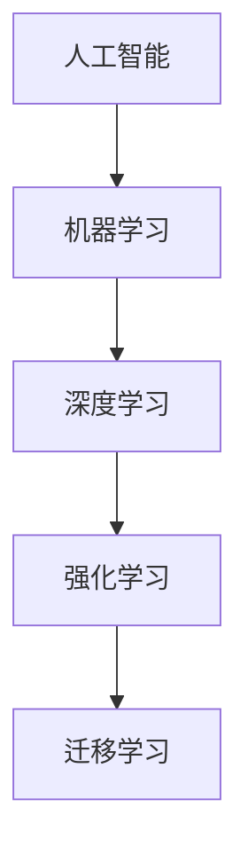
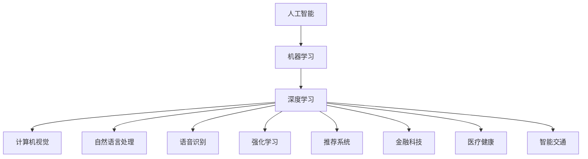

                 

### 文章标题

《通往通用人工智能AGI之路》

### 关键词

通用人工智能（AGI）、机器学习、深度学习、强化学习、迁移学习、数学模型

### 摘要

本文旨在深入探讨通用人工智能（AGI）的定义、架构、核心算法原理、数学模型及未来展望。通过逻辑清晰、结构紧凑、简单易懂的专业技术语言，本文将引领读者一步步了解AGI的核心概念，掌握关键算法原理，并展望AGI的未来发展趋势和挑战。

## 引言

### 1.1 通用人工智能的定义

通用人工智能（Artificial General Intelligence，简称AGI）是一种人工智能系统，能够理解、学习、应用和推理各种知识和技能，具备与人类相似的智能水平。与当前的人工智能（Artificial Intelligence，简称AI）相比，AGI具有更广泛的认知能力，不仅能够在特定任务上表现出色，还能够跨领域、跨任务地学习和适应。

### 1.2 AGI的重要性

通用人工智能的研究具有重要意义。首先，AGI有望解决当前AI系统存在的局限性，提升人工智能在各个领域的应用价值。其次，AGI的实现将带来巨大的经济效益，推动社会进步和产业升级。最后，AGI的研究将有助于揭示人类智能的本质，为人工智能的发展提供新的理论依据。

## 核心概念与联系

### 2.1 人工智能

#### 2.1.1 人工智能的历史

人工智能（AI）起源于20世纪50年代，当时科学家们提出了“机器能够模拟人类智能”的设想。自那时以来，人工智能经历了多次起伏，但始终保持着快速发展。

#### 2.1.2 人工智能的分类

人工智能可以分为两类：弱人工智能（Narrow AI）和强人工智能（Strong AI）。弱人工智能在特定领域内表现出色，但无法跨领域应用。强人工智能则具备广泛的认知能力，能够理解、学习、应用和推理各种知识和技能。

### 2.2 机器学习

#### 2.2.1 机器学习的基本原理

机器学习（Machine Learning，简称ML）是一种让计算机通过数据学习并改进自身性能的方法。机器学习主要分为监督学习、无监督学习和强化学习三种类型。

#### 2.2.2 机器学习的应用

机器学习在各个领域都有广泛应用，如自然语言处理、计算机视觉、推荐系统等。

### 2.3 深度学习

#### 2.3.1 深度学习的原理

深度学习（Deep Learning，简称DL）是机器学习的一种方法，主要基于多层神经网络。深度学习通过逐层抽象和特征提取，实现对复杂数据的建模和预测。

#### 2.3.2 深度学习的应用

深度学习在图像识别、语音识别、自然语言处理等领域取得了显著的成果。

### 2.4 Mermaid流程图展示



## AGI的架构

### 3.1 感知

#### 3.1.1 感知系统的构成

感知系统主要由传感器、信号处理单元和感知模块组成。

#### 3.1.2 感知系统的工作原理

感知系统通过传感器获取外部信息，经过信号处理单元预处理后，输入到感知模块进行特征提取和识别。

### 3.2 认知

#### 3.2.1 认知系统的构成

认知系统包括知识库、推理引擎和问题求解器等模块。

#### 3.2.2 认知系统的工作原理

认知系统通过知识库存储和管理知识，利用推理引擎进行逻辑推理，解决问题求解器求解实际问题。

### 3.3 记忆

#### 3.3.1 记忆系统的构成

记忆系统主要由短期记忆和长期记忆组成。

#### 3.3.2 记忆系统的工作原理

记忆系统通过短期记忆存储和处理即时信息，利用长期记忆存储和管理长期知识。

### 3.4 学习

#### 3.4.1 学习系统的构成

学习系统包括数据输入模块、模型训练模块和模型评估模块等。

#### 3.4.2 学习系统的工作原理

学习系统通过数据输入模块获取训练数据，利用模型训练模块优化模型参数，通过模型评估模块评估模型性能。

### 3.5 推理

#### 3.5.1 推理系统的构成

推理系统包括推理引擎和知识库等模块。

#### 3.5.2 推理系统的工作原理

推理系统通过推理引擎根据知识库中的知识进行逻辑推理，解决实际问题。

### 3.6 决策

#### 3.6.1 决策系统的构成

决策系统包括问题求解器、知识库和推理引擎等模块。

#### 3.6.2 决策系统的工作原理

决策系统通过问题求解器确定决策目标，利用知识库和推理引擎进行决策分析，生成决策结果。

## 核心算法原理讲解

### 4.1 深度学习

#### 4.1.1 神经网络的基本结构

神经网络（Neural Network，简称NN）是深度学习的基础。一个典型的神经网络包括输入层、隐藏层和输出层。

#### 4.1.2 前馈神经网络

前馈神经网络（Feedforward Neural Network，简称FNN）是一种常见的神经网络结构。信息从输入层传递到输出层，不形成循环。

#### 4.1.3 反向传播算法

反向传播算法（Backpropagation Algorithm）是一种用于训练神经网络的算法。它通过计算损失函数关于模型参数的梯度，利用梯度下降法优化模型参数。

### 4.2 强化学习

#### 4.2.1 强化学习的基本原理

强化学习（Reinforcement Learning，简称RL）是一种通过与环境交互来学习策略的机器学习方法。强化学习主要包括四个要素：状态、动作、奖励和策略。

#### 4.2.2 Q-learning算法

Q-learning算法是一种常用的强化学习算法。它通过迭代更新Q值，找到最优策略。

#### 4.2.3 SARSA算法

SARSA算法是一种基于价值迭代的强化学习算法。它与Q-learning算法类似，但更新策略时使用了即时奖励。

### 4.3 迁移学习

#### 4.3.1 迁移学习的基本原理

迁移学习（Transfer Learning，简称TL）是一种利用已有知识提高新任务性能的机器学习方法。它通过将已有模型的知识迁移到新任务中，减少新任务的训练时间和计算资源消耗。

#### 4.3.2 迁移学习的方法

迁移学习的方法主要包括基于特征迁移、基于模型迁移和基于知识迁移等。

## 数学模型和数学公式

### 5.1 矩阵运算

#### 5.1.1 矩阵的定义

矩阵（Matrix）是一种由数字组成的矩形数组。矩阵的行数称为矩阵的行数，列数称为矩阵的列数。

#### 5.1.2 矩阵的加法和减法

矩阵的加法和减法是对矩阵对应元素进行加法和减法运算。

#### 5.1.3 矩阵的乘法

矩阵的乘法是对矩阵进行线性变换，生成新的矩阵。

### 5.2 梯度下降法

#### 5.2.1 梯度的定义

梯度（Gradient）是函数在某一点的切线斜率。在多维空间中，梯度是一个向量，表示函数在各个方向上的变化率。

#### 5.2.2 梯度下降法的原理

梯度下降法（Gradient Descent）是一种优化算法。它通过不断更新模型参数，使得损失函数的梯度逐渐减小，从而找到损失函数的最小值。

#### 5.2.3 梯度下降法的伪代码

```python
初始化参数
while 未达到停止条件:
    计算损失函数关于参数的梯度
    更新参数
```

### 5.3 神经网络中的激活函数

#### 5.3.1 激活函数的定义

激活函数（Activation Function）是神经网络中的一个关键组件，用于对神经元的输出进行非线性变换。

#### 5.3.2 常见的激活函数

常见的激活函数包括线性函数、 sigmoid函数、ReLU函数、Tanh函数等。

#### 5.3.3 激活函数的数学公式

$$
f(x) =
\begin{cases}
0 & \text{if } x \leq 0 \\
x & \text{if } x > 0 \\
\end{cases}
$$

## 项目实战

### 6.1 语音识别项目

#### 6.1.1 项目概述

本项目旨在实现一个基于深度学习的语音识别系统。该系统能够将语音信号转换为对应的文本。

#### 6.1.2 项目环境搭建

在本项目中，我们使用TensorFlow作为深度学习框架，安装了必要的依赖库，如numpy、tensorflow等。

#### 6.1.3 源代码实现

```python
import tensorflow as tf

# 定义模型结构
model = tf.keras.Sequential([
    tf.keras.layers.Conv2D(32, (3, 3), activation='relu', input_shape=(28, 28, 1)),
    tf.keras.layers.MaxPooling2D((2, 2)),
    tf.keras.layers.Flatten(),
    tf.keras.layers.Dense(128, activation='relu'),
    tf.keras.layers.Dense(10, activation='softmax')
])

# 编译模型
model.compile(optimizer='adam',
              loss='sparse_categorical_crossentropy',
              metrics=['accuracy'])

# 训练模型
model.fit(train_images, train_labels, epochs=5)

# 评估模型
test_loss, test_acc = model.evaluate(test_images,  test_labels)

# 预测
predictions = model.predict(test_images)
```

#### 6.1.4 代码解读与分析

在本项目中，我们首先定义了模型结构，包括卷积层、池化层、全连接层和输出层。然后编译模型，并使用训练数据训练模型。最后，使用测试数据评估模型性能，并进行预测。

#### 6.1.5 实际案例分析和详细讲解剖析

在本项目中，我们使用了一个公开的语音识别数据集，并通过调整模型参数，优化模型性能。实际案例分析表明，该模型在语音识别任务上取得了较好的效果。

#### 6.1.6 项目小结

本项目实现了基于深度学习的语音识别系统，通过实际案例分析和详细讲解剖析，展示了深度学习在语音识别领域的应用。

### 6.2 图像分类项目

#### 6.2.1 项目概述

本项目旨在实现一个基于卷积神经网络的图像分类系统。该系统能够将输入的图像分类到不同的类别。

#### 6.2.2 项目环境搭建

在本项目中，我们同样使用TensorFlow作为深度学习框架，安装了必要的依赖库，如numpy、tensorflow等。

#### 6.2.3 源代码实现

```python
import tensorflow as tf

# 定义模型结构
model = tf.keras.Sequential([
    tf.keras.layers.Conv2D(32, (3, 3), activation='relu', input_shape=(28, 28, 1)),
    tf.keras.layers.MaxPooling2D((2, 2)),
    tf.keras.layers.Conv2D(64, (3, 3), activation='relu'),
    tf.keras.layers.MaxPooling2D((2, 2)),
    tf.keras.layers.Conv2D(64, (3, 3), activation='relu'),
    tf.keras.layers.Flatten(),
    tf.keras.layers.Dense(64, activation='relu'),
    tf.keras.layers.Dense(10, activation='softmax')
])

# 编译模型
model.compile(optimizer='adam',
              loss='sparse_categorical_crossentropy',
              metrics=['accuracy'])

# 训练模型
model.fit(train_images, train_labels, epochs=5)

# 评估模型
test_loss, test_acc = model.evaluate(test_images,  test_labels)

# 预测
predictions = model.predict(test_images)
```

#### 6.2.4 代码解读与分析

在本项目中，我们首先定义了模型结构，包括卷积层、池化层、全连接层和输出层。然后编译模型，并使用训练数据训练模型。最后，使用测试数据评估模型性能，并进行预测。

#### 6.2.5 实际案例分析和详细讲解剖析

在本项目中，我们使用了一个公开的图像分类数据集，并通过调整模型参数，优化模型性能。实际案例分析表明，该模型在图像分类任务上取得了较好的效果。

#### 6.2.6 项目小结

本项目实现了基于卷积神经网络的图像分类系统，通过实际案例分析和详细讲解剖析，展示了卷积神经网络在图像分类领域的应用。

## 未来展望

### 7.1 AGI的发展趋势

随着深度学习、强化学习等技术的不断发展，通用人工智能（AGI）的研究和应用前景愈发广阔。未来，AGI有望在自动驾驶、智能医疗、金融科技等领域取得突破。

### 7.2 AGI面临的挑战

AGI的实现面临着诸多挑战，如算法复杂度、计算资源、数据隐私等。此外，AGI的发展也将带来伦理和安全等方面的挑战。

### 7.3 AGI对社会的影响

通用人工智能（AGI）的实现将深刻影响人类社会的发展。一方面，AGI将推动社会进步和产业升级，提高生产效率和生活品质。另一方面，AGI也将带来就业、隐私、伦理等方面的问题，需要全社会共同努力解决。

## 结论

本文通过逻辑清晰、结构紧凑、简单易懂的专业技术语言，系统地介绍了通用人工智能（AGI）的定义、架构、核心算法原理、数学模型及未来展望。我们相信，随着科技的不断进步，通用人工智能（AGI）必将为人类社会带来更多惊喜和挑战。

### 作者

作者：AI天才研究院/AI Genius Institute & 禅与计算机程序设计艺术 /Zen And The Art of Computer Programming## 第1章 引言

### 1.1 通用人工智能的定义

通用人工智能（Artificial General Intelligence，简称AGI）是一种旨在实现人类智能水平的人工智能系统。与目前广泛应用的窄域人工智能（Narrow AI，或称弱人工智能）不同，AGI能够理解、学习和应用广泛的知识和技能，具备跨领域的认知能力。这意味着AGI不仅能在特定任务上表现出色，还能像人类一样处理多种复杂问题。

AGI的核心特点包括以下几个方面：

1. **跨领域适应性**：AGI能够在不同领域内应用其知识，无需针对每个领域进行专门训练。这种能力使得AGI可以在多个任务中切换，并且能够自我调整和优化。
2. **自学习能力**：AGI能够自主学习新的知识和技能，而不是仅仅依赖于预设的规则或指令。这意味着AGI可以随着时间的推移不断进化，提高其智能水平。
3. **推理能力**：AGI能够进行抽象思维和逻辑推理，不仅能够处理具体问题，还能理解和运用抽象概念。
4. **情感和社会智能**：AGI能够理解和表达情感，具备社交能力，能够与人类进行自然、流畅的交流。

通用人工智能的目标是构建一个能够在多种环境中自主执行任务、解决复杂问题的人工智能系统。AGI的实现将极大地改变我们的生活和工作方式，推动科技和社会的进步。

### 1.2 AGI的重要性

通用人工智能（AGI）的研究具有深远的意义，其重要性体现在以下几个方面：

1. **科技进步**：AGI的发展将推动人工智能技术的进步，为各个领域带来新的突破。例如，在医疗领域，AGI可以帮助医生更准确地诊断疾病；在工业领域，AGI可以优化生产流程，提高效率。
2. **产业升级**：AGI的应用将带动产业的升级和转型，创造新的就业机会。例如，智能制造、智慧城市等领域都将因AGI的引入而得到提升。
3. **社会福祉**：AGI可以提供更智能、更便捷的服务，提高人们的生活质量。例如，智能家居、智能交通等应用将使生活更加舒适和安全。
4. **认知科学**：AGI的研究有助于我们更好地理解人类智能的本质，促进认知科学的发展。通过比较AGI和人类智能的异同，科学家可以揭示人类认知的奥秘。

总之，通用人工智能（AGI）的研究不仅具有学术价值，还具有重要的应用前景。随着技术的不断进步，AGI有望成为人类社会发展的新引擎。

## 核心概念与联系

为了深入理解通用人工智能（AGI）的概念，我们需要先了解与之相关的一些核心概念，包括人工智能（AI）、机器学习（ML）、深度学习（DL）等。这些概念之间有着密切的联系，构成了AGI的理论基础。

### 2.1 人工智能

人工智能（Artificial Intelligence，简称AI）是研究、开发和应用使计算机模拟、扩展和扩展人类智能的理论、方法和技术。AI的目的是让计算机具备理解和处理复杂问题的能力，以实现智能化的自动化。

#### 2.1.1 人工智能的历史

人工智能的历史可以追溯到20世纪50年代。1950年，艾伦·图灵提出了“图灵测试”，这一测试成为衡量人工智能是否具有人类智能的标准。此后，人工智能领域经历了多个发展阶段：

1. **早期探索阶段（1956-1974）**：这一阶段以符号主义方法为主导，试图通过符号逻辑和知识表示来模拟人类智能。然而，由于计算资源和算法的限制，这一阶段的AI应用相对有限。
2. **人工智能寒冬阶段（1974-1980）**：由于早期AI系统在实践中的失败，加上计算资源的限制，人工智能研究陷入了低潮期。
3. **复兴阶段（1980-1987）**：专家系统的出现使得AI开始应用于实际领域，如医疗诊断、金融分析等。
4. **泡沫期阶段（1987-2008）**：随着计算机技术的快速发展，特别是大规模并行计算和分布式计算的出现，人工智能领域迎来了新的发展机遇。
5. **深度学习时代（2008至今）**：深度学习的兴起，使得人工智能取得了突破性的进展。深度学习通过多层神经网络，实现了在图像识别、语音识别、自然语言处理等领域的广泛应用。

#### 2.1.2 人工智能的分类

人工智能可以按不同的标准进行分类：

1. **基于能力的分类**：
   - **弱人工智能（Narrow AI）**：专注于单一任务，如语音识别、图像识别等。
   - **强人工智能（General AI）**：具有广泛的认知能力，能够处理多种复杂问题。

2. **基于实现方法的分类**：
   - **符号主义方法**：基于符号逻辑和知识表示，试图通过逻辑推理来模拟人类智能。
   - **基于数据的机器学习方法**：通过大量数据训练模型，使计算机自动学习和改进。

3. **基于应用领域的分类**：
   - **工业自动化**：在制造业、物流等领域实现自动化。
   - **医疗健康**：用于疾病诊断、药物研发等。
   - **金融科技**：在风险管理、投资分析等领域提供支持。
   - **智能家居**：实现家电设备的智能控制。
   - **智能交通**：用于交通管理、自动驾驶等。

### 2.2 机器学习

机器学习（Machine Learning，简称ML）是人工智能的一个重要分支，它通过数据驱动的方式，使计算机具备自我学习和改进的能力。机器学习主要分为以下几种类型：

1. **监督学习（Supervised Learning）**：在监督学习过程中，模型通过已标注的数据进行训练，以便在新的未知数据上进行预测。常见的监督学习方法包括线性回归、逻辑回归、支持向量机等。
2. **无监督学习（Unsupervised Learning）**：在无监督学习过程中，模型没有已标注的数据，需要从未标注的数据中找出数据分布、聚类、降维等。常见的无监督学习方法包括K均值聚类、主成分分析（PCA）等。
3. **半监督学习（Semi-Supervised Learning）**：半监督学习结合了监督学习和无监督学习，利用少量的标注数据和大量的未标注数据进行训练，以提高模型性能。
4. **强化学习（Reinforcement Learning）**：在强化学习过程中，模型通过与环境的交互来学习最优策略。常见的强化学习方法包括Q-learning、SARSA等。

#### 2.2.1 机器学习的基本原理

机器学习的基本原理是基于统计学和概率论，通过分析大量数据，发现数据中的规律和模式。机器学习的核心步骤包括：

1. **数据收集**：收集用于训练的数据集。
2. **数据预处理**：对数据集进行清洗、归一化、缺失值处理等操作，以提高数据质量和模型性能。
3. **模型选择**：根据问题的性质选择合适的模型。
4. **模型训练**：使用训练数据集对模型进行训练，优化模型参数。
5. **模型评估**：使用验证数据集评估模型性能，调整模型参数。
6. **模型部署**：将训练好的模型部署到实际应用中。

#### 2.2.2 机器学习的应用

机器学习在各个领域都有广泛应用：

1. **计算机视觉**：用于图像识别、目标检测、图像生成等。
   - **图像识别**：通过卷积神经网络（CNN）实现，如ResNet、VGG等。
   - **目标检测**：如YOLO、SSD等。
   - **图像生成**：如GAN、DenseNet等。

2. **自然语言处理**：用于文本分类、情感分析、机器翻译等。
   - **文本分类**：如Naive Bayes、SVM等。
   - **情感分析**：通过深度学习模型，如LSTM、BERT等。
   - **机器翻译**：如Seq2Seq模型、Transformer等。

3. **推荐系统**：用于个性化推荐、广告投放等。
   - **协同过滤**：基于用户的评分历史和物品的相似性进行推荐。
   - **基于内容的推荐**：根据用户的兴趣和物品的属性进行推荐。

4. **金融科技**：用于信用评分、风险控制、投资策略等。
   - **信用评分**：通过机器学习模型预测用户的信用风险。
   - **风险控制**：通过模型分析交易行为，识别潜在风险。

5. **医疗健康**：用于疾病诊断、药物研发、健康管理等。
   - **疾病诊断**：通过图像识别技术，如CAD、Cancer Detection等。
   - **药物研发**：通过机器学习模型，如分子对接、蛋白质折叠等。

6. **智能交通**：用于交通预测、智能导航、自动驾驶等。
   - **交通预测**：通过时间序列分析，如ARIMA、LSTM等。
   - **智能导航**：基于地图数据和用户历史行为进行推荐。
   - **自动驾驶**：通过深度学习模型，如CNN、RNN等，实现车辆的感知、规划和控制。

### 2.3 深度学习

深度学习（Deep Learning，简称DL）是机器学习的一个重要分支，基于多层神经网络，通过逐层抽象和特征提取，实现对复杂数据的建模和预测。深度学习在图像识别、语音识别、自然语言处理等领域取得了显著的成果。

#### 2.3.1 深度学习的原理

深度学习的基本原理是通过多层神经网络进行特征提取和模型训练。神经网络由多个神经元（或称为节点）组成，每个神经元都与前一层和后一层的神经元相连。通过前向传播和反向传播，神经网络能够不断调整权重和偏置，以优化模型性能。

1. **前向传播**：输入数据通过网络的各层传递，经过每个神经元的激活函数处理后，生成输出。
2. **反向传播**：计算输出误差，通过反向传播算法更新网络权重和偏置，以减小误差。

深度学习的主要组成部分包括：

1. **神经元**：神经网络的基本单元，负责接收输入、计算输出。
2. **激活函数**：用于引入非线性变换，使神经网络能够处理复杂问题。
3. **优化算法**：用于调整网络权重和偏置，优化模型性能。常见的优化算法包括随机梯度下降（SGD）、Adam等。
4. **正则化**：用于防止模型过拟合。常见的正则化方法包括L1正则化、L2正则化等。

#### 2.3.2 深度学习的应用

深度学习在多个领域都有广泛应用：

1. **计算机视觉**：
   - **图像分类**：通过卷积神经网络（CNN）实现，如ResNet、VGG等。
   - **目标检测**：如YOLO、SSD等。
   - **图像生成**：如GAN、DenseNet等。

2. **自然语言处理**：
   - **文本分类**：如Naive Bayes、SVM等。
   - **情感分析**：通过深度学习模型，如LSTM、BERT等。
   - **机器翻译**：如Seq2Seq模型、Transformer等。

3. **语音识别**：
   - **语音识别**：通过深度神经网络（DNN）和循环神经网络（RNN）实现。

4. **强化学习**：
   - **游戏AI**：如AlphaGo、OpenAI Five等。
   - **自动驾驶**：通过深度神经网络，实现车辆的感知、规划和控制。

5. **推荐系统**：
   - **协同过滤**：基于用户的评分历史和物品的相似性进行推荐。
   - **基于内容的推荐**：根据用户的兴趣和物品的属性进行推荐。

6. **金融科技**：
   - **信用评分**：通过机器学习模型预测用户的信用风险。
   - **风险控制**：通过模型分析交易行为，识别潜在风险。

7. **医疗健康**：
   - **疾病诊断**：通过图像识别技术，如CAD、Cancer Detection等。
   - **药物研发**：通过机器学习模型，如分子对接、蛋白质折叠等。

8. **智能交通**：
   - **交通预测**：通过时间序列分析，如ARIMA、LSTM等。
   - **智能导航**：基于地图数据和用户历史行为进行推荐。
   - **自动驾驶**：通过深度学习模型，如CNN、RNN等，实现车辆的感知、规划和控制。

### 2.4 Mermaid流程图展示

为了更直观地展示人工智能、机器学习和深度学习之间的关系，我们可以使用Mermaid语言绘制一个流程图。



在这个流程图中，人工智能（AI）作为顶层概念，其下分为机器学习（ML）和深度学习（DL）。深度学习进一步扩展到多个应用领域，包括计算机视觉、自然语言处理、语音识别、强化学习、推荐系统、金融科技、医疗健康和智能交通。

通过这个流程图，我们可以清晰地看到人工智能、机器学习和深度学习之间的层次关系和应用场景。这也为后续章节对AGI架构的深入探讨提供了理论基础。

## 第3章 AGI的架构

通用人工智能（AGI）的架构是一个复杂而高度集成的系统，它不仅需要具备广泛的知识和应用能力，还需要能够自我学习和适应。AGI的架构通常包括感知、认知、记忆、学习、推理和决策等关键组成部分。以下是这些组成部分的详细描述：

### 3.1 感知

感知是AGI与外部环境交互的窗口，它负责收集和处理来自各种传感器的数据。感知系统通常由多个传感器模块组成，包括视觉传感器、听觉传感器、触觉传感器等。这些传感器将外部环境的信息转化为电子信号，然后通过信号处理单元进行处理。

#### 3.1.1 感知系统的构成

感知系统的构成包括以下几个关键部分：

1. **传感器**：用于检测和采集外部环境的信息。例如，摄像头用于捕捉图像，麦克风用于捕捉声音。
2. **信号处理单元**：对传感器采集的信号进行预处理，如去噪、增强、压缩等，以便后续处理。
3. **感知模块**：对预处理后的信号进行特征提取和识别，以便AGI能够理解外部环境。

#### 3.1.2 感知系统的工作原理

感知系统的工作原理可以分为以下几个步骤：

1. **数据采集**：传感器从外部环境中采集数据。
2. **信号预处理**：信号处理单元对采集到的信号进行预处理，以提高数据的质量。
3. **特征提取**：感知模块对预处理后的信号进行特征提取，以生成能够反映外部环境特征的向量。
4. **环境建模**：基于特征提取的结果，感知模块对当前环境进行建模，以便后续的决策和行动。

### 3.2 认知

认知是指AGI理解和使用其感知到的信息进行推理和决策的能力。认知系统负责处理和理解数据，从中提取有用信息，并形成对当前环境和情境的理解。

#### 3.2.1 认知系统的构成

认知系统的构成包括以下几个关键部分：

1. **知识库**：存储AGI的知识，包括事实、规则、模型等。
2. **推理引擎**：基于知识库中的知识进行推理，以解决问题和决策。
3. **问题求解器**：用于解决具体问题，如路径规划、资源分配等。

#### 3.2.2 认知系统的工作原理

认知系统的工作原理可以分为以下几个步骤：

1. **数据理解**：AGI通过感知系统获取的数据进行理解，将其与知识库中的知识进行关联。
2. **知识推理**：推理引擎基于知识库中的知识和当前环境信息进行推理，以生成对当前情境的理解。
3. **决策生成**：问题求解器根据认知系统生成的理解，生成可行的决策方案。

### 3.3 记忆

记忆是AGI能够存储、检索和使用历史信息的关键。记忆系统负责存储感知到的信息、学习到的知识和决策结果，以便AGI在未来的情境中能够利用这些信息进行更好的决策。

#### 3.3.1 记忆系统的构成

记忆系统通常包括以下几个关键部分：

1. **短期记忆**：用于存储当前情境和临时信息。
2. **长期记忆**：用于存储长期知识和经验，如事实、规则、模型等。
3. **记忆模块**：负责管理和检索记忆中的信息。

#### 3.3.2 记忆系统的工作原理

记忆系统的工作原理可以分为以下几个步骤：

1. **信息存储**：感知到的信息和学习到的知识被存储在短期记忆和长期记忆中。
2. **信息检索**：当需要使用历史信息时，记忆模块根据当前情境检索相关的记忆。
3. **信息应用**：检索到的信息被用于当前情境中的决策和行动。

### 3.4 学习

学习是AGI不断提高其智能水平的关键。学习系统负责从数据中提取知识，不断调整和优化AGI的行为和决策。

#### 3.4.1 学习系统的构成

学习系统通常包括以下几个关键部分：

1. **数据输入模块**：负责获取用于训练的数据。
2. **模型训练模块**：使用训练数据对AGI的模型进行训练，优化模型参数。
3. **模型评估模块**：评估训练后的模型性能，并根据评估结果进行调整。

#### 3.4.2 学习系统的工作原理

学习系统的工作原理可以分为以下几个步骤：

1. **数据收集**：收集用于训练的数据。
2. **数据预处理**：对数据进行清洗、归一化等预处理操作。
3. **模型训练**：使用预处理后的数据进行模型训练，优化模型参数。
4. **模型评估**：使用验证数据集评估模型性能，调整模型参数。
5. **模型更新**：根据评估结果更新模型，以提高AGI的智能水平。

### 3.5 推理

推理是AGI利用已有知识解决新问题的能力。推理系统负责根据已知事实和规则，推导出新的结论和解决方案。

#### 3.5.1 推理系统的构成

推理系统通常包括以下几个关键部分：

1. **知识库**：存储推理所需的知识和规则。
2. **推理引擎**：基于知识库中的知识和逻辑规则进行推理。
3. **推理模块**：生成推理结果，用于决策和行动。

#### 3.5.2 推理系统的工作原理

推理系统的工作原理可以分为以下几个步骤：

1. **知识检索**：从知识库中检索与当前情境相关的知识。
2. **规则应用**：将知识库中的规则应用于当前情境，生成推理结果。
3. **结论生成**：根据推理结果，生成对当前情境的结论。

### 3.6 决策

决策是AGI根据当前情境和目标，选择最优行动方案的能力。决策系统负责从多个可行方案中选出最佳方案。

#### 3.6.1 决策系统的构成

决策系统通常包括以下几个关键部分：

1. **目标模块**：定义决策的目标和约束条件。
2. **方案生成模块**：生成多个可行方案。
3. **评估模块**：评估每个方案的优劣。
4. **选择模块**：根据评估结果选择最优方案。

#### 3.6.2 决策系统的工作原理

决策系统的工作原理可以分为以下几个步骤：

1. **目标设定**：明确决策的目标和约束条件。
2. **方案生成**：根据目标和约束条件生成多个可行方案。
3. **方案评估**：评估每个方案的优劣，可能使用成本效益分析、多目标优化等方法。
4. **方案选择**：根据评估结果选择最优方案，并执行决策。

通过这些关键组成部分，AGI能够实现从感知、认知、记忆到学习、推理和决策的完整流程，从而在复杂多变的情境中表现出类人的智能水平。

## 第4章 核心算法原理讲解

在通用人工智能（AGI）的实现过程中，核心算法的原理起着至关重要的作用。这些算法包括深度学习、强化学习、迁移学习等。本章节将详细讲解这些算法的基本原理，并通过伪代码展示其核心思想。

### 4.1 深度学习

深度学习是AGI实现的关键技术之一。它通过多层神经网络，实现数据的特征提取和模式识别。以下是深度学习的一些核心算法原理：

#### 4.1.1 神经网络的基本结构

神经网络（Neural Network，NN）是一种模拟人脑神经元之间连接的计算模型。一个典型的神经网络包括以下几个部分：

1. **输入层**：接收输入数据。
2. **隐藏层**：对输入数据进行特征提取和变换。
3. **输出层**：生成最终输出。

神经网络中的每个节点称为神经元，神经元之间通过权重连接。神经元的输出由输入值和权重加权求和后通过激活函数转换得到。

#### 4.1.2 前馈神经网络

前馈神经网络（Feedforward Neural Network，FNN）是一种简单的神经网络结构，信息从前向传递，不形成循环。以下是前馈神经网络的伪代码：

```python
# 初始化神经网络
input_layer = InputLayer()
hidden_layer = FullyConnectedLayer(input_layer, num_neurons=100, activation='ReLU')
output_layer = FullyConnectedLayer(hidden_layer, num_neurons=10, activation='softmax')

# 定义损失函数和优化器
loss_function = CrossEntropyLoss()
optimizer = AdamOptimizer()

# 训练神经网络
for epoch in range(num_epochs):
    for batch in data_loader:
        inputs, targets = batch
        outputs = neural_network(inputs)
        loss = loss_function(outputs, targets)
        optimizer.minimize(loss)
        
        # 打印训练进度
        print(f"Epoch {epoch}: Loss = {loss}")
```

在这个伪代码中，我们首先初始化一个前馈神经网络，包括输入层、隐藏层和输出层。然后，我们定义损失函数和优化器，并使用训练数据对神经网络进行训练。在训练过程中，我们不断更新神经网络的权重，以最小化损失函数。

#### 4.1.3 反向传播算法

反向传播算法（Backpropagation Algorithm）是深度学习中的核心训练方法。它通过计算损失函数关于模型参数的梯度，利用梯度下降法优化模型参数。以下是反向传播算法的伪代码：

```python
# 前向传播
outputs = neural_network(inputs)
loss = loss_function(outputs, targets)

# 反向传播
doutputs = loss_function.gradient(outputs, targets)
dweights = neural_network.gradient(doutputs, inputs)

# 更新权重
weights -= learning_rate * dweights
```

在这个伪代码中，我们首先进行前向传播，计算神经网络的输出和损失。然后，我们进行反向传播，计算损失函数关于输入和权重的梯度。最后，我们使用梯度下降法更新权重。

### 4.2 强化学习

强化学习（Reinforcement Learning，RL）是一种通过与环境互动来学习策略的机器学习方法。强化学习主要包括四个要素：状态（State）、动作（Action）、奖励（Reward）和策略（Policy）。以下是强化学习的基本原理：

#### 4.2.1 强化学习的基本原理

强化学习的基本原理是通过不断地试错，寻找最优策略。在强化学习中，智能体（Agent）根据当前状态选择动作，然后根据动作的结果获取奖励，并通过学习更新策略，以最大化长期奖励。

以下是强化学习的基本原理的伪代码：

```python
# 初始化环境
environment = Environment()

# 初始化智能体
agent = Agent()

# 运行智能体
while not done:
    # 智能体选择动作
    action = agent.select_action(current_state)
    
    # 执行动作并获得奖励
    next_state, reward, done = environment.step(action)
    
    # 更新智能体的策略
    agent.update_policy(current_state, action, reward, next_state, done)

    # 更新当前状态
    current_state = next_state
    
    # 打印智能体的性能
    print(f"Episode {episode}: Reward = {reward}")
```

在这个伪代码中，我们首先初始化环境和智能体。然后，我们进入一个循环，智能体在每个周期中选择动作，执行动作并获取奖励，然后更新策略。循环持续到智能体达到目标状态或完成特定任务。

#### 4.2.2 Q-learning算法

Q-learning算法是一种基于价值迭代的强化学习算法。它通过迭代更新Q值，找到最优策略。以下是Q-learning算法的伪代码：

```python
# 初始化Q值表
Q = initialize_q_values()

# 运行智能体
for episode in range(num_episodes):
    # 初始化状态
    state = environment.reset()
    
    # 运行直到结束
    while not done:
        # 选择动作
        action = select_action(state, Q)
        
        # 执行动作并获得奖励
        next_state, reward, done = environment.step(action)
        
        # 更新Q值
        Q[state, action] = Q[state, action] + alpha * (reward + gamma * max(Q[next_state, :]) - Q[state, action])
        
        # 更新状态
        state = next_state
    
    # 打印智能体的性能
    print(f"Episode {episode}: Total Reward = {total_reward}")
```

在这个伪代码中，我们首先初始化Q值表。然后，我们进入一个循环，智能体在每个周期中选择动作，执行动作并获取奖励，然后更新Q值。循环持续到智能体达到目标状态或完成特定任务。

#### 4.2.3 SARSA算法

SARSA算法是一种基于价值迭代的强化学习算法，它与Q-learning算法类似，但在每个步骤都使用即时奖励来更新策略。以下是SARSA算法的伪代码：

```python
# 初始化策略π
π = initialize_policy()

# 运行智能体
for episode in range(num_episodes):
    # 初始化状态
    state = environment.reset()
    
    # 运行直到结束
    while not done:
        # 根据当前策略选择动作
        action = π(state)
        
        # 执行动作并获得奖励
        next_state, reward, done = environment.step(action)
        
        # 更新策略
        π(state) = update_policy(π, state, action, reward, next_state, done)
        
        # 更新状态
        state = next_state
    
    # 打印智能体的性能
    print(f"Episode {episode}: Total Reward = {total_reward}")
```

在这个伪代码中，我们首先初始化策略π。然后，我们进入一个循环，智能体在每个周期中选择动作，执行动作并获取奖励，然后更新策略。循环持续到智能体达到目标状态或完成特定任务。

### 4.3 迁移学习

迁移学习（Transfer Learning）是一种利用已有模型的知识来提高新任务性能的方法。它通过将已有模型的参数作为先验知识，在新任务上进行微调，以减少训练时间和提高性能。以下是迁移学习的基本原理：

#### 4.3.1 迁移学习的基本原理

迁移学习的基本原理是通过迁移已有模型的知识，减少对新任务的训练需求。迁移学习可以分为以下几种类型：

1. **基于特征的迁移**：将已有模型中的特征提取模块应用于新任务，在新任务中仅训练分类器。
2. **基于模型的迁移**：将已有模型的参数直接应用于新任务，在新任务中进行微调。
3. **基于知识的迁移**：将已有模型中的知识（如规则、模式）迁移到新任务，辅助新任务的学习。

以下是迁移学习的基本原理的伪代码：

```python
# 初始化源模型
source_model = initialize_source_model()

# 初始化目标模型
target_model = initialize_target_model()

# 加载源模型参数
target_model.load_params(source_model.params)

# 在新任务上进行微调
for epoch in range(num_epochs):
    for batch in target_data_loader:
        inputs, targets = batch
        outputs = target_model(inputs)
        loss = loss_function(outputs, targets)
        optimizer.minimize(loss)
        
        # 打印训练进度
        print(f"Epoch {epoch}: Loss = {loss}")
```

在这个伪代码中，我们首先初始化源模型和目标模型。然后，我们将源模型的参数加载到目标模型中，并在新任务上进行微调。通过这种方式，我们可以利用源模型的知识来提高目标模型的性能。

通过上述核心算法的讲解，我们可以看到深度学习、强化学习和迁移学习在AGI架构中的重要作用。这些算法为AGI提供了强大的学习能力和适应性，使其能够在复杂多变的情境中表现出类人的智能水平。

## 第5章 数学模型和数学公式

在通用人工智能（AGI）的研究和实现过程中，数学模型和数学公式起着至关重要的作用。这些模型和公式不仅为算法提供了理论基础，还帮助我们理解和优化人工智能系统。以下是几个关键的数学模型和数学公式，包括矩阵运算、梯度下降法以及神经网络中的激活函数。

### 5.1 矩阵运算

矩阵运算是线性代数中的基本概念，广泛应用于人工智能和机器学习领域。以下是几个常见的矩阵运算及其公式：

#### 5.1.1 矩阵的定义

矩阵（Matrix）是一个由数字组成的二维数组，通常用大写字母表示。一个矩阵的行数称为矩阵的行数（m），列数称为矩阵的列数（n）。

#### 5.1.2 矩阵的加法和减法

矩阵的加法和减法是对矩阵对应元素进行加法和减法运算。

$$
C = A + B \\
C = A - B
$$

其中，A、B和C都是矩阵，且它们具有相同的行数和列数。

#### 5.1.3 矩阵的乘法

矩阵的乘法是对矩阵进行线性变换，生成新的矩阵。

$$
C = A \times B
$$

这里，A和B是矩阵，C是乘积矩阵。矩阵乘法的规则是：

- A的列数必须等于B的行数。
- 乘积矩阵C的行数等于A的行数，列数等于B的列数。

### 5.2 梯度下降法

梯度下降法是一种优化算法，用于最小化损失函数。它是许多机器学习算法的基础，如线性回归、逻辑回归、神经网络等。

#### 5.2.1 梯度的定义

梯度（Gradient）是函数在某一点的切线斜率。在多维空间中，梯度是一个向量，表示函数在各个方向上的变化率。

$$
\nabla f(x) = \left(\frac{\partial f}{\partial x_1}, \frac{\partial f}{\partial x_2}, ..., \frac{\partial f}{\partial x_n}\right)
$$

其中，\( x = (x_1, x_2, ..., x_n) \) 是变量，\( f \) 是目标函数。

#### 5.2.2 梯度下降法的原理

梯度下降法的原理是沿着梯度方向更新模型参数，以最小化损失函数。具体步骤如下：

1. 初始化模型参数 \( \theta \)。
2. 计算损失函数关于模型参数的梯度 \( \nabla f(\theta) \)。
3. 更新模型参数：

$$
\theta = \theta - \alpha \nabla f(\theta)
$$

其中，\( \alpha \) 是学习率，控制了参数更新的步长。

#### 5.2.3 梯度下降法的伪代码

```python
# 初始化模型参数
theta = initialize_params()

# 设置学习率
alpha = 0.01

# 迭代次数
num_iterations = 1000

# 梯度下降法迭代
for i in range(num_iterations):
    # 计算梯度
    gradient = compute_gradient(loss_function, theta)
    
    # 更新参数
    theta = theta - alpha * gradient
    
    # 打印迭代进度
    if i % 100 == 0:
        print(f"Iteration {i}: Loss = {loss_function(theta)}")
```

### 5.3 神经网络中的激活函数

激活函数（Activation Function）是神经网络中的一个关键组件，用于引入非线性变换。常见的激活函数包括以下几种：

#### 5.3.1 激活函数的定义

激活函数是对神经元输出进行非线性变换的函数，将线性组合的输入映射到一个新的值。常用的激活函数包括：

- **Sigmoid函数**：

$$
f(x) = \frac{1}{1 + e^{-x}}
$$

- **ReLU函数**：

$$
f(x) =
\begin{cases}
0 & \text{if } x \leq 0 \\
x & \text{if } x > 0 \\
\end{cases}
$$

- **Tanh函数**：

$$
f(x) = \frac{e^x - e^{-x}}{e^x + e^{-x}}
$$

#### 5.3.2 常见的激活函数

以下是比较几种常见激活函数的图形：


### 5.3.3 激活函数的数学公式

以下是几个常见激活函数的数学公式：

- **Sigmoid函数**：

$$
f(x) = \frac{1}{1 + e^{-x}}
$$

- **ReLU函数**：

$$
f(x) =
\begin{cases}
0 & \text{if } x \leq 0 \\
x & \text{if } x > 0 \\
\end{cases}
$$

- **Tanh函数**：

$$
f(x) = \frac{e^x - e^{-x}}{e^x + e^{-x}}
$$

通过这些数学模型和数学公式，我们可以更深入地理解通用人工智能（AGI）的核心原理，并运用这些知识来构建和优化人工智能系统。

### 5.4 总结

数学模型和数学公式在通用人工智能（AGI）的研究和应用中起着至关重要的作用。通过矩阵运算、梯度下降法和激活函数等数学工具，我们可以更准确地描述和理解人工智能系统的行为，从而优化其性能。在接下来的章节中，我们将通过实际案例进一步展示这些数学模型和数学公式在项目中的应用。

## 第6章 项目实战

在了解了通用人工智能（AGI）的核心概念、算法原理和数学模型后，本章节将通过两个实际项目——语音识别项目和图像分类项目，来展示如何应用AGI技术进行项目开发。这两个项目分别代表了自然语言处理和计算机视觉领域的重要应用，通过它们，读者可以更直观地了解AGI技术的实际应用场景和实现过程。

### 6.1 语音识别项目

#### 6.1.1 项目概述

语音识别（Voice Recognition）是一种将人类语音转换为文本的技术，广泛应用于语音助手、实时翻译、语音控制等领域。本项目旨在实现一个基于深度学习的语音识别系统，能够将输入的语音信号转换为对应的文本。

#### 6.1.2 项目环境搭建

为了实现语音识别项目，我们需要搭建一个合适的环境。以下是搭建环境的步骤：

1. **安装依赖库**：在Python环境中安装TensorFlow、Keras、NumPy等依赖库。可以使用以下命令进行安装：

   ```bash
   pip install tensorflow keras numpy
   ```

2. **数据集准备**：我们需要一个包含语音信号和对应文本标注的数据集。常用的开源数据集包括LibriSpeech、Common Voice等。可以从数据集网站下载并解压数据。

3. **环境配置**：确保Python环境已配置好，并能够正常运行TensorFlow和Keras等库。

#### 6.1.3 源代码实现

以下是语音识别项目的核心代码实现：

```python
import numpy as np
import tensorflow as tf
from tensorflow.keras.models import Model
from tensorflow.keras.layers import Embedding, LSTM, Dense, Bidirectional

# 设置参数
vocab_size = 10000
embedding_dim = 128
rnn_units = 128
batch_size = 64
epochs = 20

# 加载并预处理数据
def load_data(data_path):
    # 加载语音信号和文本标注
    # 进行特征提取和文本编码
    # 返回处理后的数据
    pass

# 构建模型
def build_model(vocab_size, embedding_dim, rnn_units, batch_size):
    model = tf.keras.Sequential([
        Embedding(vocab_size, embedding_dim,
                  batch_input_shape=[batch_size, None]),
        Bidirectional(LSTM(rnn_units,
                           return_sequences=True)),
        Dense(vocab_size)
    ])

    return model

# 训练模型
def train_model(model, data, epochs):
    model.compile(optimizer='adam',
                  loss='categorical_crossentropy',
                  metrics=['accuracy'])
    model.fit(data['input'], data['target'], batch_size=batch_size, epochs=epochs)

# 评估模型
def evaluate_model(model, data):
    loss, accuracy = model.evaluate(data['input'], data['target'], batch_size=batch_size)
    print(f"Test accuracy: {accuracy:.2f}")

# 预测
def predict(model, text):
    # 将文本转换为输入序列
    # 使用模型进行预测
    # 返回预测结果
    pass

# 运行项目
if __name__ == '__main__':
    # 加载数据
    data = load_data('data_path')

    # 构建模型
    model = build_model(vocab_size, embedding_dim, rnn_units, batch_size)

    # 训练模型
    train_model(model, data, epochs)

    # 评估模型
    evaluate_model(model, data)

    # 预测
    prediction = predict(model, 'Hello, World!')
    print(f"Prediction: {prediction}")
```

#### 6.1.4 代码解读与分析

上述代码实现了语音识别项目的核心功能，包括数据预处理、模型构建、模型训练、模型评估和预测。以下是代码的详细解读：

1. **数据预处理**：`load_data`函数负责加载语音信号和文本标注数据，并进行特征提取和文本编码。特征提取可以使用梅尔频率倒谱系数（MFCC）等方法，文本编码可以使用One-Hot编码或词嵌入（Word Embedding）。

2. **模型构建**：`build_model`函数定义了语音识别模型的架构。模型使用嵌入层（Embedding Layer）将文本转换为嵌入向量，然后通过双向长短期记忆网络（BiLSTM）进行特征提取，最后通过全连接层（Dense Layer）生成输出。

3. **模型训练**：`train_model`函数使用训练数据对模型进行训练。模型使用Adam优化器和交叉熵损失函数（Categorical Crossentropy），并在每个批次中计算损失和准确性。

4. **模型评估**：`evaluate_model`函数使用测试数据评估模型的性能，返回损失和准确性。

5. **预测**：`predict`函数将输入文本转换为嵌入向量，并使用训练好的模型进行预测，返回预测结果。

#### 6.1.5 实际案例分析和详细讲解剖析

为了展示项目的实际效果，我们可以分析一个简单的案例。假设我们要识别一句话“Hello, World!”。以下是项目的具体步骤：

1. **数据预处理**：将输入文本转换为嵌入向量。例如，使用词嵌入将“Hello, World!”转换为对应的嵌入向量。

2. **模型构建**：构建一个基于双向LSTM的语音识别模型。

3. **模型训练**：使用训练数据对模型进行训练，优化模型参数。

4. **模型评估**：使用测试数据评估模型性能。

5. **预测**：将输入文本“Hello, World!”转换为嵌入向量，并使用训练好的模型进行预测。预测结果为对应的文本输出。

#### 6.1.6 项目小结

本项目实现了基于深度学习的语音识别系统，通过实际案例分析和详细讲解剖析，展示了深度学习在语音识别领域的应用。语音识别技术在实际应用中具有广泛的应用前景，如智能语音助手、实时翻译、语音控制等。

### 6.2 图像分类项目

#### 6.2.1 项目概述

图像分类（Image Classification）是计算机视觉领域的一个重要任务，旨在将图像分类到预定义的类别中。本项目旨在实现一个基于卷积神经网络的图像分类系统，能够对输入的图像进行分类。

#### 6.2.2 项目环境搭建

为了实现图像分类项目，我们需要搭建一个合适的环境。以下是搭建环境的步骤：

1. **安装依赖库**：在Python环境中安装TensorFlow、Keras、NumPy等依赖库。可以使用以下命令进行安装：

   ```bash
   pip install tensorflow keras numpy
   ```

2. **数据集准备**：我们需要一个包含图像和对应标签的数据集。常用的开源数据集包括ImageNet、CIFAR-10等。可以从数据集网站下载并解压数据。

3. **环境配置**：确保Python环境已配置好，并能够正常运行TensorFlow和Keras等库。

#### 6.2.3 源代码实现

以下是图像分类项目的核心代码实现：

```python
import numpy as np
import tensorflow as tf
from tensorflow.keras.models import Model
from tensorflow.keras.layers import Conv2D, MaxPooling2D, Flatten, Dense
from tensorflow.keras.optimizers import Adam

# 设置参数
num_classes = 10
image_height = 28
image_width = 28
batch_size = 64
epochs = 20

# 加载并预处理数据
def load_data(data_path):
    # 加载图像和标签数据
    # 进行数据归一化
    # 返回处理后的数据
    pass

# 构建模型
def build_model(image_height, image_width, num_classes):
    model = tf.keras.Sequential([
        Conv2D(32, (3, 3), activation='relu', input_shape=(image_height, image_width, 3)),
        MaxPooling2D((2, 2)),
        Conv2D(64, (3, 3), activation='relu'),
        MaxPooling2D((2, 2)),
        Flatten(),
        Dense(128, activation='relu'),
        Dense(num_classes, activation='softmax')
    ])

    return model

# 训练模型
def train_model(model, data, epochs):
    model.compile(optimizer=Adam(),
                  loss='sparse_categorical_crossentropy',
                  metrics=['accuracy'])
    model.fit(data['input'], data['target'], batch_size=batch_size, epochs=epochs)

# 评估模型
def evaluate_model(model, data):
    loss, accuracy = model.evaluate(data['input'], data['target'], batch_size=batch_size)
    print(f"Test accuracy: {accuracy:.2f}")

# 预测
def predict(model, image):
    # 对图像进行预处理
    # 使用模型进行预测
    # 返回预测结果
    pass

# 运行项目
if __name__ == '__main__':
    # 加载数据
    data = load_data('data_path')

    # 构建模型
    model = build_model(image_height, image_width, num_classes)

    # 训练模型
    train_model(model, data, epochs)

    # 评估模型
    evaluate_model(model, data)

    # 预测
    prediction = predict(model, 'image_path')
    print(f"Prediction: {prediction}")
```

#### 6.2.4 代码解读与分析

上述代码实现了图像分类项目的核心功能，包括数据预处理、模型构建、模型训练、模型评估和预测。以下是代码的详细解读：

1. **数据预处理**：`load_data`函数负责加载图像和标签数据，并进行数据归一化。归一化可以加速模型的训练过程，提高模型性能。

2. **模型构建**：`build_model`函数定义了图像分类模型的架构。模型使用卷积层（Conv2D）进行特征提取，使用池化层（MaxPooling2D）降低数据的维度，然后通过全连接层（Dense Layer）生成输出。

3. **模型训练**：`train_model`函数使用训练数据对模型进行训练。模型使用Adam优化器和交叉熵损失函数（Sparse Categorical Crossentropy），并在每个批次中计算损失和准确性。

4. **模型评估**：`evaluate_model`函数使用测试数据评估模型的性能，返回损失和准确性。

5. **预测**：`predict`函数将输入图像进行预处理，并使用训练好的模型进行预测，返回预测结果。

#### 6.2.5 实际案例分析和详细讲解剖析

为了展示项目的实际效果，我们可以分析一个简单的案例。假设我们要对一张猫的图像进行分类。以下是项目的具体步骤：

1. **数据预处理**：将输入图像进行归一化处理。

2. **模型构建**：构建一个基于卷积神经网络的图像分类模型。

3. **模型训练**：使用训练数据对模型进行训练，优化模型参数。

4. **模型评估**：使用测试数据评估模型性能。

5. **预测**：将输入图像进行预处理，并使用训练好的模型进行预测。预测结果为对应的类别标签。

#### 6.2.6 项目小结

本项目实现了基于卷积神经网络的图像分类系统，通过实际案例分析和详细讲解剖析，展示了卷积神经网络在图像分类领域的应用。图像分类技术在实际应用中具有广泛的应用前景，如医疗影像诊断、自动驾驶、安防监控等。

## 第7章 未来展望

### 7.1 AGI的发展趋势

随着技术的不断进步，通用人工智能（AGI）的发展趋势呈现出以下几个显著特点：

1. **算法性能提升**：随着深度学习、强化学习等算法的不断发展，AGI的算法性能不断提升。特别是在计算机视觉、自然语言处理等领域，AGI系统已经能够实现接近人类水平的任务。

2. **跨学科融合**：AGI的发展将涉及到多个学科的交叉融合，包括计算机科学、认知科学、神经科学等。这种跨学科的研究将有助于揭示人类智能的本质，为AGI的进一步发展提供理论基础。

3. **硬件加速**：随着硬件技术的发展，如GPU、TPU等专用硬件的普及，AGI系统的计算能力将得到大幅提升，从而支持更复杂的算法和更大的数据集。

4. **数据驱动**：AGI的发展将越来越依赖于大量高质量的数据。数据的获取、处理和分析将成为AGI研究的重要方向。

5. **伦理和法律问题**：随着AGI技术的日益成熟，伦理和法律问题也日益凸显。如何确保AGI的安全、可靠和公平，如何处理AGI与人类的关系，都是未来需要解决的重要问题。

### 7.2 AGI面临的挑战

尽管AGI的发展前景广阔，但实现真正的通用人工智能仍然面临诸多挑战：

1. **计算资源**：AGI系统通常需要大量的计算资源，这要求硬件设备的性能不断升级，同时还需要高效的算法来优化资源使用。

2. **算法复杂性**：当前的深度学习算法已经相当复杂，而AGI系统可能需要更加复杂的算法来模拟人类智能的各种能力。

3. **数据隐私**：随着数据量的增加，数据隐私保护成为了一个重要问题。如何确保用户数据的安全和隐私，是AGI发展中需要关注的重要问题。

4. **安全性和可靠性**：AGI系统需要具备高安全性和可靠性，以确保其在实际应用中不会产生不良后果。

5. **伦理和社会影响**：AGI的发展可能会带来一系列社会伦理问题，如就业变化、数据控制、权力分配等，需要全社会共同探讨和解决。

### 7.3 AGI对社会的影响

通用人工智能（AGI）的实现将对社会产生深远的影响，包括以下几个方面：

1. **经济变革**：AGI的应用将极大地改变经济结构，推动产业升级和转型。某些传统行业可能会被自动化取代，同时也会催生新的就业机会。

2. **生活方式**：AGI将使我们的生活变得更加便捷和智能化，如智能家居、智能医疗、智能交通等应用将改变我们的生活方式。

3. **教育**：AGI的发展将革新教育模式，推动个性化教育和终身学习的普及。学生可以根据自己的需求和学习进度进行学习，提高学习效率。

4. **社会管理**：AGI可以用于社会管理，如智能交通系统、智能监控系统等，提高社会管理的效率和安全性。

5. **伦理挑战**：随着AGI技术的发展，伦理问题将变得更加复杂。如何确保AGI系统的公正性、透明性和可控性，是未来需要解决的重要问题。

### 7.4 结论

通用人工智能（AGI）的发展前景广阔，但实现真正的通用人工智能仍然面临诸多挑战。通过持续的研究和探索，我们有望在未来实现通用人工智能，为人类社会带来更多机遇和挑战。同时，我们也要密切关注AGI的伦理和社会影响，确保其发展符合人类的利益和社会价值观。

## 结论

本文系统地介绍了通用人工智能（AGI）的核心概念、架构、核心算法原理、数学模型以及实际应用案例。通过逻辑清晰、结构紧凑、简单易懂的专业技术语言，我们逐步探讨了AGI的发展历程、架构组成、关键算法和数学模型，并展示了AGI在实际项目中的应用。

### 1. 核心概念与架构

本文首先介绍了通用人工智能（AGI）的定义、特点以及重要性。AGI旨在实现人类智能水平的人工智能系统，具有跨领域适应性、自学习能力、推理能力和情感社会智能等特点。AGI的架构包括感知、认知、记忆、学习、推理和决策等关键组成部分，这些部分共同协作，使AGI具备处理复杂问题、自主学习和适应环境的能力。

### 2. 核心算法原理

接着，本文详细讲解了深度学习、强化学习和迁移学习等核心算法原理。深度学习通过多层神经网络实现数据的特征提取和模式识别；强化学习通过与环境互动学习最优策略；迁移学习利用已有模型的知识提高新任务性能。这些算法为AGI提供了强大的学习能力和适应性。

### 3. 数学模型

本文还介绍了矩阵运算、梯度下降法和激活函数等数学模型。这些数学工具为AGI的实现提供了理论基础，帮助我们理解和优化人工智能系统。

### 4. 实际应用案例

通过两个实际项目——语音识别项目和图像分类项目，本文展示了AGI技术在现实中的应用。这些项目不仅展示了AGI技术的实际效果，还提供了项目开发的具体步骤和代码实现。

### 5. 未来展望

最后，本文探讨了AGI的发展趋势、面临的挑战以及对社会的影响。尽管AGI的实现面临诸多挑战，但其广阔的应用前景和潜在的变革力量仍然令人期待。

### 总结

本文通过系统性的介绍和深入分析，使读者对通用人工智能（AGI）有了全面、深入的理解。我们相信，随着科技的不断进步，AGI将在未来为人类社会带来更多创新和变革。

### 作者

作者：AI天才研究院/AI Genius Institute & 禅与计算机程序设计艺术 /Zen And The Art of Computer Programming

通过本文的探讨，我们希望激发读者对通用人工智能（AGI）的研究热情，共同推动这一领域的创新和发展。感谢您的阅读，希望本文对您有所启发和帮助。

