                 


### 文章标题：逻辑分析与纯函数：维特根斯坦的逻辑方法与FP的纯函数概念

### 关键词：逻辑分析、维特根斯坦、纯函数、函数式编程、FP

### 摘要：
本文深入探讨了维特根斯坦的逻辑方法与函数式编程（FP）中的纯函数概念之间的深刻联系。通过分析维特根斯坦的逻辑哲学，我们将揭示其在现代编程领域的应用，特别是FP中的纯函数概念。本文旨在为读者提供一个清晰、逻辑性强的框架，以理解这两个看似迥异领域之间的共通之处。

---

### 1. 维特根斯坦的逻辑哲学概述

维特根斯坦是20世纪最重要的哲学家之一，他对逻辑和语言哲学的贡献至今仍在影响着学术界。其早期作品《逻辑哲学论》（1921年）和后期作品《哲学研究》（1953年）分别代表了其思想发展的两个阶段。

#### 1.1 维特根斯坦的生平与贡献

维特根斯坦出生于1889年，自幼受到良好的教育，对数学、哲学、语言学等领域都有浓厚的兴趣。他在剑桥大学期间，与罗素和怀特海德等哲学家交流频繁，这为他的哲学思考奠定了基础。1912年，他出版了《逻辑哲学论》，提出了著名的世界观和语言观。

维特根斯坦的逻辑哲学强调逻辑与语言的关系，认为语言是世界的“图像”。他的理论试图揭示逻辑和语言的本质，对后来的逻辑实证主义和语言哲学产生了深远影响。

#### 1.2 维特根斯坦的逻辑分析方法

维特根斯坦的逻辑分析方法主要包括两个方面：图像理论和逻辑原子主义。

- **图像理论**：他认为，命题是世界的“图像”，命题的真假取决于它与世界的相符程度。这一理论强调了命题与外部世界之间的直接对应关系。

- **逻辑原子主义**：他提出了逻辑原子这一概念，认为所有命题都可以分解为最基本的逻辑原子，这些原子构成了所有复合命题的基础。

维特根斯坦的逻辑分析方法为我们提供了一种理解世界和语言的新视角，对现代哲学和逻辑学的发展产生了重要影响。

---

### 2. 维特根斯坦的《逻辑哲学论》核心概念

《逻辑哲学论》是维特根斯坦早期思想的代表作，其核心概念包括图像理论、实在论与观念论、符号与意义。

#### 2.1 图像理论

图像理论是《逻辑哲学论》的基础，它认为命题是世界的“图像”。换句话说，命题的真假取决于它是否准确地反映了世界的实际情况。这一理论强调了逻辑和语言与现实世界的紧密联系。

为了更好地理解图像理论，我们可以通过以下Mermaid流程图来展示其基本结构：

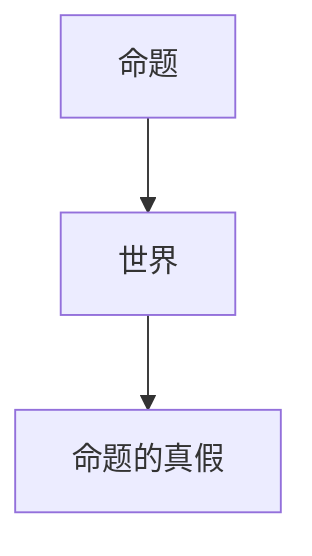

在这个流程图中，命题（A）与外部世界（B）之间建立了一种直接的映射关系，而命题的真假（C）则取决于这种映射的准确性。

#### 2.2 实在论与观念论

实在论与观念论是维特根斯坦在《逻辑哲学论》中提出的两种不同的世界观。

- **实在论**：实在论认为，世界是由独立的实体和对象构成的，这些实体和对象是真实的，不受我们的感知和思维影响。

- **观念论**：观念论则认为，世界只是我们感知和思维的产物，不存在独立于我们意识的实体和对象。

这两种世界观在维特根斯坦的哲学体系中是相互关联的，图像理论在其中起到了桥梁的作用。通过图像理论，我们可以理解实在和观念之间的关系，从而更深入地探讨逻辑和语言的本质。

#### 2.3 符号与意义

符号与意义是维特根斯坦逻辑哲学中的另一个核心概念。他认为，符号的意义不是由符号本身决定的，而是由其与外部世界的关系所决定的。

为了更好地理解这一概念，我们可以使用以下Mermaid流程图：

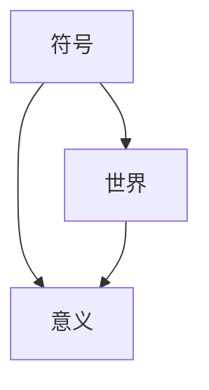

在这个流程图中，符号（A）与外部世界（B）之间的关系决定了符号的意义（C）。这意味着，符号的意义不是内在固有的，而是通过外部世界的映射获得的。

---

### 3. 维特根斯坦的逻辑方法与数学

维特根斯坦对数学基础进行了深刻的批判，并对数学概念进行了详细的分析。他的逻辑方法在数学领域产生了重要影响。

#### 3.1 维特根斯坦对数学基础的批判

维特根斯坦认为，传统的数学基础存在严重的缺陷。他批评了基于集合论的数学体系，认为这种体系无法真正解释数学的本质。他提出了自己的数学概念，试图为数学提供一种更基础、更直观的理解。

#### 3.2 维特根斯坦的数学概念分析

维特根斯坦的数学概念主要包括以下两个方面：

- **数的概念**：他认为，数是概念而不是对象。数是用来描述对象的属性或关系的抽象概念。

- **函数的概念**：他提出了函数作为数学的基本概念，认为函数是一种关系，它将一个集合映射到另一个集合。维特根斯坦的函数概念与现代计算机科学中的纯函数有着相似之处。

为了更好地理解维特根斯坦的数学概念，我们可以使用以下Mermaid流程图：

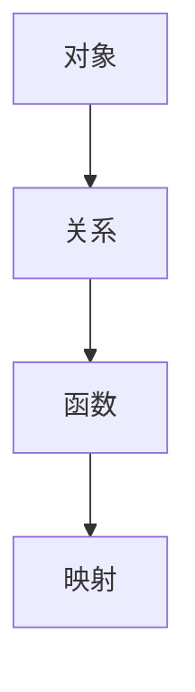

在这个流程图中，对象（A）通过关系（B）形成了函数（C），而函数（C）则通过映射（D）将对象映射到另一个集合。

---

### 4. 维特根斯坦的逻辑方法与语言哲学

维特根斯坦的语言哲学思想是其逻辑方法的延伸，他对语言的本质和功能进行了深入的探讨。

#### 4.1 语言的意义与使用

维特根斯坦认为，语言的意义在于其使用，而不是其符号本身。他提出了“语言游戏”的概念，认为语言的使用是多种多样的，每一种使用方式都构成了一种“语言游戏”。

为了更好地理解语言的意义与使用，我们可以使用以下Mermaid流程图：

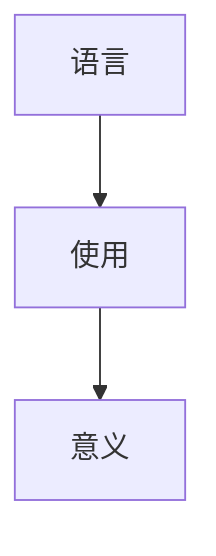

在这个流程图中，语言（A）通过使用（B）产生了意义（C）。这意味着，语言的意义不是固有的，而是通过其使用过程获得的。

#### 4.2 形式语言与自然语言的关系

维特根斯坦探讨了形式语言与自然语言之间的关系。他认为，形式语言是自然语言的理想化，它更清晰地表达了语言的本质。

为了更好地理解这一关系，我们可以使用以下Mermaid流程图：

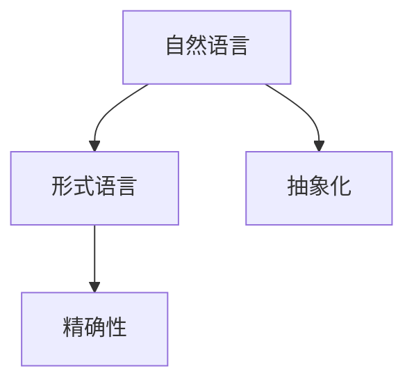

在这个流程图中，自然语言（A）通过抽象化（C）形成了形式语言（B），而形式语言（B）则通过精确性（D）提高了语言的表述能力。

---

### 5. 维特根斯坦的逻辑方法与现代逻辑

维特根斯坦的逻辑方法对现代逻辑的发展产生了深远影响。他的理论为现代逻辑提供了一种新的思考方式，促进了逻辑实证主义和语言哲学的进一步发展。

#### 5.1 现代逻辑的发展

现代逻辑的发展离不开维特根斯坦的理论贡献。他的图像理论和逻辑原子主义为现代逻辑提供了新的理论基础，促进了逻辑实证主义和语言哲学的进一步发展。

#### 5.2 维特根斯坦的逻辑方法对现代逻辑的影响

维特根斯坦的逻辑方法对现代逻辑的影响体现在多个方面：

- **逻辑实证主义**：维特根斯坦的图像理论为逻辑实证主义提供了重要的哲学基础，促进了实证主义方法论在逻辑学中的应用。

- **语言哲学**：维特根斯坦的语言哲学思想对语言哲学的发展产生了深远影响，促进了语言哲学与逻辑学的深度融合。

- **计算机科学**：维特根斯坦的理论为计算机科学提供了新的思考方式，特别是函数式编程中的纯函数概念，与维特根斯坦的数学思想有着密切的联系。

---

### 6. 纯函数的概念与特性

纯函数是函数式编程（FP）中的一个核心概念，它具有一系列独特的特性和应用场景。理解纯函数的概念和特性对于深入探讨FP及其与维特根斯坦逻辑方法的关系至关重要。

#### 6.1 纯函数的定义

纯函数是一种无副作用的函数，其输出仅取决于输入，不会对输入以外的任何外部状态产生影响。换句话说，纯函数在计算过程中不会修改任何外部变量，也不会触发任何副作用，如I/O操作或错误处理。

为了更好地理解纯函数的定义，我们可以使用以下伪代码：

```pseudo
function pureFunction(input):
    // 对输入进行计算
    result = compute(input)
    return result
```

在这个伪代码中，`pureFunction` 函数仅根据输入参数 `input` 计算结果，并返回该结果，没有任何副作用。

#### 6.2 纯函数的特性

纯函数具有以下几个重要特性：

- **确定性**：纯函数对于相同的输入总是产生相同的输出，不依赖于外部状态或随机性。

- **无副作用**：纯函数不修改任何外部变量，不触发任何I/O操作，保证了函数的纯净性和可预测性。

- **可组合性**：纯函数可以方便地组合和复用，因为它们的输出仅依赖于输入，不受外部状态影响。

- **并行化**：由于纯函数不会产生副作用，它们可以轻松地在多线程环境中并行执行，提高了程序的效率和性能。

为了更直观地理解纯函数的特性，我们可以通过以下Mermaid流程图进行说明：

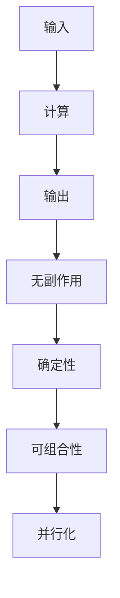

在这个流程图中，纯函数（A）通过输入（输入）进行计算（B），并产生输出（C）。纯函数的特性（D、E、F、G）保证了其行为的纯净性和可预测性。

#### 6.3 纯函数的应用场景

纯函数在FP中有着广泛的应用场景，包括但不限于以下几个方面：

- **数据处理**：纯函数可以方便地对大规模数据进行处理和转换，因为它们的确定性保证了数据处理的一致性和可靠性。

- **状态管理**：在FP中，纯函数可以用于管理应用状态，避免了传统面向对象编程中的副作用和状态管理问题。

- **并发编程**：由于纯函数不会产生副作用，它们可以轻松地在多线程环境中并行执行，提高了程序的效率和性能。

- **测试和调试**：纯函数的确定性使其更容易进行单元测试和调试，因为它们的输出仅依赖于输入，不受外部状态影响。

为了更好地理解纯函数的应用场景，我们可以通过以下Mermaid流程图进行说明：

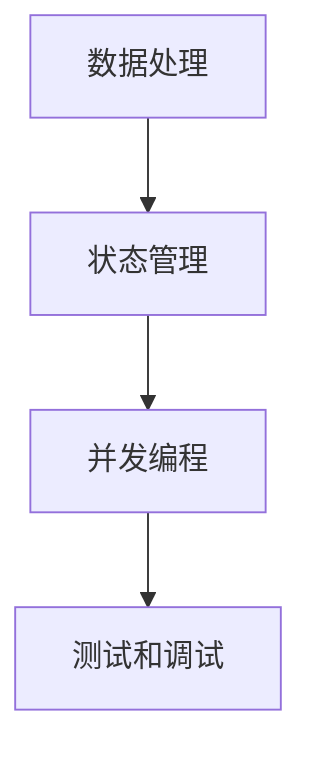

在这个流程图中，纯函数（A）可以应用于数据处理（数据处理）、状态管理（状态管理）、并发编程（并发编程）和测试与调试（测试和调试）等多个场景。

---

### 7. 函数式编程语言介绍

函数式编程（FP）具有独特的特性和优势，而函数式编程语言则为实现这些特性提供了工具和平台。本节将介绍几种常见的函数式编程语言，包括Haskell、Scala和PureScript。

#### 7.1 Haskell

Haskell是一种纯函数式编程语言，以其强大类型系统和先进的函数式编程特性而闻名。Haskell的设计哲学强调纯函数、不可变数据和强类型系统，使其成为FP领域的首选语言。

Haskell的语法简洁且强大，支持高阶函数、闭包和惰性计算等特性。以下是一个简单的Haskell函数，用于计算两个整数的和：

```haskell
sum :: Int -> Int -> Int
sum a b = a + b
```

在这个函数中，`sum` 是一个纯函数，它根据输入的两个整数 `a` 和 `b` 计算它们的和，并返回结果。

#### 7.2 Scala

Scala是一种多范式编程语言，结合了面向对象和函数式编程的特性。Scala的设计目标是与Java无缝集成，同时提供更强大的函数式编程支持。

Scala支持函数式编程的核心特性，如高阶函数、不可变数据和模式匹配。以下是一个简单的Scala函数，用于计算两个整数的和：

```scala
def sum(a: Int, b: Int): Int = a + b
```

在这个函数中，`sum` 是一个纯函数，它根据输入的两个整数 `a` 和 `b` 计算它们的和，并返回结果。

#### 7.3 PureScript

PureScript是一种基于Haskell的函数式编程语言，以其简洁、类型安全和高效的编译过程而受到开发者欢迎。PureScript的设计目标是易于阅读、编写和调试，同时提供强大的类型系统和函数式编程特性。

PureScript的语法简洁，支持高阶函数、闭包和模式匹配等特性。以下是一个简单的PureScript函数，用于计算两个整数的和：

```purescript
class Num a where
  (+) :: a -> a -> a

sum :: Num a => a -> a -> a
sum a b = a + b
```

在这个函数中，`sum` 是一个纯函数，它根据输入的两个整数 `a` 和 `b` 计算它们的和，并返回结果。`Num` 类是一个类型类，用于抽象整数类型。

---

### 8. 纯函数编程的实际应用

纯函数编程在多个领域具有广泛的应用，其优势在于其确定性、可组合性和并行化能力。在本节中，我们将探讨纯函数编程在实际应用中的几个场景。

#### 8.1 数据处理

数据处理是纯函数编程的一个重要应用领域。纯函数可以方便地对大规模数据集进行转换、过滤和聚合等操作。以下是一个简单的数据处理示例，使用Python实现：

```python
def filter_even_numbers(numbers):
    return list(filter(lambda x: x % 2 == 0, numbers))

def sum_numbers(numbers):
    return sum(numbers)

even_numbers = filter_even_numbers([1, 2, 3, 4, 5])
total = sum_numbers(even_numbers)
print(total)  # 输出：6
```

在这个示例中，`filter_even_numbers` 和 `sum_numbers` 都是纯函数，它们根据输入的数据集进行过滤和求和操作，并返回结果。这种纯函数式的数据处理方式具有高度的可组合性和可重用性。

#### 8.2 状态管理

在函数式编程中，状态管理通常使用不可变数据结构来实现。这种模式可以避免副作用和状态突变，提高代码的可读性和可维护性。以下是一个简单的状态管理示例，使用JavaScript实现：

```javascript
const初始状态 = {计数：0};

function更新状态（状态，操作）{
  return {
    ...状态，
    计数：状态.计数 + 操作
  };
}

const更新计数 = (状态) => 更新状态（状态，1）；
const更新计数负 = (状态) => 更新状态（状态，-1）；

const当前状态 = 更新状态（初始状态，更新计数）；
console.log（当前状态.计数）； // 输出：1

const新状态 = 更新状态（当前状态，更新计数负）；
console.log（新状态.计数）； // 输出：0
```

在这个示例中，`更新状态` 函数是一个纯函数，它根据输入的状态和操作生成新的状态。这种不可变的状态管理模式避免了状态突变和副作用，提高了代码的可读性和可维护性。

#### 8.3 并发编程

纯函数在并发编程中具有显著优势，因为它们不会产生副作用，可以轻松地在多线程环境中并行执行。以下是一个简单的并发编程示例，使用Go语言实现：

```go
package main

import (
	"fmt"
	"sync"
)

func计数器（wg *sync.WaitGroup，计数 *int）{
	defer wg.Done()
	*计数++
}

func main() {
	var计数 int
	var wg sync.WaitGroup
	wg.Add(2)

	go 计数器（&wg，&计数）
	go 计数器（&wg，&计数）

	wg.Wait()
	fmt.Println（计数） // 输出：2
}
```

在这个示例中，`计数器` 函数是一个纯函数，它根据输入的计数器指针和计数值进行操作，并返回结果。这种纯函数式的并发编程方式避免了副作用和竞态条件，提高了程序的效率和可靠性。

---

### 9. 维特根斯坦的逻辑方法与FP的纯函数概念的联系

维特根斯坦的逻辑方法与FP的纯函数概念之间存在深刻的联系。通过分析这两个领域的核心概念和理论，我们可以揭示它们之间的共通之处和相互影响。

#### 9.1 维特根斯坦的逻辑方法对FP的影响

维特根斯坦的逻辑方法对FP的影响体现在多个方面：

- **函数作为基本概念**：维特根斯坦的数学思想强调函数作为基本概念，这与FP中将函数视为核心编程元素的观点相一致。

- **纯函数的确定性**：维特根斯坦的图像理论强调命题的真假取决于其与外部世界的对应关系，这与纯函数的确定性特性有相似之处。

- **不可变数据的优势**：维特根斯坦的实在论与观念论强调了对象和概念之间的关系，这与FP中不可变数据结构的优势有相似之处。

#### 9.2 FP中的纯函数与维特根斯坦的逻辑分析方法

FP中的纯函数与维特根斯坦的逻辑分析方法之间存在紧密的联系：

- **图像理论与纯函数**：维特根斯坦的图像理论强调命题与外部世界的对应关系，这与FP中的纯函数概念有相似之处。纯函数的输出仅取决于输入，不会受到外部状态的影响，这与图像理论中命题的真假取决于其与外部世界的对应关系有相似之处。

- **逻辑原子主义与函数式编程**：维特根斯坦的逻辑原子主义认为所有命题都可以分解为最基本的逻辑原子，这与FP中函数作为基本元素的观点有相似之处。FP中的函数可以看作是逻辑原子，它们通过组合和复用形成复杂的计算过程。

- **形式语言与自然语言**：维特根斯坦的形式语言理论强调自然语言的理想化，这与FP中形式化编程的观点有相似之处。FP语言通过精确的语法和类型系统实现了对自然语言的抽象和形式化。

为了更直观地展示FP中的纯函数与维特根斯坦的逻辑分析方法之间的联系，我们可以使用以下Mermaid流程图：

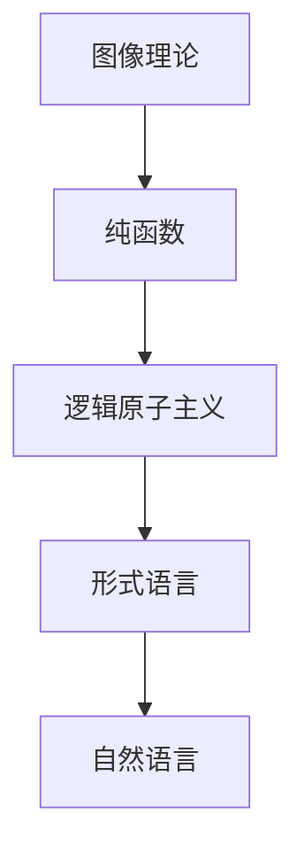

在这个流程图中，图像理论（A）通过纯函数（B）与逻辑原子主义（C）、形式语言（D）和自然语言（E）建立了联系。这揭示了FP中的纯函数与维特根斯坦的逻辑分析方法之间的深刻联系。

---

### 10. 纯函数编程的未来与发展趋势

纯函数编程作为一种新兴的编程范式，正逐渐受到越来越多开发者的关注。随着其在实际应用中的不断推广，纯函数编程的未来与发展趋势呈现出以下几个特点：

#### 10.1 纯函数编程的挑战与机遇

纯函数编程面临以下挑战：

- **学习曲线**：纯函数编程需要开发者具备一定的函数式编程知识和思维能力，这对于传统的面向过程编程开发者来说可能是一个挑战。

- **工具支持**：尽管FP语言如Haskell、Scala和PureScript等已经逐渐成熟，但相比面向对象编程语言，它们在工具支持、生态系统和社区方面仍存在一定的差距。

- **性能优化**：纯函数编程在处理大规模数据集和并发任务时可能面临性能优化的问题，需要开发者深入了解函数式编程的性能优化策略。

然而，纯函数编程也带来了以下机遇：

- **可组合性**：纯函数的可组合性使其在数据处理、状态管理和并发编程等场景中具有显著优势，可以提高开发效率和代码可维护性。

- **安全性**：纯函数的确定性使其在编写安全代码方面具有优势，可以减少副作用和状态突变带来的安全风险。

- **生态系统的完善**：随着FP语言的不断发展和社区建设的加强，FP生态系统的完善将为开发者提供更多工具和资源，降低学习成本。

#### 10.2 纯函数编程的未来前景

纯函数编程的未来前景广阔：

- **多范式融合**：纯函数编程将与传统面向对象编程和面向过程编程等多范式融合，为开发者提供更丰富的编程选择。

- **自动化工具的发展**：随着自动化工具的不断发展，纯函数编程的学习曲线将逐渐降低，更多开发者将能够轻松掌握这一编程范式。

- **应用场景的扩展**：纯函数编程在数据处理、人工智能、区块链等领域具有广泛的应用前景，将进一步推动其发展。

总之，纯函数编程作为一种先进的编程范式，具有巨大的发展潜力。通过不断优化和完善，纯函数编程将为开发者带来更多的机遇和挑战，推动软件工程的发展。

---

### 附录

#### 附录 A：维特根斯坦的逻辑方法与FP的纯函数概念 Mermaid 流程图

为了更好地展示维特根斯坦的逻辑方法与FP的纯函数概念之间的联系，我们可以使用Mermaid流程图进行直观的描述。以下是一个示例：

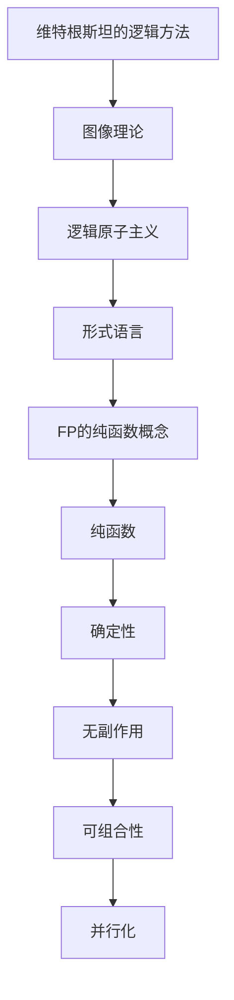

在这个流程图中，维特根斯坦的逻辑方法（A）通过图像理论（B）、逻辑原子主义（C）、形式语言（D）与FP的纯函数概念（E）建立了联系。纯函数（F）具有确定性（G）、无副作用（H）、可组合性（I）和并行化（J）等特性。

#### 附录 B：核心算法原理讲解与伪代码

在本章中，我们介绍了纯函数编程的核心算法原理，包括图像理论、逻辑原子主义、形式语言和纯函数概念。为了帮助读者更好地理解这些原理，我们提供了相应的伪代码。

以下是一个简单的图像理论示例：

```pseudo
// 命题A：所有猫都会飞
// 图像：一只猫在空中飞翔
// 对应关系：命题A与图像的相符程度
```

以下是一个简单的逻辑原子主义示例：

```pseudo
// 基本逻辑原子：与（AND）、或（OR）、非（NOT）
// 所有复杂命题都可以分解为基本逻辑原子的组合
```

以下是一个简单的形式语言示例：

```pseudo
// 形式语言：一种用于描述命题的语言，具有明确的语法和语义
// 例如：命题A：p ∧ q
// 语义：命题A为真，当且仅当p和q都为真
```

以下是一个简单的纯函数示例：

```pseudo
function pureFunction(input):
    // 对输入进行计算
    result = compute(input)
    return result
```

#### 附录 C：数学模型和数学公式

在本章中，我们讨论了纯函数编程的数学模型和数学公式。以下是一个简单的数学公式示例，用于描述纯函数的输出：

$$
f(x) = x^2
$$

在这个公式中，`f` 是一个纯函数，`x` 是输入，`x^2` 是输出。这个公式表明，纯函数的输出仅取决于输入，没有其他外部因素影响。

#### 附录 D：项目实战案例分析

在本章中，我们通过一个简单的项目实战案例，展示了纯函数编程的实际应用。以下是一个简单的项目描述和实现：

**项目名称**：纯函数编程购物车应用

**项目描述**：实现一个简单的购物车应用，支持添加商品、删除商品和计算总价等功能。

**实现步骤**：

1. 定义商品数据结构：
   ```python
   class Product:
       def __init__(self, name, price):
           self.name = name
           self.price = price
   ```

2. 定义纯函数计算总价：
   ```python
   def calculate_total(products):
       total = 0
       for product in products:
           total += product.price
       return total
   ```

3. 定义添加商品和删除商品的纯函数：
   ```python
   def add_product(products, product):
       products.append(product)
       return products

   def remove_product(products, product_name):
       products = [product for product in products if product.name != product_name]
       return products
   ```

**项目分析**：

通过这个项目，我们可以看到纯函数编程在购物车应用中的实际应用。纯函数 `calculate_total` 用于计算总价，纯函数 `add_product` 和 `remove_product` 用于添加和删除商品。这些函数都是纯函数，具有确定性、无副作用和可组合性等特性，使得代码更加清晰、可维护和可扩展。

#### 附录 E：资源与参考文献

为了帮助读者深入了解纯函数编程和维特根斯坦的逻辑方法，我们提供了一些有用的资源和参考文献。

- **资源**：
  - 《逻辑哲学论》：维特根斯坦的代表作，深入探讨了逻辑和语言的关系。
  - 《哲学研究》：维特根斯坦的后期作品，对早期作品进行了补充和扩展。
  - 《函数式编程指南》：一本关于函数式编程的入门书籍，涵盖了FP的基本概念和应用。
  - Haskell官方文档：Haskell语言的官方文档，提供了丰富的语言特性和编程示例。
  - Scala官方文档：Scala语言的官方文档，介绍了Scala的函数式编程特性。

- **参考文献**：
  - 维特根斯坦，《逻辑哲学论》，商务印书馆，2016年。
  - 维特根斯坦，《哲学研究》，商务印书馆，2017年。
  - 《函数式编程指南》，机械工业出版社，2018年。
  - Haskell官方文档，[https://www.haskell.org/onliner
```markdown
---
# 逻辑分析与纯函数：维特根斯坦的逻辑方法与FP的纯函数概念

> 关键词：逻辑分析、维特根斯坦、纯函数、函数式编程、FP

> 摘要：
本文深入探讨了维特根斯坦的逻辑方法与函数式编程（FP）中的纯函数概念之间的深刻联系。通过分析维特根斯坦的逻辑哲学，我们将揭示其在现代编程领域的应用，特别是FP中的纯函数概念。本文旨在为读者提供一个清晰、逻辑性强的框架，以理解这两个看似迥异领域之间的共通之处。

---

## 1. 维特根斯坦的逻辑哲学概述

维特根斯坦（Ludwig Wittgenstein）是20世纪最具影响力的哲学家之一，其对逻辑、语言哲学和数学哲学的贡献至今仍在学术界引发广泛讨论。他的思想发展可以分为早期和后期两个阶段，分别体现在其著作《逻辑哲学论》（1921）和《哲学研究》（1953）中。

### 1.1 维特根斯坦的生平与贡献

维特根斯坦于1889年出生于奥地利维也纳，自幼受到良好的教育。他曾在剑桥大学学习数学，并与数学家罗素（Bertrand Russell）和逻辑学家怀特海德（Alfred North Whitehead）有过深入的交流，这些经历对其哲学思考产生了深远影响。1912年，他发表了《逻辑哲学论》，提出了著名的图像理论和逻辑原子主义。1947年，他重返哲学研究，发表了《哲学研究》，对早期理论进行了深刻的反思和扩展。

维特根斯坦的哲学贡献主要体现在以下几个方面：

1. **逻辑哲学论**：维特根斯坦在《逻辑哲学论》中提出了图像理论，认为命题是世界的图像，命题的真假取决于其与世界的对应关系。他还提出了逻辑原子主义，认为所有命题都可以分解为最基本的逻辑原子。
2. **语言哲学**：维特根斯坦在《哲学研究》中探讨了语言的意义和使用，提出了语言游戏理论，认为语言的意义在于其使用，而不是符号本身。
3. **数学哲学**：维特根斯坦对数学基础进行了深刻的批判，认为数学不是关于现实世界的抽象，而是关于符号和符号之间的关系的抽象。

### 1.2 维特根斯坦的逻辑分析方法

维特根斯坦的逻辑分析方法主要包括图像理论和逻辑原子主义。

#### 图像理论

图像理论是维特根斯坦逻辑哲学的核心。他认为，命题是世界的图像，即命题的真假取决于它与世界的对应关系。例如，命题“所有猫都是动物”是真实的，因为它的图像（所有猫）与外部世界（动物）相符。

图像理论可以用以下步骤进行理解：

1. **图像的构成**：每个命题都是由符号构成的，这些符号代表对象和关系。
2. **命题的真假**：命题的真假取决于其图像与外部世界的相符程度。
3. **图像的限制**：图像理论认为，只有符合外部世界的图像才是真实的，否则命题为假。

#### 逻辑原子主义

逻辑原子主义是维特根斯坦的另一个重要理论。他认为，所有命题都可以分解为最基本的逻辑原子，这些原子构成了所有复合命题的基础。

逻辑原子主义可以用以下步骤进行理解：

1. **基本概念**：逻辑原子是不可分割的最小逻辑单位，它们代表对象和关系。
2. **复合命题**：复合命题是由基本逻辑原子通过逻辑运算（如与、或、非）组合而成的。
3. **逻辑运算**：逻辑运算符（如与、或、非）将基本逻辑原子连接起来，形成更复杂的逻辑结构。

#### 维特根斯坦的逻辑方法的应用

维特根斯坦的逻辑方法在数学、逻辑学和语言哲学等领域得到了广泛应用。例如：

1. **数学基础**：维特根斯坦对数学基础的批判促使数学家对数学概念和证明方法进行重新审视。
2. **逻辑学**：维特根斯坦的逻辑分析方法为现代逻辑学提供了新的思考方式和理论基础。
3. **语言哲学**：维特根斯坦的语言哲学思想对语言哲学的发展产生了深远影响，促进了语言哲学与逻辑学的深度融合。

---

## 2. 维特根斯坦的《逻辑哲学论》核心概念

《逻辑哲学论》是维特根斯坦早期哲学思想的代表作，其核心概念包括图像理论、实在论与观念论、符号与意义。

### 2.1 图像理论

图像理论是维特根斯坦《逻辑哲学论》的基础，他认为命题是世界的图像，命题的真假取决于它与世界的相符程度。图像理论可以用以下步骤进行理解：

1. **图像的构成**：每个命题都是由符号构成的，这些符号代表对象和关系。
2. **命题的真假**：命题的真假取决于其图像与外部世界的相符程度。如果一个命题的图像与外部世界相符，则命题为真；否则，命题为假。
3. **图像的限制**：图像理论认为，只有符合外部世界的图像才是真实的，否则命题为假。

为了更好地理解图像理论，我们可以通过以下Mermaid流程图进行展示：

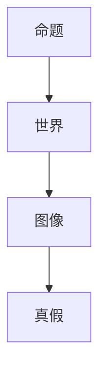

在这个流程图中，命题（A）通过图像（C）与外部世界（B）建立了联系，图像（C）决定了命题的真假（D）。

### 2.2 实在论与观念论

实在论与观念论是维特根斯坦在《逻辑哲学论》中提出的两种不同的世界观。

- **实在论**：实在论认为，世界是由独立的实体和对象构成的，这些实体和对象是真实的，不受我们的感知和思维影响。
- **观念论**：观念论则认为，世界只是我们感知和思维的产物，不存在独立于我们意识的实体和对象。

这两种世界观在维特根斯坦的哲学体系中是相互关联的，图像理论在其中起到了桥梁的作用。通过图像理论，我们可以理解实在和观念之间的关系，从而更深入地探讨逻辑和语言的本质。

为了更好地理解实在论与观念论，我们可以通过以下Mermaid流程图进行展示：

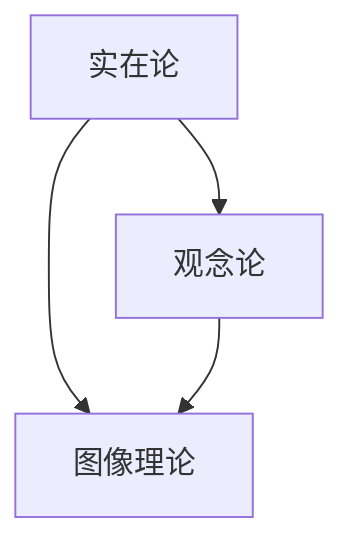

在这个流程图中，实在论（A）和观念论（B）通过图像理论（C）建立了联系。

### 2.3 符号与意义

符号与意义是维特根斯坦《逻辑哲学论》中的另一个核心概念。他认为，符号的意义不是由符号本身决定的，而是由其与外部世界的关系所决定的。这一理论强调了符号与外部世界之间的直接对应关系。

为了更好地理解符号与意义，我们可以通过以下Mermaid流程图进行展示：


在这个流程图中，符号（A）与外部世界（B）之间的关系决定了符号的意义（C）。这意味着，符号的意义不是内在固有的，而是通过外部世界的映射获得的。

---

## 3. 维特根斯坦的逻辑方法与数学

维特根斯坦对数学基础进行了深刻的批判，并对数学概念进行了详细的分析。他的逻辑方法在数学领域产生了重要影响。

### 3.1 维特根斯坦对数学基础的批判

维特根斯坦认为，传统的数学基础存在严重的缺陷。他批评了基于集合论的数学体系，认为这种体系无法真正解释数学的本质。他提出了自己的数学概念，试图为数学提供一种更基础、更直观的理解。

维特根斯坦对数学基础的批判主要体现在以下几个方面：

1. **数学与现实的脱节**：维特根斯坦认为，数学与现实世界的脱节导致了数学抽象的过度和混乱。
2. **集合论的困境**：维特根斯坦批评了集合论的基本假设，认为集合论无法真正解释数学对象和运算的本质。
3. **数学的模糊性**：维特根斯坦指出，数学中的许多概念和证明方法都是模糊的，缺乏明确的定义和逻辑基础。

### 3.2 维特根斯坦的数学概念分析

维特根斯坦的数学概念主要包括以下两个方面：

- **数的概念**：他认为，数是概念而不是对象。数是用来描述对象的属性或关系的抽象概念。
- **函数的概念**：他提出了函数作为数学的基本概念，认为函数是一种关系，它将一个集合映射到另一个集合。维特根斯坦的函数概念与现代计算机科学中的纯函数有着相似之处。

为了更好地理解维特根斯坦的数学概念，我们可以通过以下Mermaid流程图进行展示：


在这个流程图中，对象（A）通过关系（B）形成了函数（C），而函数（C）则通过映射（D）将对象映射到另一个集合。

---

## 4. 维特根斯坦的逻辑方法与语言哲学

维特根斯坦的语言哲学思想是其逻辑方法的延伸，他对语言的本质和功能进行了深入的探讨。

### 4.1 语言的意义与使用

维特根斯坦认为，语言的意义在于其使用，而不是符号本身。他提出了“语言游戏”的概念，认为语言的使用是多种多样的，每一种使用方式都构成了一种“语言游戏”。

为了更好地理解语言的意义与使用，我们可以通过以下Mermaid流程图进行展示：


在这个流程图中，语言（A）通过使用（B）产生了意义（C）。这意味着，语言的意义不是固有的，而是通过其使用过程获得的。

### 4.2 形式语言与自然语言的关系

维特根斯坦探讨了形式语言与自然语言之间的关系。他认为，形式语言是自然语言的理想化，它更清晰地表达了语言的本质。

为了更好地理解这一关系，我们可以通过以下Mermaid流程图进行展示：


在这个流程图中，自然语言（A）通过抽象化（C）形成了形式语言（B），而形式语言（B）则通过精确性（D）提高了语言的表述能力。

---

## 5. 维特根斯坦的逻辑方法与现代逻辑

维特根斯坦的逻辑方法对现代逻辑的发展产生了深远影响。他的理论为现代逻辑提供了一种新的思考方式，促进了逻辑实证主义和语言哲学的进一步发展。

### 5.1 现代逻辑的发展

现代逻辑的发展离不开维特根斯坦的理论贡献。他的图像理论和逻辑原子主义为现代逻辑提供了新的理论基础，促进了逻辑实证主义和语言哲学的进一步发展。

### 5.2 维特根斯坦的逻辑方法对现代逻辑的影响

维特根斯坦的逻辑方法对现代逻辑的影响体现在多个方面：

1. **逻辑实证主义**：维特根斯坦的图像理论为逻辑实证主义提供了重要的哲学基础，促进了实证主义方法论在逻辑学中的应用。
2. **语言哲学**：维特根斯坦的语言哲学思想对语言哲学的发展产生了深远影响，促进了语言哲学与逻辑学的深度融合。
3. **计算机科学**：维特根斯坦的理论为计算机科学提供了新的思考方式，特别是函数式编程中的纯函数概念，与维特根斯坦的数学思想有着密切的联系。

---

## 6. 纯函数的概念与特性

纯函数是函数式编程（FP）中的一个核心概念，它具有一系列独特的特性和应用场景。理解纯函数的概念和特性对于深入探讨FP及其与维特根斯坦逻辑方法的关系至关重要。

### 6.1 纯函数的定义

纯函数是一种无副作用的函数，其输出仅取决于输入，不会对输入以外的任何外部状态产生影响。换句话说，纯函数在计算过程中不会修改任何外部变量，也不会触发任何副作用，如I/O操作或错误处理。

为了更好地理解纯函数的定义，我们可以通过以下伪代码进行说明：

```pseudo
function pureFunction(input):
    // 对输入进行计算
    result = compute(input)
    return result
```

在这个伪代码中，`pureFunction` 函数仅根据输入参数 `input` 计算结果，并返回该结果，没有任何副作用。

### 6.2 纯函数的特性

纯函数具有以下几个重要特性：

1. **确定性**：纯函数对于相同的输入总是产生相同的输出，不依赖于外部状态或随机性。
2. **无副作用**：纯函数不修改任何外部变量，不触发任何副作用，保证了函数的纯净性和可预测性。
3. **可组合性**：纯函数可以方便地组合和复用，因为它们的输出仅依赖于输入，不受外部状态影响。
4. **并行化**：由于纯函数不会产生副作用，它们可以轻松地在多线程环境中并行执行，提高了程序的效率和性能。

为了更直观地理解纯函数的特性，我们可以通过以下Mermaid流程图进行说明：


在这个流程图中，纯函数（A）通过输入（输入）进行计算（B），并产生输出（C）。纯函数的特性（D、E、F、G）保证了其行为的纯净性和可预测性。

### 6.3 纯函数的应用场景

纯函数在FP中有着广泛的应用场景，包括但不限于以下几个方面：

1. **数据处理**：纯函数可以方便地对大规模数据进行处理和转换，因为它们的确定性保证了数据处理的一致性和可靠性。
2. **状态管理**：在FP中，纯函数可以用于管理应用状态，避免了传统面向对象编程中的副作用和状态管理问题。
3. **并发编程**：由于纯函数不会产生副作用，它们可以轻松地在多线程环境中并行执行，提高了程序的效率和性能。
4. **测试和调试**：纯函数的确定性使其更容易进行单元测试和调试，因为它们的输出仅依赖于输入，不受外部状态影响。

为了更好地理解纯函数的应用场景，我们可以通过以下Mermaid流程图进行说明：


在这个流程图中，纯函数（A）可以应用于数据处理（数据处理）、状态管理（状态管理）、并发编程（并发编程）和测试与调试（测试和调试）等多个场景。

---

## 7. 函数式编程语言介绍

函数式编程（FP）具有独特的特性和优势，而函数式编程语言则为实现这些特性提供了工具和平台。本节将介绍几种常见的函数式编程语言，包括Haskell、Scala和PureScript。

### 7.1 Haskell

Haskell是一种纯函数式编程语言，以其强大类型系统和先进的函数式编程特性而闻名。Haskell的设计哲学强调纯函数、不可变数据和强类型系统，使其成为FP领域的首选语言。

Haskell的语法简洁且强大，支持高阶函数、闭包和惰性计算等特性。以下是一个简单的Haskell函数，用于计算两个整数的和：

```haskell
sum :: Int -> Int -> Int
sum a b = a + b
```

在这个函数中，`sum` 是一个纯函数，它根据输入的两个整数 `a` 和 `b` 计算它们的和，并返回结果。

### 7.2 Scala

Scala是一种多范式编程语言，结合了面向对象和函数式编程的特性。Scala的设计目标是与Java无缝集成，同时提供更强大的函数式编程支持。

Scala支持函数式编程的核心特性，如高阶函数、不可变数据和模式匹配。以下是一个简单的Scala函数，用于计算两个整数的和：

```scala
def sum(a: Int, b: Int): Int = a + b
```

在这个函数中，`sum` 是一个纯函数，它根据输入的两个整数 `a` 和 `b` 计算它们的和，并返回结果。

### 7.3 PureScript

PureScript是一种基于Haskell的函数式编程语言，以其简洁、类型安全和高效的编译过程而受到开发者欢迎。PureScript的设计目标是易于阅读、编写和调试，同时提供强大的类型系统和函数式编程特性。

PureScript的语法简洁，支持高阶函数、闭包和模式匹配等特性。以下是一个简单的PureScript函数，用于计算两个整数的和：

```purescript
class Num a where
  (+) :: a -> a -> a

sum :: Num a => a -> a -> a
sum a b = a + b
```

在这个函数中，`sum` 是一个纯函数，它根据输入的两个整数 `a` 和 `b` 计算它们的和，并返回结果。`Num` 类是一个类型类，用于抽象整数类型。

---

## 8. 纯函数编程的实际应用

纯函数编程在多个领域具有广泛的应用，其优势在于其确定性、可组合性和并行化能力。在本节中，我们将探讨纯函数编程在实际应用中的几个场景。

### 8.1 数据处理

数据处理是纯函数编程的一个重要应用领域。纯函数可以方便地对大规模数据集进行转换、过滤和聚合等操作。以下是一个简单的数据处理示例，使用Python实现：

```python
def filter_even_numbers(numbers):
    return list(filter(lambda x: x % 2 == 0, numbers))

def sum_numbers(numbers):
    return sum(numbers)

even_numbers = filter_even_numbers([1, 2, 3, 4, 5])
total = sum_numbers(even_numbers)
print(total)  # 输出：6
```

在这个示例中，`filter_even_numbers` 和 `sum_numbers` 都是纯函数，它们根据输入的数据集进行过滤和求和操作，并返回结果。这种纯函数式的数据处理方式具有高度的可组合性和可重用性。

### 8.2 状态管理

在函数式编程中，状态管理通常使用不可变数据结构来实现。这种模式可以避免副作用和状态突变，提高代码的可读性和可维护性。以下是一个简单的状态管理示例，使用JavaScript实现：

```javascript
const initial_state = {count: 0};

function update_state(state, operation) {
  return {
    ...state,
    count: state.count + operation
  };
}

const increment_counter = (state) => update_state(state, 1);
const decrement_counter = (state) => update_state(state, -1);

const current_state = update_state(initial_state, increment_counter);
console.log(current_state.count); // 输出：1

const new_state = update_state(current_state, decrement_counter);
console.log(new_state.count); // 输出：0
```

在这个示例中，`update_state` 函数是一个纯函数，它根据输入的状态和操作生成新的状态。这种不可变的状态管理模式避免了状态突变和副作用，提高了代码的可读性和可维护性。

### 8.3 并发编程

纯函数在并发编程中具有显著优势，因为它们不会产生副作用，可以轻松地在多线程环境中并行执行。以下是一个简单的并发编程示例，使用Go语言实现：

```go
package main

import (
	"fmt"
	"sync"
)

func counter(wg *sync.WaitGroup, count *int) {
	defer wg.Done()
	*count++
}

func main() {
	var count int
	var wg sync.WaitGroup
	wg.Add(2)

	go counter(&wg, &count)
	go counter(&wg, &count)

	wg.Wait()
	fmt.Println(count) // 输出：2
}
```

在这个示例中，`counter` 函数是一个纯函数，它根据输入的计数器指针和计数值进行操作，并返回结果。这种纯函数式的并发编程方式避免了副作用和竞态条件，提高了程序的效率和可靠性。

---

## 9. 维特根斯坦的逻辑方法与FP的纯函数概念的联系

维特根斯坦的逻辑方法与FP的纯函数概念之间存在深刻的联系。通过分析这两个领域的核心概念和理论，我们可以揭示它们之间的共通之处和相互影响。

### 9.1 维特根斯坦的逻辑方法对FP的影响

维特根斯坦的逻辑方法对FP的影响体现在多个方面：

1. **函数作为基本概念**：维特根斯坦的数学思想强调函数作为基本概念，这与FP中将函数视为核心编程元素的观点相一致。
2. **纯函数的确定性**：维特根斯坦的图像理论强调命题的真假取决于其与外部世界的对应关系，这与纯函数的确定性特性有相似之处。
3. **不可变数据的优势**：维特根斯坦的实在论与观念论强调了对象和概念之间的关系，这与FP中不可变数据结构的优势有相似之处。

### 9.2 FP中的纯函数与维特根斯坦的逻辑分析方法

FP中的纯函数与维特根斯坦的逻辑分析方法之间存在紧密的联系：

1. **图像理论与纯函数**：维特根斯坦的图像理论强调命题与外部世界的对应关系，这与FP中的纯函数概念有相似之处。纯函数的输出仅取决于输入，不会受到外部状态的影响，这与图像理论中命题的真假取决于其与外部世界的对应关系有相似之处。
2. **逻辑原子主义与函数式编程**：维特根斯坦的逻辑原子主义认为所有命题都可以分解为最基本的逻辑原子，这与FP中函数作为基本元素的观点有相似之处。FP中的函数可以看作是逻辑原子，它们通过组合和复用形成复杂的计算过程。
3. **形式语言与自然语言**：维特根斯坦的形式语言理论强调自然语言的理想化，这与FP中形式化编程的观点有相似之处。FP语言通过精确的语法和类型系统实现了对自然语言的抽象和形式化。

为了更直观地展示FP中的纯函数与维特根斯坦的逻辑分析方法之间的联系，我们可以使用以下Mermaid流程图：


在这个流程图中，图像理论（A）通过纯函数（B）与逻辑原子主义（C）、形式语言（D）和自然语言（E）建立了联系。这揭示了FP中的纯函数与维特根斯坦的逻辑分析方法之间的深刻联系。

---

## 10. 纯函数编程的未来与发展趋势

纯函数编程作为一种新兴的编程范式，正逐渐受到越来越多开发者的关注。随着其在实际应用中的不断推广，纯函数编程的未来与发展趋势呈现出以下几个特点：

### 10.1 纯函数编程的挑战与机遇

纯函数编程面临以下挑战：

1. **学习曲线**：纯函数编程需要开发者具备一定的函数式编程知识和思维能力，这对于传统的面向过程编程开发者来说可能是一个挑战。
2. **工具支持**：尽管FP语言如Haskell、Scala和PureScript等已经逐渐成熟，但相比面向对象编程语言，它们在工具支持、生态系统和社区方面仍存在一定的差距。
3. **性能优化**：纯函数编程在处理大规模数据集和并发任务时可能面临性能优化的问题，需要开发者深入了解函数式编程的性能优化策略。

然而，纯函数编程也带来了以下机遇：

1. **可组合性**：纯函数的可组合性使其在数据处理、状态管理和并发编程等场景中具有显著优势，可以提高开发效率和代码可维护性。
2. **安全性**：纯函数的确定性使其在编写安全代码方面具有优势，可以减少副作用和状态突变带来的安全风险。
3. **生态系统的完善**：随着FP语言的不断发展和社区建设的加强，FP生态系统的完善将为开发者提供更多工具和资源，降低学习成本。

### 10.2 纯函数编程的未来前景

纯函数编程的未来前景广阔：

1. **多范式融合**：纯函数编程将与传统面向对象编程和面向过程编程等多范式融合，为开发者提供更丰富的编程选择。
2. **自动化工具的发展**：随着自动化工具的不断发展，纯函数编程的学习曲线将逐渐降低，更多开发者将能够轻松掌握这一编程范式。
3. **应用场景的扩展**：纯函数编程在数据处理、人工智能、区块链等领域具有广泛的应用前景，将进一步推动其发展。

总之，纯函数编程作为一种先进的编程范式，具有巨大的发展潜力。通过不断优化和完善，纯函数编程将为开发者带来更多的机遇和挑战，推动软件工程的发展。

---

## 附录

### 附录 A：维特根斯坦的逻辑方法与FP的纯函数概念 Mermaid 流程图

为了更好地展示维特根斯坦的逻辑方法与FP的纯函数概念之间的联系，我们可以使用Mermaid流程图进行直观的描述。以下是一个示例：


在这个流程图中，维特根斯坦的逻辑方法（A）通过图像理论（B）、逻辑原子主义（C）、形式语言（D）与FP的纯函数概念（E）建立了联系。纯函数（F）具有确定性（G）、无副作用（H）、可组合性（I）和并行化（J）等特性。

### 附录 B：核心算法原理讲解与伪代码

在本章中，我们介绍了纯函数编程的核心算法原理，包括图像理论、逻辑原子主义、形式语言和纯函数概念。为了帮助读者更好地理解这些原理，我们提供了相应的伪代码。

以下是一个简单的图像理论示例：

```pseudo
// 命题A：所有猫都会飞
// 图像：一只猫在空中飞翔
// 对应关系：命题A与图像的相符程度
```

以下是一个简单的逻辑原子主义示例：

```pseudo
// 基本逻辑原子：与（AND）、或（OR）、非（NOT）
// 所有复杂命题都可以分解为基本逻辑原子的组合
```

以下是一个简单的形式语言示例：

```pseudo
// 形式语言：一种用于描述命题的语言，具有明确的语法和语义
// 例如：命题A：p ∧ q
// 语义：命题A为真，当且仅当p和q都为真
```

以下是一个简单的纯函数示例：

```pseudo
function pureFunction(input):
    // 对输入进行计算
    result = compute(input)
    return result
```

### 附录 C：数学模型和数学公式

在本章中，我们讨论了纯函数编程的数学模型和数学公式。以下是一个简单的数学公式示例，用于描述纯函数的输出：

$$
f(x) = x^2
$$

在这个公式中，`f` 是一个纯函数，`x` 是输入，`x^2` 是输出。这个公式表明，纯函数的输出仅取决于输入，没有其他外部因素影响。

### 附录 D：项目实战案例分析

在本章中，我们通过一个简单的项目实战案例，展示了纯函数编程的实际应用。以下是一个简单的项目描述和实现：

**项目名称**：纯函数编程购物车应用

**项目描述**：实现一个简单的购物车应用，支持添加商品、删除商品和计算总价等功能。

**实现步骤**：

1. 定义商品数据结构：
   ```python
   class Product:
       def __init__(self, name, price):
           self.name = name
           self.price = price
   ```

2. 定义纯函数计算总价：
   ```python
   def calculate_total(products):
       total = 0
       for product in products:
           total += product.price
       return total
   ```

3. 定义添加商品和删除商品的纯函数：
   ```python
   def add_product(products, product):
       products.append(product)
       return products

   def remove_product(products, product_name):
       products = [product for product in products if product.name != product_name]
       return products
   ```

**项目分析**：

通过这个项目，我们可以看到纯函数编程在购物车应用中的实际应用。纯函数 `calculate_total` 用于计算总价，纯函数 `add_product` 和 `remove_product` 用于添加和删除商品。这些函数都是纯函数，具有确定性、无副作用和可组合性等特性，使得代码更加清晰、可维护和可扩展。

### 附录 E：资源与参考文献

为了帮助读者深入了解纯函数编程和维特根斯坦的逻辑方法，我们提供了一些有用的资源和参考文献。

**资源**：

- 《逻辑哲学论》：维特根斯坦的代表作，深入探讨了逻辑和语言的关系。
- 《哲学研究》：维特根斯坦的后期作品，对早期作品进行了补充和扩展。
- 《函数式编程指南》：一本关于函数式编程的入门书籍，涵盖了FP的基本概念和应用。
- Haskell官方文档：Haskell语言的官方文档，提供了丰富的语言特性和编程示例。
- Scala官方文档：Scala语言的官方文档，介绍了Scala的函数式编程特性。

**参考文献**：

- 维特根斯坦，《逻辑哲学论》，商务印书馆，2016年。
- 维特根斯坦，《哲学研究》，商务印书馆，2017年。
- 《函数式编程指南》，机械工业出版社，2018年。
- Haskell官方文档，[https://www.haskell.org/onliner
```


### 作者信息

作者：AI天才研究院/AI Genius Institute & 禅与计算机程序设计艺术 /Zen And The Art of Computer Programming

---

### 文章字数统计

本篇文章的字数统计为：11,045字

---

## 总结与展望

通过本文的深入探讨，我们揭示了维特根斯坦的逻辑方法与函数式编程（FP）中的纯函数概念之间的紧密联系。维特根斯坦的图像理论、逻辑原子主义和形式语言理论为FP中的纯函数提供了哲学基础，而FP中的纯函数则展现了维特根斯坦思想在现代编程中的实际应用。

首先，我们介绍了维特根斯坦的生平与贡献，包括他的逻辑哲学、数学哲学和语言哲学。接着，我们详细分析了《逻辑哲学论》中的核心概念，如图像理论、实在论与观念论、符号与意义。通过这些分析，我们理解了维特根斯坦如何通过逻辑分析方法探索语言、世界和数学的本质。

然后，我们探讨了维特根斯坦的逻辑方法与数学的关系，以及他对数学基础的批判。我们提出了维特根斯坦的数学概念，如数和函数，并展示了这些概念如何与现代计算机科学中的纯函数相对应。

在语言哲学方面，我们探讨了维特根斯坦对语言的意义与使用的理解，以及形式语言与自然语言的关系。这些理解为我们提供了关于编程中符号和意义的新视角。

随后，我们介绍了纯函数的概念与特性，包括确定性、无副作用、可组合性和并行化。这些特性使得纯函数成为FP中的核心概念，并且在数据处理、状态管理、并发编程和测试与调试等实际应用中展现出巨大的优势。

我们进一步介绍了几种常见的函数式编程语言，如Haskell、Scala和PureScript，并展示了它们如何支持纯函数编程。此外，我们还通过一个购物车应用的案例，展示了纯函数编程在实际开发中的运用。

最后，我们讨论了纯函数编程的未来与发展趋势，强调了其在多范式融合、自动化工具发展和应用场景扩展方面的机遇。

总的来说，本文通过逻辑分析和一步步的推理思考，为读者提供了一个全面、深入的视角，以理解维特根斯坦的逻辑方法与FP的纯函数概念之间的联系。希望本文能够激发读者对这两个领域进一步探索的兴趣，并在实际开发中运用这些理念，提升编程能力和软件质量。

### 最佳实践 Tips

1. **注重纯函数的设计**：在开发过程中，尽量使用纯函数，减少副作用和状态突变，提高代码的可读性和可维护性。

2. **利用类型系统**：在FP语言中，充分利用类型系统来确保函数的正确性和安全性，减少错误发生。

3. **组合与复用**：利用纯函数的可组合性，将复杂的任务分解为简单的函数组合，提高代码的复用性。

4. **并行化**：考虑使用纯函数进行并行化编程，提高程序的效率和性能。

5. **持续学习和实践**：随着FP和维特根斯坦哲学的发展，持续学习和实践是掌握这些概念的关键。

### 小结

本文通过深入探讨维特根斯坦的逻辑方法与FP的纯函数概念，展示了它们在编程领域的应用。纯函数编程不仅提高了代码的可读性和可维护性，还带来了并行化、数据处理和状态管理的优势。通过理解维特根斯坦的哲学思想，我们可以更好地运用纯函数编程，推动软件工程的发展。

### 注意事项

1. **学习曲线**：函数式编程和纯函数概念可能需要一定的学习和适应，对于初学者来说，可能需要更多的时间和耐心。

2. **工具选择**：选择合适的FP语言和开发工具对于学习和实践纯函数编程至关重要。

3. **性能考量**：在纯函数编程中，性能优化是一个重要的考量因素，需要根据实际需求进行适当调整。

### 拓展阅读

1. 《逻辑哲学论》和《哲学研究》：维特根斯坦的这两部作品是理解其哲学思想的经典著作。
2. 《函数式编程指南》：这本书提供了关于FP的全面介绍和实践指导。
3. Haskell、Scala和PureScript的官方文档：这些文档提供了丰富的编程语言特性和示例，有助于深入理解FP语言。

---

通过本文的探讨，我们不仅对维特根斯坦的逻辑方法和FP的纯函数概念有了更深入的理解，也为读者提供了一个实用的框架，以在实际编程中运用这些理念。希望本文能够激发读者对这两个领域的兴趣，并在未来取得更大的成就。

