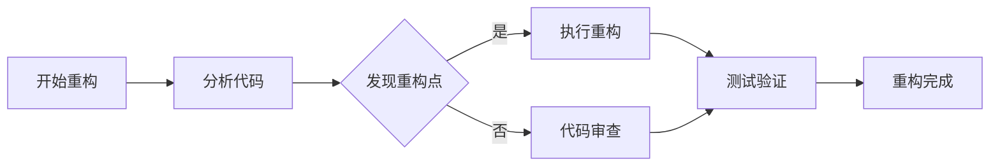

                 

### 第1章：重构的基本概念

#### 引言

软件重构是软件开发和维护过程中不可或缺的一部分。它不仅仅是为了让代码变得美观，更是为了提高代码的质量、可读性和可维护性。然而，重构并不是一个简单的任务，它需要开发者具备一定的技术和经验。在本章中，我们将深入探讨重构的基本概念，包括重构的定义、与代码维护和优化的关系，以及重构对软件质量的影响。

#### 重构的定义

重构（Refactoring）是指在不改变程序外在行为的前提下，对程序内部的结构进行调整和改进的过程。具体来说，重构的主要目标是：

1. **提高代码的可读性**：通过重构，我们可以使代码更加清晰、简洁，容易理解和阅读。
2. **增强代码的可维护性**：重构可以消除代码中的重复性、复杂性，使其更易于维护和更新。
3. **优化代码的性能**：在某些情况下，重构也可以优化代码的性能，使其运行得更快。

值得注意的是，重构并不会改变程序的输出结果。换句话说，无论代码经过多少次重构，程序的功能和性能都应该保持不变。

#### 重构与代码维护

代码维护（Code Maintenance）是指对现有代码进行修复、更新和优化，以确保其能够正常运行和满足需求。与重构不同，代码维护通常涉及到修复已发现的问题和bug，而重构则是预防性的措施，旨在避免未来可能出现的问题。

重构和代码维护之间的关系可以概括为：

1. **重构是代码维护的一部分**：在代码维护过程中，开发者可能会发现某些代码结构不合理，这时就可以进行重构。
2. **重构可以减少代码维护的工作量**：通过重构，我们可以提高代码的质量和可读性，从而减少未来需要维护的工作量。

#### 重构与代码优化

代码优化（Code Optimization）是指通过改进代码的算法和数据结构，提高其运行效率的过程。与重构不同，代码优化主要关注性能和效率。

重构和代码优化之间的关系可以概括为：

1. **重构是代码优化的前提**：在进行代码优化之前，通常需要对代码进行重构，以确保其结构和逻辑清晰，更容易进行优化。
2. **重构和优化可以同时进行**：在某些情况下，重构和优化可以同时进行，例如，我们可以在重构过程中发现某些代码片段可以优化，并进行相应的调整。

#### 重构对软件质量的影响

重构对软件质量有着深远的影响。通过重构，我们可以：

1. **提高代码质量**：重构可以消除代码中的冗余、重复和复杂性，使其更加简洁和易于理解。
2. **增强可读性**：重构可以使代码更加清晰、简洁，易于阅读和理解。
3. **提高可维护性**：重构可以减少代码的维护成本，使代码更易于维护和更新。
4. **提高软件可靠性**：重构可以消除代码中的潜在错误和 bug，从而提高软件的可靠性。

#### 重构的 Mermaid 流程图

为了更好地理解重构的过程，我们可以使用 Mermaid 流程图来展示重构的基本步骤。以下是一个简化的重构 Mermaid 流程图：



#### 核心算法原理讲解

重构的核心算法原理主要涉及到代码的分析和理解。以下是一个简单的伪代码，用于描述重构的基本步骤：

```python
function refactorCode(code):
    # 分析代码
    codeStructure = analyzeCode(code)
    
    # 发现重构点
    refactoringPoints = findRefactoringPoints(codeStructure)
    
    # 执行重构
    for point in refactoringPoints:
        applyRefactoring(point)
        
    # 测试验证
    assertTestResults(code)
```

#### 数学模型和公式讲解

在重构过程中，我们可能会遇到一些数学模型和公式。例如，在评估代码的可维护性时，我们可以使用以下公式来计算代码的复杂性：

$$
C = \frac{N^2 + 3M - 2P}{N}
$$

其中，$N$ 是代码行数，$M$ 是方法数，$P$ 是公共方法数。这个公式可以用来评估代码的复杂性，从而指导重构的方向。

#### 项目实战

在本节中，我们将介绍一个简单的重构项目实战。假设我们有一个简单的 Python 程序，其中包含了一些重复的代码片段。以下是原始代码：

```python
def calculate_total(fruit_prices, quantities):
    total = 0
    for price, quantity in fruit_prices:
        total += price * quantity
    return total

def calculate_discount(total):
    return total * 0.1

def calculate_final_price(total, discount):
    return total - discount

fruit_prices = [(2.0, 5), (3.0, 3), (4.0, 2)]
quantities = [5, 3, 2]

total = calculate_total(fruit_prices, quantities)
discount = calculate_discount(total)
final_price = calculate_final_price(total, discount)

print("Final Price:", final_price)
```

通过分析，我们可以发现 `calculate_total`、`calculate_discount` 和 `calculate_final_price` 这三个函数中存在重复的计算逻辑。因此，我们可以进行重构，将这些逻辑提取到单独的函数中，从而提高代码的可读性和可维护性。以下是重构后的代码：

```python
def calculate_total(fruit_prices):
    return sum(price * quantity for price, quantity in fruit_prices)

def calculate_discount(total):
    return total * 0.1

def calculate_final_price(total, discount):
    return total - discount

def main():
    fruit_prices = [(2.0, 5), (3.0, 3), (4.0, 2)]
    quantities = [5, 3, 2]

    total = calculate_total(fruit_prices)
    discount = calculate_discount(total)
    final_price = calculate_final_price(total, discount)

    print("Final Price:", final_price)

if __name__ == "__main__":
    main()
```

通过这个实战，我们可以看到重构是如何提高代码的质量和可读性的。

#### 最佳实践 tips、小结、注意事项、拓展阅读等内容

**最佳实践 tips**：

1. **避免过度重构**：重构是一个渐进的过程，避免一次性进行过多的重构。
2. **遵循重构原则**：在进行重构时，应遵循一些基本原则，如保持代码的简洁性、避免过度优化等。
3. **测试先行**：在进行重构之前，应确保有完整的测试覆盖，以便在重构后能够快速发现和修复问题。

**小结**：

本章介绍了重构的基本概念，包括重构的定义、与代码维护和优化的关系，以及重构对软件质量的影响。通过重构，我们可以提高代码的质量、可读性和可维护性。

**注意事项**：

1. **重构可能会引入新的 bug**：在进行重构时，应特别小心，以避免引入新的 bug。
2. **重构不是一劳永逸的**：重构是一个持续的过程，需要定期进行。

**拓展阅读**：

- 《重构：改善既有代码的设计》（Martin Fowler 著）
- 《代码大全》（Steve McConnell 著）
- 《敏捷开发与重构》（Jeff Sutherland 著）

#### 作者信息

作者：AI天才研究院/AI Genius Institute & 禅与计算机程序设计艺术 /Zen And The Art of Computer Programming

