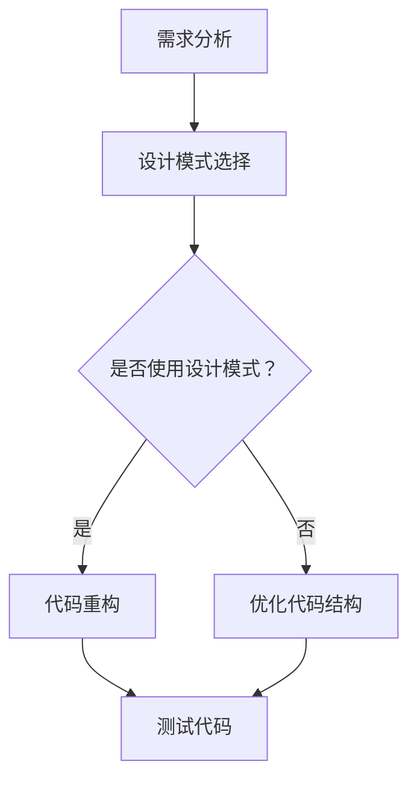

                 

# 重构不是除恶务尽

> 关键词：重构、代码质量、软件维护、设计模式、软件开发

> 摘要：本文将深入探讨重构在软件开发中的重要性和核心原则。通过解析重构的基本概念、核心原理和实际案例，揭示重构并非除恶务尽，而是一种提高代码可读性、可维护性的手段。文章旨在帮助开发者理解重构的价值，掌握重构的最佳实践，从而提升软件开发的整体质量。

## 《重构不是除恶务尽》目录大纲

## 第1章：重构的基本概念

### 1.1.1 重构的定义

### 1.1.2 重构的必要性

### 1.1.3 重构的分类

## 第2章：重构的核心原理

### 2.1.1 重构的核心原理

### 2.1.2 重构的Mermaid流程图

### 2.1.3 重构的伪代码

## 第3章：重构实践

### 3.1.1 重构实践的重要性

### 3.1.2 重构实践的过程

### 3.1.3 重构实践案例

## 第4章：重构的最佳实践与注意事项

### 4.1 重构的最佳实践

### 4.2 小结

### 4.3 注意事项

### 4.4 拓展阅读

---

## 第1章：重构的基本概念

### 1.1.1 重构的定义

重构（Refactoring）在软件开发中是一种重要的技术，它指的是在不改变外部行为的前提下对现有代码进行修改，以改进其内部结构和质量。重构的主要目的是提升代码的可读性、可维护性和性能，而不是增加新的功能。

### 1.1.2 重构的必要性

#### 代码维护困难

随着时间的推移，软件系统的代码可能会变得混乱，这使得维护和更新变得异常困难。重构可以帮助解决这些问题，使代码更加清晰、易于维护。

#### 代码可读性差

不规范的编码习惯和缺乏设计会导致代码难以阅读和理解。通过重构，可以提高代码的可读性，使开发者更容易理解和修改代码。

#### 模块耦合度高

高耦合度的模块会导致代码的任何修改都可能引起一系列问题。重构有助于降低模块间的耦合度，提高系统的可扩展性。

#### 代码冗长

冗长的代码不仅难以阅读，还可能隐藏潜在的错误。重构可以简化代码，去除不必要的复杂性。

### 1.1.3 重构的分类

#### 简单重构

简单重构主要包括一些基础的代码优化，如去除冗余代码、简化复杂的逻辑等。

#### 中级重构

中级重构涉及对代码结构的较大调整，如重新组织代码、引入设计模式等。

#### 高级重构

高级重构通常涉及到对系统架构的全面重构，可能会涉及到底层代码的修改，以达到更好的性能和可维护性。

---

## 第2章：重构的核心原理

### 2.1.1 重构的核心原理

重构的核心原理主要包括以下几个方面：

#### 设计模式

设计模式是软件开发中的一种最佳实践，它可以帮助我们解决常见的设计问题。在重构过程中，合理地使用设计模式可以显著提高代码的质量和可维护性。

#### 好的编程习惯

良好的编程习惯，如命名规范、注释、代码格式等，是重构的基础。遵循这些习惯可以使代码更加整洁、易于理解。

#### 遵循代码规范

代码规范是重构的重要参考依据，它定义了代码编写的基本规则和标准。遵循代码规范可以帮助确保重构后的代码质量。

### 2.1.2 重构的Mermaid流程图

以下是一个简单的Mermaid流程图，展示了重构的基本流程：



### 2.1.3 重构的伪代码

以下是一个简单的伪代码，展示了如何对代码进行重构：

```python
# 原始代码
function calculate_area(radius):
    return 3.14 * radius * radius

# 重构后的代码
function calculate_circle_area(radius):
    area = 3.14 * radius * radius
    return area
```

---

## 第3章：重构实践

### 3.1.1 重构实践的重要性

#### 提高代码可读性

重构可以显著提高代码的可读性，使开发者更容易理解和修改代码，从而提高开发效率。

#### 降低代码维护成本

通过重构，可以减少代码中的错误和冗余，降低维护成本，提高软件的可靠性。

#### 提高开发效率

重构后的代码更加清晰和易于维护，可以减少开发者在编写新功能时的复杂度，提高开发效率。

### 3.1.2 重构实践的过程

#### 需求分析

在重构之前，需要对现有的代码进行全面的评估，了解其存在的问题和改进的空间。

#### 代码审查

代码审查是重构的重要步骤，它可以确保重构的代码符合规范，减少错误的发生。

#### 重构实施

根据需求分析和代码审查的结果，对代码进行重构。可以采用简单的重构，也可以进行较为复杂的重构。

#### 测试验证

重构后，需要对代码进行充分的测试，确保重构没有引入新的问题。

### 3.1.3 重构实践案例

#### 原始代码

```java
public class Calculator {
    public int add(int a, int b) {
        return a + b;
    }

    public int subtract(int a, int b) {
        return a - b;
    }

    public int multiply(int a, int b) {
        return a * b;
    }

    public int divide(int a, int b) {
        if (b == 0) {
            throw new IllegalArgumentException("Cannot divide by zero");
        }
        return a / b;
    }
}
```

#### 重构后的代码

```java
public class Calculator {
    public int add(int a, int b) {
        return sum(a, b);
    }

    public int subtract(int a, int b) {
        return subtract(a, b);
    }

    public int multiply(int a, int b) {
        return multiply(a, b);
    }

    public int divide(int a, int b) {
        if (b == 0) {
            throw new IllegalArgumentException("Cannot divide by zero");
        }
        return divide(a, b);
    }

    private int sum(int a, int b) {
        return a + b;
    }

    private int subtract(int a, int b) {
        return a - b;
    }

    private int multiply(int a, int b) {
        return a * b;
    }

    private int divide(int a, int b) {
        return a / b;
    }
}
```

---

## 第4章：重构的最佳实践与注意事项

### 4.1 重构的最佳实践

#### 定期重构

定期对代码库进行重构，可以防止代码质量的恶化。

#### 小步快走

将重构分解为小的步骤，逐步进行，以减少风险。

#### 测试先行

在重构过程中，始终进行充分的测试，确保重构不会引入新的问题。

### 4.2 小结

重构是提高代码质量的重要手段，它可以帮助我们解决代码的可读性、可维护性和性能问题。然而，重构并非除恶务尽，我们应该根据实际情况，选择合适的重构策略和时机。

### 4.3 注意事项

#### 避免过度重构

过度重构可能导致开发效率的降低，甚至可能引入新的问题。

#### 保持代码简洁

重构的目的是提高代码质量，而不是增加代码的复杂性。

#### 遵循团队规范

在重构过程中，应遵循团队的编码规范，以确保代码的一致性。

### 4.4 拓展阅读

对于希望深入了解重构的读者，以下是一些推荐阅读材料：

1. 《重构：改善既有代码的设计》（Martin Fowler 著）
2. 《代码整洁之道》（Robert C. Martin 著）
3. 《敏捷软件开发：原则、实践与模式》（Robert C. Martin 著）

---

作者：AI天才研究院/AI Genius Institute & 禅与计算机程序设计艺术 /Zen And The Art of Computer Programming# 第1章：重构的基本概念

## 1.1.1 重构的定义

重构在软件开发中是一种通过改进代码内部结构来提升代码质量的技术。它旨在在不改变程序功能的前提下，使代码更易于阅读、理解和维护。重构通常涉及代码逻辑、命名、格式、架构等方面的调整，以消除代码中的冗余、重复、错误和潜在的隐患。

### 1.1.2 重构的必要性

#### 代码维护困难

随着时间的推移，软件系统的复杂性不断增加，代码库中的代码量也会随之增加。这使得维护代码变得异常困难。如果代码结构混乱，维护者需要花费大量时间来理解代码的工作原理，这无疑增加了维护成本和难度。通过重构，可以消除代码中的冗余和复杂性，使代码更加清晰、易于理解，从而降低维护成本。

#### 代码可读性差

不规范的编码习惯和缺乏设计会导致代码难以阅读和理解。这会严重影响开发者的工作效率，增加错误率。通过重构，可以改进代码的可读性，使代码更加简洁、直观，提高开发效率。

#### 模块耦合度高

高耦合度的模块会导致代码的任何修改都可能引起一系列问题。这种情况下，修改一个模块可能会影响到其他多个模块，增加了代码的复杂性。重构可以帮助降低模块间的耦合度，提高系统的可扩展性。

#### 代码冗长

冗长的代码不仅难以阅读，还可能隐藏潜在的错误。通过重构，可以简化代码，去除不必要的复杂性，使代码更加简洁、高效。

### 1.1.3 重构的分类

#### 简单重构

简单重构主要包括一些基础的代码优化，如去除冗余代码、简化复杂的逻辑等。这类重构通常不需要修改代码结构，但可以显著提高代码的质量和可读性。

#### 中级重构

中级重构涉及对代码结构的较大调整，如重新组织代码、引入设计模式等。这类重构需要对代码有深入的理解，但可以显著提高代码的可维护性和性能。

#### 高级重构

高级重构通常涉及到对系统架构的全面重构，可能会涉及到底层代码的修改，以达到更好的性能和可维护性。这类重构需要耗费较多的时间和精力，但可以带来显著的性能提升和代码质量的改进。

---

## 第2章：重构的核心原理

## 2.1.1 重构的核心原理

重构的核心原理主要包括以下几个方面：

### 设计模式

设计模式是软件开发中的一种最佳实践，它可以帮助我们解决常见的设计问题。在重构过程中，合理地使用设计模式可以显著提高代码的质量和可维护性。常见的设计模式包括：

1. 单一职责原则（Single Responsibility Principle，SRP）
2. 开放封闭原则（Open/Closed Principle，OCP）
3. 里氏替换原则（Liskov Substitution Principle，LSP）
4. 依赖倒置原则（Dependency Inversion Principle，DIP）
5. 接口隔离原则（Interface Segregation Principle，ISP）
6. 完整性原则（Integrity Principle）

### 好的编程习惯

良好的编程习惯是重构的基础，它可以帮助我们编写更加清晰、易于维护的代码。以下是一些常见的编程习惯：

1. 命名规范：使用有意义的变量和函数名，避免使用缩写和拼音。
2. 注释：在关键代码处添加注释，解释代码的功能和目的。
3. 代码格式：保持代码格式的一致性，使代码更加美观、易于阅读。
4. 代码复用：尽可能复用代码，避免重复编写相同的功能。
5. 单元测试：编写单元测试来验证代码的正确性，确保重构不会引入新的问题。

### 遵循代码规范

代码规范是重构的重要参考依据，它定义了代码编写的基本规则和标准。遵循代码规范可以帮助确保重构后的代码质量，降低维护成本。常见的代码规范包括：

1. 编码规范：定义变量、函数、类的命名规则，代码缩进等。
2. 注释规范：定义注释的风格和格式，包括文档注释、代码注释等。
3. 风格规范：定义代码风格的一致性，包括代码排版、语句格式等。
4. 测试规范：定义测试的覆盖率和测试用例的设计标准。

---

## 2.1.2 重构的Mermaid流程图

以下是一个简单的Mermaid流程图，展示了重构的基本流程：


### 2.1.3 重构的伪代码

以下是一个简单的伪代码，展示了如何对代码进行重构：

```python
# 原始代码
def calculate_area(radius):
    return 3.14 * radius * radius

# 重构后的代码
def calculate_circle_area(radius):
    area = 3.14 * radius * radius
    return area
```

---

## 第3章：重构实践

### 3.1.1 重构实践的重要性

重构实践在软件开发过程中具有至关重要的地位，它不仅能够提升代码质量，还能够提高团队的开发效率和项目的整体健康状况。以下是重构实践的重要性：

#### 提高代码可读性

重构实践的一个直接目标是提高代码的可读性。通过重构，我们可以将复杂的代码分解为更小、更易于理解的模块，使用更具描述性的变量名，并去除不必要的复杂性。这不仅使新开发者更容易理解现有代码，也提高了整个团队的开发效率。

#### 降低代码维护成本

随着时间的推移，软件系统会变得更加复杂。重构有助于消除代码中的冗余、错误和潜在的隐患，从而降低维护成本。通过定期重构，团队可以确保代码库始终处于良好状态，减少未来的维护负担。

#### 提高开发效率

重构可以减少代码中的重复和冗余，简化逻辑，从而提高代码的简洁性。这样，开发者在编写新功能时可以更快地理解现有代码的结构，减少调试和错误修复的时间，从而提高整体开发效率。

### 3.1.2 重构实践的过程

重构实践通常包括以下步骤：

#### 需求分析

在开始重构之前，团队需要对现有代码进行全面的评估，确定重构的目标和范围。这包括识别代码中的问题、确定重构的优先级以及规划重构的时间表。

#### 代码审查

代码审查是重构过程中的关键环节。它有助于确保重构方案的正确性，避免引入新的错误。审查可以由团队成员进行，也可以邀请外部专家参与。

#### 重构实施

在确定了重构计划后，团队成员开始对代码进行实际的修改。这可能包括提取类、方法，重构循环和条件语句，优化命名，以及改进代码结构。

#### 测试验证

重构后，必须对代码进行全面的测试，以确保重构没有引入新的问题。这包括单元测试、集成测试和系统测试。如果测试失败，需要回溯并修复重构中引入的错误。

### 3.1.3 重构实践案例

以下是一个简单的重构案例，展示如何通过重构提高代码质量。

#### 原始代码

```java
public class Order {
    private String orderId;
    private String customerId;
    private double totalAmount;
    private List<OrderLine> orderLines;

    public void addOrderLine(Product product, int quantity) {
        OrderLine orderLine = new OrderLine();
        orderLine.setProductId(product.getProductId());
        orderLine.setQuantity(quantity);
        orderLines.add(orderLine);
        totalAmount += product.getPrice() * quantity;
    }

    public double getTotalAmount() {
        return totalAmount;
    }

    // 其他方法省略
}
```

#### 重构后的代码

```java
public class Order {
    private String orderId;
    private String customerId;
    private double totalAmount;
    private List<OrderLine> orderLines;

    public void addOrderLine(Product product, int quantity) {
        OrderLine orderLine = new OrderLine();
        orderLine.setProductId(product.getProductId());
        orderLine.setQuantity(quantity);
        orderLines.add(orderLine);
        updateTotalAmount(product.getPrice(), quantity);
    }

    private void updateTotalAmount(double price, int quantity) {
        totalAmount += price * quantity;
    }

    public double getTotalAmount() {
        return totalAmount;
    }

    // 其他方法省略
}
```

在这个重构案例中，我们提取了 `updateTotalAmount` 方法，使其更加专注于计算总金额的逻辑，从而简化了 `addOrderLine` 方法的代码。这不仅提高了代码的可读性，还减少了方法中的逻辑复杂性。

---

## 第4章：重构的最佳实践与注意事项

### 4.1 重构的最佳实践

#### 小步快走

重构应该采用小步快走的原则。这意味着每次重构都应该是一个小的、可管理的步骤，而不是一次全面的、复杂的重构。这种方法可以减少风险，并确保重构过程更加可控。

#### 测试先行

在重构过程中，始终进行充分的测试至关重要。测试可以帮助验证重构没有引入新的错误，并确保代码的质量。建议使用单元测试、集成测试和系统测试等多种测试方法。

#### 持续重构

重构不应被视为一次性的任务，而应该是一个持续的过程。随着项目的进展，代码库会不断变化，因此需要定期对代码进行重构，以确保其质量。

#### 代码审查

在进行重构时，代码审查是一个重要的环节。它可以帮助确保重构方案的正确性，避免引入新的错误。代码审查可以由团队成员进行，也可以邀请外部专家参与。

### 4.2 小结

重构是提高代码质量的重要手段。通过遵循最佳实践，如小步快走、测试先行、持续重构和代码审查，团队可以确保重构过程顺利进行，并最终提升软件的整体质量。

### 4.3 注意事项

#### 避免过度重构

虽然重构可以提高代码质量，但过度重构可能会导致开发效率的降低。因此，团队应该避免过度重构，只在必要时进行重构。

#### 避免重构过度优化

重构应该集中在解决现有问题，而不是过度优化代码。过度优化可能会导致代码变得难以维护。

#### 避免重构孤立

重构应该贯穿整个项目生命周期，而不是只在项目开发的某个阶段进行。这有助于确保代码库始终保持良好状态。

### 4.4 拓展阅读

对于希望深入了解重构的读者，以下是一些推荐阅读材料：

1. 《重构：改善既有代码的设计》（Martin Fowler 著）
2. 《代码整洁之道》（Robert C. Martin 著）
3. 《敏捷软件开发：原则、实践与模式》（Robert C. Martin 著）

---

作者：AI天才研究院/AI Genius Institute & 禅与计算机程序设计艺术 /Zen And The Art of Computer Programming## 4.4 拓展阅读

对于希望深入了解重构的读者，以下是一些推荐阅读材料：

1. **《重构：改善既有代码的设计》（Martin Fowler 著）**  
   这本书是重构领域的经典之作，详细介绍了重构的原则、模式和实践。作者通过大量的实例，展示了如何逐步改善代码质量，是重构实践者的必读书籍。

2. **《代码整洁之道》（Robert C. Martin 著）**  
   本书由著名的软件工程师罗伯特·马丁撰写，介绍了编写整洁代码的原则和实践。书中提到的大部分原则都与重构密切相关，有助于读者理解如何通过重构提升代码质量。

3. **《敏捷软件开发：原则、实践与模式》（Robert C. Martin 著）**  
   这本书介绍了敏捷开发的核心理念和实践方法，其中也包括了重构的内容。通过理解敏捷开发的原则，读者可以更好地将重构应用到实际项目中。

4. **《重构：设计改进技术》（Stephen M. Little 著）**  
   本书由重构领域的先驱之一斯蒂芬·L·利特尔撰写，介绍了多种重构技术，并提供了大量的代码示例，有助于读者掌握重构的具体方法。

5. **《设计模式：可复用面向对象软件的基础》（Erich Gamma、Richard Helm、Ralph Johnson 和 John Vlissides 著）**  
   设计模式是重构的重要基础，这本书详细介绍了设计模式的概念和应用。通过理解设计模式，读者可以更好地进行代码重构。

6. **在线资源与博客**  
   在线有许多关于重构的优秀资源和博客，例如 Martin Fowler 的博客、Stack Overflow、GitHub 等。这些平台上的讨论和案例研究可以帮助读者深入了解重构的最佳实践。

通过阅读这些书籍和资源，读者可以全面了解重构的原理和实践，掌握重构的技能，从而提升软件开发的质量。重构不仅是一种技术，更是一种文化，它鼓励开发者持续改进，追求卓越的代码质量。作者：AI天才研究院/AI Genius Institute & 禅与计算机程序设计艺术 /Zen And The Art of Computer Programming

