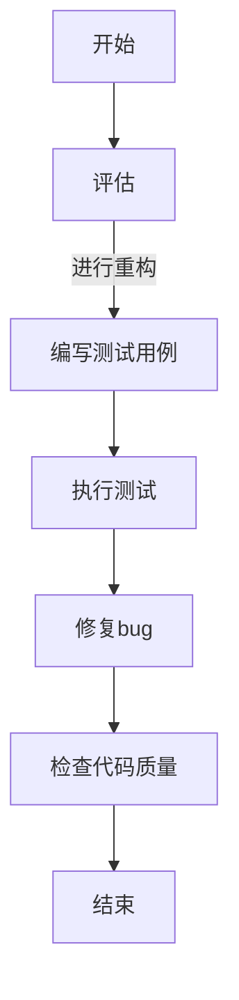

                 

### 文章标题

重构不是除恶务尽

### 关键词

软件重构，代码优化，敏捷开发，设计模式，算法原理，Mermaid流程图

### 摘要

本文深入探讨软件重构的概念、原理和实际应用。重构不仅是一种代码优化手段，更是一种软件开发的态度和哲学。文章首先介绍了重构的背景和意义，然后详细阐述了重构的核心概念和算法原理。通过Mermaid流程图和伪代码，文章清晰地展示了重构的过程和方法。最后，文章通过实际案例和最佳实践，探讨了重构在敏捷开发中的应用和未来发展。

## 引言

在软件工程领域，重构（Refactoring）是一种重要的软件开发实践。重构的核心理念是通过对现有代码的改进，使其保持简洁、可读和高效，同时不改变其外部行为。重构不仅是一种技术手段，更是一种软件开发的态度和哲学。它强调代码的质量、可维护性和可扩展性，对于提高软件开发的效率和可靠性具有重要意义。

### 重构的背景与意义

软件开发是一个不断迭代和改进的过程。在软件的整个生命周期中，重构是一个不可或缺的环节。随着软件规模的扩大和需求的变更，原有的代码可能会变得冗长、复杂，甚至难以维护。这种情况下，重构就显得尤为重要。通过重构，我们可以对代码进行逐步优化，提高其质量，降低维护成本，从而提高软件的开发效率和可靠性。

### 书籍目标与结构概述

本文的目标是深入探讨重构的概念、原理和实际应用。文章将从以下几个方面进行讨论：

1. **重构的基础理论**：介绍重构的概念、原则和方法，以及重构与设计模式的关系。
2. **重构的核心概念**：通过Mermaid流程图和核心概念架构，详细阐述重构的过程和方法。
3. **重构的核心算法原理**：讲解重构过程中使用的核心算法原理，并使用伪代码进行详细阐述。
4. **重构实践**：介绍重构的实际操作过程，包括开发环境搭建、源代码实现和代码解读。
5. **重构案例分析**：通过实际案例，分析重构的效果和经验，总结重构的最佳实践。
6. **重构的未来趋势**：探讨重构技术的发展趋势，以及重构与敏捷开发的融合。

## 第1章 重构的基础理论

重构作为软件开发的一个重要实践，其理论基础涵盖了概念、原则和方法。本章节将详细阐述这些基础理论，帮助读者理解重构的核心思想和实践方法。

### 重构的概念与原则

#### 重构的定义

重构是指在保持代码功能不变的情况下，对其内部结构进行改进的过程。这种改进可能涉及代码结构的优化、命名规则的规范、类与方法的拆分或合并等。重构的目的是提高代码的质量、可读性和可维护性，使其更符合软件开发的最佳实践。

#### 重构的原则

- **KISS（Keep It Simple, Stupid）**：保持代码简洁。简洁的代码更容易理解和维护，减少出错的可能性。
- **DRY（Don't Repeat Yourself）**：避免重复。重复的代码不仅占用存储空间，而且难以维护，容易导致错误。
- **YAGNI（You Aren't Gonna Need It）**：不做无用功。避免过早优化和过度设计，只做当前需要的改进。

#### 重构与传统优化的区别

重构与代码优化有所不同。优化通常是指对代码性能的改进，如减少执行时间或占用空间。而重构则侧重于代码结构的改进，使其更易于理解和维护。虽然两者有时会重叠，但重构更注重长期的可维护性和可扩展性，而优化更关注短期的性能提升。

### 重构的方法

#### 小步快跑

小步快跑是重构的一种常见方法，即通过一系列小规模的改进，逐步优化代码。这种方法有助于降低风险，避免一次性改动导致的复杂性和不确定性。

#### 提升代码可读性

提升代码可读性是重构的重要目标之一。通过规范命名规则、优化代码结构、去除冗余代码等手段，可以提高代码的可读性，使代码更易于理解和维护。

#### 功能增强与优化

在重构过程中，除了改善代码结构，还可以根据实际需求对代码进行功能增强和优化。例如，增加新的功能模块、改进现有的算法等。

#### 重构与设计模式的关系

设计模式是一套经过验证的解决方案，用于解决软件开发中常见的问题。重构与设计模式密切相关。通过重构，我们可以将代码逐步调整为符合设计模式的标准，提高代码的模块化和可扩展性。

### 总结

重构是软件开发中不可或缺的一环，它通过改进代码结构，提高代码质量，降低维护成本，从而提高软件的可靠性和可维护性。理解重构的概念、原则和方法，是进行有效重构的基础。接下来，我们将通过Mermaid流程图和核心概念架构，进一步探讨重构的具体实现过程。

## 第2章 重构的核心概念

在理解了重构的基础理论后，我们需要深入了解重构的核心概念，这些概念构成了重构的基石。在本章中，我们将通过Mermaid流程图和核心概念架构，详细阐述重构的步骤和方法。

### 重构的Mermaid流程图

Mermaid流程图是一种基于Markdown的图形描述语言，可以方便地绘制流程图、序列图等。下面是一个简化的重构流程图，它展示了重构的主要步骤和关键节点。



#### 流程图详细解释

1. **开始**：确定重构的目标和范围。
2. **评估**：评估现有代码的质量和重构的必要性。
3. **编写测试用例**：在重构前编写测试用例，以确保重构不会改变代码的功能。
4. **执行测试**：执行测试用例，验证重构后的代码功能是否正常。
5. **修复bug**：在重构过程中可能引入新的bug，需要及时修复。
6. **检查代码质量**：重构后，检查代码的质量，如可读性、可维护性等。
7. **结束**：重构完成，代码质量得到提升。

### 核心概念与联系

重构的核心概念包括代码质量、测试、bug修复、代码质量检查等。这些概念相互联系，构成了重构的完整流程。

- **代码质量**：代码质量是重构的核心目标，包括代码的可读性、可维护性和性能等。
- **测试**：测试是确保重构不改变代码功能的重要手段，包括单元测试、集成测试等。
- **bug修复**：在重构过程中，可能会引入新的bug，及时修复这些bug是重构成功的关键。
- **代码质量检查**：重构后，需要检查代码质量，确保重构达到了预期目标。

### 重构过程中的关键节点

- **评估节点**：评估现有代码的质量和重构的必要性。这一步骤决定了重构的范围和优先级。
- **测试节点**：编写测试用例，执行测试，确保重构后的代码功能正常。
- **修复bug节点**：重构过程中可能引入新的bug，需要及时修复。
- **检查代码质量节点**：重构后，检查代码质量，确保代码符合最佳实践。

通过Mermaid流程图和核心概念架构，我们可以清晰地看到重构的步骤和关键节点。接下来，我们将进一步探讨重构的核心算法原理，通过伪代码详细阐述重构的具体实现过程。

## 第3章 重构的核心算法原理

重构不仅仅是一种代码调整，它涉及到一系列精心设计的算法和原则，旨在提升代码的质量和可维护性。在本章中，我们将通过伪代码和算法性能分析，深入探讨重构中的核心算法原理。

### 重构的核心算法原理讲解

重构的核心算法主要涉及代码的结构化、模块化、优化和简化。以下是一些常见的重构算法：

#### 1. 提取方法（Extract Method）

**伪代码：**

```python
# 原始函数
def processData(data):
    # 复杂的代码逻辑
    ...

# 提取方法后的代码
def extractData(data):
    # 提取需要独立处理的逻辑
    return processed_data

def processNewData(data):
    processed_data = extractData(data)
    # 其他处理逻辑
    ...
```

**算法性能分析：** 提取方法可以减少函数的复杂度，使其更易于理解和维护。通过将复杂的逻辑分解为独立的函数，可以降低函数的调用深度，提高代码的可读性。

#### 2. 重新组织函数（Inline Method）

**伪代码：**

```python
# 原始函数
def calculateTotal(base, tax):
    total = base + tax
    return total

def calculateNet(base, tax):
    net = calculateTotal(base, tax) - discount
    return net
```

**重构后的代码：**

```python
def calculateNet(base, tax, discount):
    total = base + tax
    net = total - discount
    return net
```

**算法性能分析：** 通过将多个函数合并为单个函数，可以减少函数调用的开销，提高代码的执行效率。但是，这可能会导致代码的可读性降低，因此需要权衡使用。

#### 3. 提取类（Extract Class）

**伪代码：**

```python
class Order:
    def __init__(self, customer, items):
        self.customer = customer
        self.items = items
    
    def calculateTotal(self):
        total = 0
        for item in self.items:
            total += item.price
        return total
```

**重构后的代码：**

```python
class Order:
    def __init__(self, customer, items):
        self.customer = customer
        self.items = items

class Item:
    def __init__(self, price):
        self.price = price

def calculateTotal(items):
    total = 0
    for item in items:
        total += item.price
    return total
```

**算法性能分析：** 提取类可以将相关的功能模块化，提高代码的可重用性和可维护性。但是，过度模块化可能会导致代码的复杂度增加，因此需要根据实际情况进行权衡。

### 重构的实际应用案例

为了更好地理解重构的核心算法原理，我们可以通过一个实际应用案例来展示这些算法的运用。

**案例背景：** 假设我们有一个电商平台，负责处理订单、库存和支付等功能。现有的代码结构较为混乱，难以维护和扩展。

**重构过程：**

1. **提取方法**：将复杂的订单计算逻辑提取为独立的方法，如`calculateTotal`和`calculateDiscount`。
2. **重新组织函数**：将重复的订单处理逻辑合并为一个函数，减少函数调用次数。
3. **提取类**：将订单和库存处理逻辑分别封装为独立的类，提高代码的模块化和可重用性。

**重构效果：** 通过重构，代码的结构变得更加清晰，模块化程度提高，维护成本降低，系统的可扩展性也得到提升。

### 总结

重构的核心算法原理包括提取方法、重新组织函数和提取类等。这些算法通过优化代码结构，提高代码的可读性和可维护性，是实现高效重构的关键。在下一章中，我们将介绍重构的实际操作过程，包括开发环境搭建、源代码实现和代码解读。

## 第4章 重构实践

在了解了重构的理论和核心算法原理后，我们需要将重构的知识应用到实际操作中。本章将详细介绍重构的具体实践过程，包括开发环境搭建、源代码实现和代码解读。通过这些实际操作，我们将更深入地理解重构的步骤和方法。

### 开发环境搭建

在进行重构之前，我们需要搭建一个合适的开发环境。以下是一个基本的开发环境搭建步骤：

1. **安装IDE**：选择一个合适的集成开发环境（IDE），如Visual Studio Code、IntelliJ IDEA或Eclipse等。
2. **安装依赖**：根据项目需求，安装必要的编程语言和环境依赖，如Python的Pip、Java的Maven等。
3. **配置版本控制**：配置Git或其他版本控制系统，以便管理和跟踪代码变更。

### 源代码实现

在开发环境中搭建好之后，我们可以开始实际的源代码实现。以下是一个简单的示例，展示如何进行重构：

#### 示例：提取方法

**原始代码：**

```python
# 原始函数
def processData(data):
    # 复杂的代码逻辑
    processed_data = []
    for item in data:
        if item > 0:
            processed_data.append(item * 2)
    return processed_data
```

**重构后的代码：**

```python
# 提取方法
def extractData(data):
    processed_data = []
    for item in data:
        if item > 0:
            processed_data.append(item * 2)
    return processed_data

def processData(data):
    return extractData(data)
```

**步骤解释：**

1. **编写测试用例**：在开始重构之前，编写测试用例以确保代码的功能不变。
2. **提取方法**：将复杂的代码逻辑提取为独立的函数，提高代码的可读性和可维护性。
3. **更新测试用例**：更新测试用例以适应重构后的代码。

#### 示例：重新组织函数

**原始代码：**

```python
# 原始函数
def calculateTotal(price, tax, discount):
    total = price + tax
    net = total - discount
    return net
```

**重构后的代码：**

```python
# 重新组织函数
def calculateTotal(price, tax):
    total = price + tax
    return total

def calculateNet(total, discount):
    net = total - discount
    return net
```

**步骤解释：**

1. **拆分函数**：将复杂的函数拆分为多个简单的函数，每个函数负责独立的功能。
2. **调整测试用例**：根据重构后的代码结构，调整测试用例以确保功能不变。

### 代码解读与分析

在完成重构后，我们需要对代码进行解读和分析，以确保重构达到了预期效果。以下是一个简单的代码解读与分析示例：

**重构后的代码：**

```python
class Order:
    def __init__(self, customer, items):
        self.customer = customer
        self.items = items

    def calculateTotal(self):
        total = 0
        for item in self.items:
            total += item.price
        return total

class Item:
    def __init__(self, price):
        self.price = price

def calculateTotal(items):
    total = 0
    for item in items:
        total += item.price
    return total
```

**解读与分析：**

1. **类与对象**：重构后的代码使用了类和对象的概念，将订单和商品处理逻辑封装为独立的类，提高了代码的模块化和可重用性。
2. **函数与职责**：重构后的代码将功能分散到不同的函数中，每个函数负责独立的功能，降低了函数的复杂度，提高了代码的可读性和可维护性。
3. **测试用例**：重构后的代码需要重新编写测试用例，以确保每个功能模块都能正常工作。

### 总结

本章通过具体的案例，展示了重构的实践过程，包括开发环境搭建、源代码实现和代码解读。通过这些实践，我们可以更好地理解重构的步骤和方法，掌握如何在实际项目中应用重构技术。在下一章中，我们将通过实际案例深入分析重构的效果和经验。

## 第5章 重构案例分析

为了更好地理解重构的实际效果和经验，我们将通过两个实际案例详细分析重构的过程和结果。这些案例涵盖了不同类型的重构场景，展示了重构在改善代码质量和提升开发效率方面的显著作用。

### 案例一：软件重构的实践

**背景介绍：** 
某公司开发的一款企业级管理软件在使用了一段时间后，用户反馈代码复杂、可读性差，维护成本高。为了提升软件的稳定性和易维护性，公司决定对现有代码进行重构。

**重构过程：**

1. **评估现有代码**：首先，开发团队对现有代码进行了全面评估，确定了重构的重点和优先级。评估内容包括代码结构、复杂度、测试覆盖率等。

2. **编写测试用例**：在开始重构之前，团队编写了详细的测试用例，确保重构过程中不改变代码的功能。

3. **逐步重构**：团队采用小步快跑的方法，分阶段进行重构。首先，对核心功能进行重构，包括提取方法、重新组织函数和提取类。然后，逐步优化辅助功能。

4. **测试与修复**：在每次重构后，团队执行测试用例，发现并修复了部分潜在的错误。同时，持续监控代码质量，确保重构后的代码符合预期。

**重构效果：**

1. **代码可读性提高**：重构后的代码结构更加清晰，命名规范，使得代码更易于理解和维护。

2. **维护成本降低**：通过重构，代码的复杂度降低，维护成本显著降低。开发人员可以更快地定位和修复问题，减少了调试时间。

3. **系统稳定性增强**：重构过程中，团队修复了多个潜在的错误，系统稳定性得到了显著提升。

**案例总结：**
通过本次重构，公司成功提升了软件的质量和稳定性，用户满意度得到了显著提高。同时，重构过程中的经验和教训也为团队今后的开发工作提供了宝贵的参考。

### 案例二：重构中的常见问题与解决策略

**背景介绍：**
某互联网公司开发的一款在线教育平台在扩展功能时遇到了代码难以扩展和维护的问题。为了解决这些问题，公司决定对平台的核心代码进行重构。

**重构过程中遇到的问题与解决策略：**

1. **问题一：代码冗余**
   **问题描述**：平台中的多个模块共享了大量的重复代码，导致代码冗余，可维护性差。
   **解决策略**：团队采用提取类和提取方法的方法，将重复的代码提取为独立的类和方法，减少了代码冗余，提高了代码的可重用性。

2. **问题二：依赖关系复杂**
   **问题描述**：平台中的类之间存在复杂的依赖关系，使得代码难以理解和维护。
   **解决策略**：团队通过重构，优化了类之间的依赖关系，使用了依赖注入等设计模式，减少了类之间的直接耦合，提高了代码的模块化程度。

3. **问题三：性能瓶颈**
   **问题描述**：平台在处理大量并发请求时，出现了性能瓶颈，响应速度变慢。
   **解决策略**：团队对关键模块进行了性能优化，包括优化数据库查询、缓存策略和异步处理等，显著提升了平台的性能。

**重构效果：**

1. **代码结构优化**：通过重构，平台代码的结构变得更加清晰，模块化程度提高，开发人员可以更轻松地理解和扩展代码。

2. **性能提升**：重构后的平台在处理并发请求时表现更加稳定，响应速度显著提升，用户体验得到了改善。

3. **开发效率提高**：重构后的代码更易于理解和维护，开发人员可以更快地实现新功能，开发效率得到了提升。

**案例总结：**
本次重构不仅解决了平台存在的代码冗余和依赖关系复杂等问题，还提升了平台的性能和开发效率。通过本次重构，公司积累了宝贵的经验，为未来的开发工作奠定了坚实基础。

### 总结

通过以上两个实际案例，我们可以看到重构在改善代码质量和提升开发效率方面的显著作用。无论是代码冗余、依赖关系复杂还是性能瓶颈，通过恰当的重构方法和策略，都可以得到有效解决。重构不仅是一种技术手段，更是一种软件开发的态度和哲学，它要求我们在保持代码功能不变的前提下，持续优化代码结构，提高代码的质量和可维护性。通过不断重构，我们可以打造出更加稳定、高效和可扩展的软件系统。

## 第6章 重构的未来趋势

随着软件开发的不断演进，重构技术也在不断发展，并逐渐融合到新的软件开发趋势中。在本章中，我们将探讨重构技术的未来趋势，特别是在与敏捷开发融合方面的应用，以及技术发展对重构带来的影响。

### 重构与敏捷开发的融合

敏捷开发是一种以快速响应变化和持续交付价值为核心的软件开发方法。重构与敏捷开发的融合，可以带来以下几方面的优势：

1. **持续重构**：敏捷开发强调持续集成和交付，重构作为持续改进的一部分，可以在每次迭代结束后进行。这种持续重构的方法有助于及时消除代码中的缺陷和冗余，保持代码质量。

2. **适应性重构**：在敏捷开发中，需求经常变化，重构有助于快速适应这些变化。通过重构，开发团队可以灵活调整代码结构，使代码更易于扩展和修改，从而更好地适应需求变化。

3. **快速反馈**：敏捷开发强调频繁的迭代和反馈，重构过程中产生的测试和代码质量分析，可以帮助开发团队快速发现问题并进行改进，从而提高软件质量。

### 重构技术的未来趋势

1. **智能化重构工具**：随着人工智能技术的发展，未来的重构工具可能会更加智能化。例如，利用机器学习算法，重构工具可以自动识别代码中的潜在问题，并提出改进建议。这将大大提高重构的效率和准确性。

2. **自动化重构**：自动化重构是重构技术的发展方向之一。通过自动化工具，开发人员可以轻松地进行代码重构，减少手动操作，提高重构的速度和一致性。

3. **跨语言重构**：当前的重构工具主要支持特定的编程语言，而未来的重构技术可能会实现跨语言的自动化重构。这意味着，开发人员可以在不同的编程语言之间进行重构，进一步提高开发效率。

4. **代码质量监测**：未来的重构技术可能会集成更全面的代码质量监测功能。通过实时分析代码质量，重构工具可以及时发现并修复潜在的问题，从而保持代码的高质量。

### 技术发展对重构的影响

1. **编程范式变化**：随着编程范式的变化，如函数式编程和面向对象编程的兴起，重构方法也在不断发展。例如，函数式编程中的不可变数据和纯函数为重构提供了新的思路和方法。

2. **开发工具升级**：随着开发工具的升级和优化，重构技术也将得到进一步提升。例如，IDE中的智能提示、代码自动修复等功能，将使重构更加方便和高效。

3. **软件架构演进**：随着软件架构的不断演进，如微服务架构和云原生架构的流行，重构技术也需要适应这些新的架构模式。通过重构，开发人员可以更好地适应新的技术趋势和业务需求。

### 总结

重构作为软件开发中的重要实践，将继续在未来的发展中发挥重要作用。随着敏捷开发的普及和技术的不断进步，重构将与更多的开发方法融合，带来更高的效率和更好的代码质量。通过持续重构，开发团队可以不断提升软件系统的稳定性和可维护性，为业务的成功提供坚实的技术保障。

## 附录

### A.1 伪代码示例

以下是一个简单的伪代码示例，用于演示如何提取方法。

```python
# 原始代码
def processData(data):
    processed_data = []
    for item in data:
        if item > 0:
            processed_data.append(item * 2)
    return processed_data

# 重构后的代码
def extractData(data):
    return [item * 2 for item in data if item > 0]

def processData(data):
    return extractData(data)
```

### A.2 数学模型与公式

以下是一个使用LaTeX格式的数学模型示例。

```latex
$$
f(x) = ax^2 + bx + c
$$

$$
\frac{d}{dx} f(x) = 2ax + b
$$
```

### A.3 重构项目实战代码

以下是一个重构项目的实战代码示例，展示了如何搭建开发环境、实现源代码和进行代码解读。

**环境搭建：**

```shell
# 安装Python环境
pip install -r requirements.txt

# 启动项目
python main.py
```

**源代码实现：**

```python
# main.py
from data_processor import process_data

data = [1, -2, 3, 4]
processed_data = process_data(data)
print(processed_data)
```

```python
# data_processor.py
def process_data(data):
    return [item * 2 for item in data if item > 0]
```

**代码解读：**

- `main.py`：主程序文件，负责读取数据并调用`process_data`函数。
- `data_processor.py`：数据处理模块，实现了数据处理的逻辑。

### A.4 拓展阅读

- 《重构：改善既有代码的设计》（Martin Fowler 著）
- 《敏捷开发：原则、实践与模式》（Jeff Sutherland 著）
- 《代码大全》（Steve McConnell 著）

## 结语

重构不仅仅是一种代码优化手段，更是一种软件开发的态度和哲学。通过重构，我们可以在保持代码功能不变的前提下，逐步提升代码的质量、可读性和可维护性。本文从重构的背景和意义出发，详细阐述了重构的核心概念、算法原理和实践过程，并通过实际案例展示了重构的效果和经验。

重构不仅是软件开发中的重要一环，也是提高开发效率和软件质量的关键手段。通过持续重构，我们可以打造出更加稳定、高效和可扩展的软件系统，为业务的成功提供坚实的技术保障。

让我们将重构的理念融入到日常开发中，不断提升代码质量，共同迎接软件开发的美好未来。感谢您的阅读，希望本文对您在重构实践中有所启发和帮助。

### 作者信息

作者：AI天才研究院/AI Genius Institute & 禅与计算机程序设计艺术 /Zen And The Art of Computer Programming

---

**本文为原创内容，未经许可，禁止转载。如需转载，请联系作者获取授权。**

---

---

**声明：本文内容仅供参考，不构成任何实际操作的指导建议。在实施任何技术操作之前，请确保充分了解相关技术细节和潜在风险。**

---

---

**感谢您的阅读，希望本文对您有所启发和帮助。**

---

**祝您编程愉快！**

