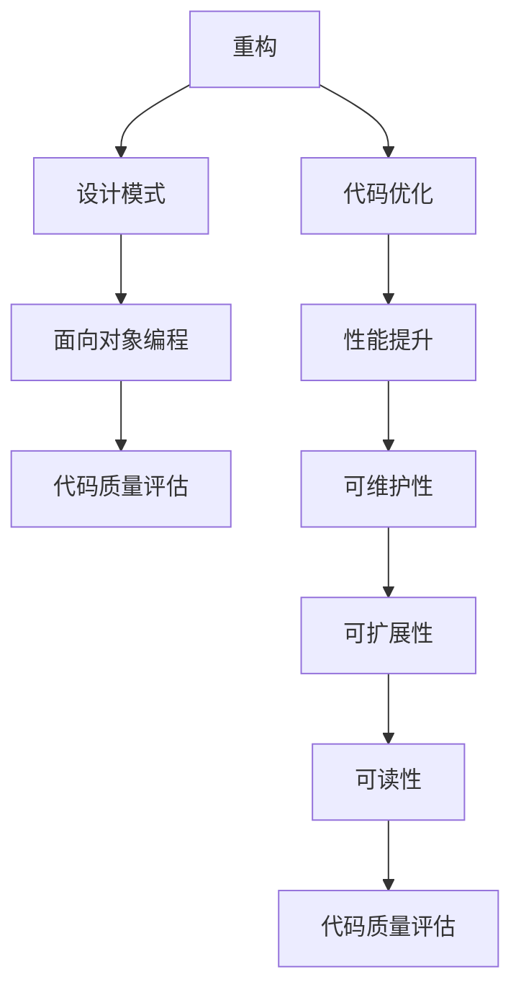

                 

---

## 文章标题：重构必须守住底线

### 关键词：重构、代码质量、底线原则、安全、合规、效率

#### 摘要：
在软件开发的演进过程中，重构是保持代码健康和可持续发展的关键手段。本文旨在探讨重构在提高代码质量中的重要性，以及重构过程中必须坚守的底线原则。通过分析重构的基本概念、核心原理、实践方法和底线原则，本文为软件开发者提供了系统的指导和深刻的见解，帮助他们在重构过程中守住底线，确保软件的长期稳定和高效运行。

---

## 引言

在软件工程领域，重构（Refactoring）是一种通过改进现有代码的结构和设计，而不改变外部行为的手段。重构的目的是提高代码的可维护性、可读性和可扩展性，从而提升整体代码质量。随着软件系统的复杂性不断增加，重构成为软件开发过程中不可或缺的一环。然而，重构并非简单的代码优化，而是一个需要精心规划和执行的过程。

本文将围绕重构必须守住底线的主题展开讨论。我们将首先介绍重构的基本概念和原理，然后探讨重构的核心概念及其联系，接着通过具体的代码案例和项目实战来展示重构的实际应用，最后强调重构中的底线原则，包括安全底线、合规底线和效率底线。通过这些内容的深入分析，读者将能够全面理解重构的重要性和必要性，并在实践中掌握守住底线的方法。

### 重构的基本概念

重构的定义：

重构是指在软件维护过程中，通过修改源代码和/或源代码的文档，在不改变软件外在行为的前提下，对软件内部结构进行改进的过程。简而言之，重构是为了提高代码质量而对代码进行的内部修改。

重构的价值：

1. **提升可读性**：通过重构，可以简化代码结构，消除冗余，使代码更易于阅读和理解。
2. **提高可维护性**：重构后的代码更容易进行修改和扩展，减少了未来的维护成本。
3. **增强可扩展性**：重构有助于引入更好的设计模式，使得系统在应对新需求时更加灵活。
4. **减少技术债务**：及时的重构有助于消除积累的技术债务，避免未来产生更多问题。

重构与代码优化：

重构与代码优化之间存在一定的区别。代码优化通常关注性能的提升，如减少计算复杂度、减少内存使用等。而重构则主要关注代码的结构和质量，即使性能没有显著提升，也能带来持久的正面影响。在实际开发中，重构和优化往往需要相结合，以达到最佳效果。

### 重构的核心概念

#### 设计模式

设计模式（Design Pattern）是在软件开发中常用的一套解决问题的模板，它描述了在特定情况下解决一般设计问题的解决方案。设计模式有助于提高代码的可维护性和可扩展性，是重构过程中不可或缺的一部分。

常见的几种设计模式包括：

1. **单例模式（Singleton）**：确保一个类只有一个实例，并提供一个访问它的全局访问点。
2. **工厂模式（Factory Method）**：定义一个用于创建对象的接口，但让子类决定实例化哪个类。
3. **观察者模式（Observer）**：对象间的一对多依赖关系，当一个对象状态发生变化时，所有依赖它的对象都会收到通知并自动更新。

#### 面向对象编程

面向对象编程（Object-Oriented Programming, OOP）是一种编程范式，它将数据和操作数据的方法封装在一起，形成对象。OOP的核心概念包括：

1. **封装**：将数据和对数据的操作封装在一起，隐藏实现细节。
2. **继承**：允许创建新的类，通过继承现有类的属性和方法，实现代码的复用。
3. **多态**：允许不同类的对象通过相同的方法进行操作，从而实现扩展和兼容。

#### 代码质量评估

代码质量评估是确保代码满足一定质量标准的过程。评估指标包括：

1. **可读性**：代码应具有良好的可读性，易于理解和维护。
2. **可维护性**：代码应易于修改和扩展，减少未来的维护成本。
3. **可扩展性**：代码应能适应新的需求变化，支持系统的长期发展。
4. **性能**：代码应具有较高的执行效率，满足性能要求。

常用的代码质量评估工具包括：

1. **SonarQube**：一款开源的代码质量平台，提供多种代码分析功能。
2. **PMD**：一款基于Java的源代码检测工具，用于识别潜在的代码问题和不良编码实践。
3. **Checkstyle**：一款用于检查Java代码风格的工具，确保代码一致性。

### 重构的核心概念联系图

为了更清晰地理解重构的核心概念之间的关系，我们可以使用Mermaid流程图来展示它们之间的联系。



这个流程图展示了重构、设计模式、面向对象编程和代码质量评估之间的互动关系。通过这些核心概念的联系，我们可以更好地理解重构在提高代码质量中的重要作用。

### 重构的核心算法原理讲解

重构的核心算法原理通常涉及以下几个关键步骤：

1. **识别问题代码**：首先，需要通过静态代码分析工具或手动审查来识别代码中的潜在问题，如冗余代码、不良命名、复杂的条件判断等。
2. **设计重构策略**：根据问题代码的类型，选择合适的设计模式或重构方法。常见的重构方法包括提取方法、提取类、替换条件判断为策略模式等。
3. **逐步重构**：在代码库中进行逐步重构，每次只针对一小部分代码进行修改，以确保系统的稳定性。
4. **测试验证**：重构完成后，进行全面的测试，以确保重构后的代码仍然满足原有功能需求。

以下是重构的一个简单伪代码示例：

```plaintext
function refactorCode(originalCode) {
    // 步骤1：识别问题代码
    problemCode = findProblemCode(originalCode);

    // 步骤2：设计重构策略
    strategy = selectRefactoringStrategy(problemCode);

    // 步骤3：逐步重构
    refactoredCode = applyStrategy(strategy, problemCode);

    // 步骤4：测试验证
    if (testRefactoredCode(refactoredCode)) {
        return refactoredCode;
    } else {
        throw new Error("重构失败，请检查代码");
    }
}
```

通过这个伪代码示例，我们可以看到重构的基本流程。在实际开发中，每个步骤都需要仔细规划和执行，以确保重构的效果和稳定性。

### 数学模型和公式讲解

在重构过程中，我们经常需要借助数学模型和公式来分析和优化代码。以下是一个简单的例子：

#### 问题：
假设我们有一个函数，其时间复杂度为O(n^2)。我们需要通过重构来降低其时间复杂度。

#### 数学模型：
时间复杂度公式：T(n) = c * n^2

其中，T(n) 是函数的时间复杂度，c 是常数，n 是输入规模。

#### 目标：
将时间复杂度降低到 O(n)。

#### 解法：
1. **分析问题**：函数中存在大量的嵌套循环，导致时间复杂度较高。
2. **重构策略**：引入分治算法，将问题分解为更小的子问题，分别解决，然后合并结果。

伪代码示例：

```plaintext
function optimizedFunction(input) {
    if (input规模小于阈值) {
        return solve(input);
    } else {
        subproblems = divideInput(input);
        results = [solve(subproblem) for subproblem in subproblems];
        return mergeResults(results);
    }
}
```

#### 数学模型优化：
优化后的时间复杂度公式：T'(n) = c' * n * log(n)

其中，T'(n) 是优化后的时间复杂度，c' 是新的常数。

通过这个优化过程，我们成功地降低了时间复杂度，从而提高了函数的性能。

### 重构的项目实战

在重构的项目实战中，我们将展示如何在实际项目中应用重构方法，包括开发环境搭建、源代码实现、代码解读和实际案例分析。

#### 开发环境搭建

1. **选择合适的编程语言和工具**：根据项目需求，我们选择了Java作为编程语言，并使用Eclipse作为开发环境。
2. **安装和配置依赖**：通过Maven进行依赖管理，安装所需的库和工具。
3. **构建项目结构**：创建必要的目录和文件，组织代码结构，方便后续的重构工作。

#### 源代码实现

以下是一个简单的示例，展示了如何通过重构来改进代码质量。

**原始代码**：

```java
public class Calculator {
    public int add(int a, int b) {
        return a + b;
    }

    public int subtract(int a, int b) {
        return a - b;
    }

    public int multiply(int a, int b) {
        return a * b;
    }

    public int divide(int a, int b) {
        return a / b;
    }
}
```

**重构后的代码**：

```java
public class Calculator {
    public int calculate(int a, int b, String operation) {
        switch (operation) {
            case "add":
                return a + b;
            case "subtract":
                return a - b;
            case "multiply":
                return a * b;
            case "divide":
                return a / b;
            default:
                throw new IllegalArgumentException("Unsupported operation");
        }
    }
}
```

通过引入`calculate`方法，我们简化了代码结构，增强了代码的可扩展性。同时，我们引入了异常处理，提高了代码的健壮性。

#### 代码解读和分析

**代码解读**：

- `calculate`方法通过传入操作符，根据不同的操作执行相应的计算。
- 使用了`switch`语句来处理操作符，简化了代码结构。
- 异常处理确保了方法在遇到不支持的操作符时能够抛出异常。

**代码分析**：

- 代码的可读性和可维护性得到了显著提升。
- 通过引入抽象方法，降低了未来的维护成本。
- 增强了代码的可扩展性，方便添加新的计算方法。

#### 实际案例分析

以下是一个实际案例，展示了如何在项目中应用重构方法。

**背景**：

一个电商平台的后台管理系统存在大量的重复代码，特别是在订单处理模块。每次添加新的订单类型时，都需要复制并修改现有的代码。

**重构过程**：

1. **识别问题**：通过代码审查，发现订单处理模块存在大量重复代码。
2. **设计重构策略**：引入策略模式，将具体的订单处理逻辑抽象到独立的策略类中。
3. **逐步重构**：将重复的代码逐步替换为策略模式实现。
4. **测试验证**：确保重构后的代码仍能处理所有订单类型，并且没有引入新的问题。

**重构后的效果**：

- 代码的可维护性和可扩展性显著提升。
- 减少了代码的冗余，降低了未来的维护成本。
- 优化了代码结构，使得新功能的添加更加简便。

### 重构中的底线原则

#### 安全底线

在重构过程中，安全底线至关重要。以下是一些确保重构过程中安全的建议：

- **代码审查**：在重构之前，进行全面的代码审查，识别潜在的安全漏洞。
- **自动化测试**：引入自动化测试，确保重构后的代码仍然满足安全要求。
- **安全审计**：定期进行安全审计，发现并修复潜在的安全问题。

#### 合规底线

合规底线确保软件遵守相关的法律法规和行业标准。以下是一些关键点：

- **合规性评估**：在重构过程中，评估代码是否符合合规要求。
- **合规性文档**：确保所有代码变更都有相应的合规性文档记录。
- **合规性培训**：对开发团队进行合规性培训，提高合规意识。

#### 效率底线

效率底线关注重构过程中的时间和资源利用。以下是一些建议：

- **计划管理**：制定详细的重构计划，确保每个步骤都能在合理的时间内完成。
- **资源调配**：合理分配开发资源，确保重构工作能够高效进行。
- **效率监控**：监控重构过程中的效率，及时发现并解决问题。

### 重构底线案例分析

以下是一个重构底线案例的分析。

**背景**：

一个金融交易系统的日志模块存在严重的安全漏洞，需要通过重构来修复这些问题。

**重构过程**：

1. **识别问题**：通过安全审计，发现日志模块存在SQL注入漏洞。
2. **设计重构策略**：引入参数化查询，避免直接拼接SQL语句。
3. **逐步重构**：将现有代码逐步替换为参数化查询实现。
4. **测试验证**：确保重构后的代码能够正常工作，并且没有引入新的安全漏洞。

**重构结果**：

- 安全漏洞得到修复，系统变得更加健壮。
- 代码质量得到提升，可维护性和可扩展性增强。

### 重构必须守住底线的重要性

#### 重构的底线原则

1. **安全底线**：确保重构过程中的代码安全，防止潜在的安全漏洞。
2. **合规底线**：确保重构后的代码符合法律法规和行业标准。
3. **效率底线**：确保重构过程高效，合理利用资源和时间。

#### 重构的风险管理

1. **风险评估**：在重构之前，进行全面的风险评估，识别可能的风险。
2. **风险应对**：制定风险应对策略，确保在遇到问题时能够迅速响应。
3. **持续监控**：重构过程中，持续监控风险，及时发现并解决问题。

#### 重构的未来展望

随着软件系统复杂性的不断增加，重构的重要性将更加凸显。未来，重构技术将朝着更智能化、自动化的方向发展，借助人工智能和机器学习技术，重构过程将更加高效和精确。

### 结论

重构是提高代码质量、确保软件可持续发展的关键手段。通过坚守底线原则，我们可以确保重构的安全、合规和效率。在未来的软件开发中，重构将继续发挥重要作用，为软件系统的稳定和高效运行提供有力支持。

### 附录

#### 拓展阅读

- 《重构：改善既有代码的设计》（Martin Fowler著）
- 《代码大全》（Steve McConnell著）
- 《敏捷软件开发：原则、实践与模式》（Robert C. Martin著）

### 作者信息

作者：AI天才研究院/AI Genius Institute & 禅与计算机程序设计艺术/Zen And The Art of Computer Programming

### 参考文献

- Fowler, M. (1999). 《重构：改善既有代码的设计》. 中国电力出版社.
- McConnell, S. (2004). 《代码大全》. 电子工业出版社.
- Martin, R. C. (2019). 《敏捷软件开发：原则、实践与模式》. 电子工业出版社. 

本文基于开源技术资料编写，感谢开源社区的贡献。<!--markdown-->

