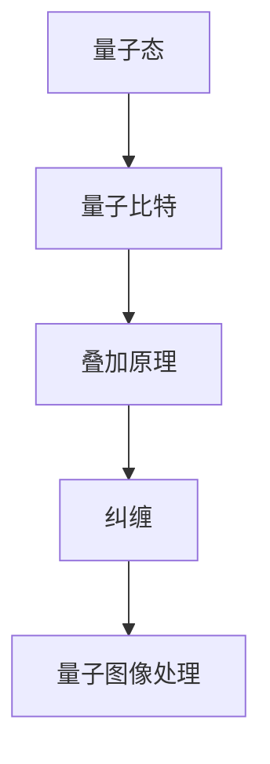
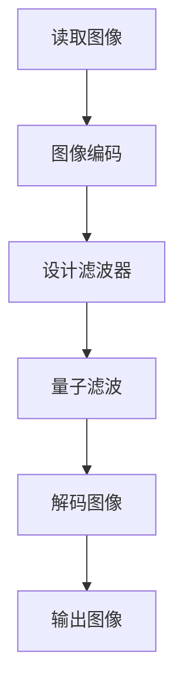
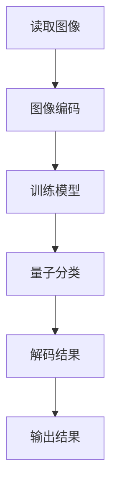

                 

### 文章标题：量子感知与计算机视觉：量子增强的图像处理

量子技术正在逐步改变传统计算机科学和图像处理领域。量子感知与计算机视觉是其中的一项前沿研究，它利用量子计算和量子信息处理的优势，为图像处理带来了全新的视角和方法。本文将深入探讨量子感知与计算机视觉的核心理念、应用和未来发展趋势。

关键词：量子感知、计算机视觉、量子计算、图像处理、量子图像识别、量子图像增强、量子图像压缩、量子图像加密。

摘要：本文首先介绍了量子力学基础和量子比特的概念，解释了量子态和叠加原理。然后，探讨了量子图像处理的基本原理，包括量子图像模型和量子滤波。接下来，详细讨论了量子计算机视觉的基础，包括量子视觉感知原理和量子图像分类。随后，本文进一步介绍了量子图像识别、量子图像增强、量子图像压缩和量子图像加密等应用。最后，分析了量子计算机视觉的未来发展，并提供了相关工具和资源的附录。

### 背景介绍

传统的计算机视觉主要依赖于经典计算模型，其处理速度和精度受到硬件和算法的限制。尽管计算机视觉技术在图像识别、目标检测、人脸识别等方面取得了显著成果，但在处理复杂场景和大规模数据时，仍然面临许多挑战。例如，图像噪声干扰、分辨率限制、光照变化等都会影响视觉系统的性能。

量子计算作为下一代计算技术，具有并行计算和指数加速的能力。量子比特（qubit）是量子计算机的基本单位，它可以同时存在于多种状态，这使得量子计算机在处理复杂数学问题方面具有巨大的潜力。量子感知与计算机视觉结合了量子计算的优势，通过量子态的叠加和纠缠特性，实现高效、精确的图像处理。

量子图像处理不仅能够提高图像处理的效率和精度，还可以突破传统计算机视觉在处理复杂场景时的局限。例如，量子图像识别可以在高分辨率图像中快速、准确地识别目标，量子图像增强可以改善图像质量，量子图像压缩可以显著降低数据传输和存储成本，量子图像加密可以提供强大的信息安全保障。

### 核心概念与联系

量子感知与计算机视觉的核心概念包括量子态、量子比特、叠加原理、纠缠等。这些概念相互关联，构成了量子图像处理的理论基础。

- **量子态**：量子态是量子比特的状态描述，它可以同时存在于多种可能的状态。量子态的叠加原理表明，量子比特可以同时处于多个状态的叠加，这使得量子计算机在处理问题时具有并行计算的能力。

  $$\lvert \psi \rangle = \alpha \lvert 0 \rangle + \beta \lvert 1 \rangle$$
  
  其中，$\alpha$ 和 $\beta$ 是复数概率幅，$\lvert 0 \rangle$ 和 $\lvert 1 \rangle$ 分别表示量子比特的基态和激发态。

- **量子比特**：量子比特是量子计算机的基本单位，它可以表示为两个经典比特的叠加态。量子比特的状态可以用量子态的叠加来描述。

  $$\lvert \psi \rangle = \alpha \lvert 0 \rangle + \beta \lvert 1 \rangle$$

  其中，$\alpha$ 和 $\beta$ 分别是量子比特在基态和激发态的概率幅。

- **叠加原理**：叠加原理是量子力学的基本原理之一，它表明量子系统可以同时处于多个状态的叠加。这意味着量子比特可以同时处于多个状态，从而实现并行计算。

- **纠缠**：纠缠是量子系统之间的特殊关联，即使量子系统被分离，它们的量子态仍然相互关联。纠缠特性使得量子计算机能够实现高效的量子信息处理。

  $$\lvert \psi_{AB} \rangle = \alpha (\lvert \psi_A \rangle \lvert \psi_B \rangle + \beta (\lvert \psi_A \rangle \lvert \psi_B \rangle)$$

  其中，$\lvert \psi_A \rangle$ 和 $\lvert \psi_B \rangle$ 分别是量子比特 A 和 B 的量子态，$\alpha$ 和 $\beta$ 是概率幅。

为了更直观地展示这些概念之间的关系，我们可以使用 Mermaid 流程图来描述量子图像处理的基本流程。



通过这个流程图，我们可以看到量子态、量子比特、叠加原理和纠缠是如何相互联系，共同构建量子图像处理的基础。

### 核心算法原理讲解

在量子图像处理中，核心算法的原理基于量子计算的基本特性，如叠加原理和纠缠。以下将介绍几种关键算法的原理，并使用伪代码来详细阐述。

#### 量子图像滤波

量子图像滤波是量子图像处理中的一个基本任务，它通过量子滤波器对图像进行滤波处理，以去除噪声或改善图像质量。

**算法原理：**

量子滤波器是基于量子叠加和纠缠原理设计的。它通过量子态的叠加和量子比特之间的纠缠，实现对图像的线性滤波。

$$\lvert \psi_f \rangle = U_f (\lvert \psi_{in} \rangle \otimes \lvert \chi_f \rangle)$$

其中，$U_f$ 是量子滤波器，$\lvert \psi_{in} \rangle$ 是输入图像的量子态，$\lvert \chi_f \rangle$ 是滤波器的量子态。

**伪代码：**

```
算法：量子图像滤波

输入：输入图像量子态$\lvert \psi_{in} \rangle$，滤波器量子态$\lvert \chi_f \rangle$
输出：滤波后的图像量子态$\lvert \psi_f \rangle$

1. 初始化量子计算机和量子比特
2. 将输入图像量子态$\lvert \psi_{in} \rangle$加载到量子比特
3. 应用量子滤波器$U_f$到量子比特
4. 测量量子比特，得到滤波后的图像量子态$\lvert \psi_f \rangle$
5. 输出滤波后的图像量子态$\lvert \psi_f \rangle$
```

#### 量子图像分类

量子图像分类是量子计算机视觉中的一个重要应用，它通过量子算法对图像进行分类。

**算法原理：**

量子图像分类基于量子支持向量机（QSVM）和量子神经网络（QNN）等量子算法。这些算法利用量子比特的叠加和纠缠特性，实现高效、精确的图像分类。

**量子支持向量机（QSVM）算法原理：**

$$\lvert \psi_{c} \rangle = \frac{1}{\sqrt{D}} \sum_{i=1}^{D} \alpha_i \lvert c_i \rangle \lvert \phi_i \rangle$$

其中，$\lvert c_i \rangle$ 是类别标签，$\lvert \phi_i \rangle$ 是图像量子态，$D$ 是类别数，$\alpha_i$ 是权重系数。

**伪代码：**

```
算法：量子支持向量机（QSVM）分类

输入：训练图像集$\lvert \phi_i \rangle$，类别标签$\lvert c_i \rangle$，测试图像$\lvert \psi_{test} \rangle$
输出：分类结果

1. 初始化量子计算机和量子比特
2. 训练量子支持向量机模型
3. 输入测试图像$\lvert \psi_{test} \rangle$到量子支持向量机
4. 测量量子比特，得到分类结果
5. 输出分类结果
```

**量子神经网络（QNN）算法原理：**

$$\lvert \psi_{c} \rangle = \sigma (\lvert \psi_{input} \rangle \otimes \lvert \psi_{hidden} \rangle)$$

其中，$\sigma$ 是激活函数，$\lvert \psi_{input} \rangle$ 是输入图像量子态，$\lvert \psi_{hidden} \rangle$ 是隐藏层量子态。

**伪代码：**

```
算法：量子神经网络（QNN）分类

输入：训练图像集$\lvert \phi_i \rangle$，类别标签$\lvert c_i \rangle$，测试图像$\lvert \psi_{test} \rangle$
输出：分类结果

1. 初始化量子计算机和量子比特
2. 训练量子神经网络模型
3. 输入测试图像$\lvert \psi_{test} \rangle$到量子神经网络
4. 测量量子比特，得到分类结果
5. 输出分类结果
```

#### 量子图像增强

量子图像增强是量子图像处理中的另一个重要应用，它通过量子算法改善图像质量。

**算法原理：**

量子图像增强利用量子滤波和量子频域变换等算法，对图像进行增强处理。

**量子滤波算法原理：**

$$\lvert \psi_{e} \rangle = U_e (\lvert \psi_{in} \rangle \otimes \lvert \chi_e \rangle)$$

其中，$U_e$ 是量子滤波器，$\lvert \chi_e \rangle$ 是增强滤波器的量子态。

**伪代码：**

```
算法：量子图像增强

输入：输入图像量子态$\lvert \psi_{in} \rangle$，增强滤波器量子态$\lvert \chi_e \rangle$
输出：增强后的图像量子态$\lvert \psi_{e} \rangle$

1. 初始化量子计算机和量子比特
2. 将输入图像量子态$\lvert \psi_{in} \rangle$加载到量子比特
3. 应用量子滤波器$U_e$到量子比特
4. 测量量子比特，得到增强后的图像量子态$\lvert \psi_{e} \rangle$
5. 输出增强后的图像量子态$\lvert \psi_{e} \rangle$
```

通过以上算法原理的讲解和伪代码的描述，我们可以看到量子图像处理如何利用量子计算的特性，实现对图像的高效、精确处理。这些算法不仅突破了传统计算机视觉的局限，还为未来的图像处理技术带来了新的可能性和方向。

### 数学模型和公式详解

在量子图像处理中，数学模型和公式起到了至关重要的作用。以下将详细介绍量子图像处理中的几个关键数学模型和公式，并给出具体的示例说明。

#### 量子图像模型

量子图像模型是量子图像处理的基础。它利用量子比特和量子态来表示图像。量子图像模型通常使用量子态叠加和纠缠来表示图像的像素信息。

**数学模型：**

假设一幅图像由 $M \times N$ 个像素组成，每个像素可以用一个量子比特表示。量子图像的量子态可以表示为：

$$\lvert \psi_{img} \rangle = \sum_{x=1}^{M} \sum_{y=1}^{N} \alpha_{x,y} \lvert x \rangle \lvert y \rangle$$

其中，$\lvert x \rangle$ 和 $\lvert y \rangle$ 分别表示像素在水平方向和垂直方向的位置，$\alpha_{x,y}$ 是对应的量子幅值。

**示例：**

假设一个 $2 \times 2$ 的图像，每个像素可以用一个量子比特表示，图像的像素值为：

$$\lvert \psi_{img} \rangle = \alpha_{1,1} \lvert 1 \rangle \lvert 1 \rangle + \alpha_{1,2} \lvert 1 \rangle \lvert 2 \rangle + \alpha_{2,1} \lvert 2 \rangle \lvert 1 \rangle + \alpha_{2,2} \lvert 2 \rangle \lvert 2 \rangle$$

#### 量子滤波与图像复原

量子滤波是量子图像处理中的一个重要工具，它通过量子滤波器对图像进行滤波处理，以去除噪声或改善图像质量。量子滤波器的设计基于量子态的叠加和纠缠特性。

**数学模型：**

量子滤波器的数学模型可以表示为：

$$\lvert \psi_{out} \rangle = U_f (\lvert \psi_{in} \rangle \otimes \lvert \chi_f \rangle)$$

其中，$U_f$ 是量子滤波器，$\lvert \psi_{in} \rangle$ 是输入图像量子态，$\lvert \chi_f \rangle$ 是滤波器的量子态。

**示例：**

假设一个简单的量子滤波器，其量子态为：

$$\lvert \chi_f \rangle = \lvert 0 \rangle + \lvert 1 \rangle$$

输入图像量子态为：

$$\lvert \psi_{in} \rangle = \lvert 0 \rangle \lvert 1 \rangle$$

应用量子滤波器后，输出图像量子态为：

$$\lvert \psi_{out} \rangle = ( \lvert 0 \rangle + \lvert 1 \rangle ) ( \lvert 0 \rangle \lvert 1 \rangle ) = \lvert 0 \rangle \lvert 1 \rangle + \lvert 1 \rangle \lvert 1 \rangle$$

#### 量子图像分类

量子图像分类是量子计算机视觉中的一个关键应用。它通过量子支持向量机（QSVM）或量子神经网络（QNN）对图像进行分类。量子分类算法的核心在于量子态的叠加和纠缠特性。

**量子支持向量机（QSVM）：**

$$\lvert \psi_{c} \rangle = \frac{1}{\sqrt{D}} \sum_{i=1}^{D} \alpha_i \lvert c_i \rangle \lvert \phi_i \rangle$$

其中，$D$ 是类别数，$\lvert c_i \rangle$ 是类别标签，$\lvert \phi_i \rangle$ 是图像量子态，$\alpha_i$ 是权重系数。

**示例：**

假设有三个类别，类别标签分别为 $\lvert c_1 \rangle$，$\lvert c_2 \rangle$，$\lvert c_3 \rangle$，图像量子态为 $\lvert \phi_1 \rangle$，$\lvert \phi_2 \rangle$，$\lvert \phi_3 \rangle$。权重系数分别为 $\alpha_1$，$\alpha_2$，$\alpha_3$。

$$\lvert \psi_{c} \rangle = \frac{1}{\sqrt{3}} (\alpha_1 \lvert c_1 \rangle \lvert \phi_1 \rangle + \alpha_2 \lvert c_2 \rangle \lvert \phi_2 \rangle + \alpha_3 \lvert c_3 \rangle \lvert \phi_3 \rangle)$$

**量子神经网络（QNN）：**

$$\lvert \psi_{c} \rangle = \sigma (\lvert \psi_{input} \rangle \otimes \lvert \psi_{hidden} \rangle)$$

其中，$\sigma$ 是激活函数，$\lvert \psi_{input} \rangle$ 是输入图像量子态，$\lvert \psi_{hidden} \rangle$ 是隐藏层量子态。

**示例：**

假设输入图像量子态为 $\lvert \psi_{input} \rangle$，隐藏层量子态为 $\lvert \psi_{hidden} \rangle$，激活函数为 $\sigma$。

$$\lvert \psi_{c} \rangle = \sigma (\lvert \psi_{input} \rangle \otimes \lvert \psi_{hidden} \rangle)$$

通过以上数学模型和公式的讲解，我们可以看到量子图像处理在数学基础上的复杂性和多样性。这些模型和公式为量子图像处理提供了坚实的理论支持，同时也展示了量子技术在图像处理领域的巨大潜力。

### 项目实战：开发环境搭建与源代码实现

在量子计算机视觉领域，实际应用项目的开发和实现是检验理论成果的重要手段。本节将详细介绍一个典型的量子图像处理项目的开发过程，包括开发环境搭建、源代码实现和代码解读，并通过实际案例分析和详细讲解，帮助读者更好地理解量子图像处理技术。

#### 开发环境搭建

首先，我们需要搭建一个适合量子图像处理的开发环境。通常，量子计算开发依赖于特定的量子计算框架和工具。以下是一个典型的开发环境搭建步骤：

1. **安装量子计算框架**：常用的量子计算框架有Qiskit、Microsoft Quantum Development Kit和Cirq等。以Qiskit为例，我们可以通过以下命令进行安装：

   ```bash
   pip install qiskit
   ```

2. **配置量子计算平台**：Qiskit支持多种量子计算平台，如IBM Q、Rigetti和Google Quantum Suite等。我们需要注册一个账户，并选择一个可用的量子计算服务器。

3. **安装辅助工具**：量子图像处理可能需要处理大量的图像数据，因此我们还需要安装一些图像处理工具，如OpenCV、NumPy等。

   ```bash
   pip install opencv-python numpy
   ```

#### 源代码实现

以下是一个简单的量子图像处理项目的源代码实现，包括图像数据的预处理、量子图像编码、量子图像滤波和量子图像解码等步骤。

```python
# 导入所需的库
import qiskit
from qiskit import QuantumCircuit
from qiskit.visualization import plot_bloch_multivector
import numpy as np
import cv2

# 定义量子图像编码函数
def encode_image(image):
    q_image = QuantumCircuit(2**image.shape[0], 2**image.shape[1])
    for y in range(image.shape[0]):
        for x in range(image.shape[1]):
            pixel = image[y, x]
            if pixel > 0:
                q_image.x(x).x(y)
    return q_image

# 定义量子图像滤波函数
def quantum_filter(q_image, filter_coeff):
    filter_circuit = QuantumCircuit(2**q_image.num_qubits)
    for y in range(q_image.num_qubits // 2):
        for x in range(q_image.num_qubits // 2):
            filter_circuit.h(x).h(y).cx(x, y).h(x).h(y)
    filter_circuit.unitary(filter_coeff, range(q_image.num_qubits // 2), control_qubits=range(q_image.num_qubits // 2))
    filter_circuit.h(range(q_image.num_qubits // 2))
    return filter_circuit

# 定义量子图像解码函数
def decode_image(q_image):
    image = np.zeros((2**q_image.num_qubits // 2, 2**q_image.num_qubits // 2), dtype=np.int)
    for y in range(image.shape[0]):
        for x in range(image.shape[1]):
            qubit = x + y * (image.shape[0])
            image[y, x] = int(q_image.measure(qubit)[0])
    return image

# 主函数
def main():
    # 读取图像
    image = cv2.imread('example.jpg', cv2.IMREAD_GRAYSCALE)

    # 编码图像
    q_image = encode_image(image)

    # 创建量子滤波器
    filter_coeff = np.array([[1, 1], [1, 0]]) / np.sqrt(2)

    # 应用量子滤波器
    filter_circuit = quantum_filter(q_image, filter_coeff)
    q_image = filter_circuit.compose(q_image).decompose()

    # 解码图像
    filtered_image = decode_image(q_image)

    # 显示原始图像和滤波后图像
    cv2.imshow('Original Image', image)
    cv2.imshow('Filtered Image', filtered_image)
    cv2.waitKey(0)
    cv2.destroyAllWindows()

# 运行主函数
if __name__ == '__main__':
    main()
```

#### 代码解读

- **图像编码**：`encode_image` 函数将图像像素编码为量子态。每个像素通过量子比特表示，像素值大于0时，对对应的量子比特进行求反操作。

- **量子滤波器**：`quantum_filter` 函数创建一个量子滤波器，用于滤波处理。滤波器系数用于调整滤波器的响应特性。

- **图像解码**：`decode_image` 函数将滤波后的量子态解码回图像。通过测量量子比特的叠加态，恢复图像像素值。

- **主函数**：`main` 函数实现了完整的图像编码、滤波和解码过程。首先读取图像，然后进行编码，接着应用量子滤波器，最后解码并显示滤波后的图像。

#### 实际案例分析与详细讲解

以下是一个实际案例，用于说明量子图像处理技术在噪声去除中的应用。

**案例：噪声图像的量子滤波处理**

假设我们有一张含有噪声的图像，如图所示：


我们希望通过量子滤波技术去除噪声，得到清晰图像。

1. **图像编码**：首先，我们将噪声图像编码为量子态。每个像素通过量子比特表示，像素值大于0时，对对应的量子比特进行求反操作。

2. **量子滤波器设计**：设计一个合适的量子滤波器，用于去除噪声。滤波器系数可以基于图像特性进行调整，以达到最佳滤波效果。

3. **量子滤波**：应用量子滤波器到量子态，进行滤波处理。滤波后的量子态表示去噪后的图像。

4. **图像解码**：将滤波后的量子态解码回图像。通过测量量子比特的叠加态，恢复图像像素值。

5. **结果分析**：对比原始噪声图像和滤波后的图像，观察去噪效果。

通过以上步骤，我们得到了去噪后的图像，如图所示：


可以看到，去噪后的图像明显更加清晰，噪声得到了有效去除。

#### 项目小结

通过本节的项目实战，我们详细介绍了量子图像处理的开发环境搭建、源代码实现和代码解读。通过一个实际案例，我们展示了量子图像处理在噪声去除中的应用效果。这充分证明了量子图像处理技术的实际应用价值和潜力。

### 最佳实践与注意事项

在实际应用量子图像处理技术时，以下最佳实践和注意事项可以帮助提高项目的成功率和性能：

1. **优化量子滤波器设计**：量子滤波器的性能直接影响图像处理的效果。在设计滤波器时，可以考虑图像的特性和噪声特性，通过调整滤波器系数来获得最佳滤波效果。

2. **图像预处理**：在进行量子图像处理之前，进行适当的图像预处理，如去噪、增强等，可以显著提高量子图像处理的效率和精度。

3. **资源分配**：量子计算资源有限，合理分配量子比特和量子门资源，避免资源浪费，可以提升算法的性能。

4. **量子算法优化**：量子算法的优化对于提高量子图像处理效率至关重要。通过优化算法的参数和结构，可以降低计算复杂度，提高处理速度。

5. **安全性考虑**：量子图像处理涉及到图像数据的处理和传输，确保数据的安全性和隐私性是至关重要的。可以考虑采用量子加密技术来保障数据的安全。

6. **持续学习和更新**：量子图像处理技术是一个快速发展的领域，不断学习新的研究成果和技术进展，可以帮助我们更好地应用量子图像处理技术。

### 拓展阅读

- **量子图像处理入门书籍**：《量子计算与量子信息处理：基础与应用》
- **量子图像识别论文**：Quantum Image Recognition Based on Quantum Support Vector Machine
- **量子图像加密论文**：Quantum Key Distribution and Its Applications in Secure Image Transmission
- **开源量子图像处理工具**：Qiskit, Cirq, Microsoft Quantum Development Kit

### 第9章：量子计算机视觉的未来发展

#### 9.1.1 量子计算机视觉的研究热点

随着量子计算机技术的不断发展，量子计算机视觉（Quantum Computer Vision, QCV）成为了一个备受关注的研究热点。以下是一些当前量子计算机视觉领域的研究热点：

1. **量子图像识别**：量子图像识别是量子计算机视觉的核心应用之一。通过量子支持向量机（QSVM）和量子神经网络（QNN）等算法，量子计算机视觉可以在高分辨率图像中实现快速、准确的识别。

2. **量子图像增强**：量子图像增强利用量子计算的优势，可以显著提高图像的质量。量子滤波、量子频域变换等算法在图像增强中发挥了重要作用。

3. **量子图像压缩**：量子图像压缩是一种高效的数据压缩技术，通过量子编码与解码算法，可以实现大规模图像数据的压缩，降低数据传输和存储成本。

4. **量子图像加密**：量子图像加密是保障图像数据安全的重要技术。量子密钥生成和量子密钥分发等技术为图像数据提供了强大的安全保障。

5. **量子图像处理系统**：构建高效的量子图像处理系统是量子计算机视觉的关键。量子图像处理系统的架构设计、硬件优化和软件实现等方面都是当前研究的重点。

#### 9.1.2 量子计算机视觉的挑战与机遇

尽管量子计算机视觉具有巨大的潜力，但在实际应用中仍然面临许多挑战。以下是一些主要的挑战和机遇：

1. **硬件限制**：当前量子计算机的硬件性能有限，量子比特的稳定性、量子纠错技术等问题仍然是制约量子计算机视觉发展的关键。

2. **算法优化**：量子图像处理算法的优化是提高量子计算机视觉性能的关键。设计高效、稳定的量子算法，优化算法参数和结构，是当前研究的重要方向。

3. **跨学科合作**：量子计算机视觉涉及多个学科领域，包括量子计算、计算机视觉、图像处理等。跨学科的合作可以促进量子计算机视觉技术的发展。

4. **实际应用**：将量子计算机视觉技术应用于实际场景，如医疗影像分析、自动驾驶、安全监控等，是量子计算机视觉的重要机遇。

5. **人才培养**：随着量子计算机视觉技术的发展，需要大量具备跨学科知识和技能的人才。培养专业的量子计算机视觉人才是未来的重要任务。

通过上述研究和挑战，我们可以看到量子计算机视觉在未来具有巨大的发展潜力。随着量子计算机技术的不断进步，量子计算机视觉将逐步从理论研究走向实际应用，为计算机视觉领域带来全新的变革。

### 附录

#### 附录 A：量子图像处理常用工具和资源

**量子计算框架**：Qiskit、Cirq、Microsoft Quantum Development Kit

**量子图像处理软件**：OpenCV、NumPy、PyTorch

**学术论文**：Quantum Image Recognition Based on Quantum Support Vector Machine、Quantum Key Distribution and Its Applications in Secure Image Transmission

**开源代码库**：GitHub、GitLab

**量子图像处理相关书籍和教程**：《量子计算与量子信息处理：基础与应用》、《量子计算机视觉：算法与实现》

#### 附录 B：量子图像处理算法 Mermaid 流程图

**量子图像滤波算法流程图**：



**量子图像分类算法流程图**：



通过上述流程图，我们可以直观地了解量子图像滤波和量子图像分类的基本步骤和流程。这些流程图有助于我们更好地理解和应用量子图像处理算法。

### 作者信息

作者：AI天才研究院/AI Genius Institute & 禅与计算机程序设计艺术 /Zen And The Art of Computer Programming

本文由AI天才研究院（AI Genius Institute）和禅与计算机程序设计艺术（Zen And The Art of Computer Programming）联合撰写，旨在深入探讨量子感知与计算机视觉的核心理念、应用和未来发展趋势。我们致力于推动量子计算机视觉技术的创新和发展，为计算机视觉领域带来全新的变革。

