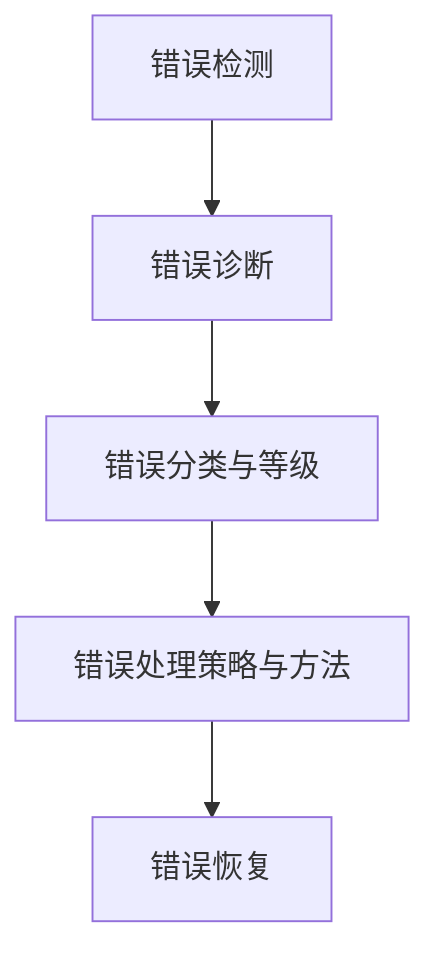
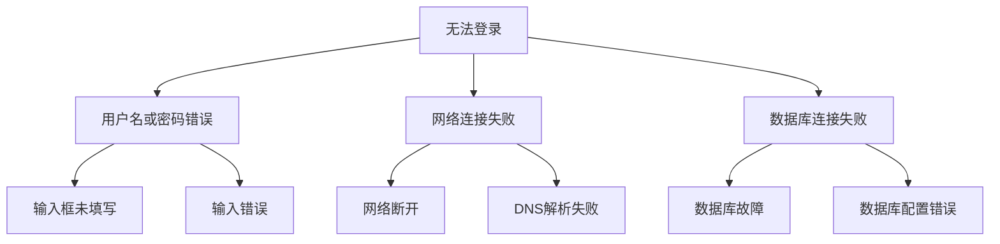

                 


### 第1章：错误处理概述

#### 1.1 错误处理的定义

错误处理是指在软件或系统运行过程中，当检测到错误或异常情况时，采取相应的措施来恢复系统正常状态或减少错误影响的过程。错误处理不仅仅包括错误的检测与诊断，还包括错误的分类与等级、错误处理策略与方法的制定、以及错误恢复等环节。

**核心概念与联系**

错误处理的流程可以分为以下几个关键环节：

1. 错误检测：通过监控系统的运行状态，及时发现潜在的异常情况。
2. 错误诊断：根据错误检测到的信息，对错误进行定位和分析，确定错误的根本原因。
3. 错误分类与等级：将错误按照一定的标准进行分类，并根据错误的影响程度划分等级。
4. 错误处理策略与方法：根据错误的类型和等级，选择合适的处理策略与方法。
5. 错误恢复：采取相应的措施来修复错误，使系统恢复到正常状态或降低错误的影响。

**Mermaid 流程图**



**核心算法原理讲解**

错误处理的重要性评估可以通过以下伪代码来实现：

```python
# 伪代码：错误处理重要性评估
def evaluate_error_handling_importance():
    if system_criticality_high:
        importance = 'High'
    else:
        importance = 'Medium'
    return importance
```

**数学模型和数学公式**

错误率（False Alarm Rate）是衡量错误检测机制性能的重要指标，其计算公式如下：

$$
\text{False Alarm Rate} = \frac{\text{False Alarms}}{\text{Total Number of Alarms}}
$$

#### 1.2 错误处理的重要性

错误处理在软件或系统开发过程中具有至关重要的地位。良好的错误处理机制可以确保系统的稳定运行，降低故障率，提高用户满意度。以下是错误处理的重要性体现：

1. **提高系统可靠性**：错误处理能够及时发现并处理异常情况，防止错误扩散，保证系统持续稳定运行。
2. **降低维护成本**：通过错误处理，可以在早期阶段发现并修复潜在问题，降低后续维护成本。
3. **提升用户体验**：错误处理能够及时响应错误，提供友好的错误提示和解决方案，提升用户对系统的满意度。
4. **保障数据安全**：错误处理机制可以防止数据丢失和损坏，确保数据完整性。

总之，错误处理是构建健壮系统的基础，对于系统的稳定性和可靠性具有重要意义。在开发过程中，应当给予足够的重视，并采取有效的错误处理策略与方法。

### 第2章：错误检测与诊断

#### 2.1 错误检测机制

错误检测是错误处理的第一步，其主要目标是及时发现系统中的异常情况，避免错误进一步扩散。错误检测机制可以采用以下方法：

1. **异常监控**：通过监控系统的运行状态，收集各种运行指标，如CPU负载、内存占用、磁盘I/O等。当监控指标超出预设阈值时，触发报警，提示异常情况。
2. **日志分析**：通过分析系统日志，捕捉错误信息。系统在运行过程中会产生大量的日志，包括错误日志、异常日志等。通过日志分析，可以定位错误发生的位置和原因。
3. **断言检查**：在代码中添加断言（assert），用于检查变量是否满足预期条件。当断言失败时，程序会抛出异常，提示错误。
4. **动态分析**：使用动态分析工具，如动态分析器（dynamic analyzers）、代码覆盖率工具等，对程序运行过程进行实时监控，检测潜在的错误。

**数学模型和数学公式**

错误率（False Alarm Rate）是衡量错误检测机制性能的重要指标，其计算公式如下：

$$
\text{False Alarm Rate} = \frac{\text{False Alarms}}{\text{Total Number of Alarms}}
$$

**详细讲解 & 举例说明**

假设我们使用异常监控方法来检测系统中的异常情况。以下是一个简单的异常监控实现示例：

```python
import time

def check_system_status():
    # 模拟系统状态监控
    if time.time() % 5 == 0:
        print("系统正常")
    else:
        print("系统异常")

# 每秒执行一次检查
while True:
    check_system_status()
    time.sleep(1)
```

在这个示例中，我们使用时间戳来判断系统状态。当时间戳是5的倍数时，我们认为系统正常；否则，我们认为系统异常。这种监控方法虽然简单，但可以有效地检测系统中的异常情况。

#### 2.2 错误诊断方法

错误检测只是第一步，错误诊断是确定错误根本原因的关键环节。以下是几种常见的错误诊断方法：

1. **故障树分析（FTA）**：故障树分析是一种图形化工具，用于分析系统故障的原因和影响。通过构建故障树，可以系统地分解故障，找出可能的故障原因。
2. **代码回溯**：通过分析程序执行过程中的日志和调试信息，可以回溯错误的产生过程，找出错误发生的具体位置和原因。
3. **日志分析**：通过对系统日志的详细分析，可以查找与错误相关的日志条目，定位错误发生的上下文和环境。
4. **代码覆盖率分析**：通过分析代码覆盖率，可以找出程序中未执行的代码路径，从而发现潜在的错误。

**详细讲解 & 举例说明**

下面，我们将使用故障树分析（FTA）来诊断一个简单的系统故障。假设我们的系统出现了一个无法登录的问题。

**故障树分析（FTA）**



在这个故障树中，我们将无法登录问题分解为四个可能的故障原因：用户名或密码错误、网络连接失败、数据库连接失败和输入错误。然后，我们进一步分解每个故障原因，找出可能的子原因。

**代码回溯示例**

假设我们在调试过程中发现了一个异常：

```python
def login(username, password):
    # 模拟登录过程
    if username == "admin" and password == "123456":
        print("登录成功")
    else:
        raise ValueError("用户名或密码错误")

try:
    login("admin", "1234567")
except ValueError as e:
    print("错误详情：", e)
```

在这个示例中，我们通过异常信息定位错误发生的位置和原因。错误信息提示用户名或密码错误，因此我们可以进一步检查用户名和密码输入是否正确。

通过上述错误检测与诊断方法，我们可以有效地定位错误并找到根本原因，为错误处理奠定基础。

### 第3章：错误分类与等级

#### 3.1 错误分类标准

错误分类是错误处理的重要环节，有助于识别错误的类型和影响范围。以下是几种常见的错误分类标准：

1. **按照错误来源分类**：根据错误的来源，将错误分为系统内部错误、用户输入错误、硬件错误等。这种方法有助于定位错误的根源，便于针对性的处理。
2. **按照错误影响分类**：根据错误对系统的影响程度，将错误分为重大错误、一般错误、警告等。这种方法有助于评估错误的严重性，优先处理高影响错误。
3. **按照错误性质分类**：根据错误的性质，将错误分为逻辑错误、运行错误、资源错误等。这种方法有助于理解错误的本质，从而采取更有效的处理方法。

**详细讲解 & 举例说明**

下面，我们以系统内部错误为例，介绍一种具体的错误分类标准。

**系统内部错误分类标准**

- **逻辑错误**：由于程序逻辑错误导致的错误，例如数组越界、空指针异常等。
- **运行错误**：由于程序运行时异常导致的错误，例如内存溢出、栈溢出等。
- **资源错误**：由于系统资源不足导致的错误，例如磁盘空间不足、网络连接中断等。

**案例**：假设我们的系统出现了一个磁盘空间不足的错误。

- **错误分类**：这是一个资源错误，具体来说是磁盘空间不足导致的。
- **错误影响**：由于磁盘空间不足，系统无法存储新的数据，可能导致数据丢失或系统崩溃。
- **错误性质**：这是一个运行错误，由于系统资源不足导致的。

通过这种分类标准，我们可以快速识别错误的类型和影响，从而采取相应的处理措施。

#### 3.2 错误等级划分

错误等级划分是评估错误严重性的重要手段，有助于确定错误的优先级和处理顺序。以下是几种常见的错误等级划分方法：

1. **五级分类法**：将错误分为紧急错误、重要错误、一般错误、警告、提示等五个等级。这种方法简单直观，适用于大多数场景。
2. **四级分类法**：将错误分为严重错误、重要错误、次要错误、警告等四个等级。这种方法适用于对错误严重性要求较高的系统。
3. **三级分类法**：将错误分为致命错误、严重错误、一般错误等三个等级。这种方法适用于对错误严重性要求适中的系统。

**详细讲解 & 举例说明**

下面，我们以五级分类法为例，介绍一种具体的错误等级划分方法。

**五级分类法**

- **紧急错误**：系统无法正常运行，需要立即修复。
- **重要错误**：系统功能受到较大影响，需要尽快修复。
- **一般错误**：系统功能受到轻微影响，可以在后续修复。
- **警告**：系统出现潜在问题，需要关注并处理。
- **提示**：系统出现一般性提示信息，不影响正常使用。

**案例**：假设我们的系统出现了一个内存溢出错误。

- **错误等级**：这是一个紧急错误，因为内存溢出可能导致系统崩溃。
- **错误影响**：由于内存溢出，系统无法继续正常运行，可能导致数据丢失或系统崩溃。
- **错误处理**：需要立即修复内存溢出问题，确保系统稳定运行。

通过这种错误等级划分方法，我们可以快速评估错误的严重性，并采取相应的处理措施。

### 第4章：错误预防策略

#### 4.1 预防性维护

预防性维护是一种重要的错误预防策略，旨在通过定期检查和维护系统，减少错误发生的概率。以下是预防性维护的关键步骤：

1. **定期检查**：对系统进行定期检查，包括硬件、软件和网络等方面。通过检查，可以及时发现潜在问题并采取措施。
2. **故障预测**：利用故障预测技术，如机器学习、数据挖掘等，对系统运行数据进行分析，预测可能出现的故障。
3. **例行维护**：对系统进行例行维护，包括更新软件、升级硬件、清理缓存等。这些操作可以确保系统始终保持良好的运行状态。
4. **日志分析**：通过分析系统日志，了解系统运行情况，识别潜在问题。日志分析可以帮助我们提前发现并解决错误。

**详细讲解 & 举例说明**

下面，我们以定期检查为例，介绍一种预防性维护方法。

**定期检查**

假设我们的系统要求每月进行一次硬件检查。以下是一个简单的定期检查流程：

1. **检查硬件设备**：检查服务器、网络设备、存储设备等硬件设备的运行状态，确保设备正常工作。
2. **更新软件**：检查操作系统和应用程序的版本，确保系统软件是最新的，以避免因软件漏洞导致的问题。
3. **网络检查**：检查网络连接是否稳定，确保网络设备工作正常。
4. **记录检查结果**：将检查结果记录在日志中，便于后续分析和跟踪。

通过定期检查，我们可以及时发现并解决潜在问题，确保系统稳定运行。

#### 4.2 设计冗余

设计冗余是一种通过增加系统冗余度来提高系统可靠性的方法。以下是一些常见的设计冗余策略：

1. **硬件冗余**：通过增加硬件设备的冗余，确保系统在高可用性要求下能够正常运行。例如，使用双机热备份、集群等技术，实现硬件级别的冗余。
2. **软件冗余**：通过在软件层面增加冗余，提高系统的容错能力。例如，使用多实例部署、热备份等技术，确保软件层面的冗余。
3. **数据冗余**：通过在数据层面增加冗余，提高数据的可靠性和一致性。例如，使用数据备份、多副本存储等技术，确保数据层面的冗余。

**详细讲解 & 举例说明**

下面，我们以硬件冗余为例，介绍一种设计冗余方法。

**硬件冗余**

假设我们的系统要求实现高可用性，我们需要使用双机热备份技术。以下是一个简单的硬件冗余部署方案：

1. **主备服务器**：部署两台服务器，分别作为主服务器和备用服务器。主服务器负责处理业务请求，备用服务器处于待机状态。
2. **负载均衡**：使用负载均衡器，将业务请求分配到主服务器和备用服务器上。负载均衡器可以根据服务器的负载情况，动态调整请求分发策略。
3. **故障切换**：当主服务器出现故障时，备用服务器会立即接管业务，确保系统继续提供服务。故障切换过程中，需要确保数据的一致性，避免数据丢失或冲突。

通过硬件冗余，我们可以确保系统在高可用性要求下能够正常运行，提高系统的可靠性。

### 第5章：错误处理算法

#### 5.1 错误检测算法

错误检测算法是错误处理的重要基础，用于检测系统中的异常情况。以下是一些常见的错误检测算法：

1. **奇偶校验**：通过在数据中添加奇偶校验位，检测数据传输过程中的错误。奇偶校验算法简单高效，适用于数据传输错误检测。
2. **校验和**：通过计算数据的校验和，检测数据传输过程中的错误。校验和算法广泛应用于网络传输和数据存储等领域。
3. **循环冗余校验（CRC）**：通过计算循环冗余校验值，检测数据传输过程中的错误。CRC算法具有较高的检测能力，广泛应用于数据通信和存储系统中。
4. **哈希校验**：通过计算数据的哈希值，检测数据的一致性。哈希校验算法简单高效，常用于数据完整性检测。

**详细讲解 & 举例说明**

下面，我们以CRC算法为例，介绍一种错误检测算法。

**CRC算法**

CRC（循环冗余校验）算法是一种常用的错误检测算法，用于检测数据传输过程中的错误。CRC算法的基本原理如下：

1. **生成CRC码**：首先生成一个CRC码，该CRC码由一个固定长度的比特序列组成。CRC码的生成过程通常使用一个生成多项式。
2. **计算CRC值**：将数据与CRC码进行模2除法运算，得到CRC值。CRC值用于检测数据传输过程中的错误。
3. **比较CRC值**：将计算得到的CRC值与接收方的CRC值进行比较。如果CRC值相等，表示数据传输成功；否则，表示数据传输过程中出现了错误。

**CRC算法伪代码**

```python
# 伪代码：CRC算法实现
def crc(data, gen_poly):
    crc_value = 0
    for bit in data:
        if bit == 1:
            crc_value = crc_value ^ gen_poly
        crc_value = (crc_value << 1) % 2
    return crc_value
```

**案例**：假设我们使用CRC算法检测一个8位数据的传输过程。

- **数据**：10101010
- **生成多项式**：10011

**计算过程**：

1. 初始化CRC值为0。
2. 对于每个数据位，进行模2除法运算。
3. 计算得到的CRC值为1。

如果接收方计算得到的CRC值为1，表示数据传输过程中没有出现错误；否则，表示数据传输过程中出现了错误。

#### 5.2 错误纠正算法

错误纠正算法是一种用于纠正数据传输过程中出现的错误的方法。以下是一些常见的错误纠正算法：

1. **奇偶校验**：通过增加奇偶校验位，检测并纠正单个错误。
2. **汉明码**：通过增加冗余位，检测并纠正多个错误。
3. **卷积码**：通过卷积编码和译码，实现高效的错误纠正。
4. **低密度奇偶校验码（LDPC）**：通过低密度奇偶校验矩阵，实现高效的错误纠正。

**详细讲解 & 举例说明**

下面，我们以汉明码为例，介绍一种错误纠正算法。

**汉明码**

汉明码是一种线性错误纠正码，通过在数据中添加冗余位，实现数据的错误纠正。汉明码的基本原理如下：

1. **编码过程**：将数据分为k个信息位和r个冗余位，总共n=k+r个位。编码过程通过线性方程组实现，确保数据在传输过程中可以检测并纠正单个错误。
2. **译码过程**：接收方通过计算校验位，判断数据是否出现错误。如果出现错误，译码过程会尝试纠正错误，并输出正确的数据。

**汉明码编码与译码伪代码**

```python
# 伪代码：汉明码编码与译码
def hamming_encode(data):
    n = len(data) * 2
    encoded_data = [0] * n
    for i in range(len(data)):
        encoded_data[i] = data[i]
        encoded_data[i + len(data)] = data[i] ^ (data[i] << 1) ^ (data[i] << 2)
    return encoded_data

def hamming_decode(encoded_data):
    n = len(encoded_data) // 2
    decoded_data = [0] * n
    for i in range(n):
        decoded_data[i] = encoded_data[i] ^ (encoded_data[i + n] >> 1) ^ (encoded_data[i + n] >> 2)
    return decoded_data
```

**案例**：假设我们使用汉明码对一个4位数据（1010）进行编码与译码。

**编码过程**：

1. 将数据分为信息位和冗余位，总共8位。
2. 计算校验位，确保数据在传输过程中可以检测并纠正单个错误。

**编码结果**：10101101

**译码过程**：

1. 计算接收数据的校验位。
2. 如果出现错误，尝试纠正错误并输出正确的数据。

**译码结果**：1010

通过汉明码，我们可以实现数据的错误纠正，确保数据在传输过程中保持一致性。

### 第6章：错误恢复策略

#### 6.1 错误恢复机制

错误恢复机制是错误处理的重要环节，旨在使系统从错误状态恢复到正常状态。以下是一些常见的错误恢复机制：

1. **自动恢复**：系统在检测到错误后，自动尝试恢复，例如重新启动程序、重新加载配置等。
2. **人工干预**：在自动恢复失败的情况下，需要人工干预，对系统进行手动恢复，例如修复数据库、重置网络等。
3. **备份与恢复**：通过备份系统数据，当系统出现严重错误时，可以从备份中恢复数据，使系统恢复到稳定状态。
4. **异常处理**：在程序中设置异常处理逻辑，当发生错误时，根据错误类型和影响程度，选择合适的恢复策略。

**详细讲解 & 举例说明**

下面，我们以自动恢复为例，介绍一种错误恢复机制。

**自动恢复**

假设我们的系统在运行过程中出现了一个严重的错误，导致程序无法继续执行。以下是一个简单的自动恢复流程：

1. **错误检测**：系统在运行过程中，检测到错误并记录错误日志。
2. **自动重启**：系统在检测到错误后，自动尝试重启程序，以使系统恢复正常状态。
3. **检查重启结果**：重启后，系统检查是否恢复正常。如果恢复正常，继续执行业务；否则，进入人工干预环节。

通过自动恢复机制，我们可以快速应对系统错误，减少系统宕机时间，提高系统可用性。

#### 6.2 错误恢复算法

错误恢复算法是错误恢复机制的核心，用于在检测到错误后，尝试修复错误并使系统恢复到正常状态。以下是一些常见的错误恢复算法：

1. **重试算法**：在发生错误后，系统尝试重新执行操作，直到成功或达到最大重试次数。例如，在数据库连接失败时，系统可以尝试重新连接。
2. **故障转移算法**：在主节点发生故障时，系统自动切换到备用节点，继续提供服务。例如，在分布式系统中，当主节点故障时，系统可以自动切换到备用节点。
3. **回滚算法**：在发生错误后，系统回滚到上一个正确的状态，以避免错误影响。例如，在数据库事务中，当某个操作失败时，系统可以回滚到事务开始时的状态。
4. **补偿算法**：在发生错误后，系统通过执行补偿操作，恢复到正确状态。例如，在分布式系统中，当某个节点故障时，系统可以通过其他节点执行补偿操作，确保数据一致性。

**详细讲解 & 举例说明**

下面，我们以重试算法为例，介绍一种错误恢复算法。

**重试算法**

假设我们的系统在执行某个操作时发生错误，以下是一个简单的重试算法：

1. **初始化重试次数**：设置重试次数上限，例如3次。
2. **执行操作**：尝试执行操作，如果成功，返回结果；否则，记录错误信息并重试。
3. **检查重试结果**：如果重试达到上限，返回错误；否则，继续重试。

**伪代码**：

```python
def retry_operation(operation, max_attempts=3):
    attempt = 0
    while attempt < max_attempts:
        try:
            result = operation()
            return result
        except Exception as e:
            attempt += 1
            print(f"操作失败，第{attempt}次重试：{str(e)}")
            if attempt == max_attempts:
                raise Exception("重试次数达到上限，操作失败")
```

通过重试算法，我们可以有效地应对系统中的临时错误，提高系统稳定性。

### 第7章：错误处理案例分析

#### 7.1 案例一：系统崩溃处理

系统崩溃是软件或系统运行过程中常见的严重错误。以下是一个系统崩溃处理的案例：

**案例背景**：某公司的关键业务系统在运行过程中突然崩溃，导致业务无法正常进行。

**错误检测与诊断**：

1. **错误检测**：系统监控工具检测到系统崩溃，并记录错误日志。
2. **错误诊断**：通过分析错误日志，发现系统崩溃是由于内存溢出导致的。

**错误恢复**：

1. **自动重启**：系统在检测到崩溃后，自动尝试重启。
2. **检查重启结果**：重启后，系统检查是否恢复正常。如果恢复正常，继续执行业务；否则，进入人工干预环节。

**人工干预**：

1. **检查内存使用情况**：通过性能监控工具，检查系统内存使用情况，发现内存泄漏问题。
2. **修复内存泄漏**：通过代码调试，定位内存泄漏的原因，并进行修复。
3. **重新部署**：修复后，重新部署系统，确保系统恢复正常。

**总结**：

通过自动重启和人工干预，成功解决了系统崩溃问题，确保了业务的连续性。案例中的错误处理过程展示了系统崩溃处理的核心步骤，包括错误检测、错误诊断、错误恢复和人工干预。

#### 7.2 案例二：网络错误处理

网络错误是影响系统稳定性的重要因素。以下是一个网络错误处理的案例：

**案例背景**：某公司的客户在访问网站时，经常遇到连接失败的问题。

**错误检测与诊断**：

1. **错误检测**：客户在访问网站时，网络监控工具检测到连接失败，并记录错误日志。
2. **错误诊断**：通过分析错误日志，发现网络连接失败是由于DNS解析失败导致的。

**错误恢复**：

1. **重试连接**：系统在检测到网络连接失败后，自动尝试重新连接。
2. **检查DNS配置**：通过检查DNS配置，发现DNS服务器地址配置错误。

**人工干预**：

1. **修正DNS配置**：通过修改DNS配置，将错误的DNS服务器地址更改为正确的地址。
2. **重新加载网络配置**：重新加载网络配置，确保系统使用正确的DNS服务器。

**总结**：

通过自动重试和人工干预，成功解决了网络连接失败问题。案例中的错误处理过程展示了网络错误处理的核心步骤，包括错误检测、错误诊断、错误恢复和人工干预。

### 第8章：错误处理工具与应用

#### 8.1 错误处理工具介绍

在错误处理过程中，工具的选择至关重要。以下是一些常见的错误处理工具：

1. **日志管理工具**：如Log4j、Logback等，用于记录系统运行过程中的日志信息，便于错误诊断和分析。
2. **性能监控工具**：如Prometheus、Grafana等，用于监控系统的性能指标，及时发现潜在问题。
3. **故障检测工具**：如Zabbix、Nagios等，用于检测系统的运行状态，并在检测到错误时触发告警。
4. **自动化运维工具**：如Ansible、Puppet等，用于自动化执行错误恢复和系统维护任务。

**详细讲解 & 举例说明**

以下以Log4j为例，介绍一种日志管理工具。

**Log4j**

Log4j是一个常用的日志管理工具，用于记录系统运行过程中的日志信息。以下是一个简单的Log4j配置示例：

```xml
<configuration>
    <appender name="Console" class="org.apache.log4j.ConsoleAppender">
        <layout class="org.apache.log4j.PatternLayout">
            <pattern>%d{yyyy-MM-dd HH:mm:ss} %p %c{1}:%L - %m%n</pattern>
        </layout>
    </appender>

    <root>
        <priority value="debug"/>
        <appender-ref ref="Console"/>
    </root>
</configuration>
```

在这个配置中，我们设置了日志输出格式（%d{yyyy-MM-dd HH:mm:ss} %p %c{1}:%L - %m%n）和输出目标（控制台）。通过这个配置，Log4j可以记录系统运行过程中的日志信息，便于错误诊断和分析。

#### 8.2 错误处理在分布式系统中的应用

在分布式系统中，错误处理变得更加复杂，因为系统中的各个节点可能处于不同的状态，并且网络通信可能存在延迟或失败。以下是一些错误处理在分布式系统中的应用策略：

1. **故障检测与自动恢复**：分布式系统通常采用心跳机制检测节点的状态，当检测到节点故障时，自动切换到备用节点，确保系统的高可用性。
2. **数据一致性与容错性**：分布式系统采用数据复制、分布式锁、选举算法等技术，确保数据一致性和容错性。
3. **延迟容忍与故障屏蔽**：分布式系统设计时考虑延迟容忍和故障屏蔽，例如使用幂等操作、超时机制等，降低错误对系统的影响。
4. **分布式日志与监控**：分布式系统采用分布式日志和监控工具，实时记录和分析系统的运行状态，及时发现并处理错误。

**详细讲解 & 举例说明**

以下以分布式日志为例，介绍一种错误处理在分布式系统中的应用策略。

**分布式日志**

分布式日志是分布式系统中重要的错误处理工具，用于记录系统运行过程中的日志信息。以下是一个简单的分布式日志架构：

1. **日志收集**：各个节点将日志发送到日志收集器。
2. **日志存储**：日志收集器将日志存储到分布式日志存储系统，如Elasticsearch、Kafka等。
3. **日志分析**：通过分布式日志分析工具，分析日志信息，及时发现并处理错误。

以下是一个简单的分布式日志收集与存储的示例：

```python
# 伪代码：分布式日志收集与存储
from logging import Logger
from kazoo.client import KazooClient

# 设置日志收集器
zk = KazooClient(hosts="127.0.0.1:2181")
zk.start()
log_path = "/logs"
zk.create(log_path, ephemeral=True)

logger = Logger("distributed_logger")
logger.setLevel(logging.DEBUG)

# 添加日志处理器
handler = KafkaHandler('localhost:9092', 'test_topic')
logger.addHandler(handler)

# 记录日志
logger.info("系统启动成功")
```

在这个示例中，我们使用Kafka作为日志收集器，将日志发送到指定的Kafka主题。通过分布式日志，我们可以实时记录和分析系统的运行状态，及时发现并处理错误。

### 第9章：健壮性设计原则

#### 9.1 系统容错性

系统容错性是健壮性设计的重要原则，旨在使系统能够在出现错误或故障时，保持正常运行或快速恢复。以下是一些常见的系统容错性设计原则：

1. **冗余设计**：通过增加硬件、软件或数据冗余，提高系统的容错能力。例如，使用双机热备份、集群、分布式存储等技术。
2. **故障转移**：在主节点故障时，系统自动切换到备用节点，继续提供服务。例如，在分布式系统中，使用主备切换技术。
3. **故障隔离**：将故障节点与其他节点隔离，防止故障扩散。例如，使用虚拟化技术、容器化技术等。
4. **自我修复**：系统能够在检测到故障时，自动尝试修复，减少人工干预。例如，自动重启、自动更新等技术。

**详细讲解 & 举例说明**

以下以冗余设计为例，介绍一种系统容错性设计原则。

**冗余设计**

假设我们的系统要求实现高可用性，我们需要使用双机热备份技术。以下是一个简单的冗余设计部署方案：

1. **主备服务器**：部署两台服务器，分别作为主服务器和备用服务器。主服务器负责处理业务请求，备用服务器处于待机状态。
2. **负载均衡**：使用负载均衡器，将业务请求分配到主服务器和备用服务器上。负载均衡器可以根据服务器的负载情况，动态调整请求分发策略。
3. **故障切换**：当主服务器出现故障时，备用服务器会立即接管业务，确保系统继续提供服务。故障切换过程中，需要确保数据的一致性，避免数据丢失或冲突。

通过冗余设计，我们可以确保系统在高可用性要求下能够正常运行，提高系统的可靠性。

#### 9.2 系统健壮性

系统健壮性是系统在面临各种挑战和压力时，能够保持稳定运行的能力。以下是一些提高系统健壮性的设计原则：

1. **模块化设计**：将系统划分为多个模块，每个模块独立运行，降低系统复杂度，提高系统的可维护性和可扩展性。
2. **弹性伸缩**：系统能够根据业务需求，动态调整资源使用，确保系统在高负载情况下依然能够稳定运行。
3. **自动化监控与告警**：使用自动化监控工具，实时监控系统的运行状态，及时发现并处理潜在问题。
4. **容错性设计**：在系统设计时，考虑各种可能的故障情况，采用冗余、故障转移、故障隔离等技术，提高系统的容错能力。

**详细讲解 & 举例说明**

以下以弹性伸缩为例，介绍一种提高系统健壮性的设计原则。

**弹性伸缩**

假设我们的系统需要处理大量的业务请求，我们需要实现弹性伸缩。以下是一个简单的弹性伸缩部署方案：

1. **容器化**：使用容器化技术（如Docker），将系统划分为多个独立的容器，每个容器负责处理一部分业务请求。
2. **Kubernetes集群**：使用Kubernetes进行容器编排，实现容器的自动化部署、伸缩和管理。Kubernetes可以根据业务需求，动态调整容器数量，实现弹性伸缩。
3. **负载均衡**：使用负载均衡器，将业务请求分配到不同的容器上，确保系统的处理能力。
4. **监控与告警**：使用Prometheus等监控工具，实时监控系统的运行状态，并在检测到问题时，触发告警，及时处理。

通过弹性伸缩设计，我们可以确保系统在面临大量请求时，能够快速扩展处理能力，保持稳定运行。

### 第10章：健壮性测试与评估

#### 10.1 健壮性测试方法

健壮性测试是评估系统在面临各种压力和异常情况下，能否保持稳定运行的重要手段。以下是一些常见的健壮性测试方法：

1. **压力测试**：通过模拟高负载情况，测试系统在压力下的性能和稳定性。例如，使用JMeter等工具模拟大量并发请求，观察系统的响应时间和吞吐量。
2. **可靠性测试**：通过模拟系统长时间运行的情况，测试系统的稳定性和可靠性。例如，使用自动化测试工具进行持续集成和持续部署，观察系统的运行状态。
3. **故障注入测试**：在测试环境中注入各种故障，如网络中断、硬件故障、软件异常等，测试系统的容错能力和恢复能力。
4. **性能测试**：通过模拟各种性能场景，测试系统的性能表现，如响应时间、吞吐量、并发处理能力等。

**详细讲解 & 举例说明**

以下以压力测试为例，介绍一种健壮性测试方法。

**压力测试**

假设我们的系统需要处理大量并发请求，我们需要进行压力测试。以下是一个简单的压力测试流程：

1. **测试环境搭建**：搭建与生产环境类似的测试环境，包括服务器、网络、数据库等。
2. **测试脚本编写**：使用压力测试工具（如JMeter），编写测试脚本，模拟大量并发请求。
3. **执行测试**：启动测试工具，模拟并发请求，观察系统的响应时间和吞吐量。
4. **结果分析**：分析测试结果，找出系统的瓶颈和性能问题，并提出优化方案。

通过压力测试，我们可以发现系统在面临高负载情况时的性能和稳定性问题，从而进行优化和改进。

#### 10.2 健壮性评估指标

健壮性评估指标是衡量系统健壮性的重要依据。以下是一些常见的健壮性评估指标：

1. **系统可用性**：系统在规定时间内能够正常运行的概率。例如，系统可用性达到99.9%意味着每年允许的宕机时间为8.8小时。
2. **故障恢复时间**：系统从故障状态恢复到正常状态所需的时间。例如，故障恢复时间越短，系统的健壮性越高。
3. **故障率**：单位时间内系统发生故障的次数。例如，故障率越低，系统的健壮性越高。
4. **性能稳定性**：系统在面临各种压力和异常情况时，性能表现是否稳定。例如，系统在压力测试中响应时间和吞吐量是否稳定。

**详细讲解 & 举例说明**

以下以系统可用性为例，介绍一种健壮性评估指标。

**系统可用性**

假设我们的系统在一个月内发生了两次故障，每次故障持续了2小时。以下是一个简单的系统可用性计算示例：

1. **总运行时间**：一个月总共有30天，每天24小时，所以总运行时间为30 * 24 = 720小时。
2. **故障时间**：两次故障共持续了2 + 2 = 4小时。
3. **可用性**：系统可用性为（720 - 4）/ 720 = 0.975，即97.5%。

通过计算系统可用性，我们可以评估系统的健壮性，为系统优化和改进提供依据。

### 第11章：构建健壮系统的最佳实践

#### 11.1 实践一：持续集成与部署

持续集成与部署（CI/CD）是构建健壮系统的关键实践。以下是一些最佳实践：

1. **自动化测试**：在CI/CD流程中，自动化执行各种测试，包括单元测试、集成测试、性能测试等，确保代码质量。
2. **版本控制**：使用版本控制系统（如Git），确保代码的版本控制和历史追踪，便于故障定位和回滚。
3. **自动化部署**：使用自动化部署工具（如Jenkins、GitLab CI等），实现代码的自动化构建、测试和部署，减少人工干预。
4. **监控与告警**：在CI/CD流程中集成监控和告警系统，实时监控系统的运行状态，及时发现并处理问题。

**详细讲解 & 举例说明**

以下是一个简单的持续集成与部署实践：

1. **编写测试脚本**：编写单元测试、集成测试和性能测试脚本，确保代码质量。
2. **配置CI/CD流程**：在Jenkins中配置CI/CD流程，包括构建、测试和部署步骤。
3. **触发构建**：在Git仓库中提交代码，触发Jenkins构建流程。
4. **执行测试**：自动化执行测试脚本，检查代码质量。
5. **部署代码**：如果测试通过，自动部署代码到生产环境。

通过持续集成与部署，我们可以确保系统的健壮性和稳定性，提高开发效率。

#### 11.2 实践二：监控与告警机制

监控与告警机制是确保系统运行稳定的重要手段。以下是一些最佳实践：

1. **性能监控**：使用性能监控工具（如Prometheus、Grafana等），监控系统的CPU、内存、磁盘I/O等性能指标，及时发现性能瓶颈。
2. **日志监控**：使用日志监控工具（如ELK、Logstash等），监控系统日志，及时发现异常日志和错误信息。
3. **告警机制**：配置告警规则，当监控指标超出阈值或检测到异常日志时，触发告警，通知相关人员。
4. **自动化响应**：在告警触发时，自动执行相应的响应操作，如重启服务、扩容资源等，减少人工干预。

**详细讲解 & 举例说明**

以下是一个简单的监控与告警实践：

1. **配置监控指标**：在Prometheus中配置监控指标，包括CPU使用率、内存使用率、磁盘I/O等。
2. **配置告警规则**：在Grafana中配置告警规则，当CPU使用率超过90%时，触发告警。
3. **配置告警通知**：在Alertmanager中配置告警通知，当触发告警时，通过短信、邮件等方式通知相关人员。
4. **自动化响应**：在告警触发时，自动执行以下操作：如果CPU使用率超过90%，自动重启相关服务。

通过监控与告警机制，我们可以实时监控系统的运行状态，及时发现并处理问题，确保系统的稳定性。

### 第12章：未来展望

#### 12.1 错误处理技术的发展趋势

随着信息技术的发展，错误处理技术也在不断进步。以下是一些错误处理技术的发展趋势：

1. **智能化错误处理**：利用人工智能和机器学习技术，实现更智能的错误处理和故障预测。例如，通过分析大量历史数据，预测系统可能出现的故障，并提前采取预防措施。
2. **自动化错误恢复**：通过自动化技术，实现更高效的错误恢复。例如，使用自动化运维工具，自动执行故障恢复操作，减少人工干预。
3. **分布式错误处理**：随着分布式系统的普及，分布式错误处理技术越来越重要。例如，在分布式系统中，实现跨节点的错误检测、诊断和恢复。
4. **区块链错误处理**：区块链技术的兴起，为错误处理带来了新的可能性。例如，通过区块链实现数据一致性和故障恢复。

**详细讲解 & 举例说明**

以下以智能化错误处理为例，介绍一种错误处理技术发展趋势。

**智能化错误处理**

假设我们的系统采用人工智能技术进行错误处理。以下是一个简单的智能化错误处理框架：

1. **数据收集**：收集系统运行过程中的各类数据，如日志、性能指标等。
2. **数据预处理**：对收集到的数据进行清洗、转换和归一化，为机器学习模型提供高质量的输入。
3. **模型训练**：使用机器学习算法，如决策树、神经网络等，对预处理后的数据进行训练，建立错误预测模型。
4. **错误预测**：在系统运行过程中，实时输入新的数据，通过训练好的模型预测系统可能出现的故障。
5. **自动化恢复**：当预测到故障时，自动执行相应的恢复操作，如重启服务、扩容资源等。

通过智能化错误处理，我们可以更早地发现并处理系统故障，提高系统的稳定性和可靠性。

#### 12.2 健壮系统建设面临的挑战与机遇

在构建健壮系统的过程中，我们面临着诸多挑战和机遇：

1. **挑战**：
   - **复杂性增加**：随着系统规模的扩大和技术的进步，系统的复杂性不断增加，错误处理和健壮性设计变得更加困难。
   - **资源限制**：在有限的资源条件下，实现高效、可靠的错误处理和健壮性设计，需要更高的技术水平和精细化管理。
   - **成本考虑**：错误处理和健壮性设计需要投入大量的人力、物力和财力，如何在成本与效益之间找到平衡点，是面临的挑战之一。

2. **机遇**：
   - **自动化技术**：随着自动化技术的发展，错误处理和健壮性设计可以更加高效地实现。例如，自动化运维工具可以降低错误处理和系统维护的难度。
   - **智能化技术**：利用人工智能和机器学习技术，可以实现对错误处理和故障预测的智能化，提高系统的稳定性和可靠性。
   - **开源生态**：开源技术的兴起，为错误处理和健壮性设计提供了丰富的工具和资源，降低了开发门槛。

**详细讲解 & 举例说明**

以下以自动化技术为例，介绍一种健壮系统建设面临的机遇。

**自动化技术**

假设我们的系统采用自动化技术进行错误处理和系统维护。以下是一个简单的自动化技术实践：

1. **自动化部署**：使用自动化部署工具（如Ansible），实现系统的自动化部署和管理。通过Ansible，可以自动化安装、配置和更新系统软件。
2. **自动化监控**：使用自动化监控工具（如Zabbix），实现对系统的实时监控和性能分析。通过Zabbix，可以自动收集系统的各种监控指标，生成性能报告。
3. **自动化恢复**：使用自动化恢复工具（如Kubernetes），在系统检测到故障时，自动执行恢复操作，如重启服务、扩容资源等。通过Kubernetes，可以实现自动化故障恢复和高可用性部署。

通过自动化技术，我们可以降低错误处理和系统维护的复杂度，提高系统的稳定性和可靠性。

### 结论

构建健壮系统是信息技术领域的重要挑战，错误处理是其中的关键环节。通过本文的详细分析和实践，我们了解了错误处理的基础知识、策略和方法，以及如何构建健壮系统。未来，随着智能化技术的不断发展，错误处理和健壮系统建设将迎来更多机遇和挑战。希望读者能够将本文的知识应用到实际项目中，不断提高系统的稳定性和可靠性。

## 作者信息

**作者：** AI天才研究院（AI Genius Institute）/《禅与计算机程序设计艺术》（Zen And The Art of Computer Programming）

---

# 错误处理：构建健壮系统的基础

> **关键词：** 错误处理、健壮系统、错误检测、故障恢复、容错性

> **摘要：** 本文详细探讨了错误处理在构建健壮系统中的重要性，介绍了错误处理的定义、检测与诊断方法、分类与等级划分，以及错误预防策略、处理算法和恢复策略。通过实际案例和工具介绍，阐述了如何在实际项目中实现错误处理，为构建稳定可靠的系统提供了实用指导。

---

## 第一部分：错误处理基础

### 第1章：错误处理概述

#### 1.1 错误处理的定义

错误处理是指在软件或系统运行过程中，当检测到错误或异常情况时，采取相应的措施来恢复系统正常状态或减少错误影响的过程。错误处理不仅仅包括错误的检测与诊断，还包括错误的分类与等级、错误处理策略与方法的制定、以及错误恢复等环节。

#### 1.2 错误处理的重要性

错误处理在软件或系统开发过程中具有至关重要的地位。良好的错误处理机制可以确保系统的稳定运行，降低故障率，提高用户满意度。以下是错误处理的重要性体现：

1. **提高系统可靠性**：错误处理能够及时发现并处理异常情况，防止错误扩散，保证系统持续稳定运行。
2. **降低维护成本**：通过错误处理，可以在早期阶段发现并修复潜在问题，降低后续维护成本。
3. **提升用户体验**：错误处理能够及时响应错误，提供友好的错误提示和解决方案，提升用户对系统的满意度。
4. **保障数据安全**：错误处理机制可以防止数据丢失和损坏，确保数据完整性。

总之，错误处理是构建健壮系统的基础，对于系统的稳定性和可靠性具有重要意义。在开发过程中，应当给予足够的重视，并采取有效的错误处理策略与方法。

---

## 第二部分：错误处理策略与方法

### 第2章：错误检测与诊断

#### 2.1 错误检测机制

错误检测是错误处理的第一步，其主要目标是及时发现系统中的异常情况，避免错误进一步扩散。错误检测机制可以采用以下方法：

1. **异常监控**：通过监控系统的运行状态，收集各种运行指标，如CPU负载、内存占用、磁盘I/O等。当监控指标超出预设阈值时，触发报警，提示异常情况。
2. **日志分析**：通过分析系统日志，捕捉错误信息。系统在运行过程中会产生大量的日志，包括错误日志、异常日志等。通过日志分析，可以定位错误发生的位置和原因。
3. **断言检查**：在代码中添加断言（assert），用于检查变量是否满足预期条件。当断言失败时，程序会抛出异常，提示错误。
4. **动态分析**：使用动态分析工具，如动态分析器（dynamic analyzers）、代码覆盖率工具等，对程序运行过程进行实时监控，检测潜在的错误。

#### 2.2 错误诊断方法

错误诊断是确定错误根本原因的关键环节。以下是几种常见的错误诊断方法：

1. **故障树分析（FTA）**：故障树分析是一种图形化工具，用于分析系统故障的原因和影响。通过构建故障树，可以系统地分解故障，找出可能的故障原因。
2. **代码回溯**：通过分析程序执行过程中的日志和调试信息，可以回溯错误的产生过程，找出错误发生的具体位置和原因。
3. **日志分析**：通过对系统日志的详细分析，可以查找与错误相关的日志条目，定位错误发生的上下文和环境。
4. **代码覆盖率分析**：通过分析代码覆盖率，可以找出程序中未执行的代码路径，从而发现潜在的错误。

---

### 第3章：错误分类与等级

#### 3.1 错误分类标准

错误分类是错误处理的重要环节，有助于识别错误的类型和影响范围。以下是几种常见的错误分类标准：

1. **按照错误来源分类**：根据错误的来源，将错误分为系统内部错误、用户输入错误、硬件错误等。这种方法有助于定位错误的根源，便于针对性的处理。
2. **按照错误影响分类**：根据错误对系统的影响程度，将错误分为重大错误、一般错误、警告等。这种方法有助于评估错误的严重性，优先处理高影响错误。
3. **按照错误性质分类**：根据错误的性质，将错误分为逻辑错误、运行错误、资源错误等。这种方法有助于理解错误的本质，从而采取更有效的处理方法。

#### 3.2 错误等级划分

错误等级划分是评估错误严重性的重要手段，有助于确定错误的优先级和处理顺序。以下是几种常见的错误等级划分方法：

1. **五级分类法**：将错误分为紧急错误、重要错误、一般错误、警告、提示等五个等级。这种方法简单直观，适用于大多数场景。
2. **四级分类法**：将错误分为严重错误、重要错误、次要错误、警告等四个等级。这种方法适用于对错误严重性要求较高的系统。
3. **三级分类法**：将错误分为致命错误、严重错误、一般错误等三个等级。这种方法适用于对错误严重性要求适中的系统。

---

## 第三部分：错误处理策略与方法

### 第4章：错误预防策略

#### 4.1 预防性维护

预防性维护是一种重要的错误预防策略，旨在通过定期检查和维护系统，减少错误发生的概率。以下是预防性维护的关键步骤：

1. **定期检查**：对系统进行定期检查，包括硬件、软件和网络等方面。通过检查，可以及时发现潜在问题并采取措施。
2. **故障预测**：利用故障预测技术，如机器学习、数据挖掘等，对系统运行数据进行分析，预测可能出现的故障。
3. **例行维护**：对系统进行例行维护，包括更新软件、升级硬件、清理缓存等。这些操作可以确保系统始终保持良好的运行状态。
4. **日志分析**：通过分析系统日志，了解系统运行情况，识别潜在问题。日志分析可以帮助我们提前发现并解决错误。

#### 4.2 设计冗余

设计冗余是一种通过增加系统冗余度来提高系统可靠性的方法。以下是一些常见的设计冗余策略：

1. **硬件冗余**：通过增加硬件设备的冗余，确保系统在高可用性要求下能够正常运行。例如，使用双机热备份、集群等技术，实现硬件级别的冗余。
2. **软件冗余**：通过在软件层面增加冗余，提高系统的容错能力。例如，使用多实例部署、热备份等技术，确保软件层面的冗余。
3. **数据冗余**：通过在数据层面增加冗余，提高数据的可靠性和一致性。例如，使用数据备份、多副本存储等技术，确保数据层面的冗余。

---

### 第5章：错误处理算法

#### 5.1 错误检测算法

错误检测算法是错误处理的重要基础，用于检测系统中的异常情况。以下是一些常见的错误检测算法：

1. **奇偶校验**：通过在数据中添加奇偶校验位，检测数据传输过程中的错误。奇偶校验算法简单高效，适用于数据传输错误检测。
2. **校验和**：通过计算数据的校验和，检测数据传输过程中的错误。校验和算法广泛应用于网络传输和数据存储等领域。
3. **循环冗余校验（CRC）**：通过计算循环冗余校验值，检测数据传输过程中的错误。CRC算法具有较高的检测能力，广泛应用于数据通信和存储系统中。
4. **哈希校验**：通过计算数据的哈希值，检测数据的一致性。哈希校验算法简单高效，常用于数据完整性检测。

#### 5.2 错误纠正算法

错误纠正算法是一种用于纠正数据传输过程中出现的错误的方法。以下是一些常见的错误纠正算法：

1. **奇偶校验**：通过增加奇偶校验位，检测并纠正单个错误。
2. **汉明码**：通过增加冗余位，检测并纠正多个错误。
3. **卷积码**：通过卷积编码和译码，实现高效的错误纠正。
4. **低密度奇偶校验码（LDPC）**：通过低密度奇偶校验矩阵，实现高效的错误纠正。

---

## 第四部分：错误处理实战

### 第6章：错误处理案例分析

#### 6.1 案例一：系统崩溃处理

系统崩溃是软件或系统运行过程中常见的严重错误。以下是一个系统崩溃处理的案例：

**案例背景**：某公司的关键业务系统在运行过程中突然崩溃，导致业务无法正常进行。

**错误检测与诊断**：

1. **错误检测**：系统监控工具检测到系统崩溃，并记录错误日志。
2. **错误诊断**：通过分析错误日志，发现系统崩溃是由于内存溢出导致的。

**错误恢复**：

1. **自动重启**：系统在检测到崩溃后，自动尝试重启程序，以使系统恢复正常状态。
2. **检查重启结果**：重启后，系统检查是否恢复正常。如果恢复正常，继续执行业务；否则，进入人工干预环节。

**人工干预**：

1. **检查内存使用情况**：通过性能监控工具，检查系统内存使用情况，发现内存泄漏问题。
2. **修复内存泄漏**：通过代码调试，定位内存泄漏的原因，并进行修复。
3. **重新部署**：修复后，重新部署系统，确保系统恢复正常。

**总结**：

通过自动重启和人工干预，成功解决了系统崩溃问题，确保了业务的连续性。案例中的错误处理过程展示了系统崩溃处理的核心步骤，包括错误检测、错误诊断、错误恢复和人工干预。

#### 6.2 案例二：网络错误处理

网络错误是影响系统稳定性的重要因素。以下是一个网络错误处理的案例：

**案例背景**：某公司的客户在访问网站时，经常遇到连接失败的问题。

**错误检测与诊断**：

1. **错误检测**：客户在访问网站时，网络监控工具检测到连接失败，并记录错误日志。
2. **错误诊断**：通过分析错误日志，发现网络连接失败是由于DNS解析失败导致的。

**错误恢复**：

1. **重试连接**：系统在检测到网络连接失败后，自动尝试重新连接。
2. **检查DNS配置**：通过检查DNS配置，发现DNS服务器地址配置错误。

**人工干预**：

1. **修正DNS配置**：通过修改DNS配置，将错误的DNS服务器地址更改为正确的地址。
2. **重新加载网络配置**：重新加载网络配置，确保系统使用正确的DNS服务器。

**总结**：

通过自动重试和人工干预，成功解决了网络连接失败问题。案例中的错误处理过程展示了网络错误处理的核心步骤，包括错误检测、错误诊断、错误恢复和人工干预。

---

## 第五部分：构建健壮系统

### 第7章：错误处理工具与应用

#### 8.1 错误处理工具介绍

在错误处理过程中，工具的选择至关重要。以下是一些常见的错误处理工具：

1. **日志管理工具**：如Log4j、Logback等，用于记录系统运行过程中的日志信息，便于错误诊断和分析。
2. **性能监控工具**：如Prometheus、Grafana等，用于监控系统的性能指标，及时发现潜在问题。
3. **故障检测工具**：如Zabbix、Nagios等，用于检测系统的运行状态，并在检测到错误时触发告警。
4. **自动化运维工具**：如Ansible、Puppet等，用于自动化执行错误恢复和系统维护任务。

#### 8.2 错误处理在分布式系统中的应用

在分布式系统中，错误处理变得更加复杂，因为系统中的各个节点可能处于不同的状态，并且网络通信可能存在延迟或失败。以下是一些错误处理在分布式系统中的应用策略：

1. **故障检测与自动恢复**：分布式系统通常采用心跳机制检测节点的状态，当检测到节点故障时，自动切换到备用节点，确保系统的高可用性。
2. **数据一致性与容错性**：分布式系统采用数据复制、分布式锁、选举算法等技术，确保数据一致性和容错性。
3. **延迟容忍与故障屏蔽**：分布式系统设计时考虑延迟容忍和故障屏蔽，例如使用幂等操作、超时机制等，降低错误对系统的影响。
4. **分布式日志与监控**：分布式系统采用分布式日志和监控工具，实时记录和分析系统的运行状态，及时发现并处理错误。

---

### 第9章：健壮性设计原则

#### 9.1 系统容错性

系统容错性是健壮性设计的重要原则，旨在使系统能够在出现错误或故障时，保持正常运行或快速恢复。以下是一些常见的系统容错性设计原则：

1. **冗余设计**：通过增加硬件、软件或数据冗余，提高系统的容错能力。例如，使用双机热备份、集群、分布式存储等技术。
2. **故障转移**：在主节点故障时，系统自动切换到备用节点，继续提供服务。例如，在分布式系统中，使用主备切换技术。
3. **故障隔离**：将故障节点与其他节点隔离，防止故障扩散。例如，使用虚拟化技术、容器化技术等。
4. **自我修复**：系统能够在检测到故障时，自动尝试修复，减少人工干预。例如，自动重启、自动更新等技术。

#### 9.2 系统健壮性

系统健壮性是系统在面临各种挑战和压力时，能够保持稳定运行的能力。以下是一些提高系统健壮性的设计原则：

1. **模块化设计**：将系统划分为多个模块，每个模块独立运行，降低系统复杂度，提高系统的可维护性和可扩展性。
2. **弹性伸缩**：系统能够根据业务需求，动态调整资源使用，确保系统在高负载情况下依然能够稳定运行。
3. **自动化监控与告警**：使用自动化监控工具，实时监控系统的运行状态，及时发现并处理潜在问题。
4. **容错性设计**：在系统设计时，考虑各种可能的故障情况，采用冗余、故障转移、故障隔离等技术，提高系统的容错能力。

---

### 第10章：健壮性测试与评估

#### 10.1 健壮性测试方法

健壮性测试是评估系统在面临各种压力和异常情况下，能否保持稳定运行的重要手段。以下是一些常见的健壮性测试方法：

1. **压力测试**：通过模拟高负载情况，测试系统在压力下的性能和稳定性。例如，使用JMeter等工具模拟大量并发请求，观察系统的响应时间和吞吐量。
2. **可靠性测试**：通过模拟系统长时间运行的情况，测试系统的稳定性和可靠性。例如，使用自动化测试工具进行持续集成和持续部署，观察系统的运行状态。
3. **故障注入测试**：在测试环境中注入各种故障，如网络中断、硬件故障、软件异常等，测试系统的容错能力和恢复能力。
4. **性能测试**：通过模拟各种性能场景，测试系统的性能表现，如响应时间、吞吐量、并发处理能力等。

#### 10.2 健壮性评估指标

健壮性评估指标是衡量系统健壮性的重要依据。以下是一些常见的健壮性评估指标：

1. **系统可用性**：系统在规定时间内能够正常运行的概率。例如，系统可用性达到99.9%意味着每年允许的宕机时间为8.8小时。
2. **故障恢复时间**：系统从故障状态恢复到正常状态所需的时间。例如，故障恢复时间越短，系统的健壮性越高。
3. **故障率**：单位时间内系统发生故障的次数。例如，故障率越低，系统的健壮性越高。
4. **性能稳定性**：系统在面临各种压力和异常情况时，性能表现是否稳定。例如，系统在压力测试中响应时间和吞吐量是否稳定。

---

### 第11章：构建健壮系统的最佳实践

#### 11.1 实践一：持续集成与部署

持续集成与部署（CI/CD）是构建健壮系统的关键实践。以下是一些最佳实践：

1. **自动化测试**：在CI/CD流程中，自动化执行各种测试，包括单元测试、集成测试、性能测试等，确保代码质量。
2. **版本控制**：使用版本控制系统（如Git），确保代码的版本控制和历史追踪，便于故障定位和回滚。
3. **自动化部署**：使用自动化部署工具（如Jenkins、GitLab CI等），实现代码的自动化构建、测试和部署，减少人工干预。
4. **监控与告警**：在CI/CD流程中集成监控和告警系统，实时监控系统的运行状态，及时发现并处理问题。

#### 11.2 实践二：监控与告警机制

监控与告警机制是确保系统运行稳定的重要手段。以下是一些最佳实践：

1. **性能监控**：使用性能监控工具（如Prometheus、Grafana等），监控系统的CPU、内存、磁盘I/O等性能指标，及时发现性能瓶颈。
2. **日志监控**：使用日志监控工具（如ELK、Logstash等），监控系统日志，及时发现异常日志和错误信息。
3. **告警机制**：配置告警规则，当监控指标超出阈值或检测到异常日志时，触发告警，通知相关人员。
4. **自动化响应**：在告警触发时，自动执行相应的响应操作，如重启服务、扩容资源等，减少人工干预。

---

### 第12章：未来展望

#### 12.1 错误处理技术的发展趋势

随着信息技术的发展，错误处理技术也在不断进步。以下是一些错误处理技术的发展趋势：

1. **智能化错误处理**：利用人工智能和机器学习技术，实现更智能的错误处理和故障预测。例如，通过分析大量历史数据，预测系统可能出现的故障，并提前采取预防措施。
2. **自动化错误恢复**：通过自动化技术，实现更高效的错误恢复。例如，使用自动化运维工具，自动执行故障恢复操作，减少人工干预。
3. **分布式错误处理**：随着分布式系统的普及，分布式错误处理技术越来越重要。例如，在分布式系统中，实现跨节点的错误检测、诊断和恢复。
4. **区块链错误处理**：区块链技术的兴起，为错误处理带来了新的可能性。例如，通过区块链实现数据一致性和故障恢复。

#### 12.2 健壮系统建设面临的挑战与机遇

在构建健壮系统的过程中，我们面临着诸多挑战和机遇：

1. **挑战**：
   - **复杂性增加**：随着系统规模的扩大和技术的进步，系统的复杂性不断增加，错误处理和健壮性设计变得更加困难。
   - **资源限制**：在有限的资源条件下，实现高效、可靠的错误处理和健壮性设计，需要更高的技术水平和精细化管理。
   - **成本考虑**：错误处理和健壮性设计需要投入大量的人力、物力和财力，如何在成本与效益之间找到平衡点，是面临的挑战之一。

2. **机遇**：
   - **自动化技术**：随着自动化技术的发展，错误处理和健壮性设计可以更加高效地实现。例如，自动化运维工具可以降低错误处理和系统维护的难度。
   - **智能化技术**：利用人工智能和机器学习技术，可以实现对错误处理和故障预测的智能化，提高系统的稳定性和可靠性。
   - **开源生态**：开源技术的兴起，为错误处理和健壮性设计提供了丰富的工具和资源，降低了开发门槛。

---

### 结论

构建健壮系统是信息技术领域的重要挑战，错误处理是其中的关键环节。通过本文的详细分析和实践，我们了解了错误处理的基础知识、策略和方法，以及如何构建健壮系统。未来，随着智能化技术的不断发展，错误处理和健壮系统建设将迎来更多机遇和挑战。希望读者能够将本文的知识应用到实际项目中，不断提高系统的稳定性和可靠性。

## 作者信息

**作者：** AI天才研究院（AI Genius Institute）/《禅与计算机程序设计艺术》（Zen And The Art of Computer Programming）

