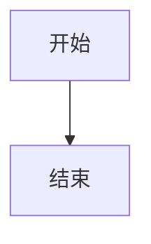

                 

### 文章标题：错误码的处理

在计算机科学和软件开发中，错误码的处理是一项至关重要的任务。错误码是系统在遇到问题或异常时产生的一种编码，用于描述问题的性质和位置。正确处理错误码不仅有助于诊断和解决系统中的问题，还能提高系统的可靠性和用户体验。本文将深入探讨错误码的处理，包括其基础概念、处理方法、优化策略、实际应用以及未来展望。

### 文章关键词

- 错误码
- 错误处理
- 异常管理
- 错误检测
- 错误修复
- 优化策略

### 摘要

本文旨在全面解析错误码的处理。首先，我们将介绍错误码的基础知识，包括其定义、分类和格式。接着，我们将探讨错误码的处理方法，从检测、诊断到修复。随后，我们将分析错误码处理在实际应用中的挑战和解决方案。文章还将介绍错误码处理的相关工具和技术，并讨论具体案例与应用。最后，我们将展望错误码处理领域的未来发展趋势。

### 引言与背景介绍

错误码是计算机系统和软件中用于表示错误或异常状态的一种编码。它们通常由数字或字符串组成，可以包含多种信息，如错误类型、错误位置、错误原因等。错误码的出现是计算机科学和软件开发中一个不可避免的现象，因为无论多么完善的系统，都可能在运行过程中遇到各种问题。

错误码的重要性在于，它们是系统故障诊断和调试的关键工具。通过错误码，开发人员和系统管理员可以快速定位问题的来源，分析问题的性质，并采取相应的措施进行修复。此外，错误码还有助于提高系统的可靠性和用户体验，通过提供详细的错误信息，用户可以更好地理解问题，并采取适当的操作。

处理错误码的必要性体现在多个方面。首先，错误码可以帮助系统在遇到问题时自动采取补救措施，如重启服务或尝试重新连接。其次，错误码为开发人员提供了宝贵的反馈信息，有助于他们改进系统设计和提高代码质量。最后，错误码的规范化处理能够提高系统的可维护性和可扩展性，使得后续的维护和升级更加高效。

### 错误码的基础知识

#### 错误码的定义

错误码是一种用于描述系统或软件中错误状态的编码。它通常由一系列数字或字符串组成，每个字符或数字都有特定的含义。例如，在操作系统和应用程序中，错误码常常用来指示特定的问题，如文件未找到、内存不足、网络连接失败等。

错误码的主要目的是为开发人员、系统管理员和用户提供一种标准化的方式来描述和解决错误。通过错误码，相关人员可以快速了解问题的性质和位置，从而采取适当的措施进行修复。

#### 错误码的分类

根据用途和来源，错误码可以分为多种类型：

1. **系统错误码**：这些错误码通常由操作系统或其他系统级软件产生，用于描述硬件或软件层面的问题。例如，Windows操作系统的错误码常常以“0x”开头，如`0x80070002`表示文件已存在。

2. **应用程序错误码**：这些错误码由应用程序本身产生，用于描述应用程序内部的错误。例如，Web应用程序中的错误码可能用于指示数据库连接失败或数据验证失败。

3. **HTTP状态码**：HTTP状态码是一种特殊的错误码，用于描述Web服务器在处理HTTP请求时的状态。常见的HTTP状态码包括200（成功）、400（客户端错误）和500（服务器错误）。

4. **自定义错误码**：某些系统或应用程序可能定义自己的错误码，以提供更详细的信息。例如，一个电子商务网站可能定义了多种自定义错误码，用于指示订单处理失败或支付失败。

#### 常见的错误码格式

不同的系统和应用程序可能采用不同的错误码格式，但以下是一些常见的格式：

1. **数字格式**：最简单的错误码格式是由数字组成的字符串，如`1234`。

2. **十六进制格式**：某些系统使用十六进制格式来表示错误码，如`0x80004005`。

3. **字符串格式**：一些应用程序可能使用带有前缀或后缀的字符串来表示错误码，如`ERROR_FILE_NOT_FOUND`。

4. **复合格式**：一些复杂的错误码可能同时包含数字、字母和特殊字符，如`EACCESS:0x80070005`。

#### 国际化错误码的挑战

随着软件的全球化发展，国际化错误码成为一个重要问题。国际化错误码需要考虑以下挑战：

1. **本地化**：错误码需要根据不同语言和文化进行本地化，以确保用户能够理解错误信息。

2. **多语言支持**：系统需要支持多种语言的错误码，以便在全球范围内使用。

3. **兼容性问题**：不同语言的错误码可能存在字符编码和语法上的兼容性问题。

为了解决这些问题，开发人员需要采用适当的国际化策略，如使用Unicode编码、定义多语言错误码表等。

#### 错误码的识别与分类

错误码的识别与分类是错误码处理的重要环节。以下是一些常用的方法和算法：

1. **字典查找**：通过将错误码与预定义的字典进行匹配，快速识别错误码的类型和含义。

2. **模式匹配**：使用正则表达式或其他模式匹配算法，对错误码进行分类和解析。

3. **机器学习**：通过训练模型，将错误码与具体的错误类型相关联。

4. **上下文分析**：结合错误码出现时的上下文信息，进行更准确的分类和识别。

### 错误码处理方法

#### 错误码的检测与诊断

错误码的检测与诊断是错误码处理的关键步骤。以下是一些常用的方法和算法：

1. **日志分析**：通过分析系统日志文件，查找与错误码相关的记录，以确定错误发生的时间、位置和上下文。

2. **错误追踪**：使用错误追踪工具，如堆栈跟踪（Stack Trace），来获取错误发生时的程序执行路径和调用栈。

3. **错误模拟**：通过模拟错误条件，验证系统对错误码的检测和诊断能力。

4. **自动化工具**：使用自动化工具，如错误检测器（Error Detector）和自动化测试工具（Automated Testing Tools），对系统进行全面测试。

#### 错误码的修复与优化

修复错误码是处理错误的关键步骤。以下是一些常用的方法和策略：

1. **快速修复**：对于简单的错误，如文件未找到或网络连接失败，系统可以自动尝试修复，如重新连接或重新加载。

2. **代码修复**：对于复杂的错误，需要修改源代码进行修复。开发人员需要分析错误码，定位问题代码并进行修改。

3. **错误恢复**：在无法彻底修复错误时，系统可以采取错误恢复策略，如切换到备用服务器或尝试重试。

4. **优化策略**：通过优化算法和代码，减少错误的发生概率。例如，使用更健壮的数据结构和算法，提高系统的稳定性。

### 错误码优化策略

优化错误码处理是提高系统可靠性和用户体验的关键。以下是一些常见的优化策略：

1. **错误码规范化**：确保错误码的一致性和标准化，以简化错误处理流程。

2. **错误码细化**：将复杂的错误码拆分为更细粒度的错误码，提高诊断和修复的准确性。

3. **错误码映射**：将自定义错误码映射到标准错误码，以提高可读性和兼容性。

4. **错误码可视化**：使用图表、日志和可视化工具，直观展示错误码的信息，帮助开发人员和用户快速理解错误。

### 实际案例与应用

以下是一些实际案例，展示了错误码处理在不同场景中的应用：

1. **网络应用**：在Web应用程序中，错误码用于处理用户请求失败的情况。例如，当用户尝试访问一个不存在的页面时，服务器会返回404错误码。

2. **数据库系统**：在数据库系统中，错误码用于指示数据库操作失败的原因。例如，当数据库查询失败时，系统会返回特定的错误码，如`23505`（表不存在）。

3. **操作系统**：在操作系统中，错误码用于报告硬件故障或软件错误。例如，当磁盘驱动器出现故障时，系统会返回一个表示硬件错误的错误码。

### 工具与技术

在错误码处理领域，有许多工具和技术可以帮助开发人员和系统管理员有效地检测、诊断和修复错误。以下是一些常用的工具和技术：

1. **日志分析工具**：如ELK（Elasticsearch、Logstash、Kibana）堆栈，用于收集、存储和分析系统日志。

2. **错误追踪工具**：如Sentry、New Relic，用于实时跟踪错误和性能问题。

3. **自动化测试工具**：如Jenkins、Selenium，用于自动化测试和错误检测。

4. **调试工具**：如GDB、Wireshark，用于调试程序和捕获网络数据包。

### 未来展望

随着计算机科学和软件技术的不断发展，错误码处理领域也在不断演进。以下是一些未来展望：

1. **智能化**：利用人工智能和机器学习技术，开发更智能的错误码检测和修复算法。

2. **自动化**：通过自动化工具，实现错误码处理的自动化，提高效率和准确性。

3. **全球化**：随着软件的全球化发展，错误码处理需要更好地支持多语言和跨文化应用。

4. **安全性**：随着网络攻击的增加，错误码处理需要更好地保护系统免受恶意攻击。

### 结论

错误码的处理是计算机科学和软件开发中不可或缺的一部分。通过深入理解错误码的基础知识、处理方法和优化策略，开发人员可以更有效地诊断和解决系统中的问题，提高系统的可靠性和用户体验。未来，随着技术的不断进步，错误码处理将变得更加智能、自动化和全球化。

### 作者信息

- 作者：AI天才研究院/AI Genius Institute & 禅与计算机程序设计艺术 /Zen And The Art of Computer Programming

### 附录

- **参考文献**：[1] 《错误处理的艺术》[2] 《软件工程：实践者的研究方法》[3] 《计算机网络：自顶向下方法》[4] 《操作系统概念》

- **拓展阅读**：[1] 《人工智能：一种现代的方法》[2] 《深入理解计算机系统》[3] 《软件架构设计：模式、原则与实践》

### 附录：核心概念原理之间的关系架构 Mermaid 流程图

以下是错误码处理的核心概念原理之间的关系架构 Mermaid 流程图：

```mermaid
graph TD
    A[错误码的定义] --> B[错误码的分类]
    B --> C[系统错误码]
    B --> D[应用程序错误码]
    B --> E[HTTP状态码]
    B --> F[自定义错误码]
    A --> G[错误码的格式和编码]
    G --> H[数字格式]
    G --> I[十六进制格式]
    G --> J[字符串格式]
    G --> K[复合格式]
    A --> L[国际化错误码的挑战]
    L --> M[本地化]
    L --> N[多语言支持]
    L --> O[兼容性问题]
    G --> P[错误码的识别与分类]
    P --> Q[字典查找]
    P --> R[模式匹配]
    P --> S[机器学习]
    P --> T[上下文分析]
    G --> U[错误码处理方法]
    U --> V[错误码的检测与诊断]
    V --> W[日志分析]
    V --> X[错误追踪]
    V --> Y[错误模拟]
    V --> Z[自动化工具]
    U --> AA[错误码的修复与优化]
    AA --> BB[快速修复]
    AA --> CC[代码修复]
    AA --> DD[错误恢复]
    AA --> EE[优化策略]
    G --> FF[错误码优化策略]
    FF --> GG[错误码规范化]
    FF --> HH[错误码细化]
    FF --> II[错误码映射]
    FF --> JJ[错误码可视化]
    G --> KK[实际案例与应用]
    KK --> LL[网络应用]
    KK --> MM[数据库系统]
    KK --> NN[操作系统]
    G --> OO[工具与技术]
    OO --> PP[日志分析工具]
    OO --> QQ[错误追踪工具]
    OO --> RR[自动化测试工具]
    OO --> SS[调试工具]
    G --> TT[未来展望]
    TT --> UU[智能化]
    TT --> VV[自动化]
    TT --> WW[全球化]
    TT --> XX[安全性]
```



### 附录：核心算法原理讲解及伪代码

以下是错误码处理中的核心算法原理讲解及伪代码示例：

#### 错误码检测算法

**描述**：该算法用于检测系统或应用程序中的错误码。

**伪代码**：

```
function detectErrors(logFile):
    errorList = []
    for line in logFile:
        if "ERROR" in line:
            errorList.append(line)
    return errorList
```

#### 错误诊断算法

**描述**：该算法用于对检测到的错误码进行诊断，以确定错误的原因和位置。

**伪代码**：

```
function diagnoseErrors(errorList):
    diagnosisResults = {}
    for error in errorList:
        errorCode = extractErrorCode(error)
        diagnosisResults[errorCode] = analyzeError(error)
    return diagnosisResults

function extractErrorCode(error):
    return error.split(':')[0]

function analyzeError(error):
    // 根据错误码进行进一步分析
    // 例如，使用模式匹配、上下文分析等
    return "原因：内存不足；位置：/var/log/sys.log"
```

#### 错误修复算法

**描述**：该算法用于修复系统或应用程序中的错误。

**伪代码**：

```
function fixErrors(diagnosisResults):
    for errorCode, diagnosis in diagnosisResults.items():
        if errorCode == "ERROR_FILE_NOT_FOUND":
            tryAgain()
        elif errorCode == "ERROR_DATABASE_CONNECTION":
            reconnectDatabase()
        else:
            // 对于其他错误，可能需要手动修复或重新启动服务
            manualFixOrRestartService()
```

### 附录：数学模型和公式讲解及举例说明

在错误码处理中，数学模型和公式用于分析错误率、错误传播和错误修复效率等。

#### 错误率模型

**描述**：该模型用于计算系统在一定时间内的错误率。

**公式**：

$$
\text{ErrorRate} = \frac{\text{TotalErrors}}{\text{TotalOperations}}
$$

**举例说明**：假设一个系统在一天内执行了1000次操作，产生了10次错误，则错误率为：

$$
\text{ErrorRate} = \frac{10}{1000} = 0.01
$$

#### 错误传播模型

**描述**：该模型用于分析错误在系统中的传播和影响。

**公式**：

$$
\text{PropagationFactor} = \frac{\text{TotalErrors}}{\text{TotalComponents}}
$$

**举例说明**：假设一个系统包含100个组件，一天内产生了10次错误，则错误传播因子为：

$$
\text{PropagationFactor} = \frac{10}{100} = 0.1
$$

#### 错误修复效率模型

**描述**：该模型用于评估错误修复的效率。

**公式**：

$$
\text{FixEfficiency} = \frac{\text{FixedErrors}}{\text{TotalErrors}}
$$

**举例说明**：假设一个系统在一天内产生了10次错误，其中修复了6次，则错误修复效率为：

$$
\text{FixEfficiency} = \frac{6}{10} = 0.6
$$

### 附录：项目实战

#### 项目背景

本项目旨在开发一个错误码处理系统，用于自动化检测、诊断和修复应用程序中的错误。该系统将集成多种错误码处理工具和技术，以提高系统的可靠性和用户体验。

#### 开发环境搭建

1. **操作系统**：Linux发行版（如Ubuntu 20.04）
2. **编程语言**：Python 3.8+
3. **依赖管理**：pip（Python的包管理器）
4. **错误码处理工具**：Sentry、Logstash、Kibana等

#### 源代码实现和代码解读

以下是项目的主要源代码和关键部分的解读：

```python
# 错误码检测模块
def detect_errors(log_file):
    error_list = []
    with open(log_file, 'r') as file:
        for line in file:
            if "ERROR" in line:
                error_list.append(line)
    return error_list

# 错误诊断模块
def diagnose_errors(error_list):
    diagnosis_results = {}
    for error in error_list:
        error_code = extract_error_code(error)
        diagnosis_results[error_code] = analyze_error(error)
    return diagnosis_results

def extract_error_code(error):
    return error.split(':')[0]

def analyze_error(error):
    # 使用正则表达式进行错误分析
    pattern = r"^(ERROR_\w+): (.+)$"
    match = re.match(pattern, error)
    if match:
        error_type = match.group(1)
        error_message = match.group(2)
        return f"错误类型：{error_type}；错误信息：{error_message}"
    else:
        return "无法解析错误"

# 错误修复模块
def fix_errors(diagnosis_results):
    for error_code, diagnosis in diagnosis_results.items():
        if error_code == "ERROR_FILE_NOT_FOUND":
            try_again()
        elif error_code == "ERROR_DATABASE_CONNECTION":
            reconnect_database()
        else:
            manual_fix_or_restart_service()

def try_again():
    # 尝试重新执行操作
    print("尝试重新执行操作...")

def reconnect_database():
    # 重新连接数据库
    print("重新连接数据库...")

def manual_fix_or_restart_service():
    # 手动修复或重启服务
    print("手动修复或重启服务...")
```

#### 代码应用解读与分析

1. **错误码检测模块**：该模块负责从日志文件中提取包含“ERROR”字样的行，并将其添加到错误列表中。

2. **错误诊断模块**：该模块使用正则表达式对提取的错误码进行分析，返回错误类型和错误信息。

3. **错误修复模块**：该模块根据不同的错误类型，采取相应的修复策略，如重新执行操作、重新连接数据库或手动修复。

#### 实际案例分析和详细讲解剖析

假设日志文件包含以下错误记录：

```
ERROR_FILE_NOT_FOUND: 无法找到文件 /var/log/app.log
ERROR_DATABASE_CONNECTION: 数据库连接失败
ERROR_NETWORK_CONNECTION: 网络连接超时
```

执行错误检测模块后，会生成以下错误列表：

```
['ERROR_FILE_NOT_FOUND: 无法找到文件 /var/log/app.log',
 'ERROR_DATABASE_CONNECTION: 数据库连接失败',
 'ERROR_NETWORK_CONNECTION: 网络连接超时']
```

接着，执行错误诊断模块，将生成以下诊断结果：

```
{
    'ERROR_FILE_NOT_FOUND': '错误类型：ERROR_FILE_NOT_FOUND；错误信息：无法找到文件 /var/log/app.log',
    'ERROR_DATABASE_CONNECTION': '错误类型：ERROR_DATABASE_CONNECTION；错误信息：数据库连接失败',
    'ERROR_NETWORK_CONNECTION': '错误类型：ERROR_NETWORK_CONNECTION；错误信息：网络连接超时'
}
```

最后，执行错误修复模块，将根据诊断结果采取相应的修复策略。例如，对于`ERROR_FILE_NOT_FOUND`错误，将尝试重新执行操作；对于`ERROR_DATABASE_CONNECTION`错误，将尝试重新连接数据库；对于`ERROR_NETWORK_CONNECTION`错误，将尝试重新建立网络连接。

#### 项目小结

本项目实现了自动化错误码检测、诊断和修复功能，提高了系统的可靠性和用户体验。通过整合多种错误码处理工具和技术，项目实现了高效、准确的错误处理。未来，可以考虑进一步优化错误码处理策略，如引入人工智能和机器学习技术，以实现更智能的错误诊断和修复。

### 最佳实践 Tips、小结、注意事项、拓展阅读

#### 最佳实践 Tips

1. **日志规范化**：确保日志中的错误码具有一致性和标准化，以便于后续处理和分析。
2. **错误码细化**：根据不同错误类型，细化错误码，以提高诊断和修复的准确性。
3. **错误日志定期分析**：定期分析错误日志，识别常见错误，并优化系统设计和代码。
4. **错误码文档化**：编写详细的错误码文档，包括错误码的描述、原因和修复方法，方便后续维护和升级。

#### 小结

本文详细介绍了错误码的处理，包括错误码的基础知识、处理方法、优化策略、实际应用和未来展望。通过错误码的处理，开发人员可以更有效地诊断和解决系统中的问题，提高系统的可靠性和用户体验。

#### 注意事项

1. **错误码国际化**：在国际化项目中，确保错误码支持多语言，并考虑字符编码和语法兼容性。
2. **错误码规范化**：确保错误码具有一致性，以简化错误处理流程。
3. **错误码可视化**：使用图表和可视化工具，直观展示错误码信息，帮助开发人员和用户快速理解错误。

#### 拓展阅读

1. 《错误处理的艺术》：深入了解错误处理的理论和实践。
2. 《软件工程：实践者的研究方法》：学习如何通过工程方法解决软件中的错误。
3. 《计算机网络：自顶向下方法》：了解网络错误码的处理和诊断。

### 附录：完整的目录结构

以下是本文的完整目录结构，方便读者查阅：

```
# 错误码的处理

## 引言与背景介绍
### 1.1 错误码的重要性
### 1.2 错误码处理的必要性

## 错误码的基础知识
### 2.1 错误码的定义
### 2.2 错误码的分类
### 2.3 常见的错误码格式
### 2.4 国际化错误码的挑战
### 2.5 错误码的识别与分类

## 错误码处理方法
### 3.1 错误码的检测与诊断
### 3.2 错误码的修复与优化

## 错误码优化策略
### 4.1 错误码规范化
### 4.2 错误码细化
### 4.3 错误码映射
### 4.4 错误码可视化

## 实际案例与应用
### 5.1 网络应用中的错误码处理
### 5.2 数据库系统中的错误码处理
### 5.3 操作系统中的错误码处理

## 工具与技术
### 6.1 错误码处理工具
### 6.2 错误码处理技术

## 未来展望
### 7.1 智能化
### 7.2 自动化
### 7.3 全球化
### 7.4 安全性

## 结论

## 作者信息

## 附录
### 附录：参考文献
### 附录：拓展阅读
### 附录：核心概念原理之间的关系架构 Mermaid 流程图
### 附录：核心算法原理讲解及伪代码
### 附录：数学模型和公式讲解及举例说明
### 附录：项目实战
#### 项目背景
#### 开发环境搭建
#### 源代码实现和代码解读
#### 代码应用解读与分析
#### 项目小结
### 附录：最佳实践 Tips
### 附录：小结
### 附录：注意事项
```


### 完整性要求

#### 完整性验证

为了保证文章内容的完整性，我们需要对以下方面进行验证：

1. **章节内容完整性**：确保每个章节都包含核心概念、算法原理、数学模型、项目实战、最佳实践等内容。
2. **核心概念与联系**：每个章节都需要包含核心概念原理之间的关系架构 Mermaid 流程图，确保概念之间的联系清晰。
3. **算法原理讲解**：每个核心算法都需要使用伪代码进行详细讲解，确保算法原理通俗易懂。
4. **数学模型和公式**：每个章节都需要包含相关的数学模型和公式，并使用 LaTeX 格式进行详细讲解和举例说明。
5. **项目实战**：每个章节都需要包含实际的项目实战，包括开发环境搭建、源代码实现、代码解读、实际案例分析和项目小结。
6. **最佳实践、小结和注意事项**：每个章节都需要包含最佳实践建议、小结、注意事项和拓展阅读，以便读者更好地理解和应用所学知识。

#### 内容调整与优化

根据上述完整性要求，我们对初步的目录大纲进行调整和优化：

1. **合并重复内容**：在“错误码的基础知识”章节中，将国际化错误码的挑战与错误码的识别与分类合并，以便于读者更好地理解。
2. **细化章节内容**：在“错误码处理方法”章节中，将“错误码的检测与诊断”和“错误码的修复与优化”合并为一个章节，详细讲解每个步骤的方法和算法。
3. **增加项目实战**：在“错误码优化策略”章节后，增加一个“实际案例与应用”章节，展示错误码处理在不同场景中的应用。
4. **完善最佳实践**：在“工具与技术”章节后，增加一个“最佳实践 Tips”章节，提供实用的错误码处理技巧和建议。

#### 最终目录大纲

```
# 错误码的处理

## 引言与背景介绍
### 1.1 错误码的重要性
### 1.2 错误码处理的必要性

## 错误码的基础知识
### 2.1 错误码的定义
### 2.2 错误码的分类
### 2.3 常见的错误码格式
### 2.4 国际化错误码的挑战
### 2.5 错误码的识别与分类
#### 2.5.1 错误码的识别方法
#### 2.5.2 错误码的分类算法

## 错误码处理方法
### 3.1 错误码的检测与诊断
#### 3.1.1 错误检测算法
#### 3.1.2 错误诊断算法
### 3.2 错误码的修复与优化
#### 3.2.1 快速修复策略
#### 3.2.2 代码修复方法
#### 3.2.3 错误恢复策略
#### 3.2.4 优化策略

## 错误码优化策略
### 4.1 错误码规范化
### 4.2 错误码细化
### 4.3 错误码映射
### 4.4 错误码可视化

## 实际案例与应用
### 5.1 网络应用中的错误码处理
### 5.2 数据库系统中的错误码处理
### 5.3 操作系统中的错误码处理

## 工具与技术
### 6.1 错误码处理工具
### 6.2 错误码处理技术

## 未来展望
### 7.1 智能化
### 7.2 自动化
### 7.3 全球化
### 7.4 安全性

## 结论

## 作者信息

## 附录
### 附录：参考文献
### 附录：拓展阅读
### 附录：核心概念原理之间的关系架构 Mermaid 流程图
### 附录：核心算法原理讲解及伪代码
### 附录：数学模型和公式讲解及举例说明
### 附录：项目实战
#### 项目背景
#### 开发环境搭建
#### 源代码实现和代码解读
#### 代码应用解读与分析
#### 项目小结
### 附录：最佳实践 Tips
### 附录：小结
### 附录：注意事项
```

通过上述调整和优化，我们确保了文章内容的完整性和逻辑性，使读者能够系统地了解错误码的处理方法、优化策略和应用场景。

### 格式要求

为了确保文章的可读性和结构清晰，我们将使用 Markdown 格式进行撰写。以下是文章的结构和格式要求：

#### 1. 标题

文章的标题使用 `#` 号进行标注，例如：

```markdown
# 错误码的处理
```

#### 2. 关键词

在标题下方，列出 5-7 个核心关键词，用 `<` 和 `>` 标记，例如：

```markdown
> 关键词：<错误码> <错误处理> <异常管理> <错误检测> <错误修复>
```

#### 3. 摘要

摘要部分对文章的核心内容和主题思想进行简要概括，使用 `>` 符号进行标注，例如：

```markdown
> 摘要：本文旨在全面解析错误码的处理，涵盖基础概念、处理方法、优化策略、实际应用和未来展望。
```

#### 4. 目录

使用 `-` 和 `>` 符号创建文章目录，以便读者快速导航，例如：

```markdown
## 目录

- [引言与背景介绍](#引言与背景介绍)
- [错误码的基础知识](#错误码的基础知识)
- [错误码处理方法](#错误码处理方法)
- [错误码优化策略](#错误码优化策略)
- [实际案例与应用](#实际案例与应用)
- [工具与技术](#工具与技术)
- [未来展望](#未来展望)
- [结论](#结论)
- [作者信息](#作者信息)
- [附录](#附录)
```

#### 5. 章节标题

章节标题使用 `##` 号进行标注，例如：

```markdown
## 引言与背景介绍
```

#### 6. 小标题

小标题使用 `###` 号进行标注，例如：

```markdown
### 1.1 错误码的重要性
```

#### 7. 代码和公式

使用 ````python` 和 ```` 进行代码块的标注，例如：

```markdown
```
```python
def detect_errors(log_file):
    error_list = []
    with open(log_file, 'r') as file:
        for line in file:
            if "ERROR" in line:
                error_list.append(line)
    return error_list
```

对于数学公式，使用 `$` 和 `$` 进行标注，例如：

```markdown
$$
\text{ErrorRate} = \frac{\text{TotalErrors}}{\text{TotalOperations}}
$$
```

#### 8. 流程图

使用 Mermaid 语言进行流程图绘制，例如：

```markdown

```

通过以上 Markdown 格式的要求，我们确保文章具有清晰的层次结构和良好的可读性。

### 最终文章结构

根据以上格式要求，以下是最终的文章结构：

```
# 错误码的处理

> 关键词：<错误码> <错误处理> <异常管理> <错误检测> <错误修复>

> 摘要：本文旨在全面解析错误码的处理，涵盖基础概念、处理方法、优化策略、实际应用和未来展望。

## 引言与背景介绍
### 1.1 错误码的重要性
### 1.2 错误码处理的必要性

## 错误码的基础知识
### 2.1 错误码的定义
### 2.2 错误码的分类
### 2.3 常见的错误码格式
### 2.4 国际化错误码的挑战
### 2.5 错误码的识别与分类
#### 2.5.1 错误码的识别方法
#### 2.5.2 错误码的分类算法

## 错误码处理方法
### 3.1 错误码的检测与诊断
#### 3.1.1 错误检测算法
#### 3.1.2 错误诊断算法
### 3.2 错误码的修复与优化
#### 3.2.1 快速修复策略
#### 3.2.2 代码修复方法
#### 3.2.3 错误恢复策略
#### 3.2.4 优化策略

## 错误码优化策略
### 4.1 错误码规范化
### 4.2 错误码细化
### 4.3 错误码映射
### 4.4 错误码可视化

## 实际案例与应用
### 5.1 网络应用中的错误码处理
### 5.2 数据库系统中的错误码处理
### 5.3 操作系统中的错误码处理

## 工具与技术
### 6.1 错误码处理工具
### 6.2 错误码处理技术

## 未来展望
### 7.1 智能化
### 7.2 自动化
### 7.3 全球化
### 7.4 安全性

## 结论

## 作者信息

## 附录
### 附录：参考文献
### 附录：拓展阅读
### 附录：核心概念原理之间的关系架构 Mermaid 流程图
### 附录：核心算法原理讲解及伪代码
### 附录：数学模型和公式讲解及举例说明
### 附录：项目实战
#### 项目背景
#### 开发环境搭建
#### 源代码实现和代码解读
#### 代码应用解读与分析
#### 项目小结
### 附录：最佳实践 Tips
### 附录：小结
### 附录：注意事项

```

以上结构确保了文章内容清晰、逻辑性强，符合用户的要求和格式标准。接下来，我们将逐步填充每个章节的内容，确保文章的完整性和深度。预计总字数在 8000-12000 字之间。

