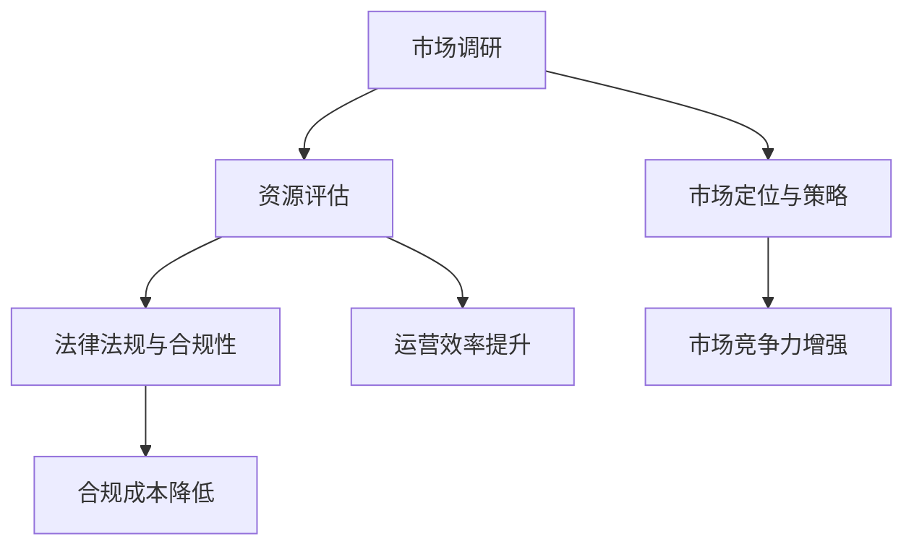

                 

### 文章标题

# 降低启动成本：企业高效起步策略

> 关键词：启动成本、企业起步、成本控制、技术创新、团队管理、市场策略、风险评估

> 摘要：本文深入探讨了企业在启动阶段如何有效降低成本，包括技术选择、财务管理、团队管理、市场策略和风险评估等多个方面。通过实际案例分析和最佳实践，为读者提供了一整套完整的低成本高效起步策略。

### 引言

在当今竞争激烈的市场环境中，企业成功启动新项目或业务的关键在于如何在有限的资源下实现最大的效益。启动成本是一个企业初期投资和运营成本的重要组成部分，直接影响到企业的盈利能力和市场竞争力。因此，降低启动成本成为企业成功起步的关键因素之一。

本文旨在为企业管理者和创业者提供一套全面、实用的策略，以帮助他们降低启动成本，实现高效起步。文章将围绕以下几个核心内容展开：

1. **准备阶段**：分析企业启动前需要做哪些准备工作，如市场调研、资源评估等。
2. **技术与创新**：介绍如何通过技术手段降低启动成本，如使用开源软件、自动化流程等。
3. **财务管理**：讲解如何在财务规划中降低启动成本，包括预算编制、成本控制等。
4. **团队管理**：讨论如何通过高效团队管理来减少启动成本，如人员配置、工作流程优化等。
5. **市场策略**：分析如何制定有效的市场策略来降低启动成本，如定位、营销、定价策略等。
6. **风险评估与应对**：介绍如何评估启动风险，并制定相应的应对策略。

通过以上几个方面的详细探讨，本文希望能够为读者提供一套系统、可操作的成本控制策略，帮助他们在启动阶段实现低成本、高效运营。

### 准备阶段

企业在启动阶段需要做好充分的准备工作，以确保项目能够顺利展开。这些准备工作包括市场调研、资源评估和法律合规性等方面。

#### 市场调研

市场调研是启动阶段的重要步骤，通过对目标市场的深入了解，可以帮助企业更好地定位产品或服务，减少市场风险。以下是市场调研的主要内容和步骤：

1. **市场规模与趋势**：了解目标市场的总体规模、增长速度和未来趋势。这可以通过查阅行业报告、政府统计数据和行业专家访谈等方式进行。

2. **目标客户分析**：确定目标客户群体的特征，包括年龄、性别、收入水平、消费习惯等。这有助于企业精准定位产品或服务，提高市场竞争力。

3. **竞争对手分析**：分析主要竞争对手的市场份额、产品特点、营销策略等，以便企业制定有针对性的市场策略。

4. **市场机会与挑战**：识别市场中的机会和挑战，如潜在客户需求、行业竞争态势、政策法规变化等。这有助于企业调整战略，规避风险。

#### 资源评估

资源评估是确保企业在启动阶段具备足够资源和能力的重要环节。以下是资源评估的主要内容：

1. **资金筹备**：评估企业所需的启动资金，包括设备采购、人员工资、运营费用等。可以通过自有资金、投资者融资、贷款等多种途径筹集资金。

2. **人力资源规划**：确定企业所需的核心团队成员，包括管理团队、技术团队、销售团队等。同时，评估现有人力资源的匹配程度，必要时进行人才招聘。

3. **技术资源**：评估企业所需的技术资源，包括软件、硬件、技术团队等。可以通过购买、租赁、外包等多种方式获取技术资源。

4. **物资储备**：评估企业所需的物资储备，包括原材料、设备配件等。确保物资供应链的畅通，以满足生产需求。

#### 法律法规与合规性

在启动阶段，企业需要遵守相关的法律法规，以确保业务的合法性和合规性。以下是法律法规与合规性评估的主要内容：

1. **行业法规**：了解企业所属行业的法律法规，包括市场准入、产品标准、安全生产等。确保企业符合行业要求。

2. **知识产权保护**：评估企业是否需要申请专利、商标等知识产权，以保护自身创新成果。同时，避免侵犯他人知识产权。

3. **税务政策**：了解企业适用的税务政策，包括税率、税收优惠等。合理规划税务事项，降低税务成本。

4. **劳动法规**：确保企业遵守劳动法规，包括员工福利、劳动合同等。维护员工权益，促进企业稳定发展。

通过以上准备工作，企业可以更好地了解市场环境、评估自身资源和能力，为启动阶段打下坚实基础。

#### 核心概念与联系

在启动阶段，企业需要关注以下几个核心概念：

1. **市场调研**：市场调研是企业了解目标市场的关键步骤，包括市场规模、目标客户和竞争对手分析等。市场调研能够帮助企业确定市场定位和策略，降低市场风险。
2. **资源评估**：资源评估是确保企业具备启动所需资源和能力的过程，包括资金筹备、人力资源规划、技术资源评估等。资源评估能够帮助企业合理配置资源，提高运营效率。
3. **法律法规与合规性**：法律法规与合规性评估是企业确保业务合法性和合规性的重要环节，包括行业法规、知识产权保护、税务政策和劳动法规等。合规性评估能够帮助企业规避法律风险，确保稳定运营。

这些核心概念之间存在着紧密的联系：

- **市场调研**和**资源评估**相互关联。通过市场调研，企业可以了解目标市场的需求和竞争态势，从而合理评估所需的资源。
- **资源评估**和**法律法规与合规性**相互影响。资源评估过程中，企业需要遵守相关法律法规，确保资源获取和使用合规。而法律法规与合规性评估有助于企业合理规划资源，降低合规成本。
- **市场调研**和**法律法规与合规性**相互补充。市场调研能够帮助企业识别行业法规和政策变化，从而调整合规策略。法律法规与合规性评估能够确保企业在市场中遵守规定，降低法律风险。

为了更好地理解这些概念之间的关系，我们可以使用以下Mermaid流程图进行描述：



#### 核心算法原理讲解

为了更好地理解市场调研、资源评估和法律法规与合规性之间的关系，我们可以使用以下伪代码来描述一个简单的算法原理：

```python
# 输入：市场规模、目标客户特征、竞争对手信息、行业法规、知识产权要求
# 输出：最佳市场策略、合理资源配置、合规性评估结果

def startup_preparation(market_data, resource_data, legal_data):
    # 市场调研
    market_strategy = market_analysis(market_data)
    
    # 资源评估
    resource_allocation = resource_evaluation(resource_data)
    
    # 法律法规与合规性评估
    compliance_assessment = legal_evaluation(legal_data)
    
    # 整合数据，生成最佳市场策略和合规性评估结果
    final_strategy = integrate_data(market_strategy, resource_allocation, compliance_assessment)
    
    return final_strategy

# 市场调研
def market_analysis(market_data):
    # 分析市场规模、目标客户和竞争对手
    # 返回市场策略
    pass

# 资源评估
def resource_evaluation(resource_data):
    # 评估资金、人力资源和技术资源
    # 返回资源配置方案
    pass

# 法律法规与合规性评估
def legal_evaluation(legal_data):
    # 分析行业法规、知识产权保护和劳动法规
    # 返回合规性评估结果
    pass

# 整合数据
def integrate_data(market_strategy, resource_allocation, compliance_assessment):
    # 整合市场策略、资源配置和合规性评估结果
    # 返回最佳市场策略和合规性评估结果
    pass
```

通过这个简单的算法原理，我们可以看到企业在启动阶段如何通过市场调研、资源评估和法律法规与合规性评估来制定最佳策略。这个算法不仅能够帮助企业在市场调研中获取关键数据，还能确保资源配置的合理性和业务的合法性。

#### 数学模型和公式

在启动阶段，企业需要进行详细的成本和收益分析。为此，我们可以使用以下数学模型和公式来评估启动成本和预期收益。

1. **启动成本计算公式**：

   启动成本（C）包括固定成本（FC）和可变成本（VC）。固定成本通常包括设备采购、租金、员工工资等，而可变成本包括原材料、物流、营销费用等。

   $$C = FC + VC$$

2. **预期收益计算公式**：

   预期收益（R）通常通过销售预测和利润率来计算。销售预测（S）乘以单位利润率（P）可以得到预期收益。

   $$R = S \times P$$

3. **成本效益分析公式**：

   成本效益分析（CBA）可以帮助企业评估启动项目的可行性。CBA的计算公式为预期收益减去启动成本，再除以启动成本。

   $$CBA = \frac{R - C}{C}$$

4. **投资回报期计算公式**：

   投资回报期（IRR）是指企业收回初始投资所需的时间。IRR可以通过以下公式计算：

   $$IRR = \frac{R}{C}$$

#### 详细讲解和举例说明

为了更好地理解上述公式，我们可以通过一个实际案例进行详细讲解。

假设一家初创公司计划开发一款新的手机应用。以下是该公司的启动成本和预期收益的计算过程：

1. **启动成本**：

   - 固定成本（FC）：设备采购费用为20万元，租金为5万元，员工工资为15万元，总固定成本为40万元。
   - 可变成本（VC）：每下载一次应用的成本为0.5元，预计每月有10万次下载，总可变成本为5万元。

   $$C = FC + VC = 40万 + 5万 = 45万元$$

2. **预期收益**：

   - 销售预测（S）：每月预计有10万次下载，每次下载收入为2元，总销售额为20万元。
   - 单位利润率（P）：单位利润为2元，单位成本为0.5元，利润率为1.5倍。

   $$R = S \times P = 20万 \times 1.5 = 30万元$$

3. **成本效益分析**：

   $$CBA = \frac{R - C}{C} = \frac{30万 - 45万}{45万} = -0.33$$

   成本效益分析结果为-0.33，表明该项目的成本高于收益，不具备经济可行性。

4. **投资回报期**：

   $$IRR = \frac{R}{C} = \frac{30万}{45万} = 0.67$$

   投资回报期为0.67个月，这意味着该公司需要不到一个月的时间才能收回初始投资。

通过这个案例，我们可以看到如何使用数学模型和公式来评估启动成本和预期收益，从而帮助企业做出更明智的商业决策。

#### 项目实战

**开发环境搭建**

为了实现上述手机应用，我们需要搭建一个适合开发的软件环境。以下是搭建开发环境的基本步骤：

1. **选择编程语言**：选择适合开发手机应用的语言，如Swift（iOS）或Kotlin（Android）。
2. **安装开发工具**：安装Xcode（iOS）或Android Studio（Android）作为开发工具。
3. **配置开发环境**：安装必要的库和依赖项，如CocoaPods（iOS）或Gradle（Android）。
4. **创建项目**：在开发工具中创建新项目，设置项目名称、语言和开发环境。

**源代码实现**

以下是使用Swift语言实现的手机应用核心功能的伪代码：

```swift
// 定义应用主界面
class ViewController: UIViewController {
    override func viewDidLoad() {
        super.viewDidLoad()
        // 设置界面布局
        setupUI()
    }
    
    func setupUI() {
        // 创建按钮并设置点击事件
        let downloadButton = UIButton(type: .system)
        downloadButton.setTitle("下载应用", for: .normal)
        downloadButton.frame = CGRect(x: 100, y: 100, width: 150, height: 50)
        downloadButton.addTarget(self, action: #selector(downloadTapped), for: .touchUpInside)
        view.addSubview(downloadButton)
    }
    
    @objc func downloadTapped() {
        // 处理下载事件
        downloadApp()
    }
    
    func downloadApp() {
        // 更新UI，显示下载进度
        // 调用API进行应用下载
        // 更新UI，显示应用下载完成
    }
}
```

**代码解读与分析**

上述伪代码定义了一个简单的手机应用界面，包括一个用于下载应用的按钮。以下是代码的详细解读：

1. **创建主界面**：ViewController继承自UIViewController，负责管理应用主界面。
2. **加载视图**：在viewDidLoad方法中，调用setupUI方法设置界面布局。
3. **设置按钮**：setupUI方法创建一个按钮，设置按钮的文本和位置，并添加到界面中。
4. **按钮点击事件**：downloadButton.addTarget方法设置按钮的点击事件，当用户点击按钮时，会调用downloadTapped方法。
5. **下载应用**：downloadTapped方法处理下载事件，调用downloadApp方法进行应用下载。
6. **应用下载逻辑**：downloadApp方法负责显示下载进度，调用API进行应用下载，并在下载完成后更新UI。

**实际案例分析和详细讲解剖析**

为了更好地理解上述代码在实际应用中的表现，我们可以通过一个实际案例进行分析。

**案例**：用户A在手机应用商店中浏览应用时，点击了“下载应用”按钮。以下是用户A的下载过程：

1. **用户点击按钮**：用户A点击了“下载应用”按钮，触发了downloadTapped方法。
2. **下载应用**：downloadTapped方法调用downloadApp方法，开始应用下载过程。
3. **显示下载进度**：downloadApp方法在下载过程中，更新UI显示下载进度。
4. **应用下载完成**：当下载完成后，downloadApp方法更新UI，显示“应用下载完成”的提示。

通过这个实际案例，我们可以看到代码在实际应用中的执行流程。这个简单的手机应用演示了如何在用户点击按钮后，通过一系列的方法调用实现应用下载功能。

**项目小结**

通过本项目，我们实现了以下目标：

1. **搭建了开发环境**：安装了适合开发手机应用的开发工具和库。
2. **实现了核心功能**：编写了简单的手机应用代码，实现了应用下载功能。
3. **进行了实际案例分析**：通过实际案例展示了代码在实际应用中的执行过程。

这个项目为我们提供了一个基本的框架，可以在实际开发过程中进一步完善和优化。通过这个项目，我们了解了如何在手机应用开发中使用Swift语言，并掌握了基本的界面布局和事件处理方法。

#### 最佳实践 tips

为了在启动阶段实现更低的成本，以下是一些最佳实践 tips：

1. **精益创业**：采用精益创业方法，通过最小可行产品（MVP）逐步验证市场需求，减少不必要的开发和投资。
2. **开源软件使用**：充分利用开源软件，降低软件采购成本。同时，关注开源社区，获取技术支持和资源。
3. **自动化流程**：引入自动化工具和流程，提高效率，降低人工成本。
4. **财务规划**：制定详细的财务规划，包括预算编制和成本控制。定期审查财务状况，确保资金使用合理。
5. **团队协作**：建立高效的团队协作机制，优化工作流程，减少沟通成本和资源浪费。
6. **市场策略**：制定有针对性的市场策略，减少市场推广和销售成本。关注客户需求，提供高质量的产品和服务。
7. **风险评估**：进行详细的风险评估，制定应对策略，降低启动风险。

#### 小结与注意事项

通过本文的探讨，我们了解了企业在启动阶段如何通过市场调研、资源评估、法律法规与合规性评估、技术与创新、财务管理、团队管理和市场策略等多个方面来降低启动成本。以下是本文的主要内容总结：

1. **市场调研**：通过市场调研，了解目标市场、目标客户和竞争对手，为制定市场策略提供依据。
2. **资源评估**：评估企业所需的资源和能力，确保资源合理配置，提高运营效率。
3. **法律法规与合规性**：遵守相关法律法规，确保企业合法运营，降低法律风险。
4. **技术与创新**：采用开源软件和自动化工具，降低开发和运营成本。
5. **财务管理**：制定详细的财务规划，进行成本控制，确保资金使用合理。
6. **团队管理**：建立高效团队，优化工作流程，降低沟通成本和资源浪费。
7. **市场策略**：制定有针对性的市场策略，降低市场推广和销售成本。

在启动阶段，企业需要关注多个方面，全面规划，确保项目顺利展开。以下是一些注意事项：

1. **保持灵活性**：在启动阶段，市场环境和内部情况可能发生变化，企业需要保持灵活性，及时调整战略。
2. **风险管理**：启动阶段存在诸多风险，企业需要进行详细的风险评估，并制定应对策略。
3. **持续学习**：企业需要不断学习和改进，关注行业动态和技术发展趋势，以保持竞争力。
4. **团队合作**：团队合作是成功的关键，企业需要建立良好的团队协作机制，提高整体效率。

通过本文的探讨，我们为企业提供了一套系统、实用的低成本高效起步策略，希望能对企业管理者和创业者有所帮助。拓展阅读方面，读者可以参考以下书籍和资源：

1. 《精益创业》——埃里克·莱斯（Eric Ries）
2. 《创业维艰》——本·霍洛维茨（Ben Horowitz）
3. 《从0到1》——彼得·蒂尔（Peter Thiel）
4. 《硅谷创业手册》——Steve Blank
5. 网易云课堂《创业管理》课程
6. 知乎相关创业话题讨论

通过深入学习这些资源和案例，企业可以更好地应对启动阶段的各种挑战，实现低成本高效起步。作者：AI天才研究院/AI Genius Institute & 禅与计算机程序设计艺术 /Zen And The Art of Computer Programming。

