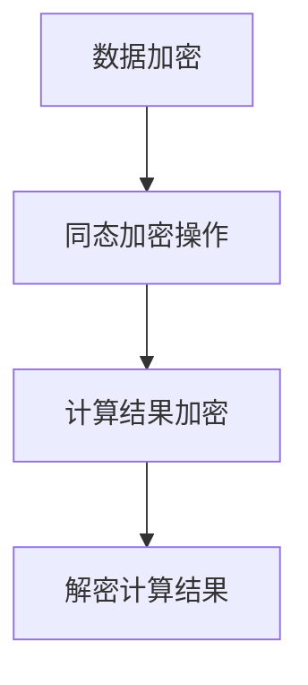
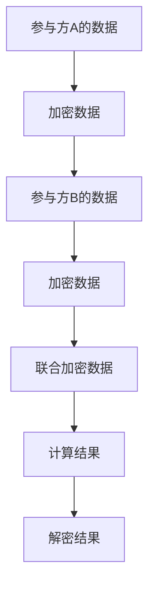
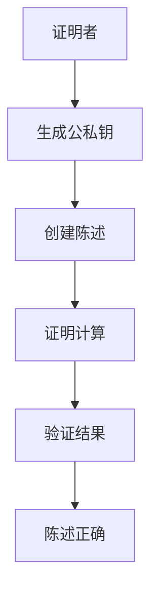
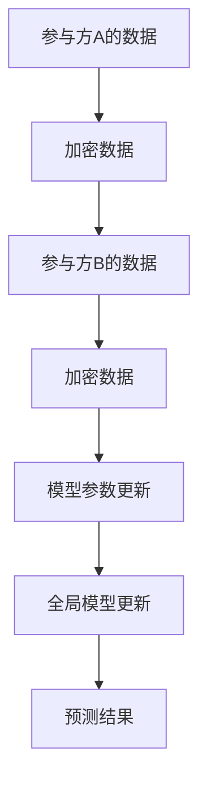

                 


### 文章标题：隐私计算：在保护隐私的同时进行数据分析

隐私计算作为现代信息技术的关键领域，旨在解决在数据共享和数据分析过程中如何保护个人隐私的问题。在数据爆炸的时代，个人隐私保护成为了一个迫切需要解决的问题。本文将系统地介绍隐私计算的核心概念、原理和技术，并通过具体的算法和实例分析，探讨如何在确保数据安全的同时进行有效的数据分析。

> 关键词：隐私计算，同态加密，安全多方计算，零知识证明，安全联邦学习，数据安全

### 摘要

本文首先介绍了隐私计算的定义、背景以及其在现代社会中的重要性。随后，文章详细阐述了隐私计算的核心概念，包括同态加密、安全多方计算、零知识证明和联邦学习。接着，通过对同态加密和安全多方计算等技术的深入分析，揭示了这些技术的数学原理、算法机制及其应用场景。最后，文章结合实际案例，展示了隐私计算在金融、医疗和零售等行业的应用，并探讨了隐私计算的挑战与未来发展方向。

### 第1章：隐私计算概述

#### 1.1 隐私计算的定义

隐私计算是指一系列旨在保护个人数据隐私的技术和方法，这些技术允许在确保数据隐私的前提下进行数据共享和数据分析。传统的数据保护方法往往依赖于数据脱敏或数据加密，但这些方法可能无法完全防止数据泄露或滥用。

#### 1.2 隐私计算的背景

随着互联网和大数据技术的发展，个人数据的收集、存储和分析变得日益普遍。然而，数据泄露、隐私侵犯等问题也层出不穷。隐私计算应运而生，旨在解决这一难题。

#### 1.3 隐私计算的挑战与机遇

隐私计算面临着数据安全、性能、可扩展性等多方面的挑战。同时，它也为数据科学、人工智能等领域带来了新的机遇。

#### 1.4 隐私计算的核心概念

隐私计算的核心概念包括：

- 同态加密：允许对加密数据执行计算，而无需解密。
- 安全多方计算：允许多个方在不泄露各自数据的情况下共同计算结果。
- 零知识证明：证明某个陈述是正确的，而不透露任何相关信息。
- 安全联邦学习：多个参与方共同训练机器学习模型，而不交换原始数据。

#### 1.5 隐私计算的技术分类

隐私计算的技术可以大致分为以下几类：

- 同态加密技术
- 安全多方计算技术
- 零知识证明技术
- 安全联邦学习技术

### 第2章：同态加密技术原理

#### 2.1 同态加密的基本概念

同态加密是一种加密技术，它允许对加密数据执行计算，而无需解密。这意味着计算可以以加密的形式进行，从而确保数据的隐私。

#### 2.2 同态加密的数学原理

同态加密依赖于一些数学原理，如伪随机数生成、离散对数问题、椭圆曲线加密等。

#### 2.3 同态加密算法

常见的同态加密算法包括Safeguard机制、YASHE协议和Squid协议。

#### 2.4 同态加密应用案例

同态加密在零知识证明系统和安全多方计算系统中得到了广泛应用。

### Mermaid 流程图

下面是同态加密的流程图：



### 2.5 同态加密的伪代码

```plaintext
// 同态加密伪代码
function homomorphicEncryption(data, key):
    encryptedData = encrypt(data, key)
    return encryptedData

// 同态加密操作
function homomorphicOperation(encryptedData1, encryptedData2, operation):
    encryptedResult = encrypt(operation(plaintextData1, plaintextData2), key)
    return encryptedResult

// 解密计算结果
function decryptResult(encryptedResult, key):
    result = decrypt(encryptedResult, key)
    return result
```

### 第3章：安全多方计算原理

#### 3.1 安全多方计算的定义

安全多方计算是一种允许多个参与方在不泄露各自数据的情况下共同计算结果的技术。

#### 3.2 安全多方计算协议

常见的安全多方计算协议包括SecureCom协议、FHEC协议和KoKu协议。

#### 3.3 安全多方计算算法

安全多方计算算法包括SecureCom算法、FHEC算法和KoKu算法。

#### 3.4 安全多方计算应用案例

安全多方计算在隐私数据共享和隐私交易等领域有着广泛的应用。

### Mermaid 流程图

下面是安全多方计算的流程图：



### 3.5 安全多方计算的伪代码

```plaintext
// 安全多方计算伪代码
function secureComputation(data1, data2, key):
    encryptedData1 = encrypt(data1, key)
    encryptedData2 = encrypt(data2, key)
    encryptedResult = secureOperation(encryptedData1, encryptedData2, key)
    result = decrypt(encryptedResult, key)
    return result

// 安全多方计算操作
function secureOperation(encryptedData1, encryptedData2, key):
    // 实现具体的计算逻辑
    encryptedResult = encrypt(result, key)
    return encryptedResult
```

### 第4章：零知识证明技术原理

#### 4.1 零知识证明的定义

零知识证明是一种允许一方（证明者）向另一方（验证者）证明某个陈述是正确的，而无需透露任何相关信息的技术。

#### 4.2 零知识证明的数学原理

零知识证明依赖于一些数学原理，如演算树证明、快速随机验证和高斯消元法。

#### 4.3 零知识证明算法

常见的零知识证明算法包括Bulletproof证明、zk-SNARK证明和zk-STARK证明。

#### 4.4 零知识证明应用案例

零知识证明在智能合约和隐私支付等领域有着重要的应用。

### Mermaid 流程图

下面是零知识证明的流程图：



### 4.5 零知识证明的伪代码

```plaintext
// 零知识证明伪代码
function zeroKnowledgeProof(statement, publicKey):
    // 生成公私钥
    privateKey = generatePrivateKey()
    publicKey = generatePublicKey(privateKey)

    // 创建陈述
    claim = createClaim(statement)

    // 证明计算
    proof = prove(claim, privateKey)

    // 验证结果
    result = verifyProof(proof, publicKey)

    return result
```

### 第5章：安全联邦学习原理

#### 5.1 安全联邦学习的定义

安全联邦学习是一种分布式机器学习技术，它允许多个参与方在不共享原始数据的情况下共同训练模型。

#### 5.2 安全联邦学习的架构

安全联邦学习的架构可以分为单向联邦学习、双向联邦学习和对称联邦学习。

#### 5.3 安全联邦学习算法

常见的安全联邦学习算法包括SecureFL算法、FLETS算法和FedAvg算法。

#### 5.4 安全联邦学习应用案例

安全联邦学习在医疗数据共享和智能交通系统等领域有着广泛的应用。

### Mermaid 流程图

下面是安全联邦学习的流程图：



### 5.5 安全联邦学习的伪代码

```plaintext
// 安全联邦学习伪代码
function secureFedLearning(data1, data2, model):
    encryptedData1 = encrypt(data1, key)
    encryptedData2 = encrypt(data2, key)
    
    // 模型参数更新
    updatedParams = federatedUpdate(model, encryptedData1, encryptedData2)
    
    // 全局模型更新
    globalModel = updateGlobalModel(updatedParams)
    
    // 预测结果
    prediction = predict(globalModel, newData)
    
    return prediction
```

### 第6章：隐私计算在行业中的应用

#### 6.1 隐私计算在金融行业的应用

在金融行业，隐私计算可以用于风险评估、客户隐私保护和信用评分等方面。

#### 6.2 隐私计算在医疗行业的应用

在医疗行业，隐私计算可以用于医疗数据共享、医疗智能诊断和患者隐私保护等方面。

#### 6.3 隐私计算在零售行业的应用

在零售行业，隐私计算可以用于客户数据分析、个性化推荐和供应链优化等方面。

### 第7章：隐私计算的挑战与未来展望

#### 7.1 隐私计算的挑战

隐私计算面临的挑战包括性能瓶颈、可扩展性、安全性和法规与政策等方面。

#### 7.2 隐私计算的未来发展趋势

隐私计算的未来发展趋势包括新算法的研究、跨行业合作和标准化与法规等方面。

### 作者信息

作者：AI天才研究院/AI Genius Institute & 禅与计算机程序设计艺术 /Zen And The Art of Computer Programming

本文系统地介绍了隐私计算的核心概念、原理和技术，并通过具体的算法和实例分析，展示了隐私计算在各个行业中的应用。随着隐私计算技术的不断发展，我们有理由相信，它将在数据安全和数据分析领域发挥越来越重要的作用。让我们共同期待隐私计算的未来，为构建一个安全、智能、互联的世界贡献力量。

