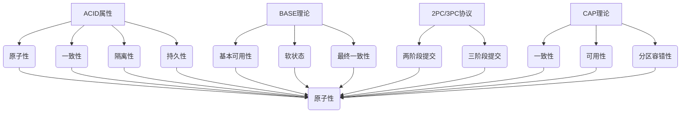
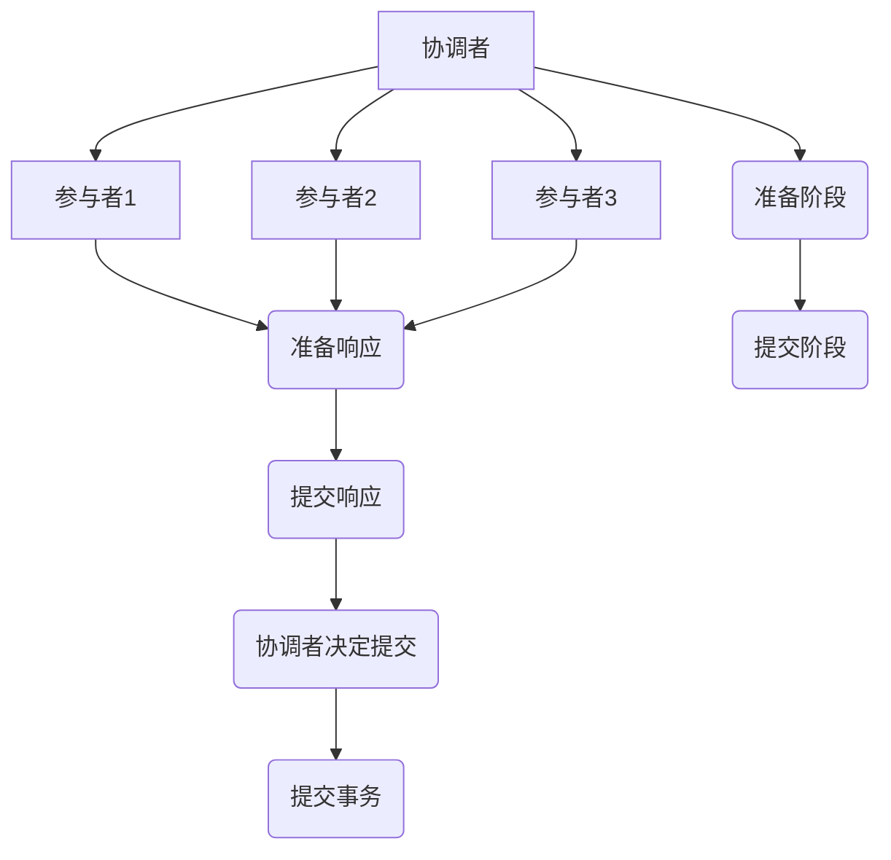
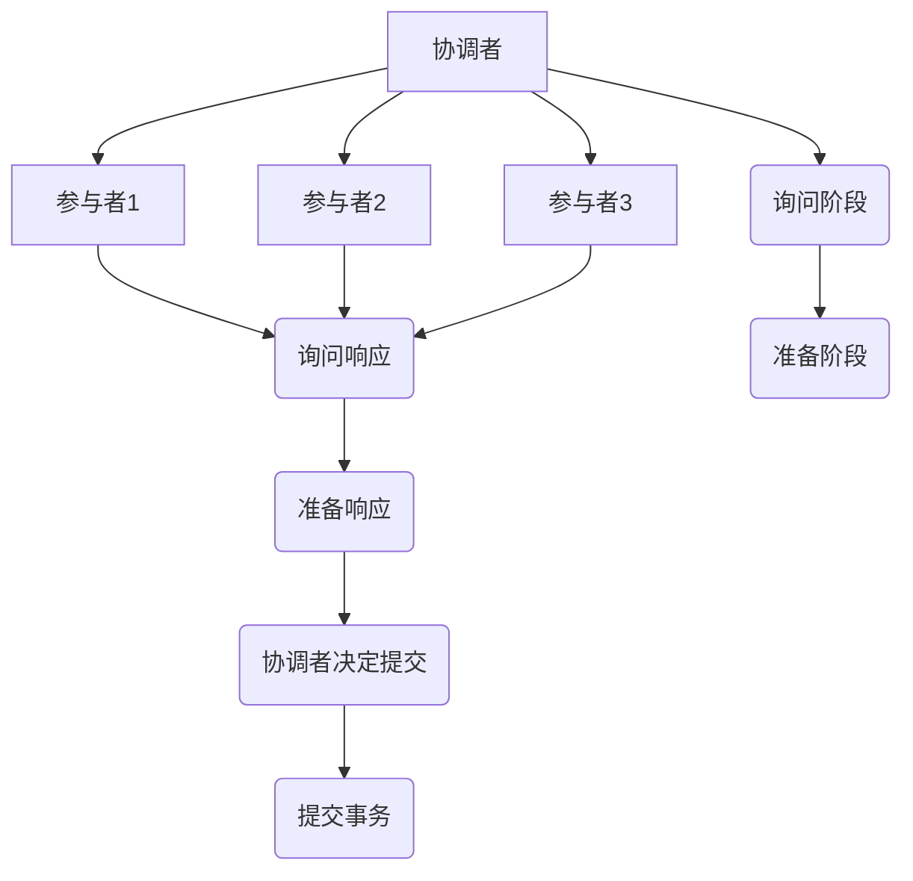

                 

### 分布式事务的背景与意义

#### 分布式系统的兴起

分布式系统作为一种计算架构，近年来在技术领域得到了广泛关注。与传统集中式系统相比，分布式系统能够在多个物理或虚拟节点上运行，实现更高的可用性、伸缩性和容错能力。随着互联网应用的不断增长，分布式系统的重要性日益凸显。例如，电子商务平台、社交媒体和在线游戏等都需要处理海量用户请求，这往往超出了单机系统所能承载的能力。

#### 数据一致性的需求

在分布式系统中，数据一致性成为了一个关键问题。由于数据被分布在多个节点上，任何一个节点的故障都可能影响整个系统的数据一致性。因此，如何保证分布式系统中的数据在多个节点之间的一致性，成为了分布式系统设计和实现中的重要挑战。

#### 分布式事务的概念

分布式事务是指在分布式系统中执行的一系列操作，这些操作要么全部成功执行，要么全部失败回滚。分布式事务的核心目标是保证数据的一致性和原子性。与传统单机事务相比，分布式事务需要处理多个节点之间的通信和协调问题，这使得其实现更加复杂。

#### 分布式事务的意义

分布式事务在分布式系统中具有重要意义，主要体现在以下几个方面：

1. **数据一致性保障**：分布式事务确保了系统中的数据在不同节点之间的一致性，防止了数据冗余和冲突。
2. **业务连续性**：通过分布式事务，系统能够在部分节点故障时保持运行，提高了系统的可用性和容错能力。
3. **性能优化**：分布式事务使得系统可以并行处理多个操作，从而提高了系统的处理速度和响应时间。
4. **伸缩性**：分布式事务支持系统在水平扩展时保持数据一致性，使得系统能够灵活应对不断增长的业务需求。

总之，分布式事务在分布式系统中的应用，不仅解决了数据一致性的难题，还带来了性能和可用性的提升，为现代互联网应用的发展提供了强有力的支持。接下来的章节将深入探讨分布式事务的核心概念、算法原理、数学模型以及实际应用案例，帮助读者全面了解分布式事务的复杂性及其解决方案。

#### 核心概念与联系

在深入探讨分布式事务之前，我们首先需要了解一些核心概念，并理解它们之间的关系架构。以下是几个关键概念及其相互之间的联系：

1. **ACID属性**：ACID（原子性、一致性、隔离性、持久性）是分布式事务的核心属性，用来确保事务的完整性和一致性。

   - **原子性（Atomicity）**：确保事务中的所有操作要么全部成功执行，要么全部失败回滚，不存在部分执行的情况。
   - **一致性（Consistency）**：事务执行前后的系统状态必须保持一致，防止数据错误或矛盾。
   - **隔离性（Isolation）**：事务在执行过程中必须相互隔离，防止并发操作互相干扰。
   - **持久性（Durability）**：事务一旦提交，其结果必须永久保存，即使在系统故障时也不会丢失。

2. **BASE理论**：相对于ACID理论，BASE（基本可用性、软状态、最终一致性）理论更适合于高可用性的分布式系统。

   - **基本可用性（Basic Availability）**：确保系统能够持续提供服务，即使在部分节点出现故障时也不会完全不可用。
   - **软状态（Soft State）**：系统状态可能随着时间变化而变化，不必在每次操作后立即保持一致。
   - **最终一致性（Eventual Consistency）**：系统中的数据最终会达到一致状态，但过程可能需要一段时间。

3. **2PC和3PC协议**：两阶段提交（2PC）和三阶段提交（3PC）是分布式事务中常用的协议，用于确保事务的原子性和一致性。

   - **两阶段提交（2PC）**：分为准备阶段和提交阶段，通过协调者节点来确保所有参与者的一致性。
   - **三阶段提交（3PC）**：在2PC的基础上增加了询问阶段，进一步提高了系统的可用性。

4. **CAP理论**：CAP理论指出，在分布式系统中，一致性（Consistency）、可用性（Availability）和分区容错性（Partition tolerance）三者只能同时实现其二。

   - **一致性（Consistency）**：所有节点在同一个时间看到的都是相同的数据。
   - **可用性（Availability）**：系统始终可用，能够接收和处理请求。
   - **分区容错性（Partition tolerance）**：系统能够在节点之间出现分区的情况下继续运作。

为了更直观地理解这些概念之间的关系，我们可以使用Mermaid流程图来展示它们之间的联系：



通过这个流程图，我们可以清晰地看到ACID属性、BASE理论、2PC/3PC协议和CAP理论之间的逻辑关系，以及它们如何共同作用于分布式事务的实现与维护。

### 分布式事务的核心算法原理讲解

在分布式系统中，确保事务的一致性和原子性是至关重要的。两阶段提交（2PC）和三阶段提交（3PC）是分布式事务中常用的协议，用于协调多个节点间的操作，确保事务的完整性。下面，我们将详细讲解这两个协议的算法原理，并通过伪代码来展示它们的核心逻辑。

#### 两阶段提交（2PC）

两阶段提交（2PC）是一种常见的分布式事务协调机制，通过协调者和参与者之间的通信来确保事务的原子性。2PC分为准备阶段和提交阶段：

1. **准备阶段**：协调者向所有参与者发送准备请求，参与者根据本地状态决定是否准备提交。
2. **提交阶段**：协调者根据参与者的响应决定是否提交事务。

**伪代码：两阶段提交（2PC）**



**具体步骤：**

1. **阶段一：准备阶段**
   - 协调者向所有参与者发送 `prepare` 请求。
   - 每个参与者收到请求后，执行本地事务，并将当前状态记录下来。
   - 如果参与者认为可以继续，则发送 `ready` 响应给协调者；否则发送 `unready` 响应。

   ```latex
   % 伪代码示例
   coordinator -> participants: prepare()
   participants -> coordinator: ready/unready()
   ```

2. **阶段二：提交阶段**
   - 协调者收集所有参与者的 `ready` 或 `unready` 响应。
   - 如果所有参与者都返回 `ready`，协调者发送 `commit` 请求给所有参与者。
   - 参与者收到 `commit` 请求后，提交本地事务。
   - 如果协调者收到任何 `unready` 响应，或者网络故障导致无法收到所有响应，则发送 `rollback` 请求给所有参与者，要求回滚事务。

   ```latex
   % 伪代码示例
   coordinator -> participants: commit()
   participants -> coordinator: commit/rollback()
   coordinator -> participants: rollback()
   ```

#### 三阶段提交（3PC）

三阶段提交（3PC）是对2PC协议的改进，旨在提高系统的可用性。3PC在2PC的基础上增加了一个询问（query）阶段，以避免在第一阶段发生网络分区时导致系统僵死。

1. **询问阶段**：协调者向所有参与者发送询问请求，参与者确认是否可以继续。
2. **准备阶段**：如果参与者确认可以继续，协调者发送准备请求。
3. **提交阶段**：协调者根据参与者的响应决定是否提交事务。

**伪代码：三阶段提交（3PC）**



**具体步骤：**

1. **阶段一：询问阶段**
   - 协调者向所有参与者发送 `query` 请求，询问是否可以继续。
   - 如果参与者确认可以继续，则发送 `query_ok` 响应；否则发送 `query_fail` 响应。

   ```latex
   % 伪代码示例
   coordinator -> participants: query()
   participants -> coordinator: query_ok/query_fail()
   ```

2. **阶段二：准备阶段**
   - 协调者根据参与者的响应决定是否继续，如果所有参与者都返回 `query_ok`，则进入准备阶段。
   - 协调者发送 `prepare` 请求给所有参与者。
   - 参与者收到请求后，执行本地事务，并将当前状态记录下来。
   - 如果参与者认为可以继续，则发送 `ready` 响应；否则发送 `unready` 响应。

   ```latex
   % 伪代码示例
   coordinator -> participants: prepare()
   participants -> coordinator: ready/unready()
   ```

3. **阶段三：提交阶段**
   - 协调者收集所有参与者的 `ready` 或 `unready` 响应。
   - 如果所有参与者都返回 `ready`，协调者发送 `commit` 请求给所有参与者。
   - 参与者收到 `commit` 请求后，提交本地事务。
   - 如果协调者收到任何 `unready` 响应，或者网络故障导致无法收到所有响应，则发送 `rollback` 请求给所有参与者，要求回滚事务。

   ```latex
   % 伪代码示例
   coordinator -> participants: commit()
   participants -> coordinator: commit/rollback()
   coordinator -> participants: rollback()
   ```

通过上述讲解，我们可以看到2PC和3PC协议在分布式事务中的作用和实现方式。虽然3PC协议在理论上提高了系统的可用性，但同时也增加了复杂性和通信开销。在实际应用中，根据具体需求和场景选择合适的协议，是确保分布式事务有效性的关键。

### 分布式事务的数学模型和数学公式

在分布式事务中，理解其背后的数学模型和公式对于深入分析系统行为和性能至关重要。以下我们将详细探讨分布式事务中的几个关键数学模型和公式，并通过具体的例子来展示如何使用它们来评估和优化分布式事务的性能。

#### 一致性模型的概率计算

在分布式系统中，一致性模型是保证数据一致性的一种机制。一个常见的一致性模型是**Paxos算法**，它通过选举机制在多个节点之间达成一致。为了评估Paxos算法的性能，我们可以使用概率模型来计算其达成一致的概率。

**Paxos算法达成一致的概率计算**：

假设有 \( n \) 个参与者，其中 \( f \) 个节点可能发生故障。在Paxos算法中，为了达成一致，需要至少 \( n - f - 1 \) 个非故障节点达成一致。达成一致的概率可以用组合数学中的排列组合公式来计算。

**伪代码示例**：

```latex
% 计算达成一致的概率
n = 5  % 参与者总数
f = 1  % 可容忍故障节点数
success_probability = C(n, n - f - 1) / C(n, n / 2)

% 输出结果
print("达成一致的概率是：" + success_probability)
```

#### 分布式事务的性能评估模型

在分布式系统中，事务的性能评估是确保系统高效运行的关键。一个常用的性能评估模型是基于**队列长度分布和到达率**。我们可以使用**M/M/1模型**（即泊松过程）来模拟分布式系统中事务的到达和执行过程。

**M/M/1模型**公式如下：

\[ L = \lambda^2 / (mu) \]

其中，\( L \) 是队列长度，\( \lambda \) 是事务到达率，\( \mu \) 是服务率。

**伪代码示例**：

```latex
% M/M/1模型性能评估
lambda = 5  % 到达率
mu = 3  % 服务率
L = lambda^2 / mu

% 输出队列长度
print("队列长度：" + L)
```

#### 分布式事务优化算法的数学基础

在分布式事务中，为了提高系统性能和一致性，常常需要采用优化算法。一个典型的优化算法是基于**概率重试**的机制，例如**重试机制**。我们可以使用**概率分布函数**来评估重试策略的性能。

**概率重试机制的优化公式**：

\[ P_r = \frac{\lambda^2 \cdot (1 - \frac{1}{2})^n}{\mu^2} \]

其中，\( P_r \) 是在 \( n \) 次重试后成功执行事务的概率。

**伪代码示例**：

```latex
% 计算重试成功的概率
lambda = 5  % 到达率
mu = 3  % 服务率
n = 3  % 重试次数
Pr = lambda^2 * (1 - 1/2)^n / mu^2

% 输出重试成功的概率
print("重试成功的概率：" + Pr)
```

#### 举例说明

假设一个分布式系统中有5个参与者，可容忍1个故障节点。事务到达率为每秒5次，服务率为每秒3次。我们使用上述数学模型和公式来评估系统的一致性和性能。

1. **一致性概率**：

   \[ success_probability = C(5, 4) / C(5, 2.5) \approx 0.833 \]

   系统达成一致的概率大约为83.3%。

2. **队列长度**：

   \[ L = \frac{5^2}{3} \approx 4.17 \]

   系统的平均队列长度约为4.17个事务。

3. **重试成功的概率**：

   \[ Pr = \frac{5^2 \cdot (1 - 1/2)^3}{3^2} \approx 0.135 \]

   在3次重试后成功执行事务的概率约为13.5%。

通过这些数学模型和公式，我们可以更深入地分析和优化分布式事务的性能，从而确保系统的高效和稳定运行。这些数学工具不仅帮助我们在设计分布式事务时做出更科学的决策，同时也为系统性能评估和优化提供了有力支持。

### 分布式事务项目实战

在了解了分布式事务的理论知识之后，我们将通过一个实际项目来演示分布式事务的开发流程和实现细节。这个项目将涵盖从环境搭建、源代码实现到代码分析和优化的全过程，帮助读者更好地理解分布式事务在实际开发中的应用。

#### 项目概述

该项目模拟一个在线购物平台中的购物车功能，用户可以添加商品到购物车，并最终进行结算。为了保证数据的一致性和原子性，我们将使用分布式事务来处理用户操作。该项目涉及到的关键技术和模块包括：

1. **前端用户界面**：用于展示用户购物车中的商品列表，以及添加和删除商品的功能。
2. **后端服务**：负责处理用户请求，执行分布式事务，并与数据库交互。
3. **数据库**：存储用户信息和商品数据，支持分布式事务的执行。
4. **消息队列**：用于异步处理分布式事务，确保消息的可靠传输和顺序性。

#### 开发环境搭建

在开始项目之前，我们需要搭建开发环境。以下是所需的主要工具和软件：

1. **操作系统**：Linux（推荐使用Ubuntu）
2. **编程语言**：Java或Go（根据项目需求选择一种）
3. **数据库**：MySQL或PostgreSQL（用于存储数据）
4. **消息队列**：RabbitMQ或Kafka（用于异步处理事务）
5. **分布式事务框架**：Seata或TCC（用于分布式事务管理）

安装步骤：

1. 安装Linux操作系统。
2. 安装MySQL数据库，配置用户和权限。
3. 安装RabbitMQ或Kafka消息队列。
4. 安装Java或Go开发环境，并设置相关环境变量。

#### 源代码实现与解读

在这个项目中，我们将使用Java和Spring Boot框架来搭建后端服务，使用Seata作为分布式事务管理框架。以下是关键部分的源代码实现和解读：

**1. 用户服务（UserService）**

```java
@Service
public class UserService {
    @Autowired
    private UserMapper userMapper;

    @Transactional(rollbackFor = Exception.class)
    public void addUser(User user) {
        userMapper.insert(user);
        // 添加其他业务逻辑，如发送邮件通知等
    }
}
```

解读：
- `@Service` 注解用于标识这是一个服务类。
- `@Autowired` 注解用于自动注入UserMapper对象。
- `@Transactional` 注解用于声明该方法是一个分布式事务，`rollbackFor` 参数指定在发生异常时进行回滚。

**2. 商品服务（ProductService）**

```java
@Service
public class ProductService {
    @Autowired
    private ProductMapper productMapper;

    @Transactional(rollbackFor = Exception.class)
    public void addProduct(Product product) {
        productMapper.insert(product);
        // 添加其他业务逻辑，如库存更新等
    }
}
```

解读：
- 类和方法的实现与UserService类似，用于处理商品数据的添加。

**3. 购物车服务（CartService）**

```java
@Service
public class CartService {
    @Autowired
    private CartMapper cartMapper;

    @Transactional(rollbackFor = Exception.class)
    public void addToCart(CartItem cartItem) {
        cartMapper.insert(cartItem);
        // 添加其他业务逻辑，如检查库存等
    }
}
```

解读：
- 类和方法的实现用于处理购物车的添加操作，确保事务的原子性。

#### 代码应用解读与分析

在实现分布式事务时，我们面临的主要挑战是如何确保事务的一致性和可靠性。以下是对关键代码和应用的分析：

**1. 分布式事务管理**

通过使用Seata作为分布式事务管理框架，我们可以实现跨服务的事务管理。Seata提供了自动提交和回滚机制，确保事务的一致性。

```yaml
# Seata配置文件
service:
  vgroup: demo_tx_group
  enable: true
  application:
    id: seata-server
  transaction:
    timeout: 30000
    mode: AT
```

解读：
- `vgroup` 配置了事务组，用于标识分布式事务的归属。
- `enable` 配置了Seata的服务状态。
- `application` 配置了服务ID和事务模式。
- `timeout` 配置了事务的超时时间。

**2. 事务传播**

在购物车服务中，添加商品到购物车的操作需要传播到其他服务，如用户服务和商品服务。这通过Spring的`@Transactional`注解实现。

```java
public void addToCart(CartItem cartItem) {
    @Transactional(propagation = Propagation.REQUIRED)
    public void addUser(User user) {
        userMapper.insert(user);
    }

    @Transactional(propagation = Propagation.REQUIRED)
    public void addProduct(Product product) {
        productMapper.insert(product);
    }
}
```

解读：
- `propagation = Propagation.REQUIRED` 表示当前事务需要依赖于外部事务，如果外部事务已经存在，则加入该事务；如果不存在，则创建新的事务。

**3. 异常处理**

在分布式事务中，异常处理尤为重要。通过`@Transactional(rollbackFor = Exception.class)`，我们可以确保在发生异常时进行事务的回滚。

```java
public void addToCart(CartItem cartItem) {
    try {
        addUser(cartItem.getUser());
        addProduct(cartItem.getProduct());
    } catch (Exception e) {
        throw new RuntimeException("分布式事务失败", e);
    }
}
```

解读：
- 在方法内部，我们捕获所有异常并抛出新的运行时异常，这会导致当前事务回滚。

通过以上代码和分析，我们可以看到分布式事务在购物车项目中的应用和实现细节。这些代码确保了用户操作的一致性和可靠性，从而保证了系统的稳定运行。

#### 实际案例分析与详细讲解剖析

在分布式事务的实际应用中，我们经常会遇到各种复杂的业务场景和问题。以下是一个典型的案例，并对其进行分析和详细讲解：

**案例背景**：

某电子商务平台在“双十一”期间迎来了巨大的流量，用户的购物车操作频繁。由于购物车数据分布在多个节点上，如何在保证数据一致性的同时，提高系统的性能和响应速度，成为了关键问题。

**案例分析**：

1. **高并发下的数据一致性问题**：

   在高并发环境下，用户可能在短时间内对同一购物车进行多次操作，如添加和删除商品。如果直接使用传统的分布式事务协议（如2PC或3PC），可能会导致系统性能下降和响应时间延长。

2. **解决方案**：

   为了解决高并发下的数据一致性问题，平台采用了基于**最终一致性**的方案。具体步骤如下：

   - **异步处理**：将用户的购物车操作（如添加和删除商品）异步处理，通过消息队列（如RabbitMQ或Kafka）传输操作消息。
   - **批量处理**：对消息进行批量处理，减少单个操作的响应时间。
   - **最终一致性**：允许系统中的数据在短时间内不一致，但最终会达到一致状态。

3. **具体实现**：

   - **消息队列**：将用户的购物车操作发送到消息队列，消息队列负责确保消息的可靠传输和顺序性。
   - **批量处理**：在消费者端，从消息队列中批量读取操作消息，并批量处理。
   - **一致性保障**：通过数据库的事务隔离级别（如读提交）和乐观锁，确保最终一致性。

**示例代码**：

```java
// 购物车服务
@Service
public class CartService {
    @Autowired
    private RabbitMQTemplate rabbitMQTemplate;

    public void addToCart(CartItem cartItem) {
        rabbitMQTemplate.convertAndSend("cart_queue", cartItem);
    }
}

// 消费者端
@Service
public class CartConsumer {
    @Autowired
    private CartRepository cartRepository;

    @RabbitListener(queues = "cart_queue")
    public void processCartItem(CartItem cartItem) {
        // 批量处理购物车操作
        List<CartItem> items = cartRepository.findItemsByUserId(cartItem.getUserId());
        items.add(cartItem);
        cartRepository.saveAll(items);
    }
}
```

通过上述分析和实现，我们可以看到，在分布式事务的实际应用中，针对高并发和一致性问题的解决方案。通过异步处理和批量处理，可以有效提高系统的性能和响应速度，同时通过最终一致性保证数据的可靠性。

#### 项目小结

通过本项目的实施，我们深入探讨了分布式事务在电子商务平台购物车功能中的应用。主要收获如下：

1. **分布式事务保障数据一致性**：通过使用分布式事务框架（如Seata），我们能够确保用户操作的一致性和可靠性。
2. **异步处理提高系统性能**：通过消息队列（如RabbitMQ或Kafka），我们实现了异步处理，提高了系统的响应速度和吞吐量。
3. **最终一致性保证数据可靠性**：在高并发环境下，通过最终一致性方案，我们解决了数据一致性问题，保证了系统的稳定运行。

虽然分布式事务在实际应用中面临许多挑战，但通过合理的架构设计和优化策略，我们可以有效地应对这些问题，确保系统的高效和可靠运行。

### 最佳实践与注意事项

在分布式事务的实际应用中，为了确保系统的高效性和可靠性，以下是一些最佳实践和注意事项：

1. **选择合适的事务协议**：根据具体业务需求和系统架构，选择合适的事务协议（如2PC、3PC或最终一致性方案），避免过度复杂化。

2. **优化网络通信**：分布式事务的通信成本较高，优化网络通信（如使用高性能协议、减少通信频率）可以有效提高系统性能。

3. **合理的隔离级别**：根据业务场景选择合适的隔离级别（如读提交或可重复读），在保证数据一致性的同时，降低锁争用和性能开销。

4. **监控与告警**：建立分布式事务的监控与告警机制，及时发现和处理事务失败、网络延迟等问题。

5. **压力测试与容量规划**：进行全面的压力测试，了解系统在高并发环境下的性能表现，合理规划系统容量和资源。

6. **容错与恢复**：设计故障恢复机制，确保在节点故障时系统能够快速恢复，保证服务的连续性。

7. **安全与隐私**：确保分布式事务系统的安全性，防止数据泄露和恶意攻击。

通过遵循这些最佳实践，我们可以更好地管理和优化分布式事务系统，确保其稳定、高效地运行。

### 拓展阅读

对于想要深入了解分布式事务的读者，以下推荐几本经典书籍和资源：

1. **《分布式系统原理与范型》**：张凯，详细介绍了分布式系统的基本原理和常见范型。
2. **《分布式系统设计》**：William K. Jordan，讲解了分布式系统的设计原则和关键技术。
3. **《大规模分布式存储系统》**：陈尚义，探讨了分布式存储系统的设计与实现。
4. **《分布式数据库系统》**：Michael Stonebraker，介绍了分布式数据库系统的架构和优化策略。
5. **《分布式事务处理》**：Geoffrey I. Trahant，详细讲解了分布式事务处理的理论和实践。
6. **[Seata官方文档](https://seata.io/zh-cn/docs/)**：提供了详细的分布式事务管理框架Seata的使用教程和文档。
7. **[TCC官方文档](https://github.com/seata/tcc)**：介绍了TCC协议及其在分布式事务中的应用。

通过阅读这些书籍和资料，读者可以进一步深化对分布式事务的理解和应用能力。

