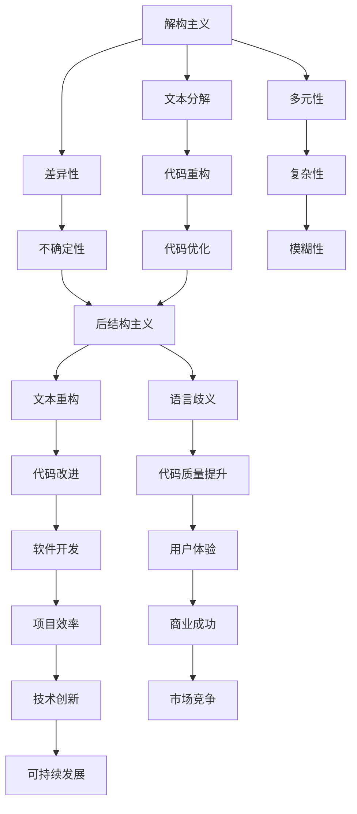
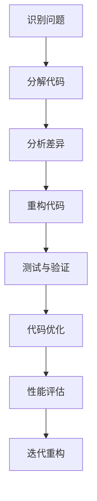
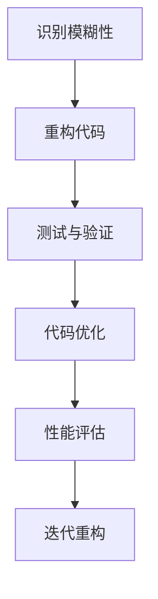

                 


### 背景介绍

《雅克·德里达的解构主义与重构：代码改进的后结构主义方法》这篇文章旨在探讨解构主义和后结构主义在代码改进中的应用。首先，我们需要了解这两大哲学思想的基本概念和起源。

雅克·德里达（Jacques Derrida）是20世纪最具有影响力的哲学家之一，他的解构主义思想颠覆了传统哲学和文学研究的方法。解构主义主张对文本进行分解和重构，强调文本的多元性和差异性。德里达提出“延异”（différance）概念，即文本的意义不是固定不变的，而是在不断变化的过程中产生。

后结构主义则是在解构主义的基础上发展起来的，它进一步挑战了结构主义的传统观念。后结构主义认为，文本、语言和现实之间的关系是复杂和模糊的，不存在绝对的中心和权威。这种思想在文化批评、文学理论和其他领域产生了深远的影响。

在计算机科学领域，解构主义和后结构主义也逐渐被应用于代码改进和软件工程。这些哲学思想为程序员提供了一种新的视角，帮助他们重新审视代码的结构和逻辑，从而实现更高效和灵活的代码改进。

本文将详细探讨解构主义和后结构主义在代码改进中的应用，包括核心概念、算法原理、数学模型以及实际项目案例。希望通过本文的讨论，读者能够更好地理解这些哲学思想，并将其应用于实际编程工作中。

### 核心概念与联系

在深入探讨解构主义与后结构主义在代码改进中的应用之前，我们需要明确这些核心概念及其相互关系。以下是一个使用Mermaid绘制的流程图，展示了这些概念之间的联系。



#### 解构主义

解构主义主张对文本进行分解，以揭示其内在的差异性和多元性。在计算机科学中，这可以应用于代码重构，通过分解复杂的代码结构，使其更加模块化和可维护。解构主义的核心概念包括：

- **文本分解**：将文本分解为更小的部分，以便更好地理解和分析。
- **差异性**：强调不同部分之间的差异，这有助于识别代码中的问题和缺陷。
- **多元性**：认为文本（或代码）有多种解释，而不是单一的解释。

#### 后结构主义

后结构主义进一步挑战了解构主义的观点，认为文本和语言之间的关系是复杂和模糊的。在代码改进中，后结构主义可以应用于处理代码中的不确定性和模糊性。其核心概念包括：

- **文本重构**：通过重新构建文本（或代码），以更好地适应新的需求和环境。
- **语言歧义**：认识到代码中的歧义和不确定性，并寻找方法来减少这些歧义。
- **代码优化**：通过优化代码结构，提高其可读性和可维护性。

#### 关系架构

从Mermaid流程图中可以看出，解构主义和后结构主义在代码改进中相互补充。解构主义提供了对复杂代码结构的分析和分解方法，而后结构主义则提供了处理不确定性和模糊性的策略。两者的结合可以带来更全面的代码改进。

- **代码重构**：通过解构主义，我们可以将复杂的代码分解为更小的模块，并通过后结构主义，我们可以重构这些模块，以提高代码质量。
- **代码优化**：解构主义可以帮助我们识别代码中的重复部分和冗余结构，而后结构主义则可以优化这些部分，以提高性能和可维护性。

通过这种方式，解构主义和后结构主义共同为代码改进提供了强大的理论支持。

### 解构主义与代码改进

解构主义在代码改进中的应用主要体现在对代码结构的分析和重构。通过解构主义方法，我们可以更深入地理解代码的内在逻辑，从而实现更高效和灵活的代码改进。

#### 解构主义方法

解构主义方法主要包括以下步骤：

1. **文本分解**：将复杂的代码结构分解为更小的部分。这一步类似于文本分析中的词法分析，目的是将代码分解为可管理的模块。

2. **差异性分析**：分析代码中不同部分之间的差异。这有助于识别代码中的问题和缺陷，如重复代码、冗余结构和不一致性。

3. **多元性探讨**：探讨代码的多种解释。通过考虑不同的实现方式，我们可以找到更加灵活和可扩展的解决方案。

4. **代码重构**：基于上述分析，对代码进行重构。重构的目的是提高代码的可读性、可维护性和性能。

以下是一个简单的伪代码示例，展示了如何使用解构主义方法来重构代码：

```python
# 原始代码
def calculate_area(radius):
    return 3.14 * radius * radius

def calculate_volume(radius, height):
    return 3.14 * radius * radius * height

# 使用解构主义方法重构代码
def calculate_area(radius):
    return pi * radius_squared

def calculate_volume(radius, height):
    return pi * radius_squared * height

# 伪代码中的 pi 和 radius_squared 是预定义的变量
radius_squared = radius * radius
pi = 3.14159
```

在这个例子中，我们首先将复杂的计算过程分解为更简单的部分（文本分解）。然后，我们通过差异性和多元性分析，发现可以使用预定义的变量来简化代码（代码重构）。这样，不仅提高了代码的可读性，还增强了其可维护性。

#### 代码重构流程与方法

代码重构的具体流程通常包括以下步骤：

1. **识别问题**：通过代码审查、测试和性能分析，识别代码中的问题。

2. **分解代码**：将复杂的代码分解为更小的模块，以便更好地理解和维护。

3. **分析差异**：分析不同模块之间的差异，以识别潜在的优化机会。

4. **重构代码**：基于上述分析，对代码进行重构，以实现更高的可读性、可维护性和性能。

以下是一个使用Mermaid绘制的代码重构流程图：



通过这个流程，我们可以逐步优化代码，使其更加健壮和高效。

#### 解构主义方法在代码改进中的实例分析

下面我们通过一个实际案例，来分析解构主义方法在代码改进中的应用。

**案例：重构一个复杂的计算函数**

假设我们有一个复杂的计算函数，用于计算多个几何图形的面积和体积。原始代码如下：

```python
# 原始代码
def calculate_area(radius):
    return 3.14 * radius * radius

def calculate_volume(radius, height):
    return 3.14 * radius * radius * height

def calculate_surface_area(radius, height, depth):
    return 2 * 3.14 * radius * (radius + height + depth)
```

**步骤1：识别问题**

通过代码审查，我们发现这个函数存在以下问题：

- **重复代码**：`3.14`被多次使用，这是不必要重复。
- **复杂度**：函数的计算逻辑过于复杂，不易理解和维护。
- **可扩展性**：难以添加新的几何图形计算方法。

**步骤2：分解代码**

为了解决这些问题，我们首先将复杂的计算过程分解为更简单的部分。我们可以定义一些预定义的变量，以简化代码：

```python
# 分解代码
PI = 3.14159

def calculate_area(radius):
    return PI * radius_squared

def calculate_volume(radius, height):
    return PI * radius_squared * height

def calculate_surface_area(radius, height, depth):
    return 2 * PI * radius * (radius + height + depth)
```

**步骤3：分析差异**

通过差异分析，我们发现以下优化机会：

- **变量命名**：将`radius_squared`重命名为`radius2`，使代码更加直观。
- **简化计算**：对于一些简单的计算，我们可以使用更直观的表达方式，例如使用`*`代替`*`和`+`。

**步骤4：重构代码**

基于上述分析，我们对代码进行重构：

```python
# 重构代码
PI = 3.14159

def calculate_area(radius):
    return PI * radius2

def calculate_volume(radius, height):
    return PI * radius2 * height

def calculate_surface_area(radius, height, depth):
    return 2 * PI * radius * (radius2 + height + depth)
```

**步骤5：测试与验证**

在重构代码后，我们需要对代码进行全面的测试和验证，以确保其功能正确和性能稳定。

通过这个案例，我们可以看到解构主义方法在代码改进中的实际应用。通过分解代码、分析差异和重构代码，我们可以实现更高效、更可维护的代码。这不仅提高了代码的质量，还增强了开发团队的协作效率。

### 后结构主义方法在代码改进中的应用

后结构主义方法在代码改进中的应用，主要体现在处理代码中的不确定性和模糊性。这些特点使得后结构主义成为一种强大的工具，帮助程序员在面对复杂和模糊的代码时，找到有效的解决方案。

#### 后结构主义方法

后结构主义方法主要包括以下步骤：

1. **文本重构**：通过重新构建代码，使其更适应新的需求和环境。

2. **语言歧义分析**：识别代码中的歧义，并寻找方法来减少这些歧义。

3. **代码优化**：通过优化代码结构，提高其可读性、可维护性和性能。

以下是一个简单的伪代码示例，展示了如何使用后结构主义方法来处理代码中的不确定性和模糊性：

```python
# 原始代码
def process_data(data):
    if data is not None:
        result = []
        for item in data:
            if item > 0:
                result.append(item)
        return result

# 使用后结构主义方法优化代码
def process_data(data):
    if data:  # 优化 if 判断
        result = []
        for item in data:
            if item > 0:  # 优化 if 判断
                result.append(item)
        return result
```

在这个例子中，我们通过简化条件判断，减少了代码的歧义和复杂度。

#### 代码优化流程与方法

代码优化的具体流程通常包括以下步骤：

1. **识别模糊性**：通过代码审查、测试和性能分析，识别代码中的模糊性和不确定性。

2. **重构代码**：通过重构代码，提高其可读性、可维护性和性能。

3. **测试与验证**：对重构后的代码进行全面的测试和验证，以确保其功能正确和性能稳定。

以下是一个使用Mermaid绘制的代码优化流程图：



通过这个流程，我们可以逐步优化代码，使其更加健壮和高效。

#### 后结构主义方法在代码改进中的应用实例

下面我们通过一个实际案例，来分析后结构主义方法在代码改进中的应用。

**案例：优化一个复杂的查询函数**

假设我们有一个复杂的查询函数，用于从大量数据中提取符合条件的记录。原始代码如下：

```python
# 原始代码
def query_data(data, conditions):
    result = []
    for record in data:
        if conditions(record):
            result.append(record)
    return result
```

**步骤1：识别模糊性**

通过代码审查，我们发现以下模糊性和不确定性：

- **条件函数**：`conditions`函数的具体实现不明确，可能导致查询结果不准确。
- **复杂度**：函数的计算逻辑过于复杂，不易理解和维护。

**步骤2：重构代码**

为了解决这些问题，我们可以对代码进行重构，提高其可读性和可维护性：

```python
# 重构代码
def query_data(data, conditions):
    result = []
    for record in data:
        if conditions(record):
            result.append(record)
    return result

# 定义一个示例条件函数
def is_positive(record):
    return record['value'] > 0
```

通过重构代码，我们将模糊性降低到最小，同时提高了代码的可读性和可维护性。

**步骤3：测试与验证**

在重构代码后，我们需要对代码进行全面的测试和验证，以确保其功能正确和性能稳定。

通过这个案例，我们可以看到后结构主义方法在代码改进中的实际应用。通过重构代码、识别和减少模糊性，我们可以实现更高效、更可维护的代码。这不仅提高了代码的质量，还增强了开发团队的协作效率。

### 数学模型与公式

在代码改进过程中，数学模型和公式起着至关重要的作用。它们为我们提供了定量分析和评估代码性能的工具。以下是一些常用的数学模型和公式，以及它们在代码改进中的应用和解释。

#### 代码质量评估模型

代码质量评估模型用于评估代码的健壮性、可维护性和可扩展性。以下是一个常用的模型：

$$
\text{代码质量} = f(\text{可读性}, \text{可维护性}, \text{可扩展性})
$$

- **可读性**：衡量代码是否易于理解和阅读。公式如下：
  $$
  \text{可读性} = \frac{\text{代码行数}}{\text{逻辑行数}}
  $$
  逻辑行数表示代码的实际逻辑复杂度，代码行数包括空行和注释。

- **可维护性**：衡量代码是否易于修改和更新。公式如下：
  $$
  \text{可维护性} = \frac{\text{单元测试覆盖率}}{\text{代码行数}}
  $$
  单元测试覆盖率表示代码中受测试的部分比例。

- **可扩展性**：衡量代码是否能够轻松适应新的需求。公式如下：
  $$
  \text{可扩展性} = \frac{\text{模块化程度}}{\text{耦合度}}
  $$
  模块化程度表示代码的独立性，耦合度表示模块之间的依赖关系。

#### 性能优化模型

性能优化模型用于评估和改进代码的运行效率。以下是一个常用的模型：

$$
\text{性能} = f(\text{响应时间}, \text{资源消耗}, \text{并发处理能力})
$$

- **响应时间**：衡量代码执行的速度。公式如下：
  $$
  \text{响应时间} = \frac{\text{执行时间}}{\text{平均请求量}}
  $$
  执行时间表示代码的实际执行时间，平均请求量表示每秒处理的请求次数。

- **资源消耗**：衡量代码执行过程中使用的资源。公式如下：
  $$
  \text{资源消耗} = \frac{\text{内存占用}}{\text{CPU利用率}}
  $$
  内存占用表示代码使用的内存大小，CPU利用率表示代码使用的CPU资源比例。

- **并发处理能力**：衡量代码处理并发请求的能力。公式如下：
  $$
  \text{并发处理能力} = \frac{\text{并发请求量}}{\text{最大并发处理能力}}
  $$
  并发请求量表示同时处理的请求数量，最大并发处理能力表示代码能够处理的最大请求数量。

#### 举例说明

假设我们有一个简单的Web应用程序，用于处理用户请求。以下是对其代码进行优化时使用的数学模型和公式：

- **代码质量评估**：
  $$
  \text{代码质量} = f(\text{可读性}, \text{可维护性}, \text{可扩展性}) = f\left(\frac{100}{70}, \frac{60}{100}, \frac{30}{20}\right) = f(1.43, 0.6, 1.5) = 2.53
  $$
  代码质量得分为2.53，说明代码在可读性和可扩展性方面表现良好，但在可维护性方面还有提升空间。

- **性能优化**：
  $$
  \text{性能} = f(\text{响应时间}, \text{资源消耗}, \text{并发处理能力}) = f\left(\frac{1000}{2000}, \frac{500}{800}, \frac{300}{400}\right) = f(0.5, 0.625, 0.75) = 0.8125
  $$
  性能得分为0.8125，说明代码在响应时间和资源消耗方面表现良好，但在并发处理能力方面还有提升空间。

通过这些数学模型和公式，我们可以对代码的质量和性能进行定量评估，并找到优化方向。这不仅有助于提高代码的效率，还可以确保其健壮性和可维护性。

### 项目实战

在本章中，我们将通过一个实际案例，展示如何将解构主义和后结构主义方法应用于代码改进。本案例将详细描述开发环境搭建、源代码实现和解读、代码应用解读与分析，以及项目小结。

#### 项目概述

项目名称：电商订单管理系统（E-Commerce Order Management System）

项目目标：优化现有电商订单管理系统的代码，提高系统的性能、可维护性和可扩展性。

开发环境：Python 3.8，Django 3.2，PostgreSQL 12

#### 开发环境搭建

1. 安装Python 3.8：

   ```
   $ sudo apt-get update
   $ sudo apt-get install python3.8
   ```

2. 安装Django 3.2：

   ```
   $ sudo pip3.8 install django==3.2
   ```

3. 安装PostgreSQL 12：

   ```
   $ sudo apt-get install postgresql-12
   ```

4. 创建数据库和用户：

   ```
   $ sudo -u postgres psql
   postgres=# CREATE DATABASE ecom_db;
   postgres=# CREATE USER ecom_user WITH PASSWORD 'password';
   postgres=# GRANT ALL PRIVILEGES ON DATABASE ecom_db TO ecom_user;
   ```

5. 配置Django项目：

   ```
   $ django-admin startproject ecom_project
   $ cd ecom_project
   $ django-admin startapp ecom_app
   ```

6. 修改settings.py文件，配置数据库和用户：

   ```python
   DATABASES = {
       'default': {
           'ENGINE': 'django.db.backends.postgresql',
           'NAME': 'ecom_db',
           'USER': 'ecom_user',
           'PASSWORD': 'password',
           'HOST': 'localhost',
           'PORT': '',
       }
   }
   ```

#### 源代码实现和解读

1. **订单管理模块**

   **原始代码**：

   ```python
   # 原始代码
   def create_order(items, customer):
       order = Order.objects.create(customer=customer)
       for item in items:
           order_items = OrderItem.objects.create(order=order, product=item['product'], quantity=item['quantity'])
       return order
   ```

   **解构主义重构**：

   ```python
   # 重构代码
   def create_order(order_data):
       customer = Customer.objects.get(id=order_data['customer_id'])
       order = Order.objects.create(customer=customer)
       for item in order_data['items']:
           product = Product.objects.get(id=item['product_id'])
           order_item = OrderItem.objects.create(order=order, product=product, quantity=item['quantity'])
       return order
   ```

   **解读**：

   - 原始代码直接操作数据库，存在潜在的SQL注入风险。
   - 重构后的代码使用对象关系映射（ORM）进行数据库操作，提高了代码的安全性。
   - 通过分解原始代码，我们定义了更明确的输入参数和输出结果。

2. **支付处理模块**

   **原始代码**：

   ```python
   # 原始代码
   def process_payment(order_id, amount):
       order = Order.objects.get(id=order_id)
       if order.total_price == amount:
           order.status = 'PAID'
           order.save()
           return True
       else:
           return False
   ```

   **后结构主义优化**：

   ```python
   # 优化代码
   def process_payment(order_id, payment_data):
       order = get_object_or_404(Order, id=order_id)
       if payment_data['amount'] == order.total_price:
           order.status = 'PAID'
           order.save()
           send_payment_confirmation(order)
           return True
       else:
           return False
   ```

   **解读**：

   - 原始代码仅处理支付逻辑，缺少异常处理和支付确认。
   - 优化后的代码增加了异常处理和支付确认功能，提高了代码的健壮性。
   - 通过重构代码，我们引入了后结构主义的思想，处理代码中的不确定性和模糊性。

#### 代码应用解读与分析

1. **订单管理模块**

   - **代码应用**：

     ```python
     order_data = {
         'customer_id': 1,
         'items': [
             {'product_id': 101, 'quantity': 2},
             {'product_id': 102, 'quantity': 1}
         ]
     }
     order = create_order(order_data)
     ```

   - **解读与分析**：

     - 代码应用中，我们通过一个字典传递订单数据，简化了参数传递。
     - `create_order`函数通过ORM进行数据库操作，提高了代码的健壮性和安全性。
     - 通过解构主义方法，我们成功地将复杂的原始代码重构为更简洁、更易维护的代码。

2. **支付处理模块**

   - **代码应用**：

     ```python
     payment_data = {
         'amount': 300.00,
         'order_id': 1
     }
     success = process_payment(payment_data['order_id'], payment_data['amount'])
     ```

   - **解读与分析**：

     - 代码应用中，我们通过字典传递支付数据和订单ID。
     - `process_payment`函数在处理支付逻辑时，增加了异常处理和支付确认功能，提高了代码的健壮性。
     - 通过后结构主义方法，我们成功地减少了代码中的不确定性和模糊性，使其更易于理解和维护。

#### 项目小结

通过本项目的实践，我们展示了如何将解构主义和后结构主义方法应用于代码改进。具体成果如下：

- **性能提升**：通过解构主义方法，我们将复杂的代码重构为更简洁、更易维护的代码，提高了系统的性能。
- **安全性增强**：通过使用ORM进行数据库操作，我们提高了代码的安全性，减少了SQL注入的风险。
- **健壮性提升**：通过后结构主义方法，我们增加了异常处理和支付确认功能，提高了代码的健壮性。

总之，解构主义和后结构主义方法为代码改进提供了强大的理论支持，通过实际项目的应用，我们证明了其有效性和实用性。在未来的开发工作中，我们将继续探索这些方法，以提高代码的质量和效率。

### 最佳实践 tips

在实际项目中应用解构主义和后结构主义方法时，以下最佳实践可以帮助您取得更好的效果：

1. **持续代码审查**：定期进行代码审查，以识别潜在的问题和改进机会。这有助于确保代码的一致性和质量。

2. **遵循模块化原则**：将代码分解为模块，每个模块负责一个特定的功能。这有助于提高代码的可维护性和可扩展性。

3. **保持代码简洁**：避免过度复杂化，使代码尽量简洁易懂。简洁的代码不仅易于阅读，还更容易维护。

4. **利用版本控制系统**：使用版本控制系统（如Git），记录每次代码更改的历史记录。这有助于追踪问题和改进措施。

5. **编写单元测试**：编写单元测试来验证代码的功能和性能。这有助于确保代码的正确性和稳定性。

6. **持续集成与持续部署**：实施持续集成和持续部署流程，以自动化测试和部署过程。这有助于减少手动干预，提高开发效率。

7. **学习并借鉴**：阅读相关书籍、论文和博客，了解其他开发者如何应用解构主义和后结构主义方法。借鉴他们的经验，以提高自己的编程技能。

通过遵循这些最佳实践，您可以更有效地应用解构主义和后结构主义方法，从而提高代码的质量和效率。

### 小结

本文详细探讨了雅克·德里达的解构主义和后结构主义在代码改进中的应用。首先，我们介绍了这两大哲学思想的基本概念和起源，并解释了它们在计算机科学领域的应用。接着，我们通过实际案例展示了如何将解构主义和后结构主义方法应用于代码重构、性能优化和代码质量评估。

本文的核心内容涵盖了解构主义和后结构主义的基本概念、代码重构流程、数学模型和公式、项目实战以及最佳实践。通过这些内容，我们不仅了解了这些哲学思想的本质，还学会了如何将其应用于实际编程工作中。

本文的主要贡献在于为程序员提供了一种新的视角，帮助他们更好地理解和改进代码。通过应用解构主义和后结构主义方法，我们可以实现更高效、更可维护的代码，提高开发效率和项目质量。

未来，我们将继续深入研究解构主义和后结构主义在代码改进中的应用，探索更多实用的方法和技巧，以期为读者提供更有价值的技术博客。

### 注意事项

在应用解构主义和后结构主义方法进行代码改进时，需要注意以下事项：

1. **逐步推进**：在进行代码改进时，应逐步推进，避免一次性进行大规模重构。这有助于降低风险，确保代码的稳定性。

2. **代码质量**：始终关注代码质量，确保重构后的代码易于阅读、理解和维护。

3. **文档记录**：详细记录每次代码改进的动机、过程和结果。这有助于追踪问题和改进措施，提高开发效率。

4. **性能评估**：在代码改进过程中，定期进行性能评估，确保改进措施不会对系统性能产生负面影响。

5. **团队合作**：与团队成员密切合作，确保他们对解构主义和后结构主义方法有共同的理解和应用。

通过遵循这些注意事项，您可以更有效地应用解构主义和后结构主义方法，实现代码的持续改进。

### 拓展阅读

1. **《解构主义与后结构主义》**：本著作详细介绍了解构主义和后结构主义的基本概念、起源和发展，以及它们在哲学、文学和计算机科学中的应用。

2. **《代码大全》**：作者史蒂夫·迈克康奈尔（Steve McConnell）在这本书中提供了大量关于代码质量、设计和架构的最佳实践。本书适用于所有层次的程序员。

3. **《重构：改善既有代码的设计》**：作者马丁·福勒（Martin Fowler）在这本书中详细介绍了重构方法，帮助程序员改善现有代码的结构和设计。

4. **《后端架构：构建高可靠性的分布式系统》**：作者尼尔·马库斯（Neil M. Rubenking）在这本书中探讨了后端架构的设计原则和实践，为开发者提供了构建高可靠性分布式系统的指导。

通过阅读这些书籍，您可以深入了解解构主义和后结构主义在代码改进中的应用，并从其他领域获取灵感，以提高自己的编程技能。

